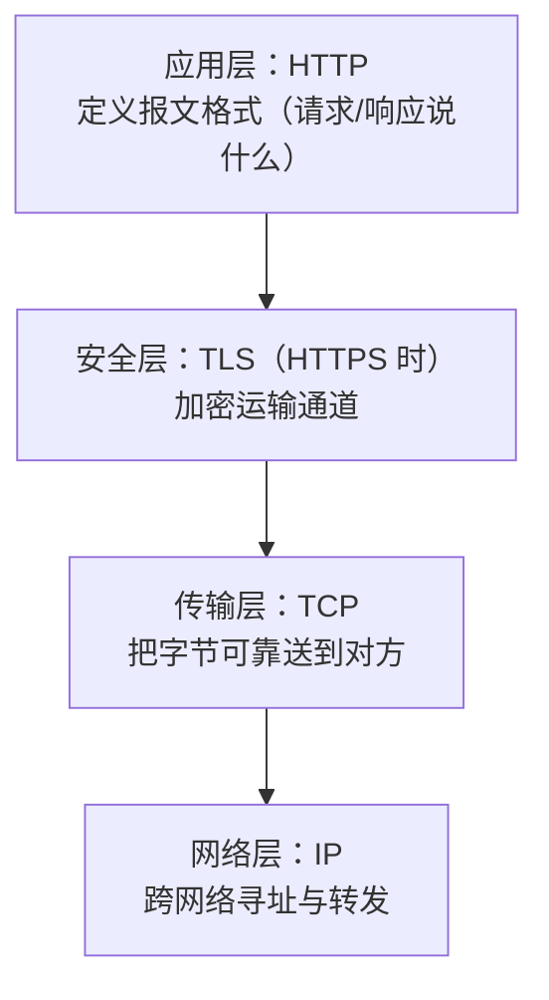
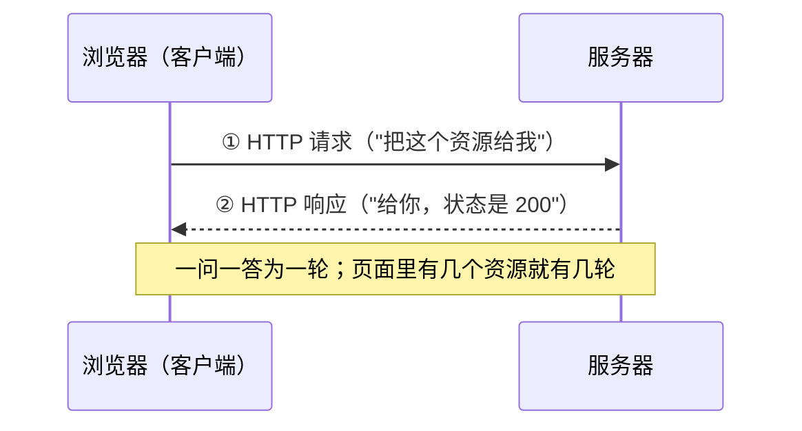
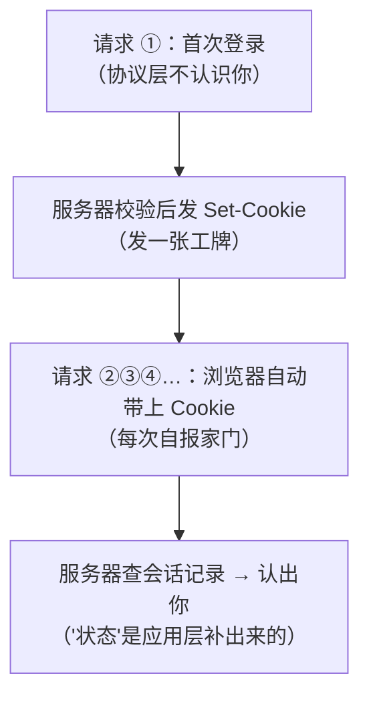
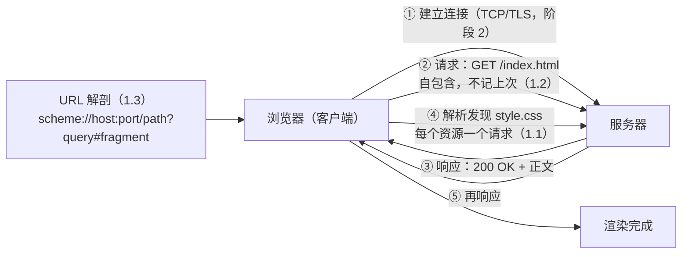

# 第 1 课：一次网页加载的全旅程

> 所属阶段：阶段 1《报文与语义》｜ 水平：入门 ｜ 本课知识点：HTTP 的定位与请求-响应模型、无状态与"状态"的由来、URL 解剖
> 故事情节：小航第一次被问"接口为什么报 500"，发现自己连请求长什么样都没见过

## 🎯 本课目标

- 说清 HTTP 在协议栈中的位置与请求-响应模型，理解"每个资源一个请求"的分工。
- 解释无状态的确切含义与设计动机，知道"状态"由 Cookie 等机制补回。
- 拆解一条 URL 的各个组成部分，说清 URL 编码与保留字符的作用。

---

## 第一幕：起源与场景引入

> 🏛️ **起源**：1989 年 3 月，Tim Berners-Lee 在 CERN 写下提案《Information Management: A Proposal》，想用"超文本"把实验室的资料连起来（核查于 2026-09，见 [W3C 历史档案](http://www.w3.org/History/1989/proposal.html)）。这套系统有四个积木：HTML（写页面）、HTTP（传页面）、WorldWideWeb 浏览器（看页面）、httpd 服务器（发页面），1990 年底全部完成，1991 年 8 月 6 日他在公开新闻组发帖，被视为 World Wide Web 公开项目的起点（核查于 2026-09，[MDN · Evolution of HTTP](https://developer.mozilla.org/en-US/docs/Web/HTTP/Guides/Evolution_of_HTTP)）。当年最早的 HTTP 后来被称为 **HTTP/0.9**——它简单到只有一个方法、没有头部、没有状态码，被称为"一行协议"。

> 🎬 **场景**：小航入职三个月，第一次被叫进会议室——运营说点"提交"按钮没反应，后端说"我日志里啥都没有"，前端说"接口返回了错误啊"。三方吵了半小时，小航发现自己连"接口返回了错误"到底长什么样都没见过。

如果你也是从"会调接口、会看浏览器页面"开始的，那你的起点和小航一样：**每天都在用 HTTP，却没见过它的真身**。这一课我们不去会议室，先跟着一次"网页加载"把全旅程走一遍。

---

## 第二幕：认知冲突

> ❓ **问题**：小航的困惑其实是一串连环问——
>
> 1. 浏览器地址栏里敲个网址、按下回车，**中间到底发生了什么**？数据是怎么从我的电脑"跑"到对方服务器、又把结果带回来的？
> 2. 运营说"页面坏了"、前端说"接口报错"、后端说"日志没有"——**他们说的真的是同一件事吗**？谁的话能当证据？
> 3. 为什么登录过的网站，下次打开还认识我？**HTTP 凭什么记住"我"**？

这三个问题分别对应本课的三个知识点：请求-响应模型（1.1）、无状态（1.2）、URL（1.3）。先把旅程走通，冲突自然解开。

---

## 第三幕：层层揭示

### 知识点 1.1：HTTP 的定位与请求-响应模型

> 本知识点关键点：应用层协议、建立在 TCP/TLS 之上 / 客户端-服务器一问一答 / 每个资源一个请求

#### 一句话定义

HTTP 是一个**应用层**协议：它规定了"客户端"和"服务器"之间**一问一答**传文本（现在也包括二进制）的格式，自己不负责运输——运输交给底下的 TCP/TLS。

#### 直觉建立（类比）

把一次网络请求想成**餐厅点餐**：你（客户端）坐下来，向服务员（服务器）**点单**（请求："来一份宫保鸡丁"），服务员去后厨取了菜**端给你**（响应）。点单和上菜各有一次明确的"你说话 → 他回应"，这就是**请求-响应模型**。

> 💡 **类比的边界**：餐厅服务员认识常客、记得你上次点了什么——但 HTTP 的服务端**默认不记**（这正是知识点 1.2 要讲的"无状态"）。另外服务员把菜端给你靠腿跑，而 HTTP 把数据交给底下的 TCP 去运输，它只管"点单条和菜单上写什么格式"。

#### 核心原理

HTTP 站在协议栈的**应用层**。它只定义"说什么"（报文格式），"怎么运"由下层负责：



一张图看不懂没关系，记住两件事就够了：**HTTPS 不是另一个应用协议**，它还是 HTTP、只是下面垫了 TLS（这一点 RFC 9110 把"语义"与"线格式"分开定义——方法、状态码对所有版本通用，核查于 2026-09）；**"底层"在这门课里是黑盒**，TCP/UDP 的深水区属于网络专题的其他教程。

一次典型的网页加载是这样的一问一答：



第三句口诀——**每个资源一个请求**——是新手最常低估的规律：HTML 文档、样式表、每张图片、每个接口调用，各是一轮独立的请求-响应。下面的实操会让你亲眼看到。

#### 示例演示

我们起一个最小本地服务器，用 `curl` 发一次请求（`curl` 是 macOS 自带的命令行客户端，它和浏览器一样"说 HTTP"）：

```bash
cd /tmp/http-course-demo   # 目录里有一个 index.html，其中引用了 style.css
python3 -m http.server 8123 --bind 127.0.0.1 &
curl -sv http://127.0.0.1:8123/
```

实测输出（本机 macOS，`curl/8.7.1`；`>` 开头的行是 curl 发出的请求，`<` 开头的行是收到的响应，`*` 开头是 curl 自己的注释）：

```text
*   Trying 127.0.0.1:8123...
* Connected to 127.0.0.1 (127.0.0.1) port 8123      ← 先建 TCP 连接（运输层的事）
> GET / HTTP/1.1                                     ← 请求起始行：方法 + 路径 + 版本
> Host: 127.0.0.1:8123
> User-Agent: curl/8.7.1
> Accept: */*
>
* Request completely sent off
< HTTP/1.0 200 OK                                    ← 响应起始行：版本 + 状态码 + 原因短语
< Server: SimpleHTTP/0.6 Python/3.9.6
< Date: Thu, 10 Sep 2026 16:38:12 GMT
< Content-type: text/html
< Content-Length: 189
<
{ [189 bytes data]                                   ← 空行之后是正文（HTML 源码）
<!DOCTYPE html>
<html>
...（正文截断）
```

> ⚠️ **如实说明**：实测里服务器回的是 `HTTP/1.0`——这不是写错了，`python3 -m http.server`（Python 3.9 的 SimpleHTTP）默认按 1.0 应答。浏览器与生产服务器（Nginx、Node 等）默认说 1.1 或更高。**响应行里的版本号会如实告诉你对方在说什么**，这本身就是"看得见报文"的价值。

#### 常见误区

1. **"HTTP 是浏览器专用的"**：curl、手机 App、爬虫、微服务之间的调用，说的都是 HTTP。浏览器只是你最常见的客户端。
2. **"打开一个网页 = 发一次请求"**：错。HTML 文档本身一次，页面里引用的每张图、每个 CSS/JS 文件各一次——"每个资源一个请求"。
3. **"HTTPS 是另一个协议"**：应用语义仍是 HTTP（方法、状态码、报文格式全部通用），只是运输段换成了加密的 TLS 通道。所以学透 HTTP 语义，HTTPS 就只差"加密那部分"。

#### 一句话记住

**HTTP 管一问一答说什么，TCP/TLS 管怎么运到；页面里每个资源，各走一轮请求-响应。**

#### 官方文档

- [RFC 9110 · HTTP Semantics](https://httpwg.org/specs/rfc9110.html)：方法、状态码、报文语义的权威定义（2022-06 发布，Internet Standard STD 97，核查于 2026-09）
- [MDN · HTTP Overview](https://developer.mozilla.org/en-US/docs/Web/HTTP/Guides/Overview)：HTTP 组件与请求-响应模型的官方综述

---

### 知识点 1.2：无状态与"状态"的由来

> 本知识点关键点：无状态的确切含义 / 为什么这样设计（简单、可扩展）/ 状态由 Cookie 等机制补回——为课 13 埋伏笔

#### 一句话定义

HTTP 是**无状态**协议：协议本身不要求服务器记住"上一个请求是谁发的、说了什么"，每个请求都是**自包含**的，服务器收到什么处理什么，处理完即忘。

#### 直觉建立（类比）

无状态的 HTTP 像**自动售货机**：你投币按键，它出货——它不认识你，不记得你五分钟前买过什么，两笔交易完全独立。有状态的系统像**熟客茶馆**：老板记得你爱喝龙井、坐哪个位子，你一进门服务就"接上次"。

> 💡 **类比的边界**：售货机并非毫无记忆——它记得自己还剩几罐货（那是**服务器自己的数据**，存在数据库里）。"无状态"说的是**协议与连接层**不要求、也不提供"跨请求的会话记忆"，而不是"服务器不能存任何数据"。

#### 核心原理

**为什么这样设计？** 1990 年代的设计目标里，简单和可扩展压倒一切（核查于 2026-09，[MDN · Evolution of HTTP](https://developer.mozilla.org/en-US/docs/Web/HTTP/Guides/Evolution_of_HTTP)）。无状态带来三个直接好处：

1. **服务器实现简单**：处理完一个请求就可以丢掉它，不用维护"谁聊到哪了"的会话账本。
2. **天然适合水平扩展**：任何一个请求发给集群里的任何一台机器，处理结果都一样——负载均衡不必"粘住"同一个用户（"粘性会话"恰恰是要额外付钱去解决的问题）。
3. **故障恢复友好**：一台机器挂了，请求转发到另一台即可，没有"会话丢了"的额外灾难。

代价是：**登录、购物车、"记住我"这类需求全都没法靠协议本身实现**。解法是让客户端把"身份凭证"随请求**重新出示**——最经典的就是 Cookie：服务器第一次响应时"发一张工牌"（`Set-Cookie`），浏览器存起来，之后每个请求都**自动戴着工牌来**，服务器由此认人：



注意结论的方向：**"状态"不是 HTTP 自带的，是 Cookie / Session / Token 这些应用层机制在无状态地基上补出来的**。这套机制的细节、安全属性与选型，是阶段 5 课 13 的主题——这里先埋下伏笔。

#### 示例演示

回到刚才的本地服务器。连发两次请求，看服务端日志：

```bash
curl -s http://127.0.0.1:8123/ > /dev/null
curl -s http://127.0.0.1:8123/ > /dev/null
tail -2 server.log
```

实测输出：

```text
127.0.0.1 - - [11/Sep/2026 00:38:12] "GET / HTTP/1.1" 200 -
127.0.0.1 - - [11/Sep/2026 00:38:12] "GET / HTTP/1.1" 200 -
```

两行日志**一模一样、彼此独立**：服务器不知道这两次来自同一个 curl、更不知道你上一秒请求过什么。它对"你"的全部了解，就是请求里写明的那些内容——写什么，它知道什么。

#### 常见误区

1. **"无状态 = 服务器不能保存数据"**：错。用户资料、订单都在数据库里躺着。"无状态"只约束**协议与连接层**不携带跨请求的会话记忆。
2. **"Keep-Alive 长连接让 HTTP 有状态了"**：连接复用只是让运输通道不必反复搭建（课 4 详讲），通道里跑的每个请求依旧自包含——**连接有"延续"，协议无"记忆"**。
3. **"我这接口用了 Session，所以 HTTP 不无状态"**：Session 恰恰是"应用层在无状态地基上补状态"的证据，不是反例。

#### 一句话记住

**HTTP 只认请求不认人：每个请求自包含；登录态、购物车是 Cookie/Session/Token 在协议之上补出来的"状态"。**

#### 官方文档

- [RFC 9110 · HTTP Semantics](https://httpwg.org/specs/rfc9110.html)（§1 与 §3 对 HTTP 架构与"自包含消息"的界定）
- [MDN · HTTP Overview](https://developer.mozilla.org/en-US/docs/Web/HTTP/Guides/Overview)（"HTTP is stateless" 一节的官方表述）

---

### 知识点 1.3：URL 解剖

> 本知识点关键点：scheme/host/port / path、query、fragment / URL 编码与保留字符

#### 一句话定义

URL（统一资源定位符）是"某个资源在网络上**怎么找到**"的完整描述：用哪个协议、找哪台机器、机器上哪个服务、哪个路径、附加什么条件。

#### 直觉建立（类比）

URL 像**一份快递单**：运输方式（scheme：空运还是陆运）、收件小区（host）、小区的哪个岗亭（port）、几栋几零几（path）、对快递员的备注（query："放丰巢，别打电话"）。

> 💡 **类比的边界**：备注（query）是快递员能看到的，但"**只想看包裹里第 3 页说明书**"（fragment）是**你拆开包裹后的私人行为**——快递员从头到尾不知道。URL 里的 fragment（`#` 之后的部分）**不会发送给服务器**，它只在浏览器内部用于页面内定位。这是它与所有其他部件的本质区别。

#### 核心原理

拿一条典型 URL 逐段解剖：

```text
https://news.example.com:8443/tech/ai.html?q=http&page=2#sec-3
└─┬──┘   └──────┬──────┘ └┬─┘ └────┬────┘└──────┬──────┘└─┬──┘
scheme        host      port     path        query    fragment
```

| 部件 | 本例取值 | 作用 | 可省略吗 |
|------|----------|------|----------|
| scheme | `https` | 用什么协议说话（`http` / `https`） | 不可 |
| host | `news.example.com` | 找哪台机器（域名或 IP） | 不可 |
| port | `8443` | 机器上哪个服务（一栋楼里的岗亭号） | 可省——默认端口（http=80、https=443）省略；**非默认必须写** |
| path | `/tech/ai.html` | 服务器上的哪个资源 | 视服务而定 |
| query | `q=http&page=2` | 附加条件，`key=value` 用 `&` 连接 | 可省 |
| fragment | `sec-3` | 页面内定位锚点，**只到浏览器为止** | 可省 |

**URL 编码与保留字符**：URL 语法里 `/ : ? & = #` 这些字符是"语法标点"（保留字符），数据里若真的要用它们（或空格、中文），必须转义成 `%XX` 形式——空格变 `%20`，`=` 变 `%3D`，"中"字的 UTF-8 编码逐字节写成 `%E4%B8%AD`。你平时在地址栏看到中文能直接显示，是**浏览器替你做了编码/解码的展示层**，真正发出去的是编码后的形态。

#### 示例演示

验证"query 会完整到达服务器，而 fragment 不会"。请求本地服务器，带全两样：

```bash
curl -sv "http://127.0.0.1:8123/?page=2&lang=zh#top" 2>&1 | grep '^> GET'
tail -1 server.log
```

实测输出（真实捕获）：

```text
> GET /?page=2&lang=zh HTTP/1.1          ← 请求行里没有 #top
127.0.0.1 - - [11/Sep/2026 00:44:05] "GET /?page=2&lang=zh HTTP/1.1" 200 -
                                          ← 服务器日志同样没有 #top，请求正常 200
```

`#top` 在发出前就被浏览器（curl）剥掉了——fragment 的"私人行为"属性，一眼可见。

#### 常见误区

1. **"fragment 会发给服务器"**：不会。它只在浏览器内部定位页面锚点；前端路由（如 `#/user/1`）正是借这个"不发给服务器"的特性做单页应用的视图切换。
2. **"URL 里不能有中文"**：能"有"，但发出去前必须百分号编码；服务端拿到的是编码形态，要自己解码。排查"带中文参数的接口收不到预期值"，第一件事就是看编码。
3. **"端口写不写无所谓"**：默认端口（80/443）可省，换了端口就必须写——`https://example.com:8443` 丢掉 `:8443` 会连到完全不同的服务上。

#### 一句话记住

**URL = 用什么话（scheme）+ 找谁（host:port）+ 要什么（path）+ 附加条件（query）+ 自己看哪（fragment，不出门）；数据混进语法字符就要 %XX 编码。**

#### 官方文档

- [WHATWG · URL Standard](https://url.spec.whatwg.org/)：URL 语法与解析的现行权威规范（本课涉及的 host/port/path/query 术语定义处）
- [MDN · HTTP Overview](https://developer.mozilla.org/en-US/docs/Web/HTTP/Guides/Overview)（URL 在请求中的角色）

---

## 第四幕：实操验证

> 本节命令在本机 macOS 实测通过（curl 8.7.1 / Python 3.9.6），输出均为真实捕获、仅做截断标注。

三步走完整旅程，把三个知识点一次串起来。

### 步骤 1：准备演示目录并起服务器

```bash
mkdir -p /tmp/http-course-demo && cd /tmp/http-course-demo
cat > index.html <<'EOF'
<!DOCTYPE html>
<html>
<head>
  <meta charset="utf-8">
  <title>HTTP 课 1 演示页</title>
  <link rel="stylesheet" href="style.css">
</head>
<body>
  <h1>hello HTTP</h1>
</body>
</html>
EOF
cat > style.css <<'EOF'
h1 { color: #1565C0; }
EOF
python3 -m http.server 8123 --bind 127.0.0.1 &
```

> 注意 `index.html` 里引用了 `style.css`——浏览器加载这个页面时**注定要发不止一个请求**。

### 步骤 2：像浏览器一样，把页面和它引用的样式表各请求一次

```bash
curl -sv http://127.0.0.1:8123/ 2>&1 | grep -E '^(\* Connected|> GET|< HTTP|< Content-type)'
curl -sv http://127.0.0.1:8123/style.css 2>&1 | grep -E '^(\* Connected|> GET|< HTTP|< Content-type)'
tail -2 server.log
```

实测输出（真实捕获）：

```text
* Connected to 127.0.0.1 (127.0.0.1) port 8123
> GET / HTTP/1.1
< HTTP/1.0 200 OK
< Content-type: text/html
* Connected to 127.0.0.1 (127.0.0.1) port 8123
> GET /style.css HTTP/1.1
< HTTP/1.0 200 OK
< Content-type: text/css
127.0.0.1 - - [11/Sep/2026 00:38:12] "GET / HTTP/1.1" 200 -
127.0.0.1 - - [11/Sep/2026 00:38:12] "GET /style.css HTTP/1.1" 200 -
```

> ✅ **回扣场景**：`GET /` 拿回的 HTML 里写着 `<link rel="stylesheet" href="style.css">`——浏览器解析到这一行，就会**再发一轮请求**去取它。这就是"每个资源一个请求"：运营口中的"页面打不开"，拆开看是 N 轮请求-响应，每一轮都可能单独出问题。

### 步骤 3：请求一个不存在的资源，看服务器怎么"表态"

```bash
curl -sv http://127.0.0.1:8123/missing.js 2>&1 | grep -E '^(> GET|< HTTP)'
tail -1 server.log
```

实测输出（真实捕获）：

```text
> GET /missing.js HTTP/1.1
< HTTP/1.0 404 File not found
127.0.0.1 - - [11/Sep/2026 00:38:12] code 404, message File not found
127.0.0.1 - - [11/Sep/2026 00:38:12] "GET /missing.js HTTP/1.1" 404 -
```

> ✅ **回扣场景**：`404`——服务器明确"表态"了。会议室里那场"接口报错"的架，第一份证据就该是这行状态码：它把"资源不存在"（大概率前端 URL 写错或路径没上线）和"服务器炸了"（5xx）区分开。方法与状态码的完整语言，课 3 展开。

---

## 第五幕：体系收束

> 📍 **全局定位**：本课是阶段 1《报文与语义》的开篇。全课程的地图是：**阶段 1** 看得见请求 → **阶段 2** 连接与加密 → **阶段 3** 缓存与性能 → **阶段 4** 协议演进 → **阶段 5** 认证联调与决策。本课建立的"请求-响应 / 无状态 / URL"三块地基，后面每一阶段都要回来踩一脚。
>
> 🔗 **下一步**：本课你只看到了报文的"门面"（起始行 + 几个头）。下节课《报文解剖：请求与响应长什么样》把报文**完整拆开**——起始行、头部、空行、正文四段结构，以及那些你天天见却叫不出作用的高频头部（Host、Content-Type、User-Agent……）。`curl -v` 输出里 `>` 和 `<` 之间那个空行，就是下节课的主角之一。
>
> 另外，两个伏笔请留心：① 无状态的"状态补回"（Cookie）——阶段 5 课 13；② query 与 URL 编码在缓存、排查里的影响——阶段 3 课 7。

---

## 🐞 常见误区

1. **"接口报错先怀疑后端"**：报错是**请求-响应**的产物，先看状态码与报文归属：4xx 多半是请求方的问题（参数、URL、凭证），5xx 才倾向服务端。没有报文就没有发言权——这正是本课教你看 `curl -v` 的原因。
2. **"HTTPS 和 HTTP 是两套要分别学的协议"**：语义（方法/状态码/头部）是同一套（RFC 9110 通用定义，核查于 2026-09），HTTPS 只是换了加密的运输通道。把 HTTP 语义学扎实，阶段 2 的 TLS 只需新增"加密与信任"一块。
3. **"URL 只是地址栏里那串字符，没有语法"**：URL 有严格的语法（保留字符、编码规则、fragment 的特殊性）。"中文参数乱码""带 `&` 的参数被截断"这类高频 bug，根子都在这里。

## 一图总结



## 📋 命令速查卡

| 命令 | 用途 | 坑 |
|------|------|-----|
| `python3 -m http.server 8123 --bind 127.0.0.1` | 在当前目录起最小 HTTP 服务器（实验用） | 仅限本地实验；Python 3.9 的 SimpleHTTP 以 **HTTP/1.0** 应答，别被响应行版本号迷惑；结束用 `kill %1` 或 Ctrl+C |
| `curl -sv <URL>` | 发请求并显示请求/响应全过程 | `-v` 的信息走 stderr，`2>&1` 不能省；`>` = 发出的请求、`<` = 收到的响应、`*` = curl 注释 |
| `curl -s -o /dev/null -w "%{http_code}" <URL>` | 只取状态码（脚本友好） | `-o /dev/null` 丢弃正文，只留状态码 |
| `tail -f server.log` | 实时盯服务器日志 | `http.server` 的访问日志走 stderr，实验时记得重定向到文件 |
| URL 中的 `#fragment` | 页面内锚点 | 浏览器/curl **发出前就剥掉**，服务端永远收不到 |
| URL 中的中文 / 空格 / 保留字符 | 数据混入语法字符 | 必须百分号编码（`%20`、`%3D`…），直接贴原始中文 URL 到 curl 是高频报错源 |

## 课后小测

**Q1**：一个 HTML 页面引用了 1 个 CSS 文件和 2 张图片，浏览器至少要发起几轮 HTTP 请求-响应？

- A. 1 轮，所有内容打包进一个响应
- B. 2 轮，HTML 一轮、"其余资源"合并一轮
- C. 4 轮，HTML、CSS、两张图片各一轮
- D. 取决于网速，网速快可以合并

<details><summary>答案与解析</summary>

**答案：C**。每个资源一个请求——HTML 本身一轮，解析到 `<link>` 与 `` 后各再发一轮。网速影响的是每轮的耗时与并发方式（阶段 4 会讲 HTTP/2 如何在一轮连接上复用，但"资源各自成请求"的语义不变）。

</details>

**Q2**：以下对"HTTP 无状态"的理解，哪个是正确的？

- A. 服务器不能在数据库里保存用户数据
- B. 服务器不记得"上一个请求是谁发的"，每个请求必须自包含
- C. 用了 Keep-Alive 长连接，HTTP 就有状态了
- D. 无状态意味着无法实现登录功能

<details><summary>答案与解析</summary>

**答案：B**。无状态约束的是协议层：服务器不依赖"上一个请求"的记忆来处理当前请求。A 错——数据存库与应用层补状态都不违反无状态；C 错——连接复用不等于会话记忆；D 错——Cookie/Session/Token 正是为"补状态"而生的（课 13 展开）。

</details>

**Q3**：URL `https://example.com:8443/api/list?page=2#top` 中，**不会**被发送到服务器的是哪个部分？

- A. `:8443`
- B. `/api/list`
- C. `?page=2`
- D. `#top`

<details><summary>答案与解析</summary>

**答案：D**。fragment（`#` 之后）只在浏览器内部用于页面锚点定位，发出请求前就被剥掉了——本课实操步骤已实测验证。A、B、C 都会出现在请求行与服务器日志里。

</details>

## 📌 知识点导航

| 知识点 | 关键点 | 状态 |
|--------|--------|------|
| 1.1 HTTP 的定位与请求-响应模型 | 应用层协议、建立在 TCP/TLS 之上 / 客户端-服务器一问一答 / 每个资源一个请求 | ✅ 已完成（2026-09-11） |
| 1.2 无状态与"状态"的由来 | 无状态的确切含义 / 为什么这样设计（简单、可扩展）/ 状态由 Cookie 等机制补回——为课 13 埋伏笔 | ✅ 已完成（2026-09-11） |
| 1.3 URL 解剖 | scheme/host/port / path、query、fragment / URL 编码与保留字符 | ✅ 已完成（2026-09-11） |

## 🚀 下一批接力提示词

> 学完本课后，**复制下面这段文字发给 AI**，即可无缝进入下一课（无需重新描述上下文）：

```
继续学 HTTP。我的学习档案在 network/http/00-学习档案.md，
刚学完阶段 1《报文与语义》的课《一次网页加载的全旅程》知识点 1.1、1.2、1.3，
请按大纲继续讲解下一课《报文解剖：请求与响应长什么样》（2.1 报文四段结构、2.2 高频头部速览、2.3 正文的表达）。
```

## 🧭 课程导航

➡️ **下一课**：[课 2：报文解剖：请求与响应长什么样](lesson-02-报文解剖.md)

📚 **返回目录**：[课程目录](../../../02-课程目录.md)
