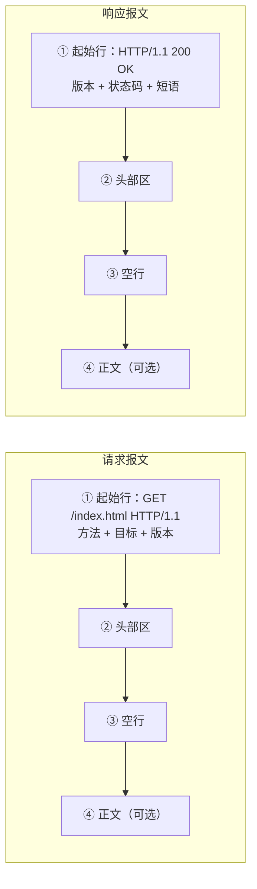
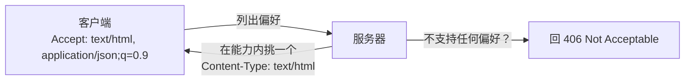
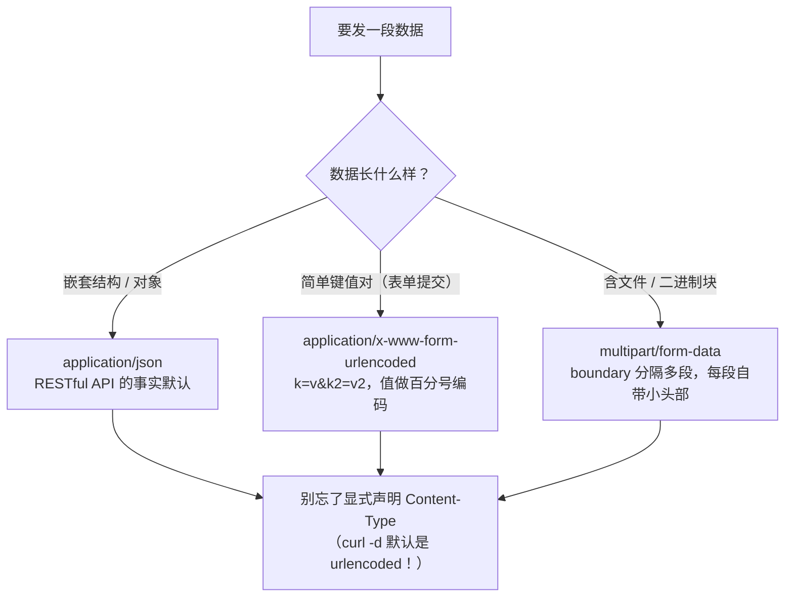
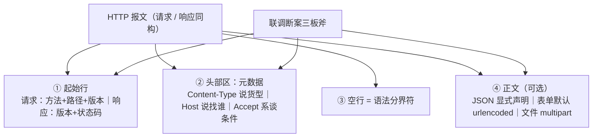

# 第 2 课：报文解剖：请求与响应长什么样

> 所属阶段：阶段 1《报文与语义》｜ 水平：入门 ｜ 本课知识点：报文四段结构、高频头部速览、正文的表达
> 故事情节：小航打开 DevTools Network 面板，第一次"看见"报文

## 🎯 本课目标

- 把一条 HTTP 报文按"四段结构"完整拆开，说清每段的语法角色（尤其空行是分界符，不是留白）。
- 认出十个最高频的头部，知道它们各自回答报文的什么问题、踩过什么坑。
- 为一份数据选对正文类型（JSON / 表单 / 文件上传），并解释 Content-Type 写错为什么会让后端"装死"。

---

## 第一幕：起源与场景引入

> 🏛️ **起源**：HTTP 报文的"头 + 正文"两段式结构不是拍脑袋发明的——它承袭自互联网早期的电子邮件格式（RFC 9112 原文自述报文格式 *similar to Internet Message Format*，核查于 2026-09）。你今天在每个请求里写的 `Host: xxx`，和几十年前邮件里的 `From: xxx` 是同一个设计思路：**正文之外的一切说明，都放进"头部栏位"**。

> 🎬 **场景**：小航按课 1 学会了 `curl -v`，这次他打开浏览器的 DevTools Network 面板，点开一个接口——扑面而来十几行 `Content-xxx`、`Accept-xxx`，还有一堆看不懂的符号。他盯着屏幕问出两个问题：**这些行从哪读起？前端传的"参数"到底在报文的哪里？**

---

## 第二幕：认知冲突

> ❓ **问题**：联调群里刚发生了一场真实对话——
>
> - 前端："我明明传了 `{"qty": 2}`，你后端解析出来的 qty 怎么是字符串 `'2'`？"
> - 后端："我收到的根本不是 JSON，是 `qty=2&...`。"
> - 小航：两边代码看起来都没错，**数据在半路上变了吗？**

答案藏在报文里：**没有看懂报文的四段结构，就分不清"数据"和"数据的说明书"；没看懂 Content-Type，就永远在猜服务器按什么方式解读你的数据。** 本课结束，这场架一分钟断案。

---

## 第三幕：层层揭示

### 知识点 2.1：报文四段结构

> 本知识点关键点：起始行（方法+URL+版本 / 版本+状态码）/ 头部区 / 空行分隔 / 正文区

#### 一句话定义

HTTP 报文只有四段：**起始行 → 头部区 → 空行 → 正文（可选）**——请求和响应共用这套结构，只有起始行长得不一样。

#### 直觉建立（类比）

把报文想成一份**公文**：第一行是标题（起始行：这事是什么），下面是抬头各栏（头部：编号、密级、抄送——一项一栏），然后一条**分隔横线**（空行），横线以下是正文。注意：那条横线不是排版装饰，**它是"抬头到此为止"的语法分界**。

> 💡 **类比的边界**：公文的正文一定是文字，HTTP 的正文可以是任何字节流（图片、压缩包、加密数据）；另外 HTTP 对"栏位顺序"基本不挑——头部行之间先后无关紧要，公文格式可没这么随意。

#### 核心原理

RFC 9112 用一行 ABNF 写死了这个结构（核查于 2026-09）：

```text
HTTP-message = start-line CRLF *( field-line CRLF ) CRLF [ message-body ]
```

翻译成中文：**起始行 + 换行，若干行头部各带换行，再一个换行（=空行），可选的正文**。"空行指示头部区结束"是规范原文级别的表述。用上一课的回显器看一条真实请求（服务端视角，正文里没有秘密）：

```text
POST /api/orders HTTP/1.1            ← ① 起始行：方法 + 路径 + 版本
Host: 127.0.0.1:8200                 ← ② 头部区开始：每一行「名字: 值」
User-Agent: curl/8.7.1
Accept: */*
Content-Type: application/json
Content-Length: 27
                                     ← ③ 空行：头部结束的「语法分界符」
{"user":"xiaohang","qty":2}          ← ④ 正文：27 字节的 JSON
```

请求与响应的差异**只在起始行**，其余三段完全同构：



三条被规范钉死的语法细节（均有 RFC 9112 原文依据，核查于 2026-09）：

1. **字段名大小写不敏感**，冒号与字段名之间**不允许有空格**（`Content-Length : 5` 是非法写法）。
2. **HTTP/1.1 请求必须带 `Host`**：规范原文 *"A client MUST send a Host header field in all HTTP/1.1 request messages"*；缺失、重复或非法时服务器应回 **400**。一台机器挂多个网站（虚拟主机）全靠它区分。
3. **正文多长由谁说了算**：优先看 `Content-Length`（字节数）；用了 `Transfer-Encoding: chunked`（分块）则以"零长度块"收尾。两者同时出现时 **Transfer-Encoding 覆盖 Content-Length**——规范特别提醒这类报文可能是请求走私攻击的信号。

#### 示例演示

用课 1 的思路起一个"报文回显器"——它把你发的请求**原样**作为响应体还给你，等于给你一台"报文 X 光机"（脚本见第四幕，Python 标准库实现）：

```bash
curl -s http://127.0.0.1:8200/index.html -H 'X-Demo: hello'
```

实测输出（真实捕获；无正文，所以没有 Content-Length 行）：

```text
GET /index.html HTTP/1.1
Host: 127.0.0.1:8200
User-Agent: curl/8.7.1
Accept: */*
X-Demo: hello                        ← 自定义头原样到达（"自报家门"可以自定义）
```

#### 常见误区

1. **"空行可有可无"**：它是四段结构的分界符。手工用 `nc`/`telnet` 构造请求时忘了敲空行，服务器会一直傻等头部结束——这是调试自造报文时的第一嫌疑。
2. **"字段名大小写敏感，写错就废"**：规范明确不敏感（`content-type` 与 `Content-Type` 等价）。但个别老服务端实现"写得很认真"，别依赖它的宽容——按惯例首字母大写最稳。
3. **"起始行的版本号是我说了算的开关"**：请求行里的 `HTTP/1.1` 是"我想这么说"；响应行里的版本是"对方实际说的"。上一课 SimpleHTTP 用 1.0 应答的实验已经证明：**以响应行版本为准去理解对方**。

#### 一句话记住

**起始行说事、头部递条子、空行画界线、正文装货；HTTP/1.1 没有 Host 直接 400。**

#### 官方文档

- [RFC 9112 · HTTP/1.1](https://httpwg.org/specs/rfc9112.html)：报文 ABNF、Host 强制要求、正文定界（§2.1 / §3.2 / §6.3）
- [MDN · HTTP Messages](https://developer.mozilla.org/en-US/docs/Web/HTTP/Guides/Messages)：报文结构的官方图文讲解

---

### 知识点 2.2：高频头部速览

> 本知识点关键点：Host 与虚拟主机 / Accept 系与内容协商 / User-Agent 与 Referer 的作用与隐私

#### 一句话定义

头部是报文的**元数据层**：正文之外的一切说明——我是谁、要什么、给的是什么、该怎么处理——全部以「名字: 值」逐行陈述。

#### 直觉建立（类比）

头部像快递面单上**除地址外的全部栏位**：寄件人（User-Agent）、保价声明、易碎标记、到付指令。仓库（服务器）先读面单栏位决定怎么处理，才会拆包（解析正文）。

> 💡 **类比的边界**：面单栏位是快递公司印好的，HTTP 头部却是**开放的**——标准注册了几十个（MDN 收录 100+），任何人还可以自定义新头（课 3 演示里的 `X-Demo: hello` 就是我们自己编的）。HTTP 对此有扩展性约定：**接收方应当忽略自己不认识的字段名而不是报错**，代理则须原样转发——新头因此能逐步铺开、老服务器不受影响（机制定位：RFC 9110 §5.1 与 §16.3，核查于 2026-09）。

#### 核心原理

按"回答报文的什么问题"分四类，先记全表再挑重点：

| 类别 | 头部 | 回答的问题 | 高频坑 |
|------|------|-----------|--------|
| 报文自身 | `Content-Type` | 正文是什么类型 | **最常背错**：`-d` 默认发 urlencoded（本课实操实测），JSON 必须显式声明 |
| 报文自身 | `Content-Length` | 正文多少字节 | 是**字节数**不是字符数，中文 UTF-8 一字 3 字节 |
| 报文自身 | `Transfer-Encoding: chunked` | 正文分块流式到达 | 与 Content-Length 双写 = 走私攻击信号（RFC 9112 警告） |
| 协商 | `Accept` / `Accept-Encoding` / `Accept-Language` | 客户端能要什么 | 质量因子 `q=0.9` 表偏好权重（课 8 压缩时实战） |
| 身份/上下文 | `Host` | 找的是哪台机器上的哪个站 | HTTP/1.1 必填；虚拟主机的钥匙 |
| 身份/上下文 | `User-Agent` | 客户端是什么程序 | **UA 冻结/削减**：现代浏览器刻意降低信息量，别拿它做精确识别 |
| 身份/上下文 | `Referer` | 从哪个页面点过来的 | 拼写少了 `r` 是**历史笔误**，作为头名必须这么写（防伪：`Referrer-Policy` 是另一个头） |
| 身份/上下文 | `Cookie` / `Origin` | 带着什么身份 / 从哪个源来 | 分别是课 13、课 14 的主角，先混个脸熟 |
| 控制 | `Connection`、`Cache-Control` | 连接怎么管 / 缓存怎么存 | 分别是课 4、课 7 的主角 |

**内容协商**是 Accept 系的工作方式：客户端列偏好（可带权重），服务器在能力范围内挑一个，结果用 `Content-Type`/`Content-Encoding` 告知——一来一回，谈成"本次用什么"：



#### 示例演示

验证"Host 是客户端自报的栏位"——把它改写成别的域名再发：

```bash
curl -s http://127.0.0.1:8200/ -H 'Host: api.example.com'
```

实测输出（真实捕获）：

```text
GET / HTTP/1.1
Host: api.example.com                 ← 改写生效：服务器看到的 Host 是你声明的值
User-Agent: curl/8.7.1
Accept: */*
```

> 这既是虚拟主机的工作原理（一台服务器按 Host 分发站点），也是安全课的伏笔：**Host 是"自报家门"，Host 头注入类攻击正是利用了这一点**——信任它之前，先想想它是谁写的。

#### 常见误区

1. **"字段名不敏感，所以值也不敏感"**：值通常敏感——`Content-Type` 的值写错类型就错，认证头里的 Base64 凭证差一个字符都过不了。
2. **"Referer 是笔误，我写 Referrer 才对"**：作为请求头名必须写 `Referer`（1990 年代规范里的历史笔误，将错就错三十年）；`Referrer-Policy` 是另一个控制来源泄露的头，别混。
3. **"自定义头必须加 `X-` 前缀"**：这曾是社区惯例，2012 年起规范明确不再建议（RFC 6648，核查于 2026-09）——自定义头直接起语义化名字即可（如 GitHub API 的 `X-GitHub-*` 也是历史产物）。
4. **"UA 能精确判断用户设备"**：现代浏览器的 UA 正被刻意"冻结"（信息量递减，官方路线见 MDN *User-agent reduction*），识别需求正转向 Client Hints（`Sec-CH-UA-*` 系）。

#### 一句话记住

**头部是报文的"面单栏位"：Content-Type 说货是什么，Host 说找哪个站，Accept 系谈条件，UA/Referer 说我是谁从哪来。**

#### 官方文档

- [MDN · Headers 总目录](https://developer.mozilla.org/en-US/docs/Web/HTTP/Reference/Headers)：全部标准头的官方速查
- [MDN · Host](https://developer.mozilla.org/en-US/docs/Web/HTTP/Reference/Headers/Host) ｜ [MDN · Content-Type](https://developer.mozilla.org/en-US/docs/Web/HTTP/Reference/Headers/Content-Type) ｜ [MDN · Referer](https://developer.mozilla.org/en-US/docs/Web/HTTP/Reference/Headers/Referer) ｜ [MDN · User-Agent](https://developer.mozilla.org/en-US/docs/Web/HTTP/Reference/Headers/User-Agent)

---

### 知识点 2.3：正文的表达

> 本知识点关键点：Content-Type 决定解读方式 / 表单 urlencoded 与 JSON / multipart 文件上传

#### 一句话定义

正文是"货"，`Content-Type` 是"货的说明书"——同一串字节，声明不同，服务器按完全不同的方式解读。

#### 直觉建立（类比）

给仓库寄包裹却不贴"易碎/生鲜/图书"标签，仓库只能靠猜。`Content-Type: application/json` 就是贴上"易碎品——请按 JSON 规程拆箱"。

> 💡 **类比的边界**：HTTP 的标签**靠客户端自觉声明**，服务器未必信——它可以"嗅探"内容自己猜（MIME sniffing），嗅探行为本身有安全风险，所以又有 `X-Content-Type-Options: nosniff` 这个头去禁止嗅探（阶段 5 安全部分再展开）。

#### 核心原理

入门阶段 90% 的正文属于三种表达，选型看"发的是什么"：



三种表达的正文长相（均为实测真实输出，见第四幕）：

| 类型 | 正文长相 | 谁在用 |
|------|----------|--------|
| `application/json` | `{"user":"xiaohang","qty":2}` | 现代 API 的默认选择 |
| `application/x-www-form-urlencoded` | `name=xiaohang&qty=2` | 浏览器原生 `<form>` 的默认 |
| `multipart/form-data; boundary=…` | 用 boundary 切成多段，**文件段自带文件名与类型** | 文件上传（`<input type="file">`、`curl -F`） |

multipart 的关键在 **boundary（边界符）**：它是客户端**为本次请求现场生成**的随机字符串，写在 `Content-Type` 里预告给服务器，正文里用它把各段隔开、末尾以 `--boundary--` 收束——服务器因此能把"文件内容"和"表单字段"干净地分开，哪怕文件内容里恰好也包含类似文本。

#### 示例演示

三种表达各发一次，用回显器看服务端视角（真实捕获）：

**JSON**（注意 `Content-Length: 27` 是字节数，也注意 curl 不显式声明时的默认行为——见第五个实验）：

```text
POST /api/orders HTTP/1.1
Host: 127.0.0.1:8200
User-Agent: curl/8.7.1
Accept: */*
Content-Type: application/json
Content-Length: 27

{"user":"xiaohang","qty":2}
```

**multipart 文件上传**（`curl -F 'f=@note.txt'`，单次完整捕获）：

```text
POST /upload HTTP/1.1
Host: 127.0.0.1:8200
User-Agent: curl/8.7.1
Accept: */*
Content-Length: 231
Content-Type: multipart/form-data; boundary=------------------------zEIavHYoUHA9hliiVNMVcP

--------------------------zEIavHYoUHA9hliiVNMVcP
Content-Disposition: form-data; name="f"; filename="note.txt"
Content-Type: text/plain

course demo file
line 2 of note.txt

--------------------------zEIavHYoUHA9hliiVNMVcP--
```

**最高频的坑**：`curl -d` **不显式声明类型**时，curl 默认贴上 urlencoded 标签（真实捕获）：

```text
POST /form HTTP/1.1
Host: 127.0.0.1:8200
User-Agent: curl/8.7.1
Accept: */*
Content-Length: 19
Content-Type: application/x-www-form-urlencoded

name=xiaohang&qty=2
```

> 这就是第二幕那场联调架的标准答案：前端以为自己在发 JSON，工具/代码默认贴了 urlencoded 标签，后端按标签解读——**数据没变，是"说明书"贴错了**。

#### 常见误区

1. **"POST 就是发 JSON 的"**：POST 只是方法，正文类型完全由 Content-Type 声明决定；JSON 只是 RESTful 时代的习惯默认。
2. **"Content-Length 是字符数"**：是**字节数**。`{"user":"小航"}` 实测 17 字节而不是 13 字符（`wc -c` / `wc -m` 验证）——中文 UTF-8 每字 3 字节。手写长度声明必错，交给工具生成。
3. **"boundary 可以自己编一个固定的"**：它是本次请求的随机分隔符，客户端生成、通过 Content-Type 预告；写死固定值有"文件内容恰好包含它"的撞车风险，交给库生成。
4. **"没有正文就不写 Content-Length，有正文可以不写"**：前半对（GET 通常无正文无此头），后半错——有正文就必须 `Content-Length` 或 `Transfer-Encoding: chunked` 二选一，否则服务器不知道正文到哪结束。

#### 一句话记住

**Content-Type 是货的说明书：JSON 显式声明、表单默认 urlencoded、文件必须 multipart；长度永远是字节数。**

#### 官方文档

- [MDN · Content-Type](https://developer.mozilla.org/en-US/docs/Web/HTTP/Reference/Headers/Content-Type) ｜ [MDN · Content-Length](https://developer.mozilla.org/en-US/docs/Web/HTTP/Reference/Headers/Content-Length)
- [MDN · MIME types](https://developer.mozilla.org/en-US/docs/Web/HTTP/Guides/MIME_types)（类型体系）｜ [MDN · MIME 常见类型速查](https://developer.mozilla.org/en-US/docs/Web/HTTP/Guides/MIME_types/Common_types)

---

## 第四幕：实操验证

> 本节命令在本机 macOS 实测通过（curl 8.7.1 / Python 3.9.6），输出均为真实捕获、仅做截断标注。

### 步骤 1：准备"报文 X 光机"（回显器）

```bash
mkdir -p /tmp/http-course-demo2 && cd /tmp/http-course-demo2
cat > note.txt <<'EOF'
course demo file
line 2 of note.txt
EOF
cat > echo_request.py <<'PY'
# 报文回显器：把收到的 HTTP 请求原文作为响应体返回
import socket

srv = socket.socket(socket.AF_INET, socket.SOCK_STREAM)
srv.setsockopt(socket.SOL_SOCKET, socket.SO_REUSEADDR, 1)
srv.bind(("127.0.0.1", 8200))
srv.listen(5)
print("echo server listening on 127.0.0.1:8200", flush=True)

while True:
    conn, _ = srv.accept()
    buf = b""
    while b"\r\n\r\n" not in buf:          # 读完头部：以空行（\r\n\r\n）为界
        chunk = conn.recv(4096)
        if not chunk:
            break
        buf += chunk
    head, _, rest = buf.partition(b"\r\n\r\n")
    length = 0
    for line in head.decode("iso-8859-1", "replace").split("\r\n")[1:]:
        if line.lower().startswith("content-length:"):   # 头部名不区分大小写
            length = int(line.split(":", 1)[1].strip())
    while len(rest) < length:              # 按 Content-Length 读完正文
        rest += conn.recv(4096)
    body = rest[:length]
    request_text = head.decode("iso-8859-1", "replace") + "\r\n\r\n" + body.decode("utf-8", "replace")
    resp = ("HTTP/1.1 200 OK\r\n"
            "Content-Type: text/plain; charset=utf-8\r\n"
            f"Content-Length: {len(request_text.encode('utf-8'))}\r\n"
            "Connection: close\r\n\r\n" + request_text)
    conn.sendall(resp.encode("utf-8"))
    conn.close()
PY
python3 echo_request.py &
```

> 脚本只有 30 行，却完整演示了知识点 2.1 的三件事：**用空行找头部结束、按 Content-Length 读正文、头部名大小写不敏感**（`line.lower()`）。它同时是"服务端如何解析报文"的最小示范。

### 步骤 2：发三种正文，看服务端收到什么

```bash
# JSON
curl -s http://127.0.0.1:8200/api/orders -X POST \
  -H 'Content-Type: application/json' -d '{"user":"xiaohang","qty":2}'
# 文件上传
curl -s http://127.0.0.1:8200/upload -X POST -F 'f=@note.txt'
# curl 默认类型（不加 -H）
curl -s http://127.0.0.1:8200/form -X POST -d 'name=xiaohang&qty=2'
```

预期与实测一致（真实捕获，完整输出见知识点 2.3）：JSON 报文里 `Content-Length: 27`；multipart 报文里出现随机 boundary 与 `filename="note.txt"`；第三条请求贴的是 `Content-Type: application/x-www-form-urlencoded`。

> ✅ **回扣场景**：联调架上"数据在半路变了吗"——没有。第三条请求证明：**不显式声明时 curl 默认贴 urlencoded 标签**，后端按标签解读，JSON 解析器根本不会被触发。以后断这类案，第一步就是把双方报文的 `Content-Type` 和正文贴出来对质。

### 步骤 3：改写 Host，体会"自报家门"

```bash
curl -s http://127.0.0.1:8200/ -H 'Host: api.example.com'
```

实测输出（真实捕获）：

```text
GET / HTTP/1.1
Host: api.example.com
User-Agent: curl/8.7.1
Accept: */*
```

> ✅ **回扣场景**：服务器对"你在找哪个网站"的全部认知来自你声明的 Host——虚拟主机靠它工作，Host 相关的安全问题也从这里长出来。现在小航看得见报文了，联调群里他发的不再是"我这边没问题啊"，而是具体的一行行证据。

---

## 第五幕：体系收束

> 📍 **全局定位**：本课把报文"黑盒"整个打开了——四段结构是全课程的地基：**阶段 3** 的缓存全部发生在头部区（`Cache-Control`、`ETag`），**阶段 5** 的认证全部发生在头部区（`Cookie`、`Authorization`）、CORS 也全在头部里做文章。看不懂头部，后面每一阶段都悬空。
>
> 🔗 **下一步**：报文的"形"看完了，下一课《方法与状态码：接口对话的语言》看报文的"意"——起始行里那两个动词（方法、状态码）如何精确表达"我想干什么"与"我办成了没有"，顺带解决"该返 400 还是 401"的联调群千古之争。
>
> 三个伏笔请留心：① `Origin` / MIME 嗅探与安全 → 阶段 5；② `Cookie` → 课 13；③ `Transfer-Encoding: chunked` 与连接管理 → 阶段 2 课 4、阶段 4 课 10。

---

## 🐞 常见误区

1. **"参数对不上肯定是代码 bug"**：先看 `Content-Type` 与正文的实际形态是否一致（本课实测证明 curl `-d` 的默认类型就会"背刺"你），再查代码。
2. **"报文是给机器看的，人肉读太累"**：DevTools 的 Headers 面板有 **view source / view parsed** 两个视图切换——parsed 是浏览器整理过的表格，view source 才是原始报文。定位诡异问题时永远回到 view source。
3. **"头部越多越好，信息全塞进去"**：每个头部都要过网络、过解析；非标准头越多，缓存与中间层的不可预测行为越多（`Vary` 的坑在课 7 等）。

## 一图总结



## 📋 命令速查卡

| 命令 | 用途 | 坑 |
|------|------|-----|
| `curl -d '{"a":1}' -H 'Content-Type: application/json' <URL>` | 发 JSON | **`-d` 默认贴 urlencoded 标签**，JSON 必须显式 `-H` 改写（本课实测） |
| `curl -F 'f=@note.txt' <URL>` | multipart 文件上传 | curl 自动生成随机 boundary 与 Content-Type，别手写 |
| `curl -d 'a=1&b=2' <URL>` | 发表单键值对 | 默认即 urlencoded；含中文/特殊字符用 `--data-urlencode` 让 curl 代编 |
| `curl -H 'Host: api.example.com' <URL>` | 改写 Host（实验虚拟主机/排查） | 自报家门可伪造——排查时用它模拟不同站点请求 |
| `curl -H 'X-Demo: hello' <URL>` | 加自定义头 | 接收方按扩展性约定会忽略不认识的头，收到与否用回显器验证 |
| `python3 echo_request.py &` | 起报文回显器（本课脚本） | 只回显不解析业务；实验完 `kill %1`；端口被占用时换端口 |

## 课后小测

**Q1**：手工构造请求时，服务器一直不响应，最可能漏了四段结构中的哪一段？

- A. 起始行
- B. 某个头部行
- C. 头部区结束的空行
- D. 正文

<details><summary>答案与解析</summary>

**答案：C**。空行是"头部结束"的语法分界符（RFC 9112 的 ABNF 里它是结构的一部分）。没有它，服务器认为你还没说完头部，会一直等。本课回显器脚本里的 `while b"\r\n\r\n" not in buf` 就是这套机制的服务端视角。

</details>

**Q2**：后端说"收到的不是 JSON"，前端用 curl 发的是 `-d '{"user":"xiaohang"}'` 且**没有**加 Content-Type 头。最可能的原因是？

- A. JSON 语法错误
- B. curl `-d` 默认声明了 `application/x-www-form-urlencoded`，后端按表单解析
- C. 网络传输中字节被修改
- D. POST 方法不支持 JSON

<details><summary>答案与解析</summary>

**答案：B**。本课实测：`curl -d` 不显式声明时默认贴 `Content-Type: application/x-www-form-urlencoded`。正文一个字节没变，变的是"说明书"。修复：`-H 'Content-Type: application/json'`。

</details>

**Q3**：关于 multipart/form-data 的 boundary，下列说法正确的是？

- A. 它是 HTTP 协议规定的固定分隔符
- B. 它由客户端为本次请求随机生成，并通过 Content-Type 预告给服务器
- C. 它由服务器生成后下发
- D. 文件内容必须避开字符 `-`

<details><summary>答案与解析</summary>

**答案：B**。boundary 是本次请求的"现场约定"：客户端生成、写在 Content-Type 里预告，正文用它分段、以 `--boundary--` 收束。本课两次实测的 boundary 各不相同，正说明它每次随机。A/C 方向反了，D 无此要求（随机长 boundary 使撞车概率可忽略）。

</details>

## 📌 知识点导航

| 知识点 | 关键点 | 状态 |
|--------|--------|------|
| 2.1 报文四段结构 | 起始行（方法+URL+版本 / 版本+状态码）/ 头部区 / 空行分隔 / 正文区 | ✅ 已完成（2026-09-11） |
| 2.2 高频头部速览 | Host 与虚拟主机 / Accept 系与内容协商 / User-Agent 与 Referer 的作用与隐私 | ✅ 已完成（2026-09-11） |
| 2.3 正文的表达 | Content-Type 决定解读方式 / 表单 urlencoded 与 JSON / multipart 文件上传 | ✅ 已完成（2026-09-11） |

## 🚀 下一批接力提示词

> 学完本课后，**复制下面这段文字发给 AI**，即可无缝进入下一课（无需重新描述上下文）：

```
继续学 HTTP。我的学习档案在 network/http/00-学习档案.md，
刚学完阶段 1《报文与语义》的课《报文解剖：请求与响应长什么样》知识点 2.1、2.2、2.3，
请按大纲继续讲解下一课《方法与状态码：接口对话的语言》（3.1 方法语义、3.2 状态码五大类、3.3 重定向 3xx）。
```

## 🧭 课程导航

⬅️ **上一课**：[课 1：一次网页加载的全旅程](lesson-01-一次网页加载的全旅程.md)

➡️ **下一课**：[课 3：方法与状态码：接口对话的语言](lesson-03-方法与状态码.md)

📚 **返回目录**：[课程目录](../../../02-课程目录.md)
