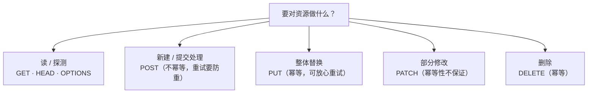
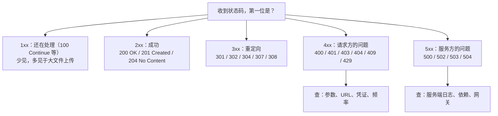
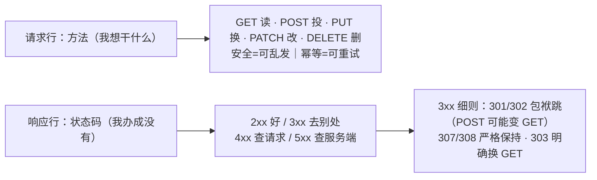

# 第 3 课：方法与状态码：接口对话的语言

> 所属阶段：阶段 1《报文与语义》｜ 水平：入门 ｜ 本课知识点：方法语义、状态码五大类、重定向 3xx
> 故事情节：联调群争论"该返 400 还是 401"，小航学会用方法与状态码精确表达

## 🎯 本课目标

- 说清五个常用方法各自"想对资源做什么"，并能用安全性与幂等性判断"这个请求重发有没有危险"。
- 用状态码五大类给问题"归口"，记住高频状态码及其配套响应头。
- 说清 301/302 与 307/308 在"方法保持"上的关键差异，避免重定向悄悄吃掉你的 POST。

---

## 第一幕：起源与场景引入

> 🎬 **场景**：联调群周五傍晚炸了。运营报障"提交订单失败"，前端贴出截图：接口返回 **400**。后端冷淡回复："参数错了，重试。"前端不服："用户明明填完了，凭什么说是参数错？是不是该 401？还是 500？"三方吵到下班没有结论——**状态码写错一个数字，锅就飞向完全不同的人**。

上一课你已经能把报文拆成四段了。现在把镜头对准起始行里的两个"动词"：请求行开头的**方法**（我想干什么）和响应行开头的**状态码**（我办成了没有）。它们是客户端与服务器之间唯一强制、唯一标准化的"对话语言"。

---

## 第二幕：认知冲突

> ❓ **问题**：小航的三个困惑——
>
> 1. GET、POST、PUT、DELETE、PATCH……**凭什么这个动作用这个方法**？用错会怎样，服务器又不拦？
> 2. 状态码一百多个，**怎么记得住**？"接口报错"到底该看哪一位数字？
> 3. 301 和 302 都见过，307、308 又是什么？为什么有的重定向会把 POST **悄悄变成 GET**，表单数据凭空消失？

这三个问题的答案都在同一处：**方法的语义**与**状态码的分类学**。学完本课，"该返 400 还是 401"将不再是吵架题，而是查表题。

---

## 第三幕：层层揭示

### 知识点 3.1：方法语义

> 本知识点关键点：GET/POST/PUT/DELETE/PATCH / 安全性与幂等性 / 方法与 RESTful 资源设计

#### 一句话定义

方法声明的是**这次请求想对目标资源执行的动作**——它不是语法摆设，而是服务器、缓存、爬虫、浏览器都会据此行动的语义承诺。

#### 直觉建立（类比）

把资源想成一份**文档，方法是你在窗口递的单子**：GET 是"借阅复印"（拿走一份，原件不动）、POST 是"投递新材料"（柜台收下，往里加东西）、PUT 是"整体换新"（旧文档抽走，新文档整页换上）、PATCH 是"批注修改"（只改某几行）、DELETE 是"销毁申请"。

> 💡 **类比的边界**：方法只是"申请"，服务器完全可能拒绝——但两件东西是方法**自带**的、服务器不能选择放弃的性质：**安全性**与**幂等性**。它们决定了缓存器敢不敢缓存、网络抖动后敢不敢自动重试。

#### 核心原理

两条性质先用规范定义说清（RFC 9110 §9.2，稳定语义，核查于 2026-09）：

- **安全性（safe）**：只读不写——请求"只做检索"，服务器状态不应因此改变。安全方法：**GET、HEAD、OPTIONS、TRACE**。
- **幂等性（idempotent）**：同一请求执行一次和执行 N 次，**服务器的最终状态相同**。幂等方法：所有安全方法外加 **PUT、DELETE**；**POST 不幂等**；**PATCH 默认不作幂等保证**（RFC 5789）。

| 方法 | 想做什么 | 安全 | 幂等 | 典型用途 |
|------|----------|:----:|:----:|----------|
| GET | 读取资源 | ✅ | ✅ | 查列表、查详情、打开网页 |
| HEAD | 只要头部不要正文（GET 的"只看标题"版） | ✅ | ✅ | 探测资源存在/大小 |
| OPTIONS | 问服务器"这里支持什么" | ✅ | ✅ | CORS 预检（课 14 主角） |
| POST | 提交数据，让服务器处理 | ❌ | ❌ | 创建订单、提交表单 |
| PUT | 整体替换目标资源 | ❌ | ✅ | 上传/覆盖一个完整对象 |
| PATCH | 部分修改资源 | ❌ | ❌ | 只改某个字段 |
| DELETE | 删除资源 | ❌ | ✅ | 删订单、删文件 |

**为什么幂等性值钱？** 网络世界里"请求发出去了，响应没回来"是常态。幂等方法可以**放心自动重试**：PUT 重发三次，结果和一次一样；POST 重发三次，可能创建三个订单——所以支付场景要靠幂等键（如 `Idempotency-Key` 头）给 POST 人工补上幂等性。这就是"方法选错，重试策略就错"的因果。

**RESTful 一句话**：用 URL 表达**资源**（名词），用方法表达**动作**（动词）——`GET /orders/42` 读、`DELETE /orders/42` 删，而不是 `GET /deleteOrder?id=42` 把动词塞进 URL。方法语义是 REST 的约束之一，但"用对了方法"不等于"架构就是 REST"。



#### 示例演示

用"状态码游乐场"（第四幕）回显方法——方法就是请求行的第一个词，服务器看得很清楚（真实捕获，五次独立请求）：

```text
echo: GET /echo
echo: POST /echo
echo: PUT /echo
echo: DELETE /echo
echo: PATCH /echo
```

#### 常见误区

1. **"GET 绝对安全，不会改数据"**：规范说 GET **应当**只做检索；但"应当"靠服务端自律。危险在于：缓存器、预加载器、爬虫会**自作主张主动触发 GET**——把"删除/扣款"藏在 GET 里，等于让全世界都有权替用户下单。它曾造成过真实事故（爬虫顺手触发删除链接）。
2. **"PUT 和 PATCH 区别是新 vs 旧"**：不是版本关系。PUT 是**整体替换**（只带 name 不带 age，age 就没了）；PATCH 是**部分修改**（只动你带的字段）。
3. **"方法用错了服务器会报错"**：不会。语义靠服务端自觉遵守——你完全可以给 POST 加名字叫 GET 的参数。方法错了不报错，但**缓存、重试、爬虫、浏览器预取会按正确语义行动**，于是行为诡异。语义是给整个生态看的，不只给服务端。

#### 一句话记住

**方法是动作的语义承诺：GET 借阅、POST 投递、PUT 换新、PATCH 批注、DELETE 销毁；安全的可以随便发，幂等的可以放心重试。**

#### 官方文档

- [RFC 9110 · 方法定义](https://httpwg.org/specs/rfc9110.html#method.definitions)：8 个标准方法的权威语义（含安全/幂等判定）
- [MDN · Allow](https://developer.mozilla.org/en-US/docs/Web/HTTP/Reference/Headers/Allow)：405 时服务器用什么头告诉你允许哪些方法

---

### 知识点 3.2：状态码五大类

> 本知识点关键点：1xx–5xx 的分野 / 高频状态码速查（200/204/301/302/304/400/401/403/404/409/429/500/502/503）/ 状态码是排查的第一现场

#### 一句话定义

状态码是服务器对请求结果的**三位数字裁决**：第一位定大类（结果还是错误、谁的责任），后两位定具体情形。

#### 直觉建立（类比）

状态码像**医院的分诊台**：1xx"先别走，还有后续"、2xx"办好了"、3xx"这个窗口不办，去那边"（重定向）、4xx"你单子填得不对"（请求方问题）、5xx"我们内部出故障了"（服务方问题）。**先看大类，就知道该谁去查**——这正是联调吵架的终结者。

> 💡 **类比的边界**：分诊台说"你去 3 号窗口"不等于 3 号窗口一定办成（3xx 之后还有后续请求）；"你单子填错"（4xx）也不排除是服务器把单子格式说错了——**大类给方向，不终结结论**。

#### 核心原理

五大类的记忆锚点（RFC 9110 §15）：



高频状态码速查（**配套响应头**是它们的"用法说明"，一起记）：

| 状态码 | 含义 | 配套头 / 备注 |
|--------|------|---------------|
| 200 OK | 成功 | —— |
| 201 Created | 创建成功 | `Location` 指向新资源 |
| 204 No Content | 成功但无正文 | **响应没有正文也没有 Content-Length**（本课实测） |
| 301 / 302 | 永久 / 临时重定向 | `Location`；方法切换问题见 3.3 |
| 304 Not Modified | 协商缓存命中 | 课 7 主角 |
| 400 Bad Request | 请求语法/参数错误 | 与 401 的区别是本课场景吵架点 |
| 401 Unauthorized | **未认证**（不知道你是谁） | `WWW-Authenticate: …`（本课实测）；课 13 认证入口 |
| 403 Forbidden | **已认证但无权限**（知道你是谁，不让你看） | 没有配套头，通常也不该重试 |
| 404 Not Found | 资源不存在 | 也常被用来"隐藏存在性" |
| 409 Conflict | 与资源当前状态冲突 | 并发修改场景（课 11 之外的状态码伙伴） |
| 429 Too Many Requests | 请求太频繁 | `Retry-After: 秒数`（本课实测） |
| 500 Internal Server Error | 服务端代码炸了 | 看服务端日志 |
| 502 / 504 | **网关**收到无效响应 / 等待上游超时 | 网关还活着、后面的应用挂了或太慢——课 9 代理网关的重点 |
| 503 Service Unavailable | 服务暂不可用（过载/维护） | `Retry-After` |

#### 示例演示

"状态码游乐场"实测（真实捕获）——注意**错误码 + 配套头**是一起到达的：

**401 与 405**（服务器不仅说"不行"，还说"该怎么做"）：

```text
HTTP/1.0 401 Unauthorized
WWW-Authenticate: Basic realm="demo"
...
HTTP/1.0 405 Method Not Allowed
Allow: GET, POST
...
```

**429**（"等多久再试"写在头里）：

```text
HTTP/1.0 429 Too Many Requests
Retry-After: 3
...
```

**204**（成功但无正文——注意响应里**没有** Content-Length 与 Content-Type）：

```text
HTTP/1.0 204 No Content
Server: BaseHTTP/0.6 Python/3.9.6
Date: Thu, 10 Sep 2026 16:59:00 GMT

```

#### 常见误区

1. **"404 一定是 URL 写错"**：也可能资源确实被删了；不少系统故意把 403 伪装成 404（不暴露"这个资源存在但你没权限"）。404 是"结论"，不是"原因"。
2. **"200 就万事大吉"**：200 只是"传输层成功"。很多老接口用 200 包着 `{"code": -1, "msg": "fail"}`——**"HTTP 200 + 业务失败"**的双层结构是真实世界的常态，排查时两层都要看。
3. **"401 和 403 差不多，随便用一个"**：401 = "先亮证件"（未认证），403 = "证件看了，不行"（无权限）。第一幕吵架案的标准答案：用户没登录就是 401，登录了但越权才是 403，参数格式坏是 400——**三句话终结吵架**。

#### 一句话记住

**第一位定责任归属：2xx 办好了、3xx 去别处、4xx 查请求、5xx 查服务端；错误码常带配套头，告诉你"下一步怎么办"。**

#### 官方文档

- [RFC 9110 · 状态码总览](https://httpwg.org/specs/rfc9110.html#overview.of.status.codes)：五大类与每个状态码的规范定义
- [MDN · Retry-After](https://developer.mozilla.org/en-US/docs/Web/HTTP/Reference/Headers/Retry-After) ｜ [MDN · WWW-Authenticate](https://developer.mozilla.org/en-US/docs/Web/HTTP/Reference/Headers/WWW-Authenticate) ｜ [MDN · Allow](https://developer.mozilla.org/en-US/docs/Web/HTTP/Reference/Headers/Allow)

---

### 知识点 3.3：重定向 3xx

> 本知识点关键点：301/302 与 307/308 的方法保持差异 / Location 头 / 重定向链对性能的影响

#### 一句话定义

3xx 是服务器在说"这事我不在这办，去 `Location` 指的地方"——其中 301/302/307/308 的关键分野是：**换地址之后，你的请求方法还作数吗？**

#### 直觉建立（类比）

政务大厅的窗口引导：**301/308 是"本窗口永久撤并"**（以后都别再来了，直接去新址）；**302/307 是"今天临时换窗口"**（明天可能还回老窗口）。但还有个历史包袱要单独讲：老窗口（301/302） historically 会把"递交材料的申请"（POST）**自动改写成"去新窗口咨询"（GET）**——材料被丢在了地上。

> 💡 **类比的边界**：把 POST 换成 GET 的不是规范**要求**，而是浏览器**几十年兼容惯例**——早期规范措辞含糊，浏览器为了用户体验自行改写，后来积重难返。307/308 正是为了纠正这个包袱而生。curl 会模仿浏览器的这套行为（下有实测），但可用参数强制改回。

#### 核心原理

| 状态码 | 永久/临时 | 跟随后方法 | 诞生 | 一句话用法 |
|--------|-----------|------------|------|------------|
| 301 Moved Permanently | 永久 | **可能被改为 GET**（浏览器与 curl 的兼容行为） | HTTP/1.1（RFC 2616，1999） | 域名迁移、URL 永久改版 |
| 302 Found | 临时 | **可能被改为 GET**（同上） | HTTP/1.1（RFC 2616，1999） | 临时跳转（登录后回跳等） |
| 303 See Other | 临时 | **明确改为 GET** | HTTP/1.1 | PRG 模式（提交后跳结果页） |
| 307 Temporary Redirect | 临时 | **严格保持原方法** | HTTP/1.1（RFC 2616，1999） | 临时跳转且**不想丢 POST** |
| 308 Permanent Redirect | 永久 | **严格保持原方法** | RFC 7538（2015） | 永久迁移且**不想丢 POST**（核查于 2026-09） |

三条实操级规则：

1. **方法保持性**：301/302 是"历史包袱"（POST 大概率变 GET，正文丢弃）；307/308 是"严格遵守"（方法与正文原样带到新地址）。给 API 或表单做跳转，用 307/308；给页面 URL 迁移做跳转，301 最合适（浏览器会**缓存** 301——这正是课 7 缓存话题的一个惊喜前奏）。
2. **Location 头**是 3xx 的标配：告诉客户端"去哪"。没有 Location 的 3xx 对客户端没有可执行信息。
3. **重定向链有成本**：每一跳都是一轮完整请求-响应（各含一次往返）。`a.com → www.a.com → https://www.a.com → /home` 的四跳链，首字节时间被放大四倍——重定向链尽量在一跳内解决（课 8 测量时你会亲眼看到跳数在瀑布图里的样子）。

#### 示例演示

游乐场实测（真实捕获）——**同一个 POST 请求，四种走法四种命运**：

**① POST 撞上 301，跟随（curl 模仿浏览器）**：

```bash
curl -s -L -d 'qty=2' http://127.0.0.1:8300/status/301
```

```text
arrived at /final with method GET        ← 方法被换成了 GET！
```

**② 同一请求，加 `--post301` 强制保持方法**：

```text
arrived at /final with method POST       ← curl 参数强制保住 POST
```

**③ POST 撞上 307，跟随**：

```text
arrived at /final with method POST       ← 307 天然严格保持
```

**④ 一个 curl 冷知识陷阱**：`-X POST -L` 会把**每一跳都强制成 POST**（连 301 后也保持）——服务端日志显示 `POST /status/301` → `POST /final`。`-X` 覆盖一切方法协商，用它做重定向实验会得出错误结论。

#### 常见误区

1. **"301/302 随手用，反正都会跳"**：两件事会被它咬到——POST 数据在跟随中**悄悄变 GET 丢失**（表单提交后莫名变成空白查询页）；301 被浏览器**长期缓存**，改错了很难收回（课 7 讲完缓存你会彻底明白为什么）。
2. **"重定向会带上原来的请求体"**：301/302 跟随时方法换成 GET，**原 POST 正文被丢弃**；要保住正文用 307/308。
3. **"跟着跳就是了，链长点无所谓"**：每跳一 RTT，移动弱网下链式重定向是首屏延迟的隐形大户；且中间任何一跳返回错误，整条链就断在那。

#### 一句话记住

**301/302 是"历史包袱"（POST 可能变 GET），307/308 严格保持方法；跳一次一 RTT，链子能短则短。**

#### 官方文档

- [RFC 9110 · 重定向 3xx](https://httpwg.org/specs/rfc9110.html#redirection.3xx)：各重定向码的规范语义
- [MDN · Redirections](https://developer.mozilla.org/en-US/docs/Web/HTTP/Guides/Redirections)：重定向体系官方指南（含 301/302/307/308 选择逻辑）
- [MDN · Location](https://developer.mozilla.org/en-US/docs/Web/HTTP/Reference/Headers/Location)

---

## 第四幕：实操验证

> 本节命令在本机 macOS 实测通过（curl 8.7.1 / Python 3.9.6），输出均为真实捕获、仅做截断标注。

### 步骤 1：准备"状态码游乐场"

```bash
mkdir -p /tmp/http-course-demo3 && cd /tmp/http-course-demo3
cat > playground_server.py <<'PY'
# 状态码游乐场：按路径返回指定状态码，/final 回显实际到达的方法
from http.server import BaseHTTPRequestHandler, HTTPServer


class Handler(BaseHTTPRequestHandler):
    def _send(self, code, headers=(), body=b""):
        self.send_response(code)
        for k, v in headers:
            self.send_header(k, v)
        if code != 204:  # RFC 9110：204 必须无正文，不带 Content-Length
            self.send_header("Content-Length", str(len(body)))
            self.send_header("Content-Type", "text/plain; charset=utf-8")
        self.end_headers()
        if body and code != 204:
            self.wfile.write(body)

    def handle_any(self):
        p, method = self.path, self.command
        if p.startswith("/status/"):
            code = int(p.split("/")[2])
            headers, body = [], f"you requested status {code} via {method}".encode()
            if code in (301, 302, 303, 307, 308):
                headers = [("Location", "/final")]
            elif code == 401:
                headers = [("WWW-Authenticate", 'Basic realm="demo"')]
            elif code == 405:
                headers = [("Allow", "GET, POST")]
            elif code in (429, 503):
                headers = [("Retry-After", "3")]
            if code == 204:
                body = b""
            self._send(code, headers, body)
        elif p == "/final":
            self._send(200, [], f"arrived at /final with method {method}".encode())
        else:
            self._send(200, [], f"echo: {method} {p}".encode())

    do_GET = do_POST = do_PUT = do_DELETE = do_PATCH = handle_any


HTTPServer(("127.0.0.1", 8300), Handler).serve_forever()
PY
python3 playground_server.py &
```

> 这台小服务器支持 `GET/POST/PUT/DELETE/PATCH`，按 `/status/编号` 返回任意状态码并自动带上"该码该有的配套头"——它本身就是"状态码 + 配套头"知识点的可运行教材。

### 步骤 2：五种方法过一遍（回扣 3.1）

```bash
for m in GET POST PUT DELETE PATCH; do curl -s -X $m http://127.0.0.1:8300/echo; echo; done
```

实测输出（真实捕获）：

```text
echo: GET /echo
echo: POST /echo
echo: PUT /echo
echo: DELETE /echo
echo: PATCH /echo
```

### 步骤 3：读"状态码 + 配套头"（回扣 3.2）

```bash
curl -si http://127.0.0.1:8300/status/204   # 成功但无正文
curl -si http://127.0.0.1:8300/status/401   # 未认证 → WWW-Authenticate
curl -si -X DELETE http://127.0.0.1:8300/status/405   # 方法不允许 → Allow
curl -si http://127.0.0.1:8300/status/429   # 太频繁 → Retry-After
```

实测输出（真实捕获，节选关键字段）：

```text
HTTP/1.0 204 No Content                      ← 无正文、无 Content-Length

HTTP/1.0 401 Unauthorized
WWW-Authenticate: Basic realm="demo"

HTTP/1.0 405 Method Not Allowed
Allow: GET, POST

HTTP/1.0 429 Too Many Requests
Retry-After: 3
```

> ✅ **回扣场景**：第一幕"400 还是 401"的吵架，现在有了可运行的判决流程——先看大类定责任（4xx 查请求方），再看具体码定性质（401 = 没亮证件），最后读配套头定动作（`WWW-Authenticate` 告诉前端该弹登录框）。三步，吵架变查表。

### 步骤 4：重定向方法实验（回扣 3.3，本课最重要的一组实验）

```bash
curl -s -L -d 'qty=2' http://127.0.0.1:8300/status/301        # POST 撞 301
curl -s -L -d 'qty=2' --post301 http://127.0.0.1:8300/status/301  # 强制保持
curl -s -L -d 'qty=2' http://127.0.0.1:8300/status/307        # POST 撞 307
```

实测输出（真实捕获）：

```text
arrived at /final with method GET       ← 301 跟随后 POST 变 GET，正文丢了
arrived at /final with method POST      ← --post301 强制保住
arrived at /final with method POST      ← 307 天然严格保持
```

> ✅ **回扣场景**：为什么"提交订单后偶发变成查询页"？——提交接口 302 到结果页时，POST 被换成 GET。答案不在业务代码里，在**协议的历史包袱**里。以后做跳转，先问一句：**要不要保方法？**要，就 307/308。

---

## 第五幕：体系收束

> 📍 **全局定位**：至此**阶段 1《报文与语义》收官**。回头看这三个月（三课）的路：课 1 把"看不见的请求"变成旅程（请求-响应 / 无状态 / URL），课 2 把报文拆成四段并认出了头部的元数据层，课 3 读懂了起始行里两个动词的语义。你现在手里有一套完整工具：**看得见 → 拆得开 → 读得懂**。
>
> 🔗 **下一步**：阶段 2《连接与安全》回答旅程中被我们按下不表的下半场——数据**怎么运过去**（TCP 连接为什么贵、队头阻塞是什么）以及**凭什么安全**（TLS 加密、证书信任）。先学连接再学加密，因为加密正是架在连接之上。如果你对本阶段没有把握，先自测：**不翻讲义，能说清"该返 400 还是 401 还是 403"吗？能解释 POST 过 301 会发生什么吗？**能，就上阶段 2。
>
> 三个伏笔已埋：`WWW-Authenticate` 与 401 → 阶段 5 课 13 认证；301 的浏览器缓存 → 课 7；502/504 的网关视角 → 课 9。

---

## 🐞 常见误区

1. **"接口报错就重试"**：重试前先问方法幂等吗——GET/PUT/DELETE 可安全重试；POST 盲目重试会重复下单。429 的正确姿势是按 `Retry-After` 等，500 系先看服务端。
2. **"状态码只要 200 就行"**：错误语义被吞进 200 的正文里，缓存器、重试器、网关监控全部失明（它们只看状态码）。让每一层各司其职，状态码该是多少就是多少。
3. **"重定向是前端的事"**：301/302/307 是**服务器下发**的指令，配 `Location` 头；把跳转全堆给前端 JS 做会丢失"浏览器与爬虫直接理解"的能力。

## 一图总结



## 📋 命令速查卡

| 命令 | 用途 | 坑 |
|------|------|-----|
| `curl -X PUT/DELETE/PATCH <URL>` | 发非 GET/POST 方法 | `-X` 强制**所有**请求（含重定向后续跳）用同一方法，做跳转实验时结论会失真 |
| `curl -d 'a=1' <URL>` | 发表单（隐式 POST） | 跟随 301/302 时自动转 GET、正文丢弃（curl 模仿浏览器） |
| `curl --post301/--post302/--post307 <URL>` | 重定向后强制保持 POST | 与 `-X` 区分：这是"保留原方法"，`-X` 是"强制改写" |
| `curl -si <URL>` | 响应含头部一起看 | 状态码 + 配套头（Location/Allow/Retry-After/WWW-Authenticate）必须连读 |
| `curl -s -o /dev/null -w "%{http_code}" <URL>` | 脚本只取状态码 | 配合 `-w "%{num_redirects}"` 还能看跟随了几跳 |
| `python3 playground_server.py &` | 起状态码游乐场 | `GET /status/编号` 任意试错；实验完 `kill %1` |

## 课后小测

**Q1**：用户已登录，但访问了别人的订单详情。接口应该返回哪个状态码？

- A. 400 Bad Request
- B. 401 Unauthorized
- C. 403 Forbidden
- D. 404 Not Found

<details><summary>答案与解析</summary>

**答案：C**。401 = 未认证（不知道你是谁，应弹出登录）；403 = 已认证但无权限（知道你是谁，不让你看）；400 = 请求本身语法/参数错误。D 是"存在性隐藏"的特殊用法，常规场景不选。

</details>

**Q2**：`curl -s -L -d 'a=1' https://api.example.com/submit` 收到 301 并跳转到 `/new`。最终 `/new` 收到的请求方法是什么？

- A. POST，正文原样带到
- B. GET，原 POST 正文被丢弃
- C. POST，但正文为空
- D. 取决于服务器

<details><summary>答案与解析</summary>

**答案：B**。301/302 有"历史包袱"：curl（模仿浏览器）跟随后把 POST 换成 GET。本课实测：`arrived at /final with method GET`。要保住 POST 用 307/308，或 curl 加 `--post301`。

</details>

**Q3**：支付接口要求"同笔订单重复提交绝不产生两次扣款"。以下哪个方案**不依赖**幂等性就能达成目标？

- A. 用 PUT 提交支付请求，靠幂等性天然防重
- B. 用 POST 提交，附带全局唯一的幂等键（如 `Idempotency-Key` 头），服务端按键去重
- C. 用 POST 提交，客户端失败后绝不重试
- D. 用 GET 提交，反正 GET 幂等

<details><summary>答案与解析</summary>

**答案：B**。POST 本身不幂等，幂等键是给 POST 人工补幂等的标准做法。A 看似可行，但支付语义上"创建扣款"是 POST 型动作且服务端实现未必幂等，靠方法语义防重不可靠；C 牺牲了可用性（网络抖动一次就失败）；D 语义完全错误，且 GET 会被缓存与预取器主动触发，等于邀请全世界帮你扣款。

</details>

## 📌 知识点导航

| 知识点 | 关键点 | 状态 |
|--------|--------|------|
| 3.1 方法语义 | GET/POST/PUT/DELETE/PATCH / 安全性与幂等性 / 方法与 RESTful 资源设计 | ✅ 已完成（2026-09-11） |
| 3.2 状态码五大类 | 1xx–5xx 的分野 / 高频状态码速查（200/204/301/302/304/400/401/403/404/409/429/500/502/503）/ 状态码是排查的第一现场 | ✅ 已完成（2026-09-11） |
| 3.3 重定向 3xx | 301/302 与 307/308 的方法保持差异 / Location 头 / 重定向链对性能的影响 | ✅ 已完成（2026-09-11） |

## 🚀 下一批接力提示词

> 🎉 **本阶段完成！** 学完本课后，**复制下面这段文字发给 AI**，进入阶段 2（建议先做上方阶段自测再继续）：

```
继续学 HTTP。我的学习档案在 network/http/00-学习档案.md，
阶段 1《报文与语义》三课（课 1 网页加载全旅程 / 课 2 报文解剖 / 课 3 方法与状态码）已全部完成，
请按大纲进入阶段 2《连接与安全》，从课 4《连接管理：握手、复用与队头阻塞》开始
（4.1 TCP 连接的建立成本、4.2 Keep-Alive 与连接复用、4.3 HTTP/1.1 的队头阻塞）。
```

## 🧭 课程导航

⬅️ **上一课**：[课 2：报文解剖：请求与响应长什么样](lesson-02-报文解剖.md)

➡️ **下一课**：[课 4：连接管理：握手、复用与队头阻塞](../../2-连接与安全/lessons/lesson-04-连接管理与队头阻塞.md)

📚 **返回目录**：[课程目录](../../../02-课程目录.md)
