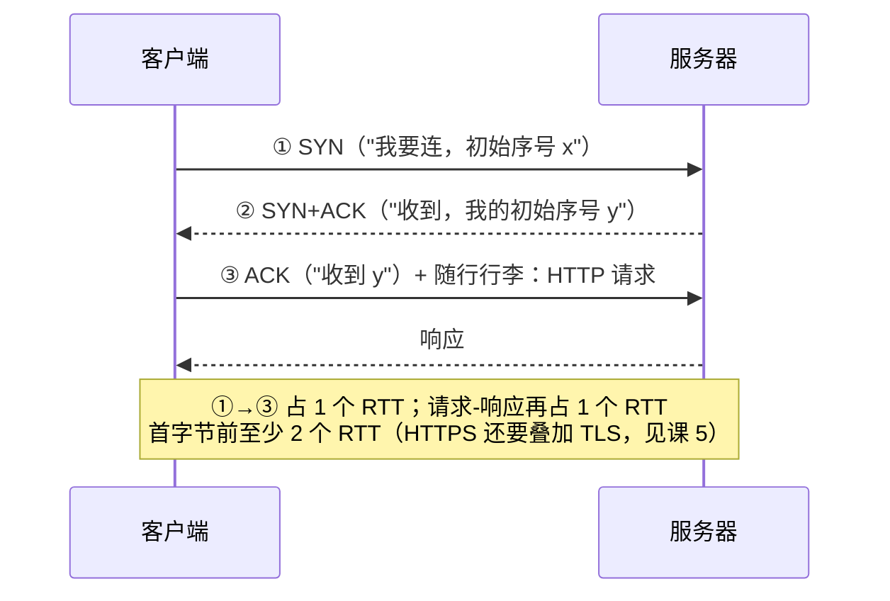
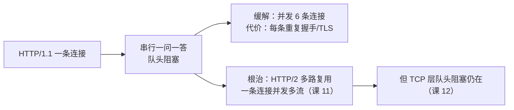
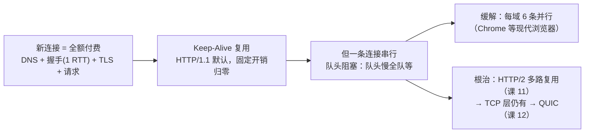

# 第 4 课：连接管理：握手、复用与队头阻塞

> 所属阶段：阶段 2《连接与安全》｜ 水平：入门 ｜ 本课知识点：TCP 连接的建立成本、Keep-Alive 与连接复用、HTTP/1.1 的队头阻塞
> 故事情节：页面首屏慢，小航发现每个请求都在重新"握手"——建立连接本身是要花钱的

## 🎯 本课目标

- 算清一次 TCP 连接从三次握手到建立的成本，解释"为什么要少建连接"。
- 解释 Keep-Alive 如何复用连接，以及浏览器并发连接数限制从何而来。
- 指出 HTTP/1.1 队头阻塞的根源，说清管线化为什么失败。

> ⚠️ 本阶段（连接与安全）是全课程认知最陡的一段，本课涉及 TCP 概念，节奏放慢：先记住结论与实测数字，协议细节的"为什么"允许分两次消化。

---

## 第一幕：起源与场景引入

> 🏛️ **起源**：HTTP 最早的模型是**短连接**——每个请求各建一条 TCP 连接，用完即断（MDN 原文：*"Each HTTP request is completed on its own connection; this means a TCP handshake happens before each HTTP request"*，核查于 2026-09）。为省下重复握手，**持久连接（keep-alive）早在 HTTP/1.1 之前就被设计出来**（*"the concept of a persistent connection has been designed, even prior to HTTP/1.1"*），到 HTTP/1.1 成为默认。这条"先加补丁、再转正"的路线，是理解本课所有机制的时间轴。

> 🎬 **场景**：小航的页面首屏要发 30 个请求。他盯着 DevTools 瀑布图发呆：带宽升级过、CPU 闲着、服务器日志显示每个接口都很快——**页面为什么还是慢？** 放大瀑布图，他发现每个请求前面都有一小段"深色的等待"，而且 30 个请求排成了长队。

---

## 第二幕：认知冲突

> ❓ **问题**：小航的困惑，三层递进——
>
> 1. 请求还没发出去，时间花在哪了？**建立连接这件事本身要花多少时间、花在哪里？**
> 2. 30 个请求难道要建 30 条连接、付 30 次握手费？**有没有办法一次付清、反复使用？**
> 3. 就算复用了连接，瀑布图里请求为什么还是**一个接一个排队**，而不是齐头并进？

三个问题对应三个知识点：握手成本（4.1）、连接复用（4.2）、队头阻塞（4.3）。

---

## 第三幕：层层揭示

### 知识点 4.1：TCP 连接的建立成本

> 本知识点关键点：三次握手 / RTT 与延迟 / 为什么要少建连接

#### 一句话定义

TCP 建连需要客户端与服务器来回确认**三次**（最后一个确认可与请求同行）——这份成本按**往返时间（RTT）**计算，与带宽无关，且每个新连接都要重新支付。

#### 直觉建立（类比）

给远方朋友打固定电话：拨号、响铃、接通——**线路确认完毕你才能说正事**。三次握手就是这段"喂？——喂，我听到了。——好，开始说。"的确认过程。

> 💡 **类比的边界**：握手不只是"确认双方在线"。它的正职是让双方**交换初始序号**、就"数据从哪个序号开始数"达成一致——这是 TCP 可靠传输（不丢、不重、不乱序）的起点。所以它省不掉，只能少付。

#### 核心原理



成本的三条铁律：

1. **按 RTT 计价，不按带宽**。RTT 由物理距离与路由决定（光速 + 中转），**升级带宽买不来更短的握手**。
2. **每个新连接都全额支付**。首字节时间 = DNS + TCP 握手（1 RTT）+（HTTPS 时 TLS 握手）+ 请求-响应（1 RTT）。
3. **这成本是"固定开销"**——接口本身再快，也快不过你根本不用建连接。

实测看一下这份账单（`curl -w` 计时变量，远程为真实外网）：

```text
远程首次请求：
dns=0.004980 connect=0.005522 tls=0.400791 starttransfer=0.652550
        ↑TCP握手   ↑TLS握手(课5)      ↑首字节
```

一次请求的"隐形税"清清楚楚：DNS 约 5ms、TCP 握手 5.5ms、**TLS 握手 400ms**（课 5 的主角）、然后才是响应。这份账单的每一项，对同一主机的第二个请求而言都可以**归零**——这正是 4.2 的主题。

#### 示例演示

本地实测（回环地址，成本已是最小值，用来对比"新建 vs 复用"的差）：

```text
connect=0.000460s num_connects=1    ← 第 1 次传输：新建了 1 条连接，握手 0.46ms
connect=0.000000s num_connects=0    ← 第 2 次传输：新建 0 条连接（复用！）
```

> `num_connects` 是 curl 的计数变量：本次传输**新建**了几条连接。0 = 完全复用。

#### 常见误区

1. **"带宽升级页面就会快"**：握手与首字节时间按 RTT 计，与带宽无关。跨洋请求的高延迟，加带宽一毫秒都省不下。
2. **"连接建好一次就永久免费"**：服务端与中间设备都有空闲超时，连接放一会儿就被关；下次请求重新全额付款——这就是为什么复用要"趁热"。
3. **"三次握手就是问一句'在吗'"**：它的核心是**序号同步**，为可靠传输打底。这也是为什么 UDP 上的 QUIC 要自建一套类似的确认（课 12 伏笔）。

#### 一句话记住

**建连成本按 RTT 计价、与带宽无关；首字节前至少 2 个 RTT，HTTPS 还要再加 TLS 的账——能复用就别重付。**

#### 官方文档

- [MDN · Connection management in HTTP/1.x](https://developer.mozilla.org/en-US/docs/Web/HTTP/Guides/Connection_management_in_HTTP_1.x)：短连接/持久连接/管线化的官方梳理
- [RFC 9112 · HTTP/1.1](https://httpwg.org/specs/rfc9112.html)：连接管理与报文格式规范

---

### 知识点 4.2：Keep-Alive 与连接复用

> 本知识点关键点：短连接的代价 / 持久连接与 Connection 头 / 浏览器并发连接数限制

#### 一句话定义

Keep-Alive（持久连接）= 一条 TCP 连接上**连续跑多轮请求-响应**——握手费一次付清，后续请求直接搭车。

#### 直觉建立（类比）

每次打车 vs **包一辆车跑完今天的全部行程**：上车议价（握手）只付一次，中间每停一站（请求-响应）都直接走。

> 💡 **类比的边界**：复用的是**运输通道**，不是"会话记忆"——课 1 的无状态结论在长连接上原样成立：司机不因为你包车就记得你是谁，每站你都得重新报名字（请求依然自包含）。

#### 核心原理

演进时间线（均经 MDN 核查，2026-09）：

```text
HTTP/1.0：短连接默认；持久连接靠 Connection: keep-alive 手动"续命"（非默认扩展）
HTTP/1.1：持久连接成为默认（"persistence is the default"）；
          想关就显式发 Connection: close
```

三个实务要点：

1. **`Connection` 是逐跳头（hop-by-hop）**：它只约束"这一跳"，不随报文穿越代理链（课 9 的伏笔——中间人有权改写它）。
2. **复用有前提**：响应必须能确定结束位置（`Content-Length` 或 chunked 分块，课 2 讲过）。没有结束标记，复用会把上一个响应的尾巴粘到下一个响应上——这就是课 2 那个"正文到哪结束"问题的另一半意义。
3. **浏览器并发连接数限制**：Chrome 对同一域名最多 **6 条**并发连接（核查于 2026-09，现代浏览器通行值）。所以 1.1 时代的性能模型 = **每域 6 条连接 × 每条串行复用**。超过 6 个并发资源就得排队——这条限制是下一节队头阻塞的"放大器"，也是当年"域名分片"邪术的起因（课 10 细讲）。

实测复用的三个证据（同一 curl 进程发两个请求）：

```text
* Connected to 127.0.0.1 (127.0.0.1) port 8400
> GET /a HTTP/1.1
* Re-using existing connection with host 127.0.0.1     ← 第 2 个请求：复用！
> GET /b HTTP/1.1
```

远程首字节对比（复用的收益落在哪）：

```text
首次请求：starttransfer=0.652550   ← 付 DNS + 握手 + TLS 全款
复用请求：starttransfer=0.188925   ← 全部归零，只剩请求-响应本身
```

> 0.65s → 0.19s：**省掉的 0.46 秒全部是"固定开销"**，与带宽、服务器快慢都无关。这就是"让它快起来"的第一杠杆。

#### 示例演示

配合本课实验服务器（`ThreadingHTTPServer` + `protocol_version="HTTP/1.1"`，脚本见第四幕），任意两个请求自动复用；用 `curl -v` 的输出即可亲眼确认 `Re-using existing connection`。

> ⚠️ **实测中的真实事故（值得记住）**：初版实验服务器用的是**单线程** `HTTPServer`——配上 Keep-Alive 后，服务器死等第一条连接关闭、并行的第二条连接永远进不来，实验**直接死锁**。教训：**持久连接把"连接生命周期"变成了服务端必须显式管理的资源**，单线程同步模型与它天然冲突。换成 `ThreadingHTTPServer` 才恢复正常。

#### 常见误区

1. **"Keep-Alive 让 HTTP 有状态了"**：回扣课 1——连接复用 ≠ 会话记忆。每条长连接上的请求依然自包含。
2. **"复用是 HTTP 的功能"**：复用是 **TCP 层**的现象（一条 TCP 连接本来就能双向反复传数据）；HTTP 头只是客户端与服务器之间"别关、接着用"的**协商**。
3. **"服务端会永远为我保持连接"**：Keep-Alive 有空闲超时（Nginx 默认约 75s，各服务不同，⏳ 具体默认值以所用服务器文档为准），超时即关；客户端重试前要有"连接可能已被关"的心理准备（表现为偶发 `Connection reset`）。

#### 一句话记住

**HTTP/1.1 默认包车：一条连接多轮往返，握手费一次付清；但车是"运输通道"不是"记忆"，且每域最多 6 辆并行。**

#### 官方文档

- [MDN · Connection management in HTTP/1.x](https://developer.mozilla.org/en-US/docs/Web/HTTP/Guides/Connection_management_in_HTTP_1.x)：keep-alive 演进与浏览器限制的官方梳理
- [MDN · Connection](https://developer.mozilla.org/en-US/docs/Web/HTTP/Reference/Headers/Connection) ｜ [MDN · Keep-Alive](https://developer.mozilla.org/en-US/docs/Web/HTTP/Reference/Headers/Keep-Alive)

---

### 知识点 4.3：HTTP/1.1 的队头阻塞

> 本知识点关键点：请求-响应串行等待 / 管线化为什么失败 / 这也是后面 HTTP/2/3 的引子——为课 11/12 埋伏笔

#### 一句话定义

一条 HTTP/1.1 连接上，**前一个响应没回来，后一个请求就不能走**——队头（第一个请求）卡住，全队都得等，哪怕后面都是 3 秒能取回的小资源。

#### 直觉建立（类比）

单窗口奶茶店：排第一的人点了需要慢炖 2 分钟的招牌，你只想买瓶 3 秒就能拿的矿泉水——**也得排在 2 分钟之后**。窗口（连接）没坏、店员（服务器）没歇，慢的只是排头那杯。

> 💡 **类比的边界**：排队是 **HTTP/1.1 的应用层规矩**（一问一答、同连接串行），不是 TCP 能力不足——TCP 的管道粗得很，是 HTTP/1.1 不敢往里塞并发消息（响应必须能对应上请求）。这个"对应不上"的深层原因，到 HTTP/2 的流机制才被真正解决（课 11）。

#### 核心原理

**默认行为**：现代浏览器在一条连接上严格串行——发请求 → 等响应 → 再发下一个。想提速，两条路：

**路 1：管线化（pipelining）——失败的尝试**。即不等响应、把多个请求一口气灌进连接。它曾是 HTTP/1.1 的美好设想，最终被放弃，MDN 列了三个原因（核查于 2026-09）：**有 bug 的代理仍然常见**、**实现正确的复杂度高**（收益取决于资源大小/RTT/带宽，不可预知）、**队头阻塞依然存在**（响应必须按序返回，队头慢照样堵全队）。结论原文：*"pipelining has been superseded by a better algorithm, multiplexing, that is used by HTTP/2"*；现代浏览器**默认不启用**管线化。

**路 2：并发多条连接——缓解而非根治**。每域 6 条连接并行（4.2），但每条都要重新付握手 + TLS 的固定开销，且服务器并发压力翻倍。它把"1 条队"变成"6 条队"，队内串行依旧。



#### 示例演示

用带时间戳的 curl（`--trace-time`）看"慢请求堵住快请求"的全过程（真实捕获，同一连接、先后两个请求）：

```text
07:45:59.955966 > GET /slow?delay=2 HTTP/1.1      ← 慢请求出发（要 2 秒）
07:46:01.961597 < HTTP/1.1 200 OK                 ← 2.005 秒后才回来
07:46:01.961835 * Re-using existing connection
07:46:01.961864 > GET /fast HTTP/1.1              ← 快请求整队等了 2 秒才出发
07:46:01.962191 < HTTP/1.1 200 OK                 ← 它自己只用了 0.3ms
```

队头阻塞**肉眼可见**：fast 自己只要 0.3ms，却在队里罚站了整整 2 秒。

再用整墙钟对比"串行 vs 并行"（两个各需 1 秒的请求，真实捕获）：

```text
串行（同一连接）：      wall = 2034 ms   ← 1s + 1s，排队代价
并行（两条连接）：      wall = 1036 ms   ← ≈ max(1s, 1s)
```

#### 常见误区

1. **"队头阻塞是服务器慢导致的"**：即使每个响应都只花 1ms，串行本身就是延迟叠加（100 个请求 = 100 次往返相加）；慢响应只是把问题放大到肉眼可见。
2. **"多开连接就能彻底解决"**：6 条上限内是缓解；每条连接重复付握手/TLS 成本，服务器端连接数也翻倍。根治要等 HTTP/2 的多路复用——但那时 TCP 层队头阻塞会接着登场（课 12 的引子）。
3. **"管线化失败说明 HTTP/1.1 无解"**：管线化只是"在一条连接内并发"的失败尝试；"在多条连接间并发"（浏览器默认策略）一直是有效的缓解。

#### 一句话记住

**HTTP/1.1 一条连接 = 单窗口奶茶店：队头慢一口，全队等全程；管线化治不了，并 6 条连接缓解，根治在 HTTP/2。**

#### 官方文档

- [MDN · Connection management in HTTP/1.x](https://developer.mozilla.org/en-US/docs/Web/HTTP/Guides/Connection_management_in_HTTP_1.x)：管线化三个死因与"被 HTTP/2 多路复用取代"的官方结论

---

## 第四幕：实操验证

> 本节命令在本机 macOS 实测通过（curl 8.7.1 / Python 3.9.6），输出均为真实捕获、仅做截断标注。

### 步骤 1：准备 Keep-Alive 实验服务器

```bash
mkdir -p /tmp/http-course-demo4 && cd /tmp/http-course-demo4
cat > keepalive_server.py <<'PY'
# Keep-Alive 实验服务器：HTTP/1.1 持久连接 + 按参数延迟响应
import time
from http.server import BaseHTTPRequestHandler, ThreadingHTTPServer


class Handler(BaseHTTPRequestHandler):
    protocol_version = "HTTP/1.1"  # 配合 Content-Length 即启用持久连接

    def do_GET(self):
        delay = 0.0
        if "delay=" in self.path:
            try:
                delay = float(self.path.split("delay=")[1].split("&")[0])
            except ValueError:
                pass
        time.sleep(delay)
        body = f"ok {self.path}".encode()
        self.send_response(200)
        self.send_header("Content-Length", str(len(body)))
        self.send_header("Content-Type", "text/plain; charset=utf-8")
        self.end_headers()
        self.wfile.write(body)


ThreadingHTTPServer(("127.0.0.1", 8400), Handler).serve_forever()  # 多线程：可同时接多条连接
PY
python3 keepalive_server.py &
```

> 两个细节都是本课考点：`protocol_version="HTTP/1.1"` + `Content-Length` 才有持久连接；**必须用 `ThreadingHTTPServer`**——单线程版配 Keep-Alive 会死锁（见 4.2 的真实事故）。

### 步骤 2：证明复用发生了（回扣 4.2）

```bash
curl -sv http://127.0.0.1:8400/a http://127.0.0.1:8400/b 2>&1 | grep -E "Connected|Re-using|> GET"
curl -s -o /dev/null -w "connect=%{time_connect}s num_connects=%{num_connects}\n" http://127.0.0.1:8400/a -o /dev/null -w "connect=%{time_connect}s num_connects=%{num_connects}\n" http://127.0.0.1:8400/b
```

实测输出（真实捕获）：

```text
* Connected to 127.0.0.1 (127.0.0.1) port 8400
> GET /a HTTP/1.1
* Re-using existing connection with host 127.0.0.1
> GET /b HTTP/1.1

connect=0.000460s num_connects=1    ← 第 1 次传输（新建连接）
connect=0.000000s num_connects=0    ← 第 2 次传输（复用，握手费 = 0）
```

> ✅ **回扣场景**：30 个请求的页面，30 次握手 → 6 条连接分摊。瀑布图里那一小段"深色等待"大部分被消掉了——这是不升级任何硬件就能拿回的时间。

### 步骤 3：看远程的完整账单（回扣 4.1）

```bash
curl -s -o /dev/null -w "dns=%{time_namelookup} connect=%{time_connect} tls=%{time_appconnect} starttransfer=%{time_starttransfer}\n" https://example.com/ -o /dev/null -w "dns=%{time_namelookup} connect=%{time_connect} tls=%{time_appconnect} starttransfer=%{time_starttransfer}\n" https://example.com/
```

实测输出（真实捕获，两次传输依次输出）：

```text
dns=0.004980 connect=0.005522 tls=0.400791 starttransfer=0.652550
dns=0.000047 connect=0.000000 tls=0.000000 starttransfer=0.188925
```

> ✅ **回扣场景**：首字节 0.65s → 0.19s。省掉的部分 = DNS + TCP + TLS 全部固定开销。`tls=0.400791` 那 400ms 是本课埋给下一课的钩子——**通道接通了，可它现在是明文的**，加密要再付一次握手费，为什么、怎么省，课 5 与课 7 展开。

### 步骤 4：复现队头阻塞与并行的差别（回扣 4.3）

```bash
# 串行：同一连接先后两个 1 秒请求
curl -s -o /dev/null 'http://127.0.0.1:8400/slow?delay=1' -o /dev/null 'http://127.0.0.1:8400/slow?delay=1'
# 并行：--parallel 两条连接各跑一个
curl -s --parallel --parallel-immediate -o /dev/null 'http://127.0.0.1:8400/slow?delay=1' -o /dev/null 'http://127.0.0.1:8400/slow?delay=1'
# 带时间戳看串行全过程
curl -sv --trace-time 'http://127.0.0.1:8400/slow?delay=2' http://127.0.0.1:8400/fast 2>&1 | grep -E "> GET|< HTTP|Re-using"
```

实测输出（真实捕获）：

```text
串行 wall = 2034 ms        ← 1s + 1s：排队代价
并行 wall = 1036 ms        ← ≈ max(1s, 1s)：并发收益

07:45:59.955966 > GET /slow?delay=2 HTTP/1.1
07:46:01.961597 < HTTP/1.1 200 OK           ← 2.005 秒
07:46:01.961835 * Re-using existing connection
07:46:01.961864 > GET /fast HTTP/1.1        ← 罚站 2 秒后才出发
```

> ✅ **回扣场景**：小航瀑布图里的"长队"现在有了名字——队头阻塞。缓解靠并发连接（6 条），根治要等 HTTP/2（课 11）。而他已经把"隐形税"的三张收据（DNS/TCP/TLS）全摸到了，就差最后一张没拆：TLS 为什么这么贵、凭什么信任对方——下一课见。

---

## 第五幕：体系收束

> 📍 **全局定位**：本课是阶段 2 的地基课。全课的一条主线正式浮现：**HTTP 语义（阶段 1）→ 运输通道（本课）→ 通道加密（课 5、6）**。队头阻塞这条线则一路铺向阶段 4：1.1 串行（本课）→ HTTP/2 多路复用解决应用层（课 11）→ QUIC 解决 TCP 层（课 12）。
>
> 🔗 **下一步**：连接已经"通"了，但小航在本课实测里已经瞥见了 400ms 的 TLS 账单——下一课《HTTPS：明文的三大威胁与加密原理》回答两个问题：**明文到底危险在哪（窃听/篡改/冒充）**，以及**混合加密怎么用一次握手换来后面所有的安全**。把本课的 `tls=0.400791` 记在脑子里，下一课它会变成"理解对象"。
>
> 伏笔登记：`Connection` 逐跳头 → 课 9；域名分片历史 → 课 10；多路复用 → 课 11；TCP 层队头阻塞 → 课 12；Keep-Alive 超时与连接资源管理 → 阶段 5 排障。

---

## 🐞 常见误区

1. **"慢就是带宽不够"**：本课实测证明首字节时间大头在 DNS/握手/TLS 的 RTT 上——排查"慢"先分段计时（`curl -w` 四件套），再谈加带宽。
2. **"Keep-Alive 万岁，永远复用"**：空闲超时会关连接、代理可能不配合（逐跳头）、服务端资源有限必须管理连接生命周期（单线程服务器 + Keep-Alive 死锁的实测事故就是反面教材）。
3. **"队头阻塞是 bug，修掉就好"**：它不是 bug，是 HTTP/1.1 语义（响应必须对应请求）与串行机制的必然。理解"为什么修不掉"，比背"是什么"更接近阶段 4 的核心。

## 一图总结



## 📋 命令速查卡

| 命令 | 用途 | 坑 |
|------|------|-----|
| `curl -s -o /dev/null -w "connect=%{time_connect} num_connects=%{num_connects}\n" <URL>` | 计握手成本与新建连接数 | `num_connects=0` 表示复用；**同一 curl 进程内**的多个 URL 才可能复用 |
| `curl -w "dns=%{time_namelookup} connect=%{time_connect} tls=%{time_appconnect} starttransfer=%{time_starttransfer}\n" <URL>` | 首字节账单四段拆分 | `-w` 是**全局选项**，多 URL 时只生效一份（最后一个）——两个 URL 想要两份就写两遍 `-w`，输出按传输顺序对应 |
| `curl -sv <URL1> <URL2>` | 肉眼看 `Re-using existing connection` | `-v` 信息走 stderr，`2>&1` 不能省 |
| `curl --trace-time -v <URL>` | 带时间戳看请求-响应串行过程 | 队头阻塞取证利器：看第二个请求的出发时间 |
| `curl --parallel [--parallel-immediate] <URL1> <URL2>` | 并行多请求（多连接） | 对端若是单线程 + Keep-Alive 服务器会**死锁**（本课实测事故）；`--parallel-immediate` 表示不等多路复用协商直接开新连接 |
| `python3 keepalive_server.py &` | 起本课实验服务器 | 必须 `ThreadingHTTPServer`；`protocol_version="HTTP/1.1"` + `Content-Length` 缺一不可 |

## 课后小测

**Q1**：把服务器带宽从 100M 升到 1G，跨洋请求的"TCP 握手时间"会怎么变？

- A. 缩短约 10 倍
- B. 基本不变
- C. 略微变长
- D. 取决于服务器 CPU

<details><summary>答案与解析</summary>

**答案：B**。握手时间是 RTT（往返传播 + 路由），由物理距离决定，与带宽无关——本课实测里它独立出现在 `connect=` 一栏。带宽影响的是数据传输段，不影响握手与首字节前的固定开销。

</details>

**Q2**：curl 的 `-w "%{num_connects}"` 对第二次传输输出 `0`，这意味着？

- A. 请求失败了
- B. 本次传输没有新建任何 TCP 连接（复用了已有连接）
- C. 服务器关闭了连接
- D. DNS 查询了 0 次

<details><summary>答案与解析</summary>

**答案：B**。`num_connects` 计"本次传输新建的连接数"，0 = 全程复用。它是验证 Keep-Alive 是否生效的最直接指标（本课实测：首次为 1、复用时为 0）。注意：复用只可能发生在**同一 curl 进程**的多次传输之间。

</details>

**Q3**：HTTP/1.1 队头阻塞的根因是？

- A. TCP 传输不可靠
- B. 服务器处理太慢
- C. 同一连接上请求-响应必须串行对应，队头未完成则后续全部等待
- D. 浏览器连接数限制为 6

<details><summary>答案与解析</summary>

**答案：C**。根因是 HTTP/1.1 的应用层机制：响应必须与请求一一对应地串行往返。A 无关（TCP 恰恰是可靠传输）；B 只是放大器；D 是并发缓解的边界条件，不是阻塞根因。管线化试图绕过 C 却因代理兼容性、实现复杂度与队头阻塞本身被废弃，最终由 HTTP/2 多路复用替代。

</details>

## 📌 知识点导航

| 知识点 | 关键点 | 状态 |
|--------|--------|------|
| 4.1 TCP 连接的建立成本 | 三次握手 / RTT 与延迟 / 为什么要少建连接 | ✅ 已完成（2026-09-13） |
| 4.2 Keep-Alive 与连接复用 | 短连接的代价 / 持久连接与 Connection 头 / 浏览器并发连接数限制 | ✅ 已完成（2026-09-13） |
| 4.3 HTTP/1.1 的队头阻塞 | 请求-响应串行等待 / 管线化为什么失败 / 这也是后面 HTTP/2/3 的引子——为课 11/12 埋伏笔 | ✅ 已完成（2026-09-13） |

## 🚀 下一批接力提示词

> 学完本课后，**复制下面这段文字发给 AI**，即可无缝进入下一课（无需重新描述上下文）：

```
继续学 HTTP。我的学习档案在 network/http/00-学习档案.md，
刚学完阶段 2《连接与安全》的课《连接管理：握手、复用与队头阻塞》知识点 4.1、4.2、4.3，
请按大纲继续讲解下一课《HTTPS：明文的三大威胁与加密原理》（5.1 明文传输的三大威胁、5.2 混合加密、5.3 TLS 握手）。
```

## 🧭 课程导航

⬅️ **上一课**：[课 3：方法与状态码：接口对话的语言](../../1-报文与语义/lessons/lesson-03-方法与状态码.md)

➡️ **下一课**：[课 5：HTTPS：明文的三大威胁与加密原理](lesson-05-HTTPS加密原理.md)

📚 **返回目录**：[课程目录](../../../02-课程目录.md)
