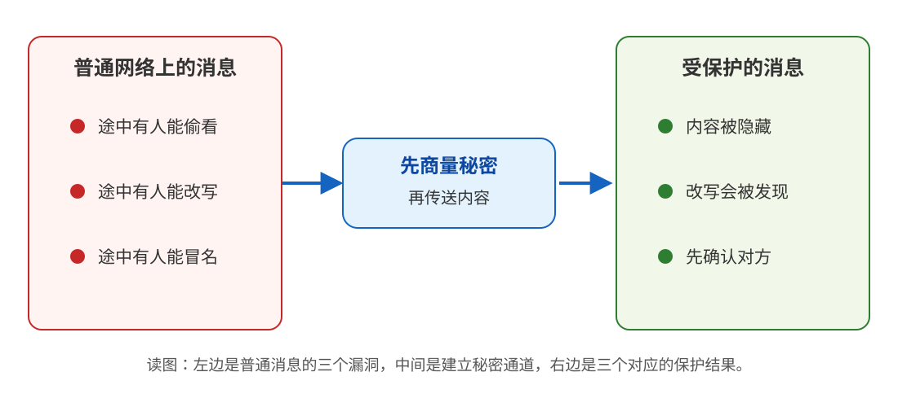
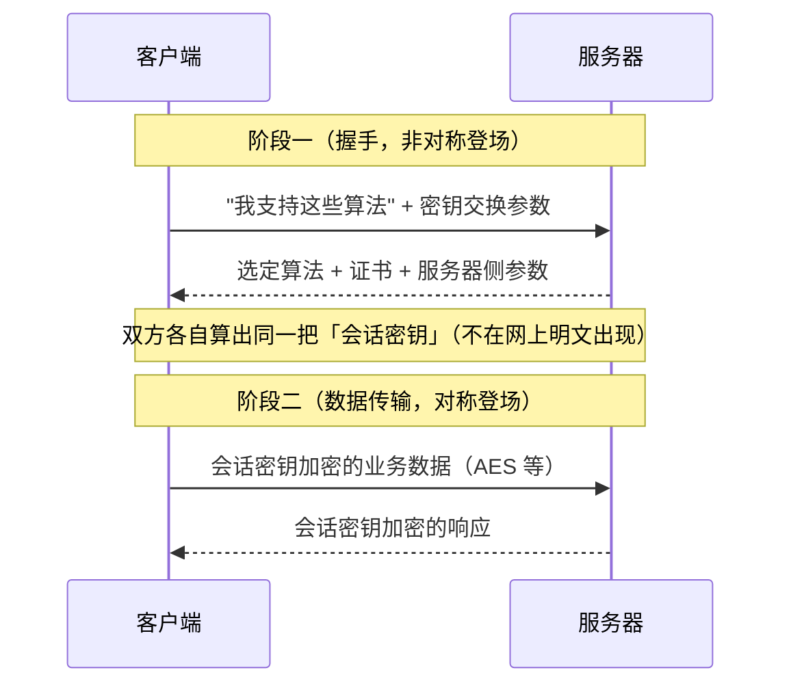
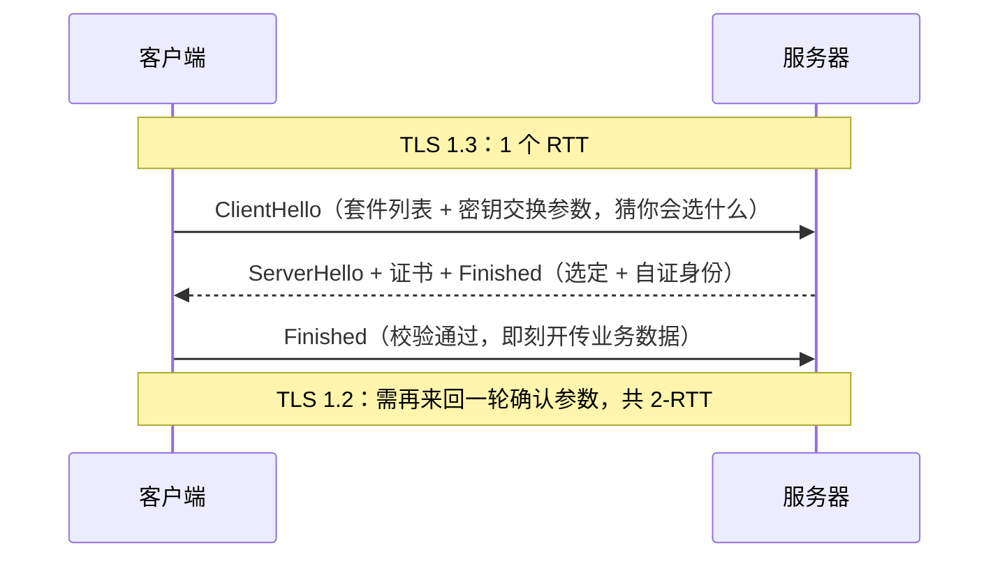
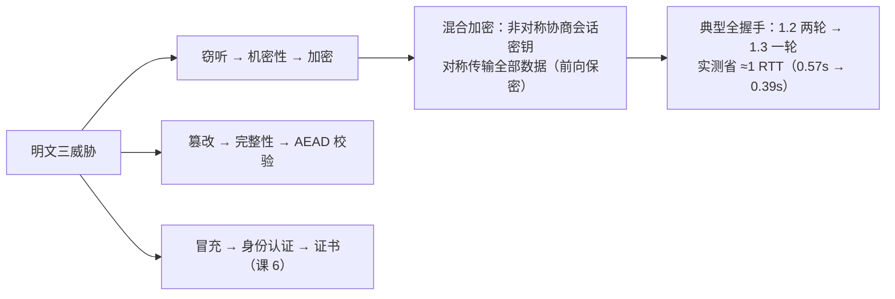

# 第 5 课：HTTPS：明文的三大威胁与加密原理

> 所属阶段：阶段 2《连接与安全》｜ 水平：入门 ｜ 本课知识点：明文传输的三大威胁、混合加密、TLS 握手
> 故事情节：公司要求全站 HTTPS，小航问"加了把锁到底防了什么"

## 🎯 本课目标

- 对明文传输的窃听、篡改、冒充三大威胁各举出一个真实场景。
- 说清混合加密如何取长补短："用非对称交换密钥、对称传输数据"。
- 描述 TLS 1.2 与 TLS 1.3 握手的轮次差异，会用抓包工具观察一次握手。

> 📖 **文档核对**：本课结论已按 [RFC 9846 · TLS 1.3（2026-07）](https://www.rfc-editor.org/info/rfc9846) 与 [RFC 9849 · TLS Encrypted Client Hello（2026-03）](https://www.rfc-editor.org/info/rfc9849) 核对（核查于 2026-09）。RFC 9846 保留 TLS 1.3 的版本号并替代原 RFC 8446；它确认了握手、AEAD、1-RTT/0-RTT 与密钥交换的主线，但也明确：PSK-only 模式可能没有前向保密，0-RTT 的安全性质更弱。

| 本课原有说法 | 按当前规范收窄后的说法 |
|---|---|
| TLS 1.3 已强制前向保密 | **使用公开密钥交换的 TLS 1.3 握手**提供前向保密；PSK-only 与 0-RTT 另有边界 |
| SNI 一直明文可见 | **普通 TLS 1.3** 的 ClientHello 中 SNI 可见；ECH 可加密 ClientHello，但不替代证书身份校验 |

> ⚠️ 阶段 2 节奏提示：本课概念密度最高（机密性/完整性/身份认证、对称/非对称、握手轮次）。先把"三大威胁 → 三个解法"的对应关系记牢，握手的字节级细节允许下次再看。

---

## 第一幕：起源与场景引入

> 🏛️ **起源**：HTTP 的安全层从浏览器厂商时代的 SSL 演化而来；IETF 接管标准化后更名 TLS。TLS 1.2 最初由 RFC 5246（2008-08）定义，TLS 1.3 最初由 RFC 8446（2018-08）定义；截至 2026-09，RFC 9846（2026-07）对 TLS 1.3 做了兼容性更新并替代 RFC 8446（均经 RFC Editor 核查）。1.3 通过减少往返和移除旧式机制，同时改善了速度与安全性。

> 🎬 **场景**：公司在安全评审后被要求"全站 HTTPS 化"。小航嘴上应着，心里嘀咕：我的接口不过是查查商品列表，又没传密码，**为什么要平白多付一次握手的钱**？（他在课 4 实测过：`tls=0.400791s`，一次请求 0.65 秒里有 0.4 秒花在这。）

> 💡 **一句话本质**：HTTPS 把一张谁都能读、能改、能冒充的网络明信片，变成一条只有双方能读、改动会被发现、并且会核对对方身份的通道。
>
> ⚖️ **处境对照**：不加保护时，窃听者能直接读到请求头里的秘密；加上 HTTPS，首次连接要支付一次 TLS 握手成本（课 4 的实测约 `0.400791s`），之后可借助连接复用摊薄这笔成本。证书如何核对身份，下一课再展开。

---

## 第二幕：认知冲突

> ❓ **问题**：小航的三个疑问，一个比一个扎心——
>
> 1. 我不传密码，**明文还有什么好偷的**？"查商品列表"被看了又怎样？
> 2. 就算要加密——**钥匙怎么先交给对方**？钥匙要是在半路被截了，加密不就成了给窃听者加密？
> 3. 课 4 那张账单里 TLS 占了 400ms，**这钱花在哪了**？听说 TLS 1.3 比 1.2 快，快在哪？

带着这三个问题，本课先当一次"窃听者"。

---

## 第三幕：层层揭示



> 👀 **看图**：左边是普通消息在途中暴露的三个漏洞，中间先建立秘密，右边得到“内容隐藏、改写可发现、对方先确认”三个结果。

### 本课地图

| 第几步 | 要解决什么 | 对应知识点 |
|---|---|---|
| 第 1 步 | 看清普通消息为什么不可靠 | 5.1 明文传输的三大威胁 |
| 第 2 步 | 明白两类加密怎样分工 | 5.2 混合加密 |
| 第 3 步 | 看懂秘密通道如何开工、为什么有快慢差异 | 5.3 TLS 握手 |

### 知识点 5.1：明文传输的三大威胁

> 本知识点关键点：窃听（机密性）/ 篡改（完整性）/ 冒充（身份认证）

> 🧭 **第 1/3 步｜承接**：第二幕留下的问题是“没传密码，明文还有什么好偷的？” → **本步**把“偷看、改写、冒名”三个漏洞逐一看清。

#### 一句话定义

明文传输暴露在三类风险下：**窃听**（被偷看，破坏机密性）、**篡改**（被半路修改，破坏完整性）、**冒充**（对面根本不是你以为的那台服务器，破坏身份认证）。HTTPS 的任务就是同时补齐这三个性质。

#### 直觉建立（类比）

明文 HTTP 是一张**寄出的明信片**：邮路上每个经手人都能**读**（窃听）、能**涂改**（篡改）；而你以为寄往"XX 银行"的地址，可能被人在半路**整箱换走**、由一家假银行代收（冒充）。HTTPS 是把明信片放进**带锁的防拆封条信封**，并且先**核实收件人身份**再寄。

> 💡 **类比的边界**：防拆封条（完整性校验）**不是加密自然附赠的**——单独的加密只防偷看，不防调包。"加密了就等于没被改过"是本课要拆掉的第一大错觉；完整性必须靠显式的校验机制（现代 TLS 用 AEAD，加密与校验一体）。

#### 核心原理

三大威胁与解法的对应关系（HTTPS 的三大支柱，缺一不可）：

| 威胁 | 对方做了什么 | 破坏的性质 | HTTPS 的解法 | 详见 |
|------|-------------|-----------|--------------|------|
| 窃听 | 在链路上原样读走报文 | 机密性 | 加密（本课 5.2/5.3） | 5.2 |
| 篡改 | 半路修改报文（注入广告/改金额） | 完整性 | MAC/AEAD 校验，改一字节即报错 | 5.2 |
| 冒充 | 假服务器接走你的连接 | 身份认证 | 证书与信任链（**课 6 主角**） | 课 6 |

**窃听者到底能看到什么？** 实测说话——我们在本机架了一个"窃听者"TCP 代理，它把双向流量原样转发并打印截获内容（脚本见第四幕）：

**同一请求走明文 HTTP**（真实捕获）——注意那个自定义头：

```text
[HTTP窃听者 · 客户端→服务器] 截获 110 字节：
b'GET /api/orders HTTP/1.1\r\nHost: 127.0.0.1:8500\r\nUser-Agent: curl/8.7.1\r\nAccept: */*\r\nX-Secret: password123\r\n\r\n'
```

**同一场景走 HTTPS**（真实捕获）——窃听者只看到字节流：

```text
[HTTPS窃听者 · 客户端→服务器] 截获 321 字节：
b"\x16\x03\x01\x01<\x01\x00\x018\x03\x03\xfel\x96\xfb}-\x03\x1d\xaf\xed0\x89\x84\x90\xefT\xc9\xdeI\xbfT\xd4+\x93..."
```

明文侧连 `X-Secret: password123` 都被原样截获；密文侧全是二进制乱码。**两行输出的差距，就是 HTTPS 的全部理由。**

#### 示例演示

窃听实验同时暴露了一个诚实的边界：**普通 TLS 1.3** 的 ClientHello 仍有可见元数据——上面那串乱码开头的 `\x16\x03\x01` 是 ClientHello 记录，里面域名（SNI）、支持的加密套件都是明文。窃听者不知道你说了什么，但知道**你在和哪个域名说话、大概在做什么类型的事**。RFC 9849 定义的 ECH 可以加密 ClientHello，从而隐藏 SNI 等字段；它解决的是隐私暴露，**不替代证书身份校验**。加密保护的是内容，不是自动抹掉所有流量特征。

#### 常见误区

1. **"我不传密码，明文无所谓"**：Cookie（登录态）、内部接口路径、用户行为数据全是情报。实测里一个自定义头 `X-Secret` 就完整泄露——窃听者不挑食。
2. **"加密了就不会被篡改"**：加密只提供机密性。完整性要靠校验机制（AEAD/MAC），否则窃听者可以把密文原样替换成另一段合法密文。三性质独立、缺一不可。
3. **"内网不用 HTTPS"**：内网同样有窃听者（被入侵的跳板机、抓包的同事、日志系统）。"内网"从来不是机密性证书。

#### 一句话记住

**明文 = 寄明信片：可被读、可被改、可被冒名顶替；HTTPS 三件套（加密/校验/证书）分别堵住三个洞，少一件都不算安全。**

#### 官方文档

- [RFC 9846 · TLS 1.3](https://www.rfc-editor.org/info/rfc9846)：当前 TLS 1.3 规范（2026-07，核查于 2026-09；替代原 RFC 8446）
- [RFC 9849 · TLS Encrypted Client Hello](https://www.rfc-editor.org/info/rfc9849)：普通 ClientHello 的可见范围与 ECH（2026-03，核查于 2026-09）
- 证书与信任链的官方梳理 → 下一课 6.1

---

### 知识点 5.2：混合加密

> 本知识点关键点：对称加密快但密钥难分发 / 非对称加密解决分发但慢 / 用非对称交换密钥、对称传输数据

> 🧭 **第 2/3 步｜承接**：上一步知道“要隐藏内容、还要防改写”，但还不知道钥匙怎么安全到位 → **本步**把慢而擅长协商的非对称机制，与快而擅长搬运的对称机制拼起来。

#### 一句话定义

HTTPS 用**非对称加密**解决"钥匙怎么安全交给对方"，用**对称加密**承担"全部数据的高速加密"——各取所长的组合拳。

#### 直觉建立（类比）

经典好类比是**带挂锁的箱子**：你想收秘密，就先把**打开的挂锁**（公钥）寄给对方——谁都能把锁扣上（加密），但只有你口袋里的钥匙（私钥）能打开。对方把秘密放进箱子、锁上、寄回，路上谁也打不开。

> 💡 **类比的边界**：挂锁箱子只演示了"单向保密"，真实 TLS 还要多解决两件事。① **挂锁是谁寄的？**——收到的"公钥"可能是冒充者寄的（5.1 的第三威胁），所以要证书背书（课 6）。② **全程挂锁太慢**——非对称加密比对称慢几个数量级，TLS 只在握手时用它**商量出一把一次性的对称会话密钥**，之后的全部数据都走对称加密。

#### 核心原理

两类算法的分工表：

| | 对称加密（AES 等） | 非对称加密（RSA/ECDSA/ECDHE 等） |
|--|---------------------|----------------------------------|
| 钥匙 | 一把，双方共享 | 一对，公钥可公开、私钥自留 |
| 速度 | 快（可加密全部数据） | 慢几个数量级（只用于握手） |
| 难点 | **钥匙怎么安全发给对方** | 用"公开一半"也能完成保密协商 |

组合拳的完整流程：



两个关键词（现代 TLS 的安全底线）：

1. **前向保密（PFS）**：在使用临时 `(EC)DHE` 的公开密钥交换中，会话密钥由双方每次现算；服务器的长期私钥即使日后泄露，也解不开**过去**录下的流量。RFC 9846 明确：PSK-only 模式可能失去这项性质，0-RTT 的性质还要更弱。
2. **AEAD**：现代套件把加密与完整性校验做成一件事（如 `AES_256_GCM`），改一个密文字节都会解密失败——5.1 的"加密 ≠ 完整"由此补齐。

#### 示例演示

回到窃听实验那串"乱码"——它其实**能读出一部分**（普通握手的部分元数据本来就是明文）：客户端在自己开的"菜单"里列了 `13 03 13 02 13 01` 三个套件，服务器的回应里选中了 `\x13\x03`。对照 TLS 1.3 的套件表翻译（RFC 9846 保留原 RFC 8446 的这组定义）：

```text
\x13\x03 = TLS_CHACHA20_POLY1305_SHA256
   ↑           ↑              ↑
 TLS 1.3   ChaCha20(对称流加密)  Poly1305(AEAD：加密+完整性一体)
```

**窃听者能看懂"你们商定用什么加密"，却看不懂任何加密后的内容**——这正是握手元数据与业务数据的分界线，也预告了 5.3 的主题：握手过程本身。

#### 常见误区

1. **"HTTPS = 用 RSA 把所有数据加密一遍"**：非对称只出现在握手阶段的密钥协商；业务数据 100% 走对称加密（AES 等）。非对称加密全部数据，性能会慢到不可用。
2. **"密钥是服务器发给客户端的一把固定钥匙"**：会话密钥**不在网络上传输**，由双方各自用交换参数本地算出；且每次连接新生成。加密的从来不是"钥匙"本身，而是"钥匙的原料"。
3. **"老协议 RSA 密钥交换也够用"**：RSA 密钥交换无前向保密（私钥泄露 = 历史流量全裸），TLS 1.3 已将其移除——这也是"1.3 更安全"的实质之一。

#### 一句话记住

**挂锁（非对称）只用来商量钥匙，搬货（对称）另请大力士；会话密钥网上不露面、一次一换、事后解不开历史流量（前向保密）。**

#### 官方文档

- [RFC 9846 · TLS 1.3](https://www.rfc-editor.org/info/rfc9846)：§2（协议概览）给出密钥交换、AEAD 与应用数据保护的规范定义

---

### 知识点 5.3：TLS 握手

> 本知识点关键点：TLS 1.2 的握手轮次 / TLS 1.3 的 1-RTT 优化 / 用 Wireshark/抓包观察握手

> 🧭 **第 3/3 步｜承接**：上一步知道“钥匙不能裸奔，数据也不能全用慢算法搬运” → **本步**沿着一次连接，看双方怎样协商、确认、切换到受保护的数据传输。

#### 一句话定义

TLS 握手是在业务数据开始前，用 1–2 个 RTT 完成"**商定算法 → 换出会话密钥 → 验证身份**"的开工会议——课 4 账单里那个 `tls=0.400791s` 花的就是这个钱。

#### 直觉建立（类比）

保密会议前的**对暗号**环节：先确认对面是本人（验证书，课 6）、再商定用哪套暗语（套件协商）、最后交换只有双方知道的会议钥匙（密钥交换）。对完暗号才谈正事。

> 💡 **类比的边界**："对暗号"环节本身**有少量明文**（支持的算法、选定的算法、域名 SNI）——上一节窃听实验里能读懂的那部分就是它。对暗号的花费是按 RTT 计的：来回一轮，1.2 时代要两轮。

#### 核心原理

典型的**全握手**中，TLS 1.3 可以做到 **1-RTT**（对照 TLS 1.2 的 2-RTT）；会话恢复和 HelloRetryRequest 等变体会改变实际消息流：



1.3 提速的实质：客户端在第一条消息里就**把猜的密钥参数一并带上**，服务器一次回应即可敲定——省下的恰好是一个 RTT。它同时砍掉了一大批不安全的老算法与静态 RSA 密钥交换，所以"更快"与"更安全"是一体两面。

还有一条"快上加快"的路：**会话恢复（0-RTT）**——老熟人重连时，凭上次的会话票据在第一跳就带上业务数据。代价是 0-RTT 数据**有重放风险**（同一份数据可能被攻击者原样重发多次），所以只允许幂等请求——课 3 的幂等性在这里派上真实用场。

#### 示例演示

**握手成本实测**（对 example.com 各建 3 条新连接，真实捕获）：

```text
TLS 1.3：appconnect = 0.391213 / 0.375920 / 0.381312 s
TLS 1.2：appconnect = 0.572135 / 0.541125 / 0.564672 s
```

三次全部稳定相差约 **0.17–0.19 秒**——恰好约一个 RTT（该站 RTT ≈ 0.18s，与课 4 的 starttransfer 数据互相印证）。单机单站的样本有噪声，但方向与理论完全一致：**1.3 省一个 RTT**。

**协商结果验证**（`openssl s_client`，真实捕获）：

```text
Protocol  : TLSv1.3
```

再回扣课 4 的账单：`tls=0.400791s` 就是这段握手在默认（1.3）下的真实价格；若世界还停在 1.2，它约是 0.58s。

#### 常见误区

1. **"TLS 1.3 的价值就是快"**：快只是表象。它同时砍掉不安全套件、移除静态 RSA 密钥交换；公开密钥交换模式提供前向保密，但 PSK-only 与 0-RTT 有明确边界——更快与更安全来自同一批改动，不能把例外抹掉。
2. **"握手完成后流量就全看不见了"**：普通握手的 SNI 与部分 ClientHello 元数据仍可见；ECH 可以隐藏 ClientHello 中的部分字段，但不等于隐藏所有流量特征，也不替代证书校验。
3. **"0-RTT 是白送的性能"**：它以重放风险为代价，只适合幂等请求。不知道重放风险的 0-RTT 使用，等于给"重复扣款"开门。

#### 一句话记住

**握手 = 对暗号：TLS 1.3 一个 RTT 敲定（猜准了你选什么）；省下的恰好 1 个 RTT，砍掉的全是不安全选项；0-RTT 快但只许幂等。**

#### 官方文档

- [RFC 9846 · TLS 1.3](https://www.rfc-editor.org/info/rfc9846)：握手流程、1-RTT、PSK 与 0-RTT 的当前规范（2026-07，核查于 2026-09）
- [RFC 5246 · TLS 1.2](https://www.rfc-editor.org/info/rfc5246)：TLS 1.2 的历史对照规范（2008-08；已由 RFC 9846 标记为被替代）

---

## 第四幕：实操验证

> 本节命令在本机 macOS 实测通过（curl 8.7.1 / LibreSSL / Python 3.9.6），输出均为真实捕获、仅做截断标注。

### 步骤 1：准备实验环境（本地服务器 + 窃听者代理）

```bash
mkdir -p /tmp/http-course-demo5 && cd /tmp/http-course-demo5
cat > keepalive_server.py <<'PY'
# 本地 HTTP 服务器（课 4 同款）
from http.server import BaseHTTPRequestHandler, ThreadingHTTPServer


class Handler(BaseHTTPRequestHandler):
    protocol_version = "HTTP/1.1"

    def do_GET(self):
        body = f"ok {self.path}".encode()
        self.send_response(200)
        self.send_header("Content-Length", str(len(body)))
        self.send_header("Content-Type", "text/plain; charset=utf-8")
        self.end_headers()
        self.wfile.write(body)


ThreadingHTTPServer(("127.0.0.1", 8400), Handler).serve_forever()
PY
cat > eavesdrop_proxy.py <<'PY'
# 窃听者代理：原样转发双向流量，并打印每个方向的第一段
# 用法：python3 eavesdrop_proxy.py <监听端口> <目标主机> <目标端口>
import socket, sys, threading

listen_port, target_host, target_port = int(sys.argv[1]), sys.argv[2], int(sys.argv[3])
tag = sys.argv[4] if len(sys.argv) > 4 else "eaves"


def pump(src, dst, label, first):
    try:
        n = 0
        while True:
            data = src.recv(65536)
            if not data:
                break
            if n == 0 and len(first) < 2:
                first.append(1)
                print(f"\n[{tag} · {label}] 截获 {len(data)} 字节：", flush=True)
                print(repr(data[:240]), flush=True)
            dst.sendall(data)
            n += 1
    except OSError:
        pass
    finally:
        try:
            dst.shutdown(socket.SHUT_WR)
        except OSError:
            pass


def handle(conn):
    first = []
    upstream = socket.create_connection((target_host, target_port))
    threading.Thread(target=pump, args=(conn, upstream, "客户端→服务器", first), daemon=True).start()
    pump(upstream, conn, "服务器→客户端", first)
    conn.close()


srv = socket.socket(socket.AF_INET, socket.SOCK_STREAM)
srv.setsockopt(socket.SOL_SOCKET, socket.SO_REUSEADDR, 1)
srv.bind(("127.0.0.1", listen_port))
srv.listen(5)
print(f"[{tag}] listening on 127.0.0.1:{listen_port} -> {target_host}:{target_port}", flush=True)
while True:
    conn, _ = srv.accept()
    threading.Thread(target=handle, args=(conn,), daemon=True).start()
PY
python3 keepalive_server.py > ka.log 2>&1 &
python3 eavesdrop_proxy.py 8500 127.0.0.1 8400 "HTTP窃听者" > proxy_http.log 2>&1 &
python3 eavesdrop_proxy.py 8501 example.com 443 "HTTPS窃听者" > proxy_https.log 2>&1 &
```

### 步骤 2：窃听明文 HTTP（回扣 5.1）

```bash
curl -s http://127.0.0.1:8500/api/orders -H 'X-Secret: password123' -o /dev/null
cat proxy_http.log
```

实测输出（真实捕获）：

```text
[HTTP窃听者 · 客户端→服务器] 截获 110 字节：
b'GET /api/orders HTTP/1.1\r\nHost: 127.0.0.1:8500\r\nUser-Agent: curl/8.7.1\r\nAccept: */*\r\nX-Secret: password123\r\n\r\n'
```

> ✅ **回扣场景**：一个自定义头原样裸奔。小航现在能回答第一问了——明文暴露的不只是密码，是**一切**。

### 步骤 3：窃听 HTTPS（回扣 5.1 与 5.2）

```bash
curl -s --connect-to example.com:443:127.0.0.1:8501 https://example.com/ -o /dev/null
cat proxy_https.log
```

实测输出（真实捕获，节选）：

```text
[HTTPS窃听者 · 客户端→服务器] 截获 321 字节：
b"\x16\x03\x01\x01<\x01\x00\x018\x03\x03\xfel\x96\xfb}-\x03\x1d\xaf\xed0\x89..."   ← ClientHello（元数据明文）
[HTTPS窃听者 · 服务器→客户端] 截获 1186 字节：
b"\x16\x03\x03\x00z\x02\x00\x00v\x03\x03\xb5\xc0\x1d>5\xaf\xdb\xe4...\x13\x03\x00..."  ← ServerHello 选定 \x13\x03 = TLS_CHACHA20_POLY1305_SHA256，此后全是密文
```

> ✅ **回扣场景**：窃听者知道"对方要用 ChaCha20-Poly1305 对称加密"，却读不出任何业务内容——协商明文、数据密文的分界线，亲眼可见。`--connect-to` 让 curl 把发往 example.com 的 TCP 连接改接到本地代理，证书校验依旧通过（代理只是管道，没有动内容）。

### 步骤 4：验证版本与轮次（回扣 5.3）

```bash
echo | openssl s_client -connect example.com:443 2>/dev/null | grep "Protocol"
for i in 1 2 3; do curl -s -o /dev/null -w "TLS1.3: appconnect=%{time_appconnect}s\n" https://example.com/; done
for i in 1 2 3; do curl -s --tlsv1.2 --tls-max 1.2 -o /dev/null -w "TLS1.2: appconnect=%{time_appconnect}s\n" https://example.com/; done
```

实测输出（真实捕获）：

```text
Protocol  : TLSv1.3
TLS1.3: appconnect=0.391213s / 0.375920s / 0.381312s
TLS1.2: appconnect=0.572135s / 0.541125s / 0.564672s
```

> ✅ **回扣场景**：1.3 三次稳定比 1.2 快约 0.18s ≈ 一个 RTT。课 4 那笔 `tls=0.400791s` 的糊涂账，现在每一块钱都有去处了。

---

## 第五幕：体系收束

> 📍 **全局定位**：本课解决了三威胁中的两个——加密（窃听）与 AEAD 校验（篡改）。但**冒充只解决了一半**：你与"example.com"建立的加密通道固若金汤，可握手时对方递来的"公钥"，**凭什么信是真 example.com 的**？窃听实验里那行 `\x13\x03` 之前的服务器消息里，藏着的正是答案。
>
> 🔗 **下一步**：下一课《证书与信任：怎么确认"你就是你"》拆开服务器递来的"证件"——证书里有什么、谁给它背书（CA 信任链）、证书报错为什么五花八门，并把本地开发环境真正 HTTPS 化（mkcert 实操）。这是阶段 2 的收官课，也是小航"本地联调 HTTPS 报错"那个故事的答案。
>
> 伏笔登记：0-RTT 重放 → 回扣课 3 幂等性；SNI 明文 → 课 9（代理可见性）；会话恢复与连接成本 → 课 7（缓存与复用的总账）；证书链 → 课 6。

---

## 🐞 常见误区

1. **"上了 HTTPS 就安全了"**：HTTPS 保证的是传输段三性质；端侧（弱密码、XSS、服务器被入侵）与逻辑漏洞一概不归它管。"有锁的房子，窗户没关照样进人"。
2. **"看到 https:// 与锁标 = 对面可信"**：锁标只说明"通道加密 + 对面持有该域名证书"；证书背后是不是你想的那家机构，要看证书内容（课 6）——钓鱼站也能有合法证书。
3. **"TLS 握手费可以完全消除"**：能省（会话恢复、长连接复用、TLS 1.3），不能免——它是安全性的价格。工程上的正确姿势是"少付次数"（复用）而不是"拒绝支付"。

## 一图总结



## 📋 命令速查卡

| 命令 | 用途 | 坑 |
|------|------|-----|
| `curl -w "%{time_appconnect}s\n" https://<host>` | 单独测 TLS 握手耗时 | `appconnect` 只含 TLS 段，不含 DNS/TCP；单次有噪声，建议 3 次取稳态 |
| `curl --tlsv1.2 --tls-max 1.2 <URL>` | 强制 TLS 1.2（对照 1.3 轮次） | 两者都要新建连接（新进程/新连接）才可比 |
| `echo \| openssl s_client -connect <host>:443 2>/dev/null \| grep Protocol` | 看协商出的 TLS 版本 | macOS 自带 LibreSSL，输出格式与 OpenSSL 略异；管道喂 `echo` 才会结束会话 |
| `curl --connect-to <host>:443:127.0.0.1:<port> https://<host>/` | 把 TCP 改接到本地（配窃听者代理） | 证书校验仍按原域名进行；代理必须纯转发才不会破坏 TLS |
| `python3 eavesdrop_proxy.py <listen> <host> <port> "tag"` | 起窃听者代理 | 只打印每个方向第一段（防刷屏）；对 HTTPS 看到的是密文属预期 |
| `python3 keepalive_server.py &` | 起本地 HTTP 服务器 | 明文实验专用；实验完逐个 `kill %1` |

## 课后小测

**Q1**：攻击者在链路上把"转账金额 100 元"的密文替换成另一段他预先准备好的合法密文（金额 999 元）。哪种安全性质被破坏了？

- A. 机密性
- B. 完整性
- C. 身份认证
- D. 都没有，因为密文无法阅读

<details><summary>答案与解析</summary>

**答案：B**。攻击者不需要"看懂"密文也能调包——这是完整性问题，不是机密性问题。HTTPS 用 AEAD（加密与校验一体）让替换后的密文在解密时直接失败。这也解释了"加密 ≠ 防篡改"：两者是独立的安全性质。

</details>

**Q2**：TLS 为什么不全程使用非对称加密？

- A. 非对称加密不安全
- B. 非对称加密算法太慢，只适合握手阶段协商密钥；数据传输交给快的对称加密
- C. 服务器内存不够
- D. 浏览器不支持

<details><summary>答案与解析</summary>

**答案：B**。非对称加密慢几个数量级，只承担"安全地商量出会话密钥"这一步；之后的全部业务数据用对称加密（AES 等）。两者是分工不是替代——这就是"混合加密"。

</details>

**Q3**：本课实测 TLS 1.3 的握手耗时比 1.2 稳定少约 0.18s（该站 RTT ≈ 0.18s）。这个差值对应什么？

- A. 1.3 加密算法更快
- B. 1.3 把握手从 2-RTT 压缩到 1-RTT，省了一个往返
- C. 1.3 证书更小
- D. 测量误差

<details><summary>答案与解析</summary>

**答案：B**。TLS 1.3 让客户端在 ClientHello 里就带上猜测的密钥交换参数，一个 RTT 完成协商；1.2 需要额外的往返确认。本课三次实测差值稳定 ≈ 1 RTT，与理论一致（顺带：1.3 还移除了不安全套件与 RSA 密钥交换，快与安全是同一批改动的两面）。

</details>

## 📌 知识点导航

| 知识点 | 关键点 | 状态 |
|--------|--------|------|
| 5.1 明文传输的三大威胁 | 窃听（机密性）/ 篡改（完整性）/ 冒充（身份认证） | ✅ 已完成（2026-09-15） |
| 5.2 混合加密 | 对称加密快但密钥难分发 / 非对称加密解决分发但慢 / 用非对称交换密钥、对称传输数据 | ✅ 已完成（2026-09-15） |
| 5.3 TLS 握手 | TLS 1.2 的握手轮次 / TLS 1.3 的 1-RTT 优化 / 用 Wireshark/抓包观察握手 | ✅ 已完成（2026-09-15） |

## 🚀 下一批接力提示词

> 学完本课后，**复制下面这段文字发给 AI**，即可无缝进入下一课（无需重新描述上下文）：

```
继续学 HTTP。我的学习档案在 network/http/00-学习档案.md，
刚学完阶段 2《连接与安全》的课《HTTPS：明文的三大威胁与加密原理》知识点 5.1、5.2、5.3，
请按大纲继续讲解下一课《证书与信任：怎么确认"你就是你"》（6.1 证书与 CA 信任链、6.2 证书校验失败的常见场景、6.3 本地开发配 HTTPS 实操）。
```

## 🧭 课程导航

⬅️ **上一课**：[课 4：连接管理：握手、复用与队头阻塞](lesson-04-连接管理与队头阻塞.md)

➡️ **下一课**：[课 6：证书与信任：怎么确认"你就是你"](lesson-06-证书与信任.md)

📚 **返回目录**：[课程目录](../../../02-课程目录.md)
