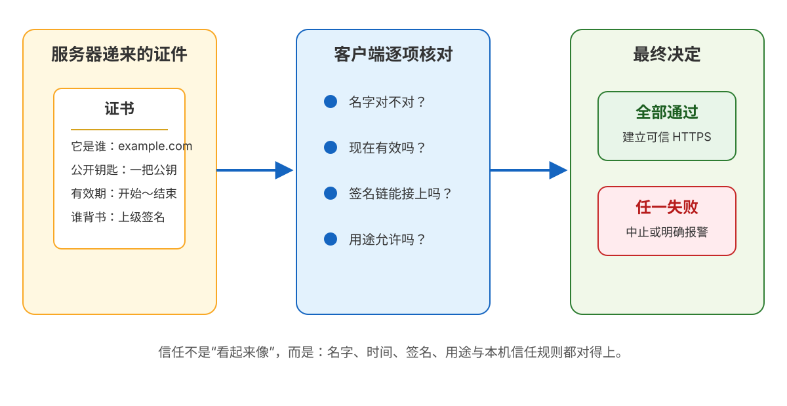
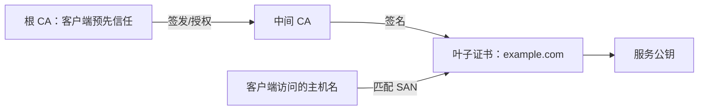
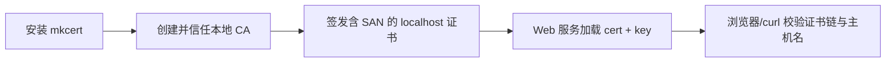
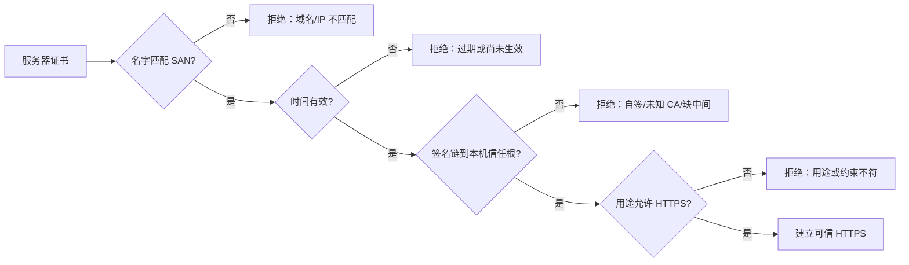

# 第 6 课：证书与信任：怎么确认“你就是你”

> 所属阶段：阶段 2《连接与安全》｜ 水平：入门 ｜ 本课知识点：证书与 CA 信任链、证书校验失败的常见场景、本地开发配 HTTPS 实操
> 故事情节：本地联调 HTTPS 证书报错，小航从报错里看懂了信任链

## 🎯 本课目标

- 说清证书里有什么、CA 信任链如何逐级背书、系统与浏览器的根证书库在哪。
- 对证书过期、域名不匹配（含多域名 SAN）、自签证书三类校验失败报错，说出成因与处理方式。
- 理解并完成用 mkcert 为本地开发签发可信证书的流程；知道哪些命令会改变本机信任边界。

> 📖 **文档核对**：本课按 [RFC 5280 · PKIX/X.509 证书与 CRL](https://www.rfc-editor.org/info/rfc5280)、[RFC 9525 · TLS 服务身份](https://www.rfc-editor.org/info/rfc9525)、[mkcert 官方 README](https://github.com/FiloSottile/mkcert) 与 [Apple · Keychain Access 信任设置](https://support.apple.com/guide/keychain-access/change-the-trust-settings-of-a-certificate-kyca11871/mac) 核对（核查于 2026-09）。RFC 9525 已替代 RFC 6125：域名身份应从 `subjectAltName` 匹配，不再把 `commonName` 当作域名校验依据；IP 地址必须按 IP 身份精确匹配。

| 容易说过头的说法 | 本课采用的准确说法 |
|---|---|
| 证书证明“这家公司就是这家公司” | 证书把一个服务身份与公钥绑定，并由 CA 签名；客户端是否信任 CA 还取决于本机信任策略 |
| 只要证书里有 `CN=example.com` 就行 | 服务身份看 `subjectAltName`；DNS 名称看 `dNSName`，IP 地址看 `iPAddress` |
| 把服务器证书放进客户端就能解决信任 | 生产通常由服务器发送叶子证书和中间证书，客户端通过本机已信任的根证书构建链；不要把私钥或根 CA 私钥发给客户端 |
| `curl -k` 能访问，所以证书问题解决了 | `-k/--insecure` 只是跳过校验，适合隔离问题，不是修复方案 |

> ⚠️ **本机实验边界**：本课环境没有安装 `mkcert`。工作区规则要求安装前先征求授权，因此文中的 `brew install mkcert` 与 `mkcert -install` 不在本轮执行；公开站点证书观察与 `openssl` 校验为本机真实捕获，其余本地签发步骤标为“安装后预期”。

## 📌 知识点导航

| 知识点 | 关键点 | 状态 |
|--------|--------|------|
| 6.1 证书与 CA 信任链 | 证书字段 / SAN / 叶子-中间-根 / 信任锚 | ✅ 已完成（2026-09-15） |
| 6.2 证书校验失败的常见场景 | 过期 / 域名或 IP 不匹配 / 自签与私有 CA / 缺中间 / 不要 `-k` | ✅ 已完成（2026-09-15） |
| 6.3 本地开发配 HTTPS 实操 | mkcert / 本地 CA / 多 SAN / Python 服务加载 / macOS 信任库 | ✅ 已完成（2026-09-15） |

---

## 第一幕：起源与场景引入

> 🏛️ **起源**：课 5 已解决“内容怎么保密、改动怎么被发现”，但还留下最危险的问题：加密通道的另一端，真的是你要找的服务器吗？证书就是 TLS 在握手阶段递来的机器可读“证件”——它携带身份与公钥，并由上级 CA 用数字签名背书。

> 🎬 **场景**：小航把本地接口从 `http://localhost:8000` 改成 `https://localhost:8443`。浏览器却出现“连接不安全”。他又试了 `https://127.0.0.1:8443`，结果错误换成“证书与主机名不匹配”。同一个服务，为什么换个地址就不行？

> 💡 **一句话本质**：证书不是“服务器发来的密码”，而是一份把“服务身份”和“公钥”绑在一起、再由可信上级签名的公开证明；客户端要同时检查名字、时间、签名链和用途。

> ⚖️ **处境对照**：课 5 的“加密”只回答“别人看不懂”，本课的“信任”回答“我是不是在和正确的对方说话”。证书链像证件的签发链，信任库像你事先认可的签发机关名单；本地 HTTPS 的关键不是关掉校验，而是为本机建立一个只用于开发的信任边界。

---

## 第二幕：认知冲突

> ❓ 小航的三个疑问：
>
> 1. 证书到底写了什么？为什么公开给全网看，攻击者不会拿走它？
> 2. 浏览器凭什么相信某个 CA？根证书是谁放进电脑里的？
> 3. 过期、域名不匹配、自签证书，浏览器都说“不安全”，排查时应该先看哪一项？

最大的认知冲突是：**证书公开，但私钥绝不公开；证书写着名字，但名字对上还不等于链条可信。** 本课按“证件内容 → 签发链 → 客户端核对 → 本地落地”的顺序拆开。

---

## 第三幕：层层揭示



> 👀 **看图**：服务器递来证件，客户端依次核对名字、时间、签名链和用途；全部通过才建立可信 HTTPS，任一失败都应中止或明确报警。

### 本课地图

| 第几步 | 要解决什么 | 对应知识点 |
|---|---|---|
| 第 1 步 | 看懂证书是什么、里面有哪些关键字段 | 6.1 证书与 CA 信任链 |
| 第 2 步 | 把“证书报错”翻译成可执行的排查动作 | 6.2 证书校验失败的常见场景 |
| 第 3 步 | 把本地 HTTP 服务升级为浏览器认可的 HTTPS | 6.3 本地开发配 HTTPS 实操 |

### 知识点 6.1：证书与 CA 信任链

> 本知识点关键点：证书字段 / 数字签名 / 叶子证书、中间 CA、根信任锚 / SAN 主机名匹配

> 🧭 **第 1/3 步｜承接**：课 5 已经建立了加密通道，但“对方是谁”仍没有答案 → **本步**先把服务器递来的证件和背书链看懂。

#### 一句话定义

X.509 证书是一份**把主体身份与公钥绑定起来的、由签发者签名的公开数据**。它不是私钥，也不是“无条件可信证明”；客户端必须沿着证书链验证签名，并把结果与自己的信任策略、访问的主机名和当前时间对照。

#### 直觉建立（类比）

把证书想成身份证：

- **证书正文**写着“这个身份对应哪把公开钥匙、有效到什么时候”；
- **CA 签名**像签发机关盖章，证明“我确认过这份绑定”；
- **根证书**像你手机里预装的可信机关名单；
- **中间 CA**像省级办证机构，根机关信它，它再给网站证书盖章。

> 💡 **类比的边界**：现实身份证通常由政府直接签发，而互联网证书的“可信”是客户端策略的结果。一个公司内网可以自建私有 CA；只要客户端事先信任它，链就能通过，但这不代表公共互联网的所有设备都会信它。

#### 核心原理

RFC 5280 中的证书主体可以先抓住这张“读证件”清单：

| 字段/扩展 | 它回答什么 | 排障时看什么 |
|---|---|---|
| `subject` | 证书描述的主体是谁 | 只作背景信息；不要拿 `CN` 替代 SAN 校验 |
| `subjectAltName` | 这个证书允许代表哪些名字 | HTTPS 主机名匹配的主战场；可含多个 DNS 名和 IP |
| `subjectPublicKeyInfo` | 对方的公钥是什么 | TLS 用它参与身份确认或后续密码学流程 |
| `issuer` | 谁签发了这张证书 | 用来连接到上一级证书 |
| `notBefore` / `notAfter` | 什么时候生效、什么时候失效 | 当前时间是否落在有效期内 |
| 签名与签名算法 | 上级是否为这份内容盖过章 | 用上级 CA 公钥验证；内容被改会失败 |
| `basicConstraints` | 这张证书能不能当 CA | 中间 CA 必须具备 CA 身份；叶子证书通常不是 CA |
| Key Usage / Extended Key Usage | 公钥允许做什么 | HTTPS 服务证书要允许服务器认证等用途 |

证书最重要的结构关系可以简化为：



这里的箭头不是“把私钥传下去”，而是**上级用自己的私钥签名，下级用上级公钥验证**。服务器的私钥只留在服务器上；服务器可以把叶子证书公开发送，因为证书本来就是公开材料。

一条常见链是：

| 位置 | 作用 | 通常由谁提供 |
|---|---|---|
| 叶子证书（server certificate） | 代表 `example.com`，携带服务公钥 | 服务器在握手中发送 |
| 中间 CA 证书 | 证明“签发叶子证书的机构”获得授权 | 服务器通常随链发送 |
| 根 CA（trust anchor） | 客户端最终信任的起点 | 客户端/操作系统/浏览器信任库预先拥有 |

客户端验证的目标，不是“服务器发来的链看起来很长”，而是：

1. 叶子证书的签名能被中间 CA 公钥验证。
2. 中间 CA 的签名能一路验证到本机信任的根。
3. 每张证书在当前时间有效，且用途和路径约束允许。
4. 访问的主机名与叶子证书的身份匹配。

RFC 5280 将信任锚作为路径验证的输入；它不是网络上临时发来的“自我证明”。这解释了为什么“服务器把根证书也发过来”不能自动让客户端信任：客户端是否把它当信任锚，仍是本地策略。

#### 示例演示：读一张真实公开证书

本机对 `example.com` 的证书做了只读观察，捕获到：

```text
subject= /CN=example.com
issuer= /C=US/O=SSL Corporation/CN=Cloudflare TLS Issuing ECC CA 3
notBefore=Jul 29 22:10:08 2026 GMT
notAfter=Oct 27 22:17:21 2026 GMT
            X509v3 Subject Alternative Name:
                DNS:example.com, DNS:*.example.com
```

读法是：这张叶子证书由一个中间 CA 签发；当前日期落在有效期内；SAN 允许 `example.com` 与其一层子域名。注意输出里的 `CN=example.com` 不能让我们偷懒：按 RFC 9525，服务身份只应从适当的 `subjectAltName` 条目核对，DNS 看 `dNSName`，IP 看 `iPAddress`。

#### 常见误区

1. **“证书是秘密，不能让别人拿到”**：证书是公开材料；真正必须保护的是与公钥配对的私钥，尤其是 CA 私钥。
2. **“根 CA 是证书链里最上面那张，所以服务器必须发送它”**：根 CA 是客户端预先配置的信任锚，服务器通常发送叶子和中间证书即可。
3. **“证书里写了公司名，就证明这个请求一定来自公司”**：证书验证的是服务身份与公钥绑定；应用登录、业务授权、服务器是否被入侵，仍是其他层的问题。
4. **“`CN` 对上就够了”**：新规范把 DNS 服务身份放在 SAN 的 `dNSName`；`CN` 不是现代 HTTPS 主机名校验的替代品。

#### 一句话记住

**证书 = 身份 + 公钥 + 有效期 + 上级签名；信任链 = 叶子往上验到客户端预先信任的根，再把 SAN 与你访问的主机名对上。**

#### 官方文档

- [RFC 5280 §4.1 · 证书结构](https://www.rfc-editor.org/rfc/rfc5280.html#section-4.1)：字段、有效期、扩展与签名结构
- [RFC 5280 §6.1 · 路径验证](https://www.rfc-editor.org/rfc/rfc5280.html#section-6.1)：信任锚与证书链验证
- [RFC 9525 §1.3 · 服务身份匹配原则](https://www.rfc-editor.org/rfc/rfc9525.html#section-1.3)：SAN、DNS-ID、IP-ID 与 CN 边界

---

### 知识点 6.2：证书校验失败的常见场景

> 本知识点关键点：失败点定位 / 过期与时钟 / SAN 域名匹配 / 自签证书与私有 CA / 不要用跳过校验掩盖问题

> 🧭 **第 2/3 步｜承接**：上一步知道客户端会逐项核对证书 → **本步**把浏览器那句“连接不安全”翻译成具体的失败环节和修复动作。

#### 一句话定义

证书报错不是一个问题，而是校验流水线中某一项失败：**链不可信、时间不对、名字不匹配、用途不允许，或证书已被撤销/状态不可接受**。排障的第一步是识别失败项，第二步才是改配置。

#### 直觉建立（类比）

机场安检有多道门：证件是不是正规机关签发、是否过期、照片和本人是否匹配、证件是否允许当前用途。任何一门失败，都不能因为“其他门都通过”就放行。

> 💡 **类比的边界**：现实安检员可能允许人工复核，而程序默认应拒绝失败连接。尤其是自动化客户端，不能把“点击继续”当作常规修复；否则中间人攻击恰好得到一条绕过校验的路。

#### 核心原理：报错到动作对照表

| 失败场景 | 客户端实际发现了什么 | 常见表现（文字会因客户端略有差异） | 正确处理 |
|---|---|---|---|
| 过期 | 当前时间晚于 `notAfter` | `certificate has expired` | 更新并部署新证书；检查自动续期与发布链路 |
| 尚未生效 | 当前时间早于 `notBefore`，或本机时钟错误 | `certificate is not yet valid` | 先检查客户端/服务器时间、时区和 NTP，再检查证书发布时间 |
| 域名不匹配 | URL 主机名不在 SAN 的允许集合 | `no alternative certificate subject name matches` | 为实际访问名签发证书，并让服务按该名字提供它 |
| IP 不匹配 | 用 IP 访问，但 SAN 没有对应 `iPAddress` | hostname/IP mismatch | 把 IP 作为 IP SAN 写入；不要把 `127.0.0.1` 填成 DNS 名字 |
| 自签或未知 CA | 链无法接到客户端信任锚 | `self-signed certificate` / `unable to get local issuer certificate` | 公网服务使用受信 CA；内网/本地使用受控私有 CA，并把根证书安全分发到客户端 |
| 缺中间证书 | 客户端有根，但服务器没有给出连接所需的中间证书 | `unable to verify the first certificate` | 服务端部署完整链（通常叶子 + 中间），不要把根证书当临时补丁发给所有客户端 |
| 用途不允许 | 证书链存在，但扩展不允许作为 HTTPS 服务证书 | `unsupported certificate purpose` 等 | 重新签发正确用途的服务证书，检查 Key Usage / Extended Key Usage |

最容易混淆的三个词：

- **自签证书**：证书自己给自己签名，通常没有客户端预先信任的上级；适合实验，不适合直接让公网用户接受。
- **私有 CA 证书**：由你控制的 CA 给叶子证书签名；只要目标客户端预先信任这个 CA，就能建立受控信任链。适合企业内网、测试环境和本机开发。
- **公有 CA 证书**：由操作系统/浏览器普遍信任的公共 CA 链签发；适合公共网站，但不能为任意本地名字随便申请。

#### 示例演示：SAN 为什么比“看起来像”重要

假设证书含有：

```text
DNS:localhost
IP Address:127.0.0.1
IP Address: ::1
```

那么下面三种访问名分别对应三次匹配：

| 访问 URL | 需要的 SAN | 结果 |
|---|---|---|
| `https://localhost:8443` | `DNS:localhost` | 可以匹配 |
| `https://127.0.0.1:8443` | `IP:127.0.0.1` | 可以匹配 |
| `https://[::1]:8443` | `IP: ::1` | 可以匹配 |

若证书只有 `DNS:localhost`，用 `https://127.0.0.1:8443` 仍会失败。DNS 名和 IP 地址不是同一个身份类型。通配符也不是“任意字符串”：`*.example.com` 通常只能覆盖一层左侧标签，如 `api.example.com`，不能覆盖 `a.b.example.com` 或裸域 `example.com`。

#### 常见误区

1. **“把日期往回调就能修复过期证书”**：这只是改变本机观察时间，可能破坏其他安全判断；正确动作是更新证书并查清为什么续期/发布失败。
2. **“把 `-k` 加进脚本就能上线”**：`-k` 关闭证书校验，相当于告诉客户端“任何人都可以冒充”；只能用于隔离“服务是否可达”，不能用于业务请求。
3. **“缺中间证书就把根证书塞进服务器”**：根证书是信任锚，不是链路缺口的万能填充；应部署正确的中间证书链。
4. **“浏览器能打开，所有程序都能打开”**：不同运行时可能使用不同信任库。macOS Keychain、Firefox/NSS、Node.js 或容器内 CA 可能不是同一份配置。

#### 一句话记住

**证书报错先问“哪一门校验没过”：链、时间、名字、用途；修配置，不要用 `-k` 把报警器拆掉。**

#### 官方文档

- [RFC 9525 §6 · 验证服务身份](https://www.rfc-editor.org/rfc/rfc9525.html#section-6)：客户端构造 reference identifier 并与证书中的身份匹配
- [RFC 9525 §6.3–§6.4](https://www.rfc-editor.org/rfc/rfc9525.html#section-6.3)：DNS 名与 IP 地址的匹配规则
- [RFC 5280 §4.2.1.10](https://www.rfc-editor.org/rfc/rfc5280.html#section-4.2.1.10)：证书约束扩展与路径限制

---

### 知识点 6.3：本地开发配 HTTPS 实操

> 本知识点关键点：本地 CA / 叶子证书 / SAN / 系统信任库 / 服务端加载证书 / 浏览器与运行时差异

> 🧭 **第 3/3 步｜承接**：上一步能看懂错误，却还缺一条可执行的修复路径 → **本步**用 mkcert 建立“本机信任的开发 CA”，再让本地服务真正加载叶子证书。

#### 一句话定义

本地 HTTPS 的正确结构是：**只在本机创建一个开发 CA → 将它加入本机信任库 → 用它签发包含正确 SAN 的 localhost 叶子证书 → 让服务加载证书和私钥 → 用浏览器/curl 验证**。

#### 直觉建立（类比）

你在公司内部临时开一个办证处：

1. 先让自己的办公楼认可这个办证处（安装本地 CA）；
2. 办证处给 `localhost`、`127.0.0.1`、`::1` 分别写入允许的身份（签发叶子证书）；
3. 本地服务拿着证书和私钥接待客户端；
4. 客户端检查“名字对、签发机关我信、证书没过期”，于是地址栏不再报警。

> 💡 **类比的边界**：mkcert 只负责创建 CA、安装信任和生成证书，**不会自动配置你的 Web 服务器**。它也不是生产 CA；本地 CA 的根私钥一旦泄露，拥有它的人可以为你的机器签发受信证书。

#### 核心原理：四段式落地



在 macOS 上，mkcert 官方 README 给出的主线是 Homebrew 安装、`mkcert -install` 安装本地 CA，再用主机名和地址生成证书。它支持 macOS 系统信任库，也说明 Firefox、Chrome/Chromium、Java、Node.js 等运行时可能有额外信任库边界。`rootCA-key.pem` 拥有为本机签发任意证书的能力，绝不能分享。

#### 示例演示：按顺序完成本地 HTTPS

**步骤 0：先做只读预检**

```bash
command -v mkcert
brew --version
python3 --version
```

本机实测：`command -v mkcert` 没有输出，说明当前未安装；`brew`、`python3` 和系统 `openssl` 可用。本轮不执行安装，因为安装会改变本机软件与信任状态。

**步骤 1：获得安装授权后再安装**

```bash
brew install mkcert
```

如果只使用 macOS 系统信任库和 Chrome/Chromium，先不需要额外安装 NSS；若要让 Firefox 使用本地 CA，按 mkcert 官方说明准备 NSS，并在安装后重启 Firefox。

**步骤 2：创建本地 CA 并安装到信任库**

```bash
mkcert -install
mkcert -CAROOT
```

`mkcert -install` 是有副作用的命令：它会在本机创建/安装本地 CA。`mkcert -CAROOT` 只显示 CA 文件目录，重点检查其中的 `rootCA.pem` 和 `rootCA-key.pem`：前者可用于分发信任，后者不能离开本机。

**步骤 3：为本地服务签发叶子证书**

```bash
mkdir -p /tmp/http-course-demo6
cd /tmp/http-course-demo6
mkcert -cert-file localhost.pem \
  -key-file localhost-key.pem \
  localhost 127.0.0.1 ::1
```

这里显式把三个常见访问身份都写进 SAN。不要只签 `localhost` 后又用 IP 访问；也不要把证书私钥提交到 Git。

**步骤 4：让 Python 本地服务加载证书**

```python
# https_server.py
from http.server import BaseHTTPRequestHandler, ThreadingHTTPServer
import ssl


class Handler(BaseHTTPRequestHandler):
    def do_GET(self):
        body = f"secure ok {self.path}\n".encode()
        self.send_response(200)
        self.send_header("Content-Length", str(len(body)))
        self.send_header("Content-Type", "text/plain; charset=utf-8")
        self.end_headers()
        self.wfile.write(body)


httpd = ThreadingHTTPServer(("127.0.0.1", 8443), Handler)
context = ssl.SSLContext(ssl.PROTOCOL_TLS_SERVER)
context.load_cert_chain("localhost.pem", "localhost-key.pem")
httpd.socket = context.wrap_socket(httpd.socket, server_side=True)
print("HTTPS listening on https://localhost:8443", flush=True)
httpd.serve_forever()
```

启动并验证：

```bash
python3 https_server.py
```

另开一个终端：

```bash
curl -v https://localhost:8443/ 2>&1 | grep -E 'SSL connection|subject:|issuer:|secure ok'
curl -v https://127.0.0.1:8443/ 2>&1 | grep -E 'SSL connection|subject:|issuer:|secure ok'
```

安装 mkcert、服务加载正确证书且系统信任生效后，预期看到 TLS 连接建立和 `secure ok /`，不会看到证书信任错误。然后在 Chrome 打开 `https://localhost:8443/`，检查地址栏的安全状态与证书详情：名称、有效期、签发者、证书链都应与预期一致。

**步骤 5：用 OpenSSL 直接检查生成物**

```bash
openssl x509 -in localhost.pem -noout -subject -issuer -dates
openssl x509 -in localhost.pem -noout -text \
  | grep -A1 'Subject Alternative Name'
```

本机系统 `openssl` 实际是 LibreSSL；尝试 `openssl x509 -ext subjectAltName` 会得到 `unknown option -ext`。这是工具版本差异，不是证书坏了；用 `-text` 再筛选 SAN 即可。

#### 常见误区

1. **“本地自签证书报错，直接点继续就好”**：这会训练自己忽略真正的身份校验。开发环境用受控本地 CA，生产环境用合适的公共/企业 CA。
2. **“安装了本地 CA，就自动让所有程序信任”**：信任库可能按操作系统、浏览器、语言运行时、容器分别管理。Node.js 例如可能需要显式配置 `NODE_EXTRA_CA_CERTS`。
3. **“把 `rootCA-key.pem` 复制给同事就能共享环境”**：这是高危操作。需要共享时只分发 `rootCA.pem`，并通过受控流程在目标机器安装信任。
4. **“mkcert 生成了证书，所以服务已经 HTTPS 化”**：mkcert 不会替你配置 Nginx、Python、Node 或 Java；服务还必须加载对应的证书和私钥。
5. **“开发 CA 可以拿到生产机器上长期使用”**：本地 CA 的信任范围和私钥管理不适合生产；生产证书、续期、撤销和审计应走正式流程。

#### 一句话记住

**本地 HTTPS 不是“跳过证书校验”，而是“本机信任一个开发 CA，再由它签发名字正确的叶子证书”。**

#### 官方文档

- [mkcert 官方 README](https://github.com/FiloSottile/mkcert)：安装、`-install`、`-CAROOT`、多 SAN 证书与私钥警告
- [Apple · 在 Keychain Access 中修改证书信任](https://support.apple.com/guide/keychain-access/change-the-trust-settings-of-a-certificate-kyca11871/mac)：查看和调整 macOS 证书信任策略
- [Python `ssl` 文档](https://docs.python.org/3/library/ssl.html)：`SSLContext` 与服务端证书加载

---

## 第四幕：实操验证

> 本节分成“本机已实测”和“安装 mkcert 后执行”两条线，避免把纸面预期写成真实结果。

### 实验 A：观察公网证书（本机已实测）

```bash
echo | openssl s_client -connect example.com:443 -servername example.com \
  -verify_return_error 2>&1 | tail -5
```

本机真实输出：

```text
    Start Time: 1789480392
    Timeout   : 7200 (sec)
    Verify return code: 0 (ok)
---
DONE
```

再取第一张证书的字段：

```bash
echo | openssl s_client -connect example.com:443 -servername example.com 2>/dev/null \
  | openssl x509 -noout -subject -issuer -dates
```

本机真实输出：

```text
subject= /CN=example.com
issuer= /C=US/O=SSL Corporation/CN=Cloudflare TLS Issuing ECC CA 3
notBefore=Jul 29 22:10:08 2026 GMT
notAfter=Oct 27 22:17:21 2026 GMT
```

这次验证证明了“当前机器上的 TLS 客户端可以验证该站点证书链”，但不证明所有网络环境、所有运行时都拥有相同的信任库。

### 实验 B：本地证书成功链路（安装 mkcert 后执行）

```bash
cd /tmp/http-course-demo6
python3 https_server.py
```

另一个终端：

```bash
curl https://localhost:8443/
curl https://127.0.0.1:8443/
curl 'https://[::1]:8443/'
```

三次都应返回：

```text
secure ok /
```

若只签了 `localhost` 而没有把两个 IP 写进 SAN，后两次失败是正确的；这正是“访问名必须属于证书身份集合”的实验。

### 实验 C：故意制造失败，再按表排查

不要在真实业务环境使用 `-k` 掩盖错误。可以用一张过期证书、错误主机名证书或未安装根 CA 的本地证书分别测试，观察它们对应的报错类别：

| 故意改变什么 | 预期失败点 | 先查什么 |
|---|---|---|
| 证书 `notAfter` 早于当前时间 | 过期 | 续期、部署时间、负载均衡是否仍指向旧证书 |
| 证书 SAN 只有 `localhost`，URL 改成 `127.0.0.1` | 主机名/IP 不匹配 | SAN 类型和访问 URL 是否一致 |
| 叶子证书由未信任 CA 签发 | 信任链失败 | 根 CA 是否装入正确信任库、服务是否发送中间证书 |
| 服务器加载了别的站点证书 | 身份或 SNI 选择错误 | 反向代理虚拟主机、SNI、证书部署位置 |

### 实验后的清理

停止本地服务器即可；若要撤销本机开发信任，应在 Keychain Access 中定位本地 CA，查看其 Trust 设置并删除/取消信任。不要直接删除自己无法确认的系统根证书。开发证书和私钥应放在实验目录或密码管理/密钥管理范围内，不提交仓库。

---

## 第五幕：体系收束

> 📍 **阶段 2 收束**：课 4 解释了连接为什么有成本；课 5 解释了 HTTPS 如何防窃听、防篡改；课 6 补上最后一块：怎样确认加密通道另一端的身份。现在一条 HTTPS 连接可以这样读：

```text
TCP 建连接
  → TLS 握手协商密钥
  → 服务器递交证书链
  → 客户端核对 SAN / 有效期 / 签名链 / 用途
  → 通过后用会话密钥传输 HTTP
```

小航以后看到证书报错，不再只问“怎么让锁消失”，而是按四问定位：

1. **名字对吗？** URL 的主机名/IP 是否出现在 SAN，类型是否正确？
2. **时间对吗？** `notBefore`、`notAfter` 和本机时钟是否正常？
3. **链对吗？** 叶子 → 中间 → 本机信任根是否能验证接上？
4. **用途对吗？** 证书扩展是否允许作为 HTTPS 服务证书，当前运行时是否使用了正确信任库？

> 🔗 **下一阶段**：阶段 3《缓存与性能》从“让请求安全到达”转向“让请求尽量不出门”。下一课《HTTP 缓存：让请求不出门》会拆强缓存、协商缓存，以及“304 省的是正文，不是请求”这条最容易被误解的边界。

伏笔回收：课 5 的“证书链 → 课 6”已回收；课 4 的连接成本将在缓存命中与未命中对照中再次出现；课 8 会继续讨论性能测量。

---

## 🐞 常见误区

1. **“HTTPS 锁标 = 这家公司绝对可信”**：锁标主要说明传输保护和服务身份校验通过；钓鱼域名也可能拥有合法证书，业务可信度仍需独立判断。
2. **“证书链越长越安全”**：链长不是目标；目标是签名关系、路径约束、有效期、用途和本机信任策略都正确。
3. **“私有 CA 和自签叶子完全一样”**：自签叶子通常没有可验证的上级链；私有 CA 可以签发叶子并被明确安装到目标信任库，二者的运维边界不同。
4. **“只要浏览器不报警，后端服务就一定没问题”**：浏览器、curl、Node、Java、容器可能使用不同信任库；必须在实际调用方中验证。

## 一图总结



## 📋 命令速查卡

| 命令 | 用途 | 坑 |
|---|---|---|
| `openssl s_client -connect host:443 -servername host` | 查看服务端握手与证书链 | `-servername` 用来发送 SNI；不要把不带 SNI 的结果误当成目标虚拟主机证书 |
| `openssl x509 -noout -subject -issuer -dates` | 看主体、签发者、有效期 | 只看字段不等于完成链验证 |
| `openssl x509 -noout -text \| grep -A1 'Subject Alternative Name'` | 查看 SAN | macOS LibreSSL 可能不支持 `-ext`，改用 `-text` |
| `curl -v https://host/` | 在实际客户端观察 TLS 与校验 | 输出格式随 curl/SSL 后端不同；不要只看“能不能连上” |
| `curl --cacert rootCA.pem https://host/` | 临时指定信任 CA 做隔离验证 | 这是诊断参数；不能替代正确安装/管理信任库 |
| `mkcert -install` | 创建并安装本地开发 CA | 会改变本机信任边界；安装前先确认，`rootCA-key.pem` 绝不分享 |
| `mkcert -CAROOT` | 查看本地 CA 目录 | 目录内既有可分发的根证书，也有不能外泄的根私钥 |
| `mkcert -cert-file cert.pem -key-file key.pem localhost 127.0.0.1 ::1` | 生成含多个 SAN 的本地证书 | 选项必须放在主机名列表前；证书仍需服务端加载 |
| `security` / Keychain Access | 查看 macOS 信任设置 | 不要删除无法确认的系统根证书；运行时信任库可能另有一份 |

## 课后小测

**Q1**：证书的 `subject` 里有 `CN=localhost`，但 `subjectAltName` 没有 `DNS:localhost`。现代 HTTPS 主机名校验应如何判断？

- A. 只要 CN 对上就通过
- B. 仍应看 SAN，不能用 CN 替代现代身份匹配
- C. 因为 localhost 不需要证书
- D. 只要证书没有过期就通过

**答案：B。** RFC 9525 明确把服务身份放在适当的 SAN 条目中，不能把看起来像域名的 CN 当作替代。

**Q2**：服务器发送了叶子证书和中间证书，但没有发送根证书。客户端仍然可以验证通过吗？

- A. 不可以，根证书必须由服务器发送
- B. 可以，只要客户端本机已经信任对应根 CA 且链能接上
- C. 只有自签证书可以
- D. 只有 HTTP/2 可以

**答案：B。** 根证书通常是客户端的信任锚；服务器通常发送叶子和必要的中间证书，客户端从自己的信任库找到根。

**Q3**：你本地生成了 `localhost.pem`，但访问 `https://127.0.0.1:8443` 报主机名不匹配，最可能的原因是什么？

- A. HTTPS 不能使用 IP 地址
- B. 证书没有包含 `iPAddress:127.0.0.1` 这一 SAN
- C. TLS 1.3 不支持 localhost
- D. TCP 三次握手失败

**答案：B。** DNS 名 `localhost` 与 IP 身份 `127.0.0.1` 是不同的匹配类型；签发时应把实际访问身份写进 SAN。

## 📌 知识点导航

| 知识点 | 关键点 | 状态 |
|---|---|---|
| 6.1 证书与 CA 信任链 | 证书字段 / SAN / 叶子-中间-根 / 信任锚 | ✅ 已完成（2026-09-15） |
| 6.2 证书校验失败的常见场景 | 过期 / 域名或 IP 不匹配 / 自签与私有 CA / 缺中间 / 不要 `-k` | ✅ 已完成（2026-09-15） |
| 6.3 本地开发配 HTTPS 实操 | mkcert / 本地 CA / 多 SAN / Python 服务加载 / macOS 信任库 | ✅ 已完成（2026-09-15） |

## 🚀 下一批接力提示词

> 学完本课后，**复制下面这段文字发给 AI**，即可无缝进入阶段 3：

```
继续学 HTTP。我的学习档案在 network/http/00-学习档案.md，
刚学完阶段 2《连接与安全》的课《证书与信任：怎么确认“你就是你”》知识点 6.1、6.2、6.3，
请按大纲继续讲解下一课《HTTP 缓存：让请求不出门》（7.1 强缓存、7.2 协商缓存、7.3 缓存决策实战）。
```

## 🧭 课程导航

⬅️ **上一课**：[课 5：HTTPS：明文的三大威胁与加密原理](lesson-05-HTTPS加密原理.md)

➡️ **下一课**：[课 7：HTTP 缓存：让请求不出门](../../../stages/3-缓存与性能/lessons/lesson-07-HTTP缓存.md)

📚 **返回目录**：[课程目录](../../../02-课程目录.md)
