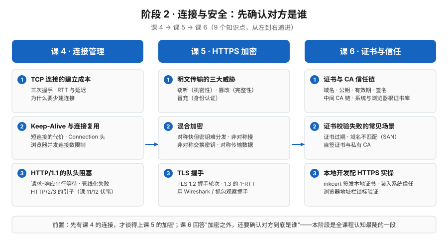

# 阶段 2 概览：连接与安全

> 所属课程：HTTP 系统学习 ｜ 故事章节：先确认对方是谁 ｜ 上一阶段：[阶段 1 · 报文与语义](../1-报文与语义/overview.md)

## 🎯 本阶段目标

- 能说清一条 HTTP 连接从 TCP 三次握手建立、Keep-Alive 复用到队头阻塞的全过程，理解"建立连接本身是要花钱的"。
- 能说清 HTTPS 的加密原理：明文传输的三大威胁、混合加密的分工、TLS 握手的轮次差异。
- 能在本地给开发环境配上 HTTPS（mkcert），并在证书报错出现时读懂报错、定位是信任链的哪一环出了问题。

## 📍 学习重点

- 连接是有成本的：三次握手、RTT 与延迟，"为什么要少建连接"——这是理解一切 HTTP 性能话题的起点。
- Keep-Alive 与连接复用：短连接的代价、持久连接与 Connection 头、浏览器并发连接数限制。
- 队头阻塞：HTTP/1.1 请求-响应串行等待的根源、管线化为什么失败——也是阶段 4 HTTP/2/3 演进的引子。
- 混合加密与 TLS 握手：对称加密快但密钥难分发、非对称加密解决分发但慢——"用非对称交换密钥、对称传输数据"；TLS 1.2 与 1.3 的轮次差异。
- 证书与信任链：证书里有什么、中间 CA 与证书链如何逐级背书、自签证书与 mkcert 本地实操。

## ✅ 必须掌握的知识点

| 知识点 | 所属课 | 学完应能 |
|--------|--------|----------|
| TCP 连接的建立成本 | 课 4《连接管理：握手、复用与队头阻塞》 | 能说清三次握手的过程、RTT 与延迟的关系，解释为什么要少建连接 |
| Keep-Alive 与连接复用 | 课 4《连接管理：握手、复用与队头阻塞》 | 能说清短连接的代价、持久连接与 Connection 头，知道浏览器并发连接数限制 |
| HTTP/1.1 的队头阻塞 | 课 4《连接管理：握手、复用与队头阻塞》 | 能解释请求-响应串行等待与管线化失败的原因，知道这是 HTTP/2/3 演进的引子 |
| 明文传输的三大威胁 | 课 5《HTTPS：明文的三大威胁与加密原理》 | 能对窃听、篡改、冒充各举一个场景，说清机密性、完整性、身份认证分别指什么 |
| 混合加密 | 课 5《HTTPS：明文的三大威胁与加密原理》 | 能说清对称与非对称加密的优劣取舍，解释"用非对称交换密钥、对称传输数据"的分工 |
| TLS 握手 | 课 5《HTTPS：明文的三大威胁与加密原理》 | 能说清 TLS 1.2 与 1.3 握手轮次的差异，会用抓包工具观察一次握手 |
| 证书与 CA 信任链 | 课 6《证书与信任：怎么确认"你就是你"》 | 能说清证书里有什么、中间 CA 与证书链如何逐级签名、系统与浏览器的根证书库是什么 |
| 证书校验失败的常见场景 | 课 6《证书与信任：怎么确认"你就是你"》 | 能对证书过期、域名不匹配（含多域名 SAN）、自签证书与私有 CA 三类报错说出成因与处理方式 |
| 本地开发配 HTTPS 实操 | 课 6《证书与信任：怎么确认"你就是你"》 | 会用 mkcert 签发本地证书、把本地 CA 装进系统信任，并用浏览器地址栏锁标验证 |

## 🗺️ 本阶段路径图

> SVG 展示本阶段 3 门课、9 个知识点的学习顺序与递进关系：先看清连接的成本与队头阻塞（课 4），再给连接加上加密（课 5），最后确认"对方是谁"（课 6）。

## 本阶段产出

- [x] `lessons/lesson-04-连接管理与队头阻塞.md`
- [x] `lessons/lesson-05-HTTPS加密原理.md`
- [x] `lessons/lesson-06-证书与信任.md`

> ✅ 阶段 2 已闭环（9 / 9，2026-09-15）：连接成本与复用 → HTTPS 加密与握手 → 证书信任与本地 HTTPS。

> ⚠️ 本阶段（TLS 与证书）是全课程认知最陡的一段，Phase 2 写课时节奏放慢。
