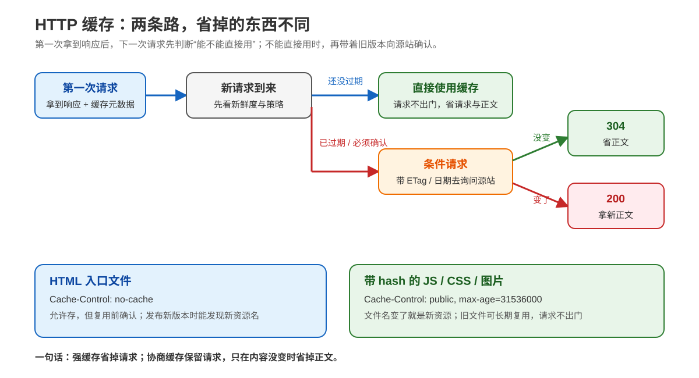
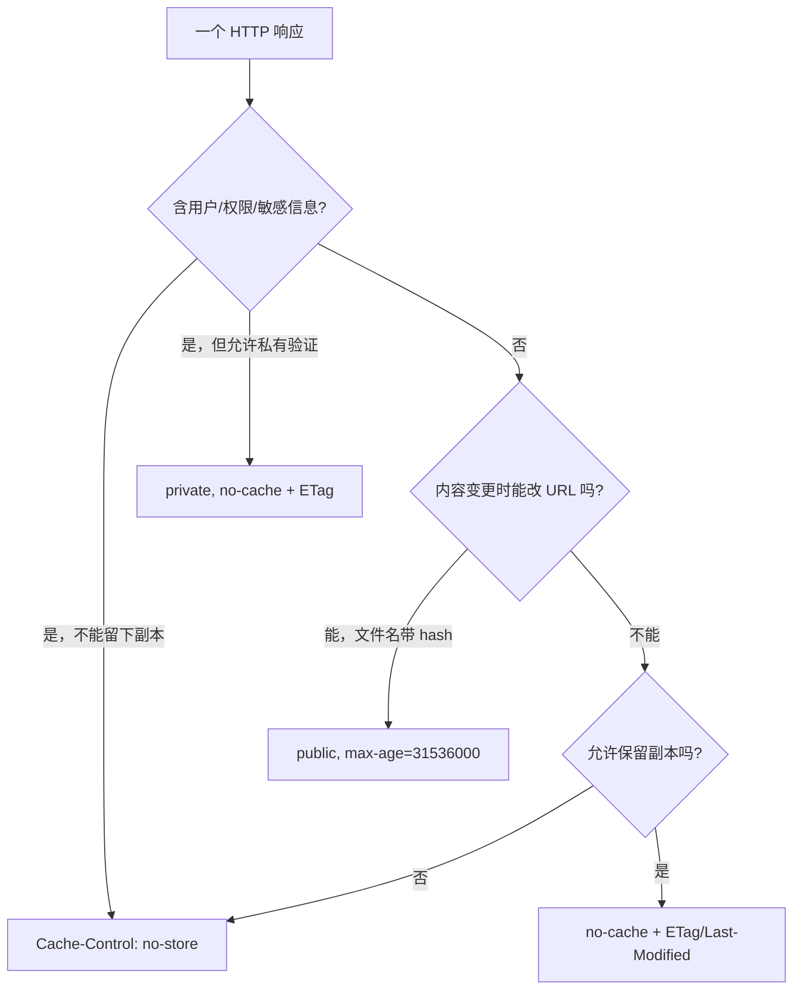

# 第 7 课：HTTP 缓存：让请求不出门

> 所属阶段：阶段 3《缓存与性能》｜水平：入门｜本课知识点：强缓存、协商缓存、缓存决策实战
> 故事情节：运营问“能不能让老用户第二次秒开”，小航第一次认真研究缓存

## 🎯 本课目标

- 用 `Cache-Control` 的 `max-age` / `no-cache` / `no-store` 为资源配置缓存，说清 `Expires` 与 `max-age` 的关系。
- 用 `ETag` / `If-None-Match` 与 `Last-Modified` / `If-Modified-Since` 配置协商缓存，解释“304 只省正文不省请求”。
- 为“HTML 不缓存 + 静态资源 hash 文件名长缓存”给出完整策略，并说清浏览器刷新与强制刷新的行为差异。

> 📖 **文档核对**：本课按 [RFC 9111 · HTTP Caching](https://www.rfc-editor.org/rfc/rfc9111.html) 与 [RFC 9110 · HTTP Semantics](https://www.rfc-editor.org/rfc/rfc9110.html) 核对（核查于 2026-09）。RFC 9111 是当前 HTTP 缓存规范，定义了新鲜度、缓存存储、验证和 `Cache-Control`；`304 Not Modified` 与条件请求字段的语义在 RFC 9110 中定义。

| 容易说过头的说法 | 本课采用的准确说法 |
|---|---|
| `no-cache` 就是“不缓存” | `no-cache` 允许存储，但复用前必须向源站验证；禁止存储是 `no-store` |
| 返回 304 就没有请求了 | 304 本身就是对一次请求的响应；它省的是响应正文，不省请求、连接和往返时间 |
| `max-age=3600` 保证客户端一小时不问服务器 | 它描述响应在缓存中的新鲜时间；强制验证、缓存策略和共享缓存规则仍可能使缓存重新确认 |
| 缓存只按 URL 判断 | 至少要考虑请求方法和目标 URI；响应的 `Vary` 还会把指定请求头纳入缓存键 |
| 只要资源更新，旧 URL 就会自动变成新内容 | 缓存不会猜测内容是否变了；要么验证，要么改变 URL（常见做法是文件名带内容 hash） |

## 📌 知识点导航

| 知识点 | 关键点 | 状态 |
|--------|--------|------|
| 7.1 强缓存 | `Cache-Control` 的 `max-age` / `no-cache` / `no-store` / `Expires` 与 `max-age` 的关系 | ✅ 已完成（2026-09-15） |
| 7.2 协商缓存 | `ETag` 与 `If-None-Match` / `Last-Modified` 与 `If-Modified-Since` / 304 只省正文不省请求 | ✅ 已完成（2026-09-15） |
| 7.3 缓存决策实战 | HTML 不缓存 + 静态资源 hash 文件名长缓存 / 刷新行为 / 缓存决策树 | ✅ 已完成（2026-09-15） |

---

## 第一幕：起源与场景引入

> 🏛️ **起源**：缓存并不是“浏览器偷偷留了一份文件”这么简单。HTTP 从一开始就允许响应声明“我还能被复用多久”，后来又补上了“如果你手里那份可能旧了，带着它的版本标记问我；没变就不用重传”的验证机制。今天的 `Cache-Control`、`ETag` 和 304，都是在解决同一个问题：**内容没变时，不要重复搬运同样的字节**。

> 🎬 **场景**：小航打开公司的活动页。第一次打开，HTML、几十个 JS/CSS 和图片一股脑从服务器回来；第二次打开时，运营说“还是有请求，缓存是不是没生效？”小航看 Network 面板，发现有的资源显示 `(from disk cache)`，有的请求却返回 304，还有一个接口每次都返回 200。三个现象看起来都叫“缓存”，实际上省下的东西不同。

> 💡 **一句话本质**：HTTP 缓存有两条路——**强缓存**让请求根本不出门；**协商缓存**让请求出门，但只确认“没变”，不再下载正文。

> ⚖️ **处境对照**：没有缓存，每次都问“请再给我一份”；强缓存像“我记得这份内容在一小时内有效，先直接用”；协商缓存像“我手里有版本 `v7`，你只需回答有没有变化”。前者省请求和响应，后者保留一次确认的成本，换取正文传输量下降。

## 第二幕：认知冲突

小航先提出三个看似合理、但会导致线上事故的判断：

1. “想让资源不缓存，就全部加 `no-cache`。”——不对，`no-cache` 不是禁止存储。
2. “304 说明浏览器没有访问服务器。”——不对，304 是服务器确认后的响应。
3. “所有文件都缓存一年最省事。”——不对，HTML、用户数据和带 hash 的静态资源的更新风险完全不同。

真正要回答的不是“要不要缓存”，而是三件事：**谁可以存？可以直接复用多久？不能直接复用时如何确认？**

## 第三幕：层层揭示



> 👀 **看图**：右上角两条分支是本课的地基：还新鲜时直接使用；需要确认时发条件请求，服务器返回 304 或带新正文的 200。底部是这套逻辑在真实项目里的两个典型落点。

### 本课地图

| 第几步 | 要解决什么 | 对应知识点 |
|---|---|---|
| 第 1 步 | 判断响应能否直接复用，区分 `max-age`、`no-cache` 和 `no-store` | 7.1 强缓存 |
| 第 2 步 | 资源可能旧时，带版本标记向服务器确认 | 7.2 协商缓存 |
| 第 3 步 | 按资源类型做策略，形成可部署、可失效的缓存决策 | 7.3 缓存决策实战 |

### 知识点 7.1：强缓存

> 本知识点关键点：`Cache-Control` 指令 / 新鲜度 / `no-cache` 与 `no-store` / `Expires` 兼容关系

> 🧭 **第 1/3 步｜承接**：课 6 解决了“和谁建立可信连接” → **本步**解决“响应已经拿到后，下一次能不能连问都不问”。

#### 一句话定义

强缓存是：**缓存判断响应仍然新鲜时，直接复用本地或共享缓存中的响应，不向源站发这次请求。**

“强”不是加密强度，而是“无需先向源站确认”的意思。是否新鲜，通常由响应里的 `Cache-Control: max-age=N` 或历史兼容字段 `Expires` 描述。

#### 直觉建立（类比）

把缓存想成办公室冰箱上的便签：

- `max-age=3600`：便签写“贴上后 3600 秒内可以直接拿来吃”；
- `no-cache`：允许把食物放进冰箱，但每次拿之前必须打电话问厨房“这份还算不算最新”；
- `no-store`：这份东西不要放进冰箱，吃完就不能留下；
- `private`：只能放在小航自己的冰箱，不能放进全公司的共享冰柜；
- `s-maxage`：专门给共享冰柜的保鲜时间，常用于 CDN 或反向代理。

> 💡 **类比边界**：HTTP 缓存不是一个中央冰箱，也不是所有缓存都遵循同一个 UI。浏览器私有缓存、公司代理和 CDN 都可能存在；最终是否命中还受缓存键、`Vary`、请求方法和其他缓存规则影响。这里先抓住“能否直接复用”的主线。

#### 核心原理：先看“谁能存”，再看“多久新鲜”

最常用的响应指令如下：

| 指令 | 能不能存 | 能不能未验证直接复用 | 典型含义 |
|---|---:|---:|---|
| `max-age=3600` | 可以 | 在新鲜期内可以 | 从响应生成/验证起，3600 秒内可直接使用 |
| `no-cache` | 可以 | 不可以 | 可以保存，但每次复用前都要验证 |
| `no-store` | 不可以 | 不可以 | 不要存储这次请求或响应，也不要从缓存复用 |
| `private` | 只能私有缓存 | 取决于其他指令 | 共享缓存不得保存；适合含用户信息的响应 |
| `public` | 可以共享 | 取决于其他指令 | 明确允许共享缓存保存；不是“缓存一年” |
| `s-maxage=60` | 共享缓存可以 | 60 秒内可直接复用 | 对共享缓存覆盖 `max-age` / `Expires` 的新鲜度 |

这里有三个非常重要的拆分：

1. **存储**和**复用**是两件事。`no-cache` 禁止的是“未经验证复用”，不是存储；`no-store` 才是“不要存”。
2. **新鲜**和**永远正确**是两件事。`max-age=3600` 只给出一个新鲜时间窗口；窗口结束后，缓存通常需要验证或重新取得响应。
3. **浏览器缓存**和**共享缓存**不是一件事。`s-maxage` 面向共享缓存，`private` 用来阻止共享缓存使用私人响应；即便浏览器可以存，也不代表 CDN 可以存。

`max-age=0` 也经常造成误解：它表示响应立刻变得不新鲜，通常会促使缓存重新验证；它不是 `no-store` 的同义词。若目标是“不要留下副本”，应使用 `no-store`。

#### `Expires` 与 `max-age` 的关系

`Expires` 是一个绝对日期，例如：

```http
Expires: Wed, 16 Sep 2026 12:00:00 GMT
```

`max-age` 是一个相对秒数，例如：

```http
Cache-Control: max-age=3600
```

如果同一个响应同时有二者，现代缓存应优先采用 `max-age`，忽略 `Expires`。原因很实际：相对秒数不依赖客户端时钟是否准确；`Expires` 主要为了兼容较老的 HTTP/1.0 缓存。

因此，今天更推荐：

```http
Cache-Control: public, max-age=31536000
```

如果还要兼容老设备，可以附带一个合理的 `Expires`，但不要让它和 `max-age` 传达相互矛盾的时间。

#### 示例演示：同一个“缓存”命令，可能表达三种完全不同的意图

```http
# 带内容 hash 的静态资源：文件名变了就是新版本
HTTP/1.1 200 OK
Cache-Control: public, max-age=31536000
Content-Type: application/javascript

# HTML 入口：允许暂存，但每次复用前确认
HTTP/1.1 200 OK
Cache-Control: no-cache
Content-Type: text/html

# 极敏感或不应留下副本的响应：禁止缓存存储
HTTP/1.1 200 OK
Cache-Control: private, no-store
Content-Type: application/json
```

读这三个例子时不要只看“有没有缓存”：

- 第一份资源把失效问题交给文件名，例如 `app.3f2a1c.js` 换成 `app.91c77e.js`；旧文件可以继续服务给仍在使用旧 HTML 的用户。
- 第二份 HTML 可以被缓存保存，但复用时必须询问服务器。这样服务器发布新 HTML 后，下一次访问有机会拿到新的资源引用。
- 第三份响应不应被浏览器或共享缓存留下。`private` 在这里是防共享缓存的额外表达，真正禁止存储的是 `no-store`。

#### 常见误区

1. **把 `no-cache` 写成“不缓存”**：会让排障人员误以为响应一定没有副本，进而误判“为什么浏览器仍显示缓存命中”。准确说法是“可存，但复用前必须验证”。
2. **把 `max-age=0` 写成 `no-store`**：前者是“立刻不新鲜”，后者是“不要存”。前者仍可能配合 ETag 返回 304，后者不应依赖缓存验证。
3. **只给浏览器设置一年缓存，却忘记共享缓存**：如果响应含用户特有内容，必须先考虑 `private`；不能因为浏览器能缓存，就让 CDN 也缓存。
4. **用 `Expires` 覆盖 `Cache-Control`**：有 `max-age` 时，`Expires` 不是胜出者；不要让客户端时钟和旧代理决定现代策略。
5. **认为新鲜期内一定能命中**：缓存键、`Vary`、请求方法、重新加载策略和缓存容量都可能影响实际命中；`max-age` 是允许复用的条件，不是命中率承诺。

#### 一句话记住

**`max-age` 管新鲜时间，`no-cache` 管“复用前要确认”，`no-store` 管“根本别存”；有 `max-age` 时它优先于 `Expires`。**

#### 官方文档

- [RFC 9111 §2 · 缓存概览与复用](https://www.rfc-editor.org/rfc/rfc9111.html#section-2)：缓存如何减少响应时间和带宽
- [RFC 9111 §4.2 · 新鲜度](https://www.rfc-editor.org/rfc/rfc9111.html#section-4.2)：fresh / stale 与 `max-age`
- [RFC 9111 §5.2.2.1 · `max-age`](https://www.rfc-editor.org/rfc/rfc9111.html#section-5.2.2.1)：相对新鲜时间
- [RFC 9111 §5.2.2.4 · `no-cache`](https://www.rfc-editor.org/rfc/rfc9111.html#section-5.2.2.4)：允许存储但复用前需验证
- [RFC 9111 §5.2.2.5 · `no-store`](https://www.rfc-editor.org/rfc/rfc9111.html#section-5.2.2.5)：禁止存储
- [RFC 9111 §5.3 · `Expires`](https://www.rfc-editor.org/rfc/rfc9111.html#section-5.3)：绝对过期时间及与 `max-age` 的优先级

---

### 知识点 7.2：协商缓存

> 本知识点关键点：验证器 / `ETag` 与 `If-None-Match` / `Last-Modified` 与 `If-Modified-Since` / 304 的成本边界

> 🧭 **第 2/3 步｜承接**：上一步知道响应“不新鲜”不等于“必须重新下载全文” → **本步**让缓存带着旧版本标记去问源站，由源站决定返回 304 还是新正文。

#### 一句话定义

协商缓存是：**缓存持有旧响应，下一次复用前用条件请求把旧响应的验证器带给服务器；内容没变就返回 304，变了就返回普通 200 和新正文。**

常见验证器有两组：

```text
ETag                 → If-None-Match
Last-Modified        → If-Modified-Since
```

#### 直觉建立（类比）

把它想成仓库盘点：小航手里有一箱标着 `ETag: "v7"` 的文件，不确定是不是最新。他不把整箱文件寄回仓库，只发一张卡片：“我这箱是 `v7`，如果还是 `v7`，请回复‘没变’；如果不是，请把新箱子发来。”

- 回复 `304 Not Modified`：仓库确认内容没变，小航继续用手里那箱；
- 回复 `200 OK`：内容已经变化，仓库把新正文发来；
- `ETag` 是服务器选择的内容版本验证器，`Last-Modified` 是内容修改时间。

> 💡 **类比边界**：`ETag` 是服务器选择的验证器，不必理解成某一种固定哈希；客户端不应自行计算“猜一个 ETag”。服务器必须比较收到的条件字段并做出判断。

#### 核心原理：先发条件请求，再分 304 / 200

服务器第一次返回资源时，可以加验证器：

```http
HTTP/1.1 200 OK
Cache-Control: no-cache
ETag: "article-42-v7"
Last-Modified: Tue, 15 Sep 2026 08:30:00 GMT
Content-Type: text/html
Content-Length: 18432

<html>...</html>
```

缓存下一次需要确认时，优先可以带 `If-None-Match`：

```http
GET /article/42 HTTP/1.1
Host: example.test
If-None-Match: "article-42-v7"
```

若服务器判断当前表示仍与该 ETag 匹配：

```http
HTTP/1.1 304 Not Modified
ETag: "article-42-v7"
Cache-Control: no-cache
```

304 通常没有响应正文。缓存把已有的正文与新的响应元数据组合起来继续使用。

若内容已经更新：

```http
HTTP/1.1 200 OK
ETag: "article-42-v8"
Content-Type: text/html
Content-Length: 19011

<html>...new content...</html>
```

这就是“304 只省正文不省请求”：浏览器仍然发出了 `GET`，仍然要经过连接、代理、服务器处理和至少一次网络往返；节省的是响应体字节、下载时间和带宽。

#### `ETag` 与 `Last-Modified`：怎么选

| 验证器 | 请求字段 | 优点 | 边界 |
|---|---|---|---|
| `ETag` | `If-None-Match` | 能表达更精细的版本；内容在同一秒内多次变化也能区分 | 需要服务端生成并稳定保存/计算验证器 |
| `Last-Modified` | `If-Modified-Since` | 简单、易读；适合已有可靠修改时间的文件 | 时间粒度和时钟问题可能让变化被合并或误判 |

实战中常同时发送 `ETag` 和 `Last-Modified`，让客户端具备后备方案。若请求同时带二者，服务器应优先处理 `If-None-Match`；只有没有可用的 ETag 条件时，才考虑修改时间条件。不要把时间字段当作比 ETag 更精确的版本号。

`ETag` 还有强验证器与弱验证器的区别：弱 ETag 以 `W/` 开头，例如 `W/"v7"`，表示“语义上等价”而不一定字节完全相同。入门阶段先记住：**不要手工去掉引号或 `W/`；把服务器发来的值原样放入 `If-None-Match`。**

#### `Vary`：为什么同一个 URL 可能不能共用一份响应

缓存不是只看 URL。比如服务器根据客户端是否支持 gzip 返回不同编码：

```http
Vary: Accept-Encoding
Content-Encoding: gzip
```

这表示 `Accept-Encoding` 会参与缓存匹配：支持 gzip 的请求不能拿到不支持 gzip 的那份表示。类似地，按语言返回内容时可能有：

```http
Vary: Accept-Language
```

所以“同一个 URL + 一个 ETag”并不总是完整的缓存模型。读到 `Vary` 时，要问：**哪些请求头会改变响应表示？共享缓存是否按这些维度分开？**

#### 示例演示：本机真实跑一遍 200 → 304

下面是一段不依赖第三方包的 Python 一次性实验。它启动本机临时 HTTP 服务，第一次返回正文和 ETag，第二次带 `If-None-Match`；服务器发现版本没变，就返回 304。

```bash
python3 - <<'PY'
from http.client import HTTPConnection
from http.server import BaseHTTPRequestHandler, ThreadingHTTPServer
from threading import Thread

BODY = b"version-1"
ETAG = '"v1"'

class Handler(BaseHTTPRequestHandler):
    def do_GET(self):
        if self.headers.get("If-None-Match") == ETAG:
            self.send_response(304)
            self.send_header("ETag", ETAG)
            self.end_headers()
            return
        self.send_response(200)
        self.send_header("Cache-Control", "no-cache")
        self.send_header("ETag", ETAG)
        self.send_header("Content-Length", str(len(BODY)))
        self.end_headers()
        self.wfile.write(BODY)

    def log_message(self, *_):
        pass

server = ThreadingHTTPServer(("127.0.0.1", 0), Handler)
Thread(target=server.serve_forever, daemon=True).start()
port = server.server_address[1]

conn = HTTPConnection("127.0.0.1", port)
conn.request("GET", "/demo")
first = conn.getresponse()
etag = first.getheader("ETag")
first_body = first.read()
print(f"first status={first.status} etag={etag} body_bytes={len(first_body)}")

conn.request("GET", "/demo", headers={"If-None-Match": etag})
second = conn.getresponse()
second_body = second.read()
print(f"second status={second.status} etag={second.getheader('ETag')} body_bytes={len(second_body)}")

conn.close()
server.shutdown()
PY
```

本机真实捕获结果：

```text
first status=200 etag="v1" body_bytes=9
second status=304 etag="v1" body_bytes=0
```

这两行分别证明：第一次拿到 9 字节正文；第二次请求没有消失，而是收到 304，正文体为 0。浏览器把第一次缓存的 9 字节正文重新交给页面使用。

#### 常见误区

1. **把 304 当成“缓存命中，所以没有网络”**：304 说明发生了网络验证；真正完全不出网的是新鲜的强缓存命中。
2. **认为 ETag 一定是文件的 MD5**：规范只要求它是服务器生成的实体标签；可以是版本号、哈希或其他稳定标识，不能把实现细节当协议语义。
3. **只设置 `Last-Modified`，却让内容在一秒内多次变化**：时间粒度不足时，条件判断可能看不出变化。动态内容更适合稳定的 ETag。
4. **忽略响应编码或语言差异**：没有正确设置 `Vary`，共享缓存可能把一种请求的表示给另一种请求。
5. **手工拼接错误的条件头**：`ETag` 的引号、弱验证器前缀和多个值都有语义；客户端应复用服务器返回的值，服务端应按规范解析。

#### 一句话记住

**协商缓存 = 带着旧版本去问；没变回 304，省正文；变了回 200，拿新正文。它省带宽，不省这次请求。**

#### 官方文档

- [RFC 9111 §4.3 · 缓存验证](https://www.rfc-editor.org/rfc/rfc9111.html#section-4.3)：缓存何时发起验证及如何处理验证结果
- [RFC 9110 §8.8.3 · ETag](https://www.rfc-editor.org/rfc/rfc9110.html#section-8.8.3)：实体标签语义
- [RFC 9110 §13.1.2 · If-None-Match](https://www.rfc-editor.org/rfc/rfc9110.html#section-13.1.2)：ETag 条件请求字段
- [RFC 9110 §13.1.3 · If-Modified-Since](https://www.rfc-editor.org/rfc/rfc9110.html#section-13.1.3)：修改时间条件请求字段
- [RFC 9110 §15.4.5 · 304 Not Modified](https://www.rfc-editor.org/rfc/rfc9110.html#section-15.4.5)：304 响应的语义和无正文边界
- [RFC 9111 §4.1 · Vary 与缓存键](https://www.rfc-editor.org/rfc/rfc9111.html#section-4.1)：请求方法、URI 和 `Vary` 如何影响缓存匹配

---

### 知识点 7.3：缓存决策实战

> 本知识点关键点：资源分类 / HTML 与 hash 静态资源 / 用户数据 / 刷新行为 / 缓存决策树

> 🧭 **第 3/3 步｜承接**：前两步分别解决“能否直接用”和“不能直接用时怎样确认” → **本步**把判断写成资源级策略，避免一句“全站缓存”或“全站不缓存”带来的事故。

#### 一句话定义

缓存决策实战是：**按资源的更新方式、内容是否含用户信息、是否可被共享和失效成本，为每类响应选择存储、复用和验证策略。**

缓存头不是装饰性配置，而是发布流程的一部分。

#### 直觉建立（类比）

把一个网站想成一本杂志：

- **HTML 目录页**像目录，目录变了，里面指向的文章地址可能也变；它应快速确认是否换版。
- **带 hash 的 JS/CSS**像印在封面上的版本号，内容一变，文件名也变；旧版本可以长期留着。
- **用户订单接口**像写着收件人姓名的信，不能放进公共阅览室。
- **公共产品图片**像海报，大家看到的都一样，适合在 CDN 和浏览器复用。

> 💡 **类比边界**：真实缓存还要考虑部署回滚、CDN 刷新、跨地域一致性和缓存键维度。这里的目标不是给出某个框架的唯一配置，而是让你能先做出正确的分类，再把策略落到服务器、反向代理和 CDN。

#### 核心原理：三问决策法

对每个响应按顺序问：

1. **内容是否包含用户或权限相关信息？** 如果是，先排除共享缓存；敏感响应通常直接 `no-store`。
2. **内容变化后，能否通过改变 URL 表达新版本？** 如果能，带 hash 的静态资源可以长时间强缓存。
3. **不能改 URL 时，是否能用验证器便宜确认？** 如果能，用 `no-cache` + `ETag` / `Last-Modified`；如果连副本也不应留下，用 `no-store`。

常见资源的起始策略：

| 资源 | 推荐起点 | 为什么 | 失效方式 |
|---|---|---|---|
| HTML 入口 | `Cache-Control: no-cache`，配 `ETag` | 允许本地保存，但复用前确认，及时发现新资源名 | 发布 HTML 后，下一次验证拿新版本 |
| 带 hash 的 JS/CSS | `Cache-Control: public, max-age=31536000` | URL 已含内容版本，旧文件不会“变身” | 构建产生新文件名；HTML 指向新名 |
| 带 hash 的公共图片/字体 | `Cache-Control: public, max-age=31536000` | 内容固定且所有用户可共享 | 新内容使用新 URL |
| 不带 hash 的公共图片 | `Cache-Control: public, max-age=86400` + ETag | 仍想缓存，但 URL 可能指向新内容 | 验证 ETag 或到期回源 |
| 用户个人 API | `Cache-Control: private, no-cache` 或按敏感度 `private, no-store` | 私有数据不应进共享缓存；需要实时性时每次验证 | ETag 验证，或不存储 |
| 支付、授权、隐私响应 | 通常 `Cache-Control: no-store` | 错误副本可能造成隐私或状态问题 | 不靠缓存失效解决，按业务重新获取 |

这里的 `31536000` 是一年秒数，代表一个常见的静态资源起点，不是所有项目都必须照抄。真正的前提是：**文件名中的 hash 必须随内容变化而变化，并且旧文件在仍可能被旧 HTML 引用期间不能被覆盖成另一份内容。**

#### 示例演示：HTML + hash 静态资源的发布闭环

一次构建可能产出：

```text
/index.html
/assets/app.3f2a1c.js
/assets/app.91c77e.css
```

服务器可以这样配置：

```http
# /index.html
Cache-Control: no-cache
ETag: "index-build-20260915-01"

# /assets/app.3f2a1c.js
Cache-Control: public, max-age=31536000
ETag: "app-js-3f2a1c"

# /api/me
Cache-Control: private, no-cache
ETag: "user-42-profile-19"
```

发布第二版时，HTML 改为引用：

```text
/assets/app.7a0d91.js
/assets/app.b91e20.css
```

老用户即使仍有 `app.3f2a1c.js`，也不会把它误认为新 JS；新 HTML 指向新 URL，自然拿到新文件。这个方案把“失效”从服务器强行清理缓存，变成构建系统改变 URL，稳定性通常更高。

#### 浏览器刷新与强制刷新：能观察什么，不能依赖什么

浏览器的普通刷新、强制刷新、开发者工具的“Disable cache”属于用户代理行为，细节会随浏览器版本、是否打开 DevTools 和请求上下文变化。可以用下面的工程化口径理解：

| 操作 | 通常观察到的行为 | 不要据此推导 |
|---|---|---|
| 普通打开页面 | 仍新鲜的资源可能直接来自内存/磁盘缓存；需要确认的资源会发条件请求 | 不能说“刷新一定不发请求”或“刷新一定绕过缓存” |
| 普通刷新 | 浏览器往往会重新检查页面资源，可能带条件头得到 304，也可能直接使用某些缓存项 | 不能把某个浏览器的 UI 行为当成 HTTP 规范保证 |
| 强制刷新/硬刷新 | 通常要求更积极地重新验证或绕过部分缓存，实际请求头因浏览器而异 | 不能用它替代正确的响应 `Cache-Control` |
| DevTools 的 Disable cache | DevTools 打开期间，便于每次观察网络请求和响应 | 它是调试开关，不会改变真实用户的缓存策略 |

在 Chrome DevTools 中做观察时，可以打开 Network 面板并勾选 Disable cache，再比较：

- `Size` 显示 `(from memory cache)` / `(from disk cache)`：通常说明请求没有真的发到网络；
- 状态码 `304`：请求已经发出，服务器确认缓存正文仍可用；
- 状态码 `200` 且带正文：可能拿到新内容，也可能是缓存策略要求重新返回完整响应。

因此，判断“缓存是否正确”的证据优先级应是：**响应头 + 请求头 + 状态码 + 是否真的传输了正文**，而不是刷新按钮的感觉。

#### 缓存决策树



树的关键不是记住某个数字，而是先把“安全边界、版本表达、验证能力”问完。对 CDN，再追加一个问题：公共响应是否允许共享缓存？需要时用 `public` 与 `s-maxage` 明确表达，不要让共享缓存猜测。

#### 常见误区

1. **全站统一 `max-age=31536000`**：HTML 和 API 的内容更新、隐私和失效成本不同；一刀切会导致发布不生效或用户数据泄露。
2. **只改文件内容，不改非 hash URL**：已经存在的强缓存可能在新鲜期内继续使用旧正文。若 URL 不能变，就应缩短新鲜期或使用验证器。
3. **部署新 hash 文件后立刻删除旧文件**：旧 HTML、回滚版本或正在打开的页面仍可能引用旧文件。长缓存要求旧资源在兼容窗口内可取。
4. **把 `private` 当成“完全不缓存”**：`private` 主要限制共享缓存；浏览器私有缓存仍可能保存。要禁止保存，用 `no-store`。
5. **把 `s-maxage` 当成浏览器缓存时间**：它主要作用于共享缓存；浏览器仍需看 `max-age` 或其他规则。
6. **只检查 200，不检查 304 和正文大小**：200 可能是新正文，304 才能证明服务器完成验证且没有重新传正文；还要看 `Content-Length`、传输大小和 DevTools 的 Size。

#### 一句话记住

**HTML 负责“发现新版本”，hash 静态资源负责“长期复用”，用户数据负责“隔离共享缓存”；策略要按资源分类，不按站点口号统一设置。**

#### 官方文档

- [RFC 9111 §2 · HTTP 缓存模型](https://www.rfc-editor.org/rfc/rfc9111.html#section-2)：缓存复用的总体目标
- [RFC 9111 §4.1 · 缓存键与 `Vary`](https://www.rfc-editor.org/rfc/rfc9111.html#section-4.1)：为什么同一 URI 可能对应多份表示
- [RFC 9111 §5.2.2.7 · `private`](https://www.rfc-editor.org/rfc/rfc9111.html#section-5.2.2.7)：限制共享缓存保存
- [RFC 9111 §5.2.2.10 · `s-maxage`](https://www.rfc-editor.org/rfc/rfc9111.html#section-5.2.2.10)：共享缓存专用的新鲜时间
- [RFC 9110 §12.5.5 · `Vary`](https://www.rfc-editor.org/rfc/rfc9110.html#section-12.5.5)：响应表示随请求头变化时的声明

---

## 第四幕：实操验证

### 实验 A：用响应头判断是哪一条缓存路径

对一个实际接口或静态文件，用 `curl` 同时看响应头和正文：

```bash
curl -sS -D - -o /tmp/http-cache-body-1 'https://example.com/assets/app.3f2a1c.js'
```

重点找这些字段：

```text
Cache-Control: ...
ETag: ...
Last-Modified: ...
Expires: ...
Vary: ...
Age: ...
```

如果拿到 ETag，可以手工发一次条件请求：

```bash
curl -sS -D - -o /tmp/http-cache-body-2 \
  -H 'If-None-Match: "把上一次响应的 ETag 原样放这里"' \
  'https://example.com/assets/app.3f2a1c.js'
```

不要把示例域名当成真实测试目标，也不要把不存在的 ETag 当成预期输出。真实接口上的证据应以你当时捕获的状态码和头部为准：

| 观察 | 结论 |
|---|---|
| 没有产生网络请求，浏览器标记 memory/disk cache | 走了强缓存或用户代理本地复用 |
| 请求发出，响应 `304`，无正文 | 走了协商缓存，省正文，不省请求 |
| 请求发出，响应 `200`，有新正文 | 验证失败或策略要求重新传输 |
| 响应 `Cache-Control: no-store` | 客户端/共享缓存不应保存这次响应 |

### 实验 B：按资源类型写一张自己的缓存表

在项目中任选一个页面，填写下面这张表，不要先写指令，先写事实：

| 资源 | 内容是否用户相关 | URL 是否带版本 | 是否允许共享 | 选择的策略 | 发布/失效动作 |
|---|---|---|---|---|---|
| HTML | 否 | 否 | 是 | `no-cache` + ETag | HTML ETag 变化 |
| JS/CSS | 否 | 是 | 是 | `public, max-age=31536000` | 构建生成新 hash URL |
| `/api/me` | 是 | 否 | 否 | `private, no-cache` 或 `no-store` | 验证或重新获取 |

这一步的验收标准不是“所有格子都填同一个值”，而是每一行都能回答：**旧内容什么时候可以直接用？什么时候必须问？谁不能看到这份副本？内容变更后靠什么被发现？**

### 实验 C：在 DevTools 里把 200、304、本地命中分开

1. 打开浏览器 DevTools 的 Network 面板。
2. 先不勾选 Disable cache，打开页面，观察静态资源的 Size 和状态码。
3. 刷新页面，找到入口 HTML、一个 hash JS 和一个 API。
4. 对照响应头：HTML 是否有 `no-cache` 与 ETag；JS 是否有长 `max-age`；API 是否有 `private` 或 `no-store`。
5. 勾选 Disable cache 后再刷新，观察“调试时每次都看到请求”与真实用户行为的差别。

### 📋 命令速查卡

| 目的 | 命令/写法 | 看什么 |
|---|---|---|
| 只看响应头 | `curl -sS -D - -o /dev/null URL` | `Cache-Control` / ETag / `Vary` |
| 保存正文并看头 | `curl -sS -D headers.txt -o body.bin URL` | 头、正文大小和内容是否一致 |
| 发 ETag 条件请求 | `curl -sS -D - -H 'If-None-Match: "..."' -o /dev/null URL` | 是否得到 304 |
| 发时间条件请求 | `curl -sS -D - -H 'If-Modified-Since: ...' -o /dev/null URL` | 时间验证是否生效 |
| 强制客户端重新验证 | `curl -sS -D - -H 'Cache-Control: no-cache' URL` | 这是请求意图，不等于服务端响应策略 |
| 让缓存认为立即过期 | `curl -sS -D - -H 'Cache-Control: max-age=0' URL` | 常触发重新验证；不是 `no-store` |

> 🧯 **排障顺序**：先看响应的 `Cache-Control`，再看缓存是否带 ETag/Last-Modified，接着看请求是否带条件头，最后看状态码和正文传输。不要从“我按了刷新”直接跳到“服务端缓存配置错了”。

---

## 第五幕：体系收束

### 这节课的三层结论

1. **机制层**：强缓存把请求挡在缓存处；协商缓存让请求到达服务器，但用 304 避免重复发送正文。
2. **字段层**：`Cache-Control` 决定存储和新鲜度，`ETag` / `Last-Modified` 提供验证依据，`If-None-Match` / `If-Modified-Since` 把依据带回服务器，`Vary` 防止不同表示混用。
3. **工程层**：HTML 用验证发现新版本，带 hash 的静态资源用 URL 版本化支撑长缓存，用户数据先划清私有/敏感边界；刷新按钮只是观察手段，不是发布策略。

### 给小航的最终配置

```text
入口 HTML       → no-cache + ETag
hash 静态资源   → public + 长 max-age
公共但无 hash   → 较短 max-age + ETag
用户 API        → private + no-cache，或按敏感度 no-store
共享缓存/CDN    → 明确 public / s-maxage，并检查 Vary
```

### 自测题

1. `Cache-Control: no-cache` 和 `Cache-Control: no-store` 的差别是什么？
2. 浏览器发出 `If-None-Match` 后收到 304，为什么仍然不能说“这次请求没有走网络”？
3. 为什么 HTML 通常不做一年强缓存，而带 hash 的 JS 可以做一年强缓存？

<details>
<summary>展开答案</summary>

1. `no-cache` 可以保存响应，但复用前必须向源站验证；`no-store` 禁止缓存存储和复用。
2. 条件请求已经发出并经过了网络和服务器；304 只是说明服务器确认旧正文仍可用，因此省的是正文传输。
3. HTML 往往是发现新资源 URL 的入口，长时间不验证会继续引用旧资源；hash JS 的内容变化会生成新 URL，旧 URL 可以安全长缓存。

</details>

## ✅ 本课完成标准

- [x] 能用一句话区分强缓存和协商缓存。
- [x] 能解释 `max-age`、`no-cache`、`no-store`、`private`、`s-maxage` 的主要边界。
- [x] 能从 ETag 发出 `If-None-Match`，并解释 200 与 304 的差异。
- [x] 能为 HTML、hash 静态资源、用户 API 分别写出缓存策略和失效动作。
- [x] 能在 DevTools 或 `curl` 中区分本地命中、304 和带正文的 200。

## 🔗 课程导航

- [返回课程目录](../../../02-课程目录.md)
- [上一课：证书与信任：怎么确认“你就是你”](../../2-连接与安全/lessons/lesson-06-证书与信任.md)
- [下一课：性能测量与优化：把“慢”拆成段落](lesson-08-性能测量与优化.md)
- [阶段 3 概览：缓存与性能](../overview.md)

> 🧭 **接力提示**：下一课进入性能测量。请先保留本课的缓存分类表，下一课会把一次请求拆成 DNS、连接、TLS、TTFB、下载等可观测段落，并用 `curl -w` 和 DevTools 瀑布图验证“慢”到底慢在哪里。
