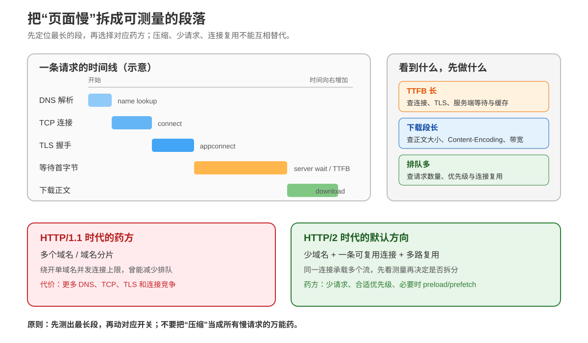

# 第 8 课：性能测量与优化：把“慢”拆成段落

> 所属阶段：阶段 3《缓存与性能》｜水平：入门｜本课知识点：响应压缩、性能测量、HTTP 视角的加载优化
> 故事情节：大促前压测，“页面慢”被拆成可测量的几段，每段各有药方

## 🎯 本课目标

- 配置响应压缩：说清 `Content-Encoding` 与 `Accept-Encoding` 的协商过程，在 gzip 与 Brotli 之间做取舍。
- 用 DevTools 瀑布图与 `curl -w` 把“慢”拆成 DNS / 连接 / TLS / TTFB / 下载等可测量的段落，读出每段耗时。
- 从 HTTP 视角给出加载优化方向，说清少请求、连接复用、域名分片和 `preload` / `prefetch` 的边界。

> 📖 **文档核对**：本课按 [RFC 9110 · HTTP Semantics](https://www.rfc-editor.org/rfc/rfc9110.html)、[RFC 9113 · HTTP/2](https://www.rfc-editor.org/rfc/rfc9113.html)、[RFC 7932 · Brotli](https://www.rfc-editor.org/rfc/rfc7932.html)、[curl 官方手册](https://curl.se/docs/manpage.html) 与 [Chrome DevTools Network 文档](https://developer.chrome.com/docs/devtools/network/reference/) 核对（核查于 2026-09）。`preload` / `prefetch` 的资源提示语义按 [WHATWG HTML Standard](https://html.spec.whatwg.org/multipage/links.html) 核对。

| 容易说过头的说法 | 本课采用的准确说法 |
|---|---|
| TTFB 就是服务器代码执行时间 | TTFB 还包含请求往返、连接阶段等；它是“从开始到收到首字节”的端到端观测量 |
| 总耗时高，所以服务器一定慢 | 总耗时可能长在 DNS、连接、排队、下载或浏览器处理；必须先拆段 |
| 开 gzip / Brotli 后所有请求都会更快 | 压缩省传输字节，但增加压缩 CPU；小文件、已压缩格式和 CPU 紧张时收益可能为负 |
| HTTP/2 还要把资源分到多个域名 | HTTP/2 的多路复用减少了按域名开连接的动机；域名分片会重新引入 DNS、TCP、TLS 和连接管理成本 |
| `preload` / `prefetch` 都是“提前加载” | `preload` 面向当前页面的关键资源；`prefetch` 面向未来导航，二者不应全量乱加，也不保证一定产生收益 |

## 📌 知识点导航

| 知识点 | 关键点 | 状态 |
|--------|--------|------|
| 8.1 响应压缩 | `Content-Encoding` 与 `Accept-Encoding` 协商 / gzip 与 Brotli 的取舍 / 压缩 CPU 代价与不适用场景 | ✅ 已完成（2026-09-15） |
| 8.2 性能测量 | DevTools 瀑布图 / TTFB 与各阶段耗时 / `curl -w` 时间分布（DNS 深度不在本课展开） | ✅ 已完成（2026-09-15） |
| 8.3 HTTP 视角的加载优化 | 少请求与连接复用 / HTTP/2 下域名分片的历史教训 / `preload` 与 `prefetch` 边界 | ✅ 已完成（2026-09-15） |

---

## 第一幕：起源与场景引入

> 🏛️ **起源**：网页越来越复杂后，“慢”不再是一个单一问题。一份 HTML 可能还要带来脚本、样式、字体和图片；请求既要寻找地址、建立连接、完成 TLS，又要等服务器准备结果，最后还要把正文搬完。HTTP 的性能工具因此分成几类：编码压缩减少搬运量，连接复用减少重复握手，缓存避免重复请求，计时工具把剩余成本拆出来。

> 🎬 **场景**：大促前，小航收到两条互相矛盾的反馈。运营的电脑“点开后半天白屏”，抓到的请求 TTFB 很长；另一位用户说“首屏很快出现，但页面最后几个图片很久才完成”，他的 TTFB 不高，下载段却很长。两个人都说“页面慢”，但药方完全不同。

> 💡 **一句话本质**：性能优化不是先打开一个开关，而是先把一次请求拆成段，找出最长段，再对症下药。

> ⚖️ **处境对照**：压缩解决“同样内容少搬几字节”；连接复用解决“不要为每个资源重复打招呼”；`preload` 解决“关键资源发现得太晚”；`prefetch` 解决“下一页资源可以趁现在有空准备”。它们针对的是不同瓶颈，混用概念就会把优化做成噪音。

## 第二幕：认知冲突

小航先有四个直觉判断：

1. “把服务器升级、CPU 加倍，页面就会快。”——如果瓶颈是下载字节数或浏览器排队，CPU 加倍不一定有用。
2. “TTFB 高就是后端 SQL 慢。”——TTFB 包含网络往返、连接和服务器准备，必须继续拆分。
3. “请求越少越好，所以把所有 JS 打成一个超大包。”——请求数只是一个维度；大包可能延长首屏下载、降低缓存复用粒度。
4. “HTTP/2 多路复用后，继续用四个静态资源域名能并行更多。”——HTTP/2 已经允许一条连接承载多个流，分片可能只增加连接成本。

真正要问的是：**时间花在哪里？字节花在哪里？请求为什么没有及时开始？当前协议版本已经替你解决了什么？**

## 第三幕：层层揭示



> 👀 **看图**：左边是一次请求的时间线，右边把三个常见症状接到排查方向；底部对照 HTTP/1.1 时代的域名分片与 HTTP/2 时代的默认方向。每个颜色块都代表“先测量，再决定是否动手”。

### 本课地图

| 第几步 | 要解决什么 | 对应知识点 |
|---|---|---|
| 第 1 步 | 让响应更少字节地到达，理解编码协商的边界 | 8.1 响应压缩 |
| 第 2 步 | 把一条请求拆成 DNS、连接、TLS、等待、下载 | 8.2 性能测量 |
| 第 3 步 | 减少不必要的请求和连接，并控制资源发现时机 | 8.3 HTTP 视角的加载优化 |

### 知识点 8.1：响应压缩

> 本知识点关键点：内容编码 / 协商选择 / `Content-Encoding` / `Accept-Encoding` / gzip 与 Brotli / CPU 与不适用格式

> 🧭 **第 1/3 步｜承接**：课 7 已经解决“资源要不要重复取” → **本步**解决“确实要传时，能不能少传一些字节”。

#### 一句话定义

响应压缩是：**服务器在保持原媒体类型语义不变的前提下，对表示应用一种内容编码，客户端根据 `Accept-Encoding` 选择并解码。**

例如，JSON 仍然是 JSON，HTML 仍然是 HTML；只是线路上的表示可能经过 gzip 或 Brotli 编码。

#### 直觉建立（类比）

把它想成寄快递：

- `Content-Type` 是“箱子里装的是书、衣服还是玻璃杯”；
- `Content-Encoding` 是“箱子被真空压缩、打包或折叠过”；
- `Accept-Encoding` 是“收件人声明自己能拆哪些包装”；
- `Vary: Accept-Encoding` 是“仓库提醒缓存：会拆 gzip 的收件人和不会拆的收件人，不能混用同一份包裹”。

> 💡 **类比边界**：压缩是可逆的内容编码，不是加密；它也不是消息分帧。`Content-Encoding` 描述表示如何编码，`Transfer-Encoding`（在适用的 HTTP 版本中）处理消息传输层面的编码/分帧，二者不要混写。

#### 核心原理：请求声明能力，响应声明结果

客户端可以发：

```http
GET /assets/app.js HTTP/1.1
Host: example.test
Accept-Encoding: br, gzip;q=0.8, identity;q=0.1
```

这表示客户端可以接受 Brotli 和 gzip，并用质量值表达偏好；`identity` 表示不编码。服务器有可用的 Brotli 表示时，可能返回：

```http
HTTP/1.1 200 OK
Content-Type: application/javascript
Content-Encoding: br
Vary: Accept-Encoding
Content-Length: 300510

...Brotli 编码后的正文...
```

如果服务器只准备了 gzip，也可以返回：

```http
Content-Encoding: gzip
Vary: Accept-Encoding
```

如果没有可接受的编码，或者正文不值得压缩，可以返回未编码的表示。`Accept-Encoding` 是“可接受什么”的协商输入，不是“服务器必须使用最高压缩率”的命令；服务器还要考虑已有文件、CPU、响应大小和部署策略。

根据 RFC 9110，`Content-Encoding` 列出应用到表示上的编码，并且编码顺序是实际应用顺序；`Accept-Encoding` 的质量值可以帮助服务器在多个可接受编码中选择。若响应会因 `Accept-Encoding` 改变，必须让缓存按这个维度区分表示，通常加入 `Vary: Accept-Encoding`。

#### gzip 与 Brotli：工程上怎么取舍

| 维度 | gzip | Brotli（`br`） |
|---|---|---|
| 定位 | 成熟的通用压缩格式，兼容性与工具链广 | 面向通用无损压缩，RFC 7932 定义格式 |
| 常见收益 | 对 HTML/CSS/JS/JSON 有明显收益 | 对 Web 文本通常能在合适级别下得到更小表示 |
| 压缩 CPU | 低级别通常较快；高压缩级别也会增加 CPU | 压缩级别越高，压缩时间和 CPU 可能明显上升 |
| 部署策略 | 适合动态压缩和预生成 `.gz` | 适合静态预压缩，动态请求应控制质量级别 |
| 现实取舍 | 作为稳妥回退 | 客户端声明支持时优先考虑，再保留 gzip/identity 回退 |

“Brotli 更小”不等于“任何输入都更小”。实际收益取决于内容、压缩级别和是否已经压缩；选择时要同时记录**传输字节、压缩耗时、CPU 使用和首字节/总耗时**。

#### 示例演示：哪些内容适合压缩

适合优先考虑响应压缩：

```text
HTML / CSS / JavaScript / JSON / SVG / XML / 纯文本
```

通常不应再次压缩：

```text
JPEG / PNG / WebP / AVIF / MP4 / MP3 / ZIP / gzip / Brotli 文件
```

这些格式本身已经经过专门压缩，再套一层通用压缩往往收益很小，甚至增加 CPU 和响应延迟。很小的正文也不一定值得压缩：编码头、压缩初始化和服务端判断都有固定成本。

动态响应的常见策略是设一个最小大小阈值，再使用较低或中等压缩级别；静态资源则在构建阶段预生成 `.gz` / `.br`，请求时只做内容协商和文件选择。这样可以把昂贵的压缩计算从请求路径移走。

#### 本机真实对比：同一份文本用 gzip 与 Brotli

下面用固定随机种子生成约 2.18 MB 的 JSON Lines，避免拿“全是同一行”的玩具输入夸大压缩比例，再分别调用本机 `gzip -6` 与 `brotli -q 5`：

```bash
python3 - <<'PY'
import json, random, subprocess, time

random.seed(20260915)
rows = []
for i in range(12000):
    row = {
        "event": "checkout",
        "user_id": random.randrange(1, 500000),
        "items": [
            {"sku": f"book-{random.randrange(1, 3000):04d}", "quantity": random.randrange(1, 5)}
            for _ in range(random.randrange(1, 4))
        ],
        "currency": random.choice(["CNY", "USD", "EUR"]),
        "status": random.choice(["paid", "pending", "cancelled"]),
        "request_id": f"{random.getrandbits(64):016x}",
    }
    rows.append(json.dumps(row, separators=(",", ":")).encode() + b"\n")

payload = b"".join(rows)
print(f"raw bytes={len(payload)}")
for name, command in [
    ("gzip-6", ["gzip", "-6", "-c"]),
    ("brotli-5", ["brotli", "-q", "5", "-c"]),
]:
    started = time.perf_counter()
    result = subprocess.run(command, input=payload, stdout=subprocess.PIPE, check=True)
    wall_ms = (time.perf_counter() - started) * 1000
    print(f"{name} bytes={len(result.stdout)} ratio={len(result.stdout)/len(payload):.4f} wall_ms={wall_ms:.3f}")
PY
```

本机一次真实捕获结果（`wall_ms` 会随机器负载波动）：

```text
raw bytes=2177712
gzip-6 bytes=317710 ratio=0.1459 wall_ms=23.155
brotli-5 bytes=300510 ratio=0.1380 wall_ms=42.641
```

这次输入中，Brotli 压缩后比 gzip 少约 5.4% 的编码字节；`wall_ms` 只是单次本机观测，会受到系统负载和工具实现影响，不能据此断言某种编码恒定更快。这次实验的价值是提供可复用的测量方法：生产决策应使用自己的真实 HTML、JS、JSON 和图片样本，并把解压/渲染链路一起观察。

#### 常见误区

1. **把 `Accept-Encoding` 当成响应头**：客户端在请求中声明能接受什么；服务器用 `Content-Encoding` 声明实际用了什么。
2. **压缩后忘记 `Vary: Accept-Encoding`**：共享缓存可能把 Brotli 表示提供给只会处理 gzip/identity 的客户端。
3. **把 `Content-Encoding: gzip` 和 `Content-Type: application/gzip` 混为一谈**：前者是对表示应用的传输编码，后者是媒体类型；压缩 HTML 后仍可保持 `Content-Type: text/html`。
4. **对 JPEG、ZIP 再压缩**：先看格式本身是否已经压缩，不要凭“响应很大”就统一套 gzip。
5. **只比较压缩后字节，不比较端到端时间**：压缩 CPU、排队和首字节时间可能吞掉字节收益。
6. **认为客户端一定支持 Brotli**：必须根据请求中的 `Accept-Encoding` 协商；没有合适编码时要能回退到 gzip 或 identity。

#### 一句话记住

**`Accept-Encoding` 说“我能拆什么”，`Content-Encoding` 说“这次实际怎么包”；压缩省带宽，但要用字节、CPU 和端到端时间一起衡量。**

#### 官方文档

- [RFC 9110 §8.4 · Content-Encoding](https://www.rfc-editor.org/rfc/rfc9110.html#section-8.4)：内容编码与媒体类型的两层关系
- [RFC 9110 §8.4.1 · Content Codings](https://www.rfc-editor.org/rfc/rfc9110.html#section-8.4.1)：内容编码的通用语义
- [RFC 9110 §12.5.3 · Accept-Encoding](https://www.rfc-editor.org/rfc/rfc9110.html#section-12.5.3)：编码协商、质量值与回退
- [RFC 7932 · Brotli Compressed Data Format](https://www.rfc-editor.org/rfc/rfc7932.html)：Brotli 格式与 `br` 编码登记

---

### 知识点 8.2：性能测量

> 本知识点关键点：瀑布图 / DNS / TCP / TLS / 排队 / TTFB / Content Download / `curl -w` 的累计时间

> 🧭 **第 2/3 步｜承接**：上一步告诉你“下载字节多”时可以考虑压缩 → **本步**先确认慢的确在下载，还是慢在请求尚未开始、连接建立或服务器等待。

#### 一句话定义

性能测量是：**把从发起请求到完成响应的总时间，按可观察事件拆成阶段，并用同一口径比较优化前后。**

本课只在 HTTP 视角解释 DNS 的计时点，不深入 DNS 记录、缓存层级和解析算法；那属于后续网络专题的边界。

#### 直觉建立（类比）

把一次请求想成快递：

1. 查地址：DNS Lookup；
2. 找到仓库并开门：TCP Connect；
3. 验证身份并建立安全通道：TLS / SSL；
4. 排队等仓库拣货：Queueing / Waiting；
5. 第一件货物到手：TTFB；
6. 把整箱货搬完：Content Download。

总耗时只是“从出发到收货”的时间。没有分段，就不知道应该换 DNS、复用连接、优化服务端，还是压缩正文。

> 💡 **类比边界**：这些阶段在浏览器与命令行工具中命名和边界略有差别，也可能重叠；计时值是观测量，不是后端内部函数的精确剖面。尤其 TTFB 不是纯服务器执行时间。

#### 核心原理：`curl -w` 给的是累计时间，要自己做差

`curl --write-out` 可以把传输变量写到标准输出。常用变量的含义是“从本次操作开始累计到某个事件”：

| 变量 | 含义 | 适合回答 |
|---|---|---|
| `%{time_namelookup}` | 到名称解析完成的累计秒数 | 地址解析这一段大致花了多久 |
| `%{time_connect}` | 到 TCP 连接完成的累计秒数 | 建立 TCP 后总共到哪里 |
| `%{time_appconnect}` | 到 TLS/SSL 握手完成的累计秒数；普通 HTTP 通常为 0 | TLS 是否占了明显成本 |
| `%{time_pretransfer}` | 到即将开始传输前的累计秒数 | 连接、TLS 和请求准备何时完成 |
| `%{time_starttransfer}` | 到收到首字节的累计秒数 | 端到端 TTFB 观察值 |
| `%{time_total}` | 整个操作完成的累计秒数 | 用户等待到传输结束的总时间 |
| `%{size_download}` | 下载的正文大小 | 实际收到多少字节 |

对于一次没有重定向、没有代理特殊行为的简单请求，可以近似计算：

```text
DNS              = time_namelookup
TCP              = time_connect - time_namelookup
TLS              = time_appconnect - time_connect（仅 HTTPS；普通 HTTP 为 0）
请求准备         = time_pretransfer - time_connect（HTTP）
                   或 time_pretransfer - time_appconnect（HTTPS）
等待首字节/TTFB  = time_starttransfer - time_pretransfer
正文下载         = time_total - time_starttransfer
```

注意：这些差值是诊断用近似分段，不是 HTTP 规范定义的“绝对物理边界”。如果有重定向，使用 `-L` 后还要关注重定向变量；如果复用连接，TCP/TLS 计时可能接近 0，因为本次操作没有重新建立它们。

#### 示例演示：读一条真实 `curl -w` 时间线

本机启动一个临时 HTTP/1.1 服务，在发送响应前故意等待约 80 ms，再让 `curl` 只写出正文计时。服务端代码不代表生产服务器，只用于制造一个可识别的等待段：

```bash
python3 - <<'PY'
import subprocess
import time
from http.server import BaseHTTPRequestHandler, ThreadingHTTPServer
from threading import Thread

BODY = b"x" * 65536

class Handler(BaseHTTPRequestHandler):
    protocol_version = "HTTP/1.1"

    def do_GET(self):
        time.sleep(0.08)
        self.send_response(200)
        self.send_header("Content-Type", "text/plain")
        self.send_header("Content-Length", str(len(BODY)))
        self.end_headers()
        self.wfile.write(BODY)

    def log_message(self, *_):
        pass

server = ThreadingHTTPServer(("127.0.0.1", 0), Handler)
Thread(target=server.serve_forever, daemon=True).start()
url = f"http://127.0.0.1:{server.server_address[1]}/slow"
fmt = (
    "http_version=%{http_version}\\n"
    "time_namelookup=%{time_namelookup}\\n"
    "time_connect=%{time_connect}\\n"
    "time_appconnect=%{time_appconnect}\\n"
    "time_pretransfer=%{time_pretransfer}\\n"
    "time_starttransfer=%{time_starttransfer}\\n"
    "time_total=%{time_total}\\n"
    "size_download=%{size_download}\\n"
)
result = subprocess.run(
    ["curl", "-sS", "-o", "/dev/null", "-w", fmt, url],
    text=True,
    capture_output=True,
    check=True,
)
print(result.stdout, end="")
server.shutdown()
PY
```

本机一次真实捕获结果（2026-09-15）：

```text
http_version=1.1
time_namelookup=0.000064
time_connect=0.000241
time_appconnect=0.000000
time_pretransfer=0.000265
time_starttransfer=0.087899
time_total=0.087965
size_download=65536
```

把累计值做差，大致得到：

| 段 | 计算 | 本次观测 |
|---|---|---:|
| DNS | 0.000064 | 0.064 ms |
| TCP | 0.000241 − 0.000064 | 0.177 ms |
| TLS | 普通 HTTP，无 TLS | 0 ms |
| 请求准备 | 0.000265 − 0.000241 | 0.024 ms |
| 等待首字节 | 0.087899 − 0.000265 | 87.634 ms |
| 下载正文 | 0.087965 − 0.087899 | 0.066 ms |

这次“慢”几乎全在等待首字节，因为服务端明确 `sleep(0.08)`；下载 64 KiB 只占约 0.067 ms。此时开 Brotli 并不是第一药方，应该先查服务端等待、数据库、上游调用或是否错误地绕过了缓存。真实网络中 DNS、TLS 和下载段会受网络环境影响，不能把这组 localhost 数字当作公网基准。

#### DevTools 瀑布图怎么读

在 Chrome DevTools 的 Network 面板中选中请求，打开 Timing；也可以把鼠标悬停在 Waterfall 上预览阶段。常见阶段可以这样读：

| DevTools 阶段 | 它说明什么 | 看到它很长，先查什么 |
|---|---|---|
| Queueing | 请求还没开始，等待优先级、可用连接或其他资源 | 请求数量、资源优先级、HTTP/1.1 连接上限 |
| Stalled | 请求开始前后被暂时卡住 | 连接占用、代理、浏览器调度 |
| DNS Lookup | 浏览器解析域名 | DNS 路径；本课不展开解析内部机制 |
| Initial connection | 建 TCP，HTTPS 还包含 SSL 协商 | 连接复用、网络 RTT、TLS 建立 |
| Request sent | 发送请求报文 | 通常很短，若异常查上行阻塞 |
| Waiting (TTFB) | 等待首字节，包含网络往返与服务器准备 | 服务端等待、上游依赖、缓存/CDN 命中情况 |
| Content Download | 读取响应正文 | 正文大小、带宽、浏览器读取/解码压力 |

不要只看单个请求：

- 看请求之间的水平位置和空白，判断资源是否被排队或发现太晚；
- 看 Initiator，判断是谁触发了这个请求；
- 看请求数、Transferred 与资源解压后的大小，避免把“线路传输大小”和“页面实际使用的未压缩大小”混为一谈；
- 对比缓存关闭与开启、HTTP/1.1 与 HTTP/2、压缩开启与关闭时的同一指标，而不是只比较一次总耗时。

#### 常见误区

1. **看到 TTFB 高就直接改 SQL**：先确认 DNS、连接、TLS 和代理路径；TTFB 是端到端时间。
2. **把 `time_connect` 当作本次一定新建了 TCP**：复用连接时它可能接近 0；要结合是否启用连接复用和请求上下文。
3. **拿一次测量结果下结论**：网络和机器有抖动，至少做多次、看中位数或分位数；本课的单次本机输出只是方法演示。
4. **只看 `time_total` 不看 `size_download`**：总时间告诉你结果，大小帮助判断下载段是否有优化空间。
5. **用 localhost 测公网连接性能**：localhost 几乎没有真实 RTT、丢包和拥塞，适合验证代码流程，不适合代表真实用户体验。
6. **把 DNS 解析内部当成 HTTP 课的必修深度**：本课只使用 DNS Lookup 这一观测段，解析器、记录和缓存层级留给网络专题。

#### 一句话记住

**`curl -w` 的时间是累计值，先读 `time_starttransfer` 定位 TTFB，再用相邻变量做差，最后用 `size_download` 判断下载是否才是瓶颈。**

#### 官方文档

- [curl `--write-out` 官方手册](https://curl.se/docs/manpage.html#-w)：`time_*`、`size_download` 等输出变量
- [Chrome DevTools · Timing breakdown](https://developer.chrome.com/docs/devtools/network/reference/#timing)：Timing 面板与各阶段解释
- [RFC 9110 §8.4 · Content-Encoding](https://www.rfc-editor.org/rfc/rfc9110.html#section-8.4)：响应表示编码的 HTTP 语义

---

### 知识点 8.3：HTTP 视角的加载优化

> 本知识点关键点：请求数量 / 连接复用 / HTTP/1.1 连接上限 / HTTP/2 多路复用 / 域名分片 / `preload` / `prefetch`

> 🧭 **第 3/3 步｜承接**：上一步知道慢在哪一段 → **本步**把段落映射到加载策略，决定是减少请求、复用连接，还是改变关键资源的发现时机。

#### 一句话定义

HTTP 视角的加载优化是：**减少不必要的请求与连接成本，让关键资源尽早进入正确的请求流，并让协议已有的复用能力真正发挥作用。**

它关注网络请求的数量、时机、优先级、连接和传输大小，不替代 JavaScript 执行、布局绘制等浏览器性能专题。

#### 直觉建立（类比）

把页面加载想成施工现场：

- **少请求**：减少需要单独签收的包裹，但不能把所有东西粗暴装成一个永远用不到的大箱子；
- **连接复用**：同一辆已经验过身份的货车继续运货，不为每个包裹重新办手续；
- **`preload`**：知道当前页面马上要用某个关键材料，提前叫仓库准备；
- **`prefetch`**：猜用户下一站可能需要某种材料，有空时预先准备，猜错了就是浪费；
- **域名分片**：HTTP/1.1 时期开多条车道绕过单车道排队，HTTP/2 已经把多路运输装进同一条车道后，继续分片可能只是在重复修路。

> 💡 **类比边界**：HTTP/2 的多路复用不等于“网络无限并发”，服务器流控、带宽、优先级和浏览器调度仍然存在；少请求也不等于把应用逻辑、缓存边界和回滚边界全部打碎。

#### 核心原理一：少请求，但要减少“无效请求”

每个请求都有固定成本：排队、请求头、服务器路由、日志、缓存查找，必要时还有连接建立。HTTP/2 可以把多个请求放在同一条连接的多个流上，但请求本身的服务器工作和正文仍然存在。

更可靠的优化方向是：

| 现象 | 方向 | 反例提醒 |
|---|---|---|
| 请求数很多且大量资源首屏不用 | 延迟加载、拆出非关键路径、移除无效依赖 | 不要把所有资源都 preload |
| 多个资源重复下载 | 复用缓存、统一 URL 与版本策略 | 先检查 Cache-Control/ETag，别只改打包 |
| 大包阻塞首屏 | 按页面/路由拆分，让关键包更早到 | 拆得过细会增加请求与调度成本 |
| 首屏关键资源发现太晚 | 只对真正关键资源使用 preload | `as`、凭据或其他请求属性不一致，可能导致重复请求 |

“少请求”应理解为**少无效请求、少重复请求、少阻塞关键路径的请求**，而不是追求一个孤立的请求数指标。

#### 核心原理二：连接复用与域名分片

HTTP/1.1 中，浏览器通常会对一个来源限制并发 TCP 连接；请求过多时，后续资源会在 Queueing 中等待。历史上常见的“域名分片”做法是把静态资源分到 `img1.example.com`、`img2.example.com` 等多个主机名，通过多个连接绕开单来源并发限制。

HTTP/2 的多路复用改变了这个优化前提：一条连接可以承载多个并发流，客户端不必为了并发资源而给同一页面开很多条连接。RFC 9113 还规定，客户端对于同一个 host/port 通常不应打开多条 HTTP/2 连接；满足权威性与证书条件时，连接也可能服务多个 URI authority。

因此，迁移到 HTTP/2 后，旧的域名分片可能带来：

```text
更多 DNS Lookup
更多 TCP Connect
更多 TLS/证书协商
更多连接拥塞与资源竞争
更差的连接复用和缓存调试可见性
```

这不是说“所有多域名都必须删掉”：不同安全边界、不同服务、独立故障域或确有容量原因时，多个域名可能是合理设计。准确的决策是：**先确认协议版本和实际瀑布图，再判断分片是否仍在解决一个真实瓶颈。**

#### 核心原理三：`preload` 与 `prefetch` 不是同一个开关

当前页面确定马上需要的关键资源，可以考虑：

```html
<link rel="preload" href="/assets/critical.css" as="style">
```

它的 HTTP 视角是：让浏览器更早发起对该资源的获取，避免等解析器走到很后面才发现。`as` 不是装饰：它帮助用户代理知道资源目的和请求上下文。字体等跨源资源还要正确处理 `crossorigin`，否则预加载与真正消费请求的凭据模式可能不一致，出现额外请求。

用户下一次导航很可能会需要的资源，可以考虑：

```html
<link rel="prefetch" href="/next-page.html">
```

它面向未来导航，是一种“有空先取”的提示，不是当前页面首屏关键路径的替代。用户没有去下一页、网络流量有限或服务端资源紧张时，prefetch 可能只增加浪费。

把两者放在一起：

| 提示 | 面向谁 | 适合什么时候 | 主要风险 |
|---|---|---|---|
| `preload` | 当前页面 | 关键资源确定会被消费，但正常发现太晚 | 用错会抢占带宽，或因属性不一致重复获取 |
| `prefetch` | 未来导航 | 下一步命中概率高，当前网络有余量 | 猜错造成额外下载；不能作为首屏保证 |

WHATWG 的资源处理模型还会把 URL、目的、模式、凭据模式和完整性等因素纳入 preload 识别；所以不能只看 `href` 一样，就断言一定复用了同一请求。

#### 示例演示：从瀑布图反推药方

假设 DevTools 看到下面三种形状（这是诊断模板，不是实测数字）：

```text
A：Queueing 很长，TTFB 与 Download 都短
   → 资源太多/优先级不合理/HTTP/1.1 连接排队

B：Queueing 短，Waiting (TTFB) 很长，Download 很短
   → 服务端准备、上游依赖、缓存未命中或网络往返

C：Waiting (TTFB) 短，Content Download 很长，Transferred 很大
   → 正文大、带宽受限、压缩未生效或资源本身不适合当前路径
```

对应动作不是：

```text
A → 先审请求依赖、连接复用和资源优先级
B → 先查服务端/缓存/CDN/往返路径
C → 先看 Content-Encoding、正文体积、图片格式和缓存
```

只有在测量确认“关键资源发现晚”时，才把 `preload` 放进方案；只有在确认“下一页命中率高且网络有余量”时，才考虑 `prefetch`。

#### 常见误区

1. **HTTP/2 还照搬域名分片**：先查 Network 面板中的协议和连接，再决定；分片可能增加连接握手和 DNS 成本。
2. **把连接复用等同于请求复用**：复用的是 TCP/TLS 连接，请求和响应仍然要经过服务器。
3. **把 preload 当成“缓存”**：preload 只是更早触发当前页面的资源获取，是否缓存仍由 HTTP 缓存规则决定。
4. **给每个 JS、字体、图片都加 preload**：高优先级提示会互相竞争，反而推迟真正关键资源；关键资源应少而明确。
5. **把 prefetch 当成当前页面首屏加速**：它服务于未来导航的可能性，当前首屏不应依赖它完成。
6. **把“请求少”当成唯一目标**：过度合并会放大缓存失效范围、增大首包；过度拆分会增加调度和请求开销。
7. **看到 HTTP/2 就假定所有资源只用一条连接**：不同来源、证书、代理和服务器配置都会影响连接复用；应以实际协议和瀑布图为证。

#### 一句话记住

**先用瀑布图找长段：HTTP/1.1 时代分片绕排队，HTTP/2 时代优先复用连接；`preload` 提前当前关键资源，`prefetch` 预备未来导航。**

#### 官方文档

- [RFC 9113 §9.1.1 · Connection Reuse](https://www.rfc-editor.org/rfc/rfc9113.html#section-9.1.1)：HTTP/2 连接复用与单连接建议
- [Chrome DevTools · Timing phases](https://developer.chrome.com/docs/devtools/network/reference/#timing)：排队、连接、TTFB 与下载阶段
- [WHATWG HTML · preload](https://html.spec.whatwg.org/multipage/links.html#link-type-preload)：当前页面资源预加载模型
- [WHATWG HTML · prefetch](https://html.spec.whatwg.org/multipage/links.html#link-type-prefetch)：未来导航资源预取模型

---

## 第四幕：实操验证

### 实验 A：用 `curl -w` 建立自己的计时卡

对一个真实接口或静态资源，先保存正文，再单独输出时间：

```bash
curl -sS -o /dev/null \
  -w 'http=%{http_version}\nlookup=%{time_namelookup}\nconnect=%{time_connect}\nappconnect=%{time_appconnect}\npretransfer=%{time_pretransfer}\nstarttransfer=%{time_starttransfer}\ntotal=%{time_total}\nbytes=%{size_download}\n' \
  'https://example.com/'
```

至少做 5 次，记录中位数；如果要区分连接复用，可以在同一个 curl 进程中连续请求，或对比独立进程的首次请求。不要把一次公网测量当成服务器绝对性能。

### 实验 B：用 DevTools 做优化前后对照

建立一个小表，优化前后使用同一设备、同一网络、同一缓存开关：

| 指标 | 优化前 | 优化后 | 变化说明 |
|---|---:|---:|---|
| 请求数 |  |  | 是否减少了无效/重复请求 |
| Transferred |  |  | 线路实际传输量 |
| 未压缩资源大小 |  |  | 浏览器解码前看到的资源体积 |
| 关键 HTML TTFB |  |  | 服务端准备与网络往返 |
| 关键 JS Download |  |  | 正文体积、带宽与读取时间 |
| DOMContentLoaded |  |  | 页面依赖链是否更早完成 |
| load |  |  | 所有传统 load 资源是否完成 |

操作步骤：

1. 打开 DevTools → Network，保留 Preserve log 的选择是否一致。
2. 先记录协议列、请求数和底部的 Transferred / Resources 大小。
3. 选 HTML、关键 CSS/JS、一个 API 和一个大图片，分别打开 Timing。
4. 记录 Queueing、Initial connection、Waiting (TTFB)、Content Download 的最长段。
5. 只改一个变量，例如压缩或一个 preload，再重复多次。
6. 对比中位数与瀑布形状，不只看一次总耗时。

### 实验 C：验证 HTTP/2 下是否还需要域名分片

对同一页面观察：

```text
协议版本：HTTP/1.1 还是 HTTP/2/HTTP/3？
资源主机：是否分散在多个静态域名？
连接数：同一来源是否频繁创建多条连接？
阶段成本：额外 DNS/TCP/TLS 是否大于排队收益？
```

如果页面已经由 HTTP/2 承载，先做一个仅合并静态域名、保持内容与压缩不变的对照实验；如果 TTFB、关键资源完成时间和连接数没有改善，不要为了“历史最佳实践”继续保留分片。

### 实验 D：检查 preload 是否真的被消费

对每个 preload 逐个确认：

- 资源是否确实属于当前页面关键路径；
- `as` 是否正确；
- 跨源资源的 `crossorigin` 是否与实际消费请求一致；
- Network 面板是否只出现一次获取，而不是 preload 一次、真正引用时又获取一次；
- 它是否抢占了 HTML、关键 CSS 或首屏字体的带宽。

对 prefetch 则记录“用户实际进入下一页的比例”和“prefetch 下载的字节是否被使用”。没有命中证据时，宁可先移除，也不要把猜测当性能收益。

### 📋 命令速查卡

| 目的 | 命令/写法 | 看什么 |
|---|---|---|
| 输出请求时间线 | `curl -sS -o /dev/null -w 'lookup=%{time_namelookup} ... total=%{time_total}\\n' URL` | 累计时间和总耗时 |
| 看下载字节 | `curl -sS -o /dev/null -w '%{size_download}\\n' URL` | 正文传输大小 |
| 指定压缩偏好 | `curl -sS -D - -H 'Accept-Encoding: br, gzip' -o /dev/null URL` | `Content-Encoding` 与 `Vary` |
| 让 curl 自动解压 | `curl --compressed -sS -D - -o /dev/null URL` | 线路编码与客户端解码协作 |
| 强制 HTTP/1.1 | `curl --http1.1 -sS -o /dev/null -w '%{http_version}\\n' URL` | 与默认协商结果对比 |
| 尝试 HTTP/2 | `curl --http2 -sS -o /dev/null -w '%{http_version}\\n' URL` | 服务端和本机 curl 是否支持/协商成功 |
| 观察响应头 | `curl -sS -D - -o /dev/null URL` | `Content-Encoding` / `Vary` / 缓存头 |

> 🧯 **排障顺序**：先记协议与缓存状态 → 再看 Queueing/连接 → 再看 TTFB → 最后看正文大小与 Download。压缩、preload、域名分片都要放在对应证据后面。

---

## 第五幕：体系收束

### 这节课的三层结论

1. **传输层面**：`Accept-Encoding` 与 `Content-Encoding` 协商压缩；Brotli 可能更小，gzip 适合回退，但 CPU 与输入格式决定最终收益。
2. **测量层面**：总耗时不是诊断结论；用 DevTools Timing 和 `curl -w` 把 DNS、连接、TLS、等待首字节、下载分开。
3. **加载层面**：先去掉重复/无效请求，复用已有连接；HTTP/2 下不要机械保留域名分片；`preload` 只服务当前关键资源，`prefetch` 面向未来导航。

### 给小航的“慢请求分诊卡”

```text
Queueing 长       → 请求太多？优先级不对？HTTP/1.1 连接排队？
Initial connection 长 → 连接复用失效？网络 RTT？TLS 建立成本？
Waiting (TTFB) 长 → 服务端/上游/缓存/CDN/网络往返？
Content Download 长 → 正文大？压缩缺失？带宽或浏览器读取慢？
关键资源发现晚   → 是否需要一个精准的 preload？
下一页命中概率高 → 是否值得 prefetch？
```

### 自测题

1. 请求中有 `Accept-Encoding: br, gzip`，响应中有 `Content-Encoding: br` 和 `Vary: Accept-Encoding`，这三个字段分别在说什么？
2. `time_total` 很长，但 `time_starttransfer` 很短，优先检查哪一段？为什么？
3. 为什么 HTTP/2 下域名分片可能从“绕过排队的药方”变成“增加成本的负担”？
4. `preload` 和 `prefetch` 的服务对象分别是什么？

<details>
<summary>展开答案</summary>

1. `Accept-Encoding` 是客户端声明可接受的编码；`Content-Encoding: br` 是服务器本次实际使用 Brotli；`Vary` 告诉缓存响应随 `Accept-Encoding` 变化，不能把不同编码表示混用。
2. 优先看 Content Download 和 `size_download`：首字节已经较早到达，剩余时间主要花在读取正文；同时检查正文大小、压缩和网络带宽。
3. HTTP/1.1 中分片可以通过多个域名取得多条连接；HTTP/2 的多路复用已能让一条连接承载多个流，继续分片会增加 DNS、TCP、TLS 和连接管理成本。
4. `preload` 面向当前页面确定要用、但发现较晚的关键资源；`prefetch` 面向未来导航的可能资源，收益依赖命中率和网络余量。

</details>

## ✅ 本课完成标准

- [x] 能解释 `Accept-Encoding`、`Content-Encoding`、`Vary` 的协商关系。
- [x] 能在 gzip 与 Brotli 之间按输入、CPU、回退能力和实际测量做取舍。
- [x] 能用 `curl -w` 读出 DNS、连接、TLS、TTFB、下载等累计时间，并做差得到近似分段。
- [x] 能在 DevTools Timing / Waterfall 中定位 Queueing、TTFB、Content Download 等瓶颈。
- [x] 能解释 HTTP/2 下域名分片的历史前提，以及 `preload` / `prefetch` 的使用边界。

## 🔗 课程导航

- [返回课程目录](../../../02-课程目录.md)
- [上一课：HTTP 缓存：让请求不出门](lesson-07-HTTP缓存.md)
- [下一课：代理、网关与 CDN：请求的中间人](lesson-09-代理网关与CDN.md)
- [阶段 3 概览：缓存与性能](../overview.md)

> 🧭 **接力提示**：下一课进入代理、网关与 CDN。请带着本课的“慢请求分诊卡”继续：缓存命中、共享缓存、回源、真实 IP 和转发头，都会改变你在瀑布图里看到的请求路径。
