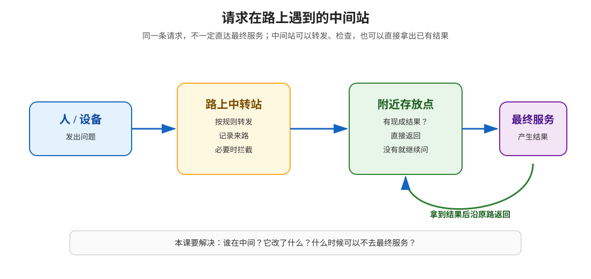
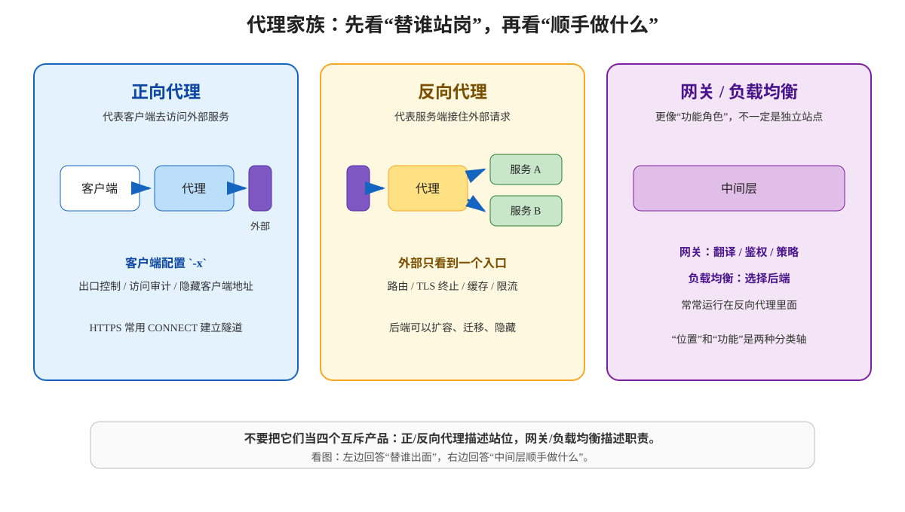
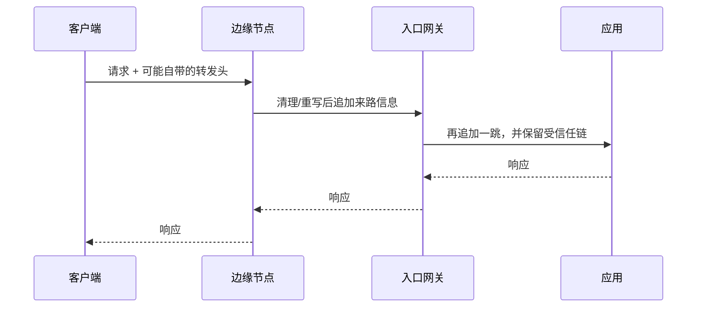
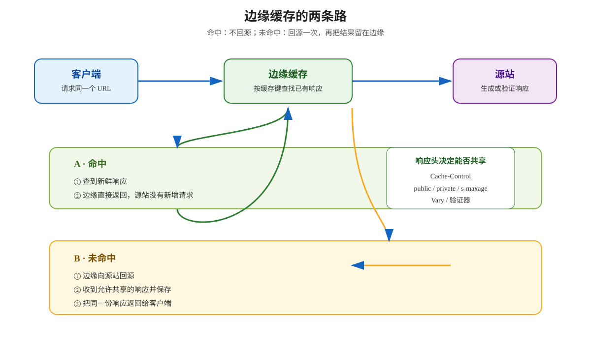
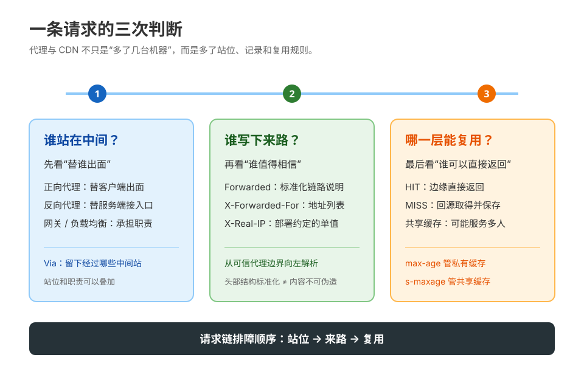

# 第 9 课：代理、网关与 CDN：请求的中间人

> 所属阶段：阶段 3《缓存与性能》｜水平：入门｜本课知识点：代理家族、真实 IP 与转发头、CDN 与边缘缓存
> 故事情节：后端日志里的 IP 全是网关的，小航发现请求到达服务前还站着“中间人”
> 📖 结论已按官方文档核对（核查于 2026-09｜来源：MDN Proxy servers and tunneling / Via / Forwarded / X-Forwarded-For，RFC 9110、RFC 9111、RFC 7239）

## 🎯 本课目标

- 能从“替谁出面”和“承担什么职责”两个维度，区分正向代理、反向代理、网关与负载均衡。
- 能解释 `Via`、`Forwarded`、`X-Forwarded-For`、`X-Real-IP` 各自记录什么，以及为什么不能无条件相信“真实 IP”。
- 能画出 CDN 命中与回源路径，并用 `s-maxage` 把浏览器缓存和共享缓存分开配置。

### 📖 写前文档核对：三处容易被旧教程带偏的边界

| 容易形成的直觉 | 按官方文档校准后的说法 |
|---|---|
| `X-Forwarded-For` 是标准字段，最左边永远是真实客户端 | 它是事实标准；最左边只是在客户端和代理都“规矩工作”时才可能是客户端，安全用途必须从受信任代理边界倒推。 |
| `Forwarded` 和 `X-Forwarded-For` 是同一个东西 | `Forwarded` 是标准化字段，能表达 `for` / `by` / `host` / `proto`；`X-Forwarded-*` 是更常见的事实标准家族。 |
| `s-maxage` 是某家 CDN 的私有开关 | 它是 HTTP 缓存指令，针对共享缓存；在共享缓存中会覆盖 `max-age` / `Expires` 的新鲜度值。 |

---

## 第一幕：起源与场景引入

小航上线了一个接口：`https://api.example.com/profile`。请求看起来很普通，但上线后出现了三个互相矛盾的现象：

1. 应用日志里所有请求的来源地址都像是同一个网关；
2. 安全同学说“按 IP 限流”，应用却不知道该看哪个 IP；
3. 同一张公共图片，第一次请求很慢，后面有时不再到应用服务器。

他把日志贴出来：

```text
192.0.2.10 - - "GET /profile HTTP/1.1" 200
192.0.2.10 - - "GET /profile HTTP/1.1" 200
192.0.2.10 - - "GET /profile HTTP/1.1" 200
```

`192.0.2.10` 不是用户，而是离应用最近的那一层中间设备。用户的请求可能已经经过了离用户更近的缓存站、统一入口和挑选后端的那一层；应用看到的只是“最后一跳”。

> 🎬 **场景**：小航以为自己在调一个服务，实际上是在和一条“请求链”打交道。

> 📌 **一句话本质**：把所有请求都直直压到最终服务，变成让路上的不同站点分担转发、检查、选择和复用。
>
> ⚖️ **处境对照**：不识别中间站，日志里的来源、耗时和缓存命中都可能解释错；识别中间站，就能知道请求停在哪一站、谁改了什么、哪些请求根本没回源。

---

## 第二幕：认知冲突

小航的第一个反应是：“既然应用最终收到请求，那我在应用里读 `remote_addr` 不就行了吗？”

第二个反应是：“那就让网关加一个 `X-Forwarded-For`，应用直接相信它。”

这两个反应各有一半正确，也各埋着一个坑：

- 应用确实需要某种方式知道请求链上的来路，但头部本身可能是客户端先写进去的；
- 中间站确实能帮源站减负，但“能缓存”不等于“应该共享”；
- 代理、网关、负载均衡、CDN 常常部署在一起，但它们描述的是不同维度。

> ❓ **问题**：当请求经过多层中间人时，谁代表谁？哪一层可以相信？哪一层可以直接返回？

---

## 第三幕：层层揭示

### 一眼全局图：请求不是只有“客户端 → 服务端”



> 看图：请求从左向右经过可选的中转站和附近存放点；有现成结果时直接返回，没有时才继续向最终服务取结果。

### 📌 知识点导航：分三步认出中间人

| 步 | 这一步要解决什么（人话） | 对应知识点 | 状态 |
|:--:|---|---|---|
| 1 | 先判断中间站是替谁出面、顺手做什么 | 知识点 9.1：代理家族 | ✅ 本课完成 |
| 2 | 再判断“来路信息”哪些能信、哪些只是自报 | 知识点 9.2：真实 IP 与转发头 | ✅ 本课完成 |
| 3 | 最后判断结果能否在路边复用、什么时候必须回源 | 知识点 9.3：CDN 与边缘缓存 | ✅ 本课完成 |

---

### 知识点 9.1：代理家族

> 🧭 **第 1/3 步｜承接**：第二幕留下了“请求链上谁代表谁”的问题 → 本步先按站位和职责给中间层分类。
> 本知识点关键点：正向代理与反向代理 / 网关与负载均衡 / `Via` 头与报文被中间人改动

#### 一句话定义

**代理（proxy）是替另一方接收请求、再代表它转发请求的中间层。**“正向”还是“反向”，先看它替客户端出面还是替服务端出面。

#### 直觉建立：代办人和门卫

把公司楼下的场景想成两种人：

- 你委托一个代办人去外面办事：外部服务先看到代办人的请求，这像**正向代理**；
- 外部访客只到前台，前台再把人带到合适的办公室：访客不需要知道内部办公室，这像**反向代理**。

> 💡 **类比的边界**：现实中的代办人通常只做一件事；HTTP 中间层可以同时做路由、缓存、TLS 终止、限流和鉴权。类比只帮助你判断“替谁出面”，不代表一个中间层只能有一种功能。

#### 核心原理



> 看图：左侧的代理站在客户端一边，中央的代理站在服务端一边；右侧的网关和负载均衡是职责，不是与正/反向代理互斥的第三种站位。

**正向代理（forward proxy）**：客户端主动配置或被网络策略引导去使用它。代理代表客户端访问目标站点，目标站点通常先看到代理的连接地址。`curl -x` 就是在告诉 curl：“这次请求先交给这个代理。”

**反向代理（reverse proxy）**：客户端通常只知道一个公开入口，入口再把请求转给后端服务。它可以隐藏源站拓扑、做 TLS 终止、缓存公共内容、限流、路由和负载分配。MDN 将负载均衡、静态内容缓存和压缩都列为反向代理的常见用途（核查于 2026-09）。

**网关（gateway）**更像“中间层的职责名称”：它可以翻译协议、验证身份、改写路径、统一错误格式，或者把一个公开 API 路由到多个内部服务。实际部署里，网关经常就是一个带更多策略能力的反向代理。

**负载均衡（load balancing）**是“把请求交给哪个后端”的选择职责。它可以按轮询、最少连接、权重或健康状态做决定；它可能运行在反向代理、网关或独立设备中。

因此不要记成“四种互斥产品”，而要用两条轴看：

| 本课说法（人话） | 行业标准叫法 | 典型配置 / 在哪遇到 | 代价或边界 |
|---|---|---|---|
| 替客户端出面 | 正向代理（forward proxy） | `curl -x`、浏览器代理设置、`CONNECT` | 目标站点看到的连接对端可能是代理；代理本身成为出口和信任边界 |
| 替服务端接住入口 | 反向代理（reverse proxy） | `upstream`、入口网关、TLS 终止、静态缓存 | 应用看到的 TCP 对端通常是代理；转发头必须有可信写入规则 |
| 统一处理请求策略 | 网关（gateway） | 路由、鉴权、协议转换、API gateway | 功能变多，配置和故障定位也更复杂 |
| 选择后端实例 | 负载均衡（load balancing） | upstream、健康检查、权重、连接池 | 选错实例会放大故障；会话粘性会削弱均衡效果 |

#### `Via`：留下“我经过这里”的链路标记

`Via` 是代理和网关用来标记消息经过了哪些中间层的标准字段。它可以出现在请求和响应中，用于追踪转发、避免环路，并让下游知道上游使用了什么协议版本。

一个链路可能形成：

```http
Via: 1.1 edge.example, 1.1 gateway.example
```

RFC 9110 的关键点有两个：

1. 每个字段成员代表一个转发过消息的代理或网关；
2. 每个中间层把自己的信息追加进去，最终顺序对应转发顺序。

在 HTTP-to-HTTP 网关场景中，网关必须为转发的入站请求发送合适的 `Via`；响应侧是否添加则有更细的规范边界。**`Via` 记录的是中间协议和中间站，不是用户真实 IP。**

#### 示例演示：正向代理和反向代理的命令形状

正向代理：

```bash
curl -v \
  -x http://proxy.example.com:8080 \
  https://www.example.com/
```

HTTPS 通过 HTTP 正向代理时，常见路线是先发送 `CONNECT` 建立隧道；代理看到目标主机和端口，但在没有 TLS 终止能力、也没有主动解密的情况下，看不到隧道里的 HTTP 内容。

反向代理则通常由服务端配置，客户端只访问公开入口：

```bash
curl -i https://api.example.com/profile
```

这条命令背后可能是：客户端 → CDN/边缘 → 入口网关 → 反向代理 → 应用。客户端无需知道应用实例的地址。

#### 常见误区

1. **把网关、反向代理、负载均衡当成互斥分类**：前者更像站位，后两者更像职责；一个组件可以同时承担多个角色。
2. **看到 `Via` 就当成真实 IP 链**：`Via` 只说明代理链路和协议，不表达客户端地址。
3. **认为正向代理一定能读 HTTPS**：普通 `CONNECT` 隧道只是转发；只有拥有解密能力并被客户端信任的中间层才可能看见明文。
4. **认为代理只能转发，不能缓存或改写**：反向代理常常正是缓存、压缩、TLS 终止和路由的承载点。

#### 一句话记住

**先问“替谁出面”区分正/反向，再问“顺手做什么”识别网关、负载均衡和缓存；`Via` 只标记中间站，不标记真实用户。**

#### 🗣️ 行话对照

- **正向代理（forward proxy）**：就是“替客户端出面”；在哪遇到：`curl -x`、浏览器代理、`CONNECT`。
- **反向代理（reverse proxy）**：就是“替服务端接住入口”；在哪遇到：入口网关、TLS termination、upstream、静态缓存。
- **逐跳（hop-by-hop）与端到端（end-to-end）**：中间层可能只在某一跳处理某些字段；在哪遇到：`Connection`、代理配置、网关转发规则。前面课 4 已讲过 `Connection` 的逐跳边界，本课把它放回多层请求链。

#### 📚 官方文档

- [MDN：Proxy servers and tunneling](https://developer.mozilla.org/en-US/docs/Web/HTTP/Guides/Proxy_servers_and_tunneling)：正向代理、反向代理、`CONNECT` 与转发信息
- [MDN：Via](https://developer.mozilla.org/en-US/docs/Web/HTTP/Reference/Headers/Via)：字段语法与用途
- [RFC 9110 §7.6.3 · Via](https://httpwg.org/specs/rfc9110.html#field.via)：`Via` 的标准语义和追加顺序

---

### 知识点 9.2：真实 IP 与转发头

> 🧭 **第 2/3 步｜承接**：我们知道请求经过了哪些站，但应用仍只看见最后一跳 → 本步把“来路信息”放回报文，并划出信任边界。
> 本知识点关键点：`X-Forwarded-For` 的追加语义 / `X-Real-IP` / 可伪造性与“只信最后一跳”

#### 一句话定义

**转发头是中间层替被改写或丢失的来路信息留下的说明，但说明本身也必须经过可信代理写入和校验。**

#### 直觉建立：包裹上的转运记录

一个包裹经过多个转运站，每站可以在单据上追加“我从哪里收到、我交给谁”。应用拿到单据时，能看到一条路径；但如果寄件人一开始就能在单据上乱写，最早那几行就不能直接当证据。

> 💡 **类比的边界**：HTTP 头不是防篡改签名。只要请求还没进入你控制的可信边界，客户端就可能自己发送同名头部；真正的安全依据是“哪个代理写入了它、应用是否只接受该代理的结果”。

#### 核心原理：三套字段，不要混为一谈



> 看图：客户端可能带着“自报信息”进入边缘；真正的信任链从受控边缘开始，之后每个受信任代理追加一跳。

**`Forwarded`** 是标准化的请求头，字段由分号分隔的键值对组成：

```http
Forwarded: for=192.0.2.24;proto=https;host=api.example.com;by=198.51.100.10
```

- `for`：请求从哪一方来；
- `by`：哪个代理接收并转发；
- `host`：客户端请求的原始主机；
- `proto`：客户端到该代理一侧使用的协议。

多个代理可以追加多个逗号分隔的元素。RFC 7239 也明确提醒：这个字段可能被链上的节点，包括客户端，修改；它不是自动可信的证明。

**`X-Forwarded-For`（XFF）** 是事实标准的请求头，常见形态是：

```http
X-Forwarded-For: 192.0.2.24, 198.51.100.10, 203.0.113.7
```

在“客户端和所有代理都行为正常”的理想链路里，最左侧是最初客户端，最右侧是最近追加的代理。可是客户端也能在进入受控边界前自己发送：

```http
X-Forwarded-For: 203.0.113.250
```

所以**最左边不是天然可信，最右边也不是脱离拓扑就天然可信**。

**`X-Real-IP`** 是常见的单值约定，很多反向代理会用它传递一个“认为是客户端的地址”。它不是和 `Forwarded` 同等级的通用标准字段；使用前必须确认具体代理、框架和部署文档如何写入、覆盖和读取它。

#### “只信最后一跳”到底是什么意思

工程上常说“只信最后一跳”，准确含义不是“永远取 XFF 最右边”，而是：

> **只信你明确配置过的最后一个受信任代理写入的结果；从右向左跳过已知可信代理，遇到第一个不在可信列表中的地址，才把它当作可用的客户端候选。**

假设应用前面有两个受信任代理：`198.51.100.10` 与 `203.0.113.10`，应用收到：

```text
X-Forwarded-For: 192.0.2.24, 198.51.100.10, 203.0.113.10
```

应用应从右向左识别并跳过已知代理，最后得到 `192.0.2.24`。如果应用可以被互联网直接访问，那么即使前面“看起来还有一个可信反向代理”，也不能把客户端提交的整条 XFF 直接用于限流、IP 白名单或鉴权。必须先把源站封在可信网络边界里，或明确配置受信任代理列表/数量。

| 使用场景 | 可以怎样用转发头 | 不应该怎样用 |
|---|---|---|
| 访问日志 | 记录“代理观察到的客户端候选”和代理链 | 不把它当不可伪造身份证据 |
| 统计分析 | 在明确代理拓扑后按可信规则归并 | 直接用最左值代表真实用户 |
| IP 限流 | 只使用受信任代理写入、按规则解析的地址 | 让公网客户端自带的 XFF 决定限流桶 |
| IP 白名单 / 鉴权 | 优先使用网络层和边界设备提供的可信信号 | 只靠用户可控的请求头放行 |

#### 示例演示：一条转发链如何变化

```text
客户端 → 边缘节点 → 入口网关 → 应用

到达边缘：X-Forwarded-For: 192.0.2.24
到达网关：X-Forwarded-For: 192.0.2.24, 198.51.100.10
到达应用：X-Forwarded-For: 192.0.2.24, 198.51.100.10, 203.0.113.10
```

这里的三个地址都只是文档专用示例网段，不代表真实机器。重点是**追加方向**和**信任边界**：应用只应信任自己配置过的边缘节点与网关追加的部分。

#### 常见误区

1. **把 `X-Forwarded-For` 当成防篡改字段**：它只是请求头，不带签名；是否可信取决于写入者和网络边界。
2. **无脑取最左 IP**：最左值最接近客户端，但也最容易被客户端伪造，不能直接用于安全决策。
3. **无脑取最右 IP**：最右值通常是最近代理，但如果应用前面的“代理”不是你信任的代理，仍然不能拿来做安全判断。
4. **把 `X-Real-IP` 当作标准协议**：它通常是部署约定，必须核对具体组件的覆盖策略。
5. **把 `Forwarded` 原样返回给客户端**：RFC 7239 的安全考虑指出，这可能暴露内部代理链和网络结构。

#### 一句话记住

**转发头是“来路线索”，不是“来路证明”；安全用途从可信边界向左倒推，不从客户端提交的最左值盲信。**

#### 🗣️ 行话对照

| 本课说法（人话） | 行业标准叫法 | 典型配置 / 在哪遇到 | 代价或边界 |
|---|---|---|---|
| 标准化的来路说明 | `Forwarded` | `for` / `by` / `host` / `proto`；RFC 7239 | 结构标准化，但内容仍可能被链上节点修改 |
| 常见的地址链 | `X-Forwarded-For`（XFF） | 代理追加的逗号列表；应用框架的 trusted proxies 配置 | 事实标准、解析易错、客户端可先写入 |
| 单值客户端地址约定 | `X-Real-IP` | 某些反向代理配置、应用日志变量 | 非通用标准；不同组件可能覆盖或保留不同值 |
| 只认已配置的代理 | trusted proxy list / trusted proxy count | 可信代理 IP 范围或可信跳数 | 配置过时会误判；扩容和多地域部署要同步更新 |

#### 📚 官方文档

- [MDN：Forwarded](https://developer.mozilla.org/en-US/docs/Web/HTTP/Reference/Headers/Forwarded)：标准化转发头的字段结构与追加
- [RFC 7239：Forwarded HTTP Extension](https://www.rfc-editor.org/rfc/rfc7239)：标准定义与安全考虑
- [MDN：X-Forwarded-For](https://developer.mozilla.org/en-US/docs/Web/HTTP/Reference/Headers/X-Forwarded-For)：追加顺序、解析、可信代理列表/跳数与安全边界
- [MDN：X-Forwarded-Proto](https://developer.mozilla.org/en-US/docs/Web/HTTP/Reference/Headers/X-Forwarded-Proto)：恢复客户端到代理一侧的原始协议

---

### 知识点 9.3：CDN 与边缘缓存

> 🧭 **第 3/3 步｜承接**：我们已经知道谁在转发、谁写入来路 → 最后判断中间层能否直接拿出响应，以及什么情况下必须问源站。
> 本知识点关键点：CDN 命中与回源 / `s-maxage` 与共享缓存 / `Cache-Control` 在 CDN 场景的配合

#### 一句话定义

**CDN（内容分发网络）是把共享缓存和请求转发能力放到离用户更近的位置；命中时不回源，未命中时回源并按策略保存结果。**

#### 直觉建立：每个城市的取货点

如果所有人都必须去总仓库拿同一张海报，总仓库既承担生产又承担每次取货。把公共海报复制到多个城市的取货点后，大多数人可以就近领取；但私人订单、过期海报或取货点没有的货，仍要回总仓库。

> 💡 **类比的边界**：CDN 不是“自动复制一切”的魔法。是否能存、存多久、按什么键区分、是否要验证，都由 HTTP 缓存语义和 CDN 的部署策略共同决定；用户专属内容不能因为“经过 CDN”就自动变成公共内容。

#### 核心原理：命中、回源与共享缓存



> 看图：客户端先到边缘缓存；命中时直接返回，未命中时边缘向源站回源，拿到响应后保存并返回。

RFC 9111 把缓存分成两类：

- **私有缓存（private cache）**：只服务一个用户，浏览器缓存通常属于这一类；
- **共享缓存（shared cache）**：可以把响应复用给多个用户，CDN 和很多中间缓存属于这一类。

CDN 的关键不是“离用户近”这句话，而是它能否安全地把**同一份响应**交给多个请求。缓存至少要考虑：请求方法、目标 URI、响应新鲜度、`Vary` 指定的请求头、`Authorization`、`private` / `no-store` 等限制。

#### `s-maxage`：给共享缓存单独设一只钟

最常用的公共静态资源策略可以写成：

```http
Cache-Control: public, max-age=60, s-maxage=600
```

它表达的是：

- 浏览器私有缓存按 `max-age=60` 处理；
- 共享缓存按 `s-maxage=600` 处理；
- 在共享缓存中，`s-maxage` 覆盖 `max-age` 或 `Expires` 的新鲜度值；
- `s-maxage` 还带有共享缓存过期后必须重新验证的语义。

**它不是“浏览器也缓存 600 秒”**，也不是“把任意响应强行变成公共响应”。对带用户身份的响应，要先看内容是否真的可以跨用户复用：

| 响应类型 | 示例策略 | 共享缓存含义 | 主要边界 |
|---|---|---|---|
| 带 hash 的公共 JS/CSS | `public, max-age=60, s-maxage=86400` | 边缘可长时间复用 | 发布新文件名，旧文件自然退出；还要考虑部署回滚 |
| 公共但希望浏览器短、CDN 长 | `public, max-age=60, s-maxage=600` | 浏览器更快重新确认，CDN 少回源 | `s-maxage` 只对共享缓存生效 |
| 用户个人资料 | `private, max-age=30` | 共享缓存不得存 | 浏览器可短暂复用，但不能让 CDN 交给别人 |
| 密码、支付、强实时状态 | `no-store` | 私有和共享缓存都不应主动存储 | 仍需 TLS、权限和日志脱敏，`no-store` 不是完整隐私方案 |

RFC 9111 还规定：带 `Authorization` 的请求，其响应不能被共享缓存随意复用；只有满足明确允许共享的响应指令和其他缓存条件时才可以。**不要把 `public` 或 `s-maxage` 当成“忽略用户隔离”的开关。**

#### 缓存键与 `Vary`：同一个 URL 可能不是同一份响应

如果响应会因为 `Accept-Encoding`、语言或其他请求头而不同，缓存必须知道这些差异。上一课已经讲过：压缩响应通常需要：

```http
Vary: Accept-Encoding
```

否则，边缘缓存可能把一个客户端可解码的表示交给另一个不支持该编码的客户端。CDN 还可能提供查询参数、设备、地区等平台级缓存键配置；这些是部署策略，不应凭某一家产品的默认值推断成 HTTP 标准。

#### 示例演示：把响应策略写成可审查的合同

公共图片：

```http
HTTP/1.1 200 OK
Cache-Control: public, max-age=60, s-maxage=3600
Vary: Accept-Encoding
Content-Type: image/avif
```

用户订单：

```http
HTTP/1.1 200 OK
Cache-Control: private, no-store
Content-Type: application/json
```

读这两份响应时先问三件事：**谁能存？存多久？怎样知道这份结果不能交给另一个人？**

#### 常见误区

1. **把 CDN 当成“只负责 DNS 的服务”**：DNS 可能帮助用户找到边缘入口，但真正的命中、回源和缓存复用发生在 HTTP 请求处理链里。
2. **看到 `s-maxage` 就以为浏览器会缓存同样长**：它主要约束共享缓存；浏览器仍要看 `max-age` 等私有缓存语义。
3. **把用户接口也配置成 `public`**：一旦缓存键没有包含用户身份，可能把甲的响应交给乙。
4. **把 `X-Cache: HIT` 当成标准字段**：这类字段常是供应商约定；通用 HTTP 诊断应结合响应头、`Age`、`Via` 和实际回源日志。
5. **认为命中就永远是最新**：命中只是说明缓存按自己的新鲜度和验证规则复用了结果；实时性要求要体现在缓存策略里。
6. **认为 CDN 一定比源站快**：命中通常能减少回源距离；未命中、跨地域回源、缓存键过细或频繁失效反而可能增加链路复杂度。

#### 一句话记住

**CDN 的核心是共享缓存：命中不回源，未命中才回源；`max-age` 管私有缓存，`s-maxage` 给共享缓存另设规则，私人响应先保证不共享。**

#### 🗣️ 行话对照

| 本课说法（人话） | 行业标准叫法 | 典型配置 / 在哪遇到 | 代价或边界 |
|---|---|---|---|
| 离用户近的共享存放点 | 边缘缓存（edge cache）/ 共享缓存（shared cache） | CDN 控制台、响应 `Age`、回源日志 | 节省回源，但引入失效、键设计和一致性问题 |
| 缓存找到了 | cache hit | `Age`、供应商命中头、边缘日志 | 命中不等于最新，也不一定是标准 `X-Cache` |
| 缓存没有找到 | cache miss / 回源（origin fetch） | 边缘日志、源站请求数、TTFB | 回源距离和源站负载成为瓶颈 |
| 共享缓存专用的新鲜时间 | `s-maxage` | `Cache-Control: s-maxage=600`；RFC 9111 §5.2.2.10 | 不控制浏览器私有缓存；不能替代用户隔离 |

#### 📚 官方文档

- [MDN：Caching](https://developer.mozilla.org/en-US/docs/Web/HTTP/Guides/Caching)：私有缓存、共享缓存、缓存复用与验证
- [RFC 9111 §1 · Cache](https://httpwg.org/specs/rfc9111.html#cache)：缓存、私有缓存与共享缓存的定义
- [RFC 9111 §3 · Storing Responses in Caches](https://httpwg.org/specs/rfc9111.html#storing.responses.in.caches)：共享缓存存储条件
- [RFC 9111 §5.2.2.10 · `s-maxage`](https://httpwg.org/specs/rfc9111.html#section-5.2.2.10)：共享缓存的新鲜度与重新验证边界
- [MDN：Vary](https://developer.mozilla.org/en-US/docs/Web/HTTP/Reference/Headers/Vary)：缓存按请求头区分表示

---

## 第四幕：实操验证——在本机看见四个中间站行为

本实验不安装任何额外工具，只使用 macOS 自带 Python 3 和 `curl`。脚本启动四个本地 HTTP 服务：源站、正向代理、反向代理、边缘缓存；端口随机分配，实验结束自动关闭。

### 运行

```bash
python3 network/http/stages/3-缓存与性能/labs/lesson-09-proxy-gateway-cdn-lab.py
```

### 本机真实输出

```text
forward: {"headers": {"Via": "1.1 lab-forward"}, "path": "/forward", "role": "origin"}
reverse: {"headers": {"Forwarded": "for=127.0.0.1;proto=http;by=127.0.0.1", "Via": "1.1 lab-reverse", "X-Forwarded-For": "127.0.0.1", "X-Real-IP": "127.0.0.1"}, "path": "/reverse", "role": "origin"}
edge-1: {"edge_cache": "MISS", "headers": {"Forwarded": "for=127.0.0.1;proto=http;by=127.0.0.1", "Via": "1.1 lab-edge, 1.1 lab-reverse", "X-Forwarded-For": "127.0.0.1, 127.0.0.1", "X-Real-IP": "127.0.0.1"}, "path": "/asset.js", "role": "origin"}
edge-2: {"edge_cache": "HIT", "headers": {"Forwarded": "for=127.0.0.1;proto=http;by=127.0.0.1", "Via": "1.1 lab-edge, 1.1 lab-reverse", "X-Forwarded-For": "127.0.0.1, 127.0.0.1", "X-Real-IP": "127.0.0.1"}, "path": "/asset.js", "role": "origin"}
```

### 逐行读结果

1. **`forward`**：源站看到 `Via: 1.1 lab-forward`，说明请求经过了正向代理；实验没有把客户端 IP 伪装成一个可信转发头。
2. **`reverse`**：源站收到反向代理补的 `Forwarded`、`X-Forwarded-For` 和 `X-Real-IP`。
3. **`edge-1`**：第一次访问 `/asset.js` 是 `MISS`；`Via` 有两段，说明边缘和反向代理都转发过这条请求；XFF 也体现了两跳追加。
4. **`edge-2`**：第二次访问同一资源是 `HIT`，边缘直接返回缓存副本；这次没有为了生成响应再次访问源站。

> ⚠️ 实验里的 `X-Lab-Upstream: edge` 只是本地脚本用来标记“来自实验边缘”的内部信号，不是生产标准头部。生产环境应靠网络隔离、代理身份和明确的 trusted proxy 配置建立信任，不能让公网客户端自己发送一个同名标记就获得信任。

> ✅ **回扣场景**：小航现在可以把日志拆成三问——`Via` 看经过哪些中间站，转发头按可信边界恢复来路，`MISS/HIT` 看请求是否真的回到源站。原来“所有请求都像来自网关”的困惑，变成了可检查的请求链。

---

## 第五幕：体系收束

### 一图总结



> 看图：课 9 不是再背三个名词，而是沿同一条请求链回答三件事——谁站在中间、谁写下来路、哪一层可以复用结果。

> 📍 **全局定位**：课 7 学“让请求尽量不出门”，课 8 学“请求出门后慢在哪一段”，本课继续追问“请求到底经过谁”。代理与 CDN 把缓存、连接和安全边界从浏览器扩展到整条请求链。
>
> 🔗 **下一步**：下一课进入 HTTP/1.1 的协议奠基，解释请求为什么以文本报文和持久连接为基础，以及这些设计给后来的 HTTP/2、HTTP/3 留下了什么天花板。

---

## 🐞 常见误区总表

1. **“应用拿到的 TCP 对端就是用户 IP”**：有反向代理时，它通常只是最后一个中间站。
2. **“转发头写着 client 就一定是客户端”**：客户端可以先写同名头；必须从可信边界开始解析。
3. **“`Forwarded` 标准化了，所以内容不可伪造”**：标准化的是字段结构，不是每个节点的诚实性。
4. **“`X-Real-IP` 比 XFF 更安全”**：单值不等于可信；安全性来自受信任写入者和源站隔离。
5. **“CDN 就是把所有响应缓存起来”**：私人响应、`no-store`、`private`、授权请求和 `Vary` 都会改变能否共享。
6. **“缓存命中就是永远最新”**：命中只表示按缓存规则复用；新鲜度和验证策略另算。
7. **“看到某厂商的 `X-Cache` 头就能跨平台照搬”**：厂商头属于部署观察信号，HTTP 通用语义应优先看 `Cache-Control`、`Age`、`Vary` 等标准字段。

---

## 📋 命令与配置速查卡

| 命令 / 配置 | 用途 | 关键提醒 |
|---|---|---|
| `curl -x http://proxy.example.com:8080 https://www.example.com/` | 让 curl 通过正向代理 | HTTPS 常先走 `CONNECT` 隧道 |
| `curl -v URL` | 看请求/响应与代理交互 | 重点观察 `Via`、`407`、`CONNECT` |
| `Forwarded: for=...;proto=...;host=...;by=...` | 标准化表达代理链信息 | 只在可信代理边界建立后使用 |
| `X-Forwarded-For: client, proxy...` | 事实标准的地址链 | 不要直接信客户端提供的值 |
| `Cache-Control: public, max-age=60, s-maxage=600` | 浏览器短缓存、共享缓存长缓存 | `s-maxage` 不控制浏览器 |
| `Cache-Control: private, max-age=30` | 允许私有缓存，不允许共享缓存 | 用于用户相关但可短暂复用的响应 |
| `Cache-Control: no-store` | 不让缓存主动存储 | 不替代 TLS、权限控制和日志脱敏 |
| `python3 .../lesson-09-proxy-gateway-cdn-lab.py` | 跑本课本地实验 | 只用 Python 标准库和系统 curl |

---

## 课后小测

**Q1**：下面哪句话最准确？

- A. 网关、反向代理、负载均衡是四种互斥的产品
- B. 正向/反向代理描述站位，网关/负载均衡更偏职责
- C. 负载均衡只负责 DNS，不参与 HTTP 请求
- D. 正向代理一定能解密 HTTPS

<details><summary>答案与解析</summary>

**答案：B**。同一个中间层可以同时是反向代理、网关并承担负载均衡；普通 `CONNECT` 只是 HTTPS 隧道，不代表代理能看到明文。

</details>

**Q2**：为什么不能无脑取 `X-Forwarded-For` 最左边的地址做 IP 限流？

- A. 因为最左边总是代理地址
- B. 因为客户端在进入可信边界前可以先写入同名头
- C. 因为 XFF 只允许一个地址
- D. 因为 XFF 是响应头

<details><summary>答案与解析</summary>

**答案：B**。最左边在理想链路里接近客户端，但也最容易被客户端伪造；安全用途要按 trusted proxy list/count 从右向左解析。

</details>

**Q3**：响应带 `Cache-Control: public, max-age=60, s-maxage=600`，哪个说法正确？

- A. 浏览器和 CDN 都只能缓存 60 秒
- B. 浏览器缓存 600 秒，CDN 缓存 60 秒
- C. 私有缓存看 `max-age`，共享缓存看 `s-maxage`
- D. 这会让任何用户的私人响应都安全可共享

<details><summary>答案与解析</summary>

**答案：C**。`s-maxage` 针对共享缓存；是否能共享还要结合响应是否含用户特有内容、`private`、`Authorization`、`Vary` 等条件。

</details>

**Q4**：本课实验第二次访问 `/asset.js` 变成 `HIT`，最直接的含义是什么？

- A. 源站被访问了两次，第二次更快
- B. 边缘缓存复用了已有响应，第二次没有为了生成响应而回源
- C. 浏览器一定没有发出网络请求
- D. `X-Forwarded-For` 被删除了

<details><summary>答案与解析</summary>

**答案：B**。本实验由边缘服务直接返回内存中的缓存副本；真实浏览器还可能有自己的私有缓存层，需用 DevTools 和响应头区分。

</details>

---

## 🚀 下一批接力提示词

> 阶段 3《缓存与性能》已完成。学完本课后，复制下面这段文字发给 AI，进入阶段 4：

```text
继续学 HTTP。我的学习档案在 network/http/00-学习档案.md，
刚学完阶段 3《缓存与性能》的课《代理、网关与 CDN：请求的中间人》知识点 9.1、9.2、9.3，
请按大纲继续讲解下一课《HTTP/1.1 与协议奠基》（10.1 演进史与版本分界、10.2 1.1 的关键特性、10.3 1.1 性能手段与天花板）。
```

## 🧭 课程导航

⬅️ **上一课**：[课 8：性能测量与优化：把“慢”拆成段落](lesson-08-性能测量与优化.md)

➡️ **下一课**：[课 10：HTTP/1.1 与协议奠基](../../4-协议演进/lessons/lesson-10-HTTP1.1与协议奠基.md)

📚 **返回目录**：[课程目录](../../../02-课程目录.md)
