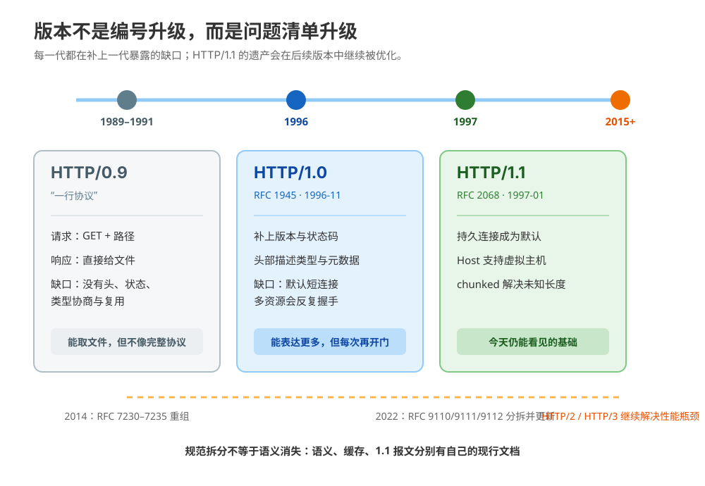
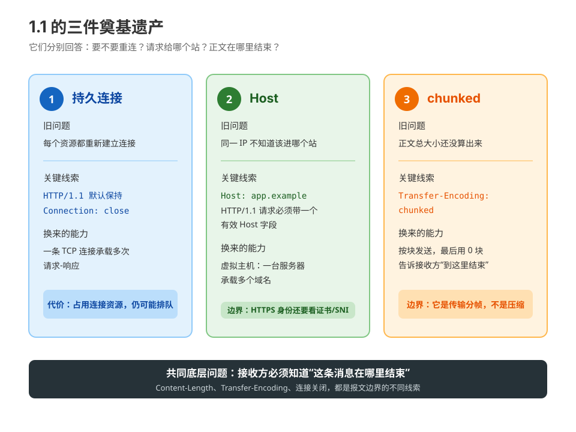
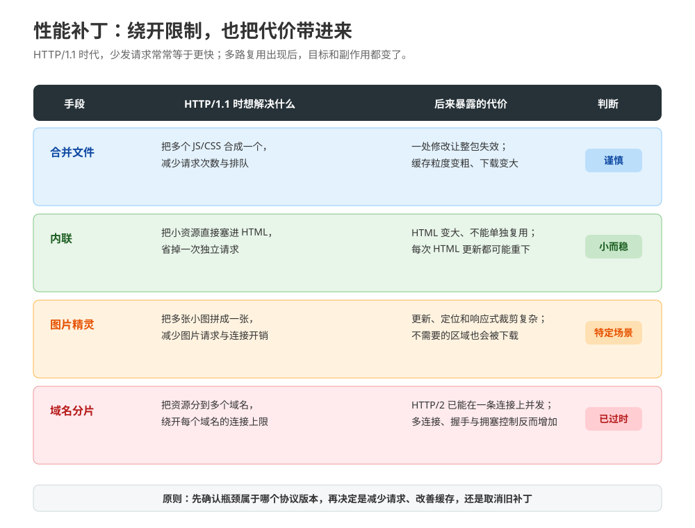

# 第 10 课：HTTP/1.1 与协议奠基

> 所属阶段：阶段 4《协议演进》｜水平：入门｜本课知识点：演进史与版本分界、1.1 的关键特性、1.1 性能手段与天花板
> 故事情节：小航接手一个老系统，发现它一边用 HTTP/1.1 承载多域名，一边靠合并文件和域名分片“补速度”
> 📖 结论已按官方文档核对（核查于 2026-09｜来源：MDN Evolution of HTTP / Connection management in HTTP/1.x / Host / Transfer-Encoding，RFC 9110、RFC 9112、RFC 1945、RFC 2068、RFC 2616）

## 🎯 本课目标

- 能把 HTTP/0.9、HTTP/1.0、HTTP/1.1 各自解决的问题串成一条演进线，说清为什么 1.1 的生态位如此长寿。
- 能解释持久连接、`Host` 头与虚拟主机、chunked 分块传输各自解决了什么，以及它们怎样共同保证报文可以被正确拆开。
- 能说清合并文件、内联、图片精灵、域名分片为什么曾经有用，以及为什么进入 HTTP/2 后不能继续机械照搬。

### 📖 写前文档核对：版本号背后是三类问题

| 容易形成的直觉 | 按官方文档校准后的说法 |
|---|---|
| HTTP/1.1 只是把 1.0 的编号改大了 | 1.1 解决了持久连接、虚拟主机、未知长度响应等实际问题；版本变化对应能力与约束的变化。 |
| 连接复用只要“保持 TCP 不断”就够了 | 复用还要求接收方知道每条消息在哪里结束；`Content-Length`、chunked 或其他规范的消息边界共同承担这个任务。 |
| `Host` 只是方便日志记录的普通头 | HTTP/1.1 请求必须带一个有效 `Host`；它让同一 IP 上的多个域名能被路由到不同虚拟主机。 |
| 域名分片是永久有效的加速技巧 | 它是 HTTP/1.x 连接并行度不足时的补丁；MDN 当前文档明确指出，在 HTTP/2 中它不再有用，甚至可能损害性能（核查于 2026-09）。 |

---

## 第一幕：起源与场景引入

小航接手了一个老系统。它有三个域名：`app.example.com`、`static.example.com`、`upload.example.com`，但运维只给了一个公网 IP。系统偶尔还会返回一段“大小暂时不知道”的导出文件。

上线前，他看到一份**示意日志**：

```text
connection=41 request=1 GET /index.html HTTP/1.1 host=app.example.com
connection=41 request=2 GET /app.js HTTP/1.1 host=static.example.com
connection=42 request=1 POST /export HTTP/1.1 host=upload.example.com transfer=chunked
```

他有三个疑问：

1. 同一条连接上为什么可以连续处理两个请求？接收方怎么知道第一个响应在哪里结束？
2. 三个域名共用一个 IP，服务器靠什么知道请求应该交给哪个站点？
3. `/export` 的结果要边计算边发送，尚未知道总长度时，HTTP/1.1 怎样把响应安全地交给客户端？

小航又发现前端构建脚本里有四种“加速技巧”：把文件合并、把小资源内联、把小图拼成一张、把资源分散到多个域名。他不知道这些技巧是设计出来的，还是历史包袱。

> 🎬 **场景**：小航不是在背版本号，而是在追问一条老协议为什么能把“多站点、多资源、未知长度”这些现实问题都装进同一套报文里。

> 📌 **一句话本质**：把“每次重新开门、找不到正确站点、还不知道东西有多大”变成“连接可复用、请求带门牌、正文可以分块结束”；再看这些补丁为什么会撞上下一代协议。
>
> ⚖️ **处境对照**：不理解 1.1 的设计动因，看到 `Host`、chunked、连接复用时只会背字段；理解动因，就能从报文反推服务器为什么这样发、某个性能技巧是不是已经过期。

---

## 第二幕：认知冲突

小航的第一个想法是：“HTTP/1.1 都是文本，那它应该只是把 HTTP/1.0 的文本写得更长一点。”

第二个想法是：“只要连接没断，服务端自然知道一条响应什么时候结束。”

第三个想法是：“同一个 IP 上放多个域名，服务器看 TCP 对端地址就能判断站点。”

这三个想法都碰到了关键边界：

- 文本格式解决的是**人和工具如何读报文**，不等于解决了连接复用和消息边界；
- TCP 连接只是一条字节流，本身不会替 HTTP 标出“这一条响应到此为止”；
- TCP 对端看到的往往只是 IP 和端口，多个域名共用一个 IP 时还需要 HTTP 请求里的主机信息；
- 性能补丁之所以出现，是因为 HTTP/1.1 的请求调度能力有限，不是因为资源天然应该合并或分片。

> ❓ **问题**：HTTP/1.1 到底给报文增加了哪些“能运行起来”的基础设施？这些基础设施为什么仍然不够快？

---

## 第三幕：层层揭示

### 一眼全局图：一条请求路上的三次修路


> 看图：先把每次重复开门变成“门开着继续办事”，再给请求补上门牌，最后解决“东西大小未知但连接不能随便关闭”的问题。

### 📌 知识点导航：从版本动因走到性能天花板

| 步 | 这一步要解决什么（人话） | 对应知识点 | 状态 |
|:--:|---|---|---|
| 1 | 先看 0.9、1.0、1.1 分别补了哪块短板 | 知识点 10.1：演进史与版本分界 | ✅ 本课完成 |
| 2 | 再看 1.1 如何复用连接、识别站点、标记正文边界 | 知识点 10.2：1.1 的关键特性 | ✅ 本课完成 |
| 3 | 最后看为了躲开 1.1 限制而出现的性能补丁，以及它们的代价 | 知识点 10.3：1.1 性能手段与天花板 | ✅ 本课完成 |

---

### 知识点 10.1：演进史与版本分界

> 🧭 **第 1/3 步｜承接**：第二幕留下了“1.1 为什么不只是文本变长”的问题 → 本步先把每一代版本放回它要解决的现实短板。
> 本知识点关键点：0.9/1.0/1.1 各解决了什么 / 为什么 1.1 生态位长寿 / 现行 RFC 9110/9112 与历史文档的关系

#### 一句话定义

**HTTP 版本演进，就是在同一个请求-响应模型上不断补齐表达能力、连接效率和消息边界；版本号是问题集合的路标，不是单纯的“新旧标签”。**

#### 直觉建立：从手写便条到可复用的办事窗口

想象一个刚建立的办事窗口：

- 第一版只能写“请给我这份文件”，窗口把文件直接递出来；
- 第二版增加了回执、类型和说明，窗口终于能告诉你成功还是失败；
- 第三版把窗口保持开放，让你连续办理多件事，还给每个站点补上门牌，并能边生成边交付未知大小的结果。

> 💡 **类比的边界**：办事窗口是一个帮助记忆的模型；真实 HTTP 版本还涉及方法、状态码、头部、缓存、内容协商和连接管理，不能把每一项都压缩成“窗口开着”一个动作。

#### 核心原理：每代版本都在补前一代的缺口



> 看图：左侧从“只取文件”开始，向右依次增加状态和元数据、连接复用和虚拟主机；底部再把历史文档与当前拆分后的规范接起来。

**HTTP/0.9：一行协议。** 早期请求只有 `GET` 加资源路径，响应直接是文件内容，没有 HTTP 头部、状态码，也没有用于描述其他媒体类型的机制。它适合最初的“取一个超文本文件”场景，但无法优雅地表达图片、错误状态和复杂元数据。HTTP/0.9 这个编号是后来的称呼，早期协议本身并没有显式版本号（核查于 2026-09，MDN Evolution of HTTP）。

**HTTP/1.0：先让报文变得可表达。** 请求行里出现版本，响应有状态码，双方都能传头部；`Content-Type` 让 HTML 之外的资源也能被描述和传输。HTTP/1.0 的典型连接模型仍是短连接：取完一个资源后连接关闭，页面里的下一个资源往往要重新建立连接。RFC 1945 于 1996-11 发布，记录了当时形成的 HTTP/1.0 通用做法（核查于 2026-09，MDN Evolution of HTTP / RFC 1945）。

**HTTP/1.1：把多资源网页当成常态。** RFC 2068 于 1997-01 发布了第一版 HTTP/1.1 标准；它把持久连接、流水线、chunked 响应、更多缓存控制、内容协商和 `Host` 等能力纳入协议。HTTP/1.1 后续又经历 RFC 2616（1999-06）和 RFC 7230–7235（2014-06）等修订；当前规范体系在 2022 年重新拆分为：

| 当前文档 | 负责什么 | 本课用它解释什么 |
|---|---|---|
| RFC 9110 | HTTP 语义：方法、状态码、字段的一般语义 | `Host` 的语义、HTTP 版本不是“产品品牌” |
| RFC 9111 | HTTP 缓存，适用于多个 HTTP 版本 | 本课只在回顾性能补丁时提到缓存边界；缓存细节见课 7 |
| RFC 9112 | HTTP/1.1 报文语法、消息边界、连接持久化 | `Host` 必填、chunked、持久连接与报文结束 |
| RFC 9113 / RFC 9114 | HTTP/2 / HTTP/3 的后续协议 | 本课只用来说明下一步为何要突破 1.1 的调度限制 |

这里有一个重要的阅读方法：**“当前规范”不一定只在一个 RFC 里。** 语义和缓存被抽到所有 HTTP 版本共用的文档中，HTTP/1.1 自己主要保留报文格式、连接和传输编码等部分。因此，读到“HTTP/1.1 仍然支持什么”时，不要只翻历史 RFC 2616；先看 RFC 9110/9111/9112 的分工。

#### 为什么 1.1 生态位如此长寿

HTTP/1.1 长寿不是因为它完美，而是因为它同时满足了四个条件：

1. 报文格式仍可读，抓包、日志和最小化实现都容易入门；
2. 头部和方法可扩展，新的业务能力不必重新发明整个协议；
3. 持久连接减少了重复建连成本；
4. `Host`、缓存控制、内容协商、chunked 等机制足以承载从网页到 API 的大量场景。

它的天花板也同样清楚：在一条连接上，请求和响应的并发调度能力有限，头部重复，资源越多越容易需要多连接和额外性能补丁。后续版本不是否定 1.1 的语义，而是改变表达和调度方式。

#### 示例演示：同一件事在三代协议里长什么样

HTTP/0.9 的请求形状：

```http
GET /index.html
```

HTTP/1.0 开始能表达版本、状态和类型：

```http
GET /index.html HTTP/1.0

HTTP/1.0 200 OK
Content-Type: text/html

<html>...</html>
```

HTTP/1.1 再加上持久连接时代所需的主机信息：

```http
GET /index.html HTTP/1.1
Host: app.example.com
Connection: keep-alive
```

三段报文的关键差异不是“字越来越多”，而是接收方逐渐获得了**解释结果、区分站点、复用连接和判断边界**的能力。

#### 常见误区

1. **把 HTTP/1.1 当成当前唯一的 HTTP 规范**：现行规范已经拆分，语义看 RFC 9110，缓存看 RFC 9111，1.1 报文与连接看 RFC 9112。
2. **认为 1.1 只增加了 Keep-Alive**：`Host`、chunked、缓存控制和内容协商同样是它的基础遗产。
3. **认为 HTTP/0.9 正式就叫“0.9”**：早期协议没有显式版本号，0.9 是后来为区分后续版本而使用的称呼。
4. **认为版本升级必然让所有旧技巧失效**：升级改变的是可用能力和成本结构；是否保留某个技巧，还要看资源形态、缓存策略和实际协议版本。

#### 一句话记住

**0.9 能取文件，1.0 能表达报文，1.1 能复用连接、区分站点并处理未知长度；2022 年的 RFC 9110/9111/9112 把这些职责重新拆清。**

#### 🗣️ 行话对照

| 本课说法（人话） | 行业标准叫法 | 典型配置 / 在哪遇到 | 代价或边界 |
|---|---|---|---|
| 只取文件的一行协议 | HTTP/0.9 | 历史资料、协议演进文档 | 表达能力极弱，没有头部和状态码 |
| 能表达状态和类型的版本 | HTTP/1.0 / RFC 1945 | 老客户端、历史 RFC | 默认短连接，资源多时重复建连 |
| 能复用连接的基础版本 | HTTP/1.1 / RFC 9112 | `HTTP/1.1` 状态行、抓包、curl 版本选项 | 文本报文易读，但连接内并发与头部开销有限 |
| 当前语义总纲 | HTTP Semantics / RFC 9110 | 方法、状态码、字段语义 | 不单独替代 HTTP/1.1 报文格式文档 |

#### 📚 官方文档

- [MDN：Evolution of HTTP](https://developer.mozilla.org/en-US/docs/Web/HTTP/Guides/Evolution_of_HTTP)：0.9、1.0、1.1、2、3 的演进动因与时间线
- [RFC 1945：HTTP/1.0](https://www.rfc-editor.org/rfc/rfc1945)：HTTP/1.0 历史规范（1996-11）
- [RFC 2068：HTTP/1.1](https://www.rfc-editor.org/rfc/rfc2068)：第一版 HTTP/1.1 规范（1997-01）
- [RFC 2616：HTTP/1.1](https://www.rfc-editor.org/rfc/rfc2616)：HTTP/1.1 的历史合并规范（1999-06）
- [RFC 9110：HTTP Semantics](https://httpwg.org/specs/rfc9110.html)：现行 HTTP 语义总纲
- [RFC 9112：HTTP/1.1](https://httpwg.org/specs/rfc9112.html)：现行 HTTP/1.1 报文与连接规范

---

### 知识点 10.2：1.1 的关键特性

> 🧭 **第 2/3 步｜承接**：我们已经知道 1.1 是为了多资源、多站点和动态响应而来 → 本步把这些目标落到三条可以从报文直接观察的规则。
> 本知识点关键点：持久连接成为默认 / `Host` 与虚拟主机 / chunked 分块传输

#### 一句话定义

**HTTP/1.1 的三件奠基遗产，分别解决“要不要重连”“请求交给哪个站”“正文何时结束”：持久连接、`Host`、chunked。**

#### 直觉建立：一扇门、一个门牌、分批送货

把服务器想成一个共享办公楼：

- **持久连接**像门开着，办完一件事继续办下一件，不必每次重新验门；
- **`Host`**像门牌，告诉前台“我要找哪家公司”，即使多家公司共用同一栋楼；
- **chunked**像分批送货，货物总量还没盘点完，也能一箱一箱送，最后用一个明确的“结束标记”收尾。

> 💡 **类比的边界**：真实 TCP 连接不是永远不关的门；空闲超时、`Connection: close`、网络错误都可能结束它。chunked 的“结束标记”属于 HTTP 报文分帧，不是 TCP FIN，也不是内容压缩。

#### 核心原理：三件事共同维护消息边界



> 看图：三列分别对应连接复用、虚拟主机和动态分块；底部的共同问题是接收方必须知道“这条消息在哪里结束”。

##### 1. 持久连接：默认复用，但不是无限保活

RFC 9112 §9.3 规定，HTTP/1.1 默认使用持久连接：一条连接可以承载多个请求和响应。客户端或服务端可以在消息里发送 `Connection: close`，表示这条连接在当前消息完成后关闭。

持久连接带来两个收益：

- 避免每个资源都重新付出 TCP 建连成本；
- 让已经“热起来”的连接继续传输后续资源。

但持久连接成立的前提是：**每条消息都必须有明确边界**。如果第一个响应的正文长度不清楚，客户端就无法判断后面读到的字节属于第一个响应，还是下一条响应；它也就不能安全地在同一连接上继续读取。

在 HTTP/1.x 中，连接管理是逐跳的：客户端到代理的连接可以持久，代理到源站的连接也可以是另一种状态。上一课已经讲过代理会改变逐跳头；这里要继续记住，`Connection` 不应被当作端到端业务字段。

##### 2. `Host`：一台 IP 服务器多个虚拟主机

HTTP/1.1 请求必须携带一个 `Host` 字段。它通常包含主机名，可选端口：

```http
GET /profile HTTP/1.1
Host: app.example.com
```

服务器可以根据 `Host` 选择不同的虚拟主机配置：

```text
同一个 IP:443
├── app.example.com       → API 应用
├── static.example.com    → 静态资源目录
└── upload.example.com    → 上传服务
```

这不是把域名“变成了 IP”，而是让 HTTP 请求在连接建立后再次声明自己要访问的主机。RFC 9112 规定：缺少 `Host`、出现多个 `Host` 行，或 `Host` 值无效时，服务器必须返回 `400 Bad Request`。

HTTPS 场景还要分清两个时间点：

1. TLS 握手阶段，服务器可能通过 SNI 选择证书；
2. TLS 建立后，HTTP 请求再通过 `Host` 选择虚拟主机资源。

所以 `Host` 不能替代证书身份校验，SNI 也不是 HTTP 头。证书、SNI 与主机名匹配见阶段 2 课 6。

##### 3. chunked：不知道总大小也能保持连接

如果服务端要动态生成一个很大的响应，开始发送时可能还不知道最终有多少字节。HTTP/1.1 可以使用：

```http
HTTP/1.1 200 OK
Transfer-Encoding: chunked
Content-Type: text/plain

5
hello
6
 world
0


```

每个块的开头是一个十六进制大小，后面跟 `CRLF`、块数据和另一个 `CRLF`；大小为 `0` 的块表示正文结束，之后还可以出现 trailer 头部。接收方按这个规则读完，就能在连接仍保持的情况下开始处理下一条消息。

需要牢牢记住三条边界：

- `Transfer-Encoding: chunked` 描述的是**消息如何传输和分帧**；
- `Content-Encoding: gzip` 描述的是**表示内容如何编码**，两者不是一回事；
- 发送 `Transfer-Encoding` 时不能再发送 `Content-Length`；如果两者同时出现，消息边界会进入高风险解析分歧，RFC 9112 对此有严格处理要求。

#### 示例演示：一个持久连接上的两次请求

```text
客户端 → TCP 连接 41

GET /index.html HTTP/1.1
Host: app.example.com


HTTP/1.1 200 OK
Content-Length: 1280

<1280 字节正文>

GET /app.js HTTP/1.1
Host: static.example.com
Connection: close


HTTP/1.1 200 OK
Content-Length: 4096

<4096 字节正文>
```

第一份响应靠 `Content-Length: 1280` 让客户端知道在哪里停；第二份响应结束后通过 `Connection: close` 关闭连接。真实服务器也可能使用 chunked 或其他规范的消息边界，但原则不变：**复用连接之前，先把边界讲清楚。**

#### 常见误区

1. **把持久连接理解成永远不关闭**：它只表示允许复用，空闲超时、网络失败或 `Connection: close` 都能结束连接。
2. **只要有 `Host` 就能保证 HTTPS 证书正确**：证书身份校验发生在 TLS 层，`Host` 负责 HTTP 请求的主机语义。
3. **把 `Host` 当成 TCP 对端地址**：TCP 对端是连接层信息，`Host` 是请求层字段，两者在代理和虚拟主机环境里可能完全不同。
4. **把 chunked 当成压缩**：chunked 解决“如何知道消息结束”，不负责减小内容体积。
5. **把 chunk 大小当成正文的一部分**：十六进制大小是传输分帧元数据，接收方解码后交给应用的是拼接后的正文。
6. **认为 HTTP/1.1 缺少 `Host` 只会导致服务器选错站点**：规范要求服务器对缺少、重复或无效 `Host` 的请求返回 400。

#### 一句话记住

**持久连接让门不必反复开，`Host` 让前台知道找哪个站，chunked 让未知大小的货也能分批送完；三者都服务于正确的消息边界。**

#### 🗣️ 行话对照

| 本课说法（人话） | 行业标准叫法 | 典型配置 / 在哪遇到 | 代价或边界 |
|---|---|---|---|
| 门开着继续办事 | persistent connection | HTTP/1.1 默认、`Connection: close`、连接池 | 占用服务端资源，仍受空闲超时与队头阻塞影响 |
| 请求要找哪个站 | `Host` request header / virtual hosting | Nginx `server_name`、虚拟主机配置、400 排障 | 请求层主机信息，不替代 TLS 证书身份 |
| 分批送货 | chunked transfer coding | `Transfer-Encoding: chunked`、流式响应 | 传输分帧，不是压缩；不能与 `Content-Length` 并列发送 |
| 知道消息在哪里结束 | message framing / message body length | `Content-Length`、`Transfer-Encoding`、状态码规则 | 边界解析不一致会导致连接复用失败甚至请求走私风险 |

#### 📚 官方文档

- [RFC 9112 §9.3 · Persistence](https://httpwg.org/specs/rfc9112.html#persistence)：HTTP/1.1 持久连接默认行为
- [RFC 9112 §3.2 · Host and Request Target](https://httpwg.org/specs/rfc9112.html#request-target)：`Host` 必填、虚拟主机与请求目标
- [MDN：Host header](https://developer.mozilla.org/en-US/docs/Web/HTTP/Reference/Headers/Host)：`Host` 语义、端口与 HTTP/1.1 请求要求
- [RFC 9112 §7.1 · Transfer-Encoding](https://httpwg.org/specs/rfc9112.html#transfer.codings)：传输编码与 chunked
- [MDN：Transfer-Encoding header](https://developer.mozilla.org/en-US/docs/Web/HTTP/Reference/Headers/Transfer-Encoding)：chunked 的块格式与使用场景
- [RFC 9112 §6.3 · Message Body Length](https://httpwg.org/specs/rfc9112.html#message.body.length)：消息正文长度与边界优先级

---

### 知识点 10.3：1.1 性能手段与天花板

> 🧭 **第 3/3 步｜承接**：我们已经让连接可复用、请求能找到站点、正文能安全结束 → 最后解释为什么网页工程师还要发明一堆“少请求”技巧，以及为什么下一代协议会改变这些技巧的价值。
> 本知识点关键点：合并文件 / 内联 / 图片精灵的由来 / 域名分片 / HTTP/2 下的失效与副作用

#### 一句话定义

**HTTP/1.1 性能补丁，是在“连接可复用但请求仍容易排队”的条件下，用资源组织方式换取更少请求或更多并行连接；它们缓解了旧瓶颈，也带来了缓存粒度和维护复杂度的代价。**

#### 直觉建立：为了少排队，把购物清单绑成大包

一家商店只有几条结账通道，而且每条通道上的顾客容易互相等待。店员可能会：

- 把几件商品打成一个大包，减少结账次数；
- 把小赠品直接塞进主商品包装，省一次取货；
- 把很多小图片拼成一张大海报，再按位置裁剪；
- 把顾客分散到多个入口，绕开单个入口的排队上限。

这些办法在通道少、每次排队成本高时有价值。但如果商店后来有了真正的并行收银系统，继续把所有商品绑成大包，反而会让某一件商品更新时整包重做。

> 💡 **类比的边界**：HTTP/2 并不是“无限收银台”，网络拥塞、服务端资源和缓存失效仍然存在；本课只说明为什么旧补丁的收益函数会改变，具体二进制分帧和多路复用留到课 11。

#### 核心原理：先解决请求数，再面对缓存和并行度



> 看图：左列是 HTTP/1.1 时代想解决的排队问题，中列是补丁付出的代价，右列给出进入 HTTP/2 后的判断方向。

##### 1. 合并文件：请求少了，缓存粒度粗了

把多个 JS 或 CSS 合成一个文件，可以减少独立请求、减少连接内的排队和头部重复。代价是：

- 只改一小段代码，也可能让整个合并包重新生成和失效；
- 页面只需要其中一个模块时，也可能下载整个包；
- 多页面共享少量模块时，缓存复用不一定比拆分更好。

所以“合并文件”不是越彻底越快，而是要结合入口页面、缓存策略和更新频率判断。

##### 2. 内联：省掉一次请求，但把资源绑在 HTML 上

把很小的 CSS、SVG 或脚本片段直接放进 HTML，可以消灭一次资源请求，适合体积很小、只用一次、且必须尽早出现的内容。

它的代价也很明确：HTML 变大，资源不能独立缓存；如果同一段内容出现在多个页面里，还可能被重复下载。对可跨页面复用、可长期缓存的资源，独立文件往往更容易管理。

##### 3. 图片精灵：一次下载，多处裁剪

把许多小图标拼成一张大图，再通过 CSS 背景位置显示其中一块，可以减少图片请求。它曾经特别适合“很多小图标、每个图标都很小”的页面。

代价包括：更新一个图标可能要重新生成整张图；布局、响应式和高分辨率版本更复杂；页面可能下载了当前并不需要的区域。今天是否使用，要看构建工具、图标系统和目标协议，不能仅凭“请求越少越好”决定。

##### 4. 域名分片：用多个连接绕开单域名并行限制

HTTP/1.x 中，一个连接上的请求处理和响应顺序容易造成等待；浏览器会使用多个连接取得并行度。域名分片（domain sharding）把静态资源放到多个域名，让客户端为每个域名建立连接，从而增加并行连接数。

这是一种**绕开旧连接限制**的技巧，不是业务语义。MDN 当前连接管理文档明确写道：HTTP/2 已能在同一连接上很好地处理并行请求，域名分片不再有用，甚至会损害性能；一些 HTTP/2 实现还会通过 connection coalescing 把分散的域名重新合并到连接层（核查于 2026-09）。

损害来自几方面：额外连接要重复承担握手与拥塞控制；资源分散后，客户端更难统一安排优先级；旧域名分片配置还可能和 HTTP/2 的连接合并、证书覆盖范围及缓存策略发生交互。

#### 这些技巧在 HTTP/2 下“全部失效”该怎么理解

课程大纲里的“全部失效”应理解为：**它们作为“绕开 HTTP/1.1 请求限制”的核心理由不再成立，不能按旧经验默认启用。** 这不等于任何场景下都禁止合并、内联或精灵图：

| 判断问题 | 如果答案是“是” | 如果答案是“否” |
|---|---|---|
| 这个技巧是否只是为了减少 HTTP/1.1 的请求数？ | 在 HTTP/2 下优先重新评估，通常不再需要 | 可能仍有设计或构建层面的独立理由 |
| 合并后是否破坏了缓存复用？ | 拆分或按稳定边界分包 | 可以保留，但要看更新频率和入口关系 |
| 多域名是否真的带来可观测收益？ | 用当期协议与真实瀑布数据验证 | 取消域名分片，避免额外连接与复杂度 |
| 资源是否极小、只使用一次、必须尽早可用？ | 内联可能合理 | 独立资源通常更容易缓存和复用 |

HTTP/2 的核心变化留给下一课：它会用二进制分帧和多路复用，让多个请求共享一条连接并独立推进；但这并不意味着 TCP 层的所有队头阻塞都消失，这正是课 11 与课 12 的递进关系。

#### 示例演示：同一组资源的两种组织方式

HTTP/1.1 时代常见的旧组织方式：

```text
页面 → bundle.js       # 多个模块合并
     → sprite.png      # 多个小图拼成一张
     → cdn-a.example   # 资源分片到多个域名
     → cdn-b.example
```

重新评估后的组织方式：

```text
页面 → app-shell.js    # 稳定、可长期缓存
     → checkout.js     # 结账页才需要
     → icon.svg        # 小而稳定，是否内联由实测决定
```

第二种不一定在任何页面都更快，但它把决策从“请求数越少越好”改成了“缓存是否能复用、资源是否按需加载、协议是否已经支持并行”。

#### 常见误区

1. **认为请求数量是唯一性能指标**：请求的大小、缓存命中、连接复用、优先级和源站生成时间同样重要。
2. **认为合并文件永远更快**：合并可能造成缓存失效扩大和不必要下载。
3. **认为内联永远优于独立文件**：内联省请求，但损失独立缓存和跨页面复用。
4. **认为图片精灵只是一种图片格式**：它是资源组织和 CSS 裁剪策略，代价在更新、布局和按需下载。
5. **认为域名分片在 HTTP/2/3 上仍应默认保留**：它是绕开 HTTP/1.x 并行限制的补丁；在 HTTP/2 下可能增加连接开销，必须用真实协议和瀑布数据验证。
6. **把“HTTP/2 下失效”理解成“所有合并都非法”**：失效的是旧的性能理由，不是 HTTP 语义规则；仍需根据缓存、构建和资源形态做判断。
7. **认为 HTTP/2 消灭了所有队头阻塞**：它主要解决 HTTP 层请求之间的排队，TCP 丢包造成的传输层阻塞仍需下一阶段继续解释。

#### 一句话记住

**HTTP/1.1 时代用合并、内联、精灵和分片换并行度；HTTP/2 出现后先取消“为躲请求限制而生”的补丁，再按缓存和真实瀑布数据重新设计资源。**

#### 🗣️ 行话对照

| 本课说法（人话） | 行业标准叫法 | 典型配置 / 在哪遇到 | 代价或边界 |
|---|---|---|---|
| 把多个文件装成一个包 | asset concatenation / bundling | 构建工具的 bundle、合并 JS/CSS | 缓存粒度变粗，局部更新可能牵动整包 |
| 把小资源塞进页面 | inlining / data URL | HTML 内联 CSS/SVG、`data:` URL | HTML 变大，资源失去独立缓存 |
| 多张小图拼成一张 | CSS sprites / image sprites | sprite 图、`background-position` | 更新与响应式裁剪复杂，可能下载无用区域 |
| 把资源分到多个域名 | domain sharding | 多静态域名、HTTP/1.x 并行连接 | HTTP/2 下通常无益甚至有害；增加连接复杂度 |
| 一条连接多条独立通道 | multiplexing | HTTP/2 streams（下一课） | 不等于消除 TCP 层队头阻塞 |

#### 📚 官方文档

- [MDN：Connection management in HTTP/1.x](https://developer.mozilla.org/en-US/docs/Web/HTTP/Guides/Connection_management_in_HTTP_1.x)：短连接、持久连接、流水线与域名分片；域名分片在 HTTP/2 下的边界
- [MDN：Evolution of HTTP](https://developer.mozilla.org/en-US/docs/Web/HTTP/Guides/Evolution_of_HTTP)：HTTP/1.1 的性能瓶颈与 HTTP/2 的演进动因
- [RFC 9112 §9.3.2 · Pipelining](https://httpwg.org/specs/rfc9112.html#pipelining)：HTTP/1.1 流水线及响应顺序约束
- [RFC 9113：HTTP/2](https://httpwg.org/specs/rfc9113.html)：下一课所需的二进制分帧、多路复用与流

---

## 第四幕：实操验证——在一条连接上看见 1.1 的三件事

本实验不安装额外工具，只使用 macOS 自带 Python 3。它用原始 TCP socket 写了一个极小的 HTTP/1.1 服务端，刻意不依赖框架，直接观察：

1. 同一条 TCP 连接连续处理两个请求；
2. 两个不同 `Host` 被路由到两个虚拟站点；
3. `Transfer-Encoding: chunked` 的请求正文被按块拼回完整内容；
4. 缺少 `Host` 的 HTTP/1.1 请求返回 400。

### 运行

```bash
python3 network/http/stages/4-协议演进/labs/lesson-10-http11-foundations-lab.py
```

脚本源码：[lesson-10-http11-foundations-lab.py](../labs/lesson-10-http11-foundations-lab.py)

### 本机真实输出

```text
persistent: statuses=200,200 same_connection=True hosts=alpha.test→beta.test sites=host=alpha.test site=alpha-site→host=beta.test site=beta-site
chunked: status=200 transfer=chunked body=hello world
missing-host: status=400 body=missing-or-duplicate-host
```

### 逐行读结果

1. **`persistent`**：两次响应都是 200，`same_connection=True` 证明服务端在同一条 TCP 连接上处理了两个请求；`alpha.test` 和 `beta.test` 被选到不同站点，说明 `Host` 是请求级路由线索。
2. **`chunked`**：客户端没有发送 `Content-Length`，而是分两块发送 `hello` 和 ` world`，服务端按 chunked 规则还原成 `hello world`。
3. **`missing-host`**：HTTP/1.1 请求缺少 `Host`，服务端返回 400；这不是“服务器猜错站点”，而是请求不满足 HTTP/1.1 的必备字段要求。

> 🧪 **可复现性备注**：初版实验曾一次性发送两个请求，读取器没有保留一次 `recv()` 读到的多余响应字节，导致第二次读取等待。现版改为“同一连接、按响应边界逐次发送”，保留持久连接演示，同时让结果在本机稳定复现。

> ✅ **回扣场景**：小航现在可以对那份示意日志逐项解释——连接 41 为什么能承载两次请求，`Host` 如何把同一 IP 分成多个站点，`transfer=chunked` 如何让动态响应在未知总长度时仍能结束。

---

## 第五幕：体系收束

### 一图总结


> 看图：左侧是版本动因，中间是 1.1 留下的三件基础能力，右侧是“同一连接上的并发”仍不够好，于是产生了性能补丁和 HTTP/2 的升级问题。

> 📍 **全局定位**：阶段 3 追踪“请求经过哪些中间站、哪里缓存、哪里回源”；本阶段开始追踪“协议本身怎样演进”。课 10 先把 HTTP/1.1 的地基和天花板看清，课 11 再看二进制分帧、多路复用和头部压缩，课 12 最后解释为什么还要换到 QUIC。
>
> 🔗 **下一步**：课 11 进入 HTTP/2。它不是重新定义方法和状态码，而是改变一条连接里消息的表达与调度方式；这正好对应本课发现的“请求会排队”问题。

---

## 🐞 常见误区总表

1. **“HTTP/1.1 就是 HTTP/1.0 加 Keep-Alive”**：还包括 `Host`、chunked、缓存控制、内容协商和更完整的消息边界规则。
2. **“连接复用只看 TCP 有没有断”**：还要看每条 HTTP 消息能否明确定位正文结束。
3. **“`Host` 就是服务器 IP”**：`Host` 是请求层主机字段，可用于一 IP 多虚拟主机；TCP 对端是另一层信息。
4. **“chunked 就是 gzip 的另一种写法”**：chunked 是传输分帧，gzip 是内容编码。
5. **“一个 IP 只能对应一个站点”**：`Host` 让虚拟主机成为常态；HTTPS 还需结合 TLS SNI 与证书身份。
6. **“请求越少永远越快”**：合并、内联、精灵图会改变缓存粒度和按需加载；先看协议与缓存，再看请求数。
7. **“域名分片是通用最佳实践”**：它是 HTTP/1.x 时代的并行补丁，HTTP/2 下可能有害。
8. **“HTTP/2 解决了所有队头阻塞”**：它解决的是 HTTP 层的请求调度问题，TCP 层的丢包阻塞仍然存在。

---

## 📋 命令与配置速查卡

| 命令 / 配置 | 用途 | 关键提醒 |
|---|---|---|
| `curl --http1.1 -v https://example.com/` | 尝试使用 HTTP/1.1 并观察报文 | `-v` 看到的是客户端与对端这一跳；代理可能改变另一跳 |
| `Connection: close` | 当前消息完成后关闭 HTTP/1.1 连接 | 不要把它当端到端业务字段；它是逐跳连接选项 |
| `Host: app.example.com` | 指定请求要访问的主机 / 虚拟站点 | HTTP/1.1 必须有一个有效 Host；HTTPS 身份仍看证书与 SNI |
| `Content-Length: 1280` | 用字节数标出正文边界 | 与 `Transfer-Encoding` 的消息分帧规则不能随意混用 |
| `Transfer-Encoding: chunked` | 允许按块发送未知总长度的正文 | 块大小是十六进制；0 块表示结束；不是压缩 |
| `curl --raw -i URL` | 尽量保留传输层响应形态供观察 | 实际客户端可能自动解码，排查时要确认显示的是解码前还是解码后 |
| `python3 .../lesson-10-http11-foundations-lab.py` | 跑本课原始 socket 实验 | 只使用 Python 标准库；会真实演示持久连接、Host、chunked、400 |

---

## 课后小测

**Q1**：为什么 HTTP/1.1 的持久连接不能只理解成“TCP 不关闭”？

- A. 因为 HTTP/1.1 不使用 TCP
- B. 因为接收方还必须知道每条 HTTP 消息的正文在哪里结束
- C. 因为持久连接只能发送一个请求
- D. 因为 `Host` 会自动关闭连接

<details><summary>答案与解析</summary>

**答案：B**。同一条字节流上承载多条消息时，必须依靠 `Content-Length`、chunked 或其他规范边界区分前后消息。

</details>

**Q2**：同一个 IP 上有 `app.example.com` 和 `static.example.com`，HTTP/1.1 请求依靠什么选择虚拟主机？

- A. TCP 对端端口自动携带域名
- B. `Host` 请求头
- C. `Content-Encoding`
- D. `Connection: close`

<details><summary>答案与解析</summary>

**答案：B**。`Host` 是请求层主机信息；HTTPS 证书选择还可能涉及 TLS SNI，两者不要混为一谈。

</details>

**Q3**：下面关于 `Transfer-Encoding: chunked` 的说法正确的是哪一项？

- A. 它等于 gzip 压缩
- B. 它必须和 `Content-Length` 同时发送
- C. 它用分块边界表示正文如何结束，适合总长度暂时未知的内容
- D. 它只能用于 HTTP/2

<details><summary>答案与解析</summary>

**答案：C**。chunked 是 HTTP/1.1 的传输分帧方式；每个块带十六进制大小，0 块表示正文结束。

</details>

**Q4**：为什么域名分片在 HTTP/2 下通常应该重新评估？

- A. 因为 HTTP/2 不能使用域名
- B. 因为它原本是绕过 HTTP/1.x 单域名连接限制的补丁，HTTP/2 已能在连接内并发，额外连接可能增加开销
- C. 因为域名分片会让所有资源变成私有缓存
- D. 因为 HTTP/2 只允许一个文件

<details><summary>答案与解析</summary>

**答案：B**。HTTP/2 的多路复用改变了并行度瓶颈；是否保留旧分片配置要用真实协议与性能数据判断。

</details>

---

## 🚀 下一批接力提示词

> 阶段 4《协议演进》继续。学完本课后，复制下面这段文字发给 AI，进入课 11：

```text
继续学 HTTP。我的学习档案在 network/http/00-学习档案.md，
刚学完阶段 4《协议演进》的课《HTTP/1.1 与协议奠基》知识点 10.1、10.2、10.3，
请按大纲继续讲解下一课《HTTP/2 与多路复用》（11.1 二进制分帧、11.2 多路复用、11.3 头部压缩与服务器推送）。
```

## 🧭 课程导航

⬅️ **上一课**：[课 9：代理、网关与 CDN：请求的中间人](../../3-缓存与性能/lessons/lesson-09-代理网关与CDN.md)

➡️ **下一课**：[课 11：HTTP/2 与多路复用](lesson-11-HTTP2与多路复用.md)

📚 **返回目录**：[课程目录](../../../02-课程目录.md)
