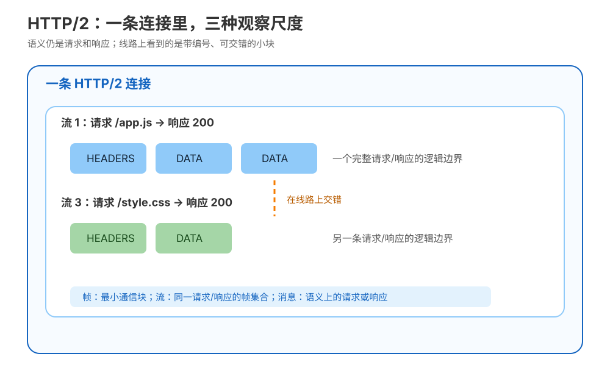
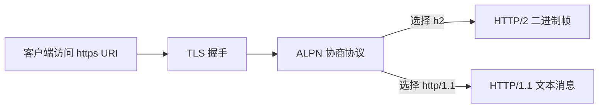
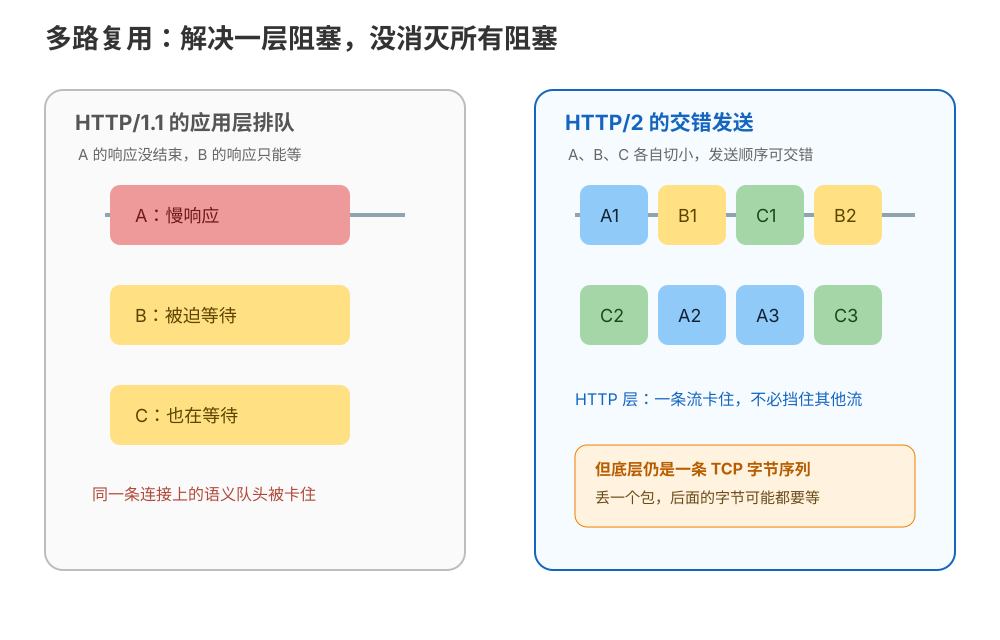
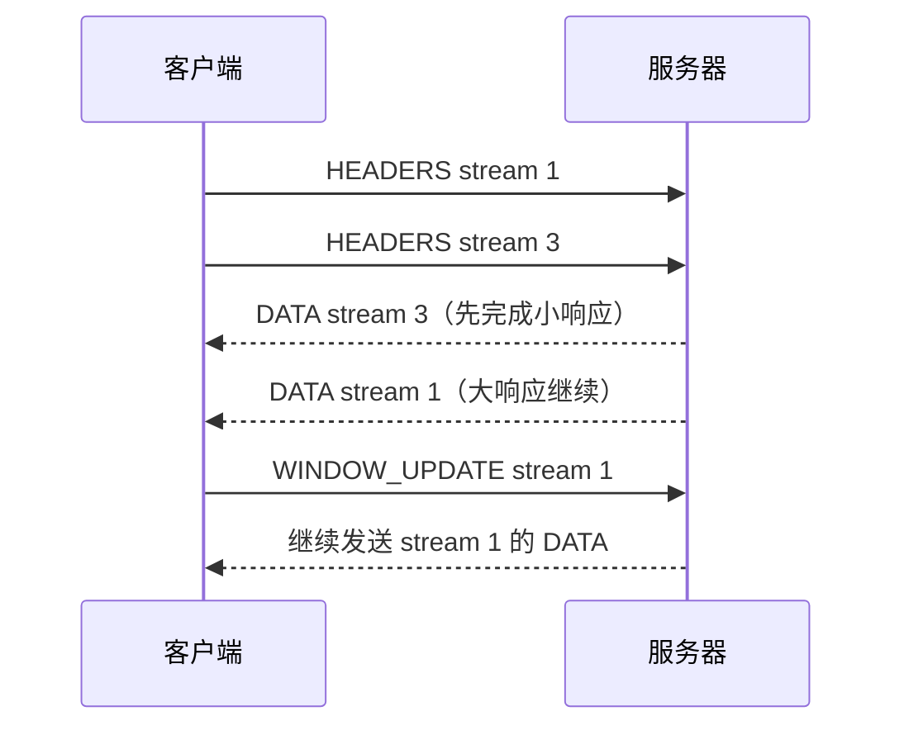
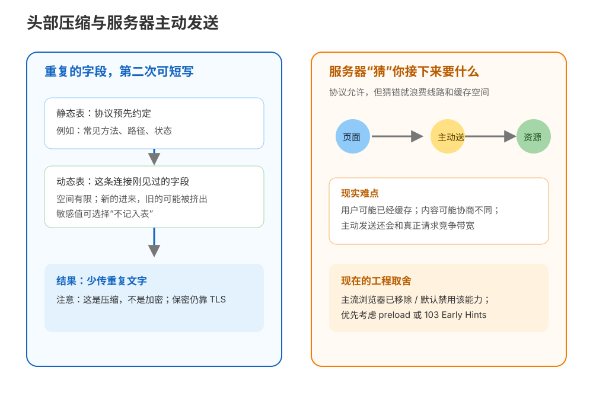
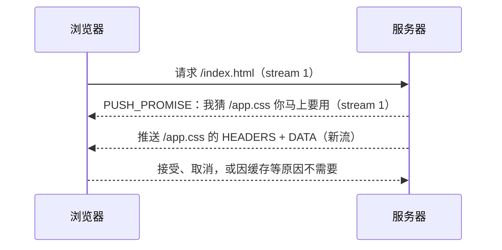

# 第 11 课：HTTP/2 与多路复用

> 所属阶段：阶段 4《协议演进》｜ 水平：入门 ｜ 本课知识点：二进制分帧、多路复用、头部压缩与服务器推送
> 故事情节：团队想给站点开 HTTP/2，小航先搞懂它到底解决了什么
> 📖 结论已按官方文档核对（核查于 2026-09｜来源：[HTTP Working Group：RFC 9113](https://httpwg.org/specs/rfc9113.html)、[RFC 7541 HPACK](https://httpwg.org/specs/rfc7541.html)、[MDN HTTP/2](https://developer.mozilla.org/en-US/docs/Glossary/HTTP_2)、[Chrome Developers：Remove HTTP/2 Server Push](https://developer.chrome.com/blog/removing-push)）——见 `topic-teach`「官方文档学习闸门」

## 🎯 本课目标

- 区分帧、流、消息三个概念，说清 HTTP/2 从文本协议改为二进制分帧的原因。
- 解释多路复用如何解决 HTTP 层队头阻塞，以及为什么 TCP 层队头阻塞仍在。
- 说出 HPACK 与静态表的压缩思路，讲清服务器推送为什么被浏览器移除，理解流优先级的作用。

### 📖 写前文档核对：HTTP/2 的三个容易混淆点

| 容易形成的直觉 | 按官方文档校准后的说法 |
|---|---|
| HTTP/2 改成二进制后，HTTP 语义也换了 | RFC 9113 与 MDN 都强调：方法、状态码、URI 和字段语义保留，变化主要在分帧与传输组织。 |
| 多路复用解决了所有队头阻塞 | 它解决 HTTP/1.1 响应排队造成的应用层 HoL；RFC 9113 明确 TCP HoL 不在本协议解决范围内。 |
| HPACK 是“加密版头部” | RFC 7541 定义的是索引/字面量压缩上下文；保密性仍由 TLS 提供。 |
| 服务器推送已经从 HTTP/2 标准消失 | RFC 9113 仍定义可选 `PUSH_PROMISE`；退潮发生在浏览器实现与工程实践，替代方向是 `preload` 和 `103 Early Hints`（核查于 2026-09）。 |

---

## 第一幕：起源与场景引入

> 🏛️ **起源**：HTTP/2 的标准化版本 RFC 7540 于 2015 年发布，当前修订规范是 RFC 9113（2022 年 6 月发布），它保留 HTTP 的方法、状态码与字段语义，重点改造消息在连接上的组织方式：二进制分帧、并发流和字段压缩（核查于 2026-09）。

小航负责一个首页：HTML 返回后，浏览器还要拿 CSS、JavaScript、字体和图片。首页首屏一共要发起几十个请求。团队已经学过上一课的结论：HTTP/1.1 可以复用连接，但同一条连接上的请求响应仍有排队关系；为了并发，只好开多条 TCP 连接，甚至把静态资源拆到 `static-a.example.test`、`static-b.example.test` 两个域名。

今天他看到服务器日志里写着：

```text
page loaded, but 37 asset requests competed for 6 connections
```

这不是说服务器真的只能处理 6 个请求，而是浏览器为了绕过旧协议的排队限制，主动把工作摊到多条路上。每多开一条路，就多一份连接维护、拥塞控制、TLS 握手和服务端连接状态的成本。

> 🎬 **场景**：同一台服务器前，几十份小资源挤在几条路上；团队想把路变少，却不想把请求重新排成长队。

> 📌 **一句话本质**：把“一条路一次运一整份货”改成“同一条路把多份货拆成小包交错运输”，并把重复的地址信息变短。
>
> ⚖️ **处境对照**：HTTP/1.1 常靠多条连接获得并发，连接数越多就越多握手、拥塞和管理开销；HTTP/2 可以在一条连接中承载多个并发请求，但如果底层 TCP 丢包，所有请求仍可能一起等待。这个差别能在本课实验中直接看到，而不是把“HTTP/2 更快”当成无条件结论。

---

## 第二幕：认知冲突

小航的第一个想法很直白：“既然 HTTP/1.1 的问题是文本，那 HTTP/2 改成二进制后，速度就自然变快了吧？”

但这个说法把三个不同层次混在了一起：

| 看起来像一个问题 | 实际上要拆开的疑问 |
|---|---|
| 文本很慢 | 文本只是表达形式；真正影响并发的是请求如何在连接上排队 |
| 多路复用解决了队头阻塞 | 它主要解决 HTTP 层的排队，TCP 层仍是一条有序字节流 |
| 头部压缩就是加密 | 压缩只减少重复字节，TLS 才负责保密和完整性 |
| 服务器提前发资源一定更快 | 猜错、命中缓存或与关键响应竞争带宽时，可能更慢 |

> ❓ **问题**：HTTP/2 到底改了哪一层？它为什么能让多条请求交错前进，却仍然没有彻底消灭队头阻塞？

---

## 第三幕：层层揭示

### 一眼全局图（进入细节前先看一眼）


> 看图：左边是一份大东西没送完，后面的东西只能等；右边把货物拆成小包，在同一条路上交错前进，某一份暂时卡住时其他小包仍可能先走。

这张图刻意不放“帧、流、HPACK、TCP”等术语。先只记住一个问题视角：HTTP/2 想让一条已经建立的连接更像“可交错的运输带”，而不是“必须整单完成后才能发下一单的队列”。

### 本课地图（分几步走）

| 步 | 这一步要解决什么（人话） | 对应知识点 |
|:--:|------------------------|-----------|
| 1 | 先看清一条连接里的“小块”、分组和完整请求分别是什么 | 知识点 11.1：二进制分帧 |
| 2 | 再看多份请求如何在同一条连接上交错，以及阻塞还会残留在哪里 | 知识点 11.2：多路复用 |
| 3 | 最后看重复字段如何变短、服务器主动发送为何退潮，以及优先级怎么理解 | 知识点 11.3：头部压缩与服务器推送 |

> 只回答“分几步走、现在在哪”，不提前塞入机制结论；具体结论在三个知识点中兑现。

### 知识点 11.1：二进制分帧

> 🧭 第 1/3 步｜承接：上一幕的问题是“HTTP/2 改了哪一层” → 本步：先把一条连接上的最小运输单位看清楚，再谈并发。
> 本知识点关键点：帧、流、消息三个概念 / 从文本协议到二进制分帧的原因 / HTTPS 与 `h2` 的绑定关系

#### 一句话定义

二进制分帧（binary framing）是：把请求和响应拆成带固定格式帧头的二进制小块，再由流编号把属于同一请求/响应的小块重新归组。

它改变的是“怎么在线路上摆放字节”，不是“GET 表示获取、404 表示找不到资源”这些 HTTP 语义。HTTP/2 仍然是 HTTP，只是在 HTTP 语义和 TCP 之间加了一层更明确的组织方式。

#### 直觉建立（类比）

上一课的“整车运输”可以这样升级：HTTP/1.1 像把一份订单写在一张长纸上，车必须按订单边界运送；HTTP/2 像给每个小包贴上“属于订单 A / 订单 B”的编号，调度员可以交替装车。收货方按照编号把小包归回原订单。

这里的“小包”就是本课的直觉说法“帧”，同一订单的小包集合就是“流”，订单本身仍然是一个 HTTP 请求或响应，也就是“消息”。

> 💡 **类比的边界**：现实快递小包可以乱序到达后再拼装，但 HTTP/2 运行在 TCP 上，TCP 对上层交付的是有序字节流；HTTP/2 的“交错”发生在帧的发送排布上，不代表接收端可以无视字节顺序。帧内 payload 也不是都能随意解释：`HEADERS`、`DATA`、`SETTINGS` 等帧类型各自有格式。

#### 核心原理

RFC 9113 把 frame 定义为 HTTP/2 连接内最小的通信单位，把 stream 定义为连接内双向的帧流。每个帧都有固定 9 字节帧头，后面跟可变长度 payload：



> 读图：最外层是一条连接；每条流承载一组属于同一请求/响应的帧；从应用看见的仍是一条完整消息。

帧头可以按下面的字段读：

| 字段 | 大小 | 作用 | 入门时怎么理解 |
|---|---:|---|---|
| Length | 24 bit | payload 的字节数，不含 9 字节帧头 | 这一小块有多长 |
| Type | 8 bit | 帧类型 | 这小块是数据、头部还是控制信息 |
| Flags | 8 bit | 随帧类型解释的标志位 | 例如头部是否结束、数据流是否结束 |
| Reserved | 1 bit | 保留位 | 发送时保持未设置 |
| Stream Identifier | 31 bit | 关联哪一条流；`0` 表示连接级帧 | 这小块属于谁 |
| Frame Payload | 可变 | 由帧类型决定 | 真正的内容或控制参数 |

这套格式带来三个实际收益：

1. **边界明确**：接收方不必依靠换行、空格等文本分隔符猜测一段控制信息在哪里结束。
2. **控制与数据可区分**：`SETTINGS`、`WINDOW_UPDATE`、`GOAWAY` 等连接/流控制能和 `HEADERS`、`DATA` 分开处理。
3. **交错有抓手**：同一字节序列中出现多个流编号，调度器可以在帧边界切换发送对象。

但“二进制”本身不是性能魔法。若服务器仍只允许一条流、调度策略很差或网络丢包严重，改成二进制不会自动让业务变快。收益来自分帧、并发流、压缩和连接管理共同作用。

HTTP/2 的请求不再把完整的 `GET /path HTTP/1.1` 文本行原样放进线上格式，而是用伪头部字段表达控制信息，例如：

| HTTP/1.1 中熟悉的概念 | HTTP/2 请求中的表达 |
|---|---|
| 方法 | `:method: GET` |
| 目标协议 | `:scheme: https` |
| 主机与端口 | `:authority: example.test` |
| 路径 | `:path: /app.js` |
| 响应状态 | 响应中的 `:status: 200` |

这不是新增了一套业务语义，而是把 HTTP 控制信息放进适合分帧的字段块。普通字段仍然保留，比如 `content-type`、`cache-control`；连接专属的 HTTP/1.1 头部不能原封不动带入 HTTP/2。

#### HTTPS 与 `h2`：为什么常见的 HTTP/2 是加密的

这里容易出现一个误解：“HTTP/2 = HTTPS”。更准确的关系是：



> 读图：`https` 先建立 TLS；ALPN 在 TLS 里协商应用协议，协商到 `h2` 才进入 HTTP/2 帧层；协商结果也可能是 `http/1.1`。

RFC 9113 为 HTTP/2 over TLS 注册了协议标识 `h2`，并要求 HTTPS 场景使用 TLS 的 ALPN 扩展来协商。于是浏览器访问 `https://...` 时，服务器和客户端可以在 TLS 建立阶段决定：“这一条加密连接上，HTTP 语义用 h2 表达。”

明文路径在规范中有历史上的 `h2c` 叫法，但基于 HTTP Upgrade 的 `h2c` 使用从未广泛部署，当前 RFC 9113 已将该 Upgrade token 记为过时；本课把主路径放在浏览器实际最常见的 `https + ALPN + h2` 上。不要把“浏览器通常用 HTTPS”误记成“HTTP/2 在数学上必须加密”：规范和实现层面是两个相关但不同的判断。

#### 示例演示

先把上一课的文本请求和本课的帧模型并排看：

```http
GET /app.js HTTP/1.1
Host: example.test
Accept: */*

```

```text
HTTP/2（示意，不是完整十六进制转储）
HEADERS  stream=1  :method GET, :scheme https, :authority example.test, :path /app.js
DATA     stream=1  "...脚本内容..."
```

此时不要追求“能不能手写一段二进制请求”。你要观察的是：HTTP/1.1 把结构显式写成文本行；HTTP/2 把结构放入帧头、流编号与字段块里；服务器仍然能得到同一个方法、目标和资源内容。

#### 常见误区

1. **“HTTP/2 只是把文本换成二进制，所以速度一定翻倍”**：二进制让边界和调度更适合机器处理，但性能收益还取决于并发、头部压缩、拥塞、服务端调度和资源策略。
2. **“一条 HTTP/2 连接只有一条请求”**：恰恰相反，一条连接可以有多条并发打开的流；连接级控制帧的流编号才是 `0`。
3. **“每个帧就是一个完整请求”**：请求/响应通常要跨多个帧；帧是最小通信块，流才把同一交换串起来。
4. **“HTTP/2 的 `:authority` 就是普通 `Host` 头”**：它们表达的目标主机有关，但 `:authority` 是 HTTP/2 的伪头部字段；直接生成 HTTP/2 请求时，应按规范使用它，不能让 `Host` 与它表达不同的目标。
5. **“看到 `https` 就能断言一定协商成 h2”**：TLS 保护和 HTTP 版本协商是两件事，ALPN 可能协商到 `h2`，也可能回退到 `http/1.1`。

#### 一句话记住

HTTP/2 不改 HTTP 要表达什么，而是把请求/响应拆成带流编号的二进制帧，让同一条连接具备可交错的组织能力。

#### 🗣️ 行话对照

- **二进制分帧（binary framing）**：把语义消息拆成有固定帧头的二进制通信块——就是本课说的“把整单拆成带编号的小包”；在哪遇到：RFC 9113 §4、抓包工具的 HTTP/2 frame 视图。
- **流（stream）**：连接内双向的帧流——就是本课说的“同一份请求/响应的小包集合”；在哪遇到：帧头 `Stream Identifier`、`SETTINGS_MAX_CONCURRENT_STREAMS`。
- **ALPN（Application-Layer Protocol Negotiation）**：在 TLS 中协商应用层协议——就是本课说的“先谈妥这条加密路用哪种 HTTP”；在哪遇到：TLS ClientHello/ServerHello、`h2` / `http/1.1` 协议标识。

#### 官方文档

- [RFC 9113 §2：术语与定义](https://httpwg.org/specs/rfc9113.html#rfc.section.2)
- [RFC 9113 §3：Starting HTTP/2](https://httpwg.org/specs/rfc9113.html#starting)
- [RFC 9113 §4.1：Frame Format](https://httpwg.org/specs/rfc9113.html#FrameHeader)
- [RFC 9113 §8.3：HTTP Control Data](https://httpwg.org/specs/rfc9113.html#HttpControlData)
- [RFC 7301：TLS Application-Layer Protocol Negotiation](https://www.rfc-editor.org/rfc/rfc7301)

### 知识点 11.2：多路复用

> 🧭 第 2/3 步｜承接：现在已经知道“帧可以带流编号” → 本步：把不同流的帧交错起来，解决 HTTP/1.1 应用层排队；同时标记 TCP 这道尚未解决的边界。
> 本知识点关键点：一条连接并发多条流 / 解决 HTTP 层队头阻塞 / TCP 层队头阻塞仍在——为课 12 埋伏笔

#### 一句话定义

多路复用（multiplexing）是：在一条连接上同时打开多条独立的 HTTP/2 流，并把这些流的帧交错发送，使某一条流等待时其他流仍有机会推进。

#### 直觉建立（类比）

想象一条传送带上同时处理三份订单：订单 A 的一个大箱子还没装好，调度员先把订单 B、C 的小箱子放上去。收货方按订单编号分别归档，所以 B、C 不必因为 A 慢就完全停摆。

这就是“多路”：同一条连接承载多个逻辑通道；“复用”：发送端把它们的片段合在一串字节里，接收端再按编号分开。

> 💡 **类比的边界**：传送带上的箱子可以被调度员随意挪动，但 HTTP/2 不能违反帧顺序、流状态和流量控制；更重要的是，这条传送带底下仍是一条 TCP 有序字节流。HTTP 层允许交错，不代表 TCP 能跳过丢失的字节。

#### 核心原理

HTTP/1.1 的 pipelining 只把多个请求排到同一条连接上，但响应必须按顺序处理，前面的慢响应会挡住后面响应，这就是应用层队头阻塞（head-of-line blocking，简称 HoL blocking）。HTTP/2 把每次请求/响应交换绑定到不同流，流之间大体独立；帧在一个连接中交错发送。



> 读图：左边 A 的慢响应把 B、C 挡在 HTTP 层；右边 B、C 的帧可插入 A 的帧之间，但底部的 TCP 丢包仍可能让全连接等待。

把三个层次分清，就不会把“解决队头阻塞”说过头：

| 层次 | 发生了什么 | HTTP/2 的状态 |
|---|---|---|
| HTTP 语义层 | A 的响应慢，B 是否必须等 A 的完整响应 | 通过独立流和帧交错，通常不必等 |
| HTTP/2 帧层 | B 的帧要插入 A 的帧之间 | 可以交错，但要遵守流状态和帧顺序 |
| TCP 传输层 | 一段 TCP 字节丢失，后面的字节不能越过它交付 | 仍然存在；同一连接上的多条流可能一起被拖住 |

因此 HTTP/2 的真实收益可以说成：**减少为了并发而开多条连接的需求，并消除 HTTP/1.1 响应排队带来的应用层 HoL；它没有消除 TCP 有序传输带来的底层 HoL。** RFC 9113 甚至在介绍目标时直接提醒：TCP 队头阻塞不在本协议解决范围内。

#### 流的身份与控制

为了让“多份订单”不会串单，HTTP/2 给流分配整数 ID：客户端发起的流使用奇数，服务器发起的流使用偶数；流 `0` 保留给连接级控制，不承载普通请求/响应。服务器推送曾使用服务器发起的流，这也是它能独立于客户端原始请求占用一条流的原因。

一条连接不是无限资源。双方可以通过 `SETTINGS_MAX_CONCURRENT_STREAMS` 表示并发流上限；超过对方允许范围的请求可能收到 `REFUSED_STREAM` 等处理。这个上限不是“服务器最多能处理多少业务请求”的全局容量，它是单个 HTTP/2 连接上的并发流约束。

多条流还会争抢同一条连接的发送窗口，所以 HTTP/2 有流量控制（flow control）：接收方通过 `WINDOW_UPDATE` 按流和按连接授予可发送的字节额度。只有 `DATA` 帧消耗这种窗口，控制帧不能因为数据窗口耗尽而完全失去发送机会。对于入门排障，可以把它理解为：



> 读图：流 3 可以先完成，流 1 的发送受窗口控制；窗口增加后，流 1 才能继续发送更多 DATA。

“优先级”也要放在这个调度问题里理解：当带宽或发送窗口有限，服务器需要决定先发哪个流的帧。旧版 RFC 7540 的优先级树信令在当前 RFC 9113 中已被弃用；实现仍然需要调度，但不要把旧教程里的 `PRIORITY` 树当成今天所有实现都必须遵循的唯一方案。更现代的可扩展优先级方案见 RFC 9218，具体支持要看客户端、服务器和代理链。

#### 示例演示

同一个页面要拿两个资源：`/hero.jpg` 很大，`/app.css` 很小。若服务器把二者拆到不同 HTTP/2 流，并允许小资源先调度，线上帧序列可能类似：

```text
连接字节序列（按帧，不是按完整响应）
HEADERS stream=1   # /hero.jpg
HEADERS stream=3   # /app.css
DATA    stream=3   # CSS 第一块
DATA    stream=3   # CSS 最后一块，结束 stream=3
DATA    stream=1   # 图片第一块
DATA    stream=1   # 图片后续块
```

如果把 `stream=1` 的图片服务处理暂停，`stream=3` 仍可能在 HTTP 层完成；但若承载这串帧的 TCP 连接中间丢了一个包，后面的字节交付要等重传，两个流都可能看到延迟。这就是为什么下一课要讲 HTTP/3 / QUIC：它把并发与可靠传输的组织边界继续往下移动。

#### 常见误区

1. **“HTTP/2 解决了所有队头阻塞”**：只解决 HTTP 层请求/响应排队；TCP 仍要求字节有序，丢包可能拖住同一连接的所有流。
2. **“多路复用就是开很多 TCP 连接”**：它的关键恰恰是多个逻辑流共享一条连接；连接数减少是常见结果，不是定义本身。
3. **“流量控制等于限流”**：`WINDOW_UPDATE` 是单跳连接内的接收额度管理，不等于业务 QPS 限流，也不替代服务端并发、队列和容量规划。
4. **“流 ID 0 可以放首页请求”**：0 是连接级控制的保留编号；普通请求需要绑定到具体的非零流。
5. **“旧版优先级树永远决定浏览器加载顺序”**：当前 RFC 9113 已弃用 RFC 7540 的优先级信令方案；实际调度还受实现、代理和资源状态影响。

#### 一句话记住

多路复用把“多份请求排队”改成“多个流的帧交错”，拆掉了 HTTP 层的队头，但 TCP 的有序字节流仍可能让整条连接一起等。

#### 🗣️ 行话对照

- **多路复用（multiplexing）**：多个逻辑流共享一条物理连接——就是本课说的“多份订单共用一条传送带”；在哪遇到：HTTP/2 抓包中交错的 stream ID、浏览器网络面板、RFC 9113 §5。
- **队头阻塞（HoL blocking）**：队列最前面的慢项阻挡后面的项——就是本课说的“前面的大箱子挡住后面小箱子”；在哪遇到：HTTP/1.1 pipelining、HTTP/2 over TCP、HTTP/3 对比说明。
- **流量控制（flow control）**：接收方用窗口告知发送方可继续发送多少字节——就是本课说的“发送额度”；在哪遇到：`WINDOW_UPDATE`、`SETTINGS_INITIAL_WINDOW_SIZE`、抓包中的窗口变化。

#### 官方文档

- [RFC 9113 §5：Streams and Multiplexing](https://httpwg.org/specs/rfc9113.html#StreamsLayer)
- [RFC 9113 §5.2：Flow Control](https://httpwg.org/specs/rfc9113.html#FlowControl)
- [RFC 9113 §5.3：Prioritization](https://httpwg.org/specs/rfc9113.html#StreamPriority)
- [RFC 9113 §6.9：WINDOW_UPDATE](https://httpwg.org/specs/rfc9113.html#WINDOW_UPDATE)
- [RFC 9218：Extensible Prioritization Scheme for HTTP](https://www.rfc-editor.org/rfc/rfc9218)

### 知识点 11.3：头部压缩与服务器推送

> 🧭 第 3/3 步｜承接：帧和流解决了“怎么交错运送” → 本步：处理每个请求都重复发送的大量字段，并判断“服务器主动送资源”这个曾经的优化为什么退潮。
> 本知识点关键点：HPACK 与静态表 / 服务器推送为什么被浏览器移除 / 流优先级

#### 一句话定义

HPACK 是 HTTP/2 的头部字段压缩机制：用预先约定的静态表、连接内维护的动态表和索引表示减少重复字段；服务器推送则是服务器在客户端明确请求前，先承诺并发送一个它猜测客户端将需要的响应。

两者解决的是不同问题：HPACK 减少头部字节；服务器推送改变资源到达的时机；它们都不等于加密，也都不是“开了 HTTP/2 就必然更快”。

#### 直觉建立（类比）

一家餐厅有一本公共菜单，常点的菜都有编号；同一桌刚点过“少冰、无糖”，服务员可以暂时记在这桌的小黑板上，下一次只说“还是刚才那份”。这就是静态表和动态表的直觉。

服务器推送则像服务员看到你点了套餐，猜测你还要配菜，于是先端上来。猜对且你还没吃过，可能省等待；猜错、你已经吃饱，或者主菜还没上就把桌子占满，主动端来的菜反而挡路。

> 💡 **类比的边界**：HPACK 的动态表是连接两端压缩上下文的一部分，不是应用缓存，也不是服务端把字段永久存起来；编码器可以用索引、字面量和“不索引”表示，解码器必须按顺序维护上下文。服务器推送也不是服务员直接把资源塞进浏览器缓存就结束，它要受安全来源、可缓存性、客户端取消和带宽竞争约束。

#### 核心原理：HPACK 如何让重复字段变短

HPACK 使用两张表，但在编码索引空间里把它们拼成一个地址空间：



> 读图：左侧先从固定清单或连接记忆中找重复字段，重复时可以传索引；右侧的主动发送只有在“猜得准且不抢资源”时才有机会获益。

| 表 | 谁定义 / 谁更新 | 放什么 | 关键边界 |
|---|---|---|---|
| 静态表（static table） | HPACK 规范预先定义 | 常见字段名及部分常见值 | 只读、固定、所有上下文都可用 |
| 动态表（dynamic table） | 编码器与解码器按连接上下文维护 | 最近出现、可能重复的字段名和值 | 有最大容量；新条目进入时旧条目可能被驱逐 |

一条字段可以有三种入门级表达：

1. **Indexed representation**：直接传索引，例如“静态表第 2 项”，接收端查出完整字段。
2. **Literal with indexing**：传字段（或字段名索引）并加入动态表，期待后续复用。
3. **Literal without indexing / never indexed**：传字段但不加入动态表；敏感值可以选择 never-indexed，避免它成为后续压缩上下文的一部分。

HPACK 的压缩上下文是有状态的：同一条连接上的两端要保持对动态表的共同理解；若字段块解码失败，连接可能以 `COMPRESSION_ERROR` 终止。动态表的上限由 HTTP/2 的 `SETTINGS_HEADER_TABLE_SIZE` 相关设置约束，默认初始值在 RFC 9113 中为 4096 字节。表越大不等于一定越好：它会占用内存，也可能因为敏感字段和压缩侧信道带来安全考量。

一个非常重要的分界线是：

```text
HPACK：把“重复字段”表示得更短
TLS：让旁观者看不懂内容，并检测篡改
```

所以，即使某个 HTTP/2 连接运行在明文 TCP 上，HPACK 也不会替它提供保密性；而浏览器常用的 `https + h2` 是 TLS 与 HTTP/2 两层组合。

#### 核心原理：服务器推送为什么从“亮点”变成“谨慎看待”

HTTP/2 的服务器推送流程可以抽象成：



> 读图：推送不是凭空出现的资源，而是服务器在已有请求关联下“承诺一个安全、可缓存的请求”，再在单独流上发送；客户端仍可能拒绝或重置它。

它曾经吸引人的地方是：服务器已经知道 HTML 会引用 CSS/JS，于是可以少等一次客户端看到 HTML、解析引用、再发起请求的往返。但现实中服务器很难持续猜准：

- 资源可能已在浏览器缓存里，推送变成重复传输。
- 内容可能因用户、语言、设备、Cookie 或协商头不同而变化，服务器未必知道正确版本。
- 主动推送会和客户端已经明确请求的关键资源竞争带宽、拥塞窗口和 HTTP/2 流调度。
- 它是逐跳能力，不会自动穿过所有代理、反向代理和 CDN；链路中的实现能力可能不同。

截至本课事实核查时间，MDN 写明服务器推送已从大多数主流浏览器引擎移除；Chrome Developers 记录了 Chromium 106 起默认禁用 Server Push，并给出 `103 Early Hints` 作为更易控制的替代方向。要准确表述是“协议 RFC 9113 仍定义了可选的 PUSH_PROMISE，但浏览器生态已经不把它当作常规应用优化手段”，不是“HTTP/2 协议已经删除服务器推送”。

#### 流优先级：把它放回调度问题

当多条流同时有数据，发送方必须决定下一帧给谁。优先级的直觉就是“谁更值得先占用有限的带宽”。例如首屏 CSS、字体和 HTML 关键数据，通常比折叠区下面的大图更早影响可见结果；但具体排序依赖资源关系、缓存状态、响应大小和服务器实现。

当前要记住两个事实：

| 说法 | 准确解释 |
|---|---|
| HTTP/2 有优先级概念 | 是；调度需要在竞争资源时作出取舍 |
| 所有实现都按旧优先级树调度 | 不是；RFC 9113 已弃用 RFC 7540 的旧优先级信令方案，RFC 9218 提供了可扩展优先级方案，但支持与效果要看客户端、服务器和代理链 |

把它和服务器推送区分开：**优先级决定“已存在的候选数据谁先发”；推送决定“服务器要不要额外制造一个客户端尚未明确请求的候选”。** 推送即使猜对，也不能跳过调度竞争；推送猜错，还会挤占真正重要流。

#### 示例演示

先用一个极简表格模拟同一页面发来的字段：

| 请求 | 首次看到的字段 | 后续请求可以怎么表达 |
|---|---|---|
| 1 | `:method: GET`、`:scheme: https`、`accept: application/json` | 常见字段可用静态表索引；新字段可按策略进入动态表 |
| 2 | 相同 `:method`、相同 `accept` | 传索引或更短的表示，不必重复写完整字符串 |
| 3 | `authorization: <TOKEN>` | 可采用 never-indexed 的字面量表示，避免进入动态表 |

实验脚本会打印这个“查表模型”，也会用真实的帧头编码和解析交错流；它不会假装自己是完整的 HPACK 实现。这个边界很重要：教学脚本验证协议数据模型，互操作性测试应使用成熟 HTTP/2 库或抓包工具。

#### 常见误区

1. **“HPACK 是加密”**：HPACK 任何时候都只是压缩/编码；保密性和完整性来自 TLS。
2. **“动态表就是浏览器缓存”**：动态表是压缩上下文，作用域和生命周期通常绑定到连接方向；它不替代 HTTP 缓存语义。
3. **“所有头部都应该加入动态表”**：敏感或高变化字段可能不适合索引；never-indexed 是 HPACK 为此提供的表示方式之一。
4. **“服务器推送已经从 HTTP/2 标准删除”**：当前 RFC 9113 仍定义它；退潮主要发生在浏览器实现和工程实践层面。
5. **“推送越积极，首屏越快”**：缓存命中、内容协商错误或带宽竞争都能把推送变成负优化；浏览器端通常更偏向 `preload` 或 `103 Early Hints`。
6. **“优先级就是推送”**：优先级是已有数据的调度信号，推送是额外制造候选响应；二者有关联但不是同一个功能。

#### 一句话记住

HPACK 用表和索引压掉重复头部但不负责保密；服务器推送仍在 RFC 里，却因猜测成本和浏览器控制权问题退居谨慎使用的位置。

#### 🗣️ 行话对照

- **HPACK（Header Compression for HTTP/2）**：HTTP/2 的头部字段压缩机制——就是本课说的“常用地址记编号、重复信息短写”；在哪遇到：RFC 7541、HTTP/2 抓包中的 header block、`SETTINGS_HEADER_TABLE_SIZE`。
- **静态表 / 动态表（static table / dynamic table）**：前者是规范预置只读表，后者是连接上下文中可更新且有容量限制的表——就是本课说的“公共菜单 / 这桌的小黑板”；在哪遇到：HPACK index、动态表驱逐、压缩上下文错误。
- **服务器推送（Server Push）**：服务器通过 `PUSH_PROMISE` 预先发送客户端可能需要的安全、可缓存响应——就是本课说的“先猜着端上配菜”；在哪遇到：HTTP/2 `PUSH_PROMISE`、浏览器协议支持、`103 Early Hints` / `rel=preload` 替代方案。

#### 官方文档

- [RFC 7541 §2：HPACK Compression Process Overview](https://httpwg.org/specs/rfc7541.html#compression)
- [RFC 7541 §2.3：Indexing Tables](https://httpwg.org/specs/rfc7541.html#indexing)
- [RFC 7541 §6.2.3：Literal Header Field Never Indexed](https://httpwg.org/specs/rfc7541.html#literal.header.field.never.indexed)
- [RFC 9113 §4.3：Compression](https://httpwg.org/specs/rfc9113.html#Compression)
- [RFC 9113 §8.4：Server Push](https://httpwg.org/specs/rfc9113.html#ServerPush)
- [MDN：HTTP/2](https://developer.mozilla.org/en-US/docs/Glossary/HTTP_2)
- [Chrome Developers：Remove HTTP/2 Server Push from Chrome](https://developer.chrome.com/blog/removing-push)

---

## 第四幕：实操验证

### 4.1 机制验证：帧头、流交错与本机协议协商

本课实验不依赖 Docker、第三方 Python 包或自建公网服务器，文件在：[lesson-11-http2-framing-lab.py](../labs/lesson-11-http2-framing-lab.py)。它做两件互补的事：

1. 用标准库编码/解析 HTTP/2 的 9 字节通用帧头，证明同一串字节中可以交错 `stream=1` 和 `stream=3`。
2. 用一个明确标注的教学模型展示 HPACK 的“静态表 / 动态表 / never-indexed”思路，不冒充完整解码器。

本课经应用实战判定不另配独立篇：真实站点迁移还需要证书、ALPN、反向代理/CDN 配置、浏览器支持矩阵和加载指标；把它压缩成“打开一个开关”会误导初学者。这里先完成协议机制闭环，生产迁移留到后续性能与代理专题按真实链路展开。

运行：

```bash
python3 stages/4-协议演进/labs/lesson-11-http2-framing-lab.py
```

本机实测输出（2026-09-16）：

```text
[1] connection preface bytes=24 value=b'PRI * HTTP/2.0\r\n\r\nSM\r\n\r\n'
[2] decoded frames
  1. SETTINGS  stream=0  length=6  flags=0x00 payload=000300000004
  2. HEADERS  stream=1  length=17 flags=0x04 payload=828487410c6578616d706c65
  3. HEADERS  stream=3  length=17 flags=0x04 payload=828487410c6578616d706c65
  4. HEADERS  stream=3  length=1  flags=0x04 payload=88
  5. DATA     stream=3  length=4  flags=0x01 payload=66617374
  6. DATA     stream=1  length=4  flags=0x01 payload=736c6f77
[3] interleaving: stream 3 DATA appears before stream 1 DATA -> True
    meaning: stream 1 can be slow without forcing stream 3 to wait at HTTP layer
[4] HPACK table model (teaching model, not a full decoder)
  static index 2  -> :method: GET
  static index 7  -> :scheme: https
  first x-demo    -> literal + dynamic table: x-demo: one
  repeat x-demo   -> indexed representation (dynamic table entry)
  sensitive value -> literal never-indexed (does not enter dynamic table)
[5] result: one HTTP/2 connection can carry multiple numbered streams
    boundary: TCP packet loss can still delay bytes belonging to every stream
```

逐段读输出：

| 输出 | 你应该验证的结论 |
|---|---|
| `bytes=24` | 客户端连接前言是固定的 24 字节 ASCII 序列；它不是业务请求 |
| `SETTINGS stream=0` | `stream=0` 用于连接级控制，帧头长度是 9 字节之外的 payload 长度 |
| 两个 `HEADERS` 分属 1 / 3 | 两份逻辑请求可以在一条字节序列中并存 |
| `stream=3 DATA` 先于 `stream=1 DATA` | 帧交错让小响应不必等待大响应完成 |
| `[4]` 的表模型 | 重复字段可改用索引；敏感值可不进入动态表；这不是加密 |
| 最后一行 boundary | HTTP/2 的收益边界：底层 TCP 丢包仍可能影响所有流 |

再用本机带有 nghttp2 支持的 curl 看一次 TLS/ALPN 协商结果。这个命令不读取响应正文，只打印协商出来的 HTTP 版本：

```bash
curl -sS -o /dev/null -w 'http_version=%{http_version}\n' --http2 https://example.com/
curl -sS -o /dev/null -w 'http_version=%{http_version}\n' --http1.1 https://example.com/
```

本机实测输出（2026-09-16）：

```text
http_version=2
http_version=1.1
```

这里的关键不是 `example.com` 这个站点，而是同一客户端可以被显式要求尝试 HTTP/2，也可以被显式限制为 HTTP/1.1；`https` 负责 TLS，`--http2` 让 curl 在 TLS 的 ALPN 协商中优先选择 `h2`。网络、站点配置或客户端版本不同，重复实验时应以你自己的 `http_version` 为准。

> ✅ **回扣场景**：小航现在能把“HTTP/2 更快”拆成可验证的句子：一条连接里有多个编号流，帧可以交错；重复字段可压缩；但协议协商要确认，TCP 丢包边界不能假装不存在。

---

## 第五幕：体系收束


> 读图：从上到下是“HTTP 语义仍在 → 一条连接承载多条流 → 帧交错与 HPACK 降低组织和重复开销”，右下角保留 TCP 队头阻塞边界，下一课继续处理它。

> 📍 **全局定位**：课 10 解释 HTTP/1.1 为什么成为协议奠基层；本课把“为了并发而开很多连接”的补丁换成 HTTP/2 的分帧、多路复用和头部压缩；课 12 将继续问：如果 TCP 自己因为丢包让所有流一起等，能不能把可靠传输也拆成独立流？
> 🔗 **下一步**：进入《HTTP/3 与 QUIC》，重点看 QUIC 如何在 UDP 之上重新组织可靠传输、连接迁移与 0-RTT，并比较 HTTP/2 over TCP 与 HTTP/3 over QUIC 的队头阻塞边界。

---

## 🐞 常见误区

1. **“HTTP/2 不需要 HTTPS”与“HTTP/2 天生就是 HTTPS”是同一个极端**：规范层面要区分 HTTP/2 的帧协议和 TLS 的安全层；浏览器常见路径是 `https + ALPN + h2`，明文路径不是本课的生产默认。
2. **“二进制分帧 = 压缩”**：分帧解决边界和调度；HPACK 解决重复字段；两者是不同机制。
3. **“多路复用 = 没有队头阻塞”**：HTTP 层的排队 HoL 被缓解，TCP 层的有序交付 HoL 仍然存在。
4. **“HPACK 动态表能永久记住字段”**：动态表有上限、会驱逐，且是压缩上下文，不是业务缓存。
5. **“服务器推送越多越专业”**：推送是预测性功能，错误预测会占用带宽；当前浏览器生态已转向客户端可控的 preload / Early Hints 路径。
6. **“看到 HTTP/2 就照抄旧 PRIORITY 树配置”**：当前 RFC 9113 已弃用旧优先级信令；先看实现与指标，再决定是否使用现代优先级机制。

### ⏳ 与过时说法对照

| 旧说法（网上过时教程 / 训练知识里的说法） | 官方文档现状 | 来源 |
|---|---|---|
| “RFC 7540 就是今天唯一的 HTTP/2 规范” | 当前 HTTP/2 规范为 RFC 9113（2022），它取代并更新 RFC 7540；旧 RFC 仍有历史参考价值 | [RFC 9113](https://httpwg.org/specs/rfc9113.html) |
| “服务器推送是 HTTP/2 首屏优化的默认答案” | RFC 9113 仍定义可选 Server Push，但 MDN 记录其已从大多数主流浏览器引擎移除，Chrome/Chromium 也已默认禁用 | [MDN HTTP/2](https://developer.mozilla.org/en-US/docs/Glossary/HTTP_2)、[Chrome Developers](https://developer.chrome.com/blog/removing-push) |
| “HTTP/2 的旧优先级树仍是通用调度规则” | RFC 9113 已弃用 RFC 7540 的优先级信令方案；现代优先级另见 RFC 9218，实际效果依实现而定 | [RFC 9113 §5.3](https://httpwg.org/specs/rfc9113.html#StreamPriority)、[RFC 9218](https://www.rfc-editor.org/rfc/rfc9218) |

## 一图总结

本课的核心是多层关系（语义 → 连接 → 流 → 帧）和边界对照（HTTP 层 HoL vs TCP 层 HoL），使用课末 SVG 复习：


> 复习口诀：语义不变，格式变成帧；一条连接，多条流交错；头部查表变短；TCP 丢包仍会让共享连接受影响；推送能猜但不宜迷信。

## 📋 命令速查卡

| 目的 | 命令 | 观察点 |
|---|---|---|
| 跑本课帧交错实验 | `python3 stages/4-协议演进/labs/lesson-11-http2-framing-lab.py` | 24 字节连接前言、9 字节帧头、多流交错、HPACK 教学模型 |
| 尝试 HTTP/2 | `curl -sS -o /dev/null -w 'http_version=%{http_version}\n' --http2 https://example.com/` | 输出 `http_version=2` 才表示本次请求使用 h2 |
| 强制 HTTP/1.1 对照 | `curl -sS -o /dev/null -w 'http_version=%{http_version}\n' --http1.1 https://example.com/` | 输出 `http_version=1.1`，用于和上条命令做协议版本对照 |
| 查看 curl 是否带 HTTP/2 能力 | `curl --version` | 输出的 Features 中出现 `HTTP2` / `nghttp2` 相关能力；不同构建的展示略有差异 |

> 命令只验证当前客户端、当前站点的协商结果；它不是对所有域名、代理链和 CDN 的支持度结论。

## 课后小测

**Q1**：下面哪句话最准确地描述 HTTP/2 的二进制分帧？

- A. 每个帧就是一个完整的 HTTP 请求
- B. 它把 HTTP 方法和状态码全部换成了新语义
- C. 它把消息拆成带类型和流编号的帧，语义仍由 HTTP 定义
- D. 它只适用于不加密的 TCP 连接

<details><summary>答案与解析</summary>

**答案：C**。帧是最小通信单位，多个帧通过流组成一次请求/响应；HTTP 方法、状态码等语义仍沿用。

</details>

**Q2**：HTTP/2 多路复用主要解决了哪一种队头阻塞？

- A. TCP 字节流因丢包必须按序交付造成的阻塞
- B. HTTP/1.1 响应排队造成的应用层阻塞
- C. DNS 解析失败造成的阻塞
- D. TLS 证书校验造成的阻塞

<details><summary>答案与解析</summary>

**答案：B**。多个 HTTP/2 流的帧可以交错，但它们仍共享 TCP 的有序字节流，所以 A 仍可能发生。

</details>

**Q3**：关于 HPACK，哪项正确？

- A. 它提供端到端加密
- B. 动态表是永不变化的公共表
- C. 重复字段可以用索引表达，敏感值可以采用 never-indexed 表示
- D. 它把 HTTP 响应正文也自动压成图片格式

<details><summary>答案与解析</summary>

**答案：C**。HPACK 管理的是头部字段压缩上下文；TLS 才提供保密性，动态表有容量限制且会驱逐。

</details>

**Q4**：截至本课核查时间，为什么不应把 HTTP/2 Server Push 当成浏览器首屏优化默认方案？

- A. RFC 9113 从未定义过它
- B. 它只会发送 HTTP/1.1 请求
- C. 浏览器无法缓存任何被推送的资源
- D. 预测可能错误并造成带宽竞争，且主流浏览器已移除或默认禁用支持

<details><summary>答案与解析</summary>

**答案：D**。协议能力仍在规范中，但浏览器生态和工程实践已经转向更可控的 preload / 103 Early Hints。

</details>

## 🚀 下一批接力提示词

> 学完本批后，**复制下面这段文字发给 AI**，即可无缝进入下一批：

```text
继续学 HTTP。我的学习档案在 network/http/00-学习档案.md，
刚学完阶段 4《协议演进》的课《HTTP/2 与多路复用》知识点 11.1、11.2、11.3，
请按大纲继续讲解下一批知识点。
```

## 📚 课程导航

- 上一课：[第 10 课《HTTP/1.1 与协议奠基》](./lesson-10-HTTP1.1与协议奠基.md)
- 下一课：[第 12 课《HTTP/3 与 QUIC》](./lesson-12-HTTP3与QUIC.md)
- 返回：[HTTP 课程目录](../../../02-课程目录.md)
