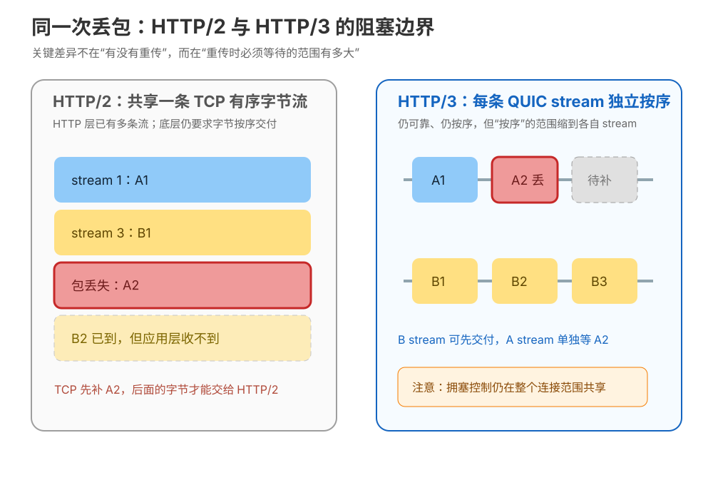
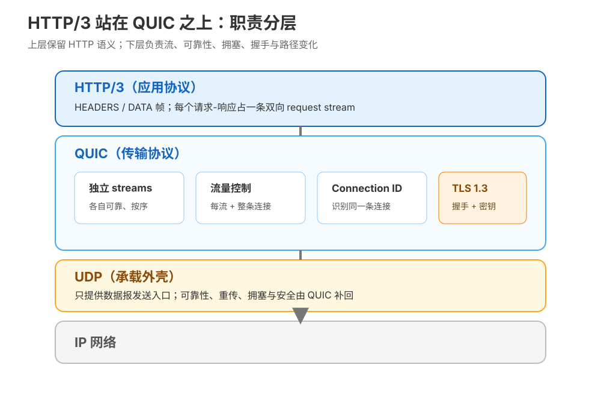
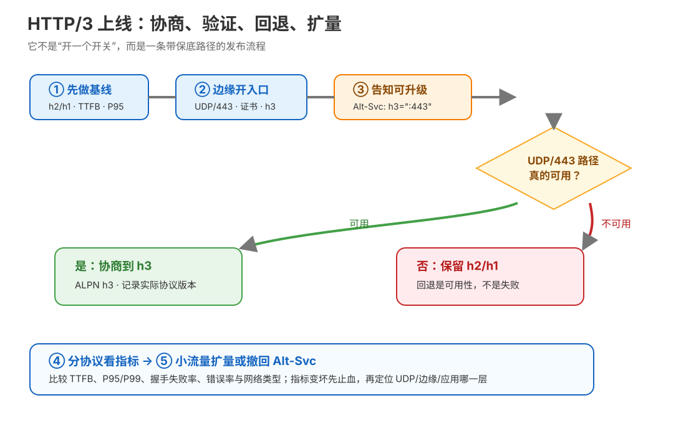

# 第 12 课：HTTP/3 与 QUIC

> 所属阶段：阶段 4《协议演进》｜ 水平：入门 ｜ 本课知识点：为什么换传输层、QUIC 的关键特性、部署现状与决策
> 故事情节：老大问“要不要上 HTTP/3”，小航把“更快”拆成队头阻塞、网络路径与回退策略三张表
> 📖 结论已按官方文档核对（核查于 2026-09｜来源：[IETF HTTP/3 RFC 9114](https://httpwg.org/specs/rfc9114.html)、[RFC 9000 QUIC](https://www.rfc-editor.org/rfc/rfc9000.html)、[RFC 9001 QUIC 与 TLS](https://www.rfc-editor.org/rfc/rfc9001.html)、[MDN HTTP/3](https://developer.mozilla.org/en-US/docs/Glossary/HTTP_3)、[curl HTTP/3 文档](https://curl.se/docs/http3.html)）——见 `topic-teach`「官方文档学习闸门」

## 🎯 本课目标

- 说清 HTTP/3 为什么不再把 HTTP 多路复用绑在 TCP 的一条有序字节队伍上，并理解“换 UDP”不是因为 UDP 自带可靠。
- 解释 QUIC 的独立流、1-RTT / 0-RTT、连接迁移与默认加密，能说出每个特性的收益边界。
- 用当期支持事实、实际协商结果和回退指标，判断一个站点是否值得上线 HTTP/3，而不是把版本号当成性能保证。

### 📖 写前文档核对：本课先把四个容易混淆的说法校准

本课先查了课程已有的 `network/http/web-index/` 路由：HTTP Working Group 的 `core-specs` 指向 RFC 9114 / RFC 9204，`related-extensions` 指向 Alternative Services（RFC 7838）；MDN 路由指向 Alt-Svc 与 HTTP/3；curl 路由覆盖 HTTP 版本探测与 HTTP/3 官方说明。

| 直觉说法 | 按官方文档校准后的说法 |
|---|---|
| UDP 不可靠，所以 QUIC 也不可靠 | UDP 只是数据报承载入口；QUIC 自己提供可靠、按流交付、流量控制、拥塞控制与安全。 |
| HTTP/2 已经多路复用，HTTP/3 只是换个名字 | HTTP/3 仍映射 HTTP 语义，但把多路复用和流控制交给 QUIC；一个流受阻时，其他流可以继续推进。 |
| 0-RTT 等于没有安全 | 0-RTT 数据有加密保护，但可能被攻击者重放；它不适合未经防重放设计的副作用操作。 |
| 浏览器支持 HTTP/3，就代表我的请求一定走 HTTP/3 | 浏览器支持、站点启用、客户端协商成功、UDP/443 路径可达是四件事；实际版本必须从 DevTools、curl 或服务端指标确认。 |

---

## 第一幕：起源与场景引入

> 🏛️ **起源**：QUIC 的标准化传输规范是 RFC 9000（2021-05），用 UDP 作为外层承载，重新组织可靠传输、流、拥塞控制和连接标识；RFC 9001（2021-05）规定 QUIC 如何使用 TLS；HTTP/3 的标准化规范是 RFC 9114（2022-06），定义把 HTTP 语义映射到 QUIC（历史事实均核查于 2026-09）。

小航刚把公司首页切到 HTTP/2。浏览器确实少开了几条连接，几十个请求也能交错发送，可线上偶尔出现一种很怪的现象：一个大图片所在的数据包丢了，旁边几个本来很小的接口也一起慢下来。抓包看，HTTP/2 的流已经分开了；但它们仍然挤在同一条 TCP 有序字节队伍里。

产品经理此时又问：“那就上 HTTP/3，应该所有请求都不互相影响了吧？”这句话听起来像正确答案，实际上至少漏了三件事：丢包影响会缩小，但不会消失；网络从 Wi-Fi 切到蜂窝网时需要重新验证路径；还有一些客户端、代理、防火墙或服务端根本不能让 UDP/443 顺利通过。

> 🎬 **场景**：小航要决定是否给站点增加 HTTP/3 入口，手里同时有一个性能问题和一个兼容性问题。

> 📌 **一句话本质**：把“所有货物绑在一条必须按顺序交付的长队里”，改成“每份货物有自己的小队列，同时保留一条共享的拥塞规则”；上线时还要给走不通的人留一条旧路。
>
> ⚖️ **处境对照**：继续使用 HTTP/2 时，一次 TCP 丢包可能让同一连接上的多个请求共同等待；引入 HTTP/3 后，丢包通常先局限在受影响的流，但要额外确认 UDP/443、边缘设备和回退链路。能观测的差别是 DevTools / curl 的实际协议版本、握手失败率、TTFB 与 P95/P99，而不是一句“HTTP/3 更快”。

---

## 第二幕：认知冲突

小航把问题写在白板上，发现四个问题互相牵制：

| 白板上的问题 | 如果只背结论，会漏掉什么 |
|---|---|
| UDP 没有 TCP 那样的可靠交付，为什么敢承载 HTTP？ | 可靠性不是消失，而是从 TCP 挪进 QUIC；还要看“按整条连接”还是“按单条流”恢复。 |
| HTTP/2 已经有 stream，为什么还要重新设计？ | HTTP/2 的 stream 在 TCP 之上；TCP 的丢包恢复仍要求共享字节流按序交付。 |
| 0-RTT 少一次往返，是不是所有请求都应该开？ | 重放可能重复一次写操作；延迟收益不能替代业务幂等与防重放设计。 |
| 浏览器已经支持 HTTP/3，是否应该关闭 HTTP/2？ | 客户端能力、服务端启用和中间路径能力不同；回退是可用性设计，不是失败。 |

> ❓ **问题**：HTTP/3 到底收掉了 HTTP/2 的哪一层队头阻塞？QUIC 又把哪些能力补了回来？最后，怎样把“协议能力”变成“可回退、可测量的上线决策”？

---

## 第三幕：层层揭示

### 一眼全局图（进入细节前先看一眼）


> 看图：左边所有货物共用一条顺序长队，一件损坏会挡住后面的货；右边把货物分到独立车道，一条车道补货时其他车道仍可继续，但整条道路仍需要共同遵守容量规则。

这张图刻意不放 HTTP/3、QUIC、TCP、UDP、TLS、stream 等术语。先只记住一个边界：HTTP/3 不是“取消等待”，而是把等待的范围从“整条共享字节队伍”缩小到“受影响的那条独立流”，同时保留整条连接的拥塞约束。

### 本课地图（分几步走）

| 步 | 这一步要解决什么（人话） | 对应知识点 |
|:--:|------------------------|-----------|
| 1 | 先找出 HTTP/2 的多路复用为什么仍会一起等 | 知识点 12.1：为什么换传输层 |
| 2 | 再看新的运输组织如何把可靠性、加密和换网能力放在一起 | 知识点 12.2：QUIC 的关键特性 |
| 3 | 最后把协议能力放进真实部署：如何发现、协商、测量和回退 | 知识点 12.3：部署现状与决策 |

> 只回答“分几步走、现在在哪”，不提前塞入实现细节；每一步的结论在对应知识点中兑现。

### 知识点 12.1：为什么换传输层

> 🧭 第 1/3 步｜承接：课 11 留下的问题是“HTTP/2 解决了 HTTP 层队头，却仍受 TCP 丢包牵连” → 本步：把这个残留边界拆开，并理解为什么 QUIC 要从 UDP 这个较薄的入口重新组织能力。
> 本知识点关键点：TCP 层队头阻塞 / TCP 协议僵化 / UDP 只是承载入口而非可靠性来源

#### 一句话定义

HTTP/3 换传输层，是为了让多路复用的“独立性”不再被 TCP 的全连接有序字节交付重新绑回一条队伍，同时给传输协议更容易演进的空间。

#### 直觉建立（类比）

把 HTTP/2 想成一个仓库：仓库里已经有 A、B、C 三条拣货线，但所有包裹最终都必须装进一条按编号交付的总传送带。A 线的一个包裹丢了，传送带不能把它后面的包裹交给收货员，于是 B、C 即使已经到达，也要一起等。

HTTP/3 的思路是换掉这条“总传送带”，让每条拣货线拥有自己的有序交付范围；道路的总容量仍然共享，但某一条线缺包，不必把别的线已经齐全的包也扣下。

> 💡 **类比的边界**：QUIC 不是让网络从此不丢包，也不是给每条流一条物理线路。它仍在一个连接上共享拥塞控制、带宽和路径；真实网络丢包时，受影响的流仍要重传，整体吞吐也可能下降。

#### 核心原理

课 11 的关键句可以精确改写成两层：

1. **HTTP 层**：HTTP/2 把多个请求拆成多个 stream，帧可以交错；所以大响应不会因为“必须先完整发送”而挡住其他请求。
2. **TCP 层**：TCP 向应用交付的是一条可靠、有序的字节流。TCP 接收端发现中间字节缺失时，后面的字节即使先到，也不能越过缺口交给 HTTP/2。于是 HTTP/2 的多个 stream 在运输层又共享了一个等待点。



> 看图：左边 A2 丢失后，B2 虽已抵达也被 TCP 的共享有序交付挡住；右边 A、B 各自按序，A 等 A2 时 B 仍可交付，但底部的共享拥塞控制仍然存在。

这就是 **TCP 层队头阻塞（TCP-level head-of-line blocking）**：不是 HTTP/2 的 stream 设计错了，而是它无法要求 TCP 只为某一条 stream 重新排序。HTTP/3 让 HTTP 的请求-响应直接映射到 QUIC stream；RFC 9114 明确把“一个 stream 受阻不妨碍其他 stream 前进”作为 HTTP/3 的传输收益（核查于 2026-09）。

第二个动因是 **协议僵化（protocol ossification）**。互联网上的中间设备会根据自己认识的字段、标志位和报文形态做转发、限速或检查；当大量设备只按“熟悉的 TCP 形态”工作时，新传输特性很难穿过它们。QUIC 选择 UDP 作为较薄的外层入口，让 QUIC 自己掌握可靠性与演进；同时，QUIC 对传输内容做了更强的加密保护，减少中间设备依赖内部细节的空间。

但“套在 UDP 上”不是穿透魔法：UDP 被阻断、限速或服务端没有监听 UDP/443 时，QUIC 仍然不可用。因此 HTTP/3 的设计必须与回退路径一起理解。

#### 示例演示

运行本课的确定性教学模型，先看共享有序交付的等待范围：

```bash
python3 stages/4-协议演进/labs/lesson-12-quic-concepts-lab.py --section 12.1
```

预期结构如下（完整实测输出见第四幕）：

```text
packet 3: stream 1 A2 LOST
packet 4: stream 3 B2 arrived, but held behind missing A2
application receives: A1, B1
boundary: TCP must recover A2 before later shared bytes are delivered
```

这是模型，不是伪装成真实 QUIC 抓包的输出；它只把课 11 的“HTTP 层已拆开、TCP 层又绑回去”用事件顺序演示出来。

#### 常见误区

1. **“UDP 不可靠，所以 HTTP/3 不可靠”**：UDP 只给出数据报发送入口；QUIC 在其上实现确认、丢包恢复、按流可靠交付、流量控制和拥塞控制。
2. **“HTTP/3 消灭了所有队头阻塞”**：它主要缩小了跨流的运输层等待范围；单个流内部仍然要按序，连接还受拥塞和流量控制约束。
3. **“换 UDP 只是为了更快”**：动因包括跨流 HoL 边界和传输协议可演进性；实际速度仍由 RTT、丢包、带宽、实现和路径共同决定。
4. **“中间设备看不懂 QUIC，所以一定放行”**：加密和新形态可能减少基于内部字段的干预，但 UDP/443 仍可能被网络策略影响。

#### 一句话记住

HTTP/3 换的不是 HTTP 语义，而是承载多路复用的运输组织：把 TCP 的“整条连接按序等”缩小成 QUIC 的“各条流各自按序等”。

#### 🗣️ 行话对照

| 人话 | 行业标准叫法 | 你会在哪里遇到 |
|---|---|---|
| 一件丢货挡住后面所有货 | TCP-level head-of-line blocking | RFC 9114 §1.1、网络性能讨论、抓包分析 |
| 运输协议被设备按旧规则卡住 | protocol ossification | QUIC 设计动因、协议演进文章 |
| 每条独立的交付小队列 | QUIC stream | HTTP/3 RFC、抓包工具的 stream 字段 |
| UDP 只是较薄的外层入口 | UDP-based transport substrate | RFC 9000 标题与 QUIC 架构说明 |

#### 📚 官方文档

- [RFC 9114 §1.1：HTTP/2 丢包为何会让所有活动事务停顿](https://httpwg.org/specs/rfc9114.html#prior-versions-of-http)
- [RFC 9114 §1.2：HTTP/3 把流复用与流控制交给 QUIC](https://httpwg.org/specs/rfc9114.html#delegation-to-quic)
- [RFC 9000：QUIC，一种基于 UDP 的多路复用与安全传输](https://www.rfc-editor.org/rfc/rfc9000.html)

### 知识点 12.2：QUIC 的关键特性

> 🧭 第 2/3 步｜承接：上一步说明“必须换掉 TCP 的共享有序队伍”，但留下了一个追问：可靠性、加密、握手和换网能力由谁补回？ → 本步：看 QUIC 如何把这些能力组合起来，并划清 0-RTT 与连接迁移的边界。
> 本知识点关键点：独立流与流量控制 / 1-RTT 与 0-RTT / Connection ID 与路径验证 / TLS 1.3 默认保护 / QPACK 的承接

#### 一句话定义

QUIC 是一种基于 UDP 的安全多路复用传输协议：它按 stream 提供可靠、有序交付，按 connection 共享拥塞控制，并把 TLS 1.3 握手纳入连接建立。

#### 直觉建立（类比）

想象一个带多个独立窗口的物流车队。A、B、C 各有自己的货单和序号，A 的货单缺一件时，B 不必把已经齐全的货单交回仓库；但车队总共能占多少道路、每个窗口最多压多少货，仍由整支车队的规则共同决定。

车队还有一个不会轻易变化的“车队身份证”。车辆从 Wi-Fi 换到蜂窝网后，IP 地址和端口可能变了，只要新道路通过验证，服务端仍能把它认成同一趟运输，而不必把应用会话当成全新连接。

> 💡 **类比的边界**：真实 QUIC 不是多条物理网线，也不是只看身份证就无条件接纳新路径。端点必须遵守握手完成、地址验证、拥塞状态与连接 ID 等协议约束；某些服务端或网络策略也可能不允许主动迁移。

#### 核心原理

先看分层：



> 看图：最上层仍是 HTTP/3 的 HEADERS / DATA 等语义承载；QUIC 层负责独立流、流量控制、Connection ID 与安全握手；UDP 只提供数据报入口，IP 负责网络转发。

**第一，可靠性变成“按流”而不是“按整条字节总线”。** QUIC stream 内仍可靠、按序；不同 stream 之间不承诺交付顺序。HTTP/3 因而可以把一个请求-响应放到一条双向 request stream 上，某条流丢包时，其他流可以继续向 HTTP 层交付。连接级拥塞控制仍共享：这不是把丢包成本变成零，而是把阻塞范围切开。

**第二，流量控制有两个范围。** 单条 stream 有自己的窗口，防止一个响应无限占用接收方缓冲；整条 connection 也有总窗口，防止所有 stream 合起来压垮接收方。不要把“独立流”理解成“没有总量约束”。

**第三，TLS 1.3 不是 QUIC 外面再套一层普通 TLS 记录。** RFC 9001 规定 TLS 为 QUIC 提供握手、认证和密钥材料；QUIC 使用这些密钥保护自己的数据包，应用数据作为 QUIC 的 STREAM 帧等内容发送。结果是：首次连接通常可以在 1-RTT 后发送受保护的应用数据；已有会话恢复信息时，客户端可能在 0-RTT 阶段提前发送应用数据（具体实现与服务端策略仍会影响结果）。

**第四，0-RTT 的收益与风险必须同时写在设计里。** 0-RTT 不是“无认证的明文”，而是使用此前获得的信息提前发送、但存在被重放可能的早期数据。攻击者可能把同一份早期请求让服务端处理多次，所以它不适合未经防重放设计的扣款、下单、发放奖励、修改状态等副作用操作。即使方法名是 GET，也仍需结合业务是否真的无副作用、缓存和鉴权语义判断；“GET 通常安全”不是自动开启 0-RTT 的充分条件。

**第五，Connection ID 让连接身份不再完全等于 IP:port。** 端点地址变化可能来自换网络或 NAT 重新绑定。QUIC 可以利用连接 ID 关联同一逻辑连接，并对新路径做 path validation。于是“换 Wi-Fi 不一定立刻断开”是合理直觉，但“换 Wi-Fi 必然无感不断”是过度承诺：路径不可达、服务器禁用迁移、连接 ID 用尽、验证失败或应用超时，都可能结束连接。

**第六，HTTP/3 的头部压缩改用 QPACK。** 课 11 学过 HPACK：动态表的更新顺序与头部块的解码上下文相关。QUIC 不提供跨 stream 的全局字节顺序，因此 HTTP/3 用 QPACK 的编码器流、解码器流跟踪表状态，让实现可以在压缩收益与等待动态表之间做取舍。它仍然是压缩，不是加密；保密性由 QUIC 的包保护提供。

#### 示例演示

运行三个小模型，把本知识点的三个“容易背混的词”并排观察：

```bash
python3 stages/4-协议演进/labs/lesson-12-quic-concepts-lab.py --section 12.2
```

模型会展示：A 流丢包时 B 流仍交付；同一个 Connection ID 从 `wifi-a` 到 `wifi-b` 但新路径需要验证；GET / HEAD / OPTIONS / TRACE 只是“可进一步分析的候选”，POST 不应被当作安全的早期数据。

再看本机真实客户端能力。系统自带 curl 的版本与编译特性（实测于 2026-09-16）为：

```text
curl 8.7.1 (x86_64-apple-darwin25.0) libcurl/8.7.1 (SecureTransport) LibreSSL/3.3.6 zlib/1.2.12 nghttp2/1.68.1
Features: alt-svc AsynchDNS GSS-API HSTS HTTP2 HTTPS-proxy IPv6 Kerberos Largefile libz MultiSSL NTLM SPNEGO SSL threadsafe UnixSockets
```

这里有 `HTTP2`，没有 `HTTP3`；实际强制尝试 HTTP/3 的结果（实测于 2026-09-16）是：

```bash
curl --http3-only -sS -o /dev/null https://example.com/
```

```text
curl: option --http3-only: the installed libcurl version doesn't support this
curl: try 'curl --help' or 'curl --manual' for more information
```

这个结果只说明**本机这一份 curl 没有编译 HTTP/3 后端**，不说明 `example.com` 不支持 HTTP/3，也不说明 HTTP/3 不可用。curl 官方文档要求客户端带 QUIC 后端；`--http3-only` 只尝试 HTTP/3，`--http3` 则允许在 HTTP/3 失败后回退到 HTTP/2 或 HTTP/1.1。

#### 常见误区

1. **“QUIC = UDP + TLS，其他都没有”**：QUIC 还负责流、确认、丢包恢复、流量控制、拥塞控制、连接 ID 与路径验证。
2. **“0-RTT 没有安全保护”**：它有加密保护，但早期数据可能被重放；安全性与业务副作用是两道不同检查。
3. **“1-RTT / 0-RTT 是两个 HTTP 版本”**：它们是连接建立阶段的不同路径，不是 HTTP/3 与 HTTP/2 的版本名。
4. **“Connection ID 让连接永远不掉”**：它解决的是地址变化时如何识别连接，不能替代新路径验证、拥塞恢复和应用超时。
5. **“QPACK 是更安全的 HPACK”**：QPACK 主要适配 QUIC 的跨流交付特性；压缩与保密仍要分开记。
6. **“QUIC 把所有网络信息都加密了”**：应用内容和大部分传输内部信息受保护，但 IP、端口、包大小、时间等外层可观测特征并不会因此全部消失。

#### 一句话记住

QUIC 把“每流可靠、整连接拥塞、TLS 握手、可验证换路”装进同一个运输协议；0-RTT 省等待，但必须先过重放风险审查。

#### 🗣️ 行话对照

| 人话 | 行业标准叫法 | 你会在哪里遇到 |
|---|---|---|
| 第一次建立连接约一趟往返后可传应用数据 | 1-RTT handshake | RFC 9001 §2.1、握手耗时指标 |
| 复用旧信息，提前送应用数据 | 0-RTT / Early Data | TLS/QUIC 配置、`Early-Data`、重放防护设计 |
| 连接换了地址仍尝试认出原连接 | connection migration | RFC 9000 §9、移动网络问题排查 |
| 每流与整连接的接收上限 | stream / connection flow control | QUIC transport parameters、吞吐问题排查 |
| HTTP/3 的头部压缩 | QPACK | RFC 9204、HTTP/3 实现配置 |

#### 📚 官方文档

- [RFC 9000 §2：QUIC streams](https://www.rfc-editor.org/rfc/rfc9000.html#name-streams)
- [RFC 9000 §9：Connection Migration](https://www.rfc-editor.org/rfc/rfc9000.html#name-connection-migration)
- [RFC 9001 §2.1、§4.6：TLS、1-RTT 与 0-RTT](https://www.rfc-editor.org/rfc/rfc9001.html#name-tls-overview)
- [RFC 9001 §9.2：0-RTT 的重放攻击](https://www.rfc-editor.org/rfc/rfc9001.html#name-replay-attacks-with-0-rtt)
- [RFC 9204：QPACK](https://www.rfc-editor.org/rfc/rfc9204.html)

### 知识点 12.3：部署现状与决策

> 🧭 第 3/3 步｜承接：上一步解释了 QUIC 能做什么，但“能做”不等于“请求会走到” → 本步：把浏览器、客户端、服务端、网络路径和回退策略放进同一张决策图。
> 本知识点关键点：当期支持事实 / `Alt-Svc`（备选服务提示）与 ALPN `h3` / fallback / 分协议指标与分阶段上线

#### 一句话定义

HTTP/3 部署是一个“发现 → 协商 → 验证 → 测量 → 回退或扩量”的流程，而不是关闭 HTTP/2 后只留下一个新端口。

#### 直觉建立（类比）

机场新开一条快速安检通道：主流旅客已经有资格使用，但机场必须真的建好入口，旅客所在航站楼也必须能走到；如果新通道临时关闭，旧通道要继续开放，不能让旅客因为尝试新通道而无法登机。

HTTP/3 的 `Alt-Svc` 像“机场告诉你另一个入口”，不是把当前请求强行改道；真正能否走新入口，还要经过双方的协议选择和网络路径验证。

> 💡 **类比的边界**：浏览器会缓存 Alternative Service 信息，服务端或 CDN 还可能有自己的灰度、证书、负载均衡和回源策略；因此“发了 Alt-Svc”不等于每个请求都已经使用 HTTP/3。

#### 核心原理

先看上线流程：



> 看图：先记录旧协议基线，再在边缘开启 UDP/443 与 h3，借助 Alt-Svc 告知客户端；路径可用就记录实际 h3 指标，不可用则回退 h2/h1，最后按指标扩量或撤回。

**第一，发现与协商是两步。** 一个常见路径是先通过 HTTPS 的 HTTP/1.1 或 HTTP/2 响应发送：

```http
Alt-Svc: h3=":443"; ma=60
```

它表示“这个 origin 还可以尝试在 443 端口使用 `h3`”；`ma=60` 是示例中的较短缓存时间，适合演示灰度，不是所有生产环境的固定值。客户端随后可以在 QUIC 的 TLS 握手中用 ALPN 标识 `h3`，服务端接受后，本次连接的实际应用协议才是 HTTP/3。

`Alt-Svc` 是发现提示，不是 HTTP 重定向；它不会改变 URL，也不等同于 `Location`。如果 UDP/443 不通、证书/SNI 不匹配、服务端未配置 h3，客户端应继续使用 HTTP/2 或 HTTP/1.1。

**第二，支持度要拆成四层看。** 截至本课核查时间（2026-09），MDN 的 HTTP 演进说明写明：HTTP/3 已由 RFC 9114 定义，并得到包括 Chromium（及 Chrome、Edge 等变体）和 Firefox 在内的多数主流浏览器支持。这个事实只说明浏览器具备能力，不代表某个站点、某条网络路径或某个代理链一定实际协商到 h3。

curl 官方文档列出 `--http3-only`、带回退的 `--http3` 和 Alt-Svc 使用方式，并说明 HTTP/3 取决于构建时使用的 QUIC 后端；本机系统 curl 的实测结果则是“不支持 HTTP/3”。因此客户端支持度不能只看 `curl --help` 是否出现选项，必须看 `curl -V` 的 Features 和实际请求结果。

服务端 / CDN / 负载均衡的“支持”也不能写成一个脱离产品版本的百分比：你必须逐层确认边缘是否监听 UDP/443、证书和 SNI 是否一致、WAF / 负载均衡 / 回源是否支持、健康检查是否覆盖 UDP、以及失败后是否仍有 h2/h1。即便浏览器与边缘都支持，企业网络或移动运营商路径也可能让单次请求回退。

**第三，决定是否上，不看口号而看场景。**

| 场景 | 倾向 | 为什么 |
|---|---|---|
| 移动端、网络经常切换、RTT 较高且页面有很多并发请求 | 值得优先试点 | 独立流和连接迁移可能更有价值；但必须用真实网络分组验证 |
| 已使用成熟 CDN / 边缘平台，能同时保留 h2/h1 并提供协议维度指标 | 适合灰度 | 入口、证书、回退和观测条件相对完整 |
| 内部 API 经 TCP-only 代理 / WAF，流量小且 h2 已稳定 | 不急着切 | 新增 UDP 路径与排障面，收益可能不足以覆盖复杂度 |
| 业务需要 0-RTT 发送写操作，但没有重放防护 | 不应为 0-RTT 上线 | 不能用延迟收益换不可控的重复副作用 |
| 只能开 h3、不能保留旧协议 | 不建议 | 兼容性故障会直接变成可用性事故 |

这不是“HTTP/3 永远值得上”的结论，而是一个决策规则：**当网络条件和边缘能力让 HoL / 换网问题成为真实瓶颈，并且你能测量和回退时，HTTP/3 才值得试点。**

**第四，按小步上线。**

1. **做基线**：先按 `h1.1`、`h2`、网络类型和地区记录 TTFB、P95/P99、错误率、连接/握手失败率；不要先开 h3 再找对照组。
2. **开入口**：在边缘或服务端准备 UDP/443、证书/SNI、h3 与回源链路；保留 h2/h1。不要只改应用进程而遗漏前置 LB/WAF。
3. **给小流量发现提示**：通过 `Alt-Svc` 让一小部分 origin / 用户逐步学习新入口；短 `ma` 便于灰度撤回，正式值由部署策略决定。
4. **确认真实协商**：客户端或浏览器 DevTools 记录协议列；curl 用 `%{http_version}`，必要时分别执行 `--http3-only`（诊断 h3）与 `--http3`（观察带回退的可用性）。
5. **按协议比较并扩量**：如果 h3 在目标网络的 P95、错误率和握手成功率改善或至少不恶化，再扩大；如果异常，先撤回 Alt-Svc / 停止 h3 灰度，让 h2/h1 保住可用性，再定位 UDP、边缘、证书、回源和应用层。

#### 示例演示

查看一次请求的实际协议版本：

```bash
curl -sS -o /dev/null \
  -w 'http_version=%{http_version} ttfb=%{time_starttransfer}s\n' \
  https://example.com/
```

在带 QUIC 后端的 curl 上，分别使用：

```bash
# 只允许 HTTP/3：用于确认 h3 路径是否真的可用
curl -sS -o /dev/null \
  -w 'http_version=%{http_version}\n' \
  --http3-only https://example.com/

# 尝试 HTTP/3，失败后允许回退到 HTTP/2 / HTTP/1.1
curl -sS -o /dev/null \
  -w 'http_version=%{http_version}\n' \
  --http3 https://example.com/

# 允许 curl 读取并缓存服务端返回的 Alt-Svc 提示
curl -sS --alt-svc /tmp/http3-altsvc.cache \
  -o /dev/null https://example.com/
```

读结果时要分清：`http_version=3` 证明本次请求协商到 HTTP/3；`http_version=2` 或 `1.1` 说明请求最终走了旧协议，不能仅凭命令带了 `--http3` 就宣称成功。当前本机由于没有 HTTP/3 后端，以上强制 h3 命令会先在本地能力检查处失败，属于真实环境限制，不能用纸面预期替代。

#### 常见误区

1. **“浏览器支持 HTTP/3 = 所有站点都用 HTTP/3”**：支持是客户端能力；还需要服务端启用、协议协商成功和网络路径可达。
2. **“Alt-Svc 是 301/302 一样的跳转”**：它是备选服务发现提示，不改变 URL；客户端仍需决定是否尝试并在失败时回退。
3. **“只看平均耗时就能判断升级成功”**：HTTP/3 可能改善某类高 RTT / 丢包网络，却让另一类路径出现握手失败或回退；至少要按协议、网络类型看 P95/P99 与错误率。
4. **“`--http3` 失败就说明站点不支持”**：先检查客户端是否带 QUIC 后端，再区分客户端能力、UDP 路径、服务端配置与证书问题。
5. **“开启 h3 后可以关掉 h2”**：协议演进需要共存和回退；除非你完全控制客户端与网络，否则关闭旧协议会把路径差异放大成可用性问题。

#### 一句话记住

HTTP/3 的上线判据不是“服务器能不能开”，而是“目标用户能否协商到、性能是否改善、失败能否回退、指标能否解释”。

#### 🗣️ 行话对照

| 策略 | 行业术语 | 关键取舍 |
|---|---|---|
| 先用旧协议告诉客户端新入口 | `Alt-Svc` / Alternative Services | 渐进发现；提示会缓存，撤回要考虑 `ma` |
| 在 TLS 握手中选择应用协议 | ALPN `h3` | 证明本次连接选择了 HTTP/3，不等于服务端只支持 h3 |
| 只测新协议，不接受旧协议 | `--http3-only` / h3-only probe | 适合诊断 h3 路径；兼容性失败会直接暴露 |
| 新协议失败时仍完成请求 | HTTP/3 fallback / HTTPS eyeballing | 可用性更好，但比较性能时要记录最终协议 |
| 按阶段增加用户 | canary / gradual rollout | 需要按协议和网络分组观测，再扩量或撤回 |

#### 📚 官方文档

- [RFC 9114 §3.1：HTTP/3 endpoint discovery](https://httpwg.org/specs/rfc9114.html#discovery)
- [RFC 9114 §3.2：Connection Establishment 与 QUIC version 1](https://httpwg.org/specs/rfc9114.html#connection-establishment)
- [RFC 9114 §11.1：ALPN `h3` 注册](https://httpwg.org/specs/rfc9114.html#iana-alpn)
- [RFC 7838：HTTP Alternative Services](https://www.rfc-editor.org/rfc/rfc7838.html)
- [MDN：HTTP/3](https://developer.mozilla.org/en-US/docs/Glossary/HTTP_3)
- [MDN：Evolution of HTTP](https://developer.mozilla.org/en-US/docs/Web/HTTP/Guides/Evolution_of_HTTP)
- [curl：HTTP/3 with curl](https://curl.se/docs/http3.html)

---

## 第四幕：实操验证

### 4.1 用一个教学模型把“共享等待”与“独立等待”跑出来

本课没有把实验伪装成完整 QUIC 协议栈：当前环境的系统 curl 没有 QUIC 后端，安装额外库也不属于本批范围。我们用 Python 标准库写了一个确定性模型，目标是验证**等待范围**，不是实现加密、拥塞控制或真实 UDP 报文。

```bash
python3 stages/4-协议演进/labs/lesson-12-quic-concepts-lab.py
```

本机实测输出（2026-09-16）：

```text
teaching model only: no QUIC packets are sent
[12.1] HTTP/2 over TCP: shared ordered delivery
packet 1: stream 1 A1 delivered
packet 2: stream 3 B1 delivered
packet 3: stream 1 A2 LOST
packet 4: stream 3 B2 arrived, but held behind missing A2
application receives: A1, B1
boundary: TCP must recover A2 before later shared bytes are delivered
[12.2] HTTP/3 over QUIC: per-stream delivery
stream A A1: delivered
stream A A2: LOST -> retransmit only on stream A
stream B B1: delivered
stream B B2: delivered while A2 is missing
boundary: congestion control is still shared by the connection
[12.2] connection migration model
connection_id=q-demo-01 path=wifi-a
connection_id=q-demo-01 path=wifi-b -> same logical connection, new path needs validation
[12.2] 0-RTT replay-safety gate
GET: candidate: still requires application replay analysis
HEAD: candidate: still requires application replay analysis
POST: do not assume safe: replay can repeat a side effect
```

逐段读：

| 输出 | 你应验证的结论 |
|---|---|
| `B2 arrived, but held...` | HTTP/2 的多流并没有绕过 TCP 的共享有序交付。 |
| `B2: delivered while A2 is missing` | QUIC 把可靠、按序的等待范围缩到各自 stream。 |
| 同一个 `connection_id` 出现在两条路径 | 连接身份可以与地址变化分离，但新路径仍需要验证。 |
| GET / HEAD 是 candidate 而非 allow | 方法名不能替代业务重放分析；0-RTT 的开关是应用安全决策。 |

> ✅ **回扣场景**：小航现在可以把“HTTP/3 更快吗”拆成三个可验证问题：同一次丢包是否只卡一条流？换网后是否能保住逻辑连接？目标客户端和路径是否真的协商到 h3？

### 4.2 应用实战判定

本课**不单列独立应用实战文件**。原因是“上线 HTTP/3”必须接入真实的边缘 / CDN / 负载均衡 / 证书与流量指标，单靠本机标准库无法诚实地给出一条可运行的生产链路；而且本课 12.3 已经提供了最小可执行的五步演进：基线 → 开入口 → Alt-Svc 灰度 → 协商验证 → 指标扩量或回退。把这五步再复制成一篇“应用实战”只会重复正文，不能增加真实验证价值。

---

## 第五幕：体系收束


> 读图：左边是 HTTP/2 的“多流仍共享 TCP 有序队伍”；右边是 HTTP/3 用 QUIC 拆开跨流等待，同时把 TLS 1.3、Connection ID 和回退观测纳入部署闭环。

### 把三课连成一条演进线

| 课程 | 主要矛盾 | 解决方式 | 仍然留下什么 |
|---|---|---|---|
| 课 10：HTTP/1.1 与协议奠基 | 连接重复建立、主机复用与消息边界不足 | 持久连接、Host、chunked | 同一连接上的并发组织仍有限 |
| 课 11：HTTP/2 与多路复用 | HTTP 层响应排队拖住并发请求 | 二进制分帧、多流交错、HPACK | TCP 丢包仍可能让所有活动流一起等 |
| 课 12：HTTP/3 与 QUIC | 运输层共享有序字节流扩大了等待范围 | QUIC 独立流、TLS 集成、Connection ID | UDP 路径、实现、回退和真实指标仍需验证 |

### 最小决策卡

遇到“要不要上 HTTP/3”，按下面顺序问：

1. **问题是真的存在吗？** 是否有移动网络 / 高 RTT / 丢包下的跨流等待证据，而不是只想追新版本？
2. **入口能完整打通吗？** 边缘、LB、WAF、证书、SNI、UDP/443、回源与健康检查是否都确认？
3. **客户端会真的使用吗？** 浏览器 / curl / DevTools 是否能看到实际 `h3`，还是一直回退？
4. **收益能被分组观察吗？** 是否按协议、地区、网络类型比较 TTFB、P95/P99、错误率与握手失败率？
5. **失败能安全回退吗？** 是否保留 h2/h1，并有撤回 Alt-Svc 或停止灰度的动作？

> 复习口诀：HTTP 语义不变，运输组织换代；每流可靠，整连接控拥塞；1-RTT 常规，0-RTT 防重放；换网靠 ID 但要验路；先测再开，失败回退。

## 🐞 常见误区

1. **“HTTP/3 是 HTTP/2 的加密加速版”**：它仍保留大量 HTTP 语义，但传输抽象从 TCP 上的 HTTP/2 framing 转为 QUIC streams；QPACK、控制流和流量控制边界也随之变化。
2. **“QUIC 解决了丢包”**：它改变的是丢包后哪些流必须等待；丢包仍会消耗带宽与拥塞窗口。
3. **“0-RTT 只要是 GET 就无条件安全”**：必须结合真实业务副作用、缓存、鉴权和重放设计；方法名只是初筛线索。
4. **“换 Wi-Fi 不断连”**：准确说法是 Connection ID 与路径验证让迁移成为可能；不是无条件承诺。
5. **“浏览器支持度高，所以服务端不用留旧协议”**：浏览器能力不等于站点入口和网络路径能力；h2/h1 回退是上线设计的一部分。
6. **“curl 有 `--http3` 帮助项就支持 h3”**：本机实测说明，必须继续看编译特性与实际运行结果。

### ⏳ 与过时说法对照

| 旧说法（网上过时教程 / 训练知识里的说法） | 官方文档现状 | 来源 |
|---|---|---|
| “HTTP/3 只是把 HTTP/2 帧原封不动搬到 UDP” | RFC 9114 说明 HTTP/3 受 HTTP/2 启发，但由于 QUIC 不提供 TCP 式全局顺序，流映射、流控制和头部压缩等细节有实质差异 | [RFC 9114 Appendix A](https://httpwg.org/specs/rfc9114.html#h2-considerations) |
| “QUIC 是不可靠的 UDP，所以 HTTP/3 也不可靠” | QUIC 在 UDP 之上提供 stream 级可靠、有序交付、流量控制与连接级拥塞控制 | [RFC 9114 §1.2](https://httpwg.org/specs/rfc9114.html#delegation-to-quic)、[RFC 9000](https://www.rfc-editor.org/rfc/rfc9000.html) |
| “0-RTT 是免费的一次往返优化” | RFC 9001 明确指出早期应用数据可能被重放，不适合承载重放会产生不良影响的指令 | [RFC 9001 §2.1](https://www.rfc-editor.org/rfc/rfc9001.html#tls-overview) |
| “浏览器支持 HTTP/3，所以所有请求都会走 h3” | 当期 MDN 说明主流浏览器具备支持，但实际请求仍取决于站点发现、协商、UDP 路径与回退 | [MDN HTTP 演进](https://developer.mozilla.org/en-US/docs/Web/HTTP/Guides/Evolution_of_HTTP) |

## 一图总结

本课的核心是层级结构与多概念对比（HTTP/3 → QUIC → UDP → IP；HTTP/2 与 HTTP/3 的阻塞边界；协议能力到部署决策），使用课末 SVG 复习：


> 读图：左边的共享有序队伍解释了 HTTP/3 的动因，右边的四个能力块对应 QUIC 的收益与上线时必须保留的回退观测。

> 复习时按四句回忆：**为什么换**——TCP 的跨流 HoL 与协议僵化；**换成什么**——QUIC streams + TLS 1.3；**得到什么**——1/0-RTT、迁移、默认保护；**怎么上线**——Alt-Svc / ALPN `h3` / fallback / metrics。

## 📋 命令速查卡

| 目的 | 命令 | 观察点 |
|---|---|---|
| 跑 TCP 共享等待模型 | `python3 stages/4-协议演进/labs/lesson-12-quic-concepts-lab.py --section 12.1` | B2 已到但被 A2 缺口挡住 |
| 跑 QUIC 独立流 / 迁移 / 0-RTT 模型 | `python3 stages/4-协议演进/labs/lesson-12-quic-concepts-lab.py --section 12.2` | B 流继续、同一 Connection ID、重放风险提示 |
| 查看 curl 编译能力 | `curl -V` | `Features` 是否含 `HTTP3`；本机实测只有 `HTTP2` |
| 只尝试 HTTP/3 | `curl -sS -o /dev/null -w 'http_version=%{http_version}\n' --http3-only https://example.com/` | `3` 才是本次协商到 h3；客户端不支持时会先报本地能力错误 |
| 允许 h3 失败后回退 | `curl -sS -o /dev/null -w 'http_version=%{http_version}\n' --http3 https://example.com/` | 记录最终版本，不能把回退结果误报成 h3 |
| 读取 Alt-Svc 并缓存 | `curl -sS --alt-svc /tmp/http3-altsvc.cache -o /dev/null https://example.com/` | 下一次请求是否有机会尝试备选 h3；缓存时间影响撤回速度 |
| 做基础 TTFB 对照 | `curl -sS -o /dev/null -w 'http_version=%{http_version} ttfb=%{time_starttransfer}s\n' https://example.com/` | 版本与首字节时间一起记录，后续按协议分组比较 |

> 命令只验证当前客户端、当前站点、当前网络路径的结果；它不是对所有浏览器、代理、服务器或 CDN 的支持度结论。

## 课后小测

**Q1**：HTTP/3 相比 HTTP/2 over TCP，最准确的收益边界是什么？

- A. 所有丢包都不需要重传
- B. 一个 QUIC stream 受阻时，其他 stream 不必因 TCP 全连接有序交付而一起等
- C. HTTP 方法和状态码全部换成新语义
- D. UDP 自己提供了可靠、有序交付

<details><summary>答案与解析</summary>

**答案：B**。QUIC 仍要重传受损数据，且连接级拥塞控制仍共享；它改变的是跨 stream 的阻塞范围。

</details>

**Q2**：为什么 0-RTT 不能默认承载下单请求？

- A. 0-RTT 一定是明文
- B. 0-RTT 只能发送图片
- C. 早期数据可能被重放，导致副作用重复执行
- D. 0-RTT 不使用 TLS

<details><summary>答案与解析</summary>

**答案：C**。0-RTT 有加密保护，但不能自动消除重放风险；业务需要幂等或专门的防重放设计。

</details>

**Q3**：Connection ID 的主要作用是什么？

- A. 给每个 HTTP 响应分配缓存键
- B. 让 QUIC 能在地址变化时尝试识别同一逻辑连接
- C. 代替 TLS 证书验证
- D. 保证换网后永远不断线

<details><summary>答案与解析</summary>

**答案：B**。新路径仍需验证，服务端策略、网络可达性与应用超时也可能让连接结束。

</details>

**Q4**：一个站点发出 `Alt-Svc: h3=":443"` 后，下面哪句最准确？

- A. 浏览器一定会立即发起 HTTP/3
- B. 它等同于 301 重定向
- C. 它提供一个备选服务提示，客户端还要协商、验证路径，失败时可以回退
- D. 它会关闭 HTTP/2

<details><summary>答案与解析</summary>

**答案：C**。Alt-Svc 是发现机制；实际协议版本要以客户端或服务端观测为准。

</details>

## 🚀 下一批接力提示词

> 学完本批后，**复制下面这段文字发给 AI**，即可无缝进入下一批：

```text
继续学 HTTP。我的学习档案在 network/http/00-学习档案.md，
刚学完阶段 4《协议演进》的课《HTTP/3 与 QUIC》知识点 12.1、12.2、12.3，
请按大纲继续讲解下一批知识点。
```

## 🧭 课程导航

- 上一课：[第 11 课《HTTP/2 与多路复用》](./lesson-11-HTTP2与多路复用.md)
- 下一课：[第 13 课《Cookie、Session 与 Token：让无状态记住你》](../../5-认证联调与决策/lessons/lesson-13-Cookie会话与Token.md)
- 返回：[HTTP 课程目录](../../../02-课程目录.md)

## 📚 官方文档总览

- [HTTP Working Group：RFC 9114 HTTP/3](https://httpwg.org/specs/rfc9114.html)
- [RFC Editor：RFC 9000 QUIC Transport](https://www.rfc-editor.org/rfc/rfc9000.html)
- [RFC Editor：RFC 9001 Using TLS to Secure QUIC](https://www.rfc-editor.org/rfc/rfc9001.html)
- [RFC Editor：RFC 9204 QPACK](https://www.rfc-editor.org/rfc/rfc9204.html)
- [RFC Editor：RFC 7838 HTTP Alternative Services](https://www.rfc-editor.org/rfc/rfc7838.html)
- [MDN：HTTP/3 Glossary](https://developer.mozilla.org/en-US/docs/Glossary/HTTP_3)
- [MDN：Evolution of HTTP](https://developer.mozilla.org/en-US/docs/Web/HTTP/Guides/Evolution_of_HTTP)
- [curl：HTTP/3 with curl](https://curl.se/docs/http3.html)
