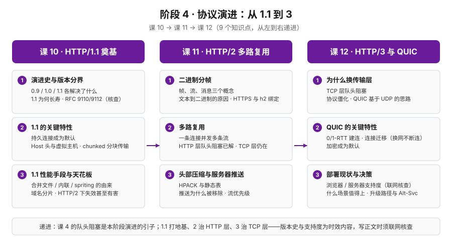

# 阶段 4 概览：协议演进

> 所属课程：HTTP 系统学习 ｜ 故事章节：从 1.1 到 3 ｜ 上一阶段：[阶段 3 · 缓存与性能](../3-缓存与性能/overview.md)

> ⚠️ **时效提示**：本阶段涉及版本史（0.9/1.0/1.1/2/3 的演进时间线、RFC 状态）与浏览器 / 服务器支持度等时效性内容，Phase 2 编写正文时**必须联网核查**并标注 `（核查于 YYYY-MM）`，不得凭记忆写死支持度数据。

## 🎯 本阶段目标

- 能把 HTTP 从 0.9 到 1.1 的演进串成一条线，说清 1.1 的关键特性（持久连接、Host、chunked）各解决了什么，解释它为什么生态位如此长寿。
- 能说清 HTTP/2 的二进制分帧与多路复用解决了什么、又没解决什么（TCP 层队头阻塞仍在），讲得出 HPACK 的思路与服务器推送被浏览器移除的原因。
- 能说清 HTTP/3 弃 TCP 换 QUIC 的动因与关键特性（0/1-RTT、连接迁移、加密默认），并对照当期支持度对"要不要上 HTTP/3"给出有依据的决策。

## 📍 学习重点

- 演进的动因比结论更重要：每个版本都是为了解决上一代的真实痛点——1.1 治连接，2 治 HTTP 层队头阻塞，3 治 TCP 层队头阻塞与协议僵化。
- 1.1 的三件奠基性遗产：持久连接成为默认、Host 头与虚拟主机、chunked 分块传输——它们是 HTTP/1.x 的直接基础；HTTP/2/3 保留连接复用、目标主机和流式传输的语义，但改用自己的帧与伪首部表达。
- 1.1 性能手段的兴衰：合并文件 / 内联 / spriting / 域名分片是"绕过协议限制"的补丁；HTTP/2 改变并行度后，不能再按旧理由默认启用它们，需重新权衡缓存粒度、按需加载与连接开销——回扣课 8 的教训。
- HTTP/2 的得与失：二进制分帧与多路复用解决了 HTTP 层队头阻塞，但 TCP 层队头阻塞仍在——这是理解"为什么还要 HTTP/3"的关键一环。
- 支持度数据是时效敏感的：浏览器与服务器对 h2 / h3 的支持度、Alt-Svc 升级路径的现状都会变，决策必须建立在当期联网核查之上。

## ✅ 必须掌握的知识点

| 知识点 | 所属课 | 学完应能 |
|--------|--------|----------|
| 演进史与版本分界 | 课 10《HTTP/1.1 与协议奠基》 | 能说清 0.9 / 1.0 / 1.1 各自解决了什么、为什么 1.1 生态位如此长寿，理清现行 RFC 9110/9112 与历史文档的关系（起源史联网核查） |
| 1.1 的关键特性 | 课 10《HTTP/1.1 与协议奠基》 | 能说清持久连接成为默认、Host 头与虚拟主机、chunked 分块传输这三个特性各解决了什么问题 |
| 1.1 性能手段与天花板 | 课 10《HTTP/1.1 与协议奠基》 | 能解释合并文件 / 内联 / spriting 与域名分片的由来，说清 HTTP/2 改变并行度后为什么不能再按旧理由默认启用它们 |
| 二进制分帧 | 课 11《HTTP/2 与多路复用》 | 能区分帧、流、消息三个概念，说清从文本协议到二进制协议的原因，理解 HTTPS 与 h2 的绑定关系 |
| 多路复用 | 课 11《HTTP/2 与多路复用》 | 能说清一条连接并发多条流的机制，解释它解决了 HTTP 层队头阻塞但 TCP 层队头阻塞仍在——为课 12 埋下伏笔 |
| 头部压缩与服务器推送 | 课 11《HTTP/2 与多路复用》 | 能说清 HPACK 与静态表的压缩思路，讲得出服务器推送为什么被浏览器移除，理解流优先级的作用 |
| 为什么换传输层 | 课 12《HTTP/3 与 QUIC》 | 能说清 TCP 层队头阻塞与 TCP 协议僵化（中间设备对 TCP 的假设），理解 QUIC 基于 UDP 的实现思路 |
| QUIC 的关键特性 | 课 12《HTTP/3 与 QUIC》 | 能说清 0/1-RTT 建连、连接迁移（换 Wi-Fi 不断连）、加密成为默认三个特性各意味着什么 |
| 部署现状与决策 | 课 12《HTTP/3 与 QUIC》 | 能对照当期浏览器与服务器支持度（联网核查），判断什么场景值得上 HTTP/3，说清升级路径与 Alt-Svc |

## 🗺️ 本阶段路径图

> SVG 展示本阶段 3 门课、9 个知识点的学习顺序与递进关系：先把 1.1 的奠基与天花板看透（课 10），再看 HTTP/2 如何用分帧与多路复用突破天花板、又留下什么（课 11），最后看 HTTP/3 如何换传输层收掉 TCP 的尾巴（课 12）。

## 本阶段产出

- [x] `lessons/lesson-10-HTTP1.1与协议奠基.md`
- [x] `lessons/lesson-11-HTTP2与多路复用.md`
- [x] `lessons/lesson-12-HTTP3与QUIC.md`

> ✅ 课 12 已完成：RFC 9000/9001/9114/9204、RFC 7838、MDN 与 curl 官方文档均按 2026-09 核查；正文把浏览器能力、客户端构建、服务端/CDN、UDP/443 路径和回退拆开，不用单一百分比代替实际协商证据。
