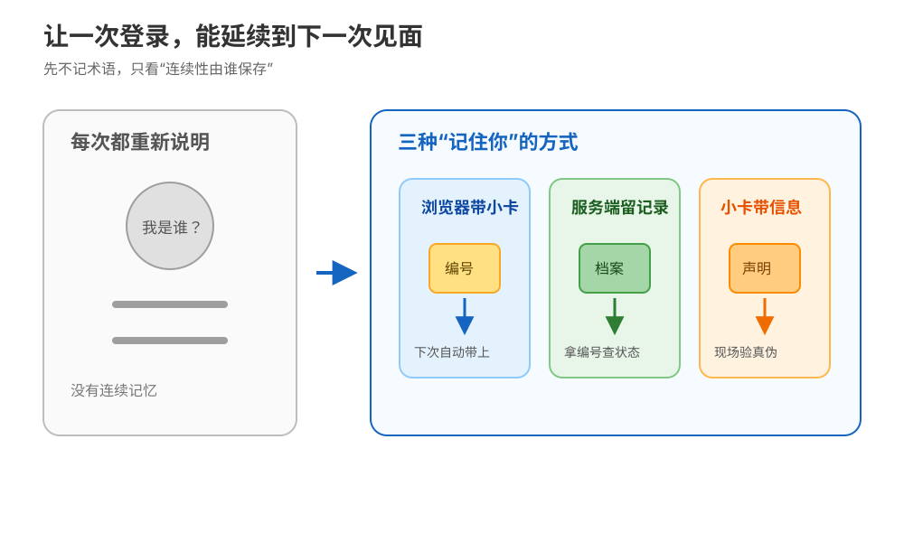
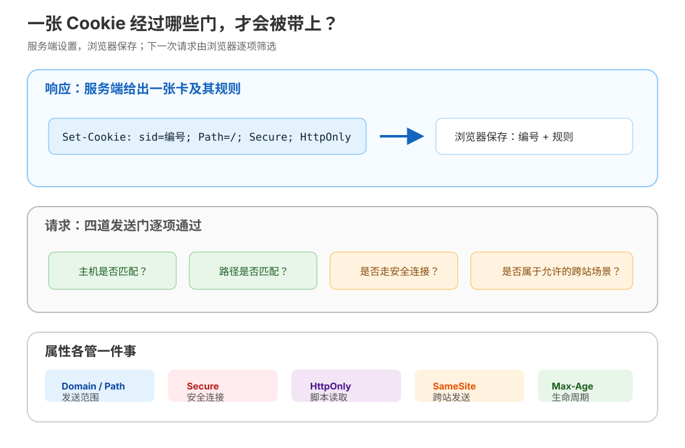
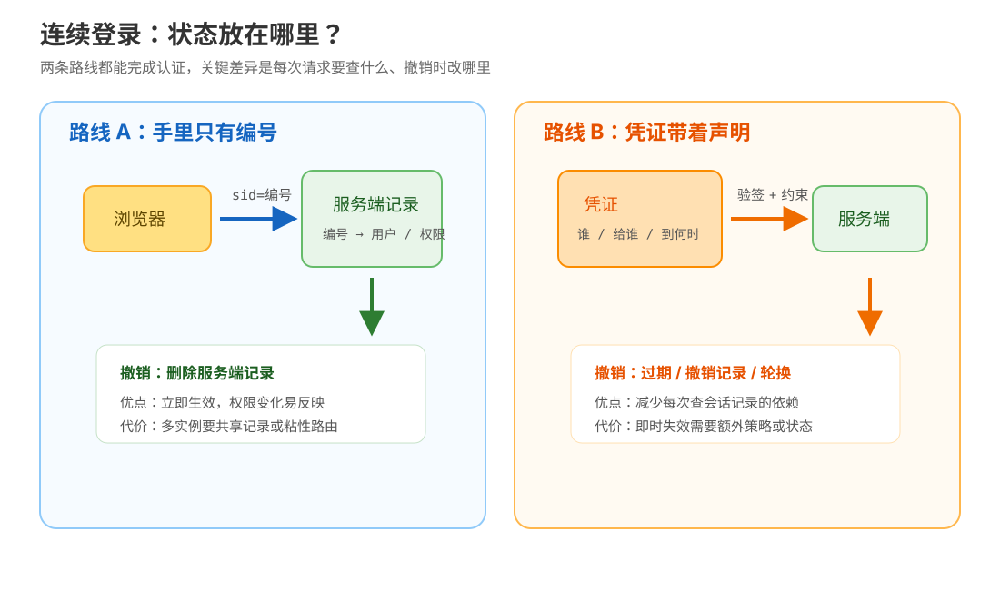
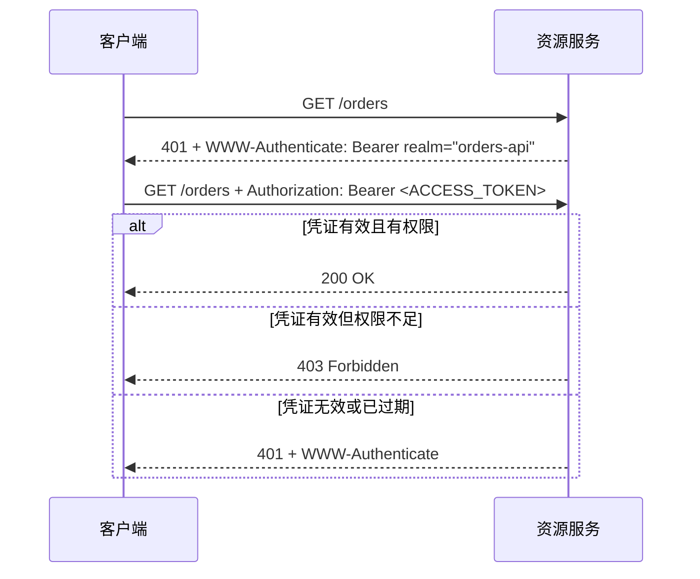
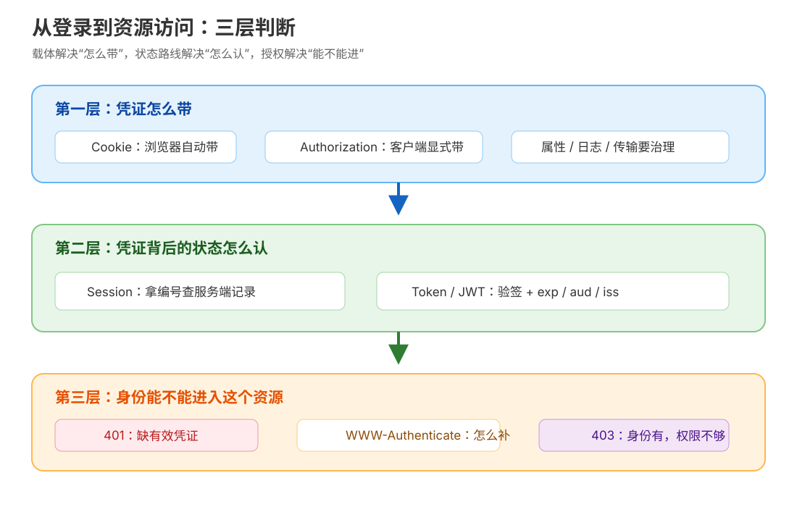

# 第 13 课：Cookie、Session 与 Token：让无状态记住你

> 所属阶段：阶段 5《认证联调与决策》｜ 水平：入门 ｜ 本课知识点：Cookie 机制与安全属性、Session 与 Token 两条路线、HTTP 认证头
> 故事情节：登录态总是“莫名其妙”掉，小航搞懂了无状态协议上维持会话的三条路线
> 📖 结论已按官方文档核对（核查于 2026-09｜来源：[RFC 6265](https://www.rfc-editor.org/rfc/rfc6265.html)、[RFC 7519](https://www.rfc-editor.org/rfc/rfc7519.html)、[RFC 9110](https://www.rfc-editor.org/rfc/rfc9110.html)、[RFC 6750](https://www.rfc-editor.org/rfc/rfc6750.html)、[MDN Cookie 指南](https://developer.mozilla.org/en-US/docs/Web/HTTP/Guides/Cookies)）——见 `topic-teach`「官方文档学习闸门」

## 🎯 本课目标

- 解释无状态的 HTTP 为什么要靠 Cookie 维持连续登录，并能根据场景选择 `Secure`、`HttpOnly`、`SameSite`、`Domain`、`Path` 与生命周期属性。
- 对比服务端 Session 与 Token（含 JWT）两条路线，能说清状态放在哪里、扩容与注销分别付出什么代价。
- 正确使用 `Authorization`、Basic、Bearer、401、403 与 `WWW-Authenticate`，能从响应头判断下一步该补凭证还是检查权限。

---

## 第一幕：起源与场景引入

HTTP 的每一次请求，默认都像一次重新见面：请求里有方法、目标、头和内容，但协议不会自动替你记住“上一次是谁登录的”。RFC 9110 仍把 HTTP 定义为无状态的应用层协议（核查于 2026-09）。

小航负责的订单后台出现了一个看似矛盾的故障：登录接口返回了 `200`，跳到 `/orders` 却被当成未登录；把一个凭证硬塞进前端后，页面又遇到跨站请求、脚本读取、服务扩容和注销不生效等新问题。大家都在说“把登录信息带上”，但没人先回答：到底由谁记住？记住什么？每次请求怎样证明它没被改过？

> 🎬 **场景**：小航要让一次登录稳定地延续到后续请求，还要在浏览器、多个服务实例和 API 客户端之间做出可解释的认证选择。

> 📌 **一句话本质**：把“每次见面都重新说明自己是谁”，变成“下一次见面能带上可验证的通行凭据”；再根据风险决定这张凭据由谁保存、能走到哪里、什么时候失效。
>
> ⚖️ **处境对照**：不设计连续登录时，用户可能每打开一个页面都回到登录页，或开发者为了省事把敏感信息放进每个请求；设计好后，同一次登录可覆盖几十次后续请求，但要额外承担凭据泄露、跨站请求、注销和多实例共享等治理成本。可观测锚点是：后续请求是否出现 `Cookie` / `Authorization`、无凭证是否得到 401、注销后旧凭证是否仍能访问。

---

## 第二幕：认知冲突

小航在浏览器开发者工具里看见：登录响应有一个 `Set-Cookie`，下一次请求有一个 `Cookie`。但他又在移动端 API 文档里看见 `Authorization: Bearer ...`。这两个东西都像“登录凭证”，为什么不统一成一种？

更麻烦的是，三个判断同时成立：

| 直觉判断 | 实际留下的问题 |
|---|---|
| “放在 Cookie 里就安全了” | Cookie 只是传送容器；是否能被脚本读取、是否会跨站发送、是否只走 HTTPS，仍由属性和部署决定。 |
| “JWT 自带用户信息，所以服务器完全不用状态” | 服务器仍要保管签名密钥、接受过期时间；若要求立即注销，还要增加撤销记录、轮换或缩短寿命。 |
| “401 就是权限不足，403 就是没登录” | 语义正好相反：401 主要是缺少有效认证凭证；已有身份但不允许访问资源，通常是 403。 |

> ❓ **问题**：同一次登录，凭证究竟应该放在浏览器、服务端，还是凭证自身？Cookie 属性与认证头又分别解决哪一层问题？

---

## 第三幕：层层揭示

### 一眼全局图（进入细节前先看一眼）



> 看图：一次登录之后，可以让浏览器每次带一张小卡、让服务端保留一条对应记录，或让小卡自己携带可验证的信息；三条路的差别首先是“谁保存连续性”。

这张图刻意不放 Cookie、Session、Token、JWT、HTTP 等术语。先建立一个更稳定的判断：**登录态不是凭空出现的状态，而是后续请求携带的一种凭证；凭证的保存位置决定了后面的扩容、撤销和泄露处理方式。**

### 本课地图（分几步走）

| 步 | 这一步要解决什么（人话） | 对应知识点 |
|:--:|------------------------|-----------|
| 1 | 先让浏览器知道什么时候该自动带上那张小卡 | 知识点 13.1：Cookie 机制与安全属性 |
| 2 | 再决定连续性由服务端记录，还是由凭证携带 | 知识点 13.2：Session 与 Token 两条路线 |
| 3 | 最后把凭证放进标准认证头，并正确回应缺凭证与没权限 | 知识点 13.3：HTTP 认证头 |

> 只回答“分几步走、现在在哪”，不提前塞入机制结论；每一步的规则在对应知识点中兑现。

### 知识点 13.1：Cookie 机制与安全属性

> 🧭 第 1/3 步｜承接：第二幕留下的问题是“后续请求怎样自动带上连续登录凭证” → 本步：先看浏览器如何接收、保存、筛选并发送 Cookie。
> 本知识点关键点：`Set-Cookie` / `Cookie` 往返、`Secure` / `HttpOnly` / `SameSite`、`Domain` / `Path` 与生命周期

#### 一句话定义

Cookie 是浏览器保存的一小段键值数据：服务端通过响应头 `Set-Cookie` 提议它，浏览器在域、路径、协议和跨站规则都匹配时，把它放进后续请求的 `Cookie` 请求头。

#### 直觉建立（类比）

把登录后的浏览器想成进入园区的人。前台给他一张编号卡；下一次到门口时，他把卡递给门卫，门卫再拿编号去查系统里的访客记录。卡本身可以只是一串没有含义的编号，也可以携带经过保护的信息。

> 💡 **类比的边界**：真实浏览器不会“看到卡就无条件递出去”。它会按 `Domain`、`Path`、`Secure`、`SameSite` 和过期时间筛选；服务端在 `Cookie` 请求头中通常只看到名称和值，看不到原先设置时的这些属性。因此属性必须由服务端在 `Set-Cookie` 时正确设置，不能指望后端从回传头里重新推断。

#### 核心原理

一次最小往返可以写成：

```http
POST /login HTTP/1.1
Host: app.example.com
Content-Type: application/json

{"user":"demo-user"}

HTTP/1.1 200 OK
Set-Cookie: sid=opaque-session-id; Max-Age=1800; Path=/; Secure; HttpOnly; SameSite=Lax

GET /orders HTTP/1.1
Host: app.example.com
Cookie: sid=opaque-session-id
```

这里有两个方向，不能混写：

- `Set-Cookie` 是响应头，服务端用它告诉用户代理“请保存这个 Cookie 及其属性”。
- `Cookie` 是请求头，用户代理回传匹配的名称和值；属性通常不会随着它回传。



> 看图：先看“是否送出”的四道门，再看属性对应的防护边界；`Domain` 和 `Path` 是发送范围控制，`Secure`、`HttpOnly`、`SameSite` 是不同方向的风险收窄，不能互相替代。

**五个最常用属性，要按“它限制了什么”来记：**

| 属性 | 它限制 / 改变什么 | 它没有解决什么 |
|---|---|---|
| `Secure` | 通常只在安全连接（HTTPS）上发送 Cookie。 | 不是完整的防篡改方案；如果站点仍接受不安全入口，主动攻击者仍可能干扰流程。 |
| `HttpOnly` | 阻止脚本通过 `document.cookie` 等非 HTTP API 读取该 Cookie。 | 不阻止浏览器在符合条件的请求中发送它，也不能单独消除 XSS 或 CSRF。 |
| `SameSite=Strict/Lax/None` | 控制跨站场景下是否带 Cookie；`None` 需要同时设置 `Secure`。 | 不是所有跨站身份问题的总开关；跨站需求与浏览器行为要现场验证。未显式设置时，浏览器默认行为应按目标浏览器核对，生产凭证不应靠默认值猜。 |
| `Domain` | 指定可接收 Cookie 的主机范围；省略时通常是设置它的主机，而不是自动覆盖所有子域。 | 不能扩大到任意其他域；扩大到父域会增加可接触该 Cookie 的主机。 |
| `Path` | 让浏览器只在匹配路径及其子路径的请求中发送 Cookie。 | RFC 6265 和 MDN 都提醒：`Path` 不是安全边界，不能单靠它阻止同一主机上其他路径读取或利用 Cookie。 |

生命周期也要单独看：不设置 `Expires` / `Max-Age` 的 Cookie 通常是会话 Cookie；设置了它们则成为持久 Cookie，但浏览器仍可能因用户操作或存储限制提前删除。注销时常见做法是返回同名、同 `Domain`、同 `Path` 且 `Max-Age=0` 的响应头，让浏览器删除本地副本；服务端仍必须让对应会话失效。

**一个重要边界：Cookie 不等于认证。**

Cookie 只规定“浏览器如何带一段数据”。这段数据可能是：

1. 服务端完全不信任、只当索引使用的随机会话 ID；
2. 经过签名、包含声明的访问令牌；
3. 语言偏好、主题设置等与身份无关的数据。

真正的认证判断发生在服务端：它要验证这段凭证、检查是否过期、是否属于目标受众，并把有效凭证映射到用户或权限。

#### 示例演示

用 `curl` 观察 Cookie 文件的“保存”和“回传”两个动作：

```bash
curl -i -c /tmp/http-cookie-jar.txt https://example.com/
curl -i -b /tmp/http-cookie-jar.txt https://example.com/
```

第一条的 `-c` 让 curl 把响应中的 Cookie 写入 Cookie jar；第二条的 `-b` 让 curl 从 Cookie jar 读取并发送。`example.com` 只用于演示公开占位站点的客户端行为，未必会给出登录 Cookie；真实登录实验见第四幕的本地服务。

#### 常见误区

1. **“`HttpOnly` 能防住 XSS”**：它主要减少脚本直接窃取某个 Cookie 值的机会；XSS 仍可能代表用户发起请求，页面和其他数据也仍可能被影响。
2. **“`Secure` 让 Cookie 加密了”**：它是发送条件，不是加密算法；保密通道由 HTTPS/TLS 提供。
3. **“`Path=/admin` 就能保护管理员 Cookie”**：路径范围会影响浏览器发送，但不是服务端安全边界；权限仍要在服务端核验。
4. **“Cookie 属性会出现在下一次 `Cookie` 请求头里”**：回传头通常只有键值对。后端不能从它单独判断原 Cookie 的 `HttpOnly`、`Secure` 或过期时间。
5. **“跨域、跨站是同一个概念”**：端口、主机、协议组成的 origin 与 site 的判定维度不同；下一课会专门讲浏览器同源与 CORS，本课只把 `SameSite` 当作 Cookie 的跨站发送控制。

#### 一句话记住

Cookie 是浏览器按作用域筛选后自动回传的凭证容器；`Secure` 管通道、`HttpOnly` 管脚本读取、`SameSite` 管跨站发送，`Domain` / `Path` 管发送范围。

#### 🗣️ 行话对照

| 本课说法（人话） | 行业标准叫法 | 典型配置 / 在哪遇到 | 代价 |
|---|---|---|---|
| 服务端让浏览器收下一张小卡 | `Set-Cookie` response field | 响应头、浏览器 Application/Storage 面板、RFC 6265 §4.1 | 属性设置错会导致不保存或不发送 |
| 浏览器把卡递回来 | `Cookie` request field | 请求头、抓包、服务端请求上下文、RFC 6265 §4.2 | 每个匹配请求都会增加请求头体积 |
| 只走安全通道 | `Secure` attribute | `Set-Cookie` 属性、HTTPS 部署 | 本地 HTTP 调试与错误回退更容易“不带 Cookie” |
| 不让脚本直接读卡 | `HttpOnly` attribute | `Set-Cookie` 属性、浏览器脚本 API | 前端无法用 `document.cookie` 读取它，调试和某些前端方案受限 |
| 收窄跨站携带 | `SameSite` attribute | `Strict` / `Lax` / `None`、CSRF 防护 | 跨站登录、嵌入式页面等场景需要额外设计 |

#### 📚 官方文档

- [RFC 6265：HTTP State Management Mechanism](https://www.rfc-editor.org/rfc/rfc6265.html)：Cookie / Set-Cookie 的规范语义、`Domain` / `Path` / `Secure` / `HttpOnly`。
- [MDN：Using HTTP cookies](https://developer.mozilla.org/en-US/docs/Web/HTTP/Guides/Cookies)：浏览器行为、作用域、删除和安全实践。
- [MDN：Set-Cookie](https://developer.mozilla.org/en-US/docs/Web/HTTP/Reference/Headers/Set-Cookie)：属性逐项参考；`SameSite=None` 与 `Secure` 的组合要求见该页。

### 知识点 13.2：Session 与 Token 两条路线

> 🧭 第 2/3 步｜承接：上一步说明 Cookie 只是“带数据的容器”，但没有回答这串值由谁解释 → 本步：比较“服务端留一条记录”和“凭证携带可验证声明”两种状态归属。
> 本知识点关键点：服务端 Session 的有状态本质、JWT 的结构与签名校验、扩容 / 注销 / 续期的取舍

#### 一句话定义

Session 是服务端保存的会话记录，客户端只携带一个通常没有业务含义的 ID；Token 是客户端携带的凭证，服务端通过签名、有效期和受众等规则验证它，JWT 是其中一种承载声明的格式。

#### 直觉建立（类比）

还是园区门口：

- **Session 像寄存柜票根**：手里只有编号，完整物品在园区的柜子里；门卫查编号就知道状态。
- **Token 像带防伪章的通行证**：证件上写着“谁、给哪个园区、什么时候到期、有哪些范围”，门卫验防伪章和规则即可，不必每次翻同一个柜子。

> 💡 **类比的边界**：签名只回答“内容是否由持有密钥的一方签发、途中是否被改过”，不自动回答“内容是否保密”。JWT 可以是签名结构（JWS），也可以是加密结构（JWE）；工程里常见的签名 JWT 不能当作加密文本。无论哪条路线，凭证被盗后都需要额外的过期、撤销、轮换和传输保护策略。

#### 核心原理

**先画出状态到底放在哪里：**



> 看图：左边的 Cookie 只是索引，核心用户状态在服务端记录中；右边的凭证自身携带声明，但可信度来自服务端验证签名和约束，而不是来自“看起来像 JSON”。

**路线 A：Cookie + Session**

```text
浏览器                         服务端
  |  Cookie: sid=random-id        |
  | ----------------------------> |
  |                               | session_store[random-id]
  |                               | -> user_id, roles, expires_at
  | <---------------------------- | 200 / 401
```

服务端保存 `sid → 会话状态` 的映射。它的优点是撤销直接：注销时删除记录或标记失效，下一次请求立刻不能通过；权限变化也容易在查记录时生效。它的代价是多实例部署时必须让请求看到同一个会话存储，或者接受粘性会话带来的路由约束。

**路线 B：Token（以 JWT 为例）**

JWT 的核心不是“字符串长得像三段”，而是一个声明集合经过 JOSE 结构保护。签名型 JWT 通常把头部、声明和签名串联成紧凑表示；服务端验证签名后，还必须检查 `iss`（签发者）、`aud`（受众）、`exp`（过期时间）、权限范围等业务约束。验证通过前，任何解码出的字段都不能直接当成可信身份。

```json
{
  "sub": "user-001",
  "aud": "orders-api",
  "scope": "orders:read",
  "exp": 1893456000
}
```

上面是“声明内容”的示意，不是可直接使用的令牌。JWT 的签名保护并不等于加密：如果敏感声明需要保密，应使用加密 JWT 或者根本不把敏感数据放进客户端凭证；无论如何，传输仍应使用 HTTPS。

**把两个方案放到同一张决策表：**

| 本课说法（人话） | 行业标准叫法 | 典型配置 / 在哪遇到 | 代价 |
|---|---|---|---|
| 手里拿编号，服务端查记录 | Server-side session / stateful session | Session store、会话 ID Cookie、登录态表 | 需要共享存储或会话亲和；请求多一次查状态 |
| 凭证自己带声明并验防伪章 | Self-contained signed token；JWT（JSON Web Token） | `Authorization: Bearer`、`exp` / `aud` / `iss`、RFC 7519 | 撤销与权限即时变化更难；声明变大后请求头也变大 |
| 浏览器自动带凭证 | Cookie-based authentication | `Set-Cookie`、`Cookie`、CSRF 防护 | 自动发送方便，但跨站请求风险必须治理 |
| 客户端显式带凭证 | Header-based bearer authentication | `Authorization: Bearer <access-token>` | 调用方控制更明确，但凭证存储与脚本暴露面需自行设计 |

**三组经常被忽略的取舍：**

1. **扩容**：Session 不是不能扩容，而是要把会话存储做成所有实例都能访问，或者把同一用户稳定路由到同一实例；Token 可以减少每次查会话的依赖，但密钥分发、轮换和声明一致性仍然存在。
2. **注销**：Session 删除服务端记录即可立即失效；短生命周期 Token 通常等到过期，想立即失效则需要撤销列表、令牌版本号、密钥轮换或网关黑名单，这些做法都会重新引入某种状态或运维成本。
3. **续期与权限变化**：Session 查的是当前记录，角色变化可以较快生效；Token 里的权限是签发时快照，续期时要重新签发，且服务端不能只因为客户端把 `scope` 改成了更大值就相信它。

因此，“无状态 Token”更准确的说法是：**资源服务不必为每个请求查一条会话记录**；它不是“整个认证系统没有状态”。签名密钥、密钥版本、撤销策略、用户目录和审计记录仍然是系统状态。

#### 示例演示

先用一个极小的伪数据看注销差异：

| 时刻 | Session 记录 | 已签发 Token | 访问结果 |
|---|---|---|---|
| 登录后 | `sid-1 → user-001` | `sub=user-001, exp=未来` | 两者都可访问 |
| 用户注销 | 删除 `sid-1` | Token 仍未过期 | Session 立即拒绝；Token 仍需过期或查撤销策略 |
| 修改角色 | 查当前记录即可按新角色判断 | 旧 Token 仍带旧声明 | Session 更容易即时反映；Token 需重签或额外校验 |

再运行本课实验的 13.2 小节，观察实验把“查记录”和“验凭证”作为两个不同动作打印出来：

```bash
python3 network/http/stages/5-认证联调与决策/labs/lesson-13-cookie-session-token-lab.py --section 13.2
```

实验中的 Token 只用占位文本和“验证模型”，没有伪造可上线 JWT，也不会把任何真实凭证写入文件。

#### 常见误区

1. **“JWT 一定比 Session 更先进”**：它只是另一种状态分布方式；需要立即注销、权限经常变化或服务端可控性优先时，Session 可能更合适。
2. **“JWT 自包含，所以不用校验过期时间和受众”**：签名有效只是一道门；`exp`、`iss`、`aud`、算法允许列表和权限范围都必须按业务验证。
3. **“把 JWT 解码出来就能信”**：Base64URL 解码不是认证；只有签名验证及上下文约束通过后，声明才可进入授权判断。
4. **“无状态就没有注销问题”**：无状态路线把撤销成本从“删一条记录”变成“等待、记录、轮换或缩短寿命”的选择。
5. **“Cookie 认证和 Bearer 认证是同一层的替代品”**：Cookie / `Authorization` 首先是凭证载体；Session / Token 是服务端如何解释和验证凭证的路线，二者可以组合，例如“HttpOnly Cookie 携带 Session ID”或“HttpOnly Cookie 携带签名 Token”。

#### 一句话记住

Session 把状态留在服务端、客户端只拿编号；Token 把声明带在凭证里、服务端负责验签和约束；“无状态”减少查记录，不等于认证系统无状态。

#### 🗣️ 行话对照

| 本课说法（人话） | 行业标准叫法 | 典型配置 / 在哪遇到 | 代价 |
|---|---|---|---|
| 手里只有一串索引号 | Opaque session identifier | `sid` Cookie、Session store key | 泄露后可被重放；必须随机、过期、撤销 |
| 带声明的防伪通行证 | JWT / JSON Web Token | RFC 7519、JWS / JWE、`exp` / `aud` / `iss` | 声明可见性、撤销、大小和密钥治理是额外问题 |
| 验防伪章 | Signature / MAC verification | JWS 验签、密钥 ID、算法白名单 | 密钥泄露会影响大量已签发凭证 |
| 让旧凭证立即失效 | Revocation / denylist / token rotation | 注销接口、撤销表、令牌版本号、密钥轮换 | 增加状态、存储、传播或重新登录成本 |

#### 📚 官方文档

- [RFC 7519：JSON Web Token](https://www.rfc-editor.org/rfc/rfc7519.html)：JWT Claims Set、JWS/JWE、创建与验证步骤。
- [RFC 7515：JSON Web Signature](https://www.rfc-editor.org/rfc/rfc7515.html)：签名结构的规范基础。
- [MDN：Session management](https://developer.mozilla.org/en-US/docs/Web/Security/Authentication/Session_management)：Cookie、会话 ID、生命周期与安全边界的实践说明。
- [OWASP Session Management Cheat Sheet](https://cheatsheetseries.owasp.org/cheatsheets/Session_Management_Cheat_Sheet.html)：会话 ID、生命周期和失效策略的安全检查清单。

### 知识点 13.3：HTTP 认证头

> 🧭 第 3/3 步｜承接：上一步已经决定了“凭证由谁保存、如何验证”，但 API 还需要一套双方都能读懂的报文约定 → 本步：看 `Authorization` 如何携带凭证，以及 401 / 403 / `WWW-Authenticate` 如何分工。
> 本知识点关键点：`Authorization`、Basic / Bearer、401 质询、`WWW-Authenticate` 与 403 边界

#### 一句话定义

`Authorization` 是请求头，用来携带客户端向目标资源证明身份的凭证；服务端若缺少有效认证，通常用 401 和 `WWW-Authenticate` 告诉客户端可接受的认证方案；身份有效但权限不足时通常返回 403。

#### 直觉建立（类比）

把 API 想成办公楼：

- 保安说“请出示能进这栋楼的证件，并告诉你接受哪种证件”，对应 401 + `WWW-Authenticate`。
- 你出示了有效证件，但没有某个房间的门禁权限，才是 403。
- `Authorization` 就是你递给保安的证件栏，前面的 `Basic` 或 `Bearer` 是证件类别。

> 💡 **类比的边界**：HTTP 只规定认证方案、质询和凭证的报文位置，不替应用决定用户有哪些业务权限。`Authorization` 经过代理、日志系统和监控采集时也可能暴露，服务端应避免记录完整凭证。

#### 核心原理

**标准的质询—响应骨架：**



> 看图：第一次 401 不是“业务失败的黑盒”，而是服务端给出认证质询；客户端补上 `Authorization` 后，服务端还要分开判断“凭证是否有效”和“是否允许访问”。

**Basic：编码，不是加密。**

```http
Authorization: Basic <BASE64(user:password)>
```

Basic 按 RFC 7617 把 `user:password` 编码为 Base64。Base64 任何人都可以解码，所以 Basic 只有在 HTTPS/TLS 等外部安全系统保护下才适合传输；它更像“统一的用户名密码报文格式”，不是密码学保护。

**Bearer：持有即使用。**

```http
Authorization: Bearer <ACCESS_TOKEN>
```

Bearer 的含义是：能拿到这串凭证的一方，通常就能以它代表的身份访问资源。因此要保护传输、浏览器存储、服务端日志、代理转发和错误回显。RFC 6750 还规定，资源服务在缺少或不具备有效 Bearer 凭证时应使用 `WWW-Authenticate` 指示 `Bearer` 质询；权限范围不足则可用 403，并可提示所需范围。

**401、403 与 407 不要混成一团：**

| 状态 | 这次请求发生了什么 | 客户端下一步 |
|---|---|---|
| `401 Unauthorized` | 目标资源缺少有效认证凭证，或凭证无效；响应必须带至少一个适用的 `WWW-Authenticate` 质询。 | 获取 / 刷新 / 替换凭证后重试；先确认质询方案和 realm。 |
| `403 Forbidden` | 服务端理解了身份，但该身份不被允许访问这个资源，或 Bearer 权限范围不足。 | 检查角色、scope、资源归属；不要盲目重复登录。 |
| `407 Proxy Authentication Required` | 需要向代理认证，不是向目标源站认证。 | 看 `Proxy-Authenticate`，再发送 `Proxy-Authorization`。 |

`WWW-Authenticate` 的值是一个或多个 challenge，至少包含认证方案；例如：

```http
HTTP/1.1 401 Unauthorized
WWW-Authenticate: Bearer realm="orders-api"
```

`realm` 可以把保护空间命名；具体参数由认证方案定义。不要把真正的访问令牌放进 `WWW-Authenticate`、错误消息或日志里。

#### 示例演示

对任意 API 的报文观察可以从这两条开始：

```bash
curl -i https://api.example.com/orders
curl -i -H 'Authorization: Bearer <YOUR_ACCESS_TOKEN>' https://api.example.com/orders
```

第一条重点看状态码和 `WWW-Authenticate`，第二条重点看服务端是否把认证失败与权限不足区分开。尖括号里的内容只是占位符，不要把真实凭证粘进 shell 历史、聊天记录或教学文件。

本地可运行验证：

```bash
python3 network/http/stages/5-认证联调与决策/labs/lesson-13-cookie-session-token-lab.py --section 13.3
```

#### 常见误区

1. **“401 Unauthorized 就是用户没有权限”**：规范语义更接近“没有适用于目标资源的有效认证凭证”；权限不足通常是 403。
2. **“401 响应随便写一个 JSON 就够了”**：RFC 9110 要求 401 响应带 `WWW-Authenticate`，否则客户端不知道该用什么认证方案重新尝试。
3. **“Basic 里的 Base64 能保护密码”**：编码可逆；没有 TLS 时等同于把用户名密码以可恢复形式传输。
4. **“Bearer 只是 JWT 的别名”**：Bearer 是认证方案，JWT 是令牌格式；Bearer 可以携带 JWT，也可以携带其他格式的访问令牌。
5. **“后端看到 `Authorization` 就把完整头打到日志里”**：访问日志、APM、代理和错误回显可能扩散凭证；应脱敏或完全排除认证头。

#### 一句话记住

401 负责“请先证明你是谁”并给出 `WWW-Authenticate` 质询，403 负责“我知道你是谁，但这个资源不让你进”；Basic 是编码，Bearer 是持有凭证即可使用。

#### 🗣️ 行话对照

| 本课说法（人话） | 行业标准叫法 | 典型配置 / 在哪遇到 | 代价 |
|---|---|---|---|
| 证件栏 | `Authorization` request field | API 请求头、网关、RFC 9110 §11.6.2 | 可能进入日志 / 代理链，必须防泄露 |
| 用户名密码证件 | `Basic` authentication scheme | `curl -u`、RFC 7617、浏览器认证弹窗 | 只编码不加密，依赖 TLS |
| 持有即能用的通行证 | `Bearer` authentication scheme | OAuth 2.0 资源请求、RFC 6750 | 被窃取后可重放，需短期、保护和撤销策略 |
| 请按这个方案补证件 | `WWW-Authenticate` challenge | 401 响应头、realm、scope / error 参数 | challenge 解析与方案支持要兼容客户端 |
| 身份通过但资源拒绝 | `403 Forbidden` | 授权层、scope / role 检查 | 重新登录通常不能解决业务授权问题 |

#### 📚 官方文档

- [RFC 9110 §11.3 / §11.6：HTTP Authentication](https://www.rfc-editor.org/rfc/rfc9110.html#section-11.3)：质询—响应、`WWW-Authenticate`、`Authorization`。
- [RFC 9110 §15.5.2：401 Unauthorized](https://www.rfc-editor.org/rfc/rfc9110.html#section-15.5.2)：401 的有效认证凭证与质询要求。
- [RFC 9110 §15.5.4：403 Forbidden](https://www.rfc-editor.org/rfc/rfc9110.html#section-15.5.4)：认证成功但拒绝授权的边界。
- [RFC 7617：The Basic HTTP Authentication Scheme](https://www.rfc-editor.org/rfc/rfc7617.html)：Basic 的 Base64 传输与 TLS 安全边界。
- [RFC 6750：The OAuth 2.0 Authorization Framework: Bearer Token Usage](https://www.rfc-editor.org/rfc/rfc6750.html)：Bearer、错误响应和 `WWW-Authenticate`。
- [MDN：HTTP authentication](https://developer.mozilla.org/en-US/docs/Web/HTTP/Guides/Authentication)：浏览器可观察的 401 → `WWW-Authenticate` → `Authorization` 流程。

---

## 第四幕：实操验证

### 4.1 机制验证

本实验只依赖 Python 标准库，会在回环地址启动一个临时 HTTP 服务，不访问外网、不写真实凭证。它把小航的故障压缩成三次可观察验证：

```bash
python3 network/http/stages/5-认证联调与决策/labs/lesson-13-cookie-session-token-lab.py --section all
```

预期输出：

```text
[13.1] Cookie round trip
login status=200
set-cookie=sid=sid-demo-01; Path=/; HttpOnly; SameSite=Lax
me with cookie status=200 body=user=demo-user
me without cookie status=401

[13.2] State ownership
session lookup: sid-demo-01 -> user=demo-user
token verification model: claims=sub:user-001,scope:orders:read -> valid
logout session: delete sid-demo-01 -> next request invalid
logout token: revoke or wait for expiry -> extra policy/state required

[13.3] Authorization header
no authorization status=401
www-authenticate=Bearer realm="demo-api"
bearer authorization status=200 body=scope=orders:read
```

实验里的第一段证明：登录响应设置 Cookie 后，Cookie jar 会在同源的下一次请求自动带回；不带它就得到 401。第二段把“查服务端记录”和“验令牌声明”分开打印。第三段证明 401 的响应头与后续 `Authorization: Bearer ...` 请求是一组配合使用的报文。

> ✅ **回扣场景**：小航原来只看到“登录返回 200”，却没有验证后续请求是否真的携带凭证。现在可以沿着 `Set-Cookie → Cookie / Authorization → 401 或 403` 的链路定位：是浏览器没存 / 没发，还是服务端查不到 / 验证失败，还是身份有了但授权不够。

### 4.2 应用实战：把登录接口从“能跑”演进到“可治理”（入口）

> 🎯 **本课应用实战独立成篇**（配套实战册）：[第 13 课实战 · 登录态认证接口](../../../应用实战/13-Cookie会话与Token.md)
> 含**分步设计图**（基础内存会话 → 共享会话与凭证轮换）和代码示例；通览全部：📚 [应用实战索引](../../../应用实战/INDEX.md)
> **课内不重复实战正文**：正文与代码要求的 SSOT 见 `topic-teach`「应用实战」规范。

---

## 第五幕：体系收束

### 一图总结



> 看图：先判断凭证载体，再判断状态归属，最后用 `Authorization` / `Cookie` 把它送到资源服务；任何一层都不能替代 TLS、过期、撤销和授权检查。

### 现在你已经能回答的四个问题

1. **为什么登录后下一次请求还需要凭证？** HTTP 请求默认相互独立，Cookie 或认证头负责把连续性带回请求。
2. **Cookie、Session、Token 是不是同一类东西？** 不是：Cookie / `Authorization` 更像运输位置，Session / Token 是凭证背后的状态组织方式。
3. **为什么 JWT 不是“把数据加密后放客户端”？** 常见 JWS 保护的是完整性与来源验证；需要保密时要选择加密结构或不把敏感信息放入令牌。
4. **看到 401 先查什么？** 查请求有没有有效凭证，再查响应有没有 `WWW-Authenticate`；看到 403，转向角色、scope 和资源授权，而不是反复登录。

### 🐞 本课最容易踩的坑

- 登录接口返回 200，不代表登录态建立成功；必须在下一次真实请求中观察 `Cookie` 或 `Authorization`。
- `HttpOnly`、`Secure`、`SameSite` 各自缩小不同攻击面，不能把三个属性当成“安全开关”。
- Cookie 的 `Domain` / `Path` 范围和服务端权限不是一回事；服务端不能靠路径属性替代鉴权。
- Session 与 Token 没有永远正确的胜负；立即撤销、权限变化频率、跨服务调用、客户端类型和扩容方式才是决策输入。
- 访问令牌不该进日志、错误响应、截图或教学文档；本课所有令牌都使用占位文本。

### 课后小测

1. 一个响应设置了 `HttpOnly; Secure; SameSite=Lax; Path=/admin`。它分别限制了什么？其中哪一项不能被当成安全边界？
2. Session 和 JWT 都放进 HttpOnly Cookie，为什么仍然不能说它们是同一种方案？
3. API 返回 `401` 但没有 `WWW-Authenticate`，你会指出什么协议层问题？如果凭证有效但 scope 不够，应该优先考虑 401 还是 403？
4. 为什么“JWT 解码成功”不等于“认证成功”？至少列出签名、过期时间、受众中的两项检查。

> 参考答案：1. `HttpOnly` 限制脚本读取，`Secure` 限制不安全连接发送，`SameSite` 控制跨站发送，`Path` 控制路径匹配；`Path` 不是安全边界。2. Cookie 是载体；Session 还要查服务端记录，JWT 还要验签并检查声明，撤销与扩容代价不同。3. RFC 9110 要求 401 带至少一个适用的 `WWW-Authenticate`；凭证有效但权限不足通常是 403。4. 解码只是读取表示，至少还要验证签名和 `exp` / `aud` / `iss` 等上下文约束。

### 📚 官方文档总入口

- [MDN：Cookies](https://developer.mozilla.org/en-US/docs/Web/HTTP/Guides/Cookies)
- [MDN：Session management](https://developer.mozilla.org/en-US/docs/Web/Security/Authentication/Session_management)
- [RFC 6265：HTTP State Management Mechanism](https://www.rfc-editor.org/rfc/rfc6265.html)
- [RFC 7519：JSON Web Token](https://www.rfc-editor.org/rfc/rfc7519.html)
- [RFC 9110：HTTP Semantics](https://www.rfc-editor.org/rfc/rfc9110.html)
- [RFC 6750：Bearer Token Usage](https://www.rfc-editor.org/rfc/rfc6750.html)

## 📋 命令速查卡

| 目的 | 命令 / 报文 | 看什么 |
|---|---|---|
| 保存响应 Cookie | `curl -i -c /tmp/http-cookie-jar.txt https://example.com/` | 响应是否有 `Set-Cookie`，jar 是否产生记录 |
| 回传 Cookie | `curl -i -b /tmp/http-cookie-jar.txt https://example.com/` | 请求是否出现 `Cookie`，服务端是否识别登录态 |
| 观察 401 质询 | `curl -i https://api.example.com/orders` | 状态码、`WWW-Authenticate` |
| 携带 Bearer | `curl -i -H 'Authorization: Bearer <YOUR_ACCESS_TOKEN>' https://api.example.com/orders` | 不要把真实令牌写进脚本、日志或文档 |
| 运行本地实验 | `python3 network/http/stages/5-认证联调与决策/labs/lesson-13-cookie-session-token-lab.py --section all` | 三条路线的报文和状态码 |

## 🧭 课程导航

- ⬅️ 上一课：[第 12 课：HTTP/3 与 QUIC](../../4-协议演进/lessons/lesson-12-HTTP3与QUIC.md)
- 📍 当前课：第 13 课：Cookie、Session 与 Token
- ➡️ 下一课：[第 14 课：CORS 与同源策略：浏览器的一票否决](lesson-14-CORS与同源策略.md)
- 📚 阶段概览：[阶段 5《认证联调与决策》](../overview.md)

## 🚀 下一批接力提示词

> 学完本批后，**复制下面这段文字发给 AI**，即可无缝进入下一批：

```text
继续学 HTTP。我的学习档案在 network/http/00-学习档案.md，
刚学完阶段 5《认证联调与决策》的课《Cookie、Session 与 Token：让无状态记住你》知识点 13.1、13.2、13.3，
请按大纲继续讲解下一批知识点。
```
