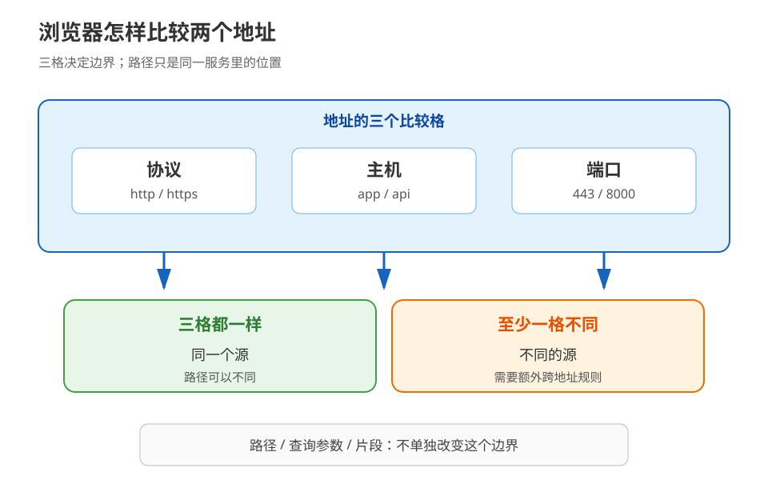
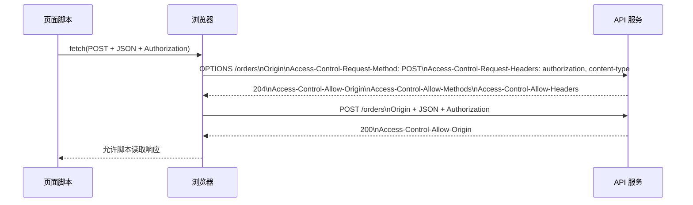
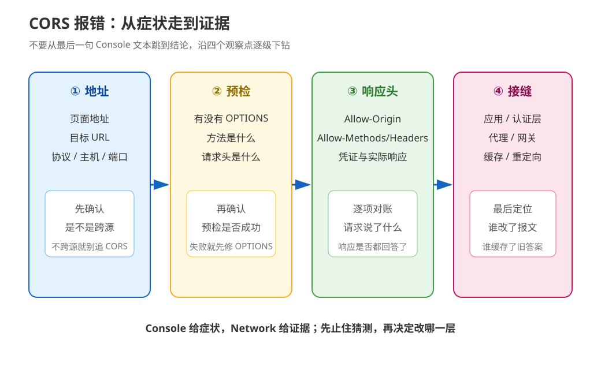

# 第 14 课：CORS 与同源策略：浏览器的一票否决

> 所属阶段：阶段 5《认证联调与决策》｜水平：入门｜本课知识点：14.1 同源策略、14.2 CORS 机制、14.3 高频 CORS 报错排查
> 故事情节：前端联调天天 CORS 报错，小航要把“请求没发出”“服务端没放行”和“浏览器没把响应交给脚本”分开
> 📖 结论已按官方文档核对（核查于 2026-09｜来源：[MDN 同源策略](https://developer.mozilla.org/en-US/docs/Web/Security/Defenses/Same-origin_policy)、[MDN CORS 指南](https://developer.mozilla.org/en-US/docs/Web/HTTP/Guides/CORS)、[WHATWG Fetch Standard](https://fetch.spec.whatwg.org/#http-cors-protocol)）

## 🎯 本课目标

- 说清“源”由协议、主机和端口组成，并准确理解同源策略主要限制什么。
- 能区分不触发预检的请求与预检 `OPTIONS`，读懂 `Access-Control-Allow-*` 头，并处理凭证场景。
- 拿到 CORS 控制台报错时，能按“请求 → 预检 → 响应 → 代理/缓存”顺序定位，而不是先盲改成 `*`。

---

## 第一幕：起源与场景引入

周一上午，小航打开前端开发服务器 `http://localhost:5173`，点击“查看订单”。后端接口在 `http://localhost:8000/orders`，用 curl 访问得到 `200 OK`，但页面里的 `fetch()` 却报错，JavaScript 拿不到订单 JSON。

他把后端同事拉进群：后端说“接口明明返回 200”；前端说“浏览器就是不给我数据”。Network 面板里甚至出现了两条请求：一条是 `OPTIONS`，另一条业务请求有时根本没有出现。

> 🎬 **场景**：同一个接口，curl 能读、浏览器脚本却读不到；有时还会在真正请求前多出一条探路请求。

> 📌 **一句话本质**：浏览器会给跨地址的数据读取加一道门；服务端必须明确说“这个页面可以读”，浏览器才把结果交给页面脚本。
>
> ⚖️ **处境对照**：不分清这道门，看到 200 也可能继续在前端改代码、后端改业务逻辑；分清后，通常只需对照一次请求的 `Origin`、预检条件和响应头，就能把问题定位到浏览器、服务端或中间层。

这里的“跨地址”是人话，第三幕才会把它对齐成标准术语。先记住一个重要边界：**CORS 不是登录机制，也不是把接口变成公开接口；它是浏览器决定“脚本能否读取响应”的协议配合。**

---

## 第二幕：认知冲突

小航先用 curl 复现：

```bash
curl -i 'http://localhost:8000/orders'
```

结果是 `200 OK`。他又在浏览器控制台执行：

```js
fetch('http://localhost:8000/orders')
  .then(response => response.json())
  .then(console.log)
  .catch(console.error);
```

浏览器却报 CORS 错误。难道浏览器比 curl 更“严格地检查服务器”吗？还不完全是：curl 只是把 HTTP 响应打印出来，它没有替浏览器执行同源策略；浏览器既要发请求，又要决定脚本有没有资格看到返回内容。

> ❓ **问题**：接口已经返回 200，为什么页面代码仍然拿不到数据？如果浏览器能发出请求，为什么还要先发 `OPTIONS`？

本课的答案不是“记住几个响应头”，而是建立一条排查链：先确定是不是不同源，再判断浏览器有没有做预检，最后对照服务端返回的许可是否与这一次请求完全匹配。

---

## 第三幕：层层揭示

### 一眼全局图（进入细节前先看一眼）


> 看图：先看左边的“同一地址”与“不同地址”，再看右边——不同地址的结果不是自动交给页面，而要经过服务端许可和浏览器读取闸门。

这张图只回答“为什么页面会被拦、靠什么思路放行”，不先放入 `Origin`、`OPTIONS`、CORS 等行话；后面每个知识点再把这些词一一对上。

### 本课地图（分几步走）

| 步 | 这一步要解决什么（人话） | 对应知识点 |
|:--:|------------------------|-----------|
| 1 | 先判断两个地址是不是同一边界 | 知识点 14.1：同源策略 |
| 2 | 再看浏览器如何向服务端申请跨地址读取 | 知识点 14.2：CORS 机制 |
| 3 | 最后把控制台报错还原成一组请求与响应 | 知识点 14.3：高频 CORS 报错排查 |

> 这是一张路线表，不提前给出机制结论；读到每个知识点时，都会知道自己正在解决哪一步。

### 知识点 14.1：同源策略

> 🧭 第 1/3 步｜承接：第二幕留下了“同一个接口为什么 curl 能读、页面脚本不能读”的冲突 → 本步：先判断浏览器眼里的两个地址是不是同一个源，以及跨源时究竟限制了什么
> 本知识点关键点：源 = 协议 + 主机 + 端口 / 同源策略的保护对象 / 跨源不等于所有资源都不能加载

#### 一句话定义

**同源策略（Same-Origin Policy，SOP）是浏览器对不同源之间脚本交互施加的安全边界；两个 URL 只有协议、主机和端口都相同，才属于同源。**

#### 直觉建立（类比）

把每个网页想成办公楼里的一个部门。判断两个部门是不是“同一个权限单元”，先看楼栋规则、部门地址和门禁编号；房间里的具体文件夹路径，不会改变部门身份。

> 💡 **类比的边界**：真实浏览器不只做一个“能不能进门”的判断：图片、脚本、iframe 等资源各有自己的跨源规则；本课聚焦 `fetch()` / XHR 场景里最容易误判的“脚本能不能读取响应”。

#### 核心原理

一个 URL 的源（origin）由三个格子组成：

1. **协议（scheme）**：`http` 与 `https` 不同。
2. **主机（host）**：主机名不同就是不同源，子域名也不自动相同。
3. **端口（port）**：端口不同就是不同源；省略端口时使用该协议的默认端口参与比较。



> 看图：上面三格是浏览器比较源时真正看的字段；下面的路径只是资源位置，路径变化不会单独制造跨源，协议、主机或端口有一格不同才会跨源。

| 页面地址 | API 地址 | 结果 | 原因 |
|---|---|---|---|
| `https://app.example.com/index.html` | `https://app.example.com/orders` | 同源 | 路径不同不影响源 |
| `https://app.example.com` | `http://app.example.com` | 跨源 | 协议不同 |
| `https://app.example.com` | `https://api.example.com` | 跨源 | 主机不同 |
| `https://app.example.com` | `https://app.example.com:8443` | 跨源 | 端口不同 |

同源策略的重点不是一句“跨源请求全部禁止”，而是**限制脚本对跨源资源的读取和交互能力**。例如，浏览器允许很多跨源资源作为页面的一部分加载，但这不代表当前页面的 JavaScript 可以随意把另一个源返回的私密数据读成字符串。

对小航的订单场景，可以把现象拆成三层：

| 观察位置 | 你可能看到什么 | 应怎样理解 |
|---|---|---|
| 服务器日志 | 请求可能已经到达，甚至业务已执行 | 不能据此证明脚本能读到响应 |
| 浏览器 Network | 请求有状态码，也可能有预检 | 说明网络交换发生过，不等于 CORS 检查通过 |
| 页面 JavaScript | 得到 JSON，或得到一个被浏览器包装的错误 | 这是“是否把响应交给脚本”的最后结果 |

#### 示例演示

下面两个 URL 只改端口。它们看起来都在本机，但在浏览器源比较里不是同源：

```js
const page = new URL('http://localhost:5173/index.html');
const api = new URL('http://localhost:8000/orders');

console.log(page.protocol === api.protocol); // true
console.log(page.hostname === api.hostname); // true
console.log(page.port === api.port);         // false
```

所以“都叫 localhost”不能推出“同源”。这正是本课实验会先打印的第一组证据。

#### 常见误区

1. **“跨源 = 请求一定没发出去”**：错误。某些请求可以到达服务端；真正被阻止的可能是响应向脚本暴露。
2. **“路径不同就是跨源”**：错误。路径不参与源三元组比较；不同端口、协议或主机才会改变源。
3. **“CORS 是服务端防火墙”**：错误。CORS 主要是浏览器与服务端之间的读取许可协议；直接调用接口的非浏览器客户端不会自动执行浏览器的同源策略。

#### 一句话记住

**源只看协议、主机、端口；同源策略主要守的是“脚本读取别人的响应”这道边界。**

#### 🗣️ 行话对照

- **Origin（源）**：就是本课说的“地址权限单元”——由 scheme/host/port 组成；在哪遇到：请求的 `Origin` 头、Fetch Standard 的 origin 定义、浏览器控制台。
- **Same-Origin Policy（同源策略，SOP）**：就是本课说的“浏览器读取闸门”；在哪遇到：浏览器安全文档、CORS 控制台错误、`fetch()` / `XMLHttpRequest` 跨源读取。
- **Cross-Origin（跨源）**：就是本课说的“协议、主机或端口至少有一格不同”；在哪遇到：Network 面板的请求地址与页面地址对照。

#### 📚 官方文档

- [MDN：Same-origin policy](https://developer.mozilla.org/en-US/docs/Web/Security/Defenses/Same-origin_policy)
- [MDN：Origin header](https://developer.mozilla.org/en-US/docs/Web/HTTP/Reference/Headers/Origin)
- [WHATWG URL Standard：Origins](https://url.spec.whatwg.org/#origin)

---

### 知识点 14.2：CORS 机制

> 🧭 第 2/3 步｜承接：知道两个地址跨源后，还不知道浏览器怎样获得“可以读取”的许可 → 本步：把请求分成直接试探与先发 `OPTIONS` 预检，并读懂服务端的许可头
> 本知识点关键点：`Origin` 与允许源 / 方法 / 请求头 / 凭证 / 暴露响应头 / 预检缓存

#### 一句话定义

**CORS（Cross-Origin Resource Sharing，跨源资源共享）是一套 HTTP 头部配合，让服务器明确告诉浏览器哪些跨源响应可以交给页面脚本读取。**

#### 直觉建立（类比）

把跨源调用想成访客去另一个部门取资料。资料部门至少要识别“访客从哪个部门来”；如果访客提出了比较复杂的取件要求，门卫会先问一张“你打算用什么方式、带哪些特殊材料”的申请单，得到批准后才让正式取件。

> 💡 **类比的边界**：预检不是通用的“先问一下服务器再决定所有请求是否安全”的防火墙；它只描述浏览器 CORS 流程。即使某些请求不预检，服务端仍可能收到请求，因此涉及写操作时仍要独立考虑认证、授权与 CSRF。

#### 核心原理

CORS 的主角是请求里的 `Origin` 和响应里的许可头。服务端应读取请求中的 `Origin`，把它仅用于允许列表判断；不要把它当成用户身份或认证依据。非浏览器客户端可以自行构造 HTTP 头，所以 `Origin` 不能替代认证与授权。

**第一类：不触发预检的请求。** 社区仍常称它们为“简单请求（simple request）”，但当前 Fetch Standard 更倾向于描述“CORS-safelisted method / request-header”；这是旧术语与现行规范叫法的对照，不是两套不同的网络协议。典型条件包括 `GET` / `HEAD`，或满足限制条件的 `POST`，并且手动设置的请求头与 `Content-Type` 值处在 safelist 范围内。服务端仍需在实际响应里返回 `Access-Control-Allow-Origin`，浏览器才会把响应交给脚本。

**第二类：预检请求。** 当请求使用了不在 safelist 内的方法、请求头或媒体类型时，浏览器先发送 `OPTIONS`：



> 看图：浏览器先用 `OPTIONS` 描述“将要怎么请求”，服务器回许可后才进入真实业务请求；最后实际响应仍需带允许源，不能只给预检响应加头。

预检请求中的两个关键头：

- `Access-Control-Request-Method`：告诉服务端后续真实请求准备使用什么方法。
- `Access-Control-Request-Headers`：告诉服务端后续真实请求准备带哪些非 safelist 请求头。

服务端常见的响应头职责如下：

| 响应头 | 人话含义 | 典型值 / 注意点 |
|---|---|---|
| `Access-Control-Allow-Origin` | 哪个来源的页面可以读取 | `https://app.example.com`；返回具体源时，缓存场景通常配 `Vary: Origin` |
| `Access-Control-Allow-Methods` | 预检允许后续使用哪些方法 | `GET, POST, OPTIONS`；它不是通用的 `Allow` 头 |
| `Access-Control-Allow-Headers` | 预检允许后续携带哪些请求头 | `Authorization, Content-Type` |
| `Access-Control-Allow-Credentials` | 是否允许实际请求携带凭证并让脚本读取 | 值必须是 `true`；不能与 `Allow-Origin: *` 组合 |
| `Access-Control-Expose-Headers` | 哪些非默认响应头可以被脚本读取 | 例如 `X-Request-Id`；不是“允许请求头” |
| `Access-Control-Max-Age` | 预检许可可缓存多久 | 单位是秒；浏览器还可能有自己的上限 |

带凭证的请求要同时满足客户端与服务端两边：

```js
fetch('https://api.example.com/orders', {
  credentials: 'include',
  headers: {
    'Content-Type': 'application/json'
  }
});
```

服务器响应不能写成：

```http
Access-Control-Allow-Origin: *
Access-Control-Allow-Credentials: true
```

而应返回具体的允许源，例如：

```http
Access-Control-Allow-Origin: https://app.example.com
Access-Control-Allow-Credentials: true
Vary: Origin
```

`Authorization` 不是 CORS safelist 请求头，因此把 Bearer 放进 `Authorization` 时，通常会进入预检流程；但“用了 Bearer”与“令牌一定是 JWT”仍是两件事，认证方案和令牌格式不要混为一谈。

#### 示例演示

用 curl 可以观察服务端是否正确回答预检，但 curl **不会模拟浏览器的同源策略**：

```bash
curl -i -X OPTIONS 'https://api.example.com/orders' \
  -H 'Origin: https://app.example.com' \
  -H 'Access-Control-Request-Method: POST' \
  -H 'Access-Control-Request-Headers: authorization, content-type'
```

重点看四件事：状态码是否是成功响应、允许源是否精确匹配、方法是否包含 `POST`、请求头是否包含 `authorization` 与 `content-type`。即使预检通过，真实 `POST` 的响应仍应带 `Access-Control-Allow-Origin`。

#### 常见误区

1. **“加 `mode: 'no-cors'` 就修好了”**：它通常只会让脚本拿到不可读取的 opaque 响应，不能把受保护的 JSON 变成可读 JSON。
2. **“只给 OPTIONS 加 CORS 头就够了”**：预检通过后，真实响应也必须通过 CORS 检查；错误响应、重定向后的响应也不能被忽略。
3. **“`Access-Control-Allow-Headers` 控制浏览器能读哪些响应头”**：它控制的是后续请求允许带哪些请求头；响应头暴露要看 `Access-Control-Expose-Headers`。
4. **“CORS 通过了就等于接口安全”**：CORS 只影响浏览器脚本读取；认证、授权、CSRF、限流和输入校验仍要独立设计。

#### 一句话记住

**CORS 是“页面带着 Origin 来申请读取权，服务端用 Allow-* 回答”的浏览器协议；预检是复杂请求的先行问路。**

#### 🗣️ 行话对照

| 本课说法（人话） | 行业标准叫法 | 典型配置 / 在哪遇到 | 代价或边界 |
|---|---|---|---|
| 直接试探，不先发申请单 | CORS-safelisted request（社区常称 simple request，Fetch 未采用该术语） | `GET` / `HEAD`、受限 `POST`；MDN CORS “Simple requests” | 请求可能直接到达服务端，不能拿它替代 CSRF 防护 |
| 先问能不能这样请求 | CORS-preflight request | `OPTIONS`、`Access-Control-Request-Method`、`Access-Control-Request-Headers` | 多一次 HTTP 交换；预检本身不带凭证 |
| 只允许公开跨源读取 | `Access-Control-Allow-Origin: *` | 公共、无需凭证的资源 | 不能与凭证式跨源读取搭配 |
| 允许某个页面带凭证读取 | Credentialed CORS request | `credentials: 'include'` + 精确 `Allow-Origin` + `Allow-Credentials: true` | 配置错误容易泄露用户数据；还受 Cookie 第三方策略影响 |

#### 📚 官方文档

- [MDN：Cross-Origin Resource Sharing (CORS)](https://developer.mozilla.org/en-US/docs/Web/HTTP/Guides/CORS)
- [WHATWG Fetch：CORS protocol](https://fetch.spec.whatwg.org/#http-cors-protocol)
- [MDN：Access-Control-Allow-Origin](https://developer.mozilla.org/en-US/docs/Web/HTTP/Reference/Headers/Access-Control-Allow-Origin)
- [MDN：Access-Control-Allow-Credentials](https://developer.mozilla.org/en-US/docs/Web/HTTP/Reference/Headers/Access-Control-Allow-Credentials)
- [MDN：OPTIONS method](https://developer.mozilla.org/en-US/docs/Web/HTTP/Reference/Methods/OPTIONS)

---

### 知识点 14.3：高频 CORS 报错排查

> 🧭 第 3/3 步｜承接：知道浏览器会检查许可头后，仍可能只看到一句“跨源请求被阻止” → 本步：把模糊报错还原成请求、预检、响应和中间层四个可观测位置
> 本知识点关键点：识别 `No 'Access-Control-Allow-Origin' header` / 预检失败 / 凭证与通配符冲突 / 服务端已配置但链路仍不匹配

#### 一句话定义

**CORS 排查不是猜配置，而是把页面源、目标 URL、请求方法/请求头、预检响应和实际响应逐项对账。**

#### 直觉建立（类比）

把报错排查想成查快递：先核对寄件地址和收件地址，再看门卫有没有收到预约单，接着看仓库是否在外包装上贴了正确许可，最后检查中转站有没有换包、缓存旧包或重复贴标签。

> 💡 **类比的边界**：浏览器的具体错误文本会因浏览器、请求模式和失败位置不同而变化；稳定的排查对象不是某一句错误原文，而是 Network 面板里的请求与响应事实。

#### 核心原理

官方文档把 CORS 失败描述为浏览器错误，JavaScript 通常拿不到足够细的失败原因；要找具体原因，应打开开发者工具重现，并查看 Console 与 Network。排查顺序建议固定为：



> 看图：从左到右先确认地址，再看有没有 `OPTIONS`，随后逐个核对响应许可头，最后才把锅定位给应用、代理、缓存或网络层。

**第 0 步：记录一次完整事实。** 记下页面地址、请求 URL、最终协议、方法、是否 `credentials: 'include'`、是否设置 `Authorization` / JSON `Content-Type`。不要只复制 Console 最后一行。

**第 1 步：在 Network 面板找对应请求。** 如果看见 `OPTIONS`，先点它；如果只有业务请求，判断它是否属于不触发预检的请求。状态码、是否发生重定向、请求是否真的抵达服务端，都比“我以为浏览器应该预检”更可靠。

**第 2 步：检查请求侧。** 重点看：

- `Origin` 是否是服务端允许列表中的完整源；协议、主机、端口都要对。
- 预检是否带了正确的 `Access-Control-Request-Method`。
- 预检是否带了真实将要发送的 `Access-Control-Request-Headers`。

**第 3 步：检查响应侧。** 对照下面这张症状表：

| 可观测现象 | 更可能的定位 | 下一动作 |
|---|---|---|
| 业务响应没有 `Access-Control-Allow-Origin` | 资源路径、错误路径或代理没有补 CORS | 直接看该响应的全部头；不要只看成功分支 |
| `Allow-Origin` 与请求 `Origin` 不一致 | 允许列表、协议、端口或环境变量不匹配 | 把两边完整字符串逐字符对照 |
| 带凭证但 `Allow-Origin: *` | 通配符与凭证式读取冲突 | 改为精确源，并确认 `Allow-Credentials: true` |
| 预检没放行方法 | `Allow-Methods` 缺少实际方法，或 `OPTIONS` 被路由 / 认证中间件拦截 | 先用 curl 单独发预检，确认服务端是否返回成功响应 |
| 预检没放行请求头 | `Allow-Headers` 缺少实际要发的头，常见是 `authorization` | 从预检的 `Access-Control-Request-Headers` 反查配置 |
| Console 说 CORS request did not succeed，Network 没有有效响应 | DNS、TLS、连接、混合内容、代理或服务不可达 | 先按网络层排查，不把所有网络错误都归为 CORS |

**第 4 步：检查“服务端配了但仍报错”的接缝。** 真实工程里最容易漏的是：

1. 只给 `/orders` 的 200 响应加了头，401/403/500 或重定向响应没有加。
2. 应用代码处理了 `POST`，但 Web 服务器、认证中间件或路由层先拦截了 `OPTIONS`。
3. 代理层和应用层各加了一次 `Access-Control-Allow-Origin`，浏览器看到多个值。
4. 动态返回具体源，却让共享缓存忽略 `Origin`，后一个页面可能拿到前一个源的缓存响应；这时应按缓存语义检查 `Vary: Origin`。
5. 配置改在了一个域名或端口，浏览器实际请求的是另一个环境、另一个重定向目标或另一个 API 路径。

#### 示例演示

用 curl 依次模拟“预检”和“业务请求”，把浏览器看见的事实先固定下来：

```bash
# 预检：只问服务端是否允许后续 POST + Authorization + JSON
curl -i -X OPTIONS 'https://api.example.com/orders' \
  -H 'Origin: https://app.example.com' \
  -H 'Access-Control-Request-Method: POST' \
  -H 'Access-Control-Request-Headers: authorization, content-type'

# 业务请求：注意 curl 会显示响应，但不会替浏览器执行 CORS 读取拦截
curl -i -X POST 'https://api.example.com/orders' \
  -H 'Origin: https://app.example.com' \
  -H 'Authorization: Bearer <ACCESS_TOKEN>' \
  -H 'Content-Type: application/json' \
  --data '{"item_id":"demo-001"}'
```

若第一条返回 403，先修预检；若第一条成功、第二条 200 但没有 `Allow-Origin`，修实际响应；若两条都看起来正确而浏览器仍失败，再看重定向、缓存、代理重复头与浏览器凭证策略。

#### 常见误区

1. **“看到 CORS 就先把服务端改成 `*`”**：这可能把公开读接口暂时跑通，却掩盖了允许列表、凭证和缓存设计问题。
2. **“状态码 401/403/500 就不会触发 CORS”**：状态码和是否能共享响应是两层事；错误响应也要按浏览器读取规则检查。
3. **“浏览器报 CORS，所以后端一定没收到请求”**：先看服务端日志与 Network；不触发预检的请求可能已经执行了业务副作用。
4. **“只看 Console 就够了”**：Console 是症状摘要；真正定位要回到 Network 的 `Origin`、`OPTIONS` 和响应头。

#### 一句话记住

**先判源，再找预检；先比请求头，再比响应头；最后才查代理、缓存和网络。**

#### 🗣️ 行话对照

- **CORS preflight failure（CORS 预检失败）**：就是“申请单没获批”；在哪遇到：Network 中的 `OPTIONS`、Console 的 preflight error、`Access-Control-Allow-Methods/Headers`。
- **CORS header `Access-Control-Allow-Origin` missing / does not match**：就是“响应没有给当前页面许可 / 许可对象不对”；在哪遇到：浏览器 Console、MDN CORS errors 页面。
- **CORS request did not succeed**：就是“浏览器没有拿到可完成 CORS 检查的有效响应”；在哪遇到：Console；要继续区分网络失败与服务端 CORS 配置失败。

#### 📚 官方文档

- [MDN：CORS errors](https://developer.mozilla.org/en-US/docs/Web/HTTP/Guides/CORS/Errors)
- [MDN：Reason: CORS header `Access-Control-Allow-Origin` missing](https://developer.mozilla.org/en-US/docs/Web/HTTP/Guides/CORS/Errors/CORSMissingAllowOrigin)
- [MDN：Reason: CORS request did not succeed](https://developer.mozilla.org/en-US/docs/Web/HTTP/Guides/CORS/Errors/CORSDidNotSucceed)
- [MDN：Reason: Credential is not supported if `Access-Control-Allow-Origin` is `*`](https://developer.mozilla.org/en-US/docs/Web/HTTP/Guides/CORS/Errors/CORSNotSupportingCredentials)

---

## 第四幕：实操验证

### 4.1 机制验证

本地实验用 Python 标准库启动一个临时 API 服务，分三段验证：源三元组比较、预检与实际响应的 CORS 合同、以及典型错误的定位模型。

```bash
python3 network/http/stages/5-认证联调与决策/labs/lesson-14-cors-same-origin-lab.py --section all
```

实测输出（本机运行于 2026-09-17）：

```text
[14.1] Origin tuple
same path-only change: same-origin
different port: cross-origin
different scheme: cross-origin

[14.2] Preflight contract
allowed preflight status=204
allow-origin=https://app.example.com
allow-methods=POST, OPTIONS
allow-headers=authorization, content-type
actual response status=200 allow-origin=https://app.example.com
denied preflight status=403 allow-origin=<none>

[14.3] Diagnosis model
missing allow-origin -> inspect actual response and error path
wildcard with credentials -> replace * with exact origin
method not allowed -> compare requested method with allow-methods
```

> ✅ **回扣场景**：这组输出把“curl 能通、页面读不到”拆成可观察的差异：接口是否返回业务数据只是第一关，浏览器还要看到与本次 `Origin`、方法、请求头和凭证模式匹配的许可。

> ⚠️ **实验边界**：标准库客户端不会执行浏览器同源策略，因此实验验证的是服务端 CORS 合同和排查逻辑，不伪装成真实浏览器行为。要验证页面最终能否读取，仍需在浏览器 DevTools 中从不同端口加载页面并观察 Console / Network。

### 4.2 应用实战：订单 API 的跨源联调（入口）

> 🎯 **本课应用实战独立成篇**：[第 14 课实战 · 订单 API 跨源联调](../../../应用实战/14-CORS与同源策略.md)
> 含两张分步设计图（公共读取 → 精确源、凭证与预检）与“基础 → 综合”的完整演进；通览全部：📚 [应用实战索引](../../../应用实战/INDEX.md)
> **课内不重复实战正文**：真实工程里的代码演进与边界放在独立实战篇，本节只保留入口。

---

## 第五幕：体系收束

小航现在可以把“CORS 报错”放回 HTTP 全景中：第 13 课解决了凭证怎么携带、状态放在哪里；本课解决了浏览器页面从另一个源读取响应时，谁能读、怎么申请、哪里出错；下一课会把这些知识与 DevTools、curl 和完整排障决策树串起来。

> 📍 **全局定位**：CORS 位于“浏览器安全策略 ↔ HTTP 请求/响应头 ↔ 应用联调”的接缝；它不是 HTTP 身份认证，也不是服务端防火墙，而是浏览器读取跨源响应前后的许可协议。
> 🔗 **下一步**：进入第 15 课《抓包排障与决策清单：课程收束》，把慢、登录失效和 CORS 统一还原成可观察的报文证据。

## 🐞 常见误区

1. **把跨源错误当成后端业务错误**：先确认请求是否到达、响应是否带许可，再看业务状态码。
2. **把 `Origin` 当成认证身份**：它只是浏览器请求上下文的一部分，不能代替用户身份、签名或授权判断。
3. **允许列表只写域名不写协议/端口**：CORS 的源匹配要按完整 origin 对账。
4. **预检通过后忘记给实际响应加头**：浏览器会在最后一步再次检查实际响应。
5. **为绕过错误关闭浏览器安全策略或安装插件**：这只改变本机调试环境，不能证明线上配置正确。

## 一图总结


> **与课首入口的分工**：课首全局图只用问题视角告诉没学过的人“为什么要有读取闸门”；这里的总结图用知识视角串起源比较、预检、响应许可和排查顺序，供学完后复习。

## 课后小测

**Q1**：下面哪一项会让两个 URL 成为不同源？

- A. 只有路径不同
- B. 端口不同
- C. URL 片段不同
- D. 查询参数不同

<details><summary>答案与解析</summary>

**答案：B**。源比较看协议、主机、端口；路径、查询参数和片段不参与源三元组。

</details>

**Q2**：为什么带 `Authorization` 的跨源 `POST` 常见会先出现 `OPTIONS`？

- A. `OPTIONS` 用来传输真正的业务数据
- B. `Authorization` 往往不在 CORS safelist 中，浏览器需先预检
- C. 所有 `POST` 都必须预检
- D. 服务端必须先完成登录

<details><summary>答案与解析</summary>

**答案：B**。预检描述将来的方法和请求头；并不是所有 POST 都预检，条件取决于方法、请求头、媒体类型等。

</details>

**Q3**：前端使用 `credentials: 'include'` 时，服务端返回 `Access-Control-Allow-Origin: *` 为什么仍然失败？

- A. `*` 只能用于 HTTPS
- B. 通配符不能表示一个具体的凭证接收源
- C. `OPTIONS` 不能返回 204
- D. Cookie 只能通过 URL 传递

<details><summary>答案与解析</summary>

**答案：B**。凭证式 CORS 需要明确的允许源，并配合 `Access-Control-Allow-Credentials: true`；同时仍受 Cookie 自身策略约束。

</details>

**Q4**：Console 报 “No `Access-Control-Allow-Origin` header”，最有价值的第一步是什么？

- A. 立刻改成 `Allow-Origin: *`
- B. 只看后端业务日志
- C. 在 Network 中找到对应响应，核对请求 `Origin` 与响应头
- D. 把 `mode` 改成 `no-cors`

<details><summary>答案与解析</summary>

**答案：C**。先固定一次真实请求/响应，再判断是缺头、源不匹配、预检失败还是中间层改写。

</details>

## 🚀 下一批接力提示词

> 学完本批后，**复制下面这段文字发给 AI**，即可无缝进入下一批：

```text
继续学 HTTP。我的学习档案在 network/http/00-学习档案.md，
刚学完阶段 5《认证联调与决策》的课《CORS 与同源策略：浏览器的一票否决》知识点 14.1、14.2、14.3，
请按大纲继续讲解下一批知识点。
```

## 📋 命令速查卡

| 目的 | 命令 / 操作 | 看什么 |
|---|---|---|
| 看页面与 API 是否跨源 | 对照 URL 的协议、主机、端口 | 不要只看是否都是 `localhost` |
| 模拟预检 | `curl -i -X OPTIONS 'https://api.example.com/orders' -H 'Origin: https://app.example.com' -H 'Access-Control-Request-Method: POST' -H 'Access-Control-Request-Headers: authorization, content-type'` | 状态码、Allow-Origin、Allow-Methods、Allow-Headers |
| 模拟业务请求 | `curl -i -X POST 'https://api.example.com/orders' -H 'Origin: https://app.example.com' -H 'Content-Type: application/json' --data '{"item_id":"demo-001"}'` | 实际响应是否仍有 Allow-Origin |
| 查浏览器真实链路 | DevTools → Network → 先看 `OPTIONS`，再看业务请求 | Origin、预检头、响应头、重定向、错误分支 |
| 跑本地合同实验 | `python3 network/http/stages/5-认证联调与决策/labs/lesson-14-cors-same-origin-lab.py --section all` | 源比较、预检合同、典型错误定位 |

## 🧭 课程导航

🎯 **练一练（本课应用实战）**：[第 14 课实战 · 订单 API 跨源联调](../../../应用实战/14-CORS与同源策略.md)

⬅️ **上一课**：[第 13 课：Cookie、Session 与 Token](lesson-13-Cookie会话与Token.md)

➡️ **下一课**：[第 15 课：抓包排障与决策清单：课程收束](lesson-15-抓包排障与决策清单.md)

📚 **返回目录**：[课程目录](../../../02-课程目录.md)
