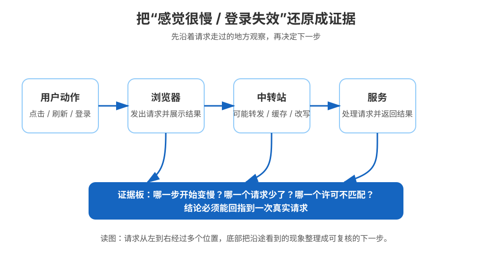
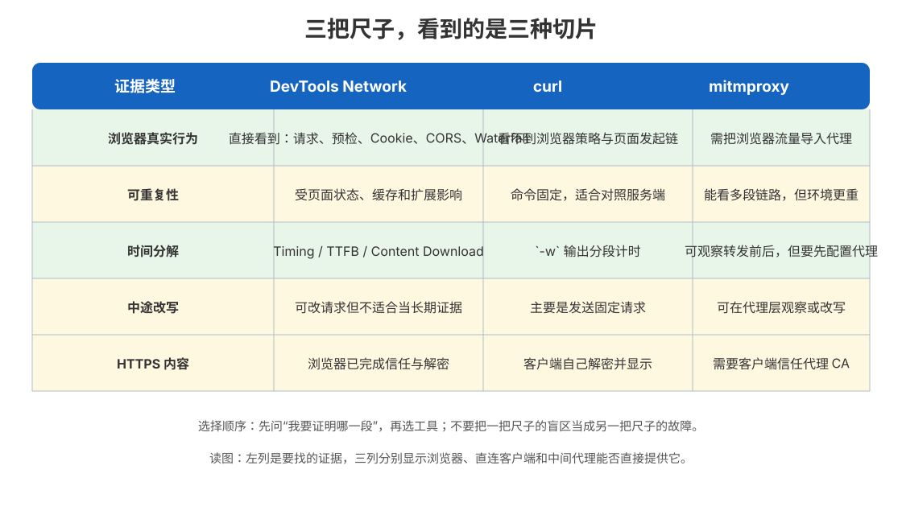
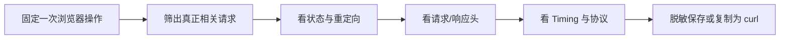
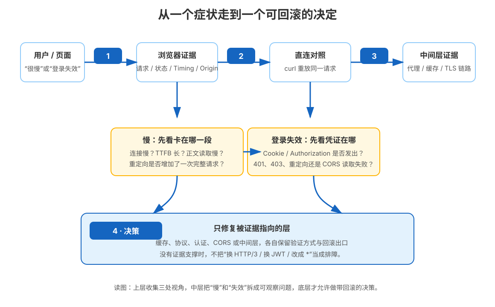
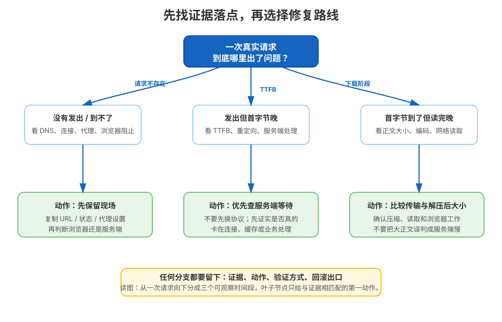
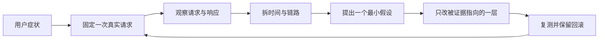
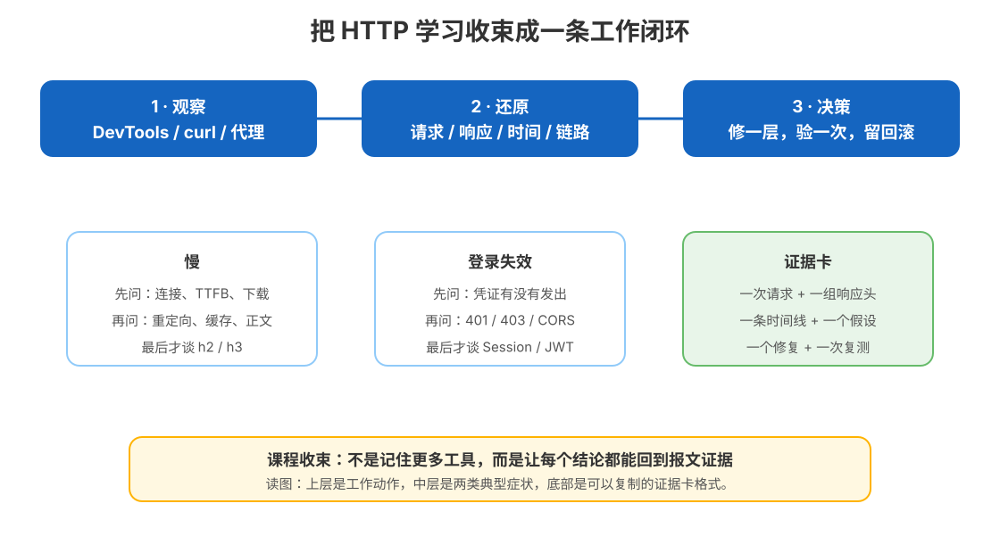

# 第 15 课：抓包排障与决策清单：课程收束

> 所属阶段：阶段 5《认证联调与决策》｜水平：入门｜本课知识点：15.1 抓包方法论、15.2 综合排障推演、15.3 决策清单
> 故事情节：小航把三个月踩的坑整理成《联调排障手册》，给团队输出一份决策清单——故事收束
> 📖 结论已按官方文档核对（核查于 2026-09｜来源：[Chrome DevTools Network](https://developer.chrome.com/docs/devtools/network/reference/)、[curl 手册](https://curl.se/docs/manpage.html)、[mitmproxy Getting Started](https://docs.mitmproxy.org/stable/overview/getting-started/)、[mitmproxy Certificates](https://docs.mitmproxy.org/stable/concepts/certificates/)）

## 🎯 本课目标

- 能用 DevTools Network、`curl` 和中间代理分别回答“浏览器实际做了什么”“服务端直接返回什么”“请求经过了谁”这三类问题。
- 能把“接口慢”和“登录失效”拆成请求、响应、时间、协议、凭证与 CORS 证据，而不是凭感觉改配置。
- 能用缓存、协议、认证三张决策表写出“证据 → 动作 → 验证 → 回滚”的最小方案。

---

## 第一幕：起源与场景引入

周一上午，小航同时收到两条消息：

> “订单页面今天特别慢，后端说接口只处理了几十毫秒。”
>
> “登录明明成功了，刷新后又变成未登录；curl 能拿到数据，页面却报错。”

他打开浏览器，只看到一个模糊结论：**“页面慢”“登录失效”**。但一次页面动作可能包含重定向、预检、真正的业务请求和资源加载；如果不把它们拆开，看到一个 `200` 或一个 `401`，都不足以解释完整现象。

小航先把现场固定下来：保存页面地址、请求方法、状态码、请求头、响应头、Timing、协议版本和是否经过缓存。然后再用另一个客户端重放相同请求，最后才决定要不要查看中间层。

> 🎬 **场景**：同一个“慢”或“失效”，要经过多个位置；每个位置只能看到问题的一部分。

> 📌 **一句话本质**：把一次请求从“感觉不对”还原成一串能核对的证据，再让证据决定修哪一层。
>
> ⚖️ **处境对照**：不留证据时，团队可能同时改前端、网关、缓存和认证配置，问题是否消失都说不清；留下一次完整请求的时间线和报文后，至少能回答“慢从哪一段开始”“凭证有没有发出”“谁改了响应”。

本课不追求记住更多命令，而是练习一种工作习惯：**先收集，再对照；先定位，再决策。**

---

## 第二幕：认知冲突

小航的第一个直觉是：既然浏览器有 Network 面板，为什么还需要 `curl`？第二个直觉是：既然 curl 看到了 `200`，为什么页面仍然可能读不到？第三个直觉是：既然有中间代理能看到所有流量，是不是以后所有问题都应该先上代理？

这三个直觉分别漏掉了三件事：浏览器有自己的策略和状态，curl 不会替浏览器执行同源策略；中间代理会改变链路与信任边界；工具越强，越要先明确你要证明什么。

> ❓ **问题**：面对一个“慢”或“登录失效”，到底该先看哪一把尺子？什么证据足以支持一次配置决策？

答案会沿三步展开：先学会选观察工具，再完整推演两个事故，最后把判断固化成可复用的清单。

---

## 第三幕：层层揭示

### 一眼全局图（进入细节前先看一眼）



> 看图：请求从用户动作一路经过浏览器、中转站和服务，底部的证据板把沿途现象整理成下一步决策；图里先不放工具名和协议术语，避免没学过本课的人被行话挡在门外。

### 本课地图（分几步走）

| 步 | 这一步要解决什么（人话） | 对应知识点 |
|:--:|------------------------|-----------|
| 1 | 先选一把能看见目标证据的尺子 | 15.1 抓包方法论 |
| 2 | 再把“慢”和“失效”还原成一条证据链 | 15.2 综合排障推演 |
| 3 | 最后把证据变成带验证和回滚的动作 | 15.3 决策清单 |

> 这张表只说明路线，不提前给出结论；读到哪一步，就知道自己正在把哪类混乱变成哪类证据。

### 知识点 15.1：抓包方法论

> 🧭 第 1/3 步｜承接：第二幕留下了“为什么三种工具都有人推荐”的冲突 → 本步：先按证据目标选择工具，知道每把尺子的盲区
> 本知识点关键点：DevTools Network 的浏览器现场、curl 的可重复对照、中间代理的链路观察与 HTTPS 信任边界

#### 一句话定义

**抓包排障不是“把所有流量都拦下来”，而是选定观察位置，记录一次请求在该位置看到的请求、响应、时间和状态。**

#### 直觉建立（类比）

把排障想成检查一列火车：DevTools 像站台监控，能看到乘客从哪一站上车、在哪一站下车；curl 像一辆按固定路线单独发车的测试车，适合反复跑同一趟；中间代理像线路上的检查站，能看到车经过它时携带了什么。

> 💡 **类比的边界**：真实网络不是一条只有三个站的直线；浏览器可能有缓存、Service Worker、Cookie 和 CORS，代理也可能改变连接与证书信任。因此三种工具的结果不能直接互换，必须先确认它们观察的是不是同一次请求、同一条链路。

#### 核心原理

这里的“三把尺子”，就是第一幕提到的三种观察位置：浏览器现场、直连客户端和中间代理。它们先这样分工：

| 你要证明什么 | 首选工具 | 能看到什么 | 明确盲区 |
|---|---|---|---|
| 浏览器到底发了什么、为什么没交给页面 | DevTools Network | 请求列表、重定向、预检、Cookie、CORS、Waterfall（瀑布图）、Timing、Initiator（发起者） | 不等于服务端内部耗时；界面状态会影响现场 |
| 服务端直接如何回应、同一请求能否稳定重放 | `curl` | 请求/响应头、状态码、正文、连接信息、分段计时 | 不执行浏览器同源策略、页面脚本和浏览器 Cookie 决策 |
| 客户端与服务端之间经过了什么、哪一段被改写 | mitmproxy 等中间代理 | 客户端侧与服务端侧的流量、转发和可选改写 | 需要配置代理；HTTPS 解密需要客户端信任代理 CA；会改变观察条件 |



> 看图：左列是要找的证据，三列分别表示浏览器现场、直连客户端和中间代理能否直接提供；“不能直接看到”不是故障，而是工具的观察边界。

##### 证据的最小字段

一次排障至少固定下面这些字段：

1. **请求身份**：URL、方法、查询参数、是否重定向、是否出现预检。
2. **凭证与上下文**：`Cookie`、`Authorization`、`Origin`、`Referer`，以及是否带了 `credentials`。
3. **响应合同**：最终状态码、`Location`、`WWW-Authenticate`、CORS 头、缓存头、`Content-Encoding`。
4. **时间线**：排队、DNS、连接、TLS/代理协商、请求发送、等待首字节（TTFB）、正文下载。
5. **协议与位置**：HTTP/1.1、HTTP/2 或 HTTP/3，浏览器是否命中缓存，是否经过页面后台拦截器 Service Worker、代理或 CDN。

这里的 `HAR` 是 **HTTP Archive（HTTP 会话存档）**，也就是把一组 HTTP 请求记录成 JSON，便于交接与复盘；它不是脱敏工具本身，导出后仍要检查查询参数、请求头和正文。

DevTools 官方 Network 文档把 Timing 拆为 Queueing、DNS Lookup、Initial connection、Proxy negotiation、Request sent、Waiting (TTFB) 和 Content Download 等阶段；其中 TTFB 是等待首字节，Content Download 是读取响应正文所花的时间。不要把“总耗时”当成一个不可拆分的数字。[Chrome DevTools Timing 说明](https://developer.chrome.com/docs/devtools/network/reference/#timing-explanation)（核查于 2026-09）

##### 三步固定浏览器现场

1. 打开 DevTools → Network，确认正在记录；刷新前勾选 **Preserve log**，这样重定向或跨页跳转不会把前一页的请求冲掉。
2. 重现一次问题，只保留与现象相关的请求；先看 Name、Status、Initiator、Time、Waterfall，再打开 Headers、Timing、Response。
3. 需要交接时优先导出脱敏 HAR，或右键单个请求选择 **Copy as cURL**。Chrome 默认的 sanitized HAR 会排除 `Cookie`、`Set-Cookie` 和 `Authorization` 等敏感头；只有确认能安全分享时才考虑带敏感数据导出。[Chrome DevTools HAR 说明](https://developer.chrome.com/docs/devtools/network/reference/#save-as-har)（核查于 2026-09）



> 看图：这不是“看到报错就截图”，而是从一次固定操作开始，按请求身份、报文和时间顺序逐层收集证据。

##### 用 curl 做直连对照

`curl -v` 适合回答“客户端实际发了哪些头、收到哪些头”。官方手册说明，`-v` 输出用 `>` 表示 curl 发出的头、`<` 表示收到的头、`*` 表示 curl 自己提供的附加信息；因此它很适合检查重定向、认证挑战、缓存头和协议协商，但它**不会替浏览器执行同源策略**。[curl `--verbose`](https://curl.se/docs/manpage.html#-v)（核查于 2026-09）

```bash
curl -v 'https://api.example.com/orders' \
  -H 'Origin: https://app.example.com' \
  -H 'Authorization: Bearer <YOUR_ACCESS_TOKEN>'
```

需要稳定对照时，把正文丢掉，用 `-w/--write-out` 打出结构化计时。`-w` 会在传输完成后输出格式字符串中的变量；下面的字段适合做“同一请求、不同方案”的对照，不适合把一次公网结果当成性能基线。[curl `--write-out`](https://curl.se/docs/manpage.html#-w)（核查于 2026-09）

```bash
curl -sS -o /dev/null \
  -w 'status=%{http_code}\nhttp_version=%{http_version}\nremote_ip=%{remote_ip}\n' \
  -w 'dns=%{time_namelookup}s connect=%{time_connect}s appconnect=%{time_appconnect}s\n' \
  -w 'ttfb=%{time_starttransfer}s total=%{time_total}s\n' \
  'https://api.example.com/health'
```

这里的 `appconnect` 对 HTTPS 可反映 TLS 连接完成前后的时间点；对没有 TLS 的普通 HTTP，请把它理解为不适用的分段，而不是“TLS 很快”。实际解释仍要结合 URL、协议版本和客户端构建能力。

如果 `-v` 还不够细，可以用 `--trace-ascii <文件>` 保存 ASCII 形式的完整收发 trace。curl 官方手册特别提醒：verbose 和 trace 可能包含用户名、凭据或正文秘密，分享前必须脱敏；`--trace-ascii` 与 `-v` 互斥，不要把两者堆在一条命令里。[curl `--trace-ascii`](https://curl.se/docs/manpage.html#--trace-ascii)（核查于 2026-09）

```bash
curl --trace-time --trace-ascii /tmp/request-trace.txt \
  'https://api.example.com/health'
```

##### 中间代理的 HTTPS 边界

mitmproxy 是支持 HTTP/1、HTTP/2 和 WebSocket 的 TLS-capable intercepting proxy（可拦截代理）；它的作用是把客户端与服务端之间的两段连接放到一个可观察的位置。官方 Getting Started 文档说明，默认 regular proxy 监听 `http://localhost:8080`，客户端必须显式配置使用这个代理。[mitmproxy Getting Started](https://docs.mitmproxy.org/stable/overview/getting-started/)（核查于 2026-09）

HTTPS 不是代理“天然看得懂”。mitmproxy 官方证书文档说明：客户端只有在信任 mitmproxy 生成的本地 CA 后，代理才能为目标域名生成受信任的临时证书并解密流量；这意味着安装 CA 就是在扩大本机信任边界。[mitmproxy Certificates](https://docs.mitmproxy.org/stable/concepts/certificates/)（核查于 2026-09）

本课环境中没有擅自安装 mitmproxy，也没有修改系统代理或证书信任。参考流程如下，但本次不把它当作本机实测：

```text
1. 在隔离的测试流量范围内启动 mitmproxy / mitmweb。
2. 让测试客户端只通过 localhost:8080 访问测试域名。
3. 只为该测试客户端安装并信任本地 CA。
4. 复现一次问题，导出或复制脱敏 flow。
5. 关闭代理并撤销测试客户端的 CA 信任。
```

**不要**为了看见 HTTPS 而使用 `curl -k`、忽略浏览器证书警告或把代理 CA 安装到日常系统信任库；那只证明“校验被绕过了”，不能证明线上证书和信任链正确。

#### 示例演示

设想页面报“登录失效”，三把尺子可能给出三种结果：

| 观察 | 看到的证据 | 暂时结论 |
|---|---|---|
| DevTools | 请求没有 `Cookie` 或 `Authorization` | 先查浏览器凭证发送条件，不先改服务端权限 |
| curl | 手动加 `Authorization: Bearer <YOUR_ACCESS_TOKEN>` 后返回 `200` | 服务端至少能识别这类凭证；不能证明浏览器一定会发它 |
| 中间代理 | 客户端侧有凭证，代理到服务端的一侧没有 | 查代理脱敏、转发规则或凭证改写边界 |

这三行不能简单投票决定“谁对谁错”。它们是在不同位置看到的片段；正确动作是把 URL、方法、头部、状态和时间线对齐，再复现一次。

#### 常见误区

1. **“curl 返回 200，所以浏览器一定能读到。”**：curl 不执行浏览器同源策略；浏览器仍可能因 CORS、Cookie 策略或预检失败而不把响应交给脚本。
2. **“Network 面板里的 200 就是业务成功。”**：它可能只是重定向链中的某一跳、预检响应或浏览器已经收到但脚本不能读取的响应。
3. **“所有问题先上 mitmproxy。”**：代理会增加配置、证书与隐私变量；浏览器专属问题通常先用 DevTools，服务端直连问题先用 curl。
4. **“把 HAR 原文件发群里最方便。”**：HAR 可能包含 Cookie、Set-Cookie、Authorization 和正文；先用脱敏版本，并检查查询参数与响应正文。
5. **“看到一段 trace 就可以公开。”**：trace 可能暴露秘密数据；应把 `<YOUR_ACCESS_TOKEN>` 等凭据替换为占位符后再分享。

#### 一句话记住

**DevTools 看浏览器现场，curl 做直连对照，中间代理看两段链路；先问要证明什么，再决定抓哪一段。**

#### 🗣️ 行话对照

| 本课说法（人话） | 行业标准叫法 | 典型配置 / 在哪遇到 | 代价 |
|---|---|---|---|
| 浏览器现场记录 | Network panel / Waterfall / Timing | Chrome DevTools Network、HAR、Initiator | 受浏览器状态影响；现场需先固定 |
| 直连对照 | verbose output / write-out / trace | `curl -v`、`curl -w`、`curl --trace-ascii` | 不包含浏览器策略；命令参数要与原请求对齐 |
| 中间观察台 | intercepting proxy | mitmproxy、代理地址、flow | 要改变代理配置；HTTPS 要处理本地 CA 与隐私 |

> 本表中的标准叫法与参数名已按对应官方手册核对（核查于 2026-09）。

#### 📚 官方文档

- [Chrome DevTools Network features reference](https://developer.chrome.com/docs/devtools/network/reference/)
- [curl man page：`--verbose`](https://curl.se/docs/manpage.html#-v)、[`--write-out`](https://curl.se/docs/manpage.html#-w)、[`--trace-ascii`](https://curl.se/docs/manpage.html#--trace-ascii)
- [mitmproxy Getting Started](https://docs.mitmproxy.org/stable/overview/getting-started/)
- [mitmproxy Certificates](https://docs.mitmproxy.org/stable/concepts/certificates/)

---

### 知识点 15.2：综合排障推演

> 🧭 第 2/3 步｜承接：15.1 已经知道三把尺子的观察边界 → 本步：把“接口慢”和“登录失效”各走一遍，从症状抵达第一条可验证结论
> 本知识点关键点：先固定一次请求、再按证据分支、用直连对照排除假设、区分浏览器读取失败与服务端业务失败

#### 一句话定义

**综合排障推演是把一次用户投诉还原成请求链，并沿每个可观察分支逐个排除假设，直到得到“下一步该做什么”的证据。**

#### 直觉建立（类比）

像医院分诊：患者说“很难受”只是症状，医生先测体温、血压和影像，再决定查哪一科。HTTP 排障里的状态码、请求头和 Timing 就是检查指标；“换协议”“改认证方式”则像直接换药，必须在检查之后。

> 💡 **类比的边界**：网络问题可能同时有多个原因，单次测量也可能受抖动影响；因此排障结论要带复现条件和复测方法，不能把一次偶然结果升级成长期基线。

#### 核心原理

先建立一个最小证据链：



> 看图：上层先收集浏览器、直连客户端和中间层三处视角，中层把“慢”和“失效”拆成可观察问题，底层才允许做带回滚的决定。

##### 推演一：接口慢

**场景**：页面点击“查看订单”后，用户感觉要等很久；后端只看到业务函数耗时很短。

第一步不是问“要不要 HTTP/2”，而是把一个最终业务请求在 Waterfall 中打开 Timing：

| 观察到的长段 | 优先假设 | 下一步证据 |
|---|---|---|
| Queueing / Stalled | 浏览器请求排队、同源连接受限或资源优先级影响 | 看同时发起的请求、协议版本、是否为 HTTP/1.1；不要直接归因服务端 |
| DNS Lookup | 名称解析慢或解析路径异常 | 用 curl 对照；本课不深入 DNS 内部实现 |
| Initial connection / Proxy negotiation | TCP/TLS/代理建立成本或重试 | 对比同域其他请求、直连与代理路径；检查是否新建连接 |
| Waiting (TTFB) | 网络往返或服务端在准备响应 | 看 `Server-Timing`、服务端日志时间戳、curl 的 `time_starttransfer` |
| Content Download | 正文大、网络读取慢或浏览器忙于读取 | 比较传输大小与解压后大小、`Content-Encoding`、客户端 CPU/主线程 |
| Redirect | 多了一次请求或跳到了错误位置 | 开 Preserve log，看每一跳的 `Location`、状态和 Timing |

Chrome 官方对 Timing 的定义明确区分了 Initial connection、Waiting (TTFB) 与 Content Download；其中 Content Download 变大可能与慢网络有关，也可能是浏览器读取响应时被其他工作拖慢。[Chrome DevTools Timing phases](https://developer.chrome.com/docs/devtools/network/reference/#timing-explanation)（核查于 2026-09）

**本课实验的真实结果**如下。实验服务故意让 `/redirect` 返回 `302`，让 `/slow` 延迟首字节并分两段写正文；耗时是本机一次运行的结果，不是生产性能基线，重新运行会有毫秒级抖动：

```text
[15.1] capture lenses
DevTools=浏览器真实链路|waterfall|Timing|initiator|HAR
curl=可重复客户端|请求响应头|连接与总耗时|trace
mitmproxy=客户端与服务端之间的代理观察|改写需显式授权
边界=本实验不安装或启动 mitmproxy；HTTPS 解密需要受信任的本地 CA
[15.2] incident: slow
redirect status=302 location=/slow
slow status=200 bytes=11 connect-ms=0.09 ttfb-ms=85.07 body-drain-ms=44.26 total-ms=129.33
[15.2] incident: auth
without-credential status=401 www-authenticate=Bearer realm="demo-api"
with-bearer status=200 body=user=demo-user
[15.3] decision checklist
cache=evidence first|HTML revalidate|fingerprinted asset can immutable
protocol=measure negotiated version|compare h1.1/h2/h3|keep fallback
auth=identify credential carrier|cookie needs browser policy|token needs lifecycle
handoff=record request|response|timing|protocol|next action|rollback
```

从这次结果能得到的结论很窄，但很可靠：

- `redirect` 先返回 `302`，说明用户等待的不是一次单独的业务请求；必须把跳转链纳入总时间。
- 本地 `/slow` 的 `connect-ms=0.09` 很小，而 `ttfb-ms=85.07` 和 `body-drain-ms=44.26` 明显占据主要部分；在这个教学服务里，优先看服务端首字节等待和正文分段，而不是先换协议。
- 这只是本地 HTTP 服务，因此没有 DNS 和 TLS 证据；不能把它外推成公网 HTTPS 的性能结论。

##### 推演二：登录失效

**场景**：浏览器页面刷新后显示未登录，服务端同一接口用 curl 加凭证可以返回用户信息。

按请求是否存在、凭证是否存在、响应是否可被脚本读取三层排：

| 现场证据 | 说明 | 第一动作 |
|---|---|---|
| 根本没有业务请求 | 可能被浏览器预检、页面代码或网络层挡住 | 看是否有 `OPTIONS`；固定 Console 与 Network 的对应请求 |
| 业务请求有，但没有 `Cookie` / `Authorization` | 浏览器没有携带凭证，或凭证载体与请求条件不匹配 | 查 Cookie 属性、跨源 `credentials`、请求是否真的设置 Authorization |
| 有凭证，响应 `401` 且有 `WWW-Authenticate` | 服务端明确表示凭证缺失、无效或已过期 | 读挑战头、Session/Token 有效期和服务端验证日志；不要先改 CORS |
| 有凭证，响应 `403` | 身份可能识别成功，但权限不足 | 区分认证（authentication）与授权（authorization），查资源权限 |
| 响应 `200`，脚本却报 CORS | 网络交换和业务状态可能都成功，但浏览器没有把响应交给脚本 | 查 `Origin`、预检和实际响应的 `Access-Control-Allow-*` |
| 经过代理后凭证消失或响应被改写 | 问题在中间层的转发、脱敏或缓存边界 | 比较客户端侧和服务端侧 flow；确认代理改写是否被授权 |

本课实验用一个最小服务把最后两个“凭证存在性”分支固定下来：无凭证时返回 `401` 和 `WWW-Authenticate`，带示例 Bearer 凭证时返回 `200`。它证明的是 HTTP 认证头的交换，不模拟浏览器 Cookie、CORS 或同源策略；浏览器现象仍需回到 DevTools 验证。

#### 示例演示

把“登录失效”写成一张证据卡：

```text
现象：刷新页面后脚本显示未登录
请求：GET https://api.example.com/me
浏览器请求头：Authorization 缺失；Cookie 未出现
服务端直连：加入 Bearer <YOUR_ACCESS_TOKEN> 后返回 200
当前假设：浏览器凭证没有被带出，尚不能归因于服务端鉴权失败
下一动作：检查 Cookie 生效范围 / credentials，或在 Network 中确认 Authorization 的生成点
验证：重新登录后只复现一次，比较同一 URL 的请求头和响应状态
回滚：恢复原凭证配置，不通过关闭浏览器安全策略绕过
```

如果 Network 中出现预检，则把 `OPTIONS` 和实际业务请求放在同一张卡上：预检回答“这类请求能不能发”，实际响应回答“这次业务结果能不能交给脚本”。这正好承接第 14 课，而不是重新发明一套 CORS 规则。

#### 常见误区

1. **只看服务端日志，不看浏览器请求头**：日志能证明请求到达，不能证明页面脚本拿到了响应，也不能证明 Cookie/Authorization 在中途没有丢失。
2. **把 TTFB 长直接等同于后端慢**：对于真正走网络的请求，TTFB 通常包含一次网络往返与中间层等待；要结合服务端 `Server-Timing`、日志和直连对照。
3. **看到 401 就立刻换 JWT，看到 200 就立刻改 CORS**：状态码只是一个分支，先看凭证和响应头的合同。
4. **用 curl 的成功替代浏览器复现**：curl 适合做对照，不是浏览器的替身。
5. **把实验中的 0.09ms、85.07ms 当成结论**：这是一次本地运行输出；可复现的是“哪一段被故意拉长”，不是数字在所有机器上恒定。

#### 一句话记住

**排“慢”先看卡在连接、TTFB 还是下载；排“失效”先看请求有没有发、凭证有没有带、响应能不能交给脚本。**

#### 🗣️ 行话对照

| 本课说法（人话） | 行业标准叫法 | 典型配置 / 在哪遇到 | 代价 |
|---|---|---|---|
| 首字节等得久 | TTFB（Time to First Byte） | DevTools Timing 的 Waiting (TTFB)、curl `%{time_starttransfer}` | 不能单独区分网络、代理和服务端 |
| 正文读得久 | Content Download / response body read | DevTools Timing、响应大小、`Content-Encoding` | 可能是网络慢，也可能是客户端读取被拖慢 |
| 凭证没有带上 | credential transmission / credentialed request | Cookie、`credentials: include`、`Authorization` | 受 Cookie 属性、CORS 和 token 生命周期共同约束 |
| 请求到了但脚本看不到 | CORS check / CORS error | `Access-Control-Allow-Origin`、预检、Console 错误 | 非浏览器客户端不自动执行这道浏览器读取检查 |

#### 📚 官方文档

- [Chrome DevTools Network Timing phases](https://developer.chrome.com/docs/devtools/network/reference/#timing-explanation)
- [Chrome DevTools Network HAR 与 Copy as cURL](https://developer.chrome.com/docs/devtools/network/reference/#save-as-har)
- [curl `--write-out` 及时间变量](https://curl.se/docs/manpage.html#-w)
- [MDN Server-Timing](https://developer.mozilla.org/en-US/docs/Web/HTTP/Reference/Headers/Server-Timing)
- [第 13 课：Cookie、Session 与 Token](lesson-13-Cookie会话与Token.md)
- [第 14 课：CORS 与同源策略](lesson-14-CORS与同源策略.md)

---

### 知识点 15.3：决策清单

> 🧭 第 3/3 步｜承接：15.2 已经能从一次现场抵达第一条结论 → 本步：把结论写成可复用的“证据 → 动作 → 验证 → 回滚”清单
> 本知识点关键点：缓存配置、h2/h3 升级、Session/JWT 选型与 CORS 联调都必须由证据触发

#### 一句话定义

**决策清单不是一张“最佳实践口号表”，而是一组在证据出现后才允许执行的判断分支，并且每个分支都有验证方式和回滚出口。**

#### 直觉建立（类比）

像飞机起飞前的检查单：不是因为飞行员不会飞，而是高压时不能依赖记忆。检查单不会替你决定天气，但会强迫你确认油量、仪表和备降机场；HTTP 决策清单也不会替你选方案，却会阻止你在没有证据时乱改缓存、协议或认证。

> 💡 **类比的边界**：HTTP 方案往往有多个合理解，不存在一张脱离流量、数据敏感性和客户端支持矩阵的万能答案；清单的价值是让选择可解释、可验证、可撤回。

#### 核心原理



> 看图：从一次真实请求向下分成“请求没到”“首字节晚”“正文读完晚”三个可观察分支，叶子节点只给与证据匹配的第一动作；所有分支都要留下证据、验证和回滚。

##### 清单一：缓存怎么配

先记录响应的 `Cache-Control`、`ETag`、`Last-Modified`、`Age`、`Vary` 和实际状态（命中、重新验证或完整 `200`）。然后按资源身份决策：

| 证据 / 资源形态 | 倾向路线 | 需要付出的代价 | 验证与回滚 |
|---|---|---|---|
| 个性化 HTML、权限相关响应 | 私有缓存或不存储，具体取决于数据敏感性与产品要求 | 命中率降低、重复传输增加 | 用不同用户和不同登录态检查响应；回滚到更保守的缓存策略 |
| 内容稳定但 URL 不带版本指纹 | 短期缓存 + 协商验证，或先解决发布后的失效方式 | 仍需请求服务器确认；验证头配置更复杂 | 对照 `304` 与 `200` 的响应头和正文大小 |
| URL 含内容指纹、内容发布后不变 | 长时间强缓存；只有在真正不可变时才考虑 `immutable` | 发布必须生成新 URL；错误发布会让旧内容长期留在客户端 | 用新旧指纹 URL 对照；发现内容会变时立即缩短寿命 |
| 代理按请求头或 `Origin` 返回不同内容 | 明确 `Vary` 与共享缓存边界 | 缓存键变复杂，命中率可能下降 | 检查不同请求的缓存键与响应；回滚错误的共享缓存配置 |

**反例对照**：看到静态 JavaScript 体积很大，就把所有响应都加上 `max-age=31536000, immutable`，看起来快，却可能把未带指纹的 HTML 或权限响应锁在错误内容上。缓存决策首先问“内容是否真的可长期复用”，再问“怎样让它更快”。

##### 清单二：要不要升级 h2 / h3

协议升级不是排障的默认动作。先收集浏览器/客户端实际协商的协议版本、是否存在 HTTP/1.1 的连接排队、请求是否共享同一连接、网络环境是否允许 UDP，以及升级后的失败回退路径。

| 证据 | 倾向路线 | 不要忽略的代价 | 验证 |
|---|---|---|---|
| 同源并发请求在 HTTP/1.1 上排队，且请求彼此独立 | 评估 HTTP/2 多路复用 | 服务端、代理、观测链路和客户端都要支持；并非所有瓶颈都来自协议 | DevTools Protocol 列、Waterfall、curl `%{http_version}` 对照 |
| 移动网络切换频繁、TCP 连接建立与丢包恢复是主要证据 | 评估 HTTP/3 / QUIC | UDP 路径、边缘和回退配置；部署复杂度与观测能力 | 在真实客户端上测 h3 与回退，保留 h2/h1.1 路径 |
| 长段落是 TTFB，服务端业务处理或缓存未命中占主因 | 先修服务端、缓存或中间层 | 升级协议可能几乎不改变等待时间 | `Server-Timing`、服务端日志、curl 直连重放 |
| 长段落是 Content Download，正文很大或客户端读取被拖慢 | 先查响应大小、内容编码和客户端处理 | 换协议不能替代压缩、分页或减少正文 | 比较传输大小、解压后大小与客户端消费时间 |

协议选择的行业对照是：`HTTP/1.1`、`HTTP/2`、`HTTP/3`，以及协商时可能看到的 ALPN（Application-Layer Protocol Negotiation，应用层协议协商）。本课程的原则不是“版本越高越好”，而是**把实际协议、主要瓶颈和回退能力一起写进决策**。

##### 清单三：Session 还是 JWT

这里不重新讲认证机制，而是把第 13 课的两条路线变成选型问题：

| 本课说法（人话） | 行业标准叫法 | 适合出现的证据 / 场合 | 代价 |
|---|---|---|---|
| 用户登录后由服务端保存一份会话 | Server-side Session + session cookie | 浏览器优先、需要集中注销、权限变化要立即生效 | 服务端要保存和共享会话；扩容、失效和跨域 Cookie 要处理 |
| 请求自带一份可验证的凭证 | Bearer token，常见实现是 JWT | 多个 API/服务直接验证、希望减少中心会话查询 | 注销、轮换、泄露窗口、存储与刷新策略更复杂 |
| 用浏览器 Cookie 携带登录态 | Cookie-based authentication | 同站或跨源浏览器调用，依赖 Secure/HttpOnly/SameSite/CORS 等策略 | 受浏览器策略约束；跨源联调要检查凭证模式和允许源 |

决策分支可以压缩成四问：

1. **谁负责保存状态？** 服务端还是请求本身？
2. **注销和权限变更要多快生效？** 需要集中撤销时，不能只看“无状态很方便”。
3. **请求从哪里发出？** 浏览器页面、移动端、服务间调用，对凭证载体和 CORS 的要求不同。
4. **泄露后的损失怎么收敛？** 过期、轮换、撤销、最小权限和安全存储要能落地。

##### 清单四：CORS 是否是根因

如果浏览器 Console 报 CORS，按第 14 课的顺序固定：页面 `Origin` → 是否有 `OPTIONS` → 预检请求的 method/header → 预检响应 → 实际业务响应 → `Vary: Origin` 与缓存/代理。不要因为 curl 能读就判定“浏览器错了”，也不要把 `mode: 'no-cors'` 当业务修复。

#### 示例演示

把一条完整决策压成“证据卡”，团队交接时只要复制这一张：

```text
问题：订单接口在页面中感觉很慢
请求：GET /orders；是否重定向：是 /redirect -> /slow
浏览器证据：主要长段在 Waiting (TTFB) 与 Content Download
直连证据：connect 很短；本地实验的 TTFB 与正文读取占主要时间
协议证据：本次先记录实际协商版本，不假设 h2/h3
假设：当前更像服务端首字节 / 正文读取问题，不足以支持协议升级
动作：先检查服务端处理、缓存命中和正文大小
验证：同 URL、同请求头、同客户端条件重复测量，并对照服务端时间戳
回滚：保留原缓存与协议配置；新配置只在小范围生效
```

这张卡的关键不是格式漂亮，而是每个动作都能回指一条证据；如果删掉“验证”和“回滚”，它就退化成了意见，而不是决策。

#### 常见误区

1. **把“最佳实践”当成证据**：`immutable`、HTTP/3、JWT 都有适用边界，不能替代现场观察。
2. **一次同时改三层**：缓存、协议和认证一起变，结果即使变好也无法知道是哪项起作用。
3. **只保留最终状态码**：重定向链、预检、缓存命中和实际响应可能互相影响，必须保留整条请求链。
4. **忽视回滚出口**：排障配置要能撤回；尤其是缓存寿命、代理改写和凭证策略，错误影响可能持续到客户端或共享缓存过期。
5. **把观察工具当生产防护**：DevTools、curl、mitmproxy 是定位工具，不自动替代认证、授权、证书校验或审计。

#### 一句话记住

**每个决策都写成四格：证据指向什么、先做什么、怎样复测、失败怎样撤回。**

#### 🗣️ 行话对照

| 本课说法（人话） | 行业标准叫法 | 典型配置 / 在哪遇到 | 代价 |
|---|---|---|---|
| 让稳定文件长期复用 | strong caching / `Cache-Control: max-age` / `immutable` | 静态资源响应头、CDN 与浏览器缓存 | URL 版本管理必须可靠 |
| 让客户端带着旧版本来问 | conditional request / `ETag` / `If-None-Match` | `304 Not Modified`、缓存验证 | 仍有请求往返，不是零成本 |
| 更高版本协议 | HTTP/2、HTTP/3、ALPN | DevTools Protocol 列、curl `%{http_version}`、服务端监听配置 | 部署与回退路径复杂，未必击中根因 |
| 服务端保存登录态 | server-side session | session store、session cookie、注销接口 | 状态共享与失效管理 |
| 请求自带可验证凭证 | bearer token / JWT | `Authorization: Bearer …`、刷新/撤销策略 | 生命周期、泄露与撤销成本 |

#### 📚 官方文档

- [HTTP 缓存：MDN Cache-Control](https://developer.mozilla.org/en-US/docs/Web/HTTP/Reference/Headers/Cache-Control)
- [curl HTTP version options and `--write-out`](https://curl.se/docs/manpage.html#--http1.1)
- [RFC 9113：HTTP/2](https://httpwg.org/specs/rfc9113.html)
- [RFC 9114：HTTP/3](https://httpwg.org/specs/rfc9114.html)
- [第 13 课：Cookie、Session 与 Token](lesson-13-Cookie会话与Token.md)
- [第 14 课：CORS 与同源策略](lesson-14-CORS与同源策略.md)

---

## 第四幕：实操验证

### 4.1 机制验证：在本地走一遍证据链

本课提供一个只用 Python 标准库的本地实验，验证四件事：

1. 三把观察工具的职责不同；
2. 重定向会增加一跳请求；
3. TTFB 与正文读取可以分别观察；
4. 无凭证和带 Bearer 凭证会得到不同的 HTTP 结果。

在课程仓库根目录执行：

```bash
python3 network/http/stages/5-认证联调与决策/labs/lesson-15-capture-debugging-lab.py --section all
```

本机真实输出如下（耗时会随机器调度变化）：

```text
[15.1] capture lenses
DevTools=浏览器真实链路|waterfall|Timing|initiator|HAR
curl=可重复客户端|请求响应头|连接与总耗时|trace
mitmproxy=客户端与服务端之间的代理观察|改写需显式授权
边界=本实验不安装或启动 mitmproxy；HTTPS 解密需要受信任的本地 CA
[15.2] incident: slow
redirect status=302 location=/slow
slow status=200 bytes=11 connect-ms=0.09 ttfb-ms=85.07 body-drain-ms=44.26 total-ms=129.33
[15.2] incident: auth
without-credential status=401 www-authenticate=Bearer realm="demo-api"
with-bearer status=200 body=user=demo-user
[15.3] decision checklist
cache=evidence first|HTML revalidate|fingerprinted asset can immutable
protocol=measure negotiated version|compare h1.1/h2/h3|keep fallback
auth=identify credential carrier|cookie needs browser policy|token needs lifecycle
handoff=record request|response|timing|protocol|next action|rollback
```

可以再分别运行：

```bash
python3 network/http/stages/5-认证联调与决策/labs/lesson-15-capture-debugging-lab.py --section 15.1
python3 network/http/stages/5-认证联调与决策/labs/lesson-15-capture-debugging-lab.py --section 15.2
python3 network/http/stages/5-认证联调与决策/labs/lesson-15-capture-debugging-lab.py --section 15.3
```

这份实验没有伪装成真实浏览器：它不模拟 CORS、Cookie 自动发送，也不声称已经完成 HTTPS 中间解密。**实验验证的是“如何把证据分层、如何把时间和认证分支打印出来”，而不是替代 Chrome 或 mitmproxy。**

### 4.2 现场演练：写一张自己的证据卡

找一个你能安全复现的测试接口，不能包含真实密码、Token、Cookie 或内部 URL。按下面顺序做一次：

1. 在 DevTools Network 勾选 Preserve log，刷新并只复现一次。
2. 找到真正的业务请求，记录是否有重定向、预检、Cookie、Authorization，以及 Status、Protocol、Timing。
3. 用 Copy as cURL 生成命令，手动删除真实凭据，改为 `<YOUR_ACCESS_TOKEN>` 等占位符。
4. 用 `curl -v` 对照响应头，再用 `curl -w` 记录 `http_version`、`time_starttransfer` 和 `time_total`。
5. 把结论写成“证据 → 假设 → 下一动作 → 验证 → 回滚”，不要只写“已优化”。

**会用标志**：你能把一次“慢”或“登录失效”投诉还原成至少一张脱敏证据卡，并能说出下一步为什么查这一段。

---

## 第五幕：体系收束

小航最后把三个月的经验压缩成一句团队约定：

> **任何 HTTP 结论都要能回到一次请求：请求是什么、响应是什么、哪一段耗时、哪一个凭证、经过谁、下一步怎么验证。**

你已经从第 1 阶段学会看 URL、方法、状态码和报文；第 2 阶段看连接、TLS、证书和信任；第 3 阶段看缓存、压缩、耗时和中间层；第 4 阶段看 HTTP/1.1、HTTP/2、HTTP/3 的演进；第 5 阶段再把 Cookie、Session、Token、CORS 和抓包排障放回日常联调。

所以本课的收束不是“学完工具”，而是形成一个循环：



> **全局定位**：本课位于课程最后一课，负责把前面四个阶段的概念变成一套可重复的排障与决策动作；知识点讲完后进入 Phase 3 综合实战，把这些动作串成跨阶段工程。

## 🐞 常见误区

1. **把抓包等同于 Wireshark**：本课的“抓包”是广义的 HTTP 证据采集；DevTools、curl 和中间代理观察的层次不同，先选问题再选工具。
2. **把 `200` 当成页面可用**：还要看脚本能否读取、凭证是否正确、响应是否来自最终业务请求。
3. **只截图不留原始字段**：截图难以重放，也容易漏掉 `Origin`、`Location`、`Vary`、`WWW-Authenticate` 和协议版本。
4. **把一次实测毫秒数当作基线**：实验数字用于解释分段，不用于替代真实环境的多轮测量。
5. **把 `curl -k` 当成 HTTPS 排障方案**：它绕过证书校验，不能证明信任链或线上安全性。
6. **把中间代理当成默认生产组件**：代理观察是排障工具；证书、隐私、改写和回滚都要有明确边界。

## 一图总结



> **与课首入口的分工**：课首全局图只用问题视角告诉没学过的人“为什么要把感觉拆成证据”；这里的总结图用知识视角回顾观察、还原、决策三步，以及“慢 / 登录失效”两类落点。

## 课后小测

**Q1**：页面脚本拿不到响应，但 curl 直接请求返回 `200`，第一条最有价值的判断是什么？

- A. 立刻把接口改成 HTTP/3
- B. curl 已经证明浏览器有问题
- C. curl 不执行浏览器同源策略，应回到 Network 对照请求与 CORS 响应头
- D. 立刻关闭浏览器安全策略

<details><summary>答案与解析</summary>

**答案：C**。curl 是直连对照，不是浏览器替身；先确认请求、预检、实际响应和允许读取的头。

</details>

**Q2**：DevTools Timing 中主要长在 Waiting (TTFB)，最合理的第一动作是什么？

- A. 先把正文压缩成 gzip
- B. 先看服务端处理、中间层等待和重定向，并用 curl 做对照
- C. 立刻把认证改成 JWT
- D. 只看 Content Download

<details><summary>答案与解析</summary>

**答案：B**。TTFB 关注首字节到达前的等待，可能包含往返与服务端准备时间；压缩更直接影响正文传输阶段。

</details>

**Q3**：为什么不应该把原始 HAR 或 curl trace 直接发到公共群？

- A. 这些文件一定无法打开
- B. 它们可能包含 Cookie、Authorization、用户名或正文秘密
- C. HAR 只能保存图片
- D. trace 只能用于 HTTP/3

<details><summary>答案与解析</summary>

**答案：B**。先使用脱敏 HAR，并检查查询参数、请求头和正文；curl 官方手册也提醒 verbose/trace 可能包含敏感数据。

</details>

**Q4**：哪一项最符合“协议升级前先收集证据”的原则？

- A. 只要 h3 更新就必须使用
- B. 先确认实际协商版本、主要瓶颈、客户端支持和失败回退，再决定是否升级
- C. 只看服务器支持，不看客户端和代理
- D. 只要 TTFB 长就换 h3

<details><summary>答案与解析</summary>

**答案：B**。如果瓶颈在服务端处理或缓存未命中，升级传输协议并不直接解决它。

</details>

**Q5**：一张合格的排障证据卡至少要留下什么？

- A. 一句“已优化”
- B. 最终状态码和截图
- C. 请求、响应、时间/协议、假设、动作、验证和回滚
- D. 一条万能最佳实践

<details><summary>答案与解析</summary>

**答案：C**。它把意见变成可复核、可交接、可撤回的决策。

</details>

## 🚀 下一批接力提示词

> 本课程 45 个 HTTP 知识点已讲完；知识讲完 ≠ 学完。Phase 3 综合实战项目现已完成，把五个阶段串成了可运行的证据链。

```text
HTTP 课程知识点和 Phase 3 综合实战项目已完成。请先读取 network/http/00-学习档案.md、network/http/02-课程目录.md 和 topic-teach 的 wrapup.md，按大纲进入 Phase 4 课程手册汇总。
```

## 📋 命令速查卡

| 目的 | 命令 / 操作 | 看什么 |
|---|---|---|
| 固定跨页请求 | DevTools → Network → Preserve log → 只复现一次 | 重定向、预检、业务请求是否连续出现 |
| 看浏览器请求与响应 | 选中请求 → Headers / Response | URL、方法、Cookie、Authorization、Origin、状态码、CORS 头 |
| 看分段耗时 | 选中请求 → Timing；或悬停 Waterfall | Queueing、DNS、Initial connection、TTFB、Content Download |
| 交接请求现场 | 右键请求 → Copy as cURL；或 Export HAR (sanitized) | 先删凭据，再分享命令/HAR |
| 看直连报文 | `curl -v 'https://api.example.com/health'` | `>` 发出、`<` 收到、`*` curl 附加信息 |
| 看结构化耗时 | `curl -sS -o /dev/null -w 'http=%{http_version} ttfb=%{time_starttransfer} total=%{time_total}\n' 'https://api.example.com/health'` | 实际协议、TTFB、总耗时 |
| 保存 ASCII trace | `curl --trace-time --trace-ascii /tmp/request-trace.txt 'https://api.example.com/health'` | 收发 trace；分享前脱敏 |
| 模拟凭证对照 | `curl -i 'https://api.example.com/me' -H 'Authorization: Bearer <YOUR_ACCESS_TOKEN>'` | `401/403/200`、`WWW-Authenticate` 和响应正文 |
| 跑本课本地实验 | `python3 network/http/stages/5-认证联调与决策/labs/lesson-15-capture-debugging-lab.py --section all` | 工具分工、302→200、TTFB/正文分段、认证分支 |
| 中间代理参考 | mitmproxy 默认 regular proxy 监听 `http://localhost:8080` | 只在隔离测试范围配置；HTTPS 需受信任本地 CA |

> 命令中的 `api.example.com` 与 `<YOUR_ACCESS_TOKEN>` 是教科书占位符；不要把真实内网地址、密码、Cookie 或 Token 写入课程材料。

## 🧭 课程导航

⬅️ **上一课**：[第 14 课：CORS 与同源策略](lesson-14-CORS与同源策略.md)

➡️ **下一步**：[🎉 Phase 3 综合实战已完成——接下来做课程手册汇总](../../../02-课程目录.md)

📚 **返回目录**：[课程目录](../../../02-课程目录.md)
