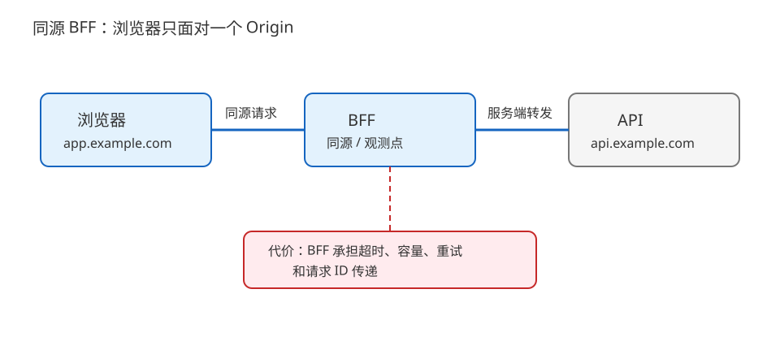
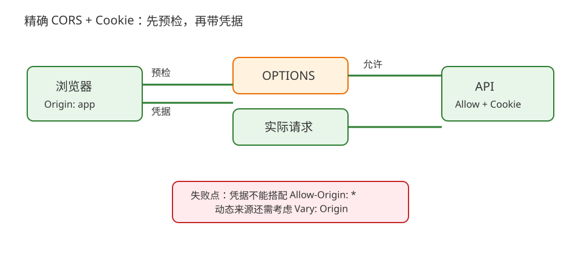
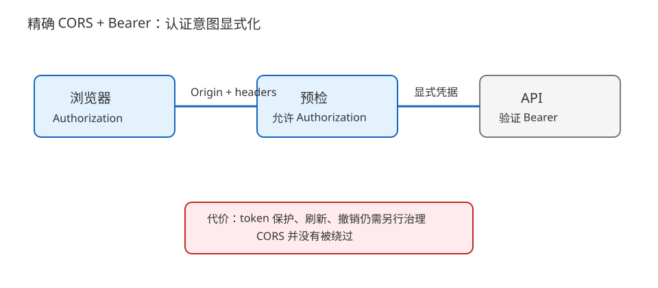

# 场景 1：跨源登录接口既要带身份又要可控（经典设计题）

**场景描述**：前端运行在 `https://app.example.com`，订单 API 在 `https://api.example.com`。登录后，浏览器请求订单列表时需要带身份；预检 `OPTIONS` 偶发 401，直接用 curl 却返回 200。产品要求允许正式前端，拒绝未知来源，并保留未来迁移域名的空间。下面的 BFF（Backend for Frontend，面向前端的服务端代理）是其中一条候选路线。

**🔒 先自己想 30 秒**：你会把前端和 API 合成同源、精确配置 CORS，还是换成 Authorization？先写下你最担心的安全边界和运维代价。

<details><summary>💡 提示（分层想）</summary>

分别看浏览器同源判断、认证凭据的携带方式、预检与实际请求、缓存按来源区分这四件事。不要先从“把 `Access-Control-Allow-Origin` 改成 `*`”开始。

</details>

<details><summary>📖 展开解法</summary>

### 解法一览

| 解法 | 安全边界 / 联调体验 / 运维复杂度 | 代价 | 适用边界 |
|---|---|---|---|
| 同源 BFF 代理 | 浏览器无跨源读取；前端体验强；服务端多一层 | BFF 要承担转发、超时与观测 | 前端与 API 可由同一平台治理 |
| 精确 CORS + Cookie | 来源控制细；保留 Cookie 会话；网关配置复杂度中 | 预检、凭据、`Vary: Origin` 和多入口必须一起维护 | 浏览器确实需要跨源 API |
| 精确 CORS + Bearer | 凭据显式；服务端接口边界清晰；前端 token 生命周期复杂 | 仍有 CORS；token 泄露后的撤销与刷新要设计 | API 客户端不只一个，或不想依赖 Cookie |

### 各解法详解

#### 解法一：同源 BFF 代理

让浏览器只访问 `app.example.com/api/`，BFF 在服务器侧转发到 API。浏览器的同源问题被收敛到一个入口，Cookie 也只需按同源路径设计。



读图：蓝色路径始终是浏览器到同源 BFF，灰色路径才跨到 API；红框是 BFF 额外承担的超时、重试和观测成本。

```nginx
location /api/ {
    proxy_pass https://api.example.com/;
    proxy_ssl_server_name on;
    proxy_set_header Host api.example.com;
    proxy_set_header X-Request-ID $request_id;
}
```

> 关键是 BFF 不能把用户输入的转发头原样传给 API，也不能把所有上游错误改成 200。它把 CORS 复杂度换成了一层服务的容量、超时和发布责任。
>
> **依据**：[MDN 同源策略](https://developer.mozilla.org/en-US/docs/Web/Security/Same-origin_policy)、[MDN CORS](https://developer.mozilla.org/en-US/docs/Web/HTTP/Guides/CORS)。

#### 解法二：精确 CORS + Cookie

服务端维护来源白名单，预检路径返回允许的方法/头；实际响应也返回具体来源。浏览器调用时明确 `credentials: "include"`，服务端 Cookie 使用与场景匹配的 `Secure`、`HttpOnly`、`SameSite` 和 Path。



读图：预检先验证来源、方法和头，实际请求再携带 Cookie；红框提醒来源动态变化时共享缓存必须按 Origin 区分。

```js
await fetch("https://api.example.com/orders", {
  credentials: "include",
  headers: { "Accept": "application/json" }
});
```

> 服务端不能在凭据场景用 `Access-Control-Allow-Origin: *`；应返回经过白名单校验的具体来源，并按实现需要发送 `Vary: Origin`。最容易失效的地方是只给 OPTIONS 加头，却忘了给实际 200/401/403 响应加头。
>
> **依据**：[WHATWG Fetch CORS protocol](https://fetch.spec.whatwg.org/#http-cors-protocol)、[MDN CORS](https://developer.mozilla.org/en-US/docs/Web/HTTP/Guides/CORS)、[MDN Set-Cookie](https://developer.mozilla.org/en-US/docs/Web/HTTP/Reference/Headers/Set-Cookie)。

#### 解法三：精确 CORS + Bearer

前端显式发送 `Authorization: Bearer …`，API 不依赖浏览器自动带 Cookie。这样认证意图更清楚，也适合移动端或第三方客户端，但 token 生命周期、刷新和撤销必须作为独立设计。



读图：预检声明 `Authorization`，实际请求显式带 Bearer；红框是 token 保护与撤销成本，不会因为换了认证头就自动消失。

```js
await fetch("https://api.example.com/orders", {
  headers: {
    "Authorization": `Bearer ${accessToken}`,
    "Accept": "application/json"
  }
});
```

> 这条路线仍然需要 CORS；它不是“绕过浏览器策略”。不要把长期 token 放进 URL，也不要把服务端是否允许来源与 token 是否有效混成一个 200/403 分支。
>
> **依据**：[RFC 6750 Bearer Token Usage](https://www.rfc-editor.org/rfc/rfc6750.html)、[RFC 9110 §11 Authentication](https://httpwg.org/specs/rfc9110.html#authentication)。

### 替代路线（非本课程技术栈）

| 替代方案 | 思路 | 与本课程解法的差异 |
|---|---|---|
| 服务端渲染表单 | 使用 Rails/Django 等服务端渲染页面，让页面与表单提交保持同源 | 减少浏览器 CORS 面，但牺牲部分前后端分离体验；跨端复用较弱 |
| API Gateway 策略插件 | 由 Kong/Envoy 等网关统一配置来源、认证和预检 | 应用代码更薄，但引入网关插件生命周期与另一套观测面 |

### 推荐路径（递进）

1. 如果前端与 API 可统一入口，先选同源 BFF，减少浏览器策略面。
2. 必须跨源时，先上精确 CORS + Cookie，并为 OPTIONS/实际响应补齐契约测试。
3. 客户端类型扩大或 Cookie 边界不合适时，再评估 Bearer，并单独补 token 生命周期治理。

### 知识点挂钩

- BFF 的同源收敛 → [课 9《代理、网关与 CDN》](../stages/3-缓存与性能/lessons/lesson-09-代理网关与CDN.md) 与 [课 14《CORS 与同源策略》](../stages/5-认证联调与决策/lessons/lesson-14-CORS与同源策略.md)。
- Cookie 路线 → [课 13《Cookie、Session 与 Token》](../stages/5-认证联调与决策/lessons/lesson-13-Cookie会话与Token.md)。
- 401/403 与 Bearer → [课 3《方法与状态码》](../stages/1-报文与语义/lessons/lesson-03-方法与状态码.md)、[课 13](../stages/5-认证联调与决策/lessons/lesson-13-Cookie会话与Token.md)。

### 什么情况下不要用这些方案

强一致的后台管理写接口不能只靠 CORS 白名单保护；CORS 约束浏览器读取，不是服务端授权。真正的权限判断必须在 API 认证/授权层完成。若跨源只是历史域名造成的偶发现象，优先统一入口，不要长期堆白名单。

### 做错会踩的坑

- 预检 401/403 或实际响应缺 CORS 头 → [08-实战经验](../08-实战经验.md) 的故障模式 2。
- 凭据未携带、状态码错位或网关先拦截 → [08-实战经验](../08-实战经验.md) 的故障模式 1。
- 动态来源响应被共享缓存复用 → [08-实战经验](../08-实战经验.md) 的故障模式 3。

</details>
