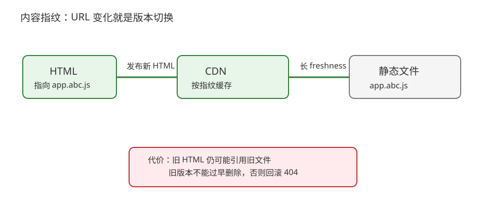
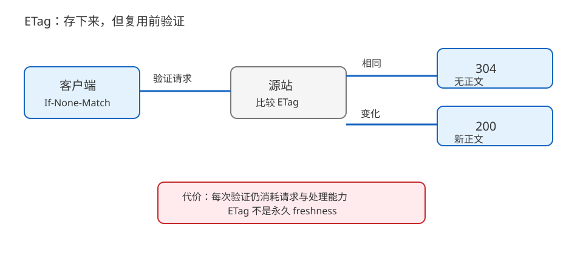
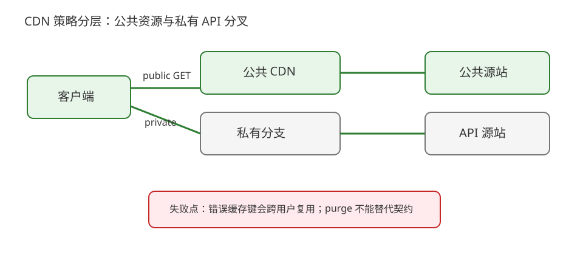

# 场景 2：静态资源发布与 CDN 缓存正确性（经典设计题）

**场景描述**：应用每周发布多次，HTML 入口和 JavaScript/CSS 由 CDN 分发。发布后有用户仍拿到旧 JS，另一些用户却看到新 HTML；API 还包含用户私有数据，不能被共享缓存。团队想要高命中率，但不能用“清空所有缓存”掩盖策略错误。

**🔒 先自己想 30 秒**：哪些资源可以长时间缓存？HTML、带 hash 的 JS、带用户身份的 API，三者的缓存键和失效动作应该一样吗？

<details><summary>💡 提示（按内容生命周期分层）</summary>

先按“内容是否带身份”“URL 是否能随内容变化”“是否接受回源验证”分类，再决定 freshness、ETag、CDN 和发布动作。

</details>

<details><summary>📖 展开解法</summary>

### 解法一览

| 解法 | 发布确定性 / 回源次数 / 运维成本 | 代价 | 适用边界 |
|---|---|---|---|
| 内容指纹 + `immutable` | 版本确定性强；回源少；构建链复杂度中 | 需要 HTML 先指向新文件，旧文件保留一段时间 | JS/CSS/图片等不可变静态文件 |
| ETag 协商缓存 | 内容更新灵活；回源请求有；实现成本低 | 仍承担验证请求和 304 响应 | HTML 或无法改 URL 的资源 |
| CDN 分层策略 + 精确 purge | 命中率高；可控回源；运维策略复杂 | 缓存键、purge、`Vary` 和私有边界需要持续治理 | 公共 GET 资源多、区域用户多 |

### 各解法详解

#### 解法一：内容指纹 + 长缓存

构建产出 `app.abc123.js` 这类内容指纹 URL，HTML 引用新文件；指纹文件可以配长时间 freshness，发布通过改变 HTML 引用切换版本。



读图：HTML 指向新指纹文件，CDN 可以长缓存每个指纹；红框是旧资源不能立刻删除，否则旧 HTML 或回滚会变成 404。

```http
Cache-Control: public, max-age=31536000, immutable
```

> 这条配置只适合 URL 内容不会在 freshness 期间改变的资源。最可能失效的地方是 HTML 没有及时更新、构建产物被覆盖，或发布清理了仍被旧页面引用的文件。
>
> **依据**：[RFC 9111 HTTP Caching](https://httpwg.org/specs/rfc9111.html)、[MDN Cache-Control](https://developer.mozilla.org/en-US/docs/Web/HTTP/Reference/Headers/Cache-Control)。

#### 解法二：ETag 协商缓存

资源可以存入浏览器/CDN，但复用前带 `If-None-Match` 回源验证；没有变化返回 304，变化返回新内容。这是“可存但复用前验证”，不是“完全不缓存”。



读图：第一次是 200，后续请求携带 ETag 进入 304 或新 200；红框是每次验证仍会消耗请求和源站/边缘处理能力。

```http
ETag: "asset-v42"
Cache-Control: public, max-age=0, must-revalidate
```

> ETag 必须代表响应版本，不能只在应用重启时随机变化。若响应随 `Accept-Encoding`、来源或其他请求头变化，还要一起设计 `Vary` 和缓存键。
>
> **依据**：[RFC 9111 §3 Validation](https://httpwg.org/specs/rfc9111.html#validation)、[MDN ETag](https://developer.mozilla.org/en-US/docs/Web/HTTP/Reference/Headers/ETag)。

#### 解法三：CDN 分层策略 + 精确 purge

把公共静态资源与私有 API 分开配置；CDN 对公共 GET 使用明确缓存键，对发布入口执行按 URL/版本的 purge，源站保留可审计的缓存头。



读图：公共静态资源走边缘 HIT，私有 API 直达源站或 private 分支；红框是错误缓存键会造成跨用户复用，purge 也不能替代正确策略。

```text
/public/*  -> public cache key: host + path + query
/api/*     -> private/no-store unless endpoint contract says otherwise
```

> 最可能失效的地方是把所有路径套上同一规则，或只清 CDN 不清浏览器/中间代理。动态响应按 `Origin`、语言、编码等维度变化时，必须明确这些维度是否进 `Vary`/缓存键。
>
> **依据**：[RFC 9111 §4.1 Calculating Cache Keys](https://httpwg.org/specs/rfc9111.html#cache.key)、[MDN Vary](https://developer.mozilla.org/en-US/docs/Web/HTTP/Reference/Headers/Vary)。

### 替代路线（非本课程技术栈）

| 替代方案 | 思路 | 与本课程解法的差异 |
|---|---|---|
| 对象存储静态站点 | 由对象存储版本化发布，前置托管平台负责分发 | 运维组件少，但细粒度 purge、动态回源和复杂缓存键能力较弱 |
| 服务端渲染 + 构建时预渲染 | 把可缓存页面在构建阶段生成，减少运行时 API 组合 | 首屏缓存更简单，但交互性和个性化能力需要另行设计 |

### 推荐路径（递进）

1. 先把私有 API 与公共静态资源分开，禁止错误共享。
2. 静态资源改为内容指纹 + 长缓存；HTML 采用 ETag/短 freshness。
3. 流量和地域足够大时，再引入精确 CDN purge、分层和命中率/错误复用监控。

### 知识点挂钩

- 强缓存、协商缓存与 `Vary` → [课 7《HTTP 缓存》](../stages/3-缓存与性能/lessons/lesson-07-HTTP缓存.md)。
- CDN 公共/私有边界 → [课 9《代理、网关与 CDN》](../stages/3-缓存与性能/lessons/lesson-09-代理网关与CDN.md)。
- 缓存命中与 304 证据 → [课 15《抓包排障与决策清单》](../stages/5-认证联调与决策/lessons/lesson-15-抓包排障与决策清单.md)。

### 什么情况下不要用这些方案

带用户余额、权限或个性化推荐的响应不能因为“GET 可以缓存”就进入共享缓存。强一致写后读场景也不能只靠 CDN purge 保证瞬时一致；应把一致性要求写进接口契约。

### 做错会踩的坑

- 发布后旧内容或用户内容串用 → [08-实战经验](../08-实战经验.md) 的故障模式 3。
- 缓存响应随来源变化却未区分 → [08-实战经验](../08-实战经验.md) 的故障模式 2 和 3。

</details>
