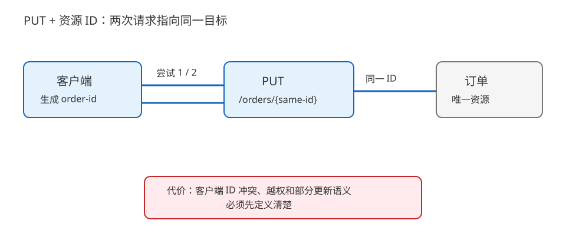
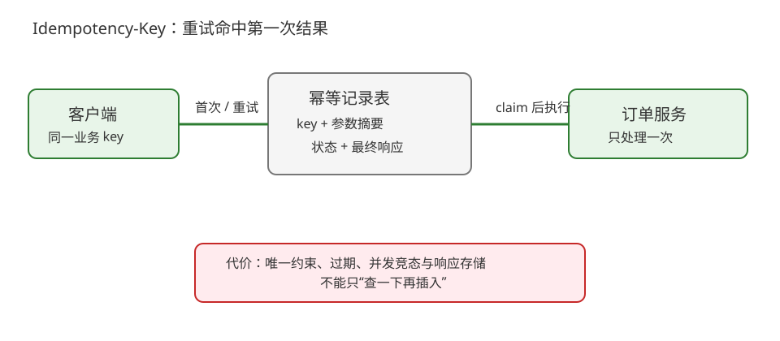
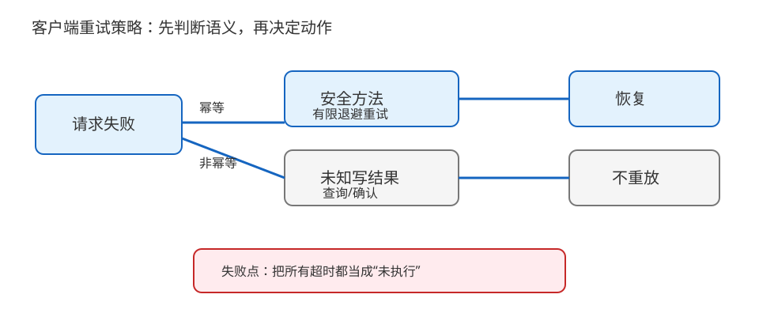

# 场景 3：可重试的写接口如何避免重复下单（经典设计题）

**场景描述**：移动端调用“创建订单”后网络断开，客户端不知道服务端是否已经成功。用户点了重试，偶发生成两笔订单。团队希望保留超时重试带来的可用性，但不能把所有 POST 都无限重放。`Idempotency-Key`（幂等键）是把同一次业务意图标记出来的一种候选机制。

**🔒 先自己想 30 秒**：你会把 POST 改成 PUT、让客户端只重试一次，还是增加一个幂等键？先写出“请求已到达但响应丢失”时服务器必须记住什么。

<details><summary>💡 提示（把“动作”变成“结果”）</summary>

先区分方法语义、资源标识、请求唯一标识和服务端持久状态；再决定哪些失败可重试、重试后应该返回原结果还是新结果。

</details>

<details><summary>📖 展开解法</summary>

### 解法一览

| 解法 | 重试确定性 / 服务端状态 / 接入成本 | 代价 | 适用边界 |
|---|---|---|---|
| PUT + 客户端资源 ID | 语义清楚；状态由资源 ID 定位；改接口成本较高 | 客户端要生成稳定 ID，冲突与权限要处理 | 创建结果可由客户端命名且可重复提交 |
| `Idempotency-Key` 记录表 | 保留 POST 语义；重复请求返回原结果；服务端多一份状态 | 存储、过期、参数一致性和并发锁要治理 | 支付/下单等业务不能轻易换方法 |
| 有边界的客户端重试策略 | 不改服务端契约；接入最快 | 无法证明请求是否已执行，不能单独解决重复写 | 只用于明确安全的方法/错误分支 |

### 各解法详解

#### 解法一：PUT + 客户端资源 ID

客户端先生成订单草稿 ID，以 `PUT /orders/{order_id}` 提交完整目标状态；同一 ID 的重复请求表示“把资源置成同样结果”，服务器返回同一资源状态。



读图：两次网络尝试都落到同一个 order_id；红框是客户端 ID 冲突、越权写入和部分更新语义的设计成本。

```http
PUT /orders/order-client-7f3 HTTP/1.1
Content-Type: application/json

{"items":[{"sku":"example-sku","quantity":1}]}
```

> 这条路线要求服务端真正按 PUT 的幂等语义实现，不能只是把 URL 改名而内部每次都创建新记录。若订单号必须由服务端生成、且创建动作有不可逆副作用，优先考虑下一条路线。
>
> **依据**：[RFC 9110 §9.2.2 Idempotent Methods](https://httpwg.org/specs/rfc9110.html#safe.methods)。

#### 解法二：`Idempotency-Key` 记录表

客户端为一次业务意图生成唯一键；服务端以“租户/用户 + key”作为唯一约束，原子记录请求参数摘要、处理状态和最终响应。重复请求要么等待处理中结果，要么返回第一次结果，参数不一致则拒绝。



读图：第一次请求写入 key 记录并创建订单，重试命中同一记录；红框是记录表过期、并发竞态和响应重放存储成本。

```text
key = tenant_id + ":" + Idempotency-Key
if existing(key) and request_hash != existing.hash: return 409
if existing(key) and existing.done: return existing.response
atomically_claim(key, request_hash)
process_order_once()
store_response(key, response)
```

> `atomically_claim` 必须有数据库唯一约束或等价的原子操作，不能先查再插形成竞态。key 过期时间必须覆盖客户端可能的重试窗口；只存 key、不存参数摘要会让同一 key 被错误复用。
>
> **依据**：[Stripe idempotent requests](https://docs.stripe.com/api/idempotent_requests)、[RFC 9110 §9.2.2 Idempotent Methods](https://httpwg.org/specs/rfc9110.html#safe.methods)；前者是公开 API 的领域实践示例，具体存储与过期策略仍需按业务契约设计。

#### 解法三：有边界的客户端重试策略

客户端仅对明确安全的请求、连接建立失败或可确认的临时错误做有限次数重试，并采用退避；对未知执行结果的非幂等 POST 不自动重放，改为查询订单状态或要求用户确认。



读图：安全分支可以退避重试，未知结果分支转查询；红框是没有幂等契约时自动重放会重复副作用。

```text
if method in {GET, HEAD, PUT, DELETE} and retryable(error):
    retry_with_backoff(limit=2)
elif method == POST and result_is_unknown:
    query_by_business_reference()
else:
    surface_for_confirmation()
```

> 这里的 `PUT/DELETE` 只是规范语义上的幂等候选，具体接口仍要核对实现；“收到 500”也不等于服务端没执行。最可能失效的地方是把所有超时都当成可安全重试。
>
> **依据**：[RFC 9110 §9.2.2 Idempotent Methods](https://httpwg.org/specs/rfc9110.html#safe.methods)、[RFC 9110 §9.2.1 Safe Methods](https://httpwg.org/specs/rfc9110.html#safe.methods)。

### 替代路线（非本课程技术栈）

| 替代方案 | 思路 | 与本课程解法的差异 |
|---|---|---|
| Outbox + 消息队列 | HTTP 只写入待处理意图，由消息系统按事件 ID 去重并异步完成副作用 | 可靠性与吞吐更强，但用户要面对异步状态，组件和运维成本显著增加 |
| 工作流引擎 | 由 Temporal 等工作流记录步骤、重试与补偿 | 补偿语义更完整，但引入平台模型，不再是单次 HTTP 请求的同步契约 |

### 推荐路径（递进）

1. 先限制客户端自动重试，未知结果改为查询，不再无条件重放 POST。
2. 能改资源模型时用 PUT + 稳定 ID；不能改时为关键写接口加入 Idempotency-Key。
3. 跨服务副作用复杂、处理时间长时，再升级到 outbox/工作流，并把异步状态写清楚。

### 知识点挂钩

- 方法幂等与状态码 → [课 3《方法与状态码》](../stages/1-报文与语义/lessons/lesson-03-方法与状态码.md)。
- 连接复用和超时边界 → [课 4《连接管理》](../stages/2-连接与安全/lessons/lesson-04-连接管理与队头阻塞.md)。
- 证据与决策清单 → [课 15《抓包排障与决策清单》](../stages/5-认证联调与决策/lessons/lesson-15-抓包排障与决策清单.md)。

### 什么情况下不要用这些方案

无法定义业务唯一意图、又没有持久化状态的写接口，不应承诺“自动重试一定安全”。对于扣款、发券、发货等不可逆动作，必须先定义去重和查询/补偿，再讨论客户端体验。

### 做错会踩的坑

- 未知执行结果被自动重放 → [08-实战经验](../08-实战经验.md) 的故障模式 1 的证据纪律，以及课程 3.1 的幂等边界。
- 超时、连接复用和响应边界混淆 → [08-实战经验](../08-实战经验.md) 的故障模式 4 和 8。

</details>
