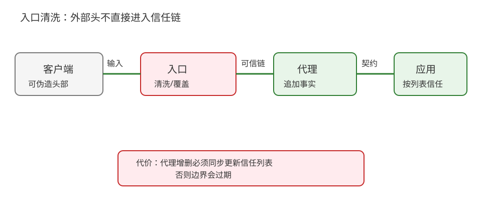
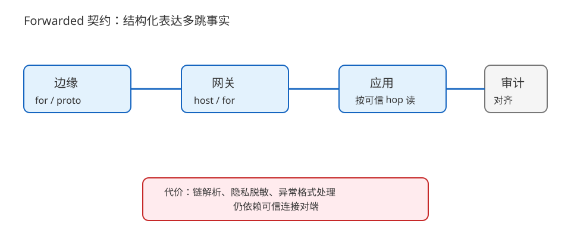
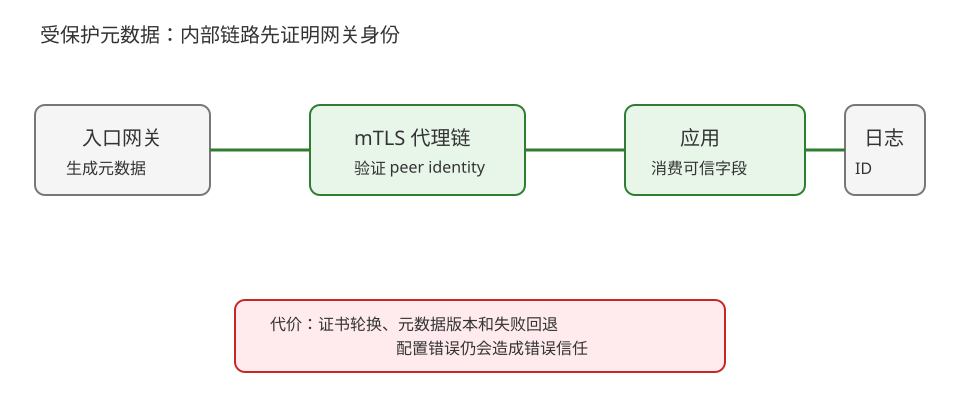

# 场景 4：多层代理下真实 IP 与 scheme 的信任边界（经典设计题）

**场景描述**：用户请求依次经过 CDN、负载均衡和反向代理后到应用。应用要记录真实客户端地址、生成 HTTPS 重定向、做限流和审计。现在客户端只要自带 `X-Forwarded-For`，日志 IP 和限流键就会变化；某些请求还被应用误判为 HTTP。mTLS（mutual TLS，双向 TLS）是后文用于保护内部代理链的一条较重路线。

**🔒 先自己想 30 秒**：哪一跳负责删除外部转发头？应用能否无条件相信最后一个 IP？“用户从 HTTPS 进入”这个事实应该由谁证明？

<details><summary>💡 提示（先画信任拓扑）</summary>

列出每一跳的连接对端、是否可信、头部是覆盖还是追加，再决定应用解析规则。头部名字本身不是信任凭证。

</details>

<details><summary>📖 展开解法</summary>

### 解法一览

| 解法 | 可审计性 / 部署耦合 / 改造成本 | 代价 | 适用边界 |
|---|---|---|---|
| 入口清洗 + 可信代理列表 | 边界清楚；拓扑耦合中；改造低 | 代理增删必须同步应用信任列表 | 拓扑稳定、团队能维护契约 |
| 标准 `Forwarded` 契约 | 字段语义统一；解析复杂度中；跨团队沟通较好 | 多层链解析与隐私脱敏要做严谨 | 需要表达 proto/host/for 等多维事实 |
| 网关签名元数据 / mTLS 内部链 | 伪造难；运维与证书成本高；改造高 | 证书轮换、失败回退和跨区拓扑复杂 | 高风险审计、零信任或多租户平台 |

### 各解法详解

#### 解法一：入口清洗 + 可信代理列表

边缘入口先删除客户端提供的转发头，再按约定追加真实对端；应用只信任来自明确代理网段/连接的链，并同时记录 socket 对端地址。



读图：外部头部在红色清洗点被丢弃，蓝色链由可信代理生成；红框是拓扑变化时信任列表过期的运维风险。

```text
edge:  delete incoming X-Forwarded-For / Forwarded
edge:  append client_observed_address
app:   trust forwarded values only from configured proxy hop
app:   log peer_address + parsed_client_address
```

> 关键不是“取第一个/最后一个 IP”的口诀，而是先确定哪些 hop 可信。最可能失效的地方是新加了一层代理却没有更新信任契约，或应用被绕过代理直接暴露。
>
> **依据**：[RFC 7239 Forwarded HTTP Extension](https://www.rfc-editor.org/rfc/rfc7239.html)、[MDN X-Forwarded-For](https://developer.mozilla.org/en-US/docs/Web/HTTP/Reference/Headers/X-Forwarded-For)。

#### 解法二：标准 `Forwarded` 契约

各可信代理按 RFC 7239 追加 `for`、`proto`、`host` 等结构化字段；应用只接受来自可信 hop 的链，并对未知/格式异常值拒绝解析或降级为对端地址。



读图：链上的每个可信 hop 追加自己的事实，应用按拓扑边界读取；红框是链过长、格式异常与隐私泄露的解析成本。

```http
Forwarded: for=192.0.2.10;proto=https;host=app.example.com
```

> 示例地址是文档保留地址。`Forwarded` 不是加密证明，是否可信仍来自连接对端和代理契约；公开日志还要考虑地址脱敏与保留期限。
>
> **依据**：[RFC 7239 Forwarded HTTP Extension](https://www.rfc-editor.org/rfc/rfc7239.html)、[MDN Forwarded](https://developer.mozilla.org/en-US/docs/Web/HTTP/Reference/Headers/Forwarded)。

#### 解法三：网关签名元数据 / mTLS 内部链

入口网关把真实地址、原始 scheme 和请求 ID 写入受保护的内部元数据，代理到应用之间用 mTLS；应用验证来自网关的身份后才接受这些字段。



读图：网关生成元数据并通过受保护链路交给应用；红框是证书轮换和网关不可用时的复杂回退，不是免费的安全开关。

```text
gateway -> {client_address, original_proto, request_id, expiry}
gateway --mTLS--> proxy --mTLS--> app
app verifies peer identity before consuming metadata
```

> 这条路线降低了“用户直接伪造头”的风险，但不自动解决错误网关配置；元数据仍需版本、过期和字段白名单。它适合高风险审计，不应为普通单代理服务无条件引入。
>
> **依据**：[RFC 8446 TLS 1.3](https://www.rfc-editor.org/rfc/rfc8446.html) 的双向认证机制与 [RFC 5280 PKIX](https://www.rfc-editor.org/rfc/rfc5280.html)；这里把 mTLS 作为平台级替代能力，具体实现不属于本课程正文。

### 替代路线（非本课程技术栈）

| 替代方案 | 思路 | 与本课程解法的差异 |
|---|---|---|
| Service mesh 身份与遥测 | 由 Istio/Envoy sidecar 维护 mTLS、身份和可观测元数据 | 应用少解析头，但引入 sidecar、控制面与新故障域 |
| 直接 L4 透传 | 让应用看到 TCP 对端，TLS 在应用终止 | 保留底层地址更直接，但失去边缘 HTTP 路由、缓存与统一 TLS 终止能力 |

### 推荐路径（递进）

1. 先建立拓扑表，入口清洗外部头，应用记录 peer 与解析地址。
2. 多团队/多层代理时统一 `Forwarded` 或等价头部契约，并做伪造头回归。
3. 审计风险与拓扑复杂到需要强身份时，再引入 mTLS/签名元数据。

### 知识点挂钩

- 代理、网关、转发头 → [课 9《代理、网关与 CDN》](../stages/3-缓存与性能/lessons/lesson-09-代理网关与CDN.md)。
- 认证与 scheme 判断 → [课 13《Cookie、Session 与 Token》](../stages/5-认证联调与决策/lessons/lesson-13-Cookie会话与Token.md)。
- 内部 TLS 信任与证书边界 → [课 5《HTTPS：明文的三大威胁与加密原理》](../stages/2-连接与安全/lessons/lesson-05-HTTPS加密原理.md)、[课 6《证书与信任》](../stages/2-连接与安全/lessons/lesson-06-证书与信任.md)。
- 多层证据对齐 → [课 15《抓包排障与决策清单》](../stages/5-认证联调与决策/lessons/lesson-15-抓包排障与决策清单.md)。

### 什么情况下不要用这些方案

不能把用户自报 IP 用作唯一认证因子；也不能把“来自内网”简单等同于“可信”。若应用必须在不可信网络中直接暴露，优先使用真正的认证/加密身份机制，而不是增加更多可伪造头部。

### 做错会踩的坑

- 用户提交的转发头影响日志、限流或权限 → [08-实战经验](../08-实战经验.md) 的故障模式 5。
- 错误 scheme 触发认证/重定向分支 → [08-实战经验](../08-实战经验.md) 的故障模式 1。

</details>
