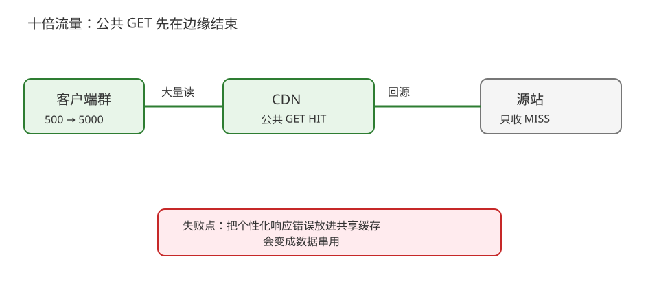
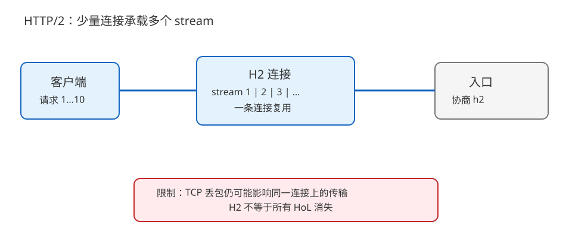
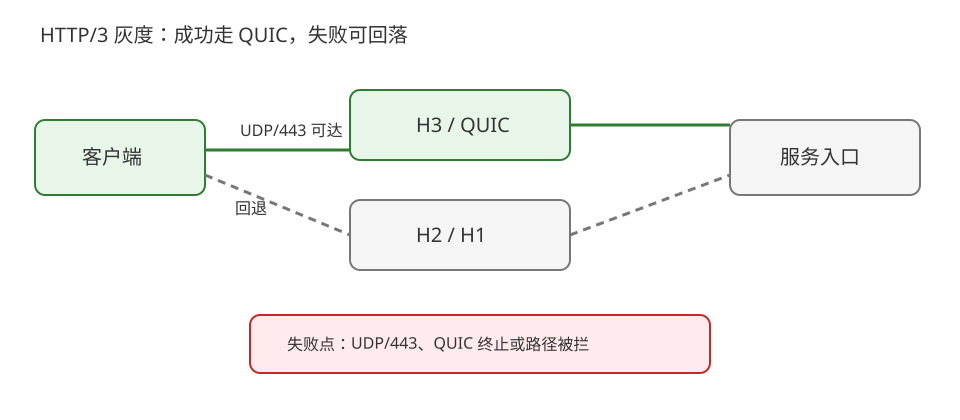

# 场景 5：流量放大十倍后的连接、缓存与协议选择（规模压力题）

**场景描述**：活动开始后，公开商品详情 GET 从每秒 500 次升到 5000 次，登录后的个性化接口也同步上涨。当前每个请求都新建连接，静态资源没有边缘缓存；团队提议“全站切 HTTP/3”。你需要先恢复容量，再判断哪些请求值得升级协议。

**🔒 先自己想 30 秒**：哪些请求可以在边缘消化？哪些请求必须到源站？连接复用、HTTP/2 多路复用和 HTTP/3 各自解决哪一段问题？

<details><summary>💡 提示（先分请求，再分瓶颈）</summary>

先按公共/私有、读/写、可缓存/不可缓存分流；再用 Timing 和最终协商协议确认瓶颈是连接建立、源站计算、下载，还是 UDP 路径。

</details>

<details><summary>📖 展开解法</summary>

### 解法一览

| 解法 | 源站卸载 / 延迟收益 / 复杂度 | 代价 | 适用边界 |
|---|---|---|---|
| CDN 缓存公共 GET | 源站卸载强；命中请求延迟低；缓存治理中 | purge、缓存键和隐私边界必须正确 | 内容公共且允许短暂 freshness |
| 连接复用 + HTTP/2 | 握手/连接开销下降；并发流更好；改造低到中 | TCP 丢包仍会影响连接上的流；连接池/代理需验证 | 大量小请求、客户端与入口支持 H2 |
| HTTP/3 灰度 + H2/H1 回退 | 移动/丢包路径有潜在收益；发布复杂 | UDP/443、QUIC、观测和回退成本高 | 有真实网络证据且入口可灰度 |

### 各解法详解

#### 解法一：先把公共 GET 放到 CDN

商品图片、带内容版本的静态资源和可共享的公开详情优先在边缘缓存；个性化价格、库存和用户接口保持 private/no-store 或明确的短缓存契约。



读图：公共 GET 在边缘 HIT，只有 MISS 回源；红框是错误缓存键或把个性化响应放进共享缓存会造成数据泄露/错误复用。

```text
/catalog/public/* -> CDN: public cache, versioned key
/user/*            -> private/no-store unless contract says otherwise
```

> 最可能失效的地方是把“读接口”一概视为可共享，或只看命中率不看错误复用。先证明响应不含用户维度，再谈提高 TTL。
>
> **依据**：[RFC 9111 HTTP Caching](https://httpwg.org/specs/rfc9111.html)、[MDN HTTP caching](https://developer.mozilla.org/en-US/docs/Web/HTTP/Guides/Caching)。

#### 解法二：连接复用 + HTTP/2

客户端和入口协商 H2 后，在少量长连接上并发多个 stream；减少反复 TCP/TLS 握手，同时避免 HTTP/1.1 为了并行而开大量连接。



读图：多个请求共享一条 H2 连接并以 stream 区分；红框提醒 TCP 层丢包仍可能影响该连接的传输，H2 不是“所有 HoL 消失”。

```bash
curl --http2 -v https://example.com/catalog/item -o /dev/null
```

> 协议升级不是容量魔法：源站计算慢、缓存错误和数据库锁不会因为 H2 自动消失。应先用 Timing、协商协议和源站指标证明连接建立是主要成本。
>
> **依据**：[RFC 9113 HTTP/2](https://httpwg.org/specs/rfc9113.html)、[Chrome DevTools Network](https://developer.chrome.com/docs/devtools/network/)。

#### 解法三：HTTP/3 灰度并保留回退

为支持的入口提供 H3/QUIC，按区域、客户端和网络逐步放量；H3 失败时保留 H2/H1。监控最终协商协议、回落率、TTFB 和错误率，而不是只监控“开关已打开”。



读图：绿色路径是成功的 QUIC/H3，灰色路径是可靠回退；红框是 UDP/443 不可达或 QUIC 终止配置不一致时的失败点。

```text
if h3_success_rate and fallback_rate meet observed thresholds:
    increase canary share
else:
    keep h2/h1 as default and inspect the path
```

> 不要把“移动网络可能受益”写成必然收益。H3 的收益取决于真实路径；若服务端 TTFB 仍占大头，先处理应用/上游。
>
> **依据**：[RFC 9114 HTTP/3](https://httpwg.org/specs/rfc9114.html)、[RFC 9000 QUIC](https://www.rfc-editor.org/rfc/rfc9000.html)。

### 替代路线（非本课程技术栈）

| 替代方案 | 思路 | 与本课程解法的差异 |
|---|---|---|
| Anycast/L4 边缘负载均衡 | 用更靠近用户的四层入口和容量池吸收连接与流量 | 更偏网络基础设施，应用无需理解 HTTP 缓存，但 HTTP 语义卸载较少 |
| 专用边缘计算平台 | 在边缘执行鉴权、聚合或轻量逻辑 | 源站卸载更强，但引入平台运行时、数据一致性与发布模型 |

### 推荐路径（递进）

1. 先分离公共与私有流量，并让公共 GET 通过正确的 CDN 缓存。
2. 再复用连接并协商 H2，测量连接建立、TTFB、下载与源站容量。
3. 有区域化证据后灰度 H3；任何阶段都保留 H2/H1 回退。

### 知识点挂钩

- Keep-Alive、连接复用和队头边界 → [课 4《连接管理》](../stages/2-连接与安全/lessons/lesson-04-连接管理与队头阻塞.md)。
- CDN 与共享缓存 → [课 9《代理、网关与 CDN》](../stages/3-缓存与性能/lessons/lesson-09-代理网关与CDN.md)。
- H2/H3 选择 → [课 11《HTTP/2 与多路复用》](../stages/4-协议演进/lessons/lesson-11-HTTP2与多路复用.md)、[课 12《HTTP/3 与 QUIC》](../stages/4-协议演进/lessons/lesson-12-HTTP3与QUIC.md)。

### 什么情况下不要用这些方案

不要为了“十倍流量”把个性化接口直接放进共享 CDN，也不要在没有协商、回落和区域证据时强制 H3。若主要耗时来自数据库或业务计算，HTTP 层优化只能减轻入口成本。

### 做错会踩的坑

- 公共/私有缓存边界错误 → [08-实战经验](../08-实战经验.md) 的故障模式 3。
- H3 失败没有回退 → [08-实战经验](../08-实战经验.md) 的故障模式 6。
- 总耗时未拆分就升级协议 → [08-实战经验](../08-实战经验.md) 的故障模式 4。

</details>
