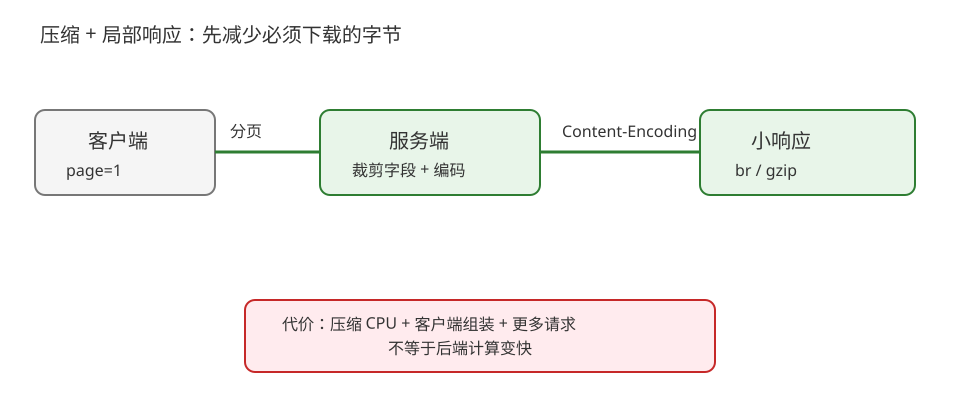
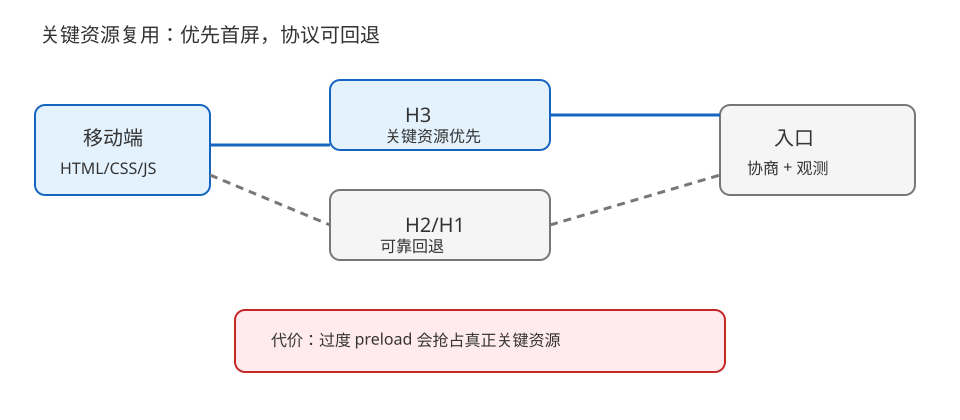
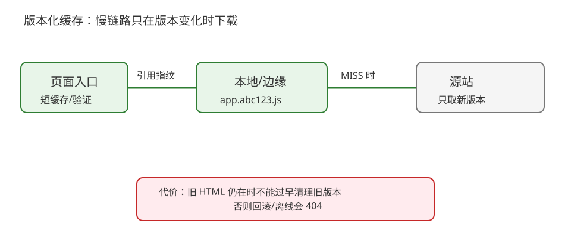

# 场景 6：移动弱网下的大响应与协议回退（规模压力题）

**场景描述**：移动端在高延迟、偶发丢包的网络中打开商品页，响应体从 200 KB 增长到 2 MB 后，首屏明显变慢；某些运营商访问 H3 失败，另一些网络反而比 H2 更快。你要同时控制字节量、缓存和协议回退，不能只给一个“换 H3”的答案。

**🔒 先自己想 30 秒**：先减字节、先缓存、先拆接口，还是先升级协议？如果 UDP/443 被拦，用户还能不能完成核心任务？

<details><summary>💡 提示（把“能完成任务”放在第一位）</summary>

先定义核心首屏与非核心资源，再区分响应大小、首字节、协议协商和回退失败；每条优化都要有旧路径可用。

</details>

<details><summary>📖 展开解法</summary>

### 解法一览

| 解法 | 字节削减 / 实现成本 / 一致性 | 代价 | 适用边界 |
|---|---|---|---|
| 压缩 + 分页/局部响应 | 字节削减强；改造中；语义可控 | 客户端组装与压缩 CPU 成本 | 大 JSON、列表和非首屏数据 |
| H2/H3 多路复用 + 关键资源优先 | 连接开销低；并发请求体验好；调度复杂度中 | 优先级不是后端变快；H3 要回退 | 多资源页面与高延迟链路 |
| 内容指纹缓存 + 离线/边缘副本 | 重复访问字节成本低；缓存命中高；一致性治理中 | 旧版本保留、失效与离线数据边界 | 可版本化静态资源、非敏感内容 |

### 各解法详解

#### 解法一：压缩 + 分页/局部响应

先让接口只返回首屏需要的字段和页数，再按客户端支持协商 gzip/br 等内容编码；图片与大字段不和首屏 JSON 捆绑。



读图：服务端先裁剪业务响应再编码，客户端只取当前页；红框是压缩 CPU 与分页后客户端多次请求的成本。

```http
GET /catalog?page=1&page_size=20 HTTP/1.1
Accept-Encoding: br, gzip
```

> 压缩解决传输字节，不解决源站生成 2 MB JSON 的计算，也不保证所有客户端都支持同一种编码。必须确认响应 `Content-Encoding`、解码能力和压缩后的实际字节。
>
> **依据**：[RFC 9110 §8.4 Content Codings](https://httpwg.org/specs/rfc9110.html#content.codings)、[MDN Accept-Encoding](https://developer.mozilla.org/en-US/docs/Web/HTTP/Reference/Headers/Accept-Encoding)。

#### 解法二：H2/H3 多路复用与关键资源优先

让 HTML、关键 CSS/JS 和图片请求复用连接；只对真正影响首屏的资源使用 preload 等提示，非关键资源延后。H3 作为可灰度路径，失败时回到 H2/H1。



读图：关键资源先走复用连接，H3 失败沿灰色路径回落；红框是过度 preload、连接共享受丢包影响和回退观测成本。

```http
Link: </app.abc123.js>; rel=preload; as=script
```

> preload 不是“越多越快”，错误提示会抢占真正关键资源。HTTP/2 仍受 TCP 层传输影响，HTTP/3 也不是所有网络必达；要用真实 Timing 和协商结果评价。
>
> **依据**：[RFC 9113 HTTP/2](https://httpwg.org/specs/rfc9113.html)、[RFC 9114 HTTP/3](https://httpwg.org/specs/rfc9114.html)、[WHATWG HTML preload](https://html.spec.whatwg.org/multipage/links.html#link-type-preload)。

#### 解法三：内容指纹缓存 + 边缘/离线副本

静态 JS、CSS、图像采用内容指纹 URL，浏览器和边缘可长缓存；页面入口短缓存或验证，客户端只在版本变化时下载新资源。需要离线能力时，Service Worker 等浏览器能力另行设计，不把它当成 HTTP 缓存的替代品。



读图：同一指纹资源命中本地/边缘，不再走慢链路；红框是旧版本清理过早会让旧 HTML 变成 404，离线副本还要处理版本一致性。

```http
Cache-Control: public, max-age=31536000, immutable
```

> 仅对内容确实不可变的 URL 使用长缓存；用户数据、权限响应和频繁更新的入口不可套同一策略。
>
> **依据**：[RFC 9111 HTTP Caching](https://httpwg.org/specs/rfc9111.html)、[MDN Cache-Control](https://developer.mozilla.org/en-US/docs/Web/HTTP/Reference/Headers/Cache-Control)。

### 替代路线（非本课程技术栈）

| 替代方案 | 思路 | 与本课程解法的差异 |
|---|---|---|
| 原生客户端专用协议/资源包 | 由原生 App 使用版本化二进制资源包和专用传输层 | 可做更强的端侧缓存和压缩，但失去 Web 的直接可达性，发布与兼容矩阵更重 |
| 服务端渲染/预渲染 | 在服务端生成更小的首屏 HTML，交互资源按需加载 | 首屏可控，但动态交互与缓存失效边界要重新设计 |

### 推荐路径（递进）

1. 先测响应体、TTFB 和协议，裁剪字段、分页并启用正确内容编码。
2. 再按关键路径整理资源，复用连接并控制 preload 数量。
3. 可版本化静态资源使用指纹长缓存；最后按真实网络灰度 H3，并保留 H2/H1 回退。

### 知识点挂钩

- 内容编码与分段耗时 → [课 8《性能测量与优化》](../stages/3-缓存与性能/lessons/lesson-08-性能测量与优化.md)。
- 强缓存、协商缓存与资源版本 → [课 7《HTTP 缓存》](../stages/3-缓存与性能/lessons/lesson-07-HTTP缓存.md)。
- 复用、多路复用与回退 → [课 4《连接管理》](../stages/2-连接与安全/lessons/lesson-04-连接管理与队头阻塞.md)、[课 11](../stages/4-协议演进/lessons/lesson-11-HTTP2与多路复用.md)、[课 12](../stages/4-协议演进/lessons/lesson-12-HTTP3与QUIC.md)。

### 什么情况下不要用这些方案

不能把带权限的 API 响应做成公共长缓存，也不能把 preload 当成后端性能修复。若核心问题是服务端 TTFB，先进入应用/数据库 profiling；若 H3 回退失败，先保证 H2/H1 能完成核心任务。

### 做错会踩的坑

- 总耗时没有拆段、只凭感觉换协议 → [08-实战经验](../08-实战经验.md) 的故障模式 4。
- 内容版本与缓存失效错配 → [08-实战经验](../08-实战经验.md) 的故障模式 3。
- HTTP/3 没有可靠回退 → [08-实战经验](../08-实战经验.md) 的故障模式 6。

</details>
