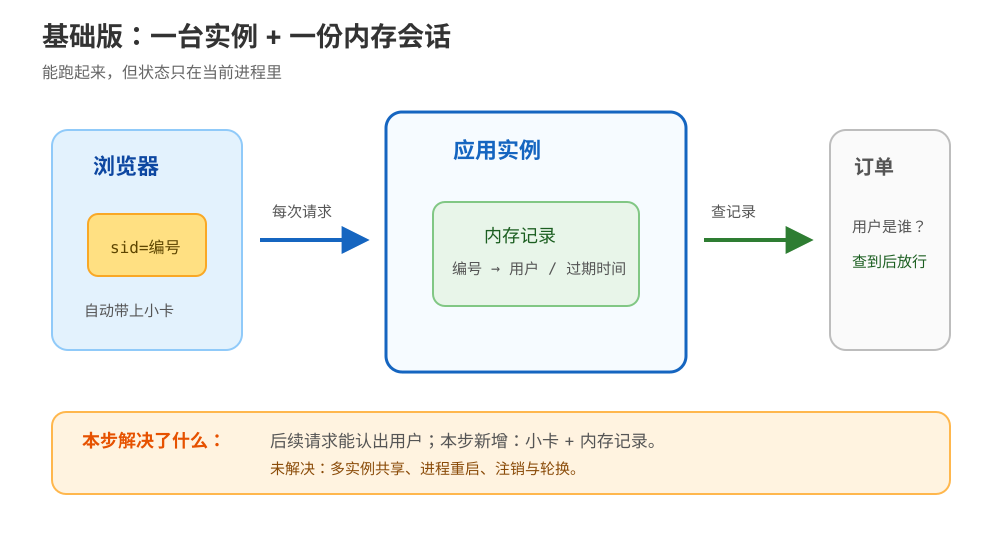
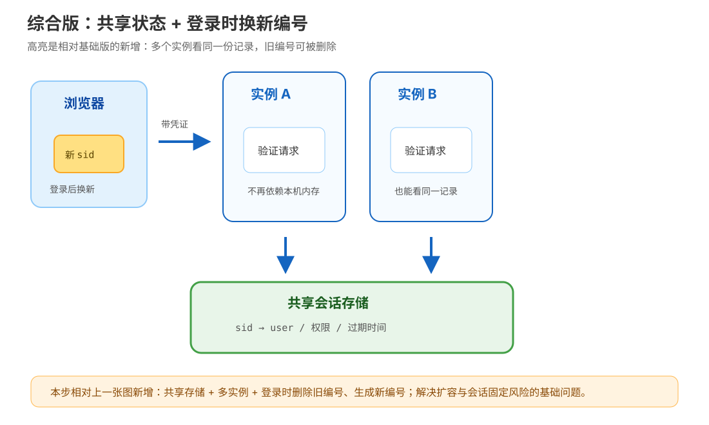

# 应用实战 · Cookie、Session 与 Token

> 对应课程：[第 13 课：Cookie、Session 与 Token：让无状态记住你](../stages/5-认证联调与决策/lessons/lesson-13-Cookie会话与Token.md) ｜ 覆盖知识点：13.1 Cookie 机制与安全属性、13.2 Session 与 Token 两条路线、13.3 HTTP 认证头
> 定位：**会用，不上生产**——跟着一个登录接口从“先跑起来”演进到“能治理”。这里不展开数据库、OAuth 授权服务器、密钥托管和完整前端框架。
> 📖 结论已按官方文档核对（核查于 2026-09｜来源：[MDN Cookies](https://developer.mozilla.org/en-US/docs/Web/HTTP/Guides/Cookies)、[MDN Session management](https://developer.mozilla.org/en-US/docs/Web/Security/Authentication/Session_management)、[RFC 9110](https://www.rfc-editor.org/rfc/rfc9110.html)）

## 场景：一个登录接口要服务多次请求

**场景**：订单后台有 `POST /login` 和 `GET /orders`。登录成功后，后续请求必须知道用户是谁；开发阶段先追求最短闭环，下一步再处理多实例、注销和凭证轮换。

**全貌一句话**：完整方案还需要用户目录、密码哈希、CSRF 防护、密钥管理、审计、限流和多实例共享存储；本篇只演示本课三个知识点在认证链路中的组合。

## ① 基础实现：内存 Session + HttpOnly Cookie



> 看图：这一版只有一个应用实例；浏览器带一个不透明的会话 ID，应用用它查本机内存里的用户记录。

下面是 Flask 风格的最小示意代码。它是教学代码，不是生产登录实现：密码校验、CSRF、持久化和部署配置都被省略。

```python
from datetime import datetime, timedelta, timezone
import secrets

from flask import Flask, jsonify, make_response, redirect, request

app = Flask(__name__)
SESSION_STORE = {}
SESSION_TTL = timedelta(minutes=30)


def create_session(user_id: str) -> str:
    sid = secrets.token_urlsafe(32)
    SESSION_STORE[sid] = {
        "user_id": user_id,
        "expires_at": datetime.now(timezone.utc) + SESSION_TTL,
    }
    return sid


@app.post("/login")
def login():
    # 教学简化：实际应用要调用密码哈希校验，不要明文比较密码。
    user_id = "user-001"
    sid = create_session(user_id)
    response = make_response(jsonify(ok=True))
    response.set_cookie(
        "sid",
        sid,
        max_age=int(SESSION_TTL.total_seconds()),
        path="/",
        secure=True,
        httponly=True,
        samesite="Lax",
    )
    return response


@app.get("/orders")
def orders():
    sid = request.cookies.get("sid")
    session = SESSION_STORE.get(sid)
    if not session or session["expires_at"] <= datetime.now(timezone.utc):
        return redirect("/login", code=302)
    return jsonify(user_id=session["user_id"], orders=[])
```

这段代码体现三个点：Cookie 只携带 `sid`；真正的用户状态在 `SESSION_STORE`；响应明确设置 `Secure`、`HttpOnly`、`SameSite=Lax` 和生命周期。`secure=True` 也意味着本地若直接用普通 HTTP 调试，浏览器可能不会带上它，需要用 HTTPS 本地环境或在实验时明确接受开发环境差异。

> ⚠️ **它的问题**：
>
> 1. 两个应用实例各有一份 `SESSION_STORE`，同一个用户可能在实例 A 登录、被实例 B 判成未登录。
> 2. 进程重启会清空所有会话；这对演示很方便，对真实用户却意味着集体掉线。
> 3. 示例还没有注销端点和会话 ID 轮换；若登录前已有攻击者诱导出的旧 ID，就不能把“登录成功”与“换新 ID”混为一谈。

## ② 综合实现：共享会话、登录时轮换、标准 401



> 看图：比基础版新增了共享会话存储、多个应用实例和登录时的旧 ID 删除 / 新 ID 生成；请求不再依赖某一个进程的内存，缺凭证时还返回可识别的 401。

把“会话存储”抽象成所有实例都能访问的接口，并在登录时建立新会话、删除旧会话：

```python
from datetime import datetime, timedelta, timezone
import secrets

SESSION_TTL = timedelta(minutes=30)


def create_rotated_session(shared_store, user_id: str, old_sid: str | None) -> str:
    # shared_store 可以由多个实例共同访问；具体产品不在本篇展开。
    new_sid = secrets.token_urlsafe(32)
    shared_store.set(
        new_sid,
        {
            "user_id": user_id,
            "expires_at": datetime.now(timezone.utc) + SESSION_TTL,
        },
        ttl_seconds=int(SESSION_TTL.total_seconds()),
    )
    if old_sid:
        shared_store.delete(old_sid)
    return new_sid


def require_session(request, shared_store, access_token_verifier):
    sid = request.cookies.get("sid")
    session = shared_store.get(sid) if sid else None
    if not session:
        authorization = request.headers.get("Authorization", "")
        scheme, separator, access_token = authorization.partition(" ")
        if scheme.lower() == "bearer" and separator:
            # access_token_verifier 由已审计的认证库包装而来；无效返回 None。
            session = access_token_verifier.verify(access_token, audience="orders-api")
    if not session:
        response = make_response({"error": "authentication_required"}, 401)
        response.headers["WWW-Authenticate"] = 'Bearer realm="orders-api"'
        return None, response
    return session, None


def logout(request, response, shared_store):
    sid = request.cookies.get("sid")
    if sid:
        shared_store.delete(sid)
    response.set_cookie("sid", "", max_age=0, path="/", secure=True, httponly=True, samesite="Lax")
    return response
```

这里的 `shared_store` 是接口名，示意“所有实例看同一份会话状态”，不是让你直接复制一个未选型的存储产品；`access_token_verifier` 也只是已审计认证库的注入接口，不能自行手写 JWT 验签。`make_response` / `request.cookies` / `response.set_cookie` 沿用 Flask 风格；真实项目应按所用框架的响应对象写法调整。

如果同一系统还要给非浏览器客户端提供接口，可以让它走 `Authorization: Bearer <ACCESS_TOKEN>`。这并不意味着“Bearer 就是 JWT”：Bearer 是认证方案，令牌格式和撤销策略仍要单独决定。无论采用 Session 还是 Token，都应避免把完整凭证写入日志。

> 🎯 **会用标志**：能画出“凭证载体 → 状态归属 → 认证 / 授权结果”的链路；能解释为什么基础版在多实例和注销场景下会失效；能在请求缺凭证时返回 401 + `WWW-Authenticate`，并说清下一步是补认证而不是盲目重试。

## 🧭 导航

- ⬅️ 回到课程：[第 13 课：Cookie、Session 与 Token：让无状态记住你](../stages/5-认证联调与决策/lessons/lesson-13-Cookie会话与Token.md)
- 📚 全部实战：[应用实战索引](INDEX.md)
- ➡️ 下一课：[第 14 课：CORS 与同源策略：浏览器的一票否决](../stages/5-认证联调与决策/lessons/lesson-14-CORS与同源策略.md)
