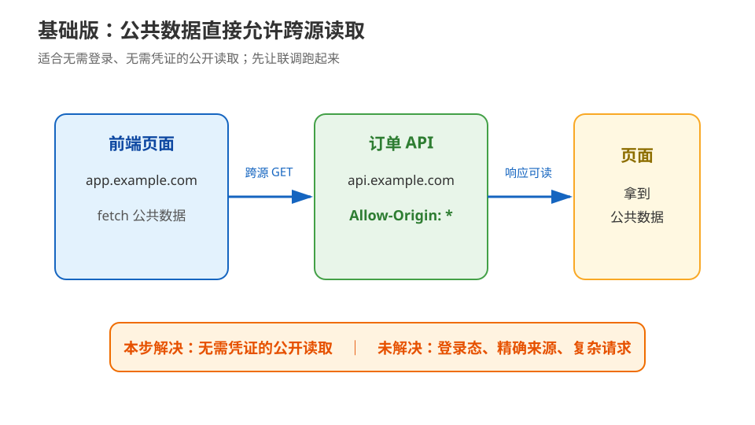
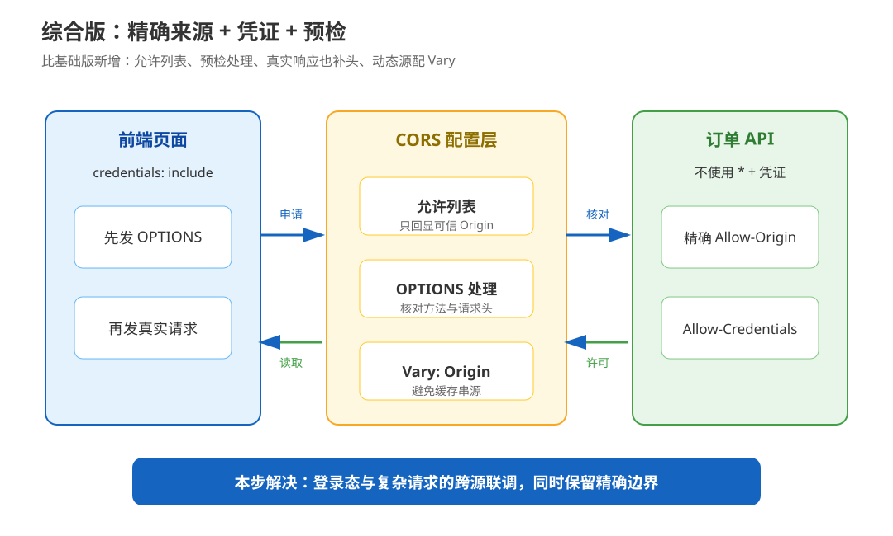

# 应用实战 · CORS 与同源策略

> 对应课程：[第 14 课：CORS 与同源策略：浏览器的一票否决](../stages/5-认证联调与决策/lessons/lesson-14-CORS与同源策略.md) ｜ 覆盖知识点：14.1 同源策略、14.2 CORS 机制、14.3 高频 CORS 报错排查
> 定位：**会用，不上生产**——跟着一个订单 API 从“先让公开数据能读”演进到“精确来源、凭证和预检都能对账”。不展开完整认证服务、CSRF 防护、密钥托管和生产网关部署。
> 📖 结论已按官方文档核对（核查于 2026-09｜来源：[MDN CORS 指南](https://developer.mozilla.org/en-US/docs/Web/HTTP/Guides/CORS)、[WHATWG Fetch Standard](https://fetch.spec.whatwg.org/#http-cors-protocol)）

## 场景：前端页面调用订单 API

**场景**：前端页面从 `https://app.example.com` 加载，订单 API 在 `https://api.example.com`。页面先要读取公开商品数据，后来又要带登录态创建订单；两种请求的跨源条件不同，不能用一个 `*` 配置包打天下。

**全貌一句话**：完整方案还需要用户认证、CSRF 防护、Origin 配置管理、网关行为、缓存策略和监控告警；本篇只演示本课的“源 → 预检 → 许可响应”链路。

## ① 基础实现：公共数据用通配符放行



> 看图：这一版只有页面和 API，API 对公共数据返回 `Access-Control-Allow-Origin: *`；它适合不依赖用户凭证的读取。

```python
from flask import Flask, jsonify

app = Flask(__name__)


@app.get("/products")
def products():
    response = jsonify(items=[])
    # 仅用于无需登录、无需 Cookie/Authorization 的公共读接口。
    response.headers["Access-Control-Allow-Origin"] = "*"
    return response
```

前端可以直接读取公共结果：

```js
fetch("https://api.example.com/products")
  .then(response => response.json())
  .then(console.log);
```

> ⚠️ **它的问题**：
>
> 1. 页面如果改为 `credentials: "include"`，`*` 不能与凭证式跨源读取搭配。
> 2. 任何来源都能读取这份公共响应；如果接口后来加入用户数据，原配置不再表达最小权限。
> 3. 真实订单创建通常会带 JSON 和 `Authorization`，浏览器可能先发 `OPTIONS`；只处理 `POST` 不代表预检能通过。

## ② 综合实现：精确来源、凭证与预检



> 看图：比上一张图新增了允许列表、预检处理和 `Vary: Origin`；页面先申请 `POST` + 请求头，API 核对后才让真实请求和响应通过。

先把允许的页面源收敛为显式列表，并让所有响应在可信源命中时带上基础 CORS 头：

```python
from flask import Flask, jsonify, make_response, request

app = Flask(__name__)
ALLOWED_ORIGINS = {"https://app.example.com"}
ALLOWED_METHODS = {"POST"}
ALLOWED_HEADERS = {"authorization", "content-type"}


def cors_headers(origin: str) -> dict[str, str]:
    if origin not in ALLOWED_ORIGINS:
        return {}
    return {
        "Access-Control-Allow-Origin": origin,
        "Access-Control-Allow-Credentials": "true",
        "Vary": "Origin",
    }


@app.after_request
def add_cors_headers(response):
    origin = request.headers.get("Origin", "")
    for name, value in cors_headers(origin).items():
        response.headers[name] = value
    return response


@app.route("/orders", methods=["OPTIONS", "POST"])
def orders():
    origin = request.headers.get("Origin", "")
    if request.method == "OPTIONS":
        requested_method = request.headers.get("Access-Control-Request-Method", "").upper()
        requested_headers = {
            item.strip().lower()
            for item in request.headers.get("Access-Control-Request-Headers", "").split(",")
            if item.strip()
        }
        if (
            origin not in ALLOWED_ORIGINS
            or requested_method not in ALLOWED_METHODS
            or not requested_headers <= ALLOWED_HEADERS
        ):
            return make_response("preflight denied", 403)

        response = make_response("", 204)
        response.headers["Access-Control-Allow-Methods"] = "POST, OPTIONS"
        response.headers["Access-Control-Allow-Headers"] = "authorization, content-type"
        response.headers["Access-Control-Max-Age"] = "60"
        return response

    # 教学简化：真实应用还要完成认证、授权、输入校验和 CSRF 防护。
    return jsonify(ok=True, order_id="demo-001")
```

页面侧对应地声明要带凭证：

```js
fetch("https://api.example.com/orders", {
  method: "POST",
  credentials: "include",
  headers: {
    "Authorization": "Bearer <ACCESS_TOKEN>",
    "Content-Type": "application/json"
  },
  body: JSON.stringify({ item_id: "demo-001" })
});
```

这里有三个值得跟着代码对账的点：

1. `after_request` 让 200、401、403 等实际响应共享同一套“可信源”逻辑，避免只给成功分支加头。
2. `OPTIONS` 只检查来源、方法和请求头，不把预检当成业务创建订单；预检请求本身不携带凭证。
3. 返回具体源而不是 `*`，并配 `Vary: Origin`，避免动态源响应被共享缓存当成所有源都可复用。

> 🎯 **会用标志**：能从一次失败请求中指出它属于“源不匹配、预检未放行、实际响应缺头，还是代理/缓存改写”；能把公共接口的 `*` 配置和凭证式订单接口的精确允许列表分开。

## 🧭 导航

- ⬅️ 回到课程：[第 14 课：CORS 与同源策略：浏览器的一票否决](../stages/5-认证联调与决策/lessons/lesson-14-CORS与同源策略.md)
- 📚 全部实战：[应用实战索引](INDEX.md)
- ➡️ 下一课：[15 · 抓包排障与决策清单：课程收束](../stages/5-认证联调与决策/lessons/lesson-15-抓包排障与决策清单.md)；结课综合项目：[HTTP 请求诊断实验场](../projects/HTTP请求诊断实验场/README.md)
