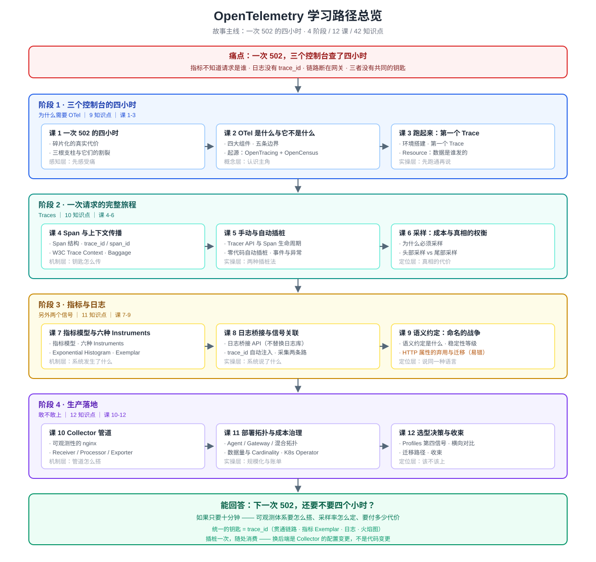
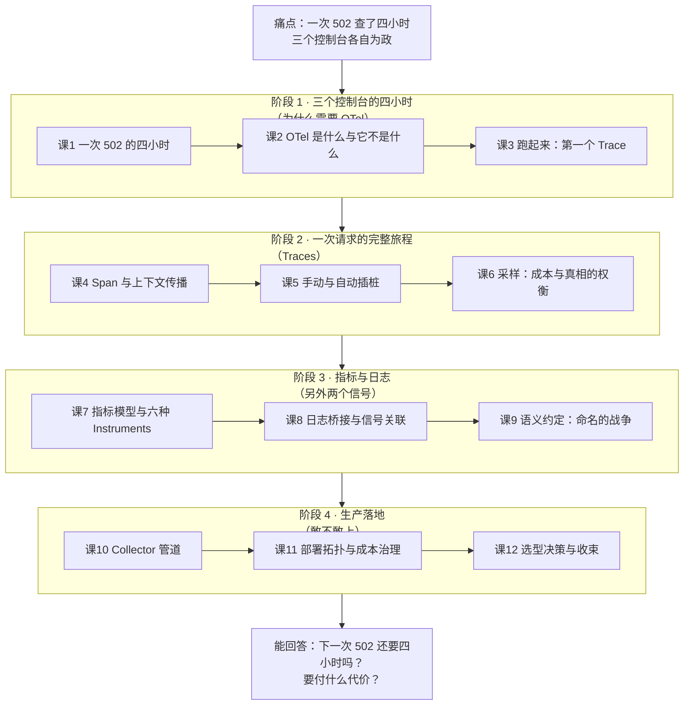

# OpenTelemetry 学习路径总览

> 活文档：本文件随学习进度动态调整，每次调整记录到 `00-学习档案.md` 的「大纲调整记录」。

---

## 学习目标

学完本系列，你应该能够：

1. **说清** OTel 解决什么问题、不解决什么问题（而不是只会背"可观测性标准"这个词）
2. **用起来**：能在本机用 Python 插桩出链路、指标、日志三信号，跑通 Collector 管道并送到后端看板
3. **判断**：面对一个新系统，能说出"该怎么设计可观测体系、采样率怎么定、成本大概多少、代价是什么"

---

## 故事主线

> ### 一次 502 的四小时
>
> **主角**：一个用户点「下单」后发出的 HTTP 请求。
>
> **冲突（三个控制台）**：支付服务返回 502。三个值班工程师围在屏幕前：
> - 打开 Prometheus —— CPU 正常、内存正常、QPS 有个小毛刺，看不出所以然
> - 打开 Jaeger —— 链路断在网关，后面的 span 一片空白，不知道调用到了谁
> - 打开 ELK —— 只有一行 `timeout`，没有 `trace_id`，没法反查是哪次请求
>
> 三个控制台来回切换，复制粘贴 ID，猜、试、回滚、再试。**四小时后**终于定位：是下游一个连接池打满导致的连锁超时。
>
> **为什么会这么慢？** 不是工程师不行，是三个信号**各自为政**：指标不知道请求是谁，日志不知道属于哪条链路，链路不知道代码里哪一行慢。三者之间没有共同的钥匙。
>
> **转折**：OTel 提供了这把共同的钥匙 —— `trace_id`。它同时做三件事：
> 1. **统一插桩**：一套 API 出三种信号，换后端不改代码
> 2. **统一协议**：OTLP 成为可观测性的 HTTP
> 3. **统一上下文**：`trace_id` 贯通链路、指标（Exemplar）、日志，甚至火焰图
>
> **收束**：学完 12 课，你能回答那个可衡量的大问题——
> *"下一次 502，还要不要四个小时？如果只要十分钟，我的可观测体系要怎么搭、要付多少代价？"*

---

## 全阶段总览

| 阶段 | 名称（故事章节） | 目标 | 重点 | 课 | 知识点 |
|------|-----------------|------|------|----|----|
| **1** | 三个控制台的四小时 （"为什么需要 OTel"） | 理解它想消灭的痛点，并跑通第一条链路 | 碎片化代价、OTel 定位、起源与生态现状、环境搭建、第一个 Trace | 课1-3 | 9 |
| **2** | 一次请求的完整旅程 （"Traces"） | 掌握最成熟信号的完整机制 | Span 结构、trace_id/span_id、W3C 上下文传播、Baggage、手动/自动插桩、采样权衡 | 课4-6 | 10 |
| **3** | 指标与日志 （"另外两个信号"） | 补齐另外两个信号，并理解命名的战争 | Instruments 全家桶、Exponential Histogram、Exemplar、日志桥接、语义约定与弃用迁移、Cardinality | 课7-9 | 11 |
| **4** | 生产落地 （"敢不敢上"） | 把它从玩具变成可投产的方案 | Collector 管道、Processor 治理、部署拓扑、成本治理、K8s Operator、Profiles、选型与迁移 | 课10-12 | 12 |

**合计**：4 阶段 / 12 课 / 42 知识点

> 各阶段知识点数分布（2026-09-02 大纲评审后确认）：3+3+3 / 4+3+3 / 4+3+4 / 4+3+4 = 9+10+11+12 = 42。

---

## 阶段依赖图

Mermaid 兜底版（SVG 无法渲染时查看）

---

## 各阶段详解

### 阶段 1：三个控制台的四小时（"为什么需要 OTel"）

**章节定位**：故事的开场。先让你真实感受"三个信号各自为政"的代价，再介绍主角登场，最后亲手跑通第一条链路。

| 课 | 名称 | 知识点 | 状态 |
|----|------|--------|------|
| 课1 | 一次 502 的四小时 | 碎片化的真实代价 / 三根支柱与它们的割裂 | ✅ |
| 课2 | OTel 是什么与它不是什么 | 一句话定义与四大组件 / 五条边界 / 起源与合并 / 生态现状与版本基线 | ✅ |
| 课3 | 跑起来：第一个 Trace | 环境搭建 / 第一个 Trace / Resource | ✅ |

**阶段出口**：能在本机跑通一条完整的 Trace 并在 Jaeger 上看到它；能说清 OTel 解决什么、不解决什么。

---

### 阶段 2：一次请求的完整旅程（"Traces"）

**章节定位**：主角获得"被追踪"的能力。拆开看：一次请求是怎么被切成 span、上下文是怎么跨服务传递的。

| 课 | 名称 | 知识点 | 状态 |
|----|------|--------|------|
| 课4 | Span 与上下文传播 | Span 结构 / trace_id 与 span_id / W3C Trace Context / Baggage | ✅ |
| 课5 | 手动与自动插桩 | Tracer API 与生命周期 / 零代码自动插桩 / Span 事件与异常 | ✅ |
| 课6 | 采样：成本与真相的权衡 | 为什么必须采样 / 头部采样 / 尾部采样 | ✅ |

**阶段出口**：能解释一次跨服务请求为什么能串成一条链路；能根据业务场景选择合适的采样策略并说出代价。

---

### 阶段 3：指标与日志（"另外两个信号"）

**章节定位**：主角获得"量化"与"叙事"的能力。指标告诉你系统发生了什么，日志告诉你系统说了什么——而它们都要挂回同一把钥匙。

| 课 | 名称 | 知识点 | 状态 |
|----|------|--------|------|
| 课7 | 指标模型与六种 Instruments | 指标模型 / 六种 Instruments / **Exponential Histogram** / Exemplar | ✅ 2026-09-03 |
| 课8 | 日志桥接与信号关联 | 日志桥接 API / `trace_id` 自动注入 / 采集两条路径 | ✅ 2026-09-03 |
| 课9 | 语义约定：命名的战争 | 语义约定是什么 / **HTTP 属性的弃用与迁移** / 稳定性等级 / Cardinality 爆炸 | ✅ 2026-09-03 |

**阶段出口**：能为服务设计一套指标 + 日志方案，并让它们与链路互相跳转。

---

### 阶段 4：生产落地（"敢不敢上"）

**章节定位**：故事收束。信号都有了，现在回答最难的问题——怎么规模化、怎么控制成本、以及下一次 502 还要多久。

| 课 | 名称 | 知识点 | 状态 |
|----|------|--------|------|
| 课10 | Collector 管道 | Collector 的角色 / Receiver-Processor-Exporter / 脱敏过滤富化 / 稳定性与发行版 | ✅ |
| 课11 | 部署拓扑与成本治理 | Agent 与 Gateway / 数据量与 Cardinality / K8s 与 Operator | ✅ |
| 课12 | 选型决策与收束 | Profiles 第四信号 / 横向对比 / 迁移路径 / 收束 | ✅ 2026-09-04 |

**阶段出口**：能给出一份可观测体系建设方案，含 Collector 配置、采样策略、成本估算与回退路径。

---

## 收尾产物（学完全部知识点后）

| 产物 | 定位 |
|------|------|
| `projects/` 结课实战项目 | 跨 4 阶段整合的可运行工程（**✅ 已完成 2026-09-04**，见 [projects/capstone/README.md](./projects/capstone/README.md)） |
| `final-课程手册.md` | **✅ 已完成 2026-09-04**，见 [final-课程手册.md](./final-课程手册.md)——12 课 + 结课实战项目汇总手册，含故事主线与四条伏笔、全局速查七表、**九个静默失败**、**31 条环境陷阱速查**、四阶段速览、**16 条易混点对照表**、决策清单、全部产物索引 |
| `08-实战经验.md` | **✅ 已完成 2026-09-04**，见 [08-实战经验.md](./08-实战经验.md)——学习态实战经验：9 条反模式 + **10 个故障模式五段式**（症状→根因→排查路径→修复→预防）+ 30 项上线 Checklist |
| `09-排障速查手册.md` | **✅ 已完成 2026-09-04**，见 [09-排障速查手册.md](./09-排障速查手册.md)——使用态 QRH：**17 个症状**（现象/紧急度/翻到）+ 每症状「步骤/动作/预期」+ 三条排障原则 |
| `10-场景解法库.md` | **✅ 已完成 2026-09-04**，见 [10-场景解法库.md](./10-场景解法库.md)——设计态：**10 个场景**按落地时序排列，每场景五段式 + 三条跨场景设计原则 |

---

## 版本基准

> 本系列涉及**三套各自独立演进的版本号**，引用时务必区分（核查于 2026-09）。

| 组件 | 版本 | 发布日期 | 说明 |
|------|------|----------|------|
| **OTel 规范（Specification）** | **v1.56.0** | 2026-04-21 | 定义 API / SDK / OTLP 的跨语言要求 |
| **Collector Contrib** | **v0.159.0** | 2026-08-17 | 100+ 组件发行版；core 版组件精简 |
| **OTLP 协议** | **v1.11.0** | 2026-07-21 | protobuf 定义与 wire format |
| **Python SDK** | **1.44.0** | 2026-07-16 | 支持 Python 3.10+（3.9 已在 1.42.0 起移除） |
| **Jaeger / Prometheus** | 后端组件，**课 3 已实测补录**：Jaeger **v2.20.0**（2026-07-20 构建，内部 OTel Collector v0.155.0），镜像名 v1→v2 已由 `all-in-one` 改为 `jaeger` | 已补录 |

**关键里程碑**：

- 2019-05：OpenTracing + OpenCensus 合并，OTel 成为 CNCF sandbox 项目
- 2021-01：规范 v1.0.0，Tracing API/SDK 稳定
- 2022 / 2023：Metrics、Logs 陆续稳定（**注意：规范层稳定 ≠ 各语言 SDK 都已稳定**）
- 2026-05：**CNCF 毕业**（Graduated），与 Kubernetes、Prometheus 同级
- 2026-03-26：**Profiles 进入 public alpha**（第四信号）
- 2026-09-04：**复核确认 Profiles 仍为 Alpha** —— 官方规范页与概念页均标注 `Status: Alpha`，状态变更记录停留 2026-03-23（`#9457`），**原定「2026 Q3 GA」未兑现**；各语言 SDK 无一 Stable（Go=Beta、Java/Python=Development、其余 `-`）。**不要用于关键生产负载**

**⚠️ 三条最容易搞错的约定**：

1. **"Logs 已稳定"是错的** —— 规范层 Logs 已 Stable，但 Python / JS 的 Logs SDK 仍是 Development，Go 是 Beta。说"稳定"必须指明是哪一层。
2. **三套版本号互不相干** —— 规范 1.56、Collector 0.159、Python SDK 1.44，别互相推导。
3. **HTTP 属性大批弃用** —— `http.method` / `http.status_code` / `http.url` 已弃用，新名见课 9。
4. **Profiles 的 Alpha 状态与另三个信号不是一回事** —— 2026-09-04 复核仍为 Alpha 且 Q3 GA 未兑现；二手文章称「已 Beta / GA 目标 Q4」与官方一手来源冲突，**以官方页面为准**（详见课 12 事实核查表）。

---

## 实操环境说明

| 项 | 值 |
|---|---|
| 主机 | Windows 11 |
| 实操环境 | WSL Ubuntu 24.04.4 |
| 容器 | Docker 29.4.1（可用） |
| 插桩语言 | **Python 3.12.3** + uv |
| 未安装 | Node.js / Java（**涉及这些语言的示例会标注为参考，不作实操要求**） |
| 2026-09-04 变更 | **WSL 已装 Go 1.26.8 + bcc 0.29.1**（课 12 为验证 pprof 无损互转与 eBPF 剖析所装）。按运行环境约定第 3 条硬纪律，安装前本应征询——**此处补记，请确认是否保留**：保留则后续可做 Go 插桩与 eBPF 剖析演示，删除则不影响已交付的课 12 讲义结论 |

> 若你希望改用 Go / Node.js 作为实操语言，请说明——需先安装对应工具链，我不会擅自改动你的环境。
