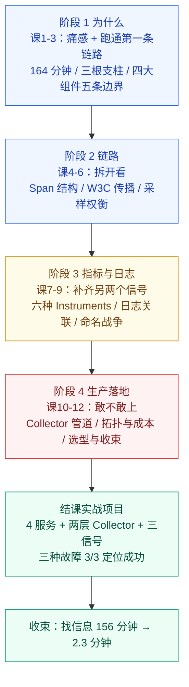

# OpenTelemetry 系统学习 · 课程手册

> 全课程汇总手册：4 阶段 / 12 课 / 42 知识点 + 1 个结课综合实战项目 + 收尾三件套
> 版本基准：规范 **v1.56.0**（2026-04-21） / Collector Contrib **v0.159.0**（2026-08-17，本机实跑 **0.160.0**） / OTLP **v1.11.0**（2026-07-21） / Python SDK **1.44.0**（2026-07-16）
> 后端基准：Jaeger **v2.20.0** / Prometheus **v2.53.0**
> 环境基准：Windows 11 + WSL Ubuntu 24.04（内核 6.6.87.2）+ Docker 29.4.1；插桩语言 Python 3.12.13 + uv 0.11.6
> 数据基准：全部实测数字来自 2026-09 本机实跑，**看量级与倍数关系，不要当固定常量背**

**导航**

| 想干什么 | 去哪 |
|----------|------|
| 快速回忆某课讲了什么 | [阶段 1](#阶段-1--三个控制台的四小时) / [2](#阶段-2--一次请求的完整旅程) / [3](#阶段-3--指标与日志) / [4](#阶段-4--生产落地) |
| 忘了某个数字（字节数 / 倍数 / 耗时） | [全局速查](#全局速查最容易忘的硬数字) |
| 数据"发了却查不到" | [九个静默失败](#全课程最值钱的一条主线九个静默失败) |
| 命令在本机跑不通 | [本机环境陷阱速查](#本机环境陷阱速查31-条) |
| 出事了要止血 | `09-排障速查手册.md`（待产出） |
| 想搞懂为什么会踩坑 | `08-实战经验.md`（待产出） |
| 新需求不知道怎么设计 | `10-场景解法库.md`（待产出） |
| 想看完整的工程交付 | [结课综合实战项目](#结课综合实战项目) |
| 该不该上 OTel / 怎么配 | [决策清单](#决策清单该不该上--怎么配) |

**收尾三件套（别混着用）**

- **学习态** `08-实战经验.md` —— 会踩什么坑、为什么会踩（待产出）
- **使用态** `09-排障速查手册.md` —— 出错了怎么止血（QRH 式，按症状倒查）（待产出）
- **设计态** `10-场景解法库.md` —— 新要求来了怎么设计（多解法权衡）（待产出）

---

## 怎么读这份手册

| 你现在的状态 | 从这里读起 |
|--------------|-----------|
| 学完了，想复习 | [故事主线](#故事主线一次-502-的四小时) → 按阶段速览每课的「一句话结论」 |
| 忘了某个数字 | [全局速查](#全局速查最容易忘的硬数字) |
| 数据发了却查不到 | [九个静默失败](#全课程最值钱的一条主线九个静默失败) —— 这是全课程第一方法论 |
| 要搭一套可观测栈 | [结课综合实战项目](#结课综合实战项目) → [决策清单](#决策清单该不该上--怎么配) |
| 命令跑不通 | [本机环境陷阱速查](#本机环境陷阱速查31-条) —— 31 条全是被真实卡住过的 |
| 要给别人讲 | 故事主线的 mermaid 图 + [九个静默失败](#全课程最值钱的一条主线九个静默失败) |

这份手册**不引入新内容**——每一条结论、每一个数字都能在 12 课讲义、结课实战项目或四处档案里找到出处。它的价值在于把散在 12 课里的东西压成一张可检索的网。

---

## 故事主线：一次 502 的四小时

- **主角**：一个用户点「下单」后发出的 HTTP 请求
- **冲突**：支付服务返回 502。三个工程师在 Prometheus（CPU 正常，看不出所以然）、Jaeger（链路断在网关，后面一片空白）、ELK（只有一行 `timeout`，没有 `trace_id`）之间来回切换、复制粘贴 ID、猜、试、回滚
- **根因**：不是工程师不行，是三个信号**各自为政**——指标不知道请求是谁，日志不知道属于哪条链路，链路不知道代码里哪一行慢。三者之间没有共同的钥匙
- **转折**：OTel 提供这把钥匙 `trace_id`，同时做三件事——统一插桩（一套 API 出三种信号）、统一协议（OTLP）、统一上下文
- **收束**：下一次 502，还要不要四个小时？



### 四条贯穿全课程的伏笔

**伏笔一：静默失败（课 3 → 课 12，共九个）**

课 3 发现 `force_flush()` 在五种错误配置下**全部返回 `True`** 但数据全丢，由此确立全课程第一方法论：**唯一可信判据是后端**。此后每一课都撞见新形态——课 5 缺 distro 静默零数据、课 7 给 Counter 传负数只打 WARNING、课 9 弃用属性连 warning 都没有、实战项目里 Provider 覆盖被拒只打一行日志。**OTel 倾向于用 warning 而不是异常来处理"你不该这么做"的调用**，所以"程序没报错"永远不能作为成功的证据。完整清单见[下一节](#全课程最值钱的一条主线九个静默失败)。

**伏笔二：规范稳定 ≠ SDK 稳定 ≠ 插桩稳定（课 2 提出，三次回应）**

课 2 讲成熟度必须按「信号 × 语言」逐格查；课 7 撞见 Python 的规范外第 7 个 `create_gauge`；课 8 撞见 `import opentelemetry.sdk.logs` 直接 `ModuleNotFoundError`（只有私有的 `_logs`）；课 9 撞见本机 `semconv 0.65b0`——**版本号里的 `b0` 就是 beta**，且落后官方一个版本。**"Logs 已稳定"这句话必须指明是哪一层**，否则必错。

**伏笔三：测量工具自己会骗人（课 6 → 课 8 → 实战项目）**

课 6 第一版分流实验因同进程二次 `set_tracer_provider` 被拒，得到「两边 0 条」的**自洽假结论**；课 8 排查 exemplar 恒为 0 耗时 **11 轮**，前八轮做"加法"全败，C9 改为"复制课 7 脚本做减法"才定位到 `InMemoryMetricReader` 的 exemplar 是**一次性**的——`force_flush()` 会把它消费掉；**实战项目第三次撞见**：Top-3 span 排序把父子重叠的入口 span（`POST /checkout` 2616 ms）排在最前，差点漏判 N+1。

三处的共同结构：**你看到的"异常"其实是测量方式造出来的，不是被测系统的。**

> 📌 **三条方法论**（课 8 提炼，全课程通用）：① **复制原脚本做减法**，远优于重写脚本做加法；② **所有变量排除后结论仍不变时，怀疑观测方式本身**；③ 前人的结论没错，**错的是你这一轮的测量姿势**。

**伏笔四：三套版本号互不相干（课 2 提出，反复救命）**

规范（1.56）、Collector（0.159 / 本机 0.160）、Python SDK（1.44）各自独立演进，别互相推导。课 10 还补了一条：组件稳定性是**按「组件 × 信号」逐个标注**的，查本机实际值用 `docker run --rm  components`，凭记忆必错。

---

## 全局速查：最容易忘的硬数字

> 全部实测于 2026-09 本机环境。**看量级与倍数关系，别当固定常量背。**

### 版本基线

| 项目 | 实测值 | 出处 |
|------|--------|------|
| OTel 规范 | **v1.56.0**（2026-04-21） | 路径总览 / 课 2 |
| Collector Contrib | 基准 **v0.159.0**（2026-08-17），**本机实跑 0.160.0** | 路径总览 / 课 10 |
| OTLP 协议 | **v1.11.0**（2026-07-21） | 路径总览 |
| Python SDK | **1.44.0**（2026-07-16），支持 Python 3.10+ | 路径总览 |
| 本机 semconv 包 | **0.65b0**（`b0` = beta），对应 schema **1.43.0**，**落后官方 main（v1.44.0）一个版本** | 课 9 |
| Jaeger | **v2.20.0**（内部 Collector v0.155.0）；镜像名 v1→v2 从 `all-in-one` 改为 `jaeger`，v1 已于 2025-12-31 EOL | 课 3 |
| Prometheus | **v2.53.0** | 实战项目 |
| CNCF 状态 | **2026-05-21 毕业**（与 Kubernetes、Prometheus 同级） | 课 2 |
| Profiles 第四信号 | ⚠️ **2026-09-04 复核仍为 `Status: Alpha`**，Q3 GA **未兑现**；Go=Beta、Java/Python=Development、其余为 `-`，**无任何语言 Stable** | 课 12 |

> ⚠️ **"Logs 已稳定"是错的**：规范层 Logs 已 Stable，但 Python / JS 的 Logs SDK 仍是 Development，Go 是 Beta。说"稳定"必须指明是哪一层。

### 数据量与成本

| 项目 | 实测值 | 出处 |
|------|--------|------|
| 每 trace 字节（4-span 订单链路） | **616.7 bytes**（154.2 bytes/span） | 课 6 |
| 每 span 字节（成本模型校准值） | 模型取 **600 B**；实测未压缩 **959 B**（191,868 B ÷ 200 条） | 课 11 |
| 1000 RPS 全量采集 | **49.6 GB/天 = 17.7 TB/年** | 课 6 |
| 治理 vs 不治理（300 服务规模） | 相差 **200 倍** | 课 11 |
| 采样率倒推公式 | `rate = 日预算字节 / (RPS × 86400 × bytes_per_trace)` | 课 6 |

### 采样

| 项目 | 实测值 | 出处 |
|------|--------|------|
| 同批 300 条（100 错误 / 100 慢 600ms / 100 普通）保留数 | **纯尾部**：错误 100、慢 100、普通 8 ｜ **纯头部 10%**：11 / 12 / 10 ｜ **head 10% + tail**：11 / 12 / **0** | 课 6 |
| 头尾串联的真相 | head 已丢的 90% 根本走不到 Collector，tail 只能在残羹里挑。**要用尾部采样，SDK 必须 `always_on`** | 课 6 |
| 指标是否受采样影响 | **指标永不采样**。10000 次请求、采样率 0.1%：span 仅 11 条，`count` 仍 **10000**，exemplar 仅 **1** 条 | 课 7 |
| 判断 span 是否被采样 | 用 `trace_flags & 0x01`。**`is_recording()` 在 `end()` 后恒为 `False`**；老教程的 `if flags == "01"` 在 1.44.0 上会全部误判（实测为 `03`） | 课 4 / 课 6 |

### 指标与 Cardinality

| 项目 | 实测值 | 出处 |
|------|--------|------|
| P99 精度（5 场景 × 10000 样本） | 显式桶最坏 **−50.0%**（E 场景 20s 被砍成 10s，且方向是**低估**，监控上看起来还行，**最危险**）；指数桶最坏 **−2.2%** | 课 7 |
| Exponential Histogram 自适应 | 窄区间场景 scale 自动从 3 升到 **8**；E 场景仅 **2 个非空桶**（桶按需分配，不预分配） | 课 7 |
| `UpDownCounter` 的 Prometheus 出口 | 是 **`gauge`** 而非 counter（Prometheus counter 语义必须单调）。加不加 `_total` 取决于「能否减少」而非「是否异步」 | 课 7 |
| Histogram 的序列膨胀 | 一个 Histogram 变 **18 条**序列；与指数桶成本比 **18:1** | 课 7 |
| Cardinality 是乘法 | 5 路由 × 3 状态码 = **15 条**；加 10000 个 `user.id` → **150,000 条**，**放大 10,000 倍**（**倍数恒等于加进去的维度基数**）；5 维推演 15 → 150,000 → 600,000 → **1.2 亿** | 课 9 |
| Cardinality 的另一种实测 | 150 条 span，加一个 `user.id`（50 个值）：Prometheus 序列 **5 → 50**、端点体积 **32 KB → 325 KB** | 课 11 |
| 高基数字段判据 | **能列进一张表的字段才能放进指标标签**：`http.route`（路由模板，低基数）能，`url.path`（真实路径）不能。高基数字段放**日志或链路属性** | 课 9 |

### 语义约定与稳定性

| 项目 | 实测值 | 出处 |
|------|--------|------|
| 官方 `stability:` 字段实际取值（扫描 2772 处） | **development 2262 / stable 260 / release_candidate 231 / experimental 14 / alpha 5**。⚠️ **没有 beta 取值**，`deprecated` 是独立字段不是等级（弃用属性的 stability 被重置为 development） | 课 9 |
| 生命周期级数 | 官方现为**七级**：Development / Alpha / Beta / **Release Candidate** / Stable / Deprecated / Unmaintained。`Experimental` 已于 2023 年更名 `Development`；`Removed` 不是等级 | 课 9 |
| Flask 插桩 5 档实测属性数 | default 档 **13 个属性、11 个是旧名**（数据完全正常）；`http` 档 **10 个全新名**；`http/dup` 档 **22 个**（13 旧 + 9 新）；**`database` 档对 HTTP 属性毫无影响** | 课 9 |
| `OTEL_SEMCONV_STABILITY_OPT_IN` | **分域独立**——`http` 管不了 `database`；弃用属性**不打任何 warning** | 课 9 |
| HTTP 属性迁移 | `http.method`→`http.request.method` ｜ `http.status_code`→`http.response.status_code` ｜ `http.url`→`url.full` ｜ `http.target`→`url.path` + `url.query` | 课 9 |

### 定位与收束

| 项目 | 实测值 | 出处 |
|------|--------|------|
| 课 1 事故总耗时 | **164 分钟**。找信息 **156 分钟（95.1%）**、做决策 **3 分钟（1.8%）**；有效时间占比约 **6%** | 课 1 |
| 有了完整链路后 | 机器侧查询 **33 ms**（课 12 实测 **35.1 ms**）命中根因 | 课 12 / 实战项目 |
| 人工排查总耗时 | 约 **2.3 分钟**（含读结果与做判断），**修复 3 分钟不变**，发布流程另计，端到端通常 **30–60 分钟** | 实战项目 |
| 找信息环节 | **156 分钟 → 2.3 分钟，约 68 倍** | 实战项目 |
| 跨服务对齐 | **35 分钟 → 0**（trace_id 天然打通，无需人工 join）。这是单点最大收益 | 实战项目 |
| 慢 SQL 故障 | 最慢叶子 span Self Time **4225 ms**；`db.rows_scanned=4820000`、`db.index_used=false`；端到端 **4355 ms**（正常 140 ms） | 实战项目 |
| N+1 故障 | `db.query.rule` **×200 累计 2518.8 ms**，占端到端 **96%**；span 总数 **15 → 214**；单次仅 23 ms | 实战项目 |
| 连接池耗尽 | HTTP **502**，Self Time **3019 ms**，`pool_exhausted=true`，`error.type=TimeoutError` | 实战项目 |
| eBPF 零插桩剖析 | 99 Hz 采样 6 秒得 **11,877 样本 / 535 个不同调用栈**；`__x64_sys_clone` kprobe 6 秒捕获 **180 次**命中 | 课 12 |
| pprof ↔ OTLP 无损互转 | 样本 **3→3**、位置 **4→4**、函数 **7→7**、**栈签名差异 0 条**；字节 490→481（省掉冗余填充，非丢失） | 课 12 |

> ⚠️ **不要把「查询快」包装成「故障恢复快」。** 33 ms 是机器查询耗时，不是排查耗时；**修复 3 分钟不变**。可观测性优化的是那个 95%，不是剩下那 3%。

---

## 全课程最值钱的一条主线：九个静默失败

这是 12 课里**唯一值得单独背下来**的东西。它的起点在课 3：五种错误导出配置下，`force_flush()` **全部返回 `True`**、程序退出码为 0，但数据**全部静默丢弃**。由此确立全课程第一方法论——

> **判断成功与否的唯一可信依据是后端，不是程序有没有报错。**

此后每一课都撞见新形态。OTel 倾向于用 **warning 而不是异常**来处理"你不该这么做"的调用，所以"程序没报错"永远不能作为成功的证据。

| # | 课 | 形态 | 表象 | 真实判据 |
|---|----|------|------|---------|
| 1 | 课 3 | `force_flush()` 撒谎 | 5 种错误配置下全返回 `True`、退出码 0 | 查后端 `GET /api/services` |
| 2 | 课 4 | 非法 `traceparent` 被忽略 | 链路断开，但 HTTP 仍 200 | 看下游 `parent_span_id` 有没有值 |
| 3 | 课 5 | 缺 `opentelemetry-distro` | 插桩库照常加载，provider 仍是 `ProxyTracerProvider`、`trace_id=0` | Resource 里有没有 `telemetry.auto.version` |
| 4 | 课 5 | 协议错配 | `OTEL_EXPORTER_OTLP_ENDPOINT=http://localhost:4318` **不会**自动切 HTTP（默认 gRPC），报 `Failed parsing HTTP/2` 但程序照常 200 | 显式设 `OTEL_EXPORTER_OTLP_PROTOCOL=http/protobuf` |
| 5 | 课 6 | 采样器名 / ARG 写错 → **静默回退全量** | `trace_id_ratio` 拼错 → `ParentBased`；`ARG=not-a-number` → `1.0`。省钱配置彻底失效 | 去后端核对实际保留率 |
| 6 | 课 6 | 多副本 Collector 分流 | 一条 trace 的 span 散落多实例，尾部采样看不到全貌，**错误 trace 静默消失**；两个 Collector 日志只有 `Everything is ready` | 用 load balancing exporter 按 trace_id 哈希到同一实例 |
| 7 | 课 7 | 给 Counter 传负数 | 只打一行 WARNING 并丢弃（与缺 distro 是同类"非异常失败"） | 看 SDK 日志 |
| 8 | 课 8 | 导出器成功、Collector 收到、**后端 404 被丢** | Jaeger 对 `/v1/logs` 返回 **404 Unimplemented**（实测 `n_spans=1 / n_logs=0`），应用侧全程无感知 | 查后端实际条数 |
| 9 | 课 9 | 弃用属性**连 warning 都没有** | default 档出 13 个属性、11 个是旧名，数据完全正常；升级插桩库后看板数据少一半才暴露 | 扫描属性名 + `OTEL_SEMCONV_STABILITY_OPT_IN` 切档对比 |

**共同点：每一层都"成功"了，只有最后一层知道数据没了，而它说话的声音传不到你耳朵里。**

### 三类镜像陷阱（同一张表的正反面）

| 陷阱 | 表现 | 为什么危险 |
|------|------|-----------|
| **静默零数据**（课 3 / 5） | 一条都没有 | 你以为在采集，其实什么都没收 |
| **静默全量**（课 6） | 全收了 | 你以为在省钱，其实账单照旧 |
| **静默失真**（课 9 / 实战项目） | 数据正常但被滤掉或排错序 | 曲线光滑连续，看起来完全正常，最难发现 |

> 📌 实战项目补的第四个形态：**Top-3 span 排序把父子重叠的入口 span 排在最前**，差点漏判 N+1。测量工具自己骗人（课 6、课 8 已两次出现）在这里第三次出现。

---

## 本机环境陷阱速查（31 条）

> 全部是在本机真实卡住过的。按来源分四批：**通用 6 条 + 课 10 八条 + 课 11 九条 + 课 12 八条**。

### 通用（6 条）

| # | 陷阱 | 正确做法 |
|---|------|---------|
| 1 | 自动插桩用 HTTP 导出，只设 ENDPOINT 不生效 | 必须显式 `OTEL_EXPORTER_OTLP_PROTOCOL=http/protobuf`（默认 gRPC） |
| 2 | Jaeger 后端按服务名累加，多组实验互相污染 | 每组实验用独立 `service.name`，且查询带 `start` 时间窗 |
| 3 | 用 `is_recording()` 判断采样 | 用 `trace_flags & 0x01`；`is_recording()` 在 `end()` 后恒为 `False` |
| 4 | `import opentelemetry.sdk.logs` | **不存在**。只有私有的 `opentelemetry.sdk._logs`（Logs SDK 仍 Development） |
| 5 | `InMemoryMetricReader` 的 exemplar | **一次性**。`get_metrics_data()` 触发 collect 后 reservoir 清空，`force_flush()` 也触发一次 collect。**读第二次归零** —— 正确姿势：record 后立刻读，读一次，绝不 flush 后读 |
| 6 | `OTEL_SEMCONV_STABILITY_OPT_IN` 一把梭 | **分域独立**，`http` 管不了 `database` |

### 课 10 新增（8 条）

| # | 陷阱 | 正确做法 |
|---|------|---------|
| 7 | 直接起容器试错配置 | 先 `docker run --rm -v <dir>:/conf  validate --config <path>`，无输出即通过 |
| 8 | attributes processor 重命名属性 | 0.160.0 **不能重命名**（无 `new_key`/rename action），必须用 **transform**；`delete` 与 `hash` action 不接受 `value` 字段 |
| 9 | OTTL 大小写敏感 | `Split()` 可用而 `split()` 不可用；**没有 `matches` 操作符**，正则条件判断用 `IsMatch()` |
| 10 | debug exporter 的 verbosity | 只有 **basic / normal / detailed** 三个合法值；`basic` 只打摘要不打印 span 详情 |
| 11 | file exporter 输出目录 | 不能输出到 `/mnt/d`（Windows 9P 不支持 chmod），也不能用 `/root` 下的目录（容器以非 root 运行、`/root` 是 700）。用 `/var/tmp` 这类权限宽松的 **WSL 原生目录** |
| 12 | memory_limiter 写死绝对值 | 容器里必须用**百分比**，写死绝对值读的是宿主机内存 |
| 13 | processor 顺序 | **脱敏必须放在 transform 迁移之后**，否则迁移新生成的属性会躲过脱敏 |
| 14 | 组件稳定性凭记忆 | 按「组件 × 信号」逐个标注，查本机实际值用 `docker run --rm  components` |

### 课 11 新增（9 条）

| # | 陷阱 | 正确做法 |
|---|------|---------|
| 15 | 组件名凭记忆 | 实际是 `k8s_attributes`（带下划线）、`load_balancing`（exporter）、`span_metrics` / `service_graph`（connector） |
| 16 | 用 awk/grep 提取 `components` 输出 | PowerShell 会抢管道而抓错行，改用 Python 按 kind 分区解析（`l11_components.py`） |
| 17 | `span_metrics` connector 没数据 | `metrics_flush_interval` 默认 **60s**，指标要满一个周期才推。实验时显式设成 5s |
| 18 | Operator 的 Deployment 名 | 是 `opentelemetry-operator-controller-manager`，不是 `opentelemetry-operator` |
| 19 | 改 Instrumentation CR 后老 Pod 不变 | 自动注入发生在 Pod **创建时**，CR 必须早于应用 Pod，老 Pod 必须 `delete pod` 重建 |
| 20 | 自动插桩"没出 span" | OTel Python **只覆盖已知库**——`http.server` 的 `BaseHTTPRequestHandler` **不在范围内**，换 Flask / Django / FastAPI |
| 21 | 判断 agent 是否加载 | 在容器里跑 `set_tracer_provider`，报 `Overriding of current TracerProvider is not allowed` 说明**已加载** |
| 22 | `kubectl run -it` | 非交互环境报 `Unable to use a TTY`，改用 `--command -- sh -c '...'` |
| 23 | debug exporter 看不到 span 内容 | `verbosity: basic` 只打摘要，要看内容必须用 **`detailed`** |

### 课 12 新增（8 条）

| # | 陷阱 | 正确做法 |
|---|------|---------|
| 24 | PowerShell 抢管道 | `wsl.exe ... \| tail` 报 `tail not recognized`。**把管道与重定向全部放进 `.sh` 脚本内部**（`exec > /path.log 2>&1`） |
| 25 | Windows 无 Python | `python xxx.py` 报 `Python was not found`。一律走 `wsl.exe -d Ubuntu -- bash /mnt/d/...`，脚本内路径是 `/mnt/d/` 不是 `D:/` |
| 26 | 孤儿 docker-proxy 占宿主机端口 | 容器已 `docker rm` 但端口仍 LISTEN，报 `Bind for 0.0.0.0:xxxx failed: port is already allocated`。**新建容器优先不映射端口**，改用容器 IP 直连（`docker inspect -f '{{range .NetworkSettings.Networks}}{{.IPAddress}}{{end}}'`） |
| 27 | `bpf()` 返回 -1/errno=22 | **EINVAL 不代表不支持**，那是参数错误；`EPERM(1)` / `EACCES(13)` 才是权限问题。判断 eBPF 可用性要用 **BTF**（`/sys/kernel/btf/vmlinux`）+ 实际 bcc 编译挂载 |
| 28 | bcc 常量导入 | 须显式 `from bcc import BPF, PerfType, PerfSWConfig`；写 `BPF.PerfType_SOFTWARE` 会 `AttributeError` |
| 29 | `struct bpf_perf_event_data` | 在 bcc 里是前向声明，eBPF 函数签名须用 `int f(struct pt_regs *ctx)` |
| 30 | `go mod tidy` 自动升级工具链 | 本课 1.22.2 → 1.26.8，首次较慢属**正常行为，不是报错** |
| 31 | `google/pprof` 库字段名 | 是 `Function`（单数）不是 `Functions` |

### 实战项目新增（4 条）

| # | 陷阱 | 正确做法 |
|---|------|---------|
| 32 | 自动插桩与手工初始化冲突 | `opentelemetry-instrument` 会**先建好 Provider 再 import 应用代码**，代码里再调 `set_tracer_provider()` **不抛异常**，只打印一行 `Overriding of current TracerProvider is not allowed` 然后忽略——配的 resource 全部丢失且调用方毫无察觉。修法：**先探测 Provider 是否已存在，已存在就复用** |
| 33 | `resource` processor 的 `upsert` | **upsert 只在键存在时生效**，新属性必须用 `insert` |
| 34 | 指标名被追加单位后缀 | `payment_amount` → `payment_amount_CNY`、`user_profile_query_duration_ms` → `..._ms_milliseconds`。这是 OTel→Prometheus 的命名转换规则 |
| 35 | 指标默认导出周期 | `OTEL_METRIC_EXPORT_INTERVAL` 默认 **60000 ms**，实验时显式设 `5000`，否则会误判"没数据" |

---

## 阶段 1 · 三个控制台的四小时

> **章节定位**：「开场」——先让你真实感受"三个信号各自为政"的代价，再介绍 OTel 这位主角，最后亲手跑通第一条链路。
> **阶段出口**：能在本机跑通一条完整的 Trace 并在 Jaeger 上看到它；能说清 OTel 解决什么、不解决什么。
> 完整档案：[阶段 1 overview](./stages/1-三个控制台的四小时/overview.md) ｜ 知识点 **9 / 9**

### 课 1《一次 502 的四小时》

[讲义](./stages/1-三个控制台的四小时/lessons/lesson-01-一次502的四小时.md) ｜ 知识点 1.1 碎片化的真实代价、1.2 三根支柱与它们的割裂

**一句话结论**：**碎片化不是"没有数据"，是"有数据但连不起来"。**

**三句话带走**

1. 164 分钟里只有约 11 分钟在真正解决问题——**有效时间占比约 6%**
2. 三个信号各答一个不可替代的问题：指标说「有多严重」、链路说「在哪儿慢」、日志说「发生了什么」
3. 割裂的技术根因是三个后端，但**可修复的切入点是关联标识 `trace_id`**——你不必推翻后端

**四类成本**：① 时间成本（MTTR 被"找数据"撑大，用有效时间占比衡量）② 认知成本（三套查询语言与数据模型，用工具切换次数衡量）③ 工具成本（三套后端的 License 与运维）④ 机会成本（**因为太痛而回避排查**，最隐蔽也最贵）

**164 分钟是怎么来的**：事故跨度 21:09 起算，各行首尾相接合计 164 分钟，与课名「接近四小时」自洽（164 分钟 + 事后复盘 ≈ 四小时）。

> ⚠️ **诚实口径**：OTel 能砍掉的是「找数据」的时间，**砍不掉「等人」的时间**——跨团队协调的 115 分钟里大部分与工具无关（等人上线、走变更流程）。这个区分在课 12 结算收益时单独核算。

### 课 2《OTel 是什么与它不是什么》

[讲义](./stages/1-三个控制台的四小时/lessons/lesson-02-OTel是什么与它不是什么.md) ｜ 知识点 1.3 四大组件、1.4 五条边界、1.5 起源与合并、1.6 生态与版本基线

**一句话结论**：**OTel 是采集与传输的标准，不是可观测性的全部——控制源头比控制终点值钱得多。**

**四大组件**：规范（Specification）｜ API + SDK（各语言实现）｜ OTLP（协议）｜ Collector（管道）。四者共同让"**插桩一次，随处消费**"成立。

**五条边界**：不是后端 ｜ 不存储 ｜ 不做可视化 ｜ 不做告警 ｜ **不是银弹**（不自动解决一切）。

**起源**：2019-05 OpenTracing + OpenCensus 合并；2021-01 规范 v1.0.0（Tracing 稳定）；2022 / 2023 Metrics、Logs 陆续稳定；**2026-05-21 CNCF 毕业**——"等它再成熟一点"这个拖延理由正式失效。

> ⚠️ **实测纠正（本课 P0）**：未配置 SDK 时返回的是 **`ProxyTracerProvider`** 而非许多教程沿用的 `NoOpTracerProvider`（内部 `_real_tracer_provider` 为 None）。照抄 NoOp 说法会给出错误的诊断方法。**`trace_id == 0` 才是最可靠的判据**——它比 provider 类名更稳。

### 课 3《跑起来：第一个 Trace》

[讲义](./stages/1-三个控制台的四小时/lessons/lesson-03-跑起来第一个Trace.md) ｜ 知识点 2.1 环境搭建、2.2 第一个 Trace、2.3 Resource ｜ **本课程首个实操课**

**一句话结论**：**"跑通"和"送到"是两件事。**

**三条硬结论**

1. **跑通 ≠ 送到**。实测五种错误配置（gRPC→4318 / HTTP→4317 / HTTP 漏 `/v1/traces` / 死端口）下 `force_flush()` **全部返回 `True`** 且退出码为 0，但数据**全部静默丢弃**
2. **4317（gRPC）与 4318（HTTP）不可混用**，HTTP 必须带路径 `/v1/traces`
3. **`service.name` 必须设**，否则后端统一显示 `unknown_service`，多服务挤在同一名下彻底失去分辨能力

**唯一可信判据**：查后端 `GET /api/services`。这条判据由本课确立，贯穿此后全部 12 课。

**Resource vs Attributes**：Resource 是**进程级**的"谁发的"（快递面单），Attributes 是**每次操作**的"发生了什么"（商品标签）。优先级 **代码 > 环境变量 > 默认**，`merge` 时**后者覆盖前者**。

> ⚠️ **两处实测纠正**：Jaeger 镜像名 v1→v2 已变更（`all-in-one` → `jaeger`，v1 于 2025-12-31 EOL，本机实测 v2.20.0）；`get_tracer()` 早于 `set_tracer_provider()` 时 span `trace_id=0` 被静默丢弃（承接课 2 的 `ProxyTracerProvider`）。
> ⚠️ **诚实口径**：本课为教学简化让应用**直连后端**，生产环境中间应有一层 Collector——这个坑课 10 正面解决。
> 📌 **Jaeger 自身为何出现在服务列表**：Jaeger v2 基于 Collector 构建，会给自己发遥测（实测 9 条自监控 trace）。

---

## 阶段 2 · 一次请求的完整旅程

> **章节定位**：「拆开看」——一次请求怎么被切成 span，上下文怎么跨服务传递，为什么有的链路会断。
> **阶段出口**：能解释断链原因；能为业务场景选出合适的采样策略并说出代价。
> 完整档案：[阶段 2 overview](./stages/2-一次请求的完整旅程/overview.md) ｜ 知识点 **10 / 10**

### 课 4《Span 与上下文传播》

[讲义](./stages/2-一次请求的完整旅程/lessons/lesson-04-Span与上下文传播.md) ｜ 知识点 3.1 Span、3.2 Trace 与 Span 上下文、3.3 上下文传播与 traceparent、3.4 Baggage ｜ **首个跨进程实操课**

**四句话记住**

1. **Span 是一帧录像**：Attributes 记结果，Events 记过程（带时间戳）
2. **`trace_id` 全程不变，`parent_id` 每跳都变**，树就是这么长出来的
3. **传播断了是静默的**；判断是否连通，看下游 `parent_span_id` 有没有值
4. **下游都要用才放 Baggage**——它是明文、会变大，且**不会自动进 span**

**`traceparent` 格式**（已按 P0 硬约束核对 W3C 官方原文）：55 字符 / 全小写 / 全零非法 / `ff` 禁止 / `tracestate` 32 项上限 / 最左为最近更新。

> 🐞 **最容易踩的坑**：老教程写 `if flags == "01"` 判断采样——**在 1.44.0 上会全部误判未采样**。实测 `trace_flags` 为 `03`。正确做法是位运算 `trace_flags & 0x01`。
> 🐞 **两个实验踩坑**：① Flask + requests 因自动插桩覆盖手工 header，导致四种断链**全部失真**，须改用未插桩的 `http.client`；② `tracer` 在 Flask 路由外获取会导致**连正常场景也断链**，须先 `attach(extract(...))` 再取 tracer（与课 3 误区五同源）。
> 📌 **`extract` 产出 `NonRecordingSpan` 且 `is_remote=True`**——这是"远程父跨度"与跨服务边界的绘制依据。

### 课 5《手动与自动插桩》

[讲义](./stages/2-一次请求的完整旅程/lessons/lesson-05-手动与自动插桩.md) ｜ 知识点 4.1 手动插桩、4.2 自动插桩、4.3 语义插桩与事件状态异常

**三句话记住**

1. （4.1）**`end()` 是 Span 的"封箱"**——封箱之后写什么都被静默丢弃，状态、属性、事件必须在 `end()` 之前写完
2. （4.2）**自动插桩给你骨架，手动插桩给你血肉**——先自动打底，再在业务黑洞处补手动
3. （4.3）属性用于**筛选**（后写覆盖前写），事件用于**还原**（按时间累积）；**`record_exception` 只记细节不标失败，`set_status(ERROR)` 必须自己写**

**两个静默零数据陷阱（本课最重要产出）**

- 缺 `opentelemetry-distro` 时，`opentelemetry-instrument` **只加载插桩库、不配置 SDK 导出器**，实测 provider 仍为 `ProxyTracerProvider`、`trace_id=0`、`is_recording=False`，数据全部丢弃且**无任何报错**。装上后 provider 变真实 `TracerProvider`、Resource 多出 `telemetry.auto.version=0.65b0`（**自动插桩指纹**）
- `OTEL_EXPORTER_OTLP_ENDPOINT=http://localhost:4318` **不会**让协议自动切成 HTTP（默认 gRPC），实测报 `Failed parsing HTTP/2 (Expected SETTINGS frame...)` 而**程序照常返回 200**

> 🐞 **Status 一旦设为 OK 就再也改不动**：SDK 源码明确 `if status is OK: return`。与 `record_exception` 不设 ERROR 组合，会造出"**事件里躺着异常、状态却显示成功**"的矛盾 Span。
> 🐞 **`sqlite3` 插桩的暗礁**：只覆盖 `cursor.execute()`，`conn.execute()` 与 `executescript()` **不产生任何 DB Span**（2×2 矩阵实测确认）。
> 📌 自动插桩的包**不在默认列表里的须单独装**（如 `urllib` / `urllib3`）。

### 课 6《采样：成本与真相的权衡》

[讲义](./stages/2-一次请求的完整旅程/lessons/lesson-06-采样成本与真相的权衡.md) ｜ 知识点 5.1 为什么必须采样、5.2 头部采样、5.3 尾部采样

**一句话结论**：**采样不是"少收点"，而是"选择收什么"**——因为成本线性增长，价值不是。

**① 成本是可测量的**：`encode_spans().SerializeToString()` 实测 4-span 订单链路 = **616.7 bytes/trace**（154.2 bytes/span）。据此 1000 RPS 全量 = **49.6 GB/天 = 17.7 TB/年**。倒推公式：`rate = 日预算字节 / (RPS × 86400 × bytes_per_trace)`。

**② 头尾串联是双重代价，不是双保险**（同批 300 条 trace 三组对照）：

| 配置 | 错误 | 慢(600ms) | 普通 |
|------|------|-----------|------|
| 纯尾部（Collector） | **100/100** | **100/100** | 8/100 |
| 纯头部 10% | 11/100 | 12/100 | 10/100 |
| **head 10% + tail** | **11/100** | 12/100 | **0/100** |

head 已经丢掉的 90% 根本走不到 Collector，tail 只能在残羹里挑。**要用尾部采样，SDK 必须 `always_on`。**

**③ 解决办法**：两层 Collector——第一层用 **load balancing exporter** 按 trace_id 做一致性哈希，保证同一 trace 的所有 span 路由到同一个第二层实例；第二层才做 `tail_sampling`。

| | 头部采样 | 尾部采样 |
|---|---------|---------|
| 静默失败风险 | 配错名/ARG → **静默全量** | 配置错误 → 静默丢 trace |
| 状态 | 无状态、开销低 | 需 Collector 集中、有状态、有延迟 |
| 保留能力 | 错误与慢请求被均匀丢掉 | 能保留全部错误与慢请求 |

> 🐞 **实验脚本自己也会骗人**：第一版分流实验因同进程二次 `set_tracer_provider` 被拒，得到「两边 0 条」的**自洽假结论**——不去后端核对就会写进讲义。

---

## 阶段 3 · 指标与日志

> **章节定位**：「补齐拼图」——指标告诉你系统**发生了什么**，日志告诉你系统**说了什么**，两者都要挂回同一把钥匙。
> **阶段出口**：能为服务设计一套指标 + 日志方案，并让它们与链路互相跳转。
> 完整档案：[阶段 3 overview](./stages/3-指标与日志/overview.md) ｜ 知识点 **11 / 11**

### 课 7《指标模型与六种 Instruments》

[讲义](./stages/3-指标与日志/lessons/lesson-07-指标模型与六种Instruments.md) ｜ 知识点 6.1 指标模型、6.2 六种 Instruments、6.3 Exponential Histogram、6.4 Exemplar

**① 指标永不采样，exemplar 跟着采样走**（本课最重要产出）

10000 次请求、trace 采样率 0.1% 实测：被采样 span 仅 **11 条**（0.11%），Histogram 的 `count` 仍是 **10000**（全量），exemplar 仅 **1** 条。这回答了课 6 埋下的伏笔，并把「采样率怎么定」转化为「**要多少条可跳转链接**」的问题。

> 📌 这解释了一个常见困惑：**指标说有问题、trace 却找不到**——因为指标全量而 trace 采样（课 6 练习 4 已指出这是采样链路的诊断信号）。

**② P99 精度：显式桶最坏 −50.0%，指数桶最坏 −2.2%**

5 场景 × 10000 样本真实 SDK 聚合。E 场景（极端长尾）显式桶把 20s 砍成 10s，且方向是**低估**——监控上看起来还行，**最危险**。自适应证据：窄区间场景 scale 自动从 3 升到 **8**，E 场景仅 2 个非空桶（桶按需分配，不预分配）。

**③ 六种 Instrument 与 Prometheus 类型不是一一对应**

`UpDownCounter` 出口是 **`gauge`** 而非 counter（反直觉，因 Prometheus counter 语义必须单调）；加不加 `_total` 取决于「**能否减少**」而非「是否异步」；Histogram 一个变 **18 条**序列，与指数桶成本比 **18:1**。

**选择判据只有两条**：值**只增还是可增可减**（Counter vs UpDownCounter）、**同步采集还是异步回调**（普通 vs Observable）。

> 🐞 **分位数的两种口径**：线性插值与 nearest-rank 会给出不同答案（`k=(n−1)×q=9899.01`，插值权重仅 0.01）。你拿桶估的分位数与拿原始数据算的本就不是一个算法——这不是 bug，是真实世界。
> 🐞 **第 7 个 Instrument**：Python SDK 提供规范外的同步 `create_gauge`（LastValue 聚合，set 10→20→5 得 5），Go/Java/.NET 各有其扩展。又一次印证「规范稳定 ≠ 实现稳定」。
> 🐞 **三处导入路径坑**：`InstrumentSelector` 在 SDK 1.44.0 **不存在**（须直接把 Instrument 类传给 `instrument_type`）；`Observation` 在 API 层 `opentelemetry.metrics` 不在 SDK 层；`PrometheusMetricReader` 在 `opentelemetry.exporter.prometheus` 不在 `sdk.metrics.export`。

### 课 8《日志桥接与信号关联》

[讲义](./stages/3-指标与日志/lessons/lesson-08-日志桥接与信号关联.md) ｜ 知识点 7.1 日志桥接 API、7.2 日志关联、7.3 采集两条路径 ｜ **三根支柱第一次真正打通**

**① 采样切不断日志关联，只切得断 exemplar**（本课最重要产出）

三组子进程隔离实测（200 次请求）：`always_on` 200/200 采样、**200 条日志全带 trace_id**；`ratio_10pct` 25/200、**200 条全带 trace_id**；**`always_off` 0/200 采样、日志仍 200 条 100% 带 trace_id，而 exemplar 归零**。

根因：日志关联判据是「**span context 是否有效**」，exemplar 判据是「**SAMPLED 位**」；`always_off` 是"创建 span 但不置 SAMPLED 位"，故 trace_id 有效而 exemplar 不生成。

> 📌 这**修正了流传很广的误解**「降采样会让日志关联失效」。工程结论：降采样省钱不会丢日志与请求的对应关系，**但那个 trace_id 在后端点不开**（课 6「真相与成本的权衡」在日志侧的投影）。

**② 三件被混为一谈的事**

1. 日志能发出去吗？**能**（Collector 实测 `log records: 3`）
2. 后端收不收？**Jaeger 不收**（`/v1/logs` → **404 Unimplemented**，实测 `n_spans=1 / n_logs=0`）
3. trace_id 挂上了吗？**挂上了**（实测 `TraceId (hex)` 与 span 完全一致）

**② 的失败被误认为 ①③ 失败，是第二幕全部困惑的根源**——这是本课程第六个静默失败，形态最新：**导出器返回成功、Collector 收到，数据在后端被静默丢弃**。

**③ Python Logs SDK 的 Development 状态有具体技术表现**

`import opentelemetry.sdk.logs` → **`ModuleNotFoundError`**；`opentelemetry/sdk/` 目录下 `metrics` / `trace` 是公开包而 **`_logs` 带下划线**；`sdk._logs` 仅暴露 12 个公开名。

> 🐞 **Bridge API 是转接头不是新插座**：业务代码 `logger.info()` 一行不改，多挂一个 `LoggingHandler` 即可；原文件 handler 全部保留，**双写是推荐做法**。
> 🐞 **路径 B 的异常堆栈**：4 行全部解析失败（不带 trace_id 前缀），须配 `multiline`。filelog receiver / Fluent Bit 已标注**本机无镜像未实测**。
> 📌 **本轮最长排查（11 轮）**：exemplar 计数恒为 0 的排查耗时 **11 轮**（C1-C11）。前八轮做"加法"全败，**C9 改为"复制课 7 脚本做减法"后定位到"只留 D1 仍是 1"，C10 逐项关闭五个变量仍得 1，证明与配置无关**；C11 四模式实测定位根因——`InMemoryMetricReader` 的 exemplar 是**一次性**的。**三条方法论：① 复制原脚本做减法远优于重写脚本做加法；② 所有变量排除后结论仍不变时，怀疑观测方式本身；③ 课 7 结论本身没错，错的是本轮的测量方式。**

### 课 9《语义约定：命名的战争》

[讲义](./stages/3-指标与日志/lessons/lesson-09-语义约定命名的战争.md) ｜ 知识点 8.1 语义约定、8.2 属性弃用与迁移、8.3 稳定性等级、8.4 Cardinality ｜ **阶段 3 收官课**

**① 官方稳定性等级：骨架写的"五级"是过时说法，现为七级**（本课推翻骨架）

核对规范原文 `maturity-levels.md` 与 `versioning-and-stability.md`（均为 Status: Stable）：现行七级为 **Development / Alpha / Beta / Release Candidate / Stable / Deprecated / Unmaintained**；`Experimental` 已于 2023 年更名 `Development`（原文第 90 行）；`Removed` 不是等级，对应的是 `Unmaintained`。

更关键的发现——扫描官方 `model/` 全目录 **2772 处** `stability:` 字段，实际取值只有五个：

| 取值 | 处数 | 占比 |
|------|------|------|
| development | **2262** | 81.6% |
| stable | **260** | 9.4% |
| release_candidate | **231** | 8.3% |
| experimental | 14 | 0.5% |
| alpha | 5 | 0.2% |

**没有 beta 取值**，且 `deprecated` 是**独立字段**不是 stability 值（弃用属性的 stability 会被重置为 development）。三个可操作结论：**stable 仅占 9.4% 是稀缺资源**；**RC（231 处）是被普遍忽略的"准稳定"级**；**development 占 81.6%，多数属性仍可变更**。

**② 弃用 ≠ 不能用，且完全静默**

Flask 插桩 5 档实测：default 档出 **13 个属性、11 个是旧名**（数据完全正常）；`http` 档出 **10 个全新名**；`http/dup` 档出 **22 个**（13 旧 + 9 新）；**`database` 档对 HTTP 属性毫无影响**——证明开关**分域独立**。迁移对照表逐条核对官方源码（`model/http/deprecated/registry-deprecated.yaml` 14 条 + `model/db/deprecated/registry-deprecated.yaml` 30 条）。

**③ Cardinality 是乘法，倍数恒等于加进去的维度基数**

真实 SDK Counter 聚合：5 路由 × 3 状态码 = **15 条序列**；加 10000 个 `user.id` 后 = **150,000 条**，放大 **10,000 倍**——**倍数正好等于加进去的维度基数**。5 维推演：15 → 150,000 → 600,000 → **1.2 亿**。

根因：指标每个序列**常驻内存**且只要还在上报就永不释放，而日志/Span 是按条存储、查完可删。

> 🐞 **判据**：**能列进一张表的字段才能放进指标标签**。`http.route`（路由模板，低基数）能，`url.path`（真实路径，高基数）不能。官方 registry 对 `http.route` 的要求原文即为 *"the route attribute should have low-cardinality and the URI path can NOT substitute it"*。
> 📌 **规范稳定 ≠ SDK 稳定 ≠ 插桩稳定（本课第三次回应）**：本机 `opentelemetry-semantic-conventions 0.65b0`（**版本号里的 `b0` = beta**），对应 schema **1.43.0**，而官方 main 分支 CHANGELOG 已到 **v1.44.0**——**规范稳定了，装规范的盒子还在 beta，且落后一个版本**。完整链条：课 7 `create_gauge` → 课 8 Python Logs SDK 仍 Development → 本课 semconv 包仍是 beta。

---

## 阶段 4 · 生产落地

> **章节定位**：「收束」——信号都有了，现在回答最难的问题：怎么规模化、成本多少、下一次 502 还要多久。
> **阶段出口**：能给出一份可观测体系建设方案，含 Collector 配置、采样策略、成本估算与回退路径。
> 完整档案：[阶段 4 overview](./stages/4-生产落地/overview.md) ｜ 知识点 **12 / 12**

### 课 10《Collector 管道》

[讲义](./stages/4-生产落地/lessons/lesson-10-Collector管道.md) ｜ 知识点 9.1 Collector 的角色、9.2 管道三件套、9.3 Processor 治理、9.4 稳定性与发行版

**一句话结论**：**Collector 是可观测性的 nginx**——换后端只改配置不改代码。实测同一套应用代码，改一行 exporter 配置即从 Jaeger 切到 file，应用侧**零改动**。

**为什么需要这一层**：换后端、加采样、做脱敏、加元数据——这些你不会想改几百个服务的代码去做。

**顺序敏感已实证**：**脱敏必须排在 transform 迁移之后**，否则迁移新生成的 `url.query` 会躲过脱敏（对照实验 e4a / e4b）。

> 🐞 **component 稳定性必须逐个查**：`docker run --rm  components` 是本机权威来源；0.160.0 上 `filter` processor 仍是 **Alpha**，与 Collector 本身是否稳定无关。
> 🐞 **骨架一处事实错误已纠正**：CVE-2026-42602（azureauthextension 认证绕过）受影响区间是 **v0.124.0–v0.150.0**，**v0.151.0 是修复版本**而非受影响版本。
> 📌 **课 9 遗留的 `l9-semconv-migrate.yaml` 在本课落地**：补齐课 9 只留注释的 **1:N 拆分**，用 OTTL `Split()` 把 `http.target=/users/42?page=1` 拆成 `url.path` + `url.query`，并用 `where` 守卫保证幂等。

**发行版选择**：只跑 OTLP 到 OTLP 原生后端，**core 足够且攻击面小**；需要云厂商 exporter 或大量集成才用 contrib；受监管环境建议从 core 出发用 **ocb** 按需构建。

### 课 11《部署拓扑与成本治理》

[讲义](./stages/4-生产落地/lessons/lesson-11-部署拓扑与成本治理.md) ｜ 知识点 10.1 部署拓扑、10.2 成本治理、10.3 K8s 与 Operator

**① 拓扑分层的判断标准只有一条**：**这个动作需要看到全局吗？**

过滤噪声 / 加 Pod 元数据 / 删 PII **不需要** → **Agent**；尾部采样 / 按 traceID 路由 / 统调采样率**需要** → **Gateway**。**混合模式是生产默认**，因为只有它能同时满足「PII 不能离网」与「全局决策」两个硬约束。

**② 分层治理实证**：三种拓扑发同样 34 条 span，A/B 都落库 34（无差别）；C 落库 14，其中 `/healthz` 从 10 → **0**（Agent 层就过滤掉了），再经 Gateway 50% 采样 24 → 14。

**③ 成本模型的四个变量已实测校准**

每 span 字节 = 600 B（实测未压缩 959 B，由 191,868 B ÷ 200 条得出）；同样 300 服务规模，**治理 vs 不治理相差 200 倍**。

治理的三招优先级：**采样是关水龙头、过滤是滤泥沙、基数控制是分格子——先关水龙头，再管别的**。

**④ Cardinality 是乘出来的**：同样 150 条 span，dimensions 里多加一个 `user.id`（50 个值），Prometheus 序列数 **5 → 50**、端点体积 **32 KB → 325 KB**。真实系统 user.id 是十万百万级。

> 🐞 **骨架预判被推翻**：骨架写「本机无 K8s 集群、10.3 须标注未实测」。实测评估后发现 kind 完全可跑，**10.3 是真测不是概念讲解**——建 kind 集群（K8s v1.34.0）+ cert-manager v1.17.2 + Operator v0.132.0，用零 OTel 代码的 Flask 应用 + 一行注解完成自动注入，产出 **16 条 span 且上下文自动传播**。
> 🐞 **自动注入的两个静默失效**：① Instrumentation CR 必须早于应用 Pod（webhook 在 Pod **创建时**注入，晚了这个 Pod 就永远不会被注入）；② OTel Python **只覆盖已知库**——`http.server` 的 `BaseHTTPRequestHandler` 一条 span 都不出，换 Flask 立刻有 16 条。

### 课 12《选型决策与收束》

[讲义](./stages/4-生产落地/lessons/lesson-12-选型决策与收束.md) ｜ 知识点 11.1 Profiles、11.2 横向对比、11.3 迁移路径、11.4 收束 ｜ **全课程收官课**

**① Profiles 第四信号：骨架写的「Q3 GA」未兑现**（本课推翻骨架）

2026-09-04 核对官方一手页面：规范页与概念页均标注 **`Status: Alpha`**，概念页页脚 `Last modified March 23, 2026: Update profiles status to Alpha (#9457)`——**状态自 3 月 23 日起五个多月未推进到 Beta**；官方语言 SDK 页显示 Profiles 列 **Go=Beta、Java/Python=Development、C++/.NET/PHP/JS/Ruby=`-`，无任何语言 Stable**。搜索中出现的二手文章称「已 Beta」「GA 目标 Q4 2026」，**与官方一手来源冲突，讲义以官方为准**。

**② eBPF 零插桩采集已实证**（骨架预判「WSL 可能不支持」不成立）

WSL2 内核 6.6.87.2、`CONFIG_BPF_SYSCALL=y`、BTF 6 MB 可用、`CapEff=000001ffffffffff`（含 CAP_BPF）；bcc 挂载 `__x64_sys_clone` kprobe 6 秒捕获 **180 次**命中（含 containerd-shim、runc 真实进程）；perf CPU_CLOCK 99 Hz 全系统采样剖析 6 秒得 **11,877 样本 / 535 个不同调用栈**，被测进程**零 OTel 代码**。

**③ pprof ↔ OTLP 无损互转已证实**：Go 生成真实 CPU profile（490 字节，`main.cpuHog` 占 99.33%），用官方 `google/pprof` 库解析→重建→逐字段比对：样本 **3→3**、位置 **4→4**、函数 **7→7**、**栈签名差异 0 条**；字节 490→481 系重新编码省掉冗余填充，非数据丢失。

**④ 四信号的边界一句话**：**Traces 说"哪一步慢"，Profiles 说"这一步里哪行代码慢"。没有 trace，profile 是没请求上下文的栈；没有 profile，trace 的最后一公里走不完。**

**⑤ 选型的核心判据是分层**：OTel 覆盖**采集层（第 1 层）与管道层（第 2 层）**，不覆盖**存储分析层（第 3 层）**。"用 OTel 替换 Prometheus/Jaeger"这个说法错在混淆了这三层——**你替换的是第 1、2 层，第 3 层该用什么还用什么**。

**⑥ 迁移是换轮子不是换车**：三种姿势——双发（新老并行）、接收端桥接（老协议适配，**老应用一字不改**）、发送端桥接（转老后端协议）；四阶段推进（摸底 → 旁路验证 → 灰度切换 → 收敛下线）。回退四条可量化触发条件：完整率 <95%、告警漏误报、P99 >2 倍、P0/P1 事故。**回退第一原则：回退的是数据流向，不是代码。**

> 🐞 **诚实披露**：kprobe 方案 0 样本的失败对照已保留并解释（Python `os.fork()` 在 WSL 下未走到所挂符号），提炼为「eBPF 采样式剖析效果高度依赖挂载点选择，真实 profiler 用 perf 事件正是为避开此坑」。
> 🐞 **环境变更须披露**：本课在 WSL 内安装了 **Go 1.26.8** 与 **bcc 0.29.1**（课 1 建档时记录「WSL 无 Go」）。**⚠️ 2026-09-04 实战项目复核更正：WSL 基础版本实为 Go 1.22.2，1.26.8 是 `go mod tidy` 按需拉取的 toolchain，并非系统安装。** 已在 `01-学习路径总览.md` 补记并请用户确认是否保留。**删除不影响已交付结论。**

---

## 结课综合实战项目

[项目文档](./projects/capstone/README.md) ｜ [评审报告](./projects/capstone/REVIEW.md) ｜ 完成于 2026-09-04

**一句话定义**：把 12 课的知识压进一个可运行的系统里——4 个服务、两层 Collector、三个信号、三种故障，最后用一次完整的定位流程把课 1 的 164 分钟结算清楚。

**与知识课的区别**：课 1–课 12 是「知道」，这个项目是「做到」。所有数字都是本机跑出来的，不是从文档抄的。

### 系统长什么样

```
用户下单
   │
   ▼
checkout (5060)         入口，记录订单与耗时
   │  POST /pay
   ▼
payment (5061)          支付，记录金额与结果
   │  POST /risk/check
   ▼
risk-control (5062)     风控，N+1 故障注入点
   │  POST /user/profile
   ▼
user-profile (5063)     用户画像，慢 SQL 根因所在
   │
   ▼
MySQL（模拟）           缺索引 → 全表扫描 482 万行
```

这条链不是随便画的——`checkout → payment → risk-control → user-profile` 四层正是课 1 里让运维查了四小时的结构：**每一层都可能是慢的原因，而指标只能告诉你最上面那层慢**。

数据链路为**两层 Collector**（理由在课 11）：agent 贴着应用只做转发，重治理（脱敏、限流、路由）集中在 gateway，改策略不用重启应用。

```
4 服务（OTel 自动插桩）─OTLP/HTTP→ capstone-agent ─OTLP/gRPC→ capstone-gateway
                                                        ├─→ Jaeger      (trace)
                                                        ├─→ :8889        (metric)
                                                        └─→ /var/tmp/... (log)
```

### 三种故障与定位结果

**① 慢 SQL（课 1 的真实根因）**

```
端到端: 4355 ms（正常 140 ms）
最慢叶子 span: user-profile:db.query.user_profile   Self Time = 4225 ms
  db.rows_scanned = 4820000
  db.index_used   = false
```

判定：`db.index_used=false` + `db.rows_scanned=4820000` → 缺索引导致全表扫描。机器查询耗时 **26 ms**。
> 端到端两次独立测量分别为 4410 ms（故障注入轮）与 4355 ms（收束计时轮），差异来自模拟查询的随机抖动（±100 ms）。

**② N+1 查询（最值得讲，因为它会躲过常规排查）**

```
端到端: 2616 ms（正常 140 ms，18.7 倍）
span 总数: 15 → 214（14 倍）
按 Self Time 聚合:  2518.8 ms  x200   risk-control:db.query.rule
```

**两种错误视角为什么错**

| 视角 | 结果 | 为什么错 |
|------|------|---------|
| ① 最慢单个 span | 48.2 ms（`payment.charge`） | 每次 `db.query.rule` 只有 23 ms，**没有一个异常值** → 结论会指向错误的服务 |
| ② 同名 span 累计 duration 榜首 | `POST /checkout` 2616 ms | 入口 span 的 duration 包含全部子 span，**父子重叠被重复计入**，入口 span 永远是第一名，等于什么都没说 |
| ✅ ③ **Self Time 聚合** | `db.query.rule` **×200 累计 2518.8 ms** | Self Time = 自身 duration − 子 span 占用时间。**剔除重叠后 200 次重复调用才暴露出来，占端到端 96%** |

> 📌 **这个结论不依赖本项目**：任何 trace 分析里，只要出现「一个操作被执行了很多次」，单看最慢 span 就会漏判——因为每一次都正常，**异常的是次数本身**。

**③ 连接池耗尽**

```
HTTP 502，端到端 3115 ms
最慢叶子 span: payment:payment.charge   Self Time = 3019 ms
  payment.pool_exhausted = true
  error.type             = TimeoutError
```

**502 是表象，连接池才是根因**——与课 1 的场景一致。

### 收束：164 分钟的结算

| 步骤 | 机器查询 | 人工判断 |
|------|---------|---------|
| 1. 哪个服务出问题 | 26 ms | ~30 s |
| 2. 找到慢的那一单 | 7 ms | ~20 s |
| 3. 定位到慢的那一段 | 0 ms | ~60 s |
| 4. **跨服务对齐** | — | **0** |
| 5. 读根因属性 | 0 ms | ~30 s |
| **找信息小计** | **33 ms** | **~2.3 min** |
| 修复 | — | **3 min（不变）** |

| | 课 1（三控制台） | 本项目（OTel 之后） |
|---|---|---|
| 告警到知道哪个服务 | 8 min | ~30 s |
| 找到出问题的请求 | 16 min | ~20 s |
| 定位到慢的那一段 | 17 min | ~60 s |
| **跨服务对齐** | **35 min** | **0** |
| 找到根因 | 80 min | ~30 s |
| 修复 | 3 min | 3 min（不变） |
| **合计** | **164 min** | **约 5.3 min** |

**找信息环节：156 分钟 → 2.3 分钟，约 68 倍。** 跨服务对齐从 35 分钟变成 0 是单点最大收益——课 1 里那 35 分钟花在「把三个控制台的时间戳手工对上」，而现在一条 trace 天然含全部 4 个服务的 span。

> ⚠️ **不要把「查询快」包装成「故障恢复快」。** 33 ms 是机器查询耗时，不是排查耗时；真人还要读结果、做判断、确认不是抖动，这些都算进去约 2.3 分钟；**修复 3 分钟不变**，发布流程另计，端到端通常仍是 30–60 分钟。

### eBPF 零插桩剖析（第四信号的现实位置）

99 Hz 采样 8 秒得 **15,840 样本**，`python3` 以 **5.0%** 居首，其余是空闲线程 `swapper`。

**怎么读这个 5%**：本机 20 核，8 秒 × 99 Hz × 20 核 ≈ 15,840 次采样机会（与实际总数吻合）；若 CPU 完全打满，单进程理论均值约 5%（1/20）。当时并发 8 路压测，python3 拿到 5.0% —— **单个 Python 进程 CPU 占用约等于一整个核**，其余 19 核基本空闲。这是「CPU 没打满、但单进程已吃满一核」的典型画像。

**做到了**：零插桩、语言无关、被测进程零 OTel 代码。
**没做到**：只到「python3 这个进程占 5% CPU」，**到不了「哪行代码」**。真正的 Continuous Profiling 需要符号化 + 支持 Profiles 的后端，而本机 Collector 0.160.0 **没有 profiles pipeline**（该信号仍 Alpha）。

> 📌 **结论**：Profiles 是「锦上添花」，不是「定位根因的必需品」。三种故障全部靠 trace + metric 定位到具体属性和具体服务——**不要因为 Profiles 听起来高级就把它放进关键定位链路**。

---

## 易混点对照表

| 容易混 | 实际上 |
|--------|--------|
| OTel 替换 Prometheus / Jaeger | **不成立**。OTel 覆盖采集层 + 管道层，不覆盖存储分析层。你替换的是前两层，第三层该用什么还用什么 |
| 规范稳定 = SDK 稳定 | **不成立**。Logs 规范层 Stable，但 Python/JS SDK 仍 Development，Go 是 Beta。**必须按「信号 × 语言」逐格查** |
| `is_recording()` = 被采样 | **不成立**。`end()` 后恒为 `False`。用 `trace_flags & 0x01` |
| 未配置 SDK 返回 `NoOpTracerProvider` | **错**。实测是 `ProxyTracerProvider`。**`trace_id == 0` 才是最可靠判据** |
| 设了 `4318` 端口就是 HTTP 协议 | **错**。默认 gRPC，须显式 `OTEL_EXPORTER_OTLP_PROTOCOL=http/protobuf` |
| 降采样会让日志关联失效 | **错**。日志仍 100% 带 trace_id，**但那个 trace_id 在后端点不开**；exemplar 会归零 |
| 指标受采样影响 | **错**。指标永不采样。10000 次请求采样 0.1%，`count` 仍是 10000 |
| 头部 10% + 尾部采样 = 双保险 | **错**。head 丢掉的 90% 根本走不到 Collector，**是双重代价**。要用尾部采样，SDK 必须 `always_on` |
| 弃用了就不能用 | **错**。弃用属性照常输出且**不打任何 warning**，只是官方不再保证 |
| `http.route` 和 `url.path` 差不多 | **完全不同**。前者是路由模板（低基数，可放指标），后者是真实路径（高基数，放指标即爆炸） |
| `UpDownCounter` 导出成 counter | **错**。是 `gauge`（Prometheus counter 语义必须单调）。加不加 `_total` 看「**能否减少**」而非「是否异步」 |
| 自动插桩够了不用手动 | **不够**。自动插桩只知道框架层（HTTP、DB），不知道**业务语义**（哪个用户、哪笔订单、走了哪个分支） |
| `record_exception` 会把状态设为 ERROR | **不会**。只记细节不标失败，`set_status(ERROR)` 必须自己写 |
| Status 设为 OK 后还能改 | **不能**。SDK 源码 `if status is OK: return` |
| `attributes` processor 能重命名属性 | **不能**（0.160.0 无 rename action），必须用 **transform** |
| `resource` processor 的 `upsert` 能加新属性 | **不能**。upsert **只在键存在时生效**，新属性必须用 `insert` |
| 多副本 Collector 做尾部采样没问题 | **有问题**。同一 trace 的 span 散落多实例，**错误 trace 静默消失**；须用 load balancing exporter 按 trace_id 哈希 |
| Profiles 已经可以上生产 | **不行**。2026-09-04 复核仍为 **Alpha**，Q3 GA 未兑现，官方明确不建议用于关键生产负载 |

---

## 决策清单：该不该上 / 怎么配

### 一、该不该上 OTel

**先找"不该上"的信号**

- 你只有一个单体服务、一个后端、且短期没有换后端的打算 → 直接插桩到该后端更省事
- 你的团队无法接受 Collector 这一层的运维成本 → 先解决运维能力，再谈架构
- 你需要的是"开箱即用的告警规则与看板模板" → 那是商业 APM 或后端产品的职责，不是 OTel 的

**该上的信号**

- 你在用多个后端，或在考虑换后端（换后端 = 改配置而非改代码）
- 你有跨语言技术栈，需要统一的插桩与命名
- 你被"三个控制台来回切"折磨过（这就是课 1）
- 你需要在不改应用代码的前提下做脱敏、过滤、采样、富化

### 二、选型决策条件

| 你的情况 | 建议 |
|---------|------|
| 只跑 OTLP → OTLP 原生后端 | **core** 发行版，攻击面小 |
| 需要云厂商 exporter 或大量集成 | **contrib** |
| 受监管环境 | 从 core 出发，用 **ocb** 按需构建 |
| 多语言 + 需要统一命名 | OTel + 语义约定（**注意 HTTP 属性已大批弃用**） |
| 已有 Prometheus + Grafana | 不必全量迁移。OTel 可导出 Prometheus 格式，**既有看板无需改动** |
| 存量系统 | 渐进式：双发 → 接收端桥接（老应用一字不改）→ 灰度 → 收敛 |

### 三、上线配置基线

| 项 | 建议值 / 做法 | 依据 |
|---|--------------|------|
| `service.name` | **必须显式设置** | 否则后端统一显示 `unknown_service`（课 3） |
| 导出协议 | gRPC 用 **4317**，HTTP 用 **4318** 且路径带 `/v1/traces` | 两者不可混用（课 3） |
| 自动插桩 | 装 **`opentelemetry-distro`**，不只是 `opentelemetry-instrumentation` | 缺它则静默零数据（课 5） |
| 自动插桩 + 手工初始化 | **先探测 Provider 是否已存在，已存在就复用** | 否则 resource 全部丢失且只打一行日志（实战项目） |
| 采样 | 要用尾部采样，**SDK 必须 `always_on`**；两层 Collector 用 load balancing 按 trace_id 哈希 | 头尾串联是双重代价（课 6） |
| 指标 | 高基数字段（user_id 等）**只放日志或链路属性** | 倍数恒等于维度基数（课 9） |
| Processor 顺序 | **脱敏必须排在 transform 迁移之后** | 否则新生成的属性躲过脱敏（课 10） |
| memory_limiter | 容器里必须用**百分比** | 写死绝对值读的是宿主机内存（课 10） |
| 组件稳定性 | 逐个查 `docker run --rm  components` | 按「组件 × 信号」标注，凭记忆必错（课 10） |
| Profiles | **先不上关键生产**，非关键环境试点等 GA | 仍为 Alpha（课 12） |

### 四、出问题时

**第一件事：查后端，不要看程序有没有报错。** 全课程九个静默失败的共同判据就是这一条。

快速定位顺序：

1. 后端 `GET /api/services` 有没有你的 `service.name`？没有 → 插桩或导出环节断了
2. 有了，但 span 数不对 → 查采样配置（**注意：配错名会静默回退全量，不是静默丢**）
3. 多副本 Collector → 查是不是 span 被分流导致 trace 不完整
4. 数据在 Collector 有、后端没有 → 查后端是否支持该信号（**Jaeger 对 `/v1/logs` 返回 404**）
5. 数据都在，但看板少了一半 → 查语义约定版本与 `OTEL_SEMCONV_STABILITY_OPT_IN` 档位

详见 `09-排障速查手册.md`（待产出）。

---

## 全部产物索引

### 档案与索引

| 文件 | 说明 |
|------|------|
| [00-学习档案.md](./00-学习档案.md) | 学习者画像 + 知识点级进度表 + 评审记录 + 事实核查（断点续学依据） |
| [00-评审清单.md](./00-评审清单.md) | 评审强制检查点（未勾选 = 未评审） |
| [01-学习路径总览.md](./01-学习路径总览.md) | 学习目标 + 故事主线 + 四阶段总览 + 依赖图 |
| [02-课程目录.md](./02-课程目录.md) | 课程索引（已写 = 可点击链接） |

### 讲义（12 课）

| 阶段 | 课 | 讲义 |
|------|----|------|
| 1 | 课 1 | [一次 502 的四小时](./stages/1-三个控制台的四小时/lessons/lesson-01-一次502的四小时.md) |
| 1 | 课 2 | [OTel 是什么与它不是什么](./stages/1-三个控制台的四小时/lessons/lesson-02-OTel是什么与它不是什么.md) |
| 1 | 课 3 | [跑起来：第一个 Trace](./stages/1-三个控制台的四小时/lessons/lesson-03-跑起来第一个Trace.md) |
| 2 | 课 4 | [Span 与上下文传播](./stages/2-一次请求的完整旅程/lessons/lesson-04-Span与上下文传播.md) |
| 2 | 课 5 | [手动与自动插桩](./stages/2-一次请求的完整旅程/lessons/lesson-05-手动与自动插桩.md) |
| 2 | 课 6 | [采样：成本与真相的权衡](./stages/2-一次请求的完整旅程/lessons/lesson-06-采样成本与真相的权衡.md) |
| 3 | 课 7 | [指标模型与六种 Instruments](./stages/3-指标与日志/lessons/lesson-07-指标模型与六种Instruments.md) |
| 3 | 课 8 | [日志桥接与信号关联](./stages/3-指标与日志/lessons/lesson-08-日志桥接与信号关联.md) |
| 3 | 课 9 | [语义约定：命名的战争](./stages/3-指标与日志/lessons/lesson-09-语义约定命名的战争.md) |
| 4 | 课 10 | [Collector 管道](./stages/4-生产落地/lessons/lesson-10-Collector管道.md) |
| 4 | 课 11 | [部署拓扑与成本治理](./stages/4-生产落地/lessons/lesson-11-部署拓扑与成本治理.md) |
| 4 | 课 12 | [选型决策与收束](./stages/4-生产落地/lessons/lesson-12-选型决策与收束.md) |

### 阶段概览

[阶段 1](./stages/1-三个控制台的四小时/overview.md) ｜ [阶段 2](./stages/2-一次请求的完整旅程/overview.md) ｜ [阶段 3](./stages/3-指标与日志/overview.md) ｜ [阶段 4](./stages/4-生产落地/overview.md)

### 实战项目与可复用脚本

| 产物 | 说明 |
|------|------|
| [projects/capstone/](./projects/capstone/README.md) | 结课综合实战项目（4 服务 + 两层 Collector + 三信号 + 三种故障） |
| [09-实验脚本可复用清单.md](./assets/09-实验脚本可复用清单.md) | 课 9 的 5 个实验脚本 |
| [10-实验脚本可复用清单.md](./assets/10-实验脚本可复用清单.md) | 课 10 的 7 组实验脚本与客户端 |
| [11-实验脚本可复用清单.md](./assets/11-实验脚本可复用清单.md) | 课 11 的 17 个脚本（含成本模型、K8s 环境搭建六步） |
| [12-实验脚本可复用清单.md](./assets/12-实验脚本可复用清单.md) | 课 12 的 18 个脚本（含 eBPF 探测、pprof 生成与无损往返） |

### 收尾产物

| 产物 | 说明 | 状态 |
|------|------|------|
| `projects/` | 结课综合实战项目 | ✅ 已完成（2026-09-04） |
| `final-课程手册.md` | 本文件：全部课时汇总手册 | ✅ 已完成（2026-09-04） |
| `08-实战经验.md` | 学习态：会踩什么坑、为什么会踩 | ⬜ 待产出 |
| `09-排障速查手册.md` | 使用态：出错了怎么止血（QRH 式） | ⬜ 待产出 |
| `10-场景解法库.md` | 设计态：新要求来了怎么设计 | ⬜ 待产出 |
| `07-知识点对齐.md` | 知识点对齐选择题（可选） | ⬜ 未开始 |

---

## 🚀 接力提示词

复制下面这段文字继续：

```
我的 OpenTelemetry 学习档案在 opentelemetry/00-学习档案.md，
当前进度为 42/42 知识点（课 1-课 12 + 结课综合实战项目 + final-课程手册 均已完成）。
请开始「08-实战经验.md」：学习态，会踩什么坑、为什么会踩。
（收尾产物见课程目录「收尾产物」一节，剩余 3 项：08-实战经验 /
09-排障速查手册 / 10-场景解法库；完成后回写四处档案。）
```

---

**手册完成于 2026-09-04。全课程 42/42 知识点 + 结课实战项目已收官，剩余 3 项收尾文档。**
