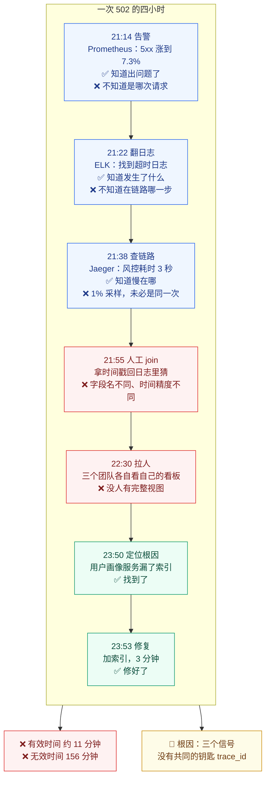

# 课 1 · 一次 502 的四小时

> **状态**：✅ 已完成（2026-09-02，双视角评审 P0=0）
> **所属阶段**：[阶段 1 · 三个控制台的四小时](../overview.md)
> **知识点**：2 个（1.1、1.2）

[← 返回阶段概览](../overview.md) ｜ [← 返回课程目录](../../../02-课程目录.md)

---

## 本课目标

学完本课你应该能够：

1. **复述**一次典型故障的排查时间线，并指出时间具体花在了哪儿
2. **说清** Metrics / Logs / Traces 三个信号各自回答什么问题、各自缺什么
3. **归纳**碎片化的四类成本（时间成本 / 认知成本 / 工具成本 / 机会成本）

---

## 知识点清单

| # | 知识点 | 状态 |
|---|--------|------|
| 1.1 | 三个控制台的四小时：可观测性碎片化的真实代价 | ✅ |
| 1.2 | 可观测性的三根支柱与它们的割裂 | ✅ |

---

## 正文

### 第一幕 · 场景引入：三个控制台的四小时

**时间是周五晚上 21:14**，电商大促的第二天。

客服群先炸了："有用户反馈下单一直转圈。"三十秒后，第二条、第三条消息跟上。有人贴了张截图——结算页上那个熟悉的 **502 Bad Gateway**。

你是今天的值班工程师。你打开电脑，开始排查。

#### 21:14 · 告警响了

Prometheus 的告警规则触发：`payment_service_5xx_rate > 5%`，持续 5 分钟。

你点开 Grafana 看板。**是的，支付服务的 5xx 错误率从 0.02% 涨到了 7.3%**。

但指标只告诉你"支付服务出问题了"，不告诉你是哪一个请求、哪一次调用出的问题。它像体温计——知道你在发烧，不知道哪儿发炎。

#### 21:22 · 去翻日志

你切到 Kibana，把时间范围调到最近 30 分钟，服务过滤到 `payment-service`，级别过滤到 `ERROR`。

几千条日志涌出来。你扫了一眼：`connection timeout`、`upstream refused`、`context deadline exceeded`……

**你找到了一条看起来最相关的日志**：

```json
{"ts":"2026-09-02T21:09:41Z","level":"error","service":"payment-service",
 "msg":"upstream call failed","upstream":"risk-control","err":"context deadline exceeded",
 "duration_ms":3002,"user_id":"u_88214","order_id":"SO202609022109"}
```

看起来是调用风控服务超时了。

但等等——**这条日志属于哪次请求？它在整条调用链的哪一步？风控服务为什么慢？**

日志里没有答案。它只有 `order_id`，没有链路标识。你想去风控服务查同一次调用的日志，却不知道该用什么去搜。

#### 21:38 · 去查链路

你切到 Jaeger，按时间范围搜索 `payment-service` 的 trace。

找到几百条。你挑了一条耗时最长的打开——**它确实显示风控服务那个 span 耗时 3 秒**。

但 Jaeger 只采样了 1% 的请求。你看到的是"某一条慢请求"，无法确定它和日志里那条 `SO202609022109` 是同一次。**两个系统之间，你只能靠时间戳去猜**。

#### 21:55 · 回到日志，换个姿势

你拿着那个 span 的时间戳，回 Kibana 去风控服务里搜那一秒的日志。

风控服务的日志里，那段时间确实有慢查询告警，但日志格式和支付服务完全不一样——字段名不同、时间精度不同、连"耗时"一个叫 `duration_ms` 一个叫 `cost`。

**你在做人工 join。**

#### 22:30 · 拉人

你把风控服务的负责人拉进会议。他打开自己的看板，说"我这边看着挺正常的啊"——因为他看的是风控服务自己的指标，而问题出在风控调用下游的某个数据库。

#### 23:50 · 终于定位

又过了八十分钟，你们把三个服务的日志按时间戳对齐、把数据库慢查询日志翻出来，才拼出完整链路：

```
下单请求 → 支付服务 → 风控服务 → 用户画像服务 → MySQL 慢查询（全表扫描，4.2 秒）
```

根因：**用户画像服务昨天上线的新版本，漏了一个索引**。

修好只需要**三分钟**：加个索引。

**从 21:09（问题实际发生）到 23:53（修复验证完成），共 164 分钟，接近 2 小时 45 分。**

如果算上事后复盘、事故报告和第二天跟进，整个事件占用团队的时间**接近四个小时**——团队内部管这类事故叫"四小时"。

> 📌 **这个叫法本身就是信号**：当一类事故有了专属称呼，说明它不是意外，是常态。

而其中**真正用于修复的时间，只有三分钟**。

---

### 第二幕 · 认知冲突：每个信号都"看到了一部分"，但谁也定位不了

现在停下来，问一个不舒服的问题：

> **这次事故里，你的监控做得差吗？**

不差。你有一套相当完整的监控：

- **Prometheus** 在 5 分钟内就发现了错误率上涨——**检测没问题**
- **ELK** 里有完整的错误日志——**记录没问题**
- **Jaeger** 里有跨服务的调用链——**链路也有**

三个信号都在工作，三个控制台都开着。可你还是花了四小时。

**问题不在"有没有数据"，而在"数据连不起来"。**

更具体地说，卡在了三个地方：

| 卡点 | 具体表现 | 这次事故里的例子 |
|------|---------|-----------------|
| **指标不知道请求是谁** | 指标是聚合值，看到 7.3% 错误率，但那 7.3% 是哪 73 个请求？不知道 | 你想找那批失败的请求，指标给不了你清单 |
| **日志没有链路标识** | 日志有 `order_id`，但没有 `trace_id`，跨服务无法精确对齐 | 你拿着时间戳去猜哪条日志对应哪个 span |
| **链路断在采样里** | 1% 采样意味着 99% 的请求没有链路数据，你看到的未必是代表性的 | 你找到的慢 trace 和日志里的订单未必是同一笔 |

这三句话，就是本课要你记住的第一件事：

> **三个信号各自都"正确"，但拼起来才"有用"。**

而把它们拼起来的成本，被转嫁给了**凌晨两点、喝着冷咖啡、靠人脑做 join 的那个工程师**。

#### 🐞 认知冲突的另一半：这不是人的问题

你可能会想："如果当时有个更资深的工程师，是不是十分钟就搞定了？"

也许。但请注意——**这次排查的大部分时间不是花在"思考"上，而是花在"找数据"上**。

行业调查反复印证这一点：在分布式系统中，**工程师 40%–60% 的事故时间用于收集信息而非分析信息**，人工调查占 MTTR 的 **60%–80%**；从告警触发到形成第一个可信假设，通常要 **30–45 分钟**，而这 30–45 分钟里工程师要在 **6–8 个工具之间来回切换**。

换个更扎心的说法：**你的系统复杂度在涨，但把数据连起来的工作，一直由人脑承担。**

这是结构问题，不是能力问题。

---

### 第三幕 · 层层揭示

#### 知识点 1.1：三个控制台的四小时 —— 可观测性碎片化的真实代价

##### 一句话定义

> **可观测性碎片化**是指：系统的遥测数据被拆分在多个互不相通的后端中，缺少统一的关联标识，导致跨系统定位问题时必须由人工完成 join，把本该由机器承担的关联成本转嫁给工程师。

##### 直觉建立：三个专家在同一间屋子里，说三种语言

想象一个诊室里有三位专家：

- **A 医生**拿着体温计：*"他在发烧，39 度。"*（**指标**：知道有问题，不知道哪儿的问题）
- **B 医生**拿着病历本：*"他三小时前说头疼，两小时前说想吐。"*（**日志**：知道发生了什么，不知道事件之间的关系）
- **C 医生**拿着一张路线图：*"他从家到公司，中间在地铁站停了很久。"*（**链路**：知道路径和耗时，不知道他为什么停）

每位医生的判断都是对的。但**没有人能回答"他到底怎么了"**——因为他们的信息无法合并。

你的三个控制台，就是这个诊室。

##### 核心原理：时间都去哪儿了

把这次四小时拆开，你会看到一个刺眼的比例：

| 阶段 | 时钟区间 | 耗时 | 性质 | 是否创造有效信息 |
|------|---------|------|------|----------------|
| 检测（告警触发） | 21:09 → 21:14 | 5 分钟 | 机器完成 | ✅ 有效 |
| 确认与上下文收集 | 21:14 → 21:22 | 8 分钟 | 人工 | ❌ 纯开销 |
| 日志检索与人工 join | 21:22 → 21:38 | 16 分钟 | 人工 | ❌ 纯开销 |
| 链路检索与时间戳对齐 | 21:38 → 21:55 | 17 分钟 | 人工 | ❌ 纯开销 |
| 跨团队协调与重复排查 | 21:55 → 23:50 | 115 分钟 | 人工 | ❌ 纯开销 |
| **定位根因** | 23:50 → 23:50 | ~3 分钟 | 人工 | ✅ 有效 |
| **修复与验证** | 23:50 → 23:53 | 3 分钟 | 人工 | ✅ 有效 |

**有效工作时间约 11 分钟，其余 156 分钟是"找数据"、"对数据"和"等人"。**

> 📌 注意最后两行的含义：**定位根因本身只用了三分钟**——因为一旦三个服务的日志被对齐、慢查询被翻出来，答案几乎是自明的。真正吃掉这四个小时的，是把证据摆到同一个人面前的过程。

这就是碎片化的第一类成本，也是最直观的一类：

##### 碎片化的四类成本

| 成本类型 | 具体是什么 | 这次事故里的体现 |
|---------|-----------|-----------------|
| **① 时间成本** | MTTR 被"找数据"而非"修问题"撑大 | 修复 3 分钟，其余 156 分钟，**有效时间占比约 6%** |
| **② 认知成本** | 工程师要同时维护三套查询语言、三种数据模型、三个时间精度 | 一次排查要在 PromQL / KQL / Jaeger 检索之间切换 **6–8 次** |
| **③ 工具成本** | 三个后端各自的 License、存储、运维、升级 | Prometheus + ES + Jaeger 三套集群，三份维护成本，三种扩容策略 |
| **④ 机会成本** | 最隐蔽也最贵——因为排查太痛苦，团队会**回避**某些排查 | "别查了，重启一下试试"；"这个偶发问题先记着吧" |

第四类值得你多想一会儿。

**机会成本不体现在任何监控看板上，但它真实存在**：当每次排查都要四小时，团队会下意识地选择"重启"而不是"查清"，会把偶发问题标记为"known issue"而不是去追根因。长期看，系统里堆积的未知会越来越多。

##### 示例演示：算一算你的碎片化成本

这门课后面会反复让你做这类计算。现在先热个身。假设：

- 你的团队每月 **8 次**需要跨服务排查的事故
- 每次平均 **2.5 小时**，其中 **70%** 花在收集与关联数据上

那么每月：

```
8 次 × 2.5 小时 × 70% = 14 小时 / 月，纯"找数据"开销
14 × 12 = 168 小时 / 年 ≈ 21 个工程师工作日 / 年
```

**一个工程师整整一个月的工时，只用来在三个控制台之间做人工 join。**

> 📌 **练习**：把 8、2.5、70% 换成你自己团队的数字，重算一遍。这个数字接下来会一直陪着你——它是判断"OTel 值不值得上"的第一块基石。

##### 常见误区

**🐞 误区一："多装几个监控工具就好了。"**

错了。问题不是数据不够，是数据**连不起来**。加第四个工具只会让你多开一个控制台。

行业数据很直白：**指标、日志、链路（MELT）已经是 39.5% 团队的主要可观测性数据来源**，但 NETSCOUT 2026 年对 950 名从业者的调查显示，能在几分钟内解决问题的团队比例**从 2025 年的 17% 降到了 11%**，需要"一天到几天"的比例**从 14.6% 翻倍到 28.7%**。

**数据更多了，解决更慢了。**

**🐞 误区二："我们的服务不多，用不上这套。"**

碎片化成本随服务数**非线性**增长。三个服务时，人工 join 还能靠时间戳凑合；三十个服务时，一次请求可能穿过 15 个服务，**靠人脑对齐时间戳在工程上不可行**。这也是为什么这个问题在微服务时代才集中爆发。

**🐞 误区三："这是运维的事。"**

不。这次事故的根因是**昨天上线的新版本漏了索引**——是开发引入的。碎片化的代价由运维支付，但根因往往在开发侧。这也是"可观测性"逐渐变成开发者议题的原因。

##### 一句话记住

> **碎片化不是"没有数据"，是"有数据但连不起来"——而把数据连起来的成本，正悄悄记在工程师的加班时长上。**

---

#### 知识点 1.2：可观测性的三根支柱与它们的割裂

##### 一句话定义

> **三根支柱（three pillars of observability）**是指日志、指标、链路这三种遥测数据类型。它们分别回答"发生了什么"、"有多严重"、"在哪儿慢"三个不同的问题，缺一不可；但因为历史上各自独立发展，它们被存放在不同后端、采用不同数据模型，**缺少共同的关联标识（trace_id）**，这就是它们的割裂。

##### 直觉建立：三种镜头，拍同一场事故

同一场事故，三种镜头拍出来完全不同：

| 镜头 | 拍到什么 | 类比 |
|------|---------|------|
| **Metrics 指标** | "支付服务错误率 7.3%" | **航拍**：看到火在哪片区域，看不清是谁点的火 |
| **Logs 日志** | "21:09:41 调用风控超时，订单 SO202609022109" | **地面特写**：细节丰富，但没有全局位置 |
| **Traces 链路** | "这次请求穿过 5 个服务，风控那步耗时 3 秒" | **跟拍**：完整路径清晰，但只跟拍了采到的那一小部分 |

三种镜头都不能省。但**没有一把共同的钥匙把三段录像对齐，你只能靠"画面里的时间"去猜**。

##### 核心原理：三个信号各自回答什么、缺什么

| 信号 | 回答的问题 | 数据形态 | 优势 | 致命缺陷 |
|------|-----------|---------|------|---------|
| **Metrics** | **"有多严重？"** | 时间序列：名字 + 标签 + 数值 | 存储便宜、告警快、保留期长 | **聚合即丢失上下文**：7.3% 是哪 73 个请求？不知道 |
| **Logs** | **"发生了什么？"** | 带时间戳的文本/结构化记录 | 上下文最丰富、无 schema 约束 | **离散无因果**：几千条日志里，哪条和哪条是同一次请求？不知道 |
| **Traces** | **"在哪儿慢？"** | Span 树，共享 `trace_id` | 展示跨服务因果关系与耗时分布 | **必须采样**：全量太贵，采到的未必是你要的那次 |

**看出规律了吗？**

- 指标知道**总量**，不知道**个体**
- 日志知道**个体**，不知道**关系**
- 链路知道**关系**，不知道**全体**

三者互补，且**互补得极其整齐**——每一个的短板，恰好是另一个的长板。这就是为什么说它们"缺一不可"，而不是"三选一"。

##### 核心原理（继续）：割裂的根因 —— 没有共同的钥匙

现在到了本课最关键的一句话。

三个信号**不是被谁设计成割裂的**。它们是沿着三条独立的技术路径各自长出来的：

| 信号 | 起源 | 催生它的技术问题 | 天然适配的存储 |
|------|------|-----------------|--------------|
| **Metrics** | RRDtool（1999）→ Graphite（2008）→ Prometheus（2012） | "系统现在健康吗？" | 时序数据库 |
| **Logs** | Splunk（2003）→ Elasticsearch（2010） | "到底发生了什么？" | 倒排索引 |
| **Traces** | Google Dapper 论文（2010）→ Zipkin（2012，Twitter 开源）→ Jaeger（2017，Uber 开源） | "一次请求穿过哪些服务，慢在哪一步？" | 宽表 / 文档存储 |

三条路径，三种数据模型，三种查询模式，**三家公司**（Splunk 做日志搜索、Datadog 做基础设施监控、New Relic 做 APM）。

> 📌 **一个重要的澄清**：今天很多人把"三根支柱"当成某种自然法则，但它其实**不是被设计出来的**。它源自 Peter Bourgon 在 **2017 年 2 月**参加分布式追踪峰会后写的一篇博客《Metrics, tracing, and logging》，文中用一张 **Venn 图**来厘清三个概念的边界——**他当时的目的只是给会场的人一套共享词汇，而不是给行业画一张架构蓝图**。
>
> 更有意思的是：**十八个月后（2018 年 8 月），Bourgon 自己写了《Observability signals》，反过来提出——既然三者本质是同一批原始事件的不同消费形态，理论上可以有一个统一系统，在入口接收原始事件，再按"形状"分派给三种后端**。他管这个设想叫 **über-system**。
>
> 行业抓住了前者（三根支柱），几乎忽略了后者（合并的可能）。
>
> **OpenTelemetry，本质上就是后者在八年后的实现。**

**而割裂最直接的后果，就是缺少一把共同的钥匙。**

回到这次事故：

- 指标里有 `service="payment-service"`
- 日志里有 `order_id="SO202609022109"`
- 链路里有 `trace_id="4bf92f35..."`

**三个 ID，三个世界，互不相识。**

你真正想要的是：

> **从"支付服务错误率上涨"这个指标出发 → 找出这批失败请求的 trace_id → 打开其中一条 → 看到它卡在风控服务 → 点开风控服务在这一刻的日志 → 看到那条慢 SQL。**

这条路径之所以走不通，不是因为缺数据，而是因为**三个信号之间没有共同的钥匙**。

**这把钥匙，就是 trace_id。**

而 OpenTelemetry 的第一价值主张，就是：**让三个信号从同一个上下文里长出来，天生携带同一把钥匙。**

##### 示例演示：同一次请求，三种信号长什么样

沿用前面的支付失败场景。同一次请求，在三个信号里分别是这样（**注意加粗的那个共同字段**）：

```jsonc
// ① Log：一条离散事件，上下文随意
{"ts":"2026-09-02T21:09:41Z","level":"error","service":"payment-service",
 "msg":"payment declined","order_id":"SO202609022109","duration_ms":1840,
 "trace_id":"4bf92f3577b34da6a3ce929d0e0e4736",   // ← 钥匙
 "span_id":"00f067aa0ba902b7"}

// ② Metric：一个聚合计数器，标签有界
payment_failures_total{service="payment-service",provider="stripe"} 417

// ③ Trace：Span 树中的一个 span
{"name":"POST /charge",
 "trace_id":"4bf92f3577b34da6a3ce929d0e0e4736",   // ← 同一把钥匙
 "span_id":"00f067aa0ba902b7","parent_span_id":"a3ce929d0e0e4736",
 "start":"…07.120Z","end":"…08.960Z","status":"ERROR","duration_ms":1840}
```

**指标那一行没有 trace_id**——这正是它的本质：聚合值，无法回溯到个体。

而日志与链路共享同一个 `trace_id` 时，从日志跳链路、从链路下钻日志，就是**一次点击**的事。如果日志里没有 `trace_id`（就像这次事故），你只能靠时间戳去猜。

> 📌 **这就是本课的核心洞察**：三根支柱割裂的**技术根因**是三个后端，但**可修复的切入点**是关联标识。你不必推翻三个后端，只要让数据从源头就带上同一把钥匙。

##### 常见误区

**🐞 误区一："上了 OTel 就只有一个后端了。"**

不是。OTel **不提供存储，也不提供可视化**（这是课 2 的重点）。它可能仍然落到 Prometheus + Jaeger + ES 三套后端。

OTel 解决的是**源头统一**（一次插桩出三种信号、共享上下文）和**传输统一**（OTLP 协议），**不是存储统一**。

顺带一提，Bourgon 2018 年设想的 über-system 也是这个克制版本：统一写入路径与读取模型，而非要求三种数据挤进同一个物理数据库。

**🐞 误区二："三根支柱是三种可观测性，选一个做深就行。"**

三个信号回答的是**三个不同问题**，不是同一问题的三种解法。做深指标能让你更快发现"出问题了"，但依然回答不了"哪次请求、哪一步"。

**🐞 误区三："我有链路了，日志就不重要了。"**

链路受采样限制（可能只有 1%），**你最关心的那次错误请求，未必被采到**。日志往往更完整。反之亦然——日志再全，没有链路就是一盘散沙。

**🐞 误区四："三根支柱'缺一不可'，所以四个都要上。"**

这里的"缺一不可"指的是**排查能力**上的互补，不是**采购清单**。现实中大多数团队先从指标起步，再补链路，最后统一日志——这是合理的演进顺序。别被"支柱"这个比喻绑架：它暗示三者均分受力、必须齐平，而实际上**不同阶段三者的投入配比本就不该相同**。

##### 一句话记住

> **指标说"出问题了"，链路说"在哪儿出的问题"，日志说"为什么出的"——三者缺一不可；而没有 `trace_id` 这把共同的钥匙，它们永远是三段各说各话的录像。**

---

### 第四幕 · 实操验证

**本课不写代码**（实操从课 3 开始）。这一幕要做的是**纸面推演**——你现在还没有工具，但你有这次事故的完整数据。

#### 演练 A：拆一次你自己的事故

从你参与过的（或听说过的）一次线上事故里，挑一次**跨服务**的。填这张表：

| 阶段 | 耗时 | 用了哪个工具 | 找到的信息 | 属于"找数据"还是"想办法" |
|------|------|------------|-----------|------------------------|
| 检测 | | | | |
| 确认 | | | | |
| 检索 | | | | |
| 关联 | | | | |
| 定位 | | | | |
| 修复 | | | | |

然后算两个数字：

1. **有效时间占比** = （定位 + 修复）÷ 总耗时
2. **工具切换次数** = 你换了多少次控制台

> 📌 如果有效时间占比低于 30%、切换次数超过 5 次，你就拥有了一个"真实的碎片化案例"。**把它记下来**——课 12 的收束环节，你会用它来结算 OTel 到底能帮你省多少。

#### 演练 B：给日志补上那把钥匙

回到第一幕那条日志：

```json
{"ts":"2026-09-02T21:09:41Z","level":"error","service":"payment-service",
 "msg":"upstream call failed","upstream":"risk-control","err":"context deadline exceeded",
 "duration_ms":3002,"user_id":"u_88214","order_id":"SO202609022109"}
```

**假设**当时这条日志里多带了两个字段——`trace_id` 和 `span_id`——那么第一幕的时间线会怎么变？

请在心里（或纸上）重走一遍：

| 步骤 | 原来要多久 | 带上 trace_id 后 | 省在哪 |
|------|-----------|-----------------|-------|
| 找对应的链路 | ~20 分钟（按时间戳猜） | 一次点击 | 不用猜 |
| 找风控服务同一次调用的日志 | ~30 分钟（按时间范围筛） | 一次跳转 | 不用筛 |
| 确认两者是同一次请求 | 靠猜，不可靠 | 天然确定 | 不用怀疑 |

**保守估计，这次事故能从 164 分钟压到 40 分钟以内。**

这不是幻想——这就是 `trace_id` 的价值，也是课 8 会亲手实现的东西（给既有日志自动注入 `trace_id`）。

> 📌 **为什么不能压到 10 分钟？** 因为 `trace_id` 只解决"关联"这一段。跨团队协调的 115 分钟里，有一部分与工具无关（等人上线、解释上下文、走变更流程）。**诚实地讲：OTel 能帮你砍掉的是"找数据"的时间，砍不掉"等人"的时间。**课 12 结算收益时，我们会把这层区分开来算。

#### 演练 C：算清你的"人工 join 税"

用知识点 1.1 给的公式，代入你团队的数字：

```
每月跨服务排查次数 × 每次平均耗时 × 花在收集关联上的比例 = 每月人工 join 开销
```

**把这个数字写进你的学习档案**（或随便一张便签）。课 12 我们会用它来算 OTel 的投资回报。

---

### 第五幕 · 体系收束

#### 一图总结



#### 三句话带走

1. **碎片化不是"没有数据"，是"有数据但连不起来"** —— 164 分钟里，只有约 11 分钟在真正解决问题
2. **三个信号各自回答一个不可替代的问题** —— 指标说"有多严重"、链路说"在哪儿慢"、日志说"发生了什么"
3. **割裂的技术根因是三个后端，但可修复的切入点是关联标识** —— 你不必推翻后端，只要让数据从源头带上 `trace_id`

#### 四类成本清单

| 成本 | 一句话 | 怎么衡量 |
|------|--------|---------|
| ① 时间成本 | MTTR 被"找数据"撑大 | 有效时间占比 |
| ② 认知成本 | 三套查询语言、三种数据模型 | 工具切换次数 |
| ③ 工具成本 | 三套后端的 License 与运维 | 集群数量 × 维护成本 |
| ④ 机会成本 | 因为太痛而**回避**排查 | 最隐蔽，也最贵 |

#### 从"痛"到"解药"

本课只做了一件事：**把"不方便"翻译成可量化的损失。**

你现在手上有了：

- 一个可计算的数字（人工 join 税）
- 一个明确的根因（缺少共同钥匙 `trace_id`）
- 一个可验证的改进方向（让三个信号从同一上下文长出来）

📍 **全局定位**

本课是 12 课里唯一不写代码的课，但它决定了后面 11 课你能吸收多少。

- **课 2** 立刻登场的是 OTel——先说清它**是什么**，马上再说清它**不是什么**
- **课 3** 你会亲手跑通第一条链路，亲眼看到 `trace_id` 长什么样
- **阶段 2** 会把它拆开，看 Span 如何携带这把钥匙穿过服务边界
- **课 8** 会给你的既有日志自动注入 `trace_id`，把本课的"演练 B"变成现实
- **课 12** 会回到本课的三个练习，用你算出的数字结算这次学习的收益

🔗 **下一步**

课 2《OTel 是什么与它不是什么》。

⚠️ **现在还别急着下结论**

你可能会想："既然数据连不起来这么痛，那我把 Prometheus、ELK、Jaeger 全换掉，上一套 OTel 就完事了。"

先别。这个想法里有**两个错误**，课 2 会逐个拆掉：

1. **OTel 不存储数据，也不画图**——它不能替换你的后端
2. **换后端从来不是目的**——真正的目的是让数据从源头就带上同一把钥匙

带着这个问题继续学：**"既然 OTel 不能存数据也不能画图，那它到底干什么？"**

---

## 本课小结

| 知识点 | 一句话 | 状态 |
|--------|--------|------|
| 1.1 碎片化的真实代价 | 不是"没有数据"，是"有数据连不起来"，而 join 的成本由人脑承担 | ✅ |
| 1.2 三根支柱与它们的割裂 | 指标/链路/日志各答一问、缺一不可，割裂的切入点是缺 `trace_id` | ✅ |

---

## 🚀 下一批接力提示词

复制以下内容继续学习：

```
我的 OpenTelemetry 学习档案在 opentelemetry/00-学习档案.md，
刚学完阶段 1《三个控制台的四小时》课 1《一次 502 的四小时》
（知识点 1.1 碎片化的真实代价、1.2 三根支柱与它们的割裂）。
请按大纲继续讲解课 2《OTel 是什么与它不是什么》的知识点
1.3 OTel 是什么（四大组件）、1.4 它不是什么（五条边界）、
1.5 起源与合并、1.6 生态现状与版本基线。
```

---

## 🧭 课程导航

- 上一课：—（本课为课程第一课）
- 阶段概览：[阶段 1 · 三个控制台的四小时](../overview.md)
- 下一课：[课 2 · OTel 是什么与它不是什么](./lesson-02-OTel是什么与它不是什么.md)
- [← 返回课程目录](../../../02-课程目录.md)

---

## 交付状态

| 项 | 值 |
|---|---|
| 状态 | ✅ 已完成 |
| 评审 | ✅ 已完成（pedagogy + learner 双视角，P0=0，P1×2、P2×3 当批修复） |
| 完成日期 | 2026-09-02 |
