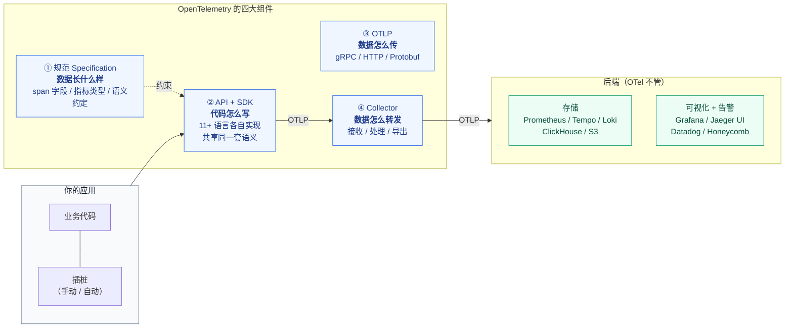
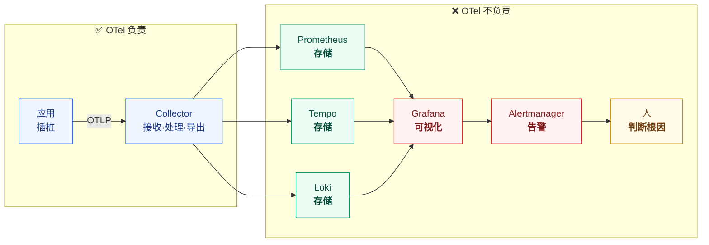
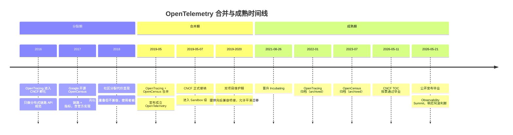
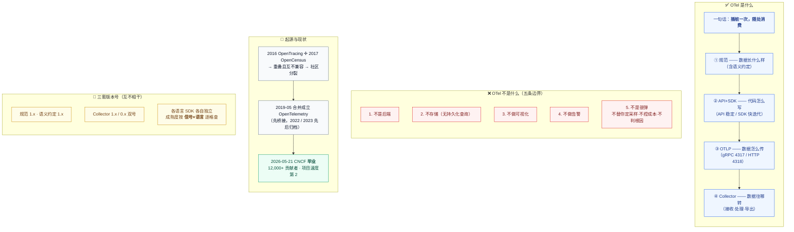

# 课 2 · OTel 是什么与它不是什么

> **状态**：✅ 已完成（2026-09-02，双视角评审 P0=0）
> **所属阶段**：[阶段 1 · 三个控制台的四小时](../overview.md)
> **知识点**：4 个（1.3、1.4、1.5、1.6）

[← 返回阶段概览](../overview.md) ｜ [← 返回课程目录](../../../02-课程目录.md)

---

## 本课目标

学完本课你应该能够：

1. **给出** OTel 的一句话定义，并列出四大组件（规范、API+SDK、OTLP、Collector）
2. **划清**五条边界：不是后端 / 不是存储 / 不是可视化 / 不是告警 / 不是自动解决一切
3. **讲清** OpenTracing 与 OpenCensus 为什么必须合并，以及 2026-05 CNCF 毕业意味着什么
4. **分辨**三套独立版本号（规范 / Collector / SDK），避免"版本号焦虑"

---

## 知识点清单

| # | 知识点 | 状态 |
|---|--------|------|
| 1.3 | OTel 是什么：一句话定义与四大组件 | ✅ |
| 1.4 | OTel 不是什么：划清五条边界 | ✅ |
| 1.5 | 起源：OpenTracing + OpenCensus 的合并 | ✅ |
| 1.6 | 生态现状与版本基线 | ✅ |

---

## 正文

### 第一幕 · 场景引入：周一晨会上的一句"上 OTel 吧"

课 1 那次事故过后的周一晨会。

复盘会上，有人把那张时间线投影出来：**164 分钟，加索引 3 分钟**。会议室安静了几秒。

然后有人说：

> "三个控制台来回切太痛苦了。**我们上 OpenTelemetry 吧**，以后就一个控制台了。"

会议室里几个人点头。这话听起来非常合理——**统一**嘛。

但紧接着，第二个声音：

> "那……**Prometheus 和 Jaeger 是不是就可以下掉了？**"

这就是本课要处理的那个瞬间。

这句问话里藏着**两个假设**，而两个都是错的：

| 假设 | 实际 |
|------|------|
| "上了 OTel 就只有一个控制台" | OTel **不画图**，你仍然需要一个 UI |
| "Prometheus / Jaeger 可以下掉" | 它们是**后端**，OTel 不是后端，两者不在一个位置上 |

**这不是抬杠。** 这两个错误想法极其常见，而且危害不小——因为它们会导致**错误的立项**。

想象一下：你们按"替换 Prometheus + Jaeger"立项，三个月后发现 OTel 根本不存储数据，只能把 Prometheus 和 Jaeger 重新装回来。项目会被判定为失败，而实际上**OTel 从头到尾都没打算做这件事**。

> 📌 **本课的任务**：在你对 OTel 投入任何期待之前，先把它的边界画清楚。
>
> **先立后破**——先说清它是什么（1.3），立刻说清它不是什么（1.4）。这两件事必须连着做，中间不能隔夜。

---

### 第二幕 · 认知冲突：如果 OTel 不存数据、不画图，那它到底干什么？

现在把那句"上 OTel 就能换掉 Prometheus 和 Jaeger"放到桌面上，逐字检查。

#### 冲突一：换掉之后，数据存哪儿？

Prometheus 是一个**时序数据库**——它把指标存下来，让你用 PromQL 去查。
Jaeger 是一个**链路后端**——它把 span 存下来，让你按 trace_id 去查。

**OTel 提供存储吗？**

不提供。OTel 官方定位写得很直白：

> OpenTelemetry **is not** an observability backend.
> （OpenTelemetry 不是一个可观测性后端。）

那"上 OTel 换掉 Prometheus"之后，你的指标**存在哪里**？

**没有答案——因为这个问题本身不成立。** 你换掉的是一个存储，而 OTel 卖的不是存储。

#### 冲突二：换掉之后，你在哪儿看？

Prometheus 有自带的表达式浏览器，Jaeger 有 16686 端口的 Web UI。

**OTel 提供界面吗？**

不提供。OTel 里**没有**任何可视化组件。Grafana、Jaeger UI、Honeycomb、Datadog——这些都不是 OTel 的一部分。

#### 冲突三：既然什么都不提供，那它凭什么是"标准"？

这是本课最核心的一个反转。

先想一个更熟悉的类比：**HTTP**。

- HTTP 不存储网页
- HTTP 不渲染页面
- HTTP 不提供搜索

但 HTTP 定义了**浏览器和服务器之间怎么对话**。正因为这一层被标准化了，你才能用任何浏览器访问任何网站，才能换掉 Nginx 而不改前端代码。

**OTel 是同一个位置上的东西——它是可观测性领域的"HTTP"。**

它标准化的是：

| 层面 | 标准化了什么 | 类比 HTTP |
|------|-------------|----------|
| **数据长什么样** | 规范：span 有哪些字段、指标有哪几种类型、`service.name` 叫什么 | HTTP 报文格式 |
| **代码怎么写** | API + SDK：Python 和 Go 写出来的插桩代码，产出同样的数据 | 各种语言的 HTTP 客户端库 |
| **数据怎么传** | OTLP：一个统一的传输协议 | HTTP 协议本身 |
| **数据怎么转发** | Collector：接收、处理、导出 | 反向代理 |

**它不标准化"数据存在哪、怎么看"——那是后端的事，而且应该保持竞争。**

#### 🐞 认知冲突的第二个层次：这不是"少做了"，是"刻意不做"

你可能会想："OTel 是不是还没做完？等它把存储和 UI 也做了就好了。"

**不会。这是设计选择，不是进度问题。**

原因很实际：一旦 OTel 自己提供后端，它就会和 Prometheus、Jaeger、Datadog、Honeycomb **竞争**。而 OTel 的核心价值恰恰是**厂商中立**——所有厂商都敢支持它，正是因为它不抢任何人的饭碗。

> 📌 **记住这句话**：**OTel 不碰存储和 UI，不是能力不足，是它保持中立的代价——也是它能让所有厂商都坐到同一张桌子上的原因。**

三大云厂商现在都原生接受 OTLP 摄入（Azure Monitor、AWS CloudWatch、Google Cloud Observability），就是因为这个中立性。**如果你的采集层由某个厂商控制，其他厂商凭什么帮你做对接？**

---

### 第三幕 · 层层揭示

#### 知识点 1.3：OTel 是什么 —— 一句话定义与四大组件

##### 一句话定义

> **OpenTelemetry 是一个厂商中立的可观测性框架，用于标准化遥测数据（指标、日志、链路、性能剖析）的生成、采集与导出——它统一的是"数据怎么产生和怎么传输"，而不统一"数据存在哪、怎么看"。**

如果只能记一句更短的：

> **插桩一次，随处消费。**（Instrument once, consume anywhere.）

##### 直觉建立：快递行业 vs 快递公司

想象物流行业。

在 OTel 之前，每家快递公司（顺丰、京东、中通）**用自己的箱子、自己的面单格式、自己的分拣规则**。你要换快递公司，就得把包裹重新打包、重新贴面单。

**插桩库就是那个"面单格式"**。你用 Datadog 的 SDK 打点，就只能用 Datadog 的箱子；想换成 New Relic？把所有打点代码拆掉重写。

OTel 做的事是：**统一面单格式（规范）、统一打包工具（API/SDK）、统一运输协议（OTLP）、统一分拣中心（Collector）**。

但你注意——**OTel 不经营仓库，也不开快递柜**。仓库（存储）和快递柜（UI）仍然由各家快递公司自己做，而且它们**互相竞争**，这是好事。

##### 核心原理：四大组件逐个展开



逐个说清：

**① 规范（Specification）**

- **是什么**：一份语言无关的文档，规定 span 必须有哪些字段、指标有哪几种类型（Counter / Gauge / Histogram / UpDownCounter）、日志等级怎么映射成数字。
- **关键产出**：**语义约定（Semantic Conventions）**——规定"HTTP 请求方法"这个属性统一叫 `http.request.method`，"数据库系统"统一叫 `db.system.name`。
- **为什么重要**：没有它，Python 服务写的 `http_method` 和 Go 服务写的 `method` 就是两个字段，跨语言查询直接失效。**这是"统一"的第一层，也是最容易被忽略的一层。**

**② API + SDK**

- **API**：抽象接口 + 空实现（no-op）。**库**只依赖 API，不依赖 SDK。
- **SDK**：API 的参考实现，真正干活的部分（采样、批处理、导出）。
- **为什么分开**：这是 OTel 一个非常聪明的设计。假设你写了一个 Redis 客户端库，想让它输出遥测数据——你**只依赖 `opentelemetry-api`**，至于最终用户用哪个 SDK、导到哪里，由**应用**决定。这样就不会出现"我引了个库，结果被迫绑定某个厂商"的情况。

> 📌 **实战提醒**：只装 `opentelemetry-api` 不装 `opentelemetry-sdk`，所有打点调用都会**静默成功但什么都不记录**——这是新手最常踩的坑。
>
> 诊断方法（**已在作者本机 WSL 实测**）：未配置 SDK 时 `get_tracer_provider()` 返回 `ProxyTracerProvider`（内部委托为 `None`），此时 span 的 `trace_id` 为 **0**、`is_recording()` 为 `False`。**`trace_id == 0` 是最可靠的判据。** 见本课演练 D。

**③ OTLP（OpenTelemetry Protocol）**

- **是什么**：基于 Protobuf 的传输协议，跑在 gRPC（默认 4317）或 HTTP（默认 4318）上。
- **为什么重要**：它是"插桩一次，随处消费"能成立的**技术前提**。你的应用只管往 4317 端口发 OTLP，至于后面接的是 Jaeger 还是 Datadog，改 Collector 配置就行，**应用代码一行不动**。

**④ Collector**

- **是什么**：一个独立进程，做接收（Receiver）→ 处理（Processor）→ 导出（Exporter）三段流水线。
- **为什么重要**：它是**解耦点**。加了它，换后端就只是改一份 YAML。
- **顺带解决**：批处理、采样、脱敏（比如把 `user_id` 从 span 属性里抹掉）、多后端扇出——这些事原本要写进每个应用里，现在集中到一处。

##### 示例演示：同一段业务，换后端时什么在变

假设你有一个 Python 订单服务，现在要把链路从 Jaeger 换成 Grafana Tempo。

**没有 OTel 时**：

```python
# 改前：Jaeger 专用客户端
from jaeger_client import Config
tracer = Config(config={'sampler': {'type': 'const', 'param': 1}},
                service_name='order-service').initialize_tracer()

# 改成 Tempo：要换库、换配置结构、改上报方式……
# 而且指标和日志还得各自再改一遍
```

**有 OTel 时**：

```python
# 应用代码：只写一次，永远不动
from opentelemetry import trace
tracer = trace.get_tracer(__name__)
with tracer.start_as_current_span("create_order"):
    ...
```

```yaml
# 换后端 = 只改 Collector 配置
exporters:
  # otlp/jaeger:
  #   endpoint: jaeger:4317
  otlp/tempo:
    endpoint: tempo:4317
```

**应用代码零改动，指标、日志、链路一起换过去。**

这就是"插桩一次，随处消费"的字面意思。

##### 常见误区

**🐞 误区一："OTel 就是 Collector。"**

不对。Collector 只是四分之一，而且**它是可选的**——应用可以直接把 OTLP 发给支持 OTLP 的后端，中间不放 Collector（小项目常见）。只是生产中几乎都会放，因为需要采样和批处理。

**🐞 误区二："规范是给实现者看的，我用不上。"**

你会用上，而且很快。当你发现自己的 `http.request.method` 在 Grafana 里查不出来、而别人的能查出来时，**问题就出在语义约定**——课 6 会专门讲这个。

**🐞 误区三："四大组件是一套东西，版本一致。"**

这是本课最重要的纠正之一：**它们四套各自独立发版**。见知识点 1.6。

##### 一句话记住

> **规范定"数据长什么样"，API+SDK 定"代码怎么写"，OTLP 定"数据怎么传"，Collector 定"数据往哪转"——四者合起来，让"换后端不改代码"成为可能。**

---

#### 知识点 1.4：OTel 不是什么 —— 划清五条边界

##### 一句话定义

> **OTel 是采集与传输层，不是存储层、不是展示层、不是决策层。** 它明确**不提供**后端、存储、可视化、告警，也不自动解决可观测性问题——它只是让数据能被统一地送到该去的地方。

##### 直觉建立：它修的是路，不是仓库和商店

继续用物流类比。OTel 修的是**高速公路和面单标准**。

- 它**不建仓库**（不存储）
- 它**不开商店**（不做 UI）
- 它**不决定你该进什么货**（不替你决定采样率、不替你写代码、不替你判断根因）

修路的价值极大——但你不该指望公路旁边自动长出仓库。

##### 核心原理：五条边界逐条拆

| # | 它不是 | 常见误解 | 真相 | 那该用什么 |
|---|-------|---------|------|-----------|
| **1** | **不是可观测性后端** | "上了 OTel 就不用买 Datadog / 自建 ELK 了" | OTel 官方明确定位：*is not an observability backend*。它产出数据，不消费数据 | Prometheus / Tempo / Loki / ClickHouse / 商业 SaaS |
| **2** | **不是存储，不持久化** | "OTel 会把我的 trace 存起来" | SDK 默认批处理 + 导出后立即丢弃；Collector 只在内存中排队，**没有长期存储**（持久化队列除外，但那是缓冲不是存储） | 后端自己的存储引擎 |
| **3** | **不是可视化工具** | "OTel 有个统一的看板吧？" | OTel 项目里**没有任何 UI 组件**。想看图必须配 Grafana / Jaeger UI / 商业产品 | Grafana / Jaeger UI / Honeycomb / Datadog |
| **4** | **不是告警系统** | "OTel 会帮我发告警" | OTel 不评估规则、不发通知。**它能让指标进入 Prometheus，但告警仍由 Alertmanager 做** | Prometheus Alertmanager / Grafana Alerting |
| **5** | **不是自动解决一切的银弹** | "上了 OTel，四小时变十分钟" | OTel 提供的是**关联能力**，不替你决定采样策略、不控制成本、不做根因分析、不消除跨团队协调 | 人 + 流程 + 课 12 会算的账 |

##### 逐条展开（第 2 条和第 5 条最容易被忽略）

**边界 2 · 不存储——这个区别很细但很关键**

SDK 里的 `BatchSpanProcessor` 会把 span 攒一批再发，**内存里排队 ≠ 存储**。进程一重启，队列里的东西就没了。

Collector 里有**持久化队列**（file_storage），但那是**防止 Collector 重启丢数据**的缓冲，保留期通常几分钟到几小时。**它不是给你查询用的。**

**边界 5 · 不是银弹——承接课 1 那个诚实口径**

课 1 那次事故，`trace_id` 能帮你从"按时间戳猜"变成"一次点击"。但它**不会**：

- 替你决定采样率（1% 还是 100%，这是成本与覆盖的权衡，得你自己定——课 9）
- 替你控制 cardinality 爆炸（一个 `user_id` 标签写错位置就能拖垮后端——课 11）
- 替你分析根因（数据摆齐了，判断还得靠人）
- 替你消除"等人上线"的那 115 分钟

> 📌 **这条边界是本课最贵的认知**：OTel 把"找数据"的成本压下去，把"用数据"的责任留给你。**它给你的是可能性，不是答案。**

##### 示例演示：一张图看懂 OTel 在哪儿、不在哪儿



蓝色是 OTel，绿色/红色/黄色都不是。

**注意蓝色只有两块**——应用里的插桩，和中间的 Collector。这就是它的全部地盘。

##### 常见误区

**🐞 误区一："那 OTel 岂不是没什么用？"**

恰恰相反。它占据的是**杠杆率最高的位置**——只要控制住"数据怎么产生"，下游所有后端都是可替换的。**控制源头，比控制终点值钱得多。**

**🐞 误区二："Collector 有存储扩展（file_storage），所以第 2 条错了。"**

不冲突。file_storage 是**防丢缓冲**，不是查询存储。它的 SLA 是"别在传输途中丢"，不是"让你查三个月前的数据"。

**🐞 误区三："三大云厂商都支持 OTLP 摄入，说明 OTel 已经包含后端了。"**

注意动词：是**摄入（ingest）**，不是**存储**。Azure Monitor、CloudWatch、Google Cloud Observability 支持的是"用 OTLP 协议把数据送进来"——**送进来之后存在哪儿、怎么查，是云厂商自己的事**。

这恰恰验证而不是反驳了边界：**连云厂商都只在采集层采用 OTel，把存储和展示留在自己手里。**

##### 一句话记住

> **OTel 管"数据怎么来"，不管"数据存哪、怎么看、谁来判"——它是采集与传输的标准，不是可观测性的全部。**

---

#### 知识点 1.5：起源 —— OpenTracing 与 OpenCensus 的合并

##### 一句话定义

> **OpenTelemetry 诞生于 2019 年 5 月 OpenTracing（CNCF 系，专注链路）与 OpenCensus（Google 系，链路+指标）的合并——两个重叠的标准把社区撕成两半，合并是唯一出路。**

##### 直觉建立：两个标准，一场没有赢家的分裂

2016–2018 年，做分布式追踪的人要面对一个尴尬选择：

| | **OpenTracing** | **OpenCensus** |
|---|---|---|
| **出身** | CNCF 孵化（2016） | Google 开源（2017），源自内部 Census |
| **覆盖面** | **只做链路** | **链路 + 指标** |
| **风格** | 只定 API 规范，实现交给别人 | 规范 + 各语言官方实现，开箱可用 |
| **背后** | Uber、LightStep、CNCF 生态 | Google、Microsoft |

**问题在于：这两个项目高度重叠，但互不兼容。**

对使用者的直接后果是——**你必须选边，而且选错的成本极高**：

- 选了 OpenTracing：指标怎么办？自己再搞一套
- 选了 OpenCensus：CNCF 生态的工具对接不上
- 更糟的是：**插桩代码和你的选择死死绑定**，换边就要重写

这和课 1 讲的三根支柱割裂是**同一种病**，只是层次不同：

- **课 1 的割裂**：三个信号之间连不起来
- **1.5 的割裂**：连"链路"这一种信号，都有两套互相竞争的标准

**行业意识到：标准分裂的代价，比任何一家公司的技术优势都大。**

##### 核心原理：合并时间线



**几个关键节点值得单独说：**

**① 合并不是"二选一"，是"各取所长"**

- 链路的**数据模型与 API** 主要继承自 **OpenTracing**
- 指标的**数据模型**与**各语言官方 SDK 的形态**主要继承自 **OpenCensus**
- OTel 额外补上了 **OpenCensus 没有的日志**信号（后来又加了 Profiles）

所以官方的说法是 "takes the best of both worlds, and then some"。

**② 合并期长达数年，靠"桥接"平滑过渡**

合并宣布后，OpenTracing 和 OpenCensus **并没有立刻关停**，而是继续维护了数年，并提供**向后兼容的桥接组件**：

- 已经在用 OpenTracing 的代码，可以接一个 shim 把数据导进 OTel
- 已经在用 OpenCensus 的代码，同样有 OpenCensus bridge

- **OpenTracing 于 2022 年 1 月归档**
- **OpenCensus 于 2023 年 7 月归档**

**这个"先桥接、后归档"的节奏是个重要经验**：标准迁移不能断崖式切换，得给存量系统留出路。（Collector 直到 v0.107.0 才彻底移除 OpenCensus bridge，那已经是 2024 年的事了。）

**③ 2026-05 毕业：CNCF 最高成熟度等级**

CNCF 有三档成熟度：Sandbox → Incubating → **Graduated**。

OTel 于 **2026 年 5 月 11 日**经 TOC 投票通过毕业，**5 月 21 日**在明尼阿波利斯的 Observability Summit 上公开宣布。

**毕业需要什么**（不是自动晋级，要逐条达标）：

| 条件 | OTel 的达标情况 |
|------|----------------|
| **生产采用** | GitHub、Farfetch、Alibaba、Anthropic、Bloomberg、Capital One、eBay 等在产线运行 |
| **治理健全** | 文档化的治理模型，选举与退休机制明确，决策透明 |
| **社区健康** | 12,000+ 贡献者、2,800+ 公司、跨组织的常规贡献者 |
| **安全审计** | 至少一次第三方独立安全审计（针对 Collector 等核心组件），关键问题已修复 |
| **API 稳定性** | 版本化发布，保证向后兼容 |
| **文档完备** | 架构概览 + 用户 / 运维 / 贡献者指南 |
| **TOC 评审** | 提交毕业申请模板并通过尽调（由 TOC sponsor Emily Fox、Davanum Srinivas 主导） |

> 📌 **毕业对你意味着什么？**
>
> **技术上，什么都没变**——你的插桩代码不会因为毕业而需要改动。
>
> **组织上，变了很多**：它给了你的安全团队、平台负责人和 CFO 一个正式背书。"等 OTel 再成熟一点再说"这个拖延理由，**在 2026 年 5 月之后正式失效了**。

**④ 规模数据（核查于 2026-09）**

- CNCF 官方毕业公告：**12,000+ 贡献者，来自 2,800+ 公司**
- CNCF 项目页（LFX 口径）：**总贡献者 27,247**，GitHub Stars 12,752
- 项目速度：240+ 个 CNCF 项目中**排名第二，仅次于 Kubernetes**
- 下载量：过去 12 个月 **JS API 包 13.6 亿次**、**Python API 包超 13 亿次**，两者均在 2026 年 4 月创下月度新高

> ⚠️ **注意两组数字的口径差异**：12,000 是 CNCF 公告中"自项目成立以来的贡献者"口径，27,247 是 LFX 统计的"总贡献者"口径（含更广泛的交互行为）。**引用时务必说明是哪个口径**，这也是本课"版本号须标核查时点"那一节要反复强调的严谨性。

##### 示例演示：用一句话向同事解释"为什么要合并"

如果你需要在一分钟内讲清，用这个版本：

> **两个标准做同一件事，谁也赢不了，但所有使用者都在输。合并不是技术选择，是止损。**

再补一句更有力的：

> **这已经是第二次了。** 课 1 讲三根支柱割裂（信号之间连不起来），1.5 讲标准分裂（同一种信号有两套标准）。**可观测性这个领域的问题，从来不是"没有方案"，而是"方案太多且互不兼容"。**
>
> **OTel 的核心价值主张，就是不再让这种分裂发生第三次。**

##### 常见误区

**🐞 误区一："OpenTracing 和 OpenCensus 现在还能用。"**

不能。两者都已**归档（archived）**：OpenTracing 2022 年 1 月，OpenCensus 2023 年 7 月。归档意味着**不再维护、不再修安全漏洞**。存量系统应尽快迁移。

**🐞 误区二："OTel 是 Google 的项目。"**

不是。OTel 在 **CNCF** 旗下，治理委员会与 maintainer 跨越多家公司（Google、Microsoft、Elastic、Honeycomb、Splunk 等）。它的中立性正是靠这个治理结构保证的——**这也是边界 1（不是后端）能长期成立的前提**。

**🐞 误区三："毕业 = 稳定 = 所有功能都能上生产。"**

三个等号都是错的。毕业证明的是**项目治理与核心 API 的成熟度**，不是每个组件都 Stable。

**OTel 内部是按组件分别标注稳定性的**：Traces / Metrics / Logs 的规范层已 Stable，但**具体语言 SDK 的成熟度各不相同**（Python 的 Logs 仍是 Development），Profiles 整体还在 Alpha。**见知识点 1.6。**

##### 一句话记住

> **OpenTracing + OpenCensus 二选一的荒诞局面，逼出了 OpenTelemetry；2026 年 5 月 CNCF 毕业，意味着"再等等看"这个理由正式作废。**

#### 知识点 1.6：生态现状与版本基线

##### 一句话定义

> **OTel 的规范、Collector、各语言 SDK 三套版本号各自独立演进，且稳定性按"信号 × 语言"逐格标注。** 谈论"OTel 稳不稳定"必须指明是哪一层、哪个语言、哪个信号，否则这句话没有意义。

##### 直觉建立：不要把 OTel 当成一个软件

这是初学者最容易犯的框架性错误：**把 OTel 想象成一个有单一版本号的产品**（像 "MySQL 8.0"）。

它不是。它更像是**一个由几十个独立仓库组成的联邦**：

| 部分 | 版本形态 | 发布节奏 | 例子 |
|------|---------|---------|------|
| **规范** | `1.x.x` | 数周一版 | 1.59.0（2026-07） |
| **语义约定** | 独立 `1.x.x` | 数周一版 | 1.43.0（2026-07） |
| **Collector** | 双号 `1.x.x` / `0.x.x` | 约两周一版 | v1.64.0 / v0.158.0（2026-08-04） |
| **各语言 SDK** | 各自独立 | 各语言不同 | Python 1.44.0、JS 0.222.0 |

**它们各自发版，互相同步但不锁定。**

##### 核心原理（一）：三套版本号为什么必须分开

**这不是管理混乱，是版本策略的必然结果。**

原因很直接：如果规范一改就要所有语言 SDK 同步发大版本，那整个生态的迭代会被最慢的语言拖死。分开之后：

- 规范可以快速演进（加 Profiles 数据模型、加语义约定）
- 各语言 SDK 按自己的节奏跟进
- Collector 作为独立进程，可以两周一版快速迭代

**代价是**：你必须自己维护一张"我的版本基线表"。这是本课实操要你做的事。

**Collector 的双版本号值得单独解释**：

| 版本号 | 管什么 | 谁关心 |
|--------|-------|--------|
| `1.x.x` | **Collector 的公共 API**（给自定义组件开发者用） | 写自定义 receiver/exporter 的人 |
| `0.x.x` | **整体发布版本**（配置、行为、组件） | 所有使用者 |

你看到的 `v1.64.0/v0.158.0`，是**同一次发布的两个面**。

> 📌 **实战含义**：你是用 YAML 配置 Collector 的运维/开发，只看 `0.x.x`（0.158.0）。只有当你用 Go 写自定义组件时，`1.x.x` 的破坏性变更才会影响到你。

##### 核心原理（二）：成熟度必须按"信号 × 语言"逐格看

这是本课的**头号纪律**。看这张表（核查于 2026-09-02，来源：OpenTelemetry 官方语言状态页）：

| 语言 | Traces | Metrics | Logs | Profiles |
|------|--------|---------|------|----------|
| C++ | Stable | Stable | Stable | — |
| C#/.NET | Stable | Stable | Stable | — |
| **Go** | Stable | Stable | **Beta** | — |
| **Java** | Stable | Stable | **Stable** | Development |
| **JavaScript** | Stable | Stable | **Development** | — |
| **Python** | Stable | Stable | **Development** | — |
| PHP | Stable | Stable | Stable | — |
| Ruby | Stable | Development | Development | — |
| Rust | Beta | Beta | Beta | — |
| Erlang/Elixir | Stable | Development | Development | — |
| Swift | Stable | Development | Development | — |
| Kotlin | Development | Development | Development | — |

**读这张表的三条纪律：**

**① 规范层的 Logs 是 Stable，不代表 Python SDK 的 Logs 是 Stable。**

这是最容易混淆的一点。

- **规范层**（Logs data model / API 定义）：**Stable**
- **Python SDK 的 Logs 实现**：**Development**（README 明确标注，并警告"stabilizing the Log signal would require making deprecations and **breaking changes**"）
- **JS SDK 的 Logs**：**Development**
- **Go SDK 的 Logs**：**Beta**
- **Java / .NET / C++ / PHP 的 Logs**：**Stable**

**所以"OTel 的日志稳定了吗"这句话没有答案**——必须问"哪个语言"。

**② Development 不等于"不能用"，但意味着"会变"。**

官方的等级定义是：

| 等级 | 含义 | 生产建议 |
|------|------|---------|
| **Stable** | 主版本内 API 不破坏，长期支持 | 可放心上生产 |
| **Beta** | 可用，但 API 未冻结 | 可用，**锁定版本** |
| **Development** | **版本之间可能有破坏性变更** | 新项目可试，**大代码库有风险** |

**③ 如果你的语言 Logs 是 Development，还有一条稳妥路径。**

不是不能做日志关联，而是换一条路：

> **把结构化日志照常写到 stdout / 文件，用 Collector 的 `file_log` receiver 采集，并自己注入 `trace_id`。**

代价是失去 SDK 的自动关联，好处是不受 Logs SDK 变更影响。**课 8 会亲手实现这条路。**

##### 核心原理（三）：当前的生态位

| 维度 | 数据 | 核查时点 |
|------|------|---------|
| **CNCF 成熟度** | **Graduated**（最高级） | 2026-05-21 宣布 |
| **项目速度** | 240+ CNCF 项目中**第 2**，仅次于 Kubernetes | 2026-09 |
| **贡献者** | 12,000+（CNCF 公告口径）/ 27,247（LFX 口径） | 2026-09 |
| **采用率** | CNCF 2025 年度调查：**49% 已在生产使用**，另有 26% 在评估中 | 2026-01 发布 |
| **云厂商支持** | AWS CloudWatch（2026-04 原生 OTel 指标）、Azure Monitor（OTLP 摄入）、GCP（Cloud Trace / Monitoring / GKE 托管 Collector） | 2026-09 |
| **信号覆盖** | Traces / Metrics / Logs 规范层 Stable；**Profiles 于 2026-03 进入 public Alpha** | 2026-09 |

> 📌 **Profiles 是当前最值得关注的新信号**：它把持续性能剖析（CPU / 内存采样）纳入同一条 OTLP 管道。课 1 那次事故的终态其实很适合它——**但 Alpha 意味着别上生产核心链路**，关注即可。

##### 示例演示：我自己的版本基线表（实测）

下面这张表是**本课在写作时实测出来的**（PyPI / npm registry 实时查询 + 本机命令），不是抄文档：

| 组件 | 版本 | 怎么查的 | 核查于 |
|------|------|---------|-------|
| **规范** | **1.59.0** | GitHub releases（2026-07） | 2026-09-02 |
| **语义约定** | **1.43.0** | Datadog OTel News 2026-07 期 | 2026-09-02 |
| **Collector** | **v1.64.0 / v0.158.0** | GitHub releases（2026-08-04） | 2026-09-02 |
| **Python SDK** | **1.44.0** | `https://pypi.org/pypi/opentelemetry-sdk/json` 实测 | 2026-09-02 |
| **Python API** | **1.44.0** | 同上 | 2026-09-02 |
| **JS SDK (`sdk-node`)** | **0.222.0** | `npm view @opentelemetry/sdk-node version` 实测 | 2026-09-02 |
| **JS API** | **1.9.1** | npm registry 实测 | 2026-09-02 |
| **本机 Node** | v22.14.0 | `node --version` | 2026-09-02 |

**注意 JS 那一行的版本号形态**：`@opentelemetry/api` 是 `1.9.1`，而 `sdk-node` 是 `0.222.0`。**同一个语言的 API 和 SDK 版本号都不一样**——API 追求极致稳定（1.x 多年不变），SDK 快速迭代（0.x 高速演进）。这个设计是刻意的：库只依赖稳定的 API，应用才依赖快速演进的 SDK。

##### 常见误区

**🐞 误区一："版本号数字大的更新。"**

**完全错。** 规范 1.59.0、Collector 0.158.0、Python SDK 1.44.0、JS SDK 0.222.0——**它们之间没有可比性**。说"JS 的 0.222 比 Collector 的 0.158 新"毫无意义，就像比较"Python 3.12 和 Chrome 120 谁更新"。

**🐞 误区二："Collector 还是 0.x，说明不能上生产。"**

不对。Collector 的 `0.x` 是**整体发布版本号**，不代表成熟度。它已在无数公司上生产（毕业条件之一就是"生产采用"）。**判断成熟度要看具体组件的 stability 标注**，不是主版本号。

**🐞 误区三："Logs 已经 Stable 了，我可以直接用 Python SDK 导出日志。"**

这正是本课头号纪律要防的错。**规范层 Stable ≠ Python SDK Stable**。Python 的 Logs 是 **Development**，README 明确写了会有 breaking changes。要上生产，要么锁死版本并接受未来迁移成本，要么走"文件 + Collector + 手动注入 trace_id"那条路（课 8）。

**🐞 误区四："我抄一篇博客的配的 Collector 版本就行。"**

博客会过时。OTel 约两周一版，且 2026 年正在大规模把组件名改成 snake_case（`hostmetrics` → `host_metrics`、`filelog` → `file_log`、`spanmetrics` → `span_metrics`）。**旧配置能跑（保留了废弃别名），但新配置要用新名字。** 也就是说：抄来的配置可能今天能跑、半年后报错——**版本号和配置名都要自己核。**

##### 一句话记住

> **规范、Collector、各语言 SDK 三套版本号互不相干；成熟度必须按"信号 × 语言"逐格查——说"OTel 稳不稳定"而不指明是哪一格，等于什么都没说。**

---

### 第四幕 · 实操验证

本课**不装 Collector**（那是课 3 的事）。这一幕要做的是**建立你自己的版本基线**——因为 OTel 两周一版，任何教程里的版本号都会过时，**只有你自己会查，才是可靠的**。

#### 演练 A：查三套版本号（必做）

**A1 · 规范版本**（浏览器打开即可）

- [opentelemetry-specification Releases](https://github.com/open-telemetry/opentelemetry-specification/releases)

记下最新的 `v1.x.x` 和发布日期。

**A2 · Collector 版本**（浏览器打开）

- [opentelemetry-collector-releases Releases](https://github.com/open-telemetry/opentelemetry-collector-releases/releases)

记下形如 `v1.6x.0/v0.15x.0` 的**双版本号**。

**A3 · Python SDK 版本**（命令行，无需本地 Python）

```powershell
(Invoke-RestMethod https://pypi.org/pypi/opentelemetry-sdk/json).info.version
```

**A4 · JS SDK 版本**（需要 Node，你的机器上有）

```bash
npm view @opentelemetry/sdk-node version
npm view @opentelemetry/api version
```

> 📌 本机实测参考（2026-09-02）：Python SDK `1.44.0`；JS `sdk-node` `0.222.0`、`api` `1.9.1`。**你查到的数字很可能已经不同——这正是本演练的意义。**

#### 演练 B：填出你的版本基线表

把 A 的结果填进这张表，**写进你的学习档案**（或随便一张便签）。这张表在课 3、课 6、课 12 都会用到：

| 组件 | 我的版本 | 核查日期 |
|------|---------|---------|
| 规范 | | |
| 语义约定 | | |
| Collector（0.x） | | |
| Python SDK | | |
| JS SDK | | |
| 我实际使用的语言 | | |

#### 演练 C：查你关心语言的信号成熟度（必做）

打开 [OpenTelemetry 官方语言状态页](https://opentelemetry.io/docs/languages/)，找到**你实际要用的语言**，填这张表：

| 信号 | 我语言的成熟度 | 能上生产吗 |
|------|--------------|-----------|
| Traces | | |
| Metrics | | |
| Logs | | |
| Profiles | | |

**然后回答一个问题**：如果 Logs 是 Development，你打算怎么办？

- 选项一：锁死版本，接受未来迁移成本
- 选项二：写文件 + Collector 采集 + 自己注入 `trace_id`（课 8 会做）
- 选项三：这个阶段先不做 Logs 关联

> ⚠️ **必须写下一个选择**。课 8 会回来检查你的决定。

#### 演练 D（推荐）：验证"只装 API 不装 SDK"的静默失败

课 3 之前先建立这个肌肉记忆——**它会在你今后的 OTel 生涯里反复救你**。

在 **WSL Ubuntu** 里跑（你的 WSL 有 Python 3.12.3 + `uv`，实测可用）：

```bash
mkdir -p ~/otel-demo/noop && cd ~/otel-demo/noop
uv venv && source .venv/bin/activate

# 只装 API，不装 SDK —— 故意的
uv pip install opentelemetry-api
```

```python
# noop_demo.py
from opentelemetry import trace

tracer = trace.get_tracer(__name__)
with tracer.start_as_current_span("my_span"):
    print("span 创建了 —— 看起来一切正常")

print("TracerProvider 类型：", type(trace.get_tracer_provider()).__name__)
```

```bash
python3 noop_demo.py
```

**实测输出（作者本机 WSL Ubuntu，2026-09-02 亲跑）**：

```
span created - looks fine
TracerProvider type: ProxyTracerProvider
```

**看明白了吗**：代码没报错、span "创建"了，但 **`ProxyTracerProvider` 说明什么都没发生**——它只是一个"还没被设置"的占位对象，所有调用落进空实现，数据被静默丢弃。

> ⚠️ **一个重要的纠正**：很多教程（包括一些官方文档的旧版本）会告诉你这里打印出 `NoOpTracerProvider`。**实测并非如此**——未配置 SDK 时拿到的是 **`ProxyTracerProvider`**，它内部委托的 real provider 是 `None`。
>
> 想看穿它，多打一层：
>
> ```python
> from opentelemetry import trace
> prov = trace.get_tracer_provider()
> print(type(prov).__name__)                    # ProxyTracerProvider
> print(prov._real_tracer_provider)             # None  ← 真正的问题在这
> 
> # 或者更直接：看 span 是不是有效的
> span = trace.get_tracer(__name__).start_span("probe")
> print(span.get_span_context().trace_id)       # 0  = 无效，什么都没记
> print(span.is_recording())                    # False
> ```
>
> **实测输出**：`trace_id: 0`、`is_recording: False`。
>
> **所以最可靠的判据是 `trace_id == 0`**，而不是 provider 的类名。

**这就是 API 与 SDK 分离设计的代价**：没有 SDK 时代码照样跑，但什么都收不到，而且**没有任何警告**。

**排查口诀**：数据没到后端时，**先看 `trace_id` 是不是 0**。是 0 就说明问题在"SDK 没装或没配置"，不在后端、不在网络、不在 Collector——**这一步能挡掉你今后大量的无效排查**。

> 📌 **这个诊断动作会在课 3 直接用到**——第一次跑链路时如果后端上什么都没有，先查这一项。

> 📌 **本课环境提示（实测于 2026-09-02）**：你的机器是**双环境**，两边能力不一样，别搞混：
>
> | 环境 | Python | Node | Go | Docker |
> |------|--------|------|----|--------|
> | **Windows 本机** | ❌ 未安装 | ✅ v22.14.0 | ❌ | — |
> | **WSL Ubuntu** | ✅ **3.12.3** + `uv` | ❌ | ❌ | ✅ `/usr/bin/docker` |
>
> **课 3 的实操会走 WSL + Python + Docker**（因为要在容器里起后端，而 Docker 在 WSL 侧）。
>
> 本课的版本核查命令两边都能跑：Windows 侧用 `npm view`（Node 可用），WSL 侧用 `python3` / `uv`。

---

### 第五幕 · 体系收束

#### 一图总结



#### 三句话带走

1. **OTel 是采集与传输的标准，不是可观测性的全部** —— 它管"数据怎么来"，不管"存哪、怎么看、谁来判"
2. **五条边界**：不是后端 / 不存储 / 不做可视化 / 不做告警 / 不是银弹 —— 控制源头比控制终点值钱得多
3. **三套版本号互不相干，成熟度按"信号 × 语言"逐格查** —— 说"OTel 稳不稳定"而不指明哪一层、哪个语言，等于什么都没说

#### 一张对照表：课 1 的痛点 vs OTel 的解法

| 课 1 的痛点 | 本课对应的 OTel 能力 | 在哪里解决 |
|------------|-------------------|-----------|
| 三个信号连不起来 | 规范让三者共享同一上下文，天生带 `trace_id` | 阶段 2（Span / Context 传播） |
| 换后端要重写插桩代码 | OTLP + Collector 解耦应用与后端 | 课 3（跑通第一条链路） |
| 三套查询语言、三种数据模型 | 语义约定统一字段命名 | 课 6（Semantic Conventions） |
| 日志没有 `trace_id` | Logs Bridge / 自动注入 | 课 8 |
| 排查成本高、缺乏量化 | —— | 课 12（结算 ROI） |

#### 从"知道它是什么"到"亲手跑起来"

本课是**纯概念课**，一个命令都没装。这是刻意的：在动手之前先把边界画清楚，比装完再发现方向错了要便宜得多。

你现在手上有了：

- 一句能向同事解释的定义（"可观测性领域的 HTTP"）
- 五条能挡住错误立项的边界
- 一张自己查出来的版本基线表（课 3 立刻要用）
- 一个关于 Logs 成熟度的明确决定

📍 **全局定位**

- **课 3** 你会亲手跑通第一条链路——**Collector + Node SDK + Jaeger**，亲眼看到 `trace_id` 长什么样。本课填的版本基线表会在那里派上用场
- **阶段 2** 会把 Span 拆开，看 `trace_id` 是怎么穿过服务边界的（课 1 那把钥匙的物理实现）
- **课 6** 讲语义约定——本课 1.3 提到的"统一字段命名"，到时候会变成手上活的字段
- **课 8** 会回来检查你本课的 Logs 决策，并亲手实现 `trace_id` 注入
- **课 12** 会用本课"边界 5（不是银弹）"的口径，诚实地结算这次学习能省多少

🔗 **下一步**

课 3《跑起来：第一个 Trace》。

⚠️ **现在还别急着下结论**

你可能会想："既然三套版本号这么乱、Logs 还只是 Development，那我先等等，等它全都 Stable 了再上。"

先别。这个想法里有**两个问题**：

1. **你等的那个"全都 Stable"的日子不会来** —— 规范会持续演进（Profiles 已经在 Alpha），新语言会持续加入（Kotlin、Swift 都在推进）。**等"全部稳定"等于永远不开始**
2. **Traces 在所有主流语言都是 Stable，而且已经 Stable 多年** —— 你完全可以从 Traces 切入，那是风险最低、收益最明确的一步

带着这个问题继续学：**"如果只能先上一种信号，应该先上哪个，为什么？"**

---

## 本课小结

| 知识点 | 一句话 | 状态 |
|--------|--------|------|
| 1.3 OTel 是什么 | 规范 / API+SDK / OTLP / Collector 四大组件，让"插桩一次，随处消费"成立 | ✅ |
| 1.4 OTel 不是什么 | 不是后端 / 不存储 / 不做可视化 / 不做告警 / 不是银弹——五条边界 | ✅ |
| 1.5 起源与合并 | OpenTracing + OpenCensus 二选一的荒诞逼出 OTel，2026-05 CNCF 毕业 | ✅ |
| 1.6 生态与版本基线 | 三套版本号互不相干，成熟度按"信号 × 语言"逐格查 | ✅ |

---

## 🚀 下一批接力提示词

复制以下内容继续学习：

```
我的 OpenTelemetry 学习档案在 opentelemetry/00-学习档案.md，
刚学完阶段 1 课 2《OTel 是什么与它不是什么》
（知识点 1.3 四大组件、1.4 五条边界、1.5 起源与合并、1.6 生态与版本基线）。
请按大纲继续讲解课 3《跑起来：第一个 Trace》。
本机环境（2026-09-02 实测）：Windows 有 Node v22.14.0，无 Python/Go；
WSL Ubuntu 有 Python 3.12.3 + uv + Docker，无 Node/Go。
课 3 实操按骨架约定走 WSL + Python + Docker。
```

---

## 🧭 课程导航

- 上一课：[课 1 · 一次 502 的四小时](./lesson-01-一次502的四小时.md)
- 阶段概览：[阶段 1 · 三个控制台的四小时](../overview.md)
- 下一课：[课 3 · 跑起来：第一个 Trace](./lesson-03-跑起来第一个Trace.md)
- [← 返回课程目录](../../../02-课程目录.md)

---

## 交付状态

| 项 | 值 |
|---|---|
| 状态 | ✅ 已完成 |
| 评审 | ✅ 已完成（pedagogy + learner 双视角，P0=0，P1×2、P2×2 当批修复） |
| 完成日期 | 2026-09-02 |
