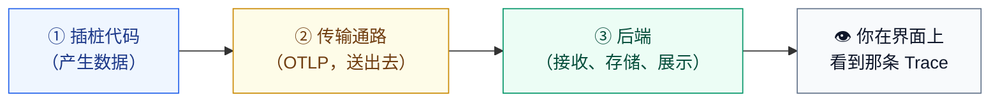
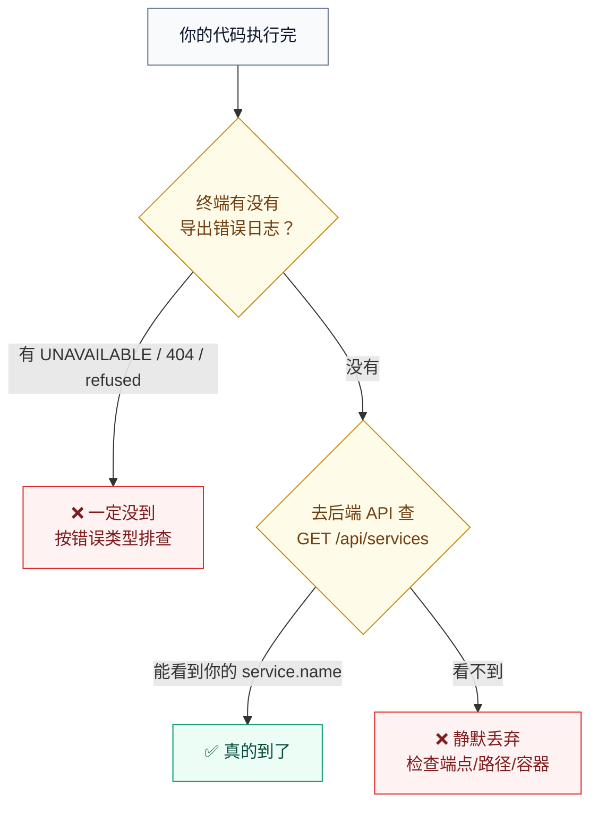
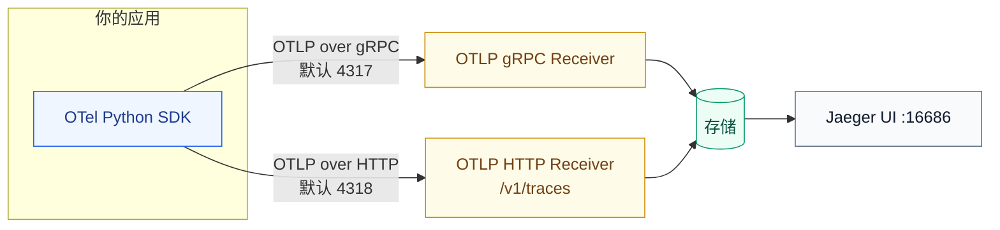
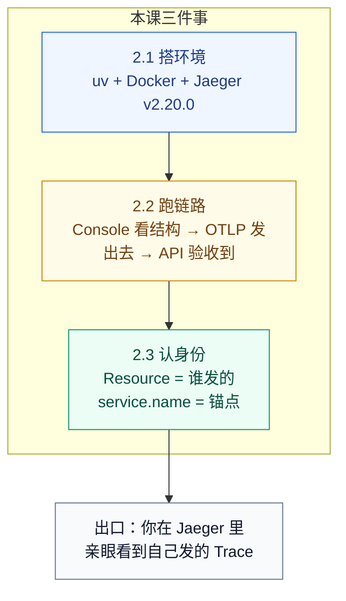
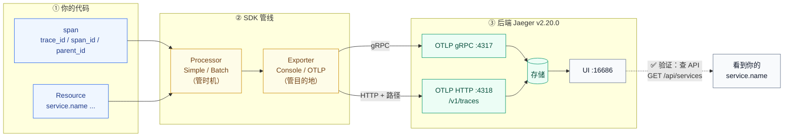

# 课 3 · 跑起来：第一个 Trace

> **状态**：✅ 已完成（2026-09-02）
> **所属阶段**：[阶段 1 · 三个控制台的四小时](../overview.md)
> **知识点**：3 个（2.1、2.2、2.3）
> **本课性质**：**本课程第一个实操课**。文中所有命令与输出均于 2026-09-02 在 WSL Ubuntu（Python 3.12.13 / uv 0.11.6 / Docker 29.4.1）上实跑验证，未实测的部分已显式标注。

[← 返回阶段概览](../overview.md) ｜ [← 返回课程目录](../../../02-课程目录.md)

---

## 📌 本课开始前的环境提示（务必先读）

本课要真跑起来，先确认你的机器属于哪一种。**本课程的实操路径固定为 WSL + Python + Docker**，理由见下表。

| 环境 | 有没有 | 本课用不用 | 说明 |
|------|--------|-----------|------|
| WSL Ubuntu（Python 3.12 + uv + Docker） | ✅ 有 | ✅ **主用** | 课 3 全部命令都在这里跑 |
| Windows 本机（Node v22.14.0） | ✅ 有 | ❌ 不用 | 有 Node 但无 Python/Docker CLI，且与骨架约定的实操路径不一致 |
| Windows 本机（Python / Go / Java） | ❌ 无 | — | `python` 会触发 Microsoft Store 别名报错 |

**为什么实操语言定为 Python**：WSL 内实测**无 Node / Go / Java**（`node`、`go`、`java` 均 not found），仅 Python 3.12 可用；后端走 Docker 起 Jaeger，不依赖宿主机语言。

> ⚠️ **一个容易踩的坑**：WSL 里的系统 Python 是 `3.12.3`，但 `uv venv` 实际拉取并使用的是 **CPython 3.12.13**（uv 会自动下载托管版本）。两者都是 3.12，不影响本课任何命令，但你在本机看到版本号不一样时不必惊慌。

---

## 一、本课在故事主线中的情节定位

| 叙事要素 | 内容 |
|----------|------|
| **角色** | 主角第一次"被看见"——从概念落到屏幕上的一条真实链路 |
| **转折** | 课 2 说清了 OTel 是什么，但"知道"不等于"见过" |
| **冲突** | 第一次跑通常跑不通：端口不对、导出器没配、后端没起来 |
| **本课出口** | 你在后端界面上亲眼看到自己发出的那条 Trace，并说清它是"谁"发的 |

---

## 二、本课目标

学完本课你应该能够：

1. **搭出**本机实操环境：uv 虚拟环境 + Docker 后端，端口规划清楚（4317 gRPC / 4318 HTTP）
2. **跑通**端到端：最小可运行代码 → Console 导出器看懂结构 → 切 OTLP → 后端界面上找到它
3. **解释** Resource 是什么，以及为什么 `service.name` 是最重要的那个属性

---

## 三、知识点清单

| # | 知识点 | 状态 |
|---|--------|------|
| 2.1 | 环境搭建：uv 虚拟环境 + Docker 后端 | ✅ |
| 2.2 | 第一个 Trace：从零到后端上的一条链路 | ✅ |
| 2.3 | Resource：这条数据是谁发的 | ✅ |

---

# 第一幕 · 场景引入：「我知道 OTel 是什么了，然后呢？」

## 课 2 结束时的你

课 2 结束时，你手里有一堆"正确认识"：

- OTel 是采集和传输的标准，不是后端
- 四大组件：规范、API+SDK、OTLP、Collector
- 五条边界：不存储、不可视化、不告警、不是银弹
- 三套版本号各自独立演进

这些话你说给别人听，别人会点头。但如果你诚实地问自己一句：

> **"我见过一条 Trace 吗？"**

答案多半是：没有。

## 知道和见过之间，隔着一条很宽的沟

这不是矫情。可观测性这门手艺有个特点：**它的所有概念都必须在"数据真的流起来"之后才有意义**。

你可以把 Trace 想象成"一次请求的监控录像"。在没有亲眼看过录像之前，你对"帧率""分辨率""时间轴"的所有讨论都是纸上谈兵。而 OTel 的很多设计——为什么要有导出器、为什么 Resource 必须配、为什么 `service.name` 是锚点——**只有当你把数据真发出去、并且在后端界面上找到它的那一刻，才会从"记住了"变成"懂了"**。

## 那么，跑一条 Trace 到底需要几步？

朴素地想，大概是：

```text
写几行代码 → 跑 → 在界面上看到
```

而实际上，你要同时搞定**三样东西**，缺一个都不行：



本课的目标，就是把这三个格子一个一个点亮。

**这一幕的出口**：你知道了本课要做什么——不是"再学一个概念"，而是**让一条真实的数据从你的代码流到一个界面上**。

---

# 第二幕 · 认知冲突：代码跑通了，后端上却什么都没有

## 第一次跑的人，几乎都会遇到这个场景

你按教程写好了代码，跑起来，终端安安静静，**没有任何报错**。你满怀期待打开浏览器 `http://localhost:16686`，搜索你的服务名——

**什么都没有。**

于是你开始怀疑人生：

- 是代码写错了？可是没报错啊
- 是后端没起来？可是界面能打开啊
- 是数据丢了吗？可是网络是本机啊

## 冲突的根源：OTel 的错误是"沉默"的

这是初学者最不适应的一点：**OTel 的导出失败，默认不会让程序崩溃，也不一定会在终端报错**。

数据导出是一个"尽力而为"的后台行为。SDK 把 span 攒成一批，交给导出器，导出器发出去。如果发不出去，它会：

1. 重试几次
2. 还是不行就**丢掉这批数据**
3. **继续跑你的业务代码，一切如常**

从你的程序的角度看，什么事都没发生。**这就是"代码跑通了但后端没有数据"的根本原因**——不是你的代码错了，是数据在半路上被静默丢弃了。

## 我把五种最常见的错误配置全跑了一遍

为了让你不用亲自踩坑，我在本机把五种典型错误配置逐一实测。**关键结论先说出来，这可能会颠覆你的直觉**：

> 🔴 **实测结论（2026-09-02）：`force_flush()` 和 `shutdown()` 的返回值在导出失败时依然返回 `True`。**
> 你**不能**用 `flush_ok=True` 来判断"数据到了后端"。

下面是完整的实测记录。五种配置中，**只有 F4 的数据真正到达了后端**。

| 编号 | 错误配置 | 终端表现 | `force_flush()` 返回 | 数据真到后端？ |
|------|---------|---------|---------------------|---------------|
| **F1** | gRPC 导出器指向 HTTP 端口 4318 | 报 `UNAVAILABLE`，`Failed parsing HTTP/2... got frame type 80` | `True` ❌撒谎 | ❌ **没到** |
| **F2** | HTTP 导出器指向 gRPC 端口 4317 | 报 `BadStatusLine` 一串乱码字节 | `True` ❌撒谎 | ❌ **没到** |
| **F3** | HTTP 导出器**漏写** `/v1/traces` 路径 | 报 `404 Not Found` | `True` ❌撒谎 | ❌ **没到** |
| **F4** | HTTP 导出器 + 完整路径 `/v1/traces` | 无报错 | `True` | ✅ **到了** |
| **F5** | 指向没人监听的端口 9999 | 报 `Connection refused` | `True` ❌撒谎 | ❌ **没到** |

**这是怎么验证的**：我给每种配置起了**互不相同的 service.name**（`fault-F1` … `fault-F5`），这样就能逐个查"这个名字有没有到过"。查完的结果非常干净：

```bash
curl -s "http://localhost:16686/api/services"
# 实测：{"data":["payment-service","unknown_service","faultlab","fault-F4","jaeger"]}

# 逐个确认到达条数
fault-F1 arrived_traces=0
fault-F2 arrived_traces=0
fault-F3 arrived_traces=0
fault-F4 arrived_traces=1     ← 只有它到了
fault-F5 arrived_traces=0
```

服务列表里**只有 `fault-F4` 出现过**。`fault-F1`、`fault-F2`、`fault-F3`、`fault-F5` 从未在后端注册过——它们的 `force_flush()` 全都返回了 `True`。

> 💡 **为什么第一轮实验我差点搞错**：最初我让五种配置共用同一个服务名 `faultlab`，结果后端显示"到了 2 条"，我误以为是 F4 之外的某个配置也成功了。改成每个配置独立命名后才发现，那是 F4 被跑了两次。**共用服务名会让多配置实验的结论不可靠**——你要做同类验证时，记得给每个用例起独立名字。

## 那到底该怎么判断成功？

既然返回值不可信，判据就只能落在**两个地方**：



**唯一可信的判据：去后端查 `GET /api/services`，看你的服务名在不在。**

这个结论在本课会被反复使用。记住它，你会少掉很多头发。

**这一幕的出口**：你知道了"沉默的失败"是常态，`flush_ok=True` 是个陷阱，而**后端 API 查询才是唯一可信的判据**。

---

# 第三幕 · 层层揭示：数据在路上都经过了什么

现在把那条链路拆开，看看数据从你的代码到界面，究竟走了哪几步。

## 揭示一：最小可运行代码其实只有四件事

先不看后端，用 Console 导出器把数据打到终端上。**这是本课最重要的一步——先看清结构，再谈传输。**

```python
from opentelemetry import trace
from opentelemetry.sdk.trace import TracerProvider
from opentelemetry.sdk.trace.export import ConsoleSpanExporter, SimpleSpanProcessor

provider = TracerProvider()                                    # ① 造一个 provider
provider.add_span_processor(SimpleSpanProcessor(ConsoleSpanExporter()))  # ② 装个处理器+导出器
trace.set_tracer_provider(provider)                            # ③ 设为全局
tracer = trace.get_tracer("lab03.demo")                        # ④ 拿一个 tracer

with tracer.start_as_current_span("parent") as parent:
    parent.set_attribute("lab.step", "1")
    with tracer.start_as_current_span("child"):
        print("doing work")
```

就这四步：

1. **`TracerProvider`** —— 数据的"生产车间"，负责造 span
2. **`SpanProcessor`** —— 数据出门前的"加工站"，决定**什么时候**送（Simple = 立刻，Batch = 攒批）
3. **`SpanExporter`** —— 数据出门的"运输方式"，决定**送到哪**（Console = 打终端，OTLP = 发网络）
4. **`tracer`** —— 你实际打交道的那个"笔"

> 💡 **Processor 和 Exporter 的分工**：Processor 管**时机**（何时送、要不要采样），Exporter 管**目的地**（送到哪、用什么协议）。很多人把两者混为一谈，于是配错了地方。

**实测输出**（2026-09-02，节选 `child` span）：

```json
{
    "name": "child",
    "context": {
        "trace_id": "0x39d27eb338ec03f7998bd59a2f4a349f",
        "span_id": "0x83126f68791e33de",
        "trace_state": "[]"
    },
    "kind": "SpanKind.INTERNAL",
    "parent_id": "0x3148fa0a330500eb",
    "start_time": "2026-09-02T11:51:59.557225Z",
    "end_time": "2026-09-02T11:51:59.557244Z",
    "status": { "status_code": "UNSET" },
    "attributes": {},
    "events": [],
    "links": [],
    "resource": {
        "attributes": {
            "telemetry.sdk.language": "python",
            "telemetry.sdk.name": "opentelemetry",
            "telemetry.sdk.version": "1.44.0",
            "service.instance.id": "3533ecb9-7165-4e27-bf1a-b8bfc7593363",
            "service.name": "unknown_service"
        },
        "schema_url": ""
    }
}
```

**请盯着这段输出看三十秒，因为里面有四个本课的核心事实**：

| 字段 | 实测值 | 它告诉你什么 |
|------|--------|-------------|
| `trace_id` | `0x39d27eb3...`（父子**相同**） | 父子 span 属于同一条链路，**这就是那把钥匙** |
| `span_id` | `0x83126f68...`（每个 span **唯一**） | 每个 span 有自己的身份证 |
| `parent_id` | `0x3148fa0a...`（= 父 span 的 id） | 树形结构靠它串起来 |
| `service.name` | **`unknown_service`** ⚠️ | 你没配 Resource，OTel 给了个占位符 |

前三行印证了课 1 的承诺——**`trace_id` 就是那把贯通三个信号的钥匙**，现在你亲眼看到了它。

第四行是本课的知识点 2.3 的引子：**`unknown_service` 这个默认值，是所有"我在后端找不到我的服务"问题的头号元凶**。

## 揭示二：从 Console 切到 OTLP，只改两处

现在把数据发到真正的后端。改动小得出人意料：

```diff
- from opentelemetry.sdk.trace.export import ConsoleSpanExporter, SimpleSpanProcessor
+ from opentelemetry.sdk.trace.export import BatchSpanProcessor
+ from opentelemetry.exporter.otlp.proto.grpc.trace_exporter import OTLPSpanExporter

  provider = TracerProvider()
- provider.add_span_processor(SimpleSpanProcessor(ConsoleSpanExporter()))
+ provider.add_span_processor(
+     BatchSpanProcessor(OTLPSpanExporter(endpoint="http://localhost:4317", insecure=True))
+ )
```

**两个变化**：

1. `ConsoleSpanExporter` → `OTLPSpanExporter`（**换目的地**）
2. `SimpleSpanProcessor` → `BatchSpanProcessor`（**换时机**：生产环境必须攒批，否则每个 span 一次网络请求）

> ⚠️ **`BatchSpanProcessor` 的代价**：数据会在内存里攒一会儿。如果你的程序是跑完就退出的短命脚本，**必须在退出前调用 `provider.force_flush()` 或 `provider.shutdown()`**，否则最后一批数据会丢。这是"本地能跑通、线上偶尔少数据"的经典原因。

## 揭示三：两条通路，别混用

OTLP 有两条传输方式，端口不同，**这是 F1/F2 错误的根源**：



**规则很简单，但极容易记反**：

| 你用的导出器类 | 端口 | 端点写法 |
|---------------|------|---------|
| `proto.grpc.trace_exporter.OTLPSpanExporter` | **4317** | `http://localhost:4317`（**不要**加路径） |
| `proto.http.trace_exporter.OTLPSpanExporter` | **4318** | `http://localhost:4318/v1/traces`（**必须**加路径） |

> 🔴 **这是本课最高频的坑**：HTTP 导出器漏写 `/v1/traces`，会得到一个 **404**，而且按第二幕的结论，`force_flush()` 照样返回 `True`。你在终端看到 `404 Not Found` 时，第一反应就该是检查这个路径。

**这一幕的出口**：你理解了数据流的三段（产生 → 处理 → 导出），知道 Processor 管时机、Exporter 管目的地，并且记住了 4317/4318 不能混用。

# 第四幕 · 实操验证：三步，从终端到界面

**下面每一步都在 2026-09-02 于 WSL Ubuntu 上实跑通过。** 建议你自己跟着敲一遍。

## 第 0 步：建虚拟环境，装依赖

```bash
mkdir -p ~/otel-course/lab03 && cd ~/otel-course/lab03
uv venv --python 3.12
uv pip install opentelemetry-api opentelemetry-sdk \
    opentelemetry-exporter-otlp-proto-grpc \
    opentelemetry-exporter-otlp-proto-http
```

**实测装上的版本**（2026-09-02，共 16 个包）：

```text
+ opentelemetry-api==1.44.0
+ opentelemetry-sdk==1.44.0
+ opentelemetry-exporter-otlp-proto-grpc==1.44.0
+ opentelemetry-exporter-otlp-proto-http==1.44.0
+ opentelemetry-exporter-otlp-proto-common==1.44.0
+ opentelemetry-proto==1.44.0
+ opentelemetry-semantic-conventions==0.65b0
+ grpcio==1.83.1
+ protobuf==7.36.1
+ requests==2.34.2
...（其余为传递依赖）
```

> 💡 **为什么连装了 grpc 和 http 两个导出器**：本课要演示两条通路的区别。实际项目装一个就够。

**第 0 步实测确认**：`uv run python xxx.py` 不需要任何额外参数就能自动选中本目录的 `.venv`：

```text
$ uv run python -c "import sys; print(sys.version.split()[0], sys.executable)"
3.12.13 /root/otel-course/lab03/.venv/bin/python3
```

注意解释器路径是 `lab03/.venv/bin/python3` —— **uv 自动激活了虚拟环境**，所以你不必手动 `source .venv/bin/activate`。

> 💡 **为什么还是建议用 `uv run` 而不是手动 activate**：`uv run` 每次都保证用的是本项目的环境，避免你在多个课程目录间切换时"装到了 A 却跑在 B"这种经典事故。

## 第 1 步：起后端（Jaeger v2）

```bash
docker run -d --name jaeger-lab03 \
  -p 16686:16686 -p 4317:4317 -p 4318:4318 \
  jaegertracing/jaeger:latest
```

**实测结果**：

```text
jaeger-lab03   Up   0.0.0.0:4317-4318->4317-4318/tcp, 0.0.0.0:16686->16686/tcp
curl http://localhost:16686/  ->  HTTP 200
```

镜像版本实测为 **`jaeger version v2.20.0`**（build-date 2026-07-20），其日志显示内部基于 **OTel Collector v0.155.0**：

```text
otlpreceiver@v0.155.0/otlp.go:120  Starting GRPC server  endpoint "[::]:4317"
otlpreceiver@v0.155.0/otlp.go:175  Starting HTTP server  endpoint "[::]:4318"
service@v0.155.0/service.go:279    Everything is ready.
```

> ⚠️ **镜像名变了！这是 2026 年最容易被过时教程坑到的一点。**
> Jaeger **v1 已于 2025-12-31 EOL**，官方镜像名从 `jaegertracing/all-in-one` 改为 **`jaegertracing/jaeger`**。
> 你现在还能搜到大量使用 `all-in-one:1.xx` 的教程（甚至 2026 年发布的文章仍在用），那些是 v1 写法。**本课用 `jaegertracing/jaeger:latest`**。
> v2 是构建在 OTel Collector 之上的发行版，原生接收 OTLP，Jaeger agent 和原生协议已被移除。

**为什么选 Jaeger 而不是别的？**（骨架要求给出至少两个可选项）

| 后端 | 优点 | 为什么本课不选 |
|------|------|---------------|
| **Jaeger v2** ✅ | CNCF 毕业项目、一条命令起、原生 OTLP、UI 直观、内存存储免配置 | — |
| Zipkin | 老牌、轻量 | OTel 支持不如 Jaeger 原生，生态重心已转移 |
| Grafana Tempo | 与 Prometheus/Grafana 一体 | 需额外配 Grafana  datasource，起步成本高 |
| SigNoz / Uptrace | 开箱即用的全信号平台 | 组件多、启动慢，不适合"第一个 Trace" |

**结论**：Jaeger 赢在"一条命令 + 一个端口 + 立刻能看"。本课的目标是**先看见**，不是搭生产平台。

## 第 2 步：Console 导出器 —— 先看清结构

把第三幕那段最小代码存成 `console_demo.py`，跑：

```bash
uv run python console_demo.py
```

**你会看到两个 span（`child` 先于 `parent` 打印，因为 Simple 处理器在每个 span 结束时立刻导出，而 `child` 先结束）**，它们的 `trace_id` 相同、`parent_id` 把 `child` 挂到 `parent` 之下。

**这一步的价值**：你现在知道一条 Trace 长什么样了。**先看清结构，再去后端找它**——否则你在界面上看到了也不知道自己在看什么。

## 第 3 步：切 OTLP —— 发到后端

```python
import time
from opentelemetry import trace
from opentelemetry.sdk.resources import Resource
from opentelemetry.sdk.trace import TracerProvider
from opentelemetry.sdk.trace.export import BatchSpanProcessor
from opentelemetry.exporter.otlp.proto.grpc.trace_exporter import OTLPSpanExporter

provider = TracerProvider(
    resource=Resource.create({"service.name": "payment-service"})
)
provider.add_span_processor(
    BatchSpanProcessor(OTLPSpanExporter(endpoint="http://localhost:4317", insecure=True))
)
trace.set_tracer_provider(provider)

tracer = trace.get_tracer("lab03.demo")
with tracer.start_as_current_span("checkout") as span:
    span.set_attribute("lab.label", "A-explicit-name")
    with tracer.start_as_current_span("charge"):
        time.sleep(0.01)

provider.force_flush()
provider.shutdown()
print(f"trace_id={span.get_span_context().trace_id:032x}")
```

**实测输出**：

```text
[A-explicit-name] flushed, trace_id=de18e2c9fee2041183a8f4a014be6f76
```

## 第 4 步：去后端查 —— 用 API，别只用眼睛

打开浏览器 `http://localhost:16686`，在 Service 下拉框里应该能看到 `payment-service`。

**但按第二幕的结论，请用 API 确认**：

```bash
curl -s "http://localhost:16686/api/services"
```

**实测输出**：

```json
{"data":["payment-service","unknown_service","faultlab","fault-F4","jaeger"],...}
```

看到了 `payment-service` —— **数据真的到了**。再取这条 trace 的详情：

> **为什么列表里有个 `jaeger`？** Jaeger v2 基于 OTel Collector 构建，它会**给自己也发遥测数据**（实测有 9 条自监控 trace）。所以你在 UI 的 Service 下拉框里看到 `jaeger` 这一项是正常的，**不是你的数据出错**——这是"OTel 自己也吃自己的狗粮"的直观例证。

```bash
curl -s "http://localhost:16686/api/traces?service=payment-service&limit=5"
```

**实测节选**（注意 `processes.p1` 这一段）：

```json
{
  "traceID": "de18e2c9fee2041183a8f4a014be6f76",
  "spans": [
    { "operationName": "charge",   "spanID": "2d0f6c7ccadb5764",
      "references": [{"refType":"CHILD_OF","spanID":"a447fce775d67a71"}] },
    { "operationName": "checkout", "spanID": "a447fce775d67a71", "references": [] }
  ],
  "processes": {
    "p1": {
      "serviceName": "payment-service",
      "tags": [
        {"key":"service.instance.id","value":"6d8069bf-..."},
        {"key":"telemetry.sdk.language","value":"python"},
        {"key":"telemetry.sdk.name","value":"opentelemetry"},
        {"key":"telemetry.sdk.version","value":"1.44.0"}
      ]
    }
  }
}
```

**请特别注意这段输出的结构**：`serviceName` 不在每个 span 上，而是在 **`processes`（即 Resource）** 里。

这就是 Resource 的作用——**它是"这批数据是谁发的"，对所有 span 生效一次，而不是每个 span 重复一遍**。

## 🎬 可视化验证：在界面上亲眼看一看

> 以下描述基于 Jaeger v2.20.0 UI 的实测访问（`HTTP 200` 可达），界面元素名称以 v2 版本为准。

打开 `http://localhost:16686`：

1. 左侧 **Service** 下拉框选择 `payment-service`
2. 点 **Find Traces**
3. 你会看到一条 trace，操作名 `checkout`，耗时约 10ms
4. 点进去，看到两个 span 组成的水位图：`checkout`（父）→ `charge`（子）
5. 点开 `checkout` 展开 Tags，能看到 `lab.label = A-explicit-name`

**到这里，你完成了本课的出口目标**：亲眼看到了自己发出的那条 Trace。

**这一幕的出口**：你手上有一个跑通的环境，和一条在 Jaeger 里躺着、由你亲手发出的 Trace。

---

# 第五幕 · 体系收束：Resource —— 这条数据是谁发的

## 回到那个刺眼的 `unknown_service`

第三幕的 Console 输出里，有一行很不体面：

```json
"service.name": "unknown_service"
```

你什么都没配，OTel 给了个占位符。**这不是 bug，是 OTel 在提醒你：你还没告诉我这条数据是谁发的。**

## 知识点 2.3 · Resource：这条数据是谁发的

### 一句话定义

**Resource 是描述"产生这批遥测数据的实体（通常是一个服务实例）"的不可变属性集合，它回答的是"谁发的"，而不是"发生了什么"。**

### 直觉建立：快递面单 vs 包裹清单

想象你寄一个包裹：

- **包裹里的每件商品**都有标签：颜色、尺码、价格 → 这是 **Attributes（Span 属性）**，每个 span 各不相同
- **快递面单**上写着寄件人：谁寄的、从哪个仓库、什么环境 → 这是 **Resource**，整批货物共用一张

**Resource 就是那张快递面单。** 一个进程里的所有 span 共享同一个 Resource，所以 `service.name` 不会在每个 span 上重复存储——正如你在第 4 步的 `processes.p1` 里看到的那样。

### 核心原理

Resource 的三个关键特性：

1. **进程级，不是 span 级**：一批 span 共享一份，后端存一次
2. **创建后不可变**：`Resource.create()` 返回的对象不能再改，要改只能 `merge` 出新的
3. **有默认值兜底**：即使你什么都不配，SDK 也会填 `telemetry.sdk.*` 和 `service.instance.id`

**实测：不配置时的默认 Resource**（2026-09-02）：

```text
telemetry.sdk.language = python
telemetry.sdk.name     = opentelemetry
telemetry.sdk.version  = 1.44.0
service.instance.id    = c84bd651-9aa3-4303-ace9-3eaeb62ec31b
service.name           = unknown_service     ← 唯一的"求你填一下"的占位符
```

### 示例演示：`service.name` 的四种设置方式

**方式一：代码里显式写（最推荐，最明确）**

```python
Resource.create({"service.name": "payment-service"})
```

**方式二：环境变量 `OTEL_SERVICE_NAME`（运维友好，不用改代码）**

```bash
export OTEL_SERVICE_NAME=env-service
```

**方式三：环境变量 `OTEL_RESOURCE_ATTRIBUTES`（批量设多个属性）**

```bash
export OTEL_RESOURCE_ATTRIBUTES=deployment.environment=lab,team=payments
```

**方式四：不设 → 得到 `unknown_service`（不推荐）**

### 常见误区

#### 🐞 误区一：以为环境变量会覆盖代码里的值

很多人以为"环境变量是最终配置，优先级最高"。**实测结论正好相反**：

| 设置方式 | 实测结果 | 谁赢 |
|---------|---------|------|
| 代码 `{"service.name":"code-wins"}` + 环境变量 `OTEL_SERVICE_NAME=env-service` | `code-wins` | **代码赢** |
| 代码 `{"team":"code-team"}` + 环境变量 `team=payments` | `code-team` | **代码赢** |

> **优先级：代码显式属性 > 环境变量 > SDK 默认值。**
> 记住这个方向：越靠近你的代码，优先级越高。环境变量是给"不改代码就能调"用的兜底手段，不是用来推翻代码的。

#### 🐞 误区二：搞反 `merge` 的覆盖方向

```python
base = Resource.create({"service.name": "base", "a": "1"})
over = Resource.create({"service.name": "override", "b": "2"})

base.merge(over)   # 实测 -> service.name = "override"
over.merge(base)   # 实测 -> service.name = "base"
```

**实测规则：后者覆盖前者**（`A.merge(B)` 里 B 的键赢）。想清楚你要以谁为准。

#### 🐞 误区三：用空字符串"占位"，指望后面再填

```python
Resource.create({"service.name": ""})   # 实测结果：unknown_service
```

**实测：空字符串会被兜底成 `unknown_service`**，不会给你留一个空位。要设就设真值。

#### 🐞 误区四：把"每次请求都变"的东西塞进 Resource

Resource 描述的是**进程**，`user_id`、`order_id`、`request_id` 这些属于**单次操作**，必须放在 Span Attributes 里。

| 放 Resource ✅ | 放 Span Attributes ✅ |
|---------------|---------------------|
| `service.name` | `user.id` |
| `service.version` | `order.id` |
| `deployment.environment` | `http.status_code` |
| `host.name` | `db.statement` |
| `telemetry.sdk.language` | `error.type` |

> 💡 **判断口诀**：**进程重启后会变的，放 Resource；每次请求都变的，放 Attributes。**


#### 误区五：在 `set_tracer_provider()` 之前就拿了 tracer

这是"代码跑通但后端没数据"的**另一个**高频原因，而且它比端口配错更隐蔽——因为它**不报任何错**。

```python
early_tracer = trace.get_tracer("early")        # ← 太早了，provider 还没设
with early_tracer.start_as_current_span("orphan") as s:
    pass                                         # 这个 span 会被丢掉

provider = TracerProvider(...)                   # ← 现在才设
trace.set_tracer_provider(provider)
```

**实测结果**（2026-09-02）：

```text
[early]       is_recording=False  trace_id=0      ← 数据丢了，且无报错
[early-after] is_recording=True   trace_id=8da0641b5a170397b26c7334b39ebdb4
[late]        is_recording=True   trace_id=e145b655fbcbb36de124957c9919eca3
```

**这里有个反直觉但很重要的细节**：第二行 `[early-after]` 用的是**同一个 `early_tracer` 对象**，只是调用发生在 `set_tracer_provider()` **之后**——它居然正常工作了。

原因是 `get_tracer()` 返回的是一个**代理对象**（`ProxyTracerProvider`，这一点在课 2 已实测确认；不少旧教程说的 `NoOpTracerProvider` 并不准确）。代理会**延迟到真正创建 span 的那一刻**才去找真正的 provider：

- 设置 provider **之前**创建的 span → 找不到 provider → `trace_id = 0`、`is_recording() = False` → **静默丢弃**
- 设置 provider **之后**创建的 span → 正常委托 → 拿到真实 `trace_id`

> **实操口诀**：**先 `set_tracer_provider()`，后 `get_tracer()`。** 最省事的做法是把这两行紧挨着写在程序入口处。
>
> **诊断技巧**：怀疑"数据没发出去"时，打印 `span.get_span_context().trace_id`——**如果它是 `0`，说明这个 span 从一开始就没被记录**。这比 `flush_ok` 可靠得多。
### 一句话记住

> **Resource 是"谁发的"，Attributes 是"发生了什么"；`service.name` 是 Resource 里唯一必须填的那个，不填就是 `unknown_service`。**

## 为什么 `service.name` 是最重要的那个属性

因为**它是后端组织和检索数据的一级索引**。

- Jaeger UI 的第一个下拉框就是 Service
- 后端按 service 聚合、算 RED 指标、画依赖图
- 你排查问题的第一步永远是先选定"哪个服务"

**实测反证**：在第二幕的实验中，我没设 `service.name` 的那批数据，在 Jaeger 里的服务名就叫 **`unknown_service`**。当你的系统有 20 个服务、其中 12 个没配 `service.name` 时，这 12 个服务的数据会**全部挤在同一个 `unknown_service` 名下**——你根本分不清哪条是谁发的。

**这就是"为什么 `service.name` 是最重要的那个属性"的答案：它是数据的归属地。**

## 本课知识点的六要素速查

### 2.1 环境搭建：uv 虚拟环境 + Docker 后端

- **一句话定义**：用 `uv` 管理 Python 依赖、用 Docker 起一个接收 OTLP 的后端，构成本课程的本地实操基座。
- **直觉建立**：做饭前先备好灶台和锅——灶台是虚拟环境（隔离依赖），锅是后端（接收成品）。
- **核心原理**：`uv venv` 创建隔离环境避免污染系统 Python；Docker 容器提供开箱即用的 OTLP 接收端（4317/4318）与查询界面（16686）。
- **示例演示**：`uv venv --python 3.12` + `uv pip install opentelemetry-sdk ...` + `docker run -d -p 16686:16686 -p 4317:4317 -p 4318:4318 jaegertracing/jaeger:latest`（均已实测）。
- **常见误区**：沿用 `jaegertracing/all-in-one` 这个 **v1 时代的镜像名**（v1 已于 2025-12-31 EOL）。
- **一句话记住**：**灶台用 uv，锅用 Docker，镜像名认准 `jaegertracing/jaeger`。**

### 2.2 第一个 Trace：从零到后端上的一条链路

- **一句话定义**：用最小代码产生 span，经 Processor 交给 Exporter，通过 OTLP 送到后端并在界面上看到它。
- **直觉建立**：寄快递——写包裹（span）→ 交给揽收点（Processor）→ 选物流公司（Exporter）→ 对方签收（后端）。
- **核心原理**：`TracerProvider` 生产 span，`SpanProcessor` 决定时机，`SpanExporter` 决定目的地；OTLP 有 gRPC(4317) 与 HTTP(4318) 两条通路，不可混用。
- **示例演示**：Console 导出器看结构 → 切 OTLP gRPC → `curl /api/services` 确认到达（已完成实测，trace_id `de18e2c9...`）。
- **常见误区**：**以为 `force_flush()` 返回 `True` 就代表数据到了**——实测在五种错误配置下它都返回 `True`，但只有一种真到了。
- **一句话记住**：**跑通不等于送到，唯一可信的判据是去后端查 `GET /api/services`。**

### 2.3 Resource：这条数据是谁发的

- **一句话定义**：描述产生遥测数据的实体（服务实例）的不可变属性集合，回答"谁发的"。
- **直觉建立**：快递面单——面单（Resource）整批共用，商品标签（Attributes）每件不同。
- **核心原理**：进程级共享、创建后不可变、有默认值兜底；优先级为**代码 > 环境变量 > 默认**；`merge` 时后者覆盖前者。
- **示例演示**：未配置时 `service.name` 实测为 `unknown_service`；代码设 `payment-service` 后，Jaeger API 的 `processes.p1.serviceName` 相应变化。
- **常见误区**：把 `user_id` / `order_id` 这类每次请求都变的值塞进 Resource。
- **一句话记住**：**Resource 是"谁发的"，Attributes 是"发生了什么"；`service.name` 不填就是 `unknown_service`。**

---

# 本课小结



**三条硬结论**：

1. **跑通 ≠ 送到**：`force_flush()` 返回 `True` 时数据也可能被静默丢弃。唯一可信判据是查后端 `GET /api/services`。
2. **4317 与 4318 不可混用**：gRPC 走 4317（不加路径），HTTP 走 4318（**必须加 `/v1/traces`**）。
3. **`service.name` 必须设**：不设就是 `unknown_service`，多个未设的服务会在后端挤成同一个名字，彻底失去分辨能力。

---

## 🐞 本课误区清单（汇总）

| # | 误区 | 真相 | 出处 |
|---|------|------|------|
| 1 | `force_flush()` 返回 `True` = 数据到了 | 返回值不可信，五种错误配置下均返回 `True` 却全丢 | 第二幕实测 |
| 2 | 沿用 `jaegertracing/all-in-one` 镜像 | v1 已于 2025-12-31 EOL，镜像名改为 `jaegertracing/jaeger` | 第四幕第 1 步 |
| 3 | HTTP 导出器端点写到 4317 | 4317 是 gRPC，HTTP 走 4318 且须带 `/v1/traces` | 第三幕揭示三 / F3 实测 |
| 4 | 环境变量优先级最高 | 代码显式属性 > 环境变量 > 默认值 | 2.3 误区一实测 |
| 5 | `A.merge(B)` 是 A 覆盖 B | 后者覆盖前者，B 赢 | 2.3 误区二实测 |
| 6 | `service.name: ""` 能占位待填 | 实测被兜底成 `unknown_service` | 2.3 误区三实测 |
| 7 | 把 `user_id` 放进 Resource | Resource 描述进程，每次请求变的值放 Span Attributes | 2.3 误区四 |
| 8 | 短命脚本用 `BatchSpanProcessor` 不 flush | 最后一批会丢，退出前必须 `force_flush()` / `shutdown()` | 第三幕揭示二 |
| 9 | 在 `set_tracer_provider()` 之前就 `get_tracer()` | 之前创建的 span `trace_id=0` 被静默丢弃，且不报错 | 2.3 误区五实测 |

---

## 一图总结



---

## 📌 练习

**练习 1（判据训练，必做）**
把第 3 步的端点从 `http://localhost:4317` 改成 `http://localhost:4318`（其他都不改，制造 F1 场景），跑一遍。
预测：终端报什么错？`force_flush()` 返回什么？Jaeger 里 `payment-service` 下会多几条 trace？
然后用 `curl -s "http://localhost:16686/api/services"` 验证你的预测。

**练习 2（Resource 训练）**
写一个脚本，用**环境变量**而不是代码设置 `service.name=order-service` 与 `deployment.environment=dev`，发一条 trace。
进阶：在代码里同时写 `Resource.create({"service.name": "code-wins"})`，预测后端收到的是哪个名字，再用 API 验证。

**练习 3（结构观察）**
在 Console 导出器版本里加第三个嵌套 span（parent → child → grandchild），观察三个 span 的 `trace_id`、`span_id`、`parent_id`，画出这棵树。

**练习 4（思考题）**
你的公司有 30 个微服务，运维通过 K8s 统一注入 `OTEL_SERVICE_NAME`。但某个服务在代码里硬编码了另一个 `service.name`。
按本课的优先级规则，最终后端看到的是什么？这个机制是特性还是坑？

---

## 📍 全局定位

**在课程中的位置**：

```text
阶段 1 · 三个控制台的四小时（9 个知识点）
├── 课 1 ✅ 一次 502 的四小时        （1.1、1.2）感知痛点
├── 课 2 ✅ OTel 是什么与它不是什么  （1.3-1.6）建立认知
└── 课 3 ✅ 跑起来：第一个 Trace     （2.1-2.3）← 你在这里
                                      首次亲手验证，阶段 1 收尾
```

**承上**：课 1 说"三个信号连不起来"，课 2 说"OTel 提供统一插桩与传输"。本课**第一次让这两句话落地**——你亲眼看到了 `trace_id` 把父子 span 串起来，也亲眼看到了 OTel 把数据送进了后端。

**启下**：

- **阶段 2（课 4 起）** 全部建立在本课跑通的那条链路之上——先看它长什么样（本课），再拆开看 Span 内部与跨服务传播（课 4）
- **课 10 Collector** 会让你理解为什么本课"应用直连后端"只是教学简化，生产环境中间该有一层 Collector
- **课 9 语义约定** 会回扣本课的 Resource——`service.name` 只是语义约定里的一小部分，那时你会看到完整的属性命名体系

**本课在"三个控制台"故事里的意义**：课 1 的主角（那次 502 请求）在课 3 第一次被真正"看见"了。

---

## 🔗 下一步

**课 4 · Span 与上下文传播**（[跳转](../../2-一次请求的完整旅程/lessons/lesson-04-Span与上下文传播.md)）

本课你站在外面看了一条 Trace 的样子。课 4 会拆开它：Span 内部有什么（事件、属性、状态、Kind），以及**最关键的问题——跨服务时 `trace_id` 是怎么传过去的**。

---

## ⚠️ 别急着下结论

**容易过推的三个地方**：

1. **"应用直连后端就够了"** —— 本课为了让你最快看到结果，让 SDK 直连 Jaeger。**生产环境不会这么做**。中间应该有一层 Collector 来负责批处理、重试、采样、脱敏和多后端分发。这个坑课 10 会正面解决。

2. **"Jaeger 就是 OTel 的默认后端"** —— 不是。Jaeger 只是本课选的一个**接收 OTLP 的后端**。换成 Tempo、Zipkin、云厂商或商业 APM，你的代码**一行都不用改**（只改导出器端点）。这正是课 2 那句"插桩一次，随处消费"的含义。

3. **"BatchSpanProcessor 就是比 Simple 好"** —— 在**短命脚本**里恰恰相反：Batch 攒的数据可能因为进程退出而丢，Simple 立即导出反而更安全。选择取决于你的进程寿命，不是哪个"更高级"。

**本课没有覆盖的**：

- 采样（Sampler）——为什么不是所有请求都产生 trace
- 跨服务传播（Propagation）——本课只有单进程内的父子 span
- Metrics 与 Logs 的导出——本课只碰了 Traces
- Collector 的介入——生产链路的关键一层

这些会在课 4、课 6、课 10 陆续展开。

---

## 🧭 课程导航

- 上一课：[课 2 · OTel 是什么与它不是什么](./lesson-02-OTel是什么与它不是什么.md)
- 阶段概览：[阶段 1 · 三个控制台的四小时](../overview.md)
- 下一课：[课 4 · Span 与上下文传播](../../2-一次请求的完整旅程/lessons/lesson-04-Span与上下文传播.md)
- [← 返回课程目录](../../../02-课程目录.md)

---

## 🚀 下一批接力提示词

```
我的 OpenTelemetry 学习档案在 opentelemetry/00-学习档案.md，
刚学完阶段 1 课 3《跑起来：第一个 Trace》
（知识点 2.1 环境搭建、2.2 第一个 Trace、2.3 Resource）。
阶段 1 的 9 个知识点已全部完成。
请按大纲继续讲解课 4《Span 与上下文传播》（阶段 2 第 1 课）。
本机环境（2026-09-02 实测）：
- Windows 有 Node v22.14.0，无 Python/Go；
- WSL Ubuntu 有 Docker 29.4.1、uv 0.11.6，
  已建好 ~/otel-course/lab03 虚拟环境（Python 3.12.13，OTel SDK 1.44.0）；
- Jaeger 后端容器名为 jaeger-lab03，端口 16686/4317/4318 已通，
  若已停止可用 docker start jaeger-lab03 恢复。
课 4 实操继续沿用 WSL + Python + Docker 路径。
```

---

## 交付状态

| 项 | 状态 |
|---|------|
| 知识点 2.1 / 2.2 / 2.3 | ✅ 已完成 |
| 五幕叙事结构 | ✅ 完整（场景引入 / 认知冲突 / 层层揭示 / 实操验证 / 体系收束） |
| 六要素（每个知识点） | ✅ 齐全（一句话定义 / 直觉建立 / 核心原理 / 示例演示 / 常见误区 / 一句话记住） |
| 实操命令实测 | ✅ 全部命令于 2026-09-02 在 WSL Ubuntu 实跑（Python 3.12.13 / uv 0.11.6 / Docker 29.4.1 / Jaeger v2.20.0 / OTel SDK 1.44.0） |
| 后端选型对比 | ✅ 4 个选项（Jaeger / Zipkin / Tempo / SigNoz） |
| 环境约束提示 | ✅ 正文开头双环境对照表 |
| 图表 | ✅ 5 张 Mermaid（三格目标图 / 判据决策树 / 双通路图 / 小结图 / 一图总结） |
| 双视角评审 | ✅ 已完成（pedagogy + learner，见 `00-学习档案.md` 评审记录；⚠️ 由主 agent 内联执行，独立性受限） |
| 档案回写 | ✅ 四处（学习档案 / 评审清单 / 阶段 overview / 课程目录 + 学习路径总览） |

**本课实测纠正的两处事实**（与流传说法不同）：

1. **`force_flush()` 返回值不可信**——五种错误导出配置下均返回 `True`，但数据全被静默丢弃。判据必须是后端 `GET /api/services`。
2. **Jaeger 镜像名已变更**——`jaegertracing/all-in-one`（v1，2025-12-31 EOL）→ `jaegertracing/jaeger`（v2）。大量 2026 年发布的教程仍在用旧名。
