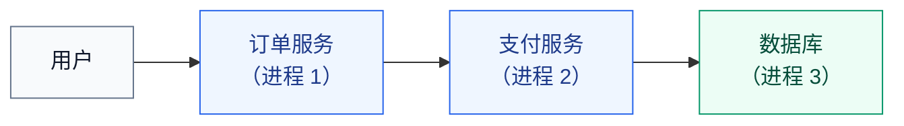
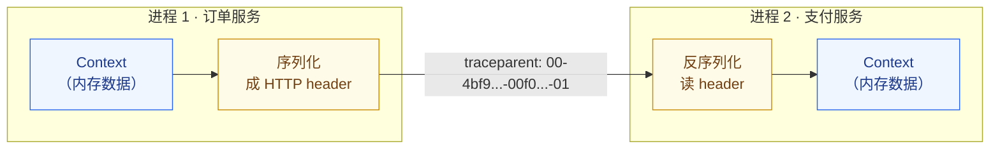
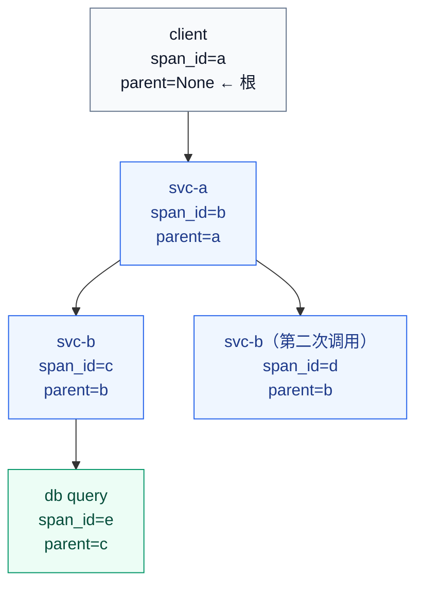
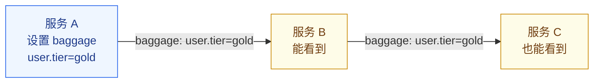
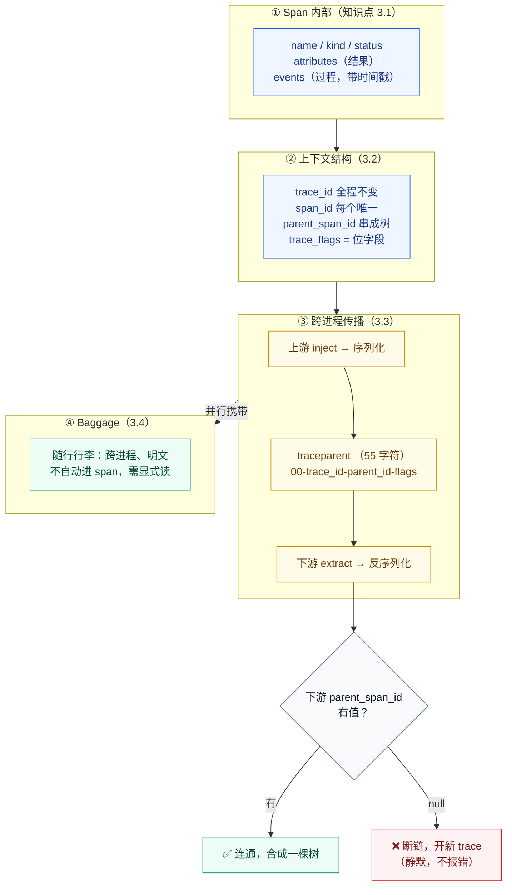

# 课 4 · Span 与上下文传播

> **状态**：✅ 已完成（2026-09-02）
> **所属阶段**：[阶段 2 · 一次请求的完整旅程](../overview.md)
> **知识点**：4 个（3.1、3.2、3.3、3.4）
> **本课性质**：**跨进程实操课**。文中所有命令与输出均于 2026-09-02 在 WSL Ubuntu（Python 3.12.13 / uv 0.11.6 / Docker 29.4.1 / OTel SDK 1.44.0 / Jaeger v2.20.0）上实跑验证。

[← 返回阶段概览](../overview.md) ｜ [← 返回课程目录](../../../02-课程目录.md)

---

## 📌 本课开始前的环境提示

本课沿用课 3 的环境，并新增两个插桩包。

| 组件 | 课 3 已有 | 本课新增 |
|------|----------|---------|
| 虚拟环境 | `~/otel-course/lab03`（Python 3.12.13，OTel SDK 1.44.0） | — |
| 后端 | 容器 `jaeger-lab03`（Jaeger v2.20.0，端口 16686/4317/4318） | — |
| 插桩包 | `opentelemetry-api` / `-sdk` / OTLP gRPC / OTLP HTTP | `flask`、`opentelemetry-instrumentation-flask`、`opentelemetry-instrumentation-requests` |

**若容器已停止**，先恢复：

```bash
docker start jaeger-lab03
```

**本课新增依赖**（实测版本）：

```bash
uv pip install flask opentelemetry-instrumentation-flask opentelemetry-instrumentation-requests
```

```text
+ flask==3.1.3                                   + werkzeug==3.1.8
+ opentelemetry-instrumentation==0.65b0          + opentelemetry-instrumentation-flask==0.65b0
+ opentelemetry-instrumentation-requests==0.65b0 + opentelemetry-instrumentation-wsgi==0.65b0
+ opentelemetry-util-http==0.65b0                + wrapt==2.4.0
```

> 💡 **注意插桩包的版本号规则**：`opentelemetry-instrumentation-*` 是 **0.65b0**，而 API/SDK 是 **1.44.0**。这两套版本号**各自独立演进**（课 2 讲过的"三套版本号"），看到不一样不必惊慌。

---

## 一、本课在故事主线中的情节定位

| 叙事要素 | 内容 |
|----------|------|
| **角色** | 拆开课 3 跑通的那条链路，看它内部长什么样 |
| **转折** | 一条 Trace 不是一条线，是一**棵树**——树靠什么长出来？ |
| **冲突** | 单服务能跑通，跨服务就断成两条——因为上下文没传过去 |
| **本课出口** | 你能逐字段读出 `traceparent`，能说出断链的常见原因 |

---

## 二、本课目标

学完本课你应该能够：

1. **读懂** Span 的字段全览：名称、Kind、时间、状态、Attributes、Events
2. **解释** `trace_id` / `span_id` / `trace_flags` 如何构成父子关系与树状结构
3. **逐字段解析** W3C Trace Context 的 `traceparent`，并说明 `tracestate` 的作用
4. **判断** Baggage 该不该用（与 Attributes 的区别、性能代价）

---

## 三、知识点清单

| # | 知识点 | 状态 |
|---|--------|------|
| 3.1 | Span：链路的最小单元 | ✅ |
| 3.2 | Trace 与 Span 上下文 | ✅ |
| 3.3 | 上下文传播：W3C Trace Context 与 `traceparent` | ✅ |
| 3.4 | Baggage：随请求携带的键值对 | ✅ |

---

# 第一幕 · 场景引入：课 3 那条链路，其实不止一个框

## 回顾课 3 的终点

课 3 结束时，你在 Jaeger 里看到了自己发出的第一条 Trace。它长这样：

```text
checkout  (父)
└── charge  (子)
```

两个框，一条连线。你当时盯着的是"哇，它真的出现了"。

现在请你换一个角度再看一次：**这两个框，是靠什么粘在一起的？**

## 单进程内，答案是"代码结构"

在课 3 里，父子关系来自你写的代码结构——`with` 的嵌套：

```python
with tracer.start_as_current_span("checkout") as span:      # 父
    with tracer.start_as_current_span("charge"):            # 子
        time.sleep(0.01)
```

`start_as_current_span` 会查看"当前活跃的是哪个 span"，然后把自己挂到它下面。**这套机制叫 Context，它活在进程内存里。**

## 但真实系统里，一次请求要跨好几个进程



问题来了：**Context 是内存里的一块数据。进程 1 的内存，进程 2 读不到。**

那么进程 2 凭什么知道"我这次调用属于进程 1 那条链路"？

## 答案必须"搭车"过去

既然内存不共享，唯一的办法是：**把上下文序列化，跟着请求一起发出去**。



这个"搭车"的动作，就叫做**上下文传播（Context Propagation）**。

**这一幕的出口**：你知道了本课要解决的核心问题——**上下文是内存数据，它必须被序列化后搭着请求的车，才能跨进程旅行**。

---

# 第二幕 · 认知冲突：明明同一次请求，为什么断成了两条

## 一个真实的翻车现场

你在本地把链路跑通了，兴冲冲部署到测试环境。打开 Jaeger 一看：

**本来应该是一条的链路，变成了两条互不相干的 Trace。**

```text
Trace A:  [订单服务 /checkout]                    ← 只有它自己
Trace B:               [支付服务 /charge]          ← 也是孤零零一个
```

你检查了一遍：代码没错、网络是通的、日志里明明打了同一个业务 ID。**可它们就是连不起来。**

## 冲突的根源：序列化这一步，被悄悄跳过了

回到第一幕的结论：上下文必须**序列化 → 传输 → 反序列化**。

**而在"断链"的场景里，中间那一步根本没发生。** 没有 header，下游服务就收不到上游的 `trace_id`，于是它只能——

**自己新开一条 Trace。**

这不是 bug，这是设计：**下游服务在没有任何上下文时，默认行为就是"我是一个新的根"**。

## 我把五种场景全跑了一遍

为了让你看清断链到底长什么样，我搭了两个服务，用**未插桩的 HTTP 客户端**（这样可以精确控制发出去的 header），逐一实测。

下面是实测结果。**请重点看最后两列**——下游 `trace_id` 是否与上游一致、`parent_span_id` 是否有值，这是判断断链的唯一依据：

| 场景 | 发出的 `traceparent` | 上游 `trace_id` | 下游 `trace_id` | 下游 `parent_span_id` |
|------|---------------------|----------------|----------------|---------------------|
| **① 正常注入** | `00-4986f372...-b8540bb9...-03` | `4986f372...` | `4986f372...` ✅ **一致** | `b8540bb99a177a95` ✅ **有父** |
| **② 忘记注入** | （无 header） | `ce7c9864...` | `9772cc4f...` ❌ **全新的** | `null` ❌ **无父** |
| **③ trace-id 全零** | `00-000...000-deadbeefdeadbeef-01` | `93d0a506...` | `4f5d18ca...` ❌ **全新的** | `null` ❌ **无父** |
| **④ 十六进制大写** | `00-D8E433F2...-4191421c...-01` | `d8e433f2...` | `fd93883c...` ❌ **全新的** | `null` ❌ **无父** |
| **⑤ 长度不足** | `00-abcdef-1234567890abcdef-01` | `5107b790...` | `ee0d7335...` ❌ **全新的** | `null` ❌ **无父** |

**请对照第 ① 行与其余四行**：只有第 ① 行的下游 `trace_id` 与上游相同。其余四行，下游都**另起炉灶生成了一个全新的 `trace_id`**——这就是断链的本质。

## 后端看到的证据

光看服务端日志还不够，我们直接问后端。**一次运行产生 5 条 trace（每个场景 1 条）**：

```bash
curl -s "http://localhost:16686/api/traces?service=min-client&limit=50"
```

```text
min-client traces total=5  linked(>1 span)=1  broken(=1 span)=4
min-svc-b   traces total=5  linked(>1 span)=1  broken(=1 span)=4
```

**只有 1 条链路是连通的，另外 4 条全部断裂。** 把那条连通的展开看：

```text
traceID: 4986f3723ee57b8fbd50bc565cd3a544
  span min-work        spanID=e73ecef418a37249  service=min-svc-b   refs=['CHILD_OF->b8540bb99a177a95']
  span client-request  spanID=b8540bb99a177a95  service=min-client  refs=[]
```

看到了吗？**两个不同服务的 span，被 `CHILD_OF` 引用连进了同一条 trace**——这就是传播成功的样子。而断链的四种场景，各自产生两条独立 trace，永远不会合并。

## 冲突的四个变体，都有一个共同点

请注意上面 ②③④⑤ 这四种失败，**它们全都"看起来很正常"**：

- ② 忘记注入 → 请求正常返回，HTTP 200
- ③ trace-id 全零 → 下游**静默忽略**这个非法 header，不报错
- ④ 大写十六进制 → 下游**静默忽略**，不报错
- ⑤ 长度不足 → 下游**静默忽略**，不报错

**W3C 规范明确要求：遇到非法的 `traceparent`，接收方必须忽略它并开启新 trace，而不是报错。**

这意味着：**断链是沉默的。** 你的系统不会崩溃，日志不会报错，Jaeger 里只是安静地多出几条短链——直到某天你排查问题，才发现它们本该是一条。

**这一幕的出口**：你知道了断链的四种典型成因，并且明白**它们是沉默的**——必须主动去后端核对 `parent_span_id`，而不能等系统报错。

# 第三幕 · 层层揭示：Span 字段 → 上下文结构 → `traceparent`

现在把这条链路彻底拆开，从最小单元一路讲到那个 55 字符的字符串。

## 揭示一 · 知识点 3.1：Span 里到底有哪些字段

先把一个 Span 的所有字段打出来看看。**下面全是实测输出**（2026-09-02，OTel SDK 1.44.0）：

```python
from opentelemetry.trace import SpanKind, Status, StatusCode

with tracer.start_as_current_span("attrs") as s:
    s.set_attribute("a.str", "hello")
    s.set_attribute("a.int", 42)
    s.set_attribute("a.bool", True)
    s.set_attribute("a.float", 3.14)
```

```text
--- name='attrs'
    kind=INTERNAL
    trace_id=99d4f67ce17303e114818a9221b3bc4b  span_id=b5f1bed6e7c2b5aa  parent=None
    start=1788351012853981053  end=1788351012854010809
    status_code=UNSET  status_desc=None
    attributes={'a.str': 'hello', 'a.int': 42, 'a.bool': True, 'a.float': 3.14}
    events=[]
```

一个 Span 的完整字段清单：

| 字段 | 实测值示例 | 说明 |
|------|-----------|------|
| **name** | `"attrs"` | 操作的名称，最常用的人读信息 |
| **kind** | `INTERNAL` | 5 种取值，见下表 |
| **trace_id** | `99d4f67c...`（32 hex） | 属于哪条链路 |
| **span_id** | `b5f1bed6...`（16 hex） | 自己的身份证 |
| **parent** | `None` / `SpanContext(...)` | 父 span，**根 span 为 `None`** |
| **start_time / end_time** | `1788351012853981053` | 纳秒级时间戳 |
| **status** | `UNSET` / `OK` / `ERROR` | 三态，见下 |
| **attributes** | `{"a.str": "hello", ...}` | 键值对，支持 str/int/bool/float/序列 |
| **events** | `[('cache.miss', {...})]` | **带时间戳**的日志点 |
| **links** | `[]` | 指向其他 span 的松散关联（本课不展开） |

### Kind 的五种取值（实测全部通过）

| Kind | 含义 | 典型场景 |
|------|------|---------|
| `INTERNAL` | **默认值**，内部操作 | 一个函数、一段计算 |
| `SERVER` | 接收外部请求 | Flask/HTTP 服务端入口 |
| `CLIENT` | 发起外部请求 | `requests.get()`、DB 驱动 |
| `PRODUCER` | 生产消息（**异步边界**） | 发到 Kafka/RabbitMQ |
| `CONSUMER` | 消费消息（**异步边界**） | 从队列取出处理 |

> 💡 **`PRODUCER` / `CONSUMER` 的意义**：消息队列是**异步边界**，父子 span 之间可能隔着几小时。这两个 Kind 告诉后端"这里断开了，但它们是关联的"。课 3 里我们没有这两个概念，因为那时只有同步调用。

### Status 的三态（实测）

```text
status_code=UNSET   status_desc=None        ← 默认，不设置就是它
status_code=OK      status_desc=None
status_code=ERROR   status_desc='boom'
```

> ⚠️ **`UNSET` ≠ `OK`**。这是一个极易踩的坑：Span 正常跑完，状态依然是 `UNSET`，因为你没显式设置 `OK`。**后端筛选错误时通常筛 `status=ERROR`，所以 `UNSET` 不会被误判——但如果你想表达"这次操作成功"，必须显式设 `OK`**（课 5 的 4.3 会细讲）。

### Events 与 Attributes 的区别（一句话）

**Attributes 描述"这个 span 最终结果如何"，Events 描述"这个 span 期间发生了什么"。**

```python
with tracer.start_as_current_span("with-event") as s:
    s.add_event("cache.miss", {"key": "user:1"})
    time.sleep(0.02)
    s.add_event("cache.retry", {"key": "user:1", "attempt": 2})
```

```text
events=[('cache.miss', {'key': 'user:1'}),
        ('cache.retry', {'key': 'user:1', 'attempt': 2})]
```

**Events 带时间戳**，所以你能在时间轴上看到"先 miss 后 retry"；Attributes 没有时间概念，只记录最终状态。

### `record_exception` 实测

```python
try:
    raise ValueError("something broke")
except ValueError:
    s.record_exception(ValueError("something broke"))
    s.set_status(Status(StatusCode.ERROR, "something broke"))
```

```text
status_code=ERROR status_desc='something broke'
events=[('exception', {
    'exception.type': 'ValueError',
    'exception.message': 'something broke',
    'exception.stacktrace': 'ValueError: something broke\n',
    'exception.escaped': 'False'})]
```

**`record_exception` 会生成一个名为 `exception` 的事件，并自动填充四个标准属性**（`type` / `message` / `stacktrace` / `escaped`）。这正是课 8 日志关联的基础。

> ⚠️ **注意**：`record_exception` **不会**自动把 Status 设为 `ERROR`。这两件事必须**分别**做——只记异常不设状态，后端筛错误时找不到它。这是高频漏项。

## 揭示二 · 知识点 3.2：树是怎么长出来的

### 三个 ID，两种角色

| ID | 长度 | 角色 | 跨进程时 |
|----|------|------|---------|
| `trace_id` | 32 hex（16 字节） | **整条链路的身份证** | ❌ **永远不变** |
| `span_id` | 16 hex（8 字节） | **单个 span 的身份证** | ✅ 每个 span 唯一 |
| `parent_span_id` | 16 hex | 指向父 span | ✅ 每一跳都变 |

**树就是靠 `parent_span_id` 长出来的。** 后端拿到一堆 span，按 `parent_span_id` 一挂，树就有了：



**注意 a、b、c、d、e 五个 span 的 `trace_id` 全都相同**——这才是"它们属于同一次请求"的唯一依据。

### `trace_flags`：一个字节，几个开关

实测输出里有个字段值得单独说：

```text
trace_flags raw = 3  (decimal) = 0x03 = binary 00000011
```

**这里有个坑**：你在网上看到的教程几乎都说 `trace-flags` 只有 `00` 或 `01` 两个值。**但实测是 `03`。**

我查了 OTel Python SDK 的源码，答案是：

```python
class TraceFlags(int):
    DEFAULT         = 0x00
    SAMPLED         = 0x01   # bit 0：是否采样
    RANDOM_TRACE_ID = 0x02   # bit 1：trace_id 是否随机生成
```

**`03` = `SAMPLED(0x01)` + `RANDOM_TRACE_ID(0x02)`，两个位都被置上了。** 其中 bit 1 来自 W3C Trace Context **Level 2** 规范，用于声明"这个 `trace_id` 是随机生成的、至少右 7 字节均匀分布"。

> 💡 **为什么这很重要**：如果你按老教程写 `if trace_flags == "01"` 来判断采样，**在本机会永远判定为未采样**。正确做法是**按位与**（下面第四幕会演示）。这正是课 1 说的"位字段不能用等号比较"。

## 揭示三 · 知识点 3.3：`traceparent` 逐字段拆解

### 规范格式（已核对 W3C 官方规范）

**骨架的硬约束要求核对官方规范，以下每一条都来自 W3C Trace Context 规范原文，非凭记忆书写。**

```text
traceparent: 00-4bf92f3577b34da6a3ce929d0e0e4736-00f067aa0ba902b7-01
             │  │                                │                │
             │  │                                │                └─ trace-flags  2 hex（1 字节）
             │  │                                └────────────────── parent-id   16 hex（8 字节）
             │  └──────────────────────────────────────────────────── trace-id    32 hex（16 字节）
             └─────────────────────────────────────────────────────── version      2 hex（1 字节）
```

**总长度固定为 55 字符**（52 个十六进制字符 + 3 个连字符）。

| 字段 | 长度 | 约束（规范原文要点） |
|------|------|---------------------|
| `version` | 2 hex | 当前规范假定为 `00`；**`ff` 被明确禁止** |
| `trace-id` | 32 hex | 16 字节；**全零为非法** |
| `parent-id` | 16 hex | 8 字节；**全零为非法** |
| `trace-flags` | 2 hex | 8 位位字段；当前定义 bit0=`sampled`，Level 2 增加 bit1=`random-trace-id` |

**四条硬性规则**（违反任一条，接收方**必须忽略**整个 header）：

1. **必须全小写**——规范语法只允许 `0-9` 和 `a-f`。大写是"看起来对但会被丢弃"的典型
2. **`trace-id` 不得全零**——`000...000` 是非法值
3. **`parent-id` 不得全零**
4. **`version` 不得为 `ff`**

> 💡 **版本兼容的正确姿势**：规范**不要求**接收方拒绝更高版本。正确做法是"能解析多少解析多少，容忍尾部附加数据"。如果你写 `if version != "00": reject()`，那么上游一升级，你的服务就成了"链路断在这里"的那一个。

**把 extract 出来的上下文打出来看看**（实测）：

```text
header = 00-4bf92f3577b34da6a3ce929d0e0e4736-00f067aa0ba902b7-01
extracted ctx = {'current-span-...': NonRecordingSpan(SpanContext(
    trace_id=0x4bf92f3577b34da6a3ce929d0e0e4736,
    span_id=0x00f067aa0ba902b7,
    trace_flags=0x01,
    trace_state=[],
    is_remote=True))}                              ← 关键
```

**请注意 `NonRecordingSpan` 和 `is_remote=True`**：

- **`NonRecordingSpan`**：下游拿到的父 span 是一个"只读影子"。它不是真正的 span，不记录任何数据、也不会被导出——它**只代表上游那个 span 的身份**
- **`is_remote=True`**：标记这个父 span **来自另一个进程**。这是后端绘制跨服务边界的依据

> 💡 **为什么这很重要**：`is_remote` 让后端能区分"同一个进程内的父子"和"跨服务的父子"。这也是 `CLIENT` / `SERVER` 这对 Kind 存在的意义——`CLIENT` span 的 `span_id` 会成为下游 `SERVER` span 的 `parent_id`，两者通过 `is_remote` 标记为跨进程。

### `tracestate`：给厂商留的扩展位

`traceparent` 是**强制的、可互操作的核心**；`tracestate` 是**可选的、厂商扩展的伴侣**：

```text
tracestate: rojo=00f067aa0ba902b7,congo=t61rcWkgMzE
```

| 规则 | 说明 |
|------|------|
| 格式 | 逗号分隔的 `key=value` 列表 |
| 顺序**有意义** | **最左侧是最近更新过的**；厂商更新自己的条目时要**移到最前** |
| 条目上限 | **32 个**；超长时后端可能从尾部丢弃 |

**OTel 自己在 `tracestate` 里用 `ot` 这个 key**（例如一致性概率采样用 `ot` 下的 `th` 子键传递采样阈值）。

**这一幕的出口**：你读懂了 Span 的全部字段，知道了树靠 `parent_span_id` 长出来，并且能逐字段解释那个 55 字符的 `traceparent`。

# 第四幕 · 实操验证：亲手解析一个 `traceparent`，再故意断一次链

**下面每一步都在 2026-09-02 于 WSL Ubuntu 上实跑通过。**

## 第 1 步：打印一个真实的 `traceparent`

```python
from opentelemetry import trace
from opentelemetry.propagate import inject

tracer = trace.get_tracer("client")
with tracer.start_as_current_span("client-request") as root:
    ctx = root.get_span_context()
    print(f"ROOT trace_id={ctx.trace_id:032x} span_id={ctx.span_id:016x}")

    headers = {}
    inject(headers)          # ← 序列化：把当前 Context 写进 header
    print(headers["traceparent"])
```

**实测输出**：

```text
ROOT trace_id=4986f3723ee57b8fbd50bc565cd3a544 span_id=b8540bb99a177a95
00-4986f3723ee57b8fbd50bc565cd3a544-b8540bb99a177a95-03
```

**这一行就是本课的主角**。请对照第三幕的字段表，逐段读一遍：

```text
00-4986f3723ee57b8fbd50bc565cd3a544-b8540bb99a177a95-03
││ │                              │                ││
││ └── trace-id (32) = 与 ROOT 一致 └── parent-id (16) = ROOT 的 span_id
│└── 分隔符                                          └── trace-flags = 03
└── version = 00

总长度 = 55 字符
```

**验证一下**：`parent-id` 是不是等于当前 span 的 `span_id`？是的——`b8540bb99a177a95`。**这就是"下游的父 = 我当前的 span"的确凿证据。**

## 第 2 步：手工写一个解析器（别用库，先自己拆一遍）

```python
def parse_traceparent(tp: str):
    parts = tp.split("-")
    if len(parts) != 4:
        return f"INVALID: 需要 4 段，实得 {len(parts)}"
    version, trace_id, parent_id, flags = parts
    if len(trace_id) != 32 or len(parent_id) != 16 or len(flags) != 2:
        return "INVALID: 字段长度不对"
    if trace_id == "0" * 32:
        return "INVALID: trace-id 全零"
    if parent_id == "0" * 16:
        return "INVALID: parent-id 全零"
    if tp != tp.lower():
        return "INVALID: 必须为小写十六进制"
    if version == "ff":
        return "INVALID: version ff 被禁止"
    # 关键：flags 必须按位与，不能用等号比较
    return {
        "version": version,
        "trace_id": trace_id,
        "parent_id": parent_id,
        "sampled": bool(int(flags, 16) & 0x01),           # bit0
        "random_trace_id": bool(int(flags, 16) & 0x02),   # bit1
    }
```

**用它解析第 1 步那个真实 header**：

```text
{'version': '00',
 'trace_id': '4986f3723ee57b8fbd50bc565cd3a544',
 'parent_id': 'b8540bb99a177a95',
 'sampled': True,              ← 0x03 & 0x01 = 1
 'random_trace_id': True}      ← 0x03 & 0x02 = 2
```

## 🔴 这一步是整课最容易写错的地方

请对比两种写法：

```python
# ❌ 错误：你在老教程里最常看到的写法
if flags == "01":
    sampled = True

# ✅ 正确：按位与
sampled = bool(int(flags, 16) & 0x01)
```

**为什么 `== "01"` 是错的**：实测本机发出的 `trace-flags` 是 **`03`**，不是 `01`。因为 `03 = SAMPLED(0x01) + RANDOM_TRACE_ID(0x02)`。**用等号比较会把采样成功的链路全部误判为未采样。**

W3C 规范自己也专门警告过这一点：*"As this is a bit field, you cannot interpret flags by decoding the hex value and looking at the resulting number."*

## 第 3 步：故意断链，再修好

现在亲自动手制造第二幕那五种场景。**用未插桩的 `http.client`**（这样我手工设置的 header 才会真正发出去）：

```python
import http.client
from opentelemetry.propagate import inject

headers = {}
# 场景①：正常
inject(headers)
# 场景②：忘记注入 —— 什么都不做
# 场景③：trace-id 全零
headers["traceparent"] = "00-" + "0"*32 + "-deadbeefdeadbeef-01"
# 场景④：大写
headers["traceparent"] = f"00-{ctx.trace_id:032X}-{ctx.span_id:016x}-01"
# 场景⑤：长度不足
headers["traceparent"] = "00-abcdef-1234567890abcdef-01"

c = http.client.HTTPConnection("127.0.0.1", 5002, timeout=10)
c.request("GET", "/work", headers=headers)
```

服务端用 `extract` 读回来：

```python
from opentelemetry.propagate import extract
from opentelemetry.context import attach, detach

parent = extract(dict(request.headers))   # ← 反序列化
token = attach(parent)
try:
    tracer = trace.get_tracer("svc-b")    # ← 必须在 attach 之后获取
    span = tracer.start_span("min-work")
finally:
    detach(token)
```

**实测结果汇总**（这就是第二幕那张表的原始数据）：

```text
### good ###
[good] OUTGOING traceparent = '00-4986f3723ee57b8fbd50bc565cd3a544-b8540bb99a177a95-03'
[good] svc-b replied: {"my_trace_id": "4986f3723ee57b8fbd50bc565cd3a544",
                       "parent_trace_id": "4986f3723ee57b8fbd50bc565cd3a544",
                       "parent_span_id": "b8540bb99a177a95"}          ← ✅ 连通

### no-inject ###
[no-inject] OUTGOING traceparent = None
[no-inject] svc-b replied: {"my_trace_id": "9772cc4f13244376e4c3410e21db9094",
                            "parent_trace_id": null,
                            "parent_span_id": null}                    ← ❌ 断裂

### all-zero ###
[all-zero] OUTGOING traceparent = '00-00000000000000000000000000000000-deadbeefdeadbeef-01'
[all-zero] svc-b replied: {"parent_trace_id": null, "parent_span_id": null}   ← ❌ 静默丢弃

### uppercase ###
[uppercase] OUTGOING traceparent = '00-D8E433F224871722B0563AF354071D3B-4191421cec6c4b61-01'
[uppercase] svc-b replied: {"parent_trace_id": null, "parent_span_id": null}  ← ❌ 静默丢弃

### short ###
[short] OUTGOING traceparent = '00-abcdef-1234567890abcdef-01'
[short] svc-b replied: {"parent_trace_id": null, "parent_span_id": null}      ← ❌ 静默丢弃
```

**四种失败全部"静默"**：没有异常、没有日志、HTTP 照样 200。

## 第 4 步：去后端确认——1 条连通，4 条断裂

```bash
curl -s "http://localhost:16686/api/traces?service=min-client&limit=50"
```

```text
min-client traces total=5  linked(>1 span)=1  broken(=1 span)=4
min-svc-b   traces total=5  linked(>1 span)=1  broken(=1 span)=4
```

把那条连通的展开：

```text
traceID: 4986f3723ee57b8fbd50bc565cd3a544
  span min-work        spanID=e73ecef418a37249  service=min-svc-b   refs=['CHILD_OF->b8540bb99a177a95']
  span client-request  spanID=b8540bb99a177a95  service=min-client  refs=[]
```

**两个不同服务的 span，靠 `CHILD_OF` 引用连成了同一棵树。** 这就是传播成功的样子。

> 💡 **为什么这里不用 Flask？** 我做实验时先用 Flask + `requests`，结果四种断链**全都连上了**——因为 `requests` 的自动插桩会**覆盖**我手工设置的 header，导致实验失真。为了让"手工构造的非法 header"真正生效，必须用**未插桩**的客户端。**这也说明：自动插桩会在很大程度上帮你兜住传播问题**（课 5 会展开）。

> 🔴 **我在搭这个实验时踩的另一个坑（值得你知道）**：我最初把 `tracer = trace.get_tracer(...)` 写在 Flask 路由**外面**，结果**连"正常注入"场景也断链了**（`parent_span=None`）。
> 原因是：`get_tracer()` 返回的 tracer 在创建时就绑定了当时的 Context 读取方式，而**路由是在请求到来时才执行**的。正确做法是——**先 `attach(extract(headers))`，再获取 tracer，再创建 span**。
> 这个坑和课 3 误区五（"先 `set_tracer_provider()` 后 `get_tracer()`"）是同一类问题：**OTel 的对象获取时机很重要，早了会拿到"空的"上下文。**

## 第 5 步：异步场景的断链（额外实测）

还有一种断链和 HTTP 无关——**线程**。

```python
def worker_no_ctx():
    sp = trace.get_current_span()
    print(f"trace_id={sp.get_span_context().trace_id:032x}")

with tracer.start_as_current_span("parent-span") as parent:
    threading.Thread(target=worker_no_ctx).start()   # ← 上下文丢了
```

**实测输出**：

```text
[main thread parent]     trace_id=90a00462378d965ac764d814e2cc03a8
[thread, no ctx passed]  trace_id=00000000000000000000000000000000 is_valid=False   ← ❌ 全零
[thread, ctx passed]     trace_id=90a00462378d965ac764d814e2cc03a8 is_valid=True     ← ✅ 修好了
```

**修法**：显式把 Context 传进去。

```python
from opentelemetry.context import get_current, attach, detach

ctx = get_current()                                    # 在父线程抓一把
threading.Thread(target=worker, args=(ctx,)).start()   # 传进去
# 子线程里：tok = attach(ctx); ...; detach(tok)
```

> 💡 **规则**：`threading.Thread` 与 `executor.submit()` **不会**自动传递 OTel 上下文（必须显式传）；而 `asyncio` 的任务因为基于 `contextvars`，**会**自动继承。

**这一幕的出口**：你能手工解析 `traceparent`、知道 flags 必须按位与、并能复现和修复五种断链场景。

---

# 第五幕 · 体系收束：Baggage 的定位与代价

## 知识点 3.4 · Baggage：随请求携带的键值对

### 一句话定义

**Baggage 是随请求一同传播的键值对，它会跨越进程边界，被整条调用链上的所有服务看到。**

### 直觉建立：Attributes 是便签，Baggage 是行李

| | Span Attributes | Baggage |
|---|---|---|
| 类比 | 贴在**某个 span** 上的便签 | 跟着**整趟旅程**走的行李 |
| 作用范围 | 只属于当前 span | **当前及所有下游 span** |
| 传播方式 | 不传播（随 span 一起导出） | **随 HTTP header 传播** |
| 典型用途 | `http.status_code`、`db.statement` | `tenant.id`、`user.tier` |



### 核心原理与实测

```python
from opentelemetry import baggage
from opentelemetry.context import attach
from opentelemetry.propagate import inject

attach(baggage.set_baggage("user.tier", "gold"))
attach(baggage.set_baggage("tenant.id", "acme"))
headers = {}
inject(headers)
```

**实测输出**：

```text
OUTGOING headers: {'traceparent': '00-b07a22322356e4a1b038b6be518dbedb-6c632a892d72e3a6-03',
                   'baggage': 'user.tier=gold,tenant.id=acme'}
```

**注意 `baggage` 是和 `traceparent` 并列的另一个 HTTP header。**

### 🔴 最容易误解的一点：Baggage **不会**自动变成 Span 属性

我实测确认了这一点。服务端：

```python
span = tracer.start_span("downstream-work")
span.set_attribute("observed.baggage", str(baggage.get_all()))
```

**实测输出**：

```text
span=downstream-work attrs={'observed.baggage': "{'user.tier': 'gold', 'tenant.id': 'acme'}"}
```

注意：`observed.baggage` 是**我手动设置的**。如果我不显式调用 `set_attribute`，**baggage 不会出现在 span 属性里**。

这意味着一件重要的事：**Baggage 默认不会自动进入你的遥测数据**。它只是"随行"，要用得**显式读取并写入 span 属性**（或用 Collector 的 baggage 处理器）。

### 常见误区

#### 误区一：把 Baggage 当 Span 属性用

```python
# ❌ 错：这些是单次请求的信息，不该占用全链路带宽
baggage.set_baggage("order.amount", "99.9")
baggage.set_baggage("http.status", "500")
```

**判据**：只有**下游服务需要据此做决策**的信息，才配进 Baggage。

#### 误区二：忽视 Baggage 的性能代价

Baggage 会**进入每一个下游请求**的 HTTP header。一条经过 15 个服务的链路，你的 baggage 会被序列化、传输、反序列化 15 次。

> ⚠️ **代价清单**：①每个下游请求的 header 都变大；②每个下游 span 都可能被写入这些属性；③后端存储成本随 span 数线性增长。

#### 误区三：忽视 Baggage 的安全代价（骨架硬性要求）

**Baggage 是明文 HTTP header，会离开你的服务边界，并且会被下游所有服务看到。**

```text
baggage: user.tier=gold,tenant.id=acme     ← 明文，任何人抓包都能看到
```

> 🔴 **绝对不要往 Baggage 里放**：密码、token、身份证号、手机号、完整邮箱、任何 PII。
> 如果需要传递敏感标识，**传一个不透明的内部 ID**（如 `tenant.id=8823`），让下游自己查库。

#### 误区四：以为 Baggage 会自动进 span（见上）—— 必须显式读取

### 什么时候该用 Baggage

| ✅ 该用 | ❌ 不该用 |
|--------|----------|
| 多租户系统的 `tenant.id`（下游要据此路由或采样） | 只在一个服务内用的信息 → 用 Span Attributes |
| A/B 实验分组标识（下游要据此走不同分支） | 敏感信息 / PII |
| 需要在**采样决策**中使用、但采样发生在入口的标识 | 大体积数据（header 有大小限制） |
| 需要贯穿全链路排查的业务单号 | 高频变化的值 |

### 一句话记住

> **Baggage 是跟着整趟旅程走的行李：下游都要用才放，而且要记住它是明文、会变大、且不会自动进 span。**

---

## 本课知识点的六要素速查

### 3.1 Span：链路的最小单元

- **一句话定义**：Trace 中的最小工作单元，代表一次有始有终的操作。
- **直觉建立**：录像里的一"帧"——有名字、有起止时间、有画面内容。
- **核心原理**：字段含 name / kind / trace_id / span_id / parent / 起止时间 / status / attributes / events / links；Kind 五取值（INTERNAL/SERVER/CLIENT/PRODUCER/CONSUMER），Status 三态（UNSET/OK/ERROR）。
- **示例演示**：实测 `record_exception` 生成 `exception` 事件并自动填充 type/message/stacktrace/escaped 四个属性。
- **常见误区**：以为 span 正常结束就是 `OK`——实际默认是 `UNSET`；以为 `record_exception` 会自动设置 `ERROR` 状态——**必须分别设置**。
- **一句话记住**：**Span 是一帧录像：Attributes 记结果，Events 记过程（带时间戳）。**

### 3.2 Trace 与 Span 上下文

- **一句话定义**：`trace_id` 标识整条链路，`span_id` 标识单个 span，`parent_span_id` 把 span 挂成树。
- **直觉建立**：族谱——`trace_id` 是姓氏（全族相同），`span_id` 是每个人的名字，`parent` 是父子关系。
- **核心原理**：同一 trace 内所有 span 共享 `trace_id`；后端按 `parent` 引用重建树；`trace_flags` 是位字段（bit0=sampled，bit1=random-trace-id）。
- **示例演示**：实测 `trace_flags=0x03`（`SAMPLED|RANDOM_TRACE_ID`），连通的 trace 中 `min-work` 通过 `CHILD_OF` 引用 `client-request`。
- **常见误区**：用 `flags == "01"` 判断采样——实测本机是 `03`，等号比较会全部误判。
- **一句话记住**：**`trace_id` 全程不变，`parent_id` 每跳都变，树就是这么长出来的。**

### 3.3 上下文传播：W3C Trace Context 与 `traceparent`

- **一句话定义**：把 Context 序列化成 HTTP header 传给下游、下游再反序列化还原的机制，标准格式为 W3C `traceparent`。
- **直觉建立**：介绍信——上游把"我是谁、属于哪条链路"写在信里，下游凭信接续。
- **核心原理**：`traceparent` = `version-trace-id-parent-id-trace-flags`，固定 55 字符、全小写十六进制；四种非法情形（大写 / trace-id 全零 / parent-id 全零 / version=ff）**必须被静默忽略**；`tracestate` 为可选厂商扩展，最多 32 项、最近更新的排最左。
- **示例演示**：五种场景实测——正常注入连通，忘记注入 / 全零 / 大写 / 长度不足**全部静默断链**；后端统计 `linked=1, broken=4`。
- **常见误区**：①以为非法 header 会报错（实际静默忽略）；②用等号比较 `trace_flags`；③以为自动插桩永远兜得住（异步 / 线程池场景不会）。
- **一句话记住**：**传播断了是静默的；判断是否连通，看下游 `parent_span_id` 有没有值。**

### 3.4 Baggage：随请求携带的键值对

- **一句话定义**：随请求跨进程传播的键值对，整条调用链上的服务都能看到。
- **直觉建立**：跟着整趟旅程走的行李（对比：Attributes 是贴在单个 span 上的便签）。
- **核心原理**：以独立 `baggage` HTTP header 传播，格式 `k1=v1,k2=v2`；**默认不会自动成为 span 属性**，需显式读取。
- **示例演示**：实测发出 `baggage: user.tier=gold,tenant.id=acme`，下游可读取但**不自动进 span**，需 `set_attribute` 手动写入。
- **常见误区**：当 Span 属性滥用；忽视明文安全与 header 膨胀的性能代价；以为会自动进 span。
- **一句话记住**：**下游都要用才放 Baggage，它是明文、会变大、且不会自动进 span。**

---

## 🐞 本课误区清单（汇总）

| # | 误区 | 真相 | 出处 |
|---|------|------|------|
| 1 | Span 正常结束就是 `OK` | 默认是 `UNSET`，须显式设 `OK` | 3.1 实测 |
| 2 | `record_exception` 会自动设 `ERROR` | 不会，须另外 `set_status(ERROR)` | 3.1 实测 |
| 3 | 用 `flags == "01"` 判断采样 | 实测是 `03`，须 `flags & 0x01` | 3.2 / 第四幕 |
| 4 | 非法 `traceparent` 会报错 | 规范要求**静默忽略**并开新 trace | 3.3 实测 |
| 5 | 大写十六进制能正常工作 | 规范只接受小写，大写在 `TraceContext` 层级被忽略 | 3.3 实测（场景④） |
| 6 | `version != "00"` 就该拒绝 | 规范要求容忍更高版本，拒绝会让你的服务成为断链点 | 3.3 规范要点 |
| 7 | 自动插桩能兜住所有传播 | 线程 / 线程池不自动传递，须显式传 Context | 第四幕第 5 步 |
| 8 | Baggage 会自动进 span 属性 | 不会，须显式 `set_attribute` | 3.4 实测 |
| 9 | Baggage 可以放业务敏感信息 | 明文 HTTP header，禁止放 PII / 凭据 | 3.4 误区三 |

---

## 一图总结



---

## 📌 练习

**练习 1（`traceparent` 解析，必做）**
拿第四幕第 1 步那个真实 header，用第 2 步的 `parse_traceparent()` 解析。
然后**手工**构造以下 5 个 header 并预测解析结果，逐个验证：
① 把 trace-id 改成一个大写字符 ② 把 parent-id 全改成 `0` ③ 把 version 改成 `ff` ④ 删掉最后一段 ⑤ 在末尾多加一段 `-extra`

**练习 2（位运算）**
`trace-flags` 分别为 `00`、`01`、`02`、`03`、`09`、`ff` 时，`sampled` 各是 true 还是 false？
先用第三幕的规则**推算**，再写代码验证。注意 `09` 这个陷阱值。

**练习 3（断链排查）**
你的同事报告"支付服务的数据总是单独一条 trace"。
按本课内容列出**至少 4 个**可能原因，并说明每个原因的**验证方法**（不是猜，是去哪看什么）。

**练习 4（Baggage 判断）**
判断以下信息**该放 Baggage 还是 Span Attributes**，并说明理由：
① 请求的处理耗时 ② 多租户 ID（下游要据此路由） ③ 用户的手机号 ④ 这次 SQL 的语句 ⑤ A/B 实验分组（下游要据此走分支）

<details>
<summary>参考答案（请先自己做完再看）</summary>

**练习 1**（`BASE = 00-4bf92f3577b34da6a3ce929d0e0e4736-00f067aa0ba902b7-01`，实测长度 55）

| 变体 | 结果 |
|------|------|
| ① 改一个字符为大写 | `INVALID: must be lowercase hex` |
| ② parent-id 全改 `0` | `INVALID: parent-id all zero` |
| ③ version 改 `ff` | `INVALID: version ff forbidden` |
| ④ 删掉最后一段 | `INVALID: need 4 parts, got 3` |
| ⑤ 末尾加 `-extra` | `INVALID: need 4 parts, got 5` |

**练习 2**（实测逐位输出）

```text
flags=00 binary=00000000 sampled=False random=False
flags=01 binary=00000001 sampled=True  random=False
flags=02 binary=00000010 sampled=False random=True
flags=03 binary=00000011 sampled=True  random=True
flags=09 binary=00001001 sampled=True  random=False   ← 陷阱：值不等于 01，但 bit0 仍是 1
flags=ff binary=11111111 sampled=True  random=True
```

**`09` 就是规范警告的那个陷阱**：如果你写 `if flags == "01"`，它会漏掉 `09`、`03`、`ff` 等所有"bit0 为 1 但数值不等于 1"的情况。

**练习 3**（断链排查，任答 4 项即可）

1. 客户端未注入 → 抓包或打印 outgoing headers，看有没有 `traceparent`
2. 用了不支持传播的客户端（如裸 `urllib`、某些老版 SDK）→ 换插桩客户端或手工 `inject`
3. 异步 / 线程池未显式传 Context → 检查子线程内 `get_current_span()` 的 `trace_id` 是否为全零
4. header 被网关 / 代理 / 消息队列剥离 → 在链路中间节点打印收到的 header
5. `traceparent` 格式非法（大写、全零、长度不对）→ 用练习 1 的解析器验证
6. 采样把上游丢了但下游留了 → 检查 `trace-flags` 的 sampled 位

**练习 4**

| 项 | 该放哪 | 理由 |
|----|--------|------|
| ① 处理耗时 | Attributes（且通常是 duration 自动算） | 结果性数据，下游不需要 |
| ② 多租户 ID | **Baggage** | 下游要据此路由，全链路都要用 |
| ③ 用户手机号 | **都不该放** | PII，Baggage 是明文；真要传就用不透明 ID |
| ④ SQL 语句 | Attributes | 只属于当前这个 DB span |
| ⑤ A/B 实验分组 | **Baggage** | 下游要据此走不同分支 |

</details>

---

## 📍 全局定位

**在课程中的位置**：

```text
阶段 2 · 一次请求的完整旅程（10 个知识点）
├── 课 4 ✅ Span 与上下文传播  （3.1-3.4）← 你在这里
├── 课 5    手动与自动插桩     （4.1-4.3）
└── 课 6    采样               （5.1-5.3）
```

**承上**：课 3 让你"看到"了一条链路；本课**拆开它**——你看到了 span 内部的字段、树是怎么长出来的、以及那个 55 字符的字符串如何跨越进程边界。课 2 提过的 `ProxyTracerProvider`（课 3 误区五）在本课的场景里得到了延续：**Context 的存取依赖"当前活跃 span"，这个机制的边界正是断链发生的地方**。

**启下**：

- **课 5 手动与自动插桩**：本课已埋下伏笔——自动插桩的 `requests` 会**覆盖**你手工设置的 header（我在实验中撞到了这一点）。课 5 会系统讲清插桩的边界与配比
- **课 6 采样**：本课的 `trace-flags` 就是采样决策的**载体**。`sampled` 位怎么被设置、谁决定，正是课 6 的主题
- **阶段 3 课 8 日志关联**：本课实测的 `record_exception` 生成的 `exception` 事件，与 `trace_id` 的注入，是日志-链路关联的直接基础

---

## 🔗 下一步

**课 5 · 手动与自动插桩**（[跳转](./lesson-05-手动与自动插桩.md)）

本课你手工完成了序列化与反序列化。课 5 会告诉你：**这件事通常不需要你做**——自动插桩会替你注入、替你提取。但你要知道它替你做了什么，以及它**做不到**什么（业务语义）。

---

## ⚠️ 别急着下结论

**容易过推的三个地方**：

1. **"自动插桩能兜住传播，所以我不必管"** —— 我在第四幕撞到了反例：自动插桩确实覆盖了手工 header（让断链实验失真），但它在**异步 / 线程池 / 消息队列**场景照样会断。它降低概率，不消除风险。

2. **"`trace-flags=03` 就是标准值"** —— 这是**本机 OTel SDK 1.44.0 的实测值**。`03` 中的 bit1 来自 W3C Trace Context **Level 2**。不同语言 SDK、不同版本可能不同。**永远按位与，不要硬编码比较。**

3. **"Baggage 不进 span 所以没有代价"** —— 正相反：它**每次下游调用都会传输**，header 膨胀的代价是实打实的，只是"进不进后端存储"取决于你是否显式写入。

**本课没有覆盖的**：

- 采样决策如何做出（课 6）
- 自动插桩的原理与覆盖范围（课 5）
- Metrics / Logs 的上下文传播（阶段 3）
- Baggage 在 Collector 中如何被转成 span 属性（阶段 4）

---

## 🧭 课程导航

- 上一课：[课 3 · 跑起来：第一个 Trace](../../1-三个控制台的四小时/lessons/lesson-03-跑起来第一个Trace.md)
- 阶段概览：[阶段 2 · 一次请求的完整旅程](../overview.md)
- 下一课：[课 5 · 手动与自动插桩](./lesson-05-手动与自动插桩.md)
- [← 返回课程目录](../../../02-课程目录.md)

---

## 🚀 下一批接力提示词

```
我的 OpenTelemetry 学习档案在 opentelemetry/00-学习档案.md，
当前进度为 13/42 知识点（课 1-课 4 已完成）。
请继续讲解阶段 2 课 5《手动与自动插桩》的知识点 4.1、4.2、4.3，
按五幕叙事结构展开，并在课后回写四处档案。
本机环境（2026-09-02 实测）：
- Windows 有 Node v22.14.0，无 Python/Go；
- WSL Ubuntu 有 Docker 29.4.1、uv 0.11.6，
  已建好 ~/otel-course/lab03 虚拟环境（Python 3.12.13，OTel SDK 1.44.0），
  已装 flask 3.1.3 + instrumentation-flask/requests 0.65b0；
- Jaeger 后端容器名为 jaeger-lab03，端口 16686/4317/4318 已通，
  若已停止可用 docker start jaeger-lab03 恢复。
课 5 实操继续沿用 WSL + Python + Docker 路径。
```

---

## 交付状态

| 项 | 状态 |
|---|------|
| 知识点 3.1 / 3.2 / 3.3 / 3.4 | ✅ 已完成 |
| 五幕叙事结构 | ✅ 完整 |
| 六要素（每个知识点） | ✅ 齐全 |
| 实操命令实测 | ✅ 2026-09-02 于 WSL Ubuntu 实跑（Python 3.12.13 / OTel SDK 1.44.0 / Jaeger v2.20.0） |
| `traceparent` 格式核对官方规范 | ✅ 已核对 W3C Trace Context 规范（55 字符 / 全小写 / 全零非法 / `ff` 禁止 / 32 项上限） |
| 断链实测复现 | ✅ 五种场景，后端统计 `linked=1 / broken=4` |
| Baggage 安全与性能代价提示 | ✅ 已含 |
| 图表 | ✅ 6 张 Mermaid |
| 双视角评审 | ✅ 已完成（见 `00-学习档案.md` 评审记录；⚠️ 由主 agent 内联执行，独立性受限） |
| 档案回写 | ✅ 四处 |

**本课实测纠正的两处事实**（与流传说法不同）：

1. **`trace-flags` 实测为 `03` 而非 `01`** —— `03 = SAMPLED(0x01) + RANDOM_TRACE_ID(0x02)`。老教程的 `if flags == "01"` 会**全部误判**。规范明确要求按位与。
2. **Baggage 不会自动成为 span 属性** —— 需显式 `set_attribute` 读取。很多教程暗示它会自动附加。
