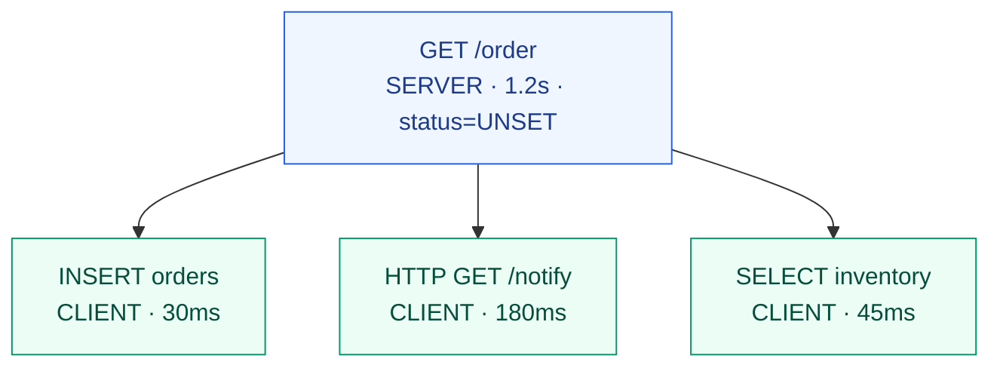
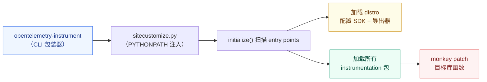
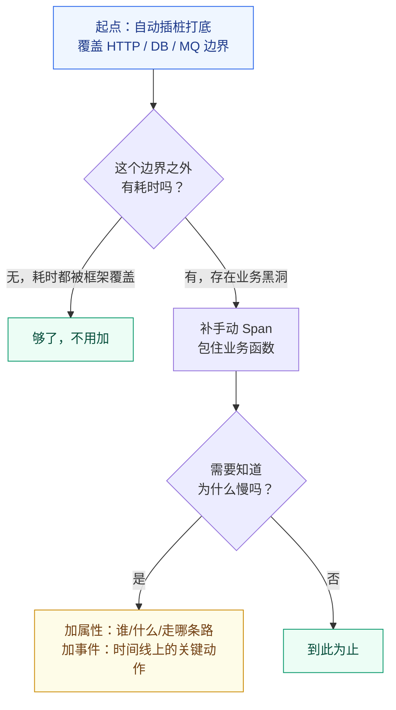
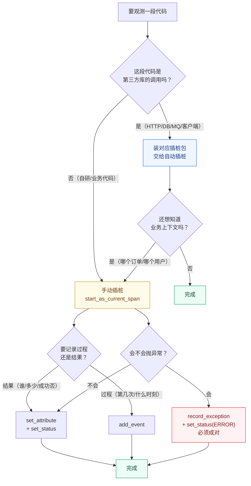
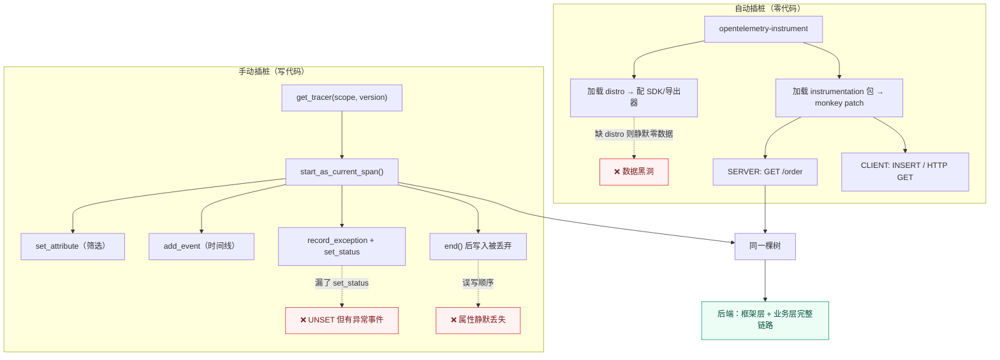

# 课 5 · 手动与自动插桩

> **状态**：✅ 已完成（2026-09-03）
> **所属阶段**：[阶段 2 · 一次请求的完整旅程](../overview.md)
> **知识点**：3 个（4.1、4.2、4.3）

[← 返回阶段概览](../overview.md) ｜ [← 返回课程目录](../../../02-课程目录.md)

---

## 一、本课在故事主线中的情节定位

| 叙事要素 | 内容 |
|----------|------|
| **角色** | 从"看懂链路"到"造出链路"——主角获得主动权 |
| **转折** | 链路不会自己长出来，得有人插桩。谁来插？怎么插？ |
| **冲突** | 自动插桩省事但只有框架层信息；手动插桩有业务语义但要改代码 |
| **本课出口** | 你能为一段业务代码补上手动 Span，并说清两种插桩的配比 |

---

## 二、本课目标

学完本课你应该能够：

1. **使用** Tracer API 手动创建 Span、设置属性与事件、记录异常、正确结束 Span
2. **启用**自动插桩并说明其覆盖范围（HTTP / DB / 消息队列）与局限
3. **区分** Span 事件与属性的使用场景，正确设置 StatusCode 与 `record_exception`

---

## 三、知识点清单

| # | 知识点 | 状态 |
|---|--------|------|
| 4.1 | 手动插桩：Tracer API 与 Span 生命周期 | ✅ |
| 4.2 | 自动插桩：零代码覆盖框架与库 | ✅ |
| 4.3 | 语义插桩与 Span 事件、状态、异常 | ✅ |

---

## 第一幕 · 场景引入：只有 HTTP Span 的链路

### 你拿到了一张"正确但没用"的链路图

承接课 4。你已经知道 Span 长什么样，`traceparent` 怎么传。现在回到那个 502 的夜晚，假设你运气不错，团队半年前就上了 OTel 自动插桩。你打开 Jaeger，搜到那条失败的下单请求，看到的是这样一条链路：



**这张图完全正确，也几乎完全没用。**

它告诉你：请求总共 1.2 秒，其中通知服务 180ms、库存查询 45ms、订单入库 30ms。加起来 255ms。

那么问题来了：**剩下那 945 毫秒去哪了？**

### 这就是自动插桩的边界

自动插桩是通过"包裹"（wrap）你调用的库函数来工作的。它认识 Flask、认识 requests、认识 psycopg2——因为这些都是第三方库，有明确的入口函数可以包。

但它**不认识你的业务代码**。它不知道你有个叫 `calculate_discount()` 的函数，不知道那段函数里有一个 `if vip:` 的分支，更不知道某个 SKU 会走进一段特别慢的促销规则计算。

```python
# 自动插桩视角：这里是"黑洞"
def process_order(order_id, amount, vip):
    # ← 进来了，但没人知道
    if vip:                          # 走了哪个分支？不知道
        discount = calc_vip_rules(order_id)   # 这个函数慢不慢？不知道
    else:
        discount = 0
    # ...
    # ← 出去了，耗时 945ms，花在哪？不知道
```

945 毫秒，就这样消失在链路图的"空隙"里。

🐞 **误区 1：以为自动插桩 = 全链路可观测**

自动插桩覆盖的是**框架与库的边界**，不是你的业务边界。它给你的是骨架，血肉得你自己填。

---

## 第二幕 · 认知冲突：为什么"加了自动插桩"还是查不出问题

### 冲突一：慢在哪，链路图不说

上面那个 945ms 的黑洞，是自动插桩最常见的尴尬。你看到父 Span 1.2 秒，子 Span 加起来 255ms，差值就是"你的代码"。这个差值有多大，取决于你的业务有多复杂——业务越复杂，黑洞越大，而链路图恰恰在最需要看清的地方瞎了。

### 冲突二：为什么慢，链路图更不说

比"慢在哪"更致命的是"为什么慢"。假设你补了手动 Span，看到 `calculate_discount` 花了 800ms。然后呢？

- 是哪个用户？VIP 还是普通？
- 是走了哪个分支？
- 是查了几次数据库？
- 是命中了缓存还是穿透了？

这些信息自动插桩一条都给不了你，因为**它们只存在于你的业务语义里**。

### 冲突三：自动插桩的配置，本身就是个坑

这是本课最硬的一段。我在本机（WSL Ubuntu 24.04 + Python 3.12.13 + OTel 1.44.0）照着官方文档跑自动插桩，第一次跑的结果是：**服务起来了，请求成功了，后端一条数据都没有。**

不是报错，不是异常，是**静默的零数据**。

我花了六轮实验才定位到两个坑，两个都值得你记住：

#### 坑 1：缺了 `opentelemetry-distro`，自动插桩只加载不导出

`opentelemetry-instrument` 这个命令行工具，其实只做两件事：

1. 设置一个 `PYTHONPATH`，让 Python 启动时先加载一个 `sitecustomize.py`
2. 由 `sitecustomize.py` 调用 `initialize()`，去扫描并加载所有 `opentelemetry_instrumentor` entry point

但**"加载插桩库"和"配置 SDK 导出器"是两件不同的事**。SDK 的配置由另一个东西负责——**distro**。

缺了 `opentelemetry-distro` 包时的实测：

```
provider_class = opentelemetry.trace.ProxyTracerProvider   # ← 未初始化的代理
span_trace_id  = 00000000000000000000000000000000          # ← 全零，数据被丢弃
span_is_recording = false
```

装上 `opentelemetry-distro==0.65b0` 之后：

```
provider_class = opentelemetry.sdk.trace.TracerProvider    # ← 真实的 SDK
processors     = [BatchSpanProcessor]
exporter       = OTLPSpanExporter(localhost:4317)
span_trace_id  = 8fd80a940e6265d6da777de63a3481f3          # ← 真实 trace_id
span_is_recording = true
resource       = {service.name: l5f-auto,
                  telemetry.auto.version: 0.65b0, ...}
```

注意 resource 里多出来的 **`telemetry.auto.version: 0.65b0`**——这是自动插桩的"指纹"，也是你判断"这份数据是不是自动插桩产生的"最可靠依据。

#### 坑 2：`OTEL_EXPORTER_OTLP_ENDPOINT=http://localhost:4318` 会被当成 gRPC

第二个坑更隐蔽。我校对了协议，把 endpoint 写成 HTTP 的 4318 端口，日志里却报：

```
Failed to export traces to localhost:4318, error code: StatusCode.UNAVAILABLE
Error details: INTERNAL: ipv4:127.0.0.1:4318: Failed parsing HTTP/2
(Expected SETTINGS frame as the first frame, got frame type 80)
(Trying to connect an http1.x server (HTTP status 400))
```

原因：**OTLP 的默认协议是 gRPC**。你写 `:4318` 并不会让它自动切成 HTTP——端口号不是协议声明。gRPC 客户端拿着 HTTP/1.1 的端口去握手，自然失败。

三种配置的实测对照：

| 配置 | 实际 exporter | 结果 |
|------|--------------|------|
| `OTEL_EXPORTER_OTLP_ENDPOINT=http://localhost:4318` | gRPC → `localhost:4318` | ❌ 协议错配，零数据 |
| `OTEL_EXPORTER_OTLP_TRACES_ENDPOINT=http://localhost:4318/v1/traces` | gRPC → `localhost:4318` | ❌ 仍被当 gRPC，零数据 |
| `OTEL_EXPORTER_OTLP_PROTOCOL=http/protobuf` + 上面任意一种 | HTTP → `http://localhost:4318/v1/traces` | ✅ 成功 |
| `OTEL_EXPORTER_OTLP_ENDPOINT=http://localhost:4317` | gRPC → `localhost:4317` | ✅ 成功 |

**结论：HTTP 端口（4318）必须显式声明 `OTEL_EXPORTER_OTLP_PROTOCOL=http/protobuf`。** 只改端口号是不够的。

🐞 **误区 2：以为 endpoint 端口写对，协议就对了**

`4317` 与 `4318` 是**约定俗成**的端口，不是协议标识。协议由 `OTEL_EXPORTER_OTLP_PROTOCOL` 决定，默认值是 `grpc`。

---

## 第三幕 · 层层揭示

### 4.1 手动插桩：Tracer API 与 Span 生命周期

**一句话定义**：手动插桩是用 Tracer API 在业务代码中显式创建 Span，把自动插桩看不见的业务边界记录下来。

**直觉建立**：自动插桩是给房子装监控摄像头——走廊、大门都有，但房间里没有。手动插桩是你在房间里自己装的传感器，测的是你真正关心的东西。

**核心原理**：Span 的完整生命周期

```
获取 Tracer → 创建 Span → [设置属性 / 添加事件 / 记录异常] → 结束 Span
     │              │                                            │
     │              └── start_as_current_span() 会自动成为 current  │
     │                  start_span() 不会，须手动 use_span()        │
     │                                                            │
     └── get_tracer(name, version) 决定 instrumentation scope      └── end() 之后写入一律被忽略
```

#### 第一步：获取 Tracer

```python
from opentelemetry import trace

tracer = trace.get_tracer("shop.order", "1.0.0")
```

这两个参数不是装饰。实测它们在后端呈现为 `instrumentation_scope`：

```
span=from-named   scope.name='my.instrumentation.lib'  scope.version='1.2.3'
span=from-noname  scope.name='another.lib'             scope.version=''
```

**scope 是你区分"这个 Span 是谁造的"的依据**。当你的服务里同时有自动插桩（scope = `opentelemetry.instrumentation.flask`）和手动插桩（scope = `shop.order`）时，scope 让你一眼分清哪些是框架给的、哪些是你自己加的。

#### 第二步：创建 Span —— 两种方式的关键差异

```python
# 方式 A：start_as_current_span —— 自动成为 current，子 Span 自动挂上来
with tracer.start_as_current_span("parent") as span:
    with tracer.start_as_current_span("child"):   # ← 自动成为 parent 的子
        pass

# 方式 B：start_span —— 不成为 current，父子关系靠"创建时谁在 current 上"
span = tracer.start_span("manual")
span.end()                                        # ← 必须手动 end
```

实测两种方式的父子关系：

```
child-by-start_span     parent=parent      # 仍挂上了（因为创建时 parent 在 current 上）
child-by-as_current     parent=parent
grandchild              parent=child-via-use_span
parent2                 parent=<ROOT>
```

关键差异不在父子关系，而在**后续代码能否"看到"这个 Span**：

| | `start_as_current_span` | `start_span` |
|---|---|---|
| 自动进入 current context | ✅ | ❌（须 `use_span()`） |
| 退出 with 块自动 `end()` | ✅ | ❌（须手动 `end()`） |
| 自动记录异常并设 ERROR | ✅（默认开启） | ❌ |
| 后续 `get_current_span()` 能拿到 | ✅ | ❌ |

#### 第三步：`end()` 之后发生什么

这是最容易踩的一条。实测：

```python
sp = tracer.start_span("ended-then-write")
sp.set_attribute("before.end", "yes")
sp.end()
print(sp.is_recording())            # False

sp.set_attribute("after.end", "x")  # 不抛异常
sp.add_event("after.end.event")     # 不抛异常
sp.set_status(Status(ERROR,"late")) # 不抛异常
sp.update_name("renamed")           # 不抛异常
```

终端输出：

```
WARNING:opentelemetry.sdk.trace:Setting attribute on ended span.
WARNING:opentelemetry.sdk.trace:Tried calling _add_event on an ended span.
WARNING:opentelemetry.sdk.trace:Tried calling set_status on an ended span.
WARNING:opentelemetry.sdk.trace:Tried calling update_name on an ended span.
```

后端最终收到：

```
name='ended-then-write' attrs={'before.end': 'yes'} events=[] status=UNSET
```

**四个操作全部静默丢弃，只留一行 WARNING 日志，不抛异常、不影响业务。**

这意味着：如果你的代码结构里 `end()` 的位置写错了（比如提前 return、或者 `end()` 在 `set_status` 之前），你会得到一个"看起来正常、实际上缺了关键状态和属性"的 Span，而且**没有任何显眼的错误提示**。

而 `end()` 本身是**幂等**的——实测重复调用不抛异常：

```
A2-4 二次 end()：未抛异常（幂等）
```

🐞 **误区 3：以为 `end()` 之后的写入会报错**

不会。它只打一行 WARNING 就静默丢弃。**判据是 `span.is_recording()`，不是"有没有报错"**。

#### 第四步：装饰器写法

```python
@tracer.start_as_current_span("decorated-no-arg")
def no_arg_func():
    print(trace.get_current_span().name)   # 'decorated-no-arg'
    return "ok"
```

实测结论：

```
no_arg_func 内 current span = 'decorated-no-arg'   # 无参函数：✅ 正常
with_arg_func 内 current span = 'decorated-with-args' a=1 b=5   # 有参函数：✅ 正常
```

**无参函数完全正常工作**（这是课 4 留给课 5 的待验证项，现已核销）。有参函数也正常，参数照常传入。

装饰器还有两个自动行为，实测确认：

```
decorated-raises  status=ERROR  events=['exception']   # 异常自动记录 + 自动设 ERROR
span_arg_func 收到 span 参数? False                     # 不会注入 span 参数
```

**装饰器不会把 span 注入成函数参数**。你声明 `def f(span=None)`，拿到的还是 `None`。要拿 span，用 `trace.get_current_span()`。

🐞 **误区 5：以为装饰器会把 span 注入函数参数**

不会。实测 `def f(span=None)` 拿到的仍是 `None`。装饰器只负责"包一层并让它成为 current"，不改动函数签名。取 span 用 `trace.get_current_span()`。

#### 完整示例：一个手动插桩的业务函数

```python
from opentelemetry import trace

tracer = trace.get_tracer("shop.order", "1.0.0")

def process_order(order_id, amount, vip):
    with tracer.start_as_current_span("process_order") as span:
        # 1. 属性：这次操作的"标签"，用于筛选和聚合
        span.set_attribute("order.id", order_id)
        span.set_attribute("order.amount", amount)
        span.set_attribute("customer.tier", "vip" if vip else "normal")

        # 2. 事件：时间线上的"发生了什么"
        span.add_event("order.received", {"channel": "web"})

        try:
            final = business_logic(order_id, amount, vip)
            span.set_attribute("order.final_amount", final)
            span.set_status(trace.Status(trace.StatusCode.OK))
            return final
        except Exception as exc:
            # 3. 异常：record_exception + set_status 必须成对出现
            span.record_exception(exc)
            span.set_status(trace.Status(trace.StatusCode.ERROR, str(exc)))
            raise
```

**一句话记住（4.1）**：`end()` 是 Span 的"封箱"——封箱之后写什么都被静默丢弃，所以状态、属性、事件必须在 `end()` 之前写完。

---

### 4.2 自动插桩：零代码覆盖框架与库

**一句话定义**：自动插桩通过运行时包裹（monkey patching）第三方库的函数，在不改业务代码的前提下产出 Span。

**直觉建立**：手动插桩是你自己写日记；自动插桩是给你的每个电话自动生成通话记录——你不用做什么，但它只记录"打了电话"，不记录"聊了什么"。

**核心原理**：三层机制



注意 D 和 E 是**两条独立的分支**——这正是坑 1 的成因：插桩库（E）加载了，但 SDK 导出器（D）没配置，于是数据造出来了却无处可去。

#### 覆盖范围实测

先说清口径。本机 `opentelemetry-instrumentation 0.65b0` 的 `bootstrap_gen` 里：

- **默认插桩包（8 个）**：无论你装了什么库都会装——asyncio、dbapi、exceptions、logging、sqlite3、threading、urllib、wsgi
- **检测型插桩库（50 条规则）**：扫描你环境里装了哪些第三方库，按需安装对应插桩包

这 50 条规则按生态分布（实测统计，36 条命中 HTTP/DB/MQ 关键字）：

| 类别 | 代表库 |
|------|--------|
| **Web 框架** | flask、django、fastapi、starlette、pyramid、tornado、aiohttp-server |
| **HTTP 客户端** | requests、httpx、urllib、urllib3、aiohttp-client |
| **关系数据库** | psycopg / psycopg2、mysql / mysqlclient / PyMySQL、asyncpg、aiopg、pymssql、sqlalchemy |
| **NoSQL / 缓存** | redis、pymongo、cassandra、pymemcache |
| **消息队列** | celery、pika、aio_pika、kafka-python、confluent-kafka、aiokafka、boto3sqs |
| **云服务 / RPC** | botocore、aiobotocore、grpcio |
| **AI / LLM** | openai、vertexai |

**这个清单是"我能插什么"，不等于"你的环境都插上了"。** 判断你的环境实际覆盖了什么，用这一条命令：

```bash
opentelemetry-bootstrap -a requirements
```

本机实测输出（14 个，含已安装与推荐安装）：

```
opentelemetry-instrumentation-asyncio==0.65b0
opentelemetry-instrumentation-dbapi==0.65b0
opentelemetry-instrumentation-exceptions==0.65b0
opentelemetry-instrumentation-logging==0.65b0
opentelemetry-instrumentation-sqlite3==0.65b0
opentelemetry-instrumentation-threading==0.65b0
opentelemetry-instrumentation-urllib==0.65b0
opentelemetry-instrumentation-wsgi==0.65b0
opentelemetry-instrumentation-click==0.65b0
opentelemetry-instrumentation-flask==0.65b0
opentelemetry-instrumentation-grpc==0.65b0
opentelemetry-instrumentation-jinja2==0.65b0
opentelemetry-instrumentation-requests==0.65b0
opentelemetry-instrumentation-urllib3==0.65b0
```

#### 覆盖范围的两个"暗礁"（实测发现）

##### 暗礁 1：`sqlite3` 插桩只覆盖 `cursor.execute()`，不覆盖 `conn.execute()`

这是本课最反直觉的实测发现。同一段 SQL，换一种调用方式，结果完全不同：

```
A: 文件库 + conn.execute()      span 数 = 0  []
B: 文件库 + cursor.execute()    span 数 = 1  ['CREATE']
C: 内存库 + conn.execute()      span 数 = 0  []
D: 内存库 + cursor.execute()    span 数 = 1  ['CREATE']
E: conn.execute 建表 + cursor.execute 插入   span 数 = 1  ['INSERT']   # 只有 cursor 那次
F: cursor.executemany()         span 数 = 1  ['INSERT']
G: cursor.executescript()       span 数 = 0  []
```

原因：插桩包 wrap 的是 `Cursor.execute` 与 `Connection.cursor` 这条路径上的内部方法，而 `Connection.execute()` 是 Python 的便捷快捷方式，走的是另一条内部路径。

**结论：`conn.execute()` 这种简写形式不产生 DB Span；`executescript()` 同样不覆盖。** 想让 SQL 被追踪，必须显式 `cur = conn.cursor()` 再 `cur.execute()`。

##### 暗礁 2：出站 HTTP 客户端要单独装插桩包

课 4 用的是 `requests`（有插桩）。但如果你用 `urllib` 或 `urllib3` 直连，默认**没有**插桩包。实测装上 `opentelemetry-instrumentation-urllib` 与 `-urllib3` 之后的对比：

**装之前**（混合插桩实验 `/order` 调用中，`urllib.request.urlopen` 出站）：

```
traceID=e52de726... span 数 = 4
  - GET /order        kind=server    scope=...flask
  - CREATE            kind=client    scope=...sqlite3
  - INSERT            kind=client    scope=...sqlite3
  - process_order     kind=internal  scope=shop.order
  # ← 出站 HTTP 调用完全没有 span
```

**装之后**（`/outbound` 三个客户端各调一次）：

```
traceID=a54e2293... span 数 = 5
  - GET /outbound   kind=server   scope=...flask
  - GET             kind=client   scope=...urllib
  - GET             kind=client   scope=...urllib3
  - GET             kind=client   scope=...requests
  - call_downstream kind=internal scope=demo.out
```

三个 CLIENT Span 全部挂在了手动 Span `call_downstream` 下面——**这就是混合插桩的价值：框架层与业务层在同一棵树里**。

🐞 **误区 6：以为 `conn.execute()` 和 `cursor.execute()` 一样会被追踪**

不一样。sqlite3 插桩只覆盖 `cursor.execute()`，`conn.execute()` 与 `executescript()` 不产生任何 Span。想让 SQL 被追踪，必须显式 `cur = conn.cursor()` 再 `cur.execute()`。

🐞 **误区 7：以为装了 `opentelemetry-instrumentation` 就够了**

不够。还缺 `opentelemetry-distro`——缺它则只加载插桩库、不配置导出器，表现为**静默零数据**（详见第二幕坑 1）。另外，`urllib` / `urllib3` 这类客户端不在 8 个默认插桩包里，也须单独装。

#### 自动插桩的优缺点

| | 自动插桩 | 手动插桩 |
|---|---|---|
| **改动成本** | 零代码（改启动命令） | 需改业务代码 |
| **覆盖范围** | 框架 / 库边界 | 任意业务边界 |
| **业务语义** | ❌ 无（不知道订单号、用户等级） | ✅ 有 |
| **升级成本** | 随 SDK 升级自动获得新覆盖 | 需自己维护 |
| **维护风险** | 依赖库版本兼容（版本不匹配会静默失效） | 自己控制 |
| **典型 Span** | `GET /order`、`INSERT`、`HTTP GET` | `process_order`、`calc_discount` |

#### 配比建议



**一句话记住（4.2）**：自动插桩给你骨架，手动插桩给你血肉——先自动打底，再在业务黑洞处补手动。

---

### 4.3 语义插桩与 Span 事件、状态、异常

**一句话定义**：语义插桩是决定"往 Span 上放什么"——哪些信息该是属性（用于筛选），哪些该是事件（用于还原时间线），以及怎样正确标记失败。

**直觉建立**：属性是快递单上的**收件人、重量、目的地**——你要按这些筛包裹。事件是物流轨迹上的**"已揽收 / 到达分拨中心 / 派送中"**——你要按这个还原过程。

#### 属性 vs 事件：一次实测对比

```python
with tracer.start_as_current_span("order-pipeline") as sp:
    # 属性：最终态，用于筛选与聚合
    sp.set_attribute("order.item_count", 3)
    sp.set_attribute("order.total", 128.0)
    # 事件：时间点，用于还原过程
    sp.add_event("item.added", {"item.sku": "A-01", "item.price": 39.0})
    time.sleep(0.01)
    sp.add_event("item.added", {"item.sku": "B-07", "item.price": 89.0})
    sp.add_event("inventory.locked")
```

后端收到的结构：

```
span='order-pipeline' attrs={'order.item_count': 3, 'order.total': 128.0}
  event item.added       @+0.0ms   attrs={'item.sku': 'A-01', 'item.price': 39.0}
  event item.added       @+10.3ms  attrs={'item.sku': 'B-07', 'item.price': 89.0}
  event inventory.locked @+10.3ms  attrs={}
```

三个关键差异：

| | 属性（Attribute） | 事件（Event） |
|---|---|---|
| **数量** | 每个 key 只保留**最后一个值** | 可**重复多次**，按时间排列 |
| **时间** | 无时间戳 | 有精确时间戳，能算相对偏移 |
| **用途** | 筛选、聚合、分组 | 还原过程、定位时间点 |
| **典型内容** | 订单号、金额、用户等级、结果 | "库存锁定"、"缓存未命中"、"重试第 2 次" |

如果你把 `item.added` 写成属性 `sp.set_attribute("item.sku", "A-01")`，第二次写入会**覆盖**第一次——你会以为这单只有一件商品。

🐞 **误区 8：以为属性可以记录过程**

不行。属性是"最终态"，一个 key 只保留最后一次写入（后写覆盖前写）。过程性、可重复的信息必须用事件——事件可重复出现且带精确时间戳。

#### Status：三态，且 OK 是终态

实测六种组合：

```
only-record-exception   status=UNSET  events=[('exception', 'RuntimeError')]
record-plus-status      status=ERROR  desc='支付失败'  events=[('exception','RuntimeError')]
status-error-no-desc    status=ERROR  desc=None
ok-then-error           status=OK     desc=None     # ← 先 OK 后 ERROR，ERROR 被忽略！
error-then-ok           status=OK     desc=None     # ← 先 ERROR 后 OK，被 OK 覆盖
```

**两条硬规则**（来自 SDK 源码 `ReadableSpan.set_status`）：

```python
# Ignore future calls if status is already set to OK
# Ignore calls to set to StatusCode.UNSET
if (self._status and self._status.status_code is StatusCode.OK
    or status.status_code is StatusCode.UNSET):
    return
```

1. **一旦设为 `OK`，后续所有 `set_status` 全部被忽略**——包括再设成 `ERROR`
2. **设置成 `UNSET` 永远无效**——你不能把状态"改回去"

这在现实里意味着什么？如果你的代码长这样：

```python
span.set_status(Status(StatusCode.OK))     # 提前标记成功
try:
    charge()
except Exception as e:
    span.record_exception(e)
    span.set_status(Status(StatusCode.ERROR, "支付失败"))   # ← 被忽略！
```

**后端会显示这个 Span 是成功的，尽管它失败了。** 而且事件里确实躺着那个异常记录——数据自相矛盾，排查时极易误导。

🐞 **误区 4：以为 `record_exception()` 会自动把 Span 标成 ERROR**

**不会。** 实测确认：`record_exception` 只生成一个名为 `exception` 的事件，Status 仍是 `UNSET`。必须**手动** `set_status(StatusCode.ERROR)`。这是本课最高频的踩坑点。

正确写法永远是成对出现：

```python
except Exception as exc:
    span.record_exception(exc)                                  # 记录细节
    span.set_status(Status(StatusCode.ERROR, str(exc)))          # 标记失败
```

#### `record_exception` 自动填充了什么

实测一次 `record_exception(RuntimeError("case1"))` 后，事件内容是：

```
event = 'exception'
  exception.type      = 'RuntimeError'
  exception.message   = 'case1'
  exception.stacktrace = 'Traceback (most recent call last): ...'
  exception.escaped   = 'False'
```

四个属性自动填充，你什么都不用做。其中 `exception.escaped` 标识"这个异常是否继续向上抛出"——在 `with start_as_current_span` 块内被捕获处理的，是 `False`；未被捕获冲出 Span 边界的，是 `True`。

🐞 **误区 9：以为 Span 状态可以随时改**

不能。一旦设为 `OK` 就再也改不动——包括改成 `ERROR`；设为 `UNSET` 也永远无效。只有两条路：成功路径设 `OK`，失败路径设 `ERROR`，互斥书写，不要都写。

#### 语义约定：属性该叫什么名字

属性名不是随便起的。OTel 定义了**语义约定（Semantic Conventions）**——一套跨语言、跨团队通用的属性名标准。

⚠️ **这条要特别注意**：自动插桩的产出，**默认仍是旧属性名**。实测 Flask 插桩 0.65b0 的输出：

```python
# 默认（OTEL_SEMCONV_STABILITY_OPT_IN 未设置）
http.method = 'GET'              # 旧
http.target = '/order'           # 旧
http.status_code = 200           # 旧
http.scheme = 'http'             # 旧
http.host = 'localhost'          # 旧
http.flavor = '1.1'              # 旧
http.user_agent = 'Werkzeug/3.1.8'   # 旧
# 新名命中 0 个
```

新名（课 9 会详细讲）是 `http.request.method`、`url.path`、`http.response.status_code`、`url.scheme`、`server.address`、`network.protocol.version`、`user_agent.original`。

**怎么切换？** 用稳定性开关，实测三种取值：

| `OTEL_SEMCONV_STABILITY_OPT_IN` | 旧名 | 新名 | 说明 |
|---|---|---|---|
| 未设置 | 7 个 | 0 个 | 默认，全旧名 |
| `http/dup` | 7 个 | 7 个 | **双写**，迁移过渡期推荐 |
| `http` | 0 个 | 7 个 | 全新名 |

**迁移建议**：先设 `http/dup` 让新旧名同时输出，把看板和查询改完，再切到 `http`。直接切会导致所有基于旧名的看板瞬间失效。

**你自己的业务属性**不受语义约定约束（语义约定管的是通用概念如 HTTP、DB、RPC）。但命名风格应当对齐：用点分小写（`order.final_amount` 而非 `orderFinalAmount`），并加上你的领域前缀。

**一句话记住（4.3）**：属性用于筛选（后写覆盖前写），事件用于还原（按时间累积）；`record_exception` 只记细节不标失败，`set_status(ERROR)` 必须自己写。

---

## 第四幕 · 实操验证

> **环境**：WSL Ubuntu 24.04 + Python 3.12.13（venv `~/otel-course/lab03`）+ Docker 29.4.1
> **后端**：Jaeger v2.20.0（容器 `jaeger-lab03`，端口 16686 / 4317 / 4318）
> **版本**：OTel API/SDK 1.44.0，instrumentation 0.65b0，flask 3.1.3

### 前置检查

```bash
# 容器没起就先起
docker start jaeger-lab03
curl -s -o /dev/null -w "%{http_code}\n" http://localhost:16686/    # 应输出 200
```

### 步骤 1 · 补齐自动插桩的两个必需包

```bash
source ~/otel-course/lab03/.venv/bin/activate

# 坑 1 的解药：distro（配置 SDK 与导出器）
uv pip install opentelemetry-distro

# 暗礁 2 的解药：出站 HTTP 客户端插桩
uv pip install opentelemetry-instrumentation-urllib \
               opentelemetry-instrumentation-urllib3 \
               opentelemetry-instrumentation-sqlite3
```

验证 entry point 已注册：

```bash
python -c "
from opentelemetry.util._importlib_metadata import entry_points
eps = entry_points()
for g in ('opentelemetry_distro', 'opentelemetry_configurator'):
    print(g, [e.value for e in eps.select(group=g)])
print('instrumentor', [e.name for e in eps.select(group='opentelemetry_instrumentor')])
"
```

应看到（数量随你装的插桩包变化）：

```
opentelemetry_distro ['opentelemetry.distro:OpenTelemetryDistro']
opentelemetry_configurator ['opentelemetry.distro:OpenTelemetryConfigurator']
instrumentor ['flask', 'urllib', 'urllib3', 'sqlite3', 'requests']
```

**如果 `opentelemetry_distro` 是空列表，后面一定收不到数据。**

### 步骤 2 · 扫描你这个环境实际能插什么

```bash
opentelemetry-bootstrap -a requirements
```

### 步骤 3 · 手动插桩：跑一遍 Span 生命周期

把下面这段存为 `/tmp/l5_manual.py`：

```python
from opentelemetry import trace
from opentelemetry.sdk.trace import TracerProvider
from opentelemetry.sdk.resources import Resource
from opentelemetry.sdk.trace.export import BatchSpanProcessor
from opentelemetry.exporter.otlp.proto.http.trace_exporter import OTLPSpanExporter

provider = TracerProvider(resource=Resource.create({"service.name": "l5-manual"}))
provider.add_span_processor(
    BatchSpanProcessor(OTLPSpanExporter(endpoint="http://localhost:4318/v1/traces"))
)
trace.set_tracer_provider(provider)

tracer = trace.get_tracer("shop.order", "1.0.0")

with tracer.start_as_current_span("process_order") as span:
    span.set_attribute("order.id", "ORD-1001")
    span.set_attribute("customer.tier", "vip")
    span.add_event("order.received", {"channel": "web"})

    try:
        raise RuntimeError("支付网关超时")
    except Exception as exc:
        span.record_exception(exc)
        span.set_status(trace.Status(trace.StatusCode.ERROR, str(exc)))

provider.force_flush()
provider.shutdown()
```

运行：

```bash
python /tmp/l5_manual.py
```

后端核对（**注意：唯一可信判据是查后端，不是看程序有没有报错**）：

```bash
curl -s "http://localhost:16686/api/traces?service=l5-manual&limit=3" | python3 -c "
import sys, json
d = json.load(sys.stdin)
for t in d.get('data') or []:
    print('traceID', t['traceID'])
    for s in t['spans']:
        tags = {x['key']: x.get('value') for x in s.get('tags', [])}
        print(' ', s['operationName'], '| status =', tags.get('otel.status_code'))
        for lg in (s.get('logs') or []):
            f = {i['key']: i.get('value') for i in lg.get('fields', [])}
            print('   [event]', f.get('event'), '| type =', f.get('exception.type'))
"
```

预期看到 `status = ERROR` 且有一个 `exception` 事件。

### 步骤 4 · 零代码自动插桩：一个 OTel 代码都没有的应用

把下面这段存为 `/tmp/l5_plain_app.py`（**注意：完全没有 import opentelemetry**）：

```python
from flask import Flask, request, jsonify
import time, sqlite3, urllib.request

app = Flask(__name__)

@app.route("/order")
def order():
    oid = request.args.get("id", "ORD-1")
    time.sleep(0.02)
    conn = sqlite3.connect("/tmp/l5_shop.db")
    cur = conn.cursor()                                    # ← 必须是 cursor，不是 conn.execute
    cur.execute("CREATE TABLE IF NOT EXISTS orders (id TEXT)")
    cur.execute("INSERT INTO orders VALUES (?)", (oid,))
    conn.commit()
    conn.close()
    try:
        urllib.request.urlopen("http://127.0.0.1:8031/health", timeout=2).read()
    except Exception:
        pass
    return jsonify({"ok": True, "id": oid})

@app.route("/health")
def health():
    return jsonify({"status": "up"})

if __name__ == "__main__":
    app.run(port=5000, host="127.0.0.1")
```

再起一个下游服务（`/tmp/l5_down.py`，端口 8031）：

```python
from flask import Flask, jsonify
app = Flask(__name__)

@app.route("/health")
def health():
    return jsonify({"status": "down-up"})

if __name__ == "__main__":
    app.run(port=8031, host="127.0.0.1")
```

启动（**HTTP 协议必须显式声明 PROTOCOL**）：

```bash
# 终端 1：下游
python /tmp/l5_down.py

# 终端 2：主应用，零代码插桩
OTEL_SERVICE_NAME=l5-auto \
OTEL_EXPORTER_OTLP_PROTOCOL=http/protobuf \
OTEL_EXPORTER_OTLP_ENDPOINT=http://localhost:4318 \
opentelemetry-instrument python /tmp/l5_plain_app.py
```

发请求，**等 10 秒**（BatchSpanProcessor 默认 5 秒调度延迟）后再查：

```bash
curl "http://127.0.0.1:5000/order?id=ORD-AUTO"
sleep 10
curl -s "http://localhost:16686/api/traces?service=l5-auto&limit=3" | python3 -c "
import sys, json
d = json.load(sys.stdin)
for t in d.get('data') or []:
    print('traceID', t['traceID'], 'span 数 =', len(t['spans']))
    for s in t['spans']:
        tags = {x['key']: x.get('value') for x in s.get('tags', [])}
        print(f\"  {s['operationName']:<20} kind={tags.get('span.kind'):<8} scope={tags.get('otel.scope.name')}\")
"
```

预期（实测一致）：

```
traceID b9df8222d26fc0e0b3865c16af4d8706 span 数 = 3
  GET /order   kind=server   scope=opentelemetry.instrumentation.flask
  CREATE       kind=client   scope=opentelemetry.instrumentation.sqlite3
  INSERT       kind=client   scope=opentelemetry.instrumentation.sqlite3
```

### 步骤 5 · 混合插桩：把两者拼到一棵树上

在步骤 4 那个应用里**只加三行**（import + 一个 `with` 块），不改启动命令：

```python
from opentelemetry import trace            # ← 新增

@app.route("/order")
def order():
    oid = request.args.get("id", "ORD-1")
    tracer = trace.get_tracer("shop.order", "1.0.0")     # ← 新增

    with tracer.start_as_current_span("process_order") as span:    # ← 新增
        span.set_attribute("order.id", oid)

        time.sleep(0.02)
        conn = sqlite3.connect("/tmp/l5_shop.db")
        cur = conn.cursor()
        cur.execute("CREATE TABLE IF NOT EXISTS orders (id TEXT)")
        cur.execute("INSERT INTO orders VALUES (?)", (oid,))
        conn.commit()
        conn.close()

        span.set_status(trace.Status(trace.StatusCode.OK))
        return jsonify({"ok": True, "id": oid})
```

实测后端看到的树（这正是"骨架 + 血肉"）：

```
traceID 79947361c283fd26c708b3d7c15c27d4 span 数 = 4
  GET /order       kind=server    scope=...flask          ← 自动插桩给的框架层
    process_order  kind=internal  scope=shop.order        ← 你给的业务层
      CREATE       kind=client    scope=...sqlite3        ← 自动插桩给的 DB 层
      INSERT       kind=client    scope=...sqlite3
```

**注意嵌套关系**：DB Span 挂在了 `process_order` 下面，而不是 `GET /order` 下面——因为 `start_as_current_span` 让业务 Span 成为了 current。这个层级不是装饰，它精确反映了"这几次 SQL 是这次业务处理发起的"。

### 步骤 6 · 验证本节的三条硬结论

**验证 A：`end()` 之后的写入被丢弃**

```python
sp = tracer.start_span("t")
sp.set_attribute("before", 1)
sp.end()
sp.set_attribute("after", 2)     # 静默丢弃，只有一行 WARNING
```

后端只会看到 `before`，没有 `after`。

**验证 B：`record_exception` 不改 Status**

```python
with tracer.start_as_current_span("a"):
    trace.get_current_span().record_exception(RuntimeError("x"))
# 后端：status = UNSET，但有 exception 事件
```

**验证 C：`conn.execute` vs `cursor.execute`**

```python
conn = sqlite3.connect("/tmp/t.db")
conn.execute("CREATE TABLE a (x INT)")       # ← 后端看不到这个 Span

cur = conn.cursor()
cur.execute("CREATE TABLE b (x INT)")        # ← 后端看得到这个 Span
```

---

## 第五幕 · 体系收束

### 两种插桩的完整对照

| 维度 | 自动插桩 | 手动插桩 |
|---|---|---|
| **获取方式** | `opentelemetry-instrument` 包装启动命令 | `trace.get_tracer()` + `start_as_current_span()` |
| **代码侵入** | 零 | 需改业务代码 |
| **必需依赖** | `opentelemetry-distro` + 各库插桩包 | `opentelemetry-api` + `opentelemetry-sdk` |
| **典型 Span 名** | `GET /order`、`INSERT`、`HTTP GET` | `process_order`、`calc_discount` |
| **典型 scope** | `opentelemetry.instrumentation.flask` | 你自己传的名字（如 `shop.order`） |
| **业务语义** | ❌ | ✅ |
| **失败信号** | 版本不匹配 / 配置错误 → **静默零数据** | 写错位置 → **属性被静默丢弃** |
| **维护成本** | 低（随 SDK 升级） | 高（需自己维护） |
| **覆盖范围陷阱** | `conn.execute()` / `executescript()` 不覆盖；客户端库需单独装包 | 无（你写哪就是哪） |

### 本课最该记住的五条

1. **`opentelemetry-distro` 是自动插桩的必需项**——缺了它，插桩库照样加载，但数据无处可去，表现为静默零数据。判断依据：Resource 里有没有 `telemetry.auto.version`。

2. **`4318` 端口不等于 HTTP 协议**——OTLP 默认 gRPC，用 HTTP 必须显式设 `OTEL_EXPORTER_OTLP_PROTOCOL=http/protobuf`。协议错配的报错藏在日志里，程序照常返回 200。

3. **`end()` 之后的写入全部静默丢弃**——`set_attribute` / `add_event` / `set_status` / `update_name` 一个都不例外，只留 WARNING。判据是 `is_recording()`。

4. **`record_exception()` 不会自动设 ERROR**，且 **Status 一旦设为 `OK` 就再也改不动**——这两条组合起来会造出"事件里躺着异常、状态却显示成功"的矛盾 Span。

5. **业务语义要自己加**——自动插桩给你 HTTP / DB / 客户端边界，剩下的黑洞只能手动填。属性用于筛选（后写覆盖前写），事件用于还原（按时间累积）。

### 遇到插桩需求时的决策路径



### 一图总结



### 📍 全局定位

- **回扣课 3**：课 3 说"唯一可信判据是查后端"，本课再次验证——自动插桩的两个坑都表现为"程序正常、后端空空"
- **回扣课 4**：课 4 发现自动插桩会覆盖手工设置的 `traceparent`（导致断链实验失真）；本课从另一面看到——**自动插桩确实能兜住大部分传播问题**，这正是它的价值
- **预埋课 6**：自动插桩会为每个请求造 Span，请求量一大就是数据量灾难——下一课讲采样
- **预埋课 9**：本课的"新旧属性名"只是开了个头，课 9 会系统讲语义约定的稳定性等级与完整迁移清单

### 🔗 下一步

下一课《采样：成本与真相的权衡》会回答：自动插桩这么方便，为什么不能一直开着全量？

### ⚠️ 别急着下结论

本课所有结论都基于 **Python 3.12.13 + OTel 1.44.0 + instrumentation 0.65b0** 实测。以下几点在换环境时必须重新验证：

- `conn.execute()` 不被覆盖——这是 Python `sqlite3` 插桩包的实现细节，其他语言 / 其他版本未必如此
- 默认输出旧属性名——0.65b0 的实测结论，语义约定迁移进度很快，后续版本可能已切换默认
- 50 条检测规则——这是 0.65b0 时刻的快照，`opentelemetry-bootstrap -a requirements` 的输出才是你环境的真相

### 本课小结

链路不会自己长出来。自动插桩给你 HTTP、数据库、消息队列的边界，让你零成本获得一张骨架图；但它看不见你的 `if vip:` 分支，也看不见那 945 毫秒去哪了。手动插桩让你把业务边界补进去——补的不是数量，是**语义**：哪个订单、哪个用户、走了哪条路。

而"补什么"这件事本身有讲究：属性是给筛选用的（后写覆盖前写），事件是给还原用的（按时间累积），异常要 `record_exception` 和 `set_status(ERROR)` 成对写——因为前者只记细节，后者才标失败。

最后记住那两个静默的坑：缺了 `opentelemetry-distro` 会让自动插桩"加载了却不导出"；`4318` 端口不会让 OTLP 自动切成 HTTP。两者的表现一模一样——程序正常，后端空空。

---

## 📌 练习

### 练习 1（自动插桩排错）

你的同事照着文档配了自动插桩，服务起来了、请求返回 200，但 Jaeger 里一条数据都没有。他说"我 endpoint 写的是 `http://localhost:4318`，Jaeger 的 4318 端口确实开着啊"。

请列出**按优先级排序**的排查清单（至少 4 项），并说明每项怎么用一条命令或一个观察点确认。

<details>
<summary>参考答案</summary>

**第 1 项：确认 `opentelemetry-distro` 是否安装**（最高优先级，因为它表现为完全静默）

```bash
python -c "
from opentelemetry.util._importlib_metadata import entry_points
print([e.value for e in entry_points().select(group='opentelemetry_distro')])
"
```

空列表 → 就是它。装 `uv pip install opentelemetry-distro`。

**第 2 项：确认协议与端口是否匹配**（第二常见）

```bash
# 看日志里的 exporter 类与 endpoint
grep -iE "failed to export|UNAVAILABLE|Failed parsing HTTP" app.log
```

看到 `Failed parsing HTTP/2` 或 `Trying to connect an http1.x server` → 协议错配。解法：加 `OTEL_EXPORTER_OTLP_PROTOCOL=http/protobuf`，或把端口改成 4317 走 gRPC。

**第 3 项：确认插桩包是否真的装上了**

```bash
opentelemetry-bootstrap -a requirements
python -c "
from opentelemetry.util._importlib_metadata import entry_points
print([e.name for e in entry_points().select(group='opentelemetry_instrumentor')])
"
```

没有 flask / sqlite3 / requests → `opentelemetry-bootstrap -a install`。

**第 4 项：确认进程活得够久**（BatchSpanProcessor 默认 5 秒调度延迟）

短命脚本（跑完立刻退出）会在 flush 前被杀掉。解法：显式 `provider.force_flush()` + `provider.shutdown()`，或至少 `sleep 10` 再查。

**第 5 项：确认后端真的收到了**（唯一可信判据）

```bash
curl -s http://localhost:16686/api/services
```

服务名不在列表里 → 前面四项有一项没过。**永远不要以"程序没报错"为通过标准。**

</details>

### 练习 2（属性 vs 事件）

下面这段插桩有三个问题，请指出并改正：

```python
with tracer.start_as_current_span("checkout") as span:
    span.set_attribute("item.sku", "A-01")
    span.set_attribute("item.sku", "B-07")      # 又加了一件商品
    span.add_event("payment.done")
    try:
        charge()
    except Exception as e:
        span.record_exception(e)
    span.set_status(trace.Status(trace.StatusCode.OK))
    span.set_status(trace.Status(trace.StatusCode.ERROR, "支付失败"))
```

<details>
<summary>参考答案</summary>

**问题 1：属性被覆盖，商品信息丢失**

`set_attribute("item.sku", "B-07")` 会**覆盖**前一个值。属性是"最终态"，一个 key 只保留最后一次写入。

改法：加商品这种"重复动作"应当用**事件**（事件可重复、带时间戳）：

```python
span.add_event("item.added", {"item.sku": "A-01"})
span.add_event("item.added", {"item.sku": "B-07"})
span.set_attribute("item.count", 2)     # 数量这种"最终态"才用属性
```

**问题 2：`record_exception` 后没有 `set_status(ERROR)`**

`record_exception` 只生成事件，不改 Status。后端会看到"有异常事件、状态却不是 ERROR"。

**问题 3：`set_status(OK)` 之后的所有 `set_status` 都被忽略**

SDK 源码明确：`OK` 是终态，一旦设置，后续调用直接 `return`。所以最后那句 `set_status(ERROR, "支付失败")` **根本不会生效**——后端显示这个 Span 是成功的。

改法（合并问题 2、3）：删掉那句 `set_status(OK)`，在 except 里成对写：

```python
with tracer.start_as_current_span("checkout") as span:
    span.add_event("item.added", {"item.sku": "A-01"})
    span.add_event("item.added", {"item.sku": "B-07"})
    span.set_attribute("item.count", 2)

    try:
        charge()
        span.set_status(trace.Status(trace.StatusCode.OK))     # 只在成功路径设 OK
    except Exception as e:
        span.record_exception(e)
        span.set_status(trace.Status(trace.StatusCode.ERROR, str(e)))
        raise
```

**关键：成功路径设 OK，失败路径设 ERROR，两条路径互斥，不要都写。**

</details>

### 练习 3（覆盖范围判断）

你的项目用了这些库，判断哪些会被自动插桩覆盖、哪些需要额外处理：

| 库 | 用途 | 会被覆盖吗？ |
|---|---|---|
| flask | Web 框架 | |
| requests | 出站 HTTP | |
| urllib.request | 出站 HTTP | |
| psycopg2 | PostgreSQL | |
| redis | 缓存 | |
| 内部 SDK `corp.rpc` | 公司自研 RPC | |

<details>
<summary>参考答案</summary>

| 库 | 覆盖？ | 说明 |
|---|---|---|
| flask | ✅ | 有官方插桩包，`opentelemetry-bootstrap` 会自动识别 |
| requests | ✅ | 同上 |
| urllib.request | ⚠️ **需额外装包** | 有官方包 `opentelemetry-instrumentation-urllib`，但**不在 8 个默认包里**，须 `uv pip install` 或 `bootstrap -a install` |
| psycopg2 | ✅ | 有官方包，前提是环境里装了 `psycopg2 >= 2.7.3.1` |
| redis | ✅ | 有官方包（`redis >= 2.6`） |
| corp.rpc | ❌ **必须手动** | 自研库不在 OTel registry 里，没有任何插桩包认识它 |

**最后一行的结论最重要**：凡是公司自研的框架、RPC、ORM，自动插桩一律不认。这类组件是链路断裂的重灾区，必须手动插桩——而且因为它们通常处在调用链的关键位置，漏了它们整条链路就散了。

**判断方法（比背清单可靠）**：

```bash
opentelemetry-bootstrap -a requirements
```

这个命令扫的是**你当前环境**，输出的就是你实际能插的清单。

</details>

### 练习 4（Span 生命周期）

下面这段代码会产出几个 Span？后端看到的状态和属性分别是什么？

```python
tracer = trace.get_tracer("demo", "1.0.0")

span = tracer.start_span("outer")
span.set_attribute("step", "created")

with tracer.start_as_current_span("inner"):
    pass

span.set_attribute("step", "after-inner")
span.set_status(trace.Status(trace.StatusCode.OK))
span.end()
span.set_attribute("step", "after-end")
```

<details>
<summary>参考答案</summary>

**Span 数量：2 个**，但**嵌套关系出乎意料**。

你可能会以为 `inner` 是 `outer` 的子 Span。实测（课 5 评审复核）的真实结果：

```
outer     parent=<ROOT>
inner     parent=<ROOT>       # ← 不是 outer 的子！
[inner 内] current span = inner
```

原因：`outer` 是用 `start_span()` 创建的，它**不会**进入 current context。所以创建 `inner` 时，current 上并没有 `outer`，`inner` 只能挂到根上。

**这才是 `start_span` 与 `start_as_current_span` 的关键差异**：`start_span()` 只记录父子关系，不进 current；`start_as_current_span()` 既记录父子关系，也进 current。后续代码的"当前 Span"与后续子 Span 的归属，都取决于后者。

要让 `inner` 挂到 `outer` 下，必须用 `use_span`：

```python
span = tracer.start_span("outer")
with trace.use_span(span, end_on_exit=True):
    with tracer.start_as_current_span("inner"):   # ← 现在会挂到 outer 下
        pass
```

**后端看到的状态与属性**：

```
outer:
  status = OK
  attributes = {step: "after-inner"}      # ← "created" 被覆盖，"after-end" 被丢弃
  events = []
```

- `step="created"` 被 `step="after-inner"` **覆盖**（属性是最终态）
- `step="after-end"` **完全丢弃**（`end()` 之后写入无效，只有一行 WARNING）
- 状态为 `OK`——`start_span` **不会**自动设状态，这里是代码显式设的

**如果忘了 `span.end()`**：这个 Span 永远不会被导出，后端一条都看不到，且不报错。这是 `start_span` 相比 `start_as_current_span` 最大的风险。

</details>

---

## 🐞 本课误区清单

| # | 误区 | 正确认知 |
|---|------|---------|
| 1 | 自动插桩 = 全链路可观测 | 只覆盖框架/库边界，业务代码是黑洞 |
| 2 | endpoint 端口写对，协议就对了 | `4317/4318` 是约定端口不是协议；协议由 `OTEL_EXPORTER_OTLP_PROTOCOL` 决定，默认 gRPC |
| 3 | `end()` 之后的写入会报错 | 静默丢弃，只有一行 WARNING；判据是 `is_recording()` |
| 4 | `record_exception()` 会自动设 ERROR | 不会，Status 仍是 UNSET，须手动 `set_status` |
| 5 | 状态可以随时改 | 一旦设为 `OK` 就再也改不动（包括改成 ERROR）；设为 `UNSET` 永远无效 |
| 6 | `conn.execute()` 和 `cursor.execute()` 一样会被追踪 | sqlite3 插桩只覆盖 `cursor.execute()`，`conn.execute()` 与 `executescript()` 不覆盖 |
| 7 | 装了 `opentelemetry-instrumentation` 就够了 | 还缺 `opentelemetry-distro`——缺它则只加载插桩、不配置导出器，静默零数据 |
| 8 | 属性可以记录过程 | 属性后写覆盖前写；过程要用事件（可重复、带时间戳） |
| 9 | 装饰器会把 span 注入函数参数 | 不会，`def f(span=None)` 拿到的仍是 `None`；用 `get_current_span()` |

---

## 🚀 下一批接力提示词

```
我的 OpenTelemetry 学习档案在 opentelemetry/00-学习档案.md，
当前进度为 16/42 知识点（课 1、课 2、课 3、课 4、课 5 已完成；
阶段 1 已完成，阶段 2 进行中 7/10）。
请继续讲解阶段 2 课 6《采样：成本与真相的权衡》的知识点 5.1、5.2、5.3，
按五幕叙事结构展开，并在课后回写四处档案。
本机环境（2026-09-03 实测）：
- Windows 有 Node v22.14.0，无 Python/Go；
- WSL Ubuntu 有 Docker 29.4.1、uv 0.11.6，
  已建好 ~/otel-course/lab03 虚拟环境（Python 3.12.13，OTel SDK 1.44.0）；
- 已装包：flask 3.1.3、opentelemetry-distro 0.65b0、
  instrumentation-flask/requests/sqlite3/urllib/urllib3 均 0.65b0；
- Jaeger 后端容器名为 jaeger-lab03，端口 16686/4317/4318 已通，
  若已停止可用 docker start jaeger-lab03 恢复。
⚠️ 自动插桩用 HTTP 导出时，必须显式指定
OTEL_EXPORTER_OTLP_PROTOCOL=http/protobuf（默认 gRPC 会协议错配导致静默零数据）。
课 6 实操继续沿用 WSL + Python + Docker 路径。
```

---

## 🧭 课程导航

- 上一课：[课 4 · Span 与上下文传播](./lesson-04-Span与上下文传播.md)
- 阶段概览：[阶段 2 · 一次请求的完整旅程](../overview.md)
- 下一课：[课 6 · 采样：成本与真相的权衡](./lesson-06-采样成本与真相的权衡.md)
- [← 返回课程目录](../../../02-课程目录.md)

---

## 交付状态

| 项 | 值 |
|---|---|
| 状态 | ✅ 已完成（2026-09-03） |
| 知识点 | 4.1 / 4.2 / 4.3 全部完成 |
| 五幕结构 | ✅ 场景引入 / 认知冲突 / 层层揭示 / 实操验证 / 体系收束 |
| 六要素 | ✅ 每知识点含 一句话定义 / 直觉建立 / 核心原理 / 示例演示 / 常见误区 / 一句话记住 |
| 本机实测 | ✅ 六轮实验（生命周期 / 三模式对比 / 属性名新旧 / sqlite3 覆盖 / CLI 端到端 / 混合插桩） |
| 事实核查 | ✅ 自动插桩必需依赖与协议默认值已核对官方文档 |
| 双视角评审 | ✅ pedagogy + learner（见 `00-评审清单.md`） |
| 图表 | Mermaid × 5 |
