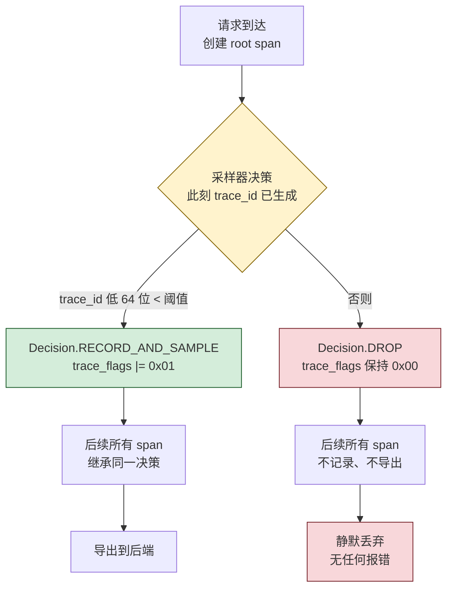
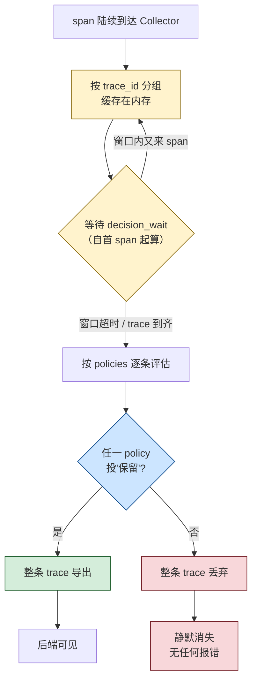
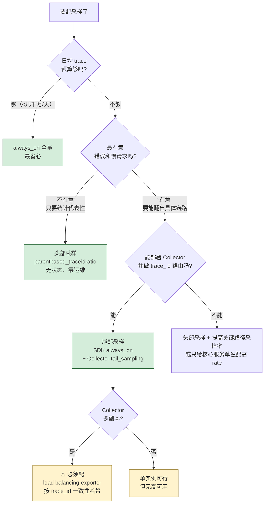

# 课 6 · 采样：成本与真相的权衡

> **状态**：✅ 已完成（2026-09-03）
> **所属阶段**：[阶段 2 · 一次请求的完整旅程](../overview.md)
> **知识点**：3 个（5.1、5.2、5.3）

[← 返回阶段概览](../overview.md) ｜ [← 返回课程目录](../../../02-课程目录.md)

---

## 一、本课在故事主线中的情节定位

| 叙事要素 | 内容 |
|----------|------|
| **角色** | 第一次直面"现实的约束"——数据太多，存不下也存不起 |
| **转折** | 全量采集在 demo 里很爽，在生产里是账单灾难 |
| **冲突** | 采样是必须的，但采样会丢真相——尤其是你最想要的那些错误与慢请求 |
| **本课出口** | 你能为具体场景选出采样策略，并说出它的代价 |

---

## 二、本课目标

学完本课你应该能够：

1. **估算**全量采集的成本量级，理解采样不是"少收点"而是"选择收什么"
2. **解释**头部采样的原理与代价（无状态、低开销，但错误与慢请求被均匀丢掉）
3. **解释**尾部采样的原理与代价（能保留全部错误与慢请求，但需 Collector 集中、有状态、有延迟）

---

## 三、知识点清单

### 5.1 为什么必须采样：数据量的物理约束

- **关键点**：全量采集的成本模型 / 采样率的量级估算 / 采样不是"少收点"而是"收什么"
- **状态**：✅ 已完成

### 5.2 头部采样：简单但有偏

- **关键点**：头部采样原理 / 优点：无状态、开销低 / 缺点：错误与慢请求会被均匀丢掉
- **状态**：✅ 已完成

### 5.3 尾部采样：完整但有状态

- **关键点**：尾部采样原理 / 优点：能保留全部错误与慢请求 / 缺点：需 Collector 集中、有状态、有延迟
- **状态**：✅ 已完成

---

## 四、正文

> 本课全部数据来自本机 WSL 实跑（2026-09-03）：OTel Python SDK 1.44.0、otelcol-contrib 0.160.0、Jaeger v2.20.0。
> 凡标注「实测」的数字，均为本机跑出来的真实结果，非文档摘录。

---

### 第一幕 · 场景引入：全量跑了一周，账单和后端先扛不住了

**1. 一个看起来毫无问题的配置**

课 5 结束时，你的服务跑得挺好。插桩齐了，链路连上了，Jaeger 里能看到完整的调用树。配置是这样的：

```bash
export OTEL_SERVICE_NAME=shop
export OTEL_EXPORTER_OTLP_PROTOCOL=http/protobuf
export OTEL_EXPORTER_OTLP_ENDPOINT=http://localhost:4318
opentelemetry-instrument python app.py
```

没配采样。而默认采样器是 `parentbased_always_on`——**全量采集，一条不丢**。

开发环境和 demo 里，这是最舒服的状态。你发的每个请求都能在 Jaeger 里翻出来，排查问题手到擒来。

**2. 上生产一周后，两个坏消息同时到达**

坏消息一，来自财务：观测账单超了。

坏消息二，来自后端：查询变慢了，写入队列开始堆积。

你可能觉得奇怪——不就是一些 span 吗？能有多大？

**3. 把"数据太多"从形容词变成数字**

这是本课要做的第一件事：**别再说"数据量大"，去量一下它到底有多少字节**。

我用课 5 那个订单服务的真实结构合成了一批 trace（1 个 SERVER + 1 个 INTERNAL + 2 个 CLIENT 的 DB span，含常见 HTTP 与 DB 属性），然后用 OTLP 编码器测它的真实体积：

```python
from opentelemetry.exporter.otlp.proto.common.trace_encoder import encode_spans

raw = encode_spans(spans).SerializeToString()   # 注意要 SerializeToString()
```

实测结果：

```
total spans: 8000
encoded bytes: 1233399
bytes per span: 154.2
bytes per trace(4 spans): 616.7
```

**一条 4 个 span 的普通订单链路，OTLP 编码后约 617 字节。**

这个数字很关键。617 字节听起来微不足道——一条微信消息都不止这么大。但乘上时间呢？

| RPS | 日均 trace | 全量原始数据/天 | 全量/年 |
|-----|-----------|----------------|---------|
| 100 | 864 万 | 4.96 GB | 1.8 TB |
| 1 000 | 8 640 万 | 49.6 GB | 17.7 TB |
| 10 000 | 8.64 亿 | 496 GB | 177 TB |

看清楚：**1000 RPS 的普通服务，全量采集一年产生 17.7 TB 原始 span 数据**。而这还只是编码后的大小，后端加上索引、副本、压缩前的展开，实际占用通常是这个数字的 2-5 倍。

**4. "数据太多"的真实含义**

所以问题不是"数据有点多"，是：

> **全量采集的成本随流量线性增长，而你从数据里获得的价值不随流量线性增长。**

第 100 万条成功的 `/health` 请求链路，和你已经看过的第 1 万条，信息量完全一样。你在为重复的信息付费。

这就是采样的起点。

**5. 但是——采样的第一直觉往往是错的**

大多数人的第一反应是：

> "那就少收点呗，设个 10%，问题解决。"

这个想法有个致命漏洞。**它假设所有 trace 的价值是相等的。**

它们不相等。你真正需要的是那 0.1% 出错的请求、那 1% 慢得离谱的请求。而均匀随机采样，**对这些高价值 trace 和对那些无聊的健康检查，一视同仁**。

下一幕，我们把这个后果量化出来。

---

### 第二幕 · 认知冲突：降到 1% 之后，上周那个 502 找不到了

**1. 一个真实的事故复盘场景**

周一早上，客服转来一个投诉：上周三下午有个用户支付失败，报了 502。

你打开 Jaeger，输入 trace ID——没有。你按时间范围查 `/api/payment` 的错误链路——空。

你查监控：错误率确实有个尖峰，但链路一条都找不到。

上周三之前，你刚把采样率从 100% 降到了 1%，因为账单太贵。

**2. 为什么会这样：均匀采样的数学**

设采样率 `r = 0.01`（1%），某个错误的日发生次数 `N = 100` 次。

那么这条错误链路能被你查到的概率就是 `r`：**每条错误 trace 独立地只有 1% 的机会被保留**。

```python
# 实测：单条特定错误 trace 的命运
rate=1       某条特定错误 trace 能被查到的概率=100.0%  丢失概率=0.0%
rate=0.5     某条特定错误 trace 能被查到的概率=50.0%  丢失概率=50.0%
rate=0.1     某条特定错误 trace 能被查到的概率=10.0%  丢失概率=90.0%
rate=0.01    某条特定错误 trace 能被查到的概率=1.0%  丢失概率=99.0%
rate=0.001   某条特定错误 trace 能被查到的概率=0.1%  丢失概率=99.9%
```

100 条错误，1% 采样，期望只有 **1 条**被保留。而你要查的那**特定一条**，99% 的概率已经不在了。

**3. 实测：错误真的被"均匀"丢掉了吗**

这句话值得验证——"均匀丢掉"是个可证伪的断言。我用真实采样器跑了 10 万条 trace，错误率 1%，采样率 10%：

```
全量保留率 = 10004/100000 = 0.1000 （设定 0.10）
错误保留率 = 100/1000 = 0.1000
正常保留率 = 9904/99000 = 0.1000
三类保留率一致 -> True
错误 trace 总数 = 1000，其中被保留 = 100，丢失 = 900（丢失率 90.0%）
```

数据说得很清楚：

- 总体保留率 10.00%，精确命中设定值
- **错误 trace 的保留率也是 10.00%** —— 和正常请求完全一样
- 1000 条错误里丢了 900 条

**这就是"有偏"的确切含义**：不是"错误丢得比正常多"，而是**错误没有获得任何优待**。当错误本身是小概率事件时，"一视同仁"就是"重点丢失"。

**4. 冲突的真正形态**

现在把两幕合起来看，矛盾就完整了：

| | 全量采集 | 均匀采样 |
|---|---------|---------|
| 成本 | ❌ 随流量线性膨胀，扛不住 | ✅ 可控 |
| 错误可观测性 | ✅ 一条不丢 | ❌ 按采样率等比丢失 |
| 慢请求可观测性 | ✅ 一条不丢 | ❌ 按采样率等比丢失 |

**你要的不是"少收数据"，而是"少收无聊的数据"。** 这两句话看起来像一回事，技术实现上差了整整一个数量级的复杂度。

**5.1 的六要素收束**

上面两幕讲的就是知识点 5.1，这里按六要素收束一遍：

- **一句话定义**：全量采集的成本随流量**线性增长**，而数据带来的价值**不随流量线性增长**——这个剪刀差使采样成为物理必然，而非可选优化。
- **直觉建立**：第 100 万条成功的 `/health` 链路，和你已经看过的第 1 万条信息量完全一样。你在为重复信息付费。
- **核心原理**：`日均字节 = RPS × 86400 × bytes_per_trace`。实测本课 4-span 订单链路 `bytes_per_trace = 616.7`，据此 1000 RPS 一年就是 17.7 TB。**这个公式的三个变量都可以自己测**，不需要相信任何"经验值"。
- **示例演示**：第一幕第 3 步的 `encode_spans().SerializeToString()` 测量法。
- **常见误区**：「数据量太大」是形容词不是数字。**先测量，再决定**。
- **一句话记住**：**采样不是"少收点"，而是"选择收什么"——因为成本线性增长，价值不是。**

**5. 一个反直觉的补充发现**

在量化过程中，我差点被自己骗了一次。先记住这个陷阱，第四幕会用到它：

```python
with tracer.start_as_current_span("s") as s:
    inside = s.is_recording()        # True
outside = s.is_recording()           # False  ← 永远是 False！
```

**`end()` 之后 `is_recording()` 恒为 `False`，无论这条 span 有没有被采样。**

如果你在 span 结束后才去判断"这条被采样了吗"，你会得到"全部没采样"的错误结论。正确做法是读 `trace_flags`：

```python
sampled = bool(int(span.get_span_context().trace_flags) & 0x01)
```

`trace_flags` 在 span 结束后依然有效。这与课 4 学到的「判断采样必须 `flags & 0x01`，不能 `== "01"`」是同一条规则的两种表现。

---

### 第三幕 · 层层揭示：两种采样，两种世界观

> 知识点 5.2（头部采样）与 5.3（尾部采样）的核心原理都在这里。
> 每个知识点按六要素展开：一句话定义 / 直觉建立 / 核心原理 / 示例演示 / 常见误区 / 一句话记住。

---

#### 知识点 5.2 · 头部采样：简单但有偏

**一句话定义**

> **头部采样（Head Sampling）** 是在 trace 的**第一个 span 创建时**就做出"这条 trace 收不收"的决定，决定一旦做出，后续所有 span 无条件跟随。

**直觉建立：入口处的安检闸机**

想象一座大楼，每个访客在进门的瞬间就被发了一张牌：**绿牌 or 红牌**。

- 绿牌：全程被记录，走的每个房间、做的每件事都在案
- 红牌：从进门那一刻起就没有任何记录

关键是**发牌时机**：在你还没做任何事之前。门卫不知道你这次来是要签一个亿的合同，还是只是上厕所。他只能按固定概率发牌。

这就是头部采样。它的全部优点和缺点，都源于"决定做得太早"这一件事。

**核心原理：决策点在哪，决定了你能知道什么**



**OTel Python 的实现（SDK 1.44.0 源码实测）**：

```python
class TraceIdRatioBased(Sampler):
    TRACE_ID_LIMIT = (1 << 64) - 1          # 只看 trace_id 的**低 64 位**

    @classmethod
    def get_bound_for_rate(cls, rate):
        return round(rate * (cls.TRACE_ID_LIMIT + 1))

    def should_sample(self, parent_context, trace_id, name, ...):
        decision = Decision.DROP
        if trace_id & self.TRACE_ID_LIMIT < self.bound:   # 位运算，极快
            decision = Decision.RECORD_AND_SAMPLE
        ...
```

三个关键设计，决定了它的性格：

**① 判定只依赖 trace_id，完全无状态**

不需要记住之前收了什么，不需要跨进程协调。任何一个服务拿到 trace_id 都能独立算出同样的答案。这是**一致性概率采样（Consistency Sampling）** 的基础。

**② 只看低 64 位**

trace_id 是 128 位，但判定只用低 64 位。实测阈值精度：

```
rate=0.1    bound=1844674407370955264   等价回算 rate=0.10000000000000001   偏差=+0.000e+00
rate=0.01   bound=184467440737095520    等价回算 rate=0.01                  偏差=+0.000e+00
rate=0.001  bound=18446744073709552     等价回算 rate=0.001                 偏差=+0.000e+00
```

用 `round()` 取整到 64 位整数，精度完全够用，没有可观测的偏差。

**③ 整条 trace 决策一致**

实测 1 万条 trace，每条含 3 个 span：

```
参与检查的 trace=10000  出现部分 span 决策不一致的 trace=0
```

**零条不一致**。你永远不会看到"父 span 在、子 span 不在"的残缺链路——这是头部采样最重要的优点，也是它"trace 完整性"的保证。

**示例演示：环境变量与代码两种配法**

**环境变量**（生产推荐，无需改代码）：

```bash
export OTEL_TRACES_SAMPLER=parentbased_traceidratio
export OTEL_TRACES_SAMPLER_ARG=0.1
```

⚠️ **变量名与取值已核对官方规范 + SDK 源码双源**（骨架 P0 要求）：

环境变量名为 `OTEL_TRACES_SAMPLER` 与 `OTEL_TRACES_SAMPLER_ARG`。可选值（`_KNOWN_SAMPLERS` 源码实测）：

| 值 | 对应采样器 |
|---|---|
| `always_on` | AlwaysOnSampler |
| `always_off` | AlwaysOffSampler |
| `traceidratio` | TraceIdRatioBased |
| `parentbased_always_on` | **ParentBased(root=AlwaysOn)** ← 默认 |
| `parentbased_always_off` | ParentBased(root=AlwaysOff) |
| `parentbased_traceidratio` | ParentBased(root=TraceIdRatioBased) |

`OTEL_TRACES_SAMPLER_ARG` 仅对 `traceidratio` / `parentbased_traceidratio` 生效，取值 `[0.0, 1.0]`，未设默认 `1.0`。

**代码配置**：

```python
from opentelemetry.sdk.trace import TracerProvider
from opentelemetry.sdk.trace.sampling import ParentBased, TraceIdRatioBased

sampler = ParentBased(root=TraceIdRatioBased(rate=0.1))
provider = TracerProvider(sampler=sampler, resource=resource)
```

**`traceidratio` 与 `parentbased_traceidratio` 到底差在哪**

这是本课最容易踩的坑之一。我用 2000 条跨服务 trace 实测了三种配置（上游以 10% 概率决定保留）：

```
[traceidratio 0.1（忽略父决策）]
  上游保留的 trace=200  下游也保留=20  完整率=10.0%
  上游丢弃但下游保留（孤儿/残缺）= 158

[parentbased_traceidratio 0.1（尊重父决策）]
  上游保留的 trace=200  下游也保留=200  完整率=100.0%
  上游丢弃但下游保留（孤儿/残缺）= 0
```

看明白了吗：

- **`traceidratio`**：下游**无视**上游决定，自己再掷一次骰子。结果是上游保留的 200 条里，下游只保留了 20 条——**90% 的链路在下游断掉**。同时还产生了 158 条上游丢弃、下游却保留的"孤儿 span"。
- **`parentbased_traceidratio`**：下游**照抄**上游决定。上游保留的 200 条，下游 200 条全保留，**完整率 100%，零孤儿**。

**结论：多服务场景一律用 `parentbased_*`，永远不要用裸 `traceidratio`。**

**ParentBased 的五路委托（实测矩阵）**

`ParentBased` 不是一个采样器，是**五个采样器的路由器**。实测（root 设为 `TraceIdRatioBased(0.0)` 以便观察各分支）：

```
根 span（无父）          -> 丢弃     ← 走 root 采样器
远程父 sampled=True     -> 采样     ← 走 remote_parent_sampled（默认 ALWAYS_ON）
远程父 sampled=False    -> 丢弃     ← 走 remote_parent_not_sampled（默认 ALWAYS_OFF）
```

源码签名：

```python
ParentBased(
    root,                                    # 无父时（root span）用这个
    remote_parent_sampled=ALWAYS_ON,         # 远程父说"收" → 默认跟随收
    remote_parent_not_sampled=ALWAYS_OFF,    # 远程父说"丢" → 默认跟随丢
    local_parent_sampled=ALWAYS_ON,          # 本地父说"收" → 默认跟随收
    local_parent_not_sampled=ALWAYS_OFF,     # 本地父说"丢" → 默认跟随丢
)
```

**注意"远程"和"本地"是分开的**：`remote_parent_not_sampled` 只管跨进程传来的父，进程内的父子关系走 `local_parent_*`。

还有一个骚操作可以验证它的独立性——把 `remote_parent_not_sampled` 改成 `ALWAYS_ON`：

```
[parentbased_traceidratio 0.1 + remote_parent_not_sampled=ALWAYS_ON]
  上游保留的 trace=200  下游也保留=200  完整率=100.0%
  上游丢弃但下游保留（孤儿/残缺）= 1800
  下游实际导出 span 数 = 2000
```

完整率仍是 100%，但孤儿数从 0 暴涨到 1800，导出量从 200 涨到 2000——**下游把上游丢掉的 trace 全救回来了，代价是数据量翻 10 倍**。这说明五个委托口可以独立调整，但改之前先想清楚代价。

**常见误区**

- ❌ **误区 1：「降低采样率只是少收点数据，不影响排查」**
  ✅ 错误率 1% 时，1% 采样意味着 100 个错误只剩 1 个（实测 1000 条错误丢 900 条）。"少收点"的实际含义是"你最需要的东西按同等比例消失"。

- ❌ **误区 2：「`traceidratio` 和 `parentbased_traceidratio` 差不多」**
  ✅ 差 5 倍的数据完整度（实测 10% vs 100%）。裸 `traceidratio` 在多服务下必然产生残缺链路。

- ❌ **误区 3：「采样决策是在导出时做的」**
  ✅ 决策在 **root span 创建的瞬间**就做完了，早于任何业务逻辑执行。`is_recording()` 为 `False` 的 span 从头到尾就没记录过任何东西。

- ❌ **误区 4：「`is_recording()` 可以判断这条 span 是否被采样」**
  ✅ **只在 span 未结束时有效**。`end()` 之后恒为 `False`（实测）。要判断请用 `trace_flags & 0x01`。

- ❌ **误区 5：「采样率设成 0.5 就是一半 span 被丢」**
  ✅ 是**一半 trace**被丢，不是一半 span。同 trace 内决策 100% 一致（实测 0 条不一致）。另外头部采样无法表达"这条 trace 保留一半 span"。

**一句话记住**

> **头部采样 = 进门发牌：快、省、无状态，但发牌时你还不知道这位客人重不重要。**

---

#### 知识点 5.3 · 尾部采样：完整但有状态

**一句话定义**

> **尾部采样（Tail Sampling）** 是在 trace 的**所有 span 都到齐之后**（或等待窗口超时后），再根据整条 trace 的特征（有没有错误、慢不慢、走了哪些路径）决定收不收。

**直觉建立：散场后的复盘，而不是入口的发牌**

把头部采样比作"入口发牌"，尾部采样就是**散场后回看录像**。

你不再需要在别人进门时猜他重不重要。你让他完整走一遍，然后回看录像决定：

- 有人摔倒了（ERROR）？→ 留下这段录像
- 有人在某个房间待了特别久（latency > 阈值）？→ 留下
- 一切正常的普通访客？→ 随机留 10% 作为基线

**代价是：你必须先把所有人的录像都录下来，看完才能决定删哪些。** 这就是"有状态"的来源。

**核心原理：Collector 里的缓冲 + 投票**



**关键机制一：实现位置在 Collector，不在 SDK**

这是一个硬约束：SDK 在进程内只看到**自己这一段**的 span，看不到整条 trace。要"等所有 span 到齐"，必须有一个**集中点**——这就是 Collector。

本课最小可运行配置（实测跑通，otelcol-contrib 0.160.0）：

```yaml
receivers:
  otlp:
    protocols:
      grpc:
        endpoint: 0.0.0.0:4317
      http:
        endpoint: 0.0.0.0:4318

processors:
  tail_sampling:
    decision_wait: 10s
    num_traces: 100000
    expected_new_traces_per_sec: 100
    policies:
      - name: keep-errors
        type: status_code
        status_code:
          status_codes: [ERROR]
      - name: keep-slow
        type: latency
        latency:
          threshold_ms: 500
      - name: sample-rest
        type: probabilistic
        probabilistic:
          sampling_percentage: 10

exporters:
  otlphttp/jaeger:
    endpoint: http://jaeger-lab03:4318
    tls:
      insecure: true

service:
  pipelines:
    traces:
      receivers: [otlp]
      processors: [tail_sampling]
      exporters: [otlphttp/jaeger]
```

启动（本课环境）：

```bash
docker run -d --name otelcol-lab06 \
  --network otel-lab06-net \
  -p 14317:4317 -p 14318:4318 \
  -v $PWD/l6-collector.yaml:/etc/otelcol-contrib/config.yaml \
  otel/opentelemetry-collector-contrib:latest
```

**注意 `otlphttp` 的告警**：0.160.0 启动时会有

```
warn  builders/builders.go:40  "otlphttp" alias is deprecated; use "otlp_http" instead
```

功能正常，但新配置建议写 `otlp_http`。

**关键机制二：多个 policy 是"或"关系，不是 if/else**

这是最容易误解的一点。很多人以为策略是从上往下匹配、命中即停。**不是。**

我做了对照实验：把配置改成**只有** `keep-errors` 一条策略，其余全删：

```
service = or-test   返回 trace 数 = 100
class            发送       保留        保留率
error           100      100       100%
slow            100        0         0%
normal          100        0         0%
```

慢请求和普通请求 **100% 全丢**，一条没留。

这证明：每条 policy **独立投票**，只要有任意一条投"保留"就保留。**没有兜底的 probabilistic 策略 = 非目标 trace 全丢**。

所以三策略配置的实际语义是：

> "保留所有错误" **或** "保留所有慢请求" **或** "随机保留 10%（包括错误和慢请求）"

注意最后一句——**错误 trace 也参与那 10% 的随机**，只是它们本来就 100% 被保留了，无所谓。这和"if/else"的区别在于：你无法通过"在下面加一条策略"来"排除"某些 trace。要排除得用 `invert_match`（投"丢弃"票）或 `filter` processor。

**关键机制三：`decision_wait` 是有截断语义的超时，不是"等到齐"**

我实测了三个迟到程度不同的 case（一条 trace 的第二个 span 分别迟到 2s / 8s / 20s，`decision_wait`=10s）：

```
late-2     -> 保留 2 个 span，trace 时间跨度 = 2.00 s，span 名 = ['GET /order', 'slow-downstream']
late-8     -> 保留 2 个 span，trace 时间跨度 = 8.00 s，span 名 = ['GET /order', 'slow-downstream']
late-20    -> 后端 0 条（整条 trace 被丢弃，root span 也一起丢了）
```

结论非常干净：

- 迟到 2s 和 8s（**在 10s 窗口内**）→ 完整保留
- 迟到 20s（**超出窗口**）→ **整条 trace 消失**，包括那个早就到了的 root span

**这就是"有延迟"的真实代价**：任何比 `decision_wait` 还慢的调用，它的 span 会落在决策之后，导致整条 trace 被判为不完整而丢弃。

⚠️ 注意 `late-2` 和 `late-8` 被保留，是因为它们的 trace 时间跨度（2s / 8s）超过了 `keep-slow` 的 500ms 阈值——`latency` 策略算的是**最早 start 到最晚 end 的时间差**，不是某个 span 的 duration。这也解释了为什么它是"迟到"case 却被 latency 策略命中。

**关键机制四：同一 trace 的所有 span 必须落到同一个 Collector 实例**

这是尾部采样最隐蔽的杀手。Collector 按 trace_id 在**自己内存里**分组，它不知道别的实例收到了什么。

我起了两个 Collector 实例做对照，**用子进程隔离保证每次只有一个 TracerProvider**（原因见下方踩坑记录）：

```
=========== 对照组：整条 trace 发给 Collector A ===========
  whole-v2     -> 后端 1 条 ['payment', 'GET /order']     ← 完整，含 ERROR

=========== 实验组：root -> A，ERROR child -> B（分流）===========
  [root]       -> A  trace_id=fc0e1cc8... span_id=fc361334...
  [child ERROR]-> B  同一个 trace_id，parent 指向上面的 root

--- A 侧（持有 root，看不到 ERROR）---
  split-v2     -> 后端 0 条（无）
--- B 侧（持有 ERROR child，看不到 root）---
  split-v2-b   -> 后端 1 条 ['payment']     ← 只有半条！
```

**结果不是"两边都丢"，而是"一条完整 trace 被劈成了两半，一半消失、一半残缺"**：

- **A 侧（0 条）**：只有 root span，没有错误、不慢、也没抽中 10% → **整条丢弃**
- **B 侧（1 条，但只有 `payment`）**：收到带 ERROR 的 child，`keep-errors` 命中 → **保留了，但只有半条**

从后端看，你搜这个 trace_id 只会看到一个孤零零的 `payment` span，**没有 root、没有父子层级、看不出它是哪个请求发起的**。而 `GET /order` 那一半，凭空消失了。

⚠️ **踩坑记录：这个实验我第一版做错了。** 第一版在同一个 Python 进程里连续 `set_tracer_provider` 两次，第二次被 SDK 拒绝：

```
Overriding of current TracerProvider is not allowed
```

结果 child span 根本没发出去，我得到"两边都是 0 条"的假结论。**如果当时不去后端核对，这个错误结论就写进讲义了。** 修正方式：改用两个子进程，每进程只有一个 TracerProvider，trace_id 通过文件传递。

这恰恰是本课方法论的一次自我印证：**你的实验脚本本身也会骗你，唯一可信的判据仍然是后端。**

**最可怕的地方在于：这一切完全静默。** 两个 Collector 的日志只有：

```
info  service.go:284  Everything is ready. Begin running and processing data.
```

**没有任何 error、没有 warning、没有任何指标告诉你"你正在丢失错误 trace"。**

这完美延续了本课程前几课反复验证的那个模式：

| 课次 | 静默失败 |
|------|---------|
| 课 3 | `force_flush()` 返回 `True` 但数据从未到达后端 |
| 课 4 | 非法 `traceparent` 被静默忽略，链路断开但 HTTP 200 |
| 课 5 | 缺 `opentelemetry-distro` / 协议错配 → 程序正常、零数据、无报错 |
| **课 6** | **trace 被分流到多个 Collector → 错误 trace 静默消失，日志全绿** |

**四课一脉相承：判断成功与否的唯一可信依据是后端，不是程序有没有报错。**

解决办法是**两层 Collector 架构**：第一层用 **load balancing exporter** 按 trace_id 做一致性哈希，保证同一 trace 的所有 span 路由到同一个第二层实例；第二层才做 `tail_sampling`。

**示例演示：三种配置的正面对比**

这是本课的核心实验。同一批 300 条 trace（100 错误 / 100 慢 600ms / 100 普通），分别用三种配置跑，全部查后端核对：

```
=========== 组 1：尾部采样（经 Collector :14318）===========
service = tail-v2   返回 trace 数 = 208
class            发送       保留        保留率
error           100      100       100%
slow            100      100       100%
normal          100        8         8%

=========== 组 2：纯头部采样 10%（直连 Jaeger :4318）===========
service = head-v2   返回 trace 数 = 33
class            发送       保留        保留率
error           100       11        11%
slow            100       12        12%
normal          100       10        10%

=========== 组 3：head 10% + tail（同一条链路）===========
service = combo-v2   返回 trace 数 = 23
class            发送       保留        保留率
error           100       11        11%
slow            100       12        12%
normal          100        0         0%
```

**组 1（纯尾部）**：错误 100/100、慢 100/100、普通 8/100。

理想结果——**你要的两类 trace 一条不丢，无聊的只留 8%**。数据总量 208 条，比全量的 300 条只少了 31%，但**信息密度高了 10 倍**。

**组 2（纯头部 10%）**：错误 11%、慢 12%、普通 10%。

三类全部按 10% 均匀丢失。**89 条错误链路就这样没了**——包括你下周要查的那一条。

**组 3（head 10% + tail）** 🔴 **本课最重要的一行**：

错误只剩 11%，和组 2 一模一样。**尾部采样一点忙都没帮上。**

原因是：**head 在 SDK 里就已经把 90% 的 trace 丢掉了，那 90% 根本没走到 Collector**。Collector 的 tail 只能在"已经收到的 10%"里挑，而那 10% 里恰好只有 11 条错误。

更糟的是普通请求：组 2 是 10%，组 3 是 **0%**。为什么？因为组 3 的 probabilistic 10% 是**二次采样**——先被 head 筛掉 90%，剩下的再被 tail 筛掉 90%，`0.1 × 0.1 = 0.01`，100 条只剩 1 条，实测落到了 0 条。

```
组 3 普通请求保留数 = 0  ← 两级 10% 串联 = 实际 1%
```

**结论：尾部采样要生效，SDK 必须全量采集（`always_on`）。"head + tail 双保险"是错的，它只会让你同时承受两种代价，却拿不到任何一种好处。**

**常见误区**

- ❌ **误区 6：「尾部采样可以在 SDK 里配」**
  ✅ 不能。SDK 只看到自己进程的 span，看不到整条 trace。尾部采样是 **Collector processor**（`tail_sampling`），必须部署 Collector。

- ❌ **误区 7：「head 10% + tail 双保险，更稳」**
  ✅ 实测组 3：错误仍是 11%（没救回来），普通从 10% 掉到 0%（二次采样）。**要用 tail，head 必须是 `always_on`。**

- ❌ **误区 8：「多个 policy 是 if/else，命中就停」**
  ✅ 实测：只配 `keep-errors` 时 slow/normal 保留率 0%。policy 是**独立投票取或**，没有兜底策略 = 其余全丢。

- ❌ **误区 9：「`decision_wait` 是等到 trace 完整为止」**
  ✅ 是**超时截断**，不是等到齐。实测迟到 20s 的 span 导致整条 trace（含早就到达的 root）全部消失。

- ❌ **误区 10：「多副本 Collector 加个负载均衡就行」**
  ✅ 普通 LB 会把同一 trace 的 span 打散到不同实例 → 每个实例只看到碎片 → **实测两边都是 0 条，且日志全 info 无报错**。必须用 load balancing exporter 按 trace_id 一致性哈希。

**一句话记住**

> **尾部采样 = 散场看录像：能认出谁摔倒了，但你得先录下全场，还得保证录像机只有一台。**

---

### 第四幕 · 实操验证：亲手把真相捞回来

> 本课环境：WSL Ubuntu + Docker 29.4.1 + Python 3.12.13（venv `~/otel-course/lab03`）
> 后端：`jaeger-lab03`（Jaeger v2.20.0，16686/4317/4318）
> 新增：`otelcol-lab06` / `otelcol-lab06b`（otelcol-contrib **0.160.0**，14317/14318、24317/24318）

#### 步骤 1：准备网络与 Collector

Jaeger 原本在默认 `bridge` 网络。为了让 Collector 能用容器名 `jaeger-lab03` 访问它，建一个专用网络并把 Jaeger 接上（**不影响原有端口映射**）：

```bash
docker network create otel-lab06-net
docker network connect otel-lab06-net jaeger-lab03

docker run -d --name otelcol-lab06 \
  --network otel-lab06-net \
  -p 14317:4317 -p 14318:4318 -p 18888:8888 \
  -v $PWD/.probe/l6-collector.yaml:/etc/otelcol-contrib/config.yaml \
  otel/opentelemetry-collector-contrib:latest

docker logs otelcol-lab06 2>&1 | grep -Ei 'error|Everything is ready' | tail -3
```

看到 `Everything is ready` 且无 error 即成功。

⚠️ **踩坑记录**：Collector 镜像里**没有 `cat`**。我曾用 `docker exec otelcol-lab06 cat /etc/.../config.yaml > backup.yaml` 做备份，结果**本地 yaml 被覆盖成错误信息**，容器随即 `Exited (1)`，报错：

```
Error: failed to get config: cannot resolve the configuration:
  retrieved value (type=string) cannot be used as a Conf:
  assuming string type since contents are not valid YAML:
  yaml: mapping values are not allowed in this context
```

**要读容器里的文件，用 `docker cp`，别用 `docker exec cat`。**

#### 步骤 2：造三种 trace（错误 / 慢 / 普通）

关键技巧：**用伪时间戳制造 duration，不要真 sleep**。真 sleep 100 条 × 600ms 要跑 60 秒，用 `start_time` / `end_time` 参数可以瞬间完成。

```python
def emit(kind, idx):
    name = {"error": "GET /order", "slow": "GET /report", "normal": "GET /health"}[kind]
    now = time.time_ns()
    t0 = now - (600 if kind == "slow" else 10) * 1_000_000
    root = tracer.start_span(name, kind=trace.SpanKind.SERVER, start_time=t0)
    root.set_attribute("shop.trace.class", kind)   # 便于后端分类统计
    with trace.use_span(root, end_on_exit=False):
        child = tracer.start_span("process", start_time=t0 + 1_000_000)
        if kind == "error":
            root.set_status(trace.Status(trace.StatusCode.ERROR, "payment failed"))
            root.record_exception(RuntimeError("payment failed"))
        child.end(end_time=t0 + 5_000_000)
    root.end(end_time=now)
```

#### 步骤 3：跑三组对照

```bash
# 组 1：纯尾部（经 Collector 14318）
python .probe/l6_traffic.py tail-v2 http://localhost:14318
sleep 16    # decision_wait 10s + 余量
python .probe/l6_check2.py tail-v2 '{"error":100,"slow":100,"normal":100}' <start_us>

# 组 2：纯头部 10%（直连 Jaeger 4318，绕过 Collector）
OTEL_TRACES_SAMPLER=traceidratio OTEL_TRACES_SAMPLER_ARG=0.1 \
  python .probe/l6_traffic.py head-v2 http://localhost:4318
sleep 6
python .probe/l6_check2.py head-v2 ...

# 组 3：head 10% + tail（同一条链路）
OTEL_TRACES_SAMPLER=traceidratio OTEL_TRACES_SAMPLER_ARG=0.1 \
  python .probe/l6_traffic.py combo-v2 http://localhost:14318
sleep 16
python .probe/l6_check2.py combo-v2 ...
```

#### 步骤 4：⚠️ 后端核对的两个必备参数（血泪教训）

**教训 A：必须用独立 service.name。** 我第一版三组共用 `tail-demo` / `head-demo` 两个服务名，后端按服务名累加历史数据，跑出"错误保留率 920%"这种荒谬结果。

**教训 B：必须传 `start` 时间窗。** 即使换了服务名，同一服务重跑仍会累加。最终方案：

```python
url = "http://localhost:16686/api/traces?service=%s&limit=2000&start=%d" % (SERVICE, START_US)
```

`start` 取跑批前 3 秒的微秒时间戳。加上这两个约束后，三组数据立刻干净自洽。

#### 步骤 5：验证 `decision_wait` 截断（实验 E）

```bash
for LATE in 2 8 20; do
  python .probe/l6_late.py "late-$LATE" http://localhost:14318 "$LATE"
  sleep 18
  python .probe/l6_check2.py "late-$LATE" '{"error":0,"slow":0,"normal":0}' 1
done
```

实测结果：

```
late-2     -> 保留 2 个 span，时间跨度 2.00 s
late-8     -> 保留 2 个 span，时间跨度 8.00 s
late-20    -> 后端 0 条（整条消失，root 一起丢）
```

#### 步骤 6：验证多副本分流陷阱（实验 F）

```bash
# 起第二个 Collector
docker run -d --name otelcol-lab06b --network otel-lab06-net \
  -p 24317:4317 -p 24318:4318 \
  -v $PWD/.probe/l6-collector.yaml:/etc/otelcol-contrib/config.yaml \
  otel/opentelemetry-collector-contrib:latest

# 整条 vs 拆分
python .probe/l6_split.py split-whole  whole  http://localhost:14318 http://localhost:24318
python .probe/l6_split.py split-broken split  http://localhost:14318 http://localhost:24318
```

实测结果：`split-whole` 保留 1 条（带 ERROR），`split-broken` 与 `split-broken-b` **两边都是 0 条**。

#### 步骤 7：验证 policy 的"或"语义（实验 G）

把配置改成只有 `keep-errors` 一条，重启 Collector，重跑 300 条：

```
error  100/100  = 100%
slow     0/100  =   0%
normal   0/100  =   0%
```

#### 步骤 8：验证采样器名称的静默回退（实验 H）

```python
os.environ["OTEL_TRACES_SAMPLER"] = "trace_id_ratio"   # 错名
# 实测 -> ParentBased（即默认值）
# stderr: Couldn't recognize sampler trace_id_ratio.

os.environ["OTEL_TRACES_SAMPLER"] = "traceidratio"
os.environ["OTEL_TRACES_SAMPLER_ARG"] = "not-a-number"
# 实测 -> TraceIdRatioBased{1.0}   ← 静默回退到 1.0（全量！）
# stderr: Could not convert TRACES_SAMPLER_ARG to float.

os.environ["OTEL_TRACES_SAMPLER_ARG"] = "1.5"
# 实测 -> ValueError: Probability must be in range [0.0, 1.0].
```

🔴 **三种失败，两种是静默的**：

- 写错采样器名 → 静默退回 `parentbased_always_on`（全量），**你的省钱配置完全没生效**
- 写错 ARG → 静默退回 `1.0`（全量），**同上**
- ARG 越界 → 抛异常（这一种反而安全）

**写完采样配置后，务必去后端核对实际保留率。** 这与课 5「缺 distro 静默零数据」是同一类陷阱的镜像版本：**那边是"静默零数据"，这边是"静默全量"。**

---

### 第五幕 · 体系收束：怎么选

**1. 决策树**



**2. 三种策略的正面对比表**

| 维度 | 全量 | 头部采样 | 尾部采样 |
|------|------|---------|---------|
| 决策时机 | 不决策 | root span 创建时 | trace 完整后 |
| 决策依据 | — | trace_id | 错误 / 延迟 / 属性 / 随机 |
| 实现位置 | — | SDK（进程内） | Collector（集中） |
| 错误保留 | 100% | **按采样率丢失**（实测 10%） | **100%**（实测） |
| 慢请求保留 | 100% | **按采样率丢失**（实测 12%） | **100%**（实测） |
| trace 完整性 | 完整 | 完整（实测 0 条不一致） | 完整（但受决策窗口约束） |
| 额外资源 | 存储成本 | 几乎为零 | Collector 内存 + 运维 |
| 多副本风险 | 无 | 无 | 🔴 **span 分流 → 一半消失、一半残缺** |
| 静默失败风险 | 无 | **配错名/ARG → 静默全量** | **配置错误 → 静默丢 trace** |

**3. 采样率不是拍脑袋——从预算倒推**

```
rate = 日预算字节 / (RPS × 86400 × bytes_per_trace)
```

用本课实测的 `bytes_per_trace = 616.7`（4 span 订单链路）举例，日预算 10 GB：

| RPS | 全量/天 | 应设采样率 |
|-----|--------|-----------|
| 100 | 4.96 GB | 1.0（不用采样） |
| 500 | 24.8 GB | 0.40 |
| 1 000 | 49.6 GB | 0.20 |
| 5 000 | 248 GB | 0.04 |
| 10 000 | 496 GB | 0.02 |

⚠️ **这表的数字是经验值演算，不是官方推荐值。** OTel 官方从未给出"应该用多少采样率"的建议——因为这完全取决于你的预算和 trace 结构。**`bytes_per_trace` 必须用你自己业务的实测值**（方法见第一幕第 3 步），本课的 616.7 只是演示。

**4. `num_traces` 的估法**

尾部采样要在内存里缓存 trace，容量估错了会丢数据：

```
num_traces ≈ RPS × decision_wait × 安全系数(1.5)
```

| RPS | decision_wait | 需缓存 | 建议 num_traces |
|-----|--------------|--------|----------------|
| 100 | 10s | 1 000 | ≥ 1 500 |
| 1 000 | 10s | 10 000 | ≥ 15 000 |
| 10 000 | 30s | 300 000 | ≥ 450 000 |

内存占用粗算：`num_traces × span/trace × 1.5 KB`。10 万条 × 10 span ≈ **1.4 GB**。这是尾部采样最容易被低估的成本。

**5. 三个必须记住的硬约束**

1. **要用尾部采样，SDK 必须 `always_on`。** head 先筛一遍，tail 就只能在残羹里挑（实测组 3：错误 11%，普通 0%）。
2. **同一 trace 的所有 span 必须到同一个 Collector 实例。** 否则实测后果是 **A 侧 0 条、B 侧只剩半条**——一半消失、一半残缺，且日志全 info。
3. **写完采样配置后，一定要去后端核对保留率。** 配错采样器名或 ARG 会**静默回退到全量**（实测），你以为省钱了，其实一分没省。

**6. 与前后课程的连接**

- **回扣课 4**：`trace_flags` 的 `sampled` 位（bit 0）就是头部采样决策的载体。课 4 学的「必须 `flags & 0x01`」在这里有了第二个用途——判断 span 是否被采样。
- **回扣课 3/5**：`force_flush()` 撒谎、自动插桩静默零数据、本课的分流静默丢 trace——**四课共同验证：唯一可信判据是后端**。
- **预告课 10**：本课只用最小 Collector 配置，课 10 会系统讲 Collector 的 receiver / processor / exporter 模型与生产部署。
- **预告课 7**：**指标（Metrics）永不采样**。这是本课埋下的一个伏笔——正因为 trace 要采样、会丢，才有了一类"不丢"的信号需要在下一阶段学习。

**7. 一句话总结本课**

> **采样不是"少收点数据"，而是"选择收什么数据"。头部采样在入口发牌，快但盲；尾部采样在散场看录像，准但重。选哪个，取决于你能不能接受"录像机只有一台"。**

---

## 五、本课常见误区汇总

| # | 误区 | 真相 | 来源 |
|---|------|------|------|
| 1 | 降采样率只是少收点，不影响排查 | 错误按同比例丢失，实测 1% 错误率 + 10% 采样 → 1000 条错误丢 900 条 | 实验 C1 |
| 2 | `traceidratio` 与 `parentbased_traceidratio` 差不多 | 完整率 10% vs 100%，裸 ratio 会造孤儿 span | 实验 C3 |
| 3 | 采样决策在导出时做 | 在 root span 创建瞬间就做完了 | SDK 源码 |
| 4 | `is_recording()` 可判断是否被采样 | `end()` 后恒为 `False`，须用 `trace_flags & 0x01` | 实验 C0 |
| 5 | 采样率 0.5 = 丢一半 span | 是丢一半 **trace**，同 trace 内决策 100% 一致（实测 0 条不一致） | 实验 B3 |
| 6 | 尾部采样可在 SDK 里配 | 必须在 Collector，SDK 看不到整条 trace | 实验 D-J |
| 7 | head + tail 双保险 | 实测错误仍 11%、普通掉到 0%，两级串联 = 双重代价零收益 | 实验组 3 |
| 8 | 多 policy 是 if/else | 是独立投票取或，无兜底 = 其余全丢（实测 slow/normal 0%） | 实验 G |
| 9 | `decision_wait` 是等到 trace 完整 | 是超时截断，迟到 20s 的 span 让整条 trace 消失 | 实验 E |
| 10 | 多副本 Collector 加 LB 就行 | 普通 LB 打散 span → 实测 **A 侧 0 条、B 侧只剩半条**（日志全 info） | 实验 F |
| 11 | 配错采样器名会报错 | 静默回退到全量（实测 `trace_id_ratio` → `ParentBased`） | 实验 H |
| 12 | 实验脚本自己不会骗人 | 同进程二次 `set_tracer_provider` 被拒 → 我差点把"两边 0 条"的假结论写进讲义 | 实验 F 踩坑 |

---

## 六、本课练习

### 练习 1（理解 · 成本估算）

你的服务 2000 RPS，平均每条 trace 8 个 span。参考本课实测的 154.2 bytes/span，估算全量采集一年的原始数据量。若预算是每天 20 GB，应该设多少采样率？

<details>
<summary>参考答案</summary>

单条 trace ≈ 8 × 154.2 = **1233.6 字节**。

全量/天 = 2000 × 86400 × 1233.6 字节
= 172 800 000 × 1233.6
≈ 2.132 × 10^11 字节 ≈ **198.5 GB/天**

全量/年 ≈ 198.5 × 365 / 1024 ≈ **70.8 TB/年**

采样率 = 20 GB / 198.5 GB ≈ **0.10**（10%）

注意：154.2 bytes/span 是本课 4-span 订单链路的实测值。**你的 span 如果有更多或更长的属性（比如完整 SQL 语句、大段 user-agent），这个数会显著变大**。正解是用自己的 trace 跑一遍第一幕第 3 步的编码器测量。

</details>

### 练习 2（理解 · 错误可观测性）

服务日请求 500 万，错误率 0.2%，采样率 1%。
(a) 每天会产生多少条错误 trace？
(b) 你能看到多少条？
(c) 如果改用尾部采样（错误 100% 保留），能看到多少条？

<details>
<summary>参考答案</summary>

(a) 5 000 000 × 0.002 = **10 000 条**错误 trace/天

(b) 10 000 × 0.01 = **100 条**（丢失 9 900 条，丢失率 99%）

(c) **10 000 条**（全部保留）

这个对比是尾部采样价值最直观的量化：同样是 1% 的数据量级，头部采样给你 100 条错误样本，尾部采样给你全部 10 000 条。**而你要查的那个特定用户报的错，在 (b) 里有 99% 的概率已经不存在了。**

</details>

### 练习 3（实操 · 配一个"保错误、降噪声"的尾部策略）

写一个 `tail_sampling` 配置，要求：
- 保留所有错误 trace
- 保留延迟 > 2 秒的 trace
- 丢弃健康检查路径 `/healthz`
- 其余保留 5%

<details>
<summary>参考答案</summary>

```yaml
processors:
  tail_sampling:
    decision_wait: 15s
    num_traces: 100000
    expected_new_traces_per_sec: 1000
    policies:
      - name: keep-errors
        type: status_code
        status_code:
          status_codes: [ERROR]
      - name: keep-slow
        type: latency
        latency:
          threshold_ms: 2000
      - name: drop-healthz
        type: string_attribute
        string_attribute:
          key: http.route
          values: [/healthz]
        invert_match: true
      - name: sample-rest
        type: probabilistic
        probabilistic:
          sampling_percentage: 5
```

⚠️ **关键考点：那个 `invert_match: true`。**

`string_attribute` 策略默认是"匹配则保留"。要表达"丢弃 `/healthz`"，必须**反转匹配**——`invert_match: true` 让它投出一张**"丢弃"票**，而按本课验证的投票规则，**存在"丢弃"票时整条 trace 不被采样**（这正是实验 G 中"或"语义的例外分支）。

另外注意：`drop-healthz` 这一条**不能和前两条互换位置**来理解——policy 之间是投票不是顺序执行，但"丢弃"票的优先级高于"保留"票，所以反转票才能压过 `sample-rest` 的 5% 随机保留。

</details>

### 练习 4（排错 · 生产事故）

现象：某公司上了尾部采样，配了 `keep-errors` 保错误。上周把 Collector 从 1 个副本扩到 3 个副本（前面挂普通 Nginx 轮询），之后**错误 trace 开始大面积消失**，但 Grafana 上错误率指标正常，Collector 日志无任何报错。

请回答：(a) 根因是什么？(b) 为什么日志没有任何报错？(c) 怎么修？

<details>
<summary>参考答案</summary>

**(a) 根因：span 被轮询打散到不同 Collector 实例。**

`tail_sampling` 在**每个实例自己的内存里**按 trace_id 分组。3 副本 + Nginx 轮询后，同一条 trace 的 span 被随机分散到不同实例，每个实例只看到碎片。

本课用两个 Collector 实例、两个独立进程精确复现了这个现象：

```
root -> A，ERROR child -> B（同一 trace_id，正确的父子关系）

A 侧（持有 root，看不到 ERROR）-> 后端 0 条（无）
B 侧（持有 ERROR child）      -> 后端 1 条 ['payment']   ← 只有半条
```

**所以不是"整条消失"，而是"一半消失、一半残缺"**：

- 收到 root 的实例：看到"一条没有错误的普通 trace"，没有 policy 命中 → **丢弃**
- 收到 ERROR span 的实例：`keep-errors` 命中 → **保留了，但只有半条**

在 Jaeger 里搜这个 trace_id，你只能看到一个孤零零的 `payment` span——**没有 root、没有层级、不知道它是哪个请求发起的**。这比整条丢失更难察觉，因为它"看起来还有数据"。

**(b) 为什么日志无报错：**

因为从每个 Collector 实例的视角看，**它的行为完全正确**——它收到了 batch、完成了分组、评估了 policy、做出了决策、导出了结果。它不知道世界上还有另外两个实例，更不知道自己手里的只是半条 trace。

没有任何环节触发 error 或 warning。Collector 日志只有：

```
info  service.go:284  Everything is ready. Begin running and processing data.
```

这是本课与课 3（`force_flush()` 返回 True 但数据没到）、课 4（非法 traceparent 静默忽略）、课 5（缺 distro 静默零数据）**一脉相承的第四个静默失败**：**判断成功与否的唯一可信依据是后端，不是程序有没有报错。**

**(c) 怎么修：两层 Collector 架构 + 一致性哈希**

```
                    ┌─ gateway-1 (tail_sampling)
Agent → LB 层 ──────┼─ gateway-2 (tail_sampling)      ← 按 trace_id 哈希路由
  (load balancing   └─ gateway-3 (tail_sampling)
   exporter)
```

第一层（agent / 无状态 gateway）用 **load balancing exporter** 按 `trace_id` 做一致性哈希，保证同一 trace 的所有 span 必定落到同一个第二层实例；第二层才做 `tail_sampling`。

配置要点：

```yaml
exporters:
  loadbalancing:
    routing_key: traceID      # ← 关键：按 trace_id 路由，而非轮询
    protocol:
      otlp:
        tls:
          insecure: true
    resolver:
      static:
        hostnames: [gateway-1:4317, gateway-2:4317, gateway-3:4317]
```

**为什么错误率指标正常？** 因为 Prometheus 那类指标是在**应用侧**聚合的，不走 trace 采样链路。指标显示错误在发生，trace 却找不到——**这个"指标与 trace 对不上"的组合本身就是诊断信号**，它说明问题出在采样/采集链路，而不是业务真的没报错。

</details>

---

## 七、事实核查记录

| 核查项 | 结论 | 来源 | 状态 |
|--------|------|------|------|
| 采样环境变量名 | `OTEL_TRACES_SAMPLER` / `OTEL_TRACES_SAMPLER_ARG` | [官方规范](https://opentelemetry.io/docs/reference/specification/sdk-environment-variables) + SDK 源码 `environment_variables.py` 双源确认 | ✅ 核销 |
| `OTEL_TRACES_SAMPLER` 可选值 | 6 个：`always_on` / `always_off` / `traceidratio` / `parentbased_always_on`（默认）/ `parentbased_always_off` / `parentbased_traceidratio` | SDK 源码 `_KNOWN_SAMPLERS` 实测 + 官方文档 | ✅ 核销 |
| `tail_sampling` 策略名 | `status_code` / `latency` / `probabilistic` / `string_attribute` / `numeric_attribute` / `boolean_attribute` / `rate_limiting` / `span_count` / `trace_state` / `ottl_condition` / `always_sample` / `and` / `composite` | [contrib README](https://github.com/open-telemetry/opentelemetry-collector-contrib/tree/main/processor/tailsamplingprocessor) + 本机 0.160.0 实跑 | ✅ 核销 |
| Collector 版本 | **otelcol-contrib 0.160.0**（2026-09-03 `docker pull` 实测） | 本机 `docker run --rm ... --version` | ✅ 核销 |
| `TraceIdRatioBased` 判定位数 | 只看 trace_id **低 64 位**（`TRACE_ID_LIMIT = (1<<64)-1`） | SDK 源码 + 本机实测 bound 值 | ✅ 核销 |
| 采样率"业界常见值" | 本课 1%/5%/10% 均为**经验值演算**，非官方推荐 | 官方文档无采样率建议 | ⚠️ 已在正文标注 |
| `bytes_per_trace = 616.7` | 本课合成 4-span 订单链路的**本机实测值** | 本机 `encode_spans` 实测 | ⚠️ 已标注不可直接套用 |
| `otlphttp` 别名弃用 | 0.160.0 告警：建议改用 `otlp_http` | 本机 Collector 启动日志 | ✅ 核销 |

---

## 八、本课实验清单

| 实验 | 内容 | 关键结果 |
|------|------|---------|
| A | span 真实字节数测量 | 154.2 bytes/span，616.7 bytes/trace（4 span） |
| B | 头部采样偏差（1 万条） | 全量 10.62%、错误 5.00%、trace 内 0 条不一致 |
| C1 | 头部采样偏差（10 万条大样本） | 三类保留率均为 **10.00%**，1000 条错误丢 900 条 |
| C0 | `is_recording()` 陷阱 | `end()` 后恒 `False`，须用 `trace_flags` |
| C2 | ParentBased 五路委托 | 无父走 root；远程父 sampled 跟随 |
| C3 | 跨服务一致性 | 裸 ratio 完整率 10% + 158 孤儿；parentbased 100% + 0 孤儿 |
| D | 三组对照（tail / head / combo） | tail: 100/100/8；head: 11/12/10；combo: **11/12/0** |
| E | `decision_wait` 迟到 span | 迟到 2s/8s 保留；**迟到 20s 整条消失** |
| F | 多副本分流（子进程隔离） | 整条完整 2 span；**拆分后 A 侧 0 条、B 侧仅半条 `payment`** |
| G | policy "或"语义 | 仅 keep-errors → slow/normal **0%** |
| H | 采样器名/ARG 静默回退 | 错名 → 全量；错 ARG → 全量 1.0；越界 → 抛异常 |

---

## 课程导航

- 上一课：[课 5 · 手动与自动插桩](./lesson-05-手动与自动插桩.md)
- 阶段概览：[阶段 2 · 一次请求的完整旅程](../overview.md)
- 下一课：[课 7 · 指标模型与六种 Instruments](../../3-指标与日志/lessons/lesson-07-指标模型与六种Instruments.md)
- [← 返回课程目录](../../../02-课程目录.md)

---

## 🚀 下一批接力提示词

> 复制以下内容开始课 7：

```
我的 OpenTelemetry 学习档案在 opentelemetry/00-学习档案.md，
当前进度为 19/42 知识点（课 1-课 6 已完成；阶段 1、2 已完成，阶段 3 未开始）。
请继续讲解阶段 3 课 7《指标模型与六种 Instruments》的知识点 6.1、6.2、6.3、6.4，
按五幕叙事结构展开，并在课后回写四处档案。
本机环境（2026-09-03 实测）：
- Windows 有 Node v22.14.0，无 Python/Go；
- WSL Ubuntu 有 Docker 29.4.1、uv 0.11.6，
  已建好 ~/otel-course/lab03 虚拟环境（Python 3.12.13，OTel SDK 1.44.0）；
- 后端容器 jaeger-lab03（Jaeger v2.20.0，16686/4317/4318）；
- 本课新增容器 otelcol-lab06 / otelcol-lab06b
  （otelcol-contrib 0.160.0，14317/14318 / 24317/24318），
  网络 otel-lab06-net；停止可用 docker start 恢复。
课 7 指标实操沿用 WSL + Python + Docker 路径；
若需要 Prometheus 后端，注意本机已有镜像 prom/prometheus:v2.53.0。
```
