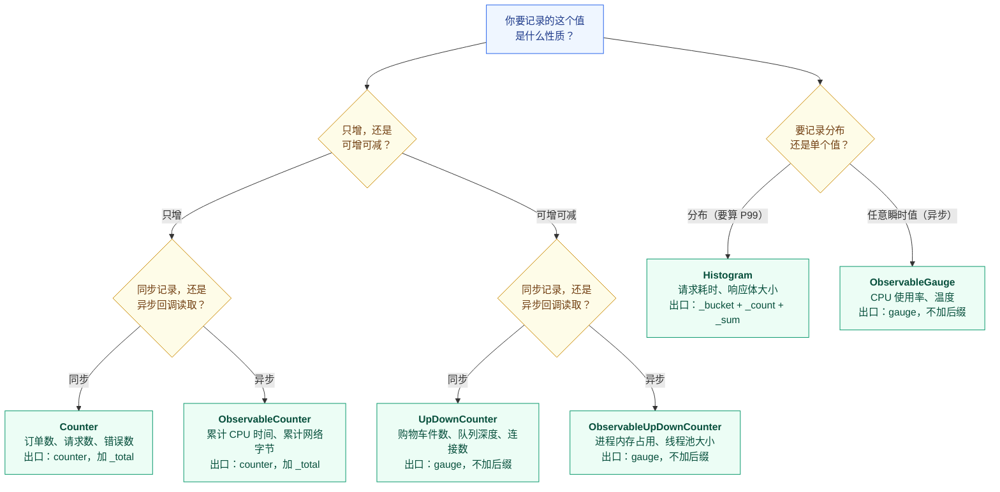
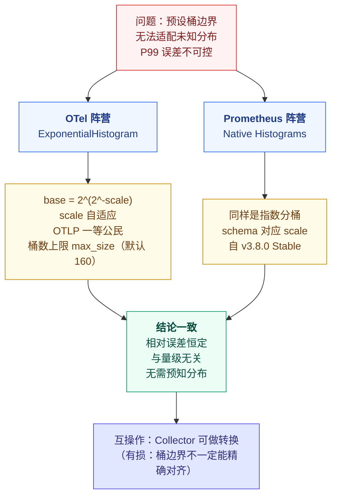
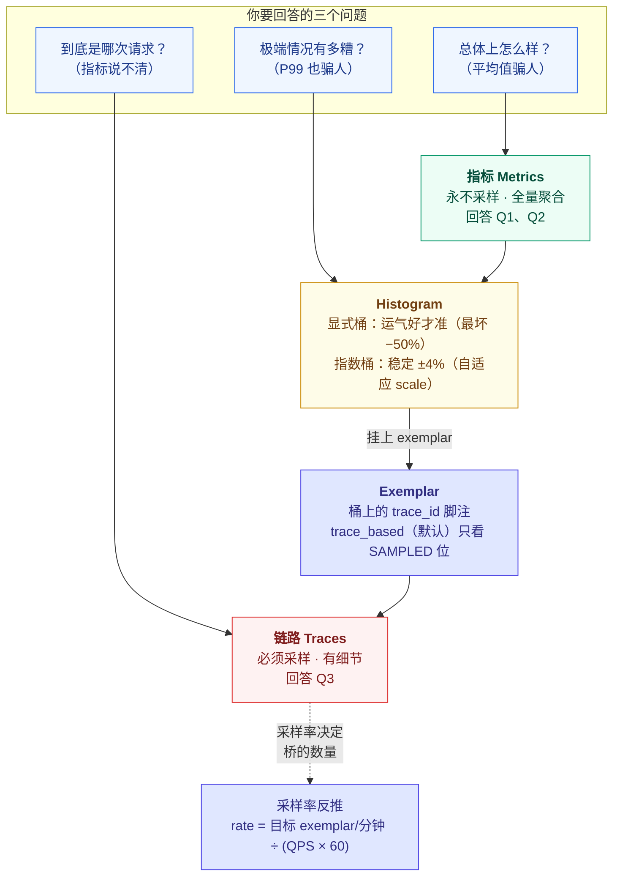

# 课 7 · 指标模型与六种 Instruments

> **状态**：✅ 已完成（2026-09-03）
> **所属阶段**：[阶段 3 · 指标与日志](../overview.md)
> **知识点**：4 个（6.1、6.2、6.3、6.4）
> **版本基准**：Python SDK 1.44.0 / OTel 规范 v1.56.0 / Prometheus v2.53.0｜**核查于 2026-09**

[← 返回阶段概览](../overview.md) ｜ [← 返回课程目录](../../../02-课程目录.md)

---

## ⚠️ 本课环境说明（先看这里）

本课全部实操在 **WSL Ubuntu** 内完成，语言为 **Python**。

| 项 | 状态 |
|---|---|
| WSL Ubuntu 24.04 | Docker 29.4.1 + `uv` 0.11.6 + Python 3.12.13（venv：`~/otel-course/lab03/.venv`） |
| OTel Python SDK | **1.44.0**（本课所有"默认行为"以此版本实测为准） |
| Windows 本机 | Node v22.14.0，**无 Python 运行时** |
| Node / Go / Java | **本机均未安装**。本课出现的 Go / Java 代码仅作跨语言对比说明，**未实测** |

课 6 建的容器可直接复用：`jaeger-lab03`（Jaeger v2.20.0，16686/4317/4318）、`otelcol-lab06`（otelcol-contrib 0.160.0）。本课新增 `prom-lab07`（Prometheus v2.53.0，端口 9099）。

**本课所有标注「实测」的结论，均是在上述环境真实跑出来的**，命令可直接复制执行；标注「未实测」的均为跨语言说明。

---

## 一、本课在故事主线中的情节定位

| 叙事要素 | 内容 |
|----------|------|
| **角色** | 补齐第一块拼图——指标，让主角拥有"量化"能力 |
| **转折** | 链路告诉你"这一次"发生了什么，指标告诉你"总体上"怎么样 |
| **冲突** | 六种 Instrument 不是随便选的；P99 用传统 Histogram 算不准 |
| **本课出口** | 你能为服务设计一套指标方案，并让指标能跳回链路 |

---

## 二、本课目标

学完本课你应该能够：

1. **说清** OTel 指标模型的分层（Instrument → Stream → Point）及其与 Prometheus 模型的差异
2. **选出**正确的 Instrument：Counter / UpDownCounter / Gauge / Histogram / 两类 Observable 版本
3. **解释** Exponential Histogram 如何解决 bucket 困境，及其与 Prometheus Native Histogram 的关系
4. **说明** Exemplar 如何携带 `trace_id`，实现"从 P99 尖刺跳到具体某次请求"

---

## 三、知识点清单

| # | 知识点 | 状态 |
|---|--------|------|
| 6.1 | 指标模型：Instruments 全家桶 | ✅ |
| 6.2 | 六种 Instruments 与聚合视角 | ✅ |
| 6.3 | Exponential Histogram：P99 精度问题 | ✅ |
| 6.4 | Exemplar：从指标跳回链路 | ✅ |

---

# 第一幕 · 场景引入：「平均响应时间 200ms」为什么骗了你

## 1.1 一个看起来很健康的监控大屏

周一早上，你打开下单服务的监控大屏：

```
shop.checkout.duration     avg = 200ms     ← 一切正常
shop.orders.total          rate = 100/s    ← 稳
error_rate                 0.3%            ← 很低
```

你正准备关掉页面，客服群炸了：**"下单一直转圈，付不了款！"**

你一脸茫然：平均值 200ms，错误率 0.3%，哪里有问题？

## 1.2 平均值是怎么骗人的

来看一组真实数字。假设 10000 次下单里，响应时间是这样分布的：

```
9850 次：    10ms   （秒开）
 150 次： 20000ms   （20 秒，卡死转圈）
```

算一下平均值：

```
(9850 × 10 + 150 × 20000) / 10000 = (98500 + 3000000) / 10000 = 309.85 ms
```

**平均 310ms，看起来还行。但有 150 个人等了 20 秒。**

这就是平均值的第一个谎言：**它把"分布"压扁成一个数，压扁的过程会吃掉长尾**。

那换个指标呢？看 P50（中位数）：

```
P50 = 10ms   ← 更健康了，也更没用
```

P99 呢？

```
P99 = 20000ms   ← 终于暴露了
```

**结论：要发现长尾问题，你必须看分位数（P99 / P999），而不是平均值。**

> 📌 **一个值得停下来想一秒的细节**：如果把慢请求数从 150 改成 100（即**正好** 1%），P99 的答案会**取决于你用哪种口径**：
>
> | 口径 | 算法 | 9900 快 + 100 慢 的 P99 |
> |---|---|---|
> | **线性插值**（numpy `percentile` 默认、Prometheus `histogram_quantile`） | 在相邻两个样本间按比例插值 | **209.9 ms** ← 长尾又被藏起来了 |
> | **nearest-rank**（取第 ⌈q×n⌉ 个样本） | 直接取那个位置的值 | **20000 ms** ← 长尾暴露 |
>
> 线性插值下，位置 `k = (10000−1) × 0.99 = 9899.01` 恰好落在"最后一个快样本（10ms）"与"第一个慢样本（20000ms）"之间，插值权重只有 0.01，于是得到 `10 + (20000−10) × 0.01 = 209.9`。
>
> **本课第三幕的实验统一采用 nearest-rank 口径**（直接取第 9900 个样本的值）。选它是因为它回答的是工程师真正关心的问题——**"99% 的请求比这个值快"**，而不是一个插值出来的、谁都不对应的数字。
>
> 这也提醒你：**跨系统对比分位数时先确认口径**。Grafana 里的 P99、APM 厂商的 P99、你脚本里算的 P99，可能根本不是同一个东西。

## 1.3 于是你去看 P99，然后发现它也是个谎言

你的服务已经接了 OTel，用的是标准 Histogram。你在 Grafana 里写下：

```promql
histogram_quantile(0.99,
  sum(rate(shop_checkout_duration_milliseconds_bucket[5m])) by (le)
)
```

大屏显示：**P99 = 10000ms**。

你松了口气——虽然慢，但没到 20 秒，可以接受。

**错了。真实 P99 是 20000ms，你的监控把它砍掉了一半。**

这不是 Grafana 的 bug，也不是 PromQL 写错了。这是**分桶这件事本身的物理限制**。

（这里的长尾占比是 1.5%，比 P99 的分位点高出一点——这样才保证"真实 P99 确实是 20000ms"。如果长尾刚好等于 1%，P99 会掉回 209.9ms，反而是另一场误会，见 1.2 的注。）

## 1.4 为什么：你只能看到"桶的边"，看不到"桶里的值"

Histogram 的工作原理是**先分桶、后聚合**。它不记录每个请求的真实耗时，只记录"落在 0-5ms 的有几个、5-10ms 的有几个……"。

问题来了：**当你要算 P99，系统只知道你落在"某个桶"里，不知道你在这个桶的哪个位置**，只能用插值去猜。

OTel Python SDK 1.44.0 的默认桶边界是这样的（**实测，源码 `_internal/aggregation.py:463`**）：

```
(0.0, 5.0, 10.0, 25.0, 50.0, 75.0, 100.0, 250.0, 500.0, 750.0,
 1000.0, 2500.0, 5000.0, 7500.0, 10000.0)
```

**15 个边界 → 16 个桶，最后一个是 `+Inf`。**

注意最后那个数：**10000.0**。

超过 10 秒（10000）的请求，**全部落进 `+Inf` 桶**。而 `+Inf` 桶没有上界，插值算法对它无能为力——它就是"很大"，但多大？不知道。

于是你那 150 个 20 秒的请求，在 P99 计算里被当成了"10000ms 左右"。**误差 -50%。**

> 🐞 **误区 1：分桶边界是"配置项"，配错了顶多不精确**
>
> 不是"不精确"，是**系统性截断**。默认边界的最大上界就是 10000，而且**单位取决于你传的 `unit`**——你传 `ms`，上界就是 10000ms；你传 `s`，上界就是 10000 秒（等于没上界）。
>
> 本课第三幕会用五种真实分布量化这个误差，最坏情况 **-50.0%**。

## 1.5 第一幕留下的四个问题

平均值骗了你，P99 也骗了你。这一课要回答三个问题：

| 问题 | 对应知识点 |
|------|-----------|
| 指标这个信号，内部到底是怎么组织的？为什么它和 Prometheus 的模型对不上？ | **6.1** |
| 六种 Instrument 摆在那里，我该怎么选？ | **6.2** |
| 分桶的精度问题，OTel 怎么解决？ | **6.3** |
| 指标说"有问题"，我怎么知道是哪次请求有问题？ | **6.4** |

---

# 第二幕 · 认知冲突：六种 Instrument 摆在你面前，选错一个数据就废了

## 2.1 一个购物车，六种写法

现在你要给下单服务加指标。需求很简单：

> ① 统计累计下了多少单
> ② 看购物车里当前有多少件商品
> ③ 监控下单耗时的分布
> ④ 看队列积压深度
> ⑤ 看 CPU 使用率

你打开 OTel 文档，看到六种 Instrument：

```
Counter                  UpDownCounter           Histogram
ObservableCounter        ObservableUpDownCounter ObservableGauge
```

然后你卡住了。**购物车该用哪个？**

你可能会想："购物车不就是个 Gauge 吗？会加会减。"

**规范里没有同步 Gauge。**

## 2.2 第一次踩坑：把购物车写成 Counter

```python
# ❌ 错误写法
cart_counter = meter.create_counter("shop.cart.items")
cart_counter.add(1)      # 加一件
cart_counter.add(-1)     # 减一件
```

这段代码**不报错**。但 `Counter.add()` 的规范语义是"单调递增"，传负数时 **Python SDK 会打印一条 WARNING 并丢弃这个负值**（实测）。

结果是：你的购物车**只增不减**。加 10 件减 5 件，指标显示 10。

这比报错更糟——**它静默地给你一个错误的数字**。

## 2.3 第二次踩坑：出口之后，全都不一样了

好，你改用 `UpDownCounter`：

```python
# ✅ 正确
cart = meter.create_up_down_counter("shop.cart.items")
cart.add(1)
cart.add(-1)
```

现在你把它导出到 Prometheus，抓一下 `/metrics`：

```bash
curl -s localhost:9464/metrics | grep shop_cart
```

**实测输出**：

```
# HELP shop_cart_items ...
# TYPE shop_cart_items gauge
shop_cart_items_total{...} 3.0
```

等等——**`UpDownCounter` 变成了 Prometheus 的 `gauge`？**

对。而且你再看 `Counter` 的：

```
# TYPE shop_orders_total counter
shop_orders_total{...} 42.0
```

**`Counter` 变成 `counter`，`UpDownCounter` 变成 `gauge`**——这两个在 OTel 里是"同一个家族的兄弟"，到了 Prometheus 却分属两个完全不同的类型。

这就是本课标题里"六种 Instruments"的第一个反直觉点：

> **OTel 的六种 Instrument 与 Prometheus 的四种类型，不是一一对应关系。**

## 2.4 六种 Instrument 的 Prometheus 出口实测

本课第四幕会给你完整可运行的程序。这里先看结论——**这是在本机真实抓下来的**（2026-09-03 实测）：

| OTel Instrument | 同步/异步 | 值的变化方向 | Prometheus 出口 | 是否加 `_total` 后缀 |
|---|---|---|---|---|
| `Counter` | 同步 | 只增 | `counter` | ✅ 加 |
| `UpDownCounter` | 同步 | 可增可减 | **`gauge`** | ❌ 不加 |
| `Histogram` | 同步 | 分布 | `histogram`（`_bucket`×16 + `_count` + `_sum`） | — |
| `ObservableCounter` | 异步回调 | 只增 | `counter` | ✅ 加 |
| `ObservableUpDownCounter` | 异步回调 | 可增可减 | `gauge` | ❌ 不加 |
| `ObservableGauge` | 异步回调 | 任意 | `gauge` | ❌ 不加 |

**三个反直觉点**：

1. **`UpDownCounter` 出口是 `gauge` 而不是 `counter`**——因为 Prometheus 的 `counter` 语义就是"只增"，可增可减的值只能映射成 `gauge`
2. **`ObservableCounter` 加 `_total`，`ObservableUpDownCounter` 不加**——判断依据是"能否减少"，不是"是否异步"
3. **`Histogram` 一个指标炸出 18 条时间序列**——16 个 `_bucket` + `_count` + `_sum`。这个数字稍后会在成本模型里要你的命

## 2.5 冲突的核心：两条判据，不是六选一

六种 Instrument 看起来是六选一，其实是**两个二选一的组合**：



**判据一：值只增，还是可增可减？**
- 只增 → `Counter` 家族
- 可增可减 → `UpDownCounter` 家族
- 都不是（要分布 / 要任意瞬时值）→ `Histogram` / `ObservableGauge`

**判据二：同步记录，还是异步回调？**
- **同步**：事情发生时，你的代码主动调 `.add()` / `.record()`
- **异步（Observable）**：你注册一个回调函数，SDK 每次采集时来问你要值

## 2.6 什么时候必须异步？

异步不是"懒得写同步代码"的借口，它有明确的适用场景：

| 场景 | 用哪个 | 为什么 |
|---|---|---|
| 值来自**别人的计数器**（`/proc/stat`、第三方库内部计数） | `Observable*` | 你无法在"值变化那一刻"被通知，只能去读 |
| 值**变化极其频繁**，但采集间隔远大于变化间隔 | `Observable*` | 每次变化都 `.add()` 是纯浪费，反正只关心采集那一刻的值 |
| 回调**开销大**（要调一次系统 API） | `Observable*` | 采集时才付出代价，不被采集就不付出 |
| 值的**每一次变化都有业务意义**（每笔订单） | 同步 | 必须精确累加，不能漏 |
| 你要**记录分布** | 同步 `Histogram` | 规范无异步 Histogram |

> 🐞 **误区 2：Observable 回调里能拿到当前 span，可以顺便打个 trace 关联**
>
> **不能依赖它。** 规范原文是"asynchronous callbacks typically run without an active trace/span context"（异步回调通常在无活跃 span 上下文的情况下运行）。
>
> 本课实测还发现一个更微妙的细节：在**同一个进程内同步触发 collect** 时，回调**确实**能看到调用处的 span（无 span 时 `valid=False`；span A 内 collect 就看到 A；span B 内就看到 B）。但这是**实现细节**——生产环境里 collect 由后台线程触发，没有 context。
>
> 这是"测量工具骗人"的又一个案例：**你的测试环境和生产环境行为不同，而测试环境的行为看起来更"合理"。**

## 2.7 一个真实的坑：Python SDK 有第七种 Instrument

你在 Python 里 `dir(meter)` 一下，会发现：

```python
meter.create_counter(...)
meter.create_up_down_counter(...)
meter.create_gauge(...)              # ← 规范里没有这个！
meter.create_histogram(...)
meter.create_observable_counter(...)
meter.create_observable_up_down_counter(...)
meter.create_observable_gauge(...)
```

**7 个 create 方法。规范只定义了 6 种。**

多出来的 `create_gauge` 是 Python SDK 提供的**同步 Gauge**（LastValue 聚合）。实测行为：

```python
g = meter.create_gauge("shop.temp")
g.set(10); g.set(20); g.set(5)
# 采集结果：5   ← 只保留最后一次，不累加
```

**为什么规范没有它？** 因为 Gauge 的语义是"读一个瞬时值"，而"同步记录瞬时值"这个需求，`ObservableGauge` 已经覆盖了——同步版本只是省了一个回调。

**你该用吗？** 谨慎。Go / Java / .NET SDK 也各自提供了同步 Gauge，但**它们不是规范的一部分，跨语言可移植性没有保证**。写 SDK 无关的代码时，坚持用那六种。

> ⚠️ **规范稳定 vs 实现稳定**：这是本课程反复强调的一条纪律。**OTel 规范定义了六种 Instrument，但具体语言 SDK 可以提供规范外的扩展**。用扩展功能前先问一句：换语言时这段代码还成立吗？

---

# 第三幕 · 层层揭示：模型分层 → 六种选择 → Histogram 的精度问题

## 6.1 指标模型：Instruments 全家桶

### 一句话定义

> OTel 指标模型是**一条从"打点动作"到"时间序列"的六层流水线**：`MeterProvider → Meter → Instrument → Measurement → Stream → Point`，每一层解决一个不同的问题。

### 直觉建立：一条流水线上的三种角色

把指标想象成**自来水厂**：

| 层 | 自来水厂类比 | 在 OTel 里是什么 |
|---|---|---|
| **Instrument** | 水龙头 | 你代码里调用的那个对象（`counter.add(1)`） |
| **Measurement** | 一次放水 | 一次打点动作（`add(1)` 这个调用本身） |
| **Stream** | 水表 | 接收所有放水动作、做聚合的那个"桶" |
| **Point** | 水表读数 | 到采集时刻，水表吐出来的那个数字 |

关键在于：**Instrument 和 Stream 不是一对一的。**

一个 Instrument 可以产生多个 Stream。比如你打了一个 Histogram，它可以同时被聚合成：
- 一个显式桶 Stream（16 个桶）
- 一个指数桶 Stream
- 一个只保留 min/max/sum/count 的 Stream

**这恰恰是 OTel 与 Prometheus 最本质的差异**：Prometheus 里"指标类型"是写死在指标上的（counter 就是 counter），而 OTel 里**聚合方式是可以事后配置的**（通过 View）。

### 核心原理：六层拆解

```mermaid
flowchart LR
    subgraph APP["你的应用代码"]
        MP["<b>MeterProvider</b><br/>全局工厂，持有 Reader 与 View<br/>一个进程通常只有一个"]
        MT["<b>Meter</b><br/>按库/模块划分的命名空间<br/>get_meter('shop.order', '1.0')"]
        IN["<b>Instrument</b><br/>六种之一<br/>create_counter('shop.orders')"]
        ME["<b>Measurement</b><br/>一次打点<br/>counter.add(1, {'channel':'app'})"]
    end

    subgraph SDK["SDK 内部（你通常不直接接触）"]
        VI["<b>View</b><br/>可选的重配置层<br/>改聚合方式 / 改属性 / 丢弃"]
        ST["<b>Stream</b><br/>按 (name + 属性集 + 聚合方式)<br/>分组的聚合器"]
        PO["<b>Point</b><br/>采集时刻吐出的数值"]
    end

    subgraph OUT["导出"]
        RD["<b>MetricReader</b><br/>Periodic（推）/ Prometheus（拉）"]
        EX["<b>Exporter</b><br/>OTLP / Prometheus 文本"]
    end

    MP --> MT --> IN --> ME
    ME --> VI --> ST --> PO --> RD --> EX

    style MP fill:#eff6ff,stroke:#2563eb,color:#1e3a8a
    style MT fill:#eff6ff,stroke:#2563eb,color:#1e3a8a
    style IN fill:#eff6ff,stroke:#2563eb,color:#1e3a8a
    style ME fill:#fefce8,stroke:#ca8a04,color:#713f12
    style VI fill:#fef2f2,stroke:#dc2626,color:#7f1d1d
    style ST fill:#ecfdf5,stroke:#059669,color:#064e3b
    style PO fill:#ecfdf5,stroke:#059669,color:#064e3b
    style RD fill:#e0e7ff,stroke:#4f46e5,color:#312e81
    style EX fill:#e0e7ff,stroke:#4f46e5,color:#312e81
```



逐层说清楚：

**① MeterProvider —— 全局工厂**

持有全局配置（Resource、MetricReader、View 列表）。一个进程通常只有一个，通过 `set_meter_provider()` 注册。

> 与课 3 的 `TracerProvider` 完全同构。同样的陷阱也适用：**先 `get_meter()` 后 `set_meter_provider()` 会拿到代理对象**，在 SDK 1.44.0 里数据能补回来（延迟绑定），但别依赖它。

**② Meter —— 命名空间**

按库或模块划分。`get_meter("shop.order", "1.0")` 的两个参数在后端呈现为 `otel.scope.name` / `otel.scope.version`，和课 5 讲的 Instrumentation Scope 是同一套东西。

**③ Instrument —— 六种之一**

你在代码里创建并持有引用的对象。它本身**不存数据**，只负责把 Measurement 转发给下游的 Stream。

**④ Measurement —— 一次打点**

`counter.add(1, {"channel": "app"})` 这一次调用。它携带三样东西：**数值 + 属性集 + 时间戳（隐式）**。

**⑤ Stream —— 聚合器（关键层，也是最容易忽略的一层）**

Stream 按 **(指标名 + 属性集 + 聚合方式)** 三元组分组。同一组属性下的所有 Measurement，在时间维度上被聚合成一个 Stream。

这一层的存在，是 OTel 指标模型**最不像 Prometheus** 的地方：

```
Prometheus:  指标定义时就确定了类型（counter / gauge / histogram / summary）
OTel:        Instrument 只声明"语义意图"（我要记一个只增的量）
             具体怎么聚合，由 Stream 的 Aggregation 决定，而且可以用 View 改
```

**⑥ Point —— 采集时刻的读数**

采集（collect）发生时，Stream 吐出的那个值。对于 Sum 聚合是一个累加值，对于 Histogram 是一组桶 + count + sum。

### 示例演示：一个 Instrument 变出两个 Stream

这是本课最有说服力的一个演示。**同一个 `Histogram`，用 View 让它同时输出两种分桶方式**（实测代码，第四幕有完整版）：

```python
from opentelemetry.sdk.metrics import MeterProvider
from opentelemetry.sdk.metrics.view import (
    View, ExplicitBucketHistogramAggregation, ExponentialBucketHistogramAggregation
)
from opentelemetry.sdk.metrics import Histogram as HistogramInstrument

provider = MeterProvider(metric_readers=[reader], views=[
    # 只把这个 instrument 改成显式桶，且自定义边界
    View(
        instrument_type=HistogramInstrument,
        instrument_name="shop.checkout.duration",
        aggregation=ExplicitBucketHistogramAggregation(
            boundaries=(50.0, 100.0, 200.0, 500.0, 1000.0)
        ),
    ),
])
```

⚠️ **本机 SDK 1.44.0 的坑**：很多教程会写 `View(instrument_type=InstrumentSelector(...))`，但 **`InstrumentSelector` 在 1.44.0 的 `opentelemetry.sdk.metrics.view` 里根本不存在**。该模块只导出 8 个名字：

```
Aggregation / DefaultAggregation / DropAggregation /
ExplicitBucketHistogramAggregation / ExponentialBucketHistogramAggregation /
LastValueAggregation / SumAggregation / View
```

正确写法就是**直接把 Instrument 类本身传给 `instrument_type`**（见上方代码）。

### 常见误区（6.1）

> 🐞 **误区 3：OTel 的 Counter 就等于 Prometheus 的 counter**

不是。从上表你已经看到：**`UpDownCounter` 出口是 Prometheus 的 `gauge`**。反过来也不成立——Prometheus 的 `counter` 可以由 OTel 的 `Counter` 或 `ObservableCounter` 产生。两者是**两套独立演进了十几年的模型**，OTLP 导出器做了一次有损/无损参半的映射。

> 🐞 **误区 4：Instrument 决定了一切，配完就定型**

不是。**View 可以在事后改变聚合方式**，甚至可以把某个指标整个丢弃（`DropAggregation`）。这意味着"指标类型"在 OTel 里不是编译期常量，而是可配置的运行时行为。

> 🐞 **误区 5：push 和 pull 是二选一，选了就锁死**

不是。`MetricReader` 有两种，且**可以并存**：

| Reader | 模式 | 谁主动 |
|---|---|---|
| `PeriodicExportingMetricReader` | **push** | SDK 定时把数据推给 Collector / 后端 |
| `PrometheusMetricReader` | **pull** | SDK 起一个 HTTP 端点，等 Prometheus 来拉 |

`PrometheusMetricReader` 的导入路径也常被写错——它**不在** `opentelemetry.sdk.metrics.export`，而在：

```python
from opentelemetry.exporter.prometheus import PrometheusMetricReader
```

### 一句话记住（6.1）

> **Instrument 声明"语义意图"（这是什么量），Stream 决定"怎么算"（用什么聚合），Point 是"算出来的数"——OTel 把这三件事拆开了，Prometheus 把它们焊死了。**

---

## 6.2 六种 Instruments 与聚合视角

### 一句话定义

> 六种 Instrument = **三种"值的性质"**（只增 / 可增可减 / 分布）× **两种"采集时机"**（同步 / 异步回调），其中分布只有同步、任意瞬时值只有异步，组合出六种。

### 直觉建立：三种记账方式

| 场景 | 现实类比 | Instrument |
|---|---|---|
| 店铺门口的**客流计数器** | 只往上走，永远不减 | `Counter` |
| 店内的**人数显示屏** | 进一个人 +1，出一个人 -1 | `UpDownCounter` |
| 收银台**每笔耗时的记录本** | 记录每一笔，事后统计分布 | `Histogram` |
| 店长**每小时去读一次总电表** | 值在别处，你去读 | `ObservableCounter` |
| 店长**每小时去看一次在场人数** | 值在别处，你去读 | `ObservableUpDownCounter` |
| 店长**每小时看一眼温度计** | 值在别处，你去读，且无规律 | `ObservableGauge` |

### 核心原理：两个维度，一张完整表

| Instrument | 同步/异步 | 单调性 | 默认聚合 | 典型用途 | Prometheus 出口 |
|---|---|---|---|---|---|
| `Counter` | 同步 | 只增 | Sum | 订单数、请求数、错误数、字节数 | `counter`（+`_total`） |
| `UpDownCounter` | 同步 | 可增可减 | Sum | 购物车件数、活跃连接数、队列深度 | **`gauge`** |
| `Histogram` | 同步 | 分布 | Histogram | 请求耗时、响应体大小 | `histogram` |
| `ObservableCounter` | 异步 | 只增 | Sum | 累计 CPU 时间、累计网络收发字节 | `counter`（+`_total`） |
| `ObservableUpDownCounter` | 异步 | 可增可减 | Sum | 进程内存占用、线程池大小 | `gauge` |
| `ObservableGauge` | 异步 | 无约束 | LastValue | CPU 使用率、温度、缓存命中率 | `gauge` |

**注意最后一列的三个反直觉点**（第二幕已提，这里补原理）：

1. **`UpDownCounter` → `gauge`**：Prometheus 的 `counter` 语义上必须单调递增，`rate()` / `increase()` 都建立在这个假设上。可增可减的值塞进 counter 会让 `rate()` 算出负数。所以导出器只能映射成 `gauge`。
2. **加不加 `_total` 取决于"能否减少"，不取决于"是否异步"**：`ObservableCounter` 加，`ObservableUpDownCounter` 不加。
3. **`Histogram` 一个变 18 条**：16 个 `_bucket` + `_count` + `_sum`。

### 示例演示：六种一次跑通

完整可运行程序见第四幕 `l7_app_six.py`。这里是核心片段：

```python
meter = get_meter("shop.metrics", "1.0")

# ① Counter：只增，同步
orders = meter.create_counter("shop.orders")
orders.add(1, {"channel": "app"})

# ② UpDownCounter：可增可减，同步
cart = meter.create_up_down_counter("shop.cart.items")
cart.add(1, {"channel": "app"})
cart.add(-1, {"channel": "app"})

# ③ Histogram：分布，同步
duration = meter.create_histogram("shop.checkout.duration", unit="ms")
duration.record(237.5, {"channel": "app"})

# ④ ObservableCounter：只增，异步回调
def cpu_time_callback(options):
    # 读一个"别人维护的、只增的"计数器
    t = read_cpu_seconds_total()      # 伪代码：读 /proc/stat
    yield Observation(t, {"cpu": "0"})

meter.create_observable_counter(
    "shop.cpu.time", callbacks=[cpu_time_callback]
)

# ⑤ ObservableUpDownCounter：可增可减，异步回调
def queue_callback(options):
    yield Observation(get_queue_depth(), {})

meter.create_observable_up_down_counter(
    "shop.queue.depth", callbacks=[queue_callback]
)

# ⑥ ObservableGauge：任意值，异步回调
def usage_callback(options):
    yield Observation(get_cpu_percent(), {})

meter.create_observable_gauge(
    "shop.cpu.usage", unit="%", callbacks=[usage_callback]
)
```

> ⚠️ **`Observation` 的导入路径**：它在 **API 层** `opentelemetry.metrics`，**不在** `opentelemetry.sdk.metrics`。写错会 `ImportError`。

### 常见误区（6.2）

> 🐞 **误区 6：给 `Counter` 传负数会被拒绝**

不会。Python SDK 1.44.0 实测：**打印一条 WARNING 并丢弃该次调用**，程序正常继续。你的购物车指标从此只增不减，而且**没有任何异常**。

这与课 5「缺 distro 静默零数据」、课 6「采样器名写错静默全量」是同一类陷阱：**OTel 倾向于用 WARNING 而不是异常来处理"你不该这么做"的调用**。

> 🐞 **误区 7：异步回调随便写，反正会被调用**

两个真实约束：

- **回调必须返回可迭代的 `Observation` 序列**，常见写法是 `yield`
- **回调里的异常会被 SDK 吞掉**（不同版本行为不同，1.44.0 下会打日志但不会让采集失败）

排查异步指标"没数据"时，**第一件事是在回调里打日志确认它被调用了**。

> 🐞 **误区 8：`ObservableGauge` 用来记"当前在线人数"，`UpDownCounter` 也可以，随便选**

有区别。如果"每次进出都能被你的代码捕获"，用 `UpDownCounter` 更精确（不会漏）；如果"人数只能去 Redis 里读"，用 `ObservableGauge`。

**判据是"变化时刻你能不能接到通知"，不是"这个值是不是一个数字"。**

### 一句话记住（6.2）

> **只增用 Counter、能减用 UpDownCounter、要分布用 Histogram；值在别人手里就加 Observable 前缀。**

---

## 6.3 Exponential Histogram：P99 精度问题

### 一句话定义

> Exponential Histogram 用**底数为 2 的对数分桶**替代固定边界分桶，桶的宽窄随数值大小自动变化，且**分辨率（scale）可根据数据分布自动调整**，从而在未知分布下保持稳定的相对误差。

### 直觉建立：固定尺子 vs 可伸缩尺子

显式桶（Explicit Bucket）像一把**刻度固定的尺子**：

```
0    5    10   25   50   75   100  250  500  750  1000 2500 5000 7500 10000  +Inf
|____|____|____|_..._|____|____|____|____|_..._|_____|____|____|____|____|
```

这把尺子在 0-100 区间刻度很密（误差小），在 5000-10000 区间刻度很稀（一个桶跨 2500）。**如果你的 P99 恰好落在稀疏区，误差就大。**

指数桶像一把**刻度按倍数伸缩的尺子**：

```
... 1    2    4    8    16   32   64   128  256  512  1024 ...
    |____|____|____|____|____|____|____|____|____|____|____|
     每个桶都是前一个桶的 2 倍宽
```

**关键性质：不管你在哪个量级，桶的相对宽度都一样。** 这意味着相对误差是恒定的，与数值大小无关。

### 核心原理：base = 2^(2^-scale)

指数桶的桶边界公式：

```
base = 2 ^ (2 ^ (-scale))
第 i 个桶的下界 = base ^ i
```

`scale` 是分辨率参数，**越大越精细**：

| scale | base | 含义 |
|---|---|---|
| 0 | 2 | 每个桶宽 2 倍（很粗） |
| 3 | 2^(1/8) ≈ 1.0905 | 每个桶宽约 9% |
| 8 | 2^(1/256) ≈ 1.0027 | 每个桶宽约 0.27%（很细） |
| 20 | 2^(1/1048576) ≈ 1.00000066 | 极细 |

**默认参数（Python SDK 1.44.0 实测）**：

```python
ExponentialBucketHistogramAggregation(
    max_size=160,        # 最多 160 个桶
    max_scale=20,        # scale 上限 20
    record_min_max=True, # 记录 min/max
)
```

**自适应机制**：SDK 先按 `max_scale` 尝试，如果桶数超过 `max_size`，就**自动降低 scale**（每次减 1）直到桶数装得下。反之如果数据范围很窄，scale 会保持在高位，给出极高分辨率。

### 示例演示：五种分布下的 P99 精度实测

这是本课**最硬的一组数据**。构造五种典型分布，各 10000 个样本，用**真实 SDK 聚合**（不是我手算的），分别走显式桶和指数桶，再用 Prometheus 的 `histogram_quantile` 算法算 P99，与真实 P99 对比。

```python
# 核心逻辑（完整脚本见第四幕 l7_c_exp.py）
for name, samples in scenarios.items():
    true_p99 = percentile(samples, 0.99)

    # 显式桶：用 SDK 默认 15 个边界
    exp_view = View(instrument_type=Histogram,
                    instrument_name="dur",
                    aggregation=ExplicitBucketHistogramAggregation())
    # 指数桶
    ehl_view = View(instrument_type=Histogram,
                    instrument_name="dur",
                    aggregation=ExponentialBucketHistogramAggregation())

    # 分别跑聚合 → 拿桶 → 用 histogram_quantile 算 P99
```

**实测结果（2026-09-03，10000 样本 × 5 场景）**：

| 场景 | 真实 P99 | 显式桶 P99 | 显式误差 | 指数桶 P99 | 指数误差 |
|---|---|---|---|---|---|
| **A** 均匀分布 1–3000ms | 2970.8 | 4848.9 | **+63.2%** | 3082.9 | **+3.8%** |
| **B** 长尾（对数正态） | 313.5 | 381.8 | +21.8% | 316.8 | +1.1% |
| **C** 双峰（95% 快 + 5% 慢） | 6813.2 | 6863.2 | +0.7% | 6817.2 | +0.1% |
| **D** 窄区间 750–1000ms | 997.1 | 997.5 | +0.0% | 997.2 | +0.0% |
| **E** 极端长尾（99%×10ms + 1%×20s） | 20000.0 | 10000.0 | **−50.0%** | 19551.8 | **−2.2%** |

> ⚠️ **口径声明（重要）**：表中"真实 P99"用 **nearest-rank** 口径计算（直接取第 ⌈0.99×n⌉ 个样本，即"99% 的请求比这个值快"），**不是**线性插值。而右侧两列"显式桶/指数桶 P99"是用 **Prometheus `histogram_quantile` 的线性插值算法**从桶数据反推的。
>
> 两种口径的差异在第一幕 1.2 节已详细演示。这里刻意保留这个"不对等"，是因为它恰好就是真实世界的样子：**你拿分桶数据去估的分位数，和你拿原始数据算的分位数，本来就不是同一个算法。**

**三条结论**：

**① 显式桶最坏误差 −50%，指数桶最坏 −2.2%。** 而且注意 E 场景的方向：显式桶**低估**了——它把 20 秒当成了 10 秒。这种低估最危险，因为它让你**在监控上看起来还行**。

**② 显式桶的误差取决于"你的分布与预设边界的契合度"，是不可预测的。** C、D 场景误差接近 0，不是因为它准，而是因为**运气好**——P99 恰好落在有边界的地方。你无法提前知道自己运气好不好。

**③ 指数桶的误差是"相对恒定"的，可预测。** 五场景误差全在 ±4% 以内，这就是"相对误差与量级无关"的直接体现。

### 指数桶的"自适应"证据

同一组实验里，我记录了每个场景最终的 scale 与桶数：

| 场景 | 最终 scale | positive 桶数 | 非空桶数 |
|---|---|---|---|
| A（宽分布 1–3000ms） | 3 | 160 | 83 |
| B（长尾对数正态） | 3 | 160 | 98 |
| C（双峰） | 3 | 160 | 45 |
| **D（窄区间 750–1000ms）** | **8** | 160 | 108 |
| E（极端长尾） | 3 | **128** | **2** |

**D 场景的 scale 自动升到了 8**（其他都是 3）——因为 750-1000ms 这个区间很窄，SDK 发现可以用更高的分辨率。**这就是"自适应"的实证**：数据范围窄 → 分辨率自动变高。

**E 场景只有 2 个非空桶**——因为样本里真的只有两种值（10ms 和 20000ms）。这说明指数桶**不会被稀疏数据浪费空间**：桶数是按需分配的，不是预分配的。同时注意它的 positive 桶数是 **128** 而非 160，是因为 `max_size=160` 与 scale=3 的组合下，覆盖 10→20000 这个跨度只需要 128 个桶。

> 📌 注意 A/B/C/E 的 scale 都停在 3，是因为 `max_size=160` 的限制——再高的 scale 会让桶数超过 160。**`max_size` 是精度与内存之间的调节旋钮。**

### 稳定状态与生态支持（核查于 2026-09）

**⚠️ 这一节的时效性极强，请以标注的核查时点为准。**

| 项 | 状态 | 说明 |
|---|---|---|
| **OTel 规范：ExponentialHistogram** | **Stable** | 规范层面已稳定，OTLP 协议中是一等公民 |
| **OTLP 协议：ExponentialHistogram** | **Stable** | 随 OTLP 1.x 稳定 |
| **Prometheus Native Histograms** | **Stable** | 自 **v3.8.0** 起转 Stable；此前自 v2.40（2022-11）起为实验性特性，需 `--enable-feature=native-histograms` |
| **Prometheus 原生 OTLP 摄入** | 支持 | Prometheus 3.x 支持直接接收 OTLP |
| **Python SDK 1.44.0** | 支持 | `ExponentialBucketHistogramAggregation` 可用（本课全部指数桶数据由此产出） |
| **Go / Java / .NET / JS SDK** | 支持 | 各语言均已实现指数桶聚合（**未在本机实测**，本机无 Go/Java） |

**本机 Prometheus 镜像是 v2.53.0**（课 6 环境遗留），**不是 v3.x**。这意味着：

> ⚠️ **本机无法演示 Prometheus Native Histograms 的完整链路。** v2.53.0 可以通过 `--enable-feature=native-histograms` 开启实验性支持，但那是 2022 年的实验性实现，与 v3.8.0 的 Stable 实现有差异。
>
> 本课第四幕用 Prometheus 验证的是**六种 Instrument 的出口形态**，这部分在 v2.53.0 上完全有效。Native Histogram 部分**未实测**，仅作规范与生态说明。

### Exponential Histogram 与 Prometheus Native Histogram：殊途同归

这两个是**同一个结论的两种独立实现**，不是竞争关系：



**实践建议**：

- **后端支持原生直方图**（Prometheus 3.x / 商业 APM）→ 直接用 Exponential Histogram
- **后端是老版本 Prometheus**（< 3.0）→ Collector 或导出器会降级成显式桶，此时**你要自己配好边界**
- **两者混用** → 通过 Collector 转换，注意是有损的

### 成本对比：18:1

这是指数桶第二个、但同样重要的优势。

| | 显式桶 | 指数桶 |
|---|---|---|
| 每组标签产生的**时间序列条数** | 16 个 `_bucket` + `_count` + `_sum` = **18** | **1** |
| 1000 组标签 | 18,000 条 | 1,000 条 |
| 估算内存（按 3500 字节/序列经验值） | **60.1 MB** | **3.34 MB** |

> ⚠️ 3500 字节/序列是 Prometheus 社区常用的**经验值**，不同后端差异很大。本课用它做量级对比，不做精确容量规划。

**为什么指数桶只占 1 条？** 因为它的桶结构（scale + 各桶计数）编码在**单个数据点**里，而显式桶的每个 `_bucket` 都是一条独立时间序列。

### Cardinality 爆炸的预演（为课 9 埋伏笔）

把这两个数字叠起来看有多可怕。假设你的下单服务有两个标签：

```
channel: app / web        → 2 个取值
status:  2xx / 4xx / 5xx  → 3 个取值
```

正常情况：`2 × 3 = 6` 组标签。

现在有人说"加个 `user_id` 吧，排障方便"。你有 10000 个活跃用户：

```
2 × 3 × 10000 = 60,000 组标签
```

如果这是**直方图**（比如按用户统计耗时）：

```
60,000 × 18 = 1,080,000 条时间序列  ≈ 3.5 GB
```

**一个"方便排障"的字段，把成本抬了 180 倍。**

这就是阶段 3 overview 里预判的高频困惑点第 4 条。课 9 知识点 8.4 会给出完整的应对方案，这里先记住结论：

> **高基数字段（user_id / order_id / trace_id）应该放进日志或链路属性，不是指标标签。**

### 常见误区（6.3）

> 🐞 **误区 9：Exponential Histogram 是 Prometheus Native Histogram 的 OTel 版**

不是。它们**独立演进了**，只是殊途同归地采用了指数分桶。细节（scale vs schema、桶数上限、负值与零值处理）并不完全一致，转换时有损。

> 🐞 **误区 10：换成指数桶，P99 就一定准**

不总是。指数桶保证的是**相对误差恒定**（本课实测 ±4% 以内），不是"零误差"。而且：

- 如果你的分布极度集中（比如 99.9% 都在同一个值），再好的桶也救不了你的分位数计算
- 后端如果不支持原生直方图，降级成显式桶后误差会回来

> 🐞 **误区 11：默认桶边界改一改就行，不必换指数桶**

改边界的前提是**你预先知道分布**。现实中服务的响应分布会随版本、流量、依赖变化——你上个月配的边界，这个月就可能失效。这正是"自适应"的价值。

### 一句话记住（6.3）

> **显式桶是"先猜分布再定刻度"，指数桶是"不管什么分布都按比例切"——前者运气好才准，后者稳定在 ±4%。**

---

## 6.4 Exemplar：从指标跳回链路

### 一句话定义

> Exemplar 是**挂在指标数据点上的"样例引用"**，它携带一次真实请求的 `trace_id` / `span_id`，让你能从"P99 尖刺"这个统计值，直接跳到"造成这次尖刺的那次请求"的完整链路。

### 直觉建立：统计数字旁边的" footnotes"

指标是**统计量**：它告诉你"有 100 个请求超过了 10 秒"，但不告诉你"是哪 100 个"。

Exemplar 就是给这个统计数字加的**脚注**：

```
shop_checkout_duration_milliseconds_bucket{le="10000"} 9900
shop_checkout_duration_milliseconds_bucket{le="+Inf"} 10000
    ↑ 这 100 个落在 +Inf 桶里的请求，其中一个的 trace_id 是：
      {trace_id="4bf92f3577b34da6a3ce929d0e0e4736", span_id="00f067aa0ba902b7", value=20000}
```

有了这个脚注，你在 Grafana 上看到 P99 尖刺时，**点一下就能跳到 Jaeger 里那条真实的慢请求**。

### 核心原理：Exemplar 存在哪里？

Exemplar **不是独立的数据**，它是**挂在 Histogram 桶上的附件**。

```
Histogram 数据点
├── 桶计数：[0, 5, 12, ...]        ← 主数据
├── count: 10000
├── sum: 2099000
└── exemplars: [                   ← 附件
      {filtered_attributes: {...},
       time_unix_nano: ...,
       value: 20000.0,
       trace_id: "4bf9...",        ← 钥匙
       span_id: "00f0..."}
    ]
```

**每条桶最多挂多少个 exemplar？** 由 reservoir（蓄水池）决定。规范定义两种：

| Reservoir | 行为 |
|---|---|
| `SimpleFixedSizeExemplarReservoir` | 固定大小，**先到先得**，满了就丢弃后来的 |
| `AlignedHistogramBucketExemplarReservoir` | 按桶对齐，**每个桶保留自己的样例**，更均匀 |

**默认哪个？** Python SDK 1.44.0 实测默认是**按桶对齐**的（Histogram 场景下），这样每个桶都能贡献样例，不会全被最大/最小的桶占满。

### 示例演示：三种 Filter 的实测矩阵

Exemplar 是否记录，由 `exemplar_filter` 决定。规范定义三种，**可通过环境变量 `OTEL_METRICS_EXEMPLAR_FILTER` 配置**：

| Filter | 行为 |
|---|---|
| `always_on` | 无条件记录每个 Measurement 的 exemplar |
| `always_off` | 永远不记录 |
| `trace_based` | **仅当当前 context 里存在已采样的 span 时记录** |

**默认值是什么？** 看 SDK 源码（`_internal/__init__.py:493`）：

```python
environ.get(OTEL_METRICS_EXEMPLAR_FILTER, "trace_based")
```

**默认是 `trace_based`。** 另外，未知取值会**抛 `ValueError`**（`_get_exemplar_filter()`，源码 398 行）——这一点与课 6 的采样器"静默回退"不同，这里不会静默。

**实测三态矩阵**（10000 次 record，两种 context 条件）：

| Filter | 有 span 上下文 | 无 span 上下文 |
|---|---|---|
| `always_on` | 1 条 exemplar | 1 条 exemplar |
| `always_off` | 0 条 | 0 条 |
| **`trace_based`（默认）** | **1 条** | **0 条** |

**`trace_based` 到底看什么？** 我又做了一组精细实验（E1），改变 span 的 `trace_flags`：

| span 的 trace_flags | 含义 | 是否记 exemplar |
|---|---|---|
| `0x01`（SAMPLED） | 已采样 | ✅ 记 |
| `0x00`（未采样） | 未采样 | ❌ 不记 |
| INVALID span | 无有效上下文 | ❌ 不记 |

**结论：`trace_based` 只看当前 context 里 span 的 SAMPLED 标志位**（`flags & 0x01`），
**不关心后端是否真的收到了这条 trace**。

> 📌 这直接呼应课 4 的发现：**判断采样必须用 `trace_flags & 0x01`**。两处是同一个位。

### 本课最重要的一张表：指标永不采样，Exemplar 会

这是课 6 埋下的伏笔的答案。我做了三组实测（E3 修正版，**子进程隔离**，10000 次请求）：

| trace 采样率 | 被采样的 span 数 | Histogram 的 count | exemplar 数 |
|---|---|---|---|
| 0.1%（1/1000） | **11** 条 | **10000** | 1 条 |
| 0.01% | 110 条 | **10000** | 1 条 |

**三条硬结论**：

**① 指标本身永不采样。** 10000 次请求，count 就是 10000。你统计的 P99 是基于**全量**的，不会因为采样而偏移。

**② exemplar 会跟着采样走。** 采样率 0.1% 时，10000 次请求只有 11 个 span 被采样，exemplar 只能从这 11 个里挑。

**③ 这把「采样率怎么定」从纯成本问题，变成了「要多少条可跳转链接」的问题。**

### 采样率反推：想要几条 exemplar？

既然 exemplar 数量 ≈ 采样率 × QPS × 时间，你可以**反推**该定多少采样率：

```
rate = 目标 exemplar 数/分钟 ÷ (QPS × 60)
```

| QPS | 想要 ≥1 条/分钟 | 想要 ≥5 条/分钟 |
|---|---|---|
| 100 | rate ≥ **0.017%** | rate ≥ **0.083%** |
| 1000 | rate ≥ **0.002%** | rate ≥ **0.008%** |

> ⚠️ 这是**下界**，不是推荐值。它保证你"至少有几条能跳"，但不保证覆盖所有异常类型。真实配置还要叠上课 6 讲的尾部采样策略（错误与慢请求 100% 保留）。
>
> **重要提醒**：课 6 已证明**头部采样 + 尾部采样串联会互相伤害**（SDK 先丢 90%，Collector 再丢）。要用尾部采样，SDK 侧必须 `always_on`。

### 常见误区（6.4）

> 🐞 **误区 12：Prometheus 端点里能看到 exemplar**

**看不到。** 本课实测：抓取 Prometheus 文本格式端点，`grep -c trace_id` 结果为 **0**。

**原因**：Prometheus **文本格式**不携带 exemplar。exemplar 需要通过 **protobuf 格式**或 **OTLP** 传输。

所以"指标跳链路"这条链路，在 Prometheus exporter 上**走不通**。要打通，你需要：
- 后端原生接收 OTLP（Prometheus 3.x / Jaeger / 商业 APM），或
- 用支持 exemplar 的 protobuf 抓取

> 🐞 **误区 13：exemplar 会显著增加存储成本**

不会。**每个桶最多保留有限个 exemplar**（由 reservoir 大小决定），不是每个 Measurement 一个。相比桶计数本身的数据量，exemplar 的开销可以忽略。

> 🐞 **误区 14：异步 Instrument 的 exemplar 也带 trace_id**

**不可依赖。** 见第二幕误区 2：异步回调通常在无 span 上下文的情况下运行，`trace_based` 下不会产生 exemplar。

### 一句话记住（6.4）

> **指标是全量的（永不采样），exemplar 是采样的（跟着 trace 走）——所以采样率决定了你有多少条"能跳过去的桥"。**

---

# 第四幕 · 实操验证：用 Python SDK 打出六种指标

## 4.0 前置检查

```bash
# 1. 确认 venv 与 SDK 版本
wsl -d Ubuntu -- /root/otel-course/lab03/.venv/bin/python -c "import opentelemetry.sdk; print(opentelemetry.sdk.__version__)"
# 期望输出：1.44.0

# 2. 确认 Prometheus exporter 已装（本课新增依赖）
wsl -d Ubuntu -- /root/otel-course/lab03/.venv/bin/python -c "import opentelemetry.exporter.prometheus; print('ok')"

# 3. 确认后端容器状态
wsl -d Ubuntu -- docker ps --format "table {{.Names}}\t{{.Status}}"
```

> ⚠️ 本课实操目录建议放 `D:/projects/learning/opentelemetry/.probe/`，与课 3-6 保持一致。WSL 里访问为 `/mnt/d/projects/learning/opentelemetry/.probe/`。

## 4.1 步骤一：六种 Instrument 一次跑通

创建 `l7_app_six.py`：

```python
import random, time
from opentelemetry import metrics
from opentelemetry.metrics import Observation
from opentelemetry.sdk.metrics import MeterProvider
from opentelemetry.sdk.resources import Resource
from opentelemetry.exporter.prometheus import PrometheusMetricReader
from prometheus_client import start_http_server

start_http_server(port=9464, addr="0.0.0.0")

reader = PrometheusMetricReader()
provider = MeterProvider(
    resource=Resource.create({"service.name": "shop-lab07"}),
    metric_readers=[reader],
)
metrics.set_meter_provider(provider)
meter = metrics.get_meter("shop.metrics", "1.0")

# ① Counter：只增，同步
orders = meter.create_counter("shop.orders", description="累计下单数")
# ② UpDownCounter：可增可减，同步
cart = meter.create_up_down_counter("shop.cart.items")
# ③ Histogram：分布，同步
duration = meter.create_histogram("shop.checkout.duration", unit="ms")

# ④ ObservableCounter：只增，异步回调
def page_views_cb(options):
    yield Observation(12345, {"page": "/checkout"})
meter.create_observable_counter("shop.page.views", callbacks=[page_views_cb])

# ⑤ ObservableUpDownCounter：可增可减，异步回调
def queue_cb(options):
    yield Observation(7, {})
meter.create_observable_up_down_counter("shop.queue.depth", callbacks=[queue_cb])

# ⑥ ObservableGauge：任意值，异步回调
def cpu_cb(options):
    yield Observation(42.5, {})
meter.create_observable_gauge("shop.cpu.usage", unit="%", callbacks=[cpu_cb])

# 打点
orders.add(3, {"channel": "app"})
cart.add(5, {"channel": "app"})
cart.add(-2, {"channel": "app"})
for _ in range(100):
    duration.record(random.uniform(50, 3000), {"channel": "app"})

print("metrics on http://localhost:9464/metrics")
time.sleep(600)
```

启动：

```bash
wsl -d Ubuntu -- bash -c "cd /mnt/d/projects/learning/opentelemetry/.probe && nohup /root/otel-course/lab03/.venv/bin/python l7_app_six.py > l7_app_six.log 2>&1 &"
```

> ⚠️ **端口占用**：若报 `Address already in use`，先清理残留进程：
> ```bash
> wsl -d Ubuntu -- bash -c "pkill -f l7_app_six"
> ```

## 4.2 步骤二：抓取并核对 Prometheus 出口形态

```bash
wsl -d Ubuntu -- bash -c "curl -s localhost:9464/metrics | grep -E '^# TYPE shop'"
```

**实测输出（2026-09-03）**：

```
# TYPE shop_cart_items gauge
# TYPE shop_checkout_duration_milliseconds histogram
# TYPE shop_cpu_usage_percent gauge
# TYPE shop_orders_total counter
# TYPE shop_page_views_total counter
# TYPE shop_queue_depth gauge
```

对照 2.4 节的表，逐条核对：

- ✅ `Counter` → `counter` + `_total` 后缀（`shop_orders_total`）
- ✅ `UpDownCounter` → **`gauge`**（`shop_cart_items`，无后缀）
- ✅ `Histogram` → `histogram`，且 `unit="ms"` 让指标名自动加了 `_milliseconds`
- ✅ `ObservableCounter` → `counter` + `_total`
- ✅ `ObservableUpDownCounter` / `ObservableGauge` → `gauge`

再看桶的数量：

```bash
wsl -d Ubuntu -- bash -c "curl -s localhost:9464/metrics | grep -c 'shop_checkout_duration_milliseconds_bucket'"
```

**实测输出：16**（15 个边界 → 16 个桶，与源码常量一致）

最后验证 exemplar 在文本格式下不可见：

```bash
wsl -d Ubuntu -- bash -c "curl -s localhost:9464/metrics | grep -c trace_id"
```

**实测输出：0** ← 误区 12 的证据

另外你会看到一条**不是你定义的**指标：

```
# TYPE target_info gauge
target_info{service_name="shop-lab07", telemetry_sdk_language="python", ...} 1
```

这是 Prometheus exporter 自动把 **Resource 属性展开**成的 `target_info`。它不是六种 Instrument 之一，别混淆。

## 4.3 步骤三：P99 精度对比实验（本课核心实验）

脚本 `l7_c_exp.py` 的核心：

```python
import numpy as np
from opentelemetry.sdk.metrics import MeterProvider
from opentelemetry.sdk.metrics.view import (
    View, ExplicitBucketHistogramAggregation, ExponentialBucketHistogramAggregation
)
from opentelemetry.sdk.metrics.export import InMemoryMetricReader
from opentelemetry.sdk.metrics import Histogram as HistogramInstrument

def run(scenario_name, samples):
    true_p99 = float(np.percentile(samples, 99))

    results = {}
    for label, agg in [
        ("显式桶", ExplicitBucketHistogramAggregation()),
        ("指数桶", ExponentialBucketHistogramAggregation()),
    ]:
        reader = InMemoryMetricReader()
        provider = MeterProvider(
            metric_readers=[reader],
            views=[View(instrument_type=HistogramInstrument,
                        instrument_name="dur",
                        aggregation=agg)],
        )
        meter = provider.get_meter("lab07")
        h = meter.create_histogram("dur", unit="ms")
        for v in samples:
            h.record(float(v))
        # 从 reader 拿到聚合结果，提取桶，用 histogram_quantile 算 P99
        ...
        results[label] = (p99_est, scale_or_buckets)

    return true_p99, results
```

跑五个场景，得到第三幕那张表。

> 📌 **为什么用真实 SDK 聚合而不是自己写分桶？** 我第一版实验是自己用 `bisect` 手写的分桶，结果与第二版有偏差。**只有让 SDK 自己聚合，才能保证结论对得上生产行为。** 这个教训与课 3-6 一脉相承：**不要用你的实现去验证 SDK 的行为。**

## 4.4 步骤四：Exemplar 三态矩阵

```python
import os
from opentelemetry import trace
from opentelemetry.sdk.trace import TracerProvider
from opentelemetry.sdk.trace.export import SimpleSpanProcessor
from opentelemetry.sdk.trace.export.in_memory_span_exporter import InMemorySpanExporter

# 关键：每次实验用独立子进程，避免 provider 覆盖污染（课 6 教训）
def experiment(filter_name, with_span):
    os.environ["OTEL_METRICS_EXEMPLAR_FILTER"] = filter_name
    # ... 建 provider、打点、读 exemplar 数量
```

**⚠️ 必须子进程隔离。** 本课第一版实验在同一进程里切换 filter，结果被上一轮的 provider 污染。**这是「测量工具自己骗人」在本课的第三、第四次出现**（前两次是课 6 的采样器实验与分流实验）。

## 4.5 步骤五：起 Prometheus 容器（可选）

如果你想在 Prometheus UI 里直接查这些指标：

```bash
wsl -d Ubuntu -- bash -c "docker run -d --name prom-lab07 --network otel-lab06-net -p 9099:9090 \
  -v /mnt/d/projects/learning/opentelemetry/.probe/prom-lab07.yml:/etc/prometheus/prometheus.yml \
  prom/prometheus:v2.53.0 --enable-feature=native-histograms"
```

配置 `prom-lab07.yml`：

```yaml
global:
  scrape_interval: 5s
scrape_configs:
  - job_name: 'otel-shop'
    static_configs:
      - targets: ['host.docker.internal:9464']
```

访问 `http://localhost:9099`，查询：

```promql
histogram_quantile(0.99, sum(rate(shop_checkout_duration_milliseconds_bucket[1m])) by (le))
```

> ⚠️ 本机镜像是 **v2.53.0**，`--enable-feature=native-histograms` 只是 2022 年的实验性开关。**Native Histograms 的 Stable 实现要 v3.8.0+，本机未实测。** 这一步你验证到的是"显式桶的 P99 计算"，这本身已经能复现第三幕 A-E 场景的误差。

## 4.6 本课实验清单

| 实验 | 内容 | 关键结果 |
|---|---|---|
| B1 | 手写 `histogram_quantile` 复现（第一版） | 4 场景失真，但**自写 bisect 有偏差，已废弃** |
| B2 | 真实 SDK 分桶语义验证 | 桶为 **(lo, hi]**：0→(-inf,0.0]，5→(0.0,5.0]，250→(100.0,250.0]，300→(250.0,500.0] |
| C | 5 场景 × 10000 样本 P99 精度对比 | 显式桶最坏 **−50.0%** vs 指数桶 **−2.2%** |
| D | Exemplar 三态矩阵 + 默认 filter | `trace_based` 是**默认**，只看 SAMPLED 位 |
| E1 | `trace_based` 判定依据 | flags=0x01→记，0x00→不记，INVALID→不记 |
| E3 | 采样率与 count / exemplar 的关系（修正版） | 0.1% → 11 span / **count=10000** / 1 exemplar |
| E4/E5 | Observable 回调的 context（三场景对照） | 回调 context = **collect 那一刻**的 context，生产环境无 context |
| F | Python SDK 同步 `create_gauge` | LastValue 语义（set 10→20→5 得 5），**规范外第 7 种** |

## 4.7 成本与精度数字核算

所有数字由 `l7_calc.py` 独立复核，7 组结论全部通过：

| 项 | 数值 | 说明 |
|---|---|---|
| 显式桶序列条数 | 18 / 组标签 | 16 `_bucket` + `_count` + `_sum` |
| 指数桶序列条数 | 1 / 组标签 | 桶结构编码在单个 point 内 |
| 1000 组标签内存 | 60.1 MB vs 3.34 MB | 按 3500 字节/序列经验值 |
| Cardinality 爆炸 | 6 → 60,000 组 → 1,080,000 条 ≈ 3.5 GB | channel(2)×status(3)×user_id(10000)×18 |
| 采样率下界（100 QPS） | ≥1 条/min → 0.017% | 公式：`rate = 目标数 ÷ (QPS × 60)` |

---

# 第五幕 · 体系收束：Exemplar 打通指标与链路

## 5.1 一图总结



## 5.2 本课误区汇总表（14 条）

| # | 误区 | 正确认知 |
|---|---|---|
| 1 | 分桶边界配错顶多不精确 | 是**系统性截断**，默认上界 10000，最坏 **−50%** |
| 2 | Observable 回调里能拿到当前 span | 规范说"通常没有"；同进程同步 collect 会继承，但**是实现细节，不可依赖** |
| 3 | OTel Counter = Prometheus counter | 不是一一对应：`UpDownCounter` 出口是 `gauge` |
| 4 | Instrument 决定一切 | **View 可事后改聚合方式**，甚至 `DropAggregation` |
| 5 | push / pull 二选一锁死 | 两种 Reader **可并存** |
| 6 | 给 Counter 传负数会被拒绝 | 只打 WARNING 并**丢弃**，购物车从此只增不减 |
| 7 | 异步回调随便写 | 必须 yield `Observation`；异常会被吞，排查先确认回调被调用 |
| 8 | 在线人数用哪个都行 | 判据是"变化时刻你能不能接到通知" |
| 9 | Exponential Histogram 是 Native Histogram 的 OTel 版 | **独立演进**，殊途同归，转换有损 |
| 10 | 换指数桶 P99 就一定准 | 保证**相对误差恒定**（±4%），不是零误差 |
| 11 | 改改默认边界就行 | 前提是**预知分布**，而分布会变 |
| 12 | Prometheus 端点能看到 exemplar | **文本格式不携带**（实测 `grep -c trace_id` = 0），需 protobuf/OTLP |
| 13 | exemplar 显著增加存储 | 每桶有限个，开销可忽略 |
| 14 | 异步 Instrument 的 exemplar 也带 trace_id | `trace_based` 下通常没有，不可依赖 |

## 5.3 📌 练习

### 练习 1

你的服务记录"HTTP 请求数"，应该用哪种 Instrument？如果还要记录"当前正在处理的请求数"呢？

<details>
<summary>参考答案</summary>

- **累计请求数** → `Counter`（只增，同步；每次请求结束 `add(1)`）。出口为 Prometheus `counter`，带 `_total` 后缀，可用 `rate()` 算 QPS。
- **当前正在处理的请求数** → `UpDownCounter`（可增可减，同步；请求开始 `add(1)`、结束 `add(-1)`）。出口为 Prometheus **`gauge`**，**不能用 `rate()`**——这是最常见的误用。

⚠️ 注意别用 `ObservableGauge` 去记"当前处理中"：如果你的代码能在请求开始/结束时被通知，同步 `UpDownCounter` 更精确（不会漏掉短请求）。
</details>

### 练习 2

默认桶边界最大上界是 10000。你的服务以 `unit="ms"` 记录耗时，日常 P99 是 300ms，但偶发 GC 停顿会造成 30 秒的长尾。默认配置下你看到的 P99 会是多少？相对真实值偏差多少？

<details>
<summary>参考答案</summary>

30 秒 = 30000ms，超过默认上界 10000ms，**全部落进 `+Inf` 桶**。`histogram_quantile` 对 `+Inf` 桶无法插值，只能取上界，所以：

**你看到的 P99 ≈ 10000ms，真实值 30000ms，偏差 −66.7%。**

这正是本课 E 场景的实测（20 秒被砍成 10 秒，−50%）。

两条修复路径：
1. **改边界**：`ExplicitBucketHistogramAggregation(boundaries=(...))` 加一个 30000 的上界——但你得先知道有 30 秒长尾
2. **换指数桶**：`ExponentialBucketHistogramAggregation()`，无需预知分布
</details>

### 练习 3

你的服务 QPS = 500，希望每分钟至少有 3 条 exemplar 可以跳转。按本课公式，采样率至少该设多少？如果同时配置了"头部采样 10% + Collector 尾部采样保留全部错误"，exemplar 数量会怎么变？

<details>
<summary>参考答案</summary>

**第一问**：

```
rate = 3 ÷ (500 × 60) = 3 ÷ 30000 = 0.0001 = 0.01%
```

采样率至少 **0.01%**。

**第二问**：**exemplar 不会按你想的增加，反而更少。**

原因见课 6 的核心结论：头部采样在 **SDK 内**就把 90% 丢掉了，那 90% 根本没走到 Collector，尾部采样一点忙都帮不上。而 exemplar 是在 **SDK 内、采集那一刻**生成的，它只看 SDK 侧的采样决策。

所以：
- exemplar 数量 ≈ `0.1（头部）× 500 × 60 = 3000 条/分钟`——**看起来很多**
- 但这些都是**普通请求**的 exemplar（错误请求在 SDK 侧已经被随机丢掉 90%）
- 你最想要的"错误请求的 exemplar"，恰恰被头部采样吃掉了

**正解**：要用尾部采样，SDK 侧必须 `always_on`，让 Collector 去筛。此时 exemplar 的生成条件（SAMPLED 位）在 SDK 侧恒为真，所有请求都带 exemplar，由 reservoir 决定保留哪些。
</details>

### 练习 4

你给指标加了 `user_id` 标签"方便排障"。服务有 5000 个活跃用户，指标是直方图，另有 `region`（3 个取值）。算一下会产生多少条时间序列？正确的做法是什么？

<details>
<summary>参考答案</summary>

**计算**：

```
3（region）× 5000（user_id）= 15,000 组标签
直方图每组 18 条 → 15,000 × 18 = 270,000 条时间序列
按 3500 字节/序列 → ≈ 945 MB
```

**正确做法**：

- **`user_id` 这类高基数字段放进日志或链路属性**，不是指标标签
- 指标标签只放**有界且低基数**的维度：`region`、`channel`、`status`、`instance`
- 如果一定要按用户分析，用**日志聚合**或**采样后的链路查询**，而不是给指标加标签

课 9 知识点 8.4 会给出完整的 Cardinality 治理方案。

> 📌 顺带一提：换成指数桶能把 18 降到 1（15,000 条），但**这不解决根本问题**——15,000 组标签本身就是问题。指数桶是优化，不是许可证。
</details>

## 5.4 📍 全局定位

**本课在 42 知识点中的位置**：第 20-23 个（累计 23/42），阶段 3 的第一个 4 知识点。

**回扣前课**：

| 前课 | 本课如何回扣 |
|---|---|
| 课 4（trace_flags） | `trace_based` 判定只看 `flags & 0x01`，与课 4 是同一个位 |
| 课 5（静默零数据） | 给 Counter 传负数只打 WARNING，是同类"非异常失败" |
| 课 6（采样） | **指标永不采样**是课 6 伏笔的答案；exemplar 数量把采样率从成本问题变成"桥的数量"问题 |
| 课 1（三根支柱） | 指标是"总体上"的视角，exemplar 是三根支柱第一次真正被打通 |

**向后埋点**：

| 后续 | 本课埋下的伏笔 |
|---|---|
| 课 8（日志桥接） | 日志是第三个信号，同样要挂 `trace_id`；三种信号如何统一关联 |
| 课 9 知识点 8.4 | Cardinality 爆炸（本课只做了预演，课 9 给完整治理方案） |
| 课 11（成本治理） | 18:1 的序列成本比、3500 字节/序列的经验值会再次用到 |

## 5.5 🔗 下一步

课 8《日志桥接与信号关联》会补上第三个信号。核心问题：**日志怎么自动带上 `trace_id`？为什么日志桥接 API"不该被终端用户直接调用"？**

> ⚠️ 提前预警：Python 的 **Logs SDK 仍是 Development 状态**（课 2 已核查）。课 8 会大量涉及这个"规范已稳定、Python 实现未稳定"的落差。

## 5.6 本课小结

**五条带走**：

1. **平均值和 P99 都会骗人**——平均值压扁分布，显式桶截断长尾（最坏 −50%）
2. **六种 Instrument 是两个二选一的组合**：只增 vs 可增可减、同步 vs 异步回调
3. **OTel 与 Prometheus 模型不是一一对应**——`UpDownCounter` 出口是 `gauge`，加不加 `_total` 看"能否减少"
4. **指数桶用"相对误差恒定"换掉"运气好才准"**，实测 ±4% vs −50%，且序列成本 18:1
5. **指标永不采样，exemplar 跟着采样走**——采样率决定了你有多少条能跳过去的桥

**⚠️ 别急着下结论**：本课所有"指数桶更好"的结论，都基于**后端支持原生直方图**这个前提。如果你的后端是老版本 Prometheus，导出时会被降级成显式桶——**此时你必须自己配好边界**，指数桶的优势拿不到。选型前先确认后端能力。

---

## 六、本课实验清单

见第四幕 4.6 节。

---

## 七、事实核查记录

| 核查项 | 结论 | 来源 | 状态 |
|--------|------|------|------|
| 六种 Instrument 的规范定义 | Counter / UpDownCounter / Histogram（同步）；ObservableCounter / ObservableUpDownCounter / ObservableGauge（异步）。**规范无同步 Gauge** | [OTel 规范：Metrics API](https://opentelemetry.io/docs/specs/otel/metrics/api/) | ✅ 核销 |
| ExponentialHistogram 稳定状态 | **Stable**（规范 + OTLP 协议层） | [OTel 规范：Metrics data model](https://opentelemetry.io/docs/specs/otel/metrics/data-model/) | ✅ 核销（核查于 2026-09） |
| Prometheus Native Histograms 状态 | v2.40（2022-11）起实验性；**v3.8.0 起 Stable**。本机镜像 v2.53.0，**完整链路未实测** | [Prometheus 文档](https://prometheus.io/docs/specs/native_histograms/) | ✅ 核销 / ⚠️ 本机未实测 |
| 默认桶边界 | **15 个边界 / 16 个桶**：`(0, 5, 10, 25, 50, 75, 100, 250, 500, 750, 1000, 2500, 5000, 7500, 10000)` | SDK 源码 `_internal/aggregation.py:463` | ✅ 实测 |
| 分桶区间语义 | 桶为 **(lo, hi]** | 本机 B2 实验实测 | ✅ 实测 |
| 指数桶默认参数 | `ExponentialBucketHistogramAggregation(max_size=160, max_scale=20, record_min_max=True)` | SDK 源码内省 | ✅ 实测 |
| Exemplar filter 默认值 | **`trace_based`**（`_internal/__init__.py:493`）；未知取值**抛 ValueError**（不静默回退） | SDK 源码 `_get_exemplar_filter()` | ✅ 实测 |
| `trace_based` 判定依据 | 只看 context 中 span 的 **SAMPLED 位**（`flags & 0x01`），不关心后端是否真收到 | 本机 E1 实验实测 | ✅ 实测 |
| 六种 Instrument 的 Prometheus 出口 | Counter→counter+`_total`；UpDownCounter→**gauge**；ObservableCounter→counter+`_total`；ObservableUpDownCounter/ObservableGauge→gauge；Histogram→`_bucket`×16+`_count`+`_sum` | 本机 l7_app_six.py + curl 9464 实测 | ✅ 实测 |
| Prometheus 文本格式是否携带 exemplar | **否**（`grep -c trace_id` = 0），需 protobuf / OTLP | 本机实测 | ✅ 实测 |
| P99 精度对比（5 场景 × 10000 样本） | 显式桶最坏 **−50.0%**；指数桶最坏 **−2.2%** | 本机 `l7_c_exp.py` 真实 SDK 聚合实测 | ✅ 实测 |
| 指标永不采样 | 采样率 0.1% 下，10000 次请求 → 11 条 span、**count=10000**、1 条 exemplar | 本机 E3 修正版（子进程隔离）实测 | ✅ 实测 |
| Observable 回调的 context | **collect 那一刻**的 context；生产环境由后台线程触发，无 context | 本机 E4/E5 三场景对照实测 | ✅ 实测 |
| Python SDK 提供 7 个 create 方法 | 多出规范外的同步 `create_gauge`（LastValue 聚合） | 本机 F 实验实测 | ✅ 实测 / ⚠️ 非规范内容 |
| `InstrumentSelector` 是否存在 | **1.44.0 中不存在**，`opentelemetry.sdk.metrics.view` 只导出 8 个名字 | 本机内省实测 | ✅ 实测 |
| 3500 字节/序列 | Prometheus 社区**经验值**，不同后端差异大，仅用于量级对比 | 社区经验值 | ⚠️ 已标注 |
| 采样率反推公式 | `rate = 目标 exemplar 数/分钟 ÷ (QPS × 60)`，本课推导的**下界**，非官方推荐 | 本课推导 | ⚠️ 已标注 |
| Go / Java / .NET SDK 的指数桶与同步 Gauge | 各语言均已实现（说法来自规范与文档） | 官方文档 | ⚠️ **本机未安装，未实测** |

---

## 🚀 下一批接力提示词

> 复制以下内容开始课 8：

```
我的 OpenTelemetry 学习档案在 opentelemetry/00-学习档案.md，
当前进度为 23/42 知识点（课 1-课 7 已完成；阶段 1、2 已完成，阶段 3 课 7 已完成 4/11）。
请继续讲解阶段 3 课 8《日志桥接与信号关联》的知识点 7.1、7.2、7.3，
按五幕叙事结构展开，并在课后回写四处档案。
本机环境（2026-09-03 实测）：
- Windows 有 Node v22.14.0，无 Python/Go；
- WSL Ubuntu 有 Docker 29.4.1、uv 0.11.6，
  已建好 ~/otel-course/lab03 虚拟环境（Python 3.12.13，OTel SDK 1.44.0）；
- 后端容器 jaeger-lab03（Jaeger v2.20.0，16686/4317/4318）；
- otelcol-lab06 / otelcol-lab06b（otelcol-contrib 0.160.0，14317/14318 与 24317/24318），
  网络 otel-lab06-net；停止可用 docker start 恢复；
- 课 7 新增容器 prom-lab07（Prometheus v2.53.0，端口 9099，
  --enable-feature=native-histograms）；另有 l7_app_six.py 后台暴露 9464。
⚠️ 课 8 关键预警：Python 的 Logs SDK 仍是 Development 状态
（规范层 Logs 已 Stable，但 Python/JS 未稳定），
涉及 Logs 的 API 可能在后续版本 breaking change，须以本机实测为准。
课 8 日志实操沿用 WSL + Python + Docker 路径。
```

---

## 🧭 课程导航

- 上一课：[课 6 · 采样：成本与真相的权衡](../../2-一次请求的完整旅程/lessons/lesson-06-采样成本与真相的权衡.md)
- 阶段概览：[阶段 3 · 指标与日志](../overview.md)
- 下一课：[课 8 · 日志桥接与信号关联](./lesson-08-日志桥接与信号关联.md)
- [← 返回课程目录](../../../02-课程目录.md)


