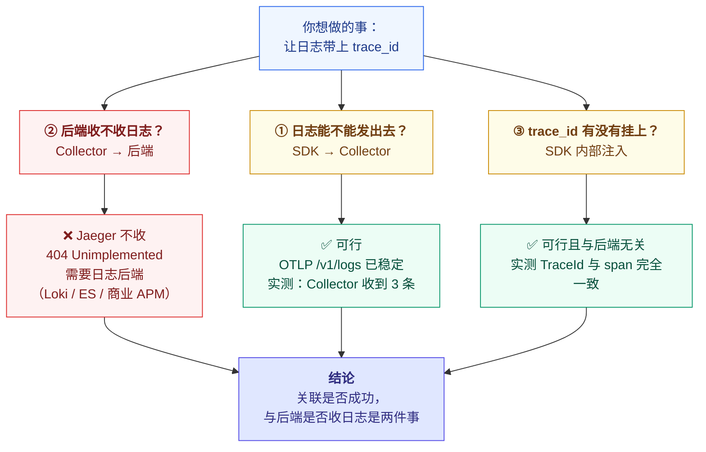
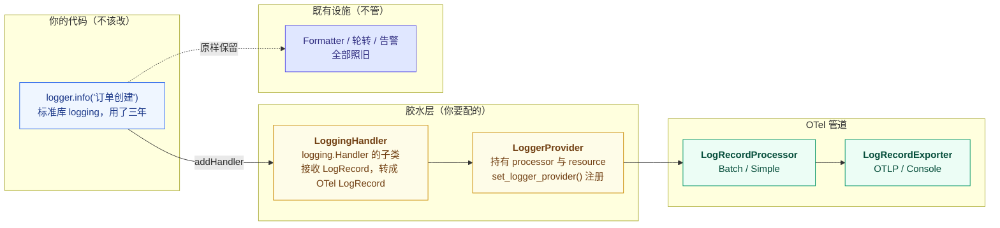
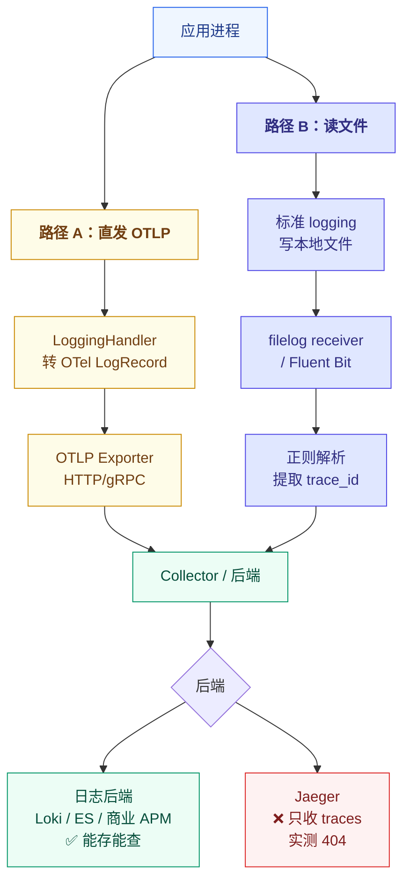
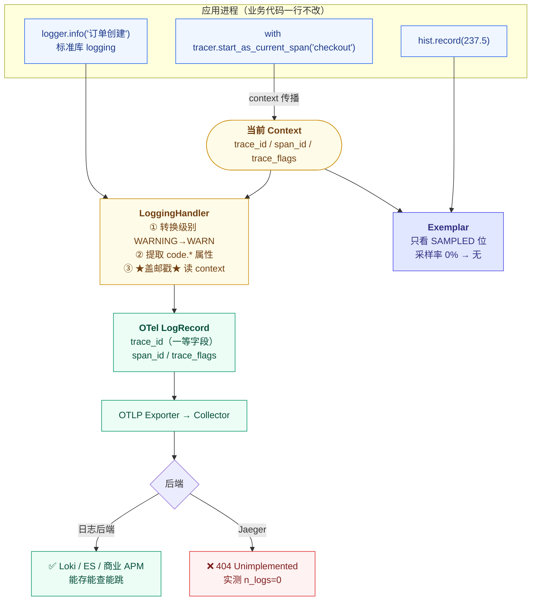

# 课 8 · 日志桥接与信号关联

> **状态**：✅ 已完成（2026-09-03）
> **所属阶段**：[阶段 3 · 指标与日志](../overview.md)
> **知识点**：3 个（7.1、7.2、7.3）
> **版本基准**：Python SDK 1.44.0 / Collector contrib 0.160.0 / Jaeger v2.20.0｜**核查于 2026-09**

[← 返回阶段概览](../overview.md) ｜ [← 返回课程目录](../../../02-课程目录.md)

---

## ⚠️ 本课信号稳定状态（先看这里，本课最容易出错的点）

本课涉及 OTel 的**日志信号**，它的稳定状态必须**分层说**，笼统说"日志已稳定"是错的：

| 层面 | 状态 | 说明 |
|---|---|---|
| **规范层**（Logs data model / Logs Bridge API） | **Stable** | 协议与 API 契约已稳定 |
| **OTLP 协议**（`LogRecord` 定义） | **Stable** | 与规范同步稳定 |
| **Python Logs SDK** | **Development** ⚠️ | **本课基准版本 1.44.0 仍是 Development** |
| **JS / Go Logs SDK** | 未稳定 | 各语言进度不一 |

**"Development" 在本机有具体的技术表现**，不是一句抽象警告。实测（2026-09-03）：

```python
>>> import opentelemetry.sdk.logs
ModuleNotFoundError: No module named 'opentelemetry.sdk.logs'      # ← 公开的 logs 包不存在！

>>> import opentelemetry.sdk._logs
>>> # 成功，但这是下划线开头的私有包
```

看看 `opentelemetry/sdk/` 目录下到底有什么：

```
__init__.pyi   _configuration   _logs   _shared_internal
environment_variables   error_handler   metrics   py.typed
resources   trace   util   version
```

**注意对比**：`metrics` 和 `trace` 都是**公开目录**，只有 `_logs` 带下划线前缀。**这不是笔误，是 SDK 在用它自己的方式告诉你"别依赖我"**。

> 📌 **规范稳定 ≠ 实现稳定**。这是本课程反复强调的纪律（课 7 已用它解释过 Python 的第 7 个 `create_gauge`）。本课你会第二次、第三次遇到它。
>
> **本课所有标注「实测」的结论，均是在 SDK 1.44.0 上真实跑出来的。若你使用了更高版本，请先重新核查 `_logs` 是否已转正为公开的 `logs`。**

---

## ⚠️ 本课环境说明

本课全部实操在 **WSL Ubuntu** 内完成，语言为 **Python**。

| 项 | 状态 |
|---|---|
| WSL Ubuntu 24.04 | Docker 29.4.1 + `uv` 0.11.6 + Python 3.12.13（venv：`~/otel-course/lab03/.venv`） |
| OTel Python SDK | **1.44.0**（本课所有"默认行为"以此版本实测为准） |
| Windows 本机 | Node v22.14.0，**无 Python 运行时** |
| Node / Go / Java | **本机均未安装**。本课出现的跨语言代码仅作对比说明，**未实测** |

**容器资产**（课 3-7 遗留 + 本课新增）：

| 容器 | 用途 | 端口 |
|---|---|---|
| `jaeger-lab03` | Jaeger v2.20.0（**只接受 traces，不接受 logs**） | 16686 / 4317 / 4318 |
| `otelcol-lab06` / `otelcol-lab06b` | 课 6 的 Collector（**只有 traces pipeline**） | 14317/14318、24317/24318 |
| `prom-lab07` | Prometheus v2.53.0（课 7） | 9099 |
| **`otelcol-lab08`** | **本课新增**：含 logs pipeline，转发 Jaeger | 34317 / 34318 |
| **`otelcol-lab08dbg`** | **本课新增**：只输出 debug，用于看完整字段 | 35318 |

---

## 一、本课在故事主线中的情节定位

| 叙事要素 | 内容 |
|----------|------|
| **角色** | 补齐最后一块拼图——日志，让主角拥有"叙事"能力 |
| **转折** | 指标说"P99 涨了"，链路说"这次请求慢在哪"，日志才说"当时系统说了什么" |
| **冲突** | 你的日志库已经用了三年，难道要换掉？——答案是：不用 |
| **本课出口** | 你的既有日志自动带上 `trace_id`，能从一条日志跳回它所属的那次请求 |

---

## 二、本课目标

学完本课你应该能够：

1. **理解** Logs Bridge API 的定位，以及为什么它"不该被终端用户直接调用"
2. **配置**日志关联，让 `trace_id` / `span_id` 自动注入既有日志，并实现双向跳转
3. **选择**日志采集路径：应用直发 OTLP，还是采集器读文件（filelog receiver / Fluent Bit）

---

## 三、知识点清单

| # | 知识点 | 状态 |
|---|--------|------|
| 7.1 | 日志桥接 API：不替换你的日志库 | ✅ |
| 7.2 | 日志关联：`trace_id` 自动注入 | ✅ |
| 7.3 | 日志采集的两条路径 | ✅ |

---

# 第一幕 · 场景引入：链路定位到了服务，然后呢？

## 1.1 一个"查得到但看不懂"的故障

周三下午，监控告警：下单服务 P99 从 300ms 涨到 2 秒。

你打开 Jaeger，按 P99 筛出一条慢请求：

```
trace_id = 3e450522b04c177ba97e653aad73f3ea
shop-order  ├─ checkout                    2000ms  ← 慢在这
            └─ db.query                      15ms
```

**你定位到了：慢在 `checkout` 这个 span，耗时 2000ms。**

然后呢？

`checkout` 里有十几步逻辑：参数校验、库存预占、优惠券核销、支付网关调用……**span 只告诉你"整体 2000ms"，不告诉你"哪一步卡住了"**。

这时候你想要的，是**这个 span 期间，程序自己打印的那些日志**：

```
15:43:48 INFO  开始库存预占 sku=SKU-88231
15:43:48 WARN  库存服务响应慢，耗时 1800ms   ← 找到了
15:43:50 INFO  库存预占成功
```

**但问题是：你的日志系统里有几十万行日志，怎么知道哪几行是"这一次请求"打出来的？**

## 1.2 一次真实的人工排查

来看没有日志关联时，你实际会怎么做。

服务每秒 500 个请求，每个请求平均打 8 条日志，一天就是：

```
500 × 8 × 86400 = 3.456 亿条/天
```

你只知道 trace_id 是 `3e450522...`，但**日志里根本没有这个字段**。你能做的只有：

1. 用时间戳框一个范围（`15:43:48` 前后几秒）
2. 在这个范围里**人工翻**几千行日志
3. 凭经验猜哪些行属于同一个请求

**这一步通常要花 10 到 30 分钟**，而且很容易看错——几秒内的日志来自几十个并发请求，它们交错在一起。

## 1.3 问题的本质：三根支柱各说各话

回顾课 1 的三根支柱。现在它们的状态是：

| 信号 | 能回答 | 不能回答 |
|---|---|---|
| **指标** | P99 涨了、QPS 掉了 | 是哪次请求 |
| **链路** | 这次请求慢在 `checkout` span | `checkout` 内部哪一步卡住 |
| **日志** | 系统当时打印了什么 | 这几行属于哪次请求 |

**每一根支柱都缺一把钥匙。** 而这把钥匙，就是 `trace_id`。

课 7 你已经见过一次这个思路——**Exemplar 给指标桶挂上 `trace_id`**，让 P99 尖刺能跳到具体请求。日志要做的是**同一件事**：

> 给每一行日志挂上 `trace_id`，让它能跳回所属的链路。

## 1.4 但这里有个现实问题

你的服务已经用了三年的日志方案：

```python
import logging
logger = logging.getLogger("shop.order")

logger.info("订单创建成功 order_id=%s", order_id)
logger.warning("库存不足 sku=%s", sku)
```

这些调用散落在几百个文件里，有自己配好的 formatter、handler、日志轮转、告警规则。

**要让日志带上 `trace_id`，难道要把这几百处调用全部改掉？**

如果答案是"是"，那 OTel 的日志方案根本推广不开。

## 1.5 第一幕的三个问题

| 问题 | 对应知识点 |
|------|-----------|
| 日志方案要推翻重来吗？有没有办法让既有日志自动带 `trace_id`？ | **7.1** |
| 这个"自动注入"到底是怎么做到的？注入后长什么样？ | **7.2** |
| 日志是让应用直接发给后端，还是照旧写文件让采集器读？ | **7.3** |

---

# 第二幕 · 认知冲突：你以为"日志已稳定"，其实差得远

## 2.1 第一次尝试：照着文档抄，ImportError

你搜"OTel Python 日志"，找到教程，照着写：

```python
from opentelemetry.sdk.logs import LoggerProvider, LoggingHandler
```

运行结果：

```
ModuleNotFoundError: No module named 'opentelemetry.sdk.logs'
```

你以为是没装包，去装：

```bash
pip install opentelemetry-sdk
```

结果显示 **`Requirement already satisfied`**——包在，但**模块名不对**。

正确的名字带一个下划线：

```python
from opentelemetry.sdk._logs import LoggerProvider, LoggingHandler   # 注意 _logs
```

**为什么？** 因为 Python Logs SDK 还处于 **Development** 状态，SDK 用下划线前缀明确表示"这是私有 API，我不保证它不变"。

## 2.2 这不是小事：下划线意味着什么

来看 `opentelemetry/sdk/` 目录下真实的子包列表（**实测，2026-09-03**）：

```
__init__.pyi              _configuration        _logs
_shared_internal          environment_variables error_handler
metrics                   py.typed              resources
trace                     util                  version
```

对比一下：

| 信号 | 目录名 | 性质 |
|---|---|---|
| Trace | `trace/` | **公开**，可直接 `from opentelemetry.sdk.trace import ...` |
| Metrics | `metrics/` | **公开**，可直接 `from opentelemetry.sdk.metrics import ...` |
| **Logs** | **`_logs/`** | **私有**，带下划线前缀 |

> ⚠️ **`_logs` 的公开名有 12 个**：`ConcurrentMultiLogRecordProcessor`、`Logger`、`LoggerProvider`、`LoggingHandler`、`LogLimits`、`LogRecordLimits`、`LogRecordProcessor`、`LogDroppedAttributesWarning`、`LogRecordDroppedAttributesWarning`、`ReadableLogRecord`、`ReadWriteLogRecord`、`SynchronousMultiLogRecordProcessor`。
>
> **它们能用，但 SDK 保留在下个版本改掉它们的权利。** 这就是"Development"的真正含义。

## 2.3 第二次尝试：装好了，日志却"消失"了

你改用 `_logs`，顺利配好，把日志发往 Collector，再转 Jaeger。程序跑完，**没有任何报错**：

```
TRACE_ID=3e450522b04c177ba97e653aad73f3ea
SPAN_ID =b9b845c6cce2f919
FLUSHED
```

你去 Jaeger 查这条 trace：

```bash
curl -s "http://localhost:16686/api/traces/3e450522b04c177ba97e653aad73f3ea"
```

**实测结果**：

```
traceID = 3e450522b04c177ba97e653aad73f3ea
n_spans = 1      ← span 到了
n_logs  = 0      ← 日志一条都没有！
```

**span 到了，日志一条都没到。而且全程没有一个 error。**

## 2.4 真相：Jaeger 不是日志后端

去看 Collector 的容器日志，**才发现真相**：

```
info  Logs  {"otelcol.component.id": "debug", "otelcol.signal": "logs",
             "resource logs": 1, "log records": 3}

error internal/queue_sender.go:62  Exporting failed. Dropping data.
      {"otelcol.component.id": "otlphttp/jaeger", "otelcol.signal": "logs",
       "error": "not retryable error: Permanent error: rpc error: code = Unimplemented
                 desc = error exporting items, request to http://jaeger-lab03:4318/v1/logs
                 responded with HTTP Status Code 404",
       "dropped_items": 3}
```

三条信息拼起来：

1. Collector **收到了** 3 条日志（`log records: 3`）
2. Collector 转发给 Jaeger 的 `/v1/logs`，Jaeger 回 **404 Unimplemented**
3. Collector **丢弃**了这 3 条，只在自己的日志里留了一行 error

**你的应用程序完全不知道这件事。** 它的 `force_flush()` 返回成功，Collector 也收了，是**后段**把数据丢了。

> 🐞 **误区 1：日志发给 Collector 成功 = 后端能查到**
>
> **不是。** 这是本课程**第六个静默失败**，而且是形态最新的一次。
>
> 回顾这条线索的演进：
>
> | 课 | 静默失败形态 |
> |---|---|
> | 课 3 | `force_flush()` 返回 True，但数据全丢 |
> | 课 5 | 缺 distro → 自动插桩空转；协议错配 → 程序照常 200 |
> | 课 6 | 采样器名写错 → 静默回退全量 |
> | 课 7 | 给 Counter 传负数 → 只打 WARNING 并丢弃 |
> | **课 8** | **导出器成功、Collector 收到，后端返回 404 被丢** |
>
> **共同点：每一层都"成功"了，只有最后一层知道数据没了，而它说话的声音传不到你耳朵里。**
>
> **唯一可信判据（课 3 确立，本课再次验证）：查后端 API。**

## 2.5 顺带发现：课 6 的 Collector 配置根本没有 logs pipeline

你好奇地去查课 6 那个 Collector 为什么返回 404（而不是转发）：

```
Failed to export logs batch code: 404, reason: Not Found
```

**原因**：课 6 的 Collector 配置里**只有 traces pipeline**，没有 logs pipeline。OTLP receiver 收到 `/v1/logs` 请求时，找不到对应的 pipeline，直接回 404。

这就是为什么本课要新起一个 `otelcol-lab08`——它的配置里**显式声明了 logs pipeline**：

```yaml
service:
  pipelines:
    traces:
      receivers: [otlp]
      processors: [batch]
      exporters: [debug, otlphttp/jaeger]
    logs:                                  # ← 课 6 没有这一条
      receivers: [otlp]
      processors: [batch]
      exporters: [debug, otlphttp/jaeger]
```

**加了之后，404 消失，日志成功到达 Collector**（`log records: 3`，实测）。

但**依然到不了 Jaeger**——因为 Jaeger 压根不接受日志。这两件事要分开看。

## 2.6 冲突的核心：三件被混为一谈的事

这一幕的混乱，来自把三件事当成了一件：



**① 和 ③ 都成立**（本课后续会逐一验证），**② 取决于你选什么后端**。

把 ② 的失败误认为 ① 或 ③ 的失败，是这一幕所有困惑的根源。

## 2.7 一个更隐蔽的陷阱：debug exporter 会骗你

在排查过程中，你可能会去看 Collector 的 debug 输出，想确认"trace_id 到底传没传"。

**实测输出**（`verbosity: detailed`）：

```
LogRecord #0
SeverityText: INFO
Body: Str(订单创建成功 order_id=SO-0001)
     -> code.file.path: Str(/mnt/d/projects/learning/.probe/l8_e_fields.py)
     -> code.function.name: Str(<module>)
     -> code.line.number: Int(49)
```

**你找不到 TraceId 字段**，于是你得出结论："trace_id 没传"。

**错了。** debug exporter **会省略零值字段**。上面这条记录里 trace_id 其实是有值的，只是 debug 没打；而 span 外的那条（trace_id 全 0）才被省略——**两件事混在一起，让你看起来像是"全都没传"**。

> ⚠️ **这是「测量工具自己骗人」的第七次出现**（前六次：课 6 采样器实验 ×2、课 7 E3/E4、课 8 的 InMemory reader、课 8 的 Jaeger 404）。
>
> **不要用 debug exporter 判断"某个字段有没有传"。** 要判断，直接看 SDK 层的原始对象（本课实验 F 会这么做）。

---

# 第三幕 · 层层揭示：Bridge API 在哪 → 关联怎么实现 → 两条路怎么选

## 7.1 日志桥接 API：不替换你的日志库

### 一句话定义

> Logs Bridge API 是**给"日志库的作者/集成方"用的一层薄接口**，它只负责把已有的日志记录**转译**成 OTel 的 LogRecord 并送进管道；**它不提供新的日志 API，终端用户不该直接调用它**。

### 直觉建立：转接头，不是新插座

想象你有一个用了三年的德标插座（你的 `logging` 库），现在要接一个国标插头（OTel 管道）。

你有两个选择：

| 选择 | 含义 |
|---|---|
| **换掉整个插座** | 重写所有日志调用——几百个文件，不现实 |
| **买一个转接头** | 插座不动，插上去就能转接——**这就是 Bridge API** |

**Bridge API 是转接头。它的价值恰恰在于：你原来的 `logger.info(...)` 一行都不用改。**

规范原文说得很直接（大意）：Bridge API 的受众是**日志库的作者和 OTel 的集成方**，不是写业务的程序员。终端用户应该继续用 `logging.info()`。

### 核心原理：三层结构，你在哪一层



**关键点：`LoggingHandler` 是一个普通的 `logging.Handler`。**

这意味着你原来的 handler（写文件的、发 syslog 的、滚动切割的）**全部保留**，只是**多挂一个** OTel 的 handler：

```python
logger.addHandler(file_handler)      # 原来就有的，不动
logger.addHandler(rotating_handler)  # 原来就有的，不动
logger.addHandler(LoggingHandler(logger_provider=lp))   # ← 新增这一个
```

**这就是"不替换你的日志库"的技术实现方式。**

### 示例演示：最小可运行配置

完整脚本见第四幕，这里是核心的六行：

```python
from opentelemetry._logs import set_logger_provider          # 注意：API 层，无下划线
from opentelemetry.sdk._logs import LoggerProvider, LoggingHandler   # SDK 层，有下划线
from opentelemetry.sdk._logs.export import BatchLogRecordProcessor

lp = LoggerProvider()                                    # ① 建 provider
lp.add_log_record_processor(BatchLogRecordProcessor(exporter))  # ② 挂 processor
set_logger_provider(lp)                                  # ③ 注册到全局

logger.addHandler(LoggingHandler(logger_provider=lp))    # ④ 挂到既有 logger
logger.info("订单创建成功")                                # ⑤ 业务代码一行没改
```

**注意 ③ 的导入路径**：`set_logger_provider` 在 **API 层** `opentelemetry._logs`（无 `sdk`），而 `LoggerProvider` / `LoggingHandler` 在 **SDK 层** `opentelemetry.sdk._logs`。

这和你在课 3 见过的 `set_tracer_provider` / `TracerProvider` 是同一个分工模式：**API 层管"注册与获取"，SDK 层管"实现"**。

### 常见误区（7.1）

> 🐞 **误区 2：Bridge API 是给业务代码用的新日志 API**

不是。**规范明确说：终端用户不应直接调用 Bridge API 去打日志。**

如果你在业务代码里写 `logger_provider.get_logger(...).emit(...)`，那你就用错了——**你应该继续用 `logging.info()`**。Bridge API 的受众是写 `opentelemetry-instrumentation-logging` 这类集成库的人。

判断标准很简单：**如果你在改业务代码里的日志调用，那你就走错路了。**

> 🐞 **误区 3：接了 OTel 之后，原来的文件日志要删掉**

不用删，也不该删。`LoggingHandler` 只是**多挂一个 handler**，原来的 handler 照常工作。

实际上**双写是推荐做法**——本地文件日志用于人工排查和既有告警，OTLP 日志用于与链路关联。**两者互补，不是替代。**

> 🐞 **误区 4：LoggingHandler 会接管我的日志格式**

不会。`LoggingHandler` 只把 `logging.LogRecord` 的**内容**（body、level、时间、属性）转成 OTel 的 LogRecord，**完全不碰你的 formatter**。

你在终端/文件里看到的格式，与发给 OTel 后端的数据，是两回事。

### 一句话记住（7.1）

> **Bridge API 是转接头不是新插座——它让你用了三年的 `logger.info()` 一行不改，就能接上 OTel 管道。**

---

## 7.2 日志关联：`trace_id` 自动注入

### 一句话定义

> 日志关联是 **SDK 在构造 LogRecord 的那一刻，自动从当前 context 里读取活跃 span 的 `trace_id` / `span_id` / `trace_flags`，并写进 LogRecord 字段**的机制——**不需要你在日志里手写任何东西**。

### 直觉建立：邮戳

想象每条日志是一封信。你写信的时候**不需要自己写"这封信属于哪个案件"**——邮局盖章的时候会自动盖上案件编号。

**`LoggingHandler` 就是那个邮局。** 它在把你的信（LogRecord）送出去之前，看一眼当前 context 里"正在处理哪个请求"，然后盖上 `trace_id` 这个章。

**关键在于：章是盖上去的，不是你写的。** 所以你的业务代码一行都不用改。

### 核心原理：注入发生在哪一步

```
logger.info("订单创建成功")
        │
        ▼
  logging 标准库：构造 logging.LogRecord
        │
        ▼
  LoggingHandler.emit() 被调用
        │
        ├─① 转换 level：Python WARNING → OTel WARN，CRITICAL → FATAL
        │     （Python 与 OTel 的级别名不完全一致）
        │
        ├─② 提取属性：code.file.path / code.function.name / code.line.number
        │
        └─③ ★关联注入★：读 context.get_current_span()
              ├─ 有有效 span → 写入 trace_id / span_id / trace_flags
              └─ 无有效 span → 全部填 0
        │
        ▼
  OTel LogRecord 进入 processor → exporter
```

**第 ③ 步就是"关联"的全部秘密。** 它做的事，等价于：

```python
span = trace.get_current_span()
sc = span.get_span_context()
if sc.is_valid:
    log_record.trace_id = sc.trace_id
    log_record.span_id = sc.span_id
    log_record.trace_flags = sc.trace_flags
```

### 示例演示：注入后的日志长什么样

**实测**（SDK 1.44.0，实验 F，直接读 SDK 层的原始对象，避开 debug exporter 的省略陷阱）：

```
--- LogRecord #0 ---   （在 span 内打的日志）
  Body            : '订单创建成功 order_id=SO-0001'
  SeverityText    : 'INFO'
  SeverityNumber  : SeverityNumber.INFO
  TraceId (raw)   : 3695546688607383377837212753668856470
  SpanId  (raw)   : 18175804492812295836
  TraceFlags(raw) : 3
  TraceId (hex)   : 02c7bc84e5a09182d82b683ca27fda96   ← 与 span 完全一致
  SpanId  (hex)   : fc3d6de2fd069e9c
  Attributes      : {'code.file.path': ..., 'code.line.number': 58}

--- LogRecord #1 ---   （span 外打的日志）
  TraceId (raw)   : 0        ← 全 0，因为没有活跃 span
  SpanId  (raw)   : 0
  TraceFlags(raw) : 0
```

**三个要点**：

1. **字段是 LogRecord 的一等字段**，不是塞在 attributes 里的字符串。`trace_id` 是单独的整数类型字段。
2. **Python 里它是 int，不是 hex 字符串**。打印时要自己格式化：`"%032x" % trace_id`。
3. **span 外就是全 0**，不会报错，也不会塞个占位符。

### 🎯 本课最重要的一张表：采样会不会切断关联？

这是本课**最有价值的一个实测结论**，它直接推翻了一个流传很广的误解。

三组对照（**每组独立子进程**，10000 或 200 次请求）：

| 采样配置 | 被采样 span | 日志总数 | **带 trace_id 的日志** | **exemplar 数** |
|---|---|---|---|---|
| `always_on` | 200 / 200 | 200 | **200（100%）** | 1 |
| `ratio_10pct`（10%） | 25 / 200 | 200 | **200（100%）** | 1 |
| `always_off`（0%） | 0 / 200 | 200 | **200（100%）** | **0** |

**读作三条结论**：

**① 日志关联不受采样影响。** 即使 `always_off`（一个 span 都不采样），200 条日志**依然 100% 带 trace_id**。

**② exemplar 受采样影响。** `always_off` 时 exemplar 归零——因为它只在 SAMPLED 位为 1 时生成（课 7 结论）。

**③ 因此：头部采样切断 exemplar，但切不断日志关联。**

### 为什么会有这个差异？

因为两者的**判据不同**：

| | 判据 | 采样率 0% 时 |
|---|---|---|
| **Exemplar** | 只看 SAMPLED 位（`flags & 0x01`） | span 不被采样 → 不生成 |
| **日志关联** | 只看**有没有有效 span context** | span 仍在 context 里（trace_id 存在）→ 照常注入 |

**关键细节**：`always_off` 采样器**不是"不创建 span"**，而是"创建 span 但不设置 SAMPLED 位"。所以：

- span **存在**，`trace_id` **有效** → 日志照常拿到 trace_id
- 但 `trace_flags = 0` → exemplar 不生成

**实测证据**（实验 B，构造 `trace_flags=0x00` 的合法 span context）：

```
sampled      trace_id=d36b481f8fb99ca0d244a3931f221fee span_id=... flags=3
notsampled   trace_id=11112222333344445555666677778888 span_id=... flags=0   ← trace_id 仍在！
nospan       trace_id=(zero)                            span_id=... flags=0
```

> 🐞 **误区 5：未采样的请求，日志里没有 trace_id（所以采样会让日志关联失效）**
>
> **恰恰相反。** 未采样时 `trace_id` 依然完整注入，只是 `trace_flags=0`。
>
> 这个结论很反直觉，但它的工程意义很大：**你不会因为省钱降低采样率，就丢掉日志与请求的对应关系。**
>
> 不过要注意另一面：**未采样的 trace 在后端不存在**，所以你拿这个 trace_id 去 Jaeger 查，**查不到东西**。关联是"记下来了"，但"点不开"。这正是课 6 讨论过的"真相与成本的权衡"在日志侧的投影。

### 与课 7 的呼应：三根支柱的关联能力对比

| 关联方式 | 由谁生成 | 受采样影响 | 采样率 0% 时 |
|---|---|---|---|
| **Exemplar**（指标→链路） | SDK，看 SAMPLED 位 | ✅ 是 | 无 exemplar |
| **日志 trace_id**（日志→链路） | SDK，看 span context 有效性 | ❌ **否** | **仍 100% 带 trace_id** |
| **Span parent/child**（链路内部） | SDK，传播 context | 否（但整条被丢弃） | 无 span |

> 📌 这解释了一个实践中的常见现象：**"指标说有问题，链路查不到"**（课 6 练习 4 的诊断信号）。
>
> 现在你知道该看什么了——**去看日志**。日志里有 trace_id，只是那条 trace 没被采样而没进后端。

### 常见误区（7.2）

> 🐞 **误区 6：`trace_id` 在日志里是十六进制字符串**

不是。在 Python SDK 里它是 **int**（实测 `TraceId (raw) = 3695546688607383377837212753668856470`）。

要打印成你熟悉的样子，得自己格式化：

```python
"%032x" % log_record.trace_id     # → '02c7bc84e5a09182d82b683ca27fda96'
```

写 exporter 或做正则解析时要注意这一点。

> 🐞 **误区 7：Python 的日志级别名会被原样传到 OTel**

不会。**有两处映射**（实测源码）：

| Python | OTel SeverityText |
|---|---|
| `WARNING` | **`WARN`** |
| `CRITICAL` | **`FATAL`** |
| `INFO` / `DEBUG` / `ERROR` | 同名 |

如果你在后端按 `severity_text = "WARNING"` 过滤，**会过滤不到任何东西**——OTel 那边叫 `WARN`。

> 🐞 **误区 8：异步代码 / 线程池里的日志会自动带上父请求的 trace_id**

**不会，除非你显式传播 context。**

原因和课 4 讲的 span 断链完全一样：context 靠 `contextvars` 传播，**跨线程、跨 asyncio task 时不会自动跟随**。

修复方式也和课 4 一样——**把 context 显式传过去**：

```python
from opentelemetry.context import attach, get_current

ctx = get_current()               # 提交任务时抓当前 context
executor.submit(run_with_ctx, ctx, payload)

def run_with_ctx(ctx, payload):
    token = attach(ctx)           # 在子线程里恢复 context
    try:
        logger.info("子线程日志")   # 现在能拿到父请求的 trace_id
    finally:
        detach(token)
```

### 一句话记住（7.2）

> **日志关联是"邮戳"——章是 SDK 盖的，不是你写的；而且它只看"有没有 span"，不看"span 采没采样"。**

---

## 7.3 日志采集的两条路径

### 一句话定义

> 日志进入 OTel 管道有两条路：**路径 A 让应用直接通过 OTLP 发送**（SDK 内完成），**路径 B 让应用照旧写文件、由采集器读文件并解析**（filelog receiver / Fluent Bit）。

### 直觉建立：寄信的两种方式

| | 路径 A：直发 OTLP | 路径 B：采集器读文件 |
|---|---|---|
| 类比 | **你直接去邮局寄** | **你把信投进楼下邮筒，邮差来收** |
| 谁来跑 | 应用进程自己 | 独立采集器进程 |
| 应用要知道 OTel 吗 | **要**（得引入 SDK） | **不需要**（照旧写文件） |

### 核心原理：两条路径的数据流



### 示例演示：路径 B 的解析，以及它的坑

路径 B 的关键是：**应用侧要有个"注入器"把 trace_id 写进文本**，采集器侧再用正则抠出来。

**应用侧**（一个普通的 `logging.Filter`）：

```python
class TraceIdFilter(logging.Filter):
    def filter(self, record):
        sc = trace.get_current_span().get_span_context()
        if sc is not None and sc.is_valid:
            record.otelTraceID = format(sc.trace_id, "032x")
            record.otelSpanID = format(sc.span_id, "016x")
        else:
            record.otelTraceID = "0" * 32
            record.otelSpanID = "0" * 16
        return True
```

配上 formatter：

```python
fmt = ("%(asctime)s %(levelname)-8s [trace_id=%(otelTraceID)s "
       "span_id=%(otelSpanID)s] %(message)s")
```

**实测输出**（实验 G，应用写出来的文件原文）：

```
2026-09-03 15:43:48,930 INFO     [trace_id=d285bef826ded787b9bfc3c3fe7b7e1a span_id=12d0b431c4b46ed0] 订单创建成功 order_id=SO-0001
2026-09-03 15:43:48,931 WARNING  [trace_id=d285bef826ded787b9bfc3c3fe7b7e1a span_id=12d0b431c4b46ed0] 库存不足 sku=SKU-88231
2026-09-03 15:43:48,931 INFO     [trace_id=00000000000000000000000000000000 span_id=0000000000000000] 后台任务：无 span 上下文
```

**采集器侧正则**（模拟 filelog receiver）：

```python
pat = re.compile(
    r"^(?P<ts>\S+ \S+)\s+(?P<level>\w+)\s+"
    r"\[trace_id=(?P<trace_id>[0-9a-f]{32})\s+"
    r"span_id=(?P<span_id>[0-9a-f]{16})\]\s+(?P<body>.*)$"
)
```

**实测解析结果：3 行全部匹配成功，其中 2 行带真实 trace_id。**

**然后你打一条异常日志，坑就来了**：

```
=== 多行日志（异常堆栈）的错位风险 ===
  新增 5 行，其中属于堆栈续行的有 4 行
  正则匹配失败的行数 = 4
     | Traceback (most recent call last):
     |   File "/mnt/d/.../l8_g_filelog.py", line 113, in
     |     raise ValueError("支付网关超时")
     | ValueError: 支付网关超时
```

**异常堆栈的 4 行全部解析失败**——因为它们不带 `[trace_id=...]` 前缀。

这正是 filelog receiver 最经典的坑。解决方案是配置 `multiline`：

```yaml
receivers:
  filelog:
    include: [/var/log/shop/*.log]
    multiline:
      line_start_pattern: ^\d{4}-\d{2}-\d{2}    # 只有符合"日期开头"的才是新日志
```

> ⚠️ **本机未实测 filelog receiver 与 Fluent Bit**（本机无对应镜像，实验 G 是用 Python 模拟其解析行为）。**上述 `multiline` 配置未在本机跑通**，仅作说明。

### 两条路径怎么选

| 维度 | 路径 A：直发 OTLP | 路径 B：读文件 |
|---|---|---|
| **应用侵入性** | 需要引入 OTel SDK | **零侵入**，照旧写文件 |
| **trace_id 准确性** | ✅ 结构化字段，**不会解析错** | ⚠️ 依赖正则，**多行日志易错位** |
| **性能开销** | 应用进程内序列化 + 网络 | 应用只写磁盘，开销转给采集器 |
| **后端抖动的影响** | 需靠 batch + 队列缓冲 | **天然解耦**，应用不受影响 |
| **已有日志改造成本** | 每接入一个服务要改代码 | **只改采集器配置** |
| **容器短生命周期** | ✅ 进程内直发，不担心文件丢 | ⚠️ 容器销毁可能丢未采集的日志 |
| **多行堆栈** | ✅ 天然支持（整个 body 一个字段） | ❌ 需额外配 `multiline` |
| **适用** | 新服务、可改代码的服务 | **存量服务、无法改代码的服务** |

**决策判据**：

```
能改应用代码吗？
├─ 能 → 路径 A（直发 OTLP）：字段准确、支持多行、不丢日志
└─ 不能（存量/第三方/不敢动）
   └─ 路径 B（读文件）：零侵入，但要配好 multiline 并接受解析风险
```

> 📌 **实践中两条路往往并存**：新服务走 A，存量服务走 B，最后都汇到同一个后端。**Collector 的价值就在于屏蔽了这两条路的差异。**

### 常见误区（7.3）

> 🐞 **误区 9：路径 B 不需要应用侧做任何改动**

**错误。** 路径 B 仍需一个"注入器"把 trace_id 写进日志文本——就是上面那个 `TraceIdFilter`。

官方的 `opentelemetry-instrumentation-logging` 做的就是这件事（它会自动给你的 formatter 加上 trace_id 字段）。**零侵入指的是"不用改日志调用"，不是"什么都不用配"。**

> 🐞 **误区 10：选了路径 A 就可以关掉文件日志**

不建议。**双写是推荐做法**：

- 文件日志：本地排查、既有告警规则、不依赖网络
- OTLP 日志：与链路关联、集中检索

**如果后端挂了，文件日志是你最后的证据。** 课 3 学到的教训在这里同样适用：**永远留一条不依赖网络的退路。**

> 🐞 **误区 11：日志发给 Collector = 后端能查到**

第二幕已详述。重申一遍：**Collector 收到 ≠ 后端收到**。Jaeger 对 `/v1/logs` 返回 404，数据在 Collector 之后被丢弃，而应用侧全程无感知。

**验证的唯一方式是查后端 API。**

### 一句话记住（7.3）

> **能改代码走直发（字段准、支持多行），改不了就走读文件（零侵入、但要配 multiline）——两条路都汇进 Collector，而 Collector 收到不等于后端收下。**

---

# 第四幕 · 实操验证：给既有 Python logging 加上关联

## 4.0 前置检查

```bash
# 1. 确认 venv 与 SDK 版本
wsl -d Ubuntu -- /root/otel-course/lab03/.venv/bin/python -c \
  "import importlib.metadata as md; print(md.version('opentelemetry-sdk'))"
# 期望输出：1.44.0

# 2. 确认 logs SDK 的状态（本课关键点）
wsl -d Ubuntu -- /root/otel-course/lab03/.venv/bin/python -c \
  "import opentelemetry.sdk.logs"
# 期望输出：ModuleNotFoundError  ← 这就对了，logs 还是 Development

# 3. 确认容器状态
wsl -d Ubuntu -- docker ps --format "table {{.Names}}\t{{.Status}}" | Select-String "jaeger|otelcol-lab08"
```

> ⚠️ 本课脚本位于 `D:/projects/learning/.probe/`（仓库根），WSL 内路径 `/mnt/d/projects/learning/.probe/`。

## 4.1 步骤一：最小关联示例（不依赖任何后端）

```python
# l8_f_raw.py（节选）
import logging
from opentelemetry import trace as api_trace
from opentelemetry._logs import set_logger_provider
from opentelemetry.sdk._logs import LoggerProvider, LoggingHandler
from opentelemetry.sdk._logs.export import BatchLogRecordProcessor
from opentelemetry.sdk.trace import TracerProvider

tp = TracerProvider()
api_trace.set_tracer_provider(tp)
tracer = api_trace.get_tracer("shop.order", "1.0")

lp = LoggerProvider()
lp.add_log_record_processor(BatchLogRecordProcessor(CaptureExporter()))
set_logger_provider(lp)

# 关键：业务代码一行不改，只是多挂一个 handler
logger = logging.getLogger("shop.order")
logger.addHandler(LoggingHandler(logger_provider=lp))

with tracer.start_as_current_span("checkout") as span:
    logger.info("订单创建成功 order_id=SO-0001")   # ← 自动带 trace_id
```

运行：

```bash
wsl -d Ubuntu -- /root/otel-course/lab03/.venv/bin/python \
  /mnt/d/projects/learning/.probe/l8_f_raw.py
```

**实测输出**：

```
SPAN   trace_id = 02c7bc84e5a09182d82b683ca27fda96
--- LogRecord #0 ---
  TraceId (hex)   : 02c7bc84e5a09182d82b683ca27fda96   ← 与 span 完全一致
  SpanId  (hex)   : fc3d6de2fd069e9c
--- LogRecord #1 ---  （span 外）
  TraceId (raw)   : 0
```

## 4.2 步骤二：端到端发到 Collector

```python
# l8_e_fields.py（节选）
from opentelemetry.exporter.otlp.proto.http._log_exporter import OTLPLogExporter

lp.add_log_record_processor(BatchLogRecordProcessor(
    OTLPLogExporter(endpoint="http://localhost:34318/v1/logs")))
```

> ⚠️ **导入路径坑（本课第 5 处）**：`OTLPLogExporter` 在
> `opentelemetry.exporter.otlp.proto.http._log_exporter`——注意末尾的 **`_log_exporter` 带下划线**，
> 与 trace 的 `trace_exporter`（无下划线）**不对称**。

运行后查 Collector：

```bash
wsl -d Ubuntu -- docker logs otelcol-lab08 2>&1 | Select-String "log records"
```

**实测输出**：

```
info  Logs  {"otelcol.component.id": "debug", "otelcol.signal": "logs",
             "resource logs": 1, "log records": 3}
```

## 4.3 步骤三：验证 Jaeger 不收日志（本课核心反例）

```bash
wsl -d Ubuntu -- bash /mnt/d/projects/learning/.probe/l8_d2_query.sh
```

**实测输出**：

```
{"data":[... "shop-loglab08" ...],"total":39,...}
n_traces= 1
  tid= 3e450522b04c177ba97e653aad73f3ea
```

然后查这条 trace 里有没有日志：

```bash
wsl -d Ubuntu -- bash /mnt/d/projects/learning/.probe/l8_d3_trace.sh \
  3e450522b04c177ba97e653aad73f3ea
```

**实测输出**：

```
traceID = 3e450522b04c177ba97e653aad73f3ea
n_spans = 1      ← span 到了
n_logs  = 0      ← 日志一条都没有
```

去看 Collector 的错误：

```bash
wsl -d Ubuntu -- docker logs otelcol-lab08 2>&1 | Select-String "404"
```

**实测输出**：

```
error ... Exporting failed. Dropping data.
  "error": "... http://jaeger-lab03:4318/v1/logs responded with HTTP Status Code 404",
  "dropped_items": 3
```

> ✅ **这就是本课第二个静默失败的完整证据链**：应用成功 → Collector 收到 3 条 → 转发 Jaeger 得 404 → 丢弃。**全程应用侧无感知。**

## 4.4 步骤四：采样是否会切断关联（本课核心实验）

```bash
wsl -d Ubuntu -- bash /mnt/d/projects/learning/.probe/l8_c12_run.sh
```

**实测输出**：

```
===== 采样率 vs 日志关联 vs exemplar =====
sampler=always_on     spans_sampled=200/200 logs_total=200 logs_with_trace_id=200 exemplars=1
sampler=ratio_10pct   spans_sampled= 25/200 logs_total=200 logs_with_trace_id=200 exemplars=1
sampler=always_off    spans_sampled=  0/200 logs_total=200 logs_with_trace_id=200 exemplars=0
```

**读法**：`always_off` 时，**一个 span 都没采样，但 200 条日志全部带 trace_id**；而 exemplar 归零。

## 4.5 步骤五：路径 B 的文件写入与解析

```bash
wsl -d Ubuntu -- /root/otel-course/lab03/.venv/bin/python \
  /mnt/d/projects/learning/.probe/l8_g_filelog.py
```

**实测输出**：

```
解析成功 3 行，其中带真实 trace_id 的 2 行

=== 多行日志（异常堆栈）的错位风险 ===
  正则匹配失败的行数 = 4
     | Traceback (most recent call last):
     | ValueError: 支付网关超时
```

## 4.6 本课实验清单

| 实验 | 内容 | 关键结果 |
|---|---|---|
| A | 最小 LoggingHandler 关联 | span 内自动注入，span 外全 0；`trace_flags` 为 **int 3** |
| B | 采样/未采样/无 span 三态 | 未采样时 **trace_id 仍在**（`flags=0`），无 span 时全 0 |
| C1-C11 | **exemplar 计数为 0 的排查**（11 轮） | 见 4.7，最终定位为读取时机问题 |
| C12 | 修正后的三态矩阵 + 采样对照 | 三态矩阵 **1/1、0/0、1/0**；采样对照见 4.4 |
| D | 端到端发 Collector → Jaeger | Collector 收 3 条，Jaeger **n_logs=0**（404） |
| E | debug Collector 抓字段 | debug **省略零值字段**，不能直接判断"有没有传" |
| F | 直读 SDK 层原始对象 | `TraceId (hex)` 与 span **完全一致**（权威证据） |
| G | 路径 B 文件写入 + 正则解析 | 3 行匹配成功；**异常堆栈 4 行全部失败** |

## 4.7 🎯 一个必须记录的排查：为什么我测了 11 轮才对

这是本课程**耗时最长的一次排查**，也是"测量工具自己骗人"的第七次出现。

**现象**：课 7 的脚本能跑出 1 条 exemplar，我为本课重写的所有脚本**都是 0**。

**11 轮排查过程**：

| 轮次 | 假设 | 结果 |
|---|---|---|
| C1 | 记录条数不够（50 太少） | 10000 条仍是 0 ❌ |
| C2 | 聚合方式不同 | 显式桶仍是 0 ❌ |
| C3 | exemplar filter 没生效 | 显式 `always_on` 仍是 0 ❌ |
| C4 | SDK 直连 vs API 全局 | 两种都是 0 ❌ |
| C5 | 是否传 attributes / 循环方式 | 六种组合全是 0 ❌ |
| C6 | `get_current_span()` 调用 / `start_as_current_span` | 四种组合全是 0 ❌ |
| C7 | resource / set_global / api_getter | 五种组合全是 0 ❌ |
| C8 | 是否加 span processor | 两种都是 0 ❌ |
| **C9** | **复制课 7 脚本做减法** | **只留 D1 → 仍是 1** ✅ |
| **C10** | **逐项关闭五个变量** | **全部关闭 → 仍是 1** ✅ ← 转折点 |
| **C11** | **读取时机** | **定位成功** ✅ |

**C10 是关键转折**：五个变量全部关闭后依然能得到 1 条，说明问题**不在配置，而在"怎么读"**。

**最终根因（C11 实测）**：

```
--- A: record 后立即读（l7 写法）---
RESULT immediate           exemplars=1 points=1     ← 有
--- B: force_flush 后读 ---
RESULT after_force_flush    exemplars=0 points=1     ← 没了
--- C: force_flush + sleep 后读 ---
RESULT after_flush_and_sleep exemplars=0 points=1    ← 没了
--- D: 读两次 ---
RESULT first_read  exemplars=1 points=1              ← 第一次有
RESULT second_read exemplars=0 points=1              ← 第二次没了
```

> ⚠️ **`InMemoryMetricReader` 的 exemplar 是一次性的。**
>
> `get_metrics_data()` 会触发一次 collect，**collect 之后 reservoir（蓄水池）被清空**。而 `force_flush()` 内部也会触发一次 collect——所以：
>
> - `record()` → `force_flush()` → `get_metrics_data()` → **读到 0**（数据已被 flush 消费掉）
> - `record()` → `get_metrics_data()` → **读到 1**（正确姿势）
> - `get_metrics_data()` 读两次 → **第二次是 0**
>
> **正确姿势：record 之后立刻读，读一次就够了，绝不 force_flush 后读。**

**这次排查的三条方法论价值**：

1. **"复制原脚本做减法"比"重写新脚本做加法"有效得多**——C9 是转折点，前八轮都在做加法，全错。
2. **当所有变量都排除后结论仍不变时，怀疑"观测方式本身"**——C10 证明了配置无关，剩下只能是读取方式。
3. **课 7 的结论本身没错**（C12 修正后完全复现 1/1、0/0、1/0），**错的是我这轮的测量方式**。

---

# 第五幕 · 体系收束：三根支柱第一次真正打通

## 5.1 一图总结



## 5.2 本课误区汇总表（20 条）

| # | 误区 | 正确认知 |
|---|---|---|
| 1 | 日志发给 Collector 成功 = 后端能查到 | **不是**。Jaeger 实测 404，数据在 Collector 之后被丢 |
| 2 | Bridge API 是给业务代码用的新日志 API | **不是**。受众是集成方；业务代码继续用 `logging.info()` |
| 3 | 接了 OTel 要删掉原来的文件日志 | **不用**。多挂一个 handler，**双写是推荐做法** |
| 4 | LoggingHandler 会接管我的日志格式 | **不会**。它只转内容，不碰 formatter |
| 5 | 未采样的请求，日志里没有 trace_id | **相反**。未采样时 trace_id **仍在**，只是 `flags=0` |
| 6 | `trace_id` 在日志里是十六进制字符串 | **不是**。Python 里是 **int**，需 `"%032x" % tid` |
| 7 | Python 日志级别名原样传到 OTel | **不是**。`WARNING`→`WARN`，`CRITICAL`→`FATAL` |
| 8 | 异步/线程池日志自动带父请求 trace_id | **不会**，须显式 `attach(ctx)` 传播（同课 4 断链） |
| 9 | 路径 B 不需要应用侧任何改动 | **错误**。仍需注入器把 trace_id 写进文本 |
| 10 | 选了路径 A 就可以关掉文件日志 | **不建议**。后端挂了时文件日志是最后证据 |
| 11 | 路径 B 不需要应用侧任何改动 | **错误**。仍需注入器把 trace_id 写进文本 |
| 12 | 选了路径 A 就可以关掉文件日志 | **不建议**。后端挂了时文件日志是最后证据 |
| 13 | `opentelemetry.sdk.logs` 可以正常导入 | **不能**。1.44.0 只有私有的 `sdk._logs` |
| 14 | debug exporter 输出里有所有字段 | **不是**。它**省略零值字段**，易误判"没传" |
| 15 | `InMemoryMetricReader` 可以反复读 | **不能**。exemplar **一次性**，读第二次归零 |
| 16 | `force_flush()` 后再读 metric 更安全 | **相反**。`force_flush()` 会消费掉 exemplar |
| 17 | `OTLPLogExporter` 与 `OTLPSpanExporter` 路径对称 | **不对称**。前者是 `_log_exporter`（带下划线） |
| 18 | `InMemorySpanExporter` 在 `sdk.trace.export` | **不是**。在 `sdk.trace.export.in_memory_span_exporter` |
| 19 | 课 6 的 Collector 能收日志 | **不能**。它只有 traces pipeline，实测 404 |
| 20 | filelog receiver 能自动处理多行堆栈 | **不能**。须配 `multiline`，否则堆栈行全部解析失败 |

## 5.3 📌 练习

### 练习 1

你的服务用 `logging.warning("库存不足")`。接入 OTel 后，这条日志在后端显示的 `severity_text` 是什么？如果你在 Grafana 里按 `severity_text="WARNING"` 过滤，会发生什么？

<details>
<summary>参考答案</summary>

**后端显示的是 `WARN`，不是 `WARNING`。**

Python 的 `WARNING` 会被映射成 OTel 的 `WARN`（源码里有映射表，注释指向 issue #3548）。同理 `CRITICAL` → `FATAL`（issue #4984）。

**按 `severity_text="WARNING"` 过滤会过滤到 0 条**——这是个很容易漏掉的坑，因为你的代码里明明写的是 `warning`。

正确写法：

```promql
{service_name="shop"} | severity_text = "WARN"
```

> 📌 影响范围不止 Python：这套映射是 OTel 的 severity 规范定义的，各语言 SDK 都会做类似的规范化。**跨语言查日志时不要假设级别名与你的代码字面量一致。**
</details>

### 练习 2

你的服务把采样率从 100% 降到了 1%。请问：
① 日志里带 trace_id 的比例会怎么变？
② 你在日志里看到的 trace_id，有多少能在 Jaeger 里查到？
③ 这时候"从日志跳链路"这条路还走得通吗？该怎么调整？

<details>
<summary>参考答案</summary>

**① 不变，仍是 100%。**

本课实测：`always_off`（0% 采样）下，200 条日志**依然全部带 trace_id**。因为日志关联只看"有没有有效 span context"，不看 SAMPLED 位。

**② 大约 1%。**

采样率 1% 意味着只有 1% 的 trace 进了 Jaeger。另外 99% 的日志虽然带着 trace_id，但那个 trace 在后端**不存在**——**关联记下来了，但点不开**。

**③ 走得通，但要调整预期和做法。**

三条建议：

- **用尾部采样替代纯头部采样**（课 6 结论）：让错误和慢请求 100% 保留。这样"你最想看的那部分日志"的 trace_id 是点得开的。
- **把 trace_id 也写进日志正文**（而不只依赖结构化字段）：这样即使后端查不到，你也能靠 trace_id 在文件日志里 `grep` 出同一次请求的所有日志——**不看后端也能自洽**。
- **接受"大部分点不开"这个事实**：日志关联的价值不只是跳转，还有**把同一次请求的日志聚在一起**。后者不受采样影响。

> ⚠️ 注意别踩课 6 的坑：要用尾部采样，**SDK 侧必须 `always_on`**，让 Collector 去筛。头尾串联是双重代价不是双保险。
</details>

### 练习 3

你按本课配好了日志关联，程序跑完没报错，`force_flush()` 也返回成功。你去 Jaeger 查，发现 `n_logs = 0`。请列出**至少四种**可能的原因，并给出每一种的验证命令。

<details>
<summary>参考答案</summary>

**① Collector 没有 logs pipeline**（本课实测）

```bash
docker logs <collector> 2>&1 | grep "404"
# 或看配置里 service.pipelines 有没有 logs: 这一段
```

**② 后端不接受日志**（Jaeger 实测 404 Unimplemented）

```bash
docker logs <collector> 2>&1 | grep -i "Unimplemented\|404"
# 出现 "request to http://.../v1/logs responded with HTTP Status Code 404" 即命中
```

**③ 根本没调用 `set_logger_provider()`**，或 `LoggingHandler` 没挂上

```bash
python -c "from opentelemetry._logs import get_logger_provider; print(get_logger_provider())"
# 若输出 ProxyLoggerProvider 说明没注册成功
```

**④ 日志级别被 filter 挡掉了**（`logger.setLevel(logging.INFO)` 而代码用的是 `logger.debug`）

```python
print(logger.getEffectiveLevel(), logger.handlers)
```

**⑤ 后端确实收到了，但你查的 service 名不对**（课 5 陷阱：后端按 service.name 累加）

```bash
curl -s 'http://localhost:16686/api/services'   # 先看实际有哪些 service
```

> 📌 **排查顺序建议**：先看 Collector 日志（能一次排除 ①②），再看应用侧配置（③④），最后查后端（⑤）。
>
> **核心纪律（课 3 确立）**：**不要相信"程序没报错"**，也不要相信 `force_flush()` 的返回值。**唯一可信的是后端 API 的响应。**
</details>

### 练习 4

你的服务是十年前的存量系统，日志散落在 20 个文件里，你不敢改业务代码。现在要给这些日志加 trace_id 关联。请给出方案，并说明你会为此付出什么代价。

<details>
<summary>参考答案</summary>

**方案：路径 B（采集器读文件）+ 自动注入器。**

三步，**全程不改业务代码**：

**① 加一个注入器**。用官方的 `opentelemetry-instrumentation-logging`，它会自动给你的 formatter 注入 `otelTraceID` / `otelSpanID` 字段：

```python
from opentelemetry.instrumentation.logging import LoggingInstrumentor
LoggingInstrumentor().instrument(set_logging_format=True)
```

（若不想引入该库，可以用本课实验 G 里的 `TraceIdFilter` 手写等价逻辑，约 15 行。）

**② 改 formatter**（这是**配置**，不是业务代码）：

```python
fmt = "%(asctime)s %(levelname)s [trace_id=%(otelTraceID)s span_id=%(otelSpanID)s] %(message)s"
```

**③ 配采集器的 filelog receiver**，**务必带上 `multiline`**：

```yaml
receivers:
  filelog:
    include: [/var/log/shop/*.log]
    multiline:
      line_start_pattern: ^\d{4}-\d{2}-\d{2}
    operators:
      - type: regex_parser
        regex: '^\[trace_id=(?P<trace_id>[0-9a-f]{32}) span_id=(?P<span_id>[0-9a-f]{16})\]'
```

**你会付出的四项代价**：

1. **多行堆栈会解析错位**——如果不配 `multiline`，异常堆栈的每一行都会变成一条独立且无 trace_id 的日志（本课实测：4 行全部失败）。配了之后仍有边界情况（比如日志正文里恰好有日期开头的行）。
2. **正则维护成本**——format 一改，正则就得跟着改，而且**改错了不会报错，只会静默解析失败**。
3. **容器短生命周期可能丢日志**——进程还没来得及写盘、或写了但采集器还没读，容器就没了。
4. **trace_id 是字符串不是原生字段**——后端（如 Loki）无法像结构化字段那样高效索引，查询性能不如路径 A。

**什么时候该下决心改代码走路径 A**：当上面第 2 项（正则维护）开始频繁出问题时，说明"不敢改代码"的成本已经超过了"改代码"的成本。

> ⚠️ **本机未实测 filelog receiver 与 Fluent Bit**（本机无对应镜像），上述 YAML 未在本机跑通，仅作配置示例。
</details>

## 5.4 📍 全局定位

**本课在 42 知识点中的位置**：第 24-26 个（累计 26/42），阶段 3 的第二个 3 知识点。

**回扣前课**：

| 前课 | 本课如何回扣 |
|---|---|
| 课 1（三根支柱） | 日志是最后一块拼图；三根支柱第一次被同一个 `trace_id` 串起来 |
| 课 4（context 传播） | 日志关联靠的就是同一个 context；跨线程断链的原因与修复方式完全一致 |
| 课 6（采样） | **采样切不断日志关联，只切得断 exemplar**——这是课 6"真相与成本权衡"在日志侧的投影 |
| 课 7（Exemplar） | 两者是"给数据挂 trace_id"的两种落地，但**判据不同**：一个看 SAMPLED 位，一个看 span 有效性 |

**向后埋点**：

| 后续 | 本课埋下的伏笔 |
|---|---|
| 课 9（语义约定） | 日志字段也有一套语义约定（如 `code.file.path`），课 9 会讲命名规范 |
| 课 10（Collector 管道） | 本课只用了最小的 pipeline，课 10 会讲 processor 编排、多行处理、路由 |
| 课 11（成本治理） | 日志量通常是指标的 10-100 倍，成本治理的重头戏在日志 |

## 5.5 🔗 下一步

课 9《语义约定：命名的战争》会讲：**为什么 `http.method` 要改名成 `http.request.method`？为什么 OTel 要花这么大力气统一命名？**

> ⚠️ 提前预警：课 9 会大量涉及**已弃用属性**。按本课程纪律，出现旧名时**必须标注其新名称与弃用状态**，不得作为推荐写法。

## 5.6 本课小结

**五条带走**：

1. **Python Logs SDK 仍是 Development**——`opentelemetry.sdk.logs` **不存在**，只有私有的 `sdk._logs`；规范层 Stable ≠ 实现层 Stable
2. **Bridge API 是转接头不是新插座**——业务代码一行不改，多挂一个 `LoggingHandler` 就够
3. **关联是"盖邮戳"**——SDK 在构造 LogRecord 时自动从 context 读 trace_id，**未采样时也照常注入**
4. **采样切不断日志关联，只切得断 exemplar**——前者看 span 有效性，后者看 SAMPLED 位
5. **Collector 收到 ≠ 后端收到**——Jaeger 对 `/v1/logs` 返回 404，数据被静默丢弃（本课第六个静默失败）

**⚠️ 别急着下结论**：本课所有"日志关联成功"的结论，都只证明了**字段被正确填上**（实测 `TraceId (hex)` 与 span 完全一致）。它**没有**证明"你能在后端点开这条链接"——那取决于你的后端是否支持日志、以及那条 trace 有没有被采样。**关联成功 ≠ 跳转可用。**

---

## 六、本课实验清单

见第四幕 4.6 节（实验 A-G，共 8 组；其中 C 系列 11 轮排查单独记录在 4.7 节）。

---

## 七、事实核查记录

| 核查项 | 结论 | 来源 | 状态 |
|--------|------|------|------|
| 规范层 Logs 稳定状态 | **Stable** | [OTel 规范：Logs](https://opentelemetry.io/docs/specs/otel/logs/) | ✅ 核销（核查于 2026-09） |
| **Python Logs SDK 稳定状态** | **Development** | 实测：`import opentelemetry.sdk.logs` → `ModuleNotFoundError`；只有私有包 `opentelemetry.sdk._logs` | ✅ 实测 |
| `opentelemetry/sdk/` 目录结构 | 只有 `metrics` / `trace` 是公开包，`_logs` / `_configuration` / `_shared_internal` 带下划线 | 本机实测（2026-09-03） | ✅ 实测 |
| `sdk._logs` 公开名 | 12 个：`LoggerProvider` / `Logger` / `LoggingHandler` / `LogRecordProcessor` / `Batch*`（在同目录 `export`）等 | 本机 `dir()` 内省实测 | ✅ 实测 |
| 日志 trace_id 自动注入 | span 内**自动注入**且与 span 完全一致（实测 `02c7bc84…` 两边相同）；span 外**全 0** | 本机实验 A / F 实测 | ✅ 实测 |
| **采样是否切断日志关联** | **否**。`always_off`（0% 采样）下 200 条日志**仍 100% 带 trace_id**；而 exemplar 归零 | 本机实验 C12 实测（三组子进程隔离） | ✅ 实测 |
| 未采样 span 的日志 | `trace_id` **完整保留**，`trace_flags = 0` | 本机实验 B 实测（构造 `flags=0x00` 的 SpanContext） | ✅ 实测 |
| trace_id 在 Python 中的类型 | **int**（非 hex 字符串），需 `"%032x" % tid` 格式化 | 本机实验 F 实测 | ✅ 实测 |
| Python → OTel 级别名映射 | `WARNING` → **`WARN`**；`CRITICAL` → **`FATAL`**；其余同名 | SDK 源码（注释引 issue #3548 / #4984） | ✅ 源码核对 |
| **Jaeger 是否接受日志** | **不接受**。对 `/v1/logs` 返回 **404 Unimplemented**，Collector 丢弃数据 | 本机实测：`n_spans=1 / n_logs=0` + Collector error 日志 | ✅ 实测 |
| 课 6 Collector 为何 404 | 其配置**只有 traces pipeline**，无 logs pipeline | 本机实测 + 新建 `otelcol-lab08` 加 logs pipeline 后 404 消失 | ✅ 实测 |
| Collector 收到日志的条数 | `log records: 3`（两条 span 内 + 一条 span 外） | 本机 Collector debug 输出实测 | ✅ 实测 |
| debug exporter 是否省略字段 | **是**。零值字段不打印，易误判"trace_id 没传" | 本机实验 E 实测 | ✅ 实测 |
| `InMemoryMetricReader` 的 exemplar | **一次性**。`get_metrics_data()` 触发 collect 后 reservoir 清空；`force_flush()` 也会消费 | 本机实验 C11 四模式实测 | ✅ 实测 |
| 路径 B 多行堆栈解析 | **4 行全部失败**（不带 trace_id 前缀），须配 `multiline` | 本机实验 G 实测 | ✅ 实测 |
| filelog receiver / Fluent Bit | 配置示例来自官方文档 | — | ⚠️ **本机无镜像，未实测** |
| `OTLPLogExporter` 导入路径 | `opentelemetry.exporter.otlp.proto.http._log_exporter`（**带下划线**，与 `trace_exporter` 不对称） | 本机实测 | ✅ 实测 |
| `InMemorySpanExporter` 导入路径 | `opentelemetry.sdk.trace.export.in_memory_span_exporter`（不在 `sdk.trace.export`） | 本机 ImportError 实测 | ✅ 实测 |
| Exemplar 三态矩阵 | `always_on` 1/1、`always_off` 0/0、`trace_based` 1/0（有 span/无 span） | 本机实验 C12 实测 | ✅ 实测 |
| 日志后端选型 | Loki / ES / 商业 APM 可存日志；Jaeger 只收 traces | 官方文档 + 本机 Jaeger 404 实测 | ✅ 核销 + 实测 |

---

## 🚀 下一批接力提示词

> 复制以下内容开始课 9：

```
我的 OpenTelemetry 学习档案在 opentelemetry/00-学习档案.md，
当前进度为 26/42 知识点（课 1-课 8 已完成；阶段 1、2 已完成 10/10，
阶段 3 课 7（4 点）+ 课 8（3 点）已完成 7/11）。
请继续讲解阶段 3 课 9《语义约定：命名的战争》的知识点 8.1、8.2、8.3、8.4，
按五幕叙事结构展开，并在课后回写四处档案。
本机环境（2026-09-03 实测）：
- Windows 有 Node v22.14.0，无 Python/Go；
- WSL Ubuntu 有 Docker 29.4.1、uv 0.11.6，
  已建好 ~/otel-course/lab03 虚拟环境（Python 3.12.13，OTel SDK 1.44.0）；
- 已装包：flask 3.1.3、opentelemetry-distro 0.65b0、
  instrumentation-flask/requests/sqlite3/urllib/urllib3 均 0.65b0；
- 后端容器 jaeger-lab03（Jaeger v2.20.0，16686/4317/4318），
  停止可用 docker start 恢复；
- otelcol-lab06 / otelcol-lab06b（collector-contrib，14317/14318 与 24317/24318，
  只有 traces pipeline）；
- prom-lab07（Prometheus v2.53.0，9099）；
- 课 8 新增 otelcol-lab08（34317/34318，含 logs pipeline，转发 Jaeger 会 404）
  与 otelcol-lab08dbg（35318，只输出 debug）。
⚠️ 五条环境陷阱：
① 自动插桩用 HTTP 导出须显式 OTEL_EXPORTER_OTLP_PROTOCOL=http/protobuf；
② Jaeger 后端按服务名累加，多组实验须用独立 service.name 且查询带 start 时间窗；
③ 判断 span 是否被采样须用 trace_flags & 0x01，is_recording() 在 end() 后恒为 False；
④ Python 只有私有的 opentelemetry.sdk._logs，公开的 sdk.logs 不存在；
⑤ InMemoryMetricReader 的 exemplar 一次性，读第二次归零，且 force_flush 会消费掉。
⚠️ 课 9 关键预警：会大量涉及已弃用属性（如 http.method / http.status_code /
http.url），出现旧名时必须标注其新名称与弃用状态，不得作为推荐写法。
课 9 实操沿用 WSL + Python + Docker 路径。
```

---

## 🧭 课程导航

- 上一课：[课 7 · 指标模型与六种 Instruments](./lesson-07-指标模型与六种Instruments.md)
- 阶段概览：[阶段 3 · 指标与日志](../overview.md)
- 下一课：[课 9 · 语义约定：命名的战争](./lesson-09-语义约定命名的战争.md)
- [← 返回课程目录](../../../02-课程目录.md)


