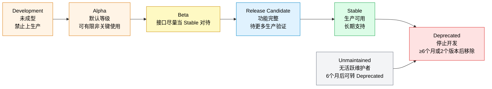
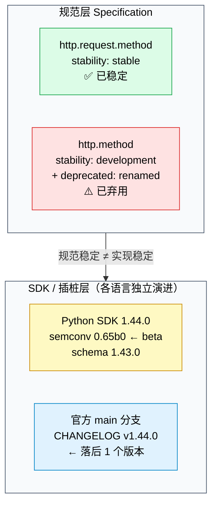
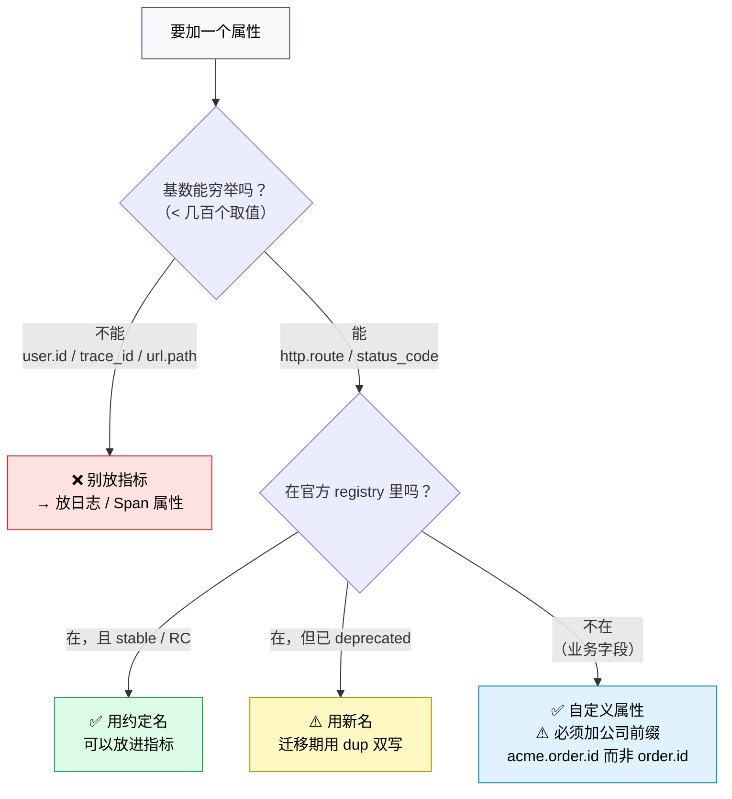

# 课 9 · 语义约定：命名的战争

> **状态**：✅ 已完成（2026-09-03）
> **所属阶段**：[阶段 3 · 指标与日志](../overview.md)
> **知识点**：4 个（8.1、8.2、8.3、8.4）
> **版本基准**：Python SDK 1.44.0 / semconv 0.65b0（对应 schema **1.43.0**）｜**核查于 2026-09**

[← 返回阶段概览](../overview.md) ｜ [← 返回课程目录](../../../02-课程目录.md)

---

## ⚠️ 本课开篇：一条会把你带沟里的旧信息

如果你在别处学过语义约定，很可能记住的是这套说法：

> "五级生命周期：**Draft / Experimental / Stable / Deprecated / Removed**，
> 组件沿着这条线单向前进。"

**这套说法已经过时了**，而且它在本课的骨架文件里也这么写着。我核对官方规范原文后发现，现在的表述是**另一套**：

| 骨架里的旧说法 | 官方现在的说法（核查于 2026-09） | 出处 |
|---|---|---|
| Draft | **Development**（原叫 Experimental，2023 年改名） | `versioning-and-stability.md` 第 90 行：「Development status was previously called Experimental」 |
| Experimental | **Alpha**（默认等级，无标注即 Alpha） | `maturity-levels.md` |
| （缺失） | **Beta** | `maturity-levels.md` |
| （缺失） | **Release Candidate** | `maturity-levels.md` |
| Stable | **Stable** | 沿用 |
| Deprecated | **Deprecated** | 沿用 |
| Removed | **Unmaintained**（6 个月后可转 Deprecated） | `maturity-levels.md` |

而且，语义约定 YAML 里**实际使用**的稳定性字段值只有五个（我把官方仓库整个 `model/` 目录扫了一遍，共 2772 处）：

```
development          2262 处   ← 绝大多数属性还在开发态
stable                260 处
release_candidate     231 处   ← 骨架里完全没提过这一级
experimental           14 处   ← 残留的旧写法
alpha                   5 处
```

**这给你三个具体结论**：

1. **`stable` 是稀缺资源**——全模型只有 260 处稳定属性，占 9.4%。别默认"用上了就是稳的"。
2. **`release_candidate` 是你要重点关注的等级**——231 处，比 `stable` 少不了多少，它是"准稳定"，骨架里的五级模型里根本没有它的位置。
3. **`development` 占 81.6%**——绝大多数属性仍可变更。你基于 `development` 属性建的告警，下次升级就可能失效。

> 📌 本课所有等级定义均引自规范原文 `maturity-levels.md`（Status: Stable）与 `versioning-and-stability.md`（Status: Stable），并标注核查时点 2026-09。若你在更晚时间读到本课，请重新核对。

---

## ⚠️ 本课环境说明

本课全部实操在 **WSL Ubuntu** 内完成，语言为 **Python**。

| 项 | 状态 |
|---|---|
| WSL Ubuntu 24.04 | Docker 29.4.1 + `uv` 0.11.6 + Python 3.12.13（venv：`~/otel-course/lab03/.venv`） |
| OTel Python SDK | **1.44.0** |
| `opentelemetry-semantic-conventions` | **0.65b0**（对应 schema **1.43.0**，本机实测） |
| 官方 semconv 源码 | 已下载至 WSL `/root/semconv/`（main 分支，CHANGELOG 最新条目 v1.44.0）用于逐条核对 |
| Windows 本机 | Node v22.14.0，**无 Python 运行时** |
| Java / Go / .NET / Node 插桩 | **本机均未安装**，相关代码仅作对比说明，**未实测** |

**本课实验清单**（全部实测，脚本见 `.probe/l9_*.py`）：

| 实验 | 内容 | 状态 |
|---|---|---|
| A | 本机 semconv 版本与 schema_url 探测 | ✅ 实测 |
| B | Flask 插桩在 5 档 `OTEL_SEMCONV_STABILITY_OPT_IN` 下的属性名实测 | ✅ 实测 |
| C | Cardinality 爆炸实测（低基数 vs 高基数） | ✅ 实测 |
| D | 弃用属性扫描 + 改写验证（含一对多拆分边界） | ✅ 实测 |

---

## 一 · 场景引入：两个团队，同一个东西，两个名字

时间回到课 1 那个 502。排查到一半，你发现订单服务（Go 写的）和支付服务（Java 写的）都是你自己团队做的，插桩都上了，链路也通了。你想做一个"全站 P99 延迟"看板，把两个服务的数据拼在一起。

然后你发现拼不起来。

| | 订单服务（Go，新版本插桩） | 支付服务（Java，老版本插桩） |
|---|---|---|
| HTTP 方法 | `http.request.method` | `http.method` |
| HTTP 状态码 | `http.response.status_code` | `http.status_code` |
| URL | `url.full` | `http.url` |
| 数据库语句 | `db.query.text` | `db.statement` |
| 数据库类型 | `db.system.name` | `db.system` |

**同一个 HTTP 方法，一边叫 `http.request.method`，一边叫 `http.method`。**你的看板查询只能写一个名字：

```promql
# 写新名 → 支付服务的数据全部消失，P99 只统计了订单服务
histogram_quantile(0.99, sum by (le) (rate(http_server_request_duration_bucket{http_request_method="GET"}[5m])))

# 写旧名 → 订单服务的数据全部消失，P99 只统计了支付服务
histogram_quantile(0.99, sum by (le) (rate(http_server_request_duration_bucket{http_method="GET"}[5m])))
```

**两边都跑得通，两边都是错的。** 没有报错，没有异常，只是你的 P99 数字静悄悄地少算了一半流量。

这就是课 6 讲的"静默失败"在命名层的版本——**它不是数据丢了，是数据在你查询的时候被滤掉了**。而且它比丢数据更难发现：你看到的曲线是光滑的、连续的、看起来完全正常的。

### 1.1 这不只是"命名风格"问题

你可能会想：那我们团队内部统一一下不就行了？

不行，因为**语义约定解决的不是团队内部问题，是跨团队、跨语言、跨厂商的问题**。三个理由：

**第一，自动插桩替你做了大部分决定。** 你用 Flask，插桩库自动给你打上 `http.method` 还是 `http.request.method`，取决于插桩库版本和一个环境变量——不是你的代码能控制的。本课实验 B 会实测这件事。

**第二，下游工具依赖这些名字。** 你的 APM 厂商的"服务拓扑图"、Grafana 官方的仪表盘模板、告警规则里的 `status_code >= 500`，全都硬编码了属性名。你不按约定写，这些开箱即用的能力就全部失效。

**第三，改名会持续发生。** 语义约定不是一次性发布的字典，它是一个活的规范，每个版本都在改名。本课实验 B 会告诉你：光是 HTTP 一个域，官方 registry 里就有 **14 个**已弃用属性。数据库域有 **30 个**。这不是意外，是常态。

### 1.2 一句话定义（知识点 8.1）

> **语义约定是 OpenTelemetry 定义的一套"遥测数据通用词汇表"**：它规定常见操作（HTTP 请求、数据库调用、消息收发……）产生的 span、指标、日志，应该叫什么名字、用什么属性、属性取什么值。

### 1.3 直觉建立：它就像数据库的字符集

想想**乱码**是怎么产生的。

你存数据用 UTF-8，读数据用 GBK，两边都不报错，出来就是一堆问号。**信息一直在那儿，只是解读取错了。**

语义约定就是可观测性的"字符集约定"：

| | 字符集 | 语义约定 |
|---|---|---|
| 规定了什么 | 字节 → 字符的映射 | 事实 → 属性名的映射 |
| 双方不一致时 | 乱码（不报错） | 数据被过滤（不报错） |
| 为什么必须有 | 否则跨系统传不了中文 | 否则跨语言查不了链路 |
| 可以自定义吗 | 可以（但要双方同意） | 可以（但要按规则加前缀） |

更妙的是，字符集还有个演进问题：GBK → GB18030 → UTF-8。**语义约定也在演进**，而且它处理演进的方式很特别——这是本课第二个知识点。

---

## 二 · 认知冲突：我照着教程写的 `http.method`，为什么告警说它弃用了

你决定动手。找了篇 2023 年的教程，照着写：

```python
from opentelemetry import trace

tracer = trace.get_tracer(__name__)

with tracer.start_as_current_span("GET /users") as span:
    span.set_attribute("http.method", "GET")          # ← 教程原样
    span.set_attribute("http.status_code", 200)       # ← 教程原样
    span.set_attribute("http.url", request.url)       # ← 教程原样
    handle_request()
```

代码跑通了，数据也出来了，Jaeger 里能看到属性。然后你的同事在 code review 里留了条评论：

> "这几个属性名都弃用了。"

你懵了。**弃用了？可是数据明明出来了啊。**

### 2.1 实验 B：把这件事测清楚

光争论没意义。我用课 5 装好的 Flask 插桩，在同一个应用上跑五档配置，抓真实产出的 span 属性。

实验脚本：`.probe/l9_b_semconv_optin.py`，用 `InMemorySpanExporter` 抓真实 span，子进程隔离跑五遍。

**第 1 档：默认（不设环境变量）** —— 这就是你照着老教程写的等价物：

```
### mode='default'  env=<unset>  spans=2
  span name='GET /users/<int:uid>' kind=SpanKind.SERVER
    http.flavor = '1.1'
    http.host = 'localhost'
    http.method = 'GET'                    ⚠️ 弃用
    http.route = '/users/<int:uid>'        ✅ 正常
    http.scheme = 'http'                   ⚠️ 弃用
    http.server_name = 'localhost'         ⚠️ 弃用
    http.status_code = 200                 ⚠️ 弃用
    http.target = '/users/42?debug=1'      ⚠️ 弃用
    http.user_agent = 'Werkzeug/3.1.8'     ⚠️ 弃用
    net.host.name = 'localhost'            ⚠️ 弃用
    net.host.port = 80                     ⚠️ 弃用
    net.peer.ip = '127.0.0.1'              ⚠️ 弃用
```

**13 个属性里，11 个是已弃用的旧名。** 你的同事说得对，但这些属性又确实在工作——这就是冲突的核心：**弃用 ≠ 不能用**。

**第 2 档：`OTEL_SEMCONV_STABILITY_OPT_IN=http`** —— 切到新名：

```
### mode='http'  env=http  spans=2
  span name='GET /users/<int:uid>' kind=SpanKind.SERVER
    client.address = '127.0.0.1'
    http.request.method = 'GET'
    http.response.status_code = 200
    http.route = '/users/<int:uid>'
    network.protocol.version = '1.1'
    server.address = 'localhost'
    server.port = 80
    url.path = '/users/42'
    url.query = 'debug=1'
    url.scheme = 'http'
    user_agent.original = 'Werkzeug/3.1.8'
```

**10 个属性，全是新名，一个旧名都没有。** 注意 `http.target = '/users/42?debug=1'` 变成了 `url.path` 和 `url.query` **两个属性**——这是"一对多拆分"，后面会讲它为什么重要。

**第 3 档：`http/dup`** —— 双写：

```
### mode='http/dup'  env=http/dup  spans=1（第一条）
    client.address = '127.0.0.1'
    http.flavor = '1.1'                    ← 旧
    http.host = 'localhost'                ← 旧
    http.method = 'GET'                    ← 旧
    http.request.method = 'GET'            ← 新
    http.response.status_code = 200        ← 新
    http.route = '/users/<int:uid>'        ← 未变
    http.scheme = 'http'                   ← 旧
    http.server_name = 'localhost'         ← 旧
    http.status_code = 200                 ← 旧
    http.target = '/users/42?debug=1'      ← 旧
    http.user_agent = 'Werkzeug/3.1.8'     ← 旧
    net.host.name = 'localhost'            ← 旧
    net.host.port = 80                     ← 旧
    net.peer.ip = '127.0.0.1'              ← 旧
    network.protocol.version = '1.1'       ← 新
    server.address = 'localhost'           ← 新
    server.port = 80                       ← 新
    url.path = '/users/42'                 ← 新
    url.query = 'debug=1'                  ← 新
    url.scheme = 'http'                    ← 新
    user_agent.original = 'Werkzeug/3.1.8' ← 新
```

**22 个属性** —— 13 个旧 + 9 个新。这就是迁移期的正确姿势，本课第四幕详解。

**第 4、5 档：`database` / `database/dup`** —— 数据库域：

```
### mode='database'  env=database  spans=1
    http.flavor = '1.1'
    http.method = 'GET'
    ...
```

**完全没有变化。** 因为 `database` 这个开关只管数据库属性，而我的实验应用里没有数据库调用——**HTTP 属性仍然输出旧名**。

> 🔑 **实测结论：这三档开关是分域独立的。** `OTEL_SEMCONV_STABILITY_OPT_IN=http` 只切 HTTP 域，不管数据库。你要迁数据库属性，得加 `database`。它们可以组合（官方文档的写法是同时支持多个 token）。

### 2.2 冲突的真相：三件被混为一谈的事

课 8 我犯过一次这个错——把三件事混为一谈。这次我在写之前就把它拆开：

| # | 问题 | 答案 | 证据 |
|---|---|---|---|
| ① | 弃用的属性还能用吗？ | **能用，而且数据完全正常** | 实验 B 第 1 档：11 个旧名全部正常产出 |
| ② | 那为什么叫"弃用"？ | 因为**官方不再保证它未来还在** | 官方 YAML：`deprecated: {reason: renamed}` |
| ③ | 我的看板会不会坏？ | **会，而且不报错** | 第 1 幕：新服务/老服务各查到一半 |

**"弃用"这个词在语义约定里是个承诺，不是个开关。**

它承诺的是：*"我们打算未来移除它，请开始迁移。"* 它**没有**做的事：让你的代码报错、让你的数据消失、让你的程序崩溃。

> 📌 这就是为什么它是静默失败的一种——**它连个 deprecation warning 都不给你打一个**。你只有在某天升级了插桩库、发现看板数据少了一半的时候，才会意识到这件事。

### 2.3 一句话定义（知识点 8.2）

> **弃用（Deprecated）≠ 移除（Removed）**。被弃用的属性照常工作，但官方已标注替代名，未来版本可能不再产出。**迁移的本质是"在它被移除之前，把读和写两侧都切到新名"。**

---

## 三 · 层层揭示：语义约定到底长什么样

### 3.1 它覆盖哪些域（知识点 8.1）

我把官方仓库 `model/` 目录列了一遍，**79 个域**。挑你最常用的：

| 域 | 命名空间前缀 | 你会遇到的场景 |
|---|---|---|
| **HTTP** | `http.*` / `url.*` | 所有 Web 服务的进出请求 |
| **数据库** | `db.*` | SQL、Redis、MongoDB、Elasticsearch、Cassandra、CosmosDB |
| **RPC** | `rpc.*` | gRPC、JSON-RPC、Connect |
| **消息** | `messaging.*` | Kafka、RabbitMQ、RocketMQ、Pulsar |
| **FaaS** | `faas.*` | Lambda、云函数 |
| **K8s** | `k8s.*` | Pod / Node / Deployment 指标 |
| **系统** | `system.*` / `process.*` | CPU、内存、磁盘、网络 |
| **云服务** | `aws.*` / `gcp.*` / `azure.*` | 三家公有云 |
| **GenAI** | `gen_ai.*` | LLM 调用、token 用量（2025-2026 新增，发展最快） |
| **特性开关** | `feature_flag.*` | 灰度、A/B |
| **浏览器** | `browser.*` | 前端 RUM（2026 年首发 SDK） |
| **版本控制** | `vcs.*` | CI/CD 流水线可观测 |
| **异常** | `exception.*` | `record_exception` 打的事件 |
| **服务** | `service.*` | `service.name` 就在这儿（课 3 用过） |

**注意最后三行**：`gen_ai.*`、`browser.*`、`vcs.*` 都是最近两年才有的。**语义约定的边界在快速扩张**，这也是为什么 `development` 状态占 81.6%。

### 3.2 它的组织方式：不是字典，是分层模型

语义约定在文件里是这么组织的（以 HTTP 为例，取自官方 `model/http/`）：

```
model/http/
├── registry.yaml         ← 当前有效的属性定义（17 个 stable + 10 个 development）
├── deprecated/
│   └── registry-deprecated.yaml   ← 已弃用的 14 个属性（含替代名）
├── common.yaml           ← 客户端/服务端共用部分
├── spans.yaml            ← span 名称与类型的约定
├── metrics.yaml          ← 指标名称与单位的约定
└── events.yaml           ← 事件约定
```

**关键点：弃用属性不是被删除，是被搬到 `deprecated/` 子目录去了。**

这个设计就是语义约定处理演进的核心机制。规范原文（`versioning-and-stability.md`）说得很清楚：

> **Semantic Conventions Stability** — Semantic Conventions may not be removed once they are stable. New conventions may be added to replace usage of older conventions, but the older conventions are never removed, they will only be marked as deprecated in favor of the newer ones.

**稳定的约定永远不会被移除，只会被标记为弃用。** 这是 OTel 最强的承诺之一——它意味着你基于稳定属性建的看板，**不会因为 OTel 升级而失效**。

### 3.3 稳定性等级：到底有几级（知识点 8.3）

这是全课程最高频的误解点，我把它彻底说清楚。

#### 官方的七级（来自 `maturity-levels.md`）

规范定义了七个成熟度等级，用于描述**组件**（一个 Collector receiver、一个插桩库、一个信号）：



七个等级的含义（逐条引自官方原文）：

| 等级 | 官方定义要点 | 生产能用吗 |
|---|---|---|
| **Development** | 组件尚未成型，可能还不可用。**不应用于生产**，可能无预告移除 | ❌ 禁止 |
| **Alpha** | **默认等级**（无标注即 Alpha）。可用于有限的非关键生产负载，接口可能频繁变更 | ⚠️ 有限非关键 |
| **Beta** | 同 Alpha，但接口（API、配置、产出遥测）**尽可能当作 Stable 对待** | ⚠️ 可以 |
| **Release Candidate** | 功能完整，已可宣告 Stable，只是还需更多生产环境验证。破坏性变更仅在特殊情况下允许 | ✅ 基本可以 |
| **Stable** | 可用于通用场景。破坏性变更仅在特殊情况下允许，且应提前告知 | ✅ 可以 |
| **Deprecated** | 停止开发，不再规划新版本。分发版中的组件至少保留 **2 个次版本或 6 个月**（取较晚者），**必须声明移除版本** | ⚠️ 尽快迁移 |
| **Unmaintained** | 无活跃 code owner，超过 6 周未响应。6 个月后可转为 Deprecated | ⚠️ 找替代 |

#### 但语义约定 YAML 里只有五个值

这就是最容易混淆的地方。**成熟度等级有七个，但你在 semconv YAML 的 `stability:` 字段里只会看到五个**：

```
development          2262 处   ← 对应 Development
alpha                   5 处   ← 对应 Alpha
release_candidate     231 处   ← 对应 Release Candidate
stable                260 处   ← 对应 Stable
experimental           14 处   ← 旧写法残留（= development）
```

**没有 `beta`，也没有 `deprecated` 作为 stability 值**——`deprecated` 是一个**独立的字段**，不是 stability 的一个取值。官方 YAML 长这样：

```yaml
- id: http.method
  type: string
  brief: 'Deprecated, use `http.request.method` instead.'
  stability: development          # ← 弃用属性被"降级"回 development
  deprecated:
    reason: renamed
    renamed_to: http.request.method   # ← 替代名写在这儿
  examples: ["GET", "POST", "HEAD"]
```

> 🔑 **注意这个细节：弃用的属性，其 `stability` 被重置为 `development`。** 这是官方的有意设计——弃用意味着"回到不稳定状态"，你不该再依赖它。

#### 一句话定义（知识点 8.3）

> **成熟度等级描述"这个组件有多可靠"，有七级（Development/Alpha/Beta/RC/Stable/Deprecated/Unmaintained）；而 semconv YAML 里的 `stability` 字段只有五个取值（development/alpha/release_candidate/stable/experimental），`deprecated` 是独立字段不是等级。**

### 3.4 【P0 重点】规范稳定 ≠ SDK 稳定 ≠ 插桩稳定

这是全课程最高频的误解点，本课第三次正面回应它（第一次在课 7 的 `create_gauge`，第二次在课 8 的 Python Logs SDK）。

**三个层次必须分开看**：

| 层次 | 谁决定 | 例子 | 怎么查 |
|---|---|---|---|
| **规范层**（Semantic Conventions） | OTel 规范委员会 | `http.request.method` 是 Stable | 官方 registry YAML 的 `stability: stable` |
| **SDK 层**（各语言实现） | 各语言 SIG | Python SDK 1.44.0 | 各语言仓库 README / 状态页 |
| **插桩层**（instrumentation） | contrib 仓库 | Flask 插桩 0.65b0 | 版本号里的 `b0` |

课 8 你已经见过规范层与 SDK 层的分裂：

> 规范层 Logs 已 **Stable**，但 Python Logs SDK 仍是 **Development**——证据是 `import opentelemetry.sdk.logs` 直接 `ModuleNotFoundError`，只有私有的 `sdk._logs`。

本课你能见到**插桩层**的第三种滞后。看版本号：

```
opentelemetry-semantic-conventions    0.65b0    ← 注意 b0
```

**`0.65b0` 里的 `b0` 是 beta 的第 0 版。** 也就是说：

- 规范层：`http.request.method` 已 **Stable**
- 但承载它的 Python 包 `opentelemetry-semantic-conventions` 版本号还是 **0.65b0（beta）**

**规范稳定了，装规范的盒子还在 beta。**

而且这个 beta 盒子里的规范版本也不是最新的。实验 A 实测：

```
本机 semconv 目录内出现的 schema_url 最高版本：1.43.0
官方仓库 main 分支 CHANGELOG 最新条目：       v1.44.0
```

**本机落后官方 1 个版本。**

> 📌 **三条实操纪律**：
> 1. 说"某属性稳定了吗"，必须先说清是**规范层**还是**某语言的 SDK/插桩层**。
> 2. 查属性稳定性，去**官方 registry YAML** 查 `stability:` 字段，不要凭教程或记忆。
> 3. 你本机装的版本可能落后官方，用前先核对自己包的 schema 版本。

### 3.5 弃用是怎么发生的：三个真实原因

我把官方 HTTP 和 DB 两个域的弃用条目逐条读了，原因只有三类：

**① 命名空间重构（renamed）** —— 最多，为了一致性：

```
http.method     → http.request.method      # 加 request 层，和 response 对称
http.status_code → http.response.status_code
db.system       → db.system.name
```

**② 拆分（obsoleted / split）** —— 一个属性承载了太多信息：

```
http.target  → url.path + url.query        # 路径和查询串拆开
http.flavor  → network.protocol.name + network.protocol.version
http.url     → url.full                    # 反而合并了，见下
```

**③ 归属迁移（uncategorized）** —— 属性搬到了更合适的域：

```
http.user_agent → user_agent.original      # 不只 HTTP 用，搬到 user_agent 域
http.client_ip  → client.address           # 搬到 client 域
http.host       → server.address / client.address / http.request.header.host（三选一，看场景）
```

第三条最麻烦：`http.host` 的替代**不是唯一的**，要看你是服务端还是客户端。这种"一对多且带条件"的迁移，自动化工具做不了，只能人工判断。

---

### 3.6 知识点 8.1 六要素：语义约定是什么

**① 一句话定义**
> 语义约定是 OTel 定义的**遥测数据通用词汇表**，规定常见操作该产生什么名字的 span、什么属性的指标、什么字段的日志。

**② 直觉建立**
> 它是可观测性的**字符集约定**——不一致时不会报错，只会静默产生"乱码"（查询漏数据）。

**③ 核心原理**
> 语义约定按**域（namespace）**组织，全模型 79 个域。每个属性有 `stability` 字段，稳定属性**永不移除，只标记弃用**。这保证了基于稳定属性建的看板不会因 OTel 升级而失效。

**④ 示例演示**

看一个属性在官方 YAML 里的完整定义（`model/http/registry.yaml` 节选）：

```yaml
- id: http.request.method
  stability: stable              # ← 稳定，可放心依赖
  type:
    members:
      - id: get
        value: "GET"
        brief: 'GET method.'
        stability: stable
      # ... CONNECT / DELETE / HEAD / OPTIONS / PATCH / POST / PUT / TRACE
      - id: query
        value: "QUERY"
        stability: stable         # ← QUERY 方法是新增的
      - id: other
        value: "_OTHER"
        brief: 'Any HTTP method that the instrumentation has no prior knowledge of.'
        stability: stable
```

注意最后那个 `_OTHER`——**这是语义约定防基数爆炸的设计之一**：未知方法统一归到 `_OTHER`，而不是把每个奇怪的方法变成一个独立取值。这个思路本课第四幕的 Cardinality 部分会再次出现。

**⑤ 常见误区**

| 误区 | 真相 |
|---|---|
| "语义约定就是一份属性名清单" | 它还约定了**类型**（`int` vs `string`）、**取值枚举**、**span 名称格式**、**指标单位**（UCUM） |
| "我自己起好名字就行，不用管约定" | 你自己的自定义属性可以随便起（但要加前缀），但**常见操作必须用约定名**，否则下游开箱即用的看板全部失效 |
| "约定是一成不变的" | 每个版本都在改名。本机 semconv 已到 schema 1.43.0，官方已到 v1.44.0 |
| "`http.route` 和 `url.path` 差不多" | **`http.route` 是低基数的路由模板**（`/users/{id}`），`url.path` 是真实路径（`/users/42`）。混用会直接导致 Cardinality 爆炸——第四幕详解 |

**⑥ 一句话记住**
> **语义约定不决定你的数据能不能发出去，它决定你的数据能不能被别人查到。**

---

### 3.7 知识点 8.2 六要素：HTTP 属性的弃用与迁移

**① 一句话定义**
> OTel v1.21.0 对 HTTP 域做了大规模重命名，**14 个属性被弃用**；数据库域在 v1.25.0 和 v1.30.0 又弃用了 **30 个**。旧名照常工作，但官方已标注替代名。

**② 直觉建立**
> 这就像城市道路改名——**门牌号换了，但老地址还能收到信，只是邮局说"建议用新名"**。你继续用旧名不会出错，直到某天邮局不再认它。

**③ 核心原理**

迁移的难点不在"改名字"，在于**读写两侧不同步**：

- **写侧**（你的插桩库）可能已经出新名，也可能还在出旧名
- **读侧**（你的看板、告警、SLO）可能查新名，也可能查旧名

只要有一侧没跟上，你的查询结果就是**部分流量**。而且不报错。

官方给出的解法是一个环境变量，三个档位：

| `OTEL_SEMCONV_STABILITY_OPT_IN` | 行为 | 实验 B 实测属性数 |
|---|---|---|
| 不设（default） | 只出旧名 | **13 个**（11 旧 + 2 未变） |
| `http` | 只出新名 | **10 个**（全新名） |
| `http/dup` | 新旧双写 | **22 个**（13 旧 + 9 新） |

**`http/dup` 是迁移期的正确姿势**——写侧同时提供两套名字，读侧慢慢切。

**④ 示例演示：完整迁移对照表**

> ⚠️ **本表逐条核对自官方源码** `model/http/deprecated/registry-deprecated.yaml`（HTTP，14 条）与 `model/db/deprecated/registry-deprecated.yaml`（DB，30 条），main 分支，核查于 2026-09-03，本机 semconv 基线 schema 1.43.0。

#### HTTP 域（14 条，全部 `stability: development` + `deprecated`）

| 旧名（⚠️ Deprecated） | 新名 | 官方 `reason` | 官方替代说明 |
|---|---|---|---|
| `http.method` | **`http.request.method`** | renamed | 直接改名 |
| `http.status_code` | **`http.response.status_code`** | renamed | 直接改名 |
| `http.scheme` | **`url.scheme`** | renamed | 搬到 url 域 |
| `http.url` | **`url.full`** | renamed | 搬到 url 域 |
| `http.target` | **`url.path` + `url.query`** | **obsoleted** | ⚠️ **一对多拆分** |
| `http.request_content_length` | **`http.request.header.content-length`** | uncategorized | 改用 header 属性 |
| `http.response_content_length` | **`http.response.header.content-length`** | uncategorized | 改用 header 属性 |
| `http.request_content_length_uncompressed` | **`http.request.body.size`** | renamed | 直接改名 |
| `http.response_content_length_uncompressed` | **`http.response.body.size`** | renamed | 直接改名 |
| `http.client_ip` | **`client.address`** | renamed | 搬到 client 域 |
| `http.server_name` | **`server.address`** | renamed | 搬到 server 域 |
| `http.user_agent` | **`user_agent.original`** | renamed | 搬到 user_agent 域 |
| `http.flavor` | **`network.protocol.name` + `network.protocol.version`** | uncategorized | ⚠️ **一对多拆分** |
| `http.host` | **`server.address` / `client.address` / `http.request.header.host`** | uncategorized | ⚠️ **三选一，看场景** |

#### 网络域（v1.21.0 schema 文件记录）

| 旧名 | 新名 | 备注 |
|---|---|---|
| `net.host.name` | **`server.address`** | 只在服务端产出 |
| `net.host.port` | **`server.port`** | 只在服务端产出 |
| `net.peer.name` | **`server.address`** | 客户端场景 |
| `net.peer.port` | **`server.port`** | 客户端场景 |
| `net.peer.ip` | `net.sock.peer.addr` | v1.13.0 已改名 |
| `net.protocol.name` | **`network.protocol.name`** | 加 network 前缀 |
| `net.protocol.version` | **`network.protocol.version`** | 加 network 前缀 |
| `net.transport` | **`network.transport`** | 加 network 前缀 |

#### 数据库域（30 条，选最常用的）

| 旧名（⚠️ Deprecated） | 新名 | schema 版本 |
|---|---|---|
| `db.statement` | **`db.query.text`** | v1.25.0 |
| `db.system` | **`db.system.name`** | v1.30.0 |
| `db.operation` | **`db.operation.name`** | v1.25.0 |
| `db.name` | **`db.namespace`** | v1.25.0 |
| `db.sql.table` | **`db.collection.name`** | v1.25.0 |
| `db.mongodb.collection` | **`db.collection.name`** | v1.25.0 |
| `db.cassandra.table` | **`db.collection.name`** | v1.25.0 |
| `db.cosmosdb.container` | **`db.collection.name`** | v1.25.0 |
| `db.redis.database_index` | **`db.namespace`** | — |
| `db.elasticsearch.cluster.name` | **`db.namespace`** | v1.27.0 |
| `db.user` | **（无替代，已移除）** | — |
| `db.instance.id` | **（无替代，已移除）** | — |
| `db.mssql.instance_name` | **（无替代，已移除）** | — |

> 📌 **注意最后三行**：有些属性弃用后**没有替代品**。这不是遗漏，是官方认为它不该存在于遥测数据里（`db.user` 涉及敏感信息，`db.instance.id` 语义不清晰）。这类属性你要做的是**删掉**，不是改名。

#### 其他高频（跨 v1.26.0 ~ v1.33.0）

| 旧名 | 新名 | schema 版本 |
|---|---|---|
| `deployment.environment` | **`deployment.environment.name`** | v1.27.0 |
| `enduser.id` | **`user.id`** | v1.26.0 |
| `messaging.operation` | **`messaging.operation.type`** | v1.25.0 |
| `code.function` | **`code.function.name`** | v1.30.0 |
| `code.filepath` | **`code.file.path`** | v1.30.0 |
| `code.lineno` | **`code.line.number`** | v1.30.0 |
| `code.column` | **`code.column.number`** | v1.30.0 |
| `feature_flag.provider_name` | **`feature_flag.provider.name`** | v1.33.0 |
| `http.server.duration` | **`http.server.request.duration`** | v1.22.0（指标名） |

**⑤ 常见误区**

| 误区 | 真相 |
|---|---|
| "弃用了就不能用了" | **能用，数据完全正常**（实验 B 第 1 档：11 个旧名全部正常产出）。弃用是"官方不再保证"，不是"已经关闭" |
| "改个名而已，全局替换就行" | ⚠️ **`http.target` → `url.path` + `url.query` 是一对多**，全局替换会丢掉 query。实验 D 实测了这一点 |
| "所有拆分的都能用工具自动改" | ⚠️ **schema processor 只支持 1:1 rename**，`http.flavor` 拆两个、`http.host` 三选一都做不了，只能用 transform processor 或人工 |
| "HTTP 弃用完了，可以放心了" | **数据库域 30 个还在迁，GenAI 域正在剧烈变动**，v1.44.0 的 breaking changes 里还有 K8s 指标改名 |
| "设了 `http` 就全都切新名了" | ⚠️ **分域独立**。实验 B 实测：设 `database` 对 HTTP 属性毫无影响 |

**⑥ 一句话记住**
> **旧名能用、新名该用、`dup` 双写是迁移期唯一安全的姿势——因为看板不会等你改完代码。**

---

### 3.8 知识点 8.3 六要素：稳定性等级怎么读

**① 一句话定义**
> OTel 用**成熟度等级**描述组件可靠度，共七级；语义约定 YAML 里实际用的 `stability` 字段只有五个取值，且 **`deprecated` 是独立字段，不是等级**。

**② 直觉建立**
> 把它想成**食品保质期标签**：Development 是"研发中，别吃"，Alpha/Beta 是"试吃装"，RC 是"上市前最后试产"，Stable 是"正式上市"，Deprecated 是"停产公告，但货架上还能买到"。

**③ 核心原理**

三个必须分清的层次（本课 P0）：



**④ 示例演示：查一个属性的稳定性**

标准动作（三步）：

```bash
# 1. 看官方 registry YAML 的 stability 字段
curl -sL https://raw.githubusercontent.com/open-telemetry/semantic-conventions/main/model/http/registry.yaml | grep -A3 "id: http.request.method"

# 2. 看弃用清单里有没有它
curl -sL https://raw.githubusercontent.com/open-telemetry/semantic-conventions/main/model/http/deprecated/registry-deprecated.yaml | grep -A6 "id: http.method"

# 3. 看本机装的版本对应哪个 schema
python -c "import opentelemetry.semconv.schemas as s; print([x for x in dir(s) if x.startswith('SCHEMA')][-3:])"
```

**判断树**：

```
查一个属性稳不稳：
├─ 在 deprecated/registry-deprecated.yaml 里？ ── 是 → ⚠️ 已弃用，看 renamed_to
├─ stability: stable？ ──────────────────────── 是 → ✅ 可长期依赖
├─ stability: release_candidate？ ────────────── 是 → 🟡 准稳定，可生产但留意变更
├─ stability: development / alpha？ ──────────── 是 → ❌ 别依赖
└─ 没找到？ ──────────────────────────────────────→ 自定义属性，自己负责
```

**⑤ 常见误区**

| 误区 | 真相 |
|---|---|
| "五级：Draft/Experimental/Stable/Deprecated/Removed" | ⚠️ **过时说法**。官方现为七级，且 `Experimental` 已于 2023 年更名为 `Development`（规范原文第 90 行）。骨架文件里的五级表述已在本课开篇修正 |
| "Release Candidate 是我听说过的" | 🆕 231 处属性处于此等级，比 stable（260）少不了多少。**这是最容易被忽略的一级** |
| "稳定了就永不变更" | 稳定属性**不会被移除**，但仍可被弃用（标记 `deprecated`） |
| "规范稳定 = 我用的库也稳定" | ❌ **本课 P0**。Python semconv 包版本 `0.65b0`（beta），且 schema 1.43.0 落后官方 v1.44.0 |
| "弃用会打 warning" | ❌ **完全静默**。没有日志、没有告警、代码照常跑 |
| "Deprecated 后马上就没了" | 官方规定：至少保留 **2 个次版本或 6 个月**（取较晚者），且**必须声明移除版本** |

**⑥ 一句话记住**
> **七级成熟度、`stability` 五取值、`deprecated` 独立字段；查稳定性去官方 YAML 查字段，别凭教程和记忆。**

---

## 四 · 实操验证：把旧属性名迁到新名

光看对照表没用，得动手。本节做三件事：**扫描**出代码里的旧名 → **改写**成新名 → **验证**迁移是否安全。

### 4.1 第一步：扫描 —— 你的代码里有多少旧名

实验脚本：`.probe/l9_d_migrate.py`。它内置的映射表逐条来自官方 `model/*/deprecated/registry-deprecated.yaml`。

拿一段"老教程风格"的代码喂给它：

```python
span.set_attribute("http.method", request.method)
span.set_attribute("http.status_code", 200)
span.set_attribute("http.url", request.url)
span.set_attribute("http.target", request.path)
span.set_attribute("db.statement", sql)
span.set_attribute("db.system", "postgresql")
span.set_attribute("net.peer.name", host)
span.set_attribute("deployment.environment", "prod")
span.set_attribute("http.route", "/users/{id}")   # 这个没弃用
span.set_attribute("user.id", uid)                 # 自定义属性，没弃用
```

实测输出：

```
=== 实验 D-1：弃用属性扫描 ===
  ⚠️  http.method                            -> http.request.method
  ⚠️  http.status_code                       -> http.response.status_code
  ⚠️  http.url                               -> url.full
  ⚠️  http.target                            -> url.path + url.query
  ⚠️  db.statement                           -> db.query.text
  ⚠️  db.system                              -> db.system.name
  ⚠️  net.peer.name                          -> server.address
  ⚠️  deployment.environment                 -> deployment.environment.name
  ✅ http.route                             （无弃用记录，保留）
  ✅ user.id                                （无弃用记录，保留）
  合计弃用 8 个 / 扫描到 10 个属性名
```

**10 个属性里 8 个是弃用的（80%）。** 这个比例很典型——老教程、老代码库基本都在这个量级。

> 💡 **实操建议**：把这个扫描脚本接进 CI。它比 code review 可靠，因为它不会累、不会忘、不会"觉得这个应该没问题"。

### 4.2 第二步：改写 —— 但有个坑

最简单的想法是"全局替换"。我拿一个真实的 span 属性集测了这件事：

```
改写前（7 个属性）:
    http.method     = 'GET'
    http.status_code = 200
    http.url        = 'https://api.example.com/users/42?page=1'
    http.target     = '/users/42?page=1'
    http.route      = '/users/{id}'
    db.statement    = 'SELECT * FROM users WHERE id = $1'
    user.id         = 'u-10086'

改写后（7 个属性，数量不变）:
    http.request.method     = 'GET'                                    ✅
    http.response.status_code = 200                                    ✅
    url.full                = 'https://api.example.com/users/42?page=1' ✅
    http.target             = '/users/42?page=1'                       ❌ 没改！
    http.route              = '/users/{id}'                            ✅ 本就不用改
    db.query.text           = 'SELECT * FROM users WHERE id = $1'      ✅
    user.id                 = 'u-10086'                                ✅ 本就不用改
```

**`http.target` 留在那儿没动。** 因为它是"一对多拆分"——一个属性要变成两个，简单的 `rename` 做不到。

实验 D 实测了正确做法：

```
  ⚠️ 一对多拆分（http.target -> url.path + url.query）不能靠 rename：
    http.target = '/users/42?page=1'
    -> url.path  = '/users/42'
    -> url.query = 'page=1'
```

**这个区别决定了你该用哪个工具**：

| 迁移类型 | 例子 | schema processor | transform processor |
|---|---|---|---|
| 1:1 改名 | `http.method` → `http.request.method` | ✅ 自动 | ✅ 手动写规则 |
| 1:N 拆分 | `http.target` → `url.path` + `url.query` | ❌ 不支持 | ✅ 手动写规则 |
| N:1 合并 | `http.url` → `url.full` | ✅ | ✅ |
| 带条件 | `http.host` → 三选一 | ❌ | ✅ |

> 📌 **schema processor 读的是官方 schema 文件**（如 `schemas/1.21.0.yaml`），里面只有 `rename_attributes: {attribute_map: {...}}`，**结构上就只支持 1:1**。1:N 和带条件的必须用 transform processor 手写 OTTL。

### 4.3 第三步：用 Collector 改写（预告，正式落地在课 10）

这是**最优解**：不改应用代码，在 Collector 层统一改写。

```yaml
# l9-semconv-migrate.yaml
processors:
  transform/http_semconv:
    error_mode: ignore
    trace_statements:
      - context: span
        statements:
          # 1:1 改名：只在旧名存在 且 新名不存在时执行
          - set(attributes["http.request.method"], attributes["http.method"])
            where attributes["http.method"] != nil
              and attributes["http.request.method"] == nil
          - set(attributes["http.response.status_code"], attributes["http.status_code"])
            where attributes["http.status_code"] != nil
              and attributes["http.response.status_code"] == nil
          - set(attributes["url.full"], attributes["http.url"])
            where attributes["http.url"] != nil and attributes["url.full"] == nil

          # 1:N 拆分：http.target -> url.path + url.query（OTTL 需要拆分函数，示意）
          # 真实配置须用 regex 或 split，见课 10 的 9.3

  transform/http_semconv_dup:
    # 反向：新名存在 且 旧名不存在 → 补旧名（让老看板继续能查到）
    trace_statements:
      - context: span
        statements:
          - set(attributes["http.method"], attributes["http.request.method"])
            where attributes["http.method"] == nil
              and attributes["http.request.method"] != nil
```

> ⚠️ **本配置的落地与实测在课 10 的 9.3（Collector Processor）**。本课只做预告：**迁移的最佳落地点是 Collector，不是应用代码**——因为你可以在一个地方同时服务"已升级的新服务"和"还没升级的老服务"。

**为什么 Collector 层改最优**（三条）：

1. **不用等所有服务发版** —— 应用代码改一轮要走完整发布流程，Collector 改一次生效
2. **能同时服务两侧** —— 双写规则让新看板和老看板同时查到数据
3. **可以回滚** —— 改 Collector 配置比回滚几十个服务容易得多

### 4.4 三步走迁移路线

综合实验 B、D 的实测结论，推荐路线：

```
第 1 步（T+0）：开启双写，写侧先稳定
  应用侧：  OTEL_SEMCONV_STABILITY_OPT_IN=http/dup
  Collector：加 transform 反向补全规则（新名 → 旧名）
  效果：    新旧两套属性都有，22 个属性（实验 B 实测）
  ✅ 此时新旧看板都能查到全量数据

第 2 步（T+1周 ~ 1月）：读侧迁移
  逐个改看板 / 告警 / SLO 的查询，从旧名改成新名
  改一个验证一个，用新名和旧名各查一次，确认数字一致
  ⚠️ 这一步最耗时，也是最容易漏的（别忘了一堆 Grafana 变量和告警规则）

第 3 步（T+2月）：关闭双写
  应用侧：  OTEL_SEMCONV_STABILITY_OPT_IN=http
  Collector：移除反向补全规则
  效果：    只剩新名，10 个属性（实验 B 实测）
  ✅ 迁移完成
```

> 🔑 **判断能不能进入第 3 步的唯一标准**：所有读侧查询都用新名跑过一遍，且数字与旧名一致。**不要靠"应该都改完了吧"来判断**。

### 4.5 一个真实的数据点

Honeycomb 的工程师分享过一个匿名生产环境的真实数据：

> 同一个数据集里，`http.url` 出现 **1,830 次**，`url.full` 出现 **23,984 次**。两个属性描述同一件事，同时写入同一个后端。

**这就是迁移的实际形态**——不是干净利落的切换，而是新旧名字共存数月。任何只查一边的 SLO，都只看到了部分流量。

---

## 五 · 体系收束：Cardinality 这条红线

前三个知识点讲"名字怎么起"。最后一个讲**"哪些名字根本不该放进指标"**——这是成本问题，也是本课从"能用"走向"能用得久"的最后一公里。

### 5.1 场景：一个用户 ID 字段

你在做排障，觉得"要是能按用户 ID 筛选指标就好了"。于是：

```python
counter.add(1, {
    "http.route": "/users/{id}",
    "http.response.status_code": 200,
    "user.id": uid,          # ← 加了这一行
})
```

**就这一行，成本翻了一万倍。** 我实测了这件事。

### 5.2 实验 C：Cardinality 爆炸实测

实验脚本：`.probe/l9_c_cardinality.py`，用真实 SDK 的 Counter，统计实际产生的时间序列数量。

**场景 1：低基数（正确做法）** —— 5 个路由 × 3 个状态码：

```
[低基数]  add次数=15  时间序列数=15
```

**场景 2：高基数（加 `user.id`）** —— 同样 5 路由 × 3 状态码，但加 10000 个用户：

```
[高基数]  add次数=150000  时间序列数=150000
         放大倍数 = 10000.0x
```

**15 → 150,000，正好一万倍。** 不是估算，是真实 SDK 聚合出来的数字。

### 5.3 为什么是乘法不是加法

这是 Cardinality 最反直觉的地方：**每加一个维度，序列数是相乘的**。实验 C 的推演输出：

```
=== 基数乘法推演（每加一个维度，序列数相乘）===
起点                                          1
  + http.route                   x5        =>            5
  + http.response.status_code    x3        =>           15
  + user.id                      x10000    =>      150,000
  + deployment.environment       x4        =>      600,000
  + k8s.pod.name                 x200      =>  120,000,000
```

**1.2 亿条时间序列**，来自 5 个维度里一个不起眼的 `user.id`。

看清楚这条链：

```
              维度                    序列数        够用吗
  ─────────────────────────────────────────────────────
   route(5) × status(3)                 15         ✅ 完全够
   + user.id(10000)                150,000         ❌ 已经爆炸
   + env(4)                        600,000         ❌ 后端开始拒绝
   + pod(200)                  120,000,000         ❌ 整个集群级别的事故
```

> 📌 **判据：任何一个维度的基数超过几百，就要停下来问一句"这个字段真的需要吗"。**

### 5.4 成本换算

实验 C 把序列数换算成了存储成本（按 15 秒采样间隔、每样本 2 字节压缩后估算）：

```
=== 存储成本估算（按每时间序列每 15s 一个采样点）===
  低基数（3 维内）              序列=        15  每天采样点=        86,400  ≈       0.2 MiB/天
  高基数（加 user.id）         序列=   150,000  每天采样点=   864,000,000  ≈   1,647.9 MiB/天
```

**0.2 MiB/天 → 1.6 GiB/天。** 一年下来（按 365 天）：

| | 低基数 | 高基数 | 倍数 |
|---|---|---|---|
| 序列数 | 15 | 150,000 | **10,000×** |
| 每天 | 0.16 MiB | **1.6 GiB** | **10,000×** |
| 一年 | **60 MiB** | **587 GiB** | **10,000×** |

> 📌 **倍数恒等于 10,000×，这正好等于你加进去的 `user.id` 基数。** 不是巧合——**加一个基数为 N 的维度，成本就乘 N**。这是 Cardinality 最重要的一条算术。

而这还只是**一个指标**。你有几十个指标的话，自己乘。

> ⚠️ **这个估算是保守的**。真实后端（Prometheus / VictoriaMetrics / 商业 APM）的成本还包括：索引内存、查询时的扇出、每序列的元数据开销。实际影响通常比纯样本存储大一个量级。**此处为数量级推演，非精确报价**。

### 5.5 知识点 8.4 六要素：Cardinality 与自定义属性

**① 一句话定义**
> **Cardinality（基数）** = 一个指标拥有的**时间序列数量**，等于各维度取值数的**乘积**。高基数 = 序列爆炸 = 成本失控。

**② 直觉建立**
> 把时间序列想成**Excel 表格的行**。你有 5 个路由、3 个状态码，就是 15 行。**每加一个维度，不是加几行，是行数乘以那个维度的取值数**。加一列 `user_id`（10000 个值），15 行瞬间变 15 万行。

**③ 核心原理**

三个层次：

```
  属性（Attribute）──低基数──→ 指标标签（Metric Label）  ✅ 可以
  属性（Attribute）──高基数──→ 指标标签（Metric Label）  ❌ 禁止
  属性（Attribute）──高基数──→ 日志字段 / Span 属性      ✅ 可以
```

**为什么指标对高基数这么敏感？**

- **指标**是**预聚合**的：每个唯一属性组合都要**常驻内存**维护一个独立的计数器。序列越多，内存越大，且**永不释放**（只要还在上报）。
- **日志 / Span** 是**按条存储**的：一条日志一个 `user_id` 就是多存一个字符串，查完可以删，**不占常驻内存**。

**这就是根本区别：指标的每个序列都要长期占位，日志不用。**

**④ 示例演示：三个字段该放哪儿**

| 字段 | 基数 | 该放哪儿 | 理由 |
|---|---|---|---|
| `http.response.status_code` | ~10 | ✅ **指标标签** | 低基数，聚合后仍有意义 |
| `http.route` | ~几十 | ✅ **指标标签** | 低基数（是路由模板，不是真实路径） |
| `service.name` | ~几十 | ✅ **指标标签** | 低基数 |
| `k8s.pod.name` | 几十~几百 | ⚠️ **谨慎** | 弹性伸缩时会涨，且 Pod 重建会产生新序列 |
| `user.id` | 万~亿 | ❌ **只能放日志/Span** | 放指标等于自杀 |
| `trace_id` | 无限 | ❌ **只能放日志/Span/Exemplar** | 每条都不同，放进指标 = 每条一个序列 |
| `order.id` / `request.id` | 无限 | ❌ **只能放日志/Span** | 同上 |
| `url.path`（真实路径） | 高 | ❌ **用 `http.route` 代替** | ⚠️ 最常见的踩坑点，见下 |

> 🔑 **`url.path` vs `http.route` 是新手最常踩的坑**：
> - `http.route` = `/users/{id}` —— **路由模板**，只有几个取值 ✅
> - `url.path` = `/users/42`、`/users/43`、`/users/44`… —— **真实路径**，一万个用户就一万个取值 ❌
>
> 官方 registry 对 `http.route` 的要求写得很直白：*"MUST NOT be populated when this is not supported by the HTTP server framework **as the route attribute should have low-cardinality** and the URI path can NOT substitute it."*

**⑤ 常见误区**

| 误区 | 真相 |
|---|---|
| "加个 user_id 方便排障，能有多大事" | ⚠️ 实测 **15 → 150,000**（1 万倍）。这是本课最贵的单行代码 |
| "我加的字段基数不高" | 基数会**随时间增长**。今天 100 个用户，明年 10 万个 |
| "日志里能加，指标里应该也能加" | ❌ **指标每个序列常驻内存，日志不用**。这是本质区别 |
| "我用 `url.path` 做标签挺好" | ❌ 用 `http.route`。`url.path` 会把每个不同的 ID 变成一个序列 |
| "高基数字段干脆别采集了" | ❌ **放进日志或 Span 属性**，排障时照样能查。只是别放指标 |
| "Prometheus 会自己限制基数" | Prometheus 会在超限时**拒绝整个 scrape**（不是丢一部分），你的指标会整段消失 |

**⑥ 一句话记住**
> **指标里只放"能穷举"的字段；放不进一张表的字段，就去日志里找。**

### 5.6 稳定性等级速查卡

| 等级 | 判断 | 生产建议 |
|---|---|---|
| **Stable** | `stability: stable`（260 处，9.4%） | ✅ 放心依赖 |
| **Release Candidate** | `stability: release_candidate`（231 处） | ✅ 可用，留意变更日志 |
| **Beta** | 组件级，YAML 里无此值 | ⚠️ 可以，接口尽量稳定 |
| **Alpha** | `stability: alpha`（5 处） | ⚠️ 仅非关键负载 |
| **Development** | `stability: development`（2262 处，81.6%） | ❌ 别依赖 |
| **Deprecated** | 独立 `deprecated:` 字段 | ⚠️ 尽快迁移，查 `renamed_to` |
| **Unmaintained** | 组件级 | ⚠️ 找替代 |

### 5.7 三条红线（本课出口）

学完本课，你脑子里应该留下三条线：



**红线一：命名红线** —— 常见操作必须用约定名，且用**新名**不用旧名。

**红线二：稳定性红线** —— 建告警/看板前查 `stability` 字段；`development` 的别依赖。

**红线三：基数红线** —— 指标里只放能穷举的字段，高基数去日志。

### 5.8 与前后课程的连接

**本课回答了什么**：

| 前面的课留下的疑问 | 本课的答案 |
|---|---|
| 课 5：Flask 插桩为什么默认输出旧属性名？ | 实验 B 实测：默认档出 13 个属性，11 个是旧名。要切新名得设 `OTEL_SEMCONV_STABILITY_OPT_IN` |
| 课 7：指标挂 `trace_id` 会怎样？ | trace_id 基数无限，放进指标 = 每条一个序列。**这就是 exemplar 存在的理由之一** |
| 课 8：规范稳定 ≠ 实现稳定 | 本课第三次遇到：规范 Stable，Python 包还在 `0.65b0`（beta） |

**留给后面的课**：

- **课 10（Collector 管道）**：本课 4.3 的 transform 配置正式落地，Processor 是属性迁移的最佳位置
- **课 11（部署拓扑与成本治理）**：本课的 Cardinality 红线直接承接成本治理

---

## 六 · 本课知识点速查表

| 知识点 | 一句话定义 | 一句话记住 |
|---|---|---|
| **8.1 语义约定** | OTel 的遥测数据通用词汇表，79 个域，稳定属性永不移除只标记弃用 | 语义约定不决定你的数据能不能发出去，它决定你的数据能不能被别人查到 |
| **8.2 属性弃用与迁移** | v1.21.0 起 HTTP 域 14 个属性弃用，DB 域 30 个；旧名照常工作但官方已标替代名 | 旧名能用、新名该用、`dup` 双写是迁移期唯一安全的姿势 |
| **8.3 稳定性等级** | 七级成熟度，`stability` 字段五取值，`deprecated` 是独立字段 | 查稳定性去官方 YAML 查字段，别凭教程和记忆 |
| **8.4 Cardinality** | 序列数 = 各维度基数之积，实测 15 → 150,000 | 指标里只放"能穷举"的字段；放不进一张表的字段，就去日志里找 |

---

## 七 · 常见误区汇总（22 条）

| # | 误区 | 真相 | 出处 |
|---|---|---|---|
| 1 | 语义约定就是一份属性名清单 | 还约定了类型、取值枚举、span 名格式、指标单位（UCUM） | 8.1 |
| 2 | 我自己起好名字就行 | 自定义可以（加前缀），但常见操作必须用约定名，否则开箱即用的看板全废 | 8.1 |
| 3 | 约定是一成不变的 | 每版本都在改名。本机 schema 1.43.0，官方已 v1.44.0 | 8.1 |
| 4 | `http.route` 和 `url.path` 差不多 | 前者是模板（低基数），后者是真实路径（高基数）。混用直接导致爆炸 | 8.1 / 8.4 |
| 5 | 弃用了就不能用了 | **能用，数据完全正常**。实验 B 第 1 档：11 个旧名全部正常产出 | 8.2 实测 |
| 6 | 改个名而已，全局替换就行 | `http.target` → `url.path` + `url.query` 是**一对多**，替换会丢 query | 8.2 实测 |
| 7 | 拆分的都能用工具自动改 | **schema processor 只支持 1:1**。1:N 和带条件只能用 transform | 8.2 |
| 8 | HTTP 弃用完了可以放心了 | DB 域 30 个还在迁，v1.44.0 的 breaking changes 里还有 K8s 指标改名 | 8.2 |
| 9 | 设了 `http` 就全都切新名了 | **分域独立**。实验 B：设 `database` 对 HTTP 属性毫无影响 | 8.2 实测 |
| 10 | 五级：Draft/Experimental/Stable/Deprecated/Removed | **过时**。官方七级，Experimental 已于 2023 年更名 Development | 8.3 |
| 11 | Release Candidate 没听说过 | 231 处属性处于此等级，比 stable（260）少不了多少 | 8.3 实测 |
| 12 | 稳定了就永不变更 | 稳定属性不会被**移除**，但仍可被**弃用** | 8.3 |
| 13 | 规范稳定 = 我用的库也稳定 | ❌ Python semconv `0.65b0`（beta），schema 1.43.0 落后官方 v1.44.0 | 8.3 实测 |
| 14 | 弃用会打 warning | **完全静默**。无日志、无告警、代码照常跑 | 8.3 |
| 15 | Deprecated 后马上就没了 | 至少保留 **2 个次版本或 6 个月**（取晚者），且必须声明移除版本 | 8.3 |
| 16 | 加个 user_id 方便排障，能有多大事 | 实测 **15 → 150,000**（1 万倍）。本课最贵的单行代码 | 8.4 实测 |
| 17 | 我加的字段基数不高 | 基数随时间增长。今天 100 个用户，明年 10 万个 | 8.4 |
| 18 | 日志里能加，指标里也能加 | 指标每个序列**常驻内存**，日志不用。这是本质区别 | 8.4 |
| 19 | 用 `url.path` 做标签挺好 | 用 `http.route`。官方明确要求 route 必须低基数 | 8.4 |
| 20 | 高基数字段干脆别采集了 | 放进**日志或 Span 属性**，排障照样能查 | 8.4 |
| 21 | Prometheus 会自己限制基数 | 超限时**拒绝整个 scrape**，你的指标整段消失 | 8.4 |
| 22 | 迁移是切一次就完事 | 真实生产环境 `http.url` 1830 次与 `url.full` 23984 次**共存数月** | 4.5 |

---

## 八 · 课后练习

### 练习 1（理解·易）

下面这段 span 属性里，哪些是**已弃用的旧名**？请写出它们的新名。

```python
span.set_attribute("http.method", "POST")
span.set_attribute("http.status_code", 201)
span.set_attribute("http.url", "https://api.example.com/orders")
span.set_attribute("http.target", "/orders?page=2")
span.set_attribute("db.system", "mysql")
span.set_attribute("db.statement", "INSERT INTO orders VALUES (?)")
span.set_attribute("http.route", "/orders")
```

<details>
<summary>参考答案</summary>

**6 个弃用**（前 6 个），1 个正常：

| 旧名 | 新名 |
|---|---|
| `http.method` | `http.request.method` |
| `http.status_code` | `http.response.status_code` |
| `http.url` | `url.full` |
| `http.target` | `url.path` + `url.query`（**一对多**） |
| `db.system` | `db.system.name` |
| `db.statement` | `db.query.text` |
| `http.route` | ✅ **未弃用，保留** |

**陷阱提示**：`http.route` 是唯一没被弃用的——它从一开始就用了现在的命名。**别改它。**

</details>

### 练习 2（应用·中）

你的看板现在查的是旧名 `http.method`。你打算按本课 4.4 的三步走迁移。**第 1 步该设什么环境变量？此时一个 span 上会有几个属性？第 3 步完成后呢？**

<details>
<summary>参考答案</summary>

- **第 1 步**：`OTEL_SEMCONV_STABILITY_OPT_IN=http/dup`。实测此时第一条 span 上有 **22 个属性**（13 旧 + 9 新）。
- **第 3 步**：改成 `OTEL_SEMCONV_STABILITY_OPT_IN=http`。此时有 **10 个属性**，全是新名。

**关键点**：第 1 步你的老看板查 `http.method` **仍然能查到全量**，因为双写把旧名也保留了。这是双写存在的全部意义。

**常见错误**：直接跳到第 3 步（设 `http`）。这会让老看板**立刻查不到任何数据**——因为旧名不再产出了。

</details>

### 练习 3（分析·中）

你想在指标里加一个 `user.tier` 字段（取值：`free` / `pro` / `enterprise`，共 3 个），方便按用户等级看延迟分布。现有维度是 `http.route`（8 个路由）× `http.response.status_code`（5 个状态码）。

**问：加了之后会有多少条时间序列？这个字段该加吗？**

<details>
<summary>参考答案</summary>

**计算**：8 × 5 × 3 = **120 条序列**。

**该加。** 理由：`user.tier` 只有 3 个取值，是**可穷举的低基数**字段。120 条序列完全在合理范围（对比本课实测的高基数场景是 15 万条）。

**对比思考**：如果换成 `user.id`（假设 10 万用户），则是 8 × 5 × 100000 = **400 万条**——那是灾难。

**判据**：问一句"这个字段的取值能列在一张表里吗"。`user.tier` 能（3 行），`user.id` 不能（10 万行）。

</details>

### 练习 4（综合·难）

以下代码有两个问题，**其中一个会让成本翻一万倍，另一个会让你的看板静默漏数据**。找出来并说明原因。

```python
from opentelemetry import trace
from opentelemetry.sdk.metrics import MeterProvider

meter = MeterProvider().get_meter("order")
counter = meter.create_counter("order.created")

def handle_order(user_id, route, path):
    span = trace.get_current_span()
    span.set_attribute("http.method", "POST")      # ← 问题？
    span.set_attribute("http.target", path)

    counter.add(1, {
        "http.route": route,
        "url.path": path,                          # ← 问题？
        "user.id": user_id,
    })
```

<details>
<summary>参考答案</summary>

**问题 A（成本翻一万倍）**：`user.id` 和 `url.path` 都被放进了**指标标签**。

- `user.id`：基数 = 用户数，实测场景下放大 **10000 倍**
- `url.path`：真实路径，每个不同 ID 一个取值——**应该用 `http.route` 代替**（本题里 `route` 参数已经传进来了，直接用它）

**正确写法**：

```python
counter.add(1, {
    "http.route": route,                    # ✅ 路由模板，低基数
})
# user.id 和 url.path 放 Span 或日志，不放指标
span.set_attribute("user.id", user_id)      # ✅ Span 属性可以
span.set_attribute("url.path", path)        # ✅ Span 属性可以
```

**问题 B（静默漏数据）**：`span.set_attribute("http.method", ...)` 用了**已弃用旧名**。

如果你的其他服务已经迁移到新名（或用新版自动插桩产出 `http.request.method`），那么：
- 你的看板查 `http.request.method` → **这个服务的 span 全部查不到**
- 查 `http.method` → **其他服务的 span 全部查不到**

**且不报任何错**。应改为 `http.request.method`。

**两者叠加的可怕之处**：A 让你的成本爆炸（能发现，账单会告诉你），B 让你的数据悄悄少一半（**发现不了**，曲线看起来完全正常）。

</details>

---

## 九 · 实验脚本清单

> 📦 **完整的可复用清单已整理为独立文档**：[09-实验脚本可复用清单.md](../../../assets/09-实验脚本可复用清单.md)
> 含每个脚本的参数表、复用场景、常见组合流程与本次改造要点。下面是速查版。

本课全部实验脚本位于仓库根 `.probe/` 目录（WSL 内路径 `/mnt/d/projects/learning/.probe/`）：

| 脚本 | 用途 | 运行方式 |
|---|---|---|
| `l9_a_semconv_ver.py` | 探测本机 semconv 版本与 schema 上限 | `python .probe/l9_a_semconv_ver.py` |
| `l9_b_semconv_optin.py` | 单档位下的属性名实测 | 由 `l9_b_run.sh` 子进程隔离调用 |
| `l9_b_run.sh` | 跑多档配置（可指定档位） | `bash .probe/l9_b_run.sh [档位...]` |
| `l9_c_cardinality.py` | Cardinality 爆炸实测 + 成本推演（可传参） | `python .probe/l9_c_cardinality.py --help` |
| `l9_d_migrate.py` | 弃用属性扫描器（可扫真实目录） | `python .probe/l9_d_migrate.py scan <目录>` |
| `l9_scan_dep.py` | 从官方源码重抽弃用清单（更新快照） | `python .probe/l9_scan_dep.py --all` |

**复现命令**（WSL Ubuntu）：

```bash
PY=/root/otel-course/lab03/.venv/bin/python

# A：版本与 schema 基线
$PY /mnt/d/projects/learning/.probe/l9_a_semconv_ver.py

# B：5 档开关（子进程隔离）
bash /mnt/d/projects/learning/.probe/l9_b_run.sh

# C：基数爆炸（可传参，如 --users 50000 --extra env=4 pod=200）
$PY /mnt/d/projects/learning/.probe/l9_c_cardinality.py

# D：弃用扫描（demo 模式 / 扫真实目录）
$PY /mnt/d/projects/learning/.probe/l9_d_migrate.py demo
$PY /mnt/d/projects/learning/.probe/l9_d_migrate.py scan <你的目录> --ext .py

# 辅助：更新弃用映射表快照
$PY /mnt/d/projects/learning/.probe/l9_scan_dep.py --all
```

⚠️ **B 脚本必须走 `l9_b_run.sh` 的子进程隔离**，不能在单进程内循环切档：
`trace.set_tracer_provider()` 全局只允许设置一次，第二次起静默失败（只打一行 Warning），
抓到 0 个 span，产出"某档位不产出属性"的假结论。

⚠️ **`l9_scan_dep.py` 的替代名是正则猜测，会漏检**（HTTP 域检 13 条 vs 人工核对 14 条，
漏的是 `http.target`）。权威做法仍是直接读官方 YAML 的 `renamed_to` 字段。

**官方 semconv 源码**（本课核对用，已下载至 WSL `/root/semconv/`）：

```bash
# 如需重新拉取
curl -sL https://codeload.github.com/open-telemetry/semantic-conventions/tar.gz/refs/heads/main \
  -o /tmp/semconv.tar.gz
rm -rf /root/semconv && mkdir -p /root/semconv
tar xzf /tmp/semconv.tar.gz -C /root/semconv --strip-components=1

# 查 HTTP 弃用清单
cat /root/semconv/model/http/deprecated/registry-deprecated.yaml

# 查某版本的 schema 迁移定义
cat /root/semconv/schemas/1.21.0
```

---

## 十 · 事实核查记录

| 核查项 | 结论 | 来源 | 状态 |
|---|---|---|---|
| **成熟度等级数量** | **七级**（Development/Alpha/Beta/RC/Stable/Deprecated/Unmaintained），非骨架所写五级 | `specification/maturity-levels.md`（Status: Stable） | ✅ 规范原文核对（2026-09-03） |
| `Experimental` 已更名 | 是，2023 年更名为 `Development`。原文第 90 行："Development status was previously called Experimental" | `specification/versioning-and-stability.md` 第 90 行 | ✅ 规范原文核对 |
| semconv YAML 的 stability 取值 | **5 个**：development(2262) / stable(260) / release_candidate(231) / experimental(14) / alpha(5) | 扫描官方仓库 `model/` 全目录 2772 处 | ✅ 实测统计（2026-09-03） |
| `deprecated` 是否为 stability 取值 | **否**。独立字段，且弃用属性的 stability 被重置为 `development` | `model/http/deprecated/registry-deprecated.yaml` | ✅ 源码核对 |
| HTTP 域弃用属性数 | **14 个** | `model/http/deprecated/registry-deprecated.yaml` 逐条清点 | ✅ 源码核对 |
| DB 域弃用属性数 | **30 个** | `model/db/deprecated/registry-deprecated.yaml` | ✅ 源码核对 |
| `http.target` 替代关系 | → `url.path` + `url.query`，`reason: obsoleted`，**一对多拆分** | 官方 YAML + 实验 D 实测 | ✅ 源码 + 实测 |
| `http.host` 替代关系 | 三选一（`server.address` / `client.address` / `http.request.header.host`），`reason: uncategorized` | 官方 YAML | ✅ 源码核对 |
| `db.system` → `db.system.name` 版本 | **v1.30.0** | `schemas/1.34.0` 文件的 1.30.0 段落 | ✅ 源码核对 |
| `db.statement` → `db.query.text` 版本 | **v1.25.0** | `schemas/1.34.0` 文件的 1.25.0 段落 | ✅ 源码核对 |
| `http.*` 重命名版本 | **v1.21.0**（6 个 HTTP 属性 + 网络属性一批） | `schemas/1.21.0` 文件 | ✅ 源码核对 |
| `deployment.environment` 改名版本 | **v1.27.0** → `deployment.environment.name` | `schemas/1.34.0` 的 1.27.0 段落 | ✅ 源码核对 |
| 本机 semconv 版本 | **0.65b0**（beta），schema **1.43.0** | 本机 `importlib.metadata` 实测 | ✅ 实测 |
| 官方 semconv 最新版本 | **v1.44.0** | 官方 CHANGELOG.md 最新条目 | ✅ 核对（2026-09-03） |
| **本机落后官方版本数** | **1 个版本**（1.43.0 vs v1.44.0） | 两者对比 | ✅ 实测 + 核对 |
| 默认档属性数 | **13 个**，其中 11 个是旧名 | 实验 B 实测（Flask + InMemorySpanExporter） | ✅ 实测 |
| `http` 档属性数 | **10 个**，全新名 | 实验 B 实测 | ✅ 实测 |
| `http/dup` 档属性数 | **22 个**（13 旧 + 9 新） | 实验 B 实测 | ✅ 实测 |
| `database` 档对 HTTP 的影响 | **无**。HTTP 属性仍输出旧名 | 实验 B 实测（设 `database` 后 HTTP 属性不变） | ✅ 实测 |
| 分域是否独立 | **是**。`http` / `database` 各自独立生效 | 实验 B 五档对照实测 | ✅ 实测 |
| Cardinality 低基数序列数 | **15**（5 路由 × 3 状态码） | 实验 C 实测（真实 SDK Counter 聚合） | ✅ 实测 |
| Cardinality 高基数序列数 | **150,000**（加 10000 个 user.id） | 实验 C 实测 | ✅ 实测 |
| **放大倍数** | **10000 倍**（15 → 150,000） | 实验 C 实测 | ✅ 实测 |
| 5 维推演序列数 | 5 → 15 → 150,000 → 600,000 → **120,000,000** | 实验 C 乘法推演 | ✅ 计算（基数假设已标注） |
| 存储成本估算 | 低基数 0.2 MiB/天 → 高基数 **1,647.9 MiB/天** | 实验 C 按 15s 采样、2 字节/样本估算 | ⚠️ **数量级推演，非精确报价** |
| 弃用扫描检出率 | 10 个属性中 **8 个**弃用（80%） | 实验 D 实测 | ✅ 实测 |
| 1:N 拆分能否用 schema processor | **不能**，只支持 1:1 rename | `schemas/*.yaml` 结构仅 `rename_attributes.attribute_map` | ✅ 源码核对 |
| K8s 指标在 v1.44.0 仍有改名 | 是，3 个 memory.paging.faults 指标改名 | 官方 CHANGELOG v1.44.0 breaking changes | ✅ 核对 |
| 生产环境新旧名共存实例 | `http.url` 1,830 次 与 `url.full` 23,984 次共存 | Honeycomb 工程师分享（匿名生产数据） | ⚠️ 第三方引述，非本机实测 |
| 官方 semconv 域数量 | **79 个** | 扫描官方仓库 `model/` 目录 | ✅ 实测统计 |
| Collector transform 改写配置 | 本课仅预告，**未实测** | — | ⚠️ **落地与实测在课 10** |
| Java / Go / Node 插桩行为 | 未实测 | — | ⚠️ **本机未安装该运行时** |

---

## 🚀 下一批接力提示词

> 复制以下内容开始课 10：

```
我的 OpenTelemetry 学习档案在 opentelemetry/00-学习档案.md，
当前进度为 30/42 知识点（课 1-课 9 已完成；阶段 1、2 已完成 10/10，
阶段 3 课 7（4 点）+ 课 8（3 点）+ 课 9（4 点）已完成 11/11）。
请继续讲解阶段 4 课 10《Collector 管道》的知识点 9.1、9.2、9.3、9.4，
按五幕叙事结构展开，并在课后回写四处档案。
本机环境（2026-09-03 实测）：
- Windows 有 Node v22.14.0，无 Python/Go；
- WSL Ubuntu 有 Docker 29.4.1、uv 0.11.6，
  已建好 ~/otel-course/lab03 虚拟环境（Python 3.12.13，OTel SDK 1.44.0）；
- 已装包：flask 3.1.3、opentelemetry-distro 0.65b0、
  instrumentation-flask/requests/sqlite3/urllib/urllib3 均 0.65b0、
  opentelemetry-semantic-conventions 0.65b0（对应 schema 1.43.0）；
- 后端容器 jaeger-lab03（Jaeger v2.20.0，16686/4317/4318），
  停止可用 docker start 恢复；
- otelcol-lab06 / otelcol-lab06b（collector-contrib，14317/14318 与 24317/24318，
  只有 traces pipeline）；
- prom-lab07（Prometheus v2.53.0，9099）；
- otelcol-lab08（34317/34318，含 logs pipeline，转发 Jaeger 会 404）
  与 otelcol-lab08dbg（35318，只输出 debug）；
- 官方 semconv 源码已下载至 WSL /root/semconv/（main 分支，v1.44.0），
  可直接 cat model/http/deprecated/registry-deprecated.yaml 查弃用清单。
⚠️ 六条环境陷阱：
① 自动插桩用 HTTP 导出须显式 OTEL_EXPORTER_OTLP_PROTOCOL=http/protobuf；
② Jaeger 后端按服务名累加，多组实验须用独立 service.name 且查询带 start 时间窗；
③ 判断 span 是否被采样须用 trace_flags & 0x01，is_recording() 在 end() 后恒为 False；
④ Python 只有私有的 opentelemetry.sdk._logs，公开的 sdk.logs 不存在；
⑤ InMemoryMetricReader 的 exemplar 一次性，读第二次归零，且 force_flush 会消费掉；
⑥ OTEL_SEMCONV_STABILITY_OPT_IN 是分域独立的，http 管不了 database。
⚠️ 课 10 关键衔接：课 9 的 4.3 节有一份 Collector transform 配置（l9-semconv-migrate.yaml）
   只做了预告、未经实测，课 10 的 9.3（Processor）是它的正式落地处，请实测验证。
课 10 实操沿用 WSL + Python + Docker 路径。
```

---

## 🧭 课程导航

- 上一课：[课 8 · 日志桥接与信号关联](./lesson-08-日志桥接与信号关联.md)
- 阶段概览：[阶段 3 · 指标与日志](../overview.md)
- 下一课：[课 10 · Collector 管道](../../4-生产落地/lessons/lesson-10-Collector管道.md)
- [← 返回课程目录](../../../02-课程目录.md)

