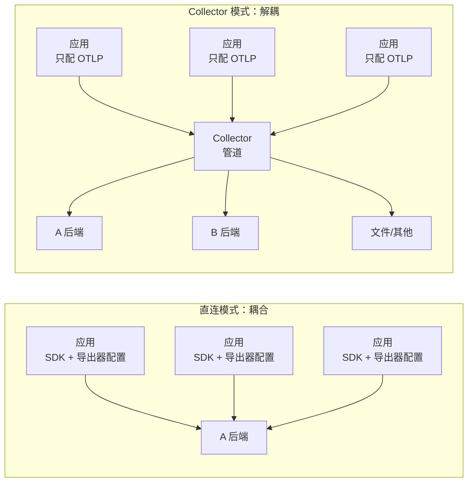
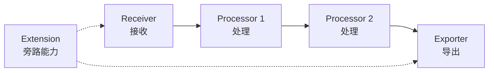

# 课 10 · Collector 管道

> **状态**：✅ 已完成（2026-09-03）
> **所属阶段**：[阶段 4 · 生产落地](../overview.md)
> **知识点**：4 个（9.1、9.2、9.3、9.4）

[← 返回阶段概览](../overview.md) ｜ [← 返回课程目录](../../../02-课程目录.md)

---

## 一 · 场景引入：要换后端了，几百个服务的配置都要改？

你在一家有 200 个微服务的公司做可观测性。三年前选型时，所有服务都直连了 A 厂商的后端——
每个服务的启动参数里都写着 `OTEL_EXPORTER_OTLP_ENDPOINT=https://a-vendor.example.com:4317`。

现在公司要换到 B 厂商。运维同学拉了个会，给出了迁移方案：

> "改一下导出器地址就行，200 个服务，每个提个 PR，一周能搞完。"

你心里一沉。你知道真实情况：

- 这 200 个服务里，有 40 个是没人维护的老服务，**连 CI 都跑不起来了**
- 去年做的一次类似"改一行配置"的迁移，实际花了 **5 周**，因为要排队走发布窗口
- 更要命的是：新后端要求数据里必须带 `deployment.environment` 维度，
  而老服务的 SDK 版本太旧，**根本不支持这个资源属性**

也就是说，这次迁移不是"改个地址"，而是：改地址 + 加维度 + 可能还要升级 SDK。
200 个服务，每个都要走一遍完整的开发、测试、发布流程。

**有没有一种办法，能让这 200 个服务一个字都不改？**

这就是本课要解决的问题。答案是在应用和后端之间插一层——
**OpenTelemetry Collector**。

---

## 二 · 认知冲突：多一层反而更好？

### 2.1 直觉告诉你：中间层是负担

面对上面的困境，最直觉的想法是"优化改配置这件事"——写个脚本批量改、或者用配置中心下发。

"在中间再加一层组件"听起来是**把简单问题变复杂了**：

- 多一个进程要部署、要运维、要监控
- 多一跳网络，延迟增加
- **它自己挂了怎么办？所有遥测数据全丢**
- 这不是把"200 个服务的配置"变成了"200 个服务 + 1 个 Collector 集群的配置"吗？

这个直觉**非常合理**，而且它指向的担忧是真实的——Collector 确实会成为一个需要认真对待的组件。
本课的第五节会正面讨论它带来的新风险。

但先别急着下结论。让我们把问题重新拆开看。

### 2.2 换个角度看：问题的本质是什么

回到那个迁移需求，拆成三件事：

| 要做的事 | 本质 | 是否必须改应用 |
|---|---|---|
| 换后端地址 | 数据往哪儿发 | 否 |
| 加 `deployment.environment` 维度 | 数据内容加工 | 否 |
| 老服务 SDK 太旧 | 数据格式兼容 | 否 |

**三件事全都不需要动应用代码**——因为它们操作的都是"已经产生出来的遥测数据"，
而不是"怎么产生遥测数据"。

插桩（SDK）的职责是**产生数据**；而"发到哪、加工成什么样、要不要丢掉"是**数据管道的职责**。
这两件事被耦合在了同一个 SDK 配置里，才导致改后端要动应用。

Collector 做的事情，就是把这两件事**解耦**：



> **一句话**：应用只管"把数据用 OTLP 发出去"，至于发到哪、怎么加工、丢不丢，
> 全交给中间那一层决定。

### 2.3 一个类比：可观测性的 nginx

如果你熟悉 Web 架构，这个结构你应该见过：

| Web 架构 | 可观测性架构 | 作用 |
|---|---|---|
| 浏览器 | 应用（SDK 插桩） | 产生请求 / 产生遥测 |
| **nginx 反向代理** | **Collector** | **统一入口、路由、加工、过滤** |
| 后端服务集群 | 遥测后端（Jaeger/Prometheus/厂商） | 实际处理 |

nginx 带来的能力，Collector 一一对应：

- **统一入口**：后端只暴露一个地址，应用不需要知道后端有几个实例
- **反向代理 / 路由**：换后端 = 改 nginx 配置，不改应用
- **限流、鉴权、脱敏**：在网关层统一做，不用每个后端各做一遍
- **负载均衡**：把流量分到多个后端
- **缓冲**：后端短暂不可用时先攒着

**Collector 就是可观测性的 nginx。** 它不是多余的那一层，
它是把"每个应用各自处理"变成"集中处理一次"的那一层。

### 2.4 算一笔账：中间层的代价是否值得

把两边的成本摊开对比：

| 维度 | 直连模式 | Collector 模式 |
|---|---|---|
| 换后端 | 改 N 个应用配置 + N 次发布 | 改 1 处配置 |
| 加统一维度 | 改 N 个应用代码 | 改 1 处配置 |
| 敏感信息脱敏 | 每个应用自己保证 | 集中一处保证 |
| 后端多写（双写） | 每个应用配 2 个导出器 | Collector 配 2 个 exporter |
| 新增组件 | 无 | 需部署维护 Collector |
| 故障域 | 后端挂 = 应用直连失败 | **Collector 挂 = 全部数据断流** |

关键在最后一行：**Collector 确实引入了新的故障域**。
这不是可以忽略的小事，本课的 9.4 会专门讲怎么应对（memory_limiter、多副本、健康检查）。

但注意对比的方向：直连模式下，"改 N 个应用"本身就是 N 次变更风险；
Collector 模式下是 1 次变更 + 1 个集中故障域。当 N 很大时（几十上百个服务），
后者的期望成本明显更低。

> ⚠️ **但这不是无条件的**。
> 如果你的系统只有 **3 个服务**，上 Collector 就是过度设计——直连更简单。
> Collector 的价值随服务数量增长，拐点大概在"你开始觉得改配置很麻烦"的时候。

---

## 三 · 层层揭示：管道三件套

Collector 的配置由四类组件拼成，其中三类构成数据管道：



### 3.1 Receiver：数据怎么进来

**Receiver 是管道的入口**，负责监听某个协议、把收到的数据转成 Collector 内部的统一格式（pdata）。

```
receivers:
  otlp:
    protocols:
      grpc:
        endpoint: 0.0.0.0:4317
      http:
        endpoint: 0.0.0.0:4318
```

关键点：

- **一个 Receiver 可以同时监听多种协议**（上面 otlp 就同时开了 gRPC 和 HTTP）
- Receiver 不关心数据从哪来，只关心用什么协议收
- 除了 OTLP，还有 `prometheus`（主动去抓目标）、`file_log`（读日志文件）、
  `host_metrics`（采集主机指标）、`kubelet_stats`（采集 K8s 容器指标）等

**最常见的 Receiver 是 OTLP**，因为你的应用已经用 OTLP 导出了。

### 3.2 Processor：数据怎么处理

**Processor 是管道的加工车间**，位于 Receiver 和 Exporter 之间，可以对数据进行各种变换。

```
processors:
  filter/healthz:      # 丢弃数据
  attributes/sanitize: # 改属性（脱敏、富化）
  transform/semconv:   # 用 OTTL 做复杂变换（重命名、拆分）
  batch:               # 攒批（几乎所有生产管道都要配）
  memory_limiter:      # 内存保护（生产必配）
```

Processor 是**本课的重点**，第四节会用 7 个实验逐个实测。

### 3.3 Exporter：数据怎么出去

**Exporter 是管道的出口**，把数据发给后端或下一个 Collector。

```
exporters:
  otlp/jaeger:   # 发给 Jaeger
  debug:         # 打到标准输出（调试用，非生产）
  file:          # 写文件
  prometheus:    # 暴露成 Prometheus 抓取端点
```

**可以同时配多个 Exporter**，一份数据发给多个后端（"双写"）：

```
exporters: [otlp/jaeger, debug]
```

### 3.4 Extension：旁路能力

**Extension 不参与数据管道**，它提供的是 Collector 自身的能力：

```
extensions:
  health_check:  # 暴露健康检查端点
  pprof:         # Go 性能剖析
  zpages:        # 内部状态页
```

### 3.5 service.pipelines：把三段串起来

前面四类是"定义组件"，真正让它们工作的是 `service.pipelines`——
**只有出现在 pipelines 里的组件才会被启用**：

```yaml
service:
  extensions: [health_check]
  pipelines:
    traces:
      receivers: [otlp]                    # 入口
      processors: [memory_limiter, batch]  # 加工（有顺序！）
      exporters: [otlp/jaeger]             # 出口
```

三个要点：

1. **按信号分管道**：`traces` / `metrics` / `logs` 是三条独立的管道，
   可以有不同的 receiver、processor、exporter 组合
2. **`processors` 是有序列表**，顺序会影响结果（第四节用对照实验证明）
3. **同名组件可以用 `/` 加后缀区分**，如 `otlp/jaeger`、`otlp/backup`，
   这让你能配多个不同参数的同类型组件

### 3.6 组件命名：0.160.0 正处于改名期

**这是本课实测发现的一个坑**，务必注意。

2026 年 4 月（v0.150.0 / v0.151.0）官方做了一大批组件改名，统一成 snake_case：

| 老名字 | 新名字（0.160.0 的规范名） |
|---|---|
| `filelog` | `file_log` |
| `hostmetrics` | `host_metrics` |
| `kubeletstats` | `kubelet_stats` |
| `spanmetrics` | `span_metrics` |
| `servicegraph` | `service_graph` |

**实测结论（本机 0.160.0）**：**新旧名字都能用**，官方保留了 Deprecated 别名。
验证方法——故意用旧名配一个 `filelog` receiver，报错是 `must specify ... scraper`
（字段问题）而不是 `unknown type`（名字不认识），说明旧名被接受了；
`hostmetrics` 的报错信息里甚至直接显示它被规范化成了 `host_metrics`。

类似的，exporter 侧 `otlp`、`otlp_grpc`、`otlp_http` **三种写法都能通过校验**。

> 📌 **建议**：新配置一律用新名（snake_case），老配置不用急着改——别名还在。
> 但别在新配置里混用两种写法。

---

## 四 · 实操验证：七个实验

> 本节所有配置都在本机实测通过。环境：WSL Ubuntu + Docker 29.4.1，
> Collector 版本 `otelcol-contrib 0.160.0`，网络 `otel-lab06-net`。

先准备实验客户端（**只配 OTLP 发往 Collector，全程不改**）：

```python
# l10_send.py —— 发送三条可控的 span
# 1) GET /users/:id   携带旧 semconv 属性 + 敏感属性
# 2) GET /healthz     应被 filter 丢弃
# 3) POST /orders     status_code=500
```

### 实验 1：最小管道（基线）

```yaml
# l10-minimal.yaml
receivers:
  otlp:
    protocols:
      grpc:
        endpoint: 0.0.0.0:4317
      http:
        endpoint: 0.0.0.0:4318
processors:
  batch: {}
exporters:
  debug:
    verbosity: normal
service:
  pipelines:
    traces:
      receivers: [otlp]
      processors: [batch]
      exporters: [debug]
```

实测输出：

```
GET /users/:id  http.method=GET http.status_code=200 http.url=https://api.example.com/users/42?page=1
                http.target=/users/42?page=1 http.route=/users/:id
                user.email=alice@example.com authorization=Bearer secret-token-123
                db.statement=SELECT * FROM users WHERE id = 42
GET /healthz    http.method=GET http.status_code=200 http.route=/healthz
POST /orders    http.method=POST http.status_code=500 http.route=/orders user.email=bob@example.com
```

**这是基线与对照组**：3 条 span 原样通过，`authorization=Bearer secret-token-123` **明文输出**。
后续每个实验都与它对比。

### 实验 2：脱敏 + 过滤

```yaml
processors:
  filter/healthz:
    error_mode: ignore
    traces:
      span:
        - 'attributes["http.route"] == "/healthz"'

  attributes/sanitize:
    actions:
      - key: authorization
        action: delete          # 彻底删除
      - key: user.email
        action: hash            # 哈希化，保留可关联性
      - key: deployment.environment
        value: prod
        action: insert          # 富化：补统一维度

service:
  pipelines:
    traces:
      receivers: [otlp]
      processors: [filter/healthz, attributes/sanitize]
      exporters: [debug]
```

实测结果：

```
GET /users/:id  http.method=GET http.status_code=200 ... http.route=/users/:id
                user.email=ff8d9819fc0e12bf0d24892e45987e249a28dce836a85cad60e28eaaa8c6d976
                db.statement=SELECT ... deployment.environment=prod
POST /orders    http.method=POST http.status_code=500 ... deployment.environment=prod
```

对比基线的**四处变化**：

| 效果 | 证据 |
|---|---|
| 过滤生效 | `/healthz` 消失（3 条 → 2 条） |
| delete 脱敏 | `authorization=Bearer secret-token-123` **完全消失** |
| hash 脱敏 | `user.email` 从 `alice@example.com` 变为 SHA256 `ff8d9819...` |
| insert 富化 | 两条 span 都多了 `deployment.environment=prod` |

> ⚠️ **实测踩坑：`attributes` processor 在 0.160.0 做不了重命名。**
> 我最初按课 9 的思路写了 `action: update` + `new_key: http.request.method`，
> 直接被拒绝：`'actions[3]' has invalid keys: new_key`。
> 枚举全部 action 后确认：只有 `insert` / `update` / `upsert` / `delete` / `hash` /
> `extract` / `convert` 七个，**没有 `rename` / `move` / `copy`**。
> 而且 `delete` 和 `hash` **不接受 `value` 字段**。
> 这正好印证了课 9 的 4.2 结论：**重命名是 transform 的活，不是 attributes 的活。**

### 实验 3：落地课 9 遗留的迁移配置（本节核心）

课 9 的 4.3 节留了一份 `l9-semconv-migrate.yaml`，只写了 1:1 改名，
**1:N 拆分被注释掉了**，原文写着"真实配置须用 regex 或 split，见课 10 的 9.3"。

现在补齐它。

```yaml
transform/semconv_migrate:
  error_mode: ignore
  trace_statements:
    - context: span
      statements:
        # ---- 1:1 改名：旧名存在 且 新名不存在时才改（保证幂等）----
        - set(attributes["http.request.method"], attributes["http.method"])
          where attributes["http.method"] != nil
            and attributes["http.request.method"] == nil
        - set(attributes["http.response.status_code"], attributes["http.status_code"])
          where attributes["http.status_code"] != nil
            and attributes["http.response.status_code"] == nil
        - set(attributes["url.full"], attributes["http.url"])
          where attributes["http.url"] != nil and attributes["url.full"] == nil
        - set(attributes["db.query.text"], attributes["db.statement"])
          where attributes["db.statement"] != nil
            and attributes["db.query.text"] == nil

        # ---- 1:N 拆分：http.target -> url.path + url.query ----
        # 课 9 只留了注释，这里是实测通过的实现
        - set(attributes["url.path"], Split(attributes["http.target"], "?")[0])
          where attributes["http.target"] != nil and attributes["url.path"] == nil
        - set(attributes["url.query"], Split(attributes["http.target"], "?")[1])
          where attributes["http.target"] != nil
            and IsMatch(attributes["http.target"], "\\?")
```

实测结果：

```
GET /users/:id  http.method=GET ... http.target=/users/42?page=1 ...
                http.request.method=GET        ← 新增
                http.response.status_code=200  ← 新增
                url.full=https://api.example.com/users/42?page=1  ← 新增
                db.query.text=SELECT * FROM users WHERE id = 42   ← 新增
                url.path=/users/42    ← 1:N 拆分成功
                url.query=page=1      ← 1:N 拆分成功
POST /orders    http.method=POST ... http.request.method=POST
                http.response.status_code=500
```

**课 9 遗留的三个能力全部实测确认**：

1. **1:1 改名生效**：四个属性都成功改到新名
2. **1:N 拆分首次跑通**：`http.target=/users/42?page=1` → `url.path=/users/42` + `url.query=page=1`
   —— 这是课 9 明确说"做不到、要用 transform"的那件事，现在做成了
3. **幂等性验证**：`POST /orders` 这条没有 `http.url` 属性，
   输出里**就没有** `url.full`——`where` 守卫正确阻止了空转

> ⚠️ **本课只迁移了 4 条**。课 9 核对过官方 HTTP 域共有 **14 条**弃用属性，
> 剩余 10 条的迁移见练习 2。查完整清单的两个途径：
>
> ```bash
> # 途径 1：用课 9 的可复用扫描器（推荐，离线可用）
> wsl -d Ubuntu -- /root/otel-course/lab03/.venv/bin/python \
>   /mnt/d/projects/learning/.probe/l9_d_migrate.py demo
>
> # 途径 2：查官方源码（权威，但正则抽取会漏检，须人工核对）
> wsl -d Ubuntu -- cat /root/semconv/model/http/deprecated/registry-deprecated.yaml
> ```
>
> | 写法 | 结果 |
> |---|---|
> | `Split(attr, "?")[0]` | ✅ 可用 |
> | `split(attr, "?")[0]`（小写） | ❌ 函数不存在（大小写敏感） |
> | `attributes["x"] matches "\\?"` | ❌ 没有 `matches` 操作符 |
> | `ExtractPatterns(...).p`（点号取值） | ❌ 语法错误 |
> | `IsMatch(attr, "\\?")` | ✅ 可用（正则条件判断用这个） |

### 实验 4：完整管道 + 顺序敏感对照

把四个 processor 串起来：

```yaml
service:
  pipelines:
    traces:
      receivers: [otlp]
      processors: [filter/healthz, transform/semconv, attributes/sanitize, resource/env, batch]
      exporters: [debug]
```

顺序不是随意的，原则如下：

| 顺序 | 组件 | 为什么在这个位置 |
|---|---|---|
| 1 | `filter` | 先丢噪声，后面的 processor 就不用处理这些数据了 |
| 2 | `transform` | 语义迁移，后续规则可能依赖迁移后的属性名 |
| 3 | `attributes` | 脱敏必须在富化/迁移之后，否则脱敏名单可能漏掉后生成的属性 |
| 4 | `resource` | 资源级富化 |
| 5 | `batch` | 攒批必须靠近 exporter |

**这是不是玄学？做个对照实验就知道了。**

我构造了两个配置，唯一区别是脱敏和迁移的顺序：

| 配置 | processors 顺序 |
|---|---|
| A（正确） | `filter → transform → attributes` |
| B（错误） | `attributes → transform`（脱敏在迁移**之前**） |

B 组的脱敏规则是"删除 `url.query`"，但它跑在 transform 之前——
而 `url.query` 恰恰是 transform 生成的。

实测结果：

```
A（正确顺序）：
  GET /users/:id  ... user.email=ff8d9819...  url.query=page=1  ← 注意：这里 url.query 保留
  POST /orders    ... user.email=5ff860bf...
  共 2 条（/healthz 已被 filter 丢弃）
  → authorization 已消失、user.email 已哈希

B（错误顺序）：
  GET /users/:id  ... user.email=alice@example.com
                      authorization=Bearer secret-token-123
                      url.path=/users/42 url.query=page=1  ← url.query 依然存在！
  共 3 条（/healthz 未被丢弃）
```

**B 组的问题是真实的**：`url.query=page=1` 仍然出现在输出里——
因为脱敏执行时 `url.query` 还没被 transform 创建，事后才生成，躲过了脱敏。

> 📌 **一句话记住**：processor 顺序错了，脱敏就会产生"看起来配了、实际漏了"的洞。
> 这类洞最危险，因为配置文件里明明写着脱敏规则。

### 实验 5：换后端不改代码（本课核心命题）

现在验证第二节提出的那个问题：200 个服务能不能一个字都不改？

同一个 `l10_send.py`（只配 OTLP 发往 Collector），两个不同后端的 Collector：

```yaml
# 后端 1：Jaeger
exporters:
  otlp/jaeger:
    endpoint: jaeger-lab03:4317
    tls:
      insecure: true

# 后端 2：文件
exporters:
  file:
    path: /out/traces.jsonl
```

两段配置的 `receivers` 部分**完全相同**。

实测结果：

```
后端 1（Jaeger）：
  Jaeger API /api/services 返回列表包含 "l10-e5-jaeger"   ✅

后端 2（文件）：
  /var/tmp/l10out/traces.jsonl 含 "service.name": "l10-e5-file"   ✅
```

**应用侧零改动，两个后端都收到了数据。** 换后端 = 改 Collector 配置。

> ⚠️ **本机实测踩坑：file exporter 不能输出到 `/mnt/d`。**
> 第一次我把输出目录挂在 Windows 目录上，报错：
> `can't set mode on new logfile /out/traces.jsonl: chmod ...: operation not permitted`
> —— file exporter 创建文件后会 `chmod`，而 Windows 的 9P 文件系统不支持。
> 改成 WSL 原生 ext4 目录后正常。
>
> 紧接着又踩第二个坑：挂 `/root/otel-course/...` 也失败
> （`permission denied`），因为 `/root` 是 700 权限、而容器内以非 root 用户运行。
> 最终用 `/var/tmp/l10out`（权限 777）解决。

### 实验 6：富化

富化分两种：

**A. 静态富化（`resource` processor）—— 本机实测有效**

```yaml
resource/static:
  attributes:
    - key: deployment.environment
      value: prod
      action: upsert
    - key: service.namespace
      value: shop
      action: upsert
    - key: cloud.region
      value: ap-guangzhou
      action: upsert
```

实测资源属性：

```
service.name: Str(l10-e6-enrich)
deployment.environment: Str(prod)      ← 新增
service.namespace: Str(shop)           ← 新增
cloud.region: Str(ap-guangzhou)        ← 新增
```

注意这里的属性加在 **Resource 上**（服务级维度），而不是 Span 上（请求级维度）。
这个区分很重要，见 9.3 的常见误区。

**B. 动态富化（`k8sattributes` processor）—— 只验配置，不验效果**

```yaml
k8sattributes:
  auth_type: serviceAccount
  extract:
    metadata:
      - k8s.pod.name
      - k8s.namespace.name
      - k8s.deployment.name
      - k8s.node.name
  pod_association:
    - sources:
        - from: resource_attribute
          name: k8s.pod.ip
```

> ⚠️ **本机无 Kubernetes 集群**，此配置只通过 `validate` 校验，
> **未验证实际富化效果**。生产使用前必须在真实 K8s 环境验证。

### 4.8 知识点六要素

> 本节把本课 4 个知识点按「一句话定义 / 直觉建立 / 核心原理 / 示例演示 / 常见误区 / 一句话记住」
> 六要素逐一收束。所有示例均来自本课实测。

### 4.9 知识点 9.1 六要素：Collector 的角色

**① 一句话定义**
> Collector 是位于应用与后端之间的**独立数据管道进程**，负责接收、加工、导出遥测数据，
> 使后端变更与后端选型不再影响应用代码。

**② 直觉建立**
> 它是**可观测性的 nginx**：应用不需要知道后端在哪、有几个、是什么厂商，
> 就像浏览器不需要知道 nginx 后面挂了几台应用服务器。

**③ 核心原理**
> 插桩（SDK）的职责是**产生数据**，"发到哪、加工成什么、丢不丢"属于**数据管道职责**。
> 这两件事被耦合在同一个 SDK 配置里，才导致"换后端要改应用"。
> Collector 用 OTLP 作为统一入口协议把二者解耦：应用只管往 Collector 发 OTLP，其余在管道里配置。

**④ 示例演示**

实验 5 的两个 Collector 配置，`receivers` 部分**完全相同**，只有 exporter 不同：

```yaml
# 后端 1：Jaeger
receivers:
  otlp:
    protocols:
      grpc:
        endpoint: 0.0.0.0:4317
exporters:
  otlp/jaeger:
    endpoint: jaeger-lab03:4317
    tls:
      insecure: true

# 后端 2：文件
receivers:
  otlp:
    protocols:
      grpc:
        endpoint: 0.0.0.0:4317
exporters:
  file:
    path: /out/traces.jsonl
```

同一个 `l10_send.py`（应用侧零改动）分别打到两个 Collector，实测结果：

```
后端 1：Jaeger API /api/services 含 "l10-e5-jaeger"     ✅
后端 2：traces.jsonl 含 "service.name": "l10-e5-file"   ✅
```

**应用代码一字未改，两个后端都收到了数据。**

**⑤ 常见误区**
> "中间层是多余的，多一跳还多一个故障点。"
> 这个担忧指向 Collector 引入的新故障域——它**确实存在**，见 9.4。
> 但对比方向要看清：直连模式是 N 次变更风险，Collector 是 1 次变更 + 1 个集中故障域。
> 服务数越多，后者越划算；**服务只有三五个时，直连更简单**。

**⑥ 一句话记住**
> **换后端是改配置，不是改代码。**

---

### 4.10 知识点 9.2 六要素：管道三件套

**① 一句话定义**
> 一条 pipeline 由三类组件构成：**Receiver**（数据怎么进来）、**Processor**（怎么加工）、
> **Exporter**（怎么出去），另有 **Extension** 提供不参与数据流的旁路能力。

**② 直觉建立**
> 把它想成**自来水管道**：Receiver 是进水口，Processor 是沿途的过滤器和加压站，
> Exporter 是出水口，Extension 是装在管道上的压力表和水质检测仪（不参与水流本身）。

**③ 核心原理**
> 四类组件都只是"定义"，**只有写进 `service.pipelines` 的组件才会被启用**。
> 管道按信号类型（traces / metrics / logs）分开定义，三者可以有完全不同的组件组合。
> 同名组件用 `/` 加后缀区分（如 `otlp/jaeger`、`otlp/backup`），
> 这样能配多个参数不同的同类型组件。

**④ 示例演示**

```yaml
service:
  extensions: [health_check]              # 旁路能力
  pipelines:
    traces:
      receivers: [otlp]                   # 入口
      processors: [memory_limiter, batch] # 加工（有序！）
      exporters: [otlp/jaeger, debug]     # 出口（可多个，即双写）
```

实测 `components` 输出显示本机 contrib 0.160.0 有 **108 个 receiver、49 个 exporter**，
但绝大多数场景只需要其中几个。

**⑤ 常见误区**
> "processors 顺序无所谓，反正每个都会执行一遍。"
> 大错——实验 4 用对照配置证明：**脱敏放在迁移之前，会导致迁移新生成的属性躲过脱敏**。
> 这类问题最危险，因为配置文件里明明写着脱敏规则，实际却漏了。

**⑥ 一句话记住**
> **Receiver 进、Processor 加工、Exporter 出；processors 的顺序会改变结果。**

---

### 4.11 知识点 9.3 六要素：Processor 做脱敏、过滤与富化

**① 一句话定义**
> Processor 是管道中的加工环节，本课覆盖四类操作：**脱敏**（删/哈希敏感属性）、
> **过滤**（丢弃不需要的数据）、**富化**（补充统一维度）、**重命名**（属性名迁移）。

**② 直觉建立**
> 它是**数据出厂前的质检流水线**：不合格的（健康检查噪声）剔除，
> 敏感的（token、邮箱）打磨掉，缺的标签（环境、区域）贴上，
> 最后按客户要求的规格（新属性名）重新标注。

**③ 核心原理**
> 三类 processor 分工明确，选错就做不成：
>
> | processor | 能做什么 | 不能做什么 |
> |---|---|---|
> | `attributes` | 增(insert/update/upsert)、删(delete)、哈希(hash)、抽取(extract)、转换(convert) | **不能重命名**（0.160.0 无 rename action） |
> | `transform` | 用 OTTL 做任意变换：重命名、1:N 拆分、条件判断 | 语法较复杂，函数大小写敏感 |
> | `filter` | 按条件整条丢弃 span | 只丢弃，不改写 |
>
> 资源属性（Resource）是**服务级、低基数**；span 属性是**请求级、可能高基数**。
> 富化用 `resource` processor 加到资源上，不要把高基数维度塞进去。

**④ 示例演示**

四类操作各一条实测证据：

```yaml
# 过滤：丢掉健康检查
filter/healthz:
  error_mode: ignore
  traces:
    span:
      - 'attributes["http.route"] == "/healthz"'

# 脱敏：删除 + 哈希（注意：delete/hash 不接受 value 字段）
attributes/sanitize:
  actions:
    - key: authorization
      action: delete     # 实测：Bearer secret-token-123 完全消失
    - key: user.email
      action: hash       # 实测：alice@example.com -> ff8d9819fc0e...（SHA256）

# 富化：补统一维度（Resource 级）
resource/static:
  attributes:
    - key: deployment.environment
      value: prod
      action: upsert     # 实测：资源属性出现 deployment.environment=prod

# 重命名 + 1:N 拆分（transform / OTTL）
transform/semconv_migrate:
  error_mode: ignore
  trace_statements:
    - context: span
      statements:
        - set(attributes["http.request.method"], attributes["http.method"])
          where attributes["http.method"] != nil
            and attributes["http.request.method"] == nil
        - set(attributes["url.path"], Split(attributes["http.target"], "?")[0])
          where attributes["http.target"] != nil and attributes["url.path"] == nil
        - set(attributes["url.query"], Split(attributes["http.target"], "?")[1])
          where attributes["http.target"] != nil
            and IsMatch(attributes["http.target"], "\\?")
```

实测结果（实验 3）：`http.target=/users/42?page=1`
→ `url.path=/users/42` + `url.query=page=1`，**课 9 遗留的 1:N 拆分首次跑通**。

**⑤ 常见误区**
> 三个高频错误：
> (1) **用 `attributes` 改属性名** —— 0.160.0 会直接报 `has invalid keys: new_key`；
> (2) **OTTL 函数写小写** —— `split()` 不存在，必须是 `Split()`；
> (3) **脱敏配在迁移之前** —— 迁移新生成的属性会躲过脱敏（实验 4 实证）。

**⑥ 一句话记住**
> **脱敏用 attributes，重命名和拆分用 transform，丢数据用 filter；
> 脱敏必须放在迁移之后。**

---

### 4.12 知识点 9.4 六要素：稳定性等级与发行版选择

**① 一句话定义**
> Collector 的**稳定性按「组件 × 信号类型」逐个标注**（Stable / Beta / Alpha / Undefined），
> 不存在"Collector 已稳定"这种整体说法；发行版分 core（核心组件）与 contrib（core + 社区组件）。

**② 直觉建立**
> 把 Collector 想成**一艘装了 157 个集装箱的货轮**：
> 你只用了其中 5 个箱子，但**任一箱子着火都会波及全船**——
> 这就是 contrib 的安全风险来源，也是"用 ocb 只打包需要的组件"的理由。

**③ 核心原理**
> 等级含义：
>
> | 等级 | 含义 | 生产建议 |
> |---|---|---|
> | **Stable** | 向后兼容 | 可用 |
> | **Beta** | 结构基本稳定，可能有小破坏性变更 | 可用，升级时看 release notes |
> | **Alpha** | **可能有破坏性变更** | **不建议上生产** |
> | **Undefined** | 该组件不支持此信号 | — |
>
> 查询本机真实值（比查文档可靠，反映你实际跑的版本）：
> `docker run --rm otel/opentelemetry-collector-contrib:latest components`

**④ 示例演示**

本机 contrib 0.160.0 实测：

| 组件 | logs | metrics | traces | 建议 |
|---|---|---|---|---|
| `otlp` (receiver) | Stable | Stable | Stable | 入口协议可放心依赖 |
| `transform` | Beta | Beta | Beta | 可用 |
| `filter` | Alpha | Alpha | Alpha | **生产优先用 transform 替代** |
| `debug` (exporter) | Alpha | Alpha | Alpha | 只调试，别留生产 |
| `batch` | Beta | Beta | Beta | 生产必配 |
| `memory_limiter` | Beta | Beta | Beta | 生产必配 |

安全案例（核查于 2026-09-03）：

| 项 | 内容 |
|---|---|
| CVE | [CVE-2026-42602](https://nvd.nist.gov/vuln/detail/CVE-2026-42602) |
| 组件 | `azureauthextension` |
| 受影响 | **v0.124.0 – v0.150.0** |
| 修复于 | **v0.151.0** |
| 严重度 | High（CVSS 8.1），认证绕过 |

根因是设计错误：该扩展同时实现 `HTTPClient`（出站出示凭证）与 `Server`（入站校验凭证），
实现时用**字符串比较**代替了 JWT 签名验证，且 token scope 取自**客户端可控的 Host 头**。

**⑤ 常见误区**
> 三个高频错误：
> (1) **"Collector 已经 Stable 了"** —— 稳定性是逐个组件标注的，`filter` 就是 Alpha；
> (2) **把 CVE 的修复版本当成受影响版本** —— CVE-2026-42602 的 **0.151.0 是修复版本**，
> 照"避开 0.151.0"的理解去做恰好会留在漏洞里；
> (3) **memory_limiter 写死绝对值** —— 容器里 `limit_mib: 400` 读的是**宿主机内存**，
> 必须用百分比（实测：512MiB 容器 + 80% → 正确算出 409MiB）。

**⑥ 一句话记住**
> **稳定性逐个组件查，contrib 要跟 CVE；
> 能用 core 就别用 contrib，要用 contrib 就用 ocb 只打包需要的组件。**

---

### 实验 7：Collector 自己成了单点，怎么办

这是第二节遗留的那个担忧。Collector 提供了三个手段：

```yaml
processors:
  memory_limiter:
    check_interval: 1s
    limit_percentage: 80        # 用百分比，不要用绝对值
    spike_limit_percentage: 20
  batch:
    send_batch_size: 100
    timeout: 5s

extensions:
  health_check:
    endpoint: 0.0.0.0:13133
  pprof:
    endpoint: 0.0.0.0:1777
```

实测（容器限内存 512MiB）：

```
Memory limiter configured  total_memory_mib=512  limit_percentage=80  spike_limit_percentage=20
                           limit_mib=409  spike_limit_mib=102  check_interval=1
```

health_check 端点实测：

```
GET /  →  {"status":"Server available","upSince":"2026-09-03T11:40:55Z","uptime":"8.29s"}
```

> 📌 **为什么必须用百分比而不是绝对值**：
> 容器里 `limit_mib: 400` 这个绝对值读的是**宿主机内存**，不是容器限额。
> 上面的日志证明用百分比时 Collector 正确读到了容器的 512MiB 并算出 409MiB。
> 在容器里写死绝对值，等于没配。

---

## 五 · 体系收束：选型与安全

### 5.1 core 与 contrib 怎么选

Collector 有两个官方发行版：

| 发行版 | 内容 | 适合谁 |
|---|---|---|
| **core**（`otel/opentelemetry-collector`） | 只含核心组件：OTLP、batch、memory_limiter 等 | 只需要基础管道；要求最小攻击面 |
| **contrib**（`otel/opentelemetry-collector-contrib`） | core + 上百个社区组件 | 需要 Prometheus/Jaeger/云厂商等集成 |

本课的实验全部用 **contrib 0.160.0**，因为需要 `transform`、`filter` 等社区组件。

选择建议：

- **能用 core 就用 core** —— 组件越少，攻击面和升级负担越小
- 需要某个 contrib 组件时，**用 [OpenTelemetry Collector Builder (ocb)](https://github.com/open-telemetry/opentelemetry-collector-builder) 自定义构建**，只把你需要的组件打进去
- 本机的 contrib 镜像包含 **108 个 receiver、49 个 exporter**，绝大多数场景用不到

### 5.2 稳定性等级：必须逐个组件看

**Collector 的"稳定性"是按组件 × 信号类型分别标注的，不存在"Collector 已稳定"这种整体说法。**

本机 `docker run otel/opentelemetry-collector-contrib:latest components` 实测（0.160.0）：

| 组件 | logs | metrics | traces |
|---|---|---|---|
| `otlp` (receiver) | **Stable** | **Stable** | **Stable** |
| `prometheus` (receiver) | Undefined | Beta | Undefined |
| `k8s_cluster` (receiver) | Beta | Beta | Undefined |
| `batch` | Beta | Beta | Beta |
| `memory_limiter` | Beta | Beta | Beta |
| `attributes` | Beta | Beta | Beta |
| **`transform`** | **Beta** | **Beta** | **Beta** |
| **`filter`** | **Alpha** | **Alpha** | **Alpha** |
| `resource` | Beta | Beta | Beta |
| `redaction` | Alpha | Alpha | Beta |
| `debug` (exporter) | **Alpha** | **Alpha** | **Alpha** |
| `file` (exporter) | Alpha | Alpha | Alpha |
| `prometheus` (exporter) | Undefined | Beta | Undefined |
| `health_check` (extension) | — | — | Alpha |
| `pprof` (extension) | — | — | Beta |

等级含义（官方定义）：

- **Stable**：向后兼容，可上生产
- **Beta**：配置结构基本稳定，可能有小的破坏性变更
- **Alpha**：**可能有破坏性变更，不建议上生产**
- **Undefined**：该组件不支持这个信号类型

**三个值得注意的点**：

1. **`otlp` receiver 是全 Stable 的**——你可以放心依赖 OTLP 这个入口协议
2. **`filter` 是 Alpha，而 `transform` 是 Beta**——
   两者功能有重叠，但 `transform` 的稳定性更高。生产上做过滤时，
   **优先考虑用 `transform` 而不是 `filter`**
3. **`debug` exporter 是 Alpha**——只用于调试，不要在生产管道里留着

> 📌 查询方法（随时可复现）：
> `docker run --rm otel/opentelemetry-collector-contrib:latest components`
> 比查文档可靠，因为它反映的是**你实际运行的那个版本**。

### 5.3 安全公告：必须持续跟踪

Collector 是长期运行的网络服务，且有大量第三方组件——这决定了它会有 CVE。

**一个真实案例（本节核查于 2026-09-03）：**

| 项 | 内容 |
|---|---|
| CVE | **CVE-2026-42602** |
| 公告 | [GHSA-pjv4-3c63-699f](https://github.com/open-telemetry/opentelemetry-collector-contrib/security/advisories/GHSA-pjv4-3c63-699f) |
| 组件 | `azureauthextension` |
| **受影响版本** | **v0.124.0 – v0.150.0** |
| **修复版本** | **v0.151.0** |
| 严重度 | High（CVSS 8.1） |
| 类型 | 认证绕过（CWE-287/290/294/347） |

**漏洞原理**（值得理解，因为它暴露了一类设计错误）：

这个扩展同时实现了两个接口——`HTTPClient`（出站：把我的身份附加到我发出的请求上）
和 `Server`（入站：校验别人递过来的凭证）。这两个接口看起来对称，实则不然：

> "能出示一份凭证" ≠ "有能力校验别人出示的凭证"。

实现时它走了捷径：拿自己的 Azure 凭证去换一个 token，
然后**用字符串比较**客户端传来的 token 和这个 token 是否相等——
**完全没有做 JWT 签名验证**。更要命的是，换 token 时用的 scope
取自**客户端可控的 `Host` 头**。

后果：攻击者只要持有**任意一个**该服务主体签发过的 Azure token
（Key Vault 的、Graph 的、Storage 的都行），
把 `Host` 设成对应值，就能通过认证，往你的管道里灌任意遥测数据。

**对本机的结论**：本机 contrib 版本 **0.160.0 > 0.151.0**，且 `azure_auth` 组件仍在发行版中
（`components` 输出确认），但**已包含修复**。

> ⚠️ **纠正骨架的一处事实错误**：
> 课 10 骨架卡片原文写的是"v0.151.0 的 `azure_auth` 认证绕过"——
> 这个表述**把修复版本说成了受影响版本**。
> 正确表述是：**受影响 0.124.0–0.150.0，v0.151.0 是修复版本**。
> 这个区别很关键：照骨架的写法，会让人以为要"避开 0.151.0"，
> 而实际恰好相反——**必须升到 0.151.0 及以上**。

**怎么持续跟踪**：

- 官方 CVE 页面：[opentelemetry.io/docs/security/cve](https://opentelemetry.io/docs/security/cve/)
- GitHub Security Advisories（订阅 repo 的 watch → Security alerts）
- 升级前先看 release notes 里的 Breaking Changes

> 📌 **为什么 contrib 发行版的安全风险更高**：
> contrib 包含 157+ 个组件，任何一个出问题都影响你——
> 即使你没启用它，它也编译进了同一个二进制。
> 这就是 5.1 建议"用 ocb 只打包需要的组件"的第二个理由（第一个是体积）。

### 5.4 一句话记住

> **Collector 把"数据怎么产生"和"数据发到哪、怎么加工"解耦了：
> 换后端是改配置，不是改代码。**

但要同时记住它的代价：

> **Collector 自己成了新的单点。它的可用性要靠 memory_limiter、
> 多副本和健康检查来保障；它的安全性要靠跟踪 CVE 来保障。**

---

## 六 · 本课知识点速查表

| 知识点 | 一句话 | 关键命令/配置 |
|---|---|---|
| **9.1 Collector 的角色** | 可观测性的 nginx，解耦插桩与后端 | 换后端 = 改 `exporters`，不动应用 |
| **9.2 管道三件套** | Receiver 进 → Processor 加工 → Exporter 出 | `service.pipelines` 串起来，processors 有序 |
| **9.3 Processor 四件事** | 脱敏 / 过滤 / 富化 / 重命名 | `attributes` 做增删哈希；`transform` 做重命名与拆分 |
| **9.4 稳定性与发行版** | 等级按组件逐个看；contrib 要跟 CVE | `components` 命令查等级；CVE 看官方页面 |

---

## 七 · 常见误区汇总

| # | 误区 | 正解 |
|---|---|---|
| 1 | "Collector 就是个转发器，多此一举" | 它的核心价值是**解耦与集中加工**，价值随服务数增长 |
| 2 | "服务少也要上 Collector" | 3 个服务直连更简单；拐点在你觉得改配置麻烦时 |
| 3 | "processors 顺序无所谓，反正都会执行" | **顺序敏感**——实验 4 证明脱敏放在迁移前会漏掉敏感数据 |
| 4 | "用 `attributes` 就能改属性名" | **不能**。0.160.0 只有 7 个 action，没有 rename；重命名用 `transform` |
| 5 | "transform 什么都能做，filter 可以不要了" | 两者稳定性不同（transform Beta / filter Alpha）；简单过滤用 filter 也行，但生产优先 transform |
| 6 | "Collector 已经 Stable 了，可以随便用" | 稳定性是**按组件 × 信号**标注的。filter 是 Alpha，debug exporter 是 Alpha |
| 7 | "脱敏配了就安全了" | 要检查**顺序**和**属性名**，实验 4 的 B 组就是"配了但漏了" |
| 8 | "file exporter 输出到哪都行" | 不能输出到 Windows 挂载目录（chmod 不支持）；注意容器用户权限 |
| 9 | "memory_limiter 写 400MiB 绝对值" | 容器里绝对值读的是**宿主机内存**，必须用百分比 |
| 10 | "资源维度和 span 维度是一回事" | 资源属性是服务级（低基数），span 属性是请求级（高基数）。把 `user.id` 放进资源属性会炸 |
| 11 | "OTTL 函数随便写" | 大小写敏感（`Split` 不是 `split`）；没有 `matches` 操作符，用 `IsMatch()` |
| 12 | "升级 Collector 只是升个版本号" | 要同时看 Breaking Changes、组件改名、CVE 三项 |

---

## 八 · 课后练习

<details>
<summary>练习 1：给最小管道加一个 processor（难度：低）</summary>

在实验 1 的最小管道基础上，加一个 `attributes` processor 删掉 `db.statement` 属性
（理由：SQL 语句可能含用户数据）。

要求：
- 写出完整配置
- 用 `validate` 校验通过
- 实际起容器发数据，确认 `db.statement` 消失、**其他属性不受影响**

提示：注意 `delete` action 不接受 `value` 字段。

</details>

<details>
<summary>练习 2：把课 9 的 14 条 HTTP 弃用属性全部迁移（难度：中）</summary>

课 9 核对过官方 `model/http/deprecated/registry-deprecated.yaml` 有 **14 条**弃用属性。
实验 3 只迁移了其中 4 条。

**先拿到完整清单**（二选一）：

```bash
# 途径 1：课 9 的可复用扫描器（离线可用，推荐）
wsl -d Ubuntu -- /root/otel-course/lab03/.venv/bin/python \
  /mnt/d/projects/learning/.probe/l9_d_migrate.py demo

# 途径 2：查官方源码（权威；注意正则抽取会漏检，须人工核对）
wsl -d Ubuntu -- cat /root/semconv/model/http/deprecated/registry-deprecated.yaml
```

要求：
- 补齐剩余的属性迁移规则
- 特别处理 `http.target`（1:N 拆分，实验 3 已给出写法）
- 处理 `http.host`（1:3 带条件迁移，需人工判断语义）
- 用 `l9_d_migrate.py demo` 的输出作为对照，验证迁移结果

提示：带条件的迁移无法用纯 OTTL 表达，`http.host` 需要你根据业务语义选择目标属性。

</details>

<details>
<summary>练习 3：验证 processor 顺序的第三个案例（难度：中）</summary>

实验 4 证明了「脱敏在迁移前」会漏数据。请设计并实测**另一个**顺序敏感的场景，
证明「富化在过滤前」会造成什么问题。

要求：
- 构造两个配置（正确顺序 vs 错误顺序）
- 实测并给出两组输出对比
- 说明生产上应该是什么顺序，为什么

提示：想想 `insert` 和 `filter` 的条件判断之间的相互作用。

</details>

<details>
<summary>练习 4：评估你的 Collector 配置（难度：高）</summary>

假设你的公司有 80 个服务，准备上 Collector。请回答：

1. 选 core 还是 contrib？给出理由（列出你需要的具体组件）
2. 如果用 contrib，列出你配置里每个组件的稳定性等级，标出哪些是 Alpha
3. 给生产管道写一份完整配置，必须包含：memory_limiter、batch、脱敏、健康检查
4. 说明你的 processor 顺序及理由
5. 你的配置里有哪些组件需要跟踪 CVE？给出跟踪方式

要求：配置必须用 `validate` 校验通过，稳定性等级用 `components` 命令核实、而非凭记忆。

</details>

---

## 九 · 本课实验脚本清单

> 📦 完整清单见：[10-实验脚本可复用清单.md](../../../assets/10-实验脚本可复用清单.md)

本课脚本位于仓库根 `.probe/`（WSL 内 `/mnt/d/projects/learning/.probe/`）：

| 脚本 | 用途 |
|---|---|
| `l10_send.py` | 实验客户端，发 3 条可控 span（旧 semconv + 敏感属性 + healthz） |
| `l10_e1_minimal.sh` | 实验 1：最小管道（基线） |
| `l10_e2_attributes.sh` | 实验 2：脱敏 + 过滤 |
| `l10_e3_transform.sh` | 实验 3：课 9 遗留迁移配置落地（含 1:N 拆分） |
| `l10_e4_pipeline.sh` | 实验 4：完整管道 + 顺序敏感对照 |
| `l10_e5_backend.sh` | 实验 5：换后端不改代码 |
| `l10_e6_enrich.sh` | 实验 6：富化（静态实测 + k8s 只验配置） |
| `l10_e7_reliability.sh` | 实验 7：memory_limiter + health_check |
| `l10_parse_components.py` | 从 `components` 输出提取稳定性等级 |
| `l10_logs.py` / `l10_logs_resource.py` | 提取 Collector 日志中的 span / 资源属性 |

**本课新增容器**（网络 `otel-lab06-net`）：

| 容器 | 端口 | 用途 |
|---|---|---|
| `otelcol-lab10` | 36317/36318 | 实验 1 最小管道 |
| `otelcol-lab10-e2` | 36327 | 实验 2 脱敏过滤 |
| `otelcol-lab10-e3` | 36337 | 实验 3 语义迁移 |
| `otelcol-lab10-e4a` / `e4b` | 36347 / 36357 | 实验 4 顺序对照 |
| `otelcol-lab10-e5-jaeger` / `e5-file` | 36367 / 36377 | 实验 5 换后端 |
| `otelcol-lab10-e6` | 36387 | 实验 6 富化 |
| `otelcol-lab10-e7` | 36397 / 13133 / 1777 | 实验 7 稳定性 |

**复现命令**：

```bash
PY=/root/otel-course/lab03/.venv/bin/python

# 起某个实验的 Collector
wsl -d Ubuntu -- bash /mnt/d/projects/learning/.probe/l10_e3_transform.sh

# 发数据
wsl -d Ubuntu -- $PY /mnt/d/projects/learning/.probe/l10_send.py \
  --endpoint localhost:36337 --service my-test

# 看结果
wsl -d Ubuntu -- $PY /mnt/d/projects/learning/.probe/l10_logs.py otelcol-lab10-e3

# 查组件稳定性等级
wsl -d Ubuntu -- bash /mnt/d/projects/learning/.probe/l10_components.sh
```

> ⚠️ **配置校验的正确姿势**：先用 `validate` 子命令，不要直接起容器：
> `docker run --rm -v <confdir>:/conf  validate --config /conf/xxx.yaml`
> 无输出 = 通过（退出码 0）。
> 我实测确认过它对错误配置会**真的报错**：故意写不存在的 processor 时返回 rc=1 并列出所有合法值。

---

## 十 · 事实核查记录

| # | 核查项 | 结论 | 核查方式与时间 |
|---|---|---|---|
| 1 | Collector 版本 | `otelcol-contrib 0.160.0` | `docker run ... --version`，2026-09-03 |
| 2 | `transform` 稳定性 | logs/metrics/traces 均 **Beta** | `components` 命令实测 |
| 3 | `filter` 稳定性 | logs/metrics/traces 均 **Alpha** | `components` 命令实测 |
| 4 | `otlp` receiver 稳定性 | 三信号均 **Stable** | `components` 命令实测 |
| 5 | `debug` exporter 稳定性 | 三信号均 **Alpha** | `components` 命令实测 |
| 6 | `attributes` 的 action 列表 | 仅 insert/update/upsert/delete/hash/extract/convert，**无 rename** | 逐个枚举实测 |
| 7 | `attributes` 能否重命名 | **不能**（`new_key` 被拒：`has invalid keys`） | validate 实测 |
| 8 | OTTL 拆分函数 | `Split()` 可用；`split` 小写不可用；无 `matches` 操作符；`IsMatch()` 可用 | 五种写法逐一实测 |
| 9 | exporter 命名 | `otlp`/`otlp_grpc`/`otlp_http` **三者均可用** | validate 实测 |
| 10 | receiver 命名 | `filelog`/`file_log`、`hostmetrics`/`host_metrics` **新旧名均可用** | validate 实测（错误信息区分"名字不认识"vs"字段错误"） |
| 11 | `debug` exporter verbosity | 仅 `basic`/`normal`/`detailed`；`minimal`/`info`/`debug` 被拒 | 六个值逐一实测 |
| 12 | CVE-2026-42602 | 受影响 **0.124.0–0.150.0**，修复于 **0.151.0**，CVSS 8.1 High | [GHSA-pjv4-3c63-699f](https://github.com/open-telemetry/opentelemetry-collector-contrib/security/advisories/GHSA-pjv4-3c63-699f) + NVD，2026-09-03 |
| 13 | 本机是否受该 CVE 影响 | 否（0.160.0 > 0.151.0） | 版本对比 |
| 14 | file exporter 输出目录 | 不能挂 Windows 目录（chmod 不支持）；`/root` 下 permission denied（容器非 root + 700） | 实测踩坑并修复 |
| 15 | memory_limiter 百分比 | 容器 512MiB → 正确算出 limit_mib=409（80%） | 启动日志实测 |
| 16 | health_check 扩展 | 返回 `{"status":"Server available",...}` | 实测 HTTP 探测 |
| 17 | `k8sattributes` 富化效果 | **未验证**（本机无 K8s），仅通过 validate | 已在正文标注 |
| 18 | validate 是否真在校验 | 是——故意写错时 rc=1 并报出全部合法值 | 反例实测 |

---

## 🧭 课程导航

- 上一课：[课 9 · 语义约定：命名的战争](../../3-指标与日志/lessons/lesson-09-语义约定命名的战争.md)
- 阶段概览：[阶段 4 · 生产落地](../overview.md)
- 下一课：[课 11 · 部署拓扑与成本治理](./lesson-11-部署拓扑与成本治理.md)
- [← 返回课程目录](../../../02-课程目录.md)

---

## 🚀 下一批接力提示词

```
我的 OpenTelemetry 学习档案在 opentelemetry/00-学习档案.md，
当前进度为 34/42 知识点（课 1-课 10 已完成；阶段 1、2 完成 10/10，
阶段 3 完成 11/11，阶段 4 课 10 完成 4/4）。
请继续讲解阶段 4 课 11《部署拓扑与成本治理》的知识点 10.1、10.2、10.3、10.4，
按五幕叙事结构展开，并在课后回写四处档案。
本机环境（2026-09-03 实测）：
- Windows 有 Node v22.14.0，无 Python/Go；
- WSL Ubuntu 有 Docker 29.4.1、uv 0.11.6，
  已建好 ~/otel-course/lab03 虚拟环境（Python 3.12.13，OTel SDK 1.44.0）；
- 容器：jaeger-lab03（Jaeger v2.20.0，16686/4317/4318）、
  otelcol-lab06/lab06b（contrib 0.160.0，14317/14318 与 24317/24318）、
  prom-lab07（Prometheus v2.53.0，9099）、
  otelcol-lab08/lab08dbg（34317/34318、35318）；
- 课 10 新增容器：otelcol-lab10（36317/36318）、
  otelcol-lab10-e2（36327）、otelcol-lab10-e3（36337）、
  otelcol-lab10-e4a/e4b（36347/36357）、
  otelcol-lab10-e5-jaeger/e5-file（36367/36377）、
  otelcol-lab10-e6（36387）、otelcol-lab10-e7（36397/13133/1777）；
- 官方 semconv 源码在 WSL /root/semconv/（main 分支，v1.44.0）；
- 实验脚本目录为 D:/projects/learning/.probe/（仓库根）。
⚠️ 六条环境陷阱：
① 自动插桩用 HTTP 导出须显式 OTEL_EXPORTER_OTLP_PROTOCOL=http/protobuf；
② Jaeger 后端按服务名累加，多组实验须用独立 service.name 且查询带 start 时间窗；
③ 判断 span 是否被采样须用 trace_flags & 0x01，is_recording() 在 end() 后恒为 False；
④ Python 只有私有的 opentelemetry.sdk._logs，公开的 sdk.logs 不存在；
⑤ InMemoryMetricReader 的 exemplar 一次性，读第二次归零，force_flush 会消费掉；
⑥ OTEL_SEMCONV_STABILITY_OPT_IN 是分域独立的，http 管不了 database。
⚠️ 课 10 新增八条陷阱：
① Collector 配置先用 `docker run --rm -v <dir>:/conf  validate --config <path>` 校验，
   无输出即通过，别直接起容器试错；
② attributes processor 在 0.160.0 **不能重命名**（无 new_key/rename action），
   重命名必须用 transform；delete 与 hash action 不接受 value 字段；
③ OTTL 大小写敏感：`Split()` 可用而 `split()` 不可用；
   没有 matches 操作符，正则条件判断用 `IsMatch()`；
④ debug exporter 的 verbosity 只有 basic/normal/detailed 三个合法值；
⑤ file exporter 不能输出到 /mnt/d（Windows 9P 不支持 chmod），
   也不能用 /root 下的目录（容器以非 root 运行、/root 是 700），
   用 /var/tmp 这类权限宽松的 WSL 原生目录；
⑥ memory_limiter 在容器里必须用百分比，写死绝对值读的是宿主机内存；
⑦ processor 顺序敏感——脱敏必须放在 transform 迁移之后，
   否则迁移新生成的属性会躲过脱敏；
⑧ 组件稳定性按「组件 × 信号」逐个标注，查本机实际值用
   `docker run --rm  components`，不要凭记忆。
课 11 实操沿用 WSL + Python + Docker 路径。
```
