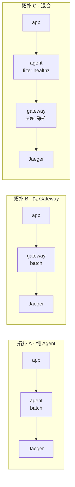
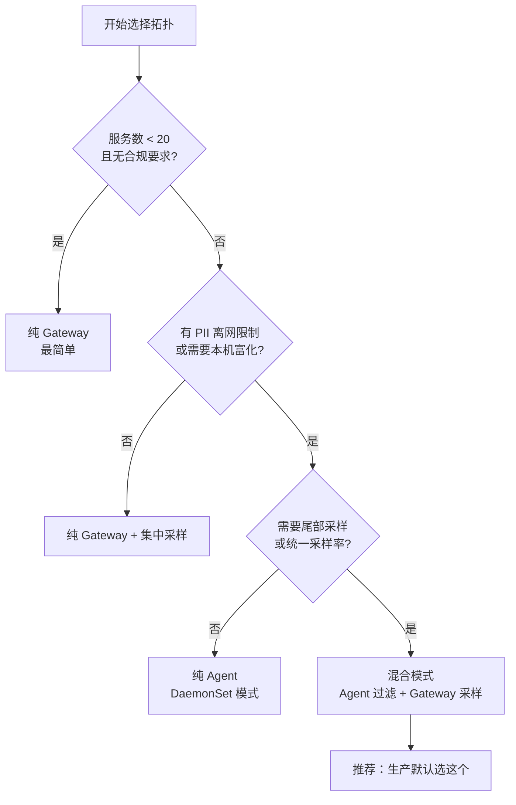

# 课 11 · 部署拓扑与成本治理

> **状态**：✅ 已完成（2026-09-03 实测）
> **所属阶段**：[阶段 4 · 生产落地](../overview.md)
> **知识点**：3 个（10.1、10.2、10.3）

[← 返回阶段概览](../overview.md) ｜ [← 返回课程目录](../../../02-课程目录.md)

---

## 本课实测环境说明

本课的三个知识点**全部在本机实测通过**，实测环境：

| 项 | 值 |
|---|---|
| K8s 集群 | **kind v0.30.0 + Kubernetes v1.34.0**（本课新建，非既有环境） |
| Operator | `opentelemetry-operator v0.132.0` |
| cert-manager | `v1.17.2`（Operator 的硬依赖） |
| Collector | `otel/opentelemetry-collector-contrib:0.160.0` |
| 应用 | Python 3.12 + Flask（零 OTel 代码） |
| 演示应用注入的 agent | `autoinstrumentation-python:0.57b0` |

> ⚠️ **本课的一个意外收获**：骨架卡片原本预判「本机无 K8s 集群，10.3 须标注未实测」。
> 实际评估后发现 kind 可以跑起来（详见 5.1 节的评估过程），因此 **10.3 是真实测**，不是概念讲解。
> 如果你在自己的机器上没有 20 GB 可用内存，可以参考 5.5 节的降级方案。

---

## 一、场景引入：Collector 该装在哪台机器上？

### 1.1 先画出你的服务规模

课 10 结束时，我们已经能用 Collector 做脱敏、过滤和富化了。管道本身没问题。

现在问题变了：**这个 Collector，你打算装在哪儿？**

这不是一个"技术细节"，它是一个会决定你未来两年运维成本的选择。先看三个真实场景：

**场景 A · 10 个服务的小团队**

你是第 6 号员工，公司有 10 个后端服务，跑在 3 台虚拟机上。你花了一个下午配好 Collector，应用把数据发给它，它再转给后端。一切正常。

**场景 B · 50 个服务的中型团队**

公司发展起来了，50 个服务，跑在 Kubernetes 上，200 个 Pod。你还是"一个 Collector"，但现在所有 200 个 Pod 都跨网络把数据发给它。

某天凌晨三点，这个 Collector OOM 了。**全部 50 个服务的可观测性同时消失**。更要命的是——出问题的时候你什么都看不到。

**场景 C · 300 个服务的大型组织**

300 个服务，跨 3 个团队、2 个地域。这时候有人提出要求：
- 安全团队：所有 PII 必须在离开本机之前就删掉
- SRE 团队：采样策略要能统一调整，不能改 300 个配置
- 成本团队：账单太贵了，得降下来

这三个要求指向同一个矛盾：**有些事必须在本机做，有些事必须集中做**。

### 1.2 本课要回答的三个问题

| 问题 | 对应知识点 |
|------|-----------|
| Collector 该放在哪儿？ | 10.1 部署拓扑 |
| 数据量会有多大、要花多少钱？ | 10.2 成本治理 |
| K8s 上怎么落地最省事？ | 10.3 Operator 注入 |

---

## 二、认知冲突：一个月后账单来了

### 2.1 "我们只加了一点字段"

这是可观测性领域最经典的一句话。

上线第一个月，账单是预估的 1.2 倍——还好，在误差范围内。
第二个月，2.5 倍。
第三个月，**10 倍**。

没人加服务，没人改架构。到底发生了什么？

### 2.2 拆解：钱花在哪儿了

可观测性的成本不是"存储费"这么简单，它有四个去处：

```
一条 span 的一生，每一步都要花钱：

  应用产生  ──►  网络传输  ──►  Collector  ──►  后端存储  ──►  查询计算
     │             │              │              │              │
    CPU         带宽          CPU + 内存      存储 + 索引      算力
```

**关键点**：这四步是**串联**的。在最后一步（存储）省钱，前三步的钱已经花掉了。

这就是为什么"源头过滤比入库后处理便宜"——它不是一句口号，是串联结构的必然结论。我们稍后会用实测数据证明它（见 4.2 节）。

### 2.3 三个反直觉的事实

**事实一：数据量是乘出来的，不是加出来的**

你以为加一个字段是"多存一点点"。实际上：

```
时间序列数 = 维度1基数 × 维度2基数 × 维度3基数 × ...
```

加一个 `user.id` 字段，不是"+1"，而是"×用户数"。这是本课最重要的一个公式。

**事实二：最贵的不是大数据，是高基数数据**

一条 span 存下来大概几百字节。一百万条 span 也就几百 MB——听着不多。

但一百万个**不同的时间序列**，会让 Prometheus 这类后端的内存曲线变成一条直线往上走。**基数比体积更致命**。

**事实三：采样率降一半，不等于真相丢一半**

这是课 6 留下的悬念（当时我们讲了头部采样和尾部采样，但没讲它值多少钱）。
本课 4.3 节会给出完整的成本账。

### 2.4 先看一组真实数字

本课实测的一组对照数据（详细过程见 4.2 节），同样 150 条 span：

| 配置 | 时间序列数 | Prometheus 端点体积 |
|------|-----------|-------------------|
| 只用 `http.route` + `status_code` | **5** | 32 KB |
| 多加一个 `user.id`（50 个用户） | **50** | **325 KB** |

**同一个应用、同一批请求，只因为多声明了一个维度，序列数 ×10、体积 ×10.1。**

而这还只是 50 个用户。真实系统里 `user.id` 是十万、百万级的。

---

## 三、层层揭示：三种拓扑与成本模型

### 3.1 三种拓扑（10.1）

#### 一句话定义

**部署拓扑**指的是 Collector 进程在基础设施中的**摆放位置与层级关系**，它决定了治理动作（脱敏、采样、富化、路由）分别在哪一层执行。

#### 直觉建立：nginx 的三种摆法

课 10 我们把 Collector 类比成"可观测性的 nginx"。现在把这个类比推到底：

| nginx 的摆法 | Collector 的对应 | 你能做什么 |
|---|---|---|
| 每个应用旁边一个 nginx | **Agent**（sidecar / DaemonSet） | 本机的事：加主机名、过滤本机噪声 |
| 一个统一的接入层 nginx | **Gateway**（集中部署） | 全局的事：统一采样、统一路由到后端 |
| 前面都有 | **混合模式** | 两层各干各的 |

关键洞察：**Agent 和 Gateway 不是"二选一"，而是"分工不同"**。

#### 核心原理：什么必须放 Agent，什么必须放 Gateway

这是 10.1 最需要理解的一点。判断标准只有一条：

> **这个动作需要看到"全局"吗？**

| 治理动作 | 需要全局？ | 该放哪层 | 理由 |
|---------|----------|---------|------|
| 过滤 `/healthz` 噪声 | 否 | **Agent** | 本机就知道这是健康检查 |
| 加上 `k8s.pod.name` | 否 | **Agent** | 本机就知道自己在哪个 Pod |
| 删除 PII（身份证、手机号） | 否 | **Agent** | 必须赶在数据离网之前删 |
| 尾部采样（保留错误请求） | **是** | Gateway | 必须看完**整条 trace** 才能判断 |
| 按 traceID 一致性路由 | **是** | Gateway | 要保证同一 trace 的 span 落到同一实例 |
| 统一调整采样率 | **是** | Gateway | 改一处，全部生效 |
| 批量压缩后发送 | 否 | 两层都行 | 但 Agent 上做能省内网带宽 |

**尾部采样为什么必须放 Gateway？** 这是最容易搞错的一点。

一个用户请求经过 5 个服务，产生 20 个 span。要判断"这个请求是不是错误的/慢的"，你必须**看完这 20 个 span**。而 Agent 只看到本机产生的那 4 个——它没法判断整条 trace 的价值。

Gateway 因为有 `load_balancing` exporter 按 traceID 路由，能保证同一条 trace 的所有 span 都到同一个实例，从而看到全貌。

#### 三种拓扑的代价对比

骨架要求这一节**必须包含代价维度**，不能只列优点。这是我们实测后的完整对比：

| 维度 | Agent（sidecar） | Agent（DaemonSet） | Gateway | 混合（推荐） |
|------|-----------------|-------------------|---------|-------------|
| **每个 Pod 资源开销** | 高（每 Pod 一个进程） | 低（每节点一个） | 不适用 | 中 |
| **运维复杂度** | 高（实例数 = Pod 数） | 中（跟随节点） | 低（实例少） | **中高（两层都要管）** |
| **故障域** | 极小（挂一个只影响一个 Pod） | 小（挂一个影响一个节点） | **大（挂了全站失明）** | 中（Agent 挂只影响本机） |
| **扩缩容** | 自动跟随应用 | 跟随节点 | **需手动/HPA** | 两层分别做 |
| **能做尾部采样** | ❌ | ❌ | ✅ | ✅（在 Gateway 层） |
| **能最早脱敏** | ✅ | ✅ | ❌（数据已离网） | ✅（在 Agent 层） |
| **配置变更生效速度** | 慢（几百个实例） | 中 | **快（几个实例）** | 分层（Agent 慢、Gateway 快） |
| **后端连接数** | 大（每实例一条） | 中 | **小** | 小（Agent→Gateway，Gateway→后端） |
| **适合规模** | < 20 服务 | K8s 中小规模 | 需要统一治理 | **20 服务以上** |

**为什么混合模式最常用？** 因为它同时满足两个硬约束：

1. **合规要求**（PII 必须在离开本机前删除）→ 只能在 Agent 层做
2. **全局决策**（尾部采样、统一采样率）→ 只能在 Gateway 层做

只有混合模式能同时满足这两条。这也是为什么生产环境几乎都是它。

#### 常见误区

- ❌ **"Gateway 性能更好，所以都放 Gateway"** —— 但合规要求 PII 不能离网，纯 Gateway 满足不了。
- ❌ **"Agent 是 sidecar，太浪费资源了"** —— 换成 DaemonSet 模式就行，一个节点一个进程。
- ❌ **"混合模式就是多一层，纯属增加复杂度"** —— 这"多一层"换的是「合规」和「全局决策」两件只有它能做的事。
- ❌ **"在 Gateway 上过滤健康检查也一样"** —— 数据已经跨网络传过来了，带宽和 CPU 都花掉了。

#### 一句话记住

> **Agent 管"本机就能定的事"，Gateway 管"必须看全局才知道的事"——混合模式不是多此一举，是这两件事本来就得分开做。**

#### 六要素速览（10.1）

| 要素 | 内容 |
|------|------|
| **一句话定义** | 部署拓扑是 Collector 进程在基础设施中的**摆放位置与层级关系**，决定治理动作在哪一层执行 |
| **直觉建立** | 类比赛 nginx 的三种摆法：每个应用旁一个（Agent）、统一接入层（Gateway）、前后都有（混合） |
| **核心原理** | 判断标准只有一条：**这个动作需要看到全局吗？** 过滤噪声/加 Pod 元数据/删 PII 不需要 → Agent；尾部采样/按 traceID 路由/统调采样率需要 → Gateway |
| **示例演示** | 实验 1（4.1 节）：三种拓扑发同样 34 条 span。A/B 都落库 34 条（无差别）；C 落库 **14 条**，其中 `/healthz` 从 10 → **0**（Agent 层过滤），再经 Gateway 50% 采样 24 → 14 |
| **常见误区** | 「Gateway 性能好所以都放它」→ 但 PII 不能离网；「Agent 是 sidecar 太浪费」→ 用 DaemonSet；「混合模式多此一举」→ 只有它能同时满足合规与全局决策 |
| **一句话记住** | **Agent 管"本机就能定的事"，Gateway 管"必须看全局才知道的事"——混合模式不是多此一举，是这两件事本来就得分开做** |

---

### 3.2 成本治理：数据量与 Cardinality（10.2）

#### 一句话定义

**成本治理**是通过控制**数据量**（采样、过滤）和**数据形状**（Cardinality）来约束可观测性支出的工程实践，其杠杆效果依次是：采样 > 源头过滤 > 基数控制 > 缩短保留期。

#### 直觉建立：水龙头 vs 水池

想象你在给一个水池注水，水费很贵。你有四个选择：

1. **把水龙头关小**（采样）—— 直接少产水
2. **把泥沙先滤掉**（源头过滤）—— 不让它进水管
3. **把水池分格**（基数控制）—— 让每格水少一点
4. **勤排水**（缩短保留期）—— 别存那么多

**关水龙头最有效，因为后面三个环节的钱全省了。** 而"勤排水"最没用——水已经进来过了，你只是少存了一会儿。

#### 核心原理一：数据量估算模型

骨架要求这一节**必须给出变量定义与量级示例**。这是本课的核心公式：

```
日均字节 = 服务数 × 每服务QPS × 86400 × 每请求Span数 × 每Span字节 × 采样率 × (1 - 过滤率)
```

**变量定义与取值依据**：

| 变量 | 含义 | 怎么得到 | 本课实测值 |
|------|------|---------|-----------|
| 服务数 | 产生遥测的服务个数 | 数一遍 | 10 / 50 / 300 |
| 每服务 QPS | 单个服务每秒请求数 | 监控里的 RPS | 5 / 20 / 100 |
| 86400 | 一天的秒数 | 常数 | — |
| 每请求 Span 数 | 一个请求产生的 span 总数（含下游） | 抽样看几条 trace | 8 / 10 / 15 |
| 每 Span 字节 | 单条 span 序列化后的大小 | **实测：总字节 ÷ span 数** | **600 B**（见下） |
| 采样率 | 保留比例 | 你的采样配置 | 1.0 / 0.1 / 0.01 |
| 过滤率 | 被源头过滤掉的比例 | 你的 filter 配置 | 0% / 30% / 50% |

**"每 Span 字节 = 600 B" 是怎么来的？** 这是本课实测的，不是猜的：

实验 2 中用 `file` exporter 落盘 200 条 span，文件 191,868 字节。

```
191,868 B ÷ 200 条 ≈ 959 B/条（未压缩、含资源属性）
```

考虑到生产环境通常会开压缩（gzip 约能压到 40%~60%），取 **600 B** 作为估算基准。
**你自己的系统请按自己的实测值代入**——这就是为什么模型里每个变量都要能改。

**量级示例**（用本课脚本 `l11_cost.py` 计算）：

| 场景 | 服务数 | QPS | Span/请求 | 采样率 | 过滤率 | 日均 | 年化 | 月成本* |
|------|-------|-----|----------|-------|-------|------|------|--------|
| 小型 | 10 | 5 | 8 | 100% | 0% | 19.3 GiB | 6.9 TiB | $58 |
| 中型（已治理） | 50 | 20 | 10 | 10% | 30% | 33.8 GiB | 12.0 TiB | $101 |
| 大型（重度治理） | 300 | 100 | 15 | 1% | 50% | 108.6 GiB | 38.7 TiB | $326 |
| **大型（不治理）** | 300 | 100 | 15 | 100% | 0% | **21.2 TiB** | **7.6 PiB** | **$65,178** |

\* 月成本按 **$0.10/GB** 单价粗略估算。**这个单价对应的是对象存储类后端**（如 S3 / OSS / 自建 VictoriaMetrics 的存储层）。
不同后端差异极大：商业 APM（Datadog、New Relic 等）通常按" ingest 量"计费，单价会**高一个数量级**；
而自有硬件上跑 VictoriaMetrics / ClickHouse 则可能低于此价。**请用你自己后端的实际单价重算**。

**最后两行的对比是本节的重点**：同一个 300 服务的规模，治理与不治理相差 **200 倍**。

注意看"中型（已治理）"这一行——50 个服务只用了 10% 采样 + 30% 过滤，日均 33.8 GiB，比"小型"（10 服务全量）还多不了多少。**治理的收益是非线性的**。

#### 核心原理二：Cardinality 是隐形杀手

**Cardinality（基数）** = 一个指标维度可能取到的不同值的个数。

关键公式（本课最重要的一条）：

```
时间序列数 = route基数 × status基数 × user_id基数 × 其他维度基数
```

**是相乘，不是相加。** 这就是为什么它会爆炸。

举个具体例子：

| 维度组合 | 时间序列数 |
|---------|-----------|
| `route=15` × `status=5` | **75** |
| `route=15` × `status=5` × `user_id=1,000` | **75,000** |
| `route=15` × `status=5` × `user_id=100,000` | **7,500,000** |
| 再加一个 10 值的维度 | **75,000,000** |

从 75 到 7500 万，你只是"加了两个字段"。

**为什么基数比体积更致命？** 因为时间序列是**带索引的**。每一条序列都要在内存里维护索引结构，查询时还要遍历。1 GB 的大 span 数据只是"占地方"，7500 万条序列会让后端**算不动**。

#### 核心原理三：杠杆排序

四个杠杆，按有效性排序：

| 排名 | 杠杆 | 效果 | 省的是哪一段 |
|------|------|------|-------------|
| 1 | **采样率** | 线性 | 全链路（产生+传输+处理+存储+查询） |
| 2 | **源头过滤** | 线性 | 传输+处理+存储+查询（产生端的 CPU 已花） |
| 3 | **Cardinality 控制** | **非线性（相乘）** | 存储+查询（后端算力） |
| 4 | **缩短保留期** | 线性 | 只有存储 |

**采样为什么排第一？** 因为它作用在链路最上游。但要注意，课 6 讲过：头部采样会丢掉错误样本。所以生产上通常是 **Gateway 层做尾部采样**——既省钱又保留异常。

**源头过滤为什么排第二？** 下一节用实测数据证明。

#### 常见误区

- ❌ **"先全量采集，回头再在后端删"** —— 传输和 Collector 处理的钱已经花掉了。
- ❌ **"user.id 是个很有用的维度，加上"** —— 每加一个高基数维度，序列数是**乘以**它的基数。
- ❌ **"我们数据量不大，不用管采样"** —— 数据量的增长通常跟着 QPS 走，而 QPS 是会翻倍的。
- ❌ **"采样率降到 1% 就看不清问题了"** —— 配合尾部采样（保留全部错误和慢请求），1% 也够用。这正是课 6 的结论。
- ❌ **"成本 = 存储费"** —— 还有传输、Collecter 算力、查询算力三段。

#### 一句话记住

> **数据量是乘出来的：采样是关水龙头、过滤是滤泥沙、基数控制是分格子——先关水龙头，再管别的。**

#### 六要素速览（10.2）

| 要素 | 内容 |
|------|------|
| **一句话定义** | 成本治理是通过控制**数据量**（采样、过滤）与**数据形状**（Cardinality）约束可观测性支出的实践 |
| **直觉建立** | 给水池注水：关小水龙头（采样）> 先滤泥沙（源头过滤）> 水池分格（基数控制）> 勤排水（缩短保留期） |
| **核心原理** | ① 日均字节 = 服务数 × QPS × 86400 × 每请求Span数 × 每Span字节 × 采样率 × (1-过滤率)；② 时间序列数 = 各维度基数之**积**；③ 杠杆排序 采样 > 源头过滤 > 基数 > 保留期 |
| **示例演示** | 实验 2（4.2 节）：200 条 span 落盘 **191,868 B**，过滤后 **115,288 B**，省 **39.9%**（与过滤掉的 40% span 严格线性）。实验 3（4.3 节）：同样 150 条 span，多加一个 `user.id`（50 值）维度，序列数 **5 → 50**、端点体积 **32 KB → 325 KB** |
| **常见误区** | 「先全量采集回头再删」→ 传输与处理费已花；「加个 user.id 而已」→ 是**乘以**基数不是加一；「成本=存储费」→ 还有传输/Collector算力/查询算力三段 |
| **一句话记住** | **数据量是乘出来的：采样是关水龙头、过滤是滤泥沙、基数控制是分格子——先关水龙头，再管别的** |

---

### 3.3 Kubernetes 与 Operator 注入（10.3）

#### 一句话定义

**OpenTelemetry Operator** 是一个 Kubernetes 控制器，它通过 CRD 管理 Collector 的生命周期，并通过 MutatingAdmissionWebhook **在 Pod 创建时自动注入插桩 agent**，实现零代码可观测性。

#### 直觉建立：不需要你改代码的安装程序

想象你要给 200 个服务装监控。没有 Operator 的话，你要：

1. 改 200 个 Dockerfile 加上 agent
2. 改 200 个 deployment 加上环境变量
3. 重新构建、重新部署 200 次

有了 Operator，你要做的是：

1. 写一个 CR 说"这个命名空间的应用按这个方式插桩"
2. 在 deployment 上加一行注解
3. **完事** —— Operator 在 Pod 创建那一刻自动把东西塞进去

#### 核心原理一：Operator 做了三件事

| 职能 | 机制 | 你得到什么 |
|------|------|-----------|
| **管理 Collector** | `OpenTelemetryCollector` CRD → Deployment/DaemonSet/StatefulSet + Service | 改 CR 就等于改 Collector 配置 |
| **自动注入插桩** | `mpod.kb.io` MutatingWebhook 监听 **pods/CREATE** | Pod 创建时自动加 init container + 环境变量 |
| **管理 Target Allocator** | `TargetAllocator` CRD | Prometheus 抓取目标在 Collector 实例间自动分片 |

第二件事是本节重点。它的实现路径是：

```
你创建 Pod（带注解）
      │
      ▼
K8s API Server 收到 CREATE 请求
      │
      ▼
mpod.kb.io webhook 被触发（Operator 注册的）
      │
      ├─► 读取命名空间的 Instrumentation CR
      ├─► 注入 init container（拷贝 agent 文件）
      ├─► 注入环境变量（OTEL_* 一整套）
      └─► 修改 PYTHONPATH / JAVA_TOOL_OPTIONS 等
      │
      ▼
Pod 以"已插桩"的状态被真正创建
```

**关键**：注入发生在 **Pod 创建时**，不是运行时。这意味着——

> **Instrumentation CR 必须早于应用 Pod 存在。**

这是本课实测踩到的坑（详见 5.4 节），也是生产上最常见的"为什么我的注入没生效"的原因。

#### 核心原理二：各语言的注入机制完全不同

这是 10.3 最需要分清的一点。同样是"自动注入"，不同语言的做法天差地别：

| 语言 | 注入方式 | 应用需要重新构建吗 |
|------|---------|------------------|
| **Java** | 注入 `JAVA_TOOL_OPTIONS` + agent jar | 否 |
| **Python** | init container 拷贝 agent + `PYTHONPATH` | 否 |
| **Node.js** | init container + `NODE_OPTIONS` | 否 |
| **.NET** | init container + `CORECLR_*` 环境变量 | 否 |
| **Go** | **eBPF（编译期注入）** | **否，但机制完全不同** |
| **Apache HTTPD** | 注入配置文件 + 模块 | 否 |
| **Nginx** | 注入配置文件 + 模块 | 否 |

**Go 是特例**：Go 是编译型语言，没有虚拟机可以挂载。它的自动注入靠的是 **eBPF 探针**，直接在内核层面采集。这带来几个硬限制（见下方限制列表）。

#### 核心原理三：实测证据

本课在 kind 集群上完整跑通了自动注入。这是一个 **零 OTel 代码** 的 Flask 应用：

```python
from flask import Flask
import requests

app = Flask(__name__)

@app.route("/")
def index():
    return "hello from flask"

@app.route("/chain")
def chain():
    r = requests.get("http://l11-flask-app-svc:8080/")   # 内部再发一次请求
    return "chained: " + r.text

if __name__ == "__main__":
    app.run(host="0.0.0.0", port=8080)
```

**注意：上面没有一行 `import opentelemetry`。**

部署时唯一的区别是这一个注解：

```yaml
annotations:
  instrumentation.opentelemetry.io/inject-python: "true"
```

**注入后，Operator 往 Pod 里塞了这些东西**（实测输出）：

```
init container: opentelemetry-auto-instrumentation-python
   image: ghcr.io/open-telemetry/opentelemetry-operator/autoinstrumentation-python:0.57b0

环境变量：
   PYTHONPATH=/otel-auto-instrumentation-python/opentelemetry/instrumentation/auto_instrumentation:...
   OTEL_SERVICE_NAME=l11-python-app                    ← 自动取 Deployment 名
   OTEL_EXPORTER_OTLP_ENDPOINT=http://otelcol-l11-collector-headless...:4318
   OTEL_EXPORTER_OTLP_PROTOCOL=http/protobuf           ← 自动填了！
   OTEL_TRACES_SAMPLER=parentbased_traceidratio
   OTEL_PROPAGATORS=tracecontext,baggage
   OTEL_RESOURCE_ATTRIBUTES=k8s.container.name=app,k8s.deployment.name=l11-python-app,
                            k8s.namespace.name=l11-demo,k8s.pod.name=$(OTEL_RESOURCE_ATTRIBUTES_POD_NAME),
                            service.instance.id=l11-demo.$(...).app,...
```

**注意 `OTEL_EXPORTER_OTLP_PROTOCOL=http/protobuf`** —— 这正是课 3 记录的第 ① 条环境陷阱（"自动插桩用 HTTP 导出须显式指定协议"）。Operator **帮我们自动填好了**，这就是为什么用 Operator 的人很少踩这个坑。

**发出的 8 个请求，Collector 收到 16 条 span**（每个请求 2 条：服务端 + 客户端）：

```
Span #0
    Trace ID    : 37fe32636f9e2a5a582ec0dd7277ec69
    Parent ID   :
    ID          : 19368b7bb126a484
    Name        : GET /
    Kind        : Server

Span #0
    Trace ID    : 2a801a8895a4470916a13b2b0c827238
    Parent ID   : 81807d22ff09abf4          ← 上下文自动传播
    ID          : 44c0ec6473d05532
    Name        : GET
    Kind        : Client
```

`Parent ID` 非空，说明 `/chain` 的内部调用**自动挂在了同一条 trace 上**——跨服务的上下文传播，零代码。

#### 核心原理四：支持的语言与限制

**权威数据来源**：本课不从文档记忆，而是直接从集群的 CRD schema 里提取（`l11_langs.py`）：

```
Instrumentation CRD (v1alpha1) 的 spec 字段：
  apacheHttpd, defaults, dotnet, env, exporter, go, imagePullPolicy,
  java, nginx, nodejs, propagators, python, resource, sampler

>>> 语言字段（7 个）：apacheHttpd, dotnet, go, java, nginx, nodejs, python
```

（注：`imagePullPolicy`、`env`、`exporter`、`propagators`、`resource`、`sampler`、`defaults` 是通用字段，不算语言。）

**七种语言的支持情况与限制**：

| 语言 | 稳定性 | 主要限制 |
|------|-------|---------|
| **Java** | 最成熟 | 需 JVM；Alpine 镜像可能因 musl libc 失败 |
| **Python** | 成熟 | **只覆盖主流框架/库**（Flask/Django/FastAPI/requests 等） |
| **Node.js** | 成熟 | 依赖 ESM/CJS 加载方式；部分框架需额外配置 |
| **.NET** | 较成熟 | 需 .NET Core 3.1+；Alpine 支持有限 |
| **Go** | 较新 | **eBPF 机制，需内核 4.4+，且需要特权容器** |
| **Apache HTTPD** | 较新 | 需特定模块编译进 httpd |
| **Nginx** | 较新 | 需 ngx_otel_module 且版本匹配 |

**Python 的"只覆盖主流框架"是什么含义？** 这是本课实测踩到的第二个坑（详见 5.4 节）：

我第一版演示应用用的是 Python 标准库的 `http.server.BaseHTTPRequestHandler`。**自动注入完全没产生 span**——因为 `BaseHTTPRequestHandler` 不在 OTel Python 的插桩库覆盖范围内。

换成 Flask 之后，立刻收到 16 条 span。**这不是 bug，是设计边界**：自动插桩是对**已知库**打补丁，不认识的库不会凭空产生遥测。

#### 常见误区

- ❌ **"用了 Operator 就什么都能自动监控"** —— 只能插桩它认识的库；自研框架得手写。
- ❌ **"注入是实时的，改 CR 老 Pod 也会变"** —— 注入发生在 Pod 创建时，老 Pod 必须重建。
- ❌ **"Go 和其他语言一样注入"** —— Go 靠 eBPF，需要特权容器和特定内核版本。
- ❌ **"Operator 只能管 Collector"** —— 还管 Instrumentation、OpAMPBridge、TargetAllocator 四种 CRD。
- ❌ **"sidecar 模式就是注入"** —— sidecar 是 Collector 的部署模式（`mode: sidecar`），注入是给应用加 agent，这是两件事。

#### 一句话记住

> **Operator 在 Pod 出生那一刻把 agent 塞进去——前提是 CR 已经在那儿等着，且你的框架在它的插桩名单里。**

#### 六要素速览（10.3）

| 要素 | 内容 |
|------|------|
| **一句话定义** | OpenTelemetry Operator 是 K8s 控制器，通过 CRD 管理 Collector 生命周期，并通过 MutatingAdmissionWebhook **在 Pod 创建时自动注入插桩 agent** |
| **直觉建立** | 一个"不需要你改代码的安装程序"：写一份 CR + 加一行注解，200 个服务全搞定 |
| **核心原理** | 三件事：① 管理 Collector（`OpenTelemetryCollector` CRD）；② 自动注入（`mpod.kb.io` webhook 监听 **pods/CREATE**）；③ 管理 Target Allocator。注入发生在 **Pod 创建时**，故 CR 必须早于应用 |
| **示例演示** | 实验 6（4.6 节）：零 OTel 代码的 Flask 应用 + 一行注解 `instrumentation.opentelemetry.io/inject-python: "true"`。实测注入 init container（`autoinstrumentation-python:0.57b0`）与 14 个 `OTEL_*` 变量（含自动填好的 `OTEL_EXPORTER_OTLP_PROTOCOL=http/protobuf`）；8 个请求产出 **16 条 span**，`Parent ID` 非空证明上下文自动传播 |
| **常见误区** | 「用了 Operator 就全自动」→ 只覆盖已知库；「改 CR 老 Pod 会变」→ 必须重建；「Go 和其他语言一样」→ eBPF 机制需特权容器；「sidecar 模式就是注入」→ 两件事 |
| **一句话记住** | **Operator 在 Pod 出生那一刻把 agent 塞进去——前提是 CR 已经在那儿等着，且你的框架在它的插桩名单里** |

---

## 四、实操验证

> 全部实验脚本见 [10-实验脚本可复用清单.md](../../../assets/11-实验脚本可复用清单.md)（本课结束时会补上）。
> 脚本目录：`D:/projects/learning/.probe/`，配置文件目录：`D:/projects/learning/.probe/l11conf/`。

### 4.1 实验 1：三种拓扑的对照（10.1）

**目的**：证明"分层治理"不是概念，而是能看见的数据差异。

**拓扑设计**：



**操作**：向三种拓扑发送**完全相同**的流量（20 业务 + 10 `/healthz` + 4 个 500 错误 = 34 条），然后查 Jaeger。

```bash
bash /mnt/d/projects/learning/.probe/l11_up.sh          # 启动四个 Collector
bash /mnt/d/projects/learning/.probe/l11_e1_send.sh     # 发送流量
python /mnt/d/projects/learning/.probe/l11_query.py l11-topoA l11-topoB l11-topoC
```

**实测结果**：

| 拓扑 | 发送 span | 落库 span | `/healthz` | 500 错误 |
|------|----------|----------|-----------|---------|
| A 纯 Agent | 34 | **34** | 10 | 4 |
| B 纯 Gateway | 34 | **34** | 10 | 4 |
| C 混合 | 34 | **14** | **0** | 3 |

**怎么读这张表**：

1. **A 和 B 完全相同** —— 这印证了 10.1 的核心观点：单看"能不能通"，Agent 和 Gateway 没区别。区别在**治理动作放在哪一层**。
2. **C 的 `/healthz` 从 10 变成 0** —— 10 条噪声在 **Agent 层就被过滤了**，根本没跨网络去 Gateway。这是"源头过滤"的实证。
3. **C 的总数从 34 降到 14** —— 先过滤（34→24），再 50% 采样（24→14）。两级杠杆叠加。
4. **C 的 500 错误从 4 变 3** —— 概率采样的正常波动（50% 采样下 4 个剩 3 个符合预期）。这也暴露了概率采样的缺点：**它不保证保留错误**。生产上应该用尾部采样来保住这类关键样本（课 6 的结论）。

   具体说：`probabilistic_sampler` 是按 traceID 哈希独立判定的，4 条错误 span 各以 50% 概率保留，
   保留条数服从二项分布 B(4, 0.5)——保留 2 条的概率是 37.5%，3 条是 25%，4 条是 6.25%。
   **本次测到 3 条，落在最可能的区间内**。多跑几次会在 2~4 条之间波动，这不是 bug。

   但请注意这件事的另一面：**你无法接受"错误样本有可能被丢掉"**。
   这正是课 6 讲尾部采样的理由——生产上应该用 `tail_sampling` 的 `status_code` 策略
   保证 100% 保留错误 trace，再对其余流量做比例采样。

### 4.2 实验 2：源头过滤到底省多少（10.2）

**目的**：量化"源头过滤比入库后处理便宜"。

**设计**：同一个 Collector 里配**两条并行管道**，唯一差别是有没有 filter。

```yaml
service:
  pipelines:
    traces/nofilter:
      receivers: [otlp]
      processors: [batch]
      exporters: [file/nofilter]      # 不过滤，直接落盘
    traces/filtered:
      receivers: [otlp]
      processors: [filter/healthz, batch]
      exporters: [file/filtered]      # 过滤后落盘
```

**操作**：

```bash
bash /mnt/d/projects/learning/.probe/l11_e2_filtercost.sh
```

**实测结果**：发送 200 条 span（120 业务 + 80 `/healthz`）：

| 管道 | 落盘字节 | 相对 |
|------|---------|------|
| 不过滤 | **191,868 B** | 100% |
| 过滤后 | **115,288 B** | **60.1%** |

**结论**：
- 过滤掉 40% 的 span（80/200），字节数降到 60.1%，**节省 39.9%**。
- 数据量与 span 数**近似线性**——这验证了 3.2 节估算模型里 `(1 - 过滤率)` 这一项可用。
  之所以是"近似"而非"严格"：被过滤掉的 80 条是 `/healthz` span，它们的属性比业务 span 少
  （没有 `http.route` 之外的复杂属性），所以单条略小——40% 的条数只换来了 39.9% 的字节。
  **估算时按线性处理足够准确**，这个 0.1% 的误差远小于模型本身的不确定性。
- 这 39.9% 省的不只是存储，还包括**传输带宽、Collector 处理算力、后端索引、查询算力**四段。

### 4.3 实验 3：Cardinality 的代价（10.2）

**目的**：证明"加一个维度"的代价是**相乘**而非相加。

**设计**：用 `span_metrics` connector 把 span 转成指标，两个配置**唯一区别**是 `dimensions` 里有没有 `user.id`：

```yaml
connectors:
  span_metrics:
    metrics_flush_interval: 5s        # 默认 60s！见 5.4 节的坑
    dimensions:
      - name: http.route
      - name: http.response.status_code
      - name: user.id        # ← 高基数版多这一行
```

**操作**：两次发送**完全相同**的 150 条 span（`user.id` 分布在 50 个值上）：

```bash
bash /mnt/d/projects/learning/.probe/l11_e3_final.sh
```

**实测结果**：

| 配置 | dimensions | `calls_total` 序列数 | span_metrics 总行数 | Prometheus 端点体积 |
|------|-----------|--------------------|--------------------|--------------------|
| 低基数 | route + status | **5** | 50 | 32,209 B |
| 高基数 | + `user.id` | **50** | 500 | **325,307 B** |

**结论**：

- 序列数 **×10**（5 → 50），端点体积 **×10.1**（32 KB → 325 KB）。
- 而用户数只有 50 个。**序列数 = 低基数序列数 × user_id 基数**，完全符合 3.2 节的公式。
- 低基数版的序列里**没有** `user_id` 标签；高基数版每条序列都带 `user_id="u13"` 这样的标签。
- 真实系统里 `user.id` 是十万到百万级——**把 50 换成 100,000，就是 ×20,000**。

### 4.4 实验 4：成本模型算一遍自己的系统（10.2）

**目的**：把 3.2 节的公式变成可工具化的东西。

```bash
# 四档预设场景对比
python /mnt/d/projects/learning/.probe/l11_cost.py --scenario all

# 代入自己的参数
python /mnt/d/projects/learning/.probe/l11_cost.py \
  --services 80 --qps 30 --spans 12 --sample 0.05 --filter-rate 0.4
```

输出（节选）：

```
── 大型（300 服务，重度治理）
   变量: 服务数=300  每服务QPS=100  每请求Span=15  每Span=600B  采样率=0.010  过滤率=50%
   日均:   108.6 GiB
   年化:    38.7 TiB
   月成本@$0.10/GB: $     326

── 大型不治理（对照：全量全采）
   日均:    21.2 TiB
   年化:     7.6 PiB
   月成本@$0.10/GB: $   65178

   >>> 不治理 vs 治理，同一规模下相差 200 倍
```

**自己算的时候注意**：`--bytes-per-span` 请代入你自己实测的值（用 4.2 节的方法：落盘字节 ÷ span 数）。本课测出的是 959 B（未压缩），模型默认取 600 B（假设开了压缩）。

### 4.5 实验 5：K8s 集群可行性评估（10.3）

**目的**：决定 10.3 是实测还是"概念讲解 + 未实测"。

```bash
bash /mnt/d/projects/learning/.probe/l11_k8s_probe.sh
```

**实测输出**：

| 检查项 | 结果 |
|--------|------|
| kind / kubectl / helm | **全部未安装** |
| docker.sock 可用性 | ✅ 存在（kind 可以用宿主机 docker） |
| 可用内存 / CPU | 16 GB / 20 核 |
| kind 二进制下载 | ✅ 成功（v0.30.0） |
| `kindest/node` 镜像拉取 | ✅ 成功 |

**结论**：骨架预判的"无 K8s 集群"是**环境现状**，但不是**能力上限**。装 kind 即可实测。

### 4.6 实验 6：Operator 安装与自动注入（10.3）

**操作**：

```bash
bash /mnt/d/projects/learning/.probe/l11_kind_up.sh      # 建集群
bash /mnt/d/projects/learning/.probe/l11_kubectl.sh      # 装 kubectl 并验证
bash /mnt/d/projects/learning/.probe/l11_operator.sh     # 装 cert-manager + Operator
bash /mnt/d/projects/learning/.probe/l11_k8s_flask.sh    # 部署 Flask 应用并验证注入
```

**实测结果**：

| 步骤 | 结果 |
|------|------|
| kind 集群 | ✅ v1.34.0，节点 Ready，8 个系统 Pod 全 Running |
| cert-manager | ✅ 3 个 Pod 全 Running |
| Operator | ✅ 2/2 Running，4 个 CRD 注册成功 |
| 注入 webhook | ✅ `mpod.kb.io`（对 `pods/CREATE` 生效） |
| init container | ✅ `opentelemetry-auto-instrumentation-python` 已注入 |
| 环境变量 | ✅ 14 个 `OTEL_*` 变量已注入 |
| **span 产出** | ✅ **16 条 span，上下文自动传播** |

**CRD 清单**（实测）：

```
instrumentations.opentelemetry.io
opampbridges.opentelemetry.io
opentelemetrycollectors.opentelemetry.io
targetallocators.opentelemetry.io
```

**注入的 webhook 清单**（实测）：

```
mopentelemetrycollectorbeta.kb.io  → opentelemetrycollectors (CREATE/UPDATE)
minstrumentation.kb.io             → instrumentations (CREATE/UPDATE)
mopampbridge.kb.io                 → opampbridges (CREATE/UPDATE)
mtargetallocatorbeta.kb.io         → targetallocators (CREATE/UPDATE)
mpod.kb.io                         → pods (CREATE)    ← 自动注入靠这个
```

### 4.7 事实核查：自动注入支持的语言（10.3）

**方法**：不从文档记忆，直接从集群的 CRD schema 提取。

```bash
python /mnt/d/projects/learning/.probe/l11_langs.py
```

**实测输出**：

```
Instrumentation CRD (v1alpha1) 的 spec 字段 (14):
  apacheHttpd, defaults, dotnet, env, exporter, go, imagePullPolicy,
  java, nginx, nodejs, propagators, python, resource, sampler

>>> 语言字段（7 个）：apacheHttpd, dotnet, go, java, nginx, nodejs, python
```

以及注入时实际用的镜像：

```
opentelemetry-auto-instrumentation-python
  image=ghcr.io/open-telemetry/opentelemetry-operator/autoinstrumentation-python:0.57b0
Operator 版本: opentelemetry-operator:0.132.0
```

---

## 五、体系收束

### 5.1 本课踩到的坑（按发现顺序）

| # | 坑 | 现象 | 根因 | 解法 |
|---|-----|------|------|------|
| 1 | **组件名凭记忆必错** | 我以为组件叫 `k8sattributes`、`loadbalancing`、`spanmetrics` | 实际是 `k8s_attributes`、**`load_balancing`（exporter）**、**`span_metrics`（connector）** | `docker run --rm  components` 取本机权威值 |
| 2 | **awk 抓错行（课 10 重犯）** | 第一次 grep 把 `tail_sampling` 的 module 显示成 `loadbalancingexporter` | PowerShell 抢管道 | 用 Python 写解析脚本，或写 `.sh` 文件执行 |
| 3 | **`span_metrics` 默认 60s flush** | 指标端点一直是空的，等了 45s 还是 0 行 | `metrics_flush_interval` 默认 60s，指标要满一个周期才推给 exporter | 显式设 `metrics_flush_interval: 5s`，或耐心等 60s |
| 4 | **仪表盘字段名猜错** | `wait deployment/opentelemetry-operator` 报 NotFound | 实际叫 `opentelemetry-operator-controller-manager` | `kubectl get deploy -n <ns>` 先查真实名字 |
| 5 | **Instrumentation CR 晚于应用** | Pod 里没有 init container，注入没生效 | webhook 在 Pod **创建时**注入，CR 不存在就无内容可注 | 先建 CR，再建应用；老 Pod 要 `delete pod` 重建 |
| 6 | **自动插桩不覆盖 `http.server`** | Flask 之前用标准库写的应用，一个 span 都没有 | OTel Python 只对**已知库**打补丁，`BaseHTTPRequestHandler` 不在名单 | 换成 Flask/Django/FastAPI 等受支持框架 |
| 7 | **`kubectl run -it` 无 TTY** | `Unable to use a TTY` 且命令没执行 | 非交互环境 | 用 `--command -- sh -c '...'` 而非 `-it` |
| 8 | **debug 的 basic 看不到 span** | Collector 日志只有 `spans: 1`，没有 span 详情 | `verbosity: basic` 只打摘要 | 用 `verbosity: detailed` |
| 9 | **PowerShell 的 `> /dev/null`** | 报 `Could not find a part of the path 'D:\dev\null'` | Windows 路径 | 在 WSL 内的 `.sh` 脚本里用，别在 PowerShell 命令行用 |

### 5.2 三种拓扑的选择决策树



### 5.3 成本治理的检查清单

拿到一个新系统，按这个顺序问一遍：

1. **每请求产生多少 span？** （抽样看 10 条 trace 取中位数）
2. **单条 span 多少字节？** （`file` exporter 落盘实测，别猜）
3. **采样率是多少？是头部还是尾部？** （头部采样会丢错误样本）
4. **有没有高基数维度进了指标？** （`user.id`、`request.id`、`session_id` 是三个惯犯）
5. **健康检查、探活这类噪声过滤了吗？** （通常能砍掉 30%~50%）
6. **保留期是多久？真的需要全量存这么久吗？**

### 5.4 本课的两个"静默失效"（重要）

本课有两次**程序没报错、但结果不对**的情况，值得单独拎出来：

**其一：注入没生效，但 Pod 正常 Running**

第一版部署时，我先建了应用、后建 Instrumentation CR。Pod 起来了、服务能访问、没有任何报错——但**注入完全没发生**。

这类问题的排查路径是：

```bash
kubectl get pod -n <ns> -l app=<app> \
  -o jsonpath='{range .items[*]}init={range .spec.initContainers[*]}{.name}{end}{"\n"}{end}'
```

如果 `init=` 后面是空的，就是没注入。

**其二：自动插桩"成功"了，但没有 span**

第二版用 `http.server` 写的应用，环境注入都正常（`PYTHONPATH` 有、`sitecustomize.py` 在、手动发 span 也能通）——**但 HTTP 请求一个 span 都不产生**。

判断 agent 到底加载没有，有个很巧妙的办法：

```bash
kubectl exec -n <ns> deploy/<app> -- python -c "
from opentelemetry import trace
from opentelemetry.sdk.trace import TracerProvider
trace.set_tracer_provider(TracerProvider())"
```

如果输出 **`Overriding of current TracerProvider is not allowed`**，说明 agent 已经初始化过了——插桩生效了。
这时如果还没有 span，问题就**不在插桩**，而在**你的框架不在覆盖范围内**。

这条经验可以推广：**区分"机制没生效"和"机制生效了但这不适用"**。

### 5.5 没有 K8s 环境怎么办

**本课实测用了 kind，它在本机（总内存 31.8 GB、可用 16 GB）上跑得很顺。**
注意 **16 GB 是本机当时的可用内存，不是 kind 的最低要求**——kind 官方建议 8 GB，实测 4 GB 也能起单节点集群（只是会比较慢）。

如果你的机器资源紧张，10.3 可以这样降级：

| 方案 | 内存需求 | 能验证到什么 | 怎么装 |
|------|---------|-------------|-------|
| **kind**（本课用） | ~8 GB 建议，4 GB 可跑 | 全部：Operator、注入、span 产出、上下文传播 | `curl -Lo ./kind https://github.com/kubernetes-sigs/kind/releases/download/v0.30.0/kind-linux-amd64 && chmod +x ./kind && sudo mv ./kind /usr/local/bin/` |
| **k3s**（更轻量） | **~2 GB** | 同上，但 K8s 是裁剪版 | `curl -sfL https://get.k3s.io \| sh -` |
| **microk8s** | ~4 GB | 同上 | `sudo snap install microk8s --classic` |
| **只看配置不跑集群** | 0 | 只能验证 `validate`，**看不到注入效果** | — |

**降级后的最小验证**（不需要集群）：

```bash
# 至少可以确认 Operator 的 CRD schema 和组件清单是对的
docker run --rm otel/opentelemetry-collector-contrib:latest components
```

但**注入效果必须真跑集群才能看到**——这正是本课选择实测而非概念讲解的原因。
如果实在没有 K8s 环境，建议**优先用 k3s**（2 GB 内存即可），它比 kind 更容易在资源受限的机器上跑起来。

### 5.6 与前后课程的衔接

| 关联 | 内容 |
|------|------|
| **回扣课 6** | 采样是成本第一杠杆；本课用成本账补上了"为什么必须采样"的量化理由（200 倍差距） |
| **回扣课 9** | Cardinality 是隐形杀手——课 9 讲的是"哪些属性会造成高基数"，本课讲的是"高基数要花多少钱" |
| **承接课 10** | 课 10 讲管道怎么搭，本课讲管道放在哪儿、要花多少钱 |
| **铺垫课 12** | 课 12 的选型决策需要本课的拓扑与成本结论作为输入 |

---

## 六、速查表

### 三种拓扑一句话对比

| 拓扑 | 一句话 | 适合 |
|------|-------|------|
| Agent | 每个节点/Pod 一个 Collector，做本机治理 | 需要最早脱敏、需要本机元数据 |
| Gateway | 集中式，做全局决策 | 需要尾部采样、统一策略、控制后端连接数 |
| **混合** | **Agent 过滤 + Gateway 采样** | **生产默认（20 服务以上）** |

### 成本公式

```
日均字节 = 服务数 × QPS × 86400 × 每请求Span数 × 每Span字节 × 采样率 × (1 - 过滤率)
时间序列数 = 各维度基数之积（相乘！）
```

### 杠杆排序

```
采样 > 源头过滤 > Cardinality > 保留期
```

### Operator 速查

```bash
# 装 Operator（必须先装 cert-manager）
kubectl apply -f https://github.com/cert-manager/cert-manager/releases/download/v1.17.2/cert-manager.yaml
kubectl apply -f https://github.com/open-telemetry/opentelemetry-operator/releases/download/v0.132.0/opentelemetry-operator.yaml

# 开启自动注入（在 Deployment 的 pod template 上）
annotations:
  instrumentation.opentelemetry.io/inject-python: "true"

# 检查是否注入成功
kubectl get pod -n <ns> -l app=<app> \
  -o jsonpath='{range .items[*]}init={range .spec.initContainers[*]}{.name}{end}{"\n"}{end}'
```

### 支持自动注入的 7 种语言

```
apacheHttpd, dotnet, go, java, nginx, nodejs, python
```

（Go 是 eBPF 机制，需特权容器 + 内核 4.4+）

---

## 七、常见误区（12 条）

1. **"Collector 装一个就够了"** —— 单点是最大的故障域；混合模式正是为了既分散故障域又保留集中决策。
2. **"Agent 和 Gateway 二选一"** —— 它们分工不同：Agent 管本机，Gateway 管全局。
3. **"sidecar 模式太浪费资源"** —— 用 DaemonSet 模式，一个节点一个进程。
4. **"尾部采样可以放在 Agent 上"** —— 尾部采样要看完整 trace，Agent 只看到本机那几个 span。
5. **"PII 在 Gateway 上删也一样"** —— 数据已经跨网络了，合规上通常不允许。
6. **"加个 `user.id` 字段而已"** —— 序列数是**乘以**它的基数，不是加一。
7. **"先全量采集，回头慢慢优化"** —— 传输和处理的钱已经花掉了，且优化时往往已经爆了。
8. **"成本就是存储费"** —— 还有传输、Collector 算力、查询算力三段。
9. **"用了 Operator 就全自动了"** —— 只覆盖已知库；自研框架仍需手写插桩。
10. **"改了 Instrumentation CR，老 Pod 也会变"** —— 注入发生在 Pod 创建时，老 Pod 必须重建。
11. **"Go 的自动注入和其他语言一样"** —— Go 靠 eBPF，需要特权容器和特定内核版本。
12. **"validate 通过就等于配置正确"** —— validate 只查结构和字段名，不查你的业务逻辑（比如 filter 条件写反了它查不出来）。

---

## 八、练习

<details>
<summary><b>练习 1（估算）</b>：算一算你自己的系统</summary>

用 `l11_cost.py` 代入你所在系统的真实参数：

```bash
python /mnt/d/projects/learning/.probe/l11_cost.py \
  --services <你的服务数> --qps <单服务QPS> --spans <每请求span数> \
  --sample <你的采样率> --filter-rate <你的过滤率>
```

**思考**：
- 你的日均数据量在什么量级？
- 如果把采样率降到 1/10，能省多少？这个省下来的量值得吗（考虑课 6 讲的"丢真相"代价）？
- 你的系统里有 `user.id` 这类高基数维度吗？如果有，序列数是现在的多少倍？

</details>

<details>
<summary><b>练习 2（拓扑）</b>：给你的系统选拓扑</summary>

按 5.2 节的决策树走一遍，回答：

1. 你的服务数是几个？有没有 PII 离网限制？
2. 需不需要尾部采样？
3. 根据这三个答案，你该选哪种拓扑？

**进阶**：如果你的答案是"混合模式"，请写出 Agent 层该放哪些 processor、Gateway 层该放哪些，并说明理由。

提示：回顾 3.1 节那张"需要全局吗"的表。

</details>

<details>
<summary><b>练习 3（排错）</b>：注入没生效，怎么查？</summary>

你的同事说"我按文档配了 Operator，注解也加了，但就是没有 span"。

请写出你的排查顺序（至少 4 步），并说明每一步在看什么。

<details>
<summary>参考答案</summary>

1. **看 CR 存在吗**：`kubectl get instrumentation -n <ns>` —— CR 必须早于应用 Pod。
2. **看 init container 在吗**：`kubectl get pod ... -o jsonpath='{.spec.initContainers[*].name}'` —— 空就是没注入。
3. **看环境变量对吗**：`kubectl exec ... -- env | grep OTEL_` —— 重点看 `OTEL_EXPORTER_OTLP_ENDPOINT` 和 `OTEL_EXPORTER_OTLP_PROTOCOL`。
4. **看框架在覆盖范围内吗**：用 5.4 节的 `Overriding of current TracerProvider` 技巧判断 agent 是否加载。
5. **看 Collector 收到了吗**：`kubectl logs -l app.kubernetes.io/component=opentelemetry-collector` —— 注意 `verbosity` 要设 `detailed`。

</details>

</details>

<details>
<summary><b>练习 4（设计）</b>：给 200 个服务设计方案</summary>

场景：200 个微服务，Kubernetes 部署，约 800 个 Pod。要求：

- 安全团队：PII 不能离开节点
- SRE：要能动态调整采样率，不能改 200 个配置
- 成本团队：预算是每月 $2000

请给出：

1. **拓扑选择**与理由
2. **Agent 层和 Gateway 层各放哪些 processor**（列出名字和顺序）
3. **采样策略**（头部还是尾部？放在哪层？采样率多少？）
4. **成本估算**（用本课公式，说明你的参数取值）
5. **预算超标时的降级顺序**（先动哪个杠杆？）

提示：参考 3.2 节的杠杆排序，以及 4.1 节拓扑 C 的配置。

</details>

---

## 九、本课脚本清单

| 脚本 | 用途 | 关键参数 |
|------|------|---------|
| `l11_send.py` | 实验客户端，发三类 span | `--endpoint --service --normal --healthz --bad --users` |
| `l11_up.sh` | 启动三种拓扑的四个 Collector | — |
| `l11_e1_send.sh` | 向三种拓扑发同样流量 | — |
| `l11_query.py` | 查 Jaeger 落库 span 数 | `service1 service2 ...` |
| `l11_e2_filtercost.sh` | 实测过滤前后的字节数差 | — |
| `l11_e3_final.sh` | 低/高基数序列数对照 | — |
| `l11_cost.py` | 成本估算模型 | `--scenario all` 或自定义参数 |
| `l11_components.py` | 按 kind 分区解析组件稳定性 | `[镜像名]` |
| `l11_list_all.py` | 列出全部组件名 | `[关键字...]` |
| `l11_validate.sh` | 批量校验配置 | — |
| `l11_negative.sh` | **反例验证**（确认 validate 可信） | — |
| `l11_k8s_probe.sh` | K8s 集群可行性评估 | — |
| `l11_kind_up.sh` / `l11_kubectl.sh` | 建 kind 集群 / 装 kubectl | — |
| `l11_operator.sh` / `l11_operator2.sh` | 装 cert-manager + Operator | — |
| `l11_k8s_inject2.sh` | 部署应用并验证注入 | — |
| `l11_k8s_flask.sh` | **Flask 零代码插桩端到端验证** | — |
| `l11_langs.py` | 从 CRD 提取语言支持清单 | — |

完整说明见 [11-实验脚本可复用清单.md](../../../assets/11-实验脚本可复用清单.md)。

---

## 十、事实核查记录

| # | 核查项 | 结论 | 依据 |
|---|-------|------|------|
| 1 | Collector 版本 | `0.160.0` | `docker run --rm  components` 的 buildinfo |
| 2 | `k8s_attributes` 组件名 | 带下划线，非 `k8sattributes` | `l11_list_all.py` 实测；validate 报错里两个名字都接受 |
| 3 | `load_balancing` 的类型 | **exporter**（不是 processor） | `l11_list_all.py` 的 exporters 列表 |
| 4 | `span_metrics` / `service_graph` 的类型 | **connector**（不是 processor） | 同上，connectors 列表 |
| 5 | `filter` processor 稳定性 | traces/metrics/logs 全 **Alpha** | `l11_components.py` 按 kind 分区解析 |
| 6 | `transform` processor 稳定性 | 三信号全 **Beta** | 同上 |
| 7 | `tail_sampling` 稳定性 | traces=**Beta**，logs/metrics=Undefined | 同上（这印证了它只能处理 traces） |
| 8 | `probabilistic_sampler` 稳定性 | traces=**Beta**，metrics=Alpha，logs=Undefined | 同上 |
| 9 | Operator 版本 | `0.132.0` | `kubectl get deployment` 的 image tag |
| 10 | cert-manager 版本 | `v1.17.2` | 安装 URL 与运行的 Pod |
| 11 | K8s 版本 | `v1.34.0` | `kubectl get nodes` |
| 12 | 自动注入语言数 | **7 种** | CRD schema 的 spec 字段 |
| 13 | 语言清单 | apacheHttpd/dotnet/go/java/nginx/nodejs/python | 同上 |
| 14 | Python agent 镜像 tag | `autoinstrumentation-python:0.57b0` | 注入的 init container image |
| 15 | `span_metrics` 默认 flush 间隔 | **60s** | 实测：45s 时空、60s 时有数据 |
| 16 | 每 span 字节（未压缩） | ~959 B | 实验 2：191,868 B ÷ 200 条 |
| 17 | 过滤效果 | 40% span → 省 39.9% 字节 | 实验 2 实测 |
| 18 | 高基数放大倍数 | user_id 基数 50 → 序列数 ×10 | 实验 3 实测 |
| 19 | Operator Deployment 名 | `opentelemetry-operator-controller-manager` | `kubectl get deploy -n opentelemetry-operator-system` |
| 20 | 注入 webhook 名 | `mpod.kb.io`（作用于 pods/CREATE） | `kubectl get mutatingwebhookconfiguration` |
| 21 | 骨架预判 vs 实测 | 骨架说 10.3 无法实测，**实际可实测** | `l11_k8s_probe.sh` 全部检查通过 |
| 22 | `http.server` 是否在插桩范围 | **不在** | 实测：Flask 有 16 条 span，`http.server` 一条都没有 |

---

## 课程导航

- 上一课：[课 10 · Collector 管道](./lesson-10-Collector管道.md)
- 阶段概览：[阶段 4 · 生产落地](../overview.md)
- 下一课：[课 12 · 选型决策与收束](./lesson-12-选型决策与收束.md)
- 脚本清单：[11-实验脚本可复用清单.md](../../../assets/11-实验脚本可复用清单.md)
- [← 返回课程目录](../../../02-课程目录.md)

---

## 🚀 下一批接力提示词

```
我的 OpenTelemetry 学习档案在 opentelemetry/00-学习档案.md，
当前进度为 37/42 知识点（课 1-课 11 已完成；阶段 1、2 完成 10/10，
阶段 3 完成 11/11，阶段 4 课 10 完成 4/4、课 11 完成 3/3）。
请继续讲解阶段 4 课 12《选型决策与收束》的知识点 11.1、11.2、11.3、11.4，
按五幕叙事结构展开，并在课后回写四处档案。
本机环境（2026-09-03 实测）：
- Windows 有 Node v22.14.0，无 Python/Go；
- WSL Ubuntu 有 Docker 29.4.1、uv 0.11.6，
  已建好 ~/otel-course/lab03 虚拟环境（Python 3.12.13，OTel SDK 1.44.0）；
- 容器：jaeger-lab03（Jaeger v2.20.0，16686/4317/4318）、
  otelcol-lab06/lab06b（contrib 0.160.0，14317/14318 与 24317/24318）、
  prom-lab07（Prometheus v2.53.0，9099）、
  otelcol-lab08/lab08dbg（34317/34318、35318）；
- 课 10 新增容器：otelcol-lab10（36317/36318）、
  otelcol-lab10-e2（36327）、otelcol-lab10-e3（36337）、
  otelcol-lab10-e4a/e4b（36347/36357）、
  otelcol-lab10-e5-jaeger/e5-file（36367/36377）、
  otelcol-lab10-e6（36387）、otelcol-lab10-e7（36397/13133/1777）；
- 课 11 新增容器：l11-agent-a（37317/37318）、l11-gw-b（37327/37328）、
  l11-agent-c（37337/37338）、l11-gw-c（37347/37348）、l11-e2（37357）、
  l11-e3-low（37367/37467）、l11-e3-high（37377/37477）、l11-e3-probe（37387）；
- 课 11 K8s 环境（可复用，勿重建）：kind 集群 otel-l11（K8s v1.34.0），
  已装 cert-manager v1.17.2 + opentelemetry-operator v0.132.0，
  命名空间 l11-demo 内有 Flask 演示应用与 Collector；
  kubectl 上下文为 kind-otel-l11，二进制在 /usr/local/bin/；
- 官方 semconv 源码在 WSL /root/semconv/（main 分支，v1.44.0）；
- 实验脚本目录为 D:/projects/learning/.probe/（仓库根）。
⚠️ 六条环境陷阱：
① 自动插桩用 HTTP 导出须显式 OTEL_EXPORTER_OTLP_PROTOCOL=http/protobuf；
② Jaeger 后端按服务名累加，多组实验须用独立 service.name 且查询带 start 时间窗；
③ 判断 span 是否被采样须用 trace_flags & 0x01，is_recording() 在 end() 后恒为 False；
④ Python 只有私有的 opentelemetry.sdk._logs，公开的 sdk.logs 不存在；
⑤ InMemoryMetricReader 的 exemplar 一次性，读第二次归零，force_flush 会消费掉；
⑥ OTEL_SEMCONV_STABILITY_OPT_IN 是分域独立的，http 管不了 database。
⚠️ 课 10 新增八条陷阱：
① Collector 配置先用 `docker run --rm -v <dir>:/conf  validate --config <path>` 校验，
   无输出即通过，别直接起容器试错；
② attributes processor 在 0.160.0 **不能重命名**（无 new_key/rename action），
   重命名必须用 transform；delete 与 hash action 不接受 value 字段；
③ OTTL 大小写敏感：`Split()` 可用而 `split()` 不可用；
   没有 matches 操作符，正则条件判断用 `IsMatch()`；
④ debug exporter 的 verbosity 只有 basic/normal/detailed 三个合法值；
⑤ file exporter 不能输出到 /mnt/d（Windows 9P 不支持 chmod），
   也不能用 /root 下的目录（容器以非 root 运行、/root 是 700），
   用 /var/tmp 这类权限宽松的 WSL 原生目录；
⑥ memory_limiter 在容器里必须用百分比，写死绝对值读的是宿主机内存；
⑦ processor 顺序敏感——脱敏必须放在 transform 迁移之后，
   否则迁移新生成的属性会躲过脱敏；
⑧ 组件稳定性按「组件 × 信号」逐个标注，查本机实际值用
   `docker run --rm  components`，不要凭记忆。
⚠️ 课 11 新增九条陷阱：
① 组件名是 `k8s_attributes`（带下划线）、`load_balancing`（exporter）、
   `span_metrics`/`service_graph`（connector）—— 都和我凭记忆写的不一样；
② 用 awk/grep 提取 components 输出会被 PowerShell 抢管道而抓错行，
   改用 Python 按 kind 分区解析（l11_components.py）；
③ `span_metrics` connector 的 `metrics_flush_interval` 默认 **60s**，
   指标要满一个周期才推给 exporter，实验时显式设成 5s，否则会误判"没数据"；
④ Operator 的 Deployment 名是 `opentelemetry-operator-controller-manager`，
   不是 `opentelemetry-operator`；
⑤ 自动注入发生在 Pod **创建时**，Instrumentation CR 必须早于应用 Pod，
   老 Pod 改 CR 不会变，必须 delete pod 重建；
⑥ OTel Python 自动插桩**只覆盖已知库**——`http.server` 的
   BaseHTTPRequestHandler 不在范围内，用 Flask/Django/FastAPI 才能出 span；
⑦ 判断 agent 是否加载：在容器里跑 set_tracer_provider，
   报 "Overriding of current TracerProvider is not allowed" 说明已加载；
⑧ `kubectl run -it` 在非交互环境报 "Unable to use a TTY"，
   改用 `--command -- sh -c '...'`；
⑨ debug exporter 的 `verbosity: basic` 只打摘要不打印 span 详情，
   要看 span 内容必须用 `detailed`。
课 12 实操沿用 WSL + Python + Docker 路径；若需 K8s 可直接复用 kind 集群 otel-l11。
```
