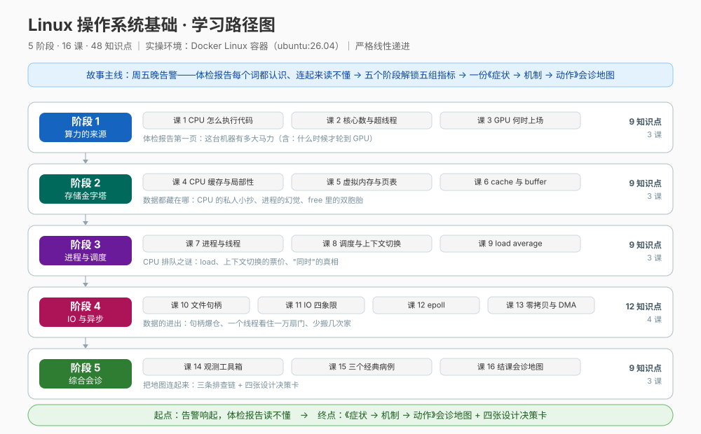

# 01-学习路径总览 · Linux 操作系统基础

> 5 阶段 / 16 课 / 48 知识点。实操环境：macOS + Docker Linux 容器（ubuntu:26.04）。

## 一、这门课解决什么问题

**画像**：入门水平（用过基本命令，机制说不清）；三轨并重——理解概念 + 动手实操 + 决策参考；场景侧重后端开发 / 运维排障 / 面试梳理 / 完整系统观。

**用户点名的主题**：CPU、GPU、NPU、缓存（cache）、缓冲（buffer）、CPU 核心数、异步、文件句柄——以及它们背后必须一起懂的：进程线程、调度、虚拟内存、零拷贝、观测工具。

**三轨目标**：

| 轨道 | 学完你能 |
|------|---------|
| 理解概念 | 看到 load / CPU% / buff/cache / fd 数等指标，说清背后是哪个子系统在干什么 |
| 动手实操 | 需要实操的课次在真实 Linux 容器里用 lscpu / free / vmstat / strace / lsof 等亲眼观测机制；课 3 的 GPU / NPU 为理论边界说明 |
| 决策参考 | 回答"线程池开多大 / 同步还是异步 / 要不要零拷贝 / 要不要 GPU 或 NPU"四类设计决策 |

## 二、故事主线

- **主角**：一台跑着 order-service 的 Linux 服务器，与值班工程师"你"
- **冲突**：周五晚告警"接口变慢"——load 38、CPU 100%、buff/cache 占六成内存、打开文件数 8 万，**每个词都认识，连起来读不懂**
- **转折**：每解锁一个子系统，体检报告上就有一组数字从"吓人"变"会读"
- **收束**：一份《症状 → 机制 → 动作》会诊地图 + 四张设计决策卡

## 三、版本基线（核查于 2026-09）

| 项 | 值 |
|----|-----|
| 容器镜像 | ubuntu:26.04 LTS（Resolute Raccoon，2026-04-23 发布） |
| 发行版自带内核 | Linux 7.0（上游 6.20 改号 7.0） |
| 容器内实测内核 | Docker Desktop 的 linuxkit VM 内核（6.x）——**以课 1 实测为准** |
| Docker Engine | 29.4.1（需手动 `open -a Docker` 启动） |
| GPU / NPU | 本机无 GPU / NPU 实操环境（课 3 为概念课；NPU 为理论扩展） |

## 四、阶段总览

| 阶段 | 故事章节 | 课次 | 你将获得 |
|------|---------|------|---------|
| 1 · 算力的来源 | 体检报告第一页：这台机器有多大马力 | 课 1–3 | CPU 怎么执行代码 / 核心数与超线程 / GPU-NPU 分工决策 |
| 2 · 存储金字塔 | 数据都藏在哪：缓存、内存与缓冲 | 课 4–6 | 缓存层级与局部性 / 虚拟内存 / cache-buffer 之辨与 free 解读 |
| 3 · 进程与调度 | CPU 排队之谜：load 与上下文切换 | 课 7–9 | 进程线程 / 调度与切换代价 / load 正确读法 / 并发 vs 并行 |
| 4 · IO 与异步 | 数据的进出：句柄、epoll 与零拷贝 | 课 10–13 | 文件句柄 / 四象限 IO 模型 / epoll 与事件循环 / 零拷贝决策 |
| 5 · 综合会诊 | 把地图连起来：症状 → 机制 → 动作 | 课 14–16 | 观测工具箱 / 三条排查链 / 会诊地图与四张决策卡 |

**阶段依赖**：严格线性递进——阶段 2 依赖阶段 1（缓存是 CPU 的延伸）；阶段 3 依赖阶段 2（切换代价 = 缓存污染 + 页表切换）；阶段 4 依赖阶段 3（异步的地基是进程线程与并发）；阶段 5 汇总全部。

## 五、学习路径图

## 六、每课体例

五幕叙事（起源场景引入 → 认知冲突 → 层层揭示 → 实操验证 → 体系收束）+ 知识点六要素 + 📌 知识点导航 + 📋 命令速查卡 + 课后小测 + 接力提示词。需要实操的课次一律在 Docker Linux 容器内实测；课 3 的 GPU / NPU 部分按本机设备与运行时边界做理论说明，不编造跑分。
