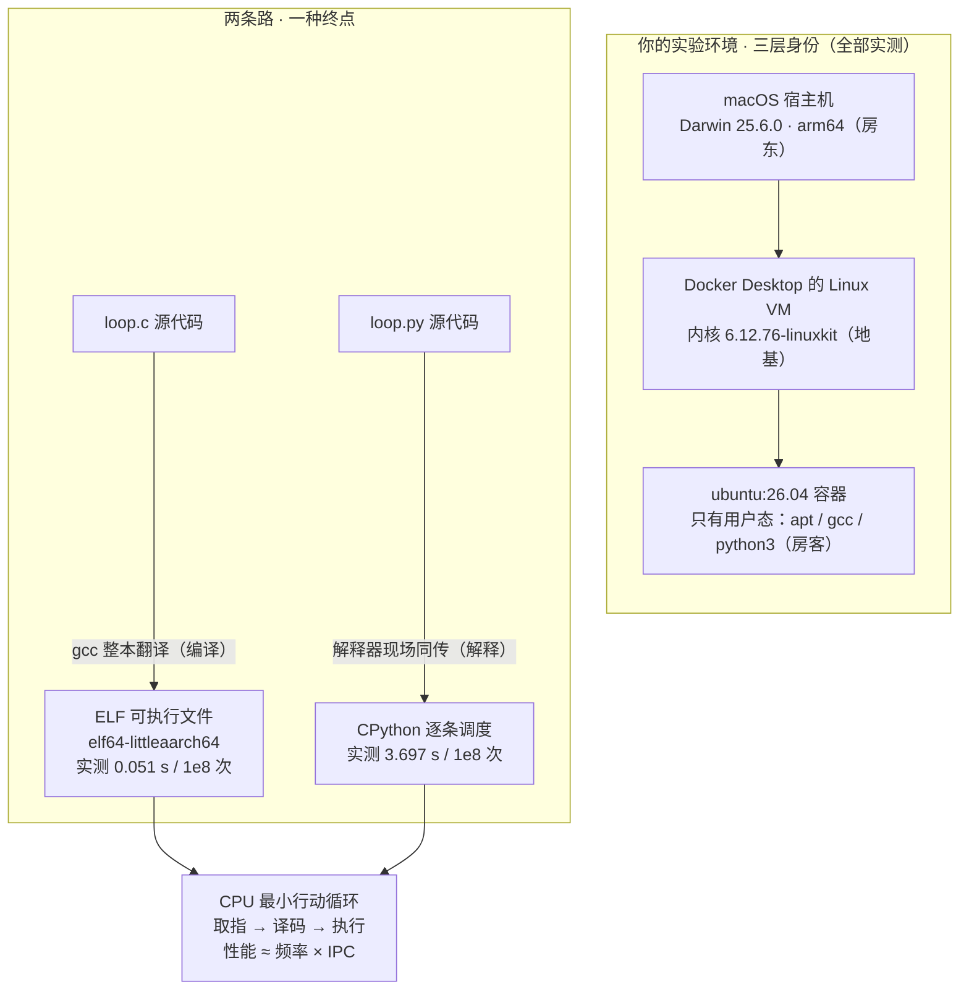

# 课 1 · CPU 是怎么执行你的代码的

> 阶段 1 · 算力的来源 ｜ 实操环境：ubuntu:26.04 容器（Docker Desktop on macOS arm64）｜ 本课实测于 2026-09-10

## 📌 知识点导航

| # | 知识点 | 状态 |
|---|--------|------|
| 1.1 | CPU 的最小行动循环：取指-译码-执行 | ✅ |
| 1.2 | 从源代码到指令：你的代码怎么"上机" | ✅ |
| 1.3 | 实验环境里的"Linux"到底是谁 | ✅ |

## 🎯 本课目标

学完本课你将能：

- 对着一块 CPU 说清它每天在重复什么动作（取指-译码-执行），以及 GHz 到底在数什么
- 说清"编译"与"解释"的差异，并亲手看见自己代码变成的机器指令
- 一次终端实验分辨清楚：macOS、Docker VM、Ubuntu 容器三者的"身份"各是谁

---

## 第一幕 🏛️ 起源与场景引入

**先讲一段来历。** 1945 年 6 月 30 日，冯·诺依曼的《EDVAC 报告初稿》分发——这份 101 页的报告第一次系统描述了"**程序和数据一起放在内存里**"的存储程序计算机结构（核查于 2026-09，来源：[Wikipedia: First Draft of a Report on the EDVAC](https://en.wikipedia.org/wiki/First_Draft_of_a_Report_on_the_EDVAC)）。此后几乎所有计算机都长这样，所以这种结构干脆叫"冯·诺依曼结构"。1971 年 11 月，Intel 4004 把一整个 CPU 做进一块芯片——约 2,300 个晶体管、740 kHz 时钟（Intel 博物馆手册另记"初始 108 kHz"，两口径并列不取舍，740 kHz 取的是最大档；核查于 2026-09，来源：[Intel 官方历史：The Intel 4004](https://www.intel.com/content/www/us/en/history/virtual-vault/articles/the-intel-4004.html)）——"微处理器"从此诞生，到今天你手机里的芯片每秒能走数十亿拍。

**再回到故事现场。** 周五晚上 11 点，告警响了：order-service 接口变慢。你登上那台 Linux 服务器，`top` 打开一片红——这就是本课程故事的开场。但这一课我们先**退到最底下那块芯片**：在你按下回车、程序跑起来的那一瞬间，替你干活的 CPU 到底在做一件什么事？

## 第二幕 ❓ 认知冲突

三个问题，你现在多半答不利索：

1. **你写的代码是文字**（`.c`、`.py`），CPU 只认指令——文字是怎么变成"正在执行"的？
2. 同一块 CPU、同一段"累加一亿次"的逻辑，本课实测：**C 版 0.051 秒，Python 版 3.697 秒，差约 72.5 倍**——同一颗芯片，差的 70 多倍去哪了？
3. CPU 主频 3 GHz，意思是"每秒做 30 亿次运算"吗？那为什么你的 Python 一秒连 3000 万次循环都跑不完？

带着这三个问题进第三幕。

## 第三幕 📖 层层揭示

### 知识点 1.1 CPU 的最小行动循环：取指-译码-执行

**一句话定义**：CPU 是一台只会不断重复「**取指（Fetch）→ 译码（Decode）→ 执行（Execute）**」三步循环的机器，它做的每一件事——包括你现在读这行字——都是这个循环跑出来的。

**直觉建立**：把 CPU 想成一个照菜谱做菜的厨师——

| 厨师 | CPU | 作用 |
|------|-----|------|
| 手指指着菜谱第几行 | **PC**（程序计数器） | 记着"下一条指令在哪" |
| 读出那一步 | **取指** | 从内存把指令搬进来 |
| 看懂"切葱花"是什么意思 | **译码** | 控制单元解析这条指令要干嘛 |
| 动手切 | **执行** | ALU（算术逻辑单元）算数 / 读写内存 |
| 手边的几个料碗 | **寄存器** | 存正在加工的少数几个数（最快的存储） |
| 手指挪到下一行（或跳回某行） | **PC 更新** | 顺序 +1，或跳转 |

**类比失效边界**：现代真 CPU 还有流水线、乱序执行、分支预测——相当于"提前备菜、几道菜并行开工"。但它们对外**仍然保持"按顺序执行指令"的行为承诺**。本课先建最小模型；流水线与缓存的代价，课 4 和课 8 会回来找你算账。

**核心原理**：因为程序和数据同在内存（冯·诺依曼结构），CPU 上电后 PC 指向入口地址，循环开始——这个循环每秒跑几十亿圈。**GHz 数的是节拍**：1 GHz = 每秒 10 亿个时钟节拍。而现代 CPU 一个节拍常常执行多条指令（这个效率叫 **IPC**，每周期指令数），所以：

> **性能 ≈ 频率 × IPC ×（缓存 / 架构等一堆因素）——GHz 高 ≠ 你的程序一定快。**

**示例演示**：本课实验二会把你写的 C 程序拆开给你看——那条 `b 7d8`（跳转指令）就是"手指跳回循环开头"，`add` 就是 ALU 在累加。

**常见误区**：
1. ❌ "3 GHz = 每秒 30 亿次我的代码"——它数的是节拍，一条指令往往要多个节拍，一个节拍也可能并行多条指令。
2. ❌ "CPU 能直接跑 Python"——CPU 只执行当前架构的机器指令，Python 语句必须先被翻译（见 1.2）。
3. ❌ "寄存器才几十个，太少太低级"——少是刻意的：离 ALU 越近越快，贵就贵在只留最热的几个。

**一句话记住**：**CPU = 永不停止的"取指-译码-执行"循环；GHz 是节拍，不是进度条。**

### 知识点 1.2 从源代码到指令：你的代码怎么"上机"

**一句话定义**：**编译型**语言在运行前把源代码整本翻译成机器指令、存成可执行文件；**解释型**语言运行时由解释器一边读源码、一边现场调用等价的机器指令。

**直觉建立**：**出版书 vs 同声传译**。C 编译 = 把中文书提前整本翻成英文印刷成册（可执行文件），机器直接读；Python 解释 = 机器旁边坐一个同传（解释器 CPython），它听中文、说英文——机器依然只认英文（指令），只是每句话都要经过活人转一遍。**类比失效边界**：带 JIT 的运行时（Java HotSpot、PyPy）会把热段落"现场印刷成册"，介于两者之间；也别把"解释型慢 70 倍"当普遍规律——数值循环差距大，IO 密集任务差距小得多。

**核心原理**：
1. `gcc` 把 `loop.c` 翻译成 **aarch64 架构的机器指令**，装进 ELF 文件（实验二实测：`file format elf64-littleaarch64`）；加载器再把指令搬进内存、PC 指向入口（**谁负责加载？进程的故事，课 7 揭晓**——伏笔）。
2. **指令集架构（ISA）是指令的"方言"**：arm64 和 x86_64 是两套方言，为一种方言编译的二进制，另一种听不懂。
3. Docker 的**多架构镜像**就是同一个镜像名背后的不同"方言版"：本机 arm64 会自动拉 arm64 版（实验一实测 `aarch64`），指定 `--platform linux/amd64` 就拉 x86_64 版。

**示例演示**：本课实验三实测——同一个一亿次累加，C（已翻译）0.051 秒，Python（同传中）3.697 秒；以及 arm 宿主机上跑 x86_64 容器输出 `x86_64`（macOS 用 Rosetta 现场转译方言，能跑，但有性能税）。

**常见误区**：
1. ❌ "容器镜像里带了一个 CPU/内核"——镜像只带用户态程序；指令只要求"方言"匹配，内核是共享的（1.3 实测打脸现场）。
2. ❌ "解释型语言不需要编译"——CPython 也编译：源码 → 字节码，只是字节码是给解释器看的，不是给 CPU 看的。
3. ❌ "x86 二进制在 arm 上绝对跑不了"——有 Rosetta / QEMU 转译这条路，代价是慢 + 兼容边界。

**一句话记住**：**CPU 只认当前架构的机器指令；编译是提前出版，解释是现场同传。**

### 知识点 1.3 实验环境里的"Linux"到底是谁

**一句话定义**：你在容器里看到的"Linux"= **ubuntu:26.04 镜像的用户态**（apt / gcc / python3）+ **Docker Desktop 那台 Linux 虚拟机的内核**（本机实测：`6.12.76-linuxkit`）——镜像根本不带内核。

**直觉建立**：**换房客，不换地基**。容器只替换"住户"（整个用户态：ls、gcc、apt），而内核是 Docker VM 这块"地基"，所有容器共用；macOS（Darwin 25.6.0）在更外面当房东，提供硬件和虚拟化。**类比失效边界**：这正是 docker 课讲过的容器隔离模型——"共享内核 + 独立用户态"；真虚拟机则是连地基都各挖各的，所以更重也更隔离。

**核心原理**：三层身份，一层比一层底——

| 层 | 是谁 | 用什么命令看到它 |
|----|------|-----------------|
| ③ 容器用户态 | Ubuntu 26.04 的工具与库 | `cat /etc/os-release` → `Ubuntu 26.04.1 LTS`（实测） |
| ② 内核 | Docker Desktop 的 Linux VM | `uname -r` → `6.12.76-linuxkit`（实测） |
| ① 宿主机 | macOS（Darwin） | macOS 终端里 `uname -a` → `Darwin … 25.6.0 … arm64`（实测） |

镜像打包的是第 ③ 层；第 ② 层由 Docker Desktop 在 macOS 虚拟化框架里开的那台 Linux VM 提供；容器里的一切系统调用，最终都由这台 VM 的内核完成。本节篇幅占全课约三分之一——它是一次性的"环境定位"，定位完就不再展开。

**示例演示**：实验一实测三连——同一个终端里，宿主机自报 Darwin、容器自报 linuxkit 内核 + Ubuntu 用户态；`nproc` 报 11、`/proc/cpuinfo` 数出 11 个 processor——这是 VM 暴露给容器的 vCPU（宿主机核数与 VM 分配的关系，**课 2 展开**——伏笔）。

**常见误区**：
1. ❌ "容器里 `uname -r` 显示的是 Ubuntu 的内核"——实测 `6.12.76-linuxkit`，不是 Ubuntu 的 7.0。
2. ❌ "ubuntu:26.04 镜像 = 整个 Ubuntu 操作系统"——它 ≈ **不带内核的操作系统**（用户态全家桶）。
3. ❌ "我在 Mac 上跑 Linux，用的是 Mac 的内核"——用的是 Linux（linuxkit VM 的）内核，macOS 只当房东。

**一句话记住**：**镜像带房客不带地基：容器里的内核，永远是宿主 VM 的内核。**

## 第四幕 🔬 实操验证

> 全部命令在本机 Docker Desktop（Engine 29.4.1）的 **ubuntu:26.04** 容器实测，实测日期 2026-09-10。复现前先启动 Docker Desktop（`open -a Docker`）。

### 实验一：给容器发身份证（回扣 1.3）

```bash
docker run --rm ubuntu:26.04 bash -c '
grep -E "PRETTY_NAME|VERSION_ID" /etc/os-release
uname -a
uname -m
uname -r
nproc
grep -c ^processor /proc/cpuinfo'
```

实测输出（节选）：

```text
PRETTY_NAME="Ubuntu 26.04.1 LTS"
VERSION_ID="26.04"
Linux 050b71134de0 6.12.76-linuxkit #1 SMP Fri Apr 17 14:56:37 UTC 2026 aarch64 GNU/Linux
aarch64
6.12.76-linuxkit
11
11
```

**读出三层身份**：用户态自报 Ubuntu 26.04.1 LTS；内核自报 6.12.76-**linuxkit**（Docker VM 的，不是 Ubuntu 的 7.0）；架构 aarch64（本机是 Apple Silicon，Docker 自动选了 arm64 版镜像）。`nproc` 与 cpuinfo 都数出 **11 个 processor**——这是 VM 暴露给容器的 vCPU，宿主机核数怎么映射到这 11 个，课 2 接着算。

### 实验二：亲眼看见指令（回扣 1.1、1.2）

```bash
docker run --rm ubuntu:26.04 bash -c '
apt-get update -qq >/dev/null && DEBIAN_FRONTEND=noninteractive apt-get install -y -qq gcc libc6-dev >/dev/null
cat > /tmp/loop.c <<"EOF"
#include <stdio.h>
int main(void){ long s=0; for(long i=0;i<100000000;i++) s+=i; printf("%ld\n", s); return 0; }
EOF
gcc -O0 -o /tmp/loop /tmp/loop.c
objdump -f /tmp/loop | head -8
objdump -d /tmp/loop | sed -n "/<main>:/,+13p"'
```

实测输出（节选）：

```text
/tmp/loop:     file format elf64-littleaarch64
architecture: aarch64, flags 0x00000150:

00000000000007a8 <main>:
 7a8:	a9be7bfd 	stp	x29, x30, [sp, #-32]!
 7ac:	910003fd 	mov	x29, sp
 7b0:	f9000bff 	str	xzr, [sp, #16]
 7b4:	f9000fff 	str	xzr, [sp, #24]
 7b8:	14000008 	b	7d8 <main+0x30>
 7bc:	f9400be1 	ldr	x1, [sp, #16]
 7c0:	f9400fe0 	ldr	x0, [sp, #24]
 7c4:	8b000020 	add	x0, x1, x0
 7c8:	f9000be0 	str	x0, [sp, #16]
 7cc:	f9400fe0 	ldr	x0, [sp, #24]
 7d0:	91000400 	add	x0, x0, #0x1
 7d4:	f9000fe0 	str	x0, [sp, #24]
 7d8:	f9400fe1 	ldr	x1, [sp, #24]
```

**这就是你的源代码的样子**：`str xzr`（把 0 放进料碗 = 初始化 s）、`add x0, x1, x0`（ALU 累加）、`add x0, x0, #0x1`（i+1）、最关键的那条 **`b 7d8`——跳回循环开头**，正是 1.1 里"手指跳回菜谱某一行"。左侧一列（`7a8`、`7bc`…）是指令的内存地址——PC 逐条指着它们往下走。

### 实验三：同题异构赛跑（回扣 1.2）

同一个"累加 1 亿次"，编译版 vs 解释版（同一容器内实测）：

```bash
time /tmp/loop                 # C 版
time python3 -c "
s=0
for i in range(100000000):
    s+=i
print(s)"                      # Python 版
```

实测输出：

```text
4999999950000000
real	0m0.051s
user	0m0.051s
sys	 0m0.000s

4999999950000000
real	0m3.697s
user	0m3.689s
sys	 0m0.007s
```

结果完全相同（`4999999950000000`），耗时 **0.051 s vs 3.697 s，约 72.5 倍**（3.697 ÷ 0.051 = 72.49）。回扣第二幕的冲突 2：差的 70 多倍不在 CPU（同一块），而在**翻译方式**——C 版 CPU 直接执行指令；Python 版每个循环都要经过解释器"同传"（还有字节码调度、对象装箱等开销）。也回扣冲突 3：这块 CPU 只用 0.051 秒就执行完了 1 亿次循环、约 7 亿条指令——GHz 数的是节拍，节奏快不等于"每拍都在做你的事"。

### 实验四（彩蛋）：arm 机器跑 x86_64 容器

```bash
docker run --rm --platform linux/amd64 ubuntu:26.04 uname -m
```

实测输出：`x86_64`——同一个 `ubuntu:26.04` 名字背后藏着不同"方言版"，macOS **默认**用 Rosetta 现场转译（旧版 Docker Desktop 走 QEMU），能跑但有性能税。1.2 的"方言"落了地。

### 🐞 实测小坑实录

第一次装 `gcc` 后编译直接报错：

```text
loop.c:1:10: fatal error: stdio.h: No such file or directory
```

原因：ubuntu 精简镜像里的 `gcc` 不带 C 库头文件，补 `libc6-dev` 即可（实验二命令已含）。**"报错原文"本身就是环境知识**——这正是后面课 15 排查链的日常。

## 第五幕 🗺️ 体系收束

把本课放进全局地图：

- **本课讲了**：芯片的地基动作（1.1）→ 代码变成指令的两条路（1.2）→ 你实验环境的三层身份（1.3）。它们对应体检报告最底层的三个问题：谁在干活、干的是什么、我登上的这台机器到底是谁。
- **埋了两个伏笔**：① 容器看见 11 个 processor——**宿主核数、VM 分配、超线程、NUMA 的口径游戏，课 2《核心数与超线程》展开**；② "谁把指令搬进内存、给 PC 指了入口"——**进程的登场，课 7《进程与线程》揭晓**。
- **下一课预告**：你已经知道"一个 CPU 核在循环"。那 11 个核为什么经常只有 1 个在忙？16 核为什么从来不是 16 倍快？

## 🐞 常见误区（本课合集）

1. **GHz 高 = 程序快**：频率 × IPC × 缓存/架构共同决定；M 系芯片频率不高却常更快。
2. **容器里的内核是镜像的**：实测 `6.12.76-linuxkit` vs 镜像发行版的 7.0——镜像不带内核。
3. **解释型 = 没有编译**：CPython 有编译（→字节码），只是终点不是 CPU 指令。
4. **"3 GHz = 30 亿次运算"**：节拍 ≠ 你代码的进度；一条指令可能多拍，一拍也可能多条指令。

## 🗺 一图总结



## 📋 命令速查卡

| 命令 | 干什么 | 坑 |
|------|--------|-----|
| `uname -a` / `uname -m` / `uname -r` | 看"我现在是谁"：全量 / 架构 / **内核版本** | 容器里 `-r` 是宿 VM 的内核，不是镜像发行版的 |
| `cat /etc/os-release` | 看发行版身份（用户态） | 和 `uname -r` 是两层身份，不矛盾 |
| `nproc` | 逻辑 CPU 个数 | 容器里看到的是 VM 分配的（cgroup 限额另算，课 2） |
| `head /proc/cpuinfo`；`grep -c ^processor /proc/cpuinfo` | 逐个看 CPU / 数个数 | ARM 机器没有 `model name` 字段（本机实测如此） |
| `gcc -O0 -o loop loop.c` | 编译（0 优化，教学友好） | 精简镜像须先 `apt install gcc libc6-dev`，否则 `stdio.h: No such file` |
| `time ./loop` | 计时 | `real` 是墙钟；`user+sys` 才接近 CPU 真实消耗（课 8 细讲） |
| `objdump -f` / `objdump -d` | 看目标架构 / 反汇编看指令 | 属 binutils，装 gcc 时已带上 |
| `docker run --platform linux/amd64 …` | 跨架构跑镜像 | macOS 默认 Rosetta 转译（旧版走 QEMU），有性能税 |

## 📚 官方文档

- [uname(2) — Linux man-pages](https://man7.org/linux/man-pages/man2/uname.2.html)（来自课程索引 `web-index/man7.org/index.md`）：内核身份的系统调用与字段定义
- [Linux man-pages 项目总入口](https://man7.org/linux/man-pages/index.html)：本课程全程的权威手册来源
- 起源事实核查来源：[Wikipedia: First Draft of a Report on the EDVAC](https://en.wikipedia.org/wiki/First_Draft_of_a_Report_on_the_EDVAC)（1945-06-30 分发，101 页，存储程序）；[Intel 官方历史：The Intel 4004](https://www.intel.com/content/www/us/en/history/virtual-vault/articles/the-intel-4004.html)（1971-11 量产，Busicom 合同起源）

## 课后小测

**Q1.** 同事说："我把服务从 2.4 GHz 的机器迁到 3.6 GHz，快了 50%，可见 GHz 就是性能。"这句话哪里不严谨？

<details><summary>答案</summary>

迁移往往**同时换了架构、核心数、缓存**等多个变量，把提速归因于单一频率是错误归因；且 性能 ≈ 频率 × IPC × 缓存/架构，频率只是其中一个因子。要验证单变量，应控制其余条件不变（或用本课的计时法在同一台机器上对比）。
</details>

**Q2.** 容器里 `cat /etc/os-release` 显示 `Ubuntu 26.04.1 LTS`，`uname -r` 显示 `6.12.76-linuxkit`——这两个输出矛盾吗？

<details><summary>答案</summary>

不矛盾，它们报告的是**两层身份**：`os-release` 是发行版（用户态）的身份，来自镜像；`uname -r` 是内核的身份，来自 Docker Desktop 的 Linux VM。镜像不带内核——容器里的系统调用都由宿 VM 的内核处理。
</details>

**Q3.** 同一份 Python 源码在 arm64 和 x86_64 上都能跑；但 x86_64 上编译的 C 程序拷到 arm64 就跑不了。为什么？

<details><summary>答案</summary>

C 编译产物是**特定指令集架构的机器指令**（方言不通用）；Python 源码不直接给 CPU——各架构各有自己的解释器（翻译官），由解释器现场翻译执行。所以"可移植"的是源码 + 对应架构的解释器，不是已编译的指令。
</details>

---

## 🚀 下一批接力提示词

> 学完本课后，**复制下面这段文字发给 AI**，即可无缝进入下一批（无需重新描述上下文）：

```
继续学 Linux 操作系统基础。我的学习档案在 operating-system/00-学习档案.md，
刚学完阶段 1 课 1《CPU 是怎么执行你的代码的》知识点 1.1、1.2、1.3，
Docker Desktop 已启动，请按大纲继续讲解课 2《核心数与超线程：为什么 16 核不是 16 倍快》
（2.1 物理核、逻辑核与超线程 / 2.2 SMP 与 NUMA / 2.3 并行度上限：Amdahl 直觉）。
```

## 🧭 课程导航

| | 链接 |
|---|---|
| ⬅️ 上一课 | （本课程第一课） |
| ➡️ 下一课 | [课 2《核心数与超线程：为什么 16 核不是 16 倍快》](lesson-02-核心数与超线程为什么16核不是16倍快.md) |
| 📖 返回目录 | [02-课程目录](../../../02-课程目录.md) |
