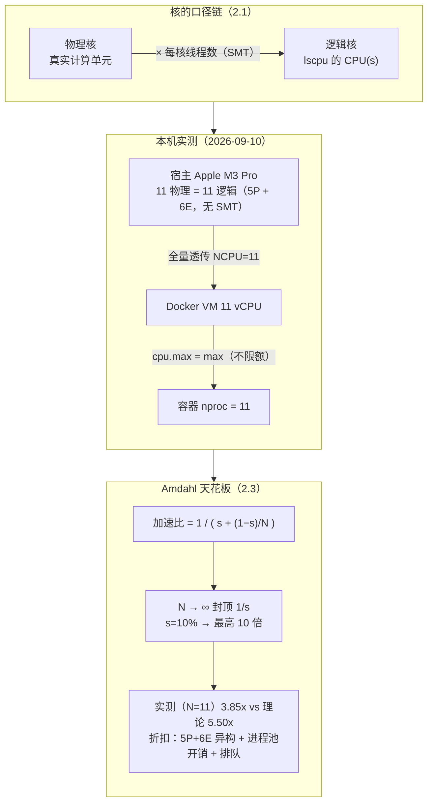

# 课 2 · 核心数与超线程：为什么 16 核不是 16 倍快

> 阶段 1 · 算力的来源 ｜ 实操环境：ubuntu:26.04 容器（Docker Desktop on macOS arm64）｜ 本课实测于 2026-09-10

## 📌 知识点导航

| # | 知识点 | 状态 |
|---|--------|------|
| 2.1 | 物理核、逻辑核与超线程 | ✅ |
| 2.2 | 多核怎么共享内存：SMP 与 NUMA | ✅ |
| 2.3 | 并行度上限：Amdahl 定律直觉 | ✅ |

## 🎯 本课目标

学完本课你将能：

- 用 `lscpu` / `nproc` 读懂核数的各种口径（物理核 / 逻辑核 / 每核线程数），不再被"16 核"三个字唬住
- 解释超线程什么时候有用（约 +30% 封顶）、什么时候白搭，以及 Apple Silicon 为什么干脆砍掉了它
- 用 Amdahl 定律直觉估算并行加速的上限——并亲眼实测一条"加速比递减曲线"

---

## 第一幕 🏛️ 起源与场景引入

**先讲一段来历。** 1967 年 4 月，Gene Amdahl（IBM System/360 的主设计师）在 AFIPS 春季联合计算机会议上发表了一篇只有 3 页的短文《Validity of the Single Processor Approach…》（AFIPS Conf. Proc. vol. 30, pp. 483–485，核查于 2026-09）。当时并行计算的乐观派相信"处理器堆上去就能无限加速"，Amdahl 泼了一盆冷水：**程序里总有串行部分，它决定了加速的天花板**。这个论断后来被称为 Amdahl 定律——60 年后，它仍然是你判断"加核到底有没有用"的第一把尺子。

**再回到故事现场。** 还是那台周五晚告警的服务器。你盯着 `top`：机器明明有一排 CPU，busy 的却总是那一两个；运维说"那就加机器吧"，你脱口而出"加核就能快吗？"——然后发现，你连"这台机器到底有几个核"都说不利索。

## 第二幕 ❓ 认知冲突

1. **课 1 遗留之谜**：容器里 `nproc` 报 **11**——这 11 个是从哪来的？宿主机到底几个核？VM 抽成了吗？
2. 本课将实测：11 个核跑并行任务，**加速比只有 3.85 倍**，理论却说要 5.50 倍；开 16 个进程反而比 11 个更慢——多出来的核都去哪了？
3. 服务器广告常写"32 核 64 线程"——**超线程"1 变 2"是性能翻倍吗**？那 Apple Silicon 为什么干脆没有它？

## 第三幕 📖 层层揭示

### 知识点 2.1 物理核、逻辑核与超线程

**一句话定义**：物理核是硅片上真实存在的计算单元；**超线程（SMT，同步多线程）让一个物理核伺服两套"架构状态"（寄存器组等），于是操作系统看见两个逻辑核**——它不是复制了一个核，只是让执行单元在 A 线程堵车时替 B 线程干活。

**直觉建立**：一条流水线上的工人（执行单元）。SMT 前工人只接一张工单，工单里常有"等料"的空隙（cache miss、等分支结果）；SMT 后流水线上**同时挂两张工单**，A 等料时工人立刻做 B 的活——空隙被填上了。**类比失效边界**：两张工单**抢同一批机器和料口**（执行单元、缓存），所以 SMT 的上限远不是"翻倍"——Intel 自己的口径也只是"最多 +30%"。

**核心原理**：
1. **口径链**：`逻辑核数 = 物理核数 × 每核线程数`。`lscpu` 的字段就是对这条链的展开：`CPU(s)`（逻辑核）= `Socket(s) × Core(s) per socket × Thread(s) per core`。读数先看口径，别只看最大的那个数。
2. **SMT 的收益取决于"堵车程度"**：线程等内存、等分支的空隙多（IO 交错、cache miss 频繁），SMT 就有料可填；线程是纯数值重活、单线程就吃满了执行单元，SMT 几乎白搭，甚至因缓存争用**变慢**。Intel 官方期刊（Technology Journal, 2002）对 Xeon MP 服务器负载的实测口径是"**最高提升 30%**"，现实里常见 10%–25%（核查于 2026-09，来源：[Intel Technology Journal 2002 vol.6 iss.1](https://www.intel.com/content/dam/www/public/us/en/documents/research/2002-vol06-iss-1-intel-technology-journal.pdf)）。
3. **Apple Silicon 干脆没有 SMT**：本机实测（见实验一）`physicalcpu = logicalcpu = 11`、容器里 `Thread(s) per core: 1`。苹果的取舍是：用很宽的核心把**单线程 IPC** 堆高，而不是用 SMT 填空隙——省下的复杂度和功耗换成了能效比（公开资料一致，核查于 2026-09；设计动机属厂商评论，⏳ 置信度：中）。
4. **容器看到的是全量透传**：本机实测宿主 11 核 → Docker VM `NCPU=11` → 容器 `nproc=11`，且 `cpu.max = max`（cgroup 不限额）。**课 1 的"11 之谜"就此解开：不是 VM 打折，是宿主机本来就有 11 个核**（5 性能核 + 6 能效核，无 SMT）。若 `docker run --cpus=2` 限额，容器里看到的行为就不同——那是 cgroup 的戏法（docker 课已讲，回指）。

**示例演示**：实验一实测三连——宿主机 `sysctl`（11 物理 = 11 逻辑，P 5 + E 6）、容器 `lscpu`（11 CPU，每核 1 线程）、`cpu.max`（不限额）。彩蛋见"坑实录"：amd64 用户态 + ARM 内核 flags 的"嵌合体"输出，证明 `lscpu` 读的是**内核**的 `/proc/cpuinfo`，与容器用户态架构无关。

**常见误区**：
1. ❌ "CPU(s): 64 就是 64 个物理核"——它可能是 32 核 × 2 线程，看口径链。
2. ❌ "超线程 = 性能翻倍"——上限约 +30%，纯重活场景接近 0 甚至负。
3. ❌ "容器里的核数是 Docker 分配剩下的"——默认全量透传；限额是显式配置（`--cpus`）的结果。

**一句话记住**：**先问"几个物理核、每核几线程"，再谈性能；SMT 是填空隙的，不是变核的。**

### 知识点 2.2 多核怎么共享内存：SMP 与 NUMA

**一句话定义**：**SMP**（对称多处理）= 所有核对等地共享同一份内存；当核多到一条内存总线喂不饱时，架构改成 **NUMA**（非一致内存访问）——每颗 CPU 挂自己"本地"的内存，访问别家的"远端"内存要慢数倍。

**直觉建立**：SMP = 一层楼所有工位共用一部中央货梯（一条内存总线）——人少时无所谓，人多时货梯排队。NUMA = 拆成两栋楼、各有各的货梯：**在自家楼里拿料快（本地访问），去对面楼拿料慢（远端访问；倍数由硬件决定，双路服务器上可实测）**。**类比失效边界**：NUMA 的代价不止"慢一点"——调度器还要尽量把线程和它的数据放同一栋楼（亲和性），否则远端访问会成倍放大。

**核心原理**：
1. **为什么服务器常配"两颗 CPU"**：单颗 CPU 的核数、内存通道都有物理上限；双路（2 颗）扩核扩内存最省事，代价是引入 NUMA——这就是为什么数据库/中间件的运维手册总在念叨 NUMA 亲和性。
2. **看 NUMA 的口径**：`lscpu` 的 `NUMA node(s)` 与 `Socket(s)`。**注意：字段会随架构变**——本机 ARM 容器实测 `Socket(s): -`（ARM 服务器语境的 socket 概念在 Apple SoC 上不适用）、`Core(s) per cluster: 11`、连 NUMA 行都没打印出来（单节点）。**数字随口径走，这是读机器的纪律。**
3. **本机诚实边界**：Docker VM 是单路、单 NUMA 节点，本课**测不到**真实的 NUMA 远端访问——概念记牢，实操留到有双路服务器的场景（云上 c5/c6 实例可复现）。

**示例演示**：实验一的 `lscpu` 输出里逐字段指认——哪些是"真实硬件"，哪些只是"内核愿意告诉你什么"（`Model name: -` 就是 ARM 内核没报型号）。

**常见误区**：
1. ❌ "NUMA 离我很远"——双路服务器是后端标配；PG 课的 `shared_buffers` 与 NUMA 的恩怨就是现实案例（回指 PG 课）。
2. ❌ "逻辑核 = 平等的算力"——本机 11 核里 5 个性能核（P）+ 6 个能效核（E）**不等速**，2.3 的实测会立刻打脸"11 份同等算力"。
3. ❌ "Socket(s) 显示 - 就是机器没有 CPU"——口径差异，不是故障。

**一句话记住**：**SMP 是一部货梯大家挤，NUMA 是各栋楼各有货梯——本地快，远端贵。**

### 知识点 2.3 并行度上限：Amdahl 定律直觉

**一句话定义**：程序并行加速的上限由**串行部分占比 s** 决定：`加速比 = 1 / ( s + (1−s)/N )`；就算核数 N→∞，加速比也**封顶在 1/s**。

**直觉建立**：搬 100 箱货，其中 10 箱必须由老板亲手清点才能发车（串行），90 箱可以雇人搬（并行）。雇 1 个人干 90 箱 → 老板全程等；雇 90 个人 → 搬货 1 分钟完事，但**老板清点 10 箱的那段谁都替不了**——人再多，总时间被"清点"钉死。**类比失效边界**：Amdahl 假设"并行部分可以完美均分"，现实还有第四种折扣——**核和核不等速**（本机 5P+6E）、加人本身有成本（进程创建、调度），所以实测永远比公式悲观一点。

**核心原理**：
1. **算给你看**：串行占 5%（s=0.05）→ 上限 1/0.05 = **20 倍**，跟核数无关；要吃到 10 倍加速，需要 1/(0.05+0.95/N)=10 → N=19 个核。**串行占比从 10% 降到 5%，天花板直接从 10 倍翻到 20 倍——优化串行段比加核便宜得多。**
2. **实测会落在理论之下**，三个折扣来源：① 串行段之外的隐性同步（进程池创建、结果回收）；② **核不均匀**（5P+6E，worker 摊到 E 核上整组等最慢的）；③ **N 超过核数**（16 个 worker 挤 11 个核 → 排队 + 上下文切换——课 8 的伏笔）。
3. **这是"线程池开多大"的第一性依据之一**：纯并行任务，线程数贴着核数走；有串行段的真服务，加核收益先看 s——完整决策卡课 16 收口（伏笔）。

**示例演示**：实验二实测——串行 10% + 并行 90% 的程序在 1/2/4/8/11/16 进程下的加速比曲线：N=4 时 3.02x（理论 3.08x，几乎完美贴合），N=11 时 3.85x（理论 5.50x），**N=16 时 3.56x 不升反降**。理论天花板 10 倍，实测 3.85 倍——折扣全部现形。

**常见误区**：
1. ❌ "核多就行"——s=10% 时 100 个核的理论上限也只有 10 倍。
2. ❌ "实测没到理论 = 测错了"——差距本身就是知识（异构核、调度开销、排队）。
3. ❌ "Amdahl 太悲观了"——它假设问题规模不变；数据量随机器变大时请去看 Gustafson 定律（本课一句带过，不展开）。

**一句话记住**：**加速比封顶在 1/s——想快，先削串行段，再谈加核。**

## 第四幕 🔬 实操验证

> 全部命令在本机 Docker Desktop（Engine 29.4.1）的 **ubuntu:26.04** 容器实测，实测日期 2026-09-10。⚠️ 本轮踩过一个真实的实验坑（见"坑实录"）：**不带 `--platform` 时跑到了 amd64 转译镜像上**——对照实验必须钉死平台。

### 实验一：拓扑三问（回扣 2.1、2.2）

**宿主机（macOS）**：

```bash
sysctl -n hw.physicalcpu hw.logicalcpu
sysctl -n hw.perflevel0.physicalcpu   # 性能核 P
sysctl -n hw.perflevel1.physicalcpu   # 能效核 E
sysctl -n machdep.cpu.brand_string
docker info --format '{{.NCPU}}'      # Docker VM 的核数
```

实测输出：

```text
11
11
5
6
Apple M3 Pro
11
```

**容器（arm64）**：

```bash
docker run --rm --platform linux/arm64 ubuntu:26.04 bash -c '
lscpu | grep -E "Architecture|^CPU\(s\)|On-line|Model name|Thread|Core|Socket|NUMA"
nproc
cat /sys/fs/cgroup/cpu.max'
```

实测输出（节选）：

```text
Architecture:                            aarch64
CPU(s):                                  11
On-line CPU(s) list:                     0-10
Model name:                              -
Thread(s) per core:                      1
Core(s) per cluster:                     11
Socket(s):                               -
11
max 100000
```

**读数三连**：① 宿主机 11 物理 = 11 逻辑（每核 1 线程，**无 SMT**），且 5 + 6 = 11 拆成性能核与能效核——**"11 之谜"的答案：宿主机本来就 11 核，VM 全量透传**（`NCPU=11`），cgroup `cpu.max = max` 不限额，所以容器 `nproc=11`。② `Thread(s) per core: 1` 是 Apple Silicon 无超线程的实测铁证。③ `Socket(s): -`、`Model name: -`——lscpu 字段随架构与内核变化，**读数字先看口径**。

### 实验二：Amdahl 赛跑（回扣 2.3）

程序设计：总工作量中**串行段占 10%**（永远 1 个人干），并行段占 90%（N 人平分），用 `multiprocessing` 实测加速比：

```bash
docker run --rm --platform linux/arm64 ubuntu:26.04 bash -c '
apt-get update -qq >/dev/null && DEBIAN_FRONTEND=noninteractive apt-get install -y -qq python3 >/dev/null
cat > /tmp/amdahl.py <<"EOF"
import time, multiprocessing as mp

SERIAL_WORK = 6_000_000      # 串行段：恒为 1 人干
PARALLEL_WORK = 54_000_000   # 并行段：N 人平分（串:并 = 1:9）

def burn(n):
    s = 0
    for i in range(n):
        s += i
    return s

def run(np):
    t0 = time.perf_counter()
    burn(SERIAL_WORK)                    # 串行段
    with mp.Pool(np) as p:
        p.map(burn, [PARALLEL_WORK // np] * np)
    return time.perf_counter() - t0

if __name__ == "__main__":
    base = run(1)
    print(f"N= 1 : {base:.3f}s  加速比 1.00x")
    for np in (2, 4, 8, 11, 16):
        t = run(np)
        theo = 1 / (0.1 + 0.9 / np)
        print(f"N={np:2d} : {t:.3f}s  加速比 {base/t:5.2f}x   理论上限 {theo:5.2f}x")
EOF
python3 /tmp/amdahl.py'
```

实测输出（**arm64 原生，2026-09-10**）：

```text
N= 1 : 0.970s  加速比 1.00x
N= 2 : 0.590s  加速比  1.64x   理论上限  1.82x
N= 4 : 0.321s  加速比  3.02x   理论上限  3.08x
N= 8 : 0.283s  加速比  3.43x   理论上限  4.71x
N=11 : 0.252s  加速比  3.85x   理论上限  5.50x
N=16 : 0.273s  加速比  3.56x   理论上限  6.40x
```

**逐段读曲线**：
1. **N=2–4：贴着理论走**（3.02 vs 3.08）——worker 少，都摊在快的 P 核上，Amdahl 公式非常准。
2. **N=8–11：开始掉队**（3.43/3.85 vs 4.71/5.50）——worker 摊进 6 个能效核（E 核慢），`Pool` 要等最慢的那个；再加进程创建/回收的隐性同步开销。
3. **N=16：不升反降**（3.56 < 3.85）——16 个 worker 挤 11 个核，**排队 + 上下文切换开始吃时间**。这就是 2.3 的第 ③ 个折扣现形，课 8 会把它算成可观测的数字（伏笔）。
4. 结论回扣冲突 2：11 个核只跑出 3.85 倍——**串行段钉住天花板（理论 5.5）+ 核不均匀 + 排队**，三重折扣全部实测现形。

### 彩蛋：Rosetta 转译税（同一段代码，只换平台）

```bash
# arm64 原生（上面已跑）：real 0m3.408s
docker run --rm --platform linux/arm64 ubuntu:26.04 ...   # 1e8 次 Python 累加
# amd64 转译：
docker run --rm --platform linux/amd64 ubuntu:26.04 ...   # 同一段代码
```

实测：arm64 原生 **3.408 s** vs amd64（Rosetta 转译）**7.129 s** → **约 2.09 倍税**（单次实测，未做多轮平均；转译税大小随负载而变，不要背倍数）。

### 🐞 实测坑实录（本课最有价值的实验事故）

1. **平台污染**：第一轮赛跑忘了带 `--platform`，本地 tag 恰好指向上一轮拉过的 **amd64 变体**，整场赛跑在 Rosetta 转译下进行——基线 N=1 是 1.863s，与干净环境（0.970s）差近一倍，**整组数据废弃重跑**。教训：**对照实验必须钉死平台、先测基线**。
2. **嵌合体 lscpu**：amd64 容器里 `lscpu` 显示 `Architecture: x86_64`，但 `Flags` 一栏全是 ARM 指令集（`fp asimd aes...`）——因为 **lscpu 读的是内核的 `/proc/cpuinfo`**（ARM VM 的），跟容器用户态架构无关。看到矛盾输出，先问"这两行各自是谁报的"。
3. **待查异常**：arm64 那轮 1e8 循环的 `user 10.302s` 异常大于 `real 3.408s`（单线程不该如此），原因未查明，不影响 `real` 时间的对照结论——记录在案，课 8 学完切换与调度后回来复查。

## 第五幕 🗺️ 体系收束

- **本课讲了**：核的三层口径（2.1）→ 多核共享内存的方式（2.2）→ 并行加速的天花板（2.3）。它们回答体检报告第 1 页的三个追问：这 11 个核是真的吗？它们怎么分内存？加核到底能快多少？
- **课 1 遗留已清**：11 = 宿主真实核数（5P+6E，无 SMT），VM 全量透传，cgroup 不限额。
- **埋了两个伏笔**：① N=16 的"倒挂"是**上下文切换的票价**——课 8 把它算成 vmstat 里可观测的 `cs` 列；② 核堆得再多也绕不开串行段——但有一类活可以换一种**芯片哲学**绕开它：课 3《GPU：什么时候该请它上场》。
- **决策伏笔**：`s` 和核数是"线程池开多大"的两个输入——课 16 决策卡收口。

## 🐞 常见误区（本课合集）

1. **CPU(s) 当物理核数**：口径链 = Socket × Core × Thread，先拆口径再比较。
2. **超线程 = 双倍算力**：上限约 +30%（Intel 官方口径），纯重活接近 0；Apple Silicon 干脆没有。
3. **加核必提速**：串行段封顶 1/s；实测还要再打"异构核 + 调度 + 排队"三重折扣。
4. **容器核数是"分配剩下的"**：默认全量透传，`nproc` = 宿主逻辑核；限额要显式 `--cpus`。
5. **对照实验忘钉平台**：本地 tag 可能指向别的架构变体——`--platform` 必须显式。

## 🗺 一图总结



## 📋 命令速查卡

| 命令 | 干什么 | 坑 |
|------|--------|-----|
| `lscpu` | 一屏读完核口径：CPU(s) / Thread(s) per core / Core / Socket / NUMA | 字段随架构与内核变（ARM 容器 `Socket(s): -`、`Model name: -`）；读的是内核 `/proc/cpuinfo` |
| `nproc` | 逻辑核个数（进程可用并行度起点） | 容器内 = VM 透传数；受 cgroup 限额影响 |
| `sysctl -n hw.physicalcpu` / `hw.logicalcpu` / `hw.perflevel0/1.*` | macOS 宿主：物理/逻辑/性能核/能效核 | 仅 macOS；Linux 上对应 `/proc/cpuinfo` 与 `lscpu` |
| `docker info --format '{{.NCPU}}'` | Docker VM 分给容器的核数 | 与宿主核数可能不等（资源设置可调） |
| `cat /sys/fs/cgroup/cpu.max` | 容器 CPU 配额 | `max 100000` = 不限额；`200000 100000` = 限 2 核（回指 docker 课） |
| `docker run --platform linux/arm64 ...` | **钉死架构** | 不写会用本地 tag 恰好指向的变体——本课实验事故的元凶 |
| Python `multiprocessing.Pool` | 多进程并行（绕开 GIL） | Pool 有创建/回收开销，短任务会吃掉收益 |
| `time ...` | 墙钟计时 | `real` 才是用户体感；`user > real` 的异常要记录待查 |

## 📚 官方文档

- [sched(7) — Linux man-pages](https://man7.org/linux/man-pages/man7/sched.7.html)（来自课程索引 `web-index/man7.org/index.md`）：调度策略与 CPU 亲和性的总览（本课 2.3 的内核视角入口）
- `lscpu(1)` / `nproc(1)` 属 util-linux 上游（无 man7 页），以容器内 `man lscpu` 为准
- 事实核查来源：[Intel Technology Journal 2002（超线程 "up to 30%" 原始出处）](https://www.intel.com/content/dam/www/public/us/en/documents/research/2002-vol06-iss-1-intel-technology-journal.pdf)；Amdahl 原文 G. M. Amdahl, *Validity of the Single Processor Approach…*, Proc. AFIPS Spring Joint Computer Conference, 1967-04-18/20, vol. 30, pp. 483–485（核查于 2026-09）；Apple Silicon 无 SMT（实测 primary + [Ask Different 汇总](https://apple.stackexchange.com/questions/425668/does-the-m1-chip-apple-silicon-use-hyper-threading-a-k-a-simultaneous-multi)，核查于 2026-09）

## 课后小测

**Q1.** 一台服务器的 `lscpu` 显示：`CPU(s): 176`、`Thread(s) per core: 2`、`Core(s) per socket: 44`、`Socket(s): 2`。它有几个**物理**核、几个逻辑核？开了超线程吗？

<details><summary>答案</summary>

物理核 = Socket × Core/socket = 2 × 44 = **88 个**；逻辑核 = 88 × 2 = **176 个**（与 `CPU(s): 176` 自洽）。`Thread(s) per core: 2` 说明**开了超线程（SMT）**。若把 176 当物理核去估容量，会高估一倍。
</details>

**Q2.** 同事把一个纯数值计算的单线程死循环开成两个线程，指望超线程让它快一倍，结果几乎没变。为什么？

<details><summary>答案</summary>

SMT 补的是执行单元的"空隙"（等内存、等分支）。纯数值循环把执行单元已经喂满，两个线程只能**抢同一套执行单元与缓存**，收益趋近 0，还可能因缓存争用变慢。SMT 的甜区是多线程且各自常有等待的负载（如 IO 交错、分支频繁）。
</details>

**Q3.** 程序的串行部分占 5%。理论最大加速比是多少？在 19 核机器上能到多少？

<details><summary>答案</summary>

上限 = 1/s = **20 倍**（N→∞ 也到不了更多）。19 核时：1/(0.05 + 0.95/19) = 1/(0.05+0.05) = **10 倍**——离 20 倍还差一半，加核的边际收益已经很低；想更快先削串行段。
</details>

---

## 🚀 下一批接力提示词

> 学完本课后，**复制下面这段文字发给 AI**，即可无缝进入下一批（无需重新描述上下文）：

```
继续学 Linux 操作系统基础。我的学习档案在 operating-system/00-学习档案.md，
刚学完阶段 1 课 2《核心数与超线程：为什么 16 核不是 16 倍快》知识点 2.1、2.2、2.3，
Docker Desktop 已启动，请按大纲继续讲解课 3《GPU：什么时候该请它上场》
（3.1 两种芯片哲学 / 3.2 什么活适合 GPU，什么活搬过去反而慢 / 3.3 后端服务的 GPU 决策卡）。
```

## 🧭 课程导航

| | 链接 |
|---|---|
| ⬅️ 上一课 | [课 1《CPU 是怎么执行你的代码的》](lesson-01-CPU是怎么执行你的代码的.md) |
| ➡️ 下一课 | [课 3《GPU：什么时候该请它上场》](lesson-03-GPU什么时候该请它上场.md) |
| 📖 返回目录 | [02-课程目录](../../../02-课程目录.md) |
