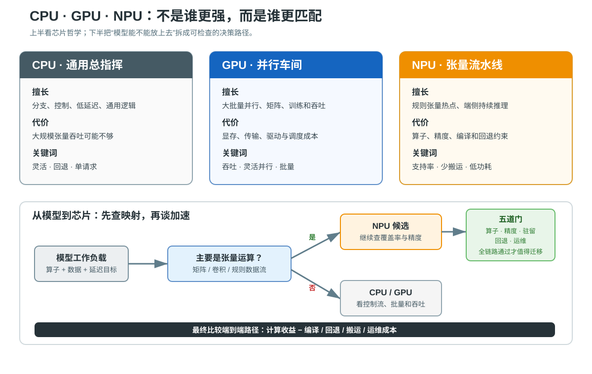

# 课 3 · GPU：什么时候该请它上场

> 阶段 1 · 算力的来源 ｜ ⚠️ **本课为概念课：无容器实操**（本机 macOS arm64 无 CUDA 生态、容器无 GPU 直通）。全课以概念 + 图示 + 数字算给你看为主，唯一可实测的是"本环境确实没有 GPU"（已实测，含报错原文）。本课末尾另有 **NPU 课外理论扩展**：不新增知识点编号，也不编造 NPU 实测输出。

## 📌 知识点导航

| # | 知识点 | 状态 |
|---|--------|------|
| 3.1 | 两种芯片哲学：CPU 少而强，GPU 多而简 | ✅ |
| 3.2 | 什么活适合 GPU，什么活搬过去反而慢 | ✅ |
| 3.3 | 后端服务的 GPU 决策卡 | ✅ |

## 🎯 本课目标

学完本课你将能：

- 说清 CPU 与 GPU 的架构分工（优化延迟 vs 优化吞吐），并识破"核数直比"的口径陷阱
- 用三个判断条件给一类活定性：该不该交给 GPU，以及"搬过去反而慢"的临界点在哪
- 用一张决策卡回答"我们的服务要不要上 GPU"，并知道本机环境的诚实边界

---

## 第一幕 🏛️ 起源与场景引入

**先讲一段来历。** 1993 年 4 月 5 日，黄仁勋与 Chris Malachowsky、Curtis Priem 创立 NVIDIA，最初的目标只是"把 3D 图形带进 PC"（核查于 2026-09，来源：[NVIDIA 官方大事记](https://www.nvidia.com/en-us/about-nvidia/corporate-timeline/)）。1999 年 10 月 11 日，GeForce 256 上市——NVIDIA 把它营销为"世界第一块 GPU"，**注意"GPU"这个词本身就是 NVIDIA 当时的营销造词**，此前已有图形芯片，只是没叫这个名字（核查于 2026-09，来源：[Wikipedia: GeForce 256](https://en.wikipedia.org/wiki/GeForce_256)）。真正的转折在 2007 年：CUDA 正式发布，把 GPU 从"画图专才"变成"通用并行计算器"（核查于 2026-09，来源：[Wikipedia: CUDA](https://en.wikipedia.org/wiki/CUDA)）。2012 年，Alex Krizhevsky、Ilya Sutskever 和 Geoffrey Hinton 用**两块消费级 GTX 580**（各 3GB 显存）训练 AlexNet 五到六天，以 top-5 错误率 15.3%（第二名约 26%）赢下 ImageNet 竞赛——深度学习时代从此引爆（核查于 2026-09，来源：[NeurIPS 2012 原始论文](https://proceedings.neurips.cc/paper/4824-imagenet-classification-with-deep-convolutional-neural-networks.pdf)）。

**再回到故事现场。** 运维说"加机器吧"之后，隔壁组凑过来："上 GPU 吧，AI 都用它。"你打开采购报价单——卡上的数字经常比一台整机还贵。**问题是：没有人能说清，我们的活它到底接不接。**

## 第二幕 ❓ 认知冲突

1. 课 2 刚学过：CPU 堆到几十个核就各种打架（争用、NUMA、切换）。**GPU 凭什么塞进上万个"核"？它俩的"核"是同一种东西吗？**
2. 据说加了 GPU 反而更慢的案例真实存在——**一块几万块的卡，怎么会让服务变慢？**
3. 采购问"我们到底要不要上 GPU"——你不能靠感觉回答。**判断的依据是什么？**

## 第三幕 📖 层层揭示

### 知识点 3.1 两种芯片哲学：CPU 少而强，GPU 多而简

**一句话定义**：CPU 为**延迟**而生——用复杂的控制（大缓存、分支预测、乱序执行）让"一件事"尽快出结果；GPU 为**吞吐**而生——用海量简单核一轮做"同一件事 × 海量数据"，单件事不快，但单位时间总完成量巨大。

**直觉建立**：**米其林主厨 vs 饺子工厂**。CPU 是主厨：来什么菜都会做、单道菜出品极快、厨房里全是帮你省时间的装备（课 1 的"厨师"升级到了满配）；GPU 是饺子工厂：一万张皮包同一种馅，一条流水线一万个人同时动作——**单只饺子不比主厨包得快，总量碾压**。术语落地：一条指令同时喂一组数，叫 **SIMD**（单指令多数据）；GPU 用线程组实现它，叫 **SIMT**（单指令多线程）——先记"一条指令、海量数据同时动"即可。**类比失效边界**：① GPU 核"简单"不等于慢——它配了远超 CPU 内存的**显存带宽**（现代数据中心卡数百 GB/s 到 TB/s 量级，⏳ 置信度：中，随代际变化大）；② 两家的"核数"**口径完全不同，不可横比**。

**核心原理**：
1. **口径纪律（本课最重要的防坑点）**：本机实测（见实验 A）——CPU 是 Apple M3 Pro 的 **11 个 CPU 核**，集成 GPU 是 **14 个 GPU 核**；而 NVIDIA 数据中心卡常宣传"上万个 CUDA 核"。**这三种"核"各自指什么只有厂商口径、没有可比性**：CPU 核是完整核心（含缓存与控制），GPU 核是简单执行单元。见到任何"X 核 vs Y 核"的对比，先问口径。
2. **延迟敏感 vs 吞吐敏感**：用户点一下按钮等响应（延迟敏感——CPU 的主场）；半夜批量给 100 万张图片打标签（吞吐敏感——GPU 的主场）。
3. **课 2 的呼应**：CPU 加核撞 Amdahl 天花板、撞共享内存争用——GPU 不是"更大的 CPU"，它换了一种哲学绕开了部分问题，但**自己的约束**（搬运、串行依赖）马上在 3.2 出现。

**示例演示**：本机实测对照——`system_profiler` 报出 CPU（M3 Pro，11 CPU 核）与 GPU（14 核，Metal 4）两套完全不同口径的"核数"，谁也不能除以谁。

**常见误区**：
1. ❌ "GPU 一万核 ÷ CPU 64 核 = 快 156 倍"——口径不可比 + 忽略搬运与串行段。
2. ❌ "GPU 核很弱所以 GPU 很弱"——它的显存带宽与并行规模是 CPU 没有的武器。
3. ❌ "GPU 是 AI 专用芯片"——它出生是画图的（1999），2007 年 CUDA 才通用化。

**一句话记住**：**CPU 优化"多久办完一件事"，GPU 优化"一轮能办多少同一种事"——两者的核数不可横比。**

### 知识点 3.2 什么活适合 GPU，什么活搬过去反而慢

**一句话定义**：适合 GPU 的活 = **数据并行**（同一操作 × 海量数据）× **高计算强度**（算的时间远大于搬的时间）× **控制流简单**（分支少、依赖少）；三条缺任何一条，搬运与调度的成本就可能吃掉全部收益。

**直觉建立**：把 GPU 想成外包工厂：**运货去工厂有成本（PCIe 传输），开工有起订量（批量），订单太花式它做不了（分支密集）**。**类比失效边界**：现代 GPU 也在补短板（专门的张量单元、更大显存、更快的互连），"工厂只会包饺子"的程度在减轻——但"搬货成本"与"订单花式度"两条依然成立。

**核心原理**：
1. **搬运成本算给你看**：CPU 与 GPU 之间的数据走 PCIe。PCIe 4.0 x16 约 **32 GB/s（单向）**、5.0 x16 约 **64 GB/s**（核查于 2026-09，来源：[Rambus: What is PCIe 4.0](https://www.rambus.com/blogs/pci-express-4/)）。传 1 GB 数据的理想下限 ≈ 1000 MB ÷ 32 GB/s ≈ **31.25 ms**——注意这是**理想值**，实际还要加驱动、批处理、往返。
2. **临界点推演（假设值已标明，非实测）**：设每次任务需传 1 GB 数据进去（结果很小忽略）——

| 场景（假设值） | CPU 耗时 | GPU 计算 | 传输（1GB） | GPU 方案总耗时 | 结论 |
|---|---|---|---|---|---|
| 大批量推理 | 500 ms | 10 ms | ≈31 ms | ≈41 ms | **≈12 倍，值** |
| 中等批 | 60 ms | 5 ms | ≈31 ms | ≈36 ms | 只省 24 ms，叠加运维成本后存疑 |
| 小批 | 30 ms | 5 ms | ≈31 ms | ≈36 ms | **亏：比 CPU 还慢** |

   **批量越大，搬运越被摊薄——没有持续的大批量，就别搬。**
3. **GPU 毒药清单**：分支密集（成千上万个核里一半走 if 一半走 else，SIMT 被撕碎）、强串行依赖（第 n 步必须等第 n−1 步——Amdahl 的串行段在 GPU 上同样致命）、数据量小（搬运占比过高）。
4. **GPU 常客**：矩阵乘 / 卷积（深度学习训练与推理）、图形渲染、视频转码（现代卡还配有专用编码单元，一句带过）、科学计算。它们的共同点：**同样的一小套运算，对海量数据重复**。

**示例演示**：上面的 break-even 表就是演示——把"该不该"变成三个数（CPU 耗时 / GPU 耗时 / 传输耗时）的减法。

**常见误区**：
1. ❌ "有卡就该用"——搬运 + 调度成本在小批量场景是净亏。
2. ❌ "GPU 上分支也没事"——SIMT 的分支分歧会把并行撕成串行。
3. ❌ "上 GPU 是调个库的事"——驱动、CUDA 版本、显存规划是一整套运维（3.3 展开）。

**一句话记住**：**数据并行 + 批量够大 + 分支少，三条齐了才值得搬；搬运成本是 GPU 的入场费。**

### 知识点 3.3 后端服务的 GPU 决策卡

**一句话定义**：要不要给服务上 GPU，用三问收口——**Q1 计算是数据并行吗？Q2 批量够大且持续吗？Q3 运维代价接受吗？**三问全"是"才考虑，否则留在 CPU。

**直觉建立**：把三问想成采购的三道门：第一道看**活对不对**（技术匹配），第二道看**量够不够**（经济账），第三道看**养不养得起**（运维账）。**类比失效边界**：现实里还有混合形态（CPU 预处理 + GPU 只做热点步骤），三问过不了全量上卡，可能过得了"只把热点算子搬上卡"。

**核心原理**：
1. **Q1 技术匹配**：业务逻辑、CRUD、字符串处理、一般 Web 请求——**几乎永远用不上**；矩阵/卷积/逐像素/逐 token 的计算——继续第二问。
2. **Q2 经济账**：每秒成百上千次推理或转码 → 批量大且持续，值得；每天几次的离线任务 → 拆成异步队列攒批，或者干脆按次用云函数/按小时租卡，**不要为波峰买波谷**。
3. **Q3 运维账**：驱动与 CUDA 版本矩阵、显存容量规划、故障域变大（一张卡挂掉一个节点）、租 vs 买（**云上按需租卡是常识起点**——先证明负载持续，再谈买）。
4. **本机诚实边界（实测）**：本机是 Apple M3 Pro 的**集成 GPU**（14 核，Metal 4）——统一内存架构，**没有"PCIe 搬运"问题，但 CUDA 生态完全不适用**（Apple 侧是 Metal / MPS / MLX，一句带过，不展开）；容器里没有 GPU（实验 B/C 实测）。想在真 CUDA 环境动手，云 GPU 实例是正路。
5. **决策落点示例**：图片转码服务（数据并行 ✓、量大 ✓）→ 值得，但先量传输与起批大小；订单 CRUD → 第一问就出局；向量检索 → 看索引规模，中小规模 CPU + 好索引往往够用（别为"AI 感"上卡）。

**示例演示**：第四幕用本机实测把"诚实边界"钉死，再用 3.2 的 break-even 表走一遍三个服务场景。

**常见误区**：
1. ❌ "AI 项目必须立刻上 GPU"——小模型/小流量用 CPU 推理往往足够；先测负载再谈卡。
2. ❌ "统一内存 = 显存问题不存在"——架构不同，带宽口径也不同，别把两套叙事混着讲。
3. ❌ "租卡是浪费"——在证明负载持续之前，租是最便宜的试错方式。

**一句话记住**：**三问全过才上卡：活对不对、量够不够、养不养得起——都不是就安心用 CPU。**

## 第四幕 🔬 实操验证

> ⚠️ 重申：**本课无容器实操**——本机没有 NVIDIA GPU，容器无 GPU 直通。唯一能做的是把"这里没有 GPU"实测给你看（含报错原文），以及把 3.2 的账**算**给你看。全部实测于 2026-09-10。

### 实测 A：宿主机有一块什么 GPU？（macOS 宿主，非容器）

```bash
system_profiler SPDisplaysDataType | grep -E "Chipset|Cores|Metal"
```

实测输出：

```text
Chipset Model: Apple M3 Pro
Total Number of Cores: 14
Metal Support: Metal 4
```

**读数**：本机确实有 GPU（Apple 集成 GPU，14 个 GPU 核，支持 Metal 4）——但它的"14 核"与 CPU 的 11 核是**两套口径**（3.1 的防坑点），且它不在 CUDA 生态里。

### 实测 B：容器里有没有 GPU？

```bash
docker run --rm ubuntu:26.04 bash -c '
command -v nvidia-smi >/dev/null && nvidia-smi || echo "nvidia-smi: 命令不存在"
ls /dev/dri >/dev/null 2>&1 && ls /dev/dri || echo "/dev/dri: 不存在（无 GPU 设备直通）"'
```

实测输出（平台 WARNING 与本实验无关，课 2 坑实录已解释）：

```text
nvidia-smi: 命令不存在
/dev/dri: 不存在（无 GPU 设备直通）
```

### 实测 C：硬要 GPU 会看到什么报错？

```bash
docker run --rm --gpus all ubuntu:26.04 nvidia-smi
```

实测输出（报错原文）：

```text
docker: Error response from daemon: failed to discover GPU vendor from CDI: no known GPU vendor found
```

**这就是将来在真服务器上排障的第一手参照**：容器要用 GPU，前提是宿主机有对应的运行时与设备直通——报错会精确告诉你"没发现任何已知 GPU 厂商"。三个实测连起来 = 3.3 第 4 条"本机诚实边界"的证据链。

### 数字算给你看：三个服务场景走决策卡（推演，非实测）

假设值已在表中标注（PCIe 4.0 x16 ≈ 32 GB/s 单向，1 GB 数据理想传输 ≈ 31 ms）：

| 服务场景 | Q1 数据并行？ | Q2 批量大且持续？ | Q3 运维代价 | 决策 |
|---|---|---|---|---|
| 图像审核服务（每秒 200 张，模型推理） | ✓ | ✓ | 可租卡起步 | **上 GPU**（3.2 表第一行：≈12 倍） |
| 订单服务（CRUD + 校验） | ✗（业务逻辑） | — | — | **第一问出局，安心用 CPU** |
| 每天凌晨跑一次的报表汇总 | 看实现 | ✗（不持续） | 不想养卡 | **CPU + 异步队列**；真要加速改用云函数按次付费 |

## 第五幕 🗺️ 体系收束

- **🎉 本课交付即阶段 1 闭环（9 / 9 知识点）**。回头看你已经拼齐的"算力三件套"：**单核在干嘛**（课 1：取指-译码-执行）→ **多核能快多少**（课 2：口径、争用、Amdahl 天花板）→ **换一种芯片哲学**（课 3：吞吐换延迟，三问决策）。
- **放进会诊地图**：服务慢了 → 先问"串行段在哪"（Amdahl，课 2.3）→ 再问"是不是数据并行的重计算"（GPU，本课）→ 两条都不是 → 查**数据供给**——算得再快，喂不上数也白搭。
- **下一站（阶段 2 · 存储金字塔）**：CPU 其实很怕慢内存。为什么遍历数组比链表快一个数量级？free 命令里那对"双胞胎"（cache 与 buffer）到底是什么？**课 4《CPU 缓存：为什么遍历数组比链表快》开场**。
- 决策伏笔：GPU 三问已进入课 16 决策卡的第三张。

## 🐞 常见误区（本课合集）

1. **核数直比**：CPU 核 / GPU 核 / Apple GPU 核是三套口径，不可横比。
2. **有卡就用**：搬运成本（PCIe）+ 起批门槛，小批量场景净亏。
3. **AI = 必须上 GPU**：小模型小流量 CPU 推理常常够用，先测负载再谈卡。
4. **"GPU 万核 = 万倍快"**：串行段、分支密集、搬运三关都没过，万核也是空转。
5. **把 Apple 统一内存与 CUDA 叙事混着讲**：两套架构，两套账。

## 🗺 一图总结

```mermaid
flowchart TD
    Q0["一段计算摆在面前<br/>要不要上 GPU？"] --> Q1{"Q1 它是数据并行吗？<br/>（同一操作 × 海量数据）"}
    Q1 -->|"否（业务逻辑 / CRUD）"| CPU["留在 CPU<br/>（课 2 的多核 + Amdahl）"]
    Q1 -->|"是"| Q2{"Q2 批量大且持续吗？"}
    Q2 -->|"否（每天几次 / 波动大）"| ASYNC["CPU + 异步队列攒批<br/>或云上按次 / 按时租"]
    Q2 -->|"是"| Q3{"Q3 搬运成本 < 计算节省？<br/>（PCIe ≈ 32 GB/s 量级）"}
    Q3 -->|"否（数据小 / 分支密集）"| CPU2["继续优化 CPU 路径<br/>或减少搬运"]
    Q3 -->|"是"| GPU["上 GPU（先租后买）<br/>数据并行 + 高计算强度 + 分支少"]

    style GPU fill="#E8F5E9",stroke="#66BB6A"
    style CPU fill="#fafafa",stroke="#B0BEC5"
```

## 📋 命令速查卡

| 命令 | 干什么 | 坑 |
|------|--------|-----|
| `system_profiler SPDisplaysDataType` | macOS 宿主机 GPU 型号 / 核数 / Metal 支持 | 宿主机有 GPU ≠ 容器能用（需直通 + 运行时） |
| `nvidia-smi` | Linux 上 GPU 的标准观测工具（型号 / 显存 / 利用率） | 本环境不存在；有卡的服务器上它才是排障起点 |
| `docker run --gpus all ...` | 让容器看到 NVIDIA GPU | 需要 NVIDIA Container Toolkit；本机实测报 `failed to discover GPU vendor from CDI` |
| 云 GPU 实例（按小时租） | 在真 CUDA 环境动手的正确姿势 | 先证明负载持续再谈买卡 |
| （口径检查） | 看到任何"核数"先问口径 | CPU 核 / GPU 核 / Apple GPU 核三套口径不可横比 |

## 📚 官方文档

- 本课主题无 man 页（man-pages 项目不含 GPU 内容）；以下为事实核查引用来源（核查于 2026-09）：
  - [NVIDIA 官方大事记](https://www.nvidia.com/en-us/about-nvidia/corporate-timeline/)（1993 创立、CUDA 里程碑）
  - [Wikipedia: GeForce 256](https://en.wikipedia.org/wiki/GeForce_256)（1999-10-11 上市，"GPU"为营销造词）
  - [Wikipedia: CUDA](https://en.wikipedia.org/wiki/CUDA)（2007 正式发布）
  - [NeurIPS 2012: ImageNet Classification with Deep Convolutional Neural Networks](https://proceedings.neurips.cc/paper/4824-imagenet-classification-with-deep-convolutional-neural-networks.pdf)（AlexNet 原始论文，两块 GTX 580）
  - [Rambus: What is PCIe 4.0](https://www.rambus.com/blogs/pci-express-4/)（PCIe 4.0 x16 ≈ 32 GB/s 单向）
- NVIDIA CUDA 与 Apple Metal 的官方文档入口未在本课引用具体页面（不编链接）；后续课程需要时先 fetch 核实再引用。

## 课后小测

**Q1.** 同事说："GPU 有 16384 个核，我们服务器 CPU 才 64 核，所以 GPU 快 256 倍。"这句话至少有两处硬伤，请指出。

<details><summary>答案</summary>

① **口径不可比**：GPU 核是简单执行单元（SIMT），CPU 核是含缓存与控制的完整核心——两者"核"的含金量完全不同，直接相除没有意义（本机 CPU 11 核 vs Apple GPU 14 核同样不可比）。② **加速比不由核数比决定**：真实加速受搬运成本（PCIe）、串行段（Amdahl 仍适用）、分支密集度三重约束——16384 个核遇到分支大乱斗或小批量，可能比 CPU 还慢。
</details>

**Q2.** 产品经理要求"给每天凌晨跑一次的报表汇总服务配一块 GPU，AI 时代了嘛"。用决策卡三问反驳或支持他。

<details><summary>答案</summary>

三问走一遍：Q1 报表汇总多是数据库聚合与业务逻辑，**通常不是数据并行的重计算**——第一问大概率出局；Q2 每天 1 次，**批量不持续**，为波峰买波谷最不经济；Q3 养卡（驱动/版本/显存/故障域）对这种低频任务完全不划算。结论：**不上卡**。若确有热点计算，先在 CPU 上测耗时，确属数据并行重活，用云上按次/按时的 GPU 任务跑离线批，而不是常驻买卡。
</details>

**Q3.** PCIe 4.0 x16 单向约 32 GB/s。把 1 GB 特征数据传进 GPU（理想值）至少多久？若 CPU 算要 600 ms、GPU 算只要 50 ms（数据仍需传回结果，结果很小忽略），GPU 方案总耗时大约多少、提速几倍？

<details><summary>答案</summary>

理想传输 = 1000 MB ÷ 32 GB/s ≈ **31.25 ms**（这是下限，实际更高）。GPU 方案总耗时 ≈ 31.25 + 50 ≈ **81 ms**（若考虑数据往返则再加约 31 ms，约 112 ms），对比 CPU 600 ms ≈ **7.4 倍**（按 81 ms 算）——值。但如果数据只有 10 MB，传输约 0.3 ms，CPU 端若只需 20 ms，那 GPU 再快也救不了这个场景——**账要连传输一起算**。
</details>

## 🧠 课外理论扩展：NPU——神经网络里的专用流水线

> **定位**：NPU 不是"比 GPU 更新的一种 GPU"，而是针对神经网络张量运算优化的一类加速器。它属于本课 CPU / GPU 分工图的补充，不改变本课程 **5 阶段 / 16 课 / 48 知识点** 的统计口径。

### 第一幕：场景引入——为什么手机和笔记本还要再塞一块芯片？

一张照片要做分类、语音要转文字、摄像头要持续识别人——这些任务未必需要云端 GPU。设备更在意的是：**持续跑、少耗电、数据不要离开本机**。于是出现了专门做神经网络热点算子的 NPU（Neural Processing Unit）。

但 NPU 的问题也很典型：它不是一台缩小的通用 CPU。它通常更喜欢规则的矩阵 / 张量计算、固定的数据流和适合的精度；模型里一个不支持的算子，可能就要回退到 CPU 或 GPU。

### 第二幕：认知冲突——有 NPU，为什么模型还可能跑不快？

因为"模型跑在哪块芯片上"不是唯一问题，完整路径是：

    模型图 / 算子 → 编译器与运行时 → CPU / GPU / NPU 执行 → 内存与设备间搬运 → 应用结果

只看峰值算力会漏掉四笔账：

1. **算子覆盖**：NPU 能否执行模型里的卷积、矩阵乘、激活、归一化以及自定义算子？
2. **精度与编译**：模型能否接受 FP16 / INT8 等目标精度？编译器是否能把图优化成 NPU 喜欢的形状？
3. **搬运与驻留**：输入、权重、中间结果是否一直留在合适的内存？频繁跨设备搬运会吞掉收益。
4. **回退与尾延迟**：只有一个算子回 CPU 不一定有问题；如果 CPU / GPU / NPU 之间来回切换，整条链路可能反而变慢。

### 第三幕：层层揭示——CPU、GPU、NPU 三种哲学



| 维度 | CPU | GPU | NPU |
|---|---|---|---|
| 擅长的活 | 分支多、控制复杂、低延迟、通用逻辑 | 大规模并行、矩阵 / 向量运算、训练与高吞吐推理 | 神经网络张量热点、持续推理、能耗敏感的端侧任务 |
| 灵活性 | 最高，几乎什么都能写 | 较高，但受并行模型、显存和运行时约束 | 通常更受算子集合、数据类型、编译器与运行时约束 |
| 典型优势 | 启动成本低、回退可靠、调试直接 | 算力和软件生态成熟，模型适配面较广 | 在**支持的模型 + 合适精度 + 数据少搬运**时，可能以更低功耗持续工作 |
| 典型代价 | 大规模张量运算吞吐可能不够 | 设备调度、显存 / 传输、功耗与驱动成本 | 不支持的算子要回退；编译、量化、内存与监控链路更依赖平台 |
| 关键问题 | 单请求延迟和并发够不够？ | 批量是否够大、计算是否足够重？ | 模型是否被完整而高效地映射到 NPU？ |

这里的"可能"很重要：**NPU 不保证任何 AI 任务都更快，也不保证一定更省电**。只有当模型主要由 NPU 擅长的算子组成，并且数据能稳定驻留在合适路径上，优势才容易出现。

#### 子主题 A：NPU 到底在优化什么？

把神经网络拆开看，很多层都能归结为重复的张量运算：

    输出张量 = 输入张量 × 权重张量 + 偏置

NPU 常见的硬件思路是把大量乘加操作排成规则的数据流或阵列，让数据在片上按固定节奏流过计算单元，减少通用控制和不必要的数据搬运。不同厂商对这类单元的名称、内存层次和指令接口不同，因此不能把某一家产品的规格当成 NPU 的通用定义。

类比可以这样记：CPU 像现场总指挥，GPU 像可编程的大型并行车间，NPU 像为一类标准化工序优化的流水线。流水线对熟悉工序很高效，但遇到临时插单、奇怪形状或自定义步骤，就可能需要把那一段交回总指挥。

#### 子主题 B："算子回退"是 NPU 学习的关键边界

一个模型图不一定整张图都落在 NPU。以运行时的抽象看，模型可以被分成多个子图：

    [Conv → ReLU → MatMul] ── NPU
              ↓
          [自定义算子] ─────── CPU
              ↓
          [后处理] ─────────── CPU

这不是失败，而是异构执行的正常形态；真正要问的是：

- 回退的算子是不是热点？
- 子图切得是否过碎？
- CPU / NPU 间是否频繁复制中间张量？
- 端到端延迟、吞吐和功耗是否真的改善？

ONNX Runtime 把这类硬件适配抽象成 **Execution Provider**，可以按能力把模型节点或子图分给不同后端；其文档也明确说明，一个模型可以在多个执行后端组成的异构环境中运行。这个抽象很适合用来理解"不是整模型二选一，而是按子图分工"。

#### 子主题 C：NPU 什么时候值得考虑？

用五道门把宣传语变成工程判断：

| 关卡 | 要问的问题 | 过不了时的出口 |
|---|---|---|
| 1. 工作负载 | 主要时间是否花在矩阵 / 卷积 / 张量算子？ | 控制流、字符串、数据库逻辑留在 CPU |
| 2. 覆盖率 | 目标 NPU 是否支持主要算子和模型形状？ | 先做算子覆盖报告；必要时改模型或选 GPU |
| 3. 精度 | FP16 / INT8 量化后的精度是否可接受？ | 保留 CPU / GPU 高精度路径，别只看速度 |
| 4. 数据路径 | 输入、权重、中间结果是否能少搬运？ | 先优化内存驻留和批处理，再谈换芯片 |
| 5. 系统账 | 驱动、编译器、运行时、监控和回退是否可维护？ | 先用成熟 CPU / GPU 路径，避免把复杂度引入生产 |

**例子**：端侧摄像头持续跑一个主要由卷积和矩阵乘组成、可接受 INT8 的分类模型，且模型能长期驻留设备内存——NPU 值得评估。反过来，一个单请求、小模型、包含大量动态控制和自定义后处理的接口，即使名字里有"AI"，CPU 也可能是更好的起点；不要因为有 NPU 就强行迁移。

### 第四幕：实操验证——本环境为什么不做 NPU 跑分？

本机是 Apple Silicon，宿主侧可能存在由系统框架管理的 Neural Engine；但本课的 Linux 容器没有一个可直接套用的通用 /dev/npu 设备接口，也没有为本课程准备对应的 NPU 运行时和模型基准。因此本节只做**边界判断**，不编造 NPU 利用率、TOPS、延迟或功耗数字。

当前可验证的事实是：

- Apple 的 Core ML 文档把 CPU、GPU 和 Neural Engine 放在同一个端侧模型执行框架中，并强调设备端执行的内存与功耗目标；
- 这不等于 Linux 容器自动获得 Neural Engine；
- 若以后进入真实 NPU 环境，第一步不是看宣传页，而是确认运行时是否识别目标后端、模型是否被完整分区、回退发生在哪里，再测端到端指标。

### 第五幕：体系收束——把 NPU 放回算力地图

| 看到的任务 | 第一候选 | 复核问题 |
|---|---|---|
| 业务逻辑、分支、数据库调用、单请求小计算 | CPU | 是否需要的是低延迟和通用性？ |
| 大批量矩阵 / 向量、训练、高吞吐推理 | GPU | 批量、传输、显存和运行时成本是否划算？ |
| 支持良好的端侧神经网络、持续推理、能耗敏感 | NPU | 算子覆盖、精度、数据驻留、编译器和回退是否过关？ |

**一句话记住**：CPU 负责"怎么控制"，GPU 负责"同一类计算并行做很多份"，NPU 负责"把神经网络里规则、重复、可映射的张量工序低功耗地做下去"；最终比较的永远是**端到端路径**，不是芯片标签。

#### 常见误区

1. ❌ **NPU = GPU 的升级版**：两者都能加速 AI，但目标、编程模型、算子覆盖和部署约束不同。
2. ❌ **模型放上 NPU 就一定更快**：回退、搬运、编译和小批量启动成本可能让 CPU / GPU 胜出。
3. ❌ **有 NPU 就不用 GPU**：训练、高吞吐或需要更灵活算子的任务，GPU 仍可能更合适。
4. ❌ **只看 TOPS**：峰值整数吞吐不能代替真实模型的端到端延迟、吞吐、精度与功耗。
5. ❌ **宿主机有 Neural Engine，容器就能用**：设备、驱动、运行时和框架必须形成完整通路，容器不会自动继承宿主专用加速器。

#### 官方资料入口（核查于 2026-09）

- [ONNX Runtime：Execution Providers](https://onnxruntime.ai/docs/execution-providers/)：说明按节点 / 子图选择执行后端，以及 CPU 回退和异构执行。
- [ONNX Runtime：High-level design](https://onnxruntime.ai/docs/reference/high-level-design.html)：说明一个模型可以被不同 Execution Provider 分区执行。
- [Apple Developer：Core ML](https://developer.apple.com/documentation/coreml)：说明端侧模型执行可利用 CPU、GPU 与 Neural Engine，并关注内存和功耗。
- [Apple Developer：MLComputeUnits](https://developer.apple.com/documentation/coreml/mlcomputeunits)：说明 Core ML 的计算单元选择包含 Neural Engine。

---

## 🚀 下一批接力提示词

> 🎉 **阶段 1《算力的来源》已闭环（9 / 9）**。学完本课后，**复制下面这段文字发给 AI**，进入阶段 2：

```
继续学 Linux 操作系统基础。我的学习档案在 operating-system/00-学习档案.md，
阶段 1《算力的来源》课 1–3 已全部学完（取指-译码-执行 / 核心数与超线程 / GPU 决策），
Docker Desktop 已启动，请进入阶段 2《存储金字塔》，讲解课 4《CPU 缓存：为什么遍历数组比链表快》
（4.1 存储金字塔与速度鸿沟 / 4.2 cache line 与局部性原理 / 4.3 缓存一致性与伪共享）。
```

## 🧭 课程导航

| | 链接 |
|---|---|
| ⬅️ 上一课 | [课 2《核心数与超线程：为什么 16 核不是 16 倍快》](lesson-02-核心数与超线程为什么16核不是16倍快.md) |
| ➡️ 下一课 | [课 4《CPU 缓存：为什么遍历数组比链表快》（阶段 2 开篇）](../../2-存储金字塔/lessons/lesson-04-CPU缓存为什么遍历数组比链表快.md) |
| 📖 返回目录 | [02-课程目录](../../../02-课程目录.md) |
