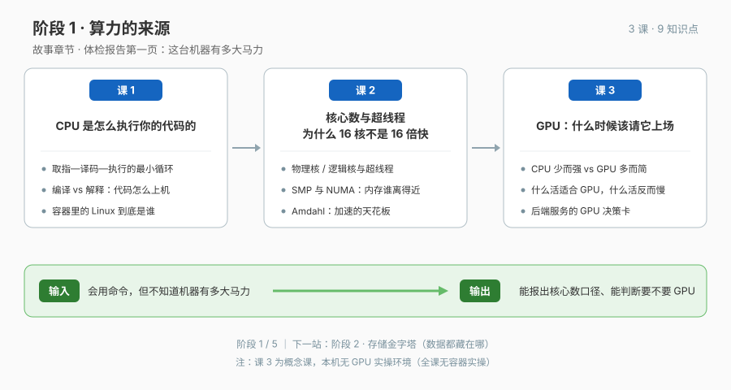

# 阶段 1 · 算力的来源

> 体检报告第一页：这台机器有多大马力。

## 🎯 阶段目标

学完本阶段，你能读懂"马力"的三个口径：**单核能力**（CPU 怎么执行你的代码）、**核数口径**（物理核 / 逻辑核 / NUMA，为什么 16 核不是 16 倍快）、**要不要 GPU / NPU**（哪种活该请哪类加速器上场）。CPU 与 GPU 有容器实测边界，NPU 作为课 3 的理论扩展，不虚构本机跑分。

## 📖 故事章节定位

体检报告第一页——先弄清替你干活的芯片是谁，再看懂"16 核"三个字里藏着的两个坑（超线程与共享内存），最后回答"什么时候才轮到 GPU / NPU，以及为什么芯片标签不是答案"。

## 🔑 必须掌握的知识点

| 课 | 知识点 | 一句话要点 |
|----|--------|-----------|
| 课 1 | 1.1 CPU 的最小行动循环：取指-译码-执行 | 寄存器 / ALU / 程序计数器各管一段；GHz 只是"每秒心跳数"，不等于一切 |
| 课 1 | 1.2 从源代码到指令：你的代码怎么"上机" | 编译型与解释型是同一段逻辑的两条路；arm64 与 x86_64 二进制互不通用 |
| 课 1 | 1.3 实验环境里的"Linux"到底是谁 | 内核 / 发行版 / 容器镜像三层；macOS 上容器共享 Docker VM 内核，`uname -r` 实测说话 |
| 课 2 | 2.1 物理核、逻辑核与超线程 | 超线程 = 一套执行单元伺服两套架构状态：何时 +30%、何时白搭 |
| 课 2 | 2.2 多核怎么共享内存：SMP 与 NUMA | 内存总线要抢；NUMA 下离哪颗 CPU 近用哪块内存，远端访问差数倍 |
| 课 2 | 2.3 并行度上限：Amdahl 定律直觉 | 串行部分决定加速天花板——95% 并行也最多 20 倍；这是"线程池开多大"的第一性依据 |
| 课 3 | 3.1 两种芯片哲学：CPU 少而强，GPU 多而简 | 延迟敏感的活找 CPU，吞吐敏感的活找 GPU；类比有失效边界 |
| 课 3 | 3.2 什么活适合 GPU，什么活搬过去反而慢 | 数据并行是 GPU 主场；分支密集、强串行依赖是毒药，搬运成本可能吃掉全部收益 |
| 课 3 | 3.3 后端服务的 GPU 决策卡 | AI 推理 / 图像 / 转码是常客，CRUD 几乎永远用不上；本机无 GPU 的诚实边界 |

> **课 3 课外理论扩展（不新增知识点）**：NPU 的定位、算子回退、数据驻留与 CPU / GPU / NPU 选择路径。

## 🗺 本阶段路径图

## 课次一览

- 课 1《CPU 是怎么执行你的代码的》（正文已交付，2026-09-10）
- 课 2《核心数与超线程：为什么 16 核不是 16 倍快》（正文已交付，2026-09-10）
- 课 3《GPU：什么时候该请它上场》（正文已交付；⚠️ 概念课，无容器实操；已补充 NPU 理论扩展）
