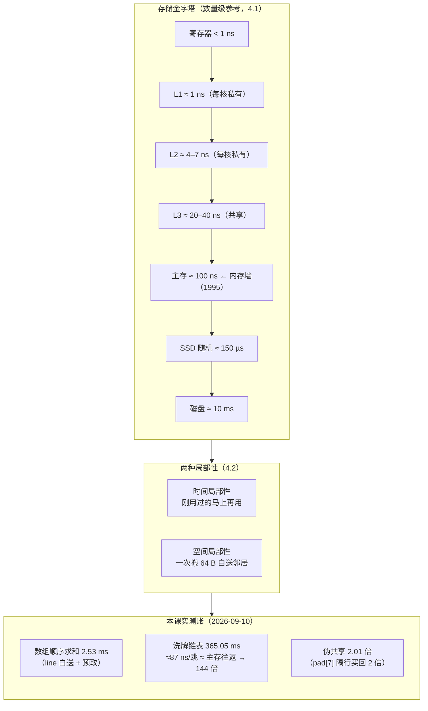

# 课 4 · CPU 缓存：为什么遍历数组比链表快

> 阶段 2 · 存储金字塔 ｜ 实操环境：ubuntu:26.04 容器（Docker Desktop on macOS arm64）｜ 本课实测于 2026-09-10 ｜ 知识点 4.2 为**面试高频**

## 📌 知识点导航

| # | 知识点 | 状态 |
|---|--------|------|
| 4.1 | 存储金字塔与速度鸿沟 | ✅ |
| 4.2 | cache line 与局部性原理（面试高频） | ✅ |
| 4.3 | 多核时代的新烦恼：缓存一致性与伪共享 | ✅ |

## 🎯 本课目标

学完本课你将能：

- 画出存储金字塔（寄存器 → L1 → L2 → L3 → 内存 → 磁盘）并报出相邻层级之间的**数量级**差
- 用 cache line 与两种局部性，把"数组比链表快"从背下来的结论变成能算出来的账（本课实测 **144 倍**）
- 说清伪共享为什么让"写不同变量的两个线程"打架，并给出两种修法

---

## 第一幕 🏛️ 起源与场景引入

**先讲一段来历。** 1995 年 3 月，Wulf 和 McKee 在 ACM SIGARCH《Computer Architecture News》（vol. 23, no. 1, pp. 20–24）发表《Hitting the Memory Wall: Implications of the Obvious》，第一次把"**内存墙**"这个词立了起来：处理器提速的速度远快于 DRAM 延迟下降的速度，总有一天**等内存会成为性能的主瓶颈**（核查于 2026-09，来源：[ACM Digital Library 原文页](https://dl.acm.org/doi/10.1145/216585.216588)）。30 年过去，CPU 快了上百倍，"墙"还在原地——缓存体系就是这 30 年里人类给 CPU 修的"梯子"。

**再回到故事现场。** 周五的排查有了新进展：同事盯着热点代码说"我把 `List` 换成数组就好了"——一句听上去像玄学的话。数据结构的替换，凭什么能差出一个数量级？这一课我们把这笔账**算出来**。

## 第二幕 ❓ 认知冲突

1. CPU 主频按课 1 的口径是每拍不到 1 ns，而主存一次访问约 **100 ns**——等一次内存 = 白等几百拍。**CPU 的时间都去哪了？**
2. 本课将实测：同样遍历 400 万个数求和，**数组 2.53 ms，洗牌后的链表 365.05 ms——144 倍**。数据量相同、求和逻辑相同，差距从哪来？
3. 更玄的：两个线程各自累加**两个互不相干的变量**，竟然也会互相拖慢（本课实测慢 2.01 倍）——它们明明"不共享"，凭什么打架？

## 第三幕 📖 层层揭示

### 知识点 4.1 存储金字塔与速度鸿沟

**一句话定义**：存储体系是一座金字塔——**越往上（寄存器、缓存）越快、越小、越贵；越往下（内存、磁盘）越慢、越大、越便宜**。缓存存在的意义，就是用少量"快而贵"接住大部分访问，让 CPU 少等"慢而多"。

**直觉建立**：把 CPU 想成你自己坐在书桌前干活——**寄存器**是手里的笔（随手就用），**L1** 是桌上的便签（一伸手），**L2** 是身后的书架（起身拿），**L3** 是办公室的资料柜（走几步），**内存**是公司档案库（下楼，几分钟），**磁盘**是市郊仓库（开车半天）。**类比失效边界**：书架不会因为同事拿过同一本书就失效，缓存会（4.3 的一致性问题）；而且"下楼拿档案"期间你可以干别的（异步），CPU 等内存时也能乱序先干别的活——课 1 说过现代 CPU 的"几道菜并行"。

**核心原理**：**数量级参考表**（Jeff Dean 口径，Google SRE 手册收录，Colin Scott 维护逐年更新版；均为数量级参考而非精确规格，核查于 2026-09）：

| 层级 | 访问延迟（数量级） | 相对 CPU 一拍的代价（按 ~4 GHz 折算） |
|------|------------------|-----------------------------------|
| 寄存器 | < 1 ns | 1 拍内 |
| L1 缓存 | ≈ 1 ns | 几拍 |
| L2 缓存 | ≈ 4–7 ns | 十几拍 |
| L3 缓存 | ≈ 20–40 ns | 几十拍 |
| **主存（DRAM）** | **≈ 100 ns** | **几百拍** |
| SSD 随机 4K 读 | ≈ 150 µs | 几十万拍 |
| 磁盘寻道 | ≈ 10 ms | 上千万拍 |

**来源**：[Latency Numbers Every Programmer Should Know（Gist）](https://gist.github.com/jboner/2841832)、[Google SRE 延迟数字手册（PDF）](https://sre.google/static/pdf/rule-of-thumb-latency-numbers-letter.pdf)、[Colin Scott 交互式延迟表](https://colin-scott.github.io/personal_website/research/interactive_latency.html)。

1. **为什么不全用最快的？**——经济学：SRAM（缓存材质）比 DRAM 贵一个数量级且密度低，"全 L1"的芯片买不起也放不下。层级是快与便宜的折中。
2. **命中率**：缓存赌"你会反复用最近的数据"（ locality，见 4.2）。赌中（hit）≈1 ns，赌输（miss）就要去下一层搬——**性能不是由平均速度决定，是由 miss 时落到的最慢一层决定**。
3. **实测一口径**：本课实验 A 直接从内核 sysfs 读出了本机缓存层级（L1D / L1I / L2），但 ARM VM 上 `size`、`coherency_line_size` 字段缺失——**"内核愿意告诉你什么"与"硬件有什么"是两回事**（呼应课 2 的口径纪律）。

**示例演示**：实验 A 的 sysfs 输出 + 上表对号入座；"磁盘寻道 ≈ 10 ms vs 主存 ≈ 100 ns"——差 **10 万倍**，这就是为什么数据库宁可把索引全抱在内存里（回指 PG 课）。

**常见误区**：
1. ❌ "缓存让内存变快了"——内存没变快，是缓存**让你少去**内存。
2. ❌ "主存 100 ns 是精确值"——数量级参考，随代际/架构浮动，别背精确数。
3. ❌ "加了缓存就一定快"——只在局部性好时成立；乱跳的访问模式（4.2 的链表）缓存救不了。

**一句话记住**：**金字塔每下一层慢约一个数量级；性能由"没赌中时掉到哪层"决定。**

### 知识点 4.2 cache line 与局部性原理（面试高频）

**一句话定义**：缓存和内存之间**不按字节搬，按"行"搬**——一次搬运一小块连续内存（经典口径 **64 字节**），这叫 **cache line**；程序若顺着这个粒度访问（空间局部性）、反复访问刚用过的数据（时间局部性），缓存就总是赌赢。

**直觉建立**：去仓库取货，**从来不会为一颗螺丝跑一趟**——按箱搬（cache line），整箱放在你工位边上。如果你接下来的活都用同一箱（空间局部性），一趟搬运白送几十次命中；如果你每用一颗螺丝都要跑去仓库换个箱（链表式跳跃），那就是 4.2 实测的灾难。**类比失效边界**：箱子的"标准尺寸"随厂商变——x86 世界惯例 64 B，本机 Apple 硬件粒度实测口径为 128 B（见下方口径专栏），原理不变，数字别背死。

> **📦 口径专栏：缓存行到底多大？**（三层口径并列，不取舍——本课实测）
> ① 容器内 `getconf LEVEL1_DCACHE_LINESIZE` = **64**（linuxkit ARM 内核口径）；② macOS 宿主 `sysctl -n hw.cachelinesize` = **128**（Apple 硬件粒度口径，公开资料与实测一致）；③ LLVM 对 Apple M 系的编译器模型用 **64**（公开资料）。**教学统一用 64 B 经典模型讲原理；真做伪共享对齐时，按目标机器口径实测。**

**核心原理**：
1. **两种局部性**：**时间局部性**——刚访问过的数据马上会再访问（循环变量、热点对象）；**空间局部性**——访问某地址后，邻居地址大概率也会被访问（顺序数组、连续字段）。
2. **一笔账：本课实测 144 倍从哪来**（实验 B）：
   - **数组**：`long arr[4M]` 顺序求和——一次 cache line 搬运白送 **8 个 long**（64B ÷ 8B），硬件预取器还会提前搬下一行 → 整个遍历变成"带宽流水线"，**2.53 ms**。
   - **链表**：节点先洗牌再串联——`p = p->next` 每一跳都是一次**无法预测的随机访问**，预取器彻底失业，每跳 ≈ **87 ns**（365.05 ms ÷ 419 万节点），**正好落在主存延迟的量级上（≈100 ns）**——链表遍历本质上就是 400 万次"主存往返"，**365.05 ms**。
   - **144 倍 = 预取 + cache line 白送 vs 主存延迟往返**。这就是"空间局部性"三个字的价钱。
3. **面试答法框架**（4.2 面试高频）：被问"为什么数组比链表快"，按三层答：① 存储连续性 → ② cache line 一次搬 64 B + 硬件预取 → ③ 链表指针追逐 = 每节点一次主存延迟（~100 ns）且无法预取。别只答"数组内存连续"就停——那是第一层。

**示例演示**：实验 B 的完整程序与输出（数组 2.53 ms / 链表 365.05 ms / 校验和一致），以及"每跳 87 ns"的账本换算。

**常见误区**：
1. ❌ "链表总是慢"——插入删除频繁、只需顺序走的场景链表反而合适；慢的是**随机跳跃的遍历**。
2. ❌ "缓存行永远是 64 B"——见口径专栏；换机器要重新实测。
3. ❌ "我把循环倒个序无所谓"——倒序顺序访问局部性还在；**跨列访问**（行主序数组按列遍历）才是灾难，等于自己造了个链表。

**一句话记住**：**缓存按行搬家，不按颗取货——顺着搬（数组）白送，跳着搬（链表）一次一次跑仓库。**

### 知识点 4.3 多核时代的新烦恼：缓存一致性与伪共享

**一句话定义**：每个核都有**私有**的 L1/L2，同一份数据会在多个核的缓存里各有一份副本；缓存一致性协议（**MESI**，概念级）保证"一个核改了数据，其他核的副本立刻作废"——而**伪共享**就是两个线程写的虽然是**不同变量**，却落在**同一条 cache line** 上，导致这条线在两个核之间反复作废、反复同步，谁也快不起来。

**直觉建立**：共享文档（一条 cache line）发给了两个人各存一份（两个核的私有缓存）。A 在文档里改第 1 段，B 必须先收到"文档已过期"的通知、重新拉最新版再改自己的第 2 段——**哪怕两人改的是毫不相干的段落**，整份文档也要来回重传。修法：把两段拆成两份独立文档（**padding，隔开到不同 cache line**）。**类比失效边界**：MESI 保的是"多副本数值一致"，**不等于线程同步**——它不保证你的 `i++` 原子性（两次读改写之间照样能插队），那是锁和原子指令的事（伏笔课 8）。

**核心原理**：
1. **MESI 概念级**：每个缓存行处于 Modified / Exclusive / Shared / Invalid 四态之一（记名字即可，不展开协议时序）；核心机制一句话——**一个核要写，先让别的核把这一行作废**。
2. **伪共享的实测账**（实验 C）：两个线程各累加 1 亿次，变量 `a`、`b`——同一条 cache line 时 **138.1 ms**，用 `long pad[7]` 隔开到两条 line 后 **68.7 ms**，**伪共享慢 2.01 倍**。本机（虚拟化 + 异构核）测出 2 倍；裸金属上的报告常见数倍——**量级因机器而异，机制恒定**。
3. **两种修法**：① **padding**——把热变量隔到不同 cache line（代价：占更多缓存容量，只给"真热"的变量用）；② **改写法**——每线程先累加**自己的局部变量**，结束时合并一次（更好的修法：把共享写变成无共享）。
4. **什么时候要警惕**：计数器数组、逐元素累加的并行归约、紧挨着的标志位——"两个线程 + 紧挨着的两个可写变量"就是嫌疑现场。

**示例演示**：实验 C 的程序（`Packed` vs `Padded` 两个结构体）与输出对比；`pad[7]` 那 56 个"没用"的字节就是买安静的路费。

**常见误区**：
1. ❌ "MESI 保证了我的并发安全"——它保缓存一致，不保业务原子性；`i++` 在任何架构上都不原子（课 8 展开）。
2. ❌ "到处加 padding"——缓存容量是稀缺资源，只有真热的争用点值得。
3. ❌ "伪共享是玄学"——本课 2.01 倍是算出来的：line 在两核间反复作废的往返时间。

**一句话记住**：**一致性协议按"行"作废——不同变量同一条线，也会互相开炮；要么隔开，要么别共享。**

## 第四幕 🔬 实操验证

> 恢复容器实操：全部实验在 ubuntu:26.04 容器（`--platform linux/arm64`）实测，gcc 15.2.0，统一 `-O0`（**防止编译器把累加优化进寄存器，我们测的就是访存行为本身**）。实测日期 2026-09-10。

### 实验一：内核直接告诉你缓存层级（回扣 4.1）

```bash
docker run --rm --platform linux/arm64 ubuntu:26.04 bash -c '
for d in /sys/devices/system/cpu/cpu0/cache/index*; do
  echo "$(basename $d): level=$(cat $d/level) type=$(cat $d/type) size=$(cat $d/size 2>/dev/null) line=$(cat $d/coherency_line_size 2>/dev/null)"
done
getconf LEVEL1_DCACHE_LINESIZE'
```

实测输出：

```text
index0: level=1 type=Data size= line=
index1: level=1 type=Instruction size= line=
index2: level=2 type=Unified size= line=
64
```

**读数**：① 内核 sysfs 报出 L1D / L1I / L2 三级，**没有 index3（L3）**——Apple Silicon 的末级缓存在 sysfs 里不暴露（x86 服务器上你会看到 index3）；② `size` / `coherency_line_size` 字段在 ARM VM 上缺失——"层级存在"与"字段完整"是两回事；③ 行宽口径：容器 `getconf` = **64**，宿主机 `sysctl hw.cachelinesize` = **128**（口径专栏）。

### 实验二：数组 vs 洗牌链表（回扣 4.2）

```c
// 关键逻辑（完整程序见课后练习材料）
long *arr = malloc(sizeof(long)*N);            // N = 4M
for (i=0;i<N;i++) s += arr[i];                 // ① 顺序求和

// 链表：节点顺序分配后 Fisher-Yates 洗牌再串联
for (Node *p = head; p; p = p->next) s2 += p->value;   // ② 指针跳跃求和
```

实测输出（各跑 3 次取最优）：

```text
数组  顺序求和 (4M long):      2.53 ms
链表  跳跃求和 (4M 节点):    365.05 ms
校验和一致: 是 ; 链表慢 144.0 倍
```

**算账**：365.05 ms ÷ 4,194,304 节点 ≈ **87 ns/跳**——正好是主存延迟（≈100 ns）的量级：洗牌后的链表，每跳一次就是一次实打实的主存往返；而数组顺序读，一次 64 B 白送 8 个 long，预取器提前搬好了下一行。**144 倍不是玄学，是两笔账的差。**

### 实验三：伪共享（回扣 4.3）

```c
typedef struct { long a; long b; } Packed;             // a、b 同一条 cache line
typedef struct { long a; long pad[7]; long b; } Padded; // a、b 隔到两条 line
// 两个线程各累加自己的变量 1 亿次（gcc -O0 -pthread）
```

实测输出：

```text
同一条 cache line（伪共享）:   138.1 ms  (a=100000000 b=100000000)
分开两条 cache line（补齐）:    68.7 ms  (a=100000000 b=100000000)
伪共享慢 2.01 倍
```

**读数**：改动只有 `pad[7]` 那 56 个"没用"的字节——买回了 2 倍速度。本机是虚拟化 + 异构核环境，2 倍是本机口径；裸金属上的报告常见数倍，机制恒定：**同一条 line 在两个核之间反复作废**。

## 第五幕 🗺️ 体系收束

- **本课讲了**：金字塔与数量级（4.1）→ cache line 与两种局部性（4.2）→ 一致性与伪共享（4.3）。它们回答体检报告的一个隐含问题：**"CPU 100% 但程序就是慢"时，慢的可能不是算力，是访存**。
- **放进会诊地图**：程序慢 → 数据结构访问模式是顺序还是跳跃？（本课）→ 数据是不是刚用过？（局部性）→ 多线程写相邻变量？（伪共享）
- **埋了两个伏笔**：① 缓存 miss 后要去"下一层"搬——但进程看到的地址和物理内存不是一回事，**课 5《虚拟内存》讲内核怎么用页表骗过每个进程**；② 课 2 遗留的 `user > real` 待查异常，依然挂在课 8。
- **下一课预告**：每个进程都以为自己独占一台机器——这个幻觉是怎么造出来的？

## 🐞 常见误区（本课合集）

1. **缓存让内存变快了**——没有，只是让你少去。
2. **行宽永远 64 B**——本机宿主 128 B、容器口径 64 B；换机器实测。
3. **链表总是慢**——慢的是随机跳跃；频繁插删 + 顺序走的场景链表合理。
4. **MESI = 线程安全**——它保缓存一致，不保 `i++` 原子性。
5. **-O2 测伪共享更专业**——-O2 会把累加优化进寄存器，测出来"没有问题"是假象；测访存行为要锁住访存（-O0 或 volatile）。

## 🗺 一图总结



## 📋 命令速查卡

| 命令 | 干什么 | 坑 |
|------|--------|-----|
| `getconf LEVEL1_DCACHE_LINESIZE` | Linux 下查缓存行宽 | 本机容器 = 64；**macOS 宿主没有这个参数**（实测报 no such configuration parameter） |
| `sysctl -n hw.cachelinesize` | macOS 宿主缓存行宽 | 本机 = 128（Apple 口径）——与容器 64 并列，见口径专栏 |
| `ls /sys/devices/system/cpu/cpu0/cache/index*` + `cat` 各字段 | Linux 直接读缓存层级 | ARM VM 上 `size`/`line` 字段可能缺失；Apple 不暴露末级缓存 |
| `gcc -O0`（本课实验） | 锁住访存行为 | 测缓存效应时 -O2 会把累加优化进寄存器，测出假阴性 |
| `gcc -pthread` | 编 pthread 程序必须带 | 漏了会在链接期报 pthread_create 未定义 |
| `srand(42)` + Fisher-Yates | 把链表"洗乱"构造最坏局部性 | 洗牌种子固定 → 实验可复现 |

## 📚 官方文档

- 硬件机制无 man-pages 页（man-pages 项目不含缓存内容）；量级数字来源（核查于 2026-09）：[Latency Numbers Gist](https://gist.github.com/jboner/2841832) / [Google SRE 延迟手册](https://sre.google/static/pdf/rule-of-thumb-latency-numbers-letter.pdf) / [Colin Scott 交互表](https://colin-scott.github.io/personal_website/research/interactive_latency.html)
- 起源文献：Wulf & McKee, *Hitting the Memory Wall: Implications of the Obvious*, ACM SIGARCH Computer Architecture News, vol. 23, no. 1, 1995-03, pp. 20–24（[ACM DL](https://dl.acm.org/doi/10.1145/216585.216588)）
- Apple 缓存行 128B 口径：[Daniel Lemire 实测博客](https://lemire.me/blog/2023/12/12/measuring-the-size-of-the-cache-line-empirically/)、[arXiv: Apple M-Series 系统级缓存研究](https://arxiv.org/html/2504.13385v1)（多层口径并列，见口径专栏）

## 课后小测

**Q1.** C 的二维数组 `int a[1000][1000]`，先遍历 `a[i][j]`（i 外层 j 内层）再改成先遍历 j 后遍历 i，后者显著变慢。为什么？

<details><summary>答案</summary>

C 数组**行主序**存储：`a[i][j]` 与 `a[i][j+1]` 相邻。先 j 后 i（行内遍历）是顺序访问——一条 64 B cache line 白送 16 个 int，预取器全程命中；先 i 后 j（跨行遍历）每步跳 4 KB（1000 × 4 B），等于每次访问都跳到远处的行——**自己造了个链表**：空间局部性归零，cache line 白送的邻居全部浪费。修法：交换循环顺序（或分块遍历）。
</details>

**Q2.** 本课链表比数组慢 144 倍。请把这笔账拆成两边的"每元素成本"，并解释为什么恰好是主存延迟的量级。

<details><summary>答案</summary>

数组：2.53 ms ÷ 419 万 ≈ **0.6 ns/元素**——顺序流读，64 B 一次白送 8 个 long（摊到 ~0.6 ns），预取器提前搬运，落在 L1/L2 命中价。链表：365.05 ms ÷ 419 万 ≈ **87 ns/跳**——洗牌后每次 `p->next` 都是无法预测的随机地址，预取器失效，每跳都要去主存拿一次（参考延迟 ≈100 ns）。**144 倍 = "L1 命中价 vs 主存往返价"两个数量级的差**。
</details>

**Q3.** 两个线程各自累加两个紧挨着的 `long` 计数器，实测慢 2 倍。给出两种修法，并说明各自的代价。

<details><summary>答案</summary>

① **padding**：在两个变量之间垫 `long pad[7]`（隔到不同 cache line）——代价是多占缓存容量，只值得用在"真热"的争用点；② **改写法（更优）**：每线程先累加**局部变量**，线程结束前合并回共享区一次——把"每迭代一次共享写"变成"每线程一次共享写"，共享消失了。另外提醒：MESI/缓存一致**不等于** `++` 原子——修伪共享解决的是性能，并发正确性仍要原子操作或锁（课 8 展开）。
</details>

---

## 🚀 下一批接力提示词

> 学完本课后，**复制下面这段文字发给 AI**，即可无缝进入下一批：

```
继续学 Linux 操作系统基础。我的学习档案在 operating-system/00-学习档案.md，
刚学完阶段 2 课 4《CPU 缓存：为什么遍历数组比链表快》知识点 4.1、4.2、4.3，
Docker Desktop 已启动，请按大纲继续讲解课 5《虚拟内存：每个进程都以为自己拥有一台机器》
（5.1 虚拟地址空间与页表 / 5.2 缺页中断与按需加载 / 5.3 内存不足的两种死法：换页与 OOM）。
```

## 🧭 课程导航

| | 链接 |
|---|---|
| ⬅️ 上一课 | [课 3《GPU：什么时候该请它上场》（阶段 1 收官）](../../1-算力的来源/lessons/lesson-03-GPU什么时候该请它上场.md) |
| ➡️ 下一课 | [课 5《虚拟内存：每个进程都以为自己拥有一台机器》](lesson-05-虚拟内存每个进程都以为自己拥有一台机器.md) |
| 📖 返回目录 | [02-课程目录](../../../02-课程目录.md) |
