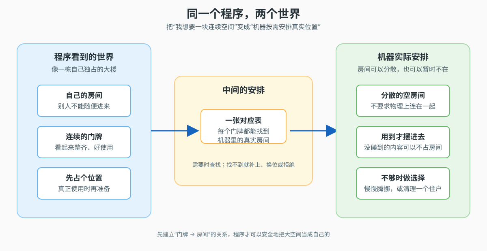
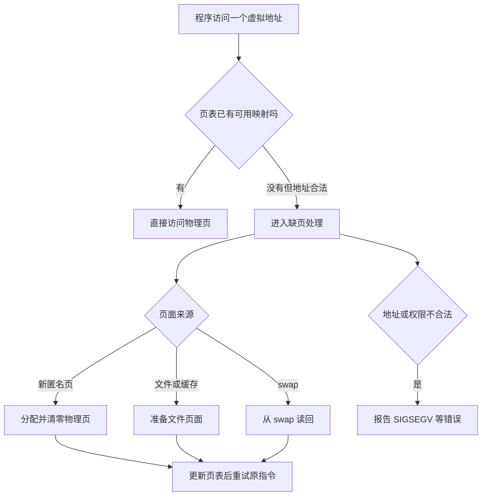
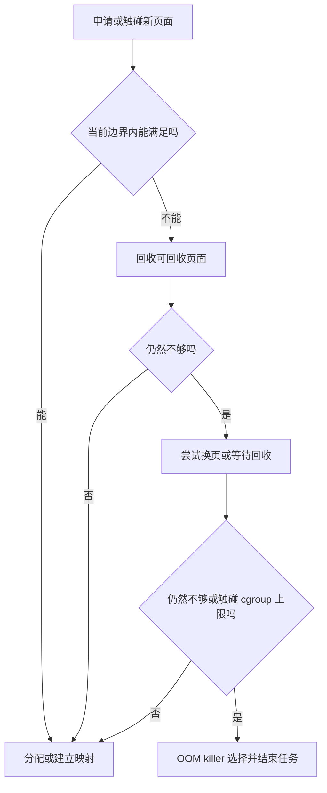
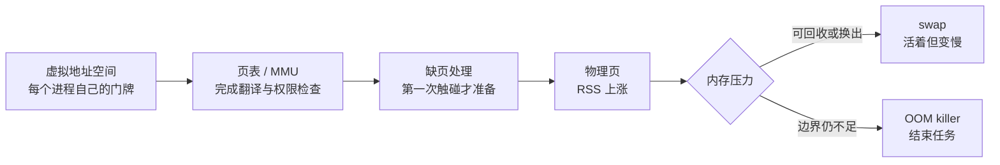

# 课 5 · 虚拟内存：每个进程都以为自己拥有一台机器

> 所属阶段：阶段 2《存储金字塔》｜实操环境：ubuntu:26.04 容器（Docker Desktop on macOS arm64）｜本课实测于 2026-09-15｜5.1 为**面试高频**
> 故事情节：`order-service` 终于能读懂缓存速度，却在一次批量请求里撞上了新的谜题：进程说自己“占了 1 GiB”，机器却没有立刻少掉 1 GiB；等请求真正扫过这块区域，内存又突然冲高，最后甚至可能被容器杀掉。
> 📖 结论已按官方文档核对（核对于 2026-09 ｜来源：[mmap(2)](https://man7.org/linux/man-pages/man2/mmap.2.html)、[proc_pid_status(5)](https://man7.org/linux/man-pages/man5/proc_pid_status.5.html)、[proc_sys_vm(5)](https://man7.org/linux/man-pages/man5/proc_sys_vm.5.html)、[Linux Kernel Overcommit Accounting](https://www.kernel.org/doc/html/latest/mm/overcommit-accounting.html)）

## 📌 知识点导航

| # | 知识点 | 状态 |
|---|--------|------|
| 5.1 | 虚拟地址空间与页表（面试高频） | ✅ |
| 5.2 | 缺页中断与按需加载 | ✅ |
| 5.3 | 内存不足的两种死法：换页与 OOM | ✅ |

## 🎯 本课目标

学完本课你将能：

- 解释一个进程的虚拟地址如何经过 MMU 和页表找到物理内存，并说清虚拟内存为什么必须存在
- 用 `VmSize` / VSZ 与 `VmRSS` / RSS 区分“申请了多大的地址空间”和“当前真正驻留了多少物理页”
- 区分换页与 OOM：前者通常是**活着但变慢**，后者是内核为了保住系统而**杀掉任务**

## 📖 文档核对（写前留痕）

本课动笔前按课程索引核对了 `mmap(2)`、`proc_pid_status(5)` 与 `proc_sys_vm(5)`，并对照 kernel.org 的 overcommit 文档。核对出的三个容易被旧教程带偏的点如下：

| 容易混淆的说法 | 官方文档核对结果 | 本课处理 |
|---|---|---|
| “`mmap` 返回成功，就代表所有页面已经在内存里” | 默认映射只建立地址范围；`MAP_POPULATE` 才是尝试预填页表，且填充失败时调用本身也不一定失败 | 用“映射后不触碰 / 逐页触碰”实验拆开观察 |
| “`VmRSS` 是绝对精确的物理占用” | `VmRSS` 是 `RssAnon + RssFile + RssShmem` 的和，但 man page 明确提示该值可能不精确 | 用它看趋势和数量级，不把单次读数当审计账本 |
| “OOM 一定杀触发申请的那个进程” | `oom_kill_allocating_task=0` 时，内核会按启发式扫描候选任务；cgroup OOM 还受内存控制组边界影响 | 讲 `oom_score` / `oom_score_adj`，不背“谁申请谁死” |

---

## 第一幕：起源与场景引入

周五晚，`order-service` 的批量导出接口又报警了。工程师先看见一个很吓人的数字：进程的 VSZ 接近 1 GiB。可是同一时刻，机器的可用内存并没有少掉 1 GiB，服务也没有立刻变慢。

几分钟后，导出逻辑开始从头扫过这块区域，RSS 突然上涨；在有内存上限的容器里，进程甚至可能直接消失。**同一个“申请 1 GiB”动作，为什么会先像只占了一点点，后来又真的吃掉一大块？**

> 🎬 **场景**：你面对一台内存有限的 Linux 机器，必须判断“进程只是画了一块大地图”，还是“已经把真实房间都住满了”。

> 📌 **一句话本质**：虚拟内存把每个程序看到的空间变成各自独立的一套门牌；真正用到哪一块，机器才为哪一块准备真实房间。
>
> ⚖️ **处境对照**：不用这层安排，程序必须直接管理机器上的真实位置，进程之间容易互相覆盖；用了它，程序可以先看到一大片连续空间，而没碰到的部分暂时不占同等规模的驻留内存。本课实验中，1 GiB 映射在“只建立关系”时 RSS 约 11 MiB，逐页写入后才升到约 1,034 MiB。

## 第二幕：认知冲突

先别急着记名词，盯住三个矛盾：

1. **每个进程都说自己从 0 开始拥有一片大空间**，但机器的物理内存只有一份，多个进程怎么不撞车？
2. **申请成功不等于页面已经在 RAM 里**，那第一次读写时到底发生了什么？
3. **内存真的不够时**，系统是把某些东西暂时挪到更慢的地方，还是直接结束一个进程？两种结果对线上延迟意味着什么？

> ❓ **问题**：`order-service` 的 VSZ、RSS、Swap、OOM 日志，究竟分别在描述哪一层现实？

## 第三幕：层层揭示

### 一眼全局图：先看“门牌”和“房间”的关系



> 看图：左边是程序眼里连续、独占、可以先占位的空间；右边是机器实际把内容分散安排、按需准备的房间；中间那张对应表把两边接起来。

### 本课地图：分三步走

| 步 | 这一步要解决什么（人话） | 对应知识点 |
|:--:|------------------------|-----------|
| 1 | 先让每个程序拥有自己的连续视角 | 知识点 5.1：虚拟地址空间与页表 |
| 2 | 再看真正碰到某块空间时，机器如何把它准备出来 | 知识点 5.2：缺页中断与按需加载 |
| 3 | 最后处理房间真的不够：是慢慢腾挪，还是结束住户 | 知识点 5.3：内存不足的两种死法：换页与 OOM |

### 知识点 5.1：虚拟地址空间与页表（面试高频）

> 🧭 **第 1/3 步｜承接**：刚才的冲突是“每个进程都像拥有一整片空间，却共用一台机器” → 本步先解决“程序看到的地址如何找到真实位置”。

#### 一句话定义

**虚拟内存**是一层地址映射机制：程序使用的是自己的虚拟地址，硬件和内核通过页表把它翻译成物理内存中的页框地址。

#### 直觉建立（类比）

把一栋大型办公楼想成物理内存，把每个进程想成一个租户。每个租户都拿到一套“自己的门牌号”：它可以说“我要去 0x1000”，而不必知道这扇门在整栋楼的哪个真实房间。物业手里有一张对应表，负责把租户门牌指到实际房间。

这就是第一幕说的“连续门牌 → 真实房间”：程序只和自己的门牌打交道，内核负责安排真实位置。

> 💡 **类比的边界**：办公楼里的门牌通常不会因为没人进入就改变；虚拟内存的映射可以随着换页、共享、写时复制而变化。并且“门牌很多”不代表同等数量的真实房间已经被占用——这正是 5.2 的按需加载。

#### 核心原理：为什么不能让进程直接用物理地址

有三个现实问题逼出了虚拟地址：

1. **隔离**：进程 A 不能随便读写进程 B 的数据；否则一个数组越界就可能覆盖别人的代码。
2. **重定位**：程序不应该关心自己被装进哪一段物理内存；机器重启、进程启动顺序变化，都不应要求重新编译程序。
3. **超配**：程序可以先申请一个很大的地址范围，真正用到时再逐页兑现；否则所有“预留但暂时不用”的空间都要立刻占据物理内存。

在 Linux 里，地址空间通常按固定大小的**页（page）**切分。页是虚拟内存管理的基本搬运单位；本课容器实测基础页大小为 **4096 bytes**，但更大的 huge page 是另一种配置，不能把 4096 当成所有机器、所有映射的唯一粒度。

虚拟地址可以粗略拆成两部分：

- **页号**：告诉系统要查哪一项映射
- **页内偏移**：告诉系统在这一页的第几个字节

页表把“虚拟页号”指向“物理页框”，并附带读、写、执行、是否存在等权限和状态。程序发出访问后，CPU 中的 **MMU（Memory Management Unit，内存管理单元）**负责完成翻译；常用的映射会进入 **TLB（Translation Lookaside Buffer，地址翻译后备缓存）**，避免每次都从头走页表。


> 看图：先尝试快速查找；没命中就查页表；找到有效页框后再加上页内偏移，最终才访问真实内存。

**多级页表**的直觉是“把一张巨大通讯录拆成多级目录”。如果一个进程只用到了地址空间的少数区域，内核不必为整张巨大表一次性创建所有末级条目；这节省页表自身的内存。代价是翻译路径更复杂，所以 TLB 命中很重要。

#### 示例演示：看看一个进程的“地图”

下面命令查看当前 shell 的部分地址映射。地址每次运行可能不同，这是地址空间随机化等机制的正常表现；我们关心的是**区域的形态和权限**，不是背某个十六进制地址。

```bash
docker run --rm --platform linux/arm64 ubuntu:26.04 bash -c '
  pid=$$
  printf "pid=%s page_size=%s\n" "$pid" "$(getconf PAGESIZE)"
  grep -E "r-xp|rw-p|\\[heap\\]|\\[stack\\]" "/proc/$pid/maps" | head -n 12
'
```

本次实测的关键输出：

```text
pid=1 page_size=4096
... r-xp ... /usr/bin/bash
... rw-p ... /usr/bin/bash
... rw-p ... [heap]
... r-xp ... /usr/lib/aarch64-linux-gnu/libc.so.6
... rw-p ... /usr/lib/aarch64-linux-gnu/libc.so.6
```

`r-xp` 可以读、可执行但不是共享写入；`rw-p` 可以读写、私有映射；`[heap]` 是堆的一段。这里看到的是**虚拟地址空间的分区地图**，不是物理内存条上的连续布局。

#### 常见误区

1. **“虚拟地址就是假的，所以不重要”**：程序所有指针、数组下标和返回地址都在使用它；它是程序可见的真实接口，只是由硬件和内核负责翻译。
2. **“页表里存着整页数据”**：页表主要存映射关系、权限和状态；真正的数据在物理页、文件或 swap 等位置。
3. **“每个进程都有同样的物理内存”**：每个进程拥有自己的地址空间视角，但物理页可能私有、共享、文件映射或暂时不存在。

#### 一句话记住

**虚拟地址给程序一套独立门牌，页表把门牌接到真实房间；隔离、重定位和超配都靠这层翻译。**

#### 🗣️ 行话对照

- **虚拟地址空间（virtual address space）**：就是本课说的“程序看到的整套门牌”；在哪遇到：`/proc/<pid>/maps`、`ps` 的 VSZ、`mmap(2)` 文档。
- **MMU（Memory Management Unit）**：就是负责把门牌翻译成真实位置的硬件单元；在哪遇到：CPU 架构手册、页表和地址翻译性能分析。
- **TLB（Translation Lookaside Buffer）**：就是缓存最近查过的门牌对应关系；在哪遇到：`perf` 的 TLB 相关事件、上下文切换和访存性能分析。

#### 📚 官方文档

- [`mmap(2)`：内存映射、页粒度与匿名映射](https://man7.org/linux/man-pages/man2/mmap.2.html)
- [`proc_pid_status(5)`：进程状态与内存字段示例](https://man7.org/linux/man-pages/man5/proc_pid_status.5.html)

### 知识点 5.2：缺页中断与按需加载

> 🧭 **第 2/3 步｜承接**：5.1 只说明“门牌如何找到房间”，但没有回答“程序第一次走到一扇还没准备好的门时怎么办” → 本步把申请、触碰和驻留拆开。

#### 一句话定义

**缺页异常（page fault，常被称为缺页中断）**是 CPU 发现当前访问的虚拟页还没有可直接使用的物理页，转交内核处理；处理成功后，原指令通常可以重新执行。

#### 直觉建立（类比）

酒店预订和入住不是一回事：你可以先预订一整层房间，但酒店不必在你入住前把每张床都铺好。你第一次打开某个房间的门，前台才安排房间、搬来物品；如果这间房根本不属于你的预订，前台就会拒绝。

这就是第一幕里“先画大地图、后准备真实房间”。

> 💡 **类比的边界**：酒店前台通常只处理一次登记；内核面对的是每个页面的访问，可能还要从文件或 swap 读数据、处理权限、更新页表和 TLB。缺页也不一定意味着“磁盘读”：页面可能只是被清零、已经在内存的其他位置，或属于写时复制场景（COW 留到课 7 展开）。

#### 核心原理：申请 ≠ 触碰 ≠ 驻留

把内存相关动作拆成三层：

1. **申请 / 建立映射**：分配器或 `mmap` 让一段虚拟地址范围归进程使用，`VmSize` 可能立刻上涨。
2. **触碰页面**：程序真正读写某个地址，CPU 发现页表还没准备好，触发 page fault。
3. **页面驻留**：内核找到或准备好一个物理页框，更新映射；此时 `VmRSS` 才会随驻留页数量明显上涨。

常见的缺页路径有四种：

| 访问情形 | 内核可能做什么 | 通常关注的代价 |
|---|---|---|
| 第一次访问匿名页 | 分配并清零物理页，建立映射 | 可能是 minor fault，代价相对小 |
| 访问文件映射但页面不在内存 | 从文件系统 / page cache 准备页面 | 可能是 major fault，涉及 IO |
| 访问被换出的匿名页 | 从 swap 读回页面 | 发生存储 IO，延迟明显上升 |
| 地址无效或权限不允许 | 不能修复，向进程发送 `SIGSEGV` 等错误 | 程序通常终止 |



> 看图：同一个“缺页”入口有两类结果——合法但尚未准备好的访问会补齐映射并重试，非法访问则不能补救。

#### 示例演示：用 VSZ 与 RSS 亲眼看见“申请”和“触碰”的分离

本实验使用匿名 `mmap`，是为了把“建立一大片地址范围”和“逐页写入”明确拆成两步；这比直接创建一个已经逐页初始化的 Python `bytearray` 更适合观察机制。容器是一次性的，Python 也只在容器里临时安装。

先启动一个容器：

```bash
docker run --rm -it --platform linux/arm64 ubuntu:26.04 bash
```

在容器内执行：

```bash
apt-get update -qq
DEBIAN_FRONTEND=noninteractive apt-get install -y -qq --no-install-recommends python3
cat > /tmp/vm-demo.py <<'PY'
import mmap
import os

size = 1024 * 1024 * 1024
page = os.sysconf("SC_PAGE_SIZE")
wanted = {"VmSize", "VmRSS", "RssAnon", "RssFile", "RssShmem", "VmSwap"}

def show(label):
    values = {}
    with open("/proc/self/status", encoding="ascii") as status:
        for line in status:
            key = line.split(":", 1)[0]
            if key in wanted:
                values[key] = line.split(":", 1)[1].strip()
    print(label, values, flush=True)

print(f"page_size={page} bytes mapping={size // 1024 // 1024} MiB")
show("before:")
region = mmap.mmap(-1, size, flags=mmap.MAP_PRIVATE | mmap.MAP_ANONYMOUS)
show("after mmap, before touch:")
for offset in range(0, size, page):
    region[offset] = 1
show("after touching one byte per page:")
region.close()
PY
python3 /tmp/vm-demo.py
```

本次实测输出如下（单次运行口径；基础进程大小会随镜像和 Python 版本变化）：

```text
page_size=4096 bytes mapping=1024 MiB
before: ['VmSize: 17428 kB', 'VmRSS: 10980 kB', 'RssAnon: 5400 kB', 'RssFile: 5580 kB', 'RssShmem: 0 kB', 'VmSwap: 0 kB']
after mmap, before touch: ['VmSize: 1066004 kB', 'VmRSS: 10980 kB', 'RssAnon: 5400 kB', 'RssFile: 5580 kB', 'RssShmem: 0 kB', 'VmSwap: 0 kB']
after touching one byte per page: ['VmSize: 1066004 kB', 'VmRSS: 1059556 kB', 'RssAnon: 1053976 kB', 'RssFile: 5580 kB', 'RssShmem: 0 kB', 'VmSwap: 0 kB']
```

把输出翻译成人话：

- `mmap` 之后，`VmSize` 增加约 1 GiB，说明进程的“门牌范围”变大了。
- 在没有触碰之前，`VmRSS` 仍约 11 MiB，说明绝大多数页面还没有驻留。
- 每 4096 字节写一个字节后，`VmRSS` 上升到约 1,034 MiB，说明逐页触发了缺页处理和物理页准备。
- `VmSwap=0 kB` 只说明本次实验没有发生换出；它不是“系统永远不会 swap”的证明。

这里的 `VmSize` / `VmRSS` 与命令行工具中的 VSZ / RSS 是同一类口径：**VSZ 更接近“进程的虚拟版图”，RSS 更接近“当前驻留在物理内存的部分”**。`proc_pid_status(5)`还提醒，`VmRSS` 是几个 RSS 字段之和，但数值可能不精确；排障时看趋势、差值和多个指标的组合。

#### 常见误区

1. **“缺页就是程序出错”**：合法的 demand paging 本来就依赖缺页；真正致命的是无法修复的地址或权限错误。
2. **“第一次访问一定读磁盘”**：匿名页常常只需分配和清零；文件映射、swap 回读才可能需要存储 IO。
3. **“VSZ 大就一定马上吃满内存”**：要结合 RSS、触碰模式、共享页、swap 和 cgroup 限制判断。

#### 一句话记住

**地址范围先画出来，页面第一次被碰到时才兑现；VSZ 看地图，RSS 看已经住进去的房间。**

#### 🗣️ 行话对照

- **缺页异常（page fault）**：就是本课说的“第一次打开还没准备好的房间”；在哪遇到：`perf stat -e page-faults`、内核内存分析和性能火焰图。
- **驻留集（resident set）/ RSS**：就是本课说的“当前住进 RAM 的页面”；在哪遇到：`ps -o rss`、`/proc/<pid>/status` 的 `VmRSS`。
- **虚拟内存大小（virtual memory size）/ VSZ**：就是本课说的“门牌版图大小”；在哪遇到：`ps -o vsz`、`/proc/<pid>/status` 的 `VmSize`。

#### 📚 官方文档

- [`proc_pid_status(5)`：VmSize、VmRSS、RssAnon、VmSwap 的字段定义](https://man7.org/linux/man-pages/man5/proc_pid_status.5.html)
- [`mmap(2)`：`MAP_ANONYMOUS`、页大小、`MAP_POPULATE` 与映射行为](https://man7.org/linux/man-pages/man2/mmap.2.html)

### 知识点 5.3：内存不足的两种死法——换页与 OOM

> 🧭 **第 3/3 步｜承接**：5.2 说明了“碰到页面就要兑现”，但如果所有房间都已经有人住了，系统不能凭空变出 RAM → 本步比较“慢慢腾挪”和“结束一个住户”两条路。

#### 一句话定义

- **换页（swapping / paging out）**：把暂时不活跃的页面移到 swap，腾出 RAM；进程还活着，但再次访问这些页面时可能付出很高的 IO 延迟。
- **OOM（Out Of Memory）**：回收、换页或受限额度仍不足时，内核启动 OOM killer，选择任务结束以释放资源，保住系统或该内存控制组。

#### 直觉建立（类比）

还是办公楼：第一种办法是把不常用的档案搬到地下仓库。住户还在，只是下次取档案要走很远，业务会变慢；如果住户反复取回、又反复搬走，就形成“来回搬家”，整栋楼几乎不办正事。

第二种办法是楼里已经没有可用房间、仓库也帮不上忙，物业只能清退一个住户，先让楼恢复可运转。清退谁不是“谁最后敲门谁必死”这么简单，而是根据占用、保护分数和当前内存边界做选择。

> 💡 **类比的边界**：swap 是存储空间，不是和 RAM 等价的“第二块内存”；它能改变系统的生存边界，却不能把存储延迟变成 RAM 延迟。OOM 也不只发生在整台机器完全没内存时，容器的 memory cgroup 达到 `memory.max` 就可能发生局部 OOM。

#### 核心原理：先回收，再换页，最后 OOM

压力下的粗略路径可以这样理解：

1. 内核先尝试回收可回收页面，例如干净的文件缓存；这部分会在下一课展开。
2. 对匿名、可换出的页面，系统可能把它们写入 swap；`swappiness`影响内核在回收与换页之间的倾向，不是“设成 0 就绝不会换页”的业务保证。
3. 如果仍无法满足分配，或者某个 memory cgroup 已到上限，就进入 OOM 处理。
4. OOM killer 依据当前上下文和启发式选择候选任务。`/proc/<pid>/oom_score`给出当前分数，`oom_score_adj`可以把任务向“更容易被杀”或“更不容易被杀”方向调整；`-1000`相当于强烈保护该任务。

Linux 的 overcommit 策略决定“申请地址空间时，系统提前检查到什么程度”：

| `vm.overcommit_memory` | 行话 | 人话 | 代价 / 边界 |
|---:|---|---|---|
| 0 | heuristic overcommit | 大致估算，拒绝明显离谱的申请 | 不是绝对保证；默认策略，但具体环境要以实测为准 |
| 1 | always overcommit | 先相信你，等真正用到时再面对资源压力 | 大量触碰后可能进入回收或 OOM |
| 2 | never overcommit | 申请阶段就严格按 commit limit 检查 | 更早失败，但更适合需要提前保证分配可兑现的场景 |

官方 overcommit 文档给出的核心变量是：`CommitLimit`、`Committed_AS`、物理 RAM、swap，以及 `overcommit_ratio` / `overcommit_kbytes`。这些是系统级承诺账本，不等于某一个进程当前 RSS。



> 看图：OOM 不是第一步；系统会先回收，必要时换页，只有仍无法满足当前边界时才进入“牺牲一个任务”的路径。

#### 示例演示一：观察本次容器的边界

本次普通实验容器的实际观测是：

```text
overcommit_memory=1
overcommit_ratio=50
swappiness=60
memory.max=max
memory.current=11276288
memory.swap.max=max
```

这组数只能描述**本次 Docker Desktop VM 与这个容器当时的环境**，不能写成所有 Linux 机器的默认答案。尤其是 `memory.max=max` 表示本次普通容器没有设置 cgroup 内存上限；生产容器通常会显式设置限制。

#### 示例演示二：在安全的 128 MiB 容器里触发 OOM

下面的实验把容器内存和容器可用 swap 都限制为 128 MiB，再申请并触碰 256 MiB。它的目标不是“把机器搞崩”，而是观察**局部 cgroup OOM**：

```bash
docker rm -f os-oom-demo 2>/dev/null || true
docker run --name os-oom-demo --memory=128m --memory-swap=128m \
  --platform linux/arm64 ubuntu:26.04 \
  perl -e 'my $x = "x" x (256 * 1024 * 1024); print "allocation completed\n"; sleep 30;'
printf 'docker run exit=%s\n' "$?"
docker inspect -f 'oom_killed={{.State.OOMKilled}} exit_code={{.State.ExitCode}}' os-oom-demo
docker rm os-oom-demo
```

本次实测输出：

```text
docker run exit=137
oom_killed=true exit_code=137
```

`137`通常表示进程以 `SIGKILL` 结束（128 + 9），但不要只凭退出码就断言 OOM；这里用 Docker 的 `State.OOMKilled=true` 做了更强的确认。注意这个实验的 OOM 边界是**容器自己的 memory cgroup**，不要求 Docker Desktop VM 整体先耗尽。

#### 常见误区

1. **“有 swap 就不会 OOM”**：swap 受大小、可换出页面类型、cgroup swap 上限和当前压力共同约束；它只是缓冲，不是无限续命。
2. **“OOM 一定杀最大进程”**：选择受 OOM 分数、`oom_score_adj`、内存控制组和当前分配域影响；要看内核日志与进程分数。
3. **“把 `swappiness` 调到 0 就等于关闭 swap”**：它表达回收倾向，不是对所有路径的绝对禁止。
4. **“主机还有空闲内存，容器就不可能 OOM”**：cgroup 可以先于主机整体耗尽触发局部 OOM。

#### 一句话记住

**换页是拿延迟换生存，OOM 是拿一个任务换系统继续运行；先看内存边界，再解释“谁为什么死”。**

#### 🗣️ 行话对照

| 本课说法（人话） | 行业标准叫法 | 典型配置 / 在哪遇到 | 代价 |
|---|---|---|---|
| 把暂时不用的东西搬到仓库 | swapping / paging out | `SwapFree`、`VmSwap`、`vm.swappiness` | 进程可继续运行，但回读会产生高延迟；反复搬运会 thrash |
| 系统内存真的撑不住了 | OOM（Out Of Memory） | 内核日志 `Out of memory`、`oom-kill`；`/proc/<pid>/oom_score` | 任务被杀，业务请求可能失败，但系统争取继续活着 |
| 给容器画一条内存红线 | memory cgroup limit | `/sys/fs/cgroup/memory.max`、Docker `--memory` | 超过边界可能局部 OOM；换来隔离和可预测的资源上限 |

#### 📚 官方文档

- [`proc_sys_vm(5)`：overcommit、OOM 相关 sysctl 与 swappiness](https://man7.org/linux/man-pages/man5/proc_sys_vm.5.html)
- [Linux Kernel：Overcommit Accounting](https://www.kernel.org/doc/html/latest/mm/overcommit-accounting.html)
- [Linux Kernel：OOM killer 概念说明](https://docs.kernel.org/admin-guide/mm/concepts.html)
- [Linux Kernel：`/proc/<pid>/oom_score_adj` 的 badness heuristic](https://www.kernel.org/doc/html/latest/filesystems/proc.html)

## 第四幕：实操验证——把 `order-service` 的“内存失踪”改写成证据

回到第一幕。面对一个显示 VSZ 接近 1 GiB 的进程，不要直接下结论“它已经吃掉 1 GiB 内存”，而是按这条顺序取证：

```bash
# 1. 先看进程的虚拟版图与驻留集（单位：KiB）
grep -E '^(VmSize|VmRSS|RssAnon|RssFile|RssShmem|VmSwap):' /proc/<PID>/status

# 2. 看系统级 overcommit 策略（只读）
cat /proc/sys/vm/overcommit_memory
cat /proc/sys/vm/overcommit_ratio
cat /proc/sys/vm/swappiness

# 3. 看容器是否有自己的 cgroup 边界（cgroup v2）
cat /sys/fs/cgroup/memory.max
cat /sys/fs/cgroup/memory.current
cat /sys/fs/cgroup/memory.swap.max

# 4. 如果怀疑 OOM，查内核 / 容器事件，而不是只看应用日志
dmesg -T 2>/dev/null | grep -Ei 'out of memory|oom-kill|killed process' || true
docker inspect -f 'oom_killed={{.State.OOMKilled}} exit_code={{.State.ExitCode}}' <容器名或ID>
```

> 容器内读取内核日志可能因权限被拒绝；这条命令无输出不等于没有 OOM。此时优先看 Docker 的 `State.OOMKilled`、退出码和宿主机/VM 日志。

> ✅ **回扣场景**：`VmSize` 大、`VmRSS` 小，说明“地图大、住户少”；触碰后 RSS 上涨，说明按需加载开始兑现；`memory.max` 很小且 `OOMKilled=true`，说明不是“Linux 随机杀进程”，而是明确撞上了容器资源边界。

一个够用的判断表：

| 看到的证据 | 更可能的解释 | 下一步 |
|---|---|---|
| VSZ 大、RSS 小、业务暂时正常 | 预留了地址空间，尚未大量驻留 | 观察访问模式，不要仅凭 VSZ 扩容 |
| RSS 持续上涨、VmSwap 仍为 0 | 页面正在被真正触碰，或工作集增长 | 查分配热点、请求规模和 cgroup 上限 |
| RSS 高、VmSwap 增长、延迟抖动 | 发生换页或换入换出压力 | 降低工作集 / 并发，继续查 IO 与内存压力 |
| 容器突然退出、`OOMKilled=true` | cgroup OOM 已发生 | 先止血降负载，再查 limit、峰值和分配路径 |

## 第五幕：体系收束

本课把“内存”从一个总量词拆成了三层现实：

1. **虚拟地址空间**：进程看到的连续门牌，解决隔离、重定位和超配。
2. **页表与缺页处理**：把门牌按页接到真实房间；访问到未准备的页时，内核补齐映射或报告错误。
3. **物理压力处理**：页面太多时，系统可能换页；边界仍不够时，OOM killer 结束任务。

放回整个存储金字塔：课 4 讲了 CPU 为什么喜欢连续访问；本课继续往下追问——**这些地址到底怎样落到物理页上**。下一课《cache 与 buffer：`free` 里的双胞胎》会解释为什么“缓存占了很多内存”常常不是内存泄漏，以及脏页为什么不能随便丢。

> 📍 **全局定位**：课 4 解决“CPU 访问数据为什么有快慢”，课 5 解决“进程看到的地址如何变成真实页面”，课 6 将解决“文件数据为什么也会占用内存、什么时候写回磁盘”。
> 🔗 **下一步**：学课 6，因为只有把 Page Cache、buffer、脏页和 `available` 接上，才能正确阅读 `free -h`，避免把可回收缓存误判成故障。

## 🐞 常见误区（本课合集）

1. **虚拟内存 = swap**：虚拟内存首先是地址翻译与隔离机制；swap 只是内存压力下可能使用的后备存储。
2. **`malloc` / `mmap` 成功 = RAM 已经付出**：申请、触碰、驻留是三个不同时刻。
3. **缺页 = bug**：合法 demand paging 会大量使用缺页；非法地址或权限错误才会走 `SIGSEGV` 等失败路径。
4. **RSS 是绝对精确的账本**：`proc_pid_status(5)`明确提醒相关值可能不精确，排障应看趋势、差值和上下文。
5. **容器有 swap 就安全**：内存 cgroup 的 `memory.max` / `memory.swap.max` 仍然可以先触发局部 OOM。

### ⏳ 与过时说法对照

| 旧说法 | 官方文档现状 | 来源 |
|---|---|---|
| “OOM 一定杀掉触发申请的进程” | `oom_kill_allocating_task=0` 时默认按启发式扫描候选任务；触发者只是候选之一 | [`proc_sys_vm(5)`](https://man7.org/linux/man-pages/man5/proc_sys_vm.5.html) |
| “`VmRSS` 就是精确的物理内存占用” | 它是 RSS 子项之和，但 man page 明确标注可能不精确 | [`proc_pid_status(5)`](https://man7.org/linux/man-pages/man5/proc_pid_status.5.html) |

## 一图总结



> 看图：从“程序看到的门牌”到“真实物理页”要经过翻译和缺页处理；真正的内存压力再分成“换页”与“OOM”两条后果不同的路径。

## 📋 命令速查卡

| 命令 / 文件 | 干什么 | 坑 |
|---|---|---|
| `getconf PAGESIZE` | 查看当前环境基础页大小 | 4096 是本次容器实测，不要当所有 huge page 的唯一大小 |
| `cat /proc/<PID>/maps` | 查看进程虚拟地址空间的区域 | 地址每次可能变化；重点看区域、权限和映射来源 |
| `grep -E '^(VmSize|VmRSS|VmSwap):' /proc/<PID>/status` | 对比虚拟版图、驻留集和换出量 | `VmRSS` 适合看趋势，不是精确审计账本 |
| `ps -o pid,vsz,rss,stat,comm -p <PID>` | 用 VSZ / RSS 快速看进程 | 单位和字段含义要与 `/proc` 口径对应 |
| `cat /proc/sys/vm/overcommit_memory` | 查看 overcommit 策略 | 0/1/2 不是“性能等级”，是分配承诺策略 |
| `cat /proc/sys/vm/swappiness` | 查看换页倾向参数 | 不等价于“swap 开关” |
| `cat /sys/fs/cgroup/memory.max` | 查看 cgroup 内存上限 | `max` 表示该层未设置上限，不代表主机无限内存 |
| `docker inspect -f 'oom_killed={{.State.OOMKilled}}' <容器>` | 确认容器是否被 OOM killer 杀掉 | 退出码 137 单独看不够，最好结合 `OOMKilled` |

## 📚 官方文档

- [`mmap(2)`](https://man7.org/linux/man-pages/man2/mmap.2.html)
- [`proc_pid_status(5)`](https://man7.org/linux/man-pages/man5/proc_pid_status.5.html)
- [`proc_sys_vm(5)`](https://man7.org/linux/man-pages/man5/proc_sys_vm.5.html)
- [Linux Kernel：Overcommit Accounting](https://www.kernel.org/doc/html/latest/mm/overcommit-accounting.html)
- [Linux Kernel：OOM killer 概念说明](https://docs.kernel.org/admin-guide/mm/concepts.html)

## 课后小测

**Q1.** 一个进程 `VmSize=1.1 GiB`、`VmRSS=20 MiB`，最合理的第一判断是什么？

<details><summary>答案</summary>

它拥有较大的虚拟地址空间，但只有约 20 MiB 当前驻留在物理内存；可能有大量页面尚未触碰。不能仅凭 VmSize 断言它已经占满 1.1 GiB RAM，下一步应观察触碰后的 RSS、`VmSwap` 和 cgroup 限制。
</details>

**Q2.** 为什么匿名 `mmap` 后，逐页写入会让 RSS 大幅上涨？

<details><summary>答案</summary>

映射阶段主要建立了虚拟地址范围；逐页写入时，每个尚未准备好的虚拟页触发缺页处理，内核分配并清零物理页、更新页表，页面成为 resident，所以 RSS 上涨。实验里 4096 字节是本次容器的基础页大小。
</details>

**Q3.** “换页”和“OOM”最大的可观测区别是什么？

<details><summary>答案</summary>

换页通常表现为进程仍在但延迟升高、`VmSwap` 或系统换入换出活动增加；OOM 表现为任务或容器被强制结束，容器可用 `State.OOMKilled=true` 取证。二者都要先确认实际内存边界：整机、进程限制还是 cgroup 限制。
</details>

---

## 🚀 下一批接力提示词

> 本阶段课 5 已完成。若继续按大纲学习，复制下面这段文字发给 AI，即可进入阶段 2 的收官课：

```text
继续学 Linux 操作系统基础。我的学习档案在 operating-system/00-学习档案.md，
刚学完阶段 2 课 5《虚拟内存：每个进程都以为自己拥有一台机器》知识点 5.1、5.2、5.3，
Docker Desktop 已启动，请按大纲继续讲解课 6《cache 与 buffer：free 里的双胞胎》
（6.1 Page Cache / 6.2 buffer 与脏页回写 / 6.3 free -h 解读实战）。
```

## 🧭 课程导航

| | 链接 |
|---|---|
| ⬅️ 上一课 | [课 4《CPU 缓存：为什么遍历数组比链表快》](lesson-04-CPU缓存为什么遍历数组比链表快.md) |
| ➡️ 下一课 | [课 6《cache 与 buffer：free 里的双胞胎》](lesson-06-cache与buffer-free里的双胞胎.md) |
| 📖 返回目录 | [02-课程目录](../../../02-课程目录.md) |
