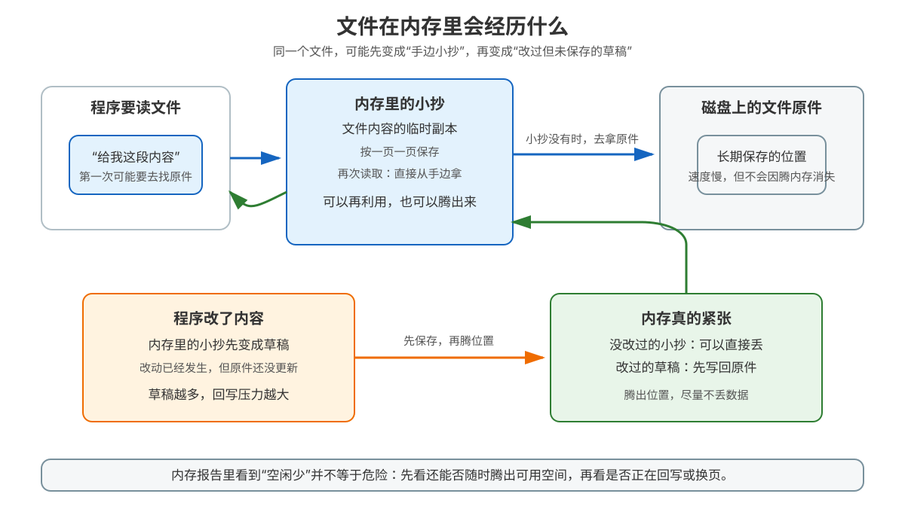

# 课 6 · cache 与 buffer：free 里的双胞胎

> 所属阶段：阶段 2《存储金字塔》｜实操环境：ubuntu:26.04 容器（Docker Desktop on macOS arm64）｜本课实测于 2026-09-15
> 故事情节：order-service 的进程没有明显变大，free -h 却显示 buff/cache 占了好几 GiB。工程师一度以为“内存被吃光了”，直到写文件、sync 和回收实验把这对“看起来像占用、其实可回收”的双胞胎拆开。
> 📖 结论已按官方文档核对（核查于 2026-09 ｜来源：[free(1)](https://man7.org/linux/man-pages/man1/free.1.html)、[proc_meminfo(5)](https://man7.org/linux/man-pages/man5/proc_meminfo.5.html)、[sync(2)](https://man7.org/linux/man-pages/man2/sync.2.html)、[fsync(2)](https://man7.org/linux/man-pages/man2/fsync.2.html)、[Linux VFS](https://docs.kernel.org/filesystems/vfs.html)）

## 📌 知识点导航

| # | 知识点 | 状态 |
|---|--------|------|
| 6.1 | Page Cache：内核替你记的文件小抄 | ✅ |
| 6.2 | buffer 与脏页回写 | ✅ |
| 6.3 | free -h 解读实战 | ✅ |

## 🎯 本课目标

学完本课你将能：

- 解释文件为什么会先进入内核的 Page Cache，以及“第二次读取更快”成立的条件
- 区分干净页、脏页、正在回写的页，知道 sync、syncfs、fsync 和自然回写分别承诺什么
- 读懂 free -h 的 free、buff/cache、available，不再把“可回收的缓存”误判为泄漏
- 在 Docker Linux 容器里用 /proc/meminfo 和真实数字验证结论，同时知道容器实验与宿主机内存的边界

## 📖 文档核对（写前留痕）

本课动笔前按课程索引核对了 free(1)、proc_meminfo(5)、sync(2) 和 fsync(2)，并对照 kernel.org 的 VFS 文档。三个必须先钉死的口径如下：

| 容易混淆的说法 | 官方文档核对结果 | 本课处理 |
|---|---|---|
| “free 大，内存就快没了” | used = total - available；available 是无需换页即可启动新程序的估算值 | 先看 available，再看 free；不拿 free 单独报警 |
| “Cached 就是应用自己申请的缓存” | Cached 是从磁盘读入的文件内容所在的内存缓存，buff/cache 还包含 Buffers 和一部分可回收 slab | 用“内核的文件小抄”解释，不把应用堆、Page Cache、CPU cache 混为一谈 |
| “sync 之后所有数据都绝对落到物理盘” | sync 让待处理的文件系统元数据和缓存数据写向底层文件系统；设备与文件持久化语义仍需结合 fsync、设备缓存和存储介质理解 | 把“开始写回 / 系统调用完成 / 掉电后可恢复”拆成三层边界 |
| “普通容器里随时可以清空 Page Cache” | /proc/sys/vm/drop_caches 是全局 VM 开关；本次普通容器写入得到 Read-only file system | 不用 --privileged 影响 Docker Desktop 共享 VM，只记录安全的权限边界 |

---

## 第一幕：起源与场景引入

周五晚，order-service 正在生成一份大订单报表。服务先打开日志和数据文件，随后重复读取同一批订单。你执行：

~~~bash
free -h
~~~

看到：

~~~text
               total        used        free      shared  buff/cache   available
Mem:            7.7Gi       4.9Gi       742Mi       353Mi       2.6Gi       2.8Gi
~~~

直觉会说：“free 只剩 742 MiB，机器快没内存了。”可是报表还能正常运行，第二次读同一份文件还更快。为什么内存明明被占着，却又像随时可以拿出来？

> 🎬 **场景**：你要判断的是“内存真的被某个进程吃住了”，还是“内核把暂时空闲的房间拿来放文件小抄，必要时可以撕掉重写”。

> 📌 **一句话本质**：Linux 会把空闲内存主动用作文件缓存；free -h 里的 buff/cache 往往是可回收的工作集，不等于不可动的泄漏。
>
> ⚖️ **处境对照**：如果完全不用缓存，每次读文件都要重新等待存储设备；如果缓存不可回收，程序又会被“缓存”反过来挤死。本课真正要学的是：**缓存要敢于使用，也要能在压力下让路**。

## 第二幕：认知冲突

先盯住四个看似矛盾的事实：

1. **读文件会让内存看起来更满**，但这可能是性能优化，不是故障。
2. **写文件后数据可能还只在内存里**，Dirty 上升说明“改过但尚未完成回写”。
3. **sync 前后 free -h 的数字可能变化不大**，但脏页状态已经发生关键变化。
4. **free 很小不必然危险，available 很小才更值得警惕**；而在容器里，还要额外看 cgroup 限制。

> ❓ **问题**：如果一个程序写入 64 MiB 文件，哪一个数字应该变化？Cached、Dirty、available，还是它们都会变化？接下来用三个知识点逐层拆开。

## 第三幕：层层揭示

### 一眼全局图：文件在内存里会经历什么

> 看图：先沿“读取”方向看，理解文件内容为什么进入内存；再沿“修改”方向看，理解干净页和脏页的分叉；最后看“内存压力”，理解可回收与必须回写的差别。

### 本课地图：三步读懂一条命令

| 步 | 这一步要解决什么（人话） | 对应知识点 |
|:--:|------------------------|-----------|
| 1 | 文件为什么会在内存里留下“小抄”，以及这份小抄什么时候能复用 | 知识点 6.1：Page Cache |
| 2 | 修改后的“小抄”为什么不能直接扔，以及谁负责把它写回文件 | 知识点 6.2：buffer 与脏页回写 |
| 3 | free -h 每一列到底在说什么，如何从读数走到下一步动作 | 知识点 6.3：free 解读实战 |

### 知识点 6.1：Page Cache——内核替你记的文件小抄

#### 一句话定义

**Page Cache 是内核按页缓存文件内容的地方**：程序通过文件读写访问数据时，内核可以把文件页留在内存里，后续访问同一内容时先从内存满足。

#### 直觉建立：图书馆的复印件

把磁盘上的文件想成图书馆的原书，把内存里的 Page Cache 想成服务台旁边的复印件。第一次查资料，管理员要去书库取原书并复印；下一位读者查同一页，可以直接拿复印件。

但这个类比有一个重要边界：复印件不是永久资产。内存紧张时，**干净的复印件可以直接丢掉**，以后再从原书复制；如果复印件上有你写的新批注，它就变成“改过但还没归档”的脏页，不能无条件丢弃，必须先写回文件。

#### 核心原理：读路径与缓存命中

一次普通文件读取可以先用这个简化模型理解：

~~~mermaid
flowchart LR
    A[程序读取文件] --> B{内核内存里已有这一页吗}
    B -->|是：缓存命中| C[直接复制到程序缓冲区]
    B -->|否：缓存未命中| D[从存储设备读取文件页]
    D --> E[放入内核文件缓存]
    E --> C
    C --> F[程序继续处理]
~~~

“第二次更快”需要满足几个条件：

- 两次访问针对的是相同或重叠的文件页
- 中间没有被内存压力、主动回收或其他负载挤出
- 读取路径没有使用绕过 Page Cache 的直接 IO
- 性能瓶颈确实在存储访问，而不是 CPU 解码、锁竞争或网络等待

因此，“缓存命中”是一个**有条件的解释**，不是看到第二次变快就能断言的唯一原因。

Linux 的 /proc/meminfo 中，Cached 表示从磁盘读入的文件缓存，不包括 SwapCached；Buffers 是相对临时的原始磁盘块存储。free(1) 将 Cached 与 SReclaimable 等一起纳入 cache 口径，最终显示在 buff/cache 中。

#### 三种“缓存”不是一回事

| 名称 | 谁管理 | 缓存的对象 | 典型观测入口 | 失效边界 |
|---|---|---|---|---|
| CPU Cache | CPU 硬件 | 最近访问的指令和数据 | 性能计数器、缓存命中事件 | 只解决 CPU 与内存的速度差 |
| Page Cache | Linux 内核 | 文件内容的内存页 | /proc/meminfo 的 Cached、free -h | 只缓存文件页；压力下可回收，脏页需先回写 |
| 应用缓存 | 应用程序 | 业务对象、序列化结果、热点数据 | 应用指标、堆分析、业务日志 | 受应用淘汰策略和进程内存上限影响 |

课 4 讲的 CPU cache line 解决的是“CPU 取数据太慢”；本课 Page Cache 解决的是“存储设备取文件太慢”。两者都叫 cache，但层级、粒度和淘汰者不同。

#### 示例演示：为什么读文件会让“空闲内存”变少

下面是一组教学用的观测量级，不替代本机实测：

| 时刻 | free | Cached | available | 解释 |
|---|---:|---:|---:|---|
| 文件尚未读过 | 0.8 GiB | 1.1 GiB | 2.9 GiB | 有较多空闲页 |
| 读过 64 MiB 文件 | 0.7 GiB | 1.16 GiB | 2.9 GiB | 一部分空闲页变成文件小抄 |
| 内存受到压力 | 0.9 GiB | 0.92 GiB | 2.1 GiB | 一部分干净缓存被回收，给新分配让路 |

这里最重要的不是某一列的短暂增减，而是：**Cached 增加不等于应用永久占用增加；available 仍然较大时，系统通常仍有较大的无换页可用空间。**

#### 常见误区

1. **“Page Cache 是浪费内存”**：空闲内存不参与工作时，拿来缓存文件通常能减少存储 IO；它是性能资产。
2. **“Cached 越大越好”**：缓存必须服从工作集。真正要看的是命中收益、回收压力和 available，不是追求某个比例。
3. **“清缓存就能永久解决内存问题”**：清缓存只是丢掉可重建副本；如果是应用泄漏、脏页堆积或 cgroup 上限，问题仍会回来。
4. **“应用自己分配的内存都在 Cached”**：匿名堆通常不属于文件 Page Cache；要结合进程 RSS、匿名页和 cgroup 指标判断。

#### 一句话记住

**Page Cache 是内核替文件保留的可回收小抄：读得快，压力来时能让路；但改过的页不能不告而别。**

#### 🗣️ 行话对照

- **Page Cache**：本课说的“文件小抄”；在哪遇到：/proc/meminfo 的 Cached、VFS 文档、IO 性能排查。
- **cache hit / miss**：缓存命中 / 未命中；在哪遇到：重复读文件、数据库缓冲池、存储延迟分析。
- **direct IO**：绕过或减少 Page Cache 的 IO 路径；在哪遇到：数据库、日志系统和高吞吐存储；它不是“必然更快”的开关。

#### 📚 官方文档

- [proc_meminfo(5)：Cached、Buffers、MemAvailable 字段](https://man7.org/linux/man-pages/man5/proc_meminfo.5.html)
- [free(1)：cache 与 available 的计算口径](https://man7.org/linux/man-pages/man1/free.1.html)
- [Linux VFS：地址空间、脏页与回写](https://docs.kernel.org/filesystems/vfs.html)

### 知识点 6.2：buffer 与脏页回写

#### 一句话定义

**脏页是内存中的文件页已经被修改、但修改内容还没有完成写回；回写线程或显式同步会把它送回文件系统和存储设备。**

#### 直觉建立：桌面上的修改稿

把内存里的文件页想成桌面上的打印稿。你在打印稿上改了数字，桌面上的版本立刻是新版本，但档案柜里的原件还是旧版本。此时这张纸就是“脏的”。把修改誊回档案柜的过程就是回写。

Buffers 这个名字容易让人误以为“所有缓冲区都在这里”。在今天的 Linux 口径里，它主要是相对临时的原始磁盘块存储；文件内容缓存更多体现在 Cached。因此排障时不要用“buffer = 写缓存、cache = 读缓存”这句过度简化的口诀解释所有系统。

| 词 | 用人话说 | 主要观察字段 |
|---|---|---|
| clean page | 内存副本和存储上的文件内容一致，必要时可以丢掉 | Cached 等缓存统计 |
| dirty page | 内存副本改过，存储上的版本还没完全跟上 | Dirty |
| writeback | 正在把脏页写向底层文件系统/设备 | Writeback |
| buffer | 内核用于相对临时原始磁盘块存储的统计口径 | Buffers |

#### 核心原理：脏页如何回到磁盘

~~~mermaid
flowchart LR
    A[程序写文件] --> B[内存中的文件页被修改]
    B --> C[Dirty：改过但尚未完成回写]
    C --> D{触发回写的原因}
    D -->|后台回写阈值| E[内核写回线程]
    D -->|sync 或 syncfs| E
    D -->|文件 fsync| F[针对这个文件描述符]
    E --> G[Writeback：正在写]
    F --> G
    G --> H[底层文件系统与设备]
    H --> I[回写完成，页可重新视为干净]
~~~

Linux VFS 文档把页的状态分成“被修改”“进入回写”“回写完成”几个阶段。内核不会等应用主动调用 sync 才工作：后台回写会根据脏页比例、时间和系统压力推进；写入速度超过回写速度时，产生脏页的进程还可能被限速。

#### 示例演示：sync、syncfs 和 fsync 的边界

| 调用 | 范围 | 适合回答的问题 | 不应过度解读为 |
|---|---|---|---|
| sync() | 系统范围内待处理的文件系统元数据和缓存文件数据 | “把当前系统待写的内容推进回写” | 业务事务已经提交，也不是应用级替代品 |
| syncfs(fd) | fd 所在文件系统 | “只同步这个文件系统” | 只同步一个文件 |
| fsync(fd) | 一个打开文件的内容和相关元数据 | “这个文件的修改何时完成设备侧同步” | 目录项一定已同步；新建/重命名还可能需要目录 fsync |
| fdatasync(fd) | 文件数据以及保证读取所需的部分元数据 | “我主要关心文件内容” | 所有元数据变化都与 fsync 完全等价 |

可靠性要分三层说：

1. **内核已接收写入**：系统调用返回，数据通常已进入内核路径。
2. **已发起或完成回写**：Dirty / Writeback 反映状态；sync、fsync 的完成语义不同。
3. **掉电后仍可恢复**：还受文件系统、设备写缓存、设备是否正确处理 flush、存储介质和应用事务设计影响。

不要把“Dirty 归零”误写成“数据已经进入永久介质”。课程这里只讨论 Linux 观察口径，不替具体存储设备做超出文档的保证。

#### 实测：写入 64 MiB 文件前后看 Cached 与脏页

本次在 Docker Desktop 的一次性普通容器中执行。容器共享 Docker VM 的内核，因此读到的是该 VM 的全局内存视角；实验只写临时文件，不用特权模式，不清空共享 VM 的缓存。

~~~text
[before]
MemFree:=759804 kB
MemAvailable:=2886324 kB
Buffers:=59464 kB
Cached:=1383500 kB
Dirty:=120 kB
Writeback:=0 kB

[after_write]
MemFree:=715828 kB
MemAvailable:=2908496 kB
Buffers:=59740 kB
Cached:=1449280 kB
Dirty:=128 kB
Writeback:=12248 kB

[after_sync]
MemFree:=714040 kB
MemAvailable:=2906980 kB
Buffers:=59888 kB
Cached:=1449416 kB
Dirty:=8 kB
Writeback:=4 kB
~~~

可复算的观察：

- Cached 从 1,383,500 kB 增至 1,449,280 kB，增加 **65,780 kB，约 64 MiB**；文件写入同时让文件页进入内存缓存。
- sync 后 Dirty 从 128 kB 降至 8 kB，Writeback 从 12,248 kB 降至 4 kB；这说明待回写量在本次观察窗口内明显下降。
- free -h 的总列没有因为“写了 64 MiB”简单地按同样幅度变化；全局缓存、其他容器和内核回收活动会同时影响读数，所以要看趋势，不把单个瞬间数字当精确账本。

#### 常见误区

1. **“脏页就是内存泄漏”**：脏页是“尚未写回”的状态，可能是正常短暂积压；要看持续增长、回写速度和业务写入速度。
2. **“sync 等于事务提交”**：事务语义还需要应用、数据库和文件命名/目录操作共同保证；系统同步不是业务提交协议。
3. **“Writeback 越大越好”**：短暂的回写量很正常；长期堆积意味着存储或回写路径可能跟不上生产速度。
4. **“Buffers 大就一定是老系统”**：字段语义要以当前内核和 proc_meminfo(5) 文档为准，不要照搬旧版教材的“读缓存/写缓存二分法”。

#### 一句话记住

**脏页是内存里的新稿、存储里的旧稿；Dirty 看待写，Writeback 看正在写，sync / fsync 决定同步边界。**

#### 🗣️ 行话对照

- **dirty page**：改过但尚未完成回写的页；在哪遇到：/proc/meminfo、IO 抖动、写入限速。
- **writeback**：内核正在把脏页写回的过程；在哪遇到：Writeback、内核回写线程、IO 等待。
- **durability**：数据在故障或掉电后还能保留的程度；在哪遇到：数据库提交、日志落盘、存储设备可靠性。

#### 📚 官方文档

- [proc_meminfo(5)：Dirty 与 Writeback 字段](https://man7.org/linux/man-pages/man5/proc_meminfo.5.html)
- [sync(2)：系统范围、文件系统范围同步](https://man7.org/linux/man-pages/man2/sync.2.html)
- [fsync(2)：文件描述符同步与目录项注意事项](https://man7.org/linux/man-pages/man2/fsync.2.html)
- [Linux VFS：地址空间与写回状态](https://docs.kernel.org/filesystems/vfs.html)

### 知识点 6.3：free -h 解读实战（面试高频）

#### 一句话定义

**free -h 是对 /proc/meminfo 的一层摘要：它最重要的判断不是“free 还剩多少”，而是“在无需换页的情况下，大约还有多少内存可以给新工作”。**

#### 直觉建立：仓库盘点表

把总内存想成仓库总面积：

- free：现在完全空着的地面
- buff/cache：堆着可重新取回或重建的货物
- available：在不把住户赶去慢速仓库（换页）的前提下，大致还能腾给新货的空间
- used：free 工具显示的 total - available，不等于某个进程独占的不可回收内存

类比的边界是：available 不是精确承诺，也不是简单的 free + buff/cache；内核会估计哪些缓存和可回收内核对象能释放，但不会假设所有可回收对象都能无代价立即释放。

#### 核心原理：逐列拆读

free(1) 给出的关键关系可以写成：

| free -h 列 | 主要来源或关系 | 该列回答什么 |
|---|---|---|
| total | MemTotal | 这台 Linux 视角下总共有多少内存 |
| free | MemFree | 当前完全未使用的页有多少 |
| shared | Shmem | 共享内存相关统计有多少 |
| buffers | Buffers | 原始磁盘块等相对临时存储的统计 |
| cache | Cached + SReclaimable | 文件缓存和部分可回收 slab |
| buff/cache | buffers + cache | 可回收缓存类的合计显示 |
| available | MemAvailable | 无需换页即可启动新程序的大致可用量 |
| used | total - available | procps free 的摘要口径 |

读表时用这个顺序：

~~~mermaid
flowchart TD
    A[先看 available] --> B{是否持续很小或下降}
    B -->|否| C[free 小但 buff/cache 大通常不必惊慌]
    B -->|是| D[再看 swap、进程 RSS、cgroup 上限]
    C --> E[确认是否只是可回收 Page Cache]
    D --> F[区分换页、应用增长、脏页堆积或容器 OOM]
    E --> G[按证据决定是否继续排查]
    F --> G
~~~

#### 示例演示：本次容器的真实读数

本次实验容器中，free 版本为：

~~~text
free from procps-ng 4.0.4
~~~

同一时刻读取 /proc/meminfo 的关键值：

| 字段 | 实测值 | 约合 | 解读 |
|---|---:|---:|---|
| MemTotal | 8,024,332 kB | 7.7 GiB | Docker VM 这一视角的总内存 |
| MemFree | 721,776 kB | 704.9 MiB | 真正完全空闲的页 |
| MemAvailable | 2,850,616 kB | 2.72 GiB | 无需换页的大致可用量 |
| Buffers | 61,240 kB | 59.8 MiB | 原始块等相对临时存储 |
| Cached | 1,384,016 kB | 1.32 GiB | 文件内容缓存 |
| SReclaimable | 1,248,496 kB | 1.19 GiB | 可回收 slab 的一部分 |
| Dirty | 148 kB | — | 等待写回的内存 |
| Writeback | 0 kB | — | 当时正在写回的内存 |

这组数字告诉我们：free 只有约 705 MiB，但 available 约 2.72 GiB；此刻不能只因为 free 不大就宣布“内存不足”。还要注意，这是 Docker Desktop 共享 VM 的全局观测，不等于某个容器的 cgroup 配额。

#### 常见误区与排查动作

| 看到的现象 | 不要立刻下的结论 | 下一步证据 |
|---|---|---|
| free 很小、buff/cache 很大 | “内存泄漏” | 看 available、进程 RSS、cgroup 内存 |
| available 持续下降 | “一定是 Page Cache” | 看 Cached、匿名 RSS、Dirty、swap |
| Dirty 持续变大 | “sync 一次就永久解决” | 看写入速率、存储延迟、Writeback 和应用写入模式 |
| 主机 available 仍很大、容器却 OOM | “内核判断错了” | 看容器 memory.max、memory.current 和容器事件 |
| 想用 drop_caches 验证 | “直接 echo 3 就好” | 先确认实验隔离；普通容器通常无权写全局 VM 开关 |

容器实操时建议并排查看：

~~~bash
free -h
awk '/^(MemAvailable|Buffers|Cached|Dirty|Writeback|SReclaimable):/ {print}' /proc/meminfo
cat /sys/fs/cgroup/memory.current
cat /sys/fs/cgroup/memory.max
cat /sys/fs/cgroup/memory.events
~~~

最后三行是 cgroup v2 常见接口：它们回答“这个容器的内存边界和事件是什么”，不能用来替代主机的 free -h。

#### 一句话记住

**free 是空地，buff/cache 是可整理的货物，available 才是“无需换页大致还能给新工作多少空间”的关键估计。**

#### 🗣️ 行话对照

- **MemAvailable**：内核估算的无需换页可用内存；在哪遇到：free -h、内存告警阈值、主机容量判断。
- **buff/cache**：Buffers 与文件缓存/可回收 slab 的摘要；在哪遇到：容量监控和“内存去哪了”排查。
- **cgroup memory limit**：容器或服务可使用的内存边界；在哪遇到：memory.max、容器 OOM、编排平台资源限制。

#### 📚 官方文档

- [free(1)：各列公式与 available 的解释](https://man7.org/linux/man-pages/man1/free.1.html)
- [proc_meminfo(5)：内核内存字段定义](https://man7.org/linux/man-pages/man5/proc_meminfo.5.html)
- [Kernel memory cgroup 文档](https://docs.kernel.org/admin-guide/cgroup-v2.html)

---

## 第四幕：实操验证

### 实验 A：一次性观察写入、同步和缓存

Docker Desktop 已启动；下面命令使用一次性容器和临时文件。为了不影响同一 Docker VM 中的其他容器，**不使用 --privileged，也不强行写全局 drop_caches**。

~~~bash
docker run --rm --platform linux/arm64 ubuntu:26.04 bash -c '
  report() {
    echo "[$1]"
    free -h
    awk "/^(MemFree|MemAvailable|Buffers|Cached|Dirty|Writeback|Shmem|SReclaimable):/ {print \$1 \"=\" \$2 \" kB\"}" /proc/meminfo
  }
  report before
  dd if=/dev/zero of=/tmp/page-cache-demo.bin bs=1M count=64 status=none
  report after_write
  sync
  report after_sync
  cat /tmp/page-cache-demo.bin >/dev/null
  report after_cat
  echo "drop_caches attempt:"
  sh -c "echo 3 > /proc/sys/vm/drop_caches" 2>&1 || true
  rm -f /tmp/page-cache-demo.bin
'
~~~

下面保留第一次基准实验的关键实测结果；由于容器共享 Docker VM，其他容器、后台回写和全局缓存会改变基线，重跑时绝对数值可能不同，但应复现同一方向。

本次关键实测结果：

~~~text
after_write: Cached=1449280 kB, Dirty=128 kB, Writeback=12248 kB
after_sync:  Cached=1449416 kB, Dirty=8 kB,    Writeback=4 kB
Cached delta from before to after_write: 65780 kB ≈ 64 MiB
drop_caches: cannot create /proc/sys/vm/drop_caches: Read-only file system
~~~

这里有三个教学点：

1. 写 64 MiB 文件后，Cached 大约增加 64 MiB，说明文件页进入了内存缓存。
2. sync 后 Dirty 和 Writeback 明显降低，说明待写回状态推进了。
3. 普通容器写不了 drop_caches，不是实验失败，而是**隔离边界的证据**。这个开关影响 VM 级内核缓存，不能为了得到“干净的第二次读取”而把共享环境的缓存全部清掉。

注意：本次先用 dd 写文件，文件页已经被写路径带入缓存，所以紧接着 cat 不一定再产生明显的 Cached 增长。不要把“cat 没增加缓存”误解成“读文件不走 Page Cache”；这个实验验证的是写入与脏页回写，不是构造冷缓存命中率对照。

### 实验 B：把一行 free -h 变成证据链

遇到“内存不够”的告警时，按以下顺序记录，而不是只截图一行 free：

~~~bash
date
free -h
awk '/^(MemTotal|MemFree|MemAvailable|Buffers|Cached|Dirty|Writeback|SReclaimable|SwapTotal|SwapFree):/ {print}' /proc/meminfo
ps -eo pid,comm,rss,vsz,%mem --sort=-rss | head
cat /sys/fs/cgroup/memory.current 2>/dev/null || true
cat /sys/fs/cgroup/memory.max 2>/dev/null || true
cat /sys/fs/cgroup/memory.events 2>/dev/null || true
~~~

读数决策链：

| 先问 | 如果答案是“是” | 下一步 |
|---|---|---|
| available 是否持续很小？ | 主机无换页可用空间正在收紧 | 看 swap、RSS、匿名页、脏页和增长趋势 |
| buff/cache 是否占大头？ | 可能是可回收文件缓存 | 不先清缓存；观察压力下是否自动回收 |
| Dirty 是否持续增长？ | 写入速度可能超过落盘速度 | 看 IO 延迟、存储容量、回写和应用写入模式 |
| 容器 memory.current 是否接近 memory.max？ | cgroup 可能先于主机触发 OOM | 查容器事件、限制配置和进程 RSS |
| swap 是否增长、业务是否变慢？ | 可能发生换页压力 | 联系上一课 5.3 的换页/OOM 分叉，继续看 IO 与 cgroup |

### 实验安全边界

- 本课只使用一次性普通容器和 /tmp 临时文件；文件在容器退出时随容器删除。
- 不使用 --privileged，不写 /proc/sys/vm/drop_caches，不对共享 Docker VM 做全局缓存清空。
- 不把 Docker Desktop 容器里的全局 free -h 误写成某个容器的配额；容器配额要结合 cgroup v2 文件。
- 如果要研究冷缓存、回写限速或 OOM，另建明确隔离的实验环境，并给出资源上限；不要在有业务容器的共享 VM 上做破坏性实验。

## 第五幕：体系收束

### 阶段 2 的三层闭环

| 已学课程 | 解决的问题 | 现在如何串起来 |
|---|---|---|
| 课 4：CPU 缓存 | CPU 为什么喜欢连续访问 | CPU cache 让“已经在内存里的数据”更快 |
| 课 5：虚拟内存 | 进程看到的地址如何变成真实页 | 页表、缺页和 OOM 决定页面如何出现与消失 |
| 课 6：cache 与 buffer | 文件数据为什么也会占内存、何时回写 | Page Cache 连接“文件 IO”和“内存读数”，free 负责给出摘要 |

把三课压缩成一条因果链：

~~~mermaid
flowchart LR
    A[程序访问文件] --> B[虚拟地址与页表]
    B --> C[内核文件页进入 Page Cache]
    C --> D{只读还是改写}
    D -->|只读| E[干净页：压力下可回收]
    D -->|改写| F[Dirty：等待回写]
    F --> G[Writeback / sync / fsync]
    E --> H[free -h 中 buff/cache]
    G --> H
    H --> I[available：无需换页的大致可用量]
~~~

### 课后小测

#### Q1：free 只有 700 MiB，buff/cache 有 2.6 GiB，available 有 2.8 GiB，应该立刻报警吗？

答案

不应该只凭这三个数字报警。free 小可能只是空闲页被拿去做了可回收缓存；available 仍有 2.8 GiB，说明内核估计仍有较大无需换页的空间。还应结合趋势、swap、进程 RSS、Dirty 以及容器 cgroup 限制。

#### Q2：写入文件后 Dirty 上升，执行 sync 后下降，能否直接说“数据已经永久落盘”？

答案

不能这样绝对化。sync 推进系统范围待处理的文件系统元数据和缓存文件数据的同步；更细的文件级语义要看 fsync / fdatasync，而掉电可恢复性还取决于文件系统、设备写缓存和存储介质。正确表述是“本次观察到待回写状态明显下降”。

#### Q3：为什么本次写完 64 MiB 后，Cached 增加约 64 MiB，但 free -h 的所有列没有整齐地变化 64 MiB？

答案

free -h 展示的是整个 Docker VM 的摘要；其他容器、内核回收、后台回写、共享内存和单位换算会同时影响多列。并且 used 的口径是 total - available，不是“所有进程 RSS 的简单求和”。应同时记录 /proc/meminfo 关键字段和 cgroup 指标。

### 📋 命令速查卡

| 目的 | 命令 | 重点看什么 |
|---|---|---|
| 快速概览 | free -h | 先看 available，再看 buff/cache |
| 精读内核字段 | awk '/^(MemAvailable|Buffers|Cached|Dirty|Writeback|SReclaimable):/' /proc/meminfo | 文件缓存、脏页、回写和可回收 slab |
| 看文件系统同步 | sync | 系统范围同步请求 |
| 看单文件同步 | fsync(fd) | 需要在程序或调试工具中对文件描述符使用 |
| 看容器边界 | cat /sys/fs/cgroup/memory.current / memory.max | 当前用量、硬上限 |
| 看容器内存事件 | cat /sys/fs/cgroup/memory.events | 是否出现过 high / max / oom / oom_kill |
| 看大户 | ps -eo pid,comm,rss,vsz,%mem --sort=-rss \| head | RSS、VSZ 与进程排行 |
| 实验清理 | 一次性容器 + rm -f /tmp/page-cache-demo.bin | 不在共享 VM 上强制清空全局缓存 |

### 📚 本课官方文档

- [free(1)](https://man7.org/linux/man-pages/man1/free.1.html)
- [proc_meminfo(5)](https://man7.org/linux/man-pages/man5/proc_meminfo.5.html)
- [sync(2)](https://man7.org/linux/man-pages/man2/sync.2.html)
- [fsync(2)](https://man7.org/linux/man-pages/man2/fsync.2.html)
- [Linux VFS 文档](https://docs.kernel.org/filesystems/vfs.html)
- [cgroup v2 内存接口](https://docs.kernel.org/admin-guide/cgroup-v2.html)

### 🚀 接力提示词

> 继续学习 Linux 操作系统基础。我的学习档案在 operating-system/00-学习档案.md，刚学完阶段 2 课 6《cache 与 buffer：free 里的双胞胎》知识点 6.1、6.2、6.3，Docker Desktop 已启动，请按大纲继续讲解阶段 3 课 7《进程与线程：一段程序的两种形态》（7.1 进程：资源的独立包房 / 7.2 线程：共享正厅的服务员 / 7.3 进程 vs 线程选型的第一性原理）。

### 🧭 课程导航

| 方向 | 链接 |
|---|---|
| ⬅️ 上一课 | [课 5《虚拟内存：每个进程都以为自己拥有一台机器》](lesson-05-虚拟内存每个进程都以为自己拥有一台机器.md) |
| ➡️ 下一课 | [课 7《进程与线程：一段程序的两种形态》](../../3-进程与调度/lessons/lesson-07-进程与线程一段程序的两种形态.md) |
| ↩️ 返回目录 | [课程目录](../../../02-课程目录.md) |
