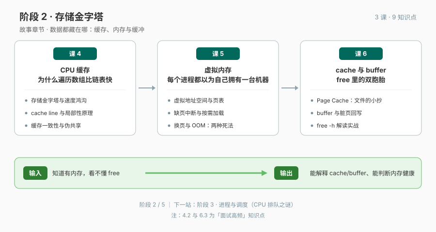

# 阶段 2 · 存储金字塔

> 数据都藏在哪：缓存、内存与缓冲。

## 🎯 阶段目标

学完本阶段，你能解释数据到底放在哪：从 CPU 的私人小抄（L1/L2/L3 缓存、cache line 与局部性原理），到每个进程的幻觉（虚拟内存、页表与缺页中断），再到 free 输出里那对双胞胎（cache 与 buffer）。最终能凭 `free -h` 判断一台机器的内存是否健康，不再被"内存快满了"吓到。

## 📖 故事章节定位

体检报告第二页——buff/cache 占了六成内存，这是"病"还是"没病"？答案藏在存储金字塔、页表与脏页回写里。

## 🔑 必须掌握的知识点

| 课 | 知识点 | 一句话要点 |
|----|--------|-----------|
| 课 4 | 4.1 存储金字塔与速度鸿沟 | 寄存器→L1→L2→L3→内存→磁盘每级差一个数量级；快与便宜的矛盾逼出层级 |
| 课 4 | 4.2 cache line 与局部性原理（面试高频） | 一次搬 64 字节不是 1 字节；数组比链表快一个数量级的真相在空间局部性 |
| 课 4 | 4.3 多核时代的新烦恼：缓存一致性与伪共享 | 每核私有 L1/L2 引出 MESI；两个线程写不同变量也会打架——同一条 cache line |
| 课 5 | 5.1 虚拟地址空间与页表（面试高频） | 隔离 + 重定位 + 超配；MMU 查页表完成翻译，每个进程都活在幻觉里 |
| 课 5 | 5.2 缺页中断与按需加载 | malloc 成功 ≠ 内存到手；VSZ 是申请的、RSS 是真占的 |
| 课 5 | 5.3 内存不足的两种死法：换页与 OOM | swap 拿时间换"不死"，OOM killer 直接杀进程腾地方；overcommit 决定何时触发 |
| 课 6 | 6.1 Page Cache：内核替你记的文件小抄 | 读文件第二次快是因为内核缓存了页；空闲内存拿去做 cache 不是泄漏 |
| 课 6 | 6.2 buffer 与脏页回写 | buffer 管块设备写的节奏；脏页改了还没落盘，断电能丢多少有边界 |
| 课 6 | 6.3 free -h 解读实战（面试高频） | 内存健康看 available 不看 free；buff/cache 可回收，不是"内存满了" |

## 🗺 本阶段路径图

## 课次一览

- 课 4《CPU 缓存：为什么遍历数组比链表快》（✅ 已交付，2026-09-10）
- [课 5《虚拟内存：每个进程都以为自己拥有一台机器》](lessons/lesson-05-虚拟内存每个进程都以为自己拥有一台机器.md)（✅ 已交付，2026-09-15）
- [课 6《cache 与 buffer：free 里的双胞胎》](lessons/lesson-06-cache与buffer-free里的双胞胎.md)（✅ 已交付，2026-09-15；阶段 2 闭环）
