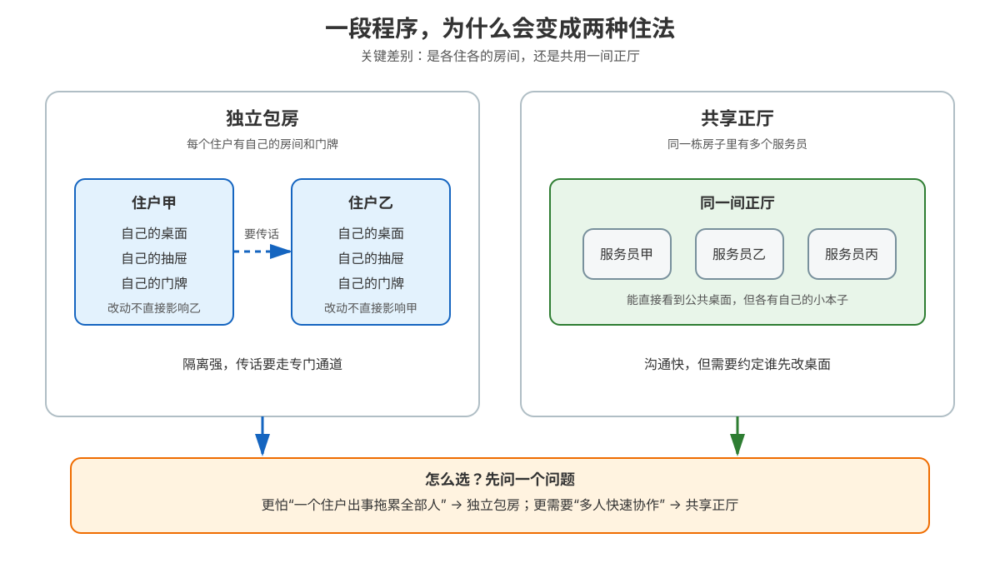

# 课 7 · 进程与线程：一段程序的两种形态

> 所属阶段：阶段 3《进程与调度》｜实操环境：Docker Linux（Ubuntu 26.04 + Python 3.13 slim 临时实验镜像）｜本课实测于 2026-09-15
> 故事情节：order-service 终于读懂了内存和缓存，下一次告警却换了一个问题：同一份程序，为什么有时启动多个独立副本，有时又在一个进程里开很多线程？它们到底共享什么，出了故障谁会连坐？
> 📖 结论已按官方文档核对（核查于 2026-09 ｜来源：[fork(2)](https://man7.org/linux/man-pages/man2/fork.2.html)、[clone(2)](https://man7.org/linux/man-pages/man2/clone.2.html)、[pthreads(7)](https://man7.org/linux/man-pages/man7/pthreads.7.html)、[proc(5)](https://man7.org/linux/man-pages/man5/proc.5.html)、[proc_pid_status(5)](https://man7.org/linux/man-pages/man5/proc_pid_status.5.html)）

## 📌 知识点导航

| # | 知识点 | 状态 |
|---|--------|------|
| 7.1 | 进程：资源的独立包房（面试高频） | ✅ |
| 7.2 | 线程：共享正厅的服务员（面试高频） | ✅ |
| 7.3 | 进程 vs 线程选型的第一性原理（面试高频） | ✅ |

## 🎯 本课目标

学完本课你将能：

- 用“资源包”解释进程，而不是把进程只理解成一个 PID
- 列出线程共享的资源与每条线程独享的资源，并能用 /proc 验证
- 从故障隔离、通信成本、并行能力和管理代价四个维度，为具体服务选择进程、线程或进程池/线程池

## 📖 文档核对（写前留痕）

本课动笔前按课程索引核对了 fork(2)、clone(2)、pthreads(7)、proc(5) 和 proc_pid_status(5)。重点确认了以下容易被简化过头的说法：

| 容易混淆的说法 | 官方文档核对结果 | 本课处理 |
|---|---|---|
| “fork 会把所有内存立刻复制一份” | Linux 使用写时复制；fork 的主要成本是复制页表和建立子任务结构，数据页在写入前可共享 | 用私有字节数组和显式共享内存对照实验 |
| “子进程拥有一套完全独立的文件” | 子进程得到文件描述符表的副本，但对应描述符指向同一个 open file description，可共享文件偏移和状态标志 | 把“fd 表副本”和“打开文件对象共享”拆成两层 |
| “线程就是轻量进程，所以什么都共享” | Pthreads 明确区分共享的全局/堆、fd、进程 ID 等与独享的栈、线程 ID、信号掩码等；Linux clone flags 还可以精细指定共享项 | 给出共享/独享矩阵，不用一句口诀覆盖全部情况 |
| “线程切换没有成本” | 同地址空间通常减少换页表等成本，但仍需保存寄存器、调度和同步；共享还会引入锁竞争与数据竞态 | 用“通常更便宜，不等于免费”表述 |

> 🧪 **实验环境说明**：Ubuntu 26.04 精简镜像本轮包索引下载停滞，未把安装过程继续拖入实验；进程树实验仍在 Ubuntu 26.04 中完成，涉及 Python 标准库的线程/COW 对照改用 python:3.13-slim。两者共享同一个 Docker Desktop LinuxKit 内核；镜像差异已显式标注，不把 Python 镜像的用户态版本冒充 Ubuntu。

---

## 第一幕：起源与场景引入

周五晚，order-service 收到一批订单请求。值班工程师想把工作拆开，于是出现了两种方案：

- 开两个服务副本：每个副本都有自己的地址空间，某个副本崩了，另一个可能还能继续接单。
- 在一个服务里开两个工作线程：它们可以直接访问同一份订单缓存，少绕几道通信路径。

两种方案都叫“并发处理”，但故障时的结果完全不同。一次实验也能看见这种形态差异：shell 进程派生出父子两个 PID；一个 Python 进程里开两个 worker 后，/proc 状态显示 Threads: 3，三个任务仍属于同一个 Tgid。

> 🎬 **场景**：你要给订单服务安排“住户”：是让每个住户住独立包房，还是让多名服务员共用一个正厅？

> 📌 **一句话本质**：进程把一段程序装进相对独立的资源包，线程则让多条执行路线住进同一个资源包里。
>
> ⚖️ **处境对照**：独立包房换来故障隔离，但住户之间传话要走专门通道；共享正厅换来直接协作，但一个服务员改坏公共桌面，其他人也可能被影响。本课实测中，一个进程里的两个 worker 共享同一个对象地址，而它们各有不同的 TID。

## 第二幕：认知冲突

先不要背“进程重、线程轻”，看四个真正会影响设计的矛盾：

1. **为什么 fork 后父子进程看起来拥有同样的内存，却又不会随便改到对方？**
2. **线程既然共享堆和全局变量，为什么还要有自己的栈和线程 ID？**
3. **进程和线程都能被调度到不同 CPU 上，为什么不能只选更快的那个？**
4. **一个 worker 崩溃时，你更想让整个服务退出，还是只让这一条执行路线退出？**

> ❓ **问题**：选型真正要优化的不是“创建动作快多少”，而是**隔离、共享和故障半径之间的交换**。第三幕把这笔账拆开。

## 第三幕：层层揭示

### 一眼全局图：同一段程序的两种住法

> 看图：左边是住户各有房间、传话要走通道；右边是服务员共享正厅、协作直接但要约定公共桌面的使用顺序。

### 本课地图：三步走完选型

| 步 | 这一步要解决什么（人话） | 对应知识点 |
|:--:|------------------------|-----------|
| 1 | 先看一个运行中的程序到底带着哪些家当 | 知识点 7.1：进程：资源的独立包房 |
| 2 | 再看同一份家当里为什么能有多条执行路线 | 知识点 7.2：线程：共享正厅的服务员 |
| 3 | 最后用故障、通信和成本做出选择 | 知识点 7.3：进程 vs 线程选型的第一性原理 |

### 知识点 7.1：进程——资源的独立包房（面试高频）

> 🧭 第 1/3 步｜承接：第二幕问“一个程序到底带着什么、为什么能和别的程序隔离” → 本步：把进程看成一套可被调度的资源包。

#### 一句话定义

**进程是一个正在运行的程序实例，以及它拥有的一组资源和状态。** PID 只是它在某个 PID 命名空间中的身份证号码，不是进程的全部。

#### 直觉建立：一间带家当的包房

把一间包房想成一个进程。房间里的桌面和抽屉对应地址空间，门口的物品清单对应打开的文件描述符，住户的身份卡对应凭据；服务员真正执行的动作，则是这个资源包里的执行流。

类比的边界是：真实 Linux 中资源可以被显式共享、映射或继承；进程不是一座绝对封闭的孤岛。fork 后文件描述符表是副本，但副本里的条目可能指向同一个打开文件对象；进程之间也可以通过管道、共享内存、socket 等通信。

#### 核心原理：进程的三件家当

| 家当 | 它回答什么 | 典型观测入口 | 关键边界 |
|---|---|---|---|
| 地址空间 | 这个进程能看到哪些代码、堆、栈和映射 | /proc/<pid>/maps、VmSize、VmRSS | 不同进程默认不能直接读写彼此的私有地址 |
| 打开文件表 | 这个进程手里有哪些文件描述符 | /proc/<pid>/fd | 表项可以复制；表项可能指向共享的 open file description |
| 凭据与身份 | 内核按谁的身份检查权限 | /proc/<pid>/status 的 Uid、Gid、CapEff | 用户/组 ID 通常是进程范围；Linux 还有线程级能力等细节 |

进程之间的隔离主要来自地址空间不同。fork 的直觉过程是：

~~~mermaid
flowchart LR
    A[父进程的资源包] --> B[fork]
    B --> C[父进程继续运行]
    B --> D[子进程开始运行]
    C --> E[两边先看到相同内存内容]
    D --> E
    E --> F{哪一边要写某页}
    F -->|否| G[页可暂时共享]
    F -->|是| H[内核复制该页再允许写]
~~~

> 看图：fork 不是把每个数据字节立刻复制两遍，而是先复制地址映射和任务结构；某一边真正写入时，写时复制才把隔离兑现。

这就是上一课虚拟内存的伏笔：地址空间的独立视角靠页表维持，fork 的写时复制则复用了“多个虚拟页暂时指向同一物理页”的能力。

#### 示例演示：进程树与 fork 返回值

在 Ubuntu 26.04 容器中，使用 shell 的后台任务观察父子关系：

~~~bash
docker run --rm --platform linux/arm64 ubuntu:26.04 bash -c '
  sleep 1 &
  child=$!
  sleep 0.1
  printf "parent_pid=%s child_pid=%s\n" "$$" "$child"
  awk -F: "/^(Name|Pid|PPid|Tgid|Threads):/ {
    gsub(/^[[:space:]]+/, "", $2)
    print $1 "=" $2
  }" "/proc/$child/status"
  wait "$child"
'
~~~

本次输出：

~~~text
parent_pid=1 child_pid=7
Name=sleep
Tgid=7
Pid=7
PPid=1
Threads=1
~~~

这里的重点不是 PID 数字，而是关系：子进程的 PPid 指向父进程；Tgid 与 Pid 相同，表示这个进程目前只有一条线程。

在 Python 的 fork 例子中，fork 成功后：

- 父进程得到子进程 PID
- 子进程得到返回值 0
- 失败时只有父进程返回错误，不会凭空多出一个子进程

fork 还涉及进程树的两个收尾概念：

- **孤儿进程**：父进程先结束，子进程仍在运行；内核会把它重新托管给某个“收养者”，使它仍能被回收。
- **僵尸进程**：子进程已经结束，但父进程还没通过 wait 类接口读取它的退出状态；它不再执行，却暂时保留退出记录。大量僵尸通常说明父进程的回收逻辑有问题。

#### 常见误区

1. **“PID 就是进程”**：PID 只是查找入口；地址空间、文件描述符、凭据、信号状态和调度状态才共同构成运行实例。
2. **“fork 立刻复制全部内存，所以一定很慢”**：Linux 的写时复制让未修改的数据页暂时共享；页表和任务结构仍有成本，不能说 fork 免费。
3. **“父子进程改同一个变量会互相看到”**：普通私有地址空间不会；若要共享，必须显式使用共享内存或其他 IPC。
4. **“子进程关闭一个 fd，父进程的 fd 一定也关闭”**：表项通常是各自的副本；但它们可能共同指向同一个打开文件对象，文件偏移等状态可能共享。

#### 一句话记住

**进程不是一个 PID，而是一套带地址空间、文件入口和身份状态的资源包；fork 先复制视角，写入时再用 COW 保持隔离。**

#### 🗣️ 行话对照

- **process**：本课说的“资源包”；在哪遇到：PID、PPID、VSZ/RSS、/proc/<pid>。
- **copy-on-write（COW，写时复制）**：本课说的“先共用、写时分开”；在哪遇到：fork、虚拟内存、容器启动优化。
- **open file description**：内核里的打开文件对象；在哪遇到：fork、dup、文件偏移、fcntl 文件状态标志。
- **zombie process**：本课说的“已经结束但退出记录尚未被取走的进程”；在哪遇到：ps 状态 Z、wait/waitpid、进程树排障。

#### 📚 官方文档

- [fork(2)：父子地址空间、文件描述符继承、COW 与返回值](https://man7.org/linux/man-pages/man2/fork.2.html)
- [proc(5)：/proc/pid 与 /proc/pid/task/tid 的组织](https://man7.org/linux/man-pages/man5/proc.5.html)
- [proc_pid_status(5)：Pid、PPid、Tgid、Threads 与凭据字段](https://man7.org/linux/man-pages/man5/proc_pid_status.5.html)

### 知识点 7.2：线程——共享正厅的服务员（面试高频）

> 🧭 第 2/3 步｜承接：7.1 说明一个进程是一套资源包，但“一个包里能否同时做多件事”仍未解释 → 本步：看多条线程如何共享家当、又保留自己的执行现场。

#### 一句话定义

**线程是进程内的一条独立执行路线；同一进程的线程共享进程级资源，但每条线程保留自己的栈、寄存器现场和线程身份。**

#### 直觉建立：共享正厅的服务员

把进程想成一家餐厅，把线程想成多个服务员。服务员共享厨房、菜单、账本和桌面上的订单，这对应堆、全局变量、打开文件和进程身份；每位服务员有自己的手写便签和当前动作，这对应栈、寄存器、线程 ID 和部分线程局部状态。

类比的边界是：真实线程并不是“只差一张便签”。它们还受到信号掩码、调度优先级、CPU 亲和性等规则影响；共享数据也不会自动安全，需要锁、原子操作或其他同步协议。

#### 核心原理：共享什么，独享什么

| 资源或状态 | 同一进程的线程是否共享 | 为什么重要 |
|---|---|---|
| 全局变量、堆 | 共享 | 协作直接，但数据竞态可能让结果不可预测 |
| 打开的文件描述符 | 共享文件描述符表 | 一个线程关闭 fd，其他线程可能立刻看到它失效 |
| 进程 ID、父进程 ID、用户/组 ID | 进程范围共享 | 系统观测时多个 TID 仍属于一个 Tgid |
| 每条线程的栈 | 独享 | 函数局部变量不应被另一条线程直接当作自己的局部变量 |
| 寄存器与执行现场 | 独享 | 调度器必须保存/恢复每条执行路线的现场 |
| 线程 ID、信号掩码 | 独享 | 用于定位某条执行路线和控制信号接收 |
| Linux CPU 亲和性、能力等 | 可按线程区分 | 不能把“进程级共享”扩大成所有属性都相同 |

Linux 的 clone 接口把“共享哪些部分”做成了 flags 组合。常见的三件套可以这样理解：

| 本课说法（人话） | 行业标准叫法 | 典型配置 / 在哪遇到 | 代价 |
|---|---|---|---|
| 共用同一张房产证和桌面 | CLONE_VM | clone(2)；共享虚拟地址空间 | 一个线程写坏共享数据，其他线程可见 |
| 共用同一排文件抽屉 | CLONE_FILES | clone(2)；共享 fd 表 | 关闭/修改 fd 状态会影响其他执行流 |
| 作为同一个住户的多名服务员 | CLONE_THREAD | Linux 线程库与线程组 | 需要正确处理线程退出、信号和回收 |

实际的 pthread 库会替应用组合这些底层机制；日常编程通常使用 pthread_create、Python threading、Java Thread 等更高层接口，而不是直接手写 clone flags。

同一进程的线程在 /proc 中有两层观察方式：

~~~text
/proc/<tgid>/status
/proc/<tgid>/task/<tid>/status
~~~

proc(5) 文档说明，/proc/<pid>/task/ 下的每个 tid 目录对应进程里的一个线程。proc_pid_status(5) 的 Threads 字段则告诉你包含当前线程的进程共有多少线程。

线程切换通常比跨地址空间的进程切换少一些地址空间相关成本，但它仍然要保存/恢复寄存器、经历调度，并可能引发锁等待、缓存争用和错误传播。因此正确说法是：**线程通常更轻，不是没有票价**。课 8 会进一步拆上下文切换的票价。

#### 示例演示：同一个 Tgid 下出现多个 TID

本次 Python 实验在 python:3.13-slim 中完成，使用 Docker Desktop 的 LinuxKit 内核和 /proc；它只演示 Linux 线程的资源关系，不把 Python 运行时性能当作本课结论。

~~~text
status={'Tgid': '1', 'Pid': '1', 'Threads': '3'}
task_tids=1,10,9
worker=label:A pid:1 tid:9 local:A shared_id:281473777781632
worker=label:B pid:1 tid:10 local:B shared_id:281473777781632
shared_box=A,B
~~~

读这组输出：

- 两个 worker 的 pid 相同，tid 不同：它们属于同一进程，但有不同的内核线程 ID。
- Threads: 3：主线程加两个 worker，共三条执行路线。
- shared_id 相同、shared_box 同时出现 A/B：它们看到同一个进程内对象。
- local:A 与 local:B 不同：线程局部状态可以分别保存自己的值。

再看文件描述符共享的直接证据：

~~~text
main_write_after_worker_close=OSError errno=9 message=Bad file descriptor
~~~

一个 worker 关闭 fd 后，主线程用同一个 fd 写入得到 EBADF。这里不是“线程共享了文件内容”，而是它们共享了进程的 fd 表；关闭动作立刻影响同一进程内的其他线程。

#### 常见误区

1. **“线程有自己的栈，所以线程完全隔离”**：栈和寄存器是独享的，但堆、全局变量、fd 表等通常共享。
2. **“共享意味着天然线程安全”**：共享只说明可见，不说明并发修改有正确顺序；锁、原子操作和不可变数据仍然重要。
3. **“线程一定比进程快”**：创建/切换可能更轻，但锁竞争、缓存争用和调试复杂度可能反过来吞掉收益。
4. **“Linux 的线程就是用户态库自己模拟的”**：现代 Linux 线程由内核可调度实体支撑，用户态 pthread 库负责提供更易用的接口和生命周期管理。
5. **“Python 线程能直接代表所有语言线程性能”**：语言运行时可能有自己的调度器或解释器锁；本课先学 Linux 资源模型，性能结论要结合语言实现。

#### 一句话记住

**线程共享一套房子的公共家当，却各自保存执行现场；共享带来低通信成本，也把同步和故障传播责任交给了程序员。**

#### 🗣️ 行话对照

- **thread group / Tgid**：本课说的“同一套房子”；在哪遇到：/proc/<pid>/status 的 Tgid、Threads。
- **thread ID / TID**：本课说的“服务员工牌”；在哪遇到：/proc/<tgid>/task/<tid>、top -H、调度与信号排查。
- **thread-local storage（TLS）**：本课说的“每位服务员自己的小本子”；在哪遇到：pthread_getspecific、threading.local、请求上下文。
- **data race**：多个执行流对共享数据的访问顺序未受保护；在哪遇到：并发测试、竞态检测器、偶发错误。

#### 📚 官方文档

- [pthreads(7)：共享/独享属性与线程 ID](https://man7.org/linux/man-pages/man7/pthreads.7.html)
- [clone(2)：共享地址空间、fd 表与线程相关 flags](https://man7.org/linux/man-pages/man2/clone.2.html)
- [proc(5)：task/tid 线程目录](https://man7.org/linux/man-pages/man5/proc.5.html)
- [proc_pid_status(5)：Threads 字段](https://man7.org/linux/man-pages/man5/proc_pid_status.5.html)

### 知识点 7.3：进程 vs 线程选型的第一性原理（面试高频）

> 🧭 第 3/3 步｜承接：7.1 和 7.2 已经列出“隔离”和“共享”的差异 → 本步：把差异转换成 order-service 的工程选择。

#### 一句话定义

**进程和线程的选择，本质是在故障隔离、数据共享、通信成本、并行能力和管理复杂度之间做交换。**

#### 直觉建立：先决定“事故要不要连坐”

如果订单支付和图片缩略图住在独立包房，图片组件崩溃时支付服务可能仍能工作，但两边传数据需要走消息、管道或 socket。如果它们是同一正厅的服务员，传递订单对象更直接，但一个线程破坏共享状态，整个进程都可能受影响。

类比的边界是：进程并不自动等于高可靠，进程之间也可以通过共享内存产生耦合；线程也不必然混乱，成熟的线程池和同步协议可以把共享边界管理得很好。选型必须回到故障半径和通信模式。

#### 核心原理：四个问题做第一性判断

| 判断问题 | 更偏向独立进程 | 更偏向同进程多线程 |
|---|---|---|
| 一个 worker 崩溃能否接受全服务退出？ | 不能接受，优先隔离 | 能接受，或有 supervisor 自动拉起 |
| 数据是否需要高频共享大对象？ | 可以用共享内存，但协议成本更高 | 直接共享地址空间，通信路径短 |
| 工作是否主要等待网络/磁盘？ | 两者都可；线程/异步通常更容易共享连接池 | 线程可让等待中的执行流让出 CPU |
| 是否需要真正的 CPU 并行？ | 多进程通常能绕开语言运行时的单线程限制 | 多线程适合原生代码、无此限制的运行时或 IO 并发 |
| 是否容易保证共享数据的正确性？ | 地址空间隔离降低连坐风险 | 需要锁、原子操作、消息队列或不可变数据 |
| 部署、限额和独立升级是否重要？ | 进程边界更清楚 | 同进程发布和资源观测更集中 |

“线程切换更便宜”不能单独成为选型理由。你还要把共享数据的锁等待、缓存争用、崩溃半径和排障难度算进去。

#### 策略-术语对照表

| 本课说法（人话） | 行业标准叫法 | 典型配置 / 在哪遇到 | 代价 |
|---|---|---|---|
| 多间包房，各自接活 | multi-process / process pool | gunicorn worker、multiprocessing、容器副本 | 内存与 IPC 成本更高，状态不能直接共享 |
| 一个大厅，多名服务员 | multi-thread / thread pool | pthreads、Java executor、Python threading | 共享状态和同步复杂，故障可能连坐 |
| 专门通道传话 | IPC：pipe、socket、message queue | 进程间通信、服务拆分 | 序列化、复制、排队与协议成本 |
| 公共仓库协作 | shared memory | mmap、POSIX shared memory、进程间共享映射 | 速度快但同步和生命周期管理复杂 |

进程池和线程池的共同动机是：**创建与销毁执行单元也有成本**。池把这部分成本摊到多个任务上，但池大小不是越大越好；过多 worker 会增加排队、上下文切换、内存和下游连接压力。课 8、课 9 会继续把“同时跑很多任务”的调度账本量化。

#### 示例演示：给 order-service 做三种选择

| 场景 | 首选起点 | 选择理由 | 需要警惕 |
|---|---|---|---|
| HTTP 请求主要等待数据库和下游 API | 线程池或异步模型 | 等待期间可处理其他请求，连接池和请求上下文容易组织 | 线程数过多会压垮数据库；共享缓存要有边界 |
| 图片压缩、加密、CPU 解析很重 | 多进程或原生并行线程 | 让工作分散到多个 CPU 核；进程隔离还能限制故障半径 | 进程间传大对象会付出复制/序列化成本 |
| 支付核心与实验性推荐算法同时运行 | 独立进程/独立服务 | 推荐模块崩溃或泄漏时不应直接拖垮支付 | 需要 IPC/RPC、健康检查和独立部署 |

如果是 CPython，线程能否让纯 Python CPU 代码同时占用多个核还取决于解释器版本和构建；这不是 Linux 线程模型本身的结论。面试时应先回答 OS 层资源关系，再补充语言运行时限制。

#### 常见误区

1. **“能共享所以一定选线程”**：共享是收益，也是事故传播和数据竞态的来源；先问共享是否真的频繁且必要。
2. **“隔离越强越好，所以全部拆进程”**：进程边界会增加内存、启动、IPC、部署和观测成本；拆分要有故障或伸缩理由。
3. **“一个线程对应一个请求”**：线程池、事件循环、协作式任务和异步 IO 都是不同的并发组织方式；请求数不等于线程数。
4. **“进程池/线程池越大吞吐越高”**：当 CPU、下游连接或锁成为瓶颈后，继续加 worker 只会扩大排队和切换。

#### 一句话记住

**先问事故能不能连坐，再问数据是否需要直通；隔离、共享、并行和管理成本没有免费午餐。**

#### 🗣️ 行话对照

- **process pool**：本课说的“多间包房的常驻住户”；在哪遇到：Web worker、CPU 密集任务、容器副本。
- **thread pool**：本课说的“共享正厅的服务员班组”；在哪遇到：数据库客户端、Web 服务器、线程执行器。
- **IPC（inter-process communication）**：本课说的“独立住户之间的传话通道”；在哪遇到：pipe、Unix socket、消息队列、RPC。
- **fault isolation / blast radius**：故障隔离 / 故障半径；在哪遇到：服务拆分、worker 崩溃、资源限额和容灾设计。

#### 📚 官方文档

- [fork(2)：进程复制与 COW 成本](https://man7.org/linux/man-pages/man2/fork.2.html)
- [clone(2)：可组合的资源共享语义](https://man7.org/linux/man-pages/man2/clone.2.html)
- [pthreads(7)：POSIX 线程模型](https://man7.org/linux/man-pages/man7/pthreads.7.html)

---

## 第四幕：实操验证

### 实验 A：Ubuntu 26.04 看父子进程关系

~~~bash
docker run --rm --platform linux/arm64 ubuntu:26.04 bash -c '
  sleep 1 &
  child=$!
  sleep 0.1
  printf "parent_pid=%s child_pid=%s\n" "$$" "$child"
  awk -F: "/^(Name|Pid|PPid|Tgid|Threads):/ {
    gsub(/^[[:space:]]+/, "", $2)
    print $1 "=" $2
  }" "/proc/$child/status"
  wait "$child"
'
~~~

本次输出中，子进程的 PPid 为 1，Tgid/Pid 相同，Threads 为 1。**回扣场景**：这是“独立包房”的最小观测证据——父子是两个可分别定位的进程实体。

### 实验 B：一次实验同时看 COW、显式共享和线程

由于 Ubuntu 26.04 精简镜像本轮包索引下载停滞，以下标准库实验使用 python:3.13-slim；它仍在 Docker Desktop LinuxKit 内核中运行，代码通过 /proc 观测 Linux 任务关系。

~~~bash
docker run --rm -i --platform linux/arm64 python:3.13-slim python3 -u - <<'PY'
import mmap
import os
import threading
import time

private = bytearray(b"parent")
shared = mmap.mmap(-1, 1, flags=mmap.MAP_SHARED | mmap.MAP_ANONYMOUS)
shared[0:1] = b"P"
ready_r, ready_w = os.pipe()
child = os.fork()
if child == 0:
    private[0:1] = b"C"
    shared[0:1] = b"S"
    os.write(ready_w, b"child-ready")
    os._exit(0)
os.read(ready_r, len(b"child-ready"))
os.waitpid(child, 0)
print(f"private_in_parent={private.decode()}")
print(f"shared_in_parent={shared[0:1].decode()}")

shared_box = []
local = threading.local()
barrier = threading.Barrier(3)
release = threading.Event()
records = []

def worker(label):
    local.value = label
    shared_box.append(label)
    barrier.wait()
    release.wait()
    records.append((label, os.getpid(), threading.get_native_id(),
                    local.value, id(shared_box)))

threads = [threading.Thread(target=worker, args=(x,)) for x in ("A", "B")]
for thread in threads:
    thread.start()
barrier.wait()
release.set()
for thread in threads:
    thread.join()

with open("/proc/self/status") as fp:
    status = {}
    for line in fp:
        key, _, value = line.partition(":")
        if key in {"Pid", "Tgid", "Threads"}:
            status[key] = value.strip()
print("status=" + str(status))
print("task_tids=" + ",".join(sorted(os.listdir("/proc/self/task"))))
for record in sorted(records):
    print("worker=label:%s pid:%s tid:%s local:%s shared_id:%s" % record)
print("shared_box=" + ",".join(sorted(shared_box)))
PY
~~~

本次关键输出：

~~~text
private_in_parent=parent
shared_in_parent=S
status={'Tgid': '1', 'Pid': '1', 'Threads': '3'}
task_tids=1,10,9
worker=label:A pid:1 tid:9 local:A shared_id:281473777781632
worker=label:B pid:1 tid:10 local:B shared_id:281473777781632
shared_box=A,B
~~~

读数回扣场景：

1. 子进程把 private 改成 C，父进程仍看到 parent：私有地址空间通过 COW 保持隔离。
2. 子进程把 shared 改成 S，父进程看到 S：只有显式共享映射才会让进程间修改互见。
3. 两个 worker 的 pid/Tgid 相同、tid 不同，Threads 为 3：它们是同一资源包里的三条执行路线。
4. 两个 worker 的 shared_id 相同但 local 值不同：公共桌面共享，个人小本子独享。

### 实验 C：线程共享 fd 表的边界

~~~bash
docker run --rm -i --platform linux/arm64 python:3.13-slim python3 -u - <<'PY'
import os
import threading

fd = os.open("/tmp/thread-fd-demo", os.O_CREAT | os.O_RDWR, 0o600)
ready = threading.Event()

def worker():
    os.close(fd)
    ready.set()

thread = threading.Thread(target=worker)
thread.start()
ready.wait()
thread.join()
try:
    os.write(fd, b"x")
except OSError as exc:
    print(f"main_write_after_worker_close=OSError errno={exc.errno} message={exc.strerror}")
PY
~~~

本次输出：

~~~text
main_write_after_worker_close=OSError errno=9 message=Bad file descriptor
~~~

这就是共享 fd 表的“连坐”：线程关闭同一个 fd 后，主线程再使用它会失败。实际服务中，连接池、日志 fd 和文件描述符生命周期必须明确归属，不能只靠“线程很轻”的直觉。

## 第五幕：体系收束

### 本课在阶段 3 的位置

课 4 解释 CPU 喜欢怎样的数据，课 5/6 解释页和文件怎样占用内存；现在课 7 把“谁在使用这些资源”明确成进程和线程。接下来的课 8 会回答：这些执行路线如何轮流得到 CPU，切换一次要付出什么代价。

~~~mermaid
flowchart LR
    A[程序代码] --> B[进程：资源包]
    B --> C[地址空间 / fd / 凭据]
    B --> D[线程：执行路线]
    D --> E[共享堆和全局数据]
    D --> F[独享栈和执行现场]
    C --> G[故障隔离与资源边界]
    E --> H[通信快但要同步]
    F --> I[调度与上下文切换]
    G --> J[课 8：调度与切换]
    H --> J
    I --> J
~~~

> 📍 **全局定位**：进程决定资源包和故障边界，线程决定同一资源包内有多少条执行路线；二者都还没有解释“下一条路线何时得到 CPU”。
>
> 🔗 **下一步**：课 8《调度与上下文切换》会把“同时”拆成时间片、保存现场、恢复现场和缓存/TLB 代价。

## 🐞 常见误区

1. **“一个程序只有一个进程”**：程序是磁盘上的代码和数据，进程是它的一次运行；同一程序可以启动多个进程。
2. **“进程隔离意味着不能通信”**：隔离的是默认地址空间，不是所有通信能力；IPC 和共享内存都是显式通道。
3. **“线程共享一切”**：线程仍有自己的栈、寄存器、TID、信号掩码等执行状态。
4. **“线程越多越能并行”**：CPU 核数、锁、下游资源和调度都会形成上限；池大小要由测量决定。
5. **“fork 后父子马上各占一份完整 RSS”**：COW 会让未修改页暂时共享，RSS 口径还受共享页统计和观测时机影响。

## 一图总结

~~~mermaid
flowchart TD
    A[先问故障能否连坐] -->|不能接受| B[优先独立进程]
    A -->|可以接受| C[继续问是否高频共享]
    C -->|是| D[同进程线程或显式共享内存]
    C -->|否| E[进程池或线程池都可评估]
    B --> F[付出 IPC 与资源成本]
    D --> G[付出同步与共享状态成本]
    E --> H[按 CPU / IO / 下游容量定池大小]
~~~

> 复习口诀：**先看故障半径，再看共享需求，最后把 CPU、IPC、同步和管理成本一起算。**

## 课后小测

#### Q1：fork 后父子进程的普通变量是否天然互相可见？为什么？

答案

不天然互见。fork 后父子拥有独立的地址空间视角，Linux 用写时复制让未修改页暂时共享；某一边写入时会分离出自己的页。要互见必须显式使用共享内存或其他 IPC。

#### Q2：同一进程的两个线程，哪些资源应该默认视为共享？哪些必须按线程区分？

答案

堆、全局变量、打开文件描述符、进程 ID 等通常是共享或进程范围的；栈、寄存器现场、线程 ID、信号掩码和线程局部存储应按线程区分。Linux 的能力和 CPU 亲和性等还有更细的线程级语义，不能用“一切共享”概括。

#### Q3：order-service 的图片压缩模块经常崩溃，支付模块必须继续服务。你会优先选进程还是线程？

答案

优先考虑独立进程或独立服务，因为故障隔离比共享地址空间的低通信成本更重要。代价是需要 IPC/RPC、健康检查和独立资源管理；如果压缩任务与支付必须高频共享大对象，才进一步评估共享内存和更严格的协议。

### 📋 命令速查卡

| 目的 | 命令 / 入口 | 重点看什么 |
|---|---|---|
| 看父子关系 | /proc/<pid>/status | Pid、PPid、Tgid、Threads |
| 看一个进程的线程 | ls /proc/<pid>/task | 每个 tid 一个目录 |
| 看进程内存地图 | cat /proc/<pid>/maps | 地址空间边界与权限 |
| 看进程/线程状态 | cat /proc/<pid>/status | 身份、内存、线程数、信号 |
| 看线程视角 | cat /proc/<tgid>/task/<tid>/status | 某条线程的状态 |
| 创建子进程 | fork() / os.fork() | 父子返回值、COW、进程树 |
| 创建线程 | pthread_create() / threading.Thread | 共享资源与独享执行现场 |
| 看线程排行 | top -H -p <pid> | 同一进程内各线程的 CPU |
| 选择通信方式 | pipe / Unix socket / shared memory | 隔离与通信成本的交换 |
| 选池大小 | process pool / thread pool | 结合 CPU、IO、锁和下游容量测量 |

### 📚 本课官方文档

- [fork(2)](https://man7.org/linux/man-pages/man2/fork.2.html)
- [clone(2)](https://man7.org/linux/man-pages/man2/clone.2.html)
- [pthreads(7)](https://man7.org/linux/man-pages/man7/pthreads.7.html)
- [proc(5)](https://man7.org/linux/man-pages/man5/proc.5.html)
- [proc_pid_status(5)](https://man7.org/linux/man-pages/man5/proc_pid_status.5.html)

### 🚀 接力提示词

> 继续学习 Linux 操作系统基础。我的学习档案在 operating-system/00-学习档案.md，刚学完阶段 3 课 7《进程与线程：一段程序的两种形态》知识点 7.1、7.2、7.3，Docker Desktop 已启动，请按大纲继续讲解课 8《调度与上下文切换：CPU 怎么“同时”跑一百个程序》（8.1 时间片与 CFS 直觉 / 8.2 上下文切换的票价 / 8.3 用户态、内核态与系统调用）。

### 🧭 课程导航

| 方向 | 链接 |
|---|---|
| ⬅️ 上一课 | [课 6《cache 与 buffer：free 里的双胞胎》](../../2-存储金字塔/lessons/lesson-06-cache与buffer-free里的双胞胎.md) |
| ➡️ 下一课 | [课 8《调度与上下文切换：CPU 怎么“同时”跑一百个程序》](lesson-08-调度与上下文切换CPU怎么同时跑一百个程序.md) |
| ↩️ 返回目录 | [课程目录](../../../02-课程目录.md) |

