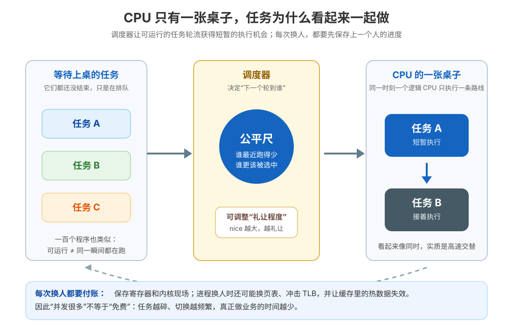

# 课 8 · 调度与上下文切换：CPU 怎么“同时”跑一百个程序

> 所属阶段：阶段 3《进程与调度》｜实操环境：Docker Linux（Ubuntu 26.04；系统调用追踪补充使用 Alpine 3.21 安装 strace）｜本课实测于 2026-09-15
> 故事情节：order-service 一忙起来，服务器上同时挂着几十个请求、日志采集、健康检查和定时任务。CPU 明明没有一百张桌子，却让大家都觉得“自己正在运行”。本课要揭开这个魔术，也要把魔术的账单算出来。
> 📖 结论已按官方文档核对（核查于 2026-09 ｜来源：[sched(7)](https://man7.org/linux/man-pages/man7/sched.7.html)、[nice(2)](https://man7.org/linux/man-pages/man2/nice.2.html)、[syscalls(2)](https://man7.org/linux/man-pages/man2/syscalls.2.html)、[vmstat(8)](https://man7.org/linux/man-pages/man8/vmstat.8.html)、[CFS Scheduler](https://docs.kernel.org/scheduler/sched-design-CFS.html)）

## 📌 知识点导航

| # | 知识点 | 状态 |
|---|--------|------|
| 8.1 | 时间片与 CFS 直觉（面试高频） | ✅ |
| 8.2 | 上下文切换的票价（面试高频） | ✅ |
| 8.3 | 用户态、内核态与系统调用（面试高频） | ✅ |

## 🎯 本课目标

学完本课你将能：

- 解释单核上“同时跑很多程序”的真实机制，并区分并发与并行；
- 用 CFS 的“虚拟运行时间”理解公平调度，用 nice/renice 做出有边界的优先级调整；
- 说清上下文切换保存了什么，以及进程切换为什么可能额外冲击页表、TLB 和 CPU 缓存；
- 读懂 `vmstat` 的 `r`、`cs`、`us`、`sy`、`wa`，并知道这些数字不能脱离采样窗口和机器口径解读；
- 区分用户态、内核态、系统调用、中断与上下文切换，用 `strace` 看见程序和内核之间的实际往返。

## 📖 文档核对（写前留痕）

| 容易说过头的句子 | 官方文档核对结果 | 本课处理 |
|---|---|---|
| “Linux 就是每个任务固定跑一个时间片，再换下一个” | `sched(7)` 提供抢占式调度和公平推进的入口；内核 CFS 文档用虚拟运行时间描述公平性，并说明当前实现正逐步让 EEVDF 承接公平调度细节 | 用“时间片轮换”建立直觉，再明确它不是现代实现的完整模型 |
| “nice 越小，就一定拿到更多 CPU” | nice 会影响 SCHED_OTHER/SCHED_BATCH 的调度偏好；值域通常为 -20 到 +19，权限、调度策略、cgroup、autogroup 和竞争者都会影响最终份额 | 只把 nice 当作“礼让程度”，不承诺固定百分比 |
| “上下文切换就是换进程” | 线程也是调度对象；线程切换仍要保存/恢复执行现场，进程切换通常还可能换地址空间 | 用“执行路线切换”统称，单独标出进程/线程差异 |
| “进入内核态就发生了上下文切换” | 系统调用是用户程序进入内核的接口，但调用后可以回到同一条线程；只有阻塞、抢占等情况才可能进一步触发调度切换 | 把“特权级切换”和“调度对象切换”拆开 |
| “`vmstat cs` 就是某个进程切换了多少次” | `vmstat(8)` 定义 `cs` 为每秒上下文切换数；它是采样窗口内的系统级读数 | 强调系统级、每秒、受 VM 与其他容器噪声影响 |

> 🛠️ **环境说明**：普通调度和 `/proc` 实验在 `ubuntu:26.04`、`--platform linux/arm64` 中完成。Ubuntu 精简镜像没有预装 `strace`，系统调用实测使用 `alpine:3.21` 临时安装 `strace`；两种镜像共享同一个 Docker Desktop LinuxKit 内核，用户态工具版本不能混写。
>
> 🧪 **安全边界**：本课所有容器均为一次性 `--rm`，CPU 压力只作用于实验容器；没有使用 `--privileged`、没有改宿主机调度参数，也没有触碰宿主机进程。

---

## 第一幕：起源与场景引入——一张桌子，为什么能服务一百个人

周五晚，order-service 同时接到三类工作：

- 正在计算的请求：需要 CPU 连续执行；
- 等待网络或磁盘的请求：暂时不能执行，醒来后还要继续；
- 后台任务：日志压缩、健康检查、定时刷新缓存。

如果只有一个逻辑 CPU，它同一瞬间只能执行一条线程的指令。可你在终端里同时敲命令、浏览器还在渲染、服务也没有“卡死”，体感却像很多事情一起推进。

这不是 CPU 变成了魔法，而是三层机制叠在一起：

1. **调度**：内核从可运行任务里选一个，让它先用 CPU；
2. **上下文切换**：换人前保存旧任务的执行进度，换人后恢复新任务的进度；
3. **阻塞与唤醒**：等待 I/O 的任务暂时离开队列，CPU 可以去服务别人，I/O 完成后再回来排队。

> 📌 **一句话本质**：单核上的“同时”主要是高速交替；多核上的“同时”才可能是多条执行路线在不同核心上真正并行。

### 先把两个“同时”分开

| 词 | 人话 | 例子 |
|---|---|---|
| 并发（concurrency） | 一段时间里有很多事情都在推进，可能轮流推进 | 一个核心轮换服务 100 个连接 |
| 并行（parallelism） | 同一时刻真的有多条路线分别执行 | 4 个核心同时执行 4 条 CPU 密集线程 |

本课为了让调度更容易观察，会用 Docker 的 `--cpus=1` 把实验容器压到一颗 CPU 的配额；这不是在模拟整台 Mac，而是在把“同一张桌子上的轮流”放大。

---

## 第二幕：认知冲突——“时间片轮转”够不够解释一切？

先给出入门版模型：任务 A 跑一小段，计时器响；内核保存 A，恢复 B；B 跑一小段，再换回 A。只要切得够快，人就感觉它们一起跑。

这个模型很有用，但马上会遇到四个问题：

1. **谁先上桌？** 如果有 100 个任务，简单排队会让刚醒来的交互任务等很久。
2. **每个人应该拿多久？** CPU 密集任务和交互任务不能一刀切；正在等键盘回来的任务应该尽快响应。
3. **换人免费吗？** 如果每次换人都要保存现场、换地址空间、冲掉缓存，切得越碎，真正做业务的比例就越低。
4. **进内核算不算换人？** 程序写一个文件要进内核，但它可能仍由同一条线程继续执行；特权级变化和调度对象变化不是一回事。

第三幕逐层拆开这四个问题。先记住一条防止混乱的边界：

> **调度决定“谁获得 CPU”；上下文切换负责“把谁换进来”；系统调用负责“用户程序如何请求内核服务”。**

---

## 第三幕：层层揭示

### 一眼全局图：先排队，再上桌，再保存进度

图里的“公平尺”不是一个固定的秒表，而是一个帮助我们理解的入口：调度器会追踪每条可运行路线获得了多少 CPU，让长期分配尽量接近它的权重；每次换人时，又要付保存和恢复现场的成本。

### 本课地图：三步看懂“同时”

| 步 | 这一步解决什么（人话） | 对应知识点 |
|:--:|---|---|
| 1 | 这么多人排队时，内核凭什么决定下一个是谁 | 8.1 时间片与 CFS 直觉 |
| 2 | 换一个任务为什么不是一个零成本的指针赋值 | 8.2 上下文切换的票价 |
| 3 | 程序什么时候需要走进内核，进内核是否等于换人 | 8.3 用户态、内核态与系统调用 |

---

### 知识点 8.1：时间片与 CFS 直觉（面试高频）

> 🧭 第 1/3 步｜承接：第二幕问“谁先上桌、每个人拿多久” → 本步：先掌握调度的公平直觉，再知道 nice 能做什么、不能做什么。

#### 一句话定义

**调度器是内核中负责从可运行线程里选择下一条执行路线的组件；抢占式调度允许内核在合适时机把当前路线暂时换下。**

#### 直觉建立：餐厅只有一张 CPU 桌子

把一个逻辑 CPU 想成一张只能坐一个人的桌子，把可运行线程想成已经点完菜、随时可以开工的顾客。

- **可运行（runnable）**：顾客已经准备好，只是在等桌子；
- **运行（running）**：现在坐在桌边，正在使用 CPU；
- **睡眠/阻塞（sleeping/blocked）**：还在等菜、等网络或等锁，暂时不应该占着桌子；
- **唤醒（wakeup）**：菜到了，重新回到可运行队列。

类比的边界是：真实调度不是简单的“队尾轮转”。任务有调度策略、nice 值、权重、所在 CPU、调度组和唤醒时机；容器还可能受 cgroup CPU 配额影响。入门阶段只抓住“可运行任务竞争 CPU”和“公平推进”两个主轴。

#### 核心原理：从固定时间片到虚拟运行时间

**第一层：时间片直觉。**

在入门图景里，内核让每个任务运行一小段，再检查是否需要换人。抢占可能来自时钟 tick、另一个任务唤醒、优先级更高的任务出现，或当前任务主动阻塞。

**第二层：公平调度。**

Linux 内核文档对 CFS 的核心直觉可以压成一句话：把真实硬件想象成一台能让所有任务按比例同时推进的“理想多任务 CPU”，再用**虚拟运行时间（virtual runtime，`vruntime`）**近似追踪每个任务“已经享受了多少公平份额”。在普通公平调度下，运行得相对少的任务更有机会被选中。

因此，本课不把 CFS 背成“固定 10 ms，100 个任务正好轮一圈”。现代实现按纳秒级运行量和任务权重做账；内核文档还明确说明，CFS 的实现细节正在逐步让 EEVDF 承接。对应用开发者更重要的稳定直觉是：**可运行任务越多，单个任务得到的 CPU 份额越薄；权重不同，份额也不会相等。**

**第三层：nice 是“礼让程度”，不是保证书。**

`nice` 值通常从 `-20` 到 `+19`：

- 值越小，优先级倾向越高；
- 值越大，越礼让其他任务；
- `nice -n 10 command` 让新启动的命令带着更高的 nice 值运行；
- `renice` 可以调整已有任务；
- 普通用户降低 nice 值、也就是提高自己的优先级，可能受 `CAP_SYS_NICE` 或 `RLIMIT_NICE` 限制。

注意两个边界：第一，没有竞争时，nice 可能几乎看不出“性能差”；第二，nice 只影响相应调度策略下的偏好，cgroup 配额、autogroup、实时策略、CPU 亲和性和其他任务都会参与最终结果。不要把 nice 当作“保证拿到 30% CPU”的旋钮。

#### 示例演示：观察 nice 进入线程的调度字段

下面让两个忙循环竞争一个容器 CPU 配额。一个默认 nice=0，另一个用 `nice -n 10` 启动。读取 `/proc/<pid>/stat` 的 `priority` 和 `nice` 字段，只证明调度属性已经不同；它不是一个严谨的性能基准。

~~~bash
docker run --rm --platform linux/arm64 --cpus=1 ubuntu:26.04 bash -c '
  while :; do :; done & p1=$!
  nice -n 10 bash -c "while :; do :; done" & p2=$!
  sleep 3
  for p in $p1 $p2; do
    read -r pid comm state ppid pgrp session tty_nr tpgid flags minflt cminflt majflt cmajflt utime stime cutime cstime priority niceval num_threads rest < /proc/$p/stat
    echo "pid=$pid comm=$comm utime_ticks=$utime stime_ticks=$stime priority=$priority nice=$niceval threads=$num_threads"
  done
  kill $p1 $p2 2>/dev/null || true
  wait $p1 $p2 2>/dev/null || true
'
~~~

本次实测输出：

~~~text
pid=7 comm=(bash) utime_ticks=151 stime_ticks=1 priority=20 nice=0 threads=1
pid=8 comm=(bash) utime_ticks=152 stime_ticks=0 priority=30 nice=10 threads=1
~~~

读法：第二个任务的 `nice=10`、`priority=30` 与第一个任务不同。两条 `utime_ticks` 在这次短测里接近，并不推翻 nice 的作用，反而提醒我们：**单次短测不能把调度倾向写成固定吞吐承诺**。要研究实际份额，应固定核心、配额、任务组、运行时长和背景负载，并重复多次。

#### 常见误区

1. **“时间片就是现代 Linux 的完整实现”**：它是好用的入门隐喻；公平类调度还要考虑虚拟运行时间、权重、唤醒和调度组。
2. **“nice=10 就是只拿 10% CPU”**：nice 是相对权重/偏好，不是百分比配置。
3. **“CPU 使用率高就是调度器坏了”**：CPU 密集工作可能是正常吞吐；要结合 `r`、`cs`、`sy`、`wa`、请求延迟和任务数判断。
4. **“线程越多就越快”**：任务多于可用 CPU 后会排队；线程继续增加还会带来切换、锁竞争和缓存扰动。
5. **“切到另一核就等于多了一份 CPU”**：迁移到别的核可能改善并行，也可能带来缓存失配和迁移开销；不能只看线程数。

#### 一句话记住

**时间片是“轮流上桌”的直觉，CFS 是“按公平账本选下一位”的直觉；nice 改变礼让程度，不承诺固定 CPU 百分比。**

#### 🗣️ 行话对照

- **runnable**：本课说的“随时能上桌但可能在排队”；在哪遇到：`vmstat r`、调度器运行队列。
- **preemption / 抢占**：本课说的“内核把当前任务暂时请下桌”；在哪遇到：交互任务响应、实时任务、调度延迟。
- **vruntime**：本课说的“公平账本上的虚拟运行时间”；在哪遇到：CFS 设计、调度延迟分析。
- **nice**：本课说的“礼让程度”；在哪遇到：`nice`、`renice`、后台批处理。
- **SCHED_OTHER / SCHED_NORMAL**：普通 Linux 时间共享策略；在哪遇到：`sched(7)`、`chrt`、任务调度策略。

#### 📚 官方文档

- [sched(7)：调度器选择可运行线程、抢占、SCHED_OTHER 与 nice](https://man7.org/linux/man-pages/man7/sched.7.html)
- [nice(2)：nice 值范围、优先级方向与权限边界](https://man7.org/linux/man-pages/man2/nice.2.html)
- [CFS Scheduler：理想多任务 CPU、vruntime 与公平选择直觉](https://docs.kernel.org/scheduler/sched-design-CFS.html)

---

### 知识点 8.2：上下文切换的票价（面试高频）

> 🧭 第 2/3 步｜承接：8.1 说明“谁先上桌” → 本步：看换人动作究竟保存、恢复和扰动了什么。

#### 一句话定义

**上下文切换是 CPU 从一条可运行执行路线转到另一条路线时，保存旧路线的执行现场并恢复新路线现场的过程。**

这里的“上下文”不是一句抽象的“状态”，至少包括当前执行位置、通用寄存器、栈相关状态和内核管理该任务所需的调度信息；具体保存哪些寄存器、何时保存，由架构和内核实现决定。

#### 直觉建立：换服务员前要保存工作台

服务员 A 做到一半被叫走，不能只记住“做到第 3 步”。他要把订单、当前笔记、手里拿的工具放回可恢复的位置；服务员 B 上来后，也要把自己的订单和笔记拿出来。

类比的边界是：CPU 并不会把所有缓存字节主动清空，也不是每次切换都把整台机器的所有寄存器做同样的动作。真正的代价取决于切换类型、架构优化、地址空间是否变化、任务工作集大小以及切换频率。

#### 核心原理：四层票价

**第一笔：保存和恢复执行现场。**

调度器决定换人后，内核需要让旧任务未来能从正确的指令位置继续；新任务也必须恢复到自己的寄存器和内核栈上下文。这是线程切换也无法消除的基本成本。

**第二笔：进程切换可能改变地址空间。**

同一进程里的线程通常共享虚拟地址空间，所以线程切换往往不需要切换到另一套页表；不同进程之间切换，通常要切换当前地址空间对应的内存管理上下文。上一课 5 已经说明：虚拟地址要经过页表翻译。

地址空间变化可能影响 TLB。TLB 是地址翻译的快速缓存；如果旧进程的翻译不能直接给新进程复用，就会产生重新填充的成本。现代 CPU/内核会用 ASID、PCID 等机制减少不必要的失效，所以准确说法是：**进程切换可能引入 TLB 相关代价，并不等于每次都把 TLB 全清空。**

**第三笔：缓存工作集互相驱逐。**

上一课 4 讲过，L1/L2/L3 缓存装的是近期可能再次用到的数据和指令。任务 A 刚把自己的热点数据装热，任务 B 换上来访问另一批数据；来回交替会让彼此的 cache line 互相驱逐，恢复 A 后可能又要从更低层存储取数据。

所以“切换成本”不是只有那几条保存寄存器的指令，还可能表现为**切换以后的一段时间内 cache miss 变多**。这也是为什么批处理策略可能愿意少切几次，换取更好的缓存局部性；交互任务则更在意响应延迟。

**第四笔：调度与同步管理成本。**

维护运行队列、更新公平账本、处理唤醒、锁竞争、跨核心迁移，都可能参与总成本。不能只拿一个“上下文切换纳秒数”套到所有机器和所有负载上。

可以用下面这条账本收束：

~~~text
一次切换的总账
≈ 保存/恢复执行现场
  +（可能）切换地址空间与 TLB 相关成本
  +（可能）缓存工作集被扰动后的后续 miss
  + 调度、队列、迁移与同步成本
~~~

#### 示例演示：`vmstat cs` 与 `/proc` 计数器

`vmstat` 的 `cs` 是**系统级每秒上下文切换数**，不是某个进程的“切换次数”。同一行里还可以一起看：

| 字段 | 人话 | 本课先怎么用 |
|---|---|---|
| `r` | 可运行、正在跑或等 CPU 的任务数 | 看 CPU 队列有没有变长 |
| `b` | 等待 I/O 完成而阻塞的任务数 | 与 `r` 区分 CPU 排队和 I/O 等待 |
| `in` | 每秒中断数 | 看硬件/时钟等中断活动，不等于上下文切换 |
| `cs` | 每秒上下文切换数 | 看系统切换活动，不能单独判定“坏” |
| `us` | 用户态代码占用 CPU 百分比 | 应用计算时间 |
| `sy` | 内核态代码占用 CPU 百分比 | 系统调用、内核工作等 |
| `wa` | 等待 I/O 的 CPU 时间百分比 | 与 I/O 等待一起判断 |

本课在 Ubuntu 26.04 中先看空闲采样，再放入两个 CPU 忙循环：

~~~bash
docker run --rm --platform linux/arm64 --cpus=1 ubuntu:26.04 bash -c '
  echo "== vmstat idle =="
  vmstat 1 2
  echo "== vmstat with two CPU-bound tasks =="
  (while :; do :; done) & p1=$!
  (while :; do :; done) & p2=$!
  vmstat 1 3
  kill $p1 $p2 2>/dev/null || true
  wait $p1 $p2 2>/dev/null || true
'
~~~

本次输出中与本知识点最相关的行，摘录如下：

~~~text
# 空闲采样的后续行
r=3  ...  in=2216  cs=2540  us=1  sy=0  id=98  wa=0

# 两个忙循环期间的后续行
r=3  ...  in=3971  cs=4049  us=10 sy=1  id=89  wa=0
r=2  ...  in=2675  cs=1864  us=9  sy=0  id=90  wa=0
~~~

这次短测里，忙循环阶段的 `cs` 比前一行更高，`us` 也上升；但它不是“两个任务就一定产生某个固定 cs”，因为 `vmstat` 读的是 Docker Desktop LinuxKit VM 的系统级统计，其他容器、后台任务和采样边界都会影响结果。

还可以直接看 `/proc`：

~~~bash
docker run --rm --platform linux/arm64 --cpus=1 ubuntu:26.04 bash -c '
  before=$(awk "/^ctxt / {print \$2}" /proc/stat)
  (while :; do :; done) & p1=$!
  (while :; do :; done) & p2=$!
  sleep 1
  after=$(awk "/^ctxt / {print \$2}" /proc/stat)
  echo "global_ctxt_delta=$((after-before))"
  grep -E "^(voluntary_ctxt_switches|nonvoluntary_ctxt_switches):" /proc/$p1/status
  grep -E "^(voluntary_ctxt_switches|nonvoluntary_ctxt_switches):" /proc/$p2/status
  kill $p1 $p2 2>/dev/null || true
  wait $p1 $p2 2>/dev/null || true
'
~~~

本次实测：

~~~text
global_ctxt_delta=5738
voluntary_ctxt_switches:        0
nonvoluntary_ctxt_switches:     10
voluntary_ctxt_switches:        0
nonvoluntary_ctxt_switches:     264
~~~

`/proc/stat` 的 `ctxt` 是系统发生过的上下文切换累计数；两个进程各自的 `nonvoluntary_ctxt_switches` 说明它们被内核在非自愿情况下换下过。两个数字差很多是一次运行的调度结果，不应拿来当常数。

#### 进程切换和线程切换：为什么线程通常更轻，但绝不免费

| 比较维度 | 同进程线程切换 | 不同进程切换 |
|---|---|---|
| 执行现场 | 都要保存/恢复寄存器、栈和调度状态 | 都要保存/恢复寄存器、栈和调度状态 |
| 虚拟地址空间 | 通常共享同一地址空间 | 通常要切换到另一套地址空间上下文 |
| TLB 影响 | 通常少一层地址空间变化成本 | 可能出现更多 TLB 相关代价，但硬件/内核会优化 |
| CPU 缓存 | 线程若访问不同工作集，仍会互相驱逐 | 进程也会互相驱逐，隔离并不等于缓存隔离 |
| 共享数据 | 直接共享，锁和竞态是主要风险 | 默认隔离，通信要经过 IPC 或显式共享 |

这张表的结论不是“永远用线程”，而是：**线程通常节省了地址空间切换的一部分账，但把更多协作风险放到了共享数据和同步上。** 这正好回扣课 7 的进程/线程选型。

#### 常见误区

1. **“上下文切换就是把寄存器拷贝一下”**：寄存器保存只是第一笔；地址空间、TLB、缓存、队列和迁移都可能参与。
2. **“线程切换没有 TLB/缓存成本”**：同地址空间通常少一层页表切换，但共享数据的访问仍会争抢缓存，线程还可能跨核迁移。
3. **“cs 越高一定越坏”**：高并发、短 I/O、事件循环可能自然带来较多切换；要结合吞吐、延迟、`us/sy/wa` 和业务目标。
4. **“`vmstat` 第一行就是刚刚这一秒”**：默认首行可能是自启动以来的平均值；用 `vmstat -y 1 3` 或者明确跳过首行看采样窗口。
5. **“忙循环越多，CPU 就越接近 100%”**：在 Docker Desktop 上，`vmstat` 可能观察到 VM 全局 CPU；容器还有 cgroup 配额，宿主/VM/容器三个口径要分开。

#### 一句话记住

**上下文切换的账不只是一组寄存器：进程切换可能碰页表和 TLB，任务交替还会互相污染缓存；`cs` 只能告诉你切换活动多不多，不能独立告诉你系统好不好。**

#### 🗣️ 行话对照

- **context switch**：本课说的“换执行路线并保存现场”；在哪遇到：`vmstat cs`、`/proc/<pid>/status`。
- **voluntary / nonvoluntary**：本课说的“自己让桌子 / 被内核请下桌”；在哪遇到：`/proc/<pid>/status`。
- **TLB**：本课说的“虚拟地址翻译的缓存”；在哪遇到：页表、进程切换、性能计数器。
- **working set**：本课说的“任务最近真正反复用到的数据和指令集合”；在哪遇到：缓存命中率、抖动、批处理调度。

#### 📚 官方文档

- [vmstat(8)：`r`、`b`、`in`、`cs`、`us`、`sy`、`wa` 字段定义](https://man7.org/linux/man-pages/man8/vmstat.8.html)
- [proc_stat(5)：`/proc/stat` 的 `ctxt`、`procs_running` 与 CPU 时间字段](https://man7.org/linux/man-pages/man5/proc_stat.5.html)
- [proc_pid_status(5)：进程上下文切换计数器](https://man7.org/linux/man-pages/man5/proc_pid_status.5.html)
- [sched(7)：线程是调度对象、普通时间共享策略与调度优先级](https://man7.org/linux/man-pages/man7/sched.7.html)

---

### 知识点 8.3：用户态、内核态与系统调用（面试高频）

> 🧭 第 3/3 步｜承接：8.2 说明换执行路线有代价 → 本步：区分“进入内核请求服务”和“切换到另一条任务”，为后面的文件句柄、epoll 和零拷贝铺地基。

#### 一句话定义

**用户态是普通程序运行的受限权限环境；内核态是内核执行特权操作的环境；系统调用是用户程序请求内核服务的正式入口。**

#### 直觉建立：前台窗口和后场机房

把应用想成酒店前台，把内核想成后场机房：前台可以填写订单、处理自己的数据，但不能直接改磁盘控制器、页表或其他进程的地址空间；需要这些能力时，必须走一扇有检查的服务门——系统调用。

类比的边界是：用户态/内核态不是两个进程，也不是两颗 CPU。通常是**同一条线程**执行到一条特殊入口指令，CPU 改变当前特权级，内核检查参数并提供服务，然后返回用户态继续执行。若系统调用阻塞，调度器才可能在等待期间把 CPU 给别人。

#### 核心原理：四个容易混在一起的概念

**1. 用户态与内核态：权限边界。**

用户程序不能任意执行特权指令或直接访问内核管理的硬件资源；内核态可以代表系统完成文件、网络、进程、内存和设备操作。这个边界把“一个程序写坏自己的内存”与“一个程序随意改写整台机器”分开。

**2. 系统调用：同步的服务请求。**

`read`、`write`、`openat`、`mmap`、`fork` 等都是常见系统调用或其相关接口。应用通常不直接手写陷阱指令，而是调用 libc 或语言运行时的包装函数；包装函数可能只是准备寄存器和参数，也可能在进入内核前后做额外工作。`syscalls(2)` 明确指出：系统调用是应用与 Linux 内核之间的基础接口，调用包装函数的名字也不保证和底层调用完全一一对应。

**3. 中断：硬件或内核事件的异步通知。**

网卡收到数据、定时器到期、设备完成 DMA，都可能以中断或相关机制通知内核。系统调用通常是线程主动发起的同步入口；中断通常不是当前用户程序主动调用的。两者都可能让 CPU 进入内核处理，但来源和时机不同。

**4. 上下文切换：调度对象的改变。**

一次系统调用可以“进内核再回来”，前后仍是同一个线程，并不自动等于上下文切换；一个系统调用如果睡眠等待 I/O，就可能触发调度，换另一条线程执行。反过来，定时器抢占也可以发生在不主动系统调用的用户代码之间。

可以用这个关系图记忆：

~~~mermaid
flowchart LR
    A[用户态线程] -->|open/read/write 等请求| B[系统调用入口]
    B --> C[内核态检查参数并执行服务]
    C -->|立即完成| D[返回同一线程的用户态]
    C -->|需要等待 I/O/锁| E[线程阻塞并让出 CPU]
    E --> F[调度器选择其他可运行线程]
    F --> G[未来唤醒后恢复原线程]
    H[硬件事件] -->|中断/通知| C
~~~

#### 示例演示：用 `strace` 看“写文件”的正门

`strace` 是一个 Linux syscall tracer，可以在不重新编译程序的情况下观察进程与内核之间的系统调用、信号和状态交互。Ubuntu 精简镜像本轮没有预装它，所以在一次性 Alpine 容器中安装。

写文件的示例：

~~~bash
docker run --rm --platform linux/arm64 alpine:3.21 sh -c '
  apk add --no-cache strace >/dev/null
  strace -f -e trace=%file,%desc sh -c "printf hello >/tmp/syscall-demo" 2>&1
'
~~~

本次输出中最有教学价值的几行：

~~~text
execve("/bin/sh", ["sh", "-c", "printf hello >/tmp/syscall-demo"], ...) = 0
openat(AT_FDCWD, "/tmp/syscall-demo", O_WRONLY|O_CREAT|O_TRUNC|O_LARGEFILE, 0666) = 3
dup3(3, 1, 0)                           = 1
close(3)                                = 0
writev(1, [{iov_base="hello", iov_len=5}, {iov_base=NULL, iov_len=0}], 2) = 5
dup3(10, 1, 0)                          = 1
close(10)                               = 0
+++ exited with 0 +++
~~~

这里特意保留 `writev`：程序写文件不一定表现为你脑中想象的单个 `write`，shell 的实现、库和缓冲策略会影响具体调用。重点看链路：创建/打开文件 → 安排文件描述符 → 写入 → 恢复标准输出 → 退出。

再看 `ls /tmp` 的核心动作：

~~~bash
docker run --rm --platform linux/arm64 alpine:3.21 sh -c '
  apk add --no-cache strace >/dev/null
  strace -f -e trace=execve,openat,newfstatat,getdents64,close,write,writev ls /tmp 2>&1
'
~~~

实测摘录：

~~~text
execve("/bin/ls", ["ls", "/tmp"], ...) = 0
newfstatat(AT_FDCWD, "/tmp", {st_mode=S_IFDIR|S_ISVTX|0777, ...}) = 0
openat(AT_FDCWD, "/tmp", O_RDONLY|O_LARGEFILE|O_CLOEXEC|O_DIRECTORY) = 3
getdents64(3, ..., 2048) = 48
getdents64(3, ..., 2048) = 0
close(3)                                = 0
+++ exited with 0 +++
~~~

`ls` 不是“调用一个 ls 内核函数”，而是用户态程序通过 `openat` 打开目录、`getdents64` 读取目录项、`close` 关闭描述符，再把结果格式化输出。这个观察方式会直接服务于后面课程：文件句柄、阻塞 I/O、epoll 和零拷贝最终都可以追到系统调用边界。

#### 一次系统调用的性能账

系统调用不是“免费函数调用”：至少要经过用户/内核入口、参数检查、权限检查、可能的数据拷贝和返回路径。可是也不要把它夸大成“一次 syscall 就换了一次进程”：

| 现象 | 是否必然上下文切换 | 说明 |
|---|---|---|
| `getpid` / 简单查询 | 否 | 可以进内核后立即返回同一线程 |
| `write` 到可写缓冲 | 否 | 可能很快完成；是否落盘还涉及缓存与同步语义 |
| `read` 等待网络数据 | 可能 | 当前线程睡眠，调度器可把 CPU 给其他任务 |
| 定时器/设备中断 | 不等于 | 先进入内核处理事件，是否换任务取决于后续调度 |
| 抢占 | 不需要系统调用 | 时钟或唤醒等事件可让内核切换可运行路线 |

这张表是 8.2 和 8.3 的接缝：**特权级入口、系统调用、调度切换是三个相关但不相同的概念。**

#### 常见误区

1. **“用户态就是低优先级进程，内核态就是高优先级进程”**：它们描述的是当前执行权限和 CPU 特权级，不是两个 PID，也不是 nice 值。
2. **“每个库函数都对应一个 syscall”**：库函数可能纯用户态完成、合并多个 syscall、调用不同 syscall，或被运行时缓存/批处理。
3. **“一次 syscall 必然上下文切换”**：系统调用常常回到同一线程；阻塞时才可能让出 CPU。
4. **“中断就是进程”**：中断是内核处理硬件/软件事件的入口，不是一个普通用户进程。
5. **“strace 输出就是应用源码执行顺序”**：它展示的是被追踪到的系统调用；用户态内部函数、编译器优化和库缓冲不会全部显示。
6. **“看到 open 就代表数据已经落盘”**：打开、写入、Page Cache、`fsync` 和设备持久化是不同层次；课 6 已讲过脏页回写边界。

#### 一句话记住

**用户态是受限的前台，内核态是受保护的后场；系统调用是进内核的正门，中断是事件通知，而上下文切换是调度器换了执行路线——四者不要混成一个词。**

#### 🗣️ 行话对照

- **user mode / kernel mode**：本课说的“前台受限 / 后场特权”；在哪遇到：权限、系统调用、CPU 特权级。
- **system call / syscall**：本课说的“用户程序请求内核服务”；在哪遇到：`strace`、`read`、`write`、`epoll_wait`。
- **interrupt**：本课说的“硬件或内核事件通知”；在哪遇到：时钟、中断计数、网卡、DMA。
- **libc wrapper**：本课说的“系统调用外面的库包装层”；在哪遇到：`syscalls(2)`、glibc、语言运行时。
- **ptrace**：`strace` 依赖的内核跟踪机制；在哪遇到：调试器、系统调用跟踪、进程观测。

#### 📚 官方文档

- [syscalls(2)：系统调用是应用与 Linux 内核之间的基础接口](https://man7.org/linux/man-pages/man2/syscalls.2.html)
- [strace 官方站点：Linux syscall tracer、过滤和统计能力](https://strace.io/)
- [ptrace(2)：进程跟踪与调试接口](https://man7.org/linux/man-pages/man2/ptrace.2.html)
- [openat(2)：打开文件和目录的系统调用入口](https://man7.org/linux/man-pages/man2/openat.2.html)

---

## 第四幕：实操验证——把“同时”拆成三组证据

### 实验 A：先固定实验口径

在 macOS + Docker Desktop 上，至少要分清三层：

| 层 | 本课看到的是什么 | 不能直接推出什么 |
|---|---|---|
| macOS 宿主机 | Apple Silicon 的宿主资源 | 不能把宿主工具输出当成 Linux `/proc` 语义 |
| Docker LinuxKit VM | `vmstat`、`/proc/stat` 看到的系统级内核计数 | 可能包含其他容器和 VM 背景噪声 |
| 实验容器 | 进程自己的 `/proc/<pid>` 与 cgroup 配额 | 容器内的 `vmstat` 不一定只统计本容器 |

本课实验使用 `--cpus=1`，目的是制造竞争条件；它不会把 Docker Desktop 的全局 `vmstat` 变成“只统计这两个进程”。生产排障时要把容器级 cgroup 指标、宿主/VM 级指标和进程级指标并排看。

### 实验 B：观察“公平”而不是背数字

运行 8.1 的 nice 实验时，重点检查：

~~~bash
docker run --rm --platform linux/arm64 ubuntu:26.04 nice -n 10 sh -c 'awk "{print \$19}" /proc/self/stat'
~~~

更有价值的现场检查是：

~~~bash
docker run --rm --platform linux/arm64 ubuntu:26.04 bash -c '
  echo "nproc=$(nproc)"
  echo "cpu.max=$(cat /sys/fs/cgroup/cpu.max 2>/dev/null || echo unavailable)"
'
~~~

如果你把这段实验带到自己的机器上，先记录 CPU 配额、核心数和背景负载，再比较不同 nice 值；否则“谁更快”的结论无法复现。

### 实验 C：用 `vmstat` 看切换活动

推荐从 `vmstat -y 1 5` 开始，跳过启动以来的平均首行，只看连续采样：

~~~bash
docker run --rm --platform linux/arm64 ubuntu:26.04 vmstat -y 1 5
~~~

遇到 CPU 忙时，先按下面的顺序读：

1. `r` 是否明显大于可用 CPU 数：先怀疑 CPU 排队；
2. `cs` 是否随任务切碎而升高：说明切换活动增加，但还不能判定是坏事；
3. `us` 是否高：主要是用户态计算；
4. `sy` 是否高：可能是系统调用、内核工作或高频切换等；
5. `wa` 是否高：把注意力转向 I/O 等待，不要只盯 CPU 使用率。

### 实验 D：用 `strace` 追一条“写文件”链路

只追你有权观察的短命测试进程：

~~~bash
docker run --rm --platform linux/arm64 alpine:3.21 sh -c '
  apk add --no-cache strace >/dev/null
  strace -f -e trace=%file,%desc sh -c "printf hello >/tmp/syscall-demo" 2>&1
'
~~~

生产环境使用 `strace -p PID` 需要谨慎：跟踪会增加观测开销，并且可能暴露参数、路径和数据。先缩小 syscall 类型（例如 `-e trace=%file`），再缩短采样时间；不要把高流量服务无限期全量跟踪。

---

## 第五幕：体系收束——三张账单，读懂一个 CPU 告警

把本课压缩成一条排障链：

~~~mermaid
flowchart TD
    A[很多程序都在“运行”] --> B{它们真的同时执行吗?}
    B -->|单核| C[调度器轮流给可运行线程 CPU]
    B -->|多核| D[不同核心可能真正并行]
    C --> E[上下文切换保存/恢复现场]
    D --> E
    E --> F{是否改变地址空间?}
    F -->|通常线程内| G[少一层页表/TLB变化，但仍有寄存器与缓存代价]
    F -->|通常进程间| H[可能增加页表/TLB与缓存工作集扰动]
    G --> I[vmstat /proc 观察切换活动]
    H --> I
    I --> J[若程序要文件/网络/内存服务]
    J --> K[通过系统调用进入内核]
    K --> L[立即返回同线程，或阻塞后触发调度]
~~~

### 与前后课程的连接

| 已学/将学 | 本课接上的线 |
|---|---|
| 课 4 CPU 缓存 | 任务切换后的工作集互相驱逐，解释“切换后还会慢一段” |
| 课 5 虚拟内存 | 不同进程通常有不同地址空间；TLB 是页表翻译的缓存 |
| 课 6 cache/buffer | `write` 进入内核不等于立刻落盘；Page Cache 和脏页回写仍在链路上 |
| 课 7 进程与线程 | 线程共享地址空间，进程强调隔离；本课补上它们如何被调度和切换 |
| 课 9 load average | `r` 是队列的一扇窗口；下一课会把 load 的“在办 + 排队”语义讲完整 |
| 课 10 文件句柄 | `openat` 返回的整数 fd 会成为后续 I/O 的入口 |
| 课 12 epoll | `epoll_wait` 会让线程等待事件，唤醒与调度是事件循环的地基 |

### 一张决策卡：看到“CPU 忙”，先问哪三句

1. **是用户态忙，还是内核态忙？** 看 `us` 与 `sy`，不要只看总 CPU。
2. **是工作真的多，还是任务切得太碎？** 看 `r`、`cs`、线程数、锁等待和请求吞吐。
3. **是 CPU 不够，还是 I/O 在等？** 看 `wa`、`b`、I/O 指标和业务延迟；下一课再把 load 一起放进来。

### 本课小测

题 1：单核上同时跑 100 个 CPU 密集程序，CPU 是真的同时执行 100 条指令吗？

不是。单核同一时刻执行一条路线；调度器让可运行任务快速交替，所以从较长时间窗口看，100 个任务都在推进。这叫并发。若有多个核心，不同核心上的任务才可能在同一时刻真正并行。

题 2：为什么“线程切换通常比进程切换轻”不能写成“线程切换没有成本”？

同进程线程通常共享虚拟地址空间，少一层地址空间切换和相关 TLB 代价；但仍要保存/恢复寄存器和栈，还可能互相驱逐缓存、竞争锁，并产生调度队列开销。因此是“通常更轻”，不是“免费”。

题 3：一次 write 系统调用是不是一次上下文切换？

不是。write 会让同一条线程从用户态进入内核态再返回；如果写入过程需要等待，线程可能阻塞，调度器才会把 CPU 给其他任务。特权级切换与调度对象切换是两个概念。

题 4：vmstat 里 cs 很高，能不能直接下结论“系统坏了”？

不能。cs 是系统级每秒上下文切换数，需要结合 r、us、sy、wa、吞吐、延迟、线程数和背景负载。高并发事件循环可能有较多切换但仍然健康；反过来，cs 不高也不能证明没有锁等待或 I/O 瓶颈。

## 📋 命令速查卡

| 目的 | 命令 | 重点看什么 |
|---|---|---|
| 降低后台任务的调度偏好 | `nice -n 10 command` | 新进程的 nice 值 |
| 调整已有进程 | `renice 10 -p PID` | 权限、目标 PID、调整后的 nice |
| 连续观察调度/系统活动 | `vmstat -y 1 5` | `r`、`b`、`in`、`cs`、`us`、`sy`、`wa` |
| 查看系统累计切换数 | `awk '/^ctxt / {print}' /proc/stat` | `ctxt` 是累计值，做差才是窗口增量 |
| 查看进程切换计数 | `grep -E '^(voluntary|nonvoluntary)_ctxt_switches:' /proc/PID/status` | 自愿/非自愿切换 |
| 看某进程调度字段 | `awk '{print $1,$2,$18,$19}' /proc/PID/stat` | PID、comm、priority、nice（字段位置需注意） |
| 追踪文件相关系统调用 | `strace -f -e trace=%file,%desc command` | openat、stat、getdents、read/write/close 等 |
| 追踪并统计 syscall | `strace -c command` | 调用次数、错误数、耗时占比 |
| 让实验只竞争一颗 CPU 配额 | `docker run --cpus=1 ...` | 放大调度竞争，不改变 VM 全局统计口径 |

> ⚠️ `strace`、`vmstat` 会增加观测开销；生产排障先短时间、窄范围、低频采样。对高流量服务不要无过滤地长期跟踪。

## 🚀 接力提示词

下一课继续阶段 3：**课 9《load average：三个数字背后的排队论》**。重点学习：

- 9.1 load 是“排队 + 在办”的人数，不是 CPU 使用率；
- 9.2 load 高但 CPU 闲的两种真相：D 状态 I/O 堆积与核少任务多；
- 9.3 并发与并行，给后面的同步/异步和事件循环铺最后一块地基。

建议下次开场先回顾本课的三条边界：`r` 是可运行排队窗口、`cs` 是系统级切换活动、系统调用不自动等于上下文切换。

## 🧭 课程导航

- 上一课：[课 7《进程与线程：一段程序的两种形态》](lesson-07-进程与线程一段程序的两种形态.md)
- 下一课：课 9《load average：三个数字背后的排队论》
- 返回阶段概览：[阶段 3 · 进程与调度](../overview.md)
- 返回课程目录：[02-课程目录](../../../02-课程目录.md)
- 返回学习档案：[00-学习档案](../../../00-学习档案.md)
