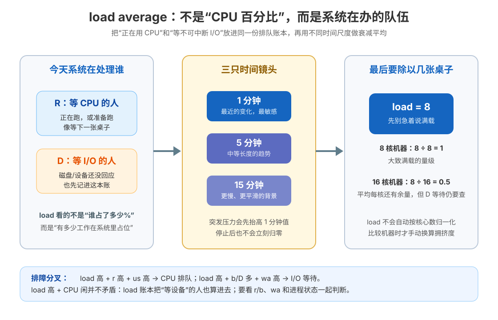

# 课 9 · load average：三个数字背后的排队论

> 所属阶段：阶段 3《进程与调度》｜实操环境：Docker Linux（Ubuntu 26.04；I/O 状态实验补充使用 Alpine 3.21 + stress-ng）｜本课实测于 2026-09-15
> 故事情节：告警里最熟悉的陌生数字——load 38 到底在排什么队？它是 CPU 满了，还是磁盘卡了，还是只是刚才有一阵突发压力留下的回声？本课把这三个数字从“红色告警”翻译成可以行动的排障分叉。
> 📖 结论已按官方文档核对（核查于 2026-09 ｜来源：[proc_loadavg(5)](https://man7.org/linux/man-pages/man5/proc_loadavg.5.html)、[uptime(1)](https://man7.org/linux/man-pages/man1/uptime.1.html)、[proc(5)](https://man7.org/linux/man-pages/man5/proc.5.html)、[sched(7)](https://man7.org/linux/man-pages/man7/sched.7.html)、[Linux loadavg 源码](https://github.com/torvalds/linux/blob/master/kernel/sched/loadavg.c)）

## 📌 知识点导航

| # | 知识点 | 状态 |
|---|--------|------|
| 9.1 | load 是“排队 + 在办”的人数，不是 CPU 使用率（面试高频） | ✅ |
| 9.2 | load 高、CPU 闲的两种真相 | ✅ |
| 9.3 | 并发 vs 并行：理解异步前的最后一块地基 | ✅ |

## 🎯 本课目标

学完本课你将能：

- 给 load average 下一个准确到能排障的定义：可运行任务与不可中断等待任务的衰减平均；
- 解释 1、5、15 分钟三个数字的差异，知道它们为什么不会在压力结束后立刻归零；
- 用 `load / CPU 数` 做第一轮拥挤度估算，同时知道容器配额、VM 全局口径和 D 状态会改变结论；
- 区分“load 高且 CPU 忙”的 CPU 排队与“load 高但 CPU 闲”的 I/O 等待；
- 用 `r`、`b`、`wa`、`procs_blocked` 和进程状态把告警导向下一步动作；
- 说清单核为什么也能高并发，以及为什么进程数/线程数不能机械地等于核心数。

## 📖 文档核对（写前留痕）

| 容易说过头的句子 | 官方文档核对结果 | 本课处理 |
|---|---|---|
| “load 就是 CPU 使用率” | `uptime(1)` 将 load 描述为处于可运行或不可中断状态的进程数的平均；`/proc/loadavg` 明确包含 R 与 D | 统一称为“排队 + 在办的工作量”，不写成百分比 |
| “1 分钟值就是最近 60 秒的普通平均” | Linux 内核源码使用每 5 秒更新一次的指数衰减公式，并用不同权重生成 1/5/15 分钟三个量 | 用“不同时间常数的衰减平均”，避免把它误解成固定窗口平均 |
| “load 16 就是 16 核机器 100% CPU” | load 未按 CPU 数归一化；同样的 load 在不同核心数机器上的拥挤程度不同 | 先除以逻辑 CPU 数做粗略比较，再查 r/us/sy/wa 与 cgroup |
| “load 高、CPU 闲一定是磁盘坏了” | D 状态常见于等待 I/O，但不可中断等待也可能来自其他内核/设备路径；容器还可能看到 VM 全局 load | 给出“CPU 队列 / I/O 等待 / 口径与历史回声”三路分叉，不凭一个指标定罪 |
| “容器里的 load 只属于这个容器” | `/proc/loadavg` 是内核系统信息；在 Docker Desktop 中容器共享 LinuxKit VM 内核 | 明确 Ubuntu 容器里的 load 可能包含其他容器和 VM 背景任务 |

> 🛠️ **环境说明**：CPU runnable 实验在 `ubuntu:26.04`、`--platform linux/arm64` 中完成。为了捕捉 `D` 状态，I/O 实验使用一次性 `alpine:3.21` 容器安装 `stress-ng` 和 `procps`；这只是用户态工具差异，不改变共享的 Docker LinuxKit 内核。
>
> 🧪 **安全边界**：所有压力任务都运行在 `--rm` 临时容器中；CPU 实验限制为 `--cpus=1`，I/O 文件只写入容器临时层并随容器销毁；没有使用 `--privileged`，没有修改宿主机参数。

---

## 第一幕：起源与场景引入——load 38 到底有多少人在排队

周五晚，监控把一台机器染成红色：

~~~text
load average: 38.00, 22.50, 9.80
~~~

值班工程师第一反应是：“CPU 肯定打满了。”但登录后发现 CPU 只有 35%。这看起来像矛盾：如果 CPU 没有忙到 100%，为什么 load 还能这么高？

先换一个生活场景。医院大厅里有三类人：

- 已经坐到诊室里的病人：正在被处理；
- 站在诊室门口等医生的病人：马上可以被处理，但要排队；
- 在影像科等机器返回结果的病人：暂时不能继续，但仍然占着整个流程的一个“在办名额”。

如果你只统计“医生此刻正在问诊几个人”，会漏掉后两类等待。load average 统计的是另一种问题：**系统里有多少工作处于“可运行”或“不可中断等待”状态。**

> 📌 **一句话本质**：load average 是系统“排队 + 在办”的工作量的衰减平均，不是 CPU 使用率；它把等 CPU 的 R 任务和等 I/O 的 D 任务放进同一份账本。

### load 的第一张翻译卡

| 看到的现象 | 人话翻译 | 第一反应 |
|---|---|---|
| load 高、`r` 高、`us` 高 | 很多人等 CPU，CPU 自己也在忙 | 查核心数、CPU 配额、线程/进程数和 CPU 密集代码 |
| load 高、`b`/D 高、`wa` 高 | 很多人卡在 I/O，CPU 可能在等 | 查磁盘、网络存储、文件系统、设备和请求队列 |
| load 高、CPU 闲、R/D 都不高 | 可能是短时压力的历史回声、VM/容器口径或采样错位 | 对齐时间窗口和观测层级，不立刻重启 |

这张卡不是最终结论，但它把“load 38”从一个数字变成了三个可验证的假设。

---

## 第二幕：认知冲突——同一个 load，在 1 核和 16 核上是同一回事吗？

假设两台机器都显示：

~~~text
load average: 8.00, 8.00, 8.00
~~~

- 机器 A 只有 1 个逻辑 CPU：大约有 8 个工作量在争一张桌子，队伍很长；
- 机器 B 有 16 个逻辑 CPU：平均每个核心分到 0.5 个工作量，CPU 队列未必拥挤；
- 但如果这 8 个工作量主要是 D 状态 I/O 等待，机器 B 也可能出现请求延迟，不能只看除法结果。

所以 load 数字必须回答三个问题：

1. **它在统计什么状态？** R 还是 D？
2. **它经过了多长时间的衰减？** 1 分钟、5 分钟还是 15 分钟？
3. **有几张桌子可用？** 整机核心数、容器 CPU 配额和实际调度层级是不是同一个口径？

> ❓ **关键冲突**：load 是“有多少工作占位”，CPU% 是“CPU 在这段时间里花了多少时间”。一个是队伍长度，一个是医生忙碌度；它们相关，但不是同一个量。

---

## 第三幕：层层揭示

### 一眼全局图：先记账，再做时间衰减，最后换算拥挤度

看图时先不要背公式，只记三步：

1. R（等 CPU）和 D（等不可中断 I/O）进入同一份 active 账本；
2. 账本用 1、5、15 分钟三个时间尺度做衰减平均；
3. load 本身不除以 CPU 数，比较拥挤度时再手动除以可用 CPU 能力。

### 本课地图：从告警数字走到动作

| 步 | 这一步要解决什么（人话） | 对应知识点 |
|:--:|---|---|
| 1 | load 到底在数谁，三个数字分别代表什么 | 9.1 load 的定义与时间衰减 |
| 2 | CPU 不忙时，load 为什么仍可能很高 | 9.2 R 队列、D 等待与观测口径 |
| 3 | 很多任务如何在少数核心上推进，设计时怎么配 | 9.3 并发与并行 |

---

### 知识点 9.1：load 是“排队 + 在办”的人数，不是 CPU 使用率（面试高频）

> 🧭 第 1/3 步｜承接：第二幕问“同一个 load 在不同核心数上是否一样” → 本步：先把 load 的统计对象、时间尺度和核心数口径钉死。

#### 一句话定义

**Linux load average 是处于可运行状态（R）或不可中断状态（D）的任务数量的指数衰减平均；它没有自动按 CPU 核心数归一化。**

`uptime` 通常展示过去 1、5、15 分钟的三个值；`/proc/loadavg` 的前三个字段与之对应。第四个字段是“当前可运行调度实体数 / 系统存在的调度实体总数”，第五个字段是最近创建的 PID。

#### 直觉建立：医院的“在办人数”

把系统看成医院：

- **R（running / runnable）**：已经在诊室，或站在门口等一个空闲诊室；
- **D（uninterruptible sleep）**：检查设备没有返回，病人不能继续，也不能被普通信号打断；
- **load**：一段时间内这两类“占位工作”有多少。

类比的边界是：load 不知道工作是哪个业务、哪个用户或哪个容器发起的，也不直接表达单个请求的延迟。它是全局调度视角的粗粒度信号；要定位来源必须再看 `/proc/<pid>/status`、`ps`、I/O 指标、容器 cgroup 和业务指标。

#### 核心原理：三个数字是三条不同速度的回声

Linux 内核的全局 load 计算可以用简化公式表示：

~~~text
active(t) = nr_running(t) + nr_uninterruptible(t)

load_next = load_prev × e + active × (1 − e)
~~~

内核大约每 5 秒更新一次，并为 1、5、15 分钟使用不同的衰减系数。内核源码把它写成 `a1 = a0 * e + a * (1 - e)` 的形式；1 分钟的 e 衰减得更快，15 分钟的 e 衰减得更慢。

因此三个数字的行为是：

| 数字 | 对突发压力 | 对长期趋势 | 适合问什么 |
|---|---|---|---|
| 1 分钟 | 最敏感，先抬头 | 也最快回落 | “刚刚是否发生了压力？” |
| 5 分钟 | 较平滑 | 中等响应 | “这是不是持续了一阵？” |
| 15 分钟 | 最慢，像背景回声 | 最能留下历史趋势 | “机器是否长期处在拥挤状态？” |

这不是三个独立的“最近 1/5/15 分钟普通平均”。更准确地说，它们是不同时间常数的指数衰减平均，所以压力停止后仍会保留一段时间。这个特性正是优点：不会因为一个瞬间尖峰就立刻下结论；也是缺点：短压力结束后，1 分钟值也不会马上回到旧值。

#### 核心原理：load 和 CPU 使用率是两本账

| 指标 | 它在回答什么 | 可能漏掉什么 |
|---|---|---|
| load average | 有多少工作在 R/D 状态占位 | 不告诉你 CPU 是否真的忙、是谁造成的 |
| `us` | CPU 花在用户态代码的比例 | 看不到“等 I/O 的人”带来的 load |
| `sy` | CPU 花在内核态代码的比例 | 不等于上下文切换次数，也不等于 I/O 瓶颈 |
| `wa` | CPU 时间里等待 I/O 的比例 | 在虚拟化环境中口径会受 VM 调度影响 |
| `r` | 当前可运行、正在跑或等 CPU 的任务数 | 只是瞬时/采样窗口，不是 load 的 1 分钟平均 |
| `b` | 当前阻塞等待 I/O 的任务数 | 与 D 状态有关系，但具体来源仍需定位 |

#### 核心原理：为什么要除以 CPU 数

load 原值不归一化，所以先做一个粗略的拥挤度：

~~~text
粗略拥挤度 = load average ÷ 可用逻辑 CPU 数
~~~

例如：

| 机器 | load | 逻辑 CPU | 粗略拥挤度 | 直觉 |
|---|---:|---:|---:|---|
| A | 2 | 1 | 2.0 | 平均有两份工作争一张桌子 |
| B | 2 | 4 | 0.5 | 平均每张桌子只有半份工作 |
| C | 16 | 16 | 1.0 | 大致达到“每核一份工作”的量级 |
| D | 16 | 32 | 0.5 | 单看 CPU 队列未必拥挤，但 D/I/O 仍要单独查 |

这不是严格的 SLA 阈值。现代机器有异构核心、CPU quota、CPU shares、亲和性和虚拟化；容器内 `nproc` 可能看到 11 个 VM vCPU，但容器被 `cpu.max` 限成 1 CPU，load 又可能来自整个 VM。**除法是第一轮定位，不是最终裁决。**

#### 示例演示：直接读取 `/proc/loadavg`

~~~bash
docker run --rm --platform linux/arm64 ubuntu:26.04 bash -c '
  echo "nproc=$(nproc)"
  echo "cpu.max=$(cat /sys/fs/cgroup/cpu.max 2>/dev/null || echo unavailable)"
  echo "loadavg=$(cat /proc/loadavg)"
  awk "/^(procs_running|procs_blocked) / {print}" /proc/stat
  uptime
'
~~~

本次实测摘录：

~~~text
nproc=11
cpu.max=max 100000
loadavg=3.48 3.85 3.75 8/1003 7
procs_running 10
procs_blocked 0
15:18:51 up 7 days, 1:15, 0 users, load average: 3.48, 3.85, 3.75
~~~

读法：前三个值是 load 的三个时间尺度；`8/1003` 是当前可运行调度实体数与系统调度实体总数；`nproc=11` 是这个 Docker VM 暴露出来的 CPU 数。这个读数来自共享的 LinuxKit VM，不能把 `8/1003` 解释成“本容器只有 8 个任务”。

#### 常见误区

1. **“load=1 就是 CPU 100%”**：只有在单 CPU、主要是 R 任务、没有容器配额和口径偏差等简化条件下，才接近这种直觉。
2. **“load=16 在所有机器都危险”**：16 核上可能接近每核一份工作，1 核上则是长队；先除以可用 CPU 能力。
3. **“1 分钟 load 只看最近 60 秒”**：它是指数衰减，不是简单滑动窗口；旧压力会逐渐淡出。
4. **“`/proc/loadavg` 第四个字段就是 load”**：前三个才是平均值；第四个是当前 runnable/总调度实体数。
5. **“load 高就一定是 CPU 饱和”**：D 状态 I/O 等待也会进入 load；这是本课第二个知识点的核心。

#### 一句话记住

**load 数的是“可运行 + 不可中断等待”的在办工作，三个数字是不同速度的衰减回声；先看状态，再除以可用 CPU，最后才谈拥挤。**

#### 🗣️ 行话对照

- **load average**：本课说的“系统在办队伍的衰减平均”；在哪遇到：`uptime`、`top`、`/proc/loadavg`。
- **run queue / runnable**：本课说的“等 CPU 的队伍”；在哪遇到：`r`、`procs_running`、调度器运行队列。
- **uninterruptible sleep / D state**：本课说的“等待内核/设备且不能被普通信号打断”；在哪遇到：`ps STAT=D`、`b`、`procs_blocked`。
- **normalized load / 拥挤度**：本课说的“load 除以可用 CPU 能力”；在哪遇到：多核机器告警阈值、容器 CPU quota 排障。

#### 📚 官方文档

- [proc_loadavg(5)：前三个 load 字段、R/D 统计对象与第四/第五字段](https://man7.org/linux/man-pages/man5/proc_loadavg.5.html)
- [uptime(1)：1/5/15 分钟 load、R/D 定义与“不按 CPU 数归一化”](https://man7.org/linux/man-pages/man1/uptime.1.html)
- [proc(5)：/proc 伪文件系统及其 loadavg 子页索引](https://man7.org/linux/man-pages/man5/proc.5.html)
- [Linux kernel loadavg.c：指数衰减公式与 R+D 计数](https://github.com/torvalds/linux/blob/master/kernel/sched/loadavg.c)

---

### 知识点 9.2：load 高、CPU 闲的两种真相

> 🧭 第 2/3 步｜承接：9.1 说明 load 同时包含 R 和 D → 本步：用 CPU 队列与 I/O 等待两条证据链，把“load 高但 CPU 闲”拆开。

#### 一句话定义

**load 高但 CPU 闲，最常见的两条解释是：D 状态任务正在等待 I/O，或 load 与 CPU 指标不在同一个观测层级/时间窗口；不能只凭 load 高就宣布 CPU 不够。**

这里还要保留一个对照真相：load 高、CPU 忙，可能只是核心少而 runnable 任务多。于是本知识点实际上是三个分叉：

1. **R + CPU 忙**：CPU 资源竞争；
2. **D/b + CPU 闲或 `wa` 高**：I/O/设备等待；
3. **数字互相对不上**：时间衰减、容器/VM 全局口径、CPU quota 或任务在别的层级排队。

#### 直觉建立：机场的三种“拥堵”

把系统看成机场：

- 安检口前排队的人是 R：他们有资格立刻通过，但通道不够；
- 行李传送带故障、人在等行李的是 D：他们不占安检口，却仍然没有完成流程；
- 监控室看到的是整个机场，柜台经理看到的是一个航站楼：两个数字不一致，可能是观测层级不同，不是其中一个一定错。

类比的边界是：D 状态不是“所有睡眠”。普通 `sleep`、等待用户输入、等待锁等可能是可中断睡眠，不一定进入 load；D 也不只等传统磁盘，具体来源要结合系统调用、文件系统、设备和内核栈调查。

#### 核心原理：两条排障链

**链 A：CPU 队列型。**

你会看到：

- `load` 上升；
- `r` 或 `procs_running` 持续高；
- `us`/`sy` 高，`wa` 不一定高；
- CPU 使用率接近可用配额上限；
- 进程状态多为 R 或频繁被抢占。

动作是查：可用 CPU 数、容器 `cpu.max`、线程池大小、CPU 密集函数、上下文切换和任务是否过度切碎。

**链 B：I/O 等待型。**

你会看到：

- `load` 上升；
- `b`、`procs_blocked` 或 `ps STAT=D` 出现；
- `wa` 上升，`id` 仍可能不低；
- I/O 吞吐、设备延迟、文件系统或网络存储出现异常；
- CPU 没有忙于执行这些等待任务，因为它们正在等待设备返回。

动作是查：具体 D 进程、打开的文件、I/O 设备、容器挂载、网络文件系统、磁盘延迟和内核/设备错误。

**链 C：时间/层级错位型。**

你会看到：

- load 的 1 分钟值仍保留刚才的压力；
- `vmstat` 当前采样已经恢复空闲；
- 容器内看到的 `/proc/loadavg` 其实属于共享 VM；
- cgroup 只给了容器 1 CPU，但 VM 有 11 个 vCPU，或反过来；
- 监控系统的采集周期与命令行采样时间不一致。

动作是把同一时刻的 `loadavg`、`vmstat`、cgroup、进程状态和业务延迟对齐，先确认“这些数字是不是在说同一台机器、同一个时间窗口”。

#### 示例演示：先看 R 任务，观察一个重要的“反直觉”

下面在 Ubuntu 容器里启动 20 个 CPU 忙循环，并把容器限制在 1 CPU 配额。实测时 Docker VM 本身有其他任务，所以不把数字当成干净基准；重点观察“当前 runnable 数变化”和“load 1 分钟值不会瞬间跳到 20”。

~~~bash
docker run --rm --platform linux/arm64 --cpus=1 ubuntu:26.04 bash -c '
  echo "== baseline =="
  date +%T
  cat /proc/loadavg
  echo "== 20 runnable tasks (1 CPU quota) =="
  for i in $(seq 1 20); do while :; do :; done & pids="$pids $!"; done
  for i in 1 2 3 4 5; do
    date +%T
    cat /proc/loadavg
    sleep 1
  done
  for p in $pids; do kill $p 2>/dev/null || true; done
  wait 2>/dev/null || true
  echo "== after cleanup =="
  cat /proc/loadavg
'
~~~

本次实测摘录：

~~~text
== baseline ==
15:18:51
3.48 3.85 3.75 5/1002 7

== 20 runnable tasks (1 CPU quota) ==
15:18:51
3.48 3.85 3.75 22/1000 31
15:18:54
3.52 3.85 3.75 14/1001 34
15:18:56
3.52 3.85 3.75 26/1030 37

== after cleanup ==
15:19:00
3.56 3.86 3.75 1/981 46
~~~

这次结果正好适合教学：第四字段的当前 runnable 数在压力期间明显变大，但 1 分钟 load 只从 3.48 缓慢到 3.56，且清理后仍是 3.56。原因不是压力没发生，而是 load 是衰减平均、系统还有其他任务、容器内读数属于共享 VM。**短命压力不能用一次瞬时 load 值还原。**

#### 示例演示：捕捉 D 状态与 I/O 等待

直接用 `dd` 写容器临时层在这台 Docker Desktop 上只观察到 R，没有稳定出现 D；这说明实验后端很快，不能为了教学硬写一个 D。随后用 Alpine 的 `stress-ng --hdd` 做一次短时 I/O 压力，监控进程状态：

~~~bash
docker run --rm --platform linux/arm64 alpine:3.21 sh -c '
  apk add --no-cache stress-ng procps >/dev/null
  stress-ng --hdd 1 --hdd-bytes 64m --timeout 5s >/tmp/stress.log 2>&1 &
  p=$!
  seen=""
  while kill -0 $p 2>/dev/null; do
    states=$(ps -eo stat=,comm= | grep -E "stress-ng|stress-hdd" | tr "\n" ";")
    case " $seen " in *" $states "*) ;; *) seen="$seen $states";; esac
    sleep 0.05
  done
  wait $p || true
  echo "observed_states=$seen"
  cat /tmp/stress.log
'
~~~

本次观察到：

~~~text
observed_states= R    stress-ng; SL   stress-ng;R    stress-ng-hdd; SL   stress-ng;D    stress-ng-hdd;
stress-ng: info:  [10] dispatching hogs: 1 hdd
stress-ng: info:  [10] passed: 1: hdd (1)
~~~

`D    stress-ng-hdd` 是本次容器内真实捕捉到的不可中断状态。它不是“CPU 正在执行 hdd 任务”，而是任务暂时等内核/设备完成 I/O。为了同时看 `b`、`wa` 和 `id`，再让 `vmstat` 与 8 秒 HDD 压力并行采样：

~~~bash
docker run --rm --platform linux/arm64 --cpus=1 alpine:3.21 sh -c '
  apk add --no-cache stress-ng procps >/dev/null
  vmstat -y 1 8 > /tmp/vmstat.log & v=$!
  stress-ng --hdd 1 --hdd-bytes 64m --timeout 8s >/tmp/stress.log 2>&1
  wait $v
  cat /tmp/vmstat.log
'
~~~

本次 `vmstat` 中的关键行：

~~~text
 r  b  ...  in   cs   us sy id wa
 1  1  ... 3791 3628   2  5 85  8
 1  5  ... 4790 5075   2  6 82 10
 1  0  ... 3375 2545   2  6 85  7
~~~

这里 `b` 曾达到 5，`wa` 达到 10，而 `id` 仍在 82–85；这就是“load/I/O 等待上升，但 CPU 没有被用户态计算完全吃满”的证据链。它不是所有磁盘、所有宿主机都会复现的固定数字；Docker Desktop 的存储后端、缓存和后台负载都会改变结果。

另一次同类短测捕捉到 `procs_blocked 2`，并看到 load 从 `3.82 3.87 3.76` 变为 `3.92 3.89 3.77`。这个变化很小且带有 VM 背景噪声，所以本课把“状态证据”放在第一位，不把某个 load 增量当成通用基准。

#### 对照表：症状到下一步

| 观察组合 | 更可能的机制 | 下一步动作 |
|---|---|---|
| `load↑` + `r↑` + `us↑` + `wa` 低 | CPU 队列变长 | 查 CPU quota、线程数、热点函数、进程/线程 CPU |
| `load↑` + `b/D↑` + `wa↑` + `id` 仍高 | I/O 或设备等待 | 找 D 进程，查 I/O 延迟、挂载、设备与内核日志 |
| `load 1m↑`，但当前 `r/b` 已恢复 | 压力刚结束，历史回声未消失 | 观察 1/5/15 趋势和业务延迟，不要重复触发扩容/重启 |
| 容器 `load↑`，但容器 CPU 看起来不满 | `/proc` 属于共享 VM，或容器 quota/监控口径不同 | 同时看 `cpu.max`、容器 CPU、VM 指标和具体进程 |
| `load` 不高但接口慢 | 可能是锁、网络、单请求长尾、下游依赖 | load 只是 CPU/I/O 排队信号，转向应用与下游指标 |

#### 常见误区

1. **“D 状态就是磁盘坏了”**：D 表示不可中断等待，常见原因是 I/O，但需要继续看设备、文件系统、网络存储和内核路径。
2. **“CPU 闲，所以 load 一定是假告警”**：D 任务可以让请求无法完成；CPU 闲不代表业务没有等待。
3. **“r 高就等于 load 高”**：`r` 是当前快照/采样，而 load 是带时间衰减的历史平均；两者时间尺度不同。
4. **“把 load 除以 `nproc` 就得到真实 CPU 利用率”**：得到的是粗略拥挤度，不是 CPU 使用率；D 状态、quota、异构核和 VM 口径都会破坏等价关系。
5. **“容器里 cat `/proc/loadavg` 就是本容器的 load”**：普通容器共享宿主/VM 内核视角；要定位容器，必须补 cgroup 与进程级指标。

#### 一句话记住

**load 高但 CPU 闲并不矛盾：先找 R 还是 D，再对齐时间窗口和观测层级；load 是报警入口，不是凶手姓名。**

#### 🗣️ 行话对照

- **CPU-bound**：本课说的“主要等 CPU 的工作”；在哪遇到：`r` 高、`us` 高、线程池过大。
- **I/O-bound**：本课说的“主要等文件、网络或设备的工作”；在哪遇到：`D`、`b`、`wa`、I/O 延迟。
- **load spike / 压力尖峰**：本课说的“短时间把 1 分钟 load 顶起来的突发”；在哪遇到：批任务、流量峰值、部署/GC。
- **backlog / backlog 队列**：本课说的“尚未完成的在办工作”；在哪遇到：连接队列、线程池队列、磁盘请求队列。

#### 📚 官方文档

- [proc_loadavg(5)：R/D 进入 load、当前 runnable/总实体字段](https://man7.org/linux/man-pages/man5/proc_loadavg.5.html)
- [uptime(1)：load 与 CPU 数不自动归一化](https://man7.org/linux/man-pages/man1/uptime.1.html)
- [vmstat(8)：`r`、`b`、`wa` 和 CPU 字段](https://man7.org/linux/man-pages/man8/vmstat.8.html)
- [proc_stat(5)：`procs_running`、`procs_blocked` 与系统统计](https://man7.org/linux/man-pages/man5/proc_stat.5.html)

---

### 知识点 9.3：并发 vs 并行——理解异步前的最后一块地基

> 🧭 第 3/3 步｜承接：9.2 说明很多任务可能在 CPU 队列或 I/O 队列 → 本步：把“同时”拆成并发/并行，并把它连接到线程池、进程池和即将到来的异步 I/O。

#### 一句话定义

**并发是同一时间段内有多件工作交错推进；并行是同一时刻有多个执行单元真正同时执行。**

单核可以高并发但不能让两条普通指令在同一瞬间分别执行；多核可以并行，但线程数超过可用核心后仍会回到调度和排队。

#### 直觉建立：一个厨师与四个厨师

- 一个厨师同时照看四道菜：切菜、开火、等待烤箱，再切回另一道；这是并发；
- 四个厨师分别处理四道菜：同一时刻四道菜都在被操作；这是并行；
- 如果四个厨师只有一把刀，仍会有资源排队；“有四个厨师”不等于“所有步骤都能并行”。

类比的边界是：真实 CPU 还有缓存、内存、锁、I/O、CPU affinity、异构核心和 cgroup 配额；并发模型的好坏不能只用线程数量判断。

#### 核心原理：为什么单核也能高并发

一个事件循环可以这样推进很多连接：

1. 连接 A 暂时没有数据，注册等待；
2. 连接 B 可读，处理一小段；
3. B 需要等待磁盘，立即把执行权还给事件循环；
4. 连接 C 可写，发送一小段；
5. A 的数据到了，再回来处理 A。

它没有让单核同一瞬间执行 A、B、C 三条指令，而是让 CPU 不要停在一个等待 I/O 的任务上。后续课 11 会把“阻塞/非阻塞、同步/异步”拆成四象限，课 12 会落到 epoll。

#### 核心原理：进程/线程/任务数怎么配

没有一个对所有服务都正确的“线程数 = 核心数 × N”公式，但可以用工作类型做第一轮决策：

| 工作类型 | 主要瓶颈 | 并发策略直觉 | 主要风险 |
|---|---|---|---|
| CPU 密集 | CPU 执行时间 | 并行工作者接近可用核心能力，先避免无边界加线程 | 过多 worker 带来排队、切换、缓存扰动 |
| I/O 密集 | 网络/磁盘/下游等待 | 可以让更多工作在等待时交错推进，但必须有上限 | 连接、内存、下游压力和 fd 失控 |
| 混合型 | CPU + I/O | 把 CPU 阶段和等待阶段分开观察，按瓶颈调节 | 一个大线程池把两类压力混在一起 |
| 事件循环 | 大量短 I/O 事件 | 少量线程管理大量连接，避免每连接一线程 | 单线程 CPU 热点、回调复杂、阻塞调用误入 |

这张表的决策顺序是：先看资源瓶颈，再选并发模型，最后用压力测试确认；不要从“线程越多，吞吐越高”开始。

#### 示例演示：把并发和并行写成两句话

面试或排障时可以这样回答：

> **并发**关注“同一时间段有多少工作需要推进”，它可以靠调度交替实现；**并行**关注“同一时刻有多少执行单元真的在做事”，它受物理/逻辑核心和任务可并行部分限制。
>
> 单核上的异步 I/O 提高的是等待期间的利用率和并发连接数，不会凭空增加单核的计算能力；CPU 密集任务仍然会排队。

#### 常见误区

1. **“并发就是并行”**：并发是组织和推进多件事，并行是硬件层面的同时执行。
2. **“异步一定更快”**：异步主要减少等待时把线程卡住的浪费；如果瓶颈是 CPU，它不会让单核多出算力。
3. **“线程数越多，load 越低”**：CPU 密集线程增多通常会让 runnable 队列和切换增加；I/O 密集线程过多又会放大内存、fd 和下游压力。
4. **“进程池/线程池大小只看核心数”**：I/O 等待比例、请求时长、下游容量、内存和 fd 上限都要一起看。
5. **“高并发就是接受所有请求”**：生产系统需要背压、队列上限、超时和拒绝策略，否则只是把排队从 CPU 移到内存。

#### 一句话记住

**并发是交错推进，并行是真正同时；单核异步能提升等待期间的利用率，但不能制造额外 CPU，池大小必须服从瓶颈和背压。**

#### 🗣️ 行话对照

- **concurrency / 并发**：本课说的“同一时间段管理很多进行中的工作”；在哪遇到：事件循环、协程、线程池。
- **parallelism / 并行**：本课说的“多核心同一时刻执行多条路线”；在哪遇到：进程池、CPU 密集计算、Amdahl。
- **backpressure / 背压**：本课说的“队列满了就减速、拒绝或让上游等待”；在哪遇到：连接池、消息队列、异步服务。
- **oversubscription / 超额订阅**：本课说的“可运行任务远多于可用 CPU”；在哪遇到：load/r、上下文切换、线程池调优。

#### 📚 官方文档

- [sched(7)：调度器选择可运行线程与普通时间共享](https://man7.org/linux/man-pages/man7/sched.7.html)
- [proc_loadavg(5)：当前 runnable 调度实体与系统总实体](https://man7.org/linux/man-pages/man5/proc_loadavg.5.html)
- [Linux kernel loadavg.c：全局 load 的 R+D 账本和衰减更新](https://github.com/torvalds/linux/blob/master/kernel/sched/loadavg.c)

---

## 第四幕：实操验证——从一个 load 数字走出排障分叉

### 实验 A：先把三层口径写在纸上

在 macOS + Docker Desktop 上，执行 load 相关命令时至少有三层：

| 层 | 你读到的东西 | 口径风险 |
|---|---|---|
| macOS 宿主 | 宿主活动和 Docker Desktop 进程 | 不是 Linux `/proc` 语义 |
| Docker LinuxKit VM | `/proc/loadavg`、`vmstat`、核心数和全局调度统计 | 可能包含其他容器与 VM 背景任务 |
| 实验容器 | 容器进程、cgroup CPU quota、容器内的 `/proc` 视图 | load 通常仍不是“本容器独占”的统计 |

因此每次实验先记录：

~~~bash
docker run --rm --platform linux/arm64 ubuntu:26.04 bash -c '
  echo "nproc=$(nproc)"
  echo "cpu.max=$(cat /sys/fs/cgroup/cpu.max 2>/dev/null || echo unavailable)"
  cat /proc/loadavg
  awk "/^(procs_running|procs_blocked) / {print}" /proc/stat
'
~~~

### 实验 B：`load 1m` 为什么不会随压力瞬间跳变

用 20 个忙循环制造 R 任务，重点观察两个字段：

- `/proc/loadavg` 第一个值：历史衰减平均；
- 第四字段斜杠前的值：当前 runnable 调度实体数。

如果第四字段瞬间从 5 变成 22，而第一个值只变化几百分之一，不要认为实验失败；这正是“瞬时快照”和“时间衰减平均”的区别。

### 实验 C：`load` 高但 CPU 闲时看什么

推荐命令组合：

~~~bash
uptime
cat /proc/loadavg
vmstat -y 1 5
ps -eo pid,stat,comm,wchan:24 --sort=stat
awk '/^(procs_running|procs_blocked) / {print}' /proc/stat
~~~

读数顺序：

1. 先看 `load` 三个趋势；
2. 再看 `r/b` 和 `us/sy/wa`；
3. 再找 `STAT=R` 或 `STAT=D` 的具体任务；
4. 最后看 `wchan`、文件/网络路径和业务请求。

### 实验 D：不要把“高 load”直接升级成“重启机器”

一个安全的止损判断表：

| 条件 | 暂时不要做什么 | 先做什么 |
|---|---|---|
| 1 分钟高、5/15 分钟低，当前 r/b 已回落 | 不要立刻扩容或重启 | 观察趋势、确认业务是否恢复 |
| 1/5/15 都高，r 长期高 | 不要盲目加线程 | 查 CPU 配额、热点与请求量，考虑限流/扩容 |
| 1/5/15 都高，D/b/wa 高 | 不要只加 CPU | 查存储/网络 I/O、挂载、设备和下游 |
| 容器 load 与主机 load 不一致 | 不要把容器数字当整机诊断 | 对齐 VM、cgroup、容器进程三个层级 |

---

## 第五幕：体系收束——load 是分诊台，不是诊断书

### 一条完整的 load 排障链

~~~mermaid
flowchart TD
    A[看到 load 1/5/15] --> B[先看趋势，不只看一个数字]
    B --> C{当前 r/b 或 R/D 状态如何?}
    C -->|r/R 高| D[CPU 队列：看 us/sy、核心数、quota、线程数]
    C -->|b/D 高| E[I/O 队列：看 wa、设备、挂载、下游]
    C -->|都不高| F[看历史回声、采样错位、VM/容器口径]
    D --> G{业务确实 CPU 饱和?}
    G -->|是| H[降并发/限流/优化热点/扩容]
    G -->|否| I[检查调度、锁、单请求长尾]
    E --> J{I/O 延迟可复现?}
    J -->|是| K[查设备/文件系统/网络存储/缓存]
    J -->|否| L[核对采样窗口与任务状态]
    F --> M[对齐 uptime、vmstat、cgroup、业务延迟]
~~~

### 与前后课程的连接

| 已学/将学 | 本课接上的线 |
|---|---|
| 课 7 进程与线程 | load 的计数对象是调度实体，线程数过多会制造 R 队列 |
| 课 8 调度与上下文切换 | R 任务需要调度，任务越碎可能带来更多切换；D 任务可能让 CPU 去做别的事 |
| 课 5 虚拟内存 | I/O 等待和内存回收、缺页路径可能互相影响，不能只看 CPU |
| 课 6 cache/buffer | Page Cache、脏页回写和 I/O 等待是 load 高但 CPU 闲的重要背景 |
| 课 10 文件句柄 | 找到 D 进程后，下一步常常要追它打开了哪些文件/设备 |
| 课 11 同步异步 | 并发模型决定等待 I/O 时是否堵住工作者 |
| 课 12 epoll | 事件循环用少量线程管理很多连接，但 CPU 热点和背压仍要处理 |

### 阶段 3 收束：三课合起来看 CPU 排队

| 课程 | 解决的误读 | 关键观测 |
|---|---|---|
| 课 7 | “进程/线程只是 PID 的两种写法” | 地址空间、共享资源、隔离与通信 |
| 课 8 | “同时跑就是 CPU 变多了” | 调度、上下文切换、syscall 与内核态 |
| 课 9 | “load 就是 CPU 百分比” | R/D 账本、时间衰减、核心数归一化、I/O 分叉 |

### 本课小测

题 1：为什么 16 核机器的 load=16 只能说“接近每核一份工作”，不能直接说 CPU 100%？

因为 load 统计 R 与 D 状态的在办工作，并且没有按 CPU 数归一化。16 个 R 任务可能接近 16 核满载，但 16 个 D 任务可能主要在等 I/O；还要结合 `us/sy/wa`、`r/b`、容器 quota 和具体任务状态。

题 2：1 分钟 load 已经很高，但当前 r 和 b 都恢复正常，怎么解释？

load 是指数衰减平均，压力停止后不会立刻归零；同时当前 r/b 是瞬时或短采样窗口。应该对齐 1/5/15 趋势、业务延迟和采样时间，不要仅凭 1 分钟值重复执行重启或扩容。

题 3：load 高、CPU 只有 30%，你先查 CPU 还是 I/O？

先看 `r/b`、`procs_running/procs_blocked`、`ps STAT=R/D`、`wa` 和 I/O 延迟：R 高更像 CPU 队列，D/b/wa 高更像 I/O 等待；都不高则先查时间窗口和容器/VM 观测口径。

题 4：单核机器能不能高并发？

能。并发是多个工作在一段时间内交错推进，调度器或事件循环可以在任务等待 I/O 时处理其他任务；但单核不能让多个 CPU 密集任务真正并行，CPU 密集部分仍会排队。

## 📋 命令速查卡

| 目的 | 命令 | 重点看什么 |
|---|---|---|
| 查看 1/5/15 分钟 load | `uptime` | 三个衰减平均，不是 CPU% |
| 查看 load 原始字段 | `cat /proc/loadavg` | 三个 load、当前 runnable/总实体、最近 PID |
| 查看当前 R/D 计数 | `awk '/^(procs_running|procs_blocked) / {print}' /proc/stat` | 当前 runnable 与 blocked |
| 连续看排队与等待 | `vmstat -y 1 5` | `r`、`b`、`us`、`sy`、`wa`、`id` |
| 找 R/D 任务 | `ps -eo pid,stat,comm,wchan:24 --sort=stat` | `STAT=R`、`STAT=D`、等待点 |
| 看可用 CPU 数 | `nproc` | VM/容器看到的逻辑 CPU口径 |
| 看容器 CPU 配额 | `cat /sys/fs/cgroup/cpu.max` | `max` 或 quota/period |
| 造 CPU runnable 压力 | `while :; do :; done` | 仅用于一次性临时容器 |
| 造短时 I/O 压力 | `stress-ng --hdd 1 --hdd-bytes 64m --timeout 8s` | 观察 D、b、wa；不要在生产直接照搬 |

> ⚠️ `load`、`vmstat` 和 `/proc` 的观测口径取决于内核、容器、VM 和采样时间。先保存一组同一时刻的原始输出，再写结论。

## 🚀 接力提示词

下一阶段进入阶段 4：**课 10《文件句柄：一切皆文件的入口》**。重点学习：

- 10.1 fd：进程手里的窗口编号，以及 fd 表与 open file description 的关系；
- 10.2 一切皆文件：VFS 如何统一文件、管道、socket 和设备；
- 10.3 句柄上限与泄漏：`ulimit`、`prlimit`、`limits.conf` 和排障动作。

建议下次开场先回顾本课的三条边界：load 统计 R+D、三个值是衰减平均、容器 `/proc/loadavg` 不等于本容器独占 load。

## 🧭 课程导航

- 上一课：[课 8《调度与上下文切换：CPU 怎么“同时”跑一百个程序》](lesson-08-调度与上下文切换CPU怎么同时跑一百个程序.md)
- 下一课：课 10《文件句柄：一切皆文件的入口》
- 返回阶段概览：[阶段 3 · 进程与调度](../overview.md)
- 返回课程目录：[02-课程目录](../../../02-课程目录.md)
- 返回学习档案：[00-学习档案](../../../00-学习档案.md)
